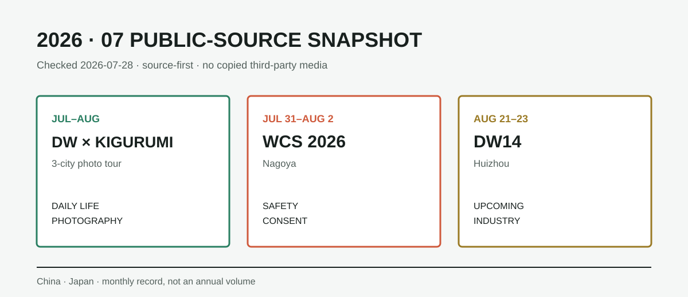

# July 2026 Kigurumi Public-Source Digest

> This is a monthly collection page, not the final 2026 annual chronicle. Research is current through **July 28, 2026 (Asia/Shanghai)**.

**July 28 review:** All four official sources on this page remain reachable. After de-duplication, no new item warrants a separate record and no announced event has enough evidence to be marked completed.

## Verified nodes

| Date / status | Region | Domain | Record |
| --- | --- | --- | --- |
| July–August / ongoing | Shenzhen, Chengdu, Shanghai | Daily life, photography | Doll Weekend × KIGURUMI summer photo-party tour |
| July 31–August 2 / upcoming | Nagoya, Japan | Education, etiquette, safety | WCS 2026 participation, photography, full-face costume, and heat-risk rules |
| August 21–23 / recruiting | Huizhou, China | Chronicle, industry, preview | Doll Weekend 14, a cocktail-party-themed event with domestic and overseas ticketing |

### Doll Weekend × KIGURUMI

The organizer marks the three-city photo party as ongoing in July–August and publishes a gallery and free registration entry.[^dwkig] The archive links the original gallery instead of copying third-party photographs.

### WCS 2026 rules

WCS runs July 31–August 2 in Nagoya and lists 41 participating countries and regions.[^wcs2026] Its current rules are directly relevant to full-head costumes:[^wcs-rules]

- mascot suits that pose a heat-exhaustion risk may be restricted;
- full-face masks, helmets, and mascot suits may enter a specified venue, but staff may verify identity;
- photography without consent is prohibited;
- online or print publication requires the subject's permission;
- poses, handshakes, and two-person photographs also require consent;
- changing in public restrooms is prohibited.

### Doll Weekend 14 preview

The organizer schedules DW14 for August 21–23 in Huizhou, with a cocktail-party theme, separate domestic and overseas ticket paths, and exhibitor applications.[^dw14] It remains an announcement as of the research cutoff.

## Domain gaps and de-duplication

No independently verifiable July maker tutorial or new academic paper directly focused on animegao kigurumi was found, so the craft and academic fields remain empty. Completed 2022–2025 material is not repeated. Announcements, galleries, and follow-ups from one organizer remain a single evolving entry.

## Sources

[^dwkig]: Doll Weekend, “Doll Weekend × KIGURUMI Summer Photo Party,” <https://dollweekend.cn/cn/event/dwkigurumi>
[^wcs2026]: World Cosplay Summit, “World Cosplay Summit 2026,” <https://www.worldcosplaysummit.jp/en>
[^wcs-rules]: World Cosplay Summit, “Participation Rules,” <https://www.worldcosplaysummit.jp/en/cosplay/rules>
[^dw14]: Doll Weekend, “Doll Weekend 14,” <https://dollweekend.cn/cn/event/dw14>
