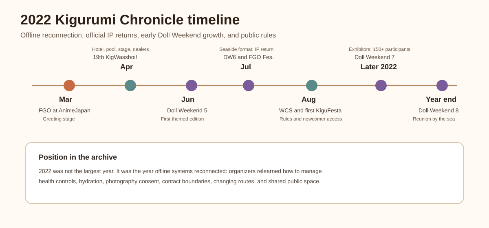
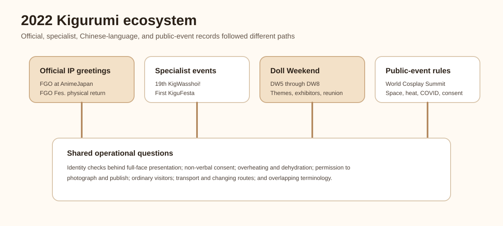
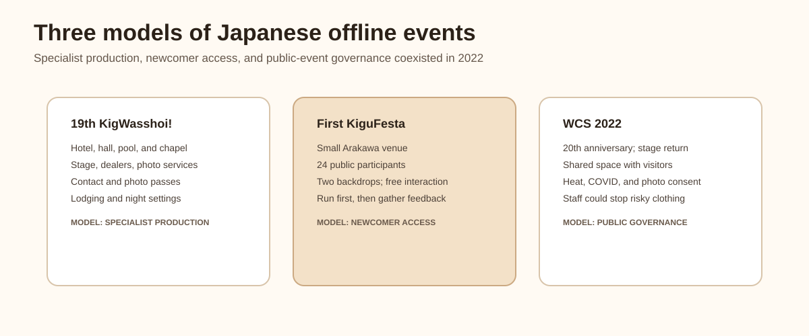
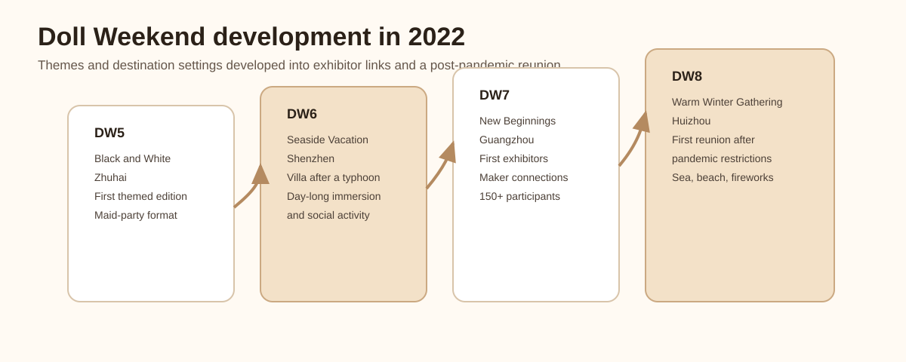
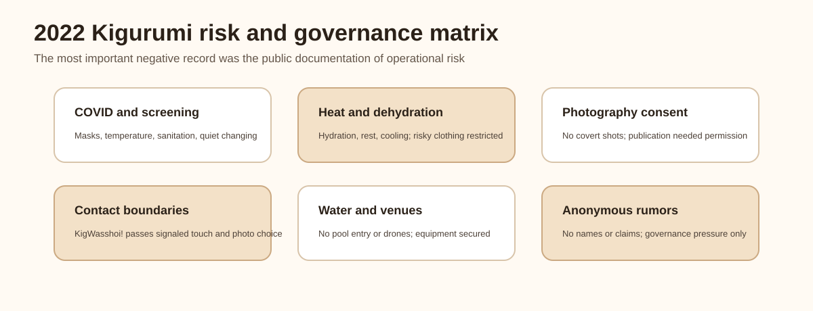
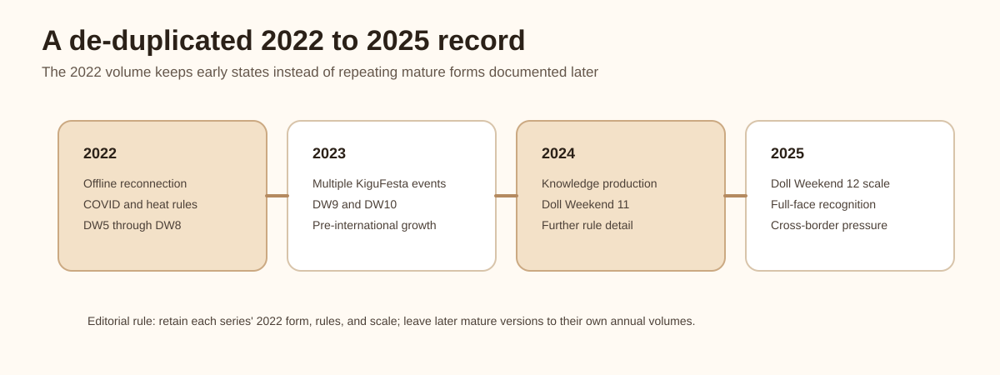

# 2022 Kigurumi Chronicle

> Editorial scope: This volume follows the structure established by the 2025, 2024, and 2023 chronicles without repeating later editions of the same events, later rule changes, or later industry growth. It records a series only when its 2022 edition provides an independent event, early rule set, early scale, offline restart, or other material change.

---

## 0. Scope, de-duplication, and confidence

This volume uses **kigurumi** in the same broad but separated sense as the later chronicles: animegao kigurumi and mask-based character performance; doller and the Chinese-language "娃 / Kig / Kiger" scene; official IP mascot-style greetings; and rules at large cosplay events that directly affect full-head costumes, public-space access, heat risk, photography, or physical contact.

The 2022 record is more fragmented than the 2023–2025 record. Official event pages, organizer archives, venue rules, and on-site media reports take priority. Public video indexes may support a publication date or show that an event circulated publicly, but they do not replace the organizer's account. Anonymous forums are not used to establish allegations or identify people.

| De-duplication case | Treatment in this volume |
| --- | --- |
| A series continued in 2023–2025 | Record only its distinct 2022 edition, early rules, and contemporary scale |
| Terminology already explained in the 2025 volume | Keep only the distinctions needed to read the 2022 record |
| FGO or other official greetings continued later | Record only the AnimeJapan and FGO Fes. 2022 nodes |
| WCS later expanded full-face and heat rules | Record the 2022 return to a physical stage and that year's rules |
| Doll Weekend later reached DW9–DW12 | Record only DW5–DW8 and their 2022 development |
| Later editions of 着ぐFesta added more formal rules | Record the low-barrier first edition held in 2022 |
| Anonymous allegations | Record only the existence of governance pressure, never the allegation as fact |

## 1. The year's overall arc

The defining feature of 2022 was not explosive growth but **offline reconnection**. Events that had been canceled, reduced, postponed, reservation-only, or moved online during 2020–2021 began reopening physical venues. Organizers had to place existing kigurumi concerns, including limited vision, ventilation, assistance, contact, photography, and changing space, inside new public-health controls.

Five threads are visible in the surviving public record:

1. Japan's specialist scene rebuilt complex in-person formats. The 19th キグルミwasshoi! used a hotel hall, lounge, poolside, chapel, stage, dealer area, photography services, and lodging while publishing detailed consent and venue rules.[[S3]](#s3)
2. Lower-barrier gatherings appeared. The first 着ぐFesta invited people to attend without advance booking and treated the event as a way to learn what participants wanted from future editions.[[S8]](#s8)
3. Official IP characters returned to major public venues. FGO scheduled a cosplayer and kigurumi greeting stage at AnimeJapan and used six official kigurumi at FGO Fes. 2022.[[S1]](#s1)[[S2]](#s2)
4. World Cosplay Summit returned its championship to a physical stage while retaining COVID, heat, photography, and public-space controls.[[S4]](#s4)[[S5]](#s5)[[S6]](#s6)[[S7]](#s7)
5. Doll Weekend moved from its first themed edition through a seaside format, exhibitor participation, and a post-lockdown reunion across DW5–DW8.[[S9]](#s9)[[S10]](#s10)[[S11]](#s11)[[S12]](#s12)[[S13]](#s13)

In short, 2022 reconnected many of the systems that later became larger: specialist venues, newcomer access, official greetings, public-event governance, themed gatherings, and maker-to-participant links.

## 2. 2022 chronology

### January–February: reopening remained conditional

The year began with uncertainty. A kigurumi participant typically needs more changing-room time, larger luggage, rest space, cooling, and sometimes an assistant. Full-head presentation also complicates identity checks, mask use, temperature screening, and emergency response.

The surviving event pages therefore do not describe a simple return to pre-pandemic practice. キグルミwasshoi! published infection-control information; the first 着ぐFesta explicitly linked its creation to events gradually resuming; and WCS required symptomatic or exposed participants to stay away, used temperature screening, restricted conversation in changing rooms, and retained mask and distancing measures.[[S3]](#s3)[[S7]](#s7)[[S8]](#s8)

### March 26–27: FGO at AnimeJapan 2022

AnimeJapan 2022 took place at Tokyo Big Sight on March 26–27. The official Fate/Grand Order page placed the FGO booth in East Hall 3 and listed a "cosplayer / kigurumi greeting stage," alongside the March 27 FGO special stage.[[S1]](#s1)

This was an official IP operation, not an animegao fan gathering. Even so, its return mattered to the wider public vocabulary of kigurumi: visitors again encountered two-dimensional characters as moving, photographable bodies in a major commercial anime exhibition. The 2022 node is recorded here without repeating the different character lineups and booth arrangements of later AnimeJapan editions.

### April 9–10: the 19th キグルミwasshoi!

The 19th キグルミwasshoi! was held at Hotel East 21 Tokyo on April 9–10. Its official page described East 21 Hall, the Panorama cocktail lounge, a night pool for hotel guests, the garden pool, a paid chapel area, stage programs, a photo contest, maker exhibits, photography services, and lodging-related arrangements.[[S3]](#s3)

The event is historically important because its rules show what a complex hotel-based kigurumi gathering required in 2022:

- visual passes communicated whether a participant allowed touch or photography;
- photographers needed consent before shooting and again before publishing;
- changing rooms and restrooms were no-photography areas;
- participants could not monopolize locations or request inappropriate poses;
- entering the water and operating drones were prohibited;
- lighting equipment near the pool required fall prevention;
- ordinary hotel guests and non-event public areas had to remain undisturbed;
- clothing, props, footwear, and conduct could not create exposure, danger, or venue damage.

These rules turned difficult non-verbal boundaries into visible event infrastructure. They also separated an attractive poolside setting from permission to enter the water, an important safety distinction for limited-vision, absorbent, or heavy costumes.

### Early June: Doll Weekend 5, "Black and White Concerto"

The Doll Weekend archive describes DW5 in Zhuhai as its first themed event, built around a black-and-white maid party. A related Bilibili video was published on June 6, 2022; that is evidence of public circulation, not necessarily the exact event date.[[S9]](#s9)[[S10]](#s10)[[S14]](#s14)

DW5 matters because it introduced a shared visual and social frame rather than merely placing many unrelated characters in one venue. Theme, costume palette, group photographs, and party ritual gave participants a common narrative. Later Doll Weekend editions became much larger, but this volume keeps the historical focus on the first themed experiment.

### Late July: Doll Weekend 6, "Seaside Vacation"

The official archive places DW6 in Shenzhen and describes a seaside-villa holiday after a typhoon, with day-long character immersion and social activity. A related public video was released on July 27, 2022, so the exact event date remains less certain than the publication date.[[S9]](#s9)[[S11]](#s11)[[S15]](#s15)

The seaside format expanded both creative possibility and operational risk. Longer character time, wind, humidity, heat, wet surfaces, hair stability, equipment transport, rest breaks, and cooling all mattered more than they would in a single indoor hall. DW6 is therefore recorded as an early environment-led event, not as a precursor inflated to the scale of later Doll Weekends.

### July 30–31: FGO Fes. 2022, 7th Anniversary

FGO Fes. 2022 was held at Makuhari Messe on July 30–31. Inside Games described it as the first physical FGO anniversary event in roughly three years. At the welcome gate, nine official cosplayers and six kigurumi greeted visitors amid a large screen, red carpet, music, and a globe-shaped stage element.[[S2]](#s2)

The report identified the kigurumi as the female protagonist, Altera, Mash, Jeanne d'Arc, Saber, and Leonardo da Vinci. Their role was distinct from the official cosplayers but part of the same embodied welcome. This node demonstrates why physical presence remained useful to IP operations: waving, walking, greeting, and group photography cannot be reproduced by a stream or display alone.

### August 5–7: World Cosplay Summit 2022

WCS 2022 marked the event's twentieth anniversary. Its Stage Division page described the World Cosplay Championship as returning to a physical stage for the first time in about three years, although international travel restrictions still limited which teams could attend in Japan.[[S4]](#s4)

The accompanying rules are directly relevant to kigurumi:

- public event areas were not treated as completely closed cosplay spaces;
- photography and publication required the subject's consent;
- low-angle or exposure-oriented photography was prohibited;
- participants were told to hydrate, rest, and respond early to heat symptoms;
- staff could stop costumes likely to cause serious dehydration;
- COVID controls remained in place for entry and changing rooms.[[S5]](#s5)[[S6]](#s6)[[S7]](#s7)

The historical significance is institutional. In 2022, offline return was inseparable from heat management, consent, public-space awareness, and health controls.

### August 6: the first 着ぐFesta

The first 着ぐFesta was held on August 6 at GarageStudioC7. Its TwiPla page recorded 24 participants and described an event that could be joined without advance reservation. The whole floor was reserved, with black and white photo backgrounds, changing and cloak space, and free-form interaction rather than a dense program.[[S8]](#s8)

The organizer also presented the event as a learning exercise for future services. Later editions developed more formal rules and activities; those changes belong to later annual volumes. The 2022 record is the first, deliberately lightweight entry point.

### Second half of 2022: Doll Weekend 7, "Connecting New Beginnings"

The official Doll Weekend archive places DW7 in Guangzhou, reports more than 150 participants, and identifies it as the first edition to include exhibitor partners.[[S9]](#s9)[[S12]](#s12)

Exhibitor participation connected gatherings with a supply chain of masks, bodysuits, wigs, costumes, eye parts, footwear, padding, photography, storage, and transport. The event is recorded here because that link was a material 2022 change, not because later commercial growth should be projected backward onto it.

### End of 2022: Doll Weekend 8, "Warm Winter Gathering"

The official page places DW8 in Huizhou and describes it as the first reunion after emerging from the pandemic's shadow, centered on the beach, sea, and fireworks.[[S9]](#s9)[[S13]](#s13)

DW8 closes the year's Doll Weekend arc emotionally: DW5 introduced a shared theme, DW6 expanded into a seaside holiday, DW7 added exhibitors and passed 150 participants, and DW8 framed gathering itself as the central event. The archive does not infer private attendance details from photographs or social posts.

### Anonymous rumor spaces: governance pressure, not evidence

An anonymous 5ch thread active in 2022 shows that reputational disputes and observation threads existed around the scene.[[S16]](#s16) It is retained only as low-confidence evidence that such a discussion space existed. No allegation, identity claim, or personal name from the thread is reproduced as fact.

## 3. Organizations and settings

### キグルミwasshoi! and its organizer network

The 19th edition represents a specialist, hotel-based model with multiple photo settings, lodging, stage content, dealers, and consent infrastructure.[[S3]](#s3)

### GarageStudioC7 and 着ぐFesta

The first 着ぐFesta represents a smaller, low-barrier model designed around free interaction, basic photography, and participant feedback.[[S8]](#s8)

### FGO PROJECT, AnimeJapan, and FGO Fes.

These official IP settings used kigurumi as part of licensed venue operation, scheduled greeting, and audience welcome rather than as independent fan practice.[[S1]](#s1)[[S2]](#s2)

### World Cosplay Summit

WCS represents the large public-event model in which kigurumi-relevant conduct is governed through general rules for heat, photography, changing rooms, masks, and shared urban space.[[S4]](#s4)[[S5]](#s5)[[S6]](#s6)[[S7]](#s7)

### Doll Weekend and the Chinese-language "娃 / Kig / Kiger" scene

DW5–DW8 show a progression from a first shared theme to a destination format, exhibitor links, larger participation, and a reunion narrative.[[S9]](#s9)[[S10]](#s10)[[S11]](#s11)[[S12]](#s12)[[S13]](#s13)

## 4. Positive developments

### 1. Physical events reopened

FGO Fes. and the WCS championship returned to physical venues after roughly three years, while the first 着ぐFesta answered demand for an easy-to-join gathering.[[S2]](#s2)[[S4]](#s4)[[S8]](#s8)

### 2. Specialist organizers could still operate complex spaces

キグルミwasshoi! combined multiple hotel settings and services without treating consent, public access, or venue safety as afterthoughts.[[S3]](#s3)

### 3. A lower-barrier newcomer route appeared

The first 着ぐFesta deliberately limited program complexity and used participant feedback to shape later editions.[[S8]](#s8)

### 4. Doll Weekend became more thematic and connected

DW5–DW8 demonstrate theme design, environmental staging, exhibitor participation, and an event identity that was more structured than an informal meetup.[[S9]](#s9)[[S10]](#s10)[[S11]](#s11)[[S12]](#s12)[[S13]](#s13)

### 5. Official IP kept kigurumi publicly visible

AnimeJapan and FGO Fes. placed licensed kigurumi in mainstream anime-event contexts at a time when physical fan experiences were returning.[[S1]](#s1)[[S2]](#s2)

## 5. Risks and negative pressures

### 1. COVID still shaped participation

Entry screening, masks, distancing, changing-room silence, and illness exclusions meant offline return remained conditional.[[S7]](#s7)

### 2. Heat and dehydration were explicit hazards

WCS warned that staff could stop clothing likely to cause serious dehydration. This concern is amplified by full-head costumes and limited ventilation.[[S6]](#s6)

### 3. Photography required consent

Both specialist and public-event rules rejected the idea that attendance automatically authorized photography or publication.[[S3]](#s3)[[S5]](#s5)

### 4. Contact boundaries needed visible tools

The pass system at キグルミwasshoi! is an early example of converting a hard-to-communicate boundary into an event-readable signal.[[S3]](#s3)

### 5. Pools, beaches, and night settings increased risk

The hotel event prohibited entering the water and regulated equipment near the pool. Seaside Doll Weekend formats also made footing, weather, cooling, and assistance more important.[[S3]](#s3)[[S11]](#s11)[[S13]](#s13)

### 6. Anonymous discussion could not establish facts

The existence of an anonymous thread shows governance pressure, but its claims cannot meet the archive's standard for identity or wrongdoing.[[S16]](#s16)

## 6. Interpretive notes

### Official mascot greetings and animegao kigurumi diverged

Official FGO kigurumi were licensed, scheduled parts of an IP event. Animegao and doller activity was participant- or community-led. Both shaped public understanding, but they should not be collapsed into one organizational practice.[[S1]](#s1)[[S2]](#s2)

### Consent became infrastructure

Passes, pre-photography permission, publication permission, and interaction rules show consent moving from informal courtesy into explicit event governance.[[S3]](#s3)[[S5]](#s5)

### Three Japanese event models coexisted

The hotel specialist event, the large public summit, and the low-barrier studio meetup served different needs: production depth, public visibility, and newcomer access.[[S3]](#s3)[[S4]](#s4)[[S8]](#s8)

### Doll Weekend did not become large overnight

The 2022 editions show incremental development through themes, locations, exhibitors, participant scale, and post-pandemic reunion. Later growth should not be rewritten as if it already existed at DW5.[[S9]](#s9)[[S10]](#s10)[[S11]](#s11)[[S12]](#s12)[[S13]](#s13)

## 7. Cross-year de-duplication index

| Series or subject | Retained in the 2022 volume | Left to later volumes |
| --- | --- | --- |
| FGO official greetings | AnimeJapan 2022 and FGO Fes. physical return | Later character lineups and booth formats |
| キグルミwasshoi! | The 19th edition's hotel model and rules | Later editions and later organizer changes |
| World Cosplay Summit | Physical-stage return and 2022 health, heat, and photography rules | Later full-face refinements and updated venue rules |
| 着ぐFesta | The first, 24-person, no-reservation edition | Later workshops, trials, dealers, and expanded conduct rules |
| Doll Weekend | DW5–DW8 themes, seaside format, exhibitors, and reunion | DW9–DW12 scale, internationalization, and later production |
| Rumor and harassment | Governance pressure only | No anonymous allegation is promoted in any volume |

This separation prevents mature 2023–2025 systems from being projected backward. The value of 2022 is the rebuilding of venues, rules, and social connection under unstable conditions.

## 8. Conclusion

**Reopening.** FGO Fes. returned to a physical anniversary event, the WCS championship returned to a physical stage, and 着ぐFesta created a lightweight gathering.[[S2]](#s2)[[S4]](#s4)[[S8]](#s8)

**Rules.** Specialist passes, photography permission, heat controls, COVID measures, and public-space restrictions show that reopening depended on explicit boundaries.[[S3]](#s3)[[S5]](#s5)[[S6]](#s6)[[S7]](#s7)

**Themed growth.** DW5–DW8 moved through a first theme, destination immersion, exhibitor links, and a reunion without yet possessing the scale of later editions.[[S9]](#s9)[[S10]](#s10)[[S11]](#s11)[[S12]](#s12)[[S13]](#s13)

**Embodied presence.** Whether at an official FGO gate, a specialist hotel event, WCS, or a Doll Weekend beach setting, kigurumi depended on shared physical space for movement, greeting, photography, endurance, and consent.

2022 was therefore not an empty year. It was a year of post-pandemic reconnection, rewritten rules, renewed themed events, and re-embodied official IP: less spectacular than 2025, but foundational to the years that followed.

## Sources

**[S1] Fate/Grand Order, AnimeJapan 2022 FGO booth and cosplayer / kigurumi greeting-stage announcement.**
<https://news.fate-go.jp/2022/aj2022/>

**[S2] Inside Games, FGO Fes. 2022 on-site report covering the physical-event return, nine official cosplayers, and six kigurumi.**
<https://www.inside-games.jp/article/2022/07/30/139502.html>

**[S3] Official page for the 19th キグルミwasshoi!**
<https://www.wasshoi.kigdoll.net/kigwasshoi19>

**[S4] World Cosplay Summit 2022 Stage Division.**
<https://worldcosplaysummit.jp/2022/en/championship/stagedivision/>

**[S5] World Cosplay Summit 2022 cosplay rules.**
<https://worldcosplaysummit.jp/2022/en/cosplay/rule/>

**[S6] World Cosplay Summit 2022 heatstroke-prevention guidance.**
<https://worldcosplaysummit.jp/2022/en/cosplay/heatstroke/>

**[S7] World Cosplay Summit 2022 COVID-19 safety measures.**
<https://worldcosplaysummit.jp/2022/en/cosplay/covid/>

**[S8] TwiPla, first 着ぐFesta event page (2022).**
<https://twipla.jp/events/519532>

**[S9] Doll Weekend official event archive.**
<https://dollweekend.cn/cn/event/>

**[S10] Doll Weekend 5, "Black and White Concerto."**
<https://dollweekend.cn/cn/event/dw5/>

**[S11] Doll Weekend 6, "Seaside Vacation."**
<https://dollweekend.cn/cn/event/dw6/>

**[S12] Doll Weekend 7, "Connecting New Beginnings."**
<https://dollweekend.cn/cn/event/dw7/>

**[S13] Doll Weekend 8, "Warm Winter Gathering."**
<https://dollweekend.cn/cn/event/dw8/>

**[S14] Bilibili public video index for Doll Weekend 5, published June 6, 2022.**
<https://www.bilibili.com/video/BV1xF411V7nF/>

**[S15] Bilibili public video index for Doll Weekend 6, published July 27, 2022.**
<https://www.bilibili.com/video/BV1Ra411K7ss/>

**[S16] 5ch anonymous thread index, retained only as low-confidence evidence that an anonymous discussion space existed.**
<https://egg.5ch.net/test/read.cgi/twwatch/1656382510/>
