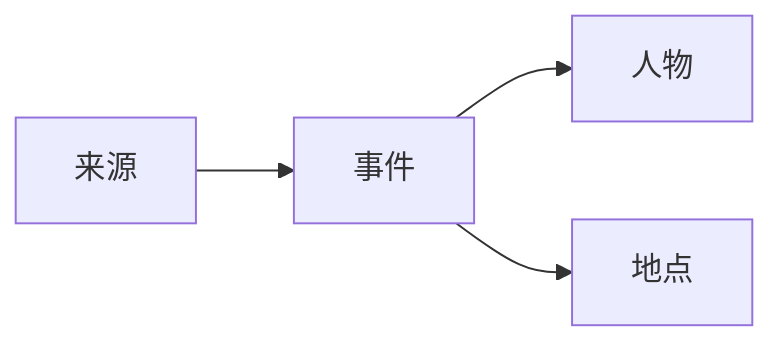

# 写作指南

## 基础格式

```markdown
# 一级标题

正文段落。

## 二级标题

- 列表
- 列表

| 字段 | 内容 |
| --- | --- |
| 时间 | 1949-10-01 |
```

## 图片

把图片放进 `docs/assets/images/`，然后引用：

```markdown

```

## 提示块

!!! note "考证说明"
    这里写材料来源、异文、年代争议或待核问题。

!!! warning "待核"
    这条材料只有单一来源，后续需要查档案。

## 分栏标签

=== "旧志记载"

    这里放旧志原文摘录或节录。

=== "今人考证"

    这里放现代研究、访谈和校注。

## Mermaid 图



