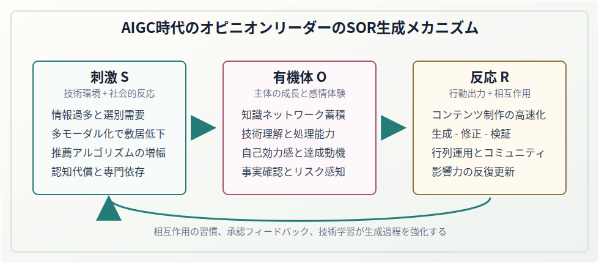
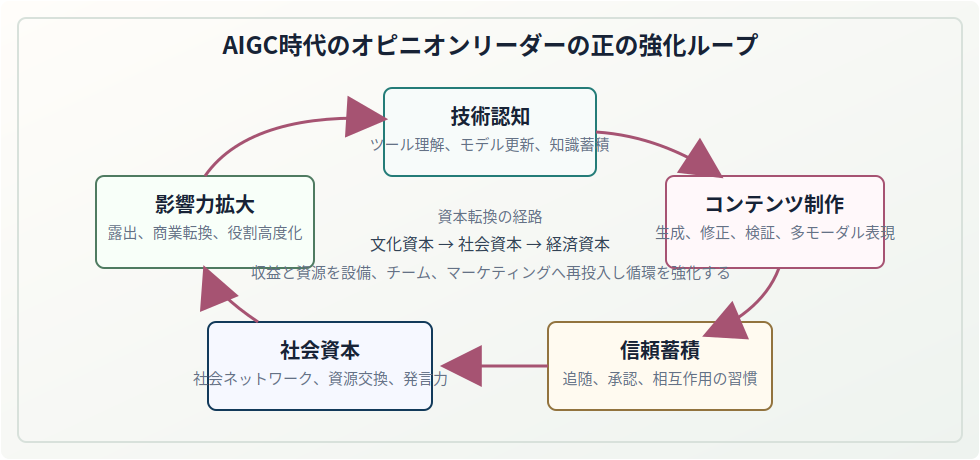

# 「AIGC時代のオピニオンリーダー生成メカニズムと動向・課題」

!!! note "資料の性格"
    本ページは PDF「AIGC 时代意见领袖生成机理与趋势挑战」に基づき、論文本文、著者名、要旨、キーワード、研究助成、参考文献を整理し、原論文の構成に沿って掲載しています。ページ内の SVG 図は当サイトによる読解補助図であり、原論文の図版ではありません。

| 項目 | 内容 |
| --- | --- |
| 原題 | AIGC 时代意见领袖生成机理与趋势挑战 |
| 日本語題 | AIGC時代のオピニオンリーダー生成メカニズムと動向・課題 |
| 著者 | 蔡聖涵、魏徳毓 |
| 所属 | 福州大学 人文社会科学学院、福建 福州 350000 |
| 掲載情報 | 『寧徳師範学院学報（哲学社会科学版）』2026 年第 1 期、通巻 156 期 |
| 論文番号 | 2095-3682（2026）01-0071-05 |
| 中国図書分類号 | G206 |
| 文献識別コード | A |
| 受理日 | 2025-10-10 |
| 研究助成 | 福建省教育庁社会科学研究プロジェクト（GY-J-21185） |
| 責任編集 | 何海菊 |
| 本ページでの処理 | 原論文の構成に沿って本文を整理し、読解補助図を追加 |

## 論文署名

**AIGC 时代意见领袖生成机理与趋势挑战**

蔡聖涵　魏徳毓

（福州大学 人文社会科学学院，福建 福州 350000）

## 要旨

要旨：人工知能がめざましく発展する今日、新技術の影響は人々の学習、生活、仕事の各方面に及んでいる。生成式人工知能を代表とする AI 技術は、映像・音声制作、画像生成、テキスト編集などの面で高い利便性、適用性、革新性を示しており、オピニオンリーダーのコンテンツ生産と伝播方式にも、かつてない深い影響を与えている。ネットワーク伝播とポスト真実の時代において、オピニオンリーダーは情報の伝達者、意見の解釈者であるだけでなく、世論の誘導者、多元文化の開拓者、革新技術の普及者、ネットワーク・コミュニティの管理者など複数の役割を担う。本稿は、相互作用、承認、反復、加速をキーワードとして、SOR 理論の視角から AIGC 時代のオピニオンリーダーの生成メカニズムを深く検討し、その新たな役割と特徴を明らかにし、新技術の背景における形成過程、転換、発展動向および課題への対応策を論じ、AIGC 時代における専門型オピニオンリーダーの生成と育成に科学的な指針を提供する。

キーワード：SOR 理論；オピニオンリーダー；生成メカニズム；動向と課題

中国図書分類号：G206　　文献識別コード：A　　論文番号：2095-3682（2026）01-0071-05

## 本文

AIGC（Artificial Intelligence Generated Content）は中国語で「人工知能生成式コンテンツ」と訳され、「生成式人工知能」とも呼ばれる。「オピニオンリーダー」という概念は、アメリカの社会学者ラザースフェルドとその同僚がアメリカ大統領選挙を研究した際に最初に提示したものである。その研究によれば、オピニオンリーダーは環境からもたらされる情報を受け取り、解構し、受け手に信頼と感情的満足をもたらし、受け手との相互作用を引きつけ、その熱量を持続的に喚起し、受け手に一定の反応を促すことができる。AIGC 時代に入ると、AIGC 時代のオピニオンリーダーとは、AIGC 技術を用い、インターネット上のソーシャルメディア・プラットフォームを拠点として、人間と機械を結合し、モデル化・流れ作業化された方式でコンテンツ創作と情報伝播を行い、フォロワー集団を構築し、受け手の意思決定と行動に影響を与える人を指す。ひいては社会の世論や受け手の価値観にも無視できない影響を及ぼす。要するに、AIGC 時代のオピニオンリーダーの進化モデルはより複雑で、役割はより多元的となり、影響力もより広範になっている[1]。したがって、AIGC 時代のオピニオンリーダーの生成メカニズムを正確に把握し、新技術の背景における転換的特徴、新たな役割、今後の発展動向を明らかにすることには重要な現実的意義がある。

## 一、相互作用：オピニオンリーダーの誕生と SOR 理論の適合

### （一）SOR 理論とその内包

SOR 理論、すなわち刺激—有機体—反応（Stimulus-Organism-Response）理論は、心理学および行動科学の理論であり、個体が外部刺激にどのように反応するかを説明するためによく用いられる。学問分野間の交差と融合に伴い、SOR 理論は心理学以外の多くの分野にも広く応用され、多様な文脈の中で次第に細分化され、精緻化されてきた。現在、SOR 理論の研究と応用は、主としてマーケティング、基層治理、人材管理、メディア伝播など特定の背景やテーマに立脚し、特定集団に焦点を当て、その背景やテーマの下で当該集団をめぐる個体・社会現象・問題に注目し、影響要因や指標を分析し、示唆、解決策、対策を提示する形で展開されている[2]。SOR 理論は人間行動を分析するメタ理論的パラダイムとして、一般的な行動発生過程を外部刺激（Stimulus）→個体の内的状態（Organism）→行動反応（Response）へ分解し、刺激が有機体の知覚・認知過程を通じてどのように内部の心理表象へ転換され、それらの心理表象がさらに個体の感情反応を誘発し、最終的に行動反応をもたらすのかを説明する。

### （二）AIGC 時代のオピニオンリーダーの特徴

AIGC 時代の背景下で、オピニオンリーダーは世論生態における重要な結節点である。コンテンツ創作においては、従来の「人的経験」モデルから「技術・データ」駆動モデルへ転換し、受け手の独自の需要と嗜好をより精確に満たし、オピニオンリーダーのコンテンツ生産効率をより効果的に高め、より幅広い創作選択肢と創意ある文案を提供する。コンテンツ伝播においては、従来の「通常メディア」モデルから「多様な形態のクロスプラットフォーム」モデルへ移行する。多様な表現形式はコンテンツをより目を引くものにし、ビッグデータ・アルゴリズムはオピニオンリーダーが発信した最新コンテンツを、それに最も関心を持ちそうな受け手集団へ適時に届け、閲覧滞在時間を延ばし、到達率、完視聴率、参加度を高める。相互作用の方式においては、従来の「一対多」の一方向伝達モデルから「多対多」の多方向カスタマイズモデルへ転換し、より多様で個別化された相互作用が可能になる。このリアルタイムで深い相互作用によって、オピニオンリーダーは受け手の需要やコミュニティ関係の変化をよりよく理解し、伝播戦略と相互作用方式を適時に調整し、自らの影響力と競争力を維持できる。

### （三）オピニオンリーダー生成メカニズムと SOR 理論の適合

受け手とオピニオンリーダーを結びつける核心は相互作用行動にある。相互作用を通じて、オピニオンリーダーが受け手を刺激し、惹きつける要素は、良質なコンテンツや参考可能な提案を提供することに限られず、積極的な相互作用の方式、方法、経路を提供し、相互作用の習慣を形成させることにもある。高度な相互作用性は、オピニオンリーダーが信頼感と影響力を蓄積するための重要条件であり、受け手が相互作用の習慣を形成するための重要な支えでもある。中国では、掲示板、微博、豆瓣などのコミュニティ型話題プラットフォーム、また抖音、Bilibili、快手などの短動画プラットフォームにおいて、ユーザー特性、コンテンツ形式、相互作用メカニズムが異なるため、オピニオンリーダーの伝播戦略も異なる。しかし相互作用の場面では、オピニオンリーダーの高い社会的活動性、継続的共有という行動特性、専門知識の蓄積が、受け手を惹きつけ長期的な相互作用を維持する感情的動因、行動的動因、内容的動因を共同で構成する。これらの動因は相互作用を強化する過程で相互作用の習慣へ転化する。オピニオンリーダーの生成、発展、成熟、昇華は相互作用行動と密接に関わっており、より正確には相互作用の習慣と顕著な関連を持つ。相互作用行動が頻繁であるほど、技術知識の学習と蓄積は増え、情報の解構と還元はより精確になり、交互作用の方式と内容の革新性・信頼性は強まり、相互作用を維持する動因も人々の心により深く入り、その相互作用習慣はより深く内面化される。したがって、オピニオンリーダーと受け手が共有する相互作用行動において、相互作用習慣の影響は、SOR 理論が描く個体が作用を受ける論理と高度に適合する。ゆえに SOR 理論はオピニオンリーダー生成メカニズムに研究の理論枠組みを提供し、特に個体行動の触発メカニズムを説明するうえで学理上の優位性と重要な役割を持つ[3]。

## 二、承認：AIGC オピニオンリーダーの SOR 生成メカニズム

SOR 理論の枠組みに基づけば、AIGC 時代のオピニオンリーダー生成メカニズムは、刺激、有機体、反応という三つの次元から出発し、技術+環境フィードバック（S）、主体の成長（O）、行動出力+相互作用（R）という三つの層に細分できる。そしてかなり大きな程度で他の個体や集団に影響し、他者の承認と認可を獲得する。

**当サイト補助図 1：AIGC オピニオンリーダーの SOR 生成メカニズム（原論文の図ではありません）**

### （一）刺激（Stimulus）層

それは、技術環境の駆動と社会環境のフィードバックによる需要変化の重なりとして現れる。第一に、AIGC によって日々生成されるコンテンツ量は数十億件に達し、受け手は情報選択の困難に直面する。この情報爆発と情報過負荷に対する選別需要が、核心的な外部刺激源となる。第二に、多モーダルな人工知能 AI 生成ツールは創作の敷居を大きく下げ、さらに技術が伝播領域に力を与える。たとえばインテリジェント推薦アルゴリズムは伝播・配信経路を精確かつ迅速にし、一部のソーシャルプラットフォームの閲覧量と訪問量を急増させ、巨大な規模刺激効果を形成する。第三に、認知代償の心理的影響を受け、一般ユーザーは AIGC 技術に一定の認知上の盲点を持ち、専門的解説者への依存需要を生む。技術的複雑度を持つオピニオンリーダーにも、より高い承認と嗜好が示され、影響力向上の目標刺激が形成される。第四に、AIGC 技術に触れ、その作動原理を理解した一般ユーザーの社会的メカニズムと相互作用モデルは、AIGC 技術の影響を内面化し、周囲の環境にも AIGC 技術の影響と刺激をもたらす。第五に、AIGC 技術の支えにより、ソーシャルメディア上の相互作用は高データ、高強度、高応答を示し、一般ユーザーはますます AIGC 技術に依拠して相互作用に参加し、相互作用を維持し、相互作用へ溶け込み、深い相互作用への常態的承認を形成する[4]。

### （二）有機体（Organism）層

それは、AIGC オピニオンリーダー自身の個体認知の向上と、継続的に得られる感情体験として現れる。第一に、専門的認知システムの構築において、AIGC オピニオンリーダーは知識グラフの次元で比較的豊かな知識ネットワークを蓄積し、AIGC 技術に関する原理を熟知し把握できる。その技術理解の深さと情報処理能力は、他の一般ユーザーを大きく上回る。克労鋭（TopKlout）が発表した「2024 年中国 AIGC 応用シーンおよび商業的潜在力研究報告」によれば、トップ層のオピニオンリーダーの AIGC ツール使用率は 92% に達し、日平均の情報処理量は一般ユーザーの 7.2 倍に達する。第二に、AIGC オピニオンリーダーの感情的駆動は、主に技術を掌握することで得られる自己効力感と達成動機に由来する。マズローの欲求階層理論における尊重欲求と自己実現欲求によれば、トップ層のオピニオンリーダーの大多数は比較的強い利他的傾向と知識共有意欲を示し、社会的承認という高次の欲求を実現しようとする。第三に、AIGC を熟練して扱うオピニオンリーダーは、事実確認、論理推論、技術検証などを含む多層的なコンテンツ検証・校核メカニズムを段階的に構築していく。そのリスク感知能力はより強く、生成・公開するコンテンツは正確性などの面でより厳密かつ信頼できるものとなり、ユーザーと受け手からの承認を獲得する[5]。

### （三）反応（Response）層

それは、AIGC オピニオンリーダーの影響力生成に関わる行動モデルとして現れる。第一に、コンテンツ生産の面では、主としてコンテンツ生成、視覚化表現、多モーダル編集などのインテリジェントなツールチェーンを統合し、コンテンツ生産周期を継続的に圧縮し、応答速度を高める。同時に、コンテンツ品質の面では、AIGC の「生成—修正—検証」という三段階フィルタリングメカニズムと体系的優位性を示す。第二に、AIGC の特徴を持つ社会的伝播戦略を形成する。たとえば、プラットフォーム行列運用では、通常、主プラットフォームに複数の補助プラットフォームを加えた組み合わせ戦略が採用される。インタラクティブな設計では、「知識カプセル」制作モデル、すなわち短時間の核心的知識点による「目を引く閃き」と、深い解析を含む段階的解説番組などが用いられる。コミュニティ化運営では、「1% の中核参加者、9% のアクティブユーザー、90% の一般受け手」というピラミッド型ファンコミュニティ構造が構築される。第三に、影響力の反復メカニズムには、技術感度、フィードバック分析システム、個人 IP の進化などが含まれる。宗輝ブランド IP 実践コラムが 2025 年 4 月に明らかにしたところによれば、AIGC オピニオンリーダーの信頼度スコアは 4.7/5（満点 5 点）に達し、具体的には平均 45 日ごとに Stable Diffusion モデルの反復更新を追跡し、平均 6 か月ごとに個人 IP の知識体系を更新し、Socialbakers などのツールを用いて伝播効果の帰因分析を行うことで、専門性における承認を維持している[6]。

## 三、反復：AIGC オピニオンリーダーの SOR 強化ループ

**当サイト補助図 2：AIGC オピニオンリーダーの正の強化ループ（原論文の図ではありません）**

### （一）複合能力体系と複数役割への転換

SOR 生成メカニズムは、AIGC 技術の反復が加速する環境下で、AIGC オピニオンリーダーが技術刺激（S）→認知システム構築（O）→専門化されたコンテンツ生産（R）という持続的な学習・成長メカニズムを通じて、「技術認知—コンテンツ生産—信頼蓄積」の複合能力体系を段階的に構築することを示している。AIGC オピニオンリーダーの多くは AIGC 技術の早期注目者であり、業界創作の突破者である。彼らは新たに生まれる技術とその応用範囲に常に注目し、先進的なアルゴリズムとデータ分析ツールを利用して、受け手の需要と関心点をより正確に把握し、価値があり高品質な情報をより効率的に選別・統合・伝播し、新しいコンテンツ形式と伝播方式を不断に探索する。受け手とより緊密な関係を築き、中核的フォロワーと一般受け手にそれぞれ適合するコンテンツサービスを提供し、受け手の個別化された需要をよりよく満たすことで、情報転送者から価値統合者、意見の精確な伝導者、技術革新者など複数の役割へ転換していく[7]。

### （二）資本転換と社会的影響力

ピエール・ブルデューの文化資本理論によれば、社会関係ネットワークの中に置かれた個体が活動中に獲得し交換する支援と資源は、「文化資本」「社会資本」「経済資本」という三種類に抽象化できる。文化資本（Cultural Capital）とは、個人が有する文化的素養、知識蓄積、専門技能、審美能力、関連する教育的蓄積である。社会資本（Social Capital）とは、社会ネットワークを通じて蓄積される人間関係、信頼資源、関連する社会資源などである。経済資本（Economic Capital）とは、実際の資金の流れであり、仕事上の収入、自らの技能優位と余暇時間を活用して追加的に得る収入を含む。ブルデューの文化資本理論は、異なる資本が相互に転換される可能性を分析している。これは、オピニオンリーダーが自らの優位性を借り、受け手に持続的に影響し、距離を縮め、相互作用を深めることで、受け手とより緊密なつながりを徐々に構築し、役割の高度化と資本転換を実現し、さらに自らの影響力を持続的に高められることを意味する。

### （三）AIGC オピニオンリーダー生成メカニズムに基づく正の強化ループ

SOR 生成メカニズムは、AIGC オピニオンリーダーに、受け手の追随度を高める（S′）→社会資本を強化する（O′）→影響力を拡大する（R′）という、資本転換と社会的影響力向上の経路を形成させる。オピニオンリーダーと「ファン」との相互作用は、単なる感情的接続の過程ではなく、社会資本の蓄積過程でもある。オピニオンリーダーの AIGC 技術使用の熟練度と創意性は、作品の創作内容、技術含有量、創意水準に直接反映され、オピニオンリーダーのコンテンツ創作力と世論影響力に大きく作用する。AIGC 技術含有量の高い作品は、ユーザーを惹きつけ、距離を縮め、マーケティングによる利益追求を核心的導向とするソーシャルメディア・プラットフォーム運営の下で、AIGC オピニオンリーダーにより多くの露出機会とトラフィック支援をもたらし、より多くの注目度と影響力を蓄積させ、より高い発言権と影響力を付与する。これにより、彼らは社会資本の範疇における「無形資産」の保有者となる。社会資本が強大であるほど、オピニオンリーダーは広範な社会ネットワークを通じてより多くの人と相互作用でき、その社会的影響力はより広範となり、受け手の追随度と信頼度も高くなり、権威あるイメージもより鮮明になり、コンテンツの影響もより深まる。一方で、オピニオンリーダーは高い文化的素養、AIGC 専門技能、審美能力に依拠して、高品質で深みのあるコンテンツを創作し、「ファン」を惹きつけ、信頼を蓄積し、長期的な社会的影響力を築く。同時に、広告、協賛、ライブ配信での投げ銭、会員課金などによって収入を得て、その資源を設備更新、チーム構築、マーケティング展開などへ継続的に投入し、社会資本を高めることで、資本転換と影響力向上の正のメカニズムを不断に強化し、社会的影響力をさらに拡大する。他方で、アメリカの心理学者スタンレー・ミルグラムの六次の隔たり理論によれば、一定の社会資本を持つ AIGC オピニオンリーダーは、ファン集団の社会的ネットワーク規模が大きく、形式も多様である。AIGC オピニオンリーダーは「スモールワールド・ネットワーク」を通じて、より多くの人や事物と関係し、相互に交換し蓄積し、社会資本の波紋効果を形成する。これは社会資本の向上が AIGC オピニオンリーダーの影響力拡大をもたらし、さらに自らの社会資本を継続的に強化する正の強化ループを形成することを示している[8]。以上の論断は、陳昊[9]の研究において部分的に裏付けられている。同研究は、明確な AIGC オピニオンリーダー的特徴を持つ「トップ層バーチャル配信者」を対象とし、「hanser」という Bilibili のトップ層バーチャル配信者とファン、および Bilibili 短動画プラットフォームの感情労働面での作用と関係を論じている。その結論では、バーチャル配信者の価値増殖、ファン集団の感情的満足とアイデンティティ、資本と技術による搾取と制御などが示され、本文が提示する SOR 生成メカニズムが AIGC オピニオンリーダーに正の成長強化ループを形成させるという論点を側面から裏づけている[9]。

## 四、加速：AIGC 時代のオピニオンリーダーの転換動向と課題

AIGC 時代の背景下で、オピニオンリーダーは市場需要と技術変革という二重の課題に直面する一方、かつてない発展機会も迎えている。彼らは先進的な AIGC 技術を用いて個人ブランドのデジタル化とスマート化を進め、同時にチーム化、専門化、領域横断的な発展経路を探索する。影響力の収益化は AIGC 時代のオピニオンリーダーの今後の発展動向となっている。同時に、情報爆発の時代において、AIGC オピニオンリーダーは、自身の能力と水準が AIGC 時代に適応しきれない、あるいは過度に迎合することによる内生的危機に直面しており、また AIGC そのものの技術的・生産的欠陥がオピニオンリーダーのコンテンツ創作にもたらす外部的問題にも直面している。

### （一）AIGC 時代のオピニオンリーダーの今後の発展動向

第一に、個人ブランドのデジタル化とスマート化への転換が加速する。技術革新に依拠して個人ブランドサイト、ソーシャルメディアアカウントなどのデジタル媒体を構築し、専門知識と影響力を十分に示すことは、オピニオンリーダーが AIGC 時代において再定位し自己向上するための重要な手順であり、ブランド価値を高め、市場競争力を強化し、時代変化に適応する必然的選択である。第二に、個人創作から専門化されたチーム生産への転換が加速する。AIGC 技術の進歩と受け手需要の多元化に伴い、オピニオンリーダーは専門チームの編成やスタジオ設立を通じて、分業協力を強化し、コンテンツ創作、全メディア伝播、商業運営の全面的な高度化を実現する。一方では専門的優位を発揮して高品質な伝播コンテンツを作り、知名度と影響力を迅速に高めることができる。他方では、専門的な市場洞察、データ分析、ビジネス戦略によってブランド価値を最大化できる。第三に、業界横断・多領域のオピニオンリーダーが加速的に生まれる。AIGC 技術は越境的試みと知識融合を可能にし、オピニオンリーダーが従来の壁を不断に突破し、異なる領域間で創作とファン獲得を行い、業界間の交流協力や新たな連動シーンの開発革新を推進する。第四に、ビジネスモデル変革の加速である。広告起用、ブランド協業、商品開発、会員制カスタマイズ、サブスクリプション課金などの収益化経路はより豊かで多様になる。先見性を持つオピニオンリーダーは、EC プラットフォーム、実店舗など上流・下流の産業チェーン資源を統合し、個別化されたサービスプラットフォームやコミュニティを構築し、完全な産業チェーンの閉環を形成して運営収入、サービス水準、市場競争力を高めようとするだろう。同時に、コンテンツ EC、コミュニティ経済、個別化カスタマイズなどの新興業態は急速に高度化し、オピニオンリーダーをめぐるトラフィック推進機関、コンテンツ創作教育プラットフォーム、データ分析サービス提供者なども生まれてくる[10]。

### （二）AIGC 時代のオピニオンリーダーが直面する課題

AIGC 技術の開放性により、誰もが技術の作用対象であると同時に AIGC 技術の作用者でもある。AIGC 時代のオピニオンリーダーの生成はより開放的になり、参入の敷居はより親しみやすくなり、専門性はより顕著になる。一方では、技術刺激（S）→認知システム構築（O）→専門化されたコンテンツ生産（R）という持続的学習メカニズム、および受け手の信頼を高める（S′）→社会資本を強化する（O′）→影響力を拡大する（R′）という正の強化ループに沿って、生成、発展、高度化が段階的に進む。個体がオピニオンリーダーへ成長する経路は標準化・公式化されうる。他方で、加速する転換と高度化に直面し、AIGC オピニオンリーダーは、自身の能力と水準が AIGC 時代に適応しない、あるいは過度に迎合することで生じる内生的危機に直面する。また AIGC そのものの技術的・生産的欠陥がオピニオンリーダーのコンテンツ創作にもたらす外部的問題にも直面する。第一に、技術の急速な反復がもたらす存在危機である。膨大なデータと情報がアルゴリズムの助けを受けて「スマートな脳」へ訓練され、より多くの専門知識が普及化・汎用化されることで、オピニオンリーダーが情報伝播の有効性と影響力を保つことに顕著な圧力、さらには生存危機が生じる。第二に、情報の真実性と正確性を検証する難題である。AIGC 技術は主として膨大なコーパスによる訓練に基づき、人間の言語構造と論理を模した自然言語テキストを生成できるが、投入される訓練データはしばしば洗浄されず、誤り、偏見、極化した情報も少なくない。これはオピニオンリーダーの後期コンテンツ生産の正確性と信頼性に課題を突きつける。第三に、プライバシー権と知的財産権の侵害などの法的問題である。オピニオンリーダーの創作行為は、主として既存データ資源の収集、整理、深層学習に基づく。このようにネット全体から情報を収集しコンテンツを生産するモデルは、受け手のプライバシー保護に一定の脅威をもたらしうる。第四に、技術依存と創造力低下への懸念である。AIGC 技術への過度な依存は、オピニオンリーダーがコンテンツ創作における主体性と創造力を失うことにつながりうる。また AIGC のコンテンツ源と情報データベースが似通っているため、異なるオピニオンリーダーが AIGC に依拠して同一内容を生成するという窮境が生じる可能性もある。

### （三）AIGC 時代のオピニオンリーダーの変容と課題への対応

第一に、オピニオンリーダーの総合能力構築を重視する必要がある。技術研修、専門学習、国際交流、共同研究などを通じて、関連管理部門は国内外のホットイシューについてオピニオンリーダーとの深い討議を定期的に組織し、AIGC と主流プラットフォームの接続を積極的に導き、オピニオンリーダーがよりよく役割を果たし、主流イデオロギーの伝播効果を高められるよう支援する。第二に、技術論理と社会論理に立脚して、スマート化されたコンテンツ生産と伝播ガバナンスの構図を構築する必要がある。技術的手段で人的審査を補助し、部門横断・領域横断の協同能力を強化し、技術革新と規範的発展を推進し、コンテンツ審査と監督管理のメカニズムを整え、オピニオンリーダーが発信するコンテンツの伝播リスクを防ぎ、清朗で健全な世論生態を支える。第三に、オピニオンリーダーの個人ブランド定位を明確にし、自分に適したコンテンツ創作の方向と伝播戦略を見つけ、差異化されたブランド革新戦略を提唱し、領域横断的なコンテンツ創作と異なる領域の知識・観点の融合を支援し、互いに学び合い、補完的優位を形成し、多元的コンテンツによる健全なネット世論生態を構築する。第四に、関連する規範と基準を制定し、自律教育活動を展開し、専門的素養、影響力、革新能力などを含むオピニオンリーダー評価体系を構築することで、オピニオンリーダーの自律意識と社会的責任意識を強化し、法律と倫理規範の遵守を導き、自身の能力を不断に高め、情報伝播と世論誘導の仕事によりよく奉仕するよう促す必要がある[11]。

## 著者紹介、受理日、研究助成

著者紹介：蔡聖涵、福州大学人文社会科学学院修士課程学生。

受理日：2025-10-10。

研究助成：福建省教育庁社会科学研究プロジェクト（GY-J-21185）。

## 参考文献

[1] 谢耘耕，刘锐. AIGC 时代意见领袖的角色演进、发展趋势与挑战应对[J]. 编辑之友，2024（12）：73-80.

[2] 吴昕阳，张新成，赵媛. 旅游研究中 SOR 理论的溯源、应用及展望[J]. 旅游论坛，2024，17（6）：85-95.

[3] 傅守祥，沈润雨. 论生成式 AI 的哲学机理与 AI 意见领袖的伦理陷阱[J]. 社会科学战线，2025（3）：64-71.

[4] 刘磊，邓稳根，李诗雨. 基于 SOR 模型的国际博主短视频对用户互动意愿的影响研究[J]. 现代视听，2023（11）：46-50.

[5] 戴煜. 网络传播时代意见领袖的演变与社会影响力评估[J]. 新闻传播，2025（8）：78-80.

[6] 雷开春，包蕾萍，陈超. 关键意见领袖如何影响 Z 世代：资本转化的分析视角：以 B 站头部 UP 主为例[J]. 青年学报，2025（2）：63-78.

[7] 田楠，徐生菊. 虚拟品牌社区意见领袖对成员知识共享行为的影响研究[J]. 商场现代化，2025（3）：22-24.

[8] 蔡霞，宋哲，耿修林. 社会网络结构和采纳者创新性对创新扩散的影响：以小世界网络为例[J]. 软科学，2019，33（12）：60-65.

[9] 陈昊. “Hanser”与“毛怪”：虚拟主播与粉丝的情感劳动研究[D]. 杭州：浙江传媒学院，2025.

[10] 徐淑媚，王思博，县娅红. 基于 SOR 理论的盲盒消费意愿研究：基于感知价值的中介效应[J]. 现代商业，2024（22）：11-14.

[11] 刘丽. 社交网络意见领袖圈层“内卷化”现象研究[J]. 中国报业，2023（24）：90-91.

[責任編集　何海菊]
