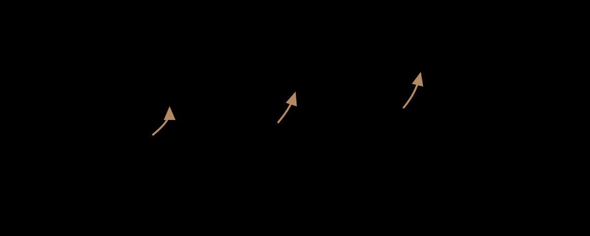

# 2022年 Kigurumi 編年史

> 編纂方針: この記事は、「2025 Kigurumi 編年史」、「2024 Kigurumi 編年史」、「2023 Kigurumi 編年史」の構成に従いますが、2023、2024、2025 年に詳細に書かれているイベント バージョン、ルールの更新、業界の拡張については繰り返しません**。同じ一連のアクティビティが以前のバージョン、独立したルール、初期スケールですでに登場している場合、オフラインで再開された場合、または 2022 年に初めて変更された場合は、2022 年のステータスが記録されます。それが後年に書かれた成熟した形式に過ぎない場合、この記事は「去重説明」で終わるだけです。

---

## 0. データ境界、重複整理の原則、および信頼性に関する指示

この 2022 年の編年史の **kigurumi** は、これまでの記事の幅広い範囲を引き続き採用しています。これには、animegao kigurumi / 美少女 着ぐるみ / マスク型ロールプレイ、doller、中国語圏の「娃 / Kig / Kiger」のオフライン アクティビティ、公式 IP のマスコット型の 着ぐるみ の挨拶、およびテキストが含まれます。大規模なコスプレイベントにおける、頭を完全に覆うこと、顔を覆うこと、公共空間、熱中症、写真撮影の同意および接触の境界に関するルール。用語については 2025 年の記事で詳しく説明されています。この記事では、長い定義を繰り返しません。必要に応じて、「公式 mascot greeting」、「愛好家 kigurumi 特別イベント」、「中国語圏の Doll Weekend 娃/Kig 活動」、「主流のコスプレ 大会のルール」の 4 種類の情報のみを区別します。

2022 年の情報は 2023 ～ 2025 年に比べて散在しており、中国と日本の多くのイベント ページには正確な日付が完全に記載されていない場合があります。したがって、この記事は次の信頼性原則を採用しています。公式イベントページ、主催者ページ、展示会ルールページ、および現場のメディアレポートが優先されます。 Bilibili、X/Twitter、YouTubeなどのソーシャルプラットフォームは、イベント時間、画像の拡散、会場の雰囲気の判断を支援するために使用されます。匿名フォーラム、プライベートグループチャット、スクリーンショット、噂は事実に基づくものとして使用されず、特定の名前は列挙せず、未確認の告発は繰り返されません。

この記事と 2023 ～ 2025 年の記事の重複整理ルールは次のとおりです。

| 重複整理タイプ | 2022年記事処理方法 |
|---|---|
| 同じ一連の出来事が 2023 年から 2025 年まで続くだろう | 最初の回、プレバージョン、初期のルールと 2022 年のスケールのみが書かれ、その後の成熟したバージョンは繰り返されません。 |
| 2025 kigurumi / animegao / doller 用語の説明 | 必要なレベルのみを維持し、長い記事では用語を繰り返さない |
| FGO、hololive、Aniplex およびその他の公式 greetingは、以降も引き続き存在します。 | 2022 年には AnimeJapan / FGO Fes. およびその他の今年のノードのみを書き込み、2023 ～ 2025 年の役割と数量を繰り返さないでください。 |
| World Cosplay Summit は、今後もマスキングと 熱中症ルールを強化していきます。 | WCS 2022 の「リアリティ ステージへの復帰」、COVID / 熱中症 / 公共空間のルールについてのみ記述し、翌年にはこの改良を繰り返さないでください。 |
| Doll Weekend その後のDW9～DW12は詳細に書かれています | この記事は DW5 についてのみ書いています - DW8 のテーマ、海辺での休暇、出展者の参加、流行後の再会 |
| 着ぐFesta ルールは今後数年でさらに成熟する予定です | この記事では、2022 年の最初の低いハードルの試行についてのみ説明し、2023/2024 年のルール拡張については説明しません。 |
| 匿名の噂と性格論争 | 検証されていない告発を繰り返さず、匿名のディスカッション サイトとガバナンスへの圧力の存在のみを記録してください。 |

---

## 1. 2022 年の全体的な状況

2022 年の kigurumi は「爆発の年」ではなく、より低レベルでより重要な「オフラインの再開の年」です。 2023 年が活動のつながりが回復し、中国語圏が国際化の前夜にある年であり、2024 年が知識生産とルール作成がより集中的に行われる年であり、2025 年が規模、国境を越えた取り組み、業界の圧力がより明白になる年であるとすれば、2022 年の中核的意義は次のとおりです。**流行後の不確実な環境の中で多くの活動が再開され、主催者は kigurumi をどのように実践するかを学び始めています。公共空間、ホテルスペース、展示スペース、ステージスペースに戻ります。**

最初のメインラインは、日本の kigurumi 専用イベントの再編成です。第19回キグルミwasshoi!は、2022年4月にホテルを中核会場として、ロビー、カクテルlounge、プールエリア、教会、stage、dealer、写真サービス、宿泊関連企画などを設置する。それは、一年の中で最も充実した日本固有のイベントの 1 つです。そのルールは非常に緻密です。アクセス/写真撮影の許可、ホテルの公共エリアの制限、写真撮影の同意、水の侵入禁止、ドローンの禁止、過剰な性的パフォーマンスの禁止、会場の履物の破損禁止など、すべてが kigurumi のオフライン活動が 2022 年に「ルールの回復と再確認」の状態に入ったことを示しています。

2 番目の主要な点は、敷居の低い活動が現れ始めているということです。 2022年8月6日に開催された最初の着ぐFestaは、一般参加者24名と規模は小さかったが、非常に重要だった。疫病が少し落ち着けば大規模なイベントは段階的に再開するが、主催者は「予約不要で気軽に遊べる」コミュニケーションスペースを提供したいとページに明記されていた。大規模なプロジェクトはあまり準備されていませんでした。その代わりに、白と黒の背景写真、フロア全体のプライベートスペース、着付けとcloakスペース、そして自由なコミュニケーションに焦点を当てました。また、今回のイベントを通じて参加者のニーズを把握し、今後に向けたコンテンツを準備していきたいとしている。[[S8]](#s8)

3 番目の主要なラインは、公式 IP の実体キャラクターをシーンに戻すことです。 FGO は AnimeJapan 2022 の公式ページで cosplayer / kigurumi greeting stage をアレンジしました。 FGO Fes. 2022は、7月30日から31日まで幕張 Messeで開催されます。メディアの報道によると、これは感染症の影響を受けてから約3年ぶりのリアルイベントです。 welcome gate には公式コスプレイヤーがおり、kigurumi 出席者は、9 人の公式コスプレイヤーと 6 体の kigurumi を記録するライブ中継で歓迎されました。[[S1]](#s1)[[S2]](#s2)

4番目の主要な方針は、流行のさなかの主流のコスプレコンベンションの再開です。 World Cosplay Summit 2022は20周年記念イベントです。公式ページにはWorld Cosplay Championship Stage Divisionが約3年ぶりにリアルステージに復帰すると記載されている。ただし、海外渡航には依然として影響があるため、来日可能なチームのみが参加する。 WCSはまた、公共空間に関するルール、熱中症およびCOVIDの対策を発表した。参加者は、会場が完全に密閉されたコスプレ空間ではないこと、写真撮影には許可が必要であること、楽屋ではマスクと雑談禁止、暑い中は水分補給と休憩が必要であること、重度の脱水症状を引き起こす可能性のある衣装はスタッフによって中止される可能性があることを認識する必要がある。[[S4]](#s4)[[S5]](#s5)[[S6]](#s6)[[S7]](#s7)

5番目のメインラインは、テーマから出展者、流行後の再会までの中国語圏の Doll Weekend です。 DW5は「黒と白の協奏曲」をテーマに珠海で開催され、公式ページにも記載されているように初のテーマイベントとなる。 DW6は「海辺の休暇」をテーマに深センで開催され、台風後の海辺の別荘での休暇と一日中キャラクターに浸った様子を記録します。 DW7 は広州で初めて出展パートナーを歓迎し、150 名以上が参加しました。 DW8 恵州市の公式ページでは、海辺、ビーチ、花火が感情の核となり、「疫病の霞から抜け出して最初の再会」と説明されている。[[S9]](#s9)[[S10]](#s10)[[S11]](#s11)[[S12]](#s12)[[S13]](#s13)

したがって、2022 年の今年の位置は次のように要約できます。**今年は最も派手な年ではありませんでしたが、後に大きくなる多くのことを再配線しました。**ホテルの特別イベント、敷居の低い交流会、公式 IP greeting、WCS 公開ルール、中国語圏の娃/Kig 圏のテーマ、展示会はすべて、今年は検証可能なフロントエンド ノードを残しました。

---

## 2. 編年史2022

### 1月から2月: オフライン再開前夜 - 依然として流行管理がすべての活動の基礎となる変数

2022 年の初めの時点で、kigurumi コミュニティが直面している最大の背景は依然として感染症流行後のオフラインの不確実性です。 2020年から2021年にかけて、多くのイベントが中止、縮小、延期、予約制やオンラインへの移行が行われた後、2022年になって初めて大規模なリアル会場への再挑戦が始まることになる。kigurumiにとって、この再開は通常のコスプレよりも難しい。マスク、ウィッグ、タイツ、ボディパッド、ヘッドケースにより、ロッカールームの占有率、移動支援、休憩の必要性が増加する。また、フェイスカバーにより、スタッフは身元確認、体温検査、マスク着用、緊急時の対応についてさらに不安を感じることになります。

今年のイベント資料は総じて「再演」色が強い。第19回のキグルミwasshoi!のページには、前回の実験イベントの好評を受けて正式に開催する旨が記載され、感染対策も記載されていたが、最初の着ぐFestaは、感染状況は若干落ち着き、大規模な活動も徐々に再開されているが、それでも予約不要で人々が自由に遊びに来られるコミュニケーションの場を提供したいと直接書いている。 WCS 2022のCOVID対策ページでは、症状やリスクがある人は会場に来ないこと、入場時の体温測定、マスクの着用、ロッカールームでの会話の回避、消毒の使用、社会的距離の維持を求めている。[[S3]](#s3)[[S7]](#s7)[[S8]](#s8)

この背景は単一のパーティーではありませんが、年間を通じて kigurumi イベントの雰囲気を決定します。 2022 年、主催者は 2 種類の問題に同時に対処しなければなりません。1 つは kigurumi 本来の問題である視覚、放熱、接触、写真撮影、着替えです。もう1つは、流行後に体温、マスク、消毒、集中接触、更衣室での会話、連絡先の記録といった新たな、あるいは強化された問題である。言い換えれば、2022 年のイベントは単に「パンデミック前への回帰」ではなく、新しい公衆衛生規則の中でのオフライン参加を再定義するものとなるのです。

その後の発展の観点からすると、この2022年の再定義は非常に重要です。写真撮影の同意、熱中症、公共空間、マスク確認、イベント後の交流、dealerエリア、出展者システムなど、2023年から2025年にかけて見られたルールや設備は突然現れたものではなく、2022年の「再開するが注意が必要」な環境で徐々に復元、テスト、強化されていきました。

### 3 月 26 ～ 27 日: FGO × AnimeJapan 2022 – 年初めの cosplayer / kigurumi greeting stage の公式リターン

AnimeJapan 2022は、2022年3月26～27日に东京 Big Sightで開催されました。 Fate/Grand Order公式ページには、FGOブースが東3ホールA04にあることが記載されており、「コスプレイヤー・ 着ぐるみ「グリーティングステージ」企画」と記載されています。また、FGOスペシャルステージが開催されることが記載されています。 3月27日13:15～13:50、全体展示は东京 Big Sight東1～8ホール。

この記録は、公式IPのkigurumi/マスコット団体がパンデミックによる混乱を理由にショー運営から撤退していないことを示すため、2022年にとって重要である。 AnimeJapanは商業アニメーションの展示会です。来場者の目的は新作鑑賞、ブース訪問、周辺機器の購入、ステージ参加、写真撮影、交流など。 FGO はブース情報にコスプレイヤーと kigurumi の挨拶を書き込み、関係者が「キャラクターの身体」を通じて現場体験を強化する必要があることを示しています。

公式 greetingとファンのanimegao kigurumiは同じ組織形態ではありません。 FGO ブースでの kigurumi は、正式な認可、正式な運営、およびブースの順序の一部です。愛好家である kigurumi は、個人的なロールプレイング、写真の作成、コミュニティの交流、身体表現に重点を置いています。しかし、この 2 つは観客レベルで相互に影響し合います。一般の観客は、最初に公式ブースで「動く 2 次元キャラクター」を見て、次にファンの活動や個々の選手を見たときに、この視覚言語を理解する可能性が高くなります。

2022 年の AnimeJapan バージョンは、その後の 2023 年、2024 年、および 2025 年のノードとも異なります。この記事では、その後のブースの詳細については繰り返しませんが、2022 年のこの「年初の復帰」の重要性のみを記録します。感染症流行後のオフライン活動の再開初期には、kigurumi には依然として kigurumi の挨拶が一部として含まれていました。ブース体験の様子。これは、公式の 2 次元 IP オフライン コミュニケーションにおける kigurumi の立場が、純粋なオンライン ライブ ブロードキャストやスクリーン ディスプレイに完全に置き換えられていないことを意味します。

kigurumi 編年史から、これは「主流の可視性」への手がかりです。多くの人は、animegao フォーラムやプレイヤーの集まりからではなく、大規模な IP イベントで公式マスコットのようなキャラクターに出会うことによって kigurumi 文化に参入します。 2022 年の FGO × AnimeJapan の記録は、この一般公開の一部です。

### 4月9日～10日：第19回キグルミwasshoi! - ホテル型特別イベントの包括的復旧

2022年4月9日・10日、東京のHotel East 21 Tokyoにて第19回キグルミwasshoi!が開催されます。公式ページには、前回の実験イベントの好評を受けて、今回も贅沢なロケーションと大ホールで写真交流会を開催し、フォトコンテストやメーカー展示、stage企画などのコンテンツを用意すると記載されている。このページには、Day 1 が 4 月 9 日、Day 2 が 4 月 10 日としてリストされています。 1日目はEast21 Hall、カクテルlounge「パノラマ」を使用し、宿泊客はnight poolとして利用できます。 2 日目は、East21 Hall、garden pool、および有料の chapel を使用します。[[S3]](#s3)

このイベントは、2022年の日本のkigurumiオフラインの歴史の中で重要なノードです。一般のファンが写真を撮るための小さな会場ではなく、ホテルのロビー、lounge、スイミングプール、教会、宿泊フロア、写真撮影サービス、ステージプログラム、dealer展示と競技企画を組み合わせたものです。 kigurumiにとって、このような包括的な会場は非常に貴重です。ホールは大規模な集合写真やコミュニケーションに適しており、loungeはキャラクターの雰囲気のある写真に適しており、プールと教会は特別な背景を提供し、宿泊施設はヘッドボックス、長時間の着用、夜間撮影、体力の回復の問題を解決します。

しかし、包括的であるという理由だけで、ルールも包括的でなければなりません。このページには連絡先と撮影許可passの仕組みがあります。参加者は pass を使用して、接触や写真撮影を許可するかどうかを表現できます。相手が pass に触れられたくないという意思表示をした場合は、接触を許可されません。公共の場での不適切な行為も禁止されています。 kigurumi での非言語コミュニケーションは当然難しいため、このメカニズムを文書化する価値は十分にあります。ヘッドシェルによって顔が隠され、声がはっきりと聞こえない可能性があり、キャラクターを維持するためにパフォーマーは話さないことがよくあります。passの色やタイプで境界を表現することは、口頭コミュニケーションからの同意を視覚的なルールに変換する方法です。[[S3]](#s3)

写真撮影のルールも同様に細心の注意を払っています。このページでは、撮影前に被写体の同意が必要であり、写真をアップロードする前に許可が必要です。撮影場所の長時間占拠は禁止、楽屋やトイレでの撮影は禁止、被写体に難しいポーズや不適切なポーズを要求して反応させることは禁止、メディアの無断取材・報道は禁止。また、撮影機材にも制限が課されており、大きなレンズや機材の配置が活動を妨げないようになっています。これらのルールは、kigurumiイベントにおける「写真撮影」には、単にシャッターを押すだけではなく、被写体の同意、会場の順序、作品の使用権、コミュニティの信頼が含まれることを示しています。[[S3]](#s3)

プールエリアのルールには安全管理が反映されています。このページには、水への立ち入りは禁止されており、ドローンの使用は禁止されており、ライトスタンドや反射板などの設備を使用する場合は落下防止措置を講じる必要があり、プールエリアでの傘の使用は禁止されています。これらの内容は 2025 年に記録された水の安全規則を反映していますが、2022 年の重要性は、「背景としてのプール」と「kigurumi を水中に持ち込まないこと」をすでに区別していることです。ヘッドシェルプレーヤーにとって、水の光景は美しいですが、吸水性のある素材、滑りやすい靴底、限られた視界、衣服の重さにより、リスクが増大する可能性があります。[[S3]](#s3)

ホテルの共用エリアの制限についても書いておく価値があります。宿泊者はイベント受付でのチェックアウトや指定エリア内での移動など、便利な利用方法が紹介されている。ただし、2Fフロントロビー等の公共エリアではkigurumiの着用はできません。また、会場への連絡、一般宿泊者の迷惑、指定エリア以外での移動はご遠慮ください。 kigurumi 特別なイベントは、たとえホテルの施設を借りたとしても、依然として通常の商業施設内にあり、参加者、ホテルの宿泊客、スタッフ、一般の人々の間の境界に対処する必要があります。[[S3]](#s3)

服装や行動のルールも、2022 年のコミュニティ ガバナンスの複雑さを反映しています。このページでは、一般的な外見のコスプレを禁止しています。 kigurumiとして参加しているスキントーンタイツは「肌」とみなされ、輪郭や局部の露出を避け、過度の性的表現を避けることが求められます。会場を傷つける可能性のある履物の禁止、現実的な公権力のユニフォームの禁止、発射の可能性のある危険な小道具やairgunの禁止、会場を汚染する可能性のあるスプレー、プラズマ、その他のアイテムの禁止。外部の聴衆にとって、これらの規制は些細なことのように見えるかもしれません。イベント主催者にとって、それらは会場の契約、安全上の責任、世間の印象、そしてその後の会場のレンタル継続能力に直接関係します。[[S3]](#s3)

第 19 回 キグルミwasshoi! は、肯定的な歴史的観点から、2022 年の日本の kigurumi 特別イベントがすでに高い組織能力を備えていると説明しています。ホテル、複数の撮影シーン、stage、dealer、コンテスト、公式写真撮影、宿泊手配を動員することができます。否定的またはリスクのある歴史的観点から見ると、オフラインでの再開が簡単ではないことも示しています。写真撮影できるすべての美しい空間の背後には、移動、接触、写真撮影、公共エリア、安全に関する一連のルールがあります。 2022年のkigurumiは、「やっとまた一緒になれる」という単純なものではなく、再び集まりながら境界線を書き換えていくというもの。

### 6月上旬頃：Doll Weekend 5「白黒協奏曲」 - 中国DWライン初のテーマイベント

Doll Weekend 5の公式ページにはイベントのテーマが「白と黒の協奏曲」と書かれており、場所は広東省珠海である。また、Doll Weekendがテーマイベントである白黒のメイドパーティーを企画するのは今回が初めてで、パーティーをより儀式的で臨場感のあるものにする、とも説明している。 Bilibili の公開ビデオ「人形は通常どのように誕生日を過ごすのか - Doll Weekend 5」が 2022 年 6 月 6 日にリリースされました。タイトルとタグも、Doll Weekend 5 および kigurumi / Kig シーンを明確に示しています。したがって、この記事では、2022 年 6 月初旬頃に DW5 をパブリック ノードとして記録します。厳密に言えば、Bilibili の日付は公開ビデオのリリース時刻であり、必ずしもイベントの日付であるとは限りません。[[S9]](#s9)[[S10]](#s10)[[S14]](#s14)

DW5のキーワードは「初めてのテーマ」です。以前のファンの集まりでは、参加者はさまざまなキャラクターと集まり、写真を撮ったり、コミュニケーションをとったりするだけでした。一方、テーマアクティビティは、すべてのキャラクターに共通の視覚的な順序を提供します。黒と白のメイド パーティーのテーマは、服の色、現場の雰囲気、儀式の感覚、そして集合的な記憶を結びつけます。 kigurumi /doll キャンペーンのテーマは、単なるドレスコードではなく、異なるキャラクターを同じ物語の中にまとめる方法でした。

メイドのテーマは、中国の「Kig」サークルの初期の開発にも非常に適しています。それは、二次元、メイドコーヒー、日本のコスプレ、誕生日パーティー、サービスシーンなどの混合想像力から来るだけでなく、立ち姿勢、料理の提供、お祝いの言葉、集合写真、交流、ステージやパーティーの雰囲気など、キャラクターがイベント内で比較的統一された行動言語を形成することも可能にします。白と黒の配色により、登場人物間の色の衝突が減り、集合写真の視覚的な全体を形成しやすくなります。

2025年の視点から振り返ると、DW5はDW12の1000人規模の観衆、花火、ドローン、パレードに比べるとはるかに小さいように見えるが、これには歴史的な意義がある。それはDoll Weekendが2022年に「このイベントは誰もが参加するためのものではなく、誰もが共通のテーマに参加できるものである」ということを認識していたことを証明している。その後の DW6 の沿岸休暇、DW7 への出展者の参加、DW8 の冬の集会、DW10 の国際化、および DW12 の祝典はすべて、このテーマ能力の延長とみなすことができます。

DW5 は、中国の kigurumi /doll サークルが画像プラットフォームを通じて広がり始めていることも示しています。 Bilibili の動画タイトルは、「人形たちは普段どのように誕生日を過ごすのか」というシーンを一般の視聴者に説明しており、「これは何の活動ですか？」という敷居を下げています。専門論文のような専門用語の説明ではなく、誕生日、パーティー、メイド、二次元、可愛い体など、より直感的な要素を用いて、「娃」にも社会的な日常があることを理解してもらえるようにしています。

### 7月下旬頃：Doll Weekend 6「Coastal Vacation」 - 台風後の海辺の別荘と全天候型キャラクター三昧

Doll Weekend 6の公式ページには「海岸での休暇」というテーマが書かれており、場所は広東省深センで、これは「台風後」のビーチヴィラでの休暇であり、キャラクターに没頭して社交的な一日を過ごす体験であると説明されている。 Bilibili の公開検索記録によると、関連する長編映画「DW6 長編映画 How Dolls Vacation at the Beach」が 2022 年 7 月 27 日に公開されたため、この記事では DW6 を 2022 年 7 月下旬頃のノードとして記録します。ビデオの公開時間は、イベントの正確な日付と必ずしも同じではないことにも注意してください。[[S9]](#s9)[[S11]](#s11)[[S15]](#s15)

DW6の意義は、イベントを屋内のテーマパーティーからリゾート環境へと進化させることです。ビーチ ヴィラと全天候型キャラクターの没入は、参加者が数時間で写真撮影を完了するだけでなく、キャラクターの状態、社会的状態、写真の状態をより長期間維持することを意味します。これは、kigurumi /doll プレイヤーにとってより厳しいものです。ヘッドシェルの装着時間、着替えの手配、休憩と水分補給、空調の効いたエリア、潮風の湿度、塩分、地面、移動手段、撮影リズムがすべて経験に影響します。

「台風の後」という表現も現実感があります。これは、イベントが抽象的なスタジオ撮影ではなく、実際の天気と実際の地理的環境で起こっていることを示しています。海辺は風が強く、湿度が高く、光も強いです。天候の変化は、ウィッグ、衣類、ヘッドシェル、写真機材に直接影響を与えます。通常のコスプレの場合、これらはすでに問題です。 kigurumi を使用すると、頭の視認性、熱放散、ソールの安定性がさらに問題を悪化させます。したがって、DW6 は、視覚的な休日の試みであるだけでなく、屋外/半屋外シーンへの適応性のテストでもあります。

DW5の白黒メイドパーティーに比べ、DW6の「Seaside Vacation」は空間そのものに重点を置いています。メイド パーティーは服装と儀式がすべてであり、ビーチでの休暇はセッティングと時間がすべてです。別荘、海辺、廊下、休憩所、テラス、屋外の光の中で動くキャラクターは、単一のホール内よりも日常や旅行の物語に近くなります。この変更は、展示ホールやレンタルホールだけでなく、休暇、都市、ホテル、景勝地、写真撮影ツアーなどでも「娃」の活動を行うことができるため、中国語圏の娃/Kig 圏のフォローアップにとって重要です。

DW6 は、続く DW8 でも海辺と花火への道を切り開きました。 2022 年の中国の Doll Weekend ラインは、直接的な数字の話ではなく、誕生日/メイド、ビーチハウス、出展者イベント、冬の同窓会などのシナリオを絶えず実験しています。トライアルを重ねるごとに、主催者は会場、人々、写真撮影、交通手段、安全性についての理解を深めます。

### 7月30日・31日：FGO Fes. 2022 ～7th Anniversary～——約3年ぶりのオフラインアニバーサリー復活

2022年7月30日、31日、Fate/Grand Order Fes. 2022年～7th Anniversary～は幕張 Messeにて開催致します。 Inside Games の現地レポートによると、COVIDの流行の影響により、FGO Fes. は約 3 年ぶりのリアルイベントとなったそうです。会場のwelcome gateは、半円形の大型スクリーン、red carpet、地球模型を通してフェスティバルエントランスを演出し、公式コスプレイヤーとkigurumiが観客を出迎えた。取材対象は公式コスプレイヤー9名とkigurumi6名。[[S2]](#s2)

このイベントは、2022 年の公式 IP kigurumi ラインの毎年恒例の目玉です。AnimeJapan 2022 は展示ブースの greeting stage であり、FGO Fes. 2022 は周年記念式典の入り口での臨場感あふれる歓迎です。約 3 年間、リアルなイベントがなかった後、公式コスプレイヤーと kigurumi は、強い象徴的な意味を込めて welcome gate でファンを歓迎しました。プレイヤーは単に画面上でゲームのアップデートを見るのではなく、キャラクターの身体とライブ空間で構成されるフェスティバルに再び参加しました。

レポートに収録されているkigurumiは、ヒロイン、アルテラ、マシュ、ジャンヌ・ダルク、セイバー、レオナルド・ダ・ヴィンチの6名。公式コスプレイヤーと別役で登場し、FGO展示会場ならではの「リアルキャラクター＋kigurumiキャラクター」のハイブリッドな世界観を形成しています。観客にとって、キャラクターたちはカードやPV、展示ボード上に留まるだけでなく、エントランスやレッドカーペット、BGMなどで鑑賞、撮影、インタラクションできる存在となる。[[S2]](#s2)

kigurumi 編年史の観点から見ると、この種の公式 kigurumi の価値は一般に公開されることにあります。それは animegao プレイヤー コミュニティと直接的に同じものではありませんし、個々の kiger の創造的なアプローチを直接反映するものでもありません。しかし、それはフードをかぶったキャラクターに対する一般の視聴者の受け入れを変えるでしょう。大勢のファンがそのキャラクターが公式イベントで kigurumi の形で挨拶するのを見て、その後コミックコンベンションや専門イベントで個々のプレイヤーを見るとき、この物理的な形は、単なる奇妙な光景ではなく、「キャラクターのプレゼンテーション」として理解する方が簡単です。

FGO Fes. 2022 は、感染症流行後のオフライン活動の感情的価値も反映しています。報道によれば、これは約 3 年ぶりのリアルイベントの復活であることが強調されており、これは公式 kigurumi にとって重要であり、フードをかぶったキャラクターの最大のポイントはまさに「ライブ感」です。観客と同じ空間にいないと、手を振ったり、立ったり、ポーズをとったり、歩いたりするkigurumiの動きが機能しにくくなります。 2022 年の復帰は、IP オフライン運用における kigurumi のかけがえのない役割を再確認します。

### 8月5日～7日: World Cosplay Summit 2022 – 20周年記念、リアルステージの復活と公共空間のルール

World Cosplay Summit 2022は、2022年8月5日から7日まで愛知・名古屋で開催されます。 公式ページには、World Cosplay Championship Stage Divisionが8月6日に愛知芸術文化センターホールで開催されたと記録されており、約3年ぶりにリアルステージに戻ってきたと記載されており、流行後の入国と旅行の状況により、日本に来ることができるチームのみが参加します。[[S4]](#s4)

kigurumi にとって WCS 2022 が重要なのは、それが kigurumi に特化したイベントであるということではなく、主流のコスプレ システムの公共空間の再開を表すということです。 WCS会場には、Oasis 21、Hisaya-odori Park、Osu商店街、Flarieなどが含まれます。公式ルールは、これらのスペースがコスプレ参加者だけのためのものではないことを繰り返し思い出させます。一般の来訪者や通行人、店舗や施設の利用者も同じエリアで活動しています。 kigurumi、全頭マスク、厚着、または顔を覆う服装の場合、この種の宣伝は大きなプレッシャーをもたらします。視界が制限され、移動が不便で、身元を確認するのが難しく、通行人に写真を撮られやすく、混雑した場所では誤解を招く可能性が高くなります。[[S5]](#s5)

WCS 2022 の衣装と小道具のルールには、身体的リスクが記載されています。規定では長尺物は2メートル以内と定められていますが、会場や状況によっては係員が使用を中止する場合がありますのでご了承ください。同時に、過度の露出、歩行を困難にするシャープな長いスカート、または重度の脱水症状を引き起こす可能性のあるぴったりとした過熱する衣服は、スタッフが避けるよう要求される場合があります。 2022年のルールでは、2025年のようなkigurumi、doller、gawa-cosや全面マスクなどのカテゴリーを個別に拡大することはないものの、スタッフが判断できる問題として「脱水症状を引き起こす可能性のある服装」が盛り込まれた。[[S5]](#s5)

写真のルールも同様に重要です。 WCS 2022では、撮影中の長時間の占有禁止、無断撮影禁止、ローアングルや下着が見えるポーズでの撮影禁止などを定めており、撮影は禁止となっている。また、SNS に写真をアップロードする前に、被写体の同意を得る必要があります。 kigurumi の場合、このようなルールは被写体だけでなく、撮影者やイベント自体も保護します。なぜなら、kigurumiの出演者は表情や言葉ですぐに断れないことが多く、相手も「その場にいれば撮影できる」と誤解してしまう可能性があるからです。ルールによって、同意は漠然とした社会的礼儀正しさから、明示的な活動要件に変わります。[[S5]](#s5)

WCS 2022 の 熱中症対策ページも重要です。このページでは、イベント中に猛暑が発生する可能性があることを注意喚起しています。参加者は飲み物を持参し、頻繁に水分を補給し、適度に休憩し、冷却用品を使用する必要があります。暑いと感じたら無理に参加しないでください。ロッカールームは会期中何度も入る可能性がございますので、体調を優先し、熱を逃がしやすい服装を選んでください。 kigurumi パフォーマーにとって、これらは一般的なリマインダーではなく、生命の安全に関するルールです。ヘッドシェルとタイツは熱放散に影響し、ウィッグと詰め物は熱を増加させ、キャラクターの靴は動きを遅くする可能性があり、休憩のために頭を外すことはプライバシーとキャラクターのステータスに関わる可能性があります。[[S6]](#s6)

COVID 対策は、ガバナンスの別の層を構成します。 WCS 2022 のページでは、症状がある人、感染リスクがある人、旅行制限のある人は会場に来るべきではないと求めています。入場時に検温を実施し、37.5度以上の熱中症や明らかな症状のある方は入場をお断りさせていただきます。ロッカールーム内での会話は避け、参加者にはマスクの着用、消毒、距離の確保を義務付け、接触確認アプリの利用を推奨する。 kigurumi 参加者にとって、そのようなルールはヘッド シェルやマスクと実際的な矛盾を引き起こすことになります。通常のマスクをいつ着用するか、いつキャラクターのヘッド シェルに入るのか、いつ頭を脱ぐのか、更衣室で静かに着替える方法はすべて、現場で対処する必要がある問題です。[[S7]](#s7)

したがって、WCS 2022は、2022年の「ネガティブ/リスクの歴史」の中核ノードの1つです。それは何かネガティブなことが起こったからではなく、リスクを制度化したためです。公共空間、熱中症、写真撮影の同意、COVID、更衣室、小道具の長さ、過熱した衣装はすべて、主流のコスプレイベントのルールに書き込まれています。 2025 年のより明確なマスキング ルールと kigurumi カテゴリの認識は、この公共ガバナンスの経験の延長とみなすことができます。この記事は 2022 年の暫定的な状況のみを記録しており、その後の詳細な内容については繰り返しません。

### 8月6日：着ぐFesta第一話～敷居の低い交流会のスタート～

2022年8月6日、荒川区のサンパール荒川小通にて着ぐFestaが初開催されました。 TwiPlaのページタイトルは「着ぐFesta! 着ぐるみさんと着ぐるみ好きさんとのコミュニケーション」、時間は10:00～16:00、主催はGarageStudioC7です。このページでは、流行状況が若干安定し、大規模なイベントが徐々に再開されていると説明している。 kigurumiプレイヤーからは予約なしで気軽に遊べるイベントを望む声が多く、主催者は結婚式などのイベントも開催できる約300人収容のホールを借りた。オープン登録には 24 名の参加者があった。[[S8]](#s8)

着ぐFesta の値は、初めてスケールではなく「ハードル」にあります。第19回キグルミwasshoi!は、内容が充実したホテル型総合イベントですが、その分旅程や料金、準備やルールも複雑になり、 WCS は、公共空間に対する圧力がより高い主流の大規模大会です。最初の 着ぐFesta は、kigurumi プレイヤーや kigurumi が好きな人が最初に集まる敷居の低いスペースのようなものです。このページには、参加条件として「着ぐるみの人々とも着ぐるみの人々のファンの人々」と記載されており、自分のkigurumiを持っていなくても参加できるとのことで、初心者や野次馬の入り口となっている。[[S8]](#s8)

会場デザインにもkigurumiのニーズが反映されています。ページにはフロア全体が貸切でホールとエントランスはkigurumiで利用できると書かれています。音楽室とステージは楽屋やcloakとして利用でき、フロントエリアでは荷物預かりも可能です。 kigurumi では、ステージ プログラムよりも、十分なドレッシング、ラゲッジ、ヘッド ボックス、休憩スペースがあるかどうかの方が基本的なことがよくあります。通常のコスプレ衣装は袋に詰めることができますが、kigurumiのヘッドシェルは大きくて壊れやすいため、安定して設置する必要があります。肌色の服、ウィッグ、キャラクターの服、靴の場合も、より詳細な着付け時間が必要です。[[S8]](#s8)

また、最初のページには、主催者はあまり大規模なコンテンツは用意しておらず、参加者同士が自由なコミュニケーションを通じて当日の雰囲気を作ってほしいと述べており、「参加者同士で自由なコミュニケーションをとりながら、その日の雰囲気を作っていただければ」としている。同時に、オペレーターは、参加者がこのイベント中にどのようなサービスを望んでいるのかを理解し、今後の準備に役立てることができます。現場には白と黒の背景や撮影機材が用意されており、イベント中に撮影した写真は後日整理してアップする予定だ。この「まずやって、フィードバックに基づいて改善する」という姿勢は、2022 年の再スタートの雰囲気と非常に一致しています。

このキャンペーンには、基本的なリスク管理もすでに含まれています。過去に他の活動で問題を起こした方、またはその可能性がある方は参加しないでくださいとページには書かれています。主催者は理由を説明できない場合があります。参加者は一般的な予防措置にも従う必要があります。この種のテキストは、短いものではありますが、小規模な kigurumi キャンペーンがコミュニティの信頼、イベントのセキュリティ、問題の排除に最初から取り組む必要があることを示しています。 kigurumi イベントは多くの場合、知人のネットワークや非言語的なやりとりに依存しているため、誰かが繰り返し一線を越えると、新人や出演者の安心感が急速に損なわれる可能性があります。[[S8]](#s8)

着ぐFesta はその後、2023 年と 2024 年に、より明確な写真撮影の同意、ハグの禁止、長い物の制限、マスクのフィッティング、写真ワークショップ、dealer への参加などを開発する予定です。これらについては、2023/2024 の記事に詳しく書かれています。この記事では、2022 年の最初のイベントの歴史的位置づけのみを記録します。これは、感染症流行後のオフライン回復中に出現した、敷居の低いパイロット会場です。規模は小さいものの、方向性は明確であり、その後の一連の活動の基礎を築いています。

### 2022 年下半期: Doll Weekend 7 「Connecting New Life」 - 出展パートナーが参加し 150 以上の規模に

Doll Weekend 7の公式ページには「Connecting New Life」というテーマが書かれており、場所は広東省広州です。また、Doll Weekendが出展パートナーを迎えるのは今回が初めてで、River Monster、Hidolls、Xinyan、No Reduction、Shell Reactionなどのリスティングパートナーを迎えていることも説明している。このページには、イベントの参加者が 150 名を超え、体験の次元とつながりの範囲がさらに強化されたと記載されています。公式サイトのページには具体的な年月日が記載されていないため、本記事では2022年下半期のノードとして記載させていただきます。

DW7 は、友人の集まりから業界のつながりまで、2022 年の中国の娃/Kig サークルの重要なステップです。出展者の参加により、イベントは単なるプレイヤー同士の自発的な集まりではなく、メーカー、アクセサリーパーティー、マスク・コスチューム・関連サービスパーティーなどプレイヤーと触れ合う場となり始めています。 kigurumi /ドール文化にとって、出品者システムは非常に重要です。ヘッドシェル、肌色の服、ウィッグ、衣類、眼鏡、靴、詰め物、写真撮影、ポストプロダクション、保管、輸送はすべてサプライチェーンを形成します。イベントに出展者が集まるということは、参加者数や購買需要が一定の安定度に達していることを意味します。

「150 名を超える参加者」は、現在では 2025 年の DW12 の 1,000 名以上ほど壮観ではないかもしれませんが、2022 年のパンデミック後の環境では、これはすでに重要な規模のノードです。 kigurumi /doll の活動は通常のファン展示会とは異なり、高額な参加費、複雑な機材の輸送、高い会場要件、および強力な身体的要件が伴います。 150+ ということは、主催者は登録、会場、群衆の流れ、集合写真、写真撮影、出展者、休憩、変更、治安など複数の事項に対処しなければならないことを意味します。

DW7の「Connecting the New」というテーマもぴったりですね。それはプレイヤー間のつながりだけでなく、プレイヤーとプロデューサー、活動と産業、中国人コミュニティ、そしてその後のより大きな規模の間のつながりでもあります。 2023年DW9には200人近いプロのステージ、2023年DW10には400人以上、2024年DW11には500人以上、2025年DW12には1000人以上の海外参加者がおり、DW7での出展者の参加には初期の兆候が見られます。

この記事は、その後の Doll Weekend の成熟した工業化の物語を繰り返すものではないことに注意してください。 DW7の歴史的意義は、2025年の出展規模、ドローン、花火、都市支援などを2022年に注ぎ込むのではなく、「最初の出展パートナーの参加」と「150以上」という2022年の2つのノードにある。

### 2022年末: Doll Weekend 8「Winter Warm Gathering」 - 疫病の霞から抜け出した後の再会、ビーチ、花火

Doll Weekend 8の公式ページには「冬の温かい集会」というテーマが書かれており、場所は広東省恵州で、疫病の霞から抜け出して初めての再会、花火が暖かい集会を繋ぐという非常に感情的な文章で要約されている。このページにはイベント画像のタイトル「花火とともに海へ走る」も掲載されており、集合写真や現地写真への入り口も掲載されている。 Public したがって、この記事では DW8 を 2022 年末のノードとして記録します。[[S9]](#s9)[[S13]](#s13)

DW8 は、2022 年の中国の Doll Weekend ラインの感情的な終結です。以前の DW5 は初回テーマを重視し、DW6 はビーチ ヴィラとキャラクターへの没入を重視し、DW7 は出展者の参加と 150 人以上を重視しています。 DW8は「再会」を核としています。感染症流行後に活動が再開される場合、最も重要なことは単に人数だけではなく、参加者が最終的に再び集まり、再び写真を撮り、物理的な存在を伴う社会的関係を再確立できるという事実である。 kigurumi /doll の場合、キャラクターの身体、動き、集合写真、照明、仲間関係、イベントの記憶はすべて同じ空間で発生する必要があるため、オンライン コミュニケーションはオフラインでの出会いに代わることはできません。

「ビーチ、海、花火」には、Doll Weekend がシーンの物語を追求し続けていることも反映されています。花火は強力な公共の儀式です。夜にみんなの注目を集め、イベントの思い出をよりお祝いにします。 kigurumi /doll の参加者にとって、花火を背景にしたキャラクターのイメージは強いファンタジー感を持ちます。しかしそれは、会場の管理、人員の集中、照明の変更、夜間の安全性、撮影機材のスケジュール管理なども意味します。 DW8は、年末の温かい集まりとして、美しいイメージだけでなく、屋外/半屋外の夜のアクティビティを企画する主催者の能力を反映しています。

2025 年の記事から振り返ると、DW12 の花火、ドローン、娃のパレードはさらに盛大です。しかし、DW8 の花火は、どちらかというと初期の感情的なプロトタイプに似ています。これは何千人もの人が集まる都市のお祭りではなく、感染症収束後の再会の象徴です。 2022 年末に「花火がパーティーを繋ぐ」という物語が現れたからこそ、次作の Doll Weekend では、イメージ、都市、お祝い、そして kigurumi /doll のボディをより自然に組み合わせることができます。

この記事では、DW8をその後の大規模な活動の縮小版としてではなく、2022年の終わりそのものとして書いている：疫病の不確実性を経験した後、中国語圏の娃/Kig 圏は今年のテーマを海辺、ビーチ、花火、再会を通じて「再試行」から「再接続」へと推し進めた。

### 2022 年の匿名の噂の分野: ガバナンスの圧力のみを記録し、未確認の告発は記録しない

2022 年半ばに引き続き表示される 5ch シリーズのディスカッションなど、日本の kigurumi サークルに関連する匿名の「問題人物観察」タイプのスレッドを 2022 年に検索できます。このような会場では、イベントのエチケット、個人的な紛争、写真撮影の境界、接触の問題、社会的対立、ビジネス上の対立などについて匿名で議論することがよくあります。公式イベントページは通常、個人的な論争を記録しないため、これらはコミュニティの歴史として一定の参考価値があります。しかし、それらには多くの個人的な偏見、誤解、昔からの恨み、文脈を無視した引用、関係者から返答のない内容も含まれています。[[S16]](#s16)

したがって、この年代記は、匿名の投稿で行われた具体的な告発を繰り返したり、口座番号や名前をリストしたりすることはなく、匿名の主張を事実として提示することもありません。 kigurumi のような小規模なサークルの場合、匿名の名前付けは特に有害です。参加者はキャラクター名、面体、ニックネーム、ソーシャル アカウント、実生活のアイデンティティなどの複数のアイデンティティを使用する可能性があります。間違った関連付けにより、キャラクターの外見、イベント写真、またはプレイヤー アカウントが誤って否定的な噂に結び付けられる可能性があります。未確認の被害を拡大するのではなく、公的記録に「係争地の存在」を記録すべきである。

伝聞の分野から本当に抽出する価値があるのは、その背後にあるガバナンスの圧力です。なぜイベントでは写真撮影の同意が必要なのでしょうか?なぜ接触を制限するのでしょうか？なぜpassを設定するのですか?なぜ会場は問題のある人の入場を拒否する権利を留保しているのでしょうか? kigurumi キャンペーンで更衣室、摘面、公共空間、フィールドの境界を特定する必要があるのはなぜですか?これらの問題に対する主催者の予防意識は、すでに 2022 年の キグルミwasshoi! および 着ぐFesta の規則の本文に見ることができます。匿名の議論が活発になればなるほど、すべての問題を解決するために個人的な口コミに依存するのではなく、コミュニティがより透明性があり、強制力があり、訴えやすい規則を必要としていることがわかります。

---

## 3. 2022 年の主要人物、組織、場所のインデックス

### キグルミwasshoi! / ぷれこす 関連のホスティング システム

キグルミwasshoi!の第19回回は、2022年の日本のkigurumiスペシャルイベントのハイライトです。 Hotel East 21 Tokyoを会場として使用し、ホール、lounge、pool、chapel、宿泊、stage、dealer、コンテスト、写真サービスなどの包括的なコンテンツを提供します。接触、写真撮影、プール、ホテルの公共エリア、服装の基準をより詳細なルールで管理します。その歴史的意義はここにあります。これは、日本のkigurumi特別イベントが感染症流行後も複雑な会場を開催できることを証明すると同時に、安全性と継続性を確保するためにより細かいルールを採用する必要があることを証明しています。[[S3]](#s3)

### GarageStudioC7 / 着ぐFesta 最初の回

GarageStudioC7 が主催する 着ぐFesta の第 1 ラウンドは規模は小さいですが、予備的な意味があります。高級ホテルタイプのイベントではなく、予約不要、自分のkigurumiを持っていないファンも参加可能、フロア貸切、着付けやcloakの提供、白と黒の背景の用意、フィードバックの収集など敷居の低い交流会です。写真撮影のルール、ハグ禁止、マスク裁判、写真ワークショップ、そしてその後の2023年から2024年の着ぐFestaへのdealer参加はすべて、2022年の最初の裁判のロジックに遡ることができる。

### FGO プロジェクト / AnimeJapan / FGO Fes.

FGO は、2022 年の公式 IP kigurumi ラインを最も明確に表現したものです。 AnimeJapan 2022では、FGOブースにcosplayer / kigurumi greeting stageを配置しました。 「FGO Fes. 2022」は約3年の時を経て再びリアルアニバーサリーイベントとして復活し、公式コスプレイヤー9名とkigurumi6体が来場者をお迎えします。これは、kigurumiが公式二次元IPのオフライン運用においても、かけがえのない現場機能を持っていることを示しています。[[S1]](#s1)[[S2]](#s2)

### World Cosplay Summit 2022

WCS 2022 は、公共空間と現実のステージを復元する主流のコスプレ コンベンションにとって重要な結節点です。 kigurumi の価値は専用の集会ではなく、ルールの本文にあります。公共空間の共有、写真撮影の許可、更衣室の管理、COVID 対策、熱中症対策、衣類による脱水症状のリスクなどです。これらはすべて、その後のより明確な顔を覆うことと全頭マスク管理の基礎となります。[[S4]](#s4)[[S5]](#s5)[[S6]](#s6)[[S7]](#s7)

### Doll Weekend / 中国語圏「娃、Kig、Kiger」線

2022 年の Doll Weekend の公開記録には、DW5、DW6、DW7、DW8 が含まれます。初のテーマ イベント、ビーチ ヴィラでの休暇、初の出展パートナーの参加、150 名以上の参加者、流行後の再会、海辺の花火。今年の中国ラインにはまだ2023年のDW10のような400人以上の海外参加者はなく、2025年のDW12のような千人規模の参加者もいないが、すでにテーマ別、シーンベース、出展者ベース、画像配布の機能を備えている。[[S9]](#s9)[[S10]](#s10)[[S11]](#s11)[[S12]](#s12)[[S13]](#s13)

---

## 4. 2022 年のポジティブな出来事の台帳

### 1. オフライン活動の再開

2022 年で最も重要なポジティブな出来事は、kigurumi が本物の会場に戻ってくることです。 FGO Fes. 2022 は、約 3 年ぶりにリアルイベントが復活するとしてメディアから呼ばれました。 WCS 2022のチャンピオンシップstage部門も、約3年後に本物のステージに戻ると述べた。 着ぐFestaは「気軽に遊べるイベントを」という要望に初めてダイレクトに応えました。 kigurumiにとって、オフライン復帰は活動の再開だけでなく、キャラクターの身体、写真、交流、社会関係の修復も含みます。[[S2]](#s2)[[S4]](#s4)[[S8]](#s8)

### 2. 特殊なアクティビティでも複雑なスペースを組織できる

第19回キグルミwasshoi! では、日本の kigurumi 専門活動が流行後も複雑な会場リソースを動員できることを説明しています。ホテル会場、lounge、pool、chapel、宿泊、stage、dealer、コンテスト、公式写真撮影の組み合わせは、小規模なファンクラブが簡単に真似できる形式ではありません。これは、活動カテゴリーとして kigurumi に対してすでに十分な需要と組織的経験があることを証明しています。[[S3]](#s3)

### 3. 敷居の低いアクティビティが初心者の入り口となる

着ぐFesta の第 1 ラウンドのオープン登録参加者は 24 名のみですが、その意義は参加障壁を下げることです。これにより、独自の kigurumi を持たない愛好家も参加できるようになり、主催者は参加者のニーズを理解し、将来に向けてコンテンツを準備したいと明らかにしています。すべての新参者が面体、衣服、写真家、知人のネットワークを持って始めるわけではないため、この種のイベントはコミュニティの継続にとって重要です。[[S8]](#s8)

### 4. 中国の Doll Weekend がテーマ、シーンベース、出展者ベースで開始される

DW5の白黒メイドパーティー、DW6の海辺の別荘、DW7の出展者と150人以上、そしてDW8の海辺の花火は、中国の「娃/Kig」ラインが2022年に通常のパーティー形式を超えていることを示しています。テーマ、シーン、イメージの普及、サプライチェーンのつながりを持ち始め、徐々に組織能力を形成してきました。その後の大規模な活動。[[S10]](#s10)[[S11]](#s11)[[S12]](#s12)[[S13]](#s13)

### 5. 公式 IP は引き続き kigurumi を一般視聴者に提供します

FGO は、AnimeJapan および FGO Fes. に kigurumi グリーティングを配置し、公式 IP がキャラクターの実体化を放棄していないことを示します。一般の視聴者にとって、公式の kigurumi は、「二次元キャラクターの身体変形」を理解するための重要な入り口となります。ファン コミュニティにとっては、かぶり物をかぶったキャラクターに対する外の世界の馴染みが間接的に軽減されます。[[S1]](#s1)[[S2]](#s2)

---

## 5. 2022 年のマイナス事象とリスクの総勘定元帳

### 1. COVID は依然としてアクティブな構造に影響を与えます

WCS 2022の「COVID対策」ページでは、検温、マスク、消毒、ロッカールームでの会話の回避、物理的距離の確保、体調不良の場合の出席禁止を義務付けている。これらのルールは、頭の覆い、マスク、脱ぐことと着用、着替えと休憩の間で現実的な矛盾が生じるため、kigurumi 参加者に大きな影響を与えます。 2022 年のオフライン復帰は、単純に流行前の状態に戻ることではなく、公衆衛生規則の範囲内での活動の再編成です。[[S7]](#s7)

### 2. 熱中症と脱水症状の危険性を明記

WCS 2022 熱中症 のページでは、参加者に対し、水分補給、休憩、冷却用品の使用、うだるような暑さの中で無理に参加しないように注意を促しています。コスプレ規則には、重度の脱水症状を引き起こす可能性のある衣装はスタッフの要請に応じて回避できることも記載されている。 kigurumi ヘッドシェル、ウィッグ、タイツ、パッド、キャラクター シューズは、これらのリスクを増幅させる可能性があります。 2022 年の重要性は、高温がもはやプレイヤーの個人的な経験ではなく、主流のアクティビティのルールテキストに書き込まれていることです。[[S5]](#s5)[[S6]](#s6)

### 3. 写真が中心的な境界となることに同意する

キグルミwasshoi!とWCS 2022はいずれも、撮影前に許可を得る、アップロード前に許可を得る、更衣室やトイレ、不適切なアングルで撮影しない、会場を長時間占拠しないなど、撮影の同意要件が明確に定められている。 kigurumi 出演者が顔を覆った後は表情で拒否することがより難しくなり、キャラクターの地位を維持するために声を上げない場合があるため、このコミュニティでは写真撮影の同意ルールが特に重要です。[[S3]](#s3)[[S5]](#s5)

### 4. 接触境界を視覚化する必要がある

第19回キグルミwasshoi! の接触・撮影許可passメカニズムは、2022 年の重要なガバナンスツールです。参加者が pass を通じて接触や撮影を許可するかどうかを示すことができるため、「相手が話さないので同意しているかどうかわからない」という問題が軽減されます。その後のアクティビティで現れるハグ禁止、タッチ制限、撮影許可などのルールも、すべてこの視覚的な同意メカニズムと同一線上で理解できます。[[S3]](#s3)

### 5. 水、プール、夜景はリスクが高い

キグルミwasshoi!ではプールを撮影シーンとして使用することが認められていますが、水中への立ち入りは明確に禁止されており、ドローンも禁止されており、転倒防止の設備が必要となります。 DW6 と DW8 は、中国人コミュニティが海辺、ビーチ、別荘、花火のシーンで kigurumi /doll の画像を探索している様子を示しています。水と夜のシーンは非常に視覚的ですが、視覚、滑りやすさ、設備、放熱、会場の秩序に対するリスクも意味します。 2022 年は創造性とリスクの両方を記録する年です。[[S3]](#s3)[[S11]](#s11)[[S13]](#s13)

### 6. 匿名の噂フィールドは存在しますが、事実とはみなされません。

2022 年の匿名の「問題観察」の議論は検索可能ですが、その内容は事実の記録として信頼すべきではありません。この記事では、これらをコミュニティ ガバナンスへの圧力の側面としてのみ捉えています。活動が再開され、写真の普及が増加し、クロスプラットフォームのアイデンティティが複雑になると、境界紛争、誤解、告発が匿名化されて拡散する可能性が高くなります。信頼できる年代記は、未確認の個人的な告発を拡大するのではなく、ルールの変更を文書化する必要があります。[[S16]](#s16)

---

## 6. 2022年の研究イベント：用語、ルール、活動形態

### 公式 mascot greeting および animegao kigurumi フォーク

FGO の kigurumi 挨拶は、プレーヤー animegao kigurumi と同じ練習ではありません。前者は公式IP向けのオフライン操作ツールで、通常はキャラクターや動線、アクション、撮影順序などを公式がアレンジする。後者は、キャラクター再現、写真、コミュニケーション、身体表現に重点を置いた個人またはコミュニティの趣味です。しかし、2022 年には、両方のラインがオフライン領域に再参入したため、一般の視聴者は両方を kigurumi と呼びやすくなります。年代記はこの 2 つを明確に区別しつつ、両者が共通して一般の認識に影響を与えることを認識する必要があります。[[S1]](#s1)[[S2]](#s2)

### 「同意」は口頭から制度的な手段へ

kigurumi アクティビティでは、参加者は顔を覆われ、視力が制限され、話すことができないことがよくあります。そのため、普段の社会的やりとりにおける「質問する」「表情を見る」「口調を聞く」などは効果がありません。 2022年のキグルミwasshoi!第19話でのpassの連絡先/写真撮影許可、2022年のWCSでの写真アップロード許可、着ぐFestaの最初の回で問題のある登場人物の排除はすべて、コミュニティが同意、連絡先、リスクを制度上のツールに書き込み始めていることを示している。その後のハグ禁止、横撮り禁止、摘面制限などのルールもこの路線を引き継いでいる。[[S3]](#s3)[[S5]](#s5)[[S8]](#s8)

### ホテル型、大会型、敷居の低い交流型の3つの活動を並行して開催

2022 年、日本のオフラインの kigurumi エコロジーには少なくとも 3 つのモデルが見られます。キグルミwasshoi! はホテル型の総合的な専門イベントを表します。 WCS 2022 は、主流の公開会議におけるルールガバナンスを表します。 着ぐFesta は、最初の低いハードル交換タイプの小規模イベントを表します。この 3 つは競合関係にありませんが、さまざまなニーズを解決します。前者は豊富なシナリオと専門組織を提供し、中間は主流の可視性と公的ルールを提供し、後者は新しい人々の参入と軽量のコミュニケーションを提供します。[[S3]](#s3)[[S4]](#s4)[[S8]](#s8)

### Doll Weekend の 2022 年の道は「突然大きくなる」わけではない

DW5 — DW8 Show Chinese Doll Weekend の開発は段階的に行われています。最初に白黒のメイド パーティーを使用してテーマセレモニーを確立し、次にビーチ ヴィラを使用してシーンを拡大し、次に出展者を通じてサプライ チェーンに参加し、最後に冬の同窓会と花火を使用して流行後の感情を包み込みます。 2023 年から 2025 年というより大きな規模は、突然現れるものではなく、テーマ、シナリオ、組織能力に関する 2022 年の実験に基づいて構築されます。[[S10]](#s10)[[S11]](#s11)[[S12]](#s12)[[S13]](#s13)

---

## 7. 2022 年の記事と 2023 ～ 2025 年の記事の重複整理インデックス

次の内容については、この記事では繰り返しません。

1. ** Doll Weekend 9、SP1、SP2、DW10、DW11、DW12**: これらは、2023 年、2024 年、および 2025 年の記事で年ごとに並べ替えられています。この記事では DW5 — DW8 のみを記述します。
2. ** 着ぐFesta 2023/2024 フォローアップ ルール**: この記事は 2022 年の最初の回についてのみ書いています。 2023/2024年の記事には、撮影同意、ハグ禁止、長尺物制限、顔ピッキング範囲、撮影レクチャー、dealerシステムなど、より大人向けの文章が収録されています。
3. **WCS 2023-2025の完全復活、顔を覆う衣装と水のルールの認識**: この記事は、WCS 2022の実際のステージ復帰、公共空間、熱中症およびCOVID対策についてのみ書いています。
4. ** FGO / Aniplex / hololive フォローアップ年のご挨拶**: この記事は、2022 FGO × AnimeJapan および FGO Fes. 2022 についてのみ記述しており、2023 年から 2025 年までのキャラクター数とブース数の変更については繰り返しません。
5. **2024 年末の知識生産と 2025 年の国境を越えた物流/関税イベント**: これらはその後の年に属するため、2022 年までに書き戻されることはありません。

この種の重複整理により、その後の成熟した状態が2022年に予測されることを回避できる。2022年の真の価値は、「すでに2025年の規模を備えている」ということではなく、「感染症流行後の不安定な環境において、オフラインの活動、ルールの境界、社会的つながりが再確立されたこと」である。

---

## 8. 2022 年の年次結論

2022 年の kigurumi は 5 つのキーワードに要約できます。

**再起動。** FGO Fes. 2022は約3年ぶりに本格的な活動に戻ります。 WCS 2022のチャンピオンシップstage部門が約3年ぶりに本当の舞台に戻ってくる。 着ぐFestaは「手軽に遊びたい」という要望に初めて応えます。オフライン活動の再開が今年の根底にあるテーマです。[[S2]](#s2)[[S4]](#s4)[[S8]](#s8)

**ルール。** 2022 年のイベント資料では、COVID、熱中症、写真撮影の同意、連絡の許可、プールへの水の使用禁止、ホテルの公共エリアの制限、問題のある人物の除外などが非常に目立ちます。今年の本当に重要なネガティブな話は、単一のスキャンダルではなく、イベント主催者が原則としてリスクを書き換え始めたという事実でした。[[S3]](#s3)[[S5]](#s5)[[S6]](#s6)[[S7]](#s7)

**閾値が低い。** 着ぐFesta の最初の回は、コミュニティには大規模なホテル イベントだけでなく、初心者、ヘッドレス愛好家、単独参加者が簡単にアクセスできるコミュニケーション スペースも必要であることを示しています。この敷居の低い入り口がなければ、その後の活動で継続的に人材を採用することは難しいでしょう。[[S8]](#s8)

**テーマ。** DW5 — DW8 中国語を表示 Doll Weekend 白黒のメイド パーティーや海辺のヴィラから、出展者の参加や海辺の花火まで、2022 年はテーマベース、シーンベース、イメージングのトレンドが形成されました。[[S10]](#s10)[[S11]](#s11)[[S12]](#s12)[[S13]](#s13)

**ライブセックス。** 公式の FGO kigurumi、ホテルタイプのわっしょい、WCS の公共空間、または Doll Weekend の海辺と花火のいずれであっても、2022 年は 1 つの点を繰り返し強調します。それは、kigurumi の核となる魅力は現場で発生する必要があるということです。画面上にはイメージを広げることができますが、キャラクターの存在、動き、手を振ること、集合写真、体力、体の境界などはすべて現実の空間を必要とします。

したがって、2022年はkigurumiにとって「空白の年」ではなく、感染症流行後にオフラインの再調整、ルールの書き換え、テーマ活動の再拡大、公式IPの再具体化が行われる年となる。 2025 年ほど目覚ましいものではありませんが、今後 3 年間の多くの変化の基礎となります。

---

## ソース

**[S1] Fate/Grand Order公式：「AnimeJapan 2022」 FGOブースと着ぐるみグリーティングステージのお知らせ。**
https://news.fate-go.jp/2022/aj2022/

**[S2] Inside Games: FGO Fes. 2022 のライブ中継。9 名の公式コスプレイヤーと 6 体の kigurumi による、約 3 年後のリアルイベントの復活を記録します。**
https://www.inside-games.jp/article/2022/07/30/139502.html

**[S3] 第19回キグルミwasshoi!公式イベントページ。**
https://www.wasshoi.kigdoll.net/kigwasshoi19

**[S4] World Cosplay Summit 2022 Stage Division ページ。**
https://worldcosplaysummit.jp/2022/en/championship/stagedivision/

**[S5] World Cosplay Summit 2022 コスプレルールページ。**
https://worldcosplaysummit.jp/2022/en/cosplay/rule/

**[S6] World Cosplay Summit 2022年の熱中症対策ページです。**
https://worldcosplaysummit.jp/2022/en/cosplay/heatstroke/

**[S7] World Cosplay Summit 2022 COVID-19の安全対策ページです。**
https://worldcosplaysummit.jp/2022/en/cosplay/covid/

**[S8] [S8]: ! 2022年最初のイベントページ。**
https://twipla.jp/events/519532

**[S9] Doll Weekend公式過去イベントページ。**
https://dollweekend.cn/cn/event/

**[S10] Doll Weekend 5『白黒協奏曲』公式ページ。**
https://dollweekend.cn/cn/event/dw5/

**[S11] Doll Weekend 6 「Coastal Holidays」公式ページ。**
https://dollweekend.cn/cn/event/dw6/

**[S12] Doll Weekend 7「新入生をつなぐ」公式ページ。**
https://dollweekend.cn/cn/event/dw7/

**[S13] Doll Weekend 8「冬のあったか集会」公式ページ。**
https://dollweekend.cn/cn/event/dw8/

**[S14] Bilibili: Doll Weekend 5 公開ビデオ インデックス、2022 年 6 月 6 日にリリースされました。**
https://www.bilibili.com/video/BV1xF411V7nF/

**[S15] Bilibili: Doll Weekend 6 公開ビデオ インデックス、2022 年 7 月 27 日にリリースされました。**
https://www.bilibili.com/video/BV1Ra411K7ss/

**[S16] 5ch 匿名ディスカッション スレッド インデックス: 着ぐるみ 人間関係の問題児観スレ 4 人。 「匿名の議論の場に存在する」信頼性の低い補助情報源としてのみ使用されており、事実に基づく告発の根拠として使用されるものではありません。**
https://egg.5ch.net/test/read.cgi/twwatch/1656382510/
