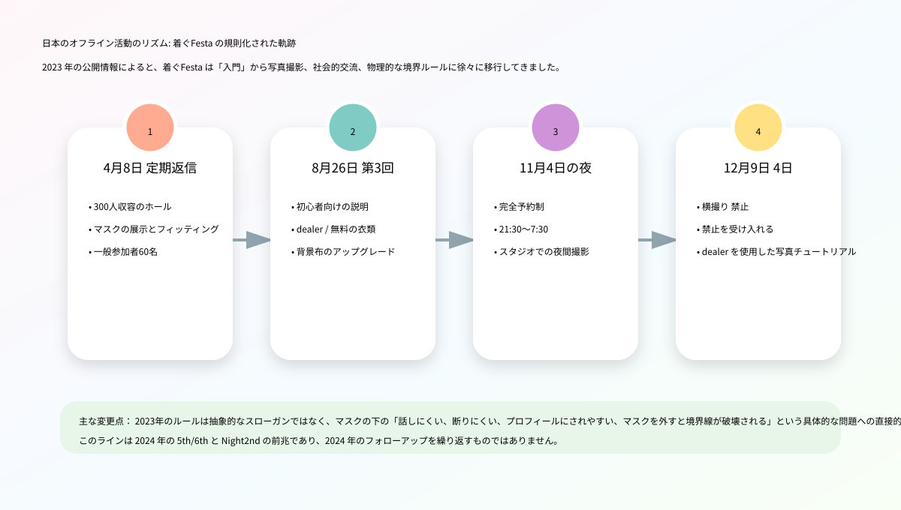
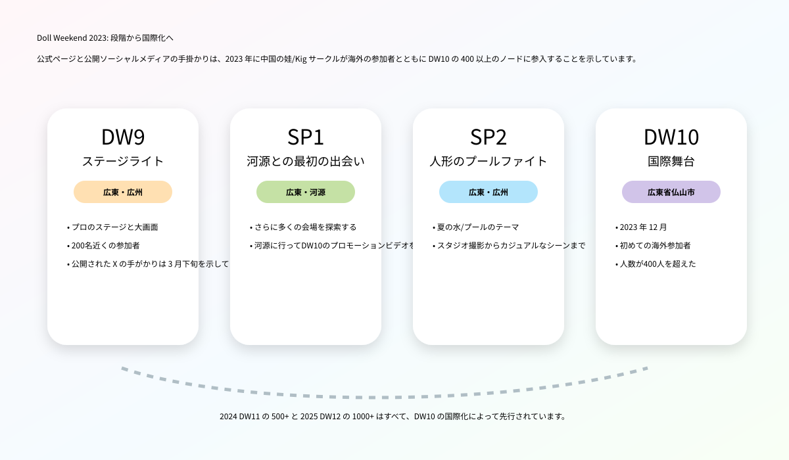

# 2023年 Kigurumi 編年史

> 本巻は当年の出来事、作品、公開資料を記録します。告知、開催記録、資料の発表を区別します。

## 2023年編年史

### 3月25日～26日：FGO × AnimeJapan 2023 - 公式コスプレイヤー / kigurumi グリーティングブース復帰

Fate/Grand Order は、2023 年 3 月 25 日から 26 日まで東京ビッグサイトで開催される AnimeJapan 2023 に展示されます。公式ページには、FGO ブースが東京ビッグサイト東展示棟 4 ホール J62 にあると記載されています。ブース内容には英雄の召喚などが含まれます。 photo studio、宝具展示、オフィシャルグッズ販売、『コスプレイヤー・着ぐるみグリーティング』。この記録は、単独のマスコットの一時的な登場ではなく、大規模展示会のブース運営内容に組み込まれるため、2023年の公式IP kigurumiラインにとって重要な始まりとなります。[[S1]](#s1)

AnimeJapanは、幅広い観客構成、高いブース密度、そして強い撮影ニーズが特徴です。 FGO ブース情報に kigurumi の挨拶を入力し、キャラクターの具現化がブース エクスペリエンスの一部となったことを示します。 FGOブースにお越しいただくと、小道具や電光掲示板、グッズ、ステージ情報などがご覧いただけるほか、公式コスプレイヤーやkigurumiに会うこともできます。 IP オペレーションの場合、この配置によりモバイル ゲームがスクリーンから会場スペースまで拡張されます。 kigurumi Shi の場合、これは「公式キャラクターのパペットと全頭マスクのインタラクション」が 2023 年になっても主流のコミック展示会の通常のツールの 1 つであることを証明しています。

マニア向けのanimegao kigurumiとは大きく異なります。 FGOブースのkigurumiは、運営者の正式な認可・管理のもとでのロールプレゼンテーションとなります。動き、インタラクションの境界、列の順序、写真撮影時間はすべてブース管理の対象となります。愛好家である kigurumi は、個人的なロールプレイング、写真、ファンのコミュニケーション、身体表現に重点を置いています。この 2 つを混同することはできませんが、一般の視聴者の目には、「二次元のキャラクターがフードをかぶった体で現実に現れることができる」という認識を共同で作り出します。

2024年、2025年のFGOイベントと比較すると、2023年のAnimeJapanは「復興とブース化」という意味が込められています。 2025年の記事ではすでに10周年記念のAnimeJapan 2025とFGO Fesをさらに大規模に収録しています。この記事では 2023 年のノードのみを保持します。この記事では、年初の大規模展示会での公式挨拶が掲載され、その後の FGO Fes の周年プレゼンテーションへの序曲となります。 2023年。

### 3月下旬頃：Doll Weekend 9「Light of the Stage」 - 中国語圏の娃/Kig 圏のステージノード

Doll Weekend 9の公式ページにはテーマが「ステージの光」と書かれており、場所は広東省広州です。また、人形のタレントショーに焦点を当て、200人近くが参加するプロ仕様のステージと大型スクリーンをDWが設置したのは今回が初めてであると説明している。パブリック[[S2]](#s2)[[S3]](#s3)

DW9 は、通常の集まりからステージまで、2023 年の中国の娃/Kig サークルの重要なノードです。そのキーワードは「最多人数」ではなく「プロのステージと大スクリーン」。これは、イベントがもはや写真家と 1 人のカイガーを中心に展開するだけでなく、参加者が視聴​​、表示、記録できる集合的なステージ環境に参加できるようになることを意味します。ステージと大型スクリーンは、キャラクターのパフォーマンス、キャットウォーク、タレント、ライブの観客への集合的な出演を増幅させることができ、また、動画を再び広めることも容易にします。

ステージングは​​、kigurumi/人形文化に二重の影響を与えます。正面から見ると、「娃」を静止した写真オブジェクトからパフォーマンスの主題へと進化させます。キャラクターの動き、歩き方、固定点、舞台照明、観客の反応のすべてが作品の効果に影響を与え始めます。マイナス面やリスクに目を向けると、ステージでは身体的な負担、視野の制限、ステージ内外の安全性、照明の温度、音楽のリズム、小道具のミスなども重要になります。特に、かぶり物をしていたり​​、視力が限られていたり、スタッフの指示がはっきりと聞こえなかったりするパフォーマーにとって、ステージは通常のコスプレキャットウォークの単純なレプリカではありません。

### 4月8日: 着ぐFesta 2023 定期リターン - マスク試着、白と黒の背景、一般参加者 60 名

2023年4月8日、荒川区サンパール荒川工房にて着ぐFesta定期交流会を開催しました。 TwiPlaページのヘッダーに表示される日付は2023年4月8日10時、イベントタイトルは「着ぐFesta! 着ぐるみさんと着ぐるみ好きさんのcommunicateイベント」です。同ページでは「予約なしで気軽に遊べるイベントも欲しい」という声からこのイベントが誕生したと説明されている。会場は結婚式や各種イベントも可能な約300名収容可能なホールで、主催者はGarageStudioC7です。同ページには、会場フロアは貸切、ホールとエントランスはkigurumiが使用可能、ステージと音楽室は楽屋とcloakとして使用可能、女子楽屋もある、と記載されている。オープン登録は 60 名の参加者を示しています。[[S4]](#s4)

このイベントの重要性は、2023年の日本のkigurumiファン活動におけるいくつかの基本的なニーズ（コミュニケーションスペース、ドレッシングスペース、撮影背景、マスク試着、メーカー相談、新規参入）を同時に提示することである。同ページでは、運営側が参加者がどのようなサービスを望んでいるのかを十分に把握できていないため、大規模なプランはあまり用意していないが、今後は参加者からのフィードバックを受けてコンテンツを用意していきたいとしている。しかし同時に、このページでは、協力的な個人プロデューサーのマスクの展示と試着を手配し、これがGarageStudioC7の目標である「お試ししてトークして気軽にできる」の第一歩であると述べています。[[S4]](#s4)

このテキストは歴史的に非常に価値があります。これは、2023年の着ぐFestaがまだ活動形態を模索しており、最初から成熟したプロセスを持っていないことを示しています。 animegao kigurumi の参入障壁は非常に高いため、マスクのフィッティングとカウンセリングは特に重要です。初心者にとって、ヘッドシェルのサイズ、視線、内部空間、装着の安定性、ウィッグのマッチング、顔のプロポーション、および肌の色の服装効果を写真だけで判断するのは困難です。イベントで試着したり、実物を見たり、メーカーに相談したりできるということは、もともとプライベートなチャットや注文、体験投稿などに散在していた知識をオフラインに移したことに相当します。

白と黒の背景の写真も、小さいながらも重要なインフラストラクチャです。 kigurumi モデリングでは、多くの場合、キャラクターのライン、特に大きな頭のシェル、かつら、スカート、肌色の服や靴のプロポーションを強調するために、よりクリーンな背景と制御された照明が必要です。公共の場で何気なく撮影するだけの場合、雑然とした背景、鏡の中に入ってくる通行人、地面の反射、光の色のずれなどがすべて効果に影響を与えます。 着ぐFesta 4 月号では、背景、試着、コミュニケーションが同じスペースに配置されており、コミュニティがすでに「初心者の入門」と「仕事の成果」という 2 つのニーズに同時に対応していることがわかります。

### 6月8日～11日: hololive production × 東京おもちゃショー 2023——公式マスコットが玩具/ファミリー市場に参入

hololive productionは、2023年6月8日から11日まで東京ビッグサイトで開催される「東京おもちゃショー2023」に出展いたします。電気ホビーウェブのレポートによると、hololive production がこのイベントに参加するのは今回が初めてです。東京おもちゃショーは、日本玩具協会が主催する日本最大のおもちゃの展示会です。前半2日間は企業関係者向け、後半2日間は子どもや家族連れなど一般向け。レポートには、hololive productionが一般公開日である6月10日と11日にブースでkigurumiグリーティングを実施することも記載されています。文字は「みこだにぇー」「スバルドダック」となります。着ぐるみの登場は11時・13時・15時の計3回の予定で、それぞれ30分程度。[[S5]](#s5)

このノードは、2024/2025 hololive SUPER EXPOとは異なる意味を持ちます。 SUPER EXPOはhololive独自の大規模ファンイベントであり、来場者のVTuberや派生キャラクターに対する理解度は高く、東京おもちゃショーは玩具産業およびファミリー向けの分野であり、聴衆にはビジネスマン、子供、親、一般の玩具消費者が含まれます。 hololive kigurumi の挨拶をここに配置することで、公式マスコットがコアなファンだけでなく、ブランドの世界観を一般の人に説明する入り口としても機能していることがわかります。

Kigurumi 編年史の観点から見ると、この種の挨拶の重要性は「サイト全体で表示される」ことです。これは animegao のファン イベントではありませんが、よりコアではない 2D 視聴者に「キャラクターが全頭マスク/マスコットのボディを通じて人々と対話する」という形式を体験させます。 みこだにぇー や スバルドダック などのキャラクター自体は、二次創作、ミーム文化、マスコット、VTuber の生態などの混合属性を持っています。これらをおもちゃショーに出品すると、仮想キャラクター、人形、マスコット、コスプレ、kigurumi の間の境界がさらに曖昧になります。

これは、2023年編年史が単なるファンの集まりではない理由も説明しています。外部社会が kigurumi を知る方法は 1 つではありません。FGO ブースで公式 kigurumi を見た人、hololive おもちゃフェアで mascot greeting を見た人、Doll Weekend ビデオで中国語圏の「娃」を見た人、そして animegao の愛好家と接触した人もいます。 着ぐFesta。これらの道は 2023 年には並行して存在し、2024/2025 年にさらに可視化される準備が整えられます。

### 6月下旬頃：Doll Weekend Special 1「源流との初遭遇」～現地探索とDW10プロモーションビデオプリプロダクション

Doll Weekend Special 1 の公式ページのタイトルは「河源との初遭遇」で、場所は広東省河源です。ページ説明: ドールイベントが開催される場所をもっと探索するために、Doll Weekend は初めて河源に行き、DW10 のプロモーション ビデオを撮影しました。パブリック X リンクは、公式アカウントが 2023 年 6 月下旬に SP1 写真に関連するコンテンツを投稿したことを示しています。公式ウェブサイトのページには完全な年、月、日が記載されていないため、この記事ではそれを「6 月下旬頃」と記録し、時間の位置を特定するための補助として X の手がかりのみを使用します。[[S6]](#s6)[[S7]](#s7)

SP1の意義は人数やステージの大きさではなく、「会場探索」にある。 kigurumi/ドールイベントの場合、会場は交換可能な背景ではありません。一般人が写真を撮るのに適したホテルや景勝地、カフェ、別荘地が必ずしもヘッドシェルプレイヤーに適しているとは限らず、着替えが隠れるか、空調は十分か、ヘッドシェルボックスが収納できるか、移動経路に階段はあるか、地面は滑りやすいか、長時間の撮影は可能か、無関係な観光客が多くなるか、休憩室は用意できるかなど、イベントの実現可能性を左右します。

河源は2025年のDW12で重要な場所になるが、2025年の記事ではすでにDW12での千人レベル、花火、ドローン、パレードが記録されている。この記事では、2023 年の前駆体として SP1 のみを記録します。公式ページには、SP1がさらに多くの会場を探索し、DW10のプロモーションビデオを撮影する予定であると記載されています。これは、Doll Weekend システムが 2023 年に固定都市や定期的な展示会に満足せず、よりグラフィックな雰囲気を持ち、画像の普及とその後の拡張に適したスペースを探し始めたことを示しています。

このような「前撮り」はイベントのブランディングにもなります。通常の集まりの後の写真もありますが、次回イベントのプロモーションビデオを撮影するということは、主催者が「また集まった」ではなく、「次はどんなテーマで、どんな街で、どんな雰囲気のイベントにするか」というイベントのストーリーを積極的に作り始めていることを意味します。したがって、2023 年の SP1 は、DW10 の国際化の前のブランド舗装と見なされるべきです。

### 7 月 1 ～ 4 日: Anime Expo 2023 および Aniplex / FGO kigurumi mini stage - 公式の北米 IP ラインの表示ノード

2023年7月1日から4日まで、Aniplex of Americaはロサンゼルスで開催されるAnime Expo 2023に参加します。 Aniplex の公式 PDF プレス リリースには、展示ホールにブース #1800、エンターテイメント ホールにブース #E-14 があると記載されています。ブース #E-14 は Fate/Grand Order を展示し、mini stage を特集し、視聴者はファンに人気の kigurumi の外観を見ることができます。 Aniplex公式ウェブサイトのページには、AX 2023の開催日、2つのブースの場所、FGO 6周年×TYPE-MOONプロジェクトなどの活動スケジュールも記録されています。[[S9]](#s9)[[S10]](#s10)

北米の展示会での kigurumi には、もう 1 つの特別な点があります。英語の文脈では、「kigurumi」はワンピースのパジャマと誤解されることが多いため、公式プレス リリースでは kigurumi の外観が直接使用されており、それ自体で一部の視聴者がこの言葉を再理解できるようになります。 FGO の公式 kigurumi は、animegao プレイヤーとは異なりますが、一般視聴者の「二次元のキャラクターの体を動かす」という認識に影響を与えます。来場者はanimegao、doller、gawa-cosの違いが分からないかもしれませんが、公式ブースではまずkigurumiに遭遇します。

2023 年の年間履歴から、Anime Expo 2023 は日本と中国以外の公開手がかりを補完します: FGO kigurumi/マスコット本体は、日本の AnimeJapan、Makuhari Fes.、およびアメリカの AX で使用されます。言い換えれば、2023 年の kigurumi の知名度は単一の地域的な現象ではなく、IP ブースの運営を通じて国境を越えたファンの分野に参入することになります。

### 7月29日～30日：FGOフェス。 2023夏祭り ～8th Anniversary～ ——公式コスプレイヤー9名と7体kigurumiによる周年記念プレゼンテーション

2023年7月29日から30日まで、Fate/Grand Order Fes. 2023 夏祭り ～8th Anniversary～にて幕张 Messeが開催されます。 GAME Watchのレポートには、カンファレンスは7月29日と30日の9時から18時まで開催され、場所は幕张 Messe国際展示ホールのホール9～11であると記載されています。 Inside Gamesの現場レポートによると、welcome roadではビデオパフォーマンスとBGMとともに観客が会場に入り、公式コスプレイヤーとkigurumiが出迎えたという。今回のレポート対象は公式コスプレイヤー9名とkigurumi7名でした。[[S11]](#s11)[[S12]](#s12)

このイベントは、FGO 2023 公式 kigurumi ラインの中で最も強力な年次ノードです。 AnimeJapan 2023はブース運営に近いですが、FGO Fes. 2023 年は記念すべき年です。周年イベントはより臨場感が増します。 welcome roadのレッドカーペット、大画面、BGM、公式コスプレイヤーとkigurumiが一体となって「エンター・カルデア・エンター・ザ・フェスティバル」の現場体験を構成します。ファンにとって、これは単なる集合写真ではなく、キャラクターの体を使ってゲームの世界を幕張に一時的に移動させるものです。

Inside Gamesでは、『ヒカリのコヤンスカヤ』と『バーヴァン・シー』のコスプレイヤーが初登場したことにも触れ、公式コスプレイヤーとkigurumiのフォトレポートとして位置づけている。これは、FGO のキャラクター プレゼンテーション レイヤリングが非常に成熟していることを示しています。現実のコスプレイヤーは一部のキャラクターの人型再現を担当し、kigurumi はマスコットまたは全頭マスクの物理的表現に適したキャラクターを担当します。この二つが展覧会の入り口の雰囲気を形成します。 Kigurumi 編年史にとって、7 体の kigurumi は孤立した人物ではなく、公式ショーが「一度に登場する複数のキャラクターの身体」を視聴可能なシーンに変えた証拠です。[[S11]](#s11)

2024年の9周年、2025年の10周年に比べ、2023年のキーワードは「夏祭り」と「8周年」。この記事では、その後の人数や役割の変化を繰り返すのではなく、2023年に形成された構造のみを記録します。FGOは、日本での大規模な記念イベントでマルチボディのkigurumiと公式コスプレイヤーで観客を迎えます。キャラクターの物理化はもはやブースの単なる付属品ではなく、周年記念イベントの重要な一部となっています。

### 8月4日～6日: World Cosplay Summit 2023 - 「完全復活」と熱中症管理の前文

World Cosplay Summit 2023は、2023年8月4日から6日まで愛知県名古屋市で開催されます。 WCSの公式PR Timesプレスリリースでは、今年を「完全復活」と呼び、流行前に世界中の予選を経て来日した代表的なコスプレイヤーがWCSの最大の特徴の1つであると説明しました。 2022年は入国制限などの理由で参加国の数はまだ限られているが、2023年には33の国と地域から参加することが見込まれている。日本の外務省のページには、2023年の第21回WCSが8月4日から6日まで名古屋で開催されたことも記録されている。世界コスプレチャンピオンシップには33の国と地域のチームが参加した。英国チームが優勝し、外務大臣賞を受賞した。[[S13]](#s13)[[S14]](#s14)

kigurumiにとってWCS 2023の重要性は、専用のkigurumiパーティーを開催することではなく、公共空間の回復と主流のコスプレコンベンションの国際交流を表すことです。大規模な主流イベントが再開されると、kigurumi、全頭マスク、厚着、顔を覆う服、長い小道具、写真撮影の同意、熱中症症候群、通行人のカメラ内への侵入などの問題が再び現実になるでしょう。 2023 年の WCS の公共性は特に強いです。公式ルールは、会場は公共の場所であり、一般の参加者や通行人も参加すること、参加者は一般の観光客や店舗の邪魔にならないように注意することを思い出させることから始まります。

WCS 2023年のルールページに服装管理における暑さと身体への負担が追加されました。服装、小道具、着替えなどに記載されておりますが、露出が多すぎる、先端が尖りすぎる、丈が長すぎて歩きにくい、「脱水症状の可能性が高い」などの過度な服装は避けるようスタッフから参加者にお願いする場合があります。また、写真撮影の交換品には、撮影場所を長時間占拠しないこと、人目につくポーズや過度なローアングルでの撮影をしないこと、被写体の同意なしに撮影しないことも求められます。[[S15]](#s15)

WCS 2023 の熱中症予防ページはより具体的です。同ページでは、2023年の開催日は猛暑が予想されるため、参加者は水分補給、頻繁な休憩、冷却用品の使用、強い日差しの中では無理に参加しないこと、体調が優れない場合はツアースタッフに連絡することなどを呼びかけている。これらは2024年と2025年にさらに明確になるだろうが、2023年にはすでに夏のコスプレが身体的リスクと結びついている。ヘッド シェル、ウィッグ、タイツ、パッド、キャラクター シューズは冷却と可動性を損なう可能性があるため、これらのルールは kigurumi パフォーマーにとって特に重要です。[[S16]](#s16)

したがって、WCS 2023 は「ルール前ノード」です。 2025年ルールのようなkigurumi、gawa-cos、doller、フルフェイスマスク、ヘルメット、その他の顔を覆う衣類の参加条件は明確に記載されていないが、着ぐるみは脱水症状を引き起こす可能性があること、写真撮影は約束を得る必要があること、公共の場所は人々の邪魔をしてはならないことなどの基本的な問題をシステムテキストに書き込んでいる。その後の数年間のより明確なマスキング規則と夏の安全ガバナンスは、2023 年の公共イベントの再開に向けた実際の圧力によるものであると考えられます。

### 8月26日: 着ぐFesta! 3日——イベントコンセプトに「着ぐるみさんは语れない」を書き込む

2023年8月26日、着ぐFesta！第3回は荒川区サンパール荒川工房にて開催されました。 TwiPlaヘッダーには2023年8月26日10時の日付が表示され、タイトルは「着ぐFesta! 3rd 着ぐるみさんと着ぐるみ好きさんのcommunicateイベント」となっています。このページでは「予約不要で気軽に参加できる300人規模のロビーコミュニケーション」という位置付けを継続しており、具体的には「kigurumi」の初めてのプレイヤーも楽しく帰れるはずだと述べられている。 kigurumi フレンドがいないソロ プレイヤーもフレンドを作りに来てください。上手なプレイヤーも、このような新しい人や雰囲気を見ると、積極的にコミュニケーションを取りたくなります。[[S17]](#s17)

3ページ目の最も注目すべき文章は社会的困難についての説明です。主催者は、このイベントを見て多くの人がとても喜んでくれたと書いています。主催者は、このイベントが「この問題を解決したい」ということから始まったことを明らかにしました。[[S17]](#s17)

この文章が重要である理由は、kigurumi の社会的メカニズムを明確に説明しているからです。外部の視聴者は、kigurumi を視覚的なスペクタクルであると見なすことがよくありますが、参加者が直面する本当の困難は、多くの場合コミュニケーションです。キャラクターは正常に話すことができず、視線も正確ではない可能性があります。相手は、あなたが写真を撮られる気があるのか​​、聞こえるのか、見えるのか、休みたいのかなど知りません。また、新人は知り合いがいないため、溶け込むことができない場合もあります。 着ぐFesta 3 回目 この問題をイベントページに書くことは、kigurumi イベントが社会の入り口を積極的に設計する必要があることを認めているのと同じであり、「誰もが自然に知っている」だけに頼ることはできません。

3rd では、業界/リソースの流れもより明確になり始めています。ページには、マスクdealerや衣料品総合買取事業者、同人誌即売会など、kigurumiおよび関連するdealerの参加を歓迎しており、マスクから肌タイツ、衣料品まで何でも相談できるとしてCLSが参加対象として挙げられている。このページでは無料の服装公開や白と黒の背景撮影も設定されており、前ページよりも背景が大きくて使いやすくなっていると説明されています。オープン登録では 36 名の参加者があった。[[S17]](#s17)

4月に比べて8月3日は人の数は少ないように思えますが、ルールや物語はより成熟しています。 4 月のレビューでは、参加者が何を必要としているかを検討しているようです。 3 回目のレビューでは、新規参入者のジレンマ、コミュニケーションの目標、dealer の参加、写真インフラストラクチャーがより明確に述べられています。これは12月4日のルールが完成する前のストップであり、2024年の5日/6日の直接の歴史となる。

### 11 月 4 ～ 5 日: 着ぐFesta!夜 - オールナイトのスタジオ撮影活動とクローズド会場のルール

2023年11月4日の夜、着ぐFesta！夜はChrome Studio川口で開催。 TwiPla ページのヘッダーには、開始時間が 2023 年 11 月 4 日の 21:30 であることが示されています。ページでは、特別なスタジオ撮影イベントと呼んでいます。開催時間は21時30分～翌7時30分。場所はChrome Studioです。川口ホール全館貸し切り4,000円。完全予約制となり、当日参加は受け付けておりません。オープン登録ステータスは 22/30 人の参加者を示しています。[[S18]](#s18)

Nightの意義は、通常の着ぐFestaとは異なるルートをたどることにあります。レギュラープログラムは予約不要・当日参加・コミュニケーション優先を重視し、ナイトプログラムは完全予約制・人数制限・スタジオ撮影・オールナイト撮影となります。この違いは、2023 年の日本の kigurumi ファン活動が 2 つのタイプのニーズに分かれていることを示しています。1 つは、新しい人々にとってフレンドリーで社会的な参入であり、もう 1 つは、作品の撮影に適した、より静かで制御しやすいクローズドな会場です。オールナイトスタジオは日中の公共スペースの人の流れを避け、長時間の撮影や衣装替えも可能です。

しかし、徹夜してもリスクが低くなるわけではありません。 kigurumi パフォーマーがヘッドシェル、ウィッグ、タイツ、キャラクターシューズを長時間着用すると、肉体的な負担が蓄積され続けます。夜の後半の集中力の低下、水分補給の不足、帰りの交通手段、睡眠不足はすべて安全に影響します。このページではまた、女性用ロッカールームには事前に連絡する必要があることについても具体的に触れており、スタジオ会場の手配にも協定やスペース制限があり、すべてのニーズに一時的に現場で対応できるわけではないと説明している。[[S18]](#s18)

Night のルールテキストは、その後の 着ぐFesta ルールと非常に一致しています。このページは 横撮り を禁止しており、対象者の同意が必要です。 kigurumi状態では意味を表現することが難しく、過剰な接触を拒否できない問題が発生する可能性があるため、ハグは禁止。長尺物を振ることを禁止します。ロッカールーム外およびcloakで顔を外すことを禁止します。また、頭部の変形を引き起こす広角を避けるため、接写撮影には 50 mm 未満の短い焦点距離を使用しないなど、カメラの基本的な提案を示します。携帯電話を使用している場合は、ズームバックおよびズームインできます。

このちょっとしたカメラに関するアドバイスは、2023 年の「技術的に洗練された」素材の珍しいケースです。イベント主催者が秩序を守るだけでなく、kigurumi 写真の品質を向上させようとしていることがわかります。 kigurumi マスクとキャラクターのプロポーションは、レンズの焦点距離に非常に影響されます。広角のクローズアップショットでは、頭が大きくなり、体が圧縮されるため、すでに誇張されているキャラクターのプロポーションのバランスが崩れます。適切な距離と焦点距離により、2 次元キャラクターの視覚的ロジックをより近づけることができます。したがって、夜は通常の夜間イベントではなく、写真撮影技術、同意のルール、徹夜での身体的エネルギー、および閉鎖された現場管理を組み合わせた実験です。

### 12 月 9 日: 着ぐFesta! 4番目—写真撮影​​の同意、ハグの禁止、およびdealerシステムがさらに成文化されました

2023年12月9日、着ぐFesta！第4回は荒川区サンパール荒川工房にて開催。 TwiPlaのページには、開催時間は10時から16時、場所はやはりサンパール荒川シャオホール、主催者はGarageStudioC7、参加条件はkigurumiと記載されています。参加者やkigurumiが好きな人は、自分のkigurumiをお持ちでなくてもご参加いただけます。また、過去に他の活動で問題を起こした方、またはその可能性がある方は参加をお断りし、主催者から具体的な理由を説明できない場合があることも改めて記載されています。オープン登録では 37 名の参加者があった。[[S19]](#s19)

4位は着ぐFestaの2023年のレギュラー化が最も明確です。活動内容では「質の高さ」を追求した活動ではないと説明していますが、kigurumi同士がコミュニケーションをとり、新規参入者が楽しく帰っていけることを願っています。次に、ルールがリストされます。横撮り は、他人が射撃しているときに許可なく横から射撃することを禁止します。たとえ撮影される人がそれを見ることができたとしても、同意が得られなければ、それは率直な写真になります。同ページではまた、アイライナーのない写真は見栄えが悪くなり、kigurumiの出演者が哀れに見える傾向があるとも指摘している。[[S19]](#s19)

ハグ禁止の理由も非常に具体的で、kigurumiを着ている人と着ていない人では距離感が人それぞれ違うので、ただし、kigurumi の出演者は話すことができず、意味を表現することが難しく、過剰な接触を拒否できない可能性があるため、紛争を防ぐためにハグを禁止する必要があります。このルールは、「かわいいキャラクターは気軽に抱きしめられる」という外部の誤解を、「キャラクターの身体は依然として参加者自身のものであり、接触は明確な同意に基づいていなければならない」に直接修正するため、非常に重要です。[[S19]](#s19)

第４条もラウンド数に応じて参加者が増えることを理由に長尺物を振る行為を禁止している。会場は大変広いですが、小道具の紛失等の事故により怪我をする可能性がございますので、ご了承ください。また、基本的に一般参加者立ち入り禁止のフロアであっても、施設スタッフが立ち入る可能性があり、個人の判断に頼ることができないため、ロッカールームとcloak以外での顔の削除は禁止と規定されている。このルールは、2023 年の kigurumi 活動がすでに「役割イメージ」、「プライバシー」、「施設スタッフ」、「公的責任」の関係を扱っていることを示しています。[[S19]](#s19)

フロント構築では、4thが継続して撮影とdealerを強化します。ページには、スタッフ撮影サービスがあり、後日まとめて写真をアップしますと記載されており、撮影した写真はSNSで公開する場合があると説明されており、また、第3回で好評を博した「着ぐるみさんの粉砕研修」は、「一眼レフは持っているけど何気なく撮っているかもしれない」という人向けにカメラの基礎を学べる「着ぐるみさんの粉砕研修」を1日2回開催するとも記載されており、同時に、kigurumiマスクも引き続き歓迎されていますdealer、アパレル業界、同人誌などが参加し、CLSが再び展示されました。白と黒の背景もローアングル撮影時の摩耗を防ぐために非常に強化されていますが、同時に柱に頼らないことを思い出させます。[[S19]](#s19)

### 12月: Doll Weekend 10 「国際ステージ」 - 400名以上、初の海外参加者と中国語圏の娃/Kig 圏の国際化ノード

Doll Weekend 10の公式ページによると、イベントのテーマは「インターナショナルステージ」、時期は2023年12月、場所は広東省仏山市となる。ページには次のように記載されています。DW10 は初めて海外からの参加者を歓迎し、その数は 400 名を超えました。Doll Weekend は正式に多文化が交わる国際的な人形交換プラットフォームになりました。公式サイトには、「DW10 長編映画 世界初のドール展」「DW10 トレーラー 二次元ドールが三次元でカフェを開く」などの動画コンテンツのほか、集合写真、現場写真、看板娘、周辺機器などのフォトアルバムカテゴリーも掲載されている。[[S20]](#s20)

DW10 は、2023 年の中国の kigurumi/人形サークルで最も重要な確認可能なノードです。 DW9 との違いは非常に明確です。DW9 はプロのステージと 200 名近くのメンバーを重視しているのに対し、DW10 は海外からの参加者、400 人以上の規模と国際性を重視しています。参加者数は200名近くから400名以上に増加。代表的なイベントはもはや単なる地元プレイヤーの集まりではなく、地域を越えた動員、会場主催、撮影企画、出展者・周辺機器・ポスター・画像発信まで総合的に対応できる。

DW10 は、中国のコミュニティが動画を中核的な資産とみなしていることも示しています。公式ウェブサイトのページでは、単なるテキストの発表をリストするのではなく、長編映画、予告編、B ステーション、フォトギャラリー、看板娘、周辺機器を同じイベントページに掲載しています。 kigurumi/ドール イベントでは、ビデオ録画が非常に重要です。多くのキャラクターは、アクション、グループ シーン、集合写真、ステージ、インタラクションの中でしか「生きている」ことができません。 DW10 は、公式画像を通じてこのイベントをオフラインの集まりからバイラルな毎年恒例のイベントに変えました。

2024年のDW11や2025年のDW12と比較すると、DW10の歴史的位置づけは「国際化前夜の本当の閾値」と書くべきだろう。 DW12 のような何千人もの人々、花火、ドローン、パレードはありませんし、DW11 のようなテーマを記録する才能もありません。しかし、400 人を超える海外からの参加者、佛山のイベント ページ、画像、異文化間での位置付けを完了しました。 2023 年に DW10 がなければ、今後 2 年間の拡大には明確なはしごが欠けてしまいます。

## 参考文献

**[S1] Fate/Grand Order 公式：AnimeJapan 2023 展示会情報**
https://news.fate-go.jp/2023/aj2023/

**[S2] Doll Weekend 9公式イベントページ：ステージの光**
https://dollweekend.cn/cn/event/dw9/

**[S3] Doll Weekend 公式X：Doll Weekend 9へようこそ**
https://x.com/doll_weekend/status/1640343531914137600

**[S4] TwiPla: 着ぐFesta 2023 年 4 月 8 日の定期的なコミュニケーション活動**
https://twipla.jp/events/542391

**[S5] 电竞猜ーウェブ：hololive production 東京おもちゃショー2023にkigurumiで出展しました ご挨拶**
https://hobby.dengeki.com/news/1938607/

**[S6] Doll Weekend Special 1 公式イベントページ: 河源との初遭遇**
https://dollweekend.cn/cn/event/dwsp1/

**[S7] Doll Weekend 公式 X: SP1 写真の手がかり**
https://x.com/doll_weekend/status/1673201225146449922

**[S9] Aniplex of America: Anime Expo 2023 公式プレスリリース PDF**
https://aniplexusa.com/pdf/PR_060623_AX2023.pdf

**[S10] Aniplex of America: Anime Expo 2023 ページ**
https://aniplexusa.com/ax2023/

**[S11] Inside Games: FGO フェス。 2023年公式コスプレイヤーkigurumiフォトレポート**
https://www.inside-games.jp/article/2023/07/29/147497.html

**[S12] GAME Watch：Fate/Grand Orderフェス。 2023夏祭りレポート**
https://game.watch.impress.co.jp/docs/news/1520006.html

**[S13] PR TIMES/WCS：World Cosplay Summit 2023完全復活のお知らせ**
https://prtimes.jp/main/html/rd/p/000000029.000061165.html

**[S14] 外務省: World Cosplay Summit 2023**
https://www.mofa.go.jp/p_pd/ca_opr/page23e_000653.html

**[S15] WCS 2023 参加規約**
https://worldcosplaysummit.jp/2023/cosplay/rule/

**[S16] WCS 2023 熱中症予防と予防対策**
https://worldcosplaysummit.jp/2023/cosplay/heatstroke/

**[S17] TwiPla: 着ぐFesta! 3位**
https://twipla.jp/events/568769

**[S18] TwiPla: 着ぐFesta!夜**
https://twipla.jp/events/577287

**[S19] TwiPla: 着ぐFesta! 4位**
https://twipla.jp/events/577822

**[S20] Doll Weekend 10 公式イベントページ：インターナショナルステージ**
https://dollweekend.cn/cn/event/dw10/
