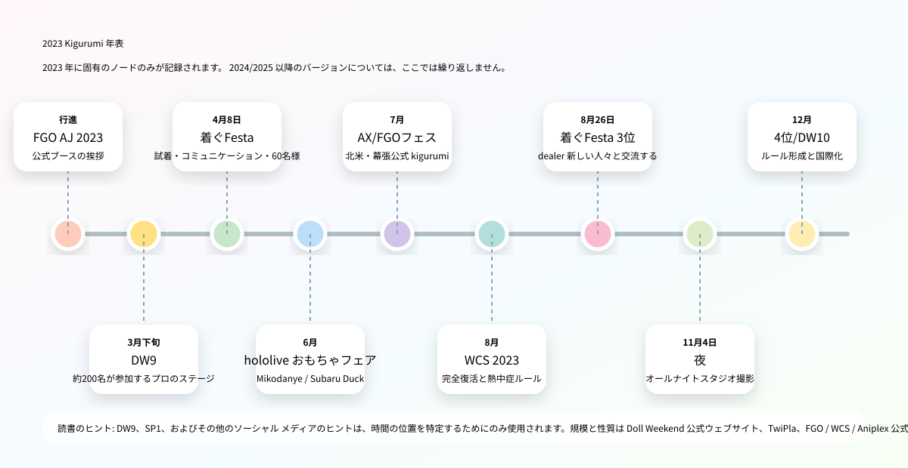
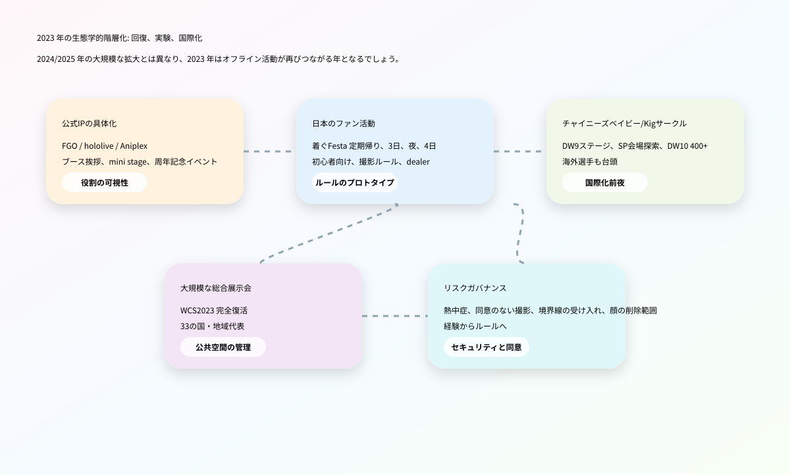
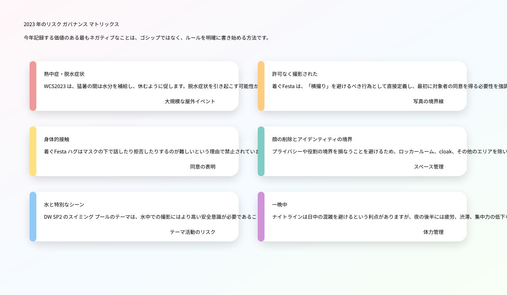
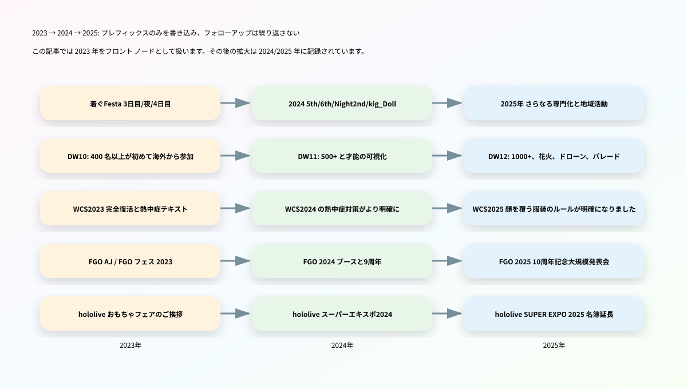

# 2023年 Kigurumi 編年史

> 編纂方針: この記事は、「2025 年 Kigurumi 編年史」および「2024 年 Kigurumi 編年史」の構造に従いますが、2024 年と 2025 年に記録されたイベント バージョン、ルールの更新、業界の拡大については繰り返しません。同じ一連のアクティビティで、バージョン前のバージョン、独立したルール、スケール ノード、または 2023 年の最初の変更がすでに発生している場合、そのステータスは2023 年が記録されます。それが後年に詳細に書かれた単なる背景説明である場合、この記事では要約した説明のみを提供します。

---

## 0. データ境界、重複整理の原則、および信頼性に関する指示

この 2023 年のクロニクルの **kigurumi** は、前の 2 つの記事の広範な内容に従って構成されています。animegao kigurumi / 美少女 着ぐるみ / マスク型ロールプレイ、doller、中国語圏の「娃 / Kig / Kiger」オフライン アクティビティ、公式 IP を含むマスコット スタイルの 着ぐるみ の挨拶と、大規模なコスプレ イベントでの全頭マスク、顔を覆う、熱中症、写真撮影の同意を含むルール テキスト。用語については 2025 年の記事で詳しく説明されています。この記事では、長い定義を繰り返しません。必要に応じて、「公式 mascot greeting」、「愛好家 kigurumi の活動」、「中国語圏の Doll Weekend / 娃展」、「主流のコスプレ会議のルール」の 4 種類の情報のみを区別します。

この記事は公開情報を優先する原則を採用しています。信頼性の高い情報には、FGO、WCS、hololive、Aniplex、Doll Weekend、および TwiPla イベント ページが含まれます。会場の規模、登場人物の数、ブースの配置を補うためのメディア報道。 X/Twitter、Facebook、Bilibili、YouTube 他のソーシャル プラットフォームは、タイムラインやイベントの雰囲気を判断するためにのみ使用され、未確認の告発の根拠としては使用されません。匿名の暴露、プライベートグループチャット、削除された投稿、噂のスクリーンショットは事実の記録には含まれません。

2024 年と 2025 年に整理されたコンテンツは、次のルールに従って重複整理されます。

| 重複整理タイプ | 2023年記事処理方法 |
|---|---|
| 同じ一連の出来事が 2024/2025 年にも続く | 2023 年の前バージョン、今年のルール、および今年のスケールのみを記述し、後続の年の詳細を繰り返さないでください。 |
| 2025 kigurumi 用語の説明 | 必要なレベルのみを維持し、長い定義を繰り返す必要はありません。 |
| 2024/2025 WCS 熱中症、顔を覆うルールを作成 | 2023年に登場した前文と「完全復活」の背景だけ書く |
| 2024/2025 書き込み Doll Weekend 11/12 | DW9、SP1、SP2、DW10、および 2023 年の国際化前夜のみを記述してください |
| 公式 IP greetingはその後も継続される | 2023 年バージョンのショーと役割/番号の変更について書いています。 |
| 噂と性格論争 | 未確認の告発を改めて述べず、開示規則に示されているガバナンス上の圧力のみを文書化する |

---

## 1. 2023 年の全体的な状況

2023年は2024年や2025年の縮小版ではなく、より根本的な「つながりの年」です。 2024年が専門的な活動が具体化され、知識生産が集中し、リスク管理が明確になる年であり、2025年が規模拡大と越境化がさらに加速する年であるとすれば、2023年のキーワードは**感染症流行後のオフライン回復、ファン活動の定期化、公式 IP greetingの安定的復帰、中国語圏の娃/Kig 圏の国際化前夜**に近づく。

最初の本線は、日本のファン活動の再開とルールの原型です。公開情報によると、着ぐFesta は 2023 年 4 月、8 月、11 月、12 月に検索可能なアクティビティ ページを残しました。4 月には 60 人の一般登録参加者、マスクの展示と試着、白と黒の背景の写真撮影が行われました。 8 月 3 日 「初心者に優しい」と「着ぐるみ さんは話せない」によって引き起こされる社会的障壁をより明確に強調し始める。 11月の夜はオールナイトスタジオ撮影に挑戦しました。 12月4日、横撮り、ハグ禁止、長物禁止、楽屋・cloak以外顔出し禁止、写真教室、dealer 参加などの内容をより体​​系的に書いています。これは、2023年の日本のkigurumi小規模イベントが「集まる場所の開催」から「コミュニケーション、写真撮影、身体の境界をルールに書き込む」ことに移行したことを示している。

2 番目の特徴は、公式 IP の物理化が主要な展示会で引き続き行われているということです。 FGO は AnimeJapan 2023 でコスプレイヤー / kigurumi の挨拶を手配しました。 FGOフェス。 2023年サマーフェスティバル、メディアは観客を迎えるためのwelcome road待機エリアで9人の公式コスプレイヤーと7体のkigurumiを記録しました。 Aniplex of Americaは、Anime Expo 2023のエンターテイメントホールブースにFGO mini stageを手配し、ファンに人気のkigurumiの出演があると述べました。 hololive productionは東京おもちゃショー2023に出展し、一般公開日には「みこだにぇー」と「スバルドダック」のkigurumiグリーティングを手配します。このラインは animegao ファンとまったく同じではありませんが、「全頭マスク/マスコットの体でシーンに登場する二次元キャラクター」を一般視聴者の手の届く範囲に保ちます。

3 番目の主要な方針は、中国の Doll Weekend システムが段階から国際化に移行することです。 2025年の記事ではすでにDW12の千人規模の観衆、花火、ドローン、パレードについて書いている。 2024 年の記事では、DW11 の 500+ と才能の視覚化について書かれています。この記事は 2023 年のプリプロダクションのみを記録しています。DW9 の「ステージ ライト」ページには、プロ仕様のステージと大型スクリーンが初めて装備され、200 人近くの参加者がいると記載されています。 SP1 は会場を探索し、DW10 プロモーション ビデオを撮影するために河源に行きました。 「ドールプールバトル」をテーマにしたSP2。 DW10は2023年12月に広東省佛山市で開催される予定。公式ページには初めて海外からの参加者を歓迎し、参加者数は400名を超え、多文化が交差する国際的な人形交換プラットフォームになると記載されている。

4 番目のスレッドは、主流のコスプレ コンベンションの回収と安全ルールです。 WCS 2023は正式に「完全復活」として宣伝されており、イベントは8月4日から6日まで名古屋/愛知で開催されます。外務省の記録によると、この年の世界​​コスプレ選手権には33の国と地域のチームが参加した。 WCS 2023のルールページには、kigurumi、gawa-cos、doller、フルフェイスマスクなどの顔を覆うカテゴリーが2025年ほど明確にリストされていないが、衣装小道具のルールには、露出過剰、シャープすぎる、長すぎる、歩きにくい、または危険を引き起こす可能性がある着ぐるみカテゴリーが記載されている。脱水症状のある方はスタッフの判断によりお断りする場合がございます。熱中症予防のページでは、2023年の大会当日は非常に暑くなることが予想され、水分補給、休息、冷却、体調管理が必要であることも注意喚起されている。

したがって、2023 年の kigurumi の年間順位は次のように要約できます。 **これは最大の年ではありませんが、その後の多くの拡大にとって主要な年です。 **着ぐFesta の正規化、DW10 の国際化、WCS の完全復活、FGO/hololive/Aniplex の公式挨拶、熱中症と写真撮影の同意の問題に関する公開文書はすべて、2024 年と 2025 年のより大規模で明確なシステムへの道を切り開いています。

---

## 2. 2023年編年史

### 3月25日～26日：FGO × AnimeJapan 2023 - 公式コスプレイヤー / kigurumi グリーティングブース復帰

Fate/Grand Order は、2023 年 3 月 25 日から 26 日まで東京ビッグサイトで開催される AnimeJapan 2023 に展示されます。公式ページには、FGO ブースが東京ビッグサイト東展示棟 4 ホール J62 にあると記載されています。ブース内容には英雄の召喚などが含まれます。 photo studio、宝具展示、オフィシャルグッズ販売、『コスプレイヤー・着ぐるみグリーティング』。この記録は、単独のマスコットの一時的な登場ではなく、大規模展示会のブース運営内容に組み込まれるため、2023年の公式IP kigurumiラインにとって重要な始まりとなります。[[S1]](#s1)

AnimeJapanは、幅広い観客構成、高いブース密度、そして強い撮影ニーズが特徴です。 FGO ブース情報に kigurumi の挨拶を入力し、キャラクターの具現化がブース エクスペリエンスの一部となったことを示します。 FGOブースにお越しいただくと、小道具や電光掲示板、グッズ、ステージ情報などがご覧いただけるほか、公式コスプレイヤーやkigurumiに会うこともできます。 IP オペレーションの場合、この配置によりモバイル ゲームがスクリーンから会場スペースまで拡張されます。 kigurumi Shi の場合、これは「公式キャラクターのパペットと全頭マスクのインタラクション」が 2023 年になっても主流のコミック展示会の通常のツールの 1 つであることを証明しています。

マニア向けのanimegao kigurumiとは大きく異なります。 FGOブースのkigurumiは、運営者の正式な認可・管理のもとでのロールプレゼンテーションとなります。動き、インタラクションの境界、列の順序、写真撮影時間はすべてブース管理の対象となります。愛好家である kigurumi は、個人的なロールプレイング、写真、ファンのコミュニケーション、身体表現に重点を置いています。この 2 つを混同することはできませんが、一般の視聴者の目には、「二次元のキャラクターがフードをかぶった体で現実に現れることができる」という認識を共同で作り出します。

2024年、2025年のFGOイベントと比較すると、2023年のAnimeJapanは「復興とブース化」という意味が込められています。 2025年の記事ではすでに10周年記念のAnimeJapan 2025とFGO Fesをさらに大規模に収録しています。この記事では 2023 年のノードのみを保持します。この記事では、年初の大規模展示会での公式挨拶が掲載され、その後の FGO Fes の周年プレゼンテーションへの序曲となります。 2023年。

### 3月下旬頃：Doll Weekend 9「Light of the Stage」 - 中国語圏の娃/Kig 圏のステージノード

Doll Weekend 9の公式ページにはテーマが「ステージの光」と書かれており、場所は広東省広州です。また、人形のタレントショーに焦点を当て、200人近くが参加するプロ仕様のステージと大型スクリーンをDWが設置したのは今回が初めてであると説明している。パブリック[[S2]](#s2)[[S3]](#s3)

DW9 は、通常の集まりからステージまで、2023 年の中国の娃/Kig サークルの重要なノードです。そのキーワードは「最多人数」ではなく「プロのステージと大スクリーン」。これは、イベントがもはや写真家と 1 人のカイガーを中心に展開するだけでなく、参加者が視聴​​、表示、記録できる集合的なステージ環境に参加できるようになることを意味します。ステージと大型スクリーンは、キャラクターのパフォーマンス、キャットウォーク、タレント、ライブの観客への集合的な出演を増幅させることができ、また、動画を再び広めることも容易にします。

ステージングは​​、kigurumi/人形文化に二重の影響を与えます。正面から見ると、「娃」を静止した写真オブジェクトからパフォーマンスの主題へと進化させます。キャラクターの動き、歩き方、固定点、舞台照明、観客の反応のすべてが作品の効果に影響を与え始めます。マイナス面やリスクに目を向けると、ステージでは身体的な負担、視野の制限、ステージ内外の安全性、照明の温度、音楽のリズム、小道具のミスなども重要になります。特に、かぶり物をしていたり​​、視力が限られていたり、スタッフの指示がはっきりと聞こえなかったりするパフォーマーにとって、ステージは通常のコスプレキャットウォークの単純なレプリカではありません。

DW9 を 2023 年代の年代記に書き込むことは、DW10 の 400 名を超える海外からの参加者がどこからともなく現れたわけではないことを説明するためです。 DW9 のステージングは​​、中国のサークルが 2023 年に kigurumi/人形イベントを「展示可能なプログラム」に変え始めたことの証拠です。タレントパレスと 2024 年の DW11 の完全収録、および 2025 年の DW12 の祝典はすべて、DW9 のプロのステージ ロジックに見出すことができます。

### 4月8日: 着ぐFesta 2023 定期リターン - マスク試着、白と黒の背景、一般参加者 60 名

2023年4月8日、荒川区サンパール荒川工房にて着ぐFesta定期交流会を開催しました。 TwiPlaページのヘッダーに表示される日付は2023年4月8日10時、イベントタイトルは「着ぐFesta! 着ぐるみさんと着ぐるみ好きさんのcommunicateイベント」です。同ページでは「予約なしで気軽に遊べるイベントも欲しい」という声からこのイベントが誕生したと説明されている。会場は結婚式や各種イベントも可能な約300名収容可能なホールで、主催者はGarageStudioC7です。同ページには、会場フロアは貸切、ホールとエントランスはkigurumiが使用可能、ステージと音楽室は楽屋とcloakとして使用可能、女子楽屋もある、と記載されている。オープン登録は 60 名の参加者を示しています。[[S4]](#s4)

このイベントの重要性は、2023年の日本のkigurumiファン活動におけるいくつかの基本的なニーズ（コミュニケーションスペース、ドレッシングスペース、撮影背景、マスク試着、メーカー相談、新規参入）を同時に提示することである。同ページでは、運営側が参加者がどのようなサービスを望んでいるのかを十分に把握できていないため、大規模なプランはあまり用意していないが、今後は参加者からのフィードバックを受けてコンテンツを用意していきたいとしている。しかし同時に、このページでは、協力的な個人プロデューサーのマスクの展示と試着を手配し、これがGarageStudioC7の目標である「お試ししてトークして気軽にできる」の第一歩であると述べています。[[S4]](#s4)

このテキストは歴史的に非常に価値があります。これは、2023年の着ぐFestaがまだ活動形態を模索しており、最初から成熟したプロセスを持っていないことを示しています。 animegao kigurumi の参入障壁は非常に高いため、マスクのフィッティングとカウンセリングは特に重要です。初心者にとって、ヘッドシェルのサイズ、視線、内部空間、装着の安定性、ウィッグのマッチング、顔のプロポーション、および肌の色の服装効果を写真だけで判断するのは困難です。イベントで試着したり、実物を見たり、メーカーに相談したりできるということは、もともとプライベートなチャットや注文、体験投稿などに散在していた知識をオフラインに移したことに相当します。

白と黒の背景の写真も、小さいながらも重要なインフラストラクチャです。 kigurumi モデリングでは、多くの場合、キャラクターのライン、特に大きな頭のシェル、かつら、スカート、肌色の服や靴のプロポーションを強調するために、よりクリーンな背景と制御された照明が必要です。公共の場で何気なく撮影するだけの場合、雑然とした背景、鏡の中に入ってくる通行人、地面の反射、光の色のずれなどがすべて効果に影響を与えます。 着ぐFesta 4 月号では、背景、試着、コミュニケーションが同じスペースに配置されており、コミュニティがすでに「初心者の入門」と「仕事の成果」という 2 つのニーズに同時に対応していることがわかります。

このイベントと2024年の着ぐFesta 5位/6位との違いも明らかです。 2024 年の記事では、より成熟したフォローアップ ルールについてすでに書かれています。この記事は、2023 年 4 月の「探索状況」のみを記録しています。すでに 60 名の一般参加者と予備サービスが提供されていますが、参加者のフィードバックを通じて活動の方向性を模索中です。この種の探索により、8 月 3 日、11 月の夜、12 月 4 日がルールを改良し続けることが可能になります。

### 6月8日～11日: hololive production × 東京おもちゃショー 2023——公式マスコットが玩具/ファミリー市場に参入

hololive productionは、2023年6月8日から11日まで東京ビッグサイトで開催される「東京おもちゃショー2023」に出展いたします。電気ホビーウェブのレポートによると、hololive production がこのイベントに参加するのは今回が初めてです。東京おもちゃショーは、日本玩具協会が主催する日本最大のおもちゃの展示会です。前半2日間は企業関係者向け、後半2日間は子どもや家族連れなど一般向け。レポートには、hololive productionが一般公開日である6月10日と11日にブースでkigurumiグリーティングを実施することも記載されています。文字は「みこだにぇー」「スバルドダック」となります。着ぐるみの登場は11時・13時・15時の計3回の予定で、それぞれ30分程度。[[S5]](#s5)

このノードは、2024/2025 hololive SUPER EXPOとは異なる意味を持ちます。 SUPER EXPOはhololive独自の大規模ファンイベントであり、来場者のVTuberや派生キャラクターに対する理解度は高く、東京おもちゃショーは玩具産業およびファミリー向けの分野であり、聴衆にはビジネスマン、子供、親、一般の玩具消費者が含まれます。 hololive kigurumi の挨拶をここに配置することで、公式マスコットがコアなファンだけでなく、ブランドの世界観を一般の人に説明する入り口としても機能していることがわかります。

Kigurumi 編年史の観点から見ると、この種の挨拶の重要性は「サイト全体で表示される」ことです。これは animegao のファン イベントではありませんが、よりコアではない 2D 視聴者に「キャラクターが全頭マスク/マスコットのボディを通じて人々と対話する」という形式を体験させます。 みこだにぇー や スバルドダック などのキャラクター自体は、二次創作、ミーム文化、マスコット、VTuber の生態などの混合属性を持っています。これらをおもちゃショーに出品すると、仮想キャラクター、人形、マスコット、コスプレ、kigurumi の間の境界がさらに曖昧になります。

これは、2023年編年史が単なるファンの集まりではない理由も説明しています。外部社会が kigurumi を知る方法は 1 つではありません。FGO ブースで公式 kigurumi を見た人、hololive おもちゃフェアで mascot greeting を見た人、Doll Weekend ビデオで中国語圏の「娃」を見た人、そして animegao の愛好家と接触した人もいます。 着ぐFesta。これらの道は 2023 年には並行して存在し、2024/2025 年にさらに可視化される準備が整えられます。

### 6月下旬頃：Doll Weekend Special 1「源流との初遭遇」～現地探索とDW10プロモーションビデオプリプロダクション

Doll Weekend Special 1 の公式ページのタイトルは「河源との初遭遇」で、場所は広東省河源です。ページ説明: ドールイベントが開催される場所をもっと探索するために、Doll Weekend は初めて河源に行き、DW10 のプロモーション ビデオを撮影しました。パブリック X リンクは、公式アカウントが 2023 年 6 月下旬に SP1 写真に関連するコンテンツを投稿したことを示しています。公式ウェブサイトのページには完全な年、月、日が記載されていないため、この記事ではそれを「6 月下旬頃」と記録し、時間の位置を特定するための補助として X の手がかりのみを使用します。[[S6]](#s6)[[S7]](#s7)

SP1の意義は人数やステージの大きさではなく、「会場探索」にある。 kigurumi/ドールイベントの場合、会場は交換可能な背景ではありません。一般人が写真を撮るのに適したホテルや景勝地、カフェ、別荘地が必ずしもヘッドシェルプレイヤーに適しているとは限らず、着替えが隠れるか、空調は十分か、ヘッドシェルボックスが収納できるか、移動経路に階段はあるか、地面は滑りやすいか、長時間の撮影は可能か、無関係な観光客が多くなるか、休憩室は用意できるかなど、イベントの実現可能性を左右します。

河源は2025年のDW12で重要な場所になるが、2025年の記事ではすでにDW12での千人レベル、花火、ドローン、パレードが記録されている。この記事では、2023 年の前駆体として SP1 のみを記録します。公式ページには、SP1がさらに多くの会場を探索し、DW10のプロモーションビデオを撮影する予定であると記載されています。これは、Doll Weekend システムが 2023 年に固定都市や定期的な展示会に満足せず、よりグラフィックな雰囲気を持ち、画像の普及とその後の拡張に適したスペースを探し始めたことを示しています。

このような「前撮り」はイベントのブランディングにもなります。通常の集まりの後の写真もありますが、次回イベントのプロモーションビデオを撮影するということは、主催者が「また集まった」ではなく、「次はどんなテーマで、どんな街で、どんな雰囲気のイベントにするか」というイベントのストーリーを積極的に作り始めていることを意味します。したがって、2023 年の SP1 は、DW10 の国際化の前のブランド舗装と見なされるべきです。

### 夏フェーズ: Doll Weekend Special 2「人形プールバトル」 - 水のテーマと安全性の想像力

Doll Weekend Special 2 の公式ページは「Doll Pool Fight」というタイトルで、広東省広州にあります。そのページには「暑い夏のプールに娃がいなくなるわけがない？」と書かれている。 Bilibiliのイベント画像、集合写真、現場写真を掲載しています。公式サイトには具体的な日付が記載されていないため、この記事では具体的な日付は書かず、2023年のDW10以前の「サマーステージの手掛かり」としてのみ分類します。[[S8]](#s8)

SP2は、ホールやステージ、通常の撮影会とは大きく異なるテーマです。スイミング プール、水辺、夏のレジャー スペースは本質的に視覚的に魅力的です。反射、水面、プールの青、リゾート スタイル、夏の服装はすべて、キャラクターの写真をより季節感のあるものにします。しかし、kigurumi/人形プレイヤーにとって、水のテーマは当然、より高いリスクも伴います。ヘッドシェル、ウィッグ、タイツ、靴底、パッド材、キャラクターコスチュームが水や滑りやすい地面に触れると動きにくくなり、転倒の危険が高まります。水辺の混雑、撮影機材、見物人、気温も問題を増幅させます。

公開ページには事故や否定的な記録がリストされていないため、この記事では、SP2 サイトで特定の安全上の問題が発生したかどうかを推測するものではありません。しかし、年次記録の観点からは、これは「話題の拡大」イベントとして記録されるに値します。 2025 年の記事では、Lagucos/WCS の周囲の規則により、kigurumi スタイルの衣類が水に入ることが禁止されていると述べられています。 2023年のSP2は、中国語圏の娃/Kig 圏が既にkigurumi/人形シーンを水や夏のレジャーのテーマに持ち込もうとしていることを別の視点から示している。活動の創造性と安全管理は矛盾するものではありません。成熟したコミュニティでは、創造性とリスクの両方を文書化する必要があります。

SP2 は、2023 年の Doll Weekend が単なる「ショー ホール + 集合写真」以上のものであることも証明しています。これは、DW9 の舞台化、SP1 の敷地探索、SP2 のスイミング プールのテーマ、および DW10 の国際化 (舞台、都市、シーン、水、イメージ コミュニケーション) の間の継続的な実験ラインを形成します。 2024/2025 年の大規模なフェスティバル化は、これら 2023 年の実験に基づいて行われます。

### 7 月 1 ～ 4 日: Anime Expo 2023 および Aniplex / FGO kigurumi mini stage - 公式の北米 IP ラインの表示ノード

2023年7月1日から4日まで、Aniplex of Americaはロサンゼルスで開催されるAnime Expo 2023に参加します。 Aniplex の公式 PDF プレス リリースには、展示ホールにブース #1800、エンターテイメント ホールにブース #E-14 があると記載されています。ブース #E-14 は Fate/Grand Order を展示し、mini stage を特集し、視聴者はファンに人気の kigurumi の外観を見ることができます。 Aniplex公式ウェブサイトのページには、AX 2023の開催日、2つのブースの場所、FGO 6周年×TYPE-MOONプロジェクトなどの活動スケジュールも記録されています。[[S9]](#s9)[[S10]](#s10)

この北米ラインは2025年に収録されたAnime Expo 2025 Aniplex kigurumiと同系ですが、この記事では2023年版についてのみ書きます。その意味は次のとおりです。 FGO kigurumi は日本の展示会だけでなく、北米最大のアニメーション展示会の公式ブースにも登場します。 AX の視聴者数、商業的強度、ソーシャル メディアのコミュニケーション能力は非常に高いです。 kigurumi の FGO mini stage への出演は、多くの英語圏の視聴者に正式な役割をもたらすことになります。

北米の展示会での kigurumi には、もう 1 つの特別な点があります。英語の文脈では、「kigurumi」はワンピースのパジャマと誤解されることが多いため、公式プレス リリースでは kigurumi の外観が直接使用されており、それ自体で一部の視聴者がこの言葉を再理解できるようになります。 FGO の公式 kigurumi は、animegao プレイヤーとは異なりますが、一般視聴者の「二次元のキャラクターの体を動かす」という認識に影響を与えます。来場者はanimegao、doller、gawa-cosの違いが分からないかもしれませんが、公式ブースではまずkigurumiに遭遇します。

2023 年の年間履歴から、Anime Expo 2023 は日本と中国以外の公開手がかりを補完します: FGO kigurumi/マスコット本体は、日本の AnimeJapan、Makuhari Fes.、およびアメリカの AX で使用されます。言い換えれば、2023 年の kigurumi の知名度は単一の地域的な現象ではなく、IP ブースの運営を通じて国境を越えたファンの分野に参入することになります。

### 7月29日～30日：FGOフェス。 2023夏祭り ～8th Anniversary～ ——公式コスプレイヤー9名と7体kigurumiによる周年記念プレゼンテーション

2023年7月29日から30日まで、Fate/Grand Order Fes. 2023 夏祭り ～8th Anniversary～にて幕张 Messeが開催されます。 GAME Watchのレポートには、カンファレンスは7月29日と30日の9時から18時まで開催され、場所は幕张 Messe国際展示ホールのホール9～11であると記載されています。 Inside Gamesの現場レポートによると、welcome roadではビデオパフォーマンスとBGMとともに観客が会場に入り、公式コスプレイヤーとkigurumiが出迎えたという。今回のレポート対象は公式コスプレイヤー9名とkigurumi7名でした。[[S11]](#s11)[[S12]](#s12)

このイベントは、FGO 2023 公式 kigurumi ラインの中で最も強力な年次ノードです。 AnimeJapan 2023はブース運営に近いですが、FGO Fes. 2023 年は記念すべき年です。周年イベントはより臨場感が増します。 welcome roadのレッドカーペット、大画面、BGM、公式コスプレイヤーとkigurumiが一体となって「エンター・カルデア・エンター・ザ・フェスティバル」の現場体験を構成します。ファンにとって、これは単なる集合写真ではなく、キャラクターの体を使ってゲームの世界を幕張に一時的に移動させるものです。

Inside Gamesでは、『ヒカリのコヤンスカヤ』と『バーヴァン・シー』のコスプレイヤーが初登場したことにも触れ、公式コスプレイヤーとkigurumiのフォトレポートとして位置づけている。これは、FGO のキャラクター プレゼンテーション レイヤリングが非常に成熟していることを示しています。現実のコスプレイヤーは一部のキャラクターの人型再現を担当し、kigurumi はマスコットまたは全頭マスクの物理的表現に適したキャラクターを担当します。この二つが展覧会の入り口の雰囲気を形成します。 Kigurumi 編年史にとって、7 体の kigurumi は孤立した人物ではなく、公式ショーが「一度に登場する複数のキャラクターの身体」を視聴可能なシーンに変えた証拠です。[[S11]](#s11)

2024年の9周年、2025年の10周年に比べ、2023年のキーワードは「夏祭り」と「8周年」。この記事では、その後の人数や役割の変化を繰り返すのではなく、2023年に形成された構造のみを記録します。FGOは、日本での大規模な記念イベントでマルチボディのkigurumiと公式コスプレイヤーで観客を迎えます。キャラクターの物理化はもはやブースの単なる付属品ではなく、周年記念イベントの重要な一部となっています。

### 8月4日～6日: World Cosplay Summit 2023 - 「完全復活」と熱中症管理の前文

World Cosplay Summit 2023は、2023年8月4日から6日まで愛知県名古屋市で開催されます。 WCSの公式PR Timesプレスリリースでは、今年を「完全復活」と呼び、流行前に世界中の予選を経て来日した代表的なコスプレイヤーがWCSの最大の特徴の1つであると説明しました。 2022年は入国制限などの理由で参加国の数はまだ限られているが、2023年には33の国と地域から参加することが見込まれている。日本の外務省のページには、2023年の第21回WCSが8月4日から6日まで名古屋で開催されたことも記録されている。世界コスプレチャンピオンシップには33の国と地域のチームが参加した。英国チームが優勝し、外務大臣賞を受賞した。[[S13]](#s13)[[S14]](#s14)

kigurumiにとってWCS 2023の重要性は、専用のkigurumiパーティーを開催することではなく、公共空間の回復と主流のコスプレコンベンションの国際交流を表すことです。大規模な主流イベントが再開されると、kigurumi、全頭マスク、厚着、顔を覆う服、長い小道具、写真撮影の同意、熱中症症候群、通行人のカメラ内への侵入などの問題が再び現実になるでしょう。 2023 年の WCS の公共性は特に強いです。公式ルールは、会場は公共の場所であり、一般の参加者や通行人も参加すること、参加者は一般の観光客や店舗の邪魔にならないように注意することを思い出させることから始まります。

WCS 2023年のルールページに服装管理における暑さと身体への負担が追加されました。服装、小道具、着替えなどに記載されておりますが、露出が多すぎる、先端が尖りすぎる、丈が長すぎて歩きにくい、「脱水症状の可能性が高い」などの過度な服装は避けるようスタッフから参加者にお願いする場合があります。また、写真撮影の交換品には、撮影場所を長時間占拠しないこと、人目につくポーズや過度なローアングルでの撮影をしないこと、被写体の同意なしに撮影しないことも求められます。[[S15]](#s15)

WCS 2023 の熱中症予防ページはより具体的です。同ページでは、2023年の開催日は猛暑が予想されるため、参加者は水分補給、頻繁な休憩、冷却用品の使用、強い日差しの中では無理に参加しないこと、体調が優れない場合はツアースタッフに連絡することなどを呼びかけている。これらは2024年と2025年にさらに明確になるだろうが、2023年にはすでに夏のコスプレが身体的リスクと結びついている。ヘッド シェル、ウィッグ、タイツ、パッド、キャラクター シューズは冷却と可動性を損なう可能性があるため、これらのルールは kigurumi パフォーマーにとって特に重要です。[[S16]](#s16)

したがって、WCS 2023 は「ルール前ノード」です。 2025年ルールのようなkigurumi、gawa-cos、doller、フルフェイスマスク、ヘルメット、その他の顔を覆う衣類の参加条件は明確に記載されていないが、着ぐるみは脱水症状を引き起こす可能性があること、写真撮影は約束を得る必要があること、公共の場所は人々の邪魔をしてはならないことなどの基本的な問題をシステムテキストに書き込んでいる。その後の数年間のより明確なマスキング規則と夏の安全ガバナンスは、2023 年の公共イベントの再開に向けた実際の圧力によるものであると考えられます。

### 8月26日: 着ぐFesta! 3日——イベントコンセプトに「着ぐるみさんは语れない」を書き込む

2023年8月26日、着ぐFesta！第3回は荒川区サンパール荒川工房にて開催されました。 TwiPlaヘッダーには2023年8月26日10時の日付が表示され、タイトルは「着ぐFesta! 3rd 着ぐるみさんと着ぐるみ好きさんのcommunicateイベント」となっています。このページでは「予約不要で気軽に参加できる300人規模のロビーコミュニケーション」という位置付けを継続しており、具体的には「kigurumi」の初めてのプレイヤーも楽しく帰れるはずだと述べられている。 kigurumi フレンドがいないソロ プレイヤーもフレンドを作りに来てください。上手なプレイヤーも、このような新しい人や雰囲気を見ると、積極的にコミュニケーションを取りたくなります。[[S17]](#s17)

3ページ目の最も注目すべき文章は社会的困難についての説明です。主催者は、このイベントを見て多くの人がとても喜んでくれたと書いています。主催者は、このイベントが「この問題を解決したい」ということから始まったことを明らかにしました。[[S17]](#s17)

この文章が重要である理由は、kigurumi の社会的メカニズムを明確に説明しているからです。外部の視聴者は、kigurumi を視覚的なスペクタクルであると見なすことがよくありますが、参加者が直面する本当の困難は、多くの場合コミュニケーションです。キャラクターは正常に話すことができず、視線も正確ではない可能性があります。相手は、あなたが写真を撮られる気があるのか​​、聞こえるのか、見えるのか、休みたいのかなど知りません。また、新人は知り合いがいないため、溶け込むことができない場合もあります。 着ぐFesta 3 回目 この問題をイベントページに書くことは、kigurumi イベントが社会の入り口を積極的に設計する必要があることを認めているのと同じであり、「誰もが自然に知っている」だけに頼ることはできません。

3rd では、業界/リソースの流れもより明確になり始めています。ページには、マスクdealerや衣料品総合買取事業者、同人誌即売会など、kigurumiおよび関連するdealerの参加を歓迎しており、マスクから肌タイツ、衣料品まで何でも相談できるとしてCLSが参加対象として挙げられている。このページでは無料の服装公開や白と黒の背景撮影も設定されており、前ページよりも背景が大きくて使いやすくなっていると説明されています。オープン登録では 36 名の参加者があった。[[S17]](#s17)

4月に比べて8月3日は人の数は少ないように思えますが、ルールや物語はより成熟しています。 4 月のレビューでは、参加者が何を必要としているかを検討しているようです。 3 回目のレビューでは、新規参入者のジレンマ、コミュニケーションの目標、dealer の参加、写真インフラストラクチャーがより明確に述べられています。これは12月4日のルールが完成する前のストップであり、2024年の5日/6日の直接の歴史となる。

### 11 月 4 ～ 5 日: 着ぐFesta!夜 - オールナイトのスタジオ撮影活動とクローズド会場のルール

2023年11月4日の夜、着ぐFesta！夜はChrome Studio川口で開催。 TwiPla ページのヘッダーには、開始時間が 2023 年 11 月 4 日の 21:30 であることが示されています。ページでは、特別なスタジオ撮影イベントと呼んでいます。開催時間は21時30分～翌7時30分。場所はChrome Studioです。川口ホール全館貸し切り4,000円。完全予約制となり、当日参加は受け付けておりません。オープン登録ステータスは 22/30 人の参加者を示しています。[[S18]](#s18)

Nightの意義は、通常の着ぐFestaとは異なるルートをたどることにあります。レギュラープログラムは予約不要・当日参加・コミュニケーション優先を重視し、ナイトプログラムは完全予約制・人数制限・スタジオ撮影・オールナイト撮影となります。この違いは、2023 年の日本の kigurumi ファン活動が 2 つのタイプのニーズに分かれていることを示しています。1 つは、新しい人々にとってフレンドリーで社会的な参入であり、もう 1 つは、作品の撮影に適した、より静かで制御しやすいクローズドな会場です。オールナイトスタジオは日中の公共スペースの人の流れを避け、長時間の撮影や衣装替えも可能です。

しかし、徹夜してもリスクが低くなるわけではありません。 kigurumi パフォーマーがヘッドシェル、ウィッグ、タイツ、キャラクターシューズを長時間着用すると、肉体的な負担が蓄積され続けます。夜の後半の集中力の低下、水分補給の不足、帰りの交通手段、睡眠不足はすべて安全に影響します。このページではまた、女性用ロッカールームには事前に連絡する必要があることについても具体的に触れており、スタジオ会場の手配にも協定やスペース制限があり、すべてのニーズに一時的に現場で対応できるわけではないと説明している。[[S18]](#s18)

Night のルールテキストは、その後の 着ぐFesta ルールと非常に一致しています。このページは 横撮り を禁止しており、対象者の同意が必要です。 kigurumi状態では意味を表現することが難しく、過剰な接触を拒否できない問題が発生する可能性があるため、ハグは禁止。長尺物を振ることを禁止します。ロッカールーム外およびcloakで顔を外すことを禁止します。また、頭部の変形を引き起こす広角を避けるため、接写撮影には 50 mm 未満の短い焦点距離を使用しないなど、カメラの基本的な提案を示します。携帯電話を使用している場合は、ズームバックおよびズームインできます。

このちょっとしたカメラに関するアドバイスは、2023 年の「技術的に洗練された」素材の珍しいケースです。イベント主催者が秩序を守るだけでなく、kigurumi 写真の品質を向上させようとしていることがわかります。 kigurumi マスクとキャラクターのプロポーションは、レンズの焦点距離に非常に影響されます。広角のクローズアップショットでは、頭が大きくなり、体が圧縮されるため、すでに誇張されているキャラクターのプロポーションのバランスが崩れます。適切な距離と焦点距離により、2 次元キャラクターの視覚的ロジックをより近づけることができます。したがって、夜は通常の夜間イベントではなく、写真撮影技術、同意のルール、徹夜での身体的エネルギー、および閉鎖された現場管理を組み合わせた実験です。

### 12 月 9 日: 着ぐFesta! 4番目—写真撮影​​の同意、ハグの禁止、およびdealerシステムがさらに成文化されました

2023年12月9日、着ぐFesta！第4回は荒川区サンパール荒川工房にて開催。 TwiPlaのページには、開催時間は10時から16時、場所はやはりサンパール荒川シャオホール、主催者はGarageStudioC7、参加条件はkigurumiと記載されています。参加者やkigurumiが好きな人は、自分のkigurumiをお持ちでなくてもご参加いただけます。また、過去に他の活動で問題を起こした方、またはその可能性がある方は参加をお断りし、主催者から具体的な理由を説明できない場合があることも改めて記載されています。オープン登録では 37 名の参加者があった。[[S19]](#s19)

4位は着ぐFestaの2023年のレギュラー化が最も明確です。活動内容では「質の高さ」を追求した活動ではないと説明していますが、kigurumi同士がコミュニケーションをとり、新規参入者が楽しく帰っていけることを願っています。次に、ルールがリストされます。横撮り は、他人が射撃しているときに許可なく横から射撃することを禁止します。たとえ撮影される人がそれを見ることができたとしても、同意が得られなければ、それは率直な写真になります。同ページではまた、アイライナーのない写真は見栄えが悪くなり、kigurumiの出演者が哀れに見える傾向があるとも指摘している。[[S19]](#s19)

ハグ禁止の理由も非常に具体的で、kigurumiを着ている人と着ていない人では距離感が人それぞれ違うので、ただし、kigurumi の出演者は話すことができず、意味を表現することが難しく、過剰な接触を拒否できない可能性があるため、紛争を防ぐためにハグを禁止する必要があります。このルールは、「かわいいキャラクターは気軽に抱きしめられる」という外部の誤解を、「キャラクターの身体は依然として参加者自身のものであり、接触は明確な同意に基づいていなければならない」に直接修正するため、非常に重要です。[[S19]](#s19)

第４条もラウンド数に応じて参加者が増えることを理由に長尺物を振る行為を禁止している。会場は大変広いですが、小道具の紛失等の事故により怪我をする可能性がございますので、ご了承ください。また、基本的に一般参加者立ち入り禁止のフロアであっても、施設スタッフが立ち入る可能性があり、個人の判断に頼ることができないため、ロッカールームとcloak以外での顔の削除は禁止と規定されている。このルールは、2023 年の kigurumi 活動がすでに「役割イメージ」、「プライバシー」、「施設スタッフ」、「公的責任」の関係を扱っていることを示しています。[[S19]](#s19)

フロント構築では、4thが継続して撮影とdealerを強化します。ページには、スタッフ撮影サービスがあり、後日まとめて写真をアップしますと記載されており、撮影した写真はSNSで公開する場合があると説明されており、また、第3回で好評を博した「着ぐるみさんの粉砕研修」は、「一眼レフは持っているけど何気なく撮っているかもしれない」という人向けにカメラの基礎を学べる「着ぐるみさんの粉砕研修」を1日2回開催するとも記載されており、同時に、kigurumiマスクも引き続き歓迎されていますdealer、アパレル業界、同人誌などが参加し、CLSが再び展示されました。白と黒の背景もローアングル撮影時の摩耗を防ぐために非常に強化されていますが、同時に柱に頼らないことを思い出させます。[[S19]](#s19)

このイベントは、2023 年の日本の小規模な kigurumi 交換活動の年末総括として見ることができます。4 月のトライアル フィッティング、8 月の新人向け 3 回目のソーシャル ネットワーキング、および 11 月の夜の写真撮影のルールと技術的な提案が、より明確な定期的な活動テキストにまとめられています。 2024 年の 着ぐFesta 第 5/6 回では引き続きこのロジックが使用および拡張されるため、この記事では 2023 年の第 4 回の「明文化されたルール」の意味のみを記録し、2024 年のフォローアップについては繰り返しません。

### 12月: Doll Weekend 10 「国際ステージ」 - 400名以上、初の海外参加者と中国語圏の娃/Kig 圏の国際化ノード

Doll Weekend 10の公式ページによると、イベントのテーマは「インターナショナルステージ」、時期は2023年12月、場所は広東省仏山市となる。ページには次のように記載されています。DW10 は初めて海外からの参加者を歓迎し、その数は 400 名を超えました。Doll Weekend は正式に多文化が交わる国際的な人形交換プラットフォームになりました。公式サイトには、「DW10 長編映画 世界初のドール展」「DW10 トレーラー 二次元ドールが三次元でカフェを開く」などの動画コンテンツのほか、集合写真、現場写真、看板娘、周辺機器などのフォトアルバムカテゴリーも掲載されている。[[S20]](#s20)

DW10 は、2023 年の中国の kigurumi/人形サークルで最も重要な確認可能なノードです。 DW9 との違いは非常に明確です。DW9 はプロのステージと 200 名近くのメンバーを重視しているのに対し、DW10 は海外からの参加者、400 人以上の規模と国際性を重視しています。参加者数は200名近くから400名以上に増加。代表的なイベントはもはや単なる地元プレイヤーの集まりではなく、地域を越えた動員、会場主催、撮影企画、出展者・周辺機器・ポスター・画像発信まで総合的に対応できる。

特に「初めての海外参加者の受け入れ」は重要です。 kigurumi/人形文化は、国境を越えた視聴のために長い間存在していました。日本、ヨーロッパ、アメリカ、中国のプレイヤーは、X、YouTube、Bilibili、フォーラム、個人サイトでお互いの作品を鑑賞します。ただし、「見る」ということは「オフラインで参加する」ということではありません。 DW10 により、海外からの参加者も中国語サークル イベントに参加できるようになります。これは、言語、旅行、宿泊施設、機材の輸送、現地での受付、射撃習慣、文化理解のすべてが同じイベントに参加し始めることを意味します。 2025 Doll Weekend × First Klass 日本の計画と DW12 の国際的な物語はすべて、DW10 のこのノードに遡ることができます。

DW10 は、中国のコミュニティが動画を中核的な資産とみなしていることも示しています。公式ウェブサイトのページでは、単なるテキストの発表をリストするのではなく、長編映画、予告編、B ステーション、フォトギャラリー、看板娘、周辺機器を同じイベントページに掲載しています。 kigurumi/ドール イベントでは、ビデオ録画が非常に重要です。多くのキャラクターは、アクション、グループ シーン、集合写真、ステージ、インタラクションの中でしか「生きている」ことができません。 DW10 は、公式画像を通じてこのイベントをオフラインの集まりからバイラルな毎年恒例のイベントに変えました。

2024年のDW11や2025年のDW12と比較すると、DW10の歴史的位置づけは「国際化前夜の本当の閾値」と書くべきだろう。 DW12 のような何千人もの人々、花火、ドローン、パレードはありませんし、DW11 のようなテーマを記録する才能もありません。しかし、400 人を超える海外からの参加者、佛山のイベント ページ、画像、異文化間での位置付けを完了しました。 2023 年に DW10 がなければ、今後 2 年間の拡大には明確なはしごが欠けてしまいます。

---

## 3. 2023 年の主要人物、組織、場所のインデックス

### GarageStudioC7 / 着ぐFesta

2023 Japan Enthusiast Event Line の中核となる公共団体。 4 月の定期返品、8 月 3 日、11 月の夜、12 月 4 日はすべて、GarageStudioC7 関連アカウントまたは TwiPla ページによって記録されます。その年間価値は、約300人を収容できるホール、スタジオ夜間撮影、マスクの展示と試着、白と黒の背景、写真講座、dealer参加、衣装の無料公開などを通じて、小規模なkigurumiイベントを「写真パーティー」から「新人フレンドリー＋ルールテキスト＋技術普及＋リソース交換」の総合的な形態に推進することにある。[[S4]](#s4)[[S17]](#s17)[[S18]](#s18)[[S19]](#s19)

### Doll Weekend

2023年の中国語圏の娃/Kig 圏で最も重要なアクティビティブランド。約200人が参加するDW9のプロフェッショナルステージ、SP1の河源探査、SP2のスイミングプールのテーマ、DW10の400人以上と初の海外参加者が、2023年に継続的な拡大ラインを形成します。 Doll Weekend 公式ウェブサイトは、人形とクリエイターのための世界最大のオフライン業界イベントとしての地位を確立しています。この位置付けは 2024/2025 年にさらに強化されるでしょうが、2023 年には DW10 はすでに国際化とイメージングの傾向を示しています。[[S2]](#s2)[[S6]](#s6)[[S8]](#s8)[[S20]](#s20)[[S21]](#s21)

### Fate/Grand Order / Aniplex / FGO プロジェクト

2023公式IP kigurumiラインの主な代表。 FGO in AnimeJapan 2023 アレンジコスプレイヤー / kigurumi ご挨拶; FGO ブース mini stage には、ファンに人気の kigurumi の出演も予定されています。 FGO ラインの重要性は、kigurumi/マスコット本体を日本と北米の大規模 IP イベントに配置し、キャラクターの体現に対する一般視聴者の理解を形成し続けていることです。[[S1]](#s1)[[S9]](#s9)[[S11]](#s11)

### hololive production / COVER Corp.

2023 年の公式 VTuber マスコット ラインの偉大な代表者。 hololive productionは2023年の東京おもちゃショーに初展示され、一般公開日には「みこだにぇー」「スバルドダック」「kigurumi」のグリーティングが予定されている。 2024/2025年のhololive SUPER EXPOと比較すると、このノードはさらに特別です。玩具業界と家族連れの観客の分野で発生し、VTuberマスコットスタイルのkigurumiがコアなファンにサービスを提供するだけでなく、より人気のあるおもちゃの展示スペースにも参入していることを示しています。[[S5]](#s5)

### World Cosplay Summit

2023年に主流のコスプレ国際イベントが再開される兆し。 WCS 2023年は公式には「完全復活」と呼ばれており、外務省は33の国および地域チームの参加を記録している。 kigurumi の直接的な重要性は、WCS 2023 規則で、脱水症状を引き起こす可能性のある 着ぐるみ カテゴリーが、スタッフが判断して制限できる衣類の種類としてリストされており、公共の場、写真撮影の同意、ローアングル撮影、長期の空間占有などの要件があることです。

### CLS など kigurumi 関連 dealer

着ぐFestaの3ページ目、4ページ目ともにCLSが参加していることが記載されており、マスクから肌タイツ、服装まで相談できると書かれています。このタイプの dealer は、必ずしも今年最大のイベントではありませんが、2023 年のエコロジーにとって非常に重要です。これは、「コミュニケーション + 生産/販売/コンサルティング」の複合機能が kigurumi イベント会場に出現したことを示しています。選手たちは写真を撮りに来るだけでなく、その場で実際にマスクや肌色の衣装、衣装の購入や製作の提案を受けることもできる。[[S17]](#s17)[[S19]](#s19)

---

## 4. 2023 年のポジティブな出来事の台帳

### 1. オフライン活動は流行後の状態から持続可能なリズムに戻る

WCS 2023 年は正式には「完全復活」と呼ばれ、33 の代表および地域チームが名古屋に再集結します。 Doll Weekendは、2023年にDW9、SP1、SP2、DW10などの連続ノードを完成します。 4 月、8 月、11 月は 着ぐFesta 9 月と 12 月は公開イベント ページを残します。これらを総合すると、2023 年が断片的な回復ではなく、複数の地域でオフラインのリズムが同時に再確立されることを示しています。

### 2. 新人フレンドリーを活動コンセプトとして記載

着ぐFesta 3 番目と 4 番目は、kigurumi フレンドがいないソロ プレイヤーはフレンドを作れるようにする必要があることを繰り返し強調しました。イベントの目的は単に「友達を作る」ことではなく、新旧プレイヤーがコミュニケーションを取ることです。 kigurumi の社会的しきい値は、多くの場合、衣装制作のしきい値よりも隠されているため、この概念は非常に重要です。パフォーマーは話すことができず、はっきりと聞こえず、はっきりと見ることができず、拒否するのが難しく、これが新人の入場体験に影響します。

### 3. 写真撮影、ハグ、顔をほじる、物体を育てるなどの境界が結晶化し始める

2023年の着ぐFestaのルールテキストには、「横撮りは禁止」「ハグは禁止」「長いものは禁止」「更衣室やロッカールーム以外のエリアは禁止」と非常に具体的です。これは抽象的な「礼儀正しくしてください」ではなく、kigurumi 状態における同意の表現の難しさ、被験者の視線、物理的接触、プライバシーの境界に直接対応しています。 WCS 2023 では、大規模な公共イベントのレベルでの写真撮影の同意、ローアングル撮影、服装のリスクについても規定しています。

### 4. 中国のDoll Weekendが初の海外参加者とともに400以上のノードを完成

DW10 は、2023 年の中国界における最も重要な肯定的なノードの 1 つです。公式ページには、初めて海外からの参加者を歓迎し、その数は 400 名を超え、多文化が交差する国際的な人形交換プラットフォームとして位置付けられていると記載されています。このノードは 2025 年の DW12 の繰り返しではありませんが、その後の大規模なスケールの基本的なしきい値です。

### 5. 公式 IP グリーティングが国境を越えた知名度を生み出す

AnimeJapanとFGO Fes.のFGO、Anime ExpoのAniplex、東京おもちゃショーのhololiveは、kigurumi/マスコット本体を大規模に展示します。これらはファン向けの animegao アクティビティではありませんが、全頭マスクを備えたキャラクターに対する一般視聴者の不慣れさを軽減し、「キャラクターの具現化」を 2 次元のオフライン操作の一部にします。

---

## 5. 2023 年のマイナス事象とリスクの総勘定元帳

### 1. 大規模イベントでは熱中症や脱水症状の危険性が文言に明記される

WCS 2023規則に「脱水症状を引き起こす可能性のある着ぐるみ」という表現が登場しました。また、熱中症予防のページでは、イベント当日は猛暑が予想されるため、水分補給、休憩、冷却用品の摂取が必要であること、また、むやみに参加しないことを注意喚起しています。これは、2023 年には、kigurumi による夏のコスプレの身体的リスクが、もはや個人的な体験ではなく、主催者のルールの一部であることを示しています。

### 2. 同意のない撮影は社会ガバナンスの焦点となっている

着ぐFesta 4 番目は、横撮り の禁止事項を非常に明確に説明しました。他の人が撮影しているときに横から写真を撮ることは、たとえ被写体がそれを見ることができたとしても、最初にコミットメントを取得する必要があり、そうでない場合は率直な写真とみなされます。 WCS 2023 ではまた、被写体の同意なしに撮影しないよう求めています。 kigurumi の場合、パフォーマーは通常のコスプレイヤーのようにすぐに口頭で拒否したり、説明したり、削除を要求したりすることができないため、これは特に重要です。

### 3.「可愛いキャラは気軽に抱きしめられる」という誤解はルールによって修正されました。

着ぐFesta のルールではハグが禁止されており、kigurumi の出演者は話すことや自分の気持ちを表現することが難しく、過剰な接触を拒否できない可能性があると説明されています。これは大騒ぎではなく、kigurumi 文化が公共のイベントに移行する際に対処しなければならない物理的な境界の問題です。キャラクターがかわいく見えるほど、外部の視聴者は内部にまだ現実の参加者がいることを忘れやすくなります。

### 4.特別なシーンはさらなる安全想像力をもたらします

Doll Weekend SP2のスイミングプールのテーマ、着ぐFesta Nightのオールナイトスタジオ、そしてWCSの夏の屋外公共スペースはすべて、2023年のkigurumiの活動が通常の屋内会場だけで行われるわけではないことを表しています。特別なシナリオごとに新たなリスクがもたらされます。滑りやすい水や吸水性のある衣服の問題、宿泊中の疲労と帰宅の問題、夏の屋外での熱中症や歩行者の移動の問題などです。

### 5. 不完全なデータ自体が編年史化するリスクです

2023 年の情報は 2024/2025 年に比べて公開されていません。一部の Doll Weekend フロントエンド ノードの公式 Web サイトには特定の日付が記載されていないため、X リンクまたはアクティビティ シーケンスを使用して位置を特定する必要があります。一部のソーシャル プラットフォーム コンテンツも将来的に無効になる可能性があります。そのため、本記事では時期が不明確な場合や信憑性の低い手がかりについては明確な日程としては書かずに「前後」「段階」などの表現を用いています。この注意は、2024/2025 年の重複整理中に混乱を招くイベントを回避するための重要な方法でもあります。

---

## 6. 2023 年のイベント: 今年本当に変わったこと

### 公式マスコットと愛好家animegaoの境界についてはもっと説明が必要だ

2023 年には FGO、Aniplex、hololive の公式 greetingが多数ありますが、それらは 着ぐFesta と Doll Weekend のファン/プレイヤーの活動と同じものではありません。公式マスコットは権利元によって管理され、ブース体験、ブランドコミュニケーション、ファン交流を目的としています。愛好家 animegao / doller / Kiger は、個人的なロールプレイング、写真の作成、コミュニティのコミュニケーション、身体的表現に重点を置いています。 2023 年の特別な点は、これら 2 つの要素が同時にアクティブになり、外部の視聴者がそれらを混同しやすくなっているということです。

### 「話せない」は隠れた経験から公的な問題に

着ぐFesta 3番目と4番目は「着ぐるみさんは話せない」と何度も言及しています。これは単なる冗談ではなく、kigurumi の社会と安全の核心です。話すことができないということは、新しいカップルの統合、撮影への同意、ハグの拒否、身体的不快感の説明、助けの要請、ルートの特定、交流の終了など、あらゆる面に影響を及ぼします。 2023 年のイベント説明にこれを書き込むことは、日本の小規模コミュニティの正規化にとって重要なシグナルとなります。

### Doll Weekendの成長は2025年に突然起こるわけではない

2025年の記事ではDW12の千人の参加者と祝賀会が記録されましたが、2023年のDW10は400人を超え、海外からの参加者も歓迎されました。 DW9のステージと大画面、SP1の会場探検、そしてSP2のスイミングプールのテーマはすべて、中国のサークルが2023年に「舞台、舞台、映像、そして国際化」を試みたことを示している。2025年の大規模流行は孤立した流行ではなく、2023年から2024年にかけて継続的に拡大した結果である。

### WCS 2023の“完全復活”でリスクガバナンスを再実現

流行中、多くの大規模な活動が制限され、リスクは小さな範囲にとどまりました。 WCS 2023 が完全に復活した後、公共の場、海外からの参加者、一般の通行人、写真家、熱中症症候群、そして規則の執行者が同時に再び現れました。 kigurumi など、身体的負担が大きく、視覚やコミュニケーションが制限される参加形態にとって、主流のカンファレンスの再開は機会の増加とルールへのプレッシャーの増大を意味します。

### 写真技術がアクティブコンテンツになり始めた

着ぐFesta Nightも4thも、単に「撮影できる」だけではなく、撮影サービスや写真集、カメラの基礎アドバイスや写真教室なども積極的に提供している。 kigurumi 写真は、通常のポートレート写真を単純に置き換えるものではありません。マスクの比率、頭と体の関係、焦点距離、目の方向、背景の高さ、スカートの裾、靴、肌の色の衣服はすべて、最終的な効果に影響します。 2023 年のイベント コンテンツに写真技術を組み込むことは、知識生産の初期の兆候です。

---

## 7. 噂と紛争の処理に関する 2023 年原則

この記事には、2023 年の匿名フォーラムでの個人的な論争、プライベートなグループ チャットの暴露、未確認のスクリーンショットはリストされていません。その理由は、これらの問題が存在してはいけないということではなく、公開情報が安定して検証できないためです。キャラクター名、ヘッドシェルの外観、ソーシャル プラットフォームのアカウント、オフライン ID に大きく依存する kigurumi ほどの小さなサークルの場合、未確認の点呼は誤解や二次被害を容易に引き起こす可能性があります。

2023年に公に記録される可能性のある論争の圧力は、主に規則の本文に反映されている。着ぐFestaでは、過去に他の活動で問題を引き起こした人、または問題を引き起こす可能性のある人は参加できないと述べているが、個別の事例については公には説明しない。同時に、横撮り、会場外でのハグ、長い物を振ること、マスクを外すことは明確に禁止されています。 WCS 2023 では、大規模な公共イベントの観点から、熱中症、写真撮影の同意、ローアングル撮影、服装のリスクについて書いています。言い換えれば、2023年に実際に歴史的記録に書き込めるのは、「誰かがどのような人物であったか」ではなく、「主催者がルールを明文化しなければならないほど深刻な問題は何か」ということだ。

主催者の発表、党の声明、メディア報道、イベントのレビューなど、より信頼できる公開情報が 2023 年に入手可能になった場合、この記事は更新される可能性があります。ただし、現在公開されている証拠の範囲内では、噂は事実として書かれません。

---

## 8. 2024年、2025年の記事との関係：重複表

| 2023年の記録 | 2024/2025年のフォローアップ | この記事の重複を避ける方法 |
|---|---|---|
| 着ぐFesta 4月3日夜4日 | 2024年5日、夜2日、6日、2025年フォローアップ活動 | 2023年のルール形成と暫定版のみを記述し、その後の2024/2025年の詳細は記述しない |
| Doll Weekend 9 / SP1 / SP2 / DW10 | DW11 500+、DW12 1000+ およびお祝い | 2023 年のステージング、会場探索、400 名以上の初めての海外参加者についてのみ書きます |
| FGO AnimeJapan 2023 / FGO Fes. 2023年 | 2024 AnimeJapan / FGO フェス. 2025年9日 10周年 | 2023年のブース化と8周年9+7体制について書くだけ |
| hololive 東京おもちゃショー2023 | hololive スーパーエキスポ 2024/2025 | 2023 年のトイ フェア/ファミリー向け会場についてのみ書き、SUPER EXPO の名簿は繰り返さないでください。 |
| WCS 2023完全復活と熱中症テキスト | WCS2024 の熱中症対策、WCS2025 顔を覆うルール | 2023年の脱水症状/kigurumiと公共スペース管理の前提条件だけを書く |
| Aniplex Anime Expo 2023 | Aniplex Anime Expo 2025 20周年記念など kigurumi | 2023 FGO mini stage の kigurumi の出演のみを書き込みます |

---

## 9. 年次結論

2023 年の kigurumi は、「データがあまり良くない年」ではなく、歴史を書くのに非常に適した年です。 2025 年には DW12 千人クラスやドローンもありませんし、2024 年末のアドベント カレンダー、160 件のアンケート、C105 フォト アルバムのような集中的な知識生産もありません。しかし、それは別のより基本的な歴史的価値を持っています: ** それはオフラインを再接続し、イベントのルールを書き、中国のサークルを国際化の敷居に押し上げ、公式IPをもたらします。物理的なペルソナが主要な展示会に戻され、熱中症と写真撮影の同意が再び直面しなければならない問題に変わります。 **

「最大規模」だけを見れば、2023 年は今後 2 年間で曖昧になる可能性があります。しかし、「仕組み形成」という観点から見ると、2023年は非常に重要です。 着ぐFesta の活動ページは、日本の小さなコミュニティが、新参者の孤立、発言不能、写真撮影の同意、境界線の受け入れ、顔削除のプライバシーなどに真剣に取り組み始めていることを示しています。 Doll Weekend 10 は、中国のサークルにはすでに 400 人以上の海外からの参加者がおり、画像の普及と国際的な地位を確立していることを示しています。 FGO、Aniplex、hololive は、公式 mascot greeting を説明しています。これは、日本と北米、コミコンとトイ フェアにわたって存在し続けています。 WCS 2023 は、主流のコスプレ コンベンションの再開後、kigurumi の身体的負担と公共の場のルールを制度化する必要があることを示しています。

したがって、2023 年の年間位置付けは、一文で表すことができます。 ** 2023 年は、kigurumi にとって、流行後の回復から 2024/2025 年の拡大までの「接続の年」です。これはクライマックスそのものではなく、その後のクライマックスを可能にする基本的な年です。 **

---

## 参考文献

**[S1] Fate/Grand Order 公式：AnimeJapan 2023 展示会情報**
https://news.fate-go.jp/2023/aj2023/

**[S2] Doll Weekend 9公式イベントページ：ステージの光**
https://dollweekend.cn/cn/event/dw9/

**[S3] Doll Weekend 公式X：Doll Weekend 9へようこそ**
https://x.com/doll_weekend/status/1640343531914137600

**[S4] TwiPla: 着ぐFesta 2023 年 4 月 8 日の定期的なコミュニケーション活動**
https://twipla.jp/events/542391

**[S5] 电竞猜ーウェブ：hololive production 東京おもちゃショー2023にkigurumiで出展しました ご挨拶**
https://hobby.dengeki.com/news/1938607/

**[S6] Doll Weekend Special 1 公式イベントページ: 河源との初遭遇**
https://dollweekend.cn/cn/event/dwsp1/

**[S7] Doll Weekend 公式 X: SP1 写真の手がかり**
https://x.com/doll_weekend/status/1673201225146449922

**[S8] Doll Weekend Special 2 公式イベントページ: ドールプールバトル**
https://dollweekend.cn/cn/event/dwsp2/

**[S9] Aniplex of America: Anime Expo 2023 公式プレスリリース PDF**
https://aniplexusa.com/pdf/PR_060623_AX2023.pdf

**[S10] Aniplex of America: Anime Expo 2023 ページ**
https://aniplexusa.com/ax2023/

**[S11] Inside Games: FGO フェス。 2023年公式コスプレイヤーkigurumiフォトレポート**
https://www.inside-games.jp/article/2023/07/29/147497.html

**[S12] GAME Watch：Fate/Grand Orderフェス。 2023夏祭りレポート**
https://game.watch.impress.co.jp/docs/news/1520006.html

**[S13] PR TIMES/WCS：World Cosplay Summit 2023完全復活のお知らせ**
https://prtimes.jp/main/html/rd/p/000000029.000061165.html

**[S14] 外務省: World Cosplay Summit 2023**
https://www.mofa.go.jp/p_pd/ca_opr/page23e_000653.html

**[S15] WCS 2023 参加規約**
https://worldcosplaysummit.jp/2023/cosplay/rule/

**[S16] WCS 2023 熱中症予防と予防対策**
https://worldcosplaysummit.jp/2023/cosplay/heatstroke/

**[S17] TwiPla: 着ぐFesta! 3位**
https://twipla.jp/events/568769

**[S18] TwiPla: 着ぐFesta!夜**
https://twipla.jp/events/577287

**[S19] TwiPla: 着ぐFesta! 4位**
https://twipla.jp/events/577822

**[S20] Doll Weekend 10 公式イベントページ：インターナショナルステージ**
https://dollweekend.cn/cn/event/dw10/

**[S21] Doll Weekend 公式ホームページ / アクティビティのレビューとセルフポジショニング**
https://dollweekend.cn/cn/
