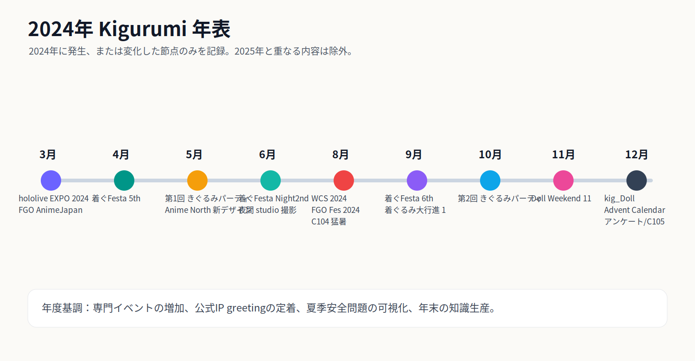
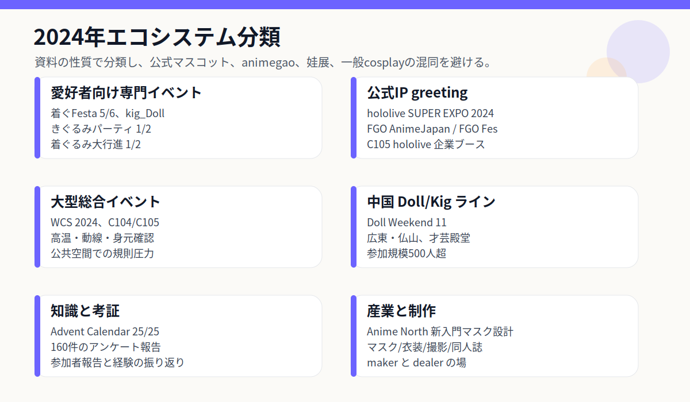
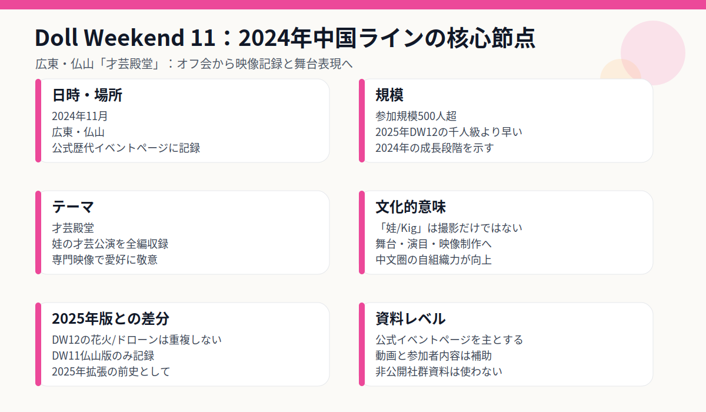
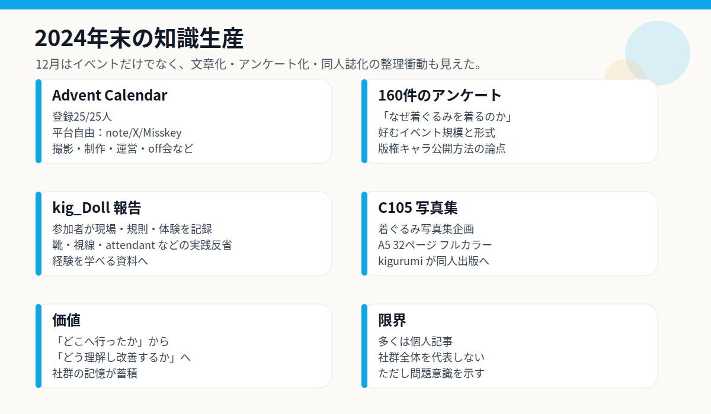
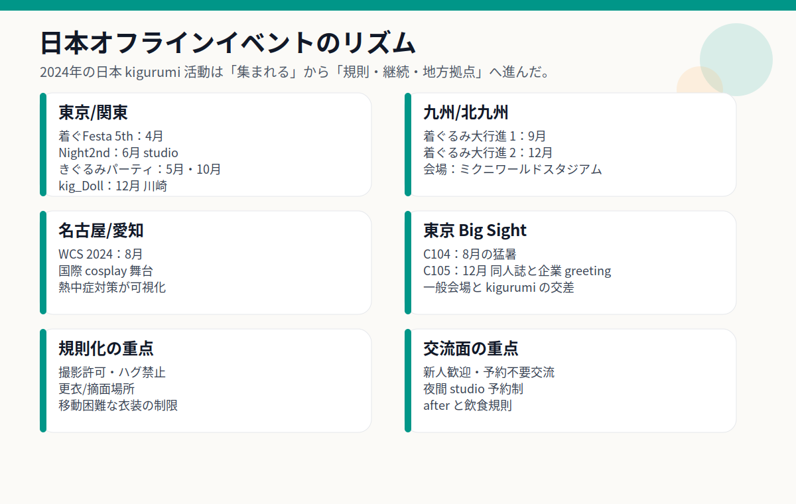
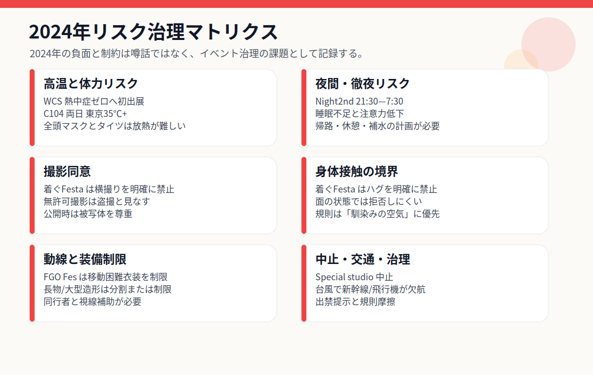

# 2024年 Kigurumi 編年史

> 編纂方針： 本篇は「2025年 Kigurumi 編年史」の基準と構成を引き継ぎつつ、**2025年版で整理済みの一般概念、2025年の活動、2025年の規則変更、2025年の産業事件は繰り返さない**。同じシリーズでも2024年に独立した開催や新段階が確認できる場合は、2024年版だけを記録する。2025年版で詳述済みの背景説明にとどまるものは、本篇では圧縮または省略する。

---

## 0. 資料範囲、重複整理の原則、信頼度について

この2024年のクロニクルで言及されている**着ぐるみ**は、依然としてアニメガオ着ぐるみ/マスク型ロールプレイング/着ぐるみを着た美少女/doll /娃/カイガー/着ぐるみを着た公式キャラクターなどの隣接分野を中心としています。境界という用語については 2025 年の記事で詳しく説明されているため、この記事では大きな定義を繰り返しません。データの違いに関しては、公式 IP の挨拶、ファン固有の活動、一般的な全身ドレスアップ活動、娃の展示、ファンの出版、アンケートと研究記事、リスク管理文書などの種類についてのみ説明します。

この記事は「公開情報優先」の原則を採用しています。長年にわたる公式イベント ページ、主催者発表、チケット ページ、主催者リストは、信頼性の高い情報であると考えられます。参加者のレポート、個人のブログ、メモ、ソーシャルメディアのスクリーンショットは補足資料です。匿名のフォーラムや非公開のグループ チャットは事実に基づくものとはみなされません。否定的なこと、噂、性格に関する論争に関しては、この記事では根拠のない個人的な非難を除き、規則の変更、統治の圧力、公に目に見える種類の摩擦についてのみ書きます。

2025 年の記事での重複整理方法は次のとおりです。

| 重複整理タイプ | 本篇での扱い |
|---|---|
| 2025年に書かれた一般用語の解説 | 必要な文を 1 つまたは 2 つだけ残し、長い背景を繰り返さないでください。 |
| 2025 年も同じ出来事が続く | 2024 年の日付、場所、その年の重要性のみを書き、2025 年のフォローアップの詳細は書かないでください。 |
| 公式 IP グリーティングは 2025 年でも存在します | 2024 年のショーに関連する 2024 年の役割、イベント、ルール、または変更についてのみ書いてください。 |
| 2025 年にはリスクガバナンスがより明確になる | 熱中症、写真撮影、ハグ、移動、キャンセルなど、2024年に確認できる事柄のみ書きます。 |
| 噂と匿名の論争 | 未確認の暴露を繰り返さず、公的ルールとガバナンスのシグナルのみを記録してください |

---

## 1. 2024 年の全体的な状況

2024 年は 2025 年の繰り返しではなく、2025 年に規模が拡大する前の「軌道敷設の年」のようなものです。 2025 年のキーワードが「規模の拡大、国境を越えた交流の増加、制度化の増加」だとすると、2024 年のキーワードは、**専門的な活動が具体化し、公式の挨拶が安定し、夏の安全性が明示され、年末に知識生産が爆発的に増加する**に近いです。

1 つ目の本筋は、日本におけるローカル愛好家活動の強化です。 「ききぐるみパーティ」の第1回と第2回は東京と関東地方で登場しました。 4月、9月と引き続き「初心者向け・予約なし・コミュニケーション優先」を軸に開催した。 6月にはNight2ndを通じて完全予約制のナイトスタジオ撮影会形式を試みた。 12 月、kig_Doll が再び登場しました。このタイプの新しいアクティビティは、写真撮影、コミュニケーション、軽食、ディーラーの参加を組み合わせたものです。九州は「剣の大行進」！ 9月と12月に第1回と第2回が完了し、2025年の第3回と第4回に向けての本当の出発点となる。言い換えれば、2024年に残されているのは単一の発生点ではなく、一連の持続可能な活動テンプレートである。

2 番目のスレッドは、公式 IP による着ぐるみ挨拶の継続使用です。ホロライブSUPER EXPO 2024では、3月にあんきも、すばるあひる、ミコダニェ、UDIN、スモールアメ等のマスコット撮影会を開催。 Fate/Grand Orderは、AnimeJapan 2024とFGO Fesの両方でコスプレイヤーと着ぐるみのグリーティングを手配しました。 2024. これらの公式シーンは、アニメガオのファン活動と直接的に同一視することはできませんが、「かぶり物やマスコットのような全身で展示会場に現れる二次元キャラクター」を一般視聴者にとって継続的な接触の対象にしています。

3 番目の主要なラインは、大規模な総合展示会と安全上のリスクです。世界コスプレサミット2024が名古屋と愛知で開催されました。外務省のデータによると、その年の世界​​コスプレ選手権には 36 の国と地域のチームが参加しました。日本気象協会の「熱中症ゼロへ」プロジェクトがWCS2024に初出展され、スタッフにファンスーツが提供されました。これは、2日間でC104に26万人が来場し、両日とも東京の最高気温が35度を超えたという夏のデータと合わせて、2024年の着ぐるみに関連する問題が「見栄えの良さ」や「修復」だけではなく、高温、視覚、行動、水分補給、写真撮影の同意、会場の責任などにも関わることを示している。

4番目のメインラインは、中文「娃/Kig」圈の段階的なジャンプです。 Doll Weekend 11 は、「タレント ホール」をテーマに、2024 年 11 月に広東省仏山市で開催されます。公式ページには「人形タレントショーはすべて録画される」と記載されており、参加者数は500人を超えたとしている。2025年のDW12の千人レベル、花火、ドローン、都市レベルの表現については2025年の記事に詳しく書かれている。この記事は 2024 年の DW11 のみを記録しています。その重要性は、2024 年に中国のサークルが着ぐるみ/doll のオフライン活動を視覚化、舞台化、そして 500 以上の規模の段階にまで進めたことです。

5 番目の主要なラインは知識の生産です。 12月には「ぐるみ Advent Calendar 2024」が登場し、登録数は25/25でした。テーマは撮影テクニック、オフ会、イベント運営、セルフプロデュース、対面での仕事など多岐にわたりました。同月には「着ぐるみの考え方を知りたい」アンケートレポートにも160件の回答が寄せられた。 kig_Dollの参加者のレビューやC105のYukiさんの写真集も相まって、2024年末には「体験を書き留める、作品をプリントアウトする、好みを数える」傾向が顕著に見られます。これは2025年の「大規模イベント」とは異なり、2024年独自の文書化された価値です。

---

## 2. クロニクル2024

### 2月10日頃：着着ぐFesta！特別スタジオ撮影イベント中止 – 小規模イベントの費用と不確実性

2024年の年初のマイナスポイントの一つは、「着着ぐFesta！特別STUDIO撮影イベント」の中止です。このページは完全予約制の撮影会を前提としております。イベント形式は従来のフェスタのオープンコミュニケーションとは異なり、本来は撮影に特化した予約制でスペースに限りのあるスタジオ型イベントに近い。しかし、公開ページには「諸事情」によりイベントが中断されたことが記載されていた。中止通知にはより具体的な理由が公に記載されていないため、この記事では主催者の内部状況については推測せず、2024年の初期イベントの運営に関する不確実性としてのみ記録します。[[S23]](#s23)

着ぐるみ活動の難しさは外部から過小評価されがちであるため、この出来事は記録に残されるべきである。通常のコスプレの集まりでは、会場、着替え、写真撮影の許可のみが必要となります。しかし、着ぐるみの特別イベントでは、頭壳の運搬、大きな荷物、視界の悪さ、着替えの際のプライバシー、付き添いが必要かどうか、イベント中にマスクを外せるかどうか、カメラマンとパフォーマーの比率、休憩を手配できるか、通行人を規制できるかなども考慮する必要があります。スタジオイベントは一般公開の展示会よりもコントロールしやすいですが、予約数、コストバランス、時間配分、スペースの状況にも大きく左右されます。参加人数が少ない場合や会場状況の変化、運営費が予想を超えた場合など、中止となる場合がございます。

また、2024年の日本の着ぐるみイベントの拡大が順風満帆ではないことも示している。後述するように、着着ぐFesta第5回、第6回は安定して開催されてきましたが、シリーズの持続性はすべてのスピンオフ企画が成立するわけではありません。中止の積極的な意味は、「専門的な活動が当たり前ではない」という事実を露呈させることだ。ネガティブな意味は、参加者の旅程、機材の準備、撮影計画が挫折する可能性があることです。高額なギアを必要とする着ぐるみプレイヤーの場合、頭壳、衣装、ウィッグ、靴、詰め物、写真撮影の予約などすべてが事前に準備されている可能性があるため、イベントのキャンセルは通常の観客よりも大きな影響を受けます。

### 3月16日・17日：ホロライブSUPER EXPO 2024 マスコット撮影会

2024年3月13日、hololive SUPER EXPO 2024にて「ぐるみグリーティングについて」が正式リリースされました。時計台周辺でマスコット撮影会を開催するとのお知らせ。 DAY1は2024年3月16日、DAY2は3月17日。両日とも12時40分頃からあんきも、すばるあひる、DAY1は15時40分頃、DAY2は15時55分頃からミコダニエ、UDIN、スモルアメが登場する。各グループの所要時間は約 20 分を予定しています。 [[S1]](#s1)

この種の公式の挨拶には、ファンのアニメ顔の着ぐるみとは異なる動機があります。ホロライブのぬいぐるみは、どちらかというとブランドキャラクターの物理的な接点のようなものです。 VTuber業界がバーチャルキャラクターや派生マスコットとファンをオフラインで繋ぐ手段です。観客は、着ぐるみの制作やタイツ、マスクの内部構造を理解する必要がなく、「動くキャラクター」を通じて展示体験を理解できます。キャラクターをスクリーンや生放送室、周辺映像から解放し、会場で会って写真を撮ったり手を振り返したりできる体に変える。

2024年を見据えたホロライブラインの重要性は「安定化」にある。それは一時的なマスコットではなく、明確なスケジュール、明確な役割グループ、明確な場所による公式の対話です。 2025 年の記事では、ホロライブ SUPER EXPO 2025 のさらに大規模な参加者についてすでに書いています。この記事では、2025 年の拡張については繰り返しません。 2024 年版の重要性を記録するだけです。VTuber の大規模オフライン イベントでは、着ぐるみグリーティングがサイド イベントではなく、通常のプログラムとして扱われてきました。

同時に、用語の混乱も深まります。一般の視聴者は「ぐるみ」というとホロライブのマスコットを思い浮かべるかもしれませんが、アニメガオ/キグプレイヤーは「ぐるみ」というとマスクのコスプレを指すかもしれません。したがって、2024 年の公式挨拶は社会的な知名度を高めると同時に、部外者がマスコット、アニメガオ、ドール、そして通常の着ぐるみを区別するのを難しくする可能性もあります。この「見えているけど必ずしも理解されていない」状態が2024年から2025年にかけて続く背景です。

### 3月23日～24日：FGO × AnimeJapan 2024 - 公式コスプレイヤーと着ぐるみの組み合わせによるグリーティング

Fate/Grand Orderは、2024年3月23日・24日に東京ビッグサイトで開催されるAnimeJapan 2024に出展します。公式ページには、FGOブースで展示やステージ活動が行われると記載されており、ブースは東5ホール J46にあります。そのうちの1つが「コスプレイヤー･怖いミグリーティング」で、ブース内ではグリーティングが実施される予定で、新たなサーヴァントのコスプレイヤーも登場すると説明している。 [[S2]](#s2)

FGOのこのノードはホロライブのグリーティングに似ており、どちらも公式IPを具体化したものです。しかし、FGOの特徴は「コスプレイヤー＋着ぐるみ」が一体となってブースの雰囲気を形成していることです。コスプレイヤーはキャラクターを現実の姿で表現しますが、着ぐるみは別のタイプのキャラクターをマスコット/フードをかぶった体の形で表現します。観客にとっては、ステージ、ディスプレイ、貴重なファントム小道具、英雄の召喚写真スタジオ、公式コスプレイヤー、着ぐるみ挨拶などの層が形成され、モバイル ゲーム IP がブース内を歩いたり写真を撮ったりできる空間に変わります。

このイベントの年に一度の重要性は、「FGOが初めてグリーティングを行う」ということではなく、2024年も継続して、大規模な二次元IPが物理的なキャラクターのインタラクションを標準的な展示運営に組み込んだことを示し続けることです。ブース内での挨拶にはガバナンス上の重要性もあります。キャラクターを博物館内で自由に歩き回らせるのと比較して、ブース内でのインタラクションでは、列、カメラ アングル、滞留時間、混雑、および接触境界を制御することが容易になります。この種の空間制御は、動きが制限される着ぐるみのようなパフォーマンス形式では非常に重要です。

2025年のFGOフェス10周年の大規模なプレゼンテーションに比べて、AnimeJapan 2024の情報は「ブース運営」の方が多く、したがって、この記事は 2024 年の状況のみを記録し、2025 年の 10 周年の内容は繰り返しません。これは、2024 年の着ぐるみのパブリック イメージは、ファンの活動だけでなく、公式 IP の会場での普及によってもたらされるだろうということを思い出させます。

### 4月6日：フェスタ！ 5日——「新人フレンドリーさ」に関する公開文書と定期的なコミュニケーション

2024年4月6日 着着ぐFesta！第５回は荒川区の荒川こだまホールで開催された。イベントページには「ぐるみさんと与ぐるみ好きさんのコミュニケーションイベント」と記載されており、当日は10:00開始となります。主催者は「予約不要で気軽に遊べるイベント」という需要から生まれたイベントだと説明する。会場は約 300 名を収容できます。ロビーでは当日の参加も歓迎しており、初めて着ぐるみをプレイする人にとっても優しいイベントであると主張しています。 [[S3]](#s3)

このイベントの核心は注目を集める写真撮影ではなく、社会の復興です。イベントの説明では率直に指摘されている：多くの新参者がこのイベントを見た 主催者はこの質問を書き、着ぐるみ活動の本当の基準は単に「頭の殻があるかどうか」だけではなく、社会的な関係を築くことができるかどうか、積極的にコミュニケーションを取る人がいるかどうか、そして新参者や沈黙のパフォーマーを保護するルールがあるかどうかであることを認識していることを示しています。

着着ぐFesta5thのルールも重要です。このページでは、「写真撮影」、つまり他人が撮影しているときに横から許可なく撮影することを明確に禁止しています。主催者は、被写体に誰かが撮影しているのが見えたとしても、それは同意のない率直な写真であることに変わりはなく、最初に被写体の許可を得る必要があると述べています。また、着ぐるみパフォーマーは話しにくい、つまり表現が難しく、過剰な接触を拒否することが難しい場合があるため、イベントではハグも禁止されています。長尺物を振る行為も禁止、マスクも更衣室とクローク以外での着脱は禁止となります。 [[S3]](#s3)

2024年から見ると、着着ぐFesta5thは典型的な「敷居は低いけどルール意識は高い」イベントだ。撮影だけが目的ではなく、「新人を孤立させない方法」「率直な写真を避ける方法」「一線を越えた接触を避ける方法」「キャラクターのイメージを損なわずに安全を保つ方法」など、実行可能なルールを記している。このタイプのテキストは、きれいな写真よりもコミュニティの成熟度を物語ります。 2025 年の多くのイベントルールはより形式的なものですが、2024 年の着着ぐFestaの価値は、小さなコミュニケーション活動のレベルで境界の問題を非常に具体的にしたことです。

### 5月24～26日頃：アニメノース2024、着ぐるみオンライン新規エントリーマスクデザイン

着ぐるみオンラインのページには、同組織がコスプレイヤーにアニメガオの着ぐるみを紹介するために、カナダのトロントにあるアニメ・ノースで毎年ワークショップを開催していると記載されている。ワークショップの内容には、背景の紹介、歴史、有名メーカー、製造方法、ボランティアの協力によるカスタマイズされたスターターマスクの製造などが含まれます。このページには、参加者が目の形、目の色、まつげ、眉毛、かつらのスタイルと色を選択し、裏地の充填と装着の適応を行うことができるとも記載されています。最も注目すべき 2024 年の更新は次のとおりです: ページに 2022 年のデザインと記載されている後の **Anime North 2024 でリリースされた新しいデザイン**。 [[S5]](#s5)

この問題は一般的なイベント線ではなく、業界と教育の方針に属します。 2025年の記事では、アニメノース2025ワークショップの導入機能についてすでに書いています。この記事では、ワークショップの詳細をすべて繰り返すことはせず、2024 年の新しいポイント、つまり新しい初心者向けマスクのデザインのリリースのみを強調します。アニメ顔の着ぐるみにとって、マスクのデザインを始めるのは簡単なことではありません。初心者が初めて着用するときの視覚効果、快適さ、裏地のフィット感、頭囲の適合性、ウィッグの固定、接眼レンズの比率、生産コストに影響します。ワークショップで使える入門用デザインということは、もともと個性の強いマスク作りを、メーカーが「教えられる・まとめて作れる・初心者でも即日体験できる」という点で標準化しようとしているということだ。

2024 年の北米ラインの重要性もここにあります。中国のドール ウィークエンドのような大規模なシーンや、日本の東京/九州ラインのような専門的なイベント会場を強調するものではなく、知識の普及と敷居の低さを重視しています。海外初心者の多くは日本の資料にアクセスすることが困難であり、メーカー、マスクの構造、肌の色、ウィッグと衣装の関係性を判断することも困難です。 Kigurumi Online は、「初めてのキグルミ」が高価なカスタムオーダーから始める必要がないように、ワークショップを通じてこれらの問題を参加型のプロセスに分割します。

したがって、アニメノース2024の記録価値は「特定の選手の登場」ではなく、技術普及ノードとしての「新規参入マスクデザイン」である。これは、2025 年以降の新しい人材を育成するための基盤となります。

### 5月26日：第1回「ききぐるみパーティ」東京お台場スペシャルイベントラインのスタート地点

2024年5月26日、東京・お台場で「ききぐるみパーティ」が開催された。一般参加者レポートでは、このイベントは2024年5月26日に開催され、参加者はお台場プロムナード公園、海浜公園、プラザ平成などでアクティビティに参加すると記載されています。報告書概要には、お台場公園やプラザ平成での着ぐるみ活動は可能だが、歩く距離が長くなり、サポーターがいないと難しい、着ぐるみ参加者も多様であると書かれている。 [[S4]](#s4)

このイベントは2025年の「第3回・ききぐるみパーティ！」の前史となるが、この記事では2024年の第1回の独立した意義のみを記録する。東京都がマスク型・フルかぶりもの参加者向けに特別な撮影・集合エリアを作り始めていることが分かる。この種のイベントは通常のコミックイベントとは異なり、3つの問題を解決する必要があります。まず、屋外での写真は見栄えがしますが、長距離を歩くと視力、靴、体力、水分補給、付随するサポートの問題が大きくなります。 2つ目、お台場エリアは半公共スペースが多く、通行人や観光客、一般のコスプレイヤーなどが立ち入る可能性があるため、撮影許可や動線にはより注意が必要です。 3つ目は、頭壳、ウィッグ、ボディパッド、キャラクター衣装などを途中で整理する必要があり、「通常の楽屋」だけではニーズに応えきることが難しい。

参加者から報告された「サポートがいないときついかも」の観察結果は貴重です。着ぐるみコミュニティでは、付き添い/ヘルパーの重要性がよく語られますが、多くの部外者はイベントでの動きを見て初めてそれを理解します。通常、パフォーマーの視野は実際の視野ではなく、キャラクターの視線は実際の人物の視線とずれており、段差、縁石、車両、自転車、子供が突然接近すると危険が伴います。東京のお台場にこのようなオープンスペースがあると、作品に臨場感が生まれますが、移動コストも高くなります。

また、「ききぐるみパーティ」の第1回では、2024年の日本の着ぐるみイベントが、小さなホールでの閉鎖的な交流だけでなく、半公共の場で専用の集会を試み始めていることも説明された。これにより、10 月の第 2 回と 2025 年の第 3 回に向けて、イベント名、会場での体験、コミュニティでの評判が確立されました。

### 6月15日：フェスタ！ Night2nd - 夜のスタジオ撮影会と完全予約制の別ルート

2024年6月15日 着着ぐFesta！ Night2ndはクロームスタジオ川口での夜の撮影イベントとして開催されます。 TwiPlaページによると、開催期間は2024年6月15日21時30分～翌日7時30分、完全予約制、定員40名、参加費4,000円と記載されている。イベント説明文にも、撮影はスタッフが行うことを強調し、「ぐるみさん与ぐるみ好きさん」の特別なハッピー撮影会と位置付けている。公開登録状況を見ると、参加者は40名中14名で、「興味あり」が4名、「参加していない」が2名となっています。 [[S24]](#s24)

この Night2nd は見落とされがちですが、2024 年のフェスタ ラインにおける構造的に非常に重要な試みです。 4月の第5回、9月の第6回はどちらも「予約不要・当日OK・初心者に優しい」交流会が多いですが、 Night2ndは完全予約制、人数上限、スタジオ、オールナイト、写真撮影が主目的という全く逆の方向性です。これは、同じ主催者/同じイベント サークルが 2024 年に 2 つのニーズを同時に検討したことを示しています。1 つは、ソロ プレイヤーが参加して人々と出会うことができるように、参入障壁を下げることです。もう 1 つは、外部干渉を圧縮し、参加者が制御可能なスタジオで長時間撮影できるようにすることです。

Night2ndのルールは着着ぐFestaの境界意識を引き継いでいます。このページでは「トリミング」が禁止されており、撮影前に被写体の同意が必要です。マスクの下で意味を表現するのは依然として難しいため、ハグを禁止します。長尺物を振ることを禁止します。更衣室とクローク以外では顔を脱がないことを要求する。これらのルールは、比較的閉鎖的なスタジオ環境であっても、撮影の同意、身体的接触、小道具の安全性、キャラクターのステータスの境界を省略できないことを示しています。 [[S24]](#s24)

同時に、Night2nd は夜間と夜間という別のタイプのリスクも最前線にもたらします。着ぐるみパフォーマーにとって、夜のスタジオは日中の暑さや通行人の見物を避けられるものの、睡眠不足、体力の低下、夜の後半の集中力の低下、メイクや衣装のメンテナンス、帰りの交通手段などの問題も生じます。ヘッドギア、タイツ、ウィッグ、キャラクター シューズをフル装備すると、何時間もの連続撮影中に身体エネルギーを消費し続けます。明確な休息、水分補給、仲間のサポートがなければ、夜間の環境は当然ながら日中よりも安全ではありません。

このイベントを2024年の年代記に当てはめてみると、「イベント中止」を反映する手がかりが見えてくる。2月のスタジオスペシャルの中止は撮影専門企画の脆弱性を示し、6月のNight2ndはスタジオ型イベントが消滅したわけではなく、より明確な予約システム、ナイトショー、人数の上限、ルールテキストなどの実験を続けていることを示した。これは 2025 年の繰り返しではありませんが、2024 年の日本における小型着ぐるみの活動パターンが多様化していることを示す重要な証拠です。

### 8 月 2 ～ 4 日: 世界コスプレサミット 2024 と夏の安全トピック

2024年8月2日から4日まで、名古屋と愛知で第22回世界コスプレサミットが開催されます。外務省のページによると、2024年世界コスプレチャンピオンシップが8月3日に開催され、日本を含む36の国と地域からチームが参加した。日本チームが優勝し、外務大臣賞を受賞した。 WCSは2003年に名古屋でスタートし、2024年で22回目となります。 [[S6]](#s6)

Kigurumi 編年史の観点から見ると、WCS 2024 の重要性はチャンピオンシップだけではなく、夏のコスプレの安全性が前面に押し出されるという事実にもあります。日本気象協会「暑さ対策ゼロへ」プロジェクトは2024年7月23日、WCS2024に初出展するとともに、8月3日～4日にはオアシス21にブースを出展し、撮影用小道具や背景ボード、暑さ対策アイテムなどを通じて熱中症予防を呼びかけることを発表した。同時に、ファン付き空調スーツ33着がWCS運営スタッフに提供されます。 [[S7]](#s7)

これは着ぐるみでは特に重要です。一般のコスプレイヤーはすでに、夏の日焼け、行列、メイクの溶け、脱水症状などの問題に直面しています。着ぐるみはまた、頭のシェル、全身スーツ、詰め物、かつらによる圧力、限られた視野、および頭を取り外す不便さを加えます。 WCS 2024 は着ぐるみだけに特化したイベントではありませんが、真夏にイベントをどのように安全に開催できるかという問題にもっとオープンに取り組む、主流のコスプレシーンの始まりを表しています。フィーバーブースやスタッフのファンのユニフォームは、安全が参加者の個人的な意識だけではなく、展示会運営の不可欠な部分であることを示しています。

これは 2024 年と 2025 年の違いでもあります。2025 年の記事では、WCS による着ぐるみ/全顔マスク/doll /ガワコスの明確なルール認識に焦点を当てています。 2024年の記事は熱中症の治療に焦点を当てています。この 2 つは重複するものではなく、相互に関連しています。2024 年には夏の身体的リスクが強調され、2025 年には顔を覆う衣服が規則の本文にさらに組み込まれる予定です。着ぐるみプレイヤーにとって、この 2 つのラインは合わせて「参加可能だが管理されなければならない」現実を構成します。

### 8月3日～4日：FGOフェス. 2024 年 9 周年 ― 公式挨拶と参加者の服装制限の併記

2024年8月3日・4日には「Fate/Grand Order Fes.」が開催されます。 2024年には9周年記念イベントが幕張メッセで開催されます。公式アトラクションページには「グリーティング」と記載があり、ぬいぐるみのグリーティングが実施されることが説明され、「新たなレギュレーションが作成中」と書かれています。これは、FGOが2024年の9周年イベントに向けて着ぐるみグリーティングを継続するだけでなく、新しい着ぐるみキャラクターを作成していることを示しています。 [[S8]](#s8)

このイベントの特徴は、オフィシャルが着ぐるみグリーティングを用意する一方で、一般参加者のコスプレ衣装に制限を設けていることだ。 FGOフェス。 2024年のコスプレ規則では、制限される服装には「動きにくい衣装」も含まれるとしている。例としては、大きな紙の貝殻の形、ぬいぐるみ、床まで届く服、大きな装飾品などが挙げられます。 [[S9]](#s9)

この併置は、2024 年の年代記に書き込む価値があります。これは、着ぐるみに対する公式 IP キャンペーンの姿勢が、単純に「許可」または「禁止」されているわけではないことを示しています。公式に運営されている着ぐるみはイベント資産であり、役割、スタッフ、配布手配、舞台裏管理が固定されています。一方、着ぐるみを着た一般参加者が混雑した会場に入場すると、アクセス、視線、安全、避難、写真管理などに問題が生じる可能性があります。つまり、同じイベントに「公式着ぐるみグリーティング」と「移動を制限する参加者の着ぐるみ衣装」の両方が存在する可能性があります。

コミュニティの観点から見ると、この種のルールはプレーヤーに矛盾を感じさせるかもしれません。「なぜ当局はそれを行うことができ、個人はそれを行うことができないのか?」しかし、アクティビティ管理の観点から見ると、違いは責任の所有権と制御可能性にあります。公式の役割には通常、スタッフ、旅程、休憩ポイント、写真撮影エリアが含まれます。個々のプレイヤーは会場内を移動する可能性があり、主催者は彼らが同行しているかどうか、時間内に回避できるかどうか、通路を妨害するかどうかを判断することが困難です。 FGOフェス。したがって、2024 年は明確なケースを提供しています。着ぐるみは、商業 IP イベントのパフォーマンス形式として歓迎されていますが、観客のコスプレ形式としては必ずしも無条件に歓迎されているわけではありません。

### 8月11日・12日：C104夏コミケ～暑さ、26万人、着ぐるみファン活動のヒント～

夏のコミックマーケット104は、2024年8月11日と12日に東京ビッグサイトで開催されます。COSPOのC104レポートによると、2日間で合計約26万人が会場に来場し、8月11日と12日の東京の最高気温は35度を超えました。 [[S10]](#s10)

着ぐるみにとっての C104 の重要性は、それが着ぐるみ専用のイベントであるということではなく、コミケが日本のファン文化とコスプレ文化の超巨大交差点であるということです。着ぐるみプレイヤーにとって、C104のようなフィールドは矛盾に満ちています。ビッグサイトやコミケは知名度が非常に高く、キャラクターのスタイルが出れば注目を集めやすい一方で、着ぐるみプレイヤーにとっては矛盾に満ちたフィールドです。その一方で、夏の高温、混雑、行列、荷物の取り扱い、撮影エリアのルール、ブースの動線、衣装変更の制限などは、すべて着ぐるみにとって非常に不利です。 35度を超える猛暑は一般のコスプレイヤーにとっても大変だが、着ぐるみにフルヘッドギア、全身スーツ、分厚いウィッグを装着し、頭を外すのも不便な着ぐるみにとってはさらにリスクが高くなる。

着ぐるみとコミケのファン活動とのつながりは広報にも見られます。たとえば、個人的なメモでは、C104 の「Zuo ぐるみ売り子」などの計画と関連書籍について言及しています。この種の情報はほとんどが個人的な/小さなサークルの記録であり、壮大な結論には適していませんが、着ぐるみが撮影会や特別なイベントに存在するだけでなく、ファンブース、ベンダー、写真集、キャラクタートラベルブックなどのクリエイティブな実践にも参入していることを示しています。

したがって、2024 C104 は「リスクと創造が共存する」ノードとして分類されるべきです。これは Doll Weekend 11 や书きぐるみパーティほど着ぐるみに特化したものではありませんが、厳しい現実テストを提供します。着ぐるみが大群衆、うだるような暑さ、ファンの売り上げの環境に入ると、安全性、移動、水分補給、写真撮影のルールが作品そのものよりも重要になります。 2025 年の記事ではコミケに焦点を当てていないため、この部分は 2024 年の別の補足です。

### 9月1日：フェスタ！ 6 回目以降のパーティー—洗練された社会ルール、渡航禁止のヒント、台風による交通への影響

2024年9月1日 着着ぐFesta！第6回も荒川区荒川小通りで開催されました。イベントページは5位の位置づけを引き継ぎ、予約不要・当日参加歓迎・初参加の着ぐるみプレイヤーにも優しい内容となっております。イベントの目的はやはり、知り合いがいないソロ活動をしている着ぐるみプレイヤー同士が交流を深められるようにすることだ。ルールも継続され洗練されており、ハグ禁止、抱擁禁止、長い物を振らない、ロッカールーム/クローク以外で顔を脱がない。 [[S11]](#s11)

6 番目の価値は、5 番目のアクティビティ ロジックを 1 回限りの試みではなく、安定した形式で継続することです。公開ページには、55 人の参加者、17 人が関心を持っている、7 人が非参加者であることが示されています。大規模なイベントではありませんが、着ぐるみに特化したコミュニケーション活動として安定した魅力を示しています。 [[S11]](#s11)

この出来事はまた、否定的な/統治の歴史に書き込まれるに値するいくつかの公的詳細を残しました。イベントのコメント欄では、主催者のアカウントで禁止リストに載っている人は「検ディスカッション」から削除され、当日出席しても入場できないと注意喚起されていた。これを特定の個人に関する議論に拡張すべきではありません。また、排除された人々の身元を追跡すべきではありません。クロニクルにはガバナンスへの影響のみが記録されている。2024年までに、一部の着ぐるみ活動はすでに除外リスト、入場拒否、事前審査といった形でリスクに対処する必要がある。 [[S11]](#s11)

同じコメント欄には、台風による新幹線や飛行機の欠航、移動困難などの理由で参加を断念した人たちのメッセージもあった。これは、着ぐるみ活動の実際のコストには、輸送の不確実性も含まれていることを示しています。プレーヤーがヘッドケース、衣服、靴、ウィッグ、撮影機材を運ぶ場合、一時的なルート変更は通常の移動よりも困難です。台風や交通障害はイベント参加に直接影響します。 [[S11]](#s11)

9月1日は着着ぐFesta！ 16時から19時までは第6回アフターパーティーも開催予定です。アフターパーティーのページでは、「アフターパーティーに参加したいけど誘われていない、恥ずかしくて誘えない人」のニーズに応えたと説明されている。イベント当事者が用意する完全予約制で、最大30名、27名まで参加可能。メイン会場とはルールが異なり、大音量禁止、ハグ禁止、会場が狭いので小道具の持ち込み禁止、会場内での握手禁止などルールが異なります。食事中は着ぐるみを外す必要があります。 [[S12]](#s12)

このアフターパーティーは社会史的に非常に価値のあるものです。同団体は、着ぐるみ活動における「社会的不平等」の問題を認めている。つまり、知り合いの輪には当然のことながらアフターが存在し、周縁にいる新参者は排除される可能性がある。主催者はアフターパーティーを完全予約制、定例、人数限定の補助イベントとしたが、これは私的な交流の一部を公にして透明化することに等しい。また、成熟した傾向も示しています。キャラクターの状態は写真を撮るのには適していますが、実際に関係を築き、食事をし、ルールを伝え、お互いを知るとなると、コミュニケーション可能な人間の状態に戻る必要があります。

### 9月23日：九州限定イベントラインの起点となる北九州「アーケードマーチ！１」

2024年9月23日、三菱北九州にて「大行進！１」が開催されます。コピック/コスプレピクニックの過去のイベントリストには、2024年9月23日に北九州ミクニワールドスタジアムで併催イベントとして記載されています。 [[S13]](#s13)

2025年の記事では、この事件はその後の第3回と第4回の背景としてのみ登場します。 2024年の記事では九州本線の起点なので別記する必要がある。日本の着ぐるみイベントは長い間、東京、関東、名古屋での大規模なコスプレシーンや「アーケードマーチ！」のせいで簡単に影が薄くなってしまいました。 「九州にも独自の着ぐるみ・全身衣装交換会場が必要だ」と明らかにした。スタジアム会場の重要性は小さくありません。小さな屋内スペースと比較して、スタジアムとその周囲のスペースは、大規模な頭壳、着ぐるみ、ヒーロー/ガワコス、ドール、アニメガオ、その他の全身衣装を動かしたり、写真を撮ったりするのに適しています。しかし、より厳密な動き、安全、天候、服装の管理も必要になります。

「マーチ」という名前自体も象徴的です。着ぐるみは単なる静止した写真ではなく、集団的な動き、集合、パレードのようなビジュアルを形成することもできます。全身キャラクター文化の場合、グループ行進は個々のキャラクターを公共の見世物に変えることができます。観客が見ているのはもはや 1 人や 2 人の「奇妙な人形」ではなく、コミュニティ全体の目に見える身体です。 2024年の第1回でこの形式が定着し、2024年12月の第2回と続き、さらに2025年に第3回、第4話と続いた。

ということで、『大行進』第1回！は、2024 年の日本のローカリゼーションにとって最も重要な結節点の 1 つです。これは、着ぐるみイベントが東京だけに依存する必要がないことを示しています。地域コミュニティは、交通機関、会場、共同主催、全身の服装などに関する独自のイベント テレホンカードを作成することもできます。

### 10月6日：第2回「ききぐるみパーティ」 - 東京特有のイベントを簡単に再現

2024年10月6日には「ききぐるみパーティ」第2弾が開催されます。 Cospot Mediaの2024年10月の全国コスプレイベント一覧では、東京部門に「第二章・ききぐるみパーティ」が掲載されており、開催時間は10:00～16:30、主催団体はコスプレ博実行委員会（Brave House）となっている。 [[S14]](#s14)

このイベントの意義は「再生速度」です。 5月の第1回から半年も経たないうちに、10月に第2回が開催されたが、5月の試みが偶然の小規模撮影会ではなく、主催者と参加者が継続する価値があると判断したイベント形式であったことがわかる。着ぐるみの場合、イベントの再現性は非常に重要です。プレイヤーは、新しいキャラクターの作成、写真家との約束、旅行の手配、荷物や交通手段の準備をする際に、予測可能なイベント サイクルを用意する必要があります。イベントが 1 回だけ発生した場合、コミュニティの記憶は「楽しかったあるとき」として残る可能性が高くなります。 6 か月以内に再発した場合は、固定スケジュールになる可能性があります。

第 2 章と第 1 章は合わせて、東京「ききぐるみパーティ」ラインの 2024 年の骨格を形成します。すでに2025年の第3回の会場やイベント施設については2025年の記事で書いているが、この記事では2024年の始まりは5月にお台場・プラザ平成とその周辺スペースの実現可能性検証、10月イベントブランドの継続性検証という2つの始まりだけを記している。この「年に 2 回」のリズムは、2025 年のさらなる制度化の基礎となります。

文化的重要性の観点から見ると、第 2 章は、着ぐるみプレイヤーには、通常のコスプレ展示のためのコーナースペースだけではなく、衣装を脱いで、動き回って、写真を撮り、交流し、理解してもらうための特殊な活動が必要であることも証明しています。東京自体はコスプレイベントに事欠きませんが、着ぐるみに特化したイベントは依然として貴重であり、着ぐるみのニーズが通常のコスプレと正確には重なっていないことを示しています。

### 11 月: Doll Weekend 11 広東省仏山市 - 中国の「キグ」サークルの 500 以上のステージ

2024年11月には広東省佛山市で「才芸殿堂」をテーマにしたDoll Weekend11が開催される。Doll Weekendの公式イベントページには次のように記載されています：Doll Weekend11、2024年11月、広東省仏山市。 「ドールタレントショーはすべて録画され、プロの映像で愛に敬意を表し、参加者数は500人を超える予定です。」 [[S15]](#s15)

これは、2025 DW12 重複整理で対処する必要があるスレッドです。 2025 年の記事では、DW12 の 1,000 以上、花火、ドローン、娃のパレード、都市レベルの表現についてすでに書いています。この記事ではそれらの内容を繰り返すことはせず、2024年のDW11の独自の意義についてのみ書きます。DW11のキーワードは「数千人のカーニバル」ではなく、「才芸、映像、500+」です。これは、2024 年に中文圏が着ぐるみ/doll のオフライン活動を、通常の集合写真、ルームショット、コミックイベントでの出会いから、ステージプログラムやプロの記録にまで進歩させたことを示しています。

「才芸殿堂」というテーマは研究価値が非常に高い。着ぐるみは、頭部のシェル、体のプロポーション、衣服の復元、美しい写真など、外部からは静的な視覚文化として見られることがよくあります。しかし、タレントショーは選手を「撮影対象」から「舞台出演者」に変える。これにより、より高い要求が生じます。可動範囲は頭壳の視界にどのように適応するのでしょうか?ダンスや演技ができる衣装ですか？出演者は事前にリハーサルをする必要がありますか?現場の照明、ステージの高さ、観客の距離、カメラの位置を全身衣装とどのように両立させることができるでしょうか?これらの問題は通常の撮影セッションの範囲を超えています。

DW11の「完全録音」も同様に重要です。小さなサークル活動の思い出の多くは、個人の写真集、グループ チャット、ソーシャル メディアに散在しており、時間が経つと簡単に消えてしまいます。公式ビデオ録画は、主催者がイベントを情報として保存し、投資促進や文化解釈に広め、検討し、使用できるようにしたいことを意味します。これは、コミュニティが「ファイルを再生する」から「ファイルを残す」に移行するためのステップです。

500人を超える規模は、2024年時点で中国の着ぐるみ・doll 圈がかなりの組織力を持っていることを示している。頭壳、タイツ、ウィッグ、衣装、写真撮影、長期旅行が必要な趣味にとって500人以上という数字は小さくない数字だ。これは、2025 年の大規模な登場に向けた重要なステップです。2024 年の DW11 の増強がなければ、DW12 の大型化は不自然に思われるでしょう。

### 12月1日: kig_Doll Kawasaki - 写真、コミュニケーション、軽食、ディーラーシーンを組み合わせた新しいノード

2024年12月1日、川崎市産業奨励館にてkig_Dollが開催されました。 LivePocket のチケット ページには、イベント スケジュールが 2024/12/1、10:30 開始、20:00 終了と表示されています。チケットは前編「撮影・コミュニケーション」と後編「軽食ペイきコミュニケーション」のセットで3,000円、前編のみ1,500円、後編のみ1,500円。時間は第一部が10時30分～16時30分、第二部が17時～20時。 [[S16]](#s16)

kig_Doll の構造は記録する価値があります。単なる撮影会でも、完全に自由な交流会でもありません。代わりに、日中は写真交換、夕方は軽食交換のセグメントに編成されています。着ぐるみアクティビティの場合、この区分は非常に合理的です。日中はキャラクターになりきって、写真を撮ったり、会ったり、歩き回ったりできます。夜の軽食ステージは、衣装を脱いで自分の本当のアイデンティティを知り、制作や活動の経験を交換するのに適しています。 「作業の表示」と「関係構築」を別々に処理するため、アクティビティ設計の観点から役割ステータスと実際のコミュニケーションの間の矛盾が軽減されます。

参加者の大隅あかりさんは、広い会場の1階が着ぐるみで埋め尽くされていたことを報告し、「着ぐるみがたくさんあって楽しかった」「1日活動できた」「交流ステージはつながりを広げるのに役立った」と総括した。また、初めてのイベントということで参加前は不安もあったが、参加者から見ると運営は非常にスムーズで、スタッフも着ぐるみの視点で動いてくれたという報告もあった。また、ルールに関わる軋轢もありそうなので、参加者として当事者にならないように気をつけたいとも書かれていました。 [[S17]](#s17)

やえぶろの別のレポートでは、実践についてのより詳細な反省が示されています。参加者は、歩くのが速すぎるので、もっとゆっくりと、より積極的に周囲の音に反応する必要があると書きました。靴の選択は後半の足の痛みに影響します。係員には、キャラクターの視線と現実の人物の視線の高さの違いに注意を払い、支援するよう要求する必要があります。ベルトの緩みなどの細部もキャラクターのパフォーマンスに影響します。 [[S18]](#s18)

この種の考察は、着ぐるみを「外観」から「外観」に戻すため、クロニクル 2024 にとって重要です。 kig_Doll からの参加者の報告によると、2024 年に日本人は、胴体や衣服だけでなく、歩行速度、身動き、手、鉤、視線、同行者、腰バンド、身体のバランス、そして周囲を観察できるかどうかも考慮されます。着ぐるみシーンは、こうした細部を経験知として書き留め始めている。これらのコンテンツは大きなニュースではありませんが、コミュニティの成熟した細胞です。

### 12 月 1 ～ 25 日: Advent Calendar 2024 着ぐるみ——分散執筆とコミュニティの知識生産

2024年12月にAdventarにて「ぐるみ Advent Calendar 2024」を実施します。このページには、登録数が 25/25 件、作成者が Onu Yu であることが示されています。説明文では、着ぐるみコンテンツの種類を問わず投稿を歓迎しており、プラットフォームはnote、Twitter/X、Misskeyなどに限定されません。 トピック例としては、オリジナルキャラクターの魅力、着ぐるみのメリット、撮影テクニック、オフラインでやっていること、イベント運営の苦労話、お気に入りの写真スタジオやイベント、おすすめアフターショップ、自作体験、顔作りのスキルなど、写真を投稿するだけでもOKです。 [[S19]](#s19)

2024年限定の「研究イベント」です。大規模イベントとまではいきませんが、歴史的記録の観点からはさらに貴重です。オフライン イベントでは通常、写真や感想が残されますが、アドベント カレンダーでは、分散したプレイヤー、プロデューサー、写真家、主催者が時間構造に集まり、全員が 12 月のある日に着ぐるみに関する記事やコンテンツを公開できるようになります。 25/25 という完全な登録は、プロジェクトにアイデアがあるだけでなく、それに応える十分な参加者がいることを示しています。

その意味には3つのレベルがあります。まず、着ぐるみを「絵で見る文化」から「書く文化」に変える。部外者の多くは着ぐるみを写真で判断するだけで、選手がなぜ着ぐるみを着るのか、どのように準備するのか、どのようにイベントに参加するのか、写真撮影や社会的交流をどのように扱うのかを理解していません。 Advent Calendar では、これらの経験について書くことを奨励します。第二に、着ぐるみジャンル内の多様性を認めています。投稿作品はアニメガオやドルラーに限定されず、技術記事の要件もありません。制作、撮影、運営、日常生活、キャラクター愛、オフ会、イベント後の食事などを着ぐるみ文化として定着させています。第三に、将来の研究者に指標を提供します。たとえ一部のリンクが後で無効になったとしても、アドベント カレンダー ページ自体には、2024 年のコミュニティによる積極的な書き込みの痕跡が残っています。

2025 年にはさらに大規模なイベントや公開ルールが登場しますが、2024 年の Advent Calendar では「内部説明機能」が示されます。ある文化が誤解を取り除きたいのであれば、見栄えの良い写真に頼るだけではなく、参加者自身がその動機、限界、苦労、楽しさを説明することにも依存します。 2024 年 12 月プロジェクトは、この説明能力を体現しています。

### 12月15日：北九州「アーケードマーチ！2」 - 同年に地元の活動ラインが再登場

2024年12月15日、北九州皆倉にて「大行進！2」が開催されます。コピックの過去のイベントリストには2024年12月15日に併催イベントとして記載されており、会場は依然として北九州ミクニワールドスタジアムである。 [[S13]](#s13)

この出来事の意義は「同じ年の再来」です。 9月の第1回イベントから3か月も経たないうちに、同じ中核会場で第2回イベントが開催されたが、これは九州ラインが一度試しただけではなく、急速にリズムを形成していることを示している。これは地元の着ぐるみコミュニティにとって、単一のイベントよりも重要です。地元選手は東京・関東が遠すぎて活動できない、交通費が高い、頭の荷物を運ぶのが大変などといった問題に直面することが多い。固定のローカルノードがあれば、プレイヤーは地域をまたいで移動する必要性が減り、地域の写真家との約束を取り付けたり、知人のネットワークを確立したり、地元のメーカー/ディーラーやイベントのボランティアを育成したりすることが容易になります。

第2回も「大行進！」のネーミングと会場の組み合わせが証明している。継続性がある。スタジアムのスペースは、さまざまな種類の全身衣装の集まりに適しています。アニメガオ、ぬいぐるみを着た美少女、ドール、ケモノ、ヒーロー、ガワコスはすべて、同様の動きや安全性の問題に直面する可能性があります。九州本線では2024年から同様の「旅・コミュニケーション」アクティビティの想像力に組み込んでいく予定だ。

2025 年の章から重複を削除する場合、2025 年の第 3 章と第 4 章はシリーズが継続的に発展していることを示していますが、2024 年の第 1 章と第 2 章は開始記録であることに注意する必要があります。 2024年の価値は「無から有へ、1回から2回へ」。このような地元のイベントは、大規模な中央展示会ほど多くのメディアで取り上げられないことがよくありますが、コミュニティにとっての日常的な重要性はより大きいかもしれません。

### 12月20日：「ひるみの考え方」アンケートレポート160件回答

やえぶろは2024年12月20日、「着ぐるみの考え方を知りたい」アンケートの統計結果を発表しました。記事の冒頭で、アンケートには 160 件の回答があったと述べています。質問には「なぜ趣味でぐるみを着るのですか？」というものがありました。 「ぐるみを人々に届けるお気に入りの方法は何ですか?」 「どれくらいの規模のイベントに参加したいですか？」 「活動中の着用時間の割合」「撮影会のサイズの好み」「著作権で保護されたキャラクター写真を公開する際、検索するか回避するかタグ付けするか」など [[S20]](#s20)

このアンケートは、2024 年に向けて非常に重要な「研究イベント」です。印象に依存していた問題を、議論可能なデータに変えるものです。記事では、服を着る理由として「ミクが好きだから」が約7割を占め、「変身願望」「可愛い・かっこいい服を着たい」「創作の対象になる」などの動機も見られたと紹介。また、「ぐるみを世に出す形態」については、オフ会、イベント、撮影会などで好みが異なることも指摘。イベントの規模に応じて、「ぐるみ専門イベント」が高い支持を得た著作権で保護されたキャラクターの写真の検索を避けるかどうか、キャラクターの名前タグを付けるかどうかについても意見が分かれた。 [[S20]](#s20)

アンケートの意義は、単一の正解を与えることではなく、コミュニティ内の多様性を明らかにすることです。外部の視聴者は着ぐるみの動機を、フェティッシュ、女装、キャラクター愛、写真、匿名性、パフォーマンスなどの 1 つの解釈に還元することがよくあります。しかし、160 件の回答から、モチベーションは複雑で、宣伝、レーベル、イベントの規模、写真撮影の回数、ドレスタイムなどについてはプレイヤーごとに好みが異なることがわかりました。これらの違いはイベントのデザインに直接影響します。専門的なイベントを好む人が多い場合、主催者は着ぐるみに適したスペースを提供する必要があります。撮影会の人数が多すぎてはいけない場合、撮影団体は規模を制限する必要があります。著作権キャラクターの公開方法について論争がある場合、プレイヤーはお互いの戦略を尊重する必要があります。

このレポートは、2024 年のアドベント カレンダーの意味も補足します。 Advent Calendar は配布書き込み、アンケートは統計的自己観察です。この 2 つを合わせると、2024 年末の時点で、着ぐるみコミュニティが活動しているだけでなく、それ自体を振り返っていることがわかります。

### 12月29日・30日：C105、ホロライブ会社挨拶、司の写真集

コミックマーケット105は2024年12月29日～30日に東京ビッグサイトで開催されます。ホロライブのC105イベント公式ページには、2024年12月29日～30日にホロライブプロダクションブースが出展され、「みこだにぇー」と「毛玉ころね」のグリーティングも実施予定と記載されています。このページには、企業ブースの場所、時間、イベント概要もリストされています。 [[S22]](#s22)

これは、2024年末の公式IP greetingがホロライブSUPER EXPOにとどまらず、コミケの企業ブースにも参入することを示している。コミケの企業エリアは通常の展示ブースとは異なります。ファン文化、ビジネスプロモーション、年末商戦、群衆規制、ファン交流の間に挟まれています。ホロライブはC105で着ぐるみグリーティングを企画したが、これはマスコットキャラクターが年末の大規模な二次元消費シーンにおいて集客、思い出ポイント、社会的コミュニケーションのツールとしても活用されていることを示している。

同じC105期間中に個人メモ『コミケ105では之ぐるみ写真集を出します!』 2024年にもう一つ書きたい一文を収録：作者は12月29日にC105西地区「ね」23bに出展予定、ジャンルはラブライブ!、ニキータが販売者となり、同日A5 32ページフルカラー新刊『にあらの日記～お台場編～』を発売しました。 [[S21]](#s21)

この情報は、着ぐるみがファン出版の実践に参入していることを示しています。公式IPの挨拶でもなく、単なるイベント写真でもなく、ミクのコスプレとロケ地巡りと作品世界と同人誌制作を組み合わせたものです。社会史にとって、フォト アルバムは重要です。フォト アルバムは、通常、ソーシャル プラットフォーム上で流通する写真を、収集、販売、転送できる物理的なテキストに固定するからです。また、着ぐるみは単なる「現在の身体」ではなく、編集可能なビデオの物語になります。

したがって、C105 は 2024 年末には 2 つの意味を持つことになります。1 つは商業関係者による、ぐるみのグリーティングを通じた IP 現場での交流の強化であり、もう 1 つは個人クリエイターによる写真集による着ぐるみ体験のファン作品化です。前者は工業化を表し、後者はコミュニティの創造を表します。この 2 つは密接に関係しており、2024 年の着ぐるみ文化の多層構造を象徴しています。

---

## 3. 2024 年の主要人物、組織、場所のインデックス

### GarageStudioC7 / by フェスタ

着着ぐFestaは、2024年の日本の着ぐるみサークルにおける「初心者フレンドリー＋明確なルール」を最も体現したアクティビティラインの一つです。 5th、6​​thともに「予約不要・当日参加・ソロプレイヤーでも友達に会える」をセールスポイントに掲げており、2024年の日本の着ぐるみサークルは「初心者歓迎＋ルール明確」を最もよく体現しているアクティビティラインの一つです。 Night2nd は 6 月に完全予約制のナイト スタジオ撮影セッションに移行しました。これは、同じ活動ラインがオープンなコミュニケーションを重視するだけでなく、より制御可能な撮影環境をテストしていることを示しています。この3つはいずれも、ハグ禁止、ハグ禁止、長いものを振らない、麺を抜く位置の制限などのルールを公に定めており、そのような活動は最も華やかな写真を追求するのではなく、新人には知り合いがいない、出演者は話すのが難しい、撮影者の同意を確認するのが難しい、物理的な接触は簡単に一線を越えるなど、着ぐるみ交流の最も現実的な問題を解決しようとしています。

### コスプレ博実行委員会 / Brave House / ききぐるみパーティ

2024 年 5 月と 10 月に開催されるききぐるみパーティは、東京固有のイベントラインの始まりです。お台場、公園、プラザ平成などの空間を、着ぐるみの写真撮影、コレクション、動きで結びます。 5月の第1回セッションの参加者報告で特に感じたのは、屋外スペースは良いが、歩行距離が長く、サポートがないと大変だということだった。この観察は、半公共の場で行われるすべての着ぐるみイベントに影響を与えます。

### コスピック / コスプレピクニック / ぐるみと一緒に大行進！

コスピックのこれまでのイベント一覧を見ると、「ぐるみ大行進」がそれぞれ2024年9月23日と12月15日に開催されることが分かりました！ １、２ともにミクニワールドスタジアム北九州。それらは、2025 年の第 3 章と第 4 章以前のルーツです。九州ラインの価値はローカリゼーションにあります。これにより、着ぐるみやその他の全身衣装の部門が、常に東京の活動に依存するのではなく、九州で独自のリズムを形成することができます。

### Doll Weekend

Doll Weekend 11 は、2024 年の中国ラインのコアノードです。公式情報によると、テーマは「才芸殿堂」で、広東省仏山市で開催され、参加者は500人を超えたという。 2025 年の DW12 とは重なりません。2024 年はタレント ショーやプロのビデオ撮影に焦点を当てますが、2025 年は数千人の人々、花火、ドローン、都市景観に焦点を当てます。

### 着ぐるみオンライン

2024 年の着ぐるみオンラインの大きな注目は、アニメ ノース ワークショップによる新しい初心者向けマスクのデザインです。この組織は、長い間、アニメガオ着ぐるみの歴史、メーカー、製造方法、スターターマスクのカスタマイズ、フィット調整をワークショップ環境に取り入れてきました。 2024 年の新しいデザインは、北米の入学教育ラインの継続的な進歩を示しています。

### FGO PROJECT / アニプレックス×ホロライブ / COVER

FGO とホロライブは 2024 年の公式 IP グリーティングの 2 つの主要なラインを表します。FGO は AnimeJapan 2024 と FGO Fes で着ぐるみグリーティングを使用します。 2024年、FGOフェスでの新作着ぐるみ制作について書きます。 2024 ページ。ホロライブではSUPER EXPO 2024、C105にてマスコット撮影会やグリーティングを実施いたします。これらの公式シーンにより、着ぐるみの一般の認知度が高まりますが、それでもファンのアニメ顔や着ぐるみとは区別される必要があります。

### 日本ゾウ協会「熱中症」プロジェクト

WCS2024 の花火は初めて公開され、2024 年の安全管理ラインの鍵となります。真夏のコスプレの安全性が目に見える問題となり、スタッフには扇風機付きの空調スーツが提供された。頭壳、タイツ、ウィッグ、動作制限は熱リスクを悪化させる可能性があるため、このような安全への取り組みは着ぐるみにとって特に重要です。

### おぬゆさんとアドベントカレンダー参加者

2024 Advent Calendar の作者ととおぬと登録参加者 25 名で 2024 年末までに知識生産ネットワークを形成します。撮影、イベント運営、セルフプロデュース、対面制作、オフ会、キャラクター愛などについて公開記事を執筆し、その後の研究のヒントを残します。

### やえぶろ / sco_5113

やえぶろは、2024年12月に回答した160件のアンケート統計を発表し、Kig-Dollの活動報告書も公開した。これは、参加者の自己観察、経験のレビュー、データに基づいた調査のための重要なルートを表します。

### 今野瀬織/ななかかりワークス

C105のフォトアルバムの通知は、着ぐるみが2024年末にファン出版の実務に参入することを示している。これは、キャラクターツアー、写真撮影、同人誌、ライブ販売を組み合わせたもので、単なる「ライブ衣装」ではなく「ビデオ作品としての着ぐるみ」の一例である。

---

## 4. 2024 年のポジティブな出来事の台帳

**1.日本の専門的な活動は、複数回の試みから安定した再現へと移行しました。 ** 2024 年には、着着ぐFesta 5/Night2nd/6、ききぐるみパーティ 1/2、ぐるみ大行 1/2、kig_Doll など、多くのノードが登場します。新しい人々の交流、夜のスタジオ撮影、屋外ステージ撮影、地方スタジアムの行進、写真撮影 + 軽食交流など、さまざまな形がありますが、これらを合わせて、着ぐるみ活動がもはや通常のコミックイベントでの出会いだけに依存していないことを示しています。

**2.中国の娃/キグサークルは 500 を超え、映像化の段階に入りました。 ** Doll Weekend 11 の「才芸殿堂」と専門的な映像記録により、Doll/Kig の活動が静止撮影からステージ表現へと移行します。これは、2025 年に DW12 が大型化する前の重要なステップです。

**3.公式IP greetingが安定して表示されます。 ** ホロライブと FGO の両方で、2024 年にぬいぐるみ/マスコットのグリーティングが予定されています。公式 IP の具体化により、一般の視聴者はより頻繁にフルフェイスのキャラクターの身体に遭遇できるようになり、展示インタラクションのためのより強力な記憶ポイントも提供されます。

**4.北米の導入教育は進化を続けています。 ** Kigurumi Online は、ワークショップ形式のエントリーパスの更新を反映して、Anime North 2024 で新しい初心者用マスクのデザインを公開しました。

**5.知識の生産は年末に爆発的に増えます。 ** Advent Calendar 25/25、160 件のアンケート レポート、kig_Doll 参加者レビュー、C105 フォト アルバムの共同説明: 2024 年には、コミュニティはオフラインで集まるだけでなく、執筆、集計、公開、要約、反映も行うようになります。

---

## 5. 2024 年のマイナス事象とリスクの総勘定元帳

**1.イベント中止のリスク。 ** 着ぐFesta! 中止特別な STUDIO Photography は、特別なイベントは予約、費用、会場、運営能力などの要素に影響され、すべての計画がスムーズに実行できるわけではないことを示しています。

**2.夜間の撮影と身体的リスク。 ** 着ぐFesta！ Night2ndは21:30から翌7:30までのオールナイトスタジオ形式を採用しております。日中の高温や通行人の邪魔は避けられますが、睡眠不足や集中力の低下、往復の移動、長時間の着用やメンテナンスなどの問題が発生します。

**3.体温が高く、熱中症性疾患の危険性があります。 ** WCS2024では熱中症ゼロへブースが導入され、C104には2日間で26万人が来場し、35℃を超える猛暑に見舞われ、夏の着ぐるみ活動には特に水分補給、冷却、休憩、同行、リトリートの計画が必要であることが分かりました。

**4.写真撮影にはリスクが伴います。 **着ぐFesta は撮影を明確に禁止しており、同意のない撮影は率直な写真とみなされます。これは、2024 年のイベント ルールにおける非常に明確な境界です。

**5.物理的接触の危険性。 ** マスクを着用していると出演者は簡単に話すことができず、拒否するのが難しい場合があるため、フェスタではハグは禁止されています。このルールは、「かわいいキャラクター」が「触りやすい」という意味ではないことを示しています。

**6.移動経路の制限や大型の設備。 **FGOフェス。 2024年の参加者向けコスプレルールでは、ユキを含む動きにくい衣装が制限されている。これは、公式の挨拶と個人の着ぐるみ入場が同じ統治論理ではないことを示しています。

**7.禁止は規則に抵触します。 ** フェスタ 6 日のコメント欄に禁止リストのプロンプトが表示され、kig_Doll の参加レポートでルール関連の摩擦について言及されました。ここでは名前を挙げたり、噂を追跡したり、繰り返したりするつもりはありませんが、その説明を記録するだけです。2024 年の着ぐるみイベントでは、すでにより明確な入場管理と行動の境界線が必要です。

**8.交通と天候の影響。 ** 着着ぐFesta6thのコメント欄では、台風の影響で新幹線や飛行機が欠航となり、参加できなかったケースがありました。かさばるギアを運ぶ着ぐるみプレイヤーにとって、天候による交通障害はさらに大きな影響を及ぼします。

---

## 6. 2024 年の研究イベント: 執筆、アンケート、実践レビュー、ファン出版

2024年と2025年の最大の特徴は、年末の「絶妙さ」だ。アドベント カレンダーでは、さまざまな参加者に 25 日が割り当てられ、着ぐるみに関する記事を公開できます。アンケートレポートは 160 件の回答を使用して、動機、好み、開示方法、活動のニーズを数えます。 kig_Doll レポートには、靴、視線、従者、移動速度などの実用的な詳細が記録されます。そしてC105写真集はぐるみcosをファン出版物に変えます。

これらの資料を総合すると、2024 年のコミュニティが「セルフ アーカイブ」を形成していることがわかります。以前は、多くの体験はイベント会場、プライベートメッセージ、または写真のキャプションでのみ流通していました。 2024 年に、それらは検索可能なテキストに書き込まれ始めました。着ぐるみの本当の歴史は公式ニュースではなく、プレイヤーが自分の身体的経験、社会的困難、写真撮影のルール、キャラクターへの愛情、制作上の不満、アクティビティの好みをどのように説明するかに見られることが多いため、これをフォローすることが重要です。

同時に、研究データはほとんどが個人/小規模サンプルであり、コミュニティ全体を表すことはできないことにも注意する必要があります。たとえば、160 件のアンケートは貴重ですが、それらはランダムなサンプルではありません。アドベント カレンダーが充実していれば積極的に参加していることがわかりますが、参加者のほとんどは公に執筆する意欲のある人たちです。 kig_Doll レポートは参加者の視点を反映したものであり、主催者による完全な説明と同等ではありません。責任ある執筆者は、それらを絶対的な統計的結論ではなく「コミュニティ内の声」として扱う必要があります。

---

## 7. 噂と紛争の処理に関する 2024 年原則

2024 年の公開情報で確認できる紛争の種類は、主に大規模なスキャンダルではなく、イベントのルールとコミュニティのガバナンスの問題です。キャンセル、禁止リストのリマインダー、ハグの禁止、ハグの禁止、ルールに関連した摩擦、交通や天候の影響、移動の困難さに関する服装制限などです。これらは、公開ページや参加者のレポートによって裏付けられます。

匿名フォーラム、プライベートグループチャット、スクリーンショットの配布、未確認の点呼については、この記事では事実を要約しません。理由は 3 つあります。1 つ目は、着ぐるみサークルではキャラクター名、アカウント名、ドクロ画像、現実世界のアイデンティティなど複数のアイデンティティを使用することが多く、誤認のリスクが高いことです。第二に、匿名の暴露には、個人的な恨み、文脈を無視した引用、または古い出来事の再話が含まれている可能性があります。第三に、年代記の責任はブラックリストを作成することではなく、文化がどのように発展するか、リスクを管理する方法、オープンなルールを確立する方法を記録することです。

したがって、この記事では「噂の事件」を「治理圧力」として扱います。活動の規模が拡大し、写真の普及が増加し、商業/ファンダム/公式シーンが絡み合うと、コミュニティには必然的により明確な境界が必要になります。 2024年の公的ルールは方向性を示している：写真撮影には同意が必要、接触は抑制されなければならない、動線は安全でなければならない、摘面は指定されたエリアで行われなければならない、ルール上の摩擦には主催者が対処しなければならない、そしてイベント後の社交にも予約、騒音、食事、アイデンティティコミュニケーションのルールが必要である。

---

## 8. 2025 年の記事との関係: 2024 年の独自のコンテンツと継続的な更新

| シリーズ・テーマ | 2024年の記録 | 2025年の記事に書かれた内容 | この記事の重複整理処理 |
|---|---|---|---|
| フェスタ | 2024年第5夜、第2夜、第6夜、アフターパーティー | 2025 年は核となる出来事として詳細に書かれていない | この記事は、2024 年の小規模取引所とナイト スタジオのラインを補完します。 |
| ききぐるみパーティ | 2024年に第1回と第2回 | 第 3 章、2025 年 | 2024 年は開始点と再発のみを記述し、2025 年には会場の詳細を繰り返さない |
| 着ぐるみ大行進！ | 2024年に第1回と第2回 | 2025 年の第 3 章と第 4 章 | 2025年の続きは繰り返さず、九州本線の由来だけ書く |
| Doll Weekend | DW11、佛山市、タレント ホール、500+ | DW12、河源、1000+、花火/ドローン/パレード | DW11の映像化とステージングについて書くだけです |
| FGO | AnimeJapan 2024、FGO Fes 2024 第9回 | 2025年 AnimeJapan、FGOフェス10周年 | 参加者の服装制限のある 2024 年の挨拶のみを作成します |
| ホロライブ | SUPER EXPO 2024、C105 greeting | SUPER EXPO 2025 参加枠拡大 | 2024 ロールと C105 ノードのみを書き込みます |
| WCS | 2024年の熱中症対策と36の国・地域 | 2025 年の顔を覆う服装に関する規則が承認されました | 2024 年の安全問題についてのみ書きます |
| アニメ北 | 2024年の新しい初心者用マスクのデザイン | 2025年ワークショップの時間と内容 | 2024 年の新しいデザインについてのみ書き、2025 年のワークショップの紹介を繰り返さないでください。 |
| 知識生産 | アドベントカレンダー、アンケート160件、C105フォトアルバム | 2025 章は拡大に​​焦点を当てていない | この記事への主な追加 |

---

## 9. 年次結論

2024年の着ぐるみは、2025年の大量拡大への単なる序曲ではなく、独立した価値を持つ「構造構築の年」である。東京専用イベント構造、ナイトスタジオ撮影構造、九州ローカルイベント構造、中国の娃/キグ大規模パーティー構造、北米入門ワークショップ構造、公式IP greeting構造、真夏のセキュリティガバナンス構造、年末の知識生産構造など、機能し続けるいくつかの構造を構築しました。

それを一言で要約すると： **2024 年には、着ぐるみは「点在する注目点」から「保持、再現、正規化、執筆、集計、出版できる文化ネットワーク」へとさらに変化します。 **

2025 DW12 のような千人規模のスペクタクルはありませんし、2025 WCS ルールのように顔を覆うコスチュームが明確に認識されているわけでもありませんが、より基本的なものはあります。夜2日目。 500+;新しいデザイン。 25/25; 160 の回答。水平方向のピンチはありません。ハグは禁止です。フィーバーブース;終了リマインダー;写真集。これらの一見分散したノードが集まって、2024 年のユニークな着ぐるみ年輪を形成します。

---

## 参考資料

[S1] hololive SUPER EXPO 2024「ぐるみグリーティングについて」: https://hololivesuperexpo2024.hololivepro.com/news/greeting
[S2] Fate/Grand Order公式「AnimeJapan 2024」出展情報: https://news.fate-go.jp/2024/aj2024/
[S3] 着着ぐFestaと一緒に！第5回TwiPlaイベントページ: https://twipla.jp/events/600801
[S4] 大澄あかり：第1回 ききぐるみパーティ参加レポート: https://www.osumiakari.jp/articles/20240526-kigupa1/
[S5] 着ぐるみオンライン：着ぐるみワークショップページ: https://kig-o.com/index.php/kigurumi-workshop/
[S6] 日本外務省：The World Cosplay Summit 2024: https://www.mofa.go.jp/p_pd/ca_opr/pagewe_000001_00077.html
[S7] 日本気象協会：WCS2024「熱中症ゼロへ」が初登場: https://www.jwa.or.jp/news/2024/07/23466/
[S8] FGOフェス。 2024年公式アトラクションページ: https://fes.fate-go.jp/2024/attraction/
[S9] FGOフェス。 2024 年公式コスプレルール: https://fes.fate-go.jp/2024/about/cosplay.html
[S10] COSPO：C104 コスプレレポート: https://cospo.net/index.php/c104report-2/
[S11] 着着ぐFestaと一緒に！第6回TwiPlaイベントページ: https://twipla.jp/events/622388
[S12] 写着ぐFesta!6thアフターパーティ TwiPlaイベントページ: https://twipla.jp/events/622389
[S13] コスピック・コスプレピクニックの歴代イベント一覧: https://cospic.org/archives/338
[S14] Cospot Media: 2024 年 10 月のコスプレ イベント リスト (第 2 エピソードを含む): https://cospot-media.com/event-list/22535/
[S15] Doll Weekend 11 公式イベントページ: https://dollweekend.cn/cn/event/dw11/
[S16] kig_Doll LivePocket チケットページ: https://t.livepocket.jp/e/idx24
[S17] 大澄あかり：Kig-Doll参加レポート: https://www.osumiakari.jp/articles/20241201-kigdoll/
[S18] やえぶろ：Kig-Doll活動報告: https://sco-5113.hatenablog.com/entry/2024/12/03/201006
[S19] Adventar: 着ぐるみ（kigurumi）Advent Calendar 2024: https://adventar.org/calendars/10384
[S20] やえぶろ：着ぐるみの考え方を知りたい アンケートレポート: https://sco-5113.hatenablog.com/entry/2024/12/20/211317
[S21] 紺野瀬織：C105写真集発表: https://note.com/rdh27785/n/nc17aeb673227
[S22] ホロライブ公式：コミックマーケット105企業ブース: https://hololive.hololivepro.com/events/c105/
[S23] フェスタ！特別STUDIO撮影キャンセルページ: https://twipla.jp/events/587460
[S24] 着着ぐFestaと一緒に！ Night2nd TwiPlaイベントページ: https://twipla.jp/events/617052
