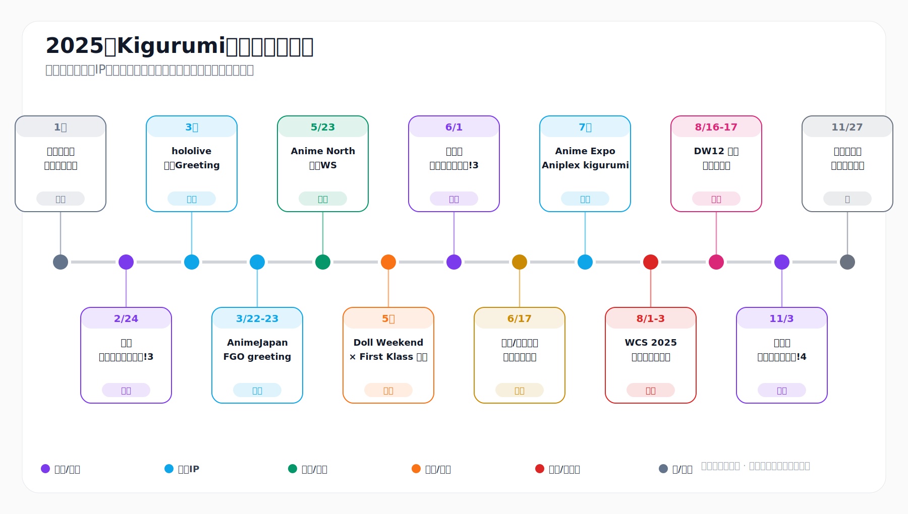
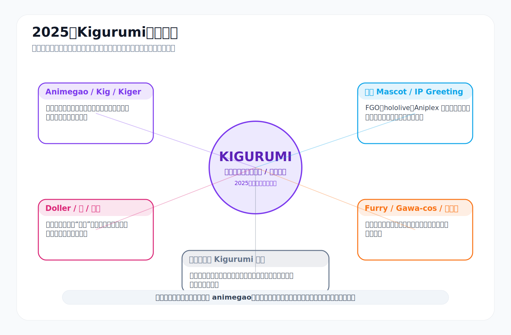
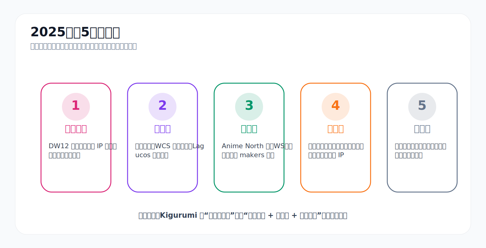
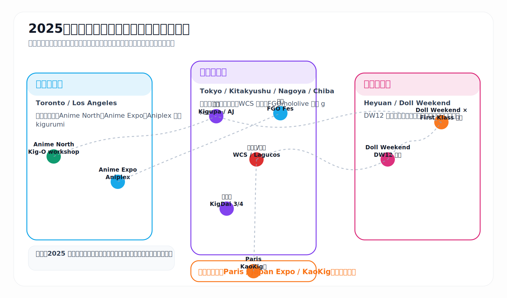
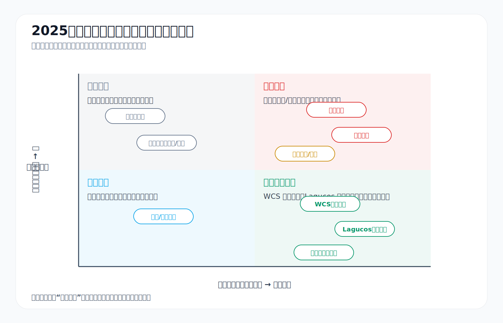
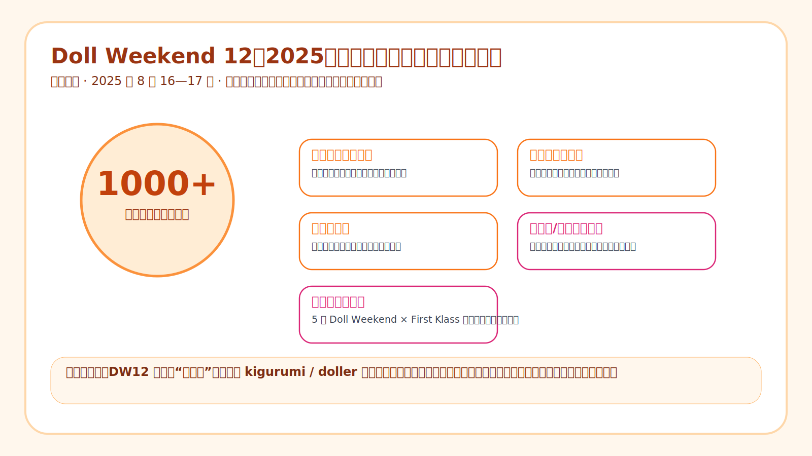

# 2025年 Kigurumi 編年史

> **版の説明**  
> このページは、2025年の kigurumi 関連公開資料を日本語向けに整理した年度ページである。元ページの事件線、図表、脚注、公開範囲を保ちつつ、Kigurumi 編年誌の国際化ページとして接続する。

---

## 目次

- [0. 読み方と資料範囲](#0-阅读口径与资料边界)
- [1. 年度概観：2025年はなぜ重要か](#1-年度总览2025-年为什么重要)
- [2. 編年本文](#2-编年史正文)
- [3. 主要人物・組織・場域索引](#3-主要人物组织与场域索引)
- [4. 正面事件・負面事件・考証事件・噂事件の総覧](#4-正面事件负面事件考究事件与传闻事件总账)
- [5. 年度結論](#5-年度结论)
- [6. 参考資料](#6-参考资料)

---

## 0. 読み方と資料範囲 {#0-阅读口径与资料边界}

2025年の公開資料における **kigurumi** は一つの意味だけを持たない。本ページでは、中文圏・日本語圏で語られる **animegao kigurumi / 美少女着ぐるみ / Kig / Kiger / 変娃** を中心に、公式 IP のマスコット、doller、furry、gawa-cos、特撮的な全頭マスク、英語圏の onesie 文脈を区別して扱う。

| 層 | 主な内容 | 2025年の表れ |
|---|---|---|
| Animegao / Kig / Kiger | アニメ顔の面、肌色タイツ、キャラクター衣装、撮影と表現 | 東京「きぐるみパーティ!」、Anime North の製面ワークショップ、参加者の公開記録 |
| Doller / 娃 / 変娃 | 中文圏で多い「娃化」表現。身体の没入、大型イベント、頭部造形を重視 | Doll Weekend 12、Doll Weekend × First Klass 日本企画 |
| 公式 Mascot / IP Greeting | ブランド側が制作・運営する公式キャラクター着ぐるみ | FGO、hololive、Aniplex が AnimeJapan、FGO Fes、Anime Expo などで登場 |
| Furry / Gawa-cos / 全頭マスク | 獣装、特撮系スーツ、ヘルメット、全顔面マスクなど隣接する全身装い | WCS ルール、九州「着ぐるみ大行進!」の並列管理 |
| Onesie 文脈 | 英語 EC でよく見られる animal onesie / ルームウェア | 本文の主線ではなく、用語境界としてのみ触れる |

資料の信頼度は、公式イベントページ、規則文書、政府・主催者発表、媒体記事、ブランドリリース、参加者の公開文章、匿名掲示板の索引で異なる。匿名の噂は、具体的な人物名や未確認の告発としてではなく、社群治理上の圧力として記録する。

---

## 1. 年度概観：2025年はなぜ重要か {#1-年度总览2025-年为什么重要}

2025年の kigurumi には五つの主線が同時に見える。

1. **大規模化**：中国の Doll Weekend 12 は 1000+ の参加者を公開し、ドール主題の花火、ドローンショー、ドール行進を行った。[^dw-cn]
2. **制度化**：東京「きぐるみパーティ!」、北九州「着ぐるみ大行進!」、WCS の覆面服装ルール、Lagucos の水域制限により、kigurumi は明文化されたイベント規則の中に入った。[^kigupa][^wcs-rule]
3. **技術化**：Kigurumi Online は Anime North 2025 で、animegao の歴史、製面、目の形、ウィッグ、着用調整を新人向けの学習手順にした。[^kig-o]
4. **越境化**：Doll Weekend × First Klass 日本企画、北米 Anime North、米国 Anime Expo、日本 WCS、中国 DW12、欧州 KaoKig の線が多地域ネットワークを示した。[^dw-cn][^aniplex-ax][^japanexpo]
5. **争点化**：匿名掲示板、オンラインでの嫌がらせ、撮影同意、暑熱・脱水、水辺安全、関税・物流がより可視化した。[^wcs-party][^lagucos][^blackcat]

要するに、2025年の kigurumi は「小さな視覚的奇観」から、「イベント生態、産業チェーン、越境ネットワーク、ルール治理が併存する複合文化」へ進んだ。

---

## 2. 編年本文 {#2-编年史正文}

| 時期 | 出来事 | 地域 / 類型 | 編年上の意味 |
|---|---|---|---|
| 1月頃 | 用語と社群アイデンティティの整理 | 跨語境の考証 | kigurumi、animegao、doller、mascot、furry、onesie の境界を確認 |
| 2月24日 | 第3回・きぐるみパーティ! | 東京 / 専門イベント | 面具型 kigurumi が専用の会場、動線、更衣、撮影規則を必要とする参加形式として扱われた |
| 3月上旬 | hololive SUPER EXPO 2025 Kigurumi Greeting | 公式 IP | VTuber の仮想キャラクターが現実空間で実体化した |
| 3月22-23日 | AnimeJapan 2025 FGO greeting | 公式 IP / 展示会 | 大型商業アニメイベントが kigurumi をブース運営に組み込んだ |
| 5月23日頃 | Anime North 2025 / Kigurumi Online workshop | 北米 / 技術教育 | 製面と装着知識が教えられるプロセスになった |
| 5月 | Doll Weekend × First Klass 日本企画 | 中日越境協力 | 中国の「娃/Kig」体系が海外撮影会の場へ伸びた |
| 6月1日 | 着ぐるみ大行進!3 | 北九州 / 地方交流会 | 九州の全身装い社群が固定プラットフォームを持ち始めた |
| 6月17日頃 | BlackCatKig / Inthemask 米国顧客通知 | 産業 / 物流 | 関税、転送倉庫、納期が kigurumi の基盤問題として表面化した |
| 7月 | Anime Expo 2025 Aniplex kigurumi | 米国 / 公式 IP | 北米大型展示会で公式 kigurumi がファン交流に使われた |
| 7月 | Japan Expo 2025 / KaoKig の線 | 欧州 / 公開展示 | 欧州 animegao の公開線が継続していることを示した |
| 8月1-3日 | World Cosplay Summit 2025 | 名古屋 / 主流 cosplay ルール | kigurumi、doller、gawa-cos など覆面服装が管理対象に入った |
| 8月1-3日 | Lagucos / WCS 周辺ルール | 安全治理 | 水域、高温、脱水、移動視野、撮影同意が規則上の問題になった |
| 8月2-3日 | FGO Fes. 2025 十周年 | 幕張 / 公式 IP | 9名の kigurumi と14名の公式 cosplayer が没入型祝祭を構成した |
| 8月16-17日 | Doll Weekend 12 広東省河源 | 中国 / 千人級イベント | 中文圏 kigurumi / doller が祝祭化、産業化、都市協力へ進んだ |
| 9-10月 | 中文・日本語をまたぐ参加者文章 | 公開文章 / 用語考証 | 「変娃」経験と外部からの誤読が当事者によって説明された |
| 11月3日 | 着ぐるみ大行進!4 | 北九州 / 継続イベント | 半年以内に二度開催され、地方活動のリズムが見えた |
| 11月下旬 | 匿名「問題児観察」スレッド | 噂の場 / 治理圧力 | 小さな社群における噂、名指し、治理の課題が可視化した |
| 12月 | 年末総括 | 年度まとめ | 2025年は「拡張とルールが並行した年」として整理できる |

### 用語境界と専門イベント

年初の重要点は、同じ kigurumi という語が資料ごとに異なるものを指すことだった。2月の東京「きぐるみパーティ!」は、撮影、更衣、交流、団体写真、runway など、面具型 kigurumi に特化した環境を用意し、この参加形式が普通 cosplay の付属物ではなく、独自の設計を必要とすることを示した。[^animegao][^kigupa][^note-term]

### 公式 IP と教育化

3月の hololive SUPER EXPO 2025 と AnimeJapan 2025 の FGO greeting は、公式 IP が kigurumi を線下のファン交流手段として使う流れを示した。5月の Anime North では Kigurumi Online が製面ワークショップを行い、歴史、makers、目の形、ウィッグ、内装、装着調整を新人向けの教育プロセスへ変換した。[^hololive][^fgo-aj][^animenorth][^kig-o]

### 越境、地方化、産業基盤

Doll Weekend × First Klass 日本企画は、中国の「娃/Kig」体系が日本の撮影会文化と接続する例である。北九州の「着ぐるみ大行進!3」は、美少女着ぐるみ、doller、furry、gawa-cos を含む地方交流プラットフォームを形成した。BlackCatKig / Inthemask の米国顧客通知は、関税、転送倉庫、清関、空輸日数が kigurumi の参加計画に影響することを示した。[^dw-cn][^kigdai][^blackcat]

### 8月の密集ノード

WCS 2025 は、kigurumi、gawa-cos、doller、全顔面マスク、ヘルメットを許可しつつ、安全確認とスタッフ指示を求める形で主流 cosplay の治理枠に入れた。Lagucos / WCS 周辺規則は、水辺、脱水、撮影同意、移動安全を明文化した。[^mofa-wcs][^wcs-rule][^wcs-party][^lagucos]

FGO Fes. 2025 では 9名の kigurumi と14名の公式 cosplayer が来場者を迎えた。Doll Weekend 12 は 1000+ の参加者、花火、ドローンショー、ドール行進、出展者・クリエイター体系を備え、2025年の中国ラインにおける最大の規模化ノードとなった。[^fgo-fes][^dw-cn][^dw-pr]

### 参加者の言葉と噂の治理

9-10月の公開文章は、中文圏の Kigurumi、Kig、Kiger、変娃を日本語圏へ説明し、同時に kigurumi / latex の公開投稿が嫌がらせや性的誤読を招く可能性を記録した。11月の「着ぐるみ大行進!4」は地方イベントの継続性を示し、匿名掲示板の「問題児観察」系スレッドは、個人名を事実として扱うのではなく、社群治理上の圧力として扱うべき資料である。[^note-term][^note-harass][^kigdai4][^kyodemo][^wikifur]

---

## 3. 主要人物・組織・場域索引 {#3-主要人物组织与场域索引}

| 組織 / 場域 | 2025年の位置づけ | 編年上の意味 |
|---|---|---|
| Cosplay 博 / きぐるみパーティ! | 東京の面具型 kigurumi 専門イベント | 撮影、更衣、団体展示、runway を提供し、日本国内の制度化を示す |
| 九州化装会、i-key、Cospic、らいむ / 着ぐるみ大行進! | 日本の地方社群線 | 6月と11月の連続開催により、九州の全身 cosplay 交流基盤を形成 |
| Kigurumi Online | 北米の技術伝播と入門教育 | 製面、目、ウィッグ、内装、着用調整をワークショップ化 |
| Doll Weekend / First Klass | 中国「娃/Kig」の大型化と越境線 | 日本企画と DW12 が越境性と祝祭化を示す |
| BlackCatKig / Inthemask | 制作、販売、国際物流 | 関税、転送、清関、納期が参加と入門に影響 |
| World Cosplay Summit / Lagucos | 主流 cosplay の規則治理 | 覆面服装を「許可 + 安全確認 + 指示遵守」の枠に入れる |
| FGO、Aniplex、hololive | 公式 IP の実体化 | 大型展示会で一般観客が公式 kigurumi greeting に触れる |
| KaoKig / Japan Expo | 欧州公開展示線 | 資料は限られるが、欧州 animegao 線の継続を示す |

---

## 4. 正面事件・負面事件・考証事件・噂事件の総覧 {#4-正面事件负面事件考究事件与传闻事件总账}

| 類型 | 代表内容 | 2025年の意味 |
|---|---|---|
| 正面事件 | 専門イベントの増加、WCS ルール承認、Anime North ワークショップ、DW12 大型化、越境交流 | kigurumi が活動、教育、展示、国際ネットワークを得た |
| リスク事件 | 高温脱水、水域安全、撮影同意、ネット嫌がらせ、関税物流 | リスクが規則に書かれること自体が成熟化の証拠になる |
| 考証事件 | animegao と公式 mascot の違い、中文「娃/Kig」用語、覆面服装規則、onesie との誤読 | 隣接文化を混同しないための整理 |
| 噂事件 | 匿名掲示板、X 転載、活動後の口碑 | 未確認告発ではなく治理圧力として記録する |

---

## 5. 年度結論 {#5-年度结论}

2025年は kigurumi の起源年ではなく、単純な流行年でもない。東京、北九州、名古屋、幕張、トロント、ロサンゼルス、河源、パリの公開ノードに、ワークショップ、公式 IP、物流通知、安全規則、匿名掲示板が重なったことで、kigurumi は少数愛好者の視覚的奇観から、イベント、産業、規則、争点、国際ネットワークを持つ複合文化へ移行した。

---

## 6. 参考資料 {#6-参考资料}

[^animegao]: Kigurumi Animegao France, “Kigurumi Animegao,” <https://kigurumi-animegao.fr/>
[^kigupa]: Cosplay 博 / C-NET, “第3回・きぐるみパーティ!,” <https://cnet.cosplay.ne.jp/kigupa001.html>
[^hololive]: hololive SUPER EXPO 2025, “Kigurumi Greeting,” <https://hololivesuperexpo2025.hololivepro.com/news/greeting>
[^fgo-aj]: Fate/Grand Order, “AnimeJapan 2025 出展情報,” <https://news.fate-go.jp/2025/aj2025/>
[^animenorth]: Anime North 2025 industry / exhibitor information, <https://www.animenorth.com/index.php/component/sppagebuilder/?id=819&view=page>
[^kig-o]: Kigurumi Online, “Kigurumi Workshop,” <https://kig-o.com/index.php/kigurumi-workshop/>
[^dw-cn]: Doll Weekend 官方页面, <https://dollweekend.cn/cn/>
[^kigdai]: Cospic, “着ぐるみ大行進” series category, <https://cospic.org/archives/category/event/kigdai>
[^blackcat]: BlackCatKig, “A Notice to US Customers,” <https://blackcatkig.com/pages/a-notice-to-us-customers?srsltid=AfmBOoruxavN6nFtN86FypnnRhYe5XVpHZKtpus8bQOPJBhYh9TlILNd>
[^aniplex-ax]: Aniplex of America, Anime Expo 2025 Press Release PDF, <https://aniplexusa.com/pdf/AOAAX25PRESSRELEASE.pdf>
[^japanexpo]: Japan Expo Paris, “Memories: Cosplay in Japan Expo 2025,” <https://www.japan-expo-paris.com/en/actualites/memories-cosplay-in-japan-expo-2025_114625.htm>
[^mofa-wcs]: Ministry of Foreign Affairs of Japan, World Cosplay Summit 2025 record, <https://www.mofa.go.jp/p_pd/ca_opr/pagewe_000001_00233.html>
[^wcs-rule]: World Cosplay Summit 2025, Cosplay Rule, <https://worldcosplaysummit.jp/2025/cosplay/rule/>
[^wcs-party]: World Cosplay Summit Party, Rule PDF, <https://worldcosplaysummit.jp/wcsparty/wp-content/uploads/2025/03/rule-jp.pdf>
[^lagucos]: Lagucos 2025 petite, Rule PDF, <https://worldcosplaysummit.jp/lagucos/petit/wp-content/themes/petit2025/common/images/rule_en.pdf>
[^fgo-fes]: LevelUp Logy, FGO Fes. 2025 coverage, <https://leveluplogy.jp/archives/23212>
[^dw-pr]: PR Times, Doll Weekend 12 release, <https://prtimes.jp/main/html/rd/p/000000004.000167011.html>
[^note-term]: note.com, “中文圈 Kigurumi / Kig / Kiger / 变娃”相关公开文章, <https://note.com/eichan_sh/n/n6738a8ae576b>
[^note-harass]: note.com, 参与者关于公开发布 kigurumi / latex 内容后遭遇骚扰的记录, <https://note.com/eichan_sh/n/n931989e28ca5>
[^kigdai4]: Cospic, “着ぐるみ大行進！4,” <https://cospic.org/archives/494>
[^kyodemo]: Kyodemo, “着ぐるみ関係の問題児観察スレ” thread index, <https://www.kyodemo.net/sdemo/r/twwatch/1764237229/>
[^wikifur]: WikiFur Japan, “着ぐるみを着る人々を語るスレ,” <https://ja.wikifur.com/wiki/%E7%9D%80%E3%81%90%E3%82%8B%E3%81%BF%E3%82%92%E7%9D%80%E3%82%8B%E4%BA%BA%E3%80%85%E3%82%92%E8%AA%9E%E3%82%8B%E3%82%B9%E3%83%AC>
