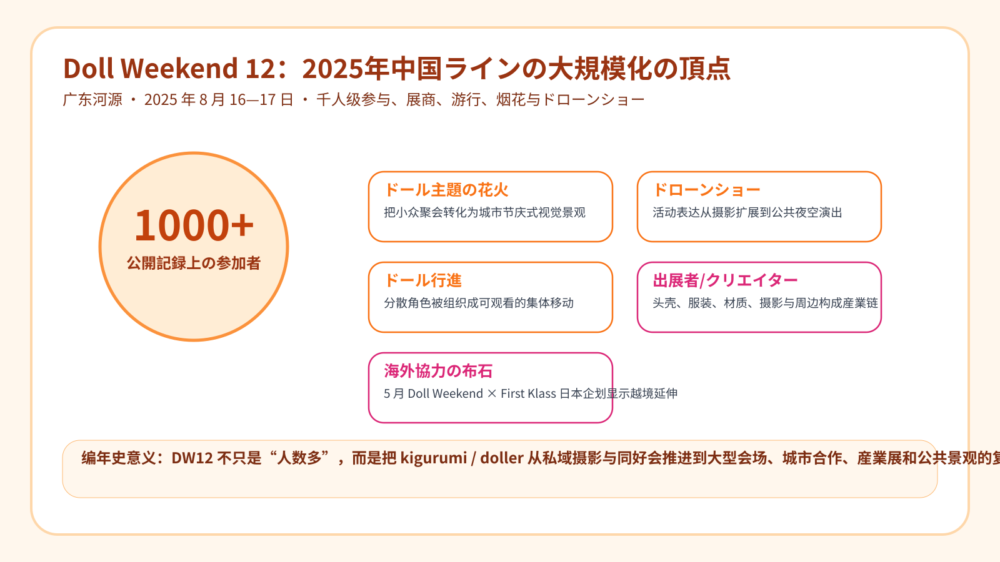

# 2025年 Kigurumi 編年史

> 本巻は当年の出来事、作品、公開資料を記録します。告知、開催記録、資料の発表を区別します。

## 編年本文 {#2-编年史正文}

| 時期 | 出来事 | 地域 / 類型 | 編年上の意味 |
|---|---|---|---|
| 2月24日 | 第3回・きぐるみパーティ![^kigupa] | 東京 / 専門イベント | 面具型 kigurumi が専用の会場、動線、更衣、撮影規則を必要とする参加形式として扱われた |
| 3月上旬 | hololive SUPER EXPO 2025 Kigurumi Greeting | 公式 IP | VTuber の仮想キャラクターが現実空間で実体化した |
| 3月22-23日 | AnimeJapan 2025 FGO greeting | 公式 IP / 展示会 | 大型商業アニメイベントが kigurumi をブース運営に組み込んだ |
| 5月23日19時（告知） | Anime North 2025 / Kigurumi Online workshop | 北米 / 技術教育 | 製面と装着知識が教えられるプロセスになった |
| 5月 | Doll Weekend × First Klass 日本企画 | 中日越境協力 | 中国の「娃/Kig」体系が海外撮影会の場へ伸びた |
| 6月1日 | 着ぐるみ大行進!3[^kigdai] | 北九州 / 地方交流会 | 九州の全身装い社群が固定プラットフォームを持ち始めた |
| 7月 | Anime Expo 2025 Aniplex kigurumi | 米国 / 公式 IP | 北米大型展示会で公式 kigurumi がファン交流に使われた |
| 8月1-3日 | World Cosplay Summit 2025[^wcs-rule] | 名古屋 / 主流 cosplay ルール | kigurumi、doller、gawa-cos など覆面服装が管理対象に入った |
| 8月2-3日 | FGO Fes. 2025 十周年 | 幕張 / 公式 IP | 9名の kigurumi と14名の公式 cosplayer が没入型祝祭を構成した |
| 8月16-17日 | Doll Weekend 12 広東省河源 | 中国 / 千人級イベント | 中文圏 kigurumi / doller が祝祭化、産業化、都市協力へ進んだ |
| 11月3日 | 着ぐるみ大行進!4[^kigdai4] | 北九州 / 継続イベント | 半年以内に二度開催され、地方活動のリズムが見えた |

### 公式 IP と教育化

3月の hololive SUPER EXPO 2025 と AnimeJapan 2025 の FGO greeting は、公式 IP が kigurumi を線下のファン交流手段として使う流れを示した。Kigurumi Online は Anime North で5月23日19時からの製面ワークショップを告知した。目、眉、まつ毛、ウィッグ、内装を選び、装着に合わせて調整する内容で、見学は無料と案内された。[^hololive][^fgo-aj][^animenorth][^kig-o]

### 8月の密集ノード

FGO Fes. 2025 では 9名の kigurumi と14名の公式 cosplayer が来場者を迎えた。Doll Weekend 12 は 1000+ の参加者、花火、ドローンショー、ドール行進、出展者・クリエイター体系を備え、2025年の中国ラインにおける最大の規模化ノードとなった。[^fgo-fes][^dw-cn][^dw-pr]

## 参考資料 {#6-参考资料}

[^hololive]: hololive SUPER EXPO 2025, “Kigurumi Greeting,” <https://hololivesuperexpo2025.hololivepro.com/news/greeting>
[^fgo-aj]: Fate/Grand Order, “AnimeJapan 2025 出展情報,” <https://news.fate-go.jp/2025/aj2025/>
[^animenorth]: Anime North 2025 industry / exhibitor information, <https://www.animenorth.com/index.php/component/sppagebuilder/?id=819&view=page>
[^kig-o]: Kigurumi Online, “Kigurumi Workshop,” <https://kig-o.com/index.php/kigurumi-workshop/>
[^dw-cn]: Doll Weekend 官方页面, <https://dollweekend.cn/cn/>
[^fgo-fes]: LevelUp Logy, FGO Fes. 2025 coverage, <https://leveluplogy.jp/archives/23212>
[^dw-pr]: PR Times, Doll Weekend 12 release, <https://prtimes.jp/main/html/rd/p/000000004.000167011.html>
[^kigupa]: Cosplay 博 / C-NET, “第3回・きぐるみパーティ!,” <https://cnet.cosplay.ne.jp/kigupa001.html>
[^kigdai]: Cospic, “着ぐるみ大行進” series category, <https://cospic.org/archives/category/event/kigdai>
[^kigdai4]: Cospic, “着ぐるみ大行進！4,” <https://cospic.org/archives/494>
[^wcs-rule]: World Cosplay Summit 2025, Cosplay Rule, <https://worldcosplaysummit.jp/2025/cosplay/rule/>
