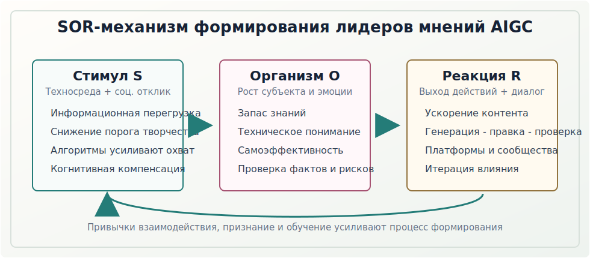
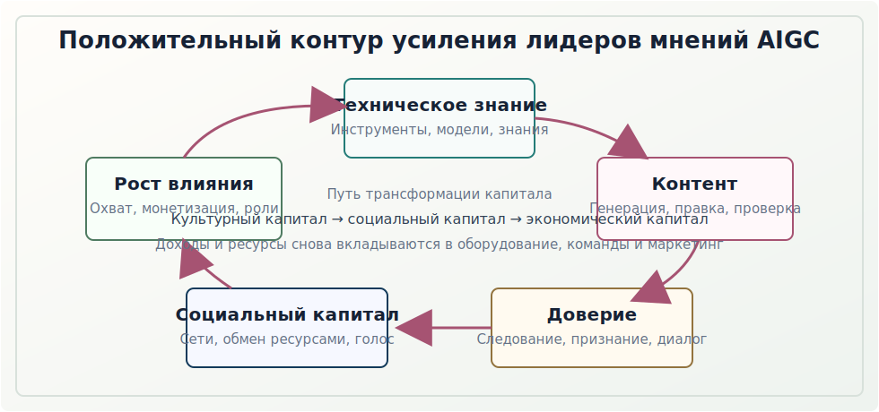

# «Механизм формирования лидеров мнений в эпоху AIGC и вызовы развития»

!!! note "Характер материала"
    Эта страница подготовлена на основе PDF «AIGC 时代意见领袖生成机理与趋势挑战» и сохраняет структуру исходной статьи: авторство, аннотацию, ключевые слова, основной текст, сведения о гранте и список литературы. SVG-схемы на странице добавлены архивом для удобства чтения и не являются иллюстрациями из оригинальной статьи.

| Поле | Содержание |
| --- | --- |
| Оригинальное название | AIGC 时代意见领袖生成机理与趋势挑战 |
| Название по-русски | Механизм формирования лидеров мнений в эпоху AIGC и вызовы развития |
| Авторы | Цай Шэнхань, Вэй Дэюй |
| Организация | Институт гуманитарных и социальных наук Фучжоуского университета, Фучжоу, Фуцзянь 350000 |
| Публикация | «Вестник Ниндэского педагогического университета (философия и социальные науки)», 2026, № 1, общий выпуск 156 |
| Номер статьи | 2095-3682（2026）01-0071-05 |
| Классификационный номер | G206 |
| Код документа | A |
| Дата поступления | 2025-10-10 |
| Проект | Проект социальных наук Департамента образования провинции Фуцзянь（GY-J-21185） |
| Ответственный редактор | Хэ Хайцзюй |
| Обработка на этой странице | Текст приведен по структуре исходной статьи и дополнен схемами для чтения |

## Авторство статьи

**AIGC 时代意见领袖生成机理与趋势挑战**

Цай Шэнхань　Вэй Дэюй

（Институт гуманитарных и социальных наук Фучжоуского университета, Фучжоу, Фуцзянь 350000）

## Аннотация

Аннотация: Сегодня, когда искусственный интеллект бурно развивается, влияние новых технологий пронизывает все стороны учебы, жизни и работы людей. AI-технологии, представленные генеративным искусственным интеллектом, демонстрируют высокую удобность, применимость и инновационность в аудиовизуальном производстве, создании изображений, редактировании текста и других областях. Они также оказали беспрецедентно глубокое влияние на способы производства и распространения контента лидерами мнений. В эпоху сетевой коммуникации и постправды лидеры мнений являются не только передатчиками информации и интерпретаторами мнений, но и выполняют множество ролей: направляют общественное мнение, открывают пространство для многообразной культуры, продвигают инновационные технологии, управляют сетевыми сообществами. В статье в качестве ключевых слов выбраны взаимодействие, признание, итерация и ускорение. С точки зрения теории SOR подробно рассматривается механизм формирования лидеров мнений в эпоху AIGC, раскрываются их новые роли и новые признаки, обсуждаются формирование, трансформация, тенденции развития и стратегии ответа на вызовы в контексте новых технологий. Это дает научные ориентиры для формирования и подготовки профессиональных лидеров мнений в эпоху AIGC.

Ключевые слова: теория SOR; лидеры мнений; механизм формирования; тенденции и вызовы

Классификационный номер: G206　　Код документа: A　　Номер статьи: 2095-3682（2026）01-0071-05

## Основной текст

AIGC（Artificial Intelligence Generated Content）на китайский язык переводится как «контент, генерируемый искусственным интеллектом» и также называется «генеративным искусственным интеллектом». Понятие «лидер мнений» впервые предложили американский социолог Пол Лазарсфельд и его коллеги при исследовании президентских выборов в США. Их исследование показало, что лидеры мнений способны принимать и деконструировать информацию, поступающую из среды, приносить аудитории доверие и эмоциональное удовлетворение, привлекать аудиторию к взаимодействию с собой, постоянно стимулировать энтузиазм взаимодействия и направлять аудиторию к определенной реакции. Вступая в эпоху AIGC, лидер мнений эпохи AIGC означает человека, который способен с помощью технологии AIGC, опираясь на интернет-платформы социальных медиа, сочетая человека и машину, моделированно и поточно создавать контент и распространять информацию, формировать группу последователей, влиять на решения и поведение аудитории, а затем оказывать заметное влияние на общественное мнение и ценности аудитории. Кратко говоря, модель эволюции лидеров мнений эпохи AIGC становится сложнее, роли становятся более многообразными, а влияние более широким[1]. Поэтому точное понимание механизма формирования лидеров мнений эпохи AIGC, раскрытие их трансформационных признаков, новых ролей и будущих тенденций развития в контексте новых технологий имеет важное практическое значение.

## I. Взаимодействие: рождение лидеров мнений и соответствие теории SOR

### 1. Теория SOR и ее содержание

Теория SOR, то есть теория «стимул - организм - реакция»（Stimulus-Organism-Response）, является теорией психологии и поведенческих наук и часто используется для объяснения того, как индивид реагирует на внешние стимулы. По мере междисциплинарного пересечения и интеграции теория SOR широко применяется во многих дисциплинах за пределами психологии и постепенно уточняется и совершенствуется в разных контекстах. В настоящее время исследование и применение теории SOR в академической среде главным образом проявляется в том, что она используется в конкретных контекстах и темах, таких как маркетинг, низовое управление, управление человеческими ресурсами, медиакоммуникация. Исследователи фокусируются на конкретных группах, рассматривают индивидуальные и социальные явления и проблемы вокруг этой группы в рамках выбранного контекста или темы, выделяют факторы влияния и показатели, а затем дают выводы, решения или меры[2]. Как метатеоретическая парадигма анализа человеческого поведения, теория SOR делит общий процесс возникновения поведения на внешний стимул（Stimulus）→ внутреннее состояние индивида（Organism）→ поведенческую реакцию（Response）. Она главным образом объясняет, как стимул через процессы восприятия и познания организма преобразуется во внутренние психологические представления, как эти представления дальше возбуждают эмоциональную реакцию индивида и в конечном счете приводят к поведенческой реакции.

### 2. Характеристики лидеров мнений в эпоху AIGC

В контексте эпохи AIGC лидер мнений является ключевым узлом в экологии общественного мнения. В создании контента происходит переход от традиционной модели «человеческого опыта» к модели, движимой «технологиями и данными»: она точнее удовлетворяет уникальные потребности и предпочтения аудитории, эффективнее повышает производительность контента лидера мнений и шире предоставляет варианты творчества и креативные тексты. В распространении контента прежняя модель «обычных медиа» переходит к модели «многоформатной кроссплатформенности». Разнообразные формы выражения делают контент более заметным. Алгоритмы больших данных могут своевременно отправлять новый контент лидера мнений тем группам аудитории, которые с наибольшей вероятностью им заинтересуются, и увеличивать время просмотра, повышая охват контента, досматриваемость работ и участие аудитории. В способах взаимодействия прежняя односторонняя модель «один ко многим» переходит к многонаправленной кастомизированной модели «многие ко многим». Способы взаимодействия становятся более разнообразными и персонализированными. Такое мгновенное и глубокое взаимодействие позволяет лидеру мнений лучше понимать потребности аудитории и изменения отношений в сообществе, своевременно корректировать стратегию коммуникации и способы взаимодействия, поддерживать собственное влияние и конкурентоспособность.

### 3. Соответствие механизма формирования лидеров мнений и теории SOR

Ядро связи между аудиторией и лидером мнений заключается во взаимодействии. Через взаимодействие возбуждение и привлечение аудитории лидером мнений не ограничивается предоставлением качественного контента и полезных рекомендаций; оно также состоит в предоставлении активных способов, методов и путей взаимодействия, которые способствуют формированию привычки взаимодействовать. Высокая интерактивность является ключевым условием накопления доверия и влияния лидером мнений, а также важной опорой для формирования у аудитории привычки взаимодействия. В Китае тематические платформы сообществ, такие как Tieba, Weibo, Douban, а также коротковидеоплатформы Douyin, Bilibili, Kuaishou различаются по пользовательским признакам, форме контента и механизму взаимодействия, поэтому коммуникационные стратегии лидеров мнений на них также различаются. Но в сценах взаимодействия высокая социальная активность лидера мнений, поведенческая характеристика постоянного обмена и запас профессиональных знаний вместе образуют эмоциональные, поведенческие и содержательные мотивы, которые привлекают аудиторию и поддерживают длительное взаимодействие. Эти мотивы в процессе усиления взаимодействия также превращаются в привычку взаимодействия. Формирование, развитие, зрелость и возвышение лидера мнений тесно связаны с интерактивным поведением, точнее - значительно связаны с привычкой взаимодействия. Чем чаще взаимодействие, тем больше накапливаются технологические знания, тем точнее деконструируется и восстанавливается информация, тем сильнее инновационность и доверительность формы и содержания общения, тем глубже мотивы поддержания взаимодействия входят в сознание людей, и тем глубже интериоризируется превращенная из них привычка взаимодействия. Отсюда видно, что в совместном интерактивном поведении лидера мнений и аудитории влияние привычки взаимодействия в высокой степени соответствует логике воздействия на индивида, описанной в теории SOR. Поэтому теория SOR предоставляет теоретическую рамку для механизма формирования лидеров мнений и особенно обладает научным преимуществом и важной ролью при объяснении механизма запуска индивидуального поведения[3].

## II. Признание: SOR-механизм формирования лидеров мнений AIGC

На основе теоретической рамки SOR механизм формирования лидеров мнений эпохи AIGC можно рассматривать через три измерения: стимул, организм и реакцию. Он подразделяется на три уровня: технология + обратная связь среды（S）, рост субъекта（O）, поведенческий выход + взаимодействие（R）. В значительной мере он влияет на других индивидов и группы и получает их признание и одобрение.

**Вспомогательная схема 1: SOR-механизм формирования лидеров мнений AIGC (не является схемой из оригинальной статьи)**

### 1. Уровень стимула（Stimulus）

Он проявляется в наложении изменений спроса, вызванных технологической средой и обратной связью социальной среды. Во-первых, AIGC ежедневно генерирует десятки миллиардов единиц контента, и аудитория сталкивается с трудностью выбора информации. Такая потребность в фильтрации информационного взрыва и перегрузки является главным внешним источником стимула. Во-вторых, мультимодальные инструменты искусственного интеллекта для генерации значительно снизили порог творчества; кроме того, технология усиливает поле коммуникации. Например, интеллектуальные рекомендательные алгоритмы точно и быстро распределяют пути распространения, резко увеличивая просмотры и посещения некоторых социальных платформ и формируя масштабный стимулирующий эффект. В-третьих, под воздействием психологии когнитивной компенсации обычные пользователи имеют определенные когнитивные пробелы в отношении технологии AIGC, поэтому возникает зависимость от профессиональных интерпретаторов; к лидерам мнений с технической сложностью также проявляется более высокое признание и предпочтение, что образует целевой стимул для роста влияния. В-четвертых, некоторые обычные пользователи, которые контактировали с технологией AIGC и понимают ее принцип работы, интериоризировали влияние AIGC в свои социальные механизмы и модели взаимодействия, а затем приносят это влияние и стимул в окружающую среду. В-пятых, при поддержке технологии AIGC интерактивность социальных медиа проявляет высокий уровень данных, интенсивности и отклика. Это заставляет обычных пользователей все больше полагаться на AIGC для участия во взаимодействии, поддержания взаимодействия и включения во взаимодействие, формируя нормализованное признание глубокого взаимодействия[4].

### 2. Уровень организма（Organism）

Он проявляется в повышении индивидуального познания самого лидера мнений AIGC и в постоянно получаемом эмоциональном опыте. Во-первых, в построении профессиональной когнитивной системы лидер мнений AIGC создает относительно богатый запас знаний на уровне графа знаний, способен понимать и осваивать принципы, связанные с технологией AIGC, а глубина технического понимания и способность обработки информации у него значительно превосходят обычных пользователей. Согласно «Отчету о сценариях применения и коммерческом потенциале AIGC в Китае 2024 года», опубликованному TopKlout, уровень использования инструментов AIGC у лидеров мнений верхнего уровня достиг 92%, а ежедневный объем обработки информации составил 7,2 объема обычного пользователя. Во-вторых, эмоциональный драйвер лидеров мнений AIGC главным образом исходит из чувства самоэффективности и мотива достижения, полученных через овладение технологией. Согласно теории иерархии потребностей Маслоу, в части потребностей уважения и самореализации подавляющее большинство лидеров мнений верхнего уровня демонстрирует сильную альтруистическую направленность и желание делиться знаниями, чтобы реализовать высшую потребность в социальном признании. В-третьих, лидеры мнений, хорошо владеющие AIGC, постепенно создают многоуровневый механизм проверки и валидации контента, включая фактчекинг, логическое рассуждение, техническую проверку и т. д. Их способность воспринимать риски сильнее, а опубликованный сгенерированный контент оказывается более строгим и надежным с точки зрения точности, что приносит признание пользователей и аудитории[5].

### 3. Уровень реакции（Response）

Он проявляется в поведенческих моделях, связанных с формированием влияния лидеров мнений AIGC. Во-первых, в производстве контента они в основном интегрируют интеллектуальные цепочки инструментов для генерации контента, визуального представления и мультимодального редактирования, постоянно сокращая цикл производства контента и повышая скорость реакции. Одновременно с точки зрения качества контента проявляется трехступенчатый фильтр AIGC «генерация - исправление - проверка» и его системное преимущество. Во-вторых, формируется стратегия социальной коммуникации с признаками AIGC. Например, матричная работа на платформах обычно использует комбинированную стратегию основной платформы и нескольких вспомогательных платформ; интерактивный дизайн использует модель «капсулы знаний», то есть короткое «вспыхивание» ключевой точки знания плюс программное объяснение с глубокой аналитикой и градацией содержания; сообщественная работа строит пирамидальную фанатскую структуру «1% основных участников, 9% активных пользователей, 90% обычной аудитории». В-третьих, механизм итерации влияния включает технологическую чувствительность, систему анализа обратной связи и эволюцию личного IP. Согласно колонке практики IP бренда Zonghui, опубликованной в апреле 2025 года, оценка доверия к лидерам мнений AIGC достигает 4,7/5（из 5）, что конкретно проявляется в среднем обновлении по итерациям модели Stable Diffusion каждые 45 дней, обновлении личной IP-системы знаний каждые 6 месяцев, а также использовании инструментов вроде Socialbakers для атрибуционного анализа коммуникационного эффекта, чтобы сохранять признание профессионализма[6].

## III. Итерация: контур усиления SOR у лидеров мнений AIGC

**Вспомогательная схема 2: положительный контур усиления лидеров мнений AIGC (не является схемой из оригинальной статьи)**

### 1. Комплексная система способностей и преобразование ролей

Механизм формирования SOR показывает, что в среде ускоренной итерации технологии AIGC лидеры мнений AIGC через непрерывный механизм обучения и роста «технологический стимул（S）→ построение когнитивной системы（O）→ профессионализированное производство контента（R）» постепенно формируют комплексную систему способностей «техническое познание - производство контента - накопление доверия». Большинство лидеров мнений AIGC являются ранними наблюдателями технологии AIGC и прорывными участниками отраслевого творчества. Они постоянно следят за новыми технологиями и возможными областями их применения, используют передовые алгоритмы и инструменты анализа данных, точнее понимают потребности и интересы аудитории, эффективнее отбирают, интегрируют и распространяют ценную и качественную информацию, постоянно исследуют новые формы контента и способы распространения, устанавливают более тесную связь с аудиторией, предоставляют соответствующие контентные услуги ядру последователей и широкой аудитории, лучше удовлетворяют персонализированные потребности аудитории и тем самым переходят от пересказчика информации к интегратору ценностей, точному проводнику мнений, технологическому инноватору и другим ролям[7].

### 2. Трансформация капитала и социальное влияние

Согласно теории культурного капитала Пьера Бурдье, поддержка и ресурсы, которые индивид в сети социальных отношений получает и обменивает в деятельности, могут быть абстрагированы в три типа: «культурный капитал», «социальный капитал» и «экономический капитал». Культурный капитал（Cultural Capital）- это культурная грамотность, запас знаний, профессиональные навыки, эстетические способности и соответствующий образовательный багаж индивида. Социальный капитал（Social Capital）- это межличностные связи, ресурсы доверия и соответствующие социальные ресурсы, накопленные через социальные сети. Экономический капитал（Economic Capital）- это реальные денежные потоки, включая доход от работы и дополнительный доход, полученный за счет собственных навыков и свободного времени. Теория культурного капитала Бурдье анализирует возможность взаимной трансформации разных капиталов. Это означает, что лидер мнений может, опираясь на собственные преимущества, через постоянное влияние на аудиторию, сокращение дистанции и углубление взаимодействия постепенно устанавливать с аудиторией более тесную связь, осуществлять повышение роли и трансформацию капитала, а затем устойчиво повышать собственное влияние.

### 3. Положительный контур усиления на основе механизма формирования лидеров мнений AIGC

Механизм формирования SOR побуждает лидеров мнений AIGC сформировать путь трансформации капитала и повышения социального влияния: повысить степень следования аудитории（S′）→ усилить социальный капитал（O′）→ расширить влияние（R′）. Взаимодействие лидера мнений с «фанатами» является не только процессом эмоциональной связи, но и процессом накопления социального капитала. Уровень владения и креативность использования технологии AIGC лидером мнений напрямую отражаются в содержании работы, технической насыщенности и творческом уровне, и в значительной степени влияют на способность лидера мнений создавать контент и влиять на общественное мнение. Работы с высоким содержанием технологии AIGC в условиях управления социальными медиаплатформами, ориентированными на привлечение пользователей, сокращение дистанции и маркетинговую прибыль, позволяют лидерам мнений AIGC получать больше возможностей экспозиции и поддержки трафика, накапливать больше внимания и влияния, а также получать более высокий голос и влияние. Тем самым они становятся обладателями «нематериальных активов» в категории социального капитала. Чем сильнее социальный капитал, тем шире лидер мнений может взаимодействовать с людьми через социальные сети, тем шире его социальное влияние, тем выше следование и доверие аудитории, тем яснее авторитетный образ и тем глубже влияние контента. С одной стороны, лидер мнений, опираясь на высокий культурный уровень, профессиональные навыки AIGC и эстетические способности, создает качественный и глубокий контент, привлекает «фанатов», накапливает доверие и создает долгосрочное социальное влияние. Одновременно через рекламу, спонсорство, донаты в прямых эфирах, платное членство и другие способы он получает доход, вкладывает ресурсы в обновление оборудования, построение команды, маркетинговое продвижение и другие области для повышения социального капитала, а затем непрерывно усиливает положительный механизм трансформации капитала и роста влияния, далее расширяя социальное влияние. С другой стороны, согласно теории шести степеней разделения американского психолога Стэнли Милгрэма, лидер мнений AIGC, обладающий определенным социальным капиталом, имеет фанатскую группу с большим и многообразным социальным кругом. Через «малый мир» лидер мнений AIGC может связываться с большим числом людей и событий, взаимно обмениваться и накапливать ресурсы, формируя волновой эффект социального капитала. Это показывает, что повышение социального капитала приводит к расширению влияния лидера мнений AIGC и непрерывно усиливает положительный контур формирования его социального капитала[8]. Эти выводы частично подтверждаются исследованием Чэнь Хао[9]. В нем объектом выступает «головной виртуальный стример» с явными признаками лидера мнений AIGC; анализируется роль и отношение виртуального стримера Bilibili по имени «hanser», его фанатов и коротковидеоплатформы Bilibili на уровне эмоционального труда. В выводах исследования упоминаются прирост ценности виртуального стримера, эмоциональное удовлетворение и идентичность фанатской группы, эксплуатация и контроль со стороны капитала и технологий, что косвенно подтверждает предложенный в статье тезис: механизм формирования SOR побуждает лидеров мнений AIGC формировать положительный контур роста и усиления[9].

## IV. Ускорение: тенденции трансформации и вызовы лидеров мнений в эпоху AIGC

В контексте эпохи AIGC лидеры мнений сталкиваются с двойным вызовом рыночного спроса и технологических изменений, но также получают беспрецедентные возможности развития. Используя передовую технологию AIGC, они осуществляют цифровую и интеллектуальную трансформацию личного бренда, одновременно исследуют командный, профессиональный и межотраслевой путь развития. Монетизация влияния становится будущей тенденцией развития лидеров мнений эпохи AIGC. В то же время, в эпоху информационного взрыва лидеры мнений AIGC сталкиваются с эндогенным кризисом, вызванным несоответствием собственных способностей и уровня эпохе AIGC или чрезмерным приспособлением к ней, а также с внешними проблемами, которые технологические и производственные дефекты самой AIGC приносят созданию контента лидерами мнений.

### 1. Будущие тенденции развития лидеров мнений эпохи AIGC

Во-первых, ускоряется цифровая и интеллектуальная трансформация личного бренда. Создание личного брендового сайта, аккаунтов в социальных медиа и других цифровых носителей с опорой на технологические инновации, полная демонстрация профессиональных знаний и влияния являются ключевым шагом для переопределения и саморазвития лидера мнений в эпоху AIGC, а также неизбежным выбором для повышения ценности бренда, усиления рыночной конкурентоспособности и адаптации к изменениям времени. Во-вторых, ускоряется переход от индивидуального творчества к профессионализированному командному производству. С развитием технологии AIGC и многообразием потребностей аудитории лидер мнений через создание профессиональной команды или студии, через усиление разделения труда и сотрудничества реализует полное обновление создания контента, омнимедийной коммуникации и коммерческой эксплуатации. С одной стороны, это позволяет использовать профессиональные преимущества, создавать качественный коммуникационный контент и быстро повышать известность и влияние; с другой стороны, благодаря профессиональному рыночному видению, анализу данных и бизнес-стратегии можно максимизировать ценность бренда. В-третьих, ускоренно появляются межотраслевые и многосферные лидеры мнений. Технология AIGC делает возможными междисциплинарные попытки и слияние знаний, позволяя лидерам мнений постоянно преодолевать традиционные барьеры, создавать и привлекать поклонников в разных областях, содействовать обмену и сотрудничеству между отраслями, исследовать разработку и инновации новых сценариев совместного действия. В-четвертых, ускоряется изменение бизнес-моделей. Каналы монетизации - рекламные рекомендации, брендовые сотрудничества, разработка товаров, членская кастомизация, подписка и платный доступ - становятся богаче и разнообразнее. Дальновидные лидеры мнений неизбежно будут пытаться интегрировать ресурсы верхнего и нижнего звена цепочек, включая платформы электронной коммерции и офлайн-магазины, строить персонализированные сервисные платформы или сообщества, стремиться сформировать замкнутую индустриальную цепочку для повышения операционного дохода, уровня сервиса и рыночной конкурентоспособности. Одновременно контентная электронная коммерция, экономика сообществ, персонализированная кастомизация и другие новые форматы быстро обновятся, а вокруг лидеров мнений возникнут агентства трафикового продвижения, платформы обучения созданию контента, поставщики сервисов анализа данных и т. п.[10].

### 2. Вызовы, с которыми сталкиваются лидеры мнений эпохи AIGC

Открытость технологии AIGC делает каждого и объектом воздействия технологии, и действующим субъектом технологии AIGC. Формирование лидеров мнений эпохи AIGC становится более открытым, порог более доступным, а профессиональность более заметной. С одной стороны, они будут постепенно формироваться, развиваться и обновляться вдоль непрерывного механизма обучения «технологический стимул（S）→ построение когнитивной системы（O）→ профессионализированное производство контента（R）» и положительного контура усиления «повышение доверия аудитории（S′）→ укрепление социального капитала（O′）→ расширение влияния（R′）». Маршрут роста индивида в лидера мнений может быть стандартизирован и формализован. С другой стороны, перед ускоренной трансформацией и обновлением лидеры мнений AIGC столкнутся с эндогенным кризисом, вызванным несоответствием собственных способностей и уровня эпохе AIGC или чрезмерным приспособлением, а также с внешними проблемами, которые технологические и производственные дефекты самой AIGC приносят созданию контента. Во-первых, это кризис существования, вызванный быстрыми технологическими итерациями: огромные данные и информация при поддержке алгоритмов обучаются как «умный мозг», все больше профессиональных знаний популяризируется и универсализируется, что создает заметное давление и даже угрозу выживания для лидеров мнений, стремящихся сохранять эффективность и влияние информационного распространения. Во-вторых, это трудность проверки достоверности и точности информации. Технология AIGC в основном обучается на огромных корпусах и может генерировать естественные языковые тексты, имитирующие структуру и логику человеческого языка, но обучающие данные часто не очищаются и содержат ошибки, предубеждения и поляризованную информацию. Это ставит вызов точности и надежности последующего производства контента лидерами мнений. В-третьих, это правовые проблемы нарушения права на частную жизнь и прав интеллектуальной собственности. Творческое поведение лидера мнений главным образом основано на сборе, упорядочивании и глубоком обучении по существующим данным. Такая модель общесетевого сбора информации и производства контента может создать определенную угрозу защите приватности аудитории. В-четвертых, это скрытая тревога технологической зависимости и снижения инновационной способности. Чрезмерная зависимость от технологии AIGC может привести к тому, что лидер мнений потеряет инициативность и инновационность в создании контента. Поскольку источники контента и базы данных AIGC схожи, разные лидеры мнений могут оказаться в неловкой ситуации, когда они, полагаясь на AIGC, генерируют один и тот же контент.

### 3. Ответ на изменения и вызовы лидеров мнений эпохи AIGC

Во-первых, необходимо уделять внимание развитию комплексных способностей лидеров мнений. Через техническое обучение, профессиональные семинары, международный обмен, совместные исследования и другие способы соответствующие органы управления должны регулярно организовывать с лидерами мнений глубокие обсуждения актуальных внутренних и международных вопросов, активно направлять стыковку AIGC с основными платформами, помогать лидерам мнений лучше выполнять свою роль и повышать эффект распространения основной идеологии. Во-вторых, необходимо, исходя из технологической и социальной логики, строить интеллектуализированную структуру управления производством и распространением контента, использовать технические средства для помощи ручной проверке, усиливать межведомственную и межотраслевую координацию, продвигать технологические инновации и нормативное развитие, совершенствовать механизмы проверки и контроля контента, предотвращать коммуникационные риски контента, публикуемого лидерами мнений, и обеспечивать здоровую и ясную экосистему общественного мнения. В-третьих, необходимо ясно определить позиционирование личного бренда лидера мнений, найти подходящее направление создания контента и стратегию распространения, поощрять дифференцированные стратегии брендовых инноваций, поддерживать межсферное создание контента и слияние знаний и взглядов из разных областей, взаимное обучение и заимствование, формирование взаимодополняющих преимуществ и здоровой сетевой экосистемы общественного мнения с многообразным контентом. В-четвертых, через разработку соответствующих норм и стандартов, проведение образовательных мероприятий по саморегуляции, создание системы оценки лидеров мнений по профессиональной компетентности, влиянию, инновационной способности и другим параметрам необходимо укреплять самодисциплину и чувство социальной ответственности лидеров мнений, направлять их к соблюдению правовых и этических норм, стимулировать непрерывное повышение собственных способностей, чтобы они лучше служили распространению информации и работе по направлению общественного мнения[11].

## Сведения об авторе, дата поступления и проект

Сведения об авторе: Цай Шэнхань, магистрант Института гуманитарных и социальных наук Фучжоуского университета.

Дата поступления: 2025-10-10.

Проект: проект социальных наук Департамента образования провинции Фуцзянь（GY-J-21185）.

## Список литературы

[1] 谢耘耕，刘锐. AIGC 时代意见领袖的角色演进、发展趋势与挑战应对[J]. 编辑之友，2024（12）：73-80.

[2] 吴昕阳，张新成，赵媛. 旅游研究中 SOR 理论的溯源、应用及展望[J]. 旅游论坛，2024，17（6）：85-95.

[3] 傅守祥，沈润雨. 论生成式 AI 的哲学机理与 AI 意见领袖的伦理陷阱[J]. 社会科学战线，2025（3）：64-71.

[4] 刘磊，邓稳根，李诗雨. 基于 SOR 模型的国际博主短视频对用户互动意愿的影响研究[J]. 现代视听，2023（11）：46-50.

[5] 戴煜. 网络传播时代意见领袖的演变与社会影响力评估[J]. 新闻传播，2025（8）：78-80.

[6] 雷开春，包蕾萍，陈超. 关键意见领袖如何影响 Z 世代：资本转化的分析视角：以 B 站头部 UP 主为例[J]. 青年学报，2025（2）：63-78.

[7] 田楠，徐生菊. 虚拟品牌社区意见领袖对成员知识共享行为的影响研究[J]. 商场现代化，2025（3）：22-24.

[8] 蔡霞，宋哲，耿修林. 社会网络结构和采纳者创新性对创新扩散的影响：以小世界网络为例[J]. 软科学，2019，33（12）：60-65.

[9] 陈昊. “Hanser”与“毛怪”：虚拟主播与粉丝的情感劳动研究[D]. 杭州：浙江传媒学院，2025.

[10] 徐淑媚，王思博，县娅红. 基于 SOR 理论的盲盒消费意愿研究：基于感知价值的中介效应[J]. 现代商业，2024（22）：11-14.

[11] 刘丽. 社交网络意见领袖圈层“内卷化”现象研究[J]. 中国报业，2023（24）：90-91.

[Ответственный редактор　Хэ Хайцзюй]
