# Отчет о результатах переписи кигуруми 2017 года

!!! warning "Примечание об источнике"
    Эта страница собирает японский и PDF-поиск и поиск клещей и тегов, а также теков и графиков и оригинального отчета в порядке оригинального отчета. Оригинальный доклад содержал вопросник по вопросам ориентации взрослых, сексуального опыта, сексуальной ориентации, интимной близости и личной жизни; он содержался в качестве ресурса по социальной истории и не отражал позицию станции и не представлял собой поведенческую рекомендацию. Тело изображения диаграммы здесь не перерисовывается, и страница сохраняет описание диаграммы в теле оригинального отчета и данные таблицы, которые могут быть извлечены.

| Пункт | Содержание |
| --- | --- |
| Оригинальное японское название | 着ぐるみ国勢調査結果報告書 |
| Автор | くっしー (@kussy_tessy) |
| Период опроса | Около 1 недели с 4 октября 2017 года |
| Ответы | 221 ответ; исключение 1 эффективного ответа после первого «да» на «нет» |
| Страниц в оригинале | 73 страницы |
| Обработка страницы | По главам оригинального доклада и встроенным в диаграммы исходного отчета |

## Титульная страница

**着ぐるみ国势调查结果报告书**  
くっしー (@kussy_tessy)

Результаты обобщены и представлены здесь. Всего было собрано 221 ответ; один из них был удален из списка респондентов, которые решили «не соглашаться» в первоначальном вопросе о том, соглашаться или нет, и в конечном итоге было получено 220 действительных ответов.

## Предисловие

Хотя название этого расследования — «перепись кигуруми», я хотел бы подчеркнуть здесь, что это расследование человека, который интересуется мной из простого личного интереса и беспокойства. Иными словами, я повторяю, что этому расследованию существенно не хватает нейтральной и беспристрастной точки зрения, такой как так называемая «божья перспектива».

При проведении опроса подверглось критике, что интересы и предпочтения производителей были столь очевидны; также было указано, что сама родительская группа была предвзятой; и было сказано, что это был как соблазнительный вопрос. Именно. В конце концов, опрос был адресован не всем мужчинам, женщинам и детям на Земле, которые имели некоторый интерес и интерес к кигуруми. Если вы это сделаете, 99 процентов ответов, вероятно, будут заполнены «неактивными». Только через Twitter эта узкая среда заставляет меня чувствовать, что данные вокруг меня собираются. Мой мотив - "Я хочу знать, какие люди вокруг меня", так что я думаю, что это все, что я могу с этим сделать.

Я сам считаю, что невозможно представить единый и универсальный взгляд на кигуруми. Даже в академических исследованиях, даже когда дело доходит до обучения меня тому, как сделать меня счастливым, методы почти исключительно экономические, технические и культурные; психологическая перспектива, или системная теория действия, все еще едва затронута. Вместо этого, похоже, это принимает часть того, что происходит со мной. Дело в том, что при изучении экономики, технологий и культуры, окружающей королевскую семью, меня выделили как конкретный предмет. Поскольку невозможно установить единый, универсальный взгляд на меня, идеальной формой нынешней ситуации может быть то, что каждый активно занимается «я так думаю» личными взглядами повсюду, а затем, когда их слышат, сетует «мысль, которая там была».

И я думаю, что это по-другому, пытаться заставить меня пересечь множество факторов, но для всех по-разному, в какой коллекции относится к кигуруми. Во время дискуссии на форуме КМ кто-то показал картину "косплея" в "косплее", но я думаю, что это лишь один из многих способов понимания. Насколько я понимаю, термин «довольно очерняет меня» — это скорее пересечение между «девушками» и «девушками»; это «косплейная» коллекция, как объяснение, позже добавленное ради общественной информации. Честно говоря, мое настоящее чувство ближе: меня что-то привлекло, и тогда я понял, что не знаю, почему это косплей, и что мне посчастливилось участвовать в косплее.

Если у вас есть какие-либо комментарии по этому вопросу, я также хотел бы, чтобы вы сделали то же самое. Даже я думаю, что нехорошо слепо верить, что это открытие само по себе (хотя это результат моей работы, поэтому я верю в это). Кроме того, я воздерживался от проведения миссий или отстаивания собственных взглядов в этом расследовании. Читайте подробности ниже, и я доберусь до сути. Во-первых, не применимое законодательство вопросника рассматривает ответ как самопропаганду. А во-вторых, потому что у меня такое чувство, что я не могу выбраться из своей оболочки, когда измеряю круг своим собственным правителем. Один из вопросов в опросе, например, состоит в том, чтобы позволить респондентам выбрать из четырех вариантов, где они считают меня самым привлекательным, но это просто помещает чувства каждого к кигуруми в четыре рамки. Другими словами, это произвольная классификация. Поскольку это исследование проводится с произвольной классификацией и перспективой, я не думаю, что оно точно представляет весь круг. Конечно, это не ложь, но, честно говоря, мое сердце разбито организацией данных здесь. Кстати, опрос изначально был задуман и поспешно начат, а не с целью систематического учета результатов.

Тем не менее, когда количество образцов превышает 200, можно наблюдать некоторые интересные тенденции. И эти тенденции действительно интересны. То, что вы хотите знать, о чем вы заботитесь, здесь. Следует надеяться, что вы прочтете опрос в приятной манере и получите некоторую ссылку или открытие.

## 1.Гендер

Рисунок 1 Краткое изложение пола 215 действительных респондентов. Мужчины составляли 96%, женщины - 4%, и большинство респондентов были мужчинами.

**Рисунок 1: Пол респондентов**

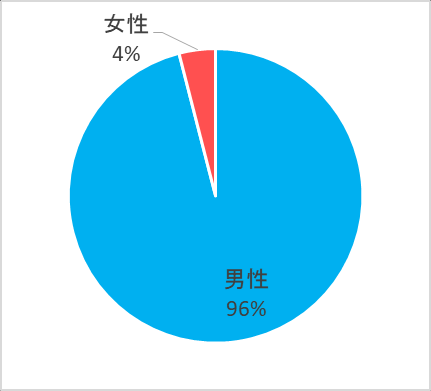
## 2 года.

2 Среди респондентов 25-29 лет были самыми высокими. Средний возраст составляет 30 лет.

Рисунок 3 суммирует возрастной состав по регионам. Между средним возрастом Каньдуна, Каньси, Восточного моря и населенных пунктов почти нет различий, но в Гуандун проживает больше людей старше 40 лет, чем в других регионах. Кроме того, средний возраст за рубежом составляет 26 лет, моложе, чем в Японии, и не более 35 лет.

По виду деятельности средний возраст «неактивных» составляет 24 года, из которых около 30 процентов составляют менее 20 лет. Средний возраст «фотографии/поддержки» составляет 37 лет, а более половины — более 35 лет.

**Рисунок 2: Возраст**

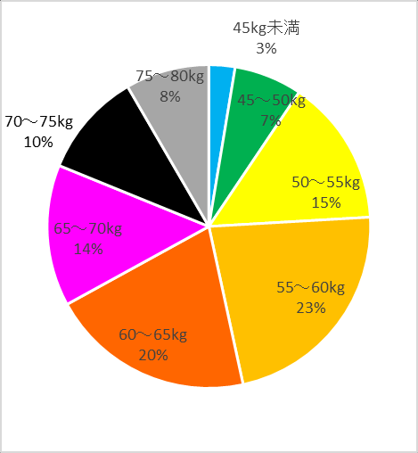
**Рисунок 3: Возрастной состав по регионам**

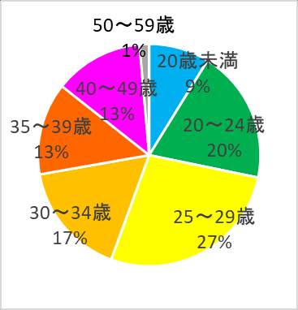
## 3. Размер

Рисунок 4 суммирует высоту респондентов. Средний рост 217 эффективных респондентов составил 170 см, что немного ниже среднего роста 172 см для взрослых японских мужчин в возрасте 30 лет. Существенных различий по возрасту нет. С точки зрения активности, при сравнении «Хочу найти Квики» с «Поддержка/подъемная специальность», «Хочу найти Квики» до 170 см, «Поддержка/подъемная специальность» до 172 см и поддержка специалиста в среднем до 2 см.

Рисунок 5 суммирует массу тела респондентов. Средняя масса тела 217 эффективных респондентов составила 63 кг, что ниже средней массы тела 30-летнего японского мужчины. Согласно схеме активности, средняя масса тела человека, ответившего «Я ищу по-быстрому», составляла 63 кг, а число людей, ответивших «фотография/поддержка», — 75 кг. «Я ищу быстрые исправления», в основном 60-65 кг к возрасту, но средняя масса тела составляет 69 кг старше 40.

Рисунок 6 Резюме 185 действительных респондентов после исключения "неизвестных" и "отсутствующих ответов". Средний ИМТ составляет 21,5 и примерно такой же, как 22 рассматриваемых значения здоровья. Рисунок 7 суммирует ИМТ, который я ищу по возрасту. В целом, чем старше ИМТ, тем выше. За исключением 35-39 лет. Среди лиц в возрасте до 25 лет 61 процент ИМТ составляли лица в возрасте до 18 лет, в то время как 40 процентов лиц старше 40 лет были выше 24.

**Рисунок 4: Высота респондентов**

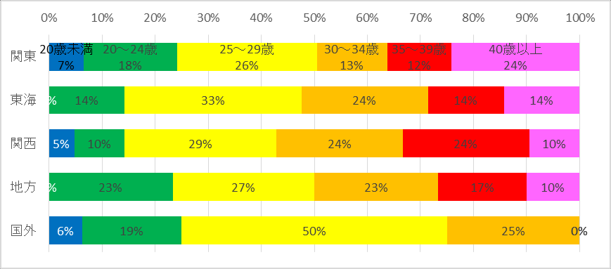
**Рисунок 5: Вес респондентов**

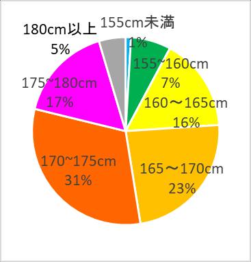
**Рисунок 6: ИМТ**

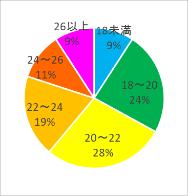
**Рисунок 7: Я ищу распределение ИМТ по возрасту.**

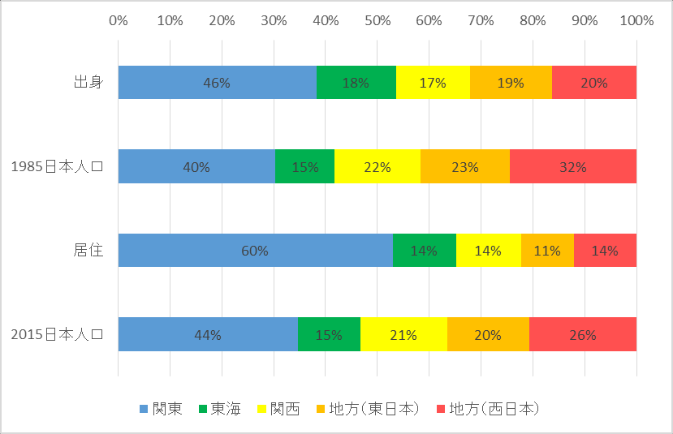
## 4. Место рождения и место жительства

В таблице 1 по сравнению с местом происхождения и проживания отмечается значительное увеличение числа соответствующих лиц только на востоке и в остальной части страны отмечается общий исход. Ниже приводится комбинация «Северо-Восток» «Северо-Восток» «Синкаку» в Японии, за пределами Гуандун, Донхай и Канси, в «местный» (Восточная Япония) и «восточный» «Китай» «четверка» «Кючжоу» в «Северной части» в «местный» (Западная Япония).

Рисунок 8 суммирует реальное распределение населения Японии, которое быстро, как быстро, как быстро, как быстро, как быстро, как быстро распределение населения ответчиков. Даже по сравнению с 1985 и 2015 годами, около 30 лет назад, не было крупномасштабного перемещения населения в целом; однако этот опрос ясно показывает, что многие из интересующихся мной людей переезжали из Канси и в другие места и в Гуандун. С другой стороны, отток населения из Восточного моря неочевиден.

| регион | Происхождение | Жилье |
| --- | ---: | ---: |
| Хоккайдо. | 8 | 8 |
| северо-восток | 13 | 7 |
| Гуандун | 75 | 105 |
| Ошинка. | 10 | 5 |
| Восточное море | 30 | 24 |
| Северная земля | 5 | 5 |
| Кансай. | 28 | 25 |
| Китай | 9 | 6 |
| Четыре страны | 4 | 5 |
| Кюсю | 14 | 8 |
| за границей | 17 | 17 |
| Нет ответа. | 10 | 8 |

**Таблица 1: Место рождения и место жительства**  
**Рисунок 8: Сравнение места происхождения, места проживания и распределения населения в Японии**

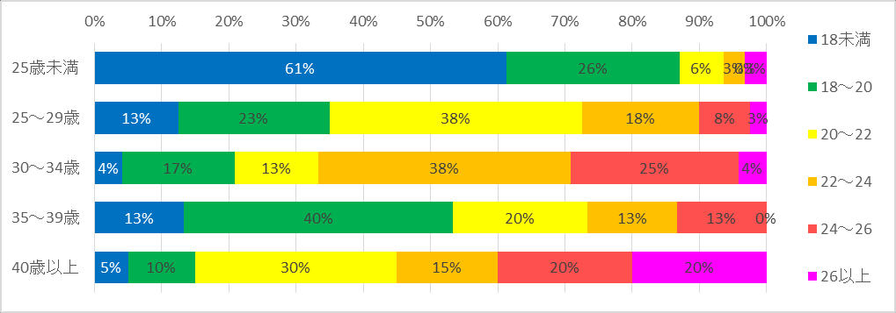
## 5. Оккупация и оккупация

На рисунке 9 обобщены профессии 213 эффективных респондентов. Наибольшее количество работников в профессии составляет 55 процентов. Студент составляет 20%. Однако это полная статистика ответов, т.е. тех, кто «неактивен/инфильтрован». С точки зрения структуры деятельности, около шести из «неактивных» лиц стали студентами и 30% сотрудников компании. Ответ на вопрос «на мероприятии или вне его будет носить» «в основном один», составляет 60% для сотрудников компании и 10-20% для студентов.

В таблице 3 приводятся данные о типах работы 189 действительных респондентов. Техническая категория (механическая/электрическая) является самой большой по типу работы, за ней следует IT/SE.

| оккупация | Номер |
| --- | ---: |
| Оператор/директорат | 7 |
| Сотрудники компании | 118 |
| Государственные служащие | 9 |
| Самозанятость/свобода | 9 |
| Работа/свобода | 11 |
| Студенты/репетиторы | 43 |
| Полный рабочий день домохозяйка/муж | 0 |
| безработный | 5 |
| другой | 14 |
| Нет ответа. | 7 |

**Таблица 2: Профессия**

| Тип работы | Номер |
| --- | ---: |
| Категория продаж | 7 |
| Категория обслуживания | 24 |
| Розничная торговля/продукты питания | 8 |
| Категория обслуживания | 11 |
| Советы/финансовые | 3 |
| Категория IT/SE | 25 |
| Техническая категория (механическая/электрическая) | 33 |
| Техническая категория (строительная/гражданская) | 9 |
| Техническая категория (химические/материалы) | 7 |
| Класс дизайна | 4 |
| Транспорт | 14 |
| другой | 22 |
| студентов и т.д. | 46 |
| Нет ответа. | 10 |

**Таблица 3: Позиции**  
**Рисунок 9: Профессия**

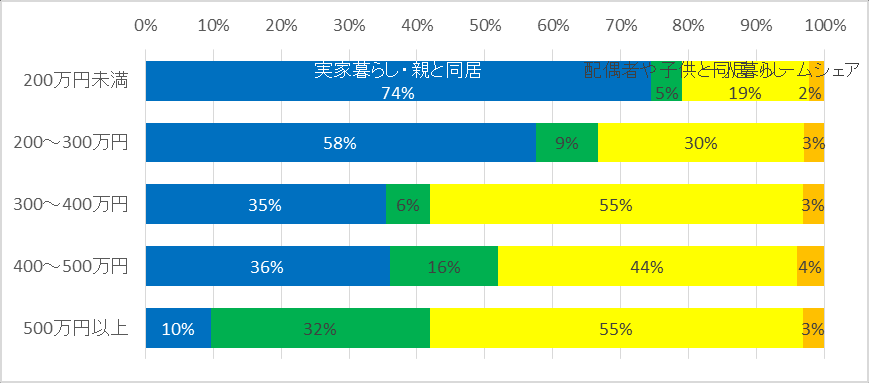
## 6 Мировой состав

На рисунке 10 показан состав 215 эффективных респондентов. 51% живут дома, 40% живут одни, 10% живут с супругом.

На рисунке 11 показан мирской состав «активных» лиц по годовому доходу. Чем выше доход, тем выше доля людей, живущих в одиночестве, тем больше людей, живущих со своими супругами. Доля лиц с годовым доходом менее 2 млн. йен, проживающих дома, составляет 74% и 5% с супругом; только 10% лиц с годовым доходом более 5 млн. йен живут дома и 32% с супругом. Кстати, уровень брака по возрасту, который быстро приближается к кигуруми, таков: 18-24 года 6,0 процента, 25-29 лет 35,9 процента, 30-34 года 60,9 процента, 35-39 лет 69,7 процента, 40 лет и более 72,4 процента.

На рисунке 12 показано семейное положение 217 действительных респондентов и число детей. 86% неженатых. Средний годовой доход составляет 3,2 млн иен для тех, кто отвечает, что детей нет, и 5,6 млн иен для тех, у кого есть дети.

На рисунке 13 показан географический состав респондентов. Доля людей, живущих в своих домах, составляет 38-54 процента в трех основных городских кругах и населенных пунктах (Западная Япония) и 84 процента в населенных пунктах (Восточная Япония), что выше. 75% за рубежом.

В этом вопросе те, кто выбирает ответ, отличный от «0 лиц (не состоящих в браке)», считаются женатыми, а «коэффициент брака» рассчитывается по возрасту. На рисунке 14 показан возрастной уровень брака респондентов по сравнению с реальным уровнем брака в Японии, который является достаточно быстрым для меня. Быстро, быстро, быстро, быстро, быстро, быстро, быстро, быстро, быстро, быстро, быстро, быстро, быстро, быстро, быстро, быстро, быстро, быстро, быстро, быстро, быстро, быстро, быстро, быстро, быстро, быстро, быстро, быстро, быстро, быстро, быстро, быстро, быстро, быстро, быстро, быстро, быстро, быстро, быстро, быстро, быстро, быстро, быстро, быстро.

**Рисунок 10: Мировой состав**

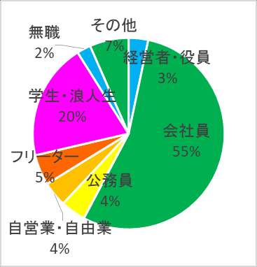
**Рисунок 11: Мировой состав активистов по годовому доходу**

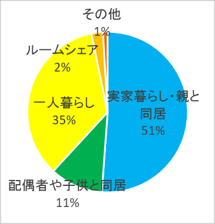
**Рисунок 12: Число детей, занимающихся активной деятельностью**

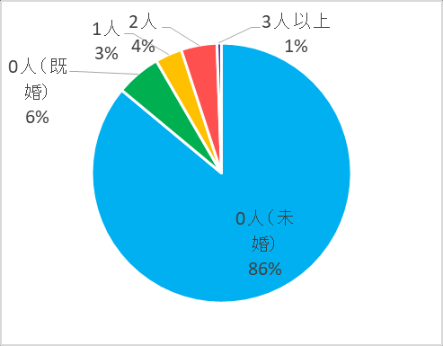
**Рисунок 13: Мировой состав по регионам**

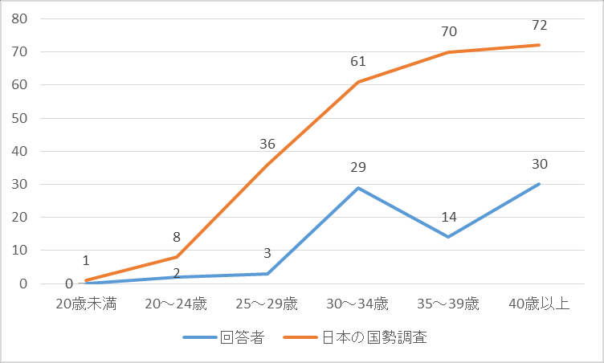
**Рисунок 14: Уровень брака респондентов по возрасту по сравнению с уровнем брака в Японии**

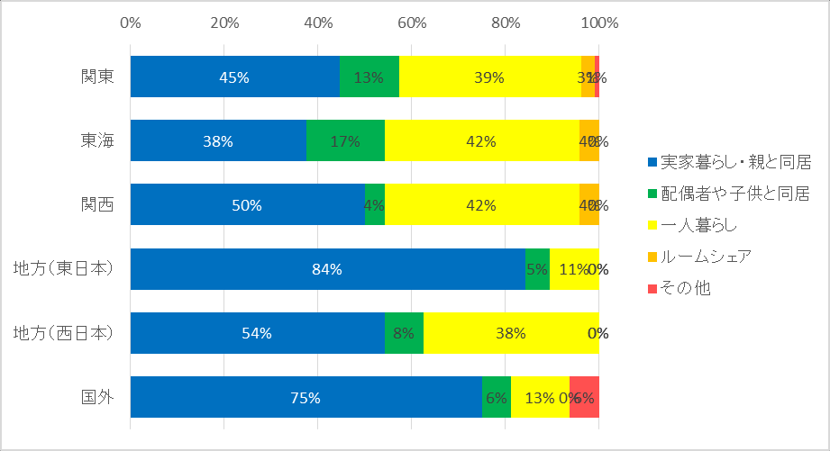
## 7 Годовой доход

15 показывает годовой доход 190 действительных респондентов. Наиболее распространенная площадь составляет менее 2 миллионов иен, а около половины - менее 3 миллионов иен. Средний годовой доход респондентов составил 3,5 млн иен, в то время как средний годовой доход 165 человек, занятых только деятельностью, составил 3,6 млн иен, а средний годовой доход лиц, имеющих хотя бы одно лицо, составил 3,7 млн иен. Однако статистика включает студентов. На рисунке 16 показан годовой доход после исключения. Самая распространенная площадь была перенесена на 2-3 млн иен, со средним годовым доходом 3,9 млн иен.

На диаграмме 17 показано распределение годового дохода по регионам среди "активных" лиц. Средний годовой доход составляет 3,8 миллиона иен в Гуандун, 4,2 миллиона иен в Восточном море, 4,2 миллиона иен в Кансай, 2,2 миллиона иен в местной (Восточная Япония) и 2,9 миллиона иен (включая студентов) в местной (Западная Япония).

На рисунке 18 показано распределение годового дохода по возрасту среди активных лиц, а на рисунке 19 показаны изменения среднегодового дохода по возрасту. Средний годовой доход увеличивается с возрастом, с 2,1 миллиона иен в возрасте до 25 лет до 5,1 миллиона иен в возрасте старше 40 лет; однако средний годовой доход остается около 4 миллионов иен после 30 лет.

**Рисунок 15: Годовой доход**

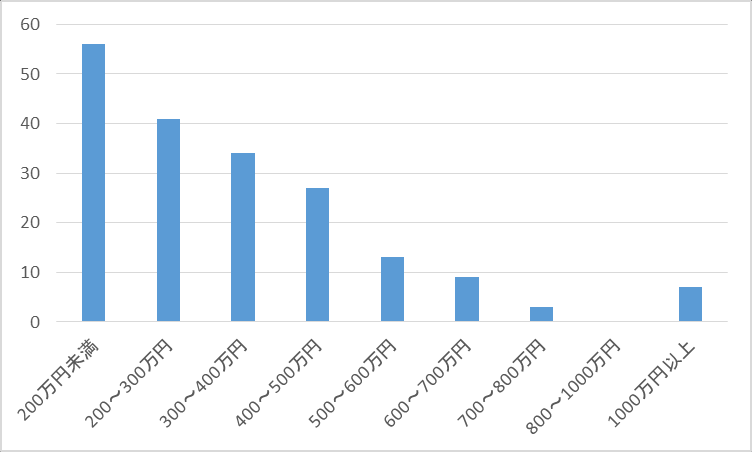
**Рисунок 16: Годовой доход (исключение студентов)**

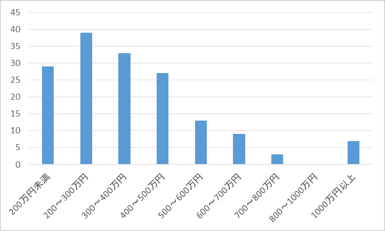
**Рисунок 17: Распределение годового дохода по регионам**

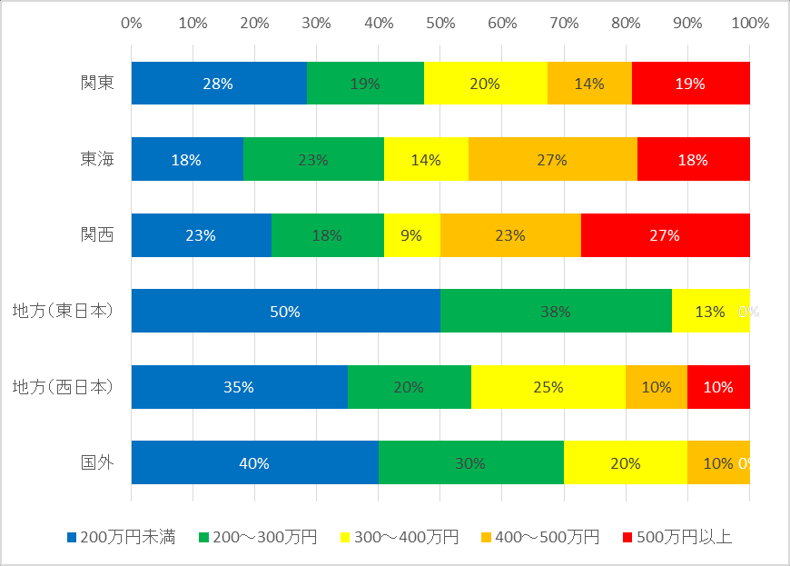
**Рисунок 18: Распределение годового дохода по возрасту**

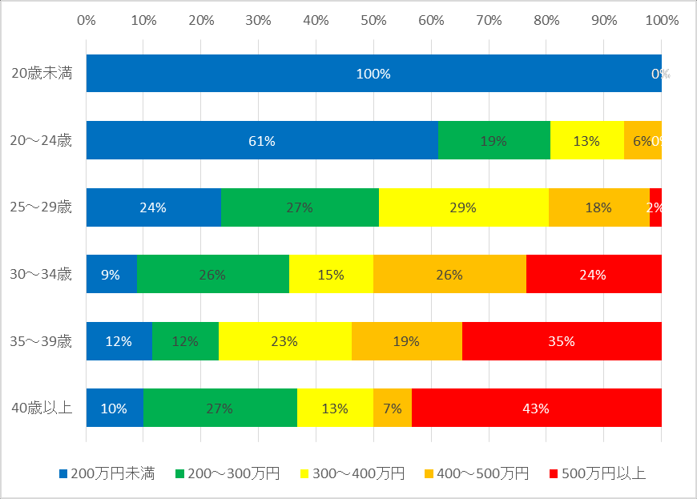
**Рисунок 19: Возрастные изменения среднегодового дохода активных лиц**

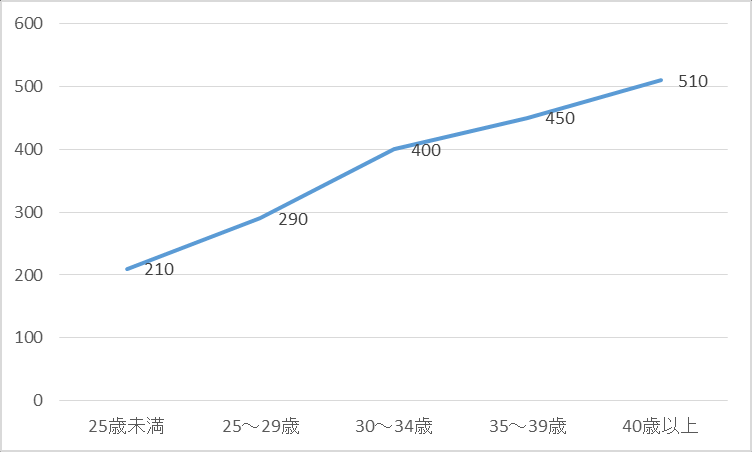
## 8. Образование.

Рисунок 20 Резюме образования/посещения 211 действительных респондентов. Общее число выпускников университетов и аспирантов составляет 63 процента. Поскольку в него входят студенты, на рисунке 21 показана степень окончания после исключения. Выпускники окончили 14 процентов и университеты 45 процентов. Треть выпускников университетов являются государственными университетами. Выпускники средней школы составляют 19%.

**Рисунок 20: Образование/посещаемость**

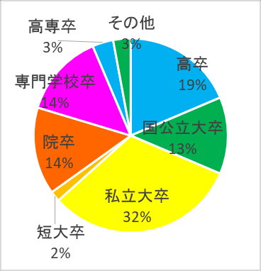
**Рисунок 21: Образование (исключение учащихся)**

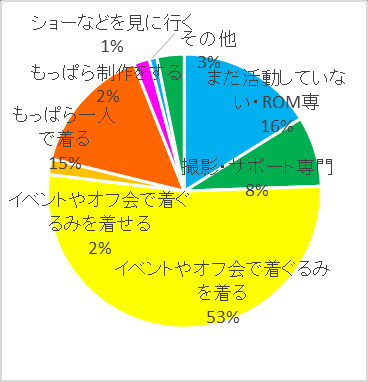
## 9. План мероприятий

На рисунке 22 представлена общая картина деятельности 217 действительных респондентов. Пятьдесят три процента сказали: «На мероприятии или вне его, вы будете носить меня, а 15 процентов сказали: «В основном одни». Расследование сочетает эти два слова с фразой «Я хочу найти быстрое решение». Кроме того, число «еще не активных/специализированных ПЗУ» составляет 16 процентов. Выбор альтернативы рассматривается как «активный».

**Рисунок 22: План мероприятий**

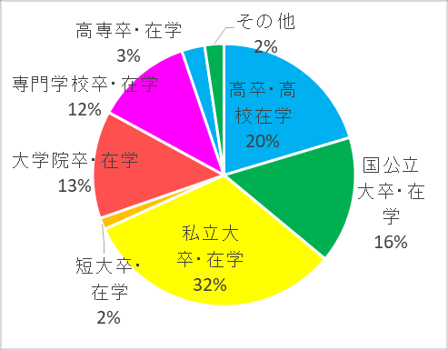
## 10. Продолжительность деятельности

На рисунке 23 обобщены годы деятельности 216 действительных респондентов. «Еще не активен» — 19%; даже если эта часть удалена, большинство составляет менее 5 лет. Кроме того, он составлял 6 процентов более 15 лет. Средняя продолжительность деятельности составляет 5,9 года.

На рисунке 24 показаны годы активности по возрасту. Из тех, кто моложе 20 лет, 74% «не активны». Большинство людей в возрасте 20-24 лет были активны более одного года; 48 процентов людей в возрасте 35-39 лет имели более 10 лет активности. Из 40 лет и старше 19 процентов имели более 15 лет деятельности, но почти 40 процентов имели менее 3 лет. В случае лиц, занимающихся только деятельностью, средние годы деятельности составляют: 25 лет до 2,4 года, 25-29 лет 4,2 года, 30-34 года 7,5 года, 35-39 лет 9,3 года, 40 лет старше 8,0 лет.

**Рисунок 23: Продолжительность деятельности**

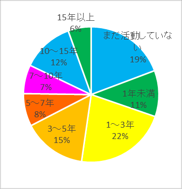
**Рисунок 24: Возрастное распределение видов деятельности**

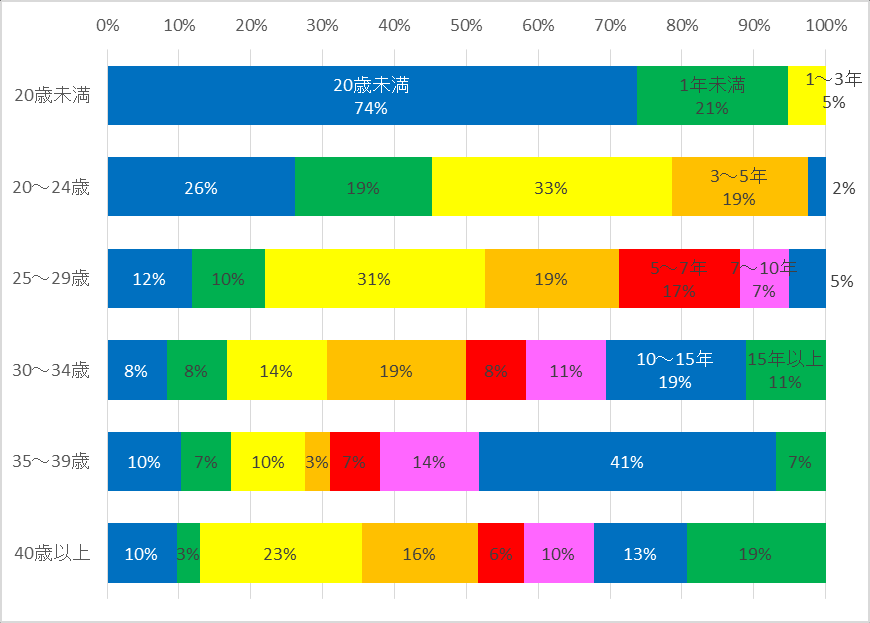
## 11. Период засады

Рисунок 25 Резюме периода засады для 215 эффективных респондентов. Для 175 активистов средний латентный период составляет 5,1 года. Однако 18 процентов тех, кто еще не начал год, и 15 процентов тех, кто скрывался более 10 лет, могут увидеть значительную разницу в продолжительности засады.

Рисунок 26 Резюме периода задержки по интересующему периоду. Чем раньше вы заинтересовались, тем дольше вы спите. Если есть заинтересованность в том, чтобы стать социальным человеком, 36% людей прячутся менее года и начинают колоть меня.

**Рисунок 25: Период латентности**

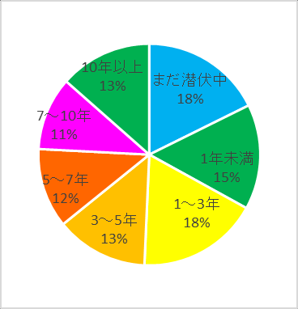
**Рисунок 26: Вакуумные периоды по периодам интереса**

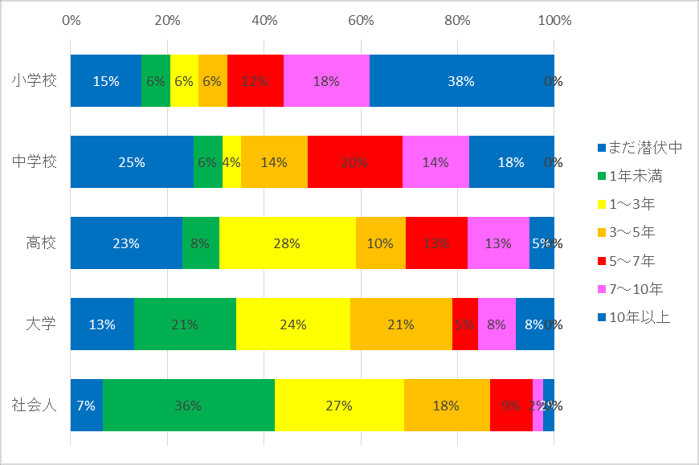
## 12. Целевой период запуска для укрытия

На рисунке 27 показан период времени, в течение которого 65 человек, которые ответили, что они спят, должны были начать свою деятельность. Сорок процентов ответов планируется начать в течение трех лет. С другой стороны, на "незнание" пришлось 37 процентов. Ответ на вопрос «нет стартового плана» составил 18%.

**Рисунок 27: Начало деятельности спящего**

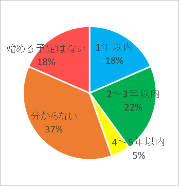
## 13. Владение 肌タイ

На рисунке 28 показано количество предметов, принадлежащих 肌タイ, которые были эффективными респондентами 183 событий. 51% владеют более чем тремя. Среднее количество имущества: 3,0 для активистов, и я ищу 3,1 для быстрых фиксеров.

Рисунок 29 Резюме доли источников снабжения 肌タイ. Сегодня это 40%, 27%.

В таблице 4 показано количество владений хада-тай и состав источников снабжения по годам деятельности. Чем дольше длится деятельность, тем больше хада-тай. Среднее число владений составляет 1,75 для лиц моложе одного года и 5,58 для лиц старше 15 лет. На диаграмме 30 показана доля источников поставок по годам деятельности. После 7 лет деятельности, которая сейчас находится в авангарде, она находится в равновесии с авангардом.

| Продолжительность деятельности | Зенит | Сегодня. | Роскошный король. | Зенит | другой | Всего |
| --- | ---: | ---: | ---: | ---: | ---: | ---: |
| Не активны пока | 0.06 | 0.16 | 0.00 | 0.06 | 0.13 | 0.42 |
| Менее 1 года | 0.08 | 1.00 | 0.08 | 0.00 | 0.60 | 1.75 |
| 1-3 года | 0.49 | 1.31 | 0.67 | 0.03 | 0.49 | 2.98 |
| 3-5 лет | 0.62 | 2.10 | 0.56 | 0.09 | 0.32 | 3.68 |
| 5-7 лет | 0.63 | 1.82 | 0.35 | 0.13 | 0.44 | 3.36 |
| 7-10 лет | 1.83 | 2.36 | 0.10 | 0.00 | 0.20 | 4.50 |
| 10-15 лет | 1.91 | 1.22 | 0.30 | 0.14 | 0.43 | 4.00 |
| Более 15 лет | 1.42 | 1.36 | 0.20 | 0.30 | 2.30 | 5.58 |

**Таблица 4: Среднее число принадлежащих 肌タイ предметов на человека по продолжительности деятельности и составу источника снабжения**  
**Рисунок 28: Хаса-тай принадлежит активистам**

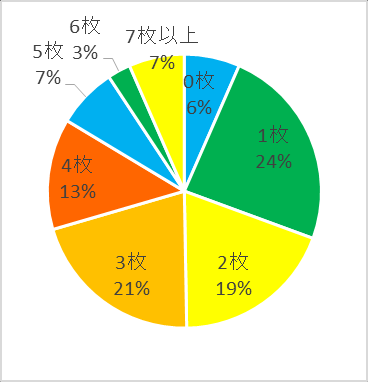
**Рисунок 29: Доля источников снабжения 肌タイ**

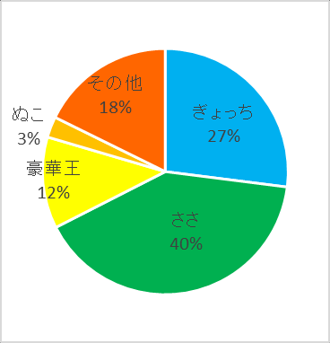
**Рисунок 30: Доля предложения хада-тай в разбивке по продолжительности деятельности**

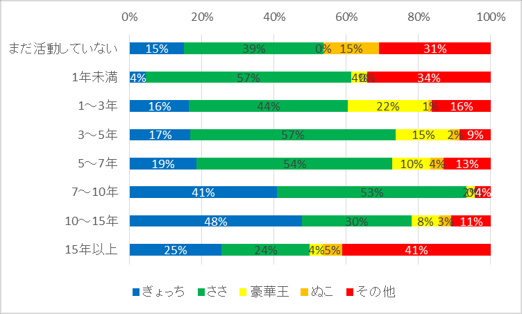
## 14.Собственность лица

Рисунок 31 Резюме числа действительных респондентов в 183 видах деятельности. Важно отметить, что видны и некоторые «тихие», но уже одержимые лица; однако, пока выбирается способ деятельности «еще не активный», он не считается «активным». Среднее число действительных респондентов на человека составляет 2,8. Для «активистов» номинальное число на душу населения составляет 3,8.

На диаграмме 32 суммируются авуары по годовому доходу. Около 40 процентов людей с годовым доходом менее 2 миллионов йен имеют только менее 1 лица, в то время как только около 20 процентов людей с доходом ниже 1 миллиона иен. Однако с тех пор с увеличением годового дохода увеличились только лица с менее чем 1 телом и лица с более чем 7 телами, а число лиц с 3-6 телами уменьшилось, что свидетельствует о «биполярном» поведении. Таким образом, как показано на рисунке 33, доля владения на душу населения составляет менее 2,50 тела, когда годовой доход в 2 миллиона иен меньше, но около 4 органов, когда годовой доход составляет более 2 миллионов иен, в значительной степени не зависит от годового дохода.

На рисунке 34 показано распределение авуаров по годам деятельности, а на рисунке 35 обобщено среднее число авуаров по годам деятельности. До 3-5 лет, чем дольше активность, тем больше количество поверхностей; до 10-15 лет около 4,5; и до 7,30 в течение 15 лет.

На рисунке 36 показаны все 581, кто получил достоверный ответ, а в таблице 5 показано число по источнику поставки. Доля составляет 28 процентов, 19 процентов (15 процентов, 4 процента), 7 процентов и более половины первой тройки. (Примечание: ответы также включают ответы за рубежом.

В таблице 6 приводится сводная информация о принадлежности пяти домов на душу населения по годам деятельности. На рисунке 37 далее кратко излагается состав его доли. Наблюдается тенденция к увеличению доли по отношению к продолжительности деятельности: до 20 процентов за 7 лет и до 40 процентов за 7 лет. Наибольшее число лет деятельности в 1-3 года составило 25 процентов; снижение составило более 10 лет и более 15 лет — 1 процент. Доля лиц в возрасте до 1 года составляет 27 процентов, но продолжительность деятельности снижается до 0 процентов в течение более 15 лет.

Ежегодный обзор соотношения каждого здания к среднему числу поверхностей показывает явное предпочтение как вольфрама, так и вольфрама (самозанятых). На рисунке 38 показана зависимость собственности и среднего владения от годового дохода. На рисунке 39 показана зависимость собственности и среднего владения от годового дохода. Строительные дома имеют тенденцию иметь больше аспектов, чем более высокий годовой доход; с другой стороны, уровень владения и среднее число собственности находятся на восходящей тенденции между годовым доходом (самозанятых) и 5 миллионами иен, но после того, как годовой доход превышает 5 миллионов иен, как собственность, так и среднее число собственности снизились. Однако это также может быть результатом ложной связи с продолжительностью деятельности (чем дольше активность, тем старше она, тем выше годовой доход). Таким образом, когда среднее число номиналов рассчитывается для лиц с активной жизнью менее 5 лет, оно составляет: 2 млн иен при 0,26 тела, 2-3 млн иен при 0,71 тела, 3-4 млн иен при 0,83 тела, 4-5 млн иен при 0,25 млн тела при 1,00 тела; хотя 4-5 млн иен не следовали тенденции, в целом можно признать зависимость от годового дохода. Самодействие: 2 миллиона иен под 0,48 тела, 2-3 миллиона иен под 0,79 тела, 3-4 миллиона иен под 0,75 тела, 4-5 миллионов иен под 1,08 тела более 5 миллионов иен под 0,33 тела, также может подтвердить аналогичную зависимость от годового дохода.

| Название рабочего пространства | Номер |
| --- | ---: |
| Зенит | 161 |
| Я сделаю это сам. | 85 |
| Зенит | 42 |
| Наручники. | 35 |
| Роскошный король. | 34 |
| Ты ублюдок! | 32 |
| Комиссия. | 24 |
| Ринс | 22 |
| До встречи. | 19 |
| Боже мой. | 16 |
| Мастерская Рэя. | 15 |
| Зенит | 15 |
| Зенит | 5 |
| Другие внутренние | 56 |
| Другие зарубежные | 20 |

**Таблица 5: Ответчик дал мне источник.**

| Продолжительность деятельности | Зенит | Я сделаю это сам. | Зенит | Наручники. | Роскошный король. |
| --- | ---: | ---: | ---: | ---: | ---: |
| Менее 1 года | 0.10 | 0.15 | 0.30 | 0.00 | 0.05 |
| 1-3 года | 0.30 | 0.60 | 0.30 | 0.17 | 0.35 |
| 3-5 лет | 1.10 | 0.83 | 0.38 | 0.48 | 0.45 |
| 5-7 лет | 0.73 | 0.47 | 0.40 | 0.20 | 0.00 |
| 7-10 лет | 1.93 | 0.80 | 0.20 | 0.07 | 0.07 |
| 10-15 лет | 1.27 | 0.32 | 0.09 | 0.27 | 0.14 |
| Более 15 лет | 3.18 | 0.09 | 0.00 | 0.27 | 0.00 |

**Таблица 6: Среднее число людей на одну деятельность**  
**Рисунок 31: Количество активных участников**

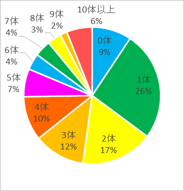
**Рисунок 32: Распределение владельцев по годам дохода**

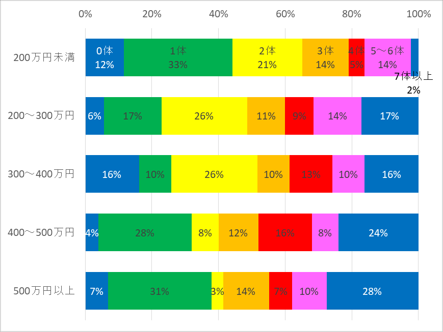
**Рисунок 33 Собственность на душу населения в разбивке по видам деятельности и годовому доходу**

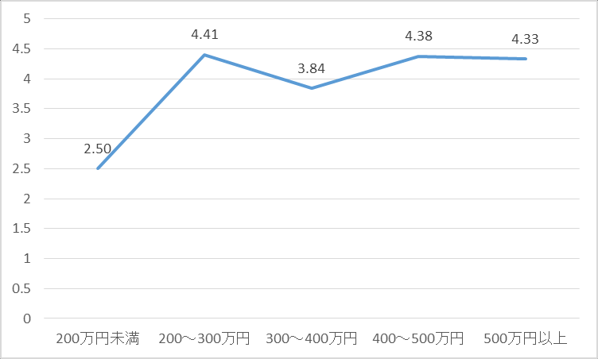
**Рисунок 34 Распределение авуаров по годам деятельности**

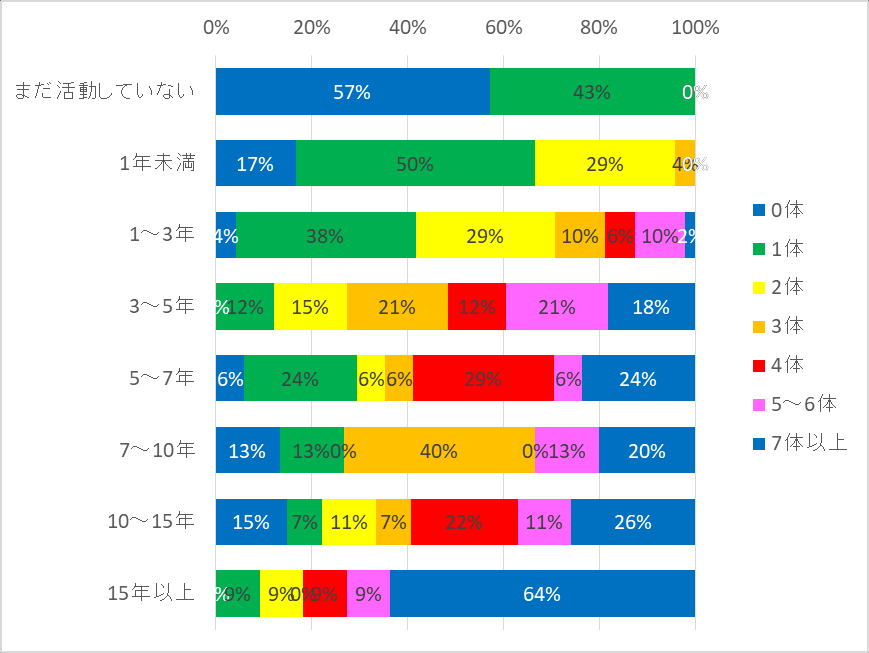
**Рисунок 35 Собственность на душу населения по годам деятельности**

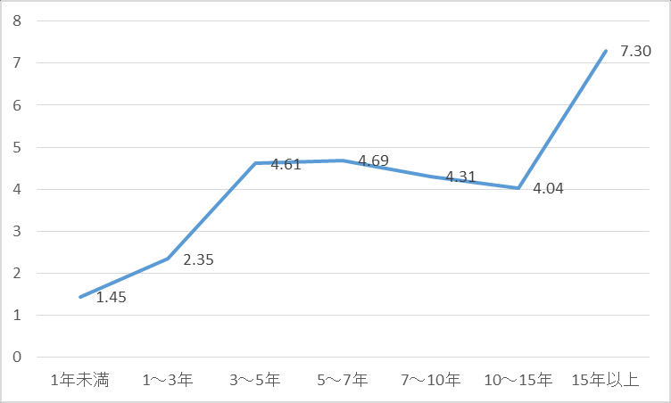
**Рисунок 36: Доля источников предложения жилья**

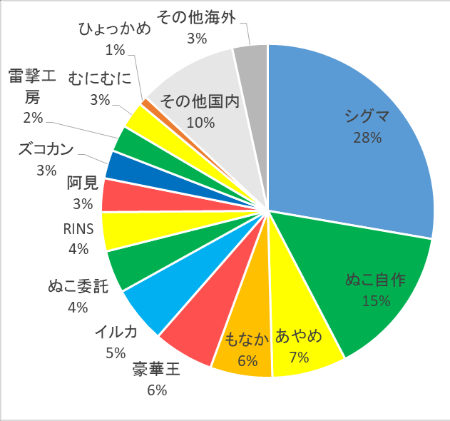
**Рисунок 37: Доля нашего предложения основана на годах деятельности.**

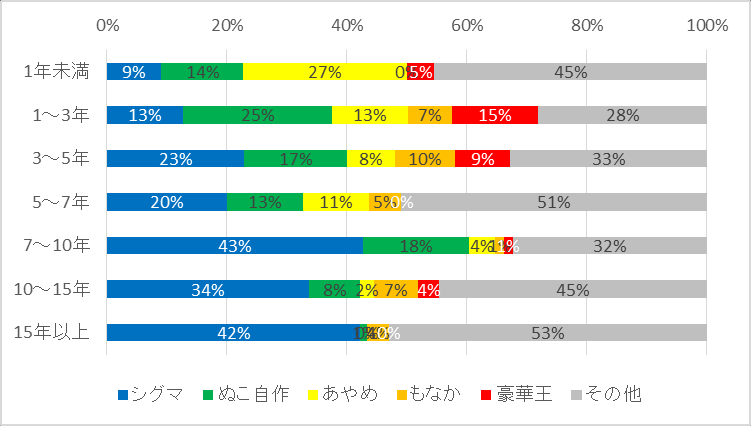
**Рисунок 38: Воспринимаемая собственность по годовому доходу и среднему**

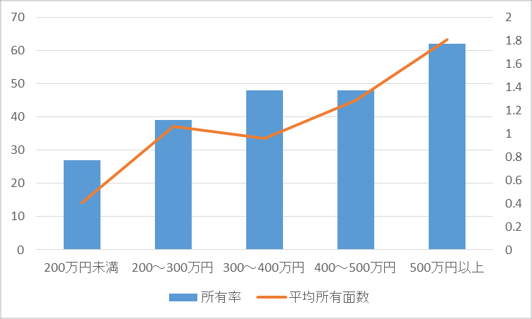
**Рисунок 39: Захватывающая (самозанятая) собственность по годовому доходу и средней собственности**

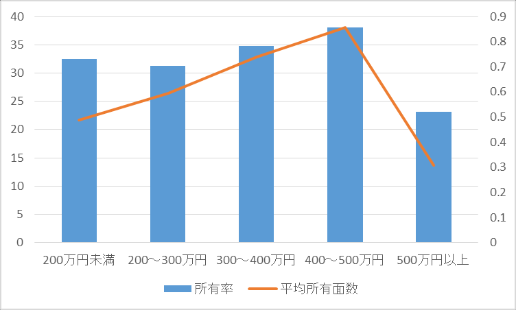
## 15.Я знаю возможность сделать свою любимую.

На рисунке 40 собраны 214 эффективных респондентов, которые знают, что я поклонник своих любимых. Шестьдесят девять процентов из них сказали: «Смотрите в Интернете».

На рисунке 41 представлены возможности, которые меня интересуют по возрасту. В целом, «просмотр в Интернете» составляет более 60 процентов от любой возрастной группы; однако эта доля снизилась до 45 процентов более чем за 15 лет, в то время как ответ на «просмотр в шоу» был на 27 процентов выше, чем для всех других видов деятельности. Кроме того, ни один из двух ответов, «увиденных в косплейном событии», «знает, что друг знает кого-то», не был сделан, как и один из них более 15 лет.

На рисунке 42 обобщены возможности, которые были разделены периодом пробуждения, чтобы сделать меня счастливым. В любой момент времени «видеть в Интернете» все еще доминирует; но среди тех, кто проснулся до начальной школы, было немного больше «видеть в шоу» и «просветленный шутками»; среди тех, кто проснулся на социальной стадии, «видеть в косплейной деятельности» было больше «знать, что друзья знают людей, которые делают».

**Рисунок 40: Знаете, что я пытаюсь сделать?**

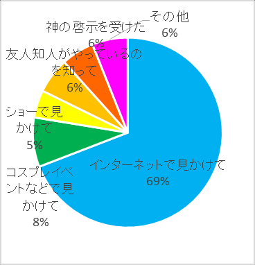
**Рисунок 41: Я на той же странице, что и вы.**

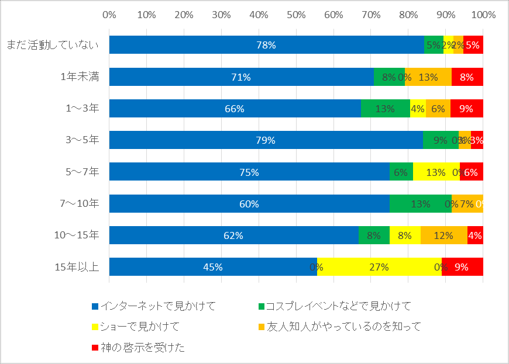
**Рисунок 42: Проснувшись, вы знаете, как сделать меня счастливым.**

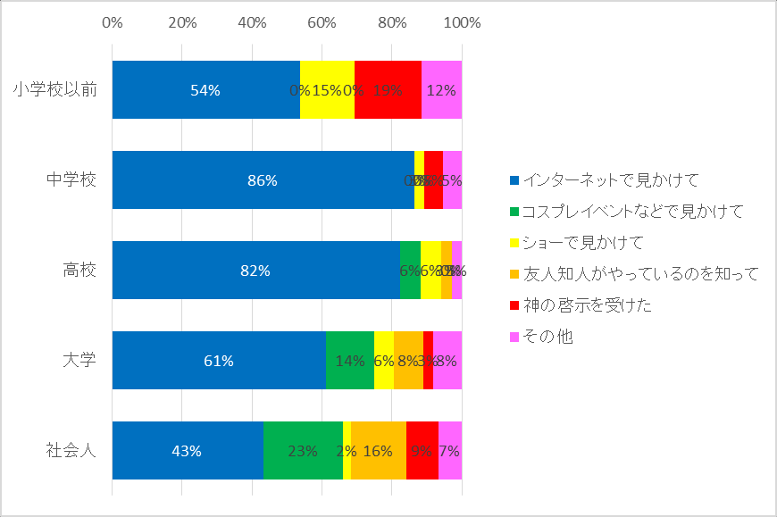
## 16 Как открыть дверь по кругу

На рисунке 43 показано, как активисты читают мне лекции о моем бизнесе. Наибольшее число из них - "Оценено/производится в первую очередь", 40 процентов. «Ответственное интервью» составляет 20%, а «через кого-то другого» 15%. 17% людей «не могут вспомнить».

На рисунке 44 суммируется метод достоверности по годам деятельности. Как видно, для лиц, не достигших семи лет, «общие апостили/продукции» доминируют примерно на 50 процентов; через семь лет доля падает примерно до 30 процентов, в то время как «активный поиск разговоров» составляет около 30 процентов, с небольшим преимуществом. Среди тех, кто старше 15 лет, больше всего ответов дали «другие».

**Рисунок 43: Способ открывания двери актерами**

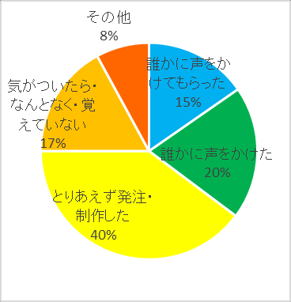
**Рисунок 44: Способ поклонения по продолжительности деятельности**

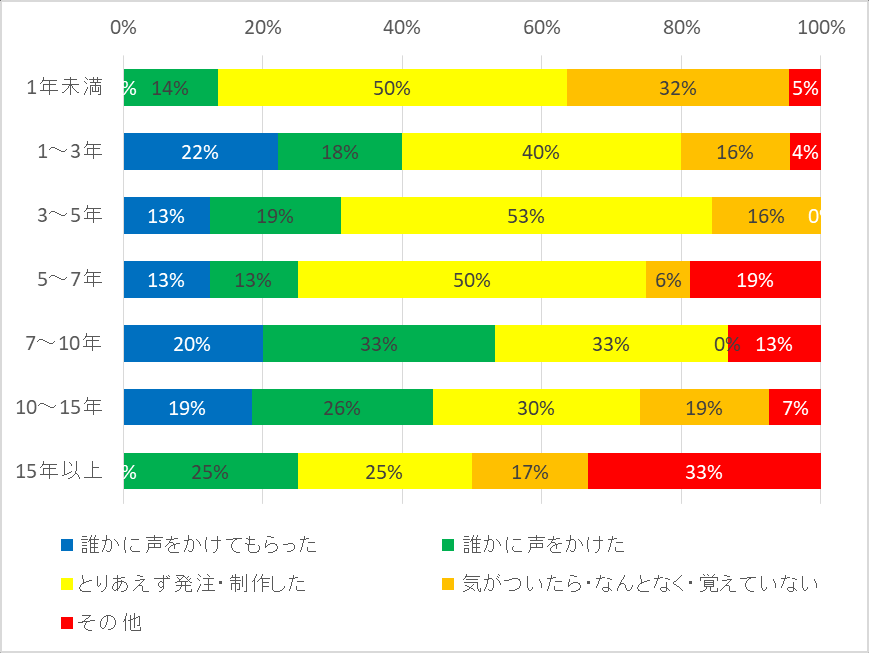
## 17 Я пытаюсь сохранить частоту.

На рисунке 45 показана «активированная» человеком обскурантизация частотного распределения моей деятельности, а в таблице 7 показана средняя частота (в квадратные годы). «Само по себе» является крупнейшим видом деятельности, более 50% не реже одного раза в месяц. "Участие в внеочередных совещаниях" также превышает 50 процентов и не реже одного раза в 2-3 месяца. «Более закрытые мероприятия» «Косплей на улице» «Сцена или наружная фотография» «Сцена или наружная фотография» «Научная или крытые фотографии» «Исследования свыше 200 км» составляют более 50 процентов более 50 процентов не реже одного раза в год и на 20 процентов больше, чем каждые 2-3 месяца. С другой стороны, от 30 до 40 процентов людей никогда не занимались этой деятельностью. Меньше людей участвуют в «чрезвычайно закрытых мероприятиях, таких как H», причем 77 процентов никогда не принимают участия. Кроме того, меньше людей занимаются «творческой деятельностью», а 65% никогда этого не делали.

Рисунок 46 суммирует мою частоту активности по областям. «Зарубежные» активно участвуют во многих проектах. Что касается внутреннего контекста Японии, то между городом и местным уровнем в «одной одежде» мало различий, но во многих проектах есть значительные местные различия. Здесь средняя частота (Kandong, Donghai, Kansai) определяется как «местный разрыв» путем деления средней частоты (местная Восточная Япония, местная Западная Япония). Выключено было бы примерно 3-4 раза, а фотосъемка — примерно 5-6 раз. В Восточном море, большая часть его, примерно раз в месяц; место около полугода. «Нет такой вещи, как отпустить меня». Даже при «Н» и других закрытых видах деятельности Кансай более многочисленн, в среднем около трёх месяцев; его почти не существует. В Кансае также проводится больше мероприятий, таких как «ярмарки продаж». Восточное море и Кансай, в среднем, более многочисленны в косплейных мероприятиях к востоку от улицы, в среднем около четырех месяцев; на местном уровне местные жители посещают чаще, чем Гуандун, в то время как в Восточной Японии это редко, около двух лет назад. Фотография «Лицо или наружная фотография» чаще встречается в Восточном море и Кансае и относительно низкая. Из «200 км и более экспедиций» Кансай имеет наибольшее количество, более одного раза в месяц. «Творческая деятельность» также активна в Восточном море и Кансае. Кроме того, во всех проектах зарубежные мероприятия осуществляются с частотой, сопоставимой или превышающей три крупных городских центра в Японии.

Однако в вышеупомянутом сравнении, пока один человек посещает HF, среднее значение значительно выше (особенно с небольшим количеством за пределами Гуандун) и поэтому не обязательно правильно сравнивается. С этой целью в таблице 8 с использованием "двухгодичной" основы резюмируется доля людей, проживающих в местах их проживания, которые осуществляют деятельность с указанной выше периодичностью.

| Мероприятия | Периодичность деятельности (второй/персональный/год) |
| --- | ---: |
| Один. | 15.0 |
| Участие в внеочередных заседаниях | 7.0 |
| Я не знаю, сделаю ли я это. | 5.9 |
| Деятельность, подобная H | 1.5 |
| Такие мероприятия, как ярмарки продаж | 2.7 |
| Уличная косплейная деятельность | 2.6 |
| Внешняя или наружная фотография | 2.8 |
| Студия или крытый фотоярмарка | 2.9 |
| 200 км и выше экспедиция | 4.0 |
| Творческая деятельность | 3.8 |

**Таблица 7: Каждый из вас старается держать меня в среднем.**

| Мероприятия | Гуандун | Восточное море | Кансай. | Местный (Восточная Япония) | Местный (Западная Япония) | за границей |
| --- | ---: | ---: | ---: | ---: | ---: | ---: |
| Один. | 84 | 85 | 88 | 67 | 88 | 100 |
| Участие в внеочередных заседаниях | 66 | 81 | 90 | 58 | 47 | 63 |
| Я не знаю, сделаю ли я это. | 47 | 75 | 67 | 33 | 44 | 60 |
| Деятельность, подобная H | 8 | 5 | 11 | 0 | 6 | 23 |
| Такие мероприятия, как ярмарки продаж | 49 | 52 | 19 | 25 | 6 | 38 |
| Уличная косплейная деятельность | 35 | 45 | 50 | 9 | 35 | 43 |
| Внешняя или наружная фотография | 35 | 53 | 55 | 8 | 24 | 64 |
| Студия или крытый фотоярмарка | 31 | 45 | 33 | 9 | 24 | 79 |
| 200 км и выше экспедиция | 38 | 57 | 62 | 25 | 38 | 36 |
| Творческая деятельность | 10 | 28 | 47 | 9 | 13 | 17 |

**Таблица 8: Доля людей, которые выполняют эту деятельность не реже одного раза в год, по регионам (%)**

На рисунке 47 показано, насколько я горжусь тем, что мне нравится и что я делаю с тем, что я делаю. Чем больше они гордятся, чем больше они участвуют на улицах, чем больше они участвуют в пейзажах или фотографии на открытом воздухе, тем чаще они путешествуют, тем меньше они участвуют в закрытых мероприятиях, таких как H. С другой стороны, частота внепродажных фотосессий не столько связана с гордостью, которой я так горжусь. Чем выше гордость, тем выше человек, который носит ее в одиночку, тем выше человек, у которого нет гордости вообще.

В таблице 9 приведены показатели активности активистов по их детям. Существует небольшая разница в частоте ношения в одиночку; однако существует разница между 7,4 раза / человек / год для тех, у кого нет детей, и 4,4 раза / человек / год для тех, у кого есть дети. С другой стороны, существует обратный уровень участия в косплейных мероприятиях на улице, 2,5 раза / человек в год для тех, у кого нет детей, 3,9 раза / человек в год для тех, у кого есть дети, и чаще для тех, у кого есть дети.

Таблица 10 суммирует частоту активности, нажимая на сексуальное раздражение. Почти во всех проектах, чем больше ты поворачиваешься к кигуруми, тем больше ты поворачиваешься к кигуруми, тем больше ты толкаешь меня. Разница наиболее очевидна в «отдельно одетых»: 16,6 раза в год для тех, кто вызывает сексуальное возбуждение, по сравнению с 6,2 раза в год для тех, кто этого не делает. Гораздо чаще меня отвозят на секс-экскаватор. Частота участия в «косплее на улице» не самая высокая для «поколения», а для «сколько поколений». Присоединение, не топая меня, не будет частотой сексуального возбуждения. Частота «участия в закрытых видах деятельности, таких как «Н», не самая высокая для «поколения», а для «сколько поколений».

| Мероприятия | Нет детей | С детьми |
| --- | ---: | ---: |
| Один. | 15.0 | 16.5 |
| Участие в внеочередных заседаниях | 7.4 | 4.4 |
| Я не знаю, сделаю ли я это. | 6.2 | 3.8 |
| Деятельность, подобная H | 1.3 | 0.7 |
| Такие мероприятия, как ярмарки продаж | 2.8 | 1.7 |
| Уличная косплейная деятельность | 2.5 | 3.9 |
| Внешняя или наружная фотография | 2.8 | 2.8 |
| Студия или крытый фотоярмарка | 2.8 | 3.4 |
| 200 км и выше экспедиция | 4.0 | 4.6 |
| Творческая деятельность | 3.7 | 4.5 |

**Таблица 9: Активисты используют свои методы борьбы с детьми, чтобы увеличить частоту моей деятельности.**

| Мероприятия | генерировать | Сколько? | Не производится/не производится |
| --- | ---: | ---: | ---: |
| Один. | 16.6 | 12.5 | 6.2 |
| Участие в внеочередных заседаниях | 8.1 | 5.5 | 3.0 |
| Я не знаю, сделаю ли я это. | 6.0 | 5.8 | 6.3 |
| Деятельность, подобная H | 1.6 | 2.3 | 0.1 |
| Такие мероприятия, как ярмарки продаж | 3.0 | 2.5 | 1.7 |
| Уличная косплейная деятельность | 2.5 | 3.5 | 0.8 |
| Внешняя или наружная фотография | 3.0 | 2.9 | 1.1 |
| Студия или крытый фотоярмарка | 3.3 | 2.1 | 2.2 |
| 200 км и выше экспедиция | 3.6 | 4.7 | 2.6 |
| Творческая деятельность | 3.5 | 5.0 | 0.0 |

**Таблица 10: Частота активности, когда относится к кигуруми в состоянии сексуального возбуждения.**  
Кроме того, это не делает большой разницы между частотой моей деятельности и возрастом моей деятельности.

**Рисунок 45: Активисты пытаются настроить меня на частоту.**

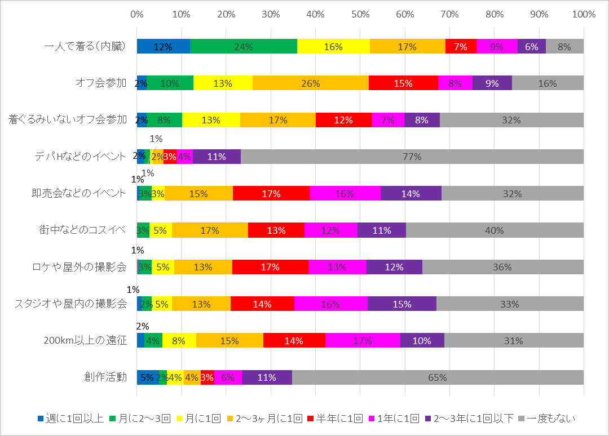
**Рисунок 46: Разница между частотой моей деятельности по месту жительства**

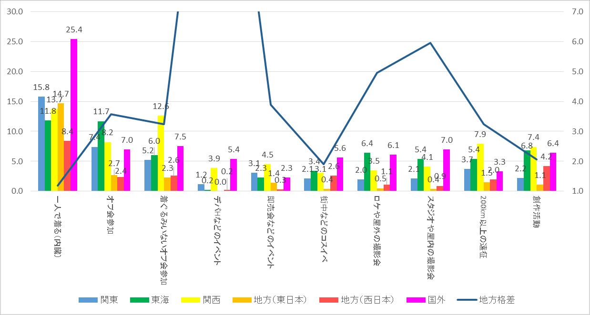
**Рисунок 47: Связь с частотой проектной деятельности гордости, которой я хотел бы поделиться**

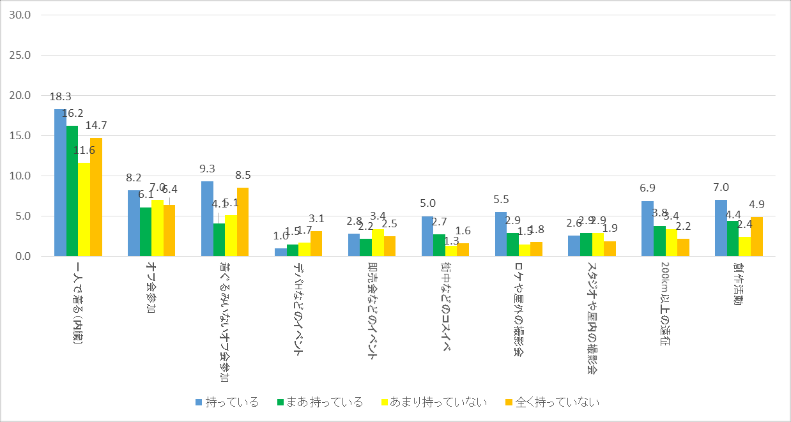
## Я платил за свою деятельность.

На рисунке 48 приведены средние ежемесячные расходы активистов на мою деятельность. Однако в связи с этим вопросом я подозреваю, что многие респонденты неверно истолковали термин «средняя ежемесячная доходность 2 года» как «сумму 2 года назад» (потому что трудно представить себе ежемесячную плату за участие в мероприятии в размере 50 000 иен или событие в размере 1,2 миллиона иен). Прежде всего, я думаю, что не следует намеренно добавлять фразу «два года назад»; что сумму также следует разделить на категории; и что диапазоны сумм должны быть более подробными, чтобы получить более точный диапазон классовых значений. Я пользуюсь этой возможностью, чтобы извиниться. Поэтому этот вопрос не анализируется подробно. Общие расходы активных и эффективных респондентов, за исключением «неизвестных», составляли в среднем 36 000 иен в месяц, но по причинам, упомянутым выше, только в справочных целях. Для страховых целей я также исследовал его отношение к годовому доходу, но существенных различий обнаружено не было.

**Рисунок 48: Мои среднемесячные расходы на мою деятельность**

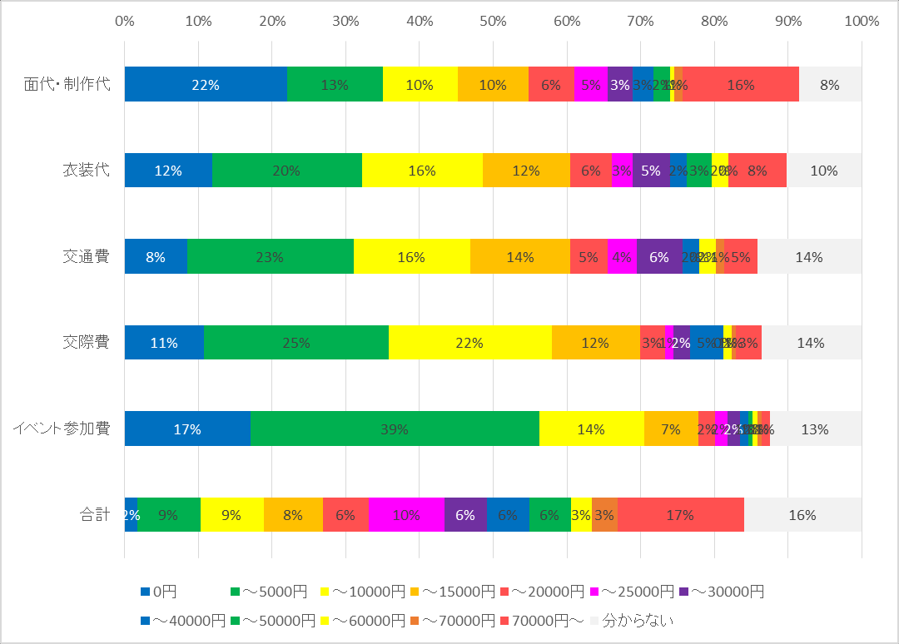
## 19 Открытие в реальной жизни

Рисунок 49 Подводит итог положению активистов, которых находят или информируют в реальной жизни. Человек, известный отцу, — 25%, человек, известный матери, — 35%, разница есть. Пятьдесят процентов людей говорят «друзьям и друзьям», но, с другой стороны, только 25 процентов из тех, кто говорит «друзьям», кроме друзей и родственников, есть разница между тем, что им говорят, и тем, что им не говорят, даже среди друзей. Меньше людей, 20%. При уведомлении или обнаружении наиболее важным является нейтральный ответ, но существует более положительная, чем отрицательная реакция. Среди неактивных/неактивных отец знал (и, вероятно, знал) 12 процентов, мать 19 процентов, семья и друзья 24 процента, друзья 8 процентов, рабочие места 0 процентов и супруг/партнер 5 процентов.

Таблица 11 Обобщает реальный уровень открытий активных людей по географическому составу. 48-68% тех, кто живет в своих домах, известны своим родителям, в то время как только 25-33% живут одни. Кроме того, люди, живущие в своих домах, имеют более высокий уровень осведомленности не только среди своих родителей и братьев, но и среди родственников и друзей. Партнер, который живет с супругом, знает о 83 процентах (44 процента положительных, 22 процента нейтральных, 17 процентов отрицательных и более позитивных).

На рисунке 50 подытоживается то, что было обнаружено в реальной жизни активистов, разделенных тем, «как я горжусь своей страстью». Каким бы ни был объект, чем больше гордится человек, тем выше уровень открытий или общения в реальной жизни. В частности, ответ на вопрос "гордость" составляет более 50 процентов.

На рисунке 51 показано, горжусь ли я собой и что чувствую, когда нахожусь в реальной жизни. Периферические реакции направлены на людей, которые, как известно, являются объектом, причем «положительные реакции» регистрируются как 1 балл, «нейтральные реакции» — как 0 баллов, «отрицательные реакции» — как -1 балла и вычисляются средние значения. Чем выше ценность, тем больше принятие вокруг. Важно отметить, что если я не испытываю гордости, то сначала это может быть незамеченным или непричастным; но в целом, чем больше я горжусь собой и чем более позитивная реакция вокруг меня.

| Объект | Он живет дома. | Жить одному. | Сожительство с супругом |
| --- | ---: | ---: | ---: |
| Отец. | 48 | 25 | 35 |
| Мама. | 68 | 33 | 40 |
| Братья и сестры. | 50 | 29 | 35 |
| Друзья. | 58 | 49 | 52 |
| Друзья. | 35 | 26 | 37 |
| карьера | 22 | 20 | 25 |
| партнер | 22 | 20 | 83 |

**Таблица 11: Уровень открытий в реальной жизни по полу (%)**  
**Рисунок 49: Открытия в реальной жизни активистов**

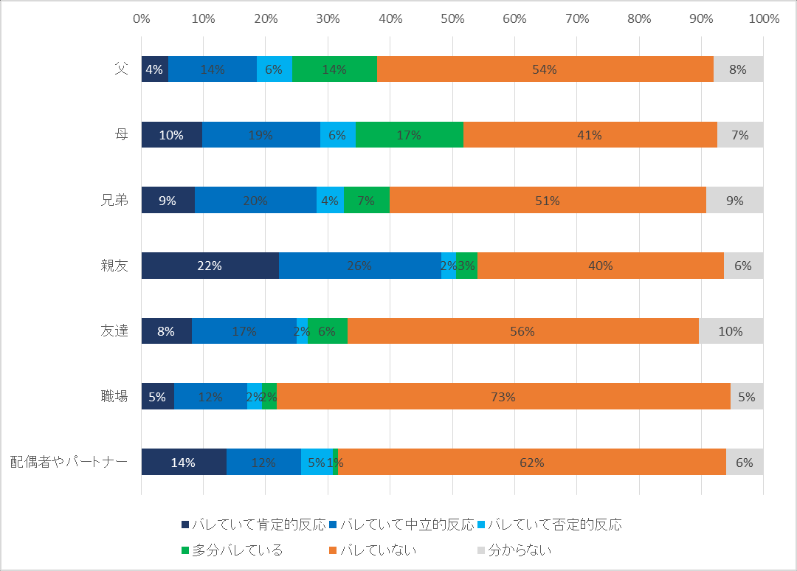
**Рисунок 50: Уровень открытий в реальной жизни, сопоставляя меня с гордостью, которая мне нравится.**

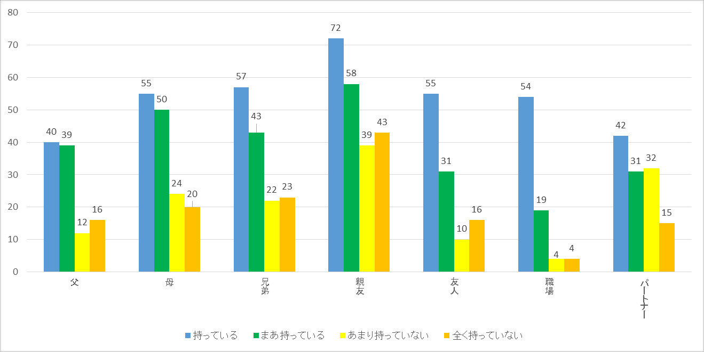
**51 Есть ли у меня связь между моим чувством гордости и тем, как я реагирую, когда меня находят в реальной жизни?**

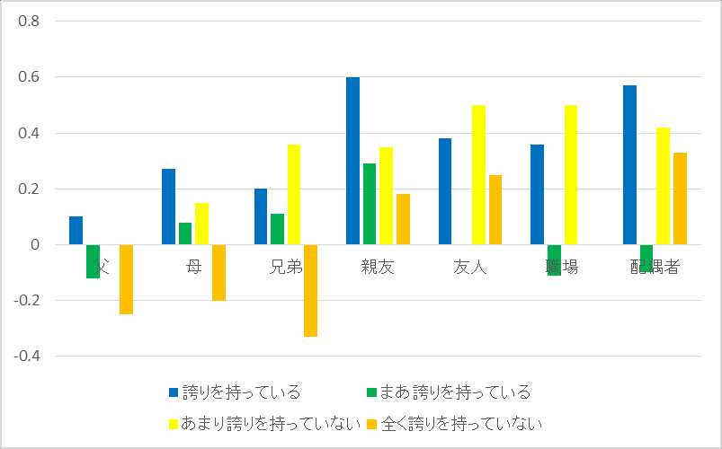
## 20. Очаровательные районы

На рисунке 52 показано, какой из следующих ответов был выбран 214 эффективными респондентами в разделе «Я самый привлекательный из моих фаворитов: чистые фото-ярмарки, беседы со сверстниками, поведение взрослых/любовь и население в целом. Чаще всего это «акты взрослых/любовей и т.д.», 34%. За этим последовали 25 процентов за «вызов со сверстниками», 20 процентов за «чистую фотографию» и 15 процентов за «отличие от населения в целом».

На рисунке 53 показан ответ на гламурное поле по схеме активности. Среди тех, кто «еще не активен», «в основном одеты в одиночку», преобладали «такие действия, как взрослый/любовь», превысив 50 процентов. С другой стороны, среди тех, кто «действует или уходит, чтобы я выглядел хорошо», «разговаривает со своими сверстниками» был самым высоким — 33 процента, за ним следовали «действия взрослых / любовники и т. Д.» и «отличники с обычными людьми», по 26 процентов каждый. Среди «специалистов по фотографии/поддержке», «чистых фотовыставок» и «взрослых/любовников и т.д.» — самые высокие, по 29 процентов каждый; «с населением в целом» никто не выбирает.

На рисунке 54 показаны гламурные области по областям деятельности. Выбор «взрослых/любящих и т.д.» выше в Восточной Японии, где он составляет 40 процентов в Гуандун и 50 процентов в населенном пункте (Восточная Япония). Выбор «с населением в целом» выше в Западной Японии, 27 процентов в Кансае и 28 процентов в населенном пункте (Западная Япония); никто в населенном пункте (Восточная Япония). Выбор первого человека для общения, такого как «сложность со сверстниками», выше в Восточном море и Локальной (Западная Япония) с 48% и 39% соответственно. Область «чистой фото-ярмарки» варьируется меньше.

На рисунке 55 показано, как я горжусь своим хобби и как ответ находится в области очарования. Чем больше я смотрю на тех, кто гордится мной, тем больше я выбираю «с обычными людьми» и тем меньше я выбираю «акты взрослых/любовей».

**Рисунок 52: Я пытаюсь изменить ситуацию.**

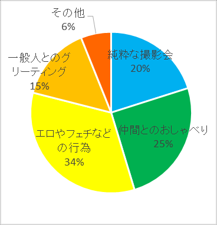
**Рисунок 53: У меня много работы.**

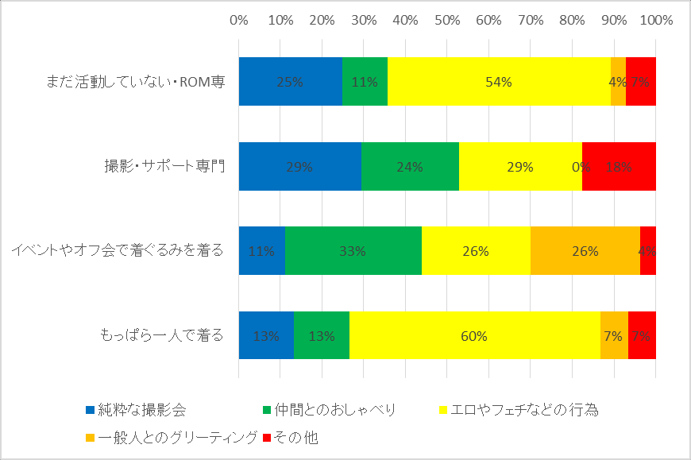
**Рисунок 54: Я классифицируюсь по площади.**

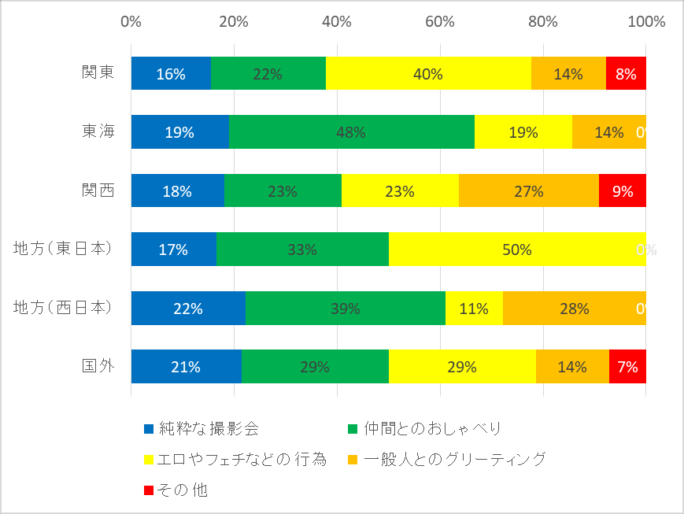
**Рисунок 55: Пойте мне против гордости, которой я люблю гордиться.**

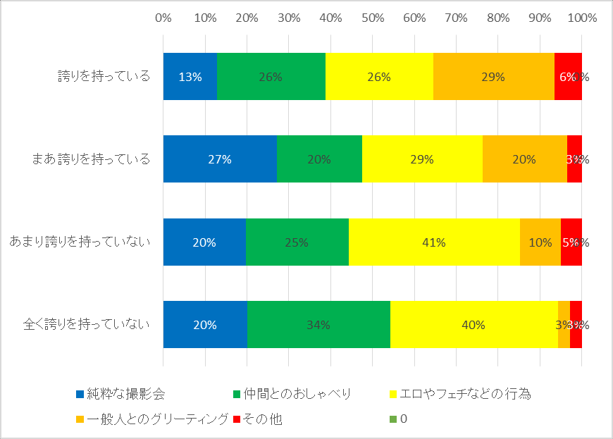
## 21. Сексуальная самоидентификация и сексуальная ориентация

На рисунке 56 показана сексуальная самоидентификация 203 эффективных мужчин-респондентов. 89% для мужчин. Ответ на вопрос «женщина» был 1%, «ни мужчина, ни женщина» 6%, и «никогда не известно» 4%. Сексуальная самоидентификация 9 женщин составляет 100% женщин.

На рисунке 57 показана сексуальная ориентация 207 действительных респондентов. Нет геев, 25% бисексуалов, 50% гетеросексуалов. Остальные 25% - бесполые, квесты и т.д. Бисексуальность составляет 19%, гетеросексуалы - 56%, несексуалы - 2%, квесты - 22% и т.д. Когда отмечается, что пол семьи является мужским и что секс не является «мужским», это 52 процента бисексуалов, 9 процентов гетеросексуалов, 22 процента несексистов и 17 процентов квестов.

**Рисунок 56: Сексуальная самоидентификация респондентов мужского пола**

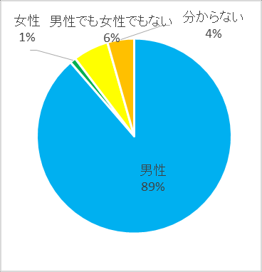
**Рисунок 57: Сексуальная ориентация**

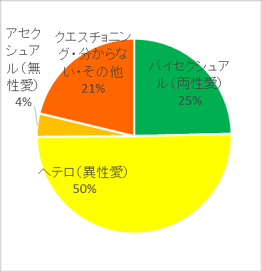
## 22. Партнеры

На рисунке 58 показано, были ли у 204 действительных респондентов однополые партнеры и их опыт. Пять процентов говорят, что «есть сейчас», семь процентов говорят, что «есть».

На рисунке 59 показано существование и опыт однополых пар по сексуальной ориентации. 13% бисексуалов теперь имеют однополые пары, 23% занимались сексом в прошлом. Девяносто семь процентов гетеросексуалов и 92 процента других не имеют гомосексуального партнера.

Аналогичным образом, цифра 60 показывает, есть ли у 205 действительных респондентов гетеросексуальный партнер и опыт. 18% ответили «есть сейчас», 33% привыкли.

На рисунке 61 показано существование и опыт гетеросексуальных пар по сексуальной ориентации. Шестнадцать процентов бисексуалов теперь имеют гетеросексуальных партнеров, а 49 процентов имели гетеросексуальных партнеров в прошлом. Двадцать один процент гетеросексуалов теперь имеют гетеросексуальных партнеров, 32 процента имели их в прошлом. Следует отметить, что больше гетеросексуалов, чем бисексуалов, никогда не имели гетеросексуального партнера.

На основе этих результатов на диаграмме 62 показан опыт взаимоотношений 217 эффективных респондентов. Какой бы ни был противоположный пол, Кирин, у которой никогда не было девушки/бойфренда, = Kanojo Inai reki Iko-ru Nenrei, «Время равно возрасту без подруги/бойфренда», составляет 43 процента; 21 процент людей с подругой/бойфрендом теперь реалистичны; 36 процентов — нет, но были в прошлом.

На рисунке 63 показан опыт взаимоотношений по регионам. Реальность в Восточно-Китайском море намного больше, 42% из которых говорят «с партнером». Кирин меньше присутствует в Восточном море и Кансай, и больше в Кансунге, местном (Западная Япония), местном (Восточная Япония) и за рубежом.

На рисунке 64 показано, горжусь ли я своей страстью и своим любовным опытом. Чем больше вы сталкиваетесь со мной, тем больше я горжусь, тем меньше у меня было в прошлом, тем меньше я горжусь в прошлом. Однако нынешнее соотношение всего населения не зависит от того, гордится ли оно мной.

На рисунке 65 показан ответ на вопрос «дышать мне и какой из них более возбуждён» по отношению к прошлому любовному опыту. Более 50 процентов людей, которые отвечают: «Ускори меня и толкай меня» и «Сделай меня и толкай меня», — это Кирин. Но, с другой стороны, около 20 процентов людей полны реальности. Тридцать пять процентов респондентов, ответивших на вопрос «живой противоположный пол», были KIRIN; 24 процента респондентов, ответивших на вопрос «относительный противоположный пол», были KIRIN, и произошел разворот. Однако доля людей, которые фактически завершают реальность, составляет 28 процентов среди тех, кто отвечает на вопрос «желательно», 21 процент среди тех, кто отвечает «желательно», и чаще среди тех, кто имеет противоположный пол (но пары здесь включают тот же пол).

**Рисунок 58: Однополые пары с опытом или без него**

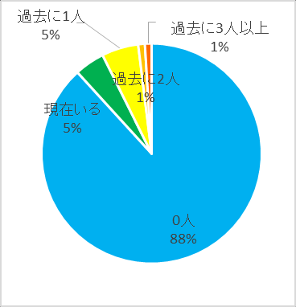
**Рисунок 59: Наличие и опыт однополых пар по сексуальной ориентации**

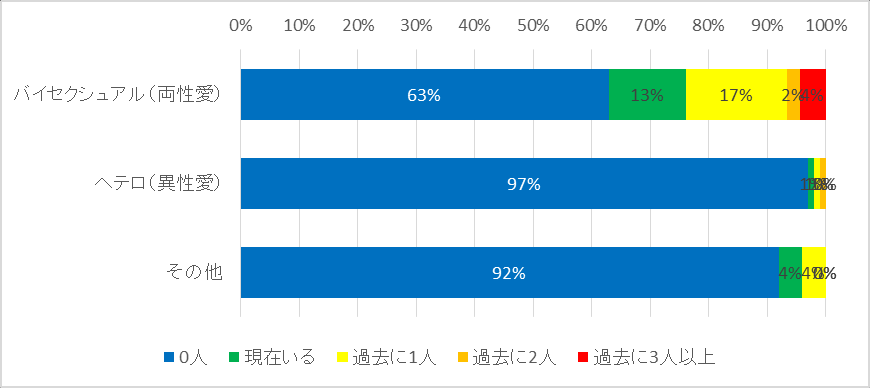
**Рисунок 60: Иметь гетеросексуальные пары**

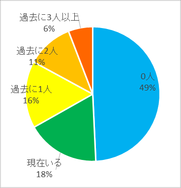
**Рисунок 61: Наличие гетеросексуальных пар по признаку сексуальной ориентации**

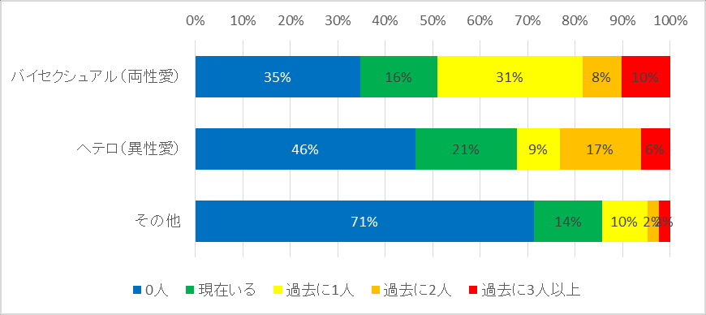
**Рисунок 62: Опыт взаимоотношений**

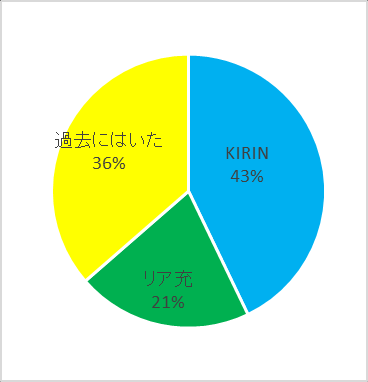
**Рисунок 63: Опыт взаимоотношений по регионам**

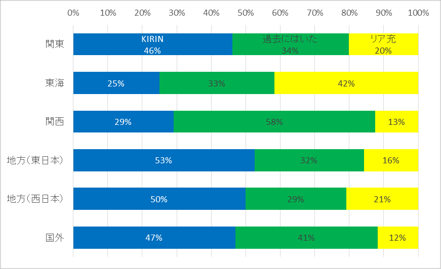
**Рисунок 64: Я был влюблен в гордость, которую я люблю.**

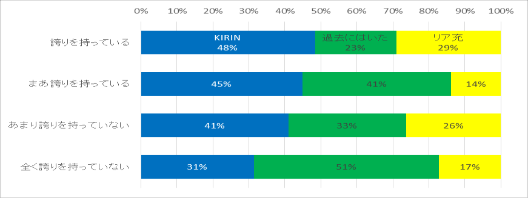
**Рисунок 65: Пролиферность / Сопрягает связь между моим волнением и моим любовным опытом**

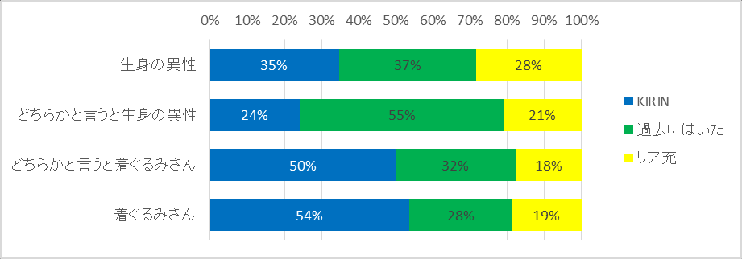
## 23. Брак.

На рисунке 66 показаны брачные взгляды 211 действительных респондентов. Ответ на вопрос «женаты или когда-либо состояли в браке» составил 12%. Число людей, которые хотят выйти замуж, даже если они бросают свое хобби, составляет 7%, а число людей, которые хотят выйти замуж, составляет 27%, если они могут принять это хобби. Число лиц, которые "хотят вступить в брак, если это возможно, но не уделяют серьезного внимания", составляет 28 процентов. Число людей, которые «не хотят вступать в брак», составляет 14 процентов, и 12 процентов тех, кто «не хочет вступать в брак, но сдался».

На рисунке 67 показаны перспективы брака по возрасту. Среди тех, кому не исполнилось 20 лет, «если они могут принять это увлечение, они хотят жениться» — самый высокий показатель — 44%, и никто не отказался от брака. Кроме того, есть «глубоко желающие пожениться, даже если вы бросите хобби» до 29 лет. Людей старше 30 лет почти не существует, но они сдались в возрасте 25-29 лет, меньше, чем в возрасте 20-24 лет, но увеличились с возрастом. Из тех, кому за 40, 33 процента отказались от брака. С другой стороны, наблюдается резкий рост фактического числа женатых лиц старше 30 лет и 33% лиц старше 40 лет.

На рисунке 68 показано понятие брака по сексуальной ориентации. Замужние составляют 18% бисексуалов и 14% гетеросексуалов. Положительные реакции на брак, такие как «если вы хотите жениться», «если вы хотите жениться», составляют 48 процентов для бисексуалов и 40 процентов для гетеросексуалов. Бисексуалы немного более уверены в браке, чем гетеросексуалы. С другой стороны, 35% респондентов, не имеющих отношения к сексу, сказали: «Я не хочу жениться».

На рисунке 69 показана связь между «размножением и отклонением» и идеей брака. Около 20 процентов людей, которые ответили «предпочитают быть более взволнованными», были женаты, и менее 10 процентов из тех, кто ответил «предпочитают быть более взволнованными». Более того, чем больше я смотрю на тех, кто меня включает, тем выше доля тех, кто «не хочет жениться», «не хочет жениться, но сдался».

**Рисунок 66: Брак**

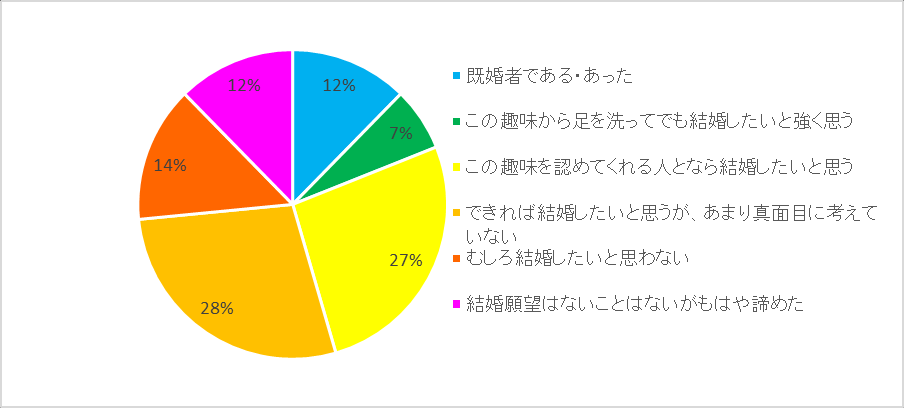
**Рисунок 67: Браки по возрасту**

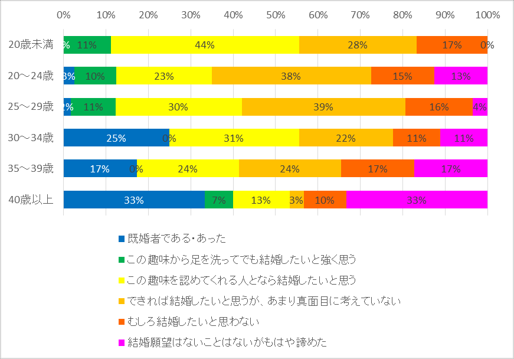
**Рисунок 68: Браки по сексуальной ориентации**

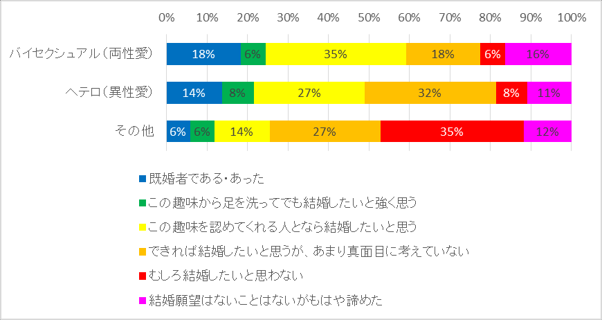
**Рисунок 69: Пролиферативность/помощь в соединении моего возбуждения с браком.**

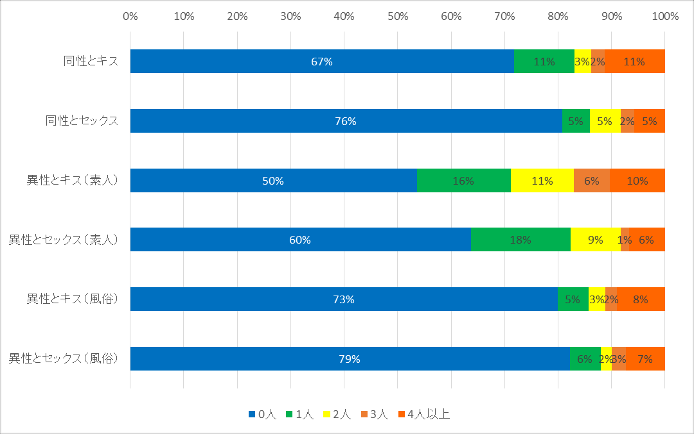
## 24. Опыт сексуальных переговоров

Рисунок 70 Краткое изложение опыта сексуальных переговоров 195 эффективных респондентов. Тридцать три процента людей имели однополый секс, 24 процента имели однополый секс, 50 процентов имели нетрадиционный гетеросексуальный секс и 40 процентов имели гетеросексуальный секс. Использование обычаев составляет около 20-30%. Кроме того, на основе этих результатов показатель отсутствия сексуального опыта у респондентов составил 52 процента, 44 процента для общей целевой группы и 4 процента только для традиционного опыта.

На рисунке 71 показана связь между ответом на «дыхание человека и тем, что меня больше волнует». Коэффициент неопытности составляет менее 40 процентов для тех, кто отвечает более гетеросексуально; а коэффициент неопытности для тех, кто отвечает мне, составляет около 60 процентов (хотя даже если они не занимаются сексом с противоположным полом, если они занимались сексом с тем же самым полом).

На рисунке 72 показан опыт секс-торговли, который заставляет меня разделить период пробуждения. Чем раньше ты отвернешься от меня, тем выше неопытный. Уровень неопытного пробуждения в средних школах составляет 72 процента, в то время как среди социально сознательных — только 29 процентов.

Рис. 73 К 30 годам уровень неопытности снизился с возрастом; с тех пор он стабилизировался. Коэффициент неопытности (100 - процент мужского сексуального опыта) в JEX japan sex Survey (2013) составляет 54%, 25 - 29 38%, 30 - 34 27%, 35 - 39 17%, 40 - 44 10%; этот опрос выше, чем средний показатель неопытности для средних японских мужчин в любом возрасте.

Кроме того, когда я смотрю на гордость, которую я люблю в сексуальном переговорном опыте, неопытный показатель 55 процентов для меня и 44 процента для тех, кто любит меня, тем больше я чувствую гордость за меня и тем выше неопытный.

**Рисунок 70: Опыт респондента в сексуальных переговорах**

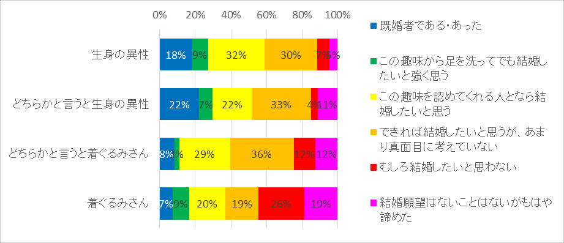
**Рисунок 71: Опыт секс-индустрии, которым я с большим удовольствием делюсь со мной по-настоящему девиантным/светским.**

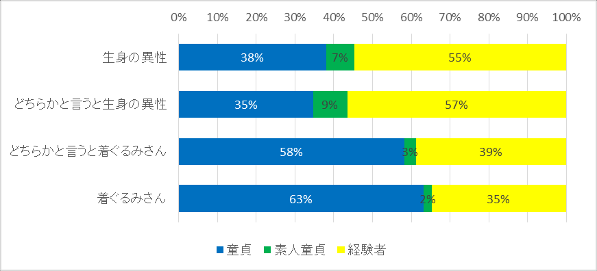
**Рисунок 72: Подталкивание меня к опыту сексуальной торговли в период пробуждения.**

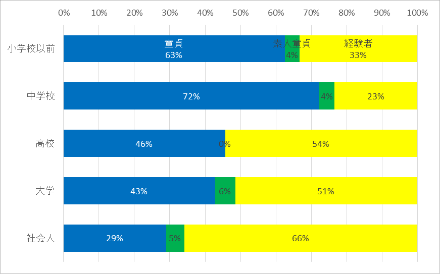
**Рисунок 73: Опыт ведения сексуальных переговоров по возрасту**

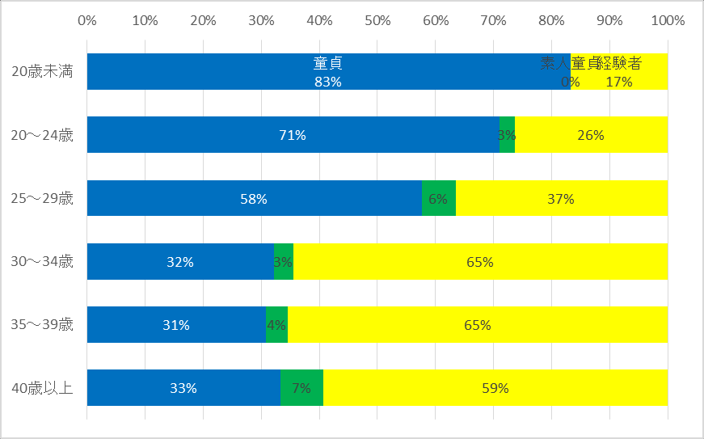
## 25 Интерес.

На рисунке 74 показана заинтересованность 217 действительных респондентов (несколько вариантов). Наиболее частым является «просмотр анимированных», за которым следует «онлайн-серфинг», «путешествия», «чтение / чтение комиксов», «напиток / еда».

На рисунке 75 показан интерес к возрастным различиям. Существует разница между «наблюдением за анимированным», «путешествующим» «автомобилем», «звучащим» «камерой» «DIY/модель/пластиковая модель». Среди них «показ» снизился с возрастом и долей людей, ответивших на него как на интерес. Прочие проценты увеличиваются с возрастом, а доля людей, реагирующих на проценты, увеличивается.

**Рисунок 74: Заинтересованность респондентов**

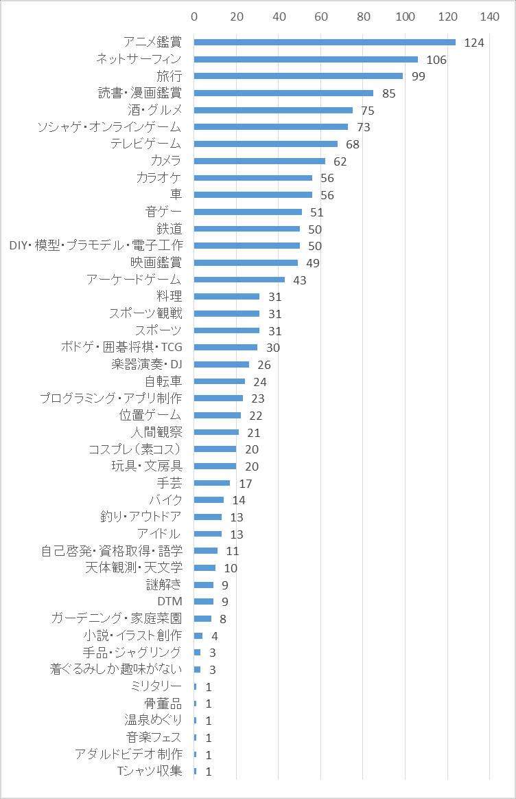
**Рисунок 75: Доля респондентов, представляющих интерес в разбивке по возрасту**

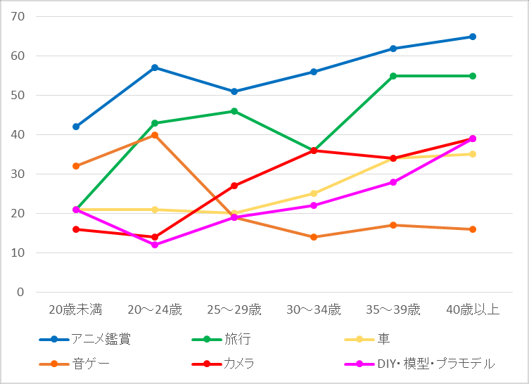
## 26. План дня отдыха

На рисунке 76 показаны варианты для 210 эффективных респондентов, которые лучше всего подходят для их собственного выходного дня. Самая большая из них — «Впрыскивание в меня, чтобы заинтересовать меня вне меня», что составляет 29%. Во-вторых, «тратить дома в одиночестве» с 26 процентами и «участвовать в мероприятиях или вне совещаний» с 17 процентами.

77 «Деятельность», показывающая, как проводят дни отдыха по регионам. В Восточном круге «участие в мероприятиях или вне совещаний» занимает видное место, составляя 43 процента; в Гуандун и Кансай это также 20 процентов; но в небольших местах это 0 процентов местный (Восточная Япония) и 6 процентов местный (Западная Япония). «Инъекция во мне заставляет меня интересоваться вне меня» выше в Кансай и местных жителей, 45% и 50% соответственно. В зарубежном мире на 31% больше «жизней с семьей».

На рисунке 78 показано, как люди проводят свои дни отдыха по возрасту. Среди лиц в возрасте до 25 лет больше «живут одни дома»; в возрастной группе 25-34 лет наблюдается увеличение «участия в мероприятиях или вне собраний» и «вовлеченности в мои интересы, отличные от меня»; а в возрасте старше 35 лет наблюдается снижение «участия в мероприятиях или вне» и увеличение «жизни дома в одиночестве».

На рисунке 79 показано, как проходят остальные дни по составу общины. Доля ответов на "участие или неучастие" была самой высокой - 22 процента. Число людей, проживающих в своей родной стране, составляет 17 процентов, а число людей, проживающих со своими супругами, составляет 14 процентов. «Влияние на мой интерес вне меня» является самым высоким среди одиночек — 37%. Среди тех, кто живет со своими супругами, 45 процентов ответили, что они «живут со своими семьями».

Кроме того, чем больше гордых людей выбирают «участие или вне доски», когда они смотрят на то, как они тратят мою любимую гордость, тем выше доля.

**Рисунок 76: Как проводят дни отдыха**

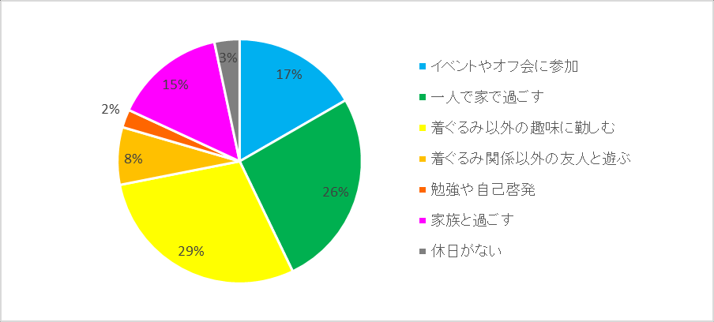
**Рисунок 77: Дни, проведенные по регионам**

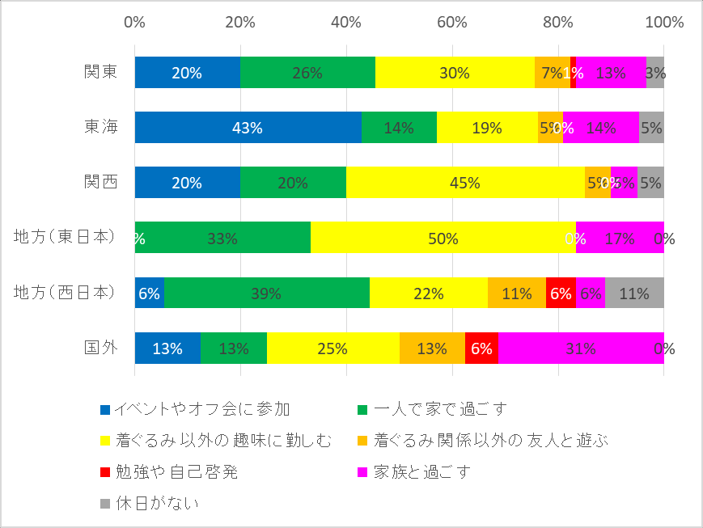
**Рисунок 78: Схема дней отдыха по возрасту**

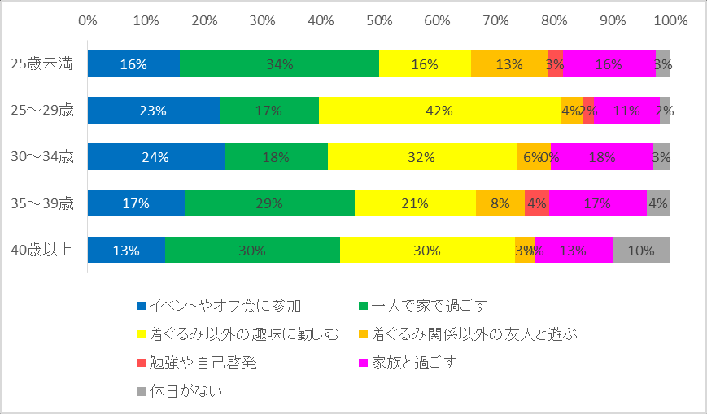
**Рисунок 79: как расходуется остальной мир, по составу**

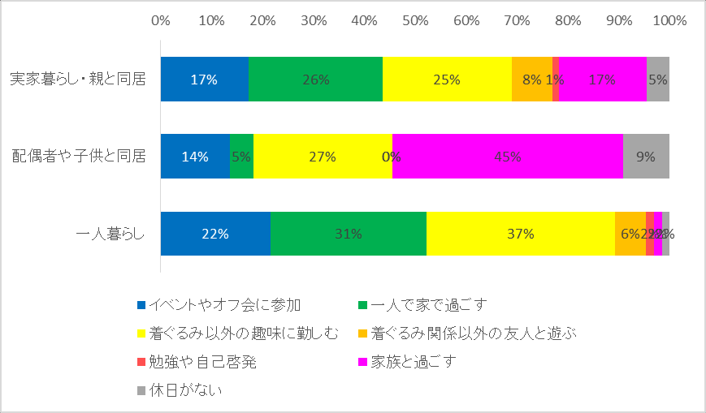
## 27.То, как показывают чиновники, женщины, как они выглядят, как я это вижу.

На рисунке 80 показаны мнения 218 эффективных респондентов, в том числе тех, кто ответил «не знаю», на шоу «официальная красота света», «женственная», «принадлежащая мне». Во всех проектах ответ определенно превышает 60 процентов. Показатель отрицательной реакции с «нет интереса» составляет: официальное шоу 21%, женский костюм 30%, вне человеческой формы 23%.

В любительской красоте меня раньше играли мужчины. На рисунке 81 показана взаимосвязь между тем, «привлекателен ли этот пол через границы», и тем, что я быстро ищу именно женщин. Люди, которые знают, что гендер привлекателен через границы, более склонны позитивно реагировать на официальные шоу. Тем не менее, показатели «нравится» и «нравится» составляют 35% и 34% соответственно. С другой стороны, в то время как процент положительных ответов на официальные шоу ниже, чем процент «лайков» и «лайков», составляет 53 процента и 6 процентов для тех, кто не считает, что пол привлекателен через границы. Более того, никто из людей, которые не считают гендерную привлекательность за границей, не ответил на официальное шоу «не очень» или «не очень».

Аналогичным образом, на рисунке 82 показана взаимосвязь между гламуром трансграничности полов и восприятием женской одежды. Ответ на ответ на слово «лучше» составлял около 70 процентов; ответ на слово «лучше» был, конечно, менее 50 процентов, и было больше отрицательных ответов на слово «неинтересный», чем «да».

На рисунке 83 показано, что я чувствую по поводу официального шоу, которое я чувствую по поводу своего пробуждения. Чем раньше вы проснетесь, тем больше уверенности в том, что официальное шоу ответит. Я не вижу четкой привязанности к периоду пробуждения. Кроме того, я не горжусь тобой.

**Рисунок 80: Вид официального шоу, женщины, люди, как я его вижу.**

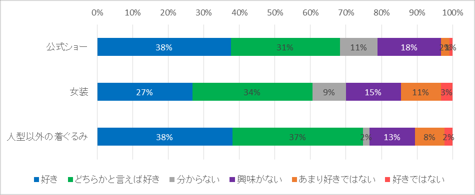
**Рисунок 81: Любитель, защищающий меня перед чиновником, показывает мне, как я вижу себя.**

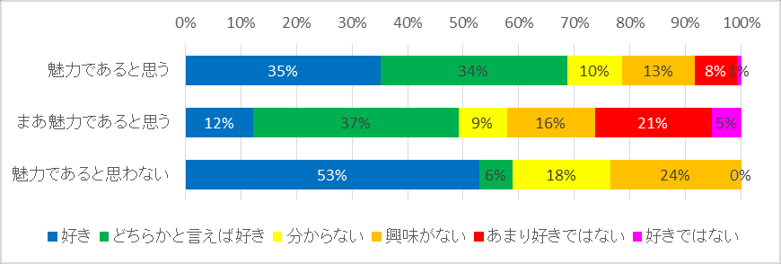
**Рисунок 82: «Красота-любитель» — это идея женского платья.**

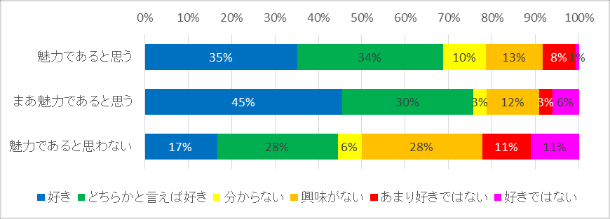
**Рисунок 83: Толкай меня, толкай меня, покажи мне, что я чувствую, когда просыпаюсь.**

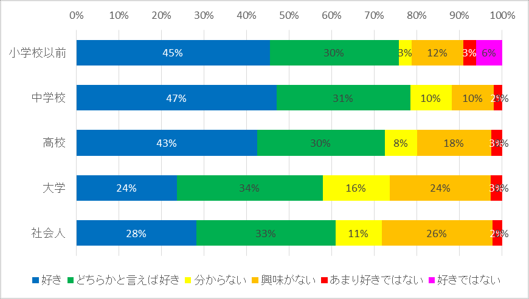
## Идея носить свою мать другим.

На рисунке 84 показаны взгляды 161 эффективного респондента с собственными «матерями», которые носили своих «матерей» к другим. 46% ответили: «Если доверенный человек хочет, чтобы он его носил». 12% тех, кто выбирает «тело», и 7% тех, кто выбирает «ролевую любовь», выбирают 12%. Семь процентов сказали: «Кто может носить его, если вы хотите его носить», и, с другой стороны, у 11 процентов были негативные чувства по поводу того, чтобы кто-то его носил.

По данным региона, Kansai-Change хочет носить «кого бы вы ни хотели носить» и «кого бы вы ни хотели носить», а также «кому есть роль, которую нужно любить» и «кому есть роль, которую нужно носить» на общую сумму 20%, «кто хочет носить, если вы хотите доверять» - 65% и больше доверия. В Восточно-Китайском море, с другой стороны, «кого бы вы ни хотели надеть», «кого бы вы ни хотели надеть, вы хотите надеть», «кого бы вы ни любили, вы хотите надеть», 45 процентов, «кто хочет надеть, если вы доверяете», 45 процентов и тенденция больше сосредотачиваться на условиях, отличных от доверия. За рубежом более 20% людей хотят его носить.

**Рисунок 84: У меня сложилось впечатление, что я тот, кто является тем, кто является тем, кто является тем, кто является тем, кто является тем, кто является тем, кто является тем, кто является тем, кто является тем, кто является тем, кто является тем, кто является тем, кто является тем, кто является тем, кто является единственным.**

## 29. Самооценка формы матери, тела и совершение акта

На рисунке 85 показаны результаты 169 действительных респондентов, которые ответили, что у них была «мать», и самооценили свою «маму» и ответили на самый высокий балл. Двадцать один процент ответов были "не в состоянии оценить", и самооценка не проводилась. 18% дают «100 очков». Из оставшихся 61% 90 баллов выше, но 11% дают меньше 80 баллов. В среднем 91 балл после исключения «невозможно забить».

Средний балл по продолжительности деятельности составил в среднем 89-92 за 10 лет; 94 за 10-15 лет и 95 за 15 лет, что увеличилось. С точки зрения владения средний показатель тела до 6 составляет 90-92; 7 и выше поднимается до 94. Более того, доля «неспособных забить» не зависит от стажа работы или владения.

С другой стороны, на рисунке 86 показаны результаты самооценки 125 результативных респондентов своих "матерей" и ответы на самый низкий балл. Тридцать один процент респондентов ответили, что «не могут забить» и что больше людей отказались забивать, чем упоминалось ранее. Только 6% из тех, кто дает более 90, и только 14% из тех, кто дает более 80. Ответ ниже 60 17%. Менее 70 минут среднего времени показа.

В среднем по году деятельности она составляла примерно 66-70 лет за 10 лет; за 10-15 лет выросла до 78, а за более чем 15 лет — до 63. На подсчёте лиц 2 тела составляют 74, 3 тела 67, 4 тела 74, 5-6 тел 70 и 7 тел выше 64.

На рисунке 87 показано, горжусь ли я своим хобби и самооценкой матери. Ни один из ответивших на вопрос "с гордостью" не оказался на 80 пунктов ниже, а меньше на 100. Чем меньше гордость, тем больше 80-х и 100-х, тем больше поляризации.

На рисунке 88 показано, что 145 из них ответили, что я оцениваю себя, ища быстрый и эффективный ответ. Самый большой – «71-80 минут». Тридцать два процента респондентов получили более 71 балла; с другой стороны, 11 процентов получили менее 20 баллов. Средний показатель составляет 56 минут.

Кроме того, ответ заключается в том, чтобы дать мне рейтинг самооценки размером с тело на высоте 160 см менее 54, 160-165 см 64, 165-170 см 59, 170-175 см 54, 175 см более 60 см (хотя в этом случае лучше спросить «физический», чем «физический», чтобы увидеть явную зависимость).

Рисунок 89 показывает среднее значение самооценки самооценки по ИМТ. Пик BMI18-20, 75 минут; 18 ниже 64 минут. Чем выше ИМТ, тем ниже самооценка тела, тем больше 18-е.

Рисунок 90 иллюстрирует связь между степенью стыда за озеленение и средним собственным индексом массы тела. Чем больше людей стесняются быть зелеными, тем ниже они оценивают свое тело. Средний размер тела тех, кто стыдится, составляет 47, а тех, кто стыдится, — 65. С другой стороны, средний балл для тех, у кого нет опыта озеленения, составляет 63, что выше. Фактический ИМТ, однако, не отличается так сильно, как самооценка, со средним значением 21,8 для тех, у кого есть чувство стыда, 21,0 для тех, у кого нет чувства стыда, и только около 1.

Рисунок 91 показывает, что 131 респондент самооценивается моими быстрыми и эффективными респондентами. 9% ответили «неизвестно»; среди бомбардиров «61-70» оказался самым высоким, в среднем 51 очко.

На рисунке 92 показана связь между стыдом за озеленение и средним показателем самооценки. Чем больше вам стыдно, тем меньше вы себя оцениваете. Средний балл тех, кто стыдится, составляет 36, а тех, кто стыдится, — 62.

На рисунке 93 показана связь между «чистыми фото-ярмарками», «разговором со сверстниками», «такими действиями, как взрослый/любовь» и выбором наиболее привлекательных областей в общей популяции, и средними самозваными самоиграющими баллами. Выбор «с общим озеленением населения» имеет высокий рейтинг тела и производительности 67 и 65 баллов соответственно; выбор других вариантов — 54-56 и упражнение 44-48.

На рисунке 94 показана взаимосвязь между участием во внесессионных встречах и частотой открытой деятельности и самоигранием. В любом случае, нет никакой разницы между двумя или более раз в месяц и около полугода, около 60 минут. Тем не менее, показатель самооценки снизился примерно до 50 в год; в среднем люди с низкой частотой упали до 40.

В таблице 12 показаны результаты этих самооценок по регионам. Не существует существенных региональных различий в (высшей) форме свекрови, но (самая низкая) форма свекрови выше в Кансае и за рубежом, со средним показателем 80 баллов, особенно за рубежом. Самооценка «само-стиля» «самоигра» выше в Кансае и за рубежом. Показатели самооценки низки на местном уровне.

На рисунке 95 показано распределение самооцененных чувств по отношению к кигуруми и моей страсти. Чем больше гордых людей, тем больше они склонны давать себе высокие оценки. Средний показатель: «Будь горд» 59, «Самый гордый» 55, «Не очень гордый» 45, «Никакая гордость» 43.

Рисунок 96 показывает взаимосвязь между самооценкой тела (поперечная ось) и средними показателями самооценки производительности (поперечная ось). Чем выше самооценка тела, тем выше самооценка производительности, тем выше самооценка тела в следующих областях; однако самооценка тела превышает верхний предел 60, и самооценка тела больше не имеет отношения к самооценке производительности.

| регион | Форма матери (высшая) | Мамин макияж (самый низкий) | Самофизический | Играй сам. |
| --- | ---: | ---: | ---: | ---: |
| Гуандун | 90 | 68 | 58 | 48 |
| Восточное море | 85 | 65 | 55 | 56 |
| Кансай. | 93 | 74 | 65 | 59 |
| Местный (Восточная Япония) | 88 | 67 | 44 | 43 |
| Местный (Западная Япония) | 94 | 71 | 54 | 43 |
| за границей | 93 | 80 | 65 | 63 |

**Таблица 12: Самооценка дома, тела и физических упражнений по регионам**  
**Рисунок 85: Самооценка (самая высокая)**

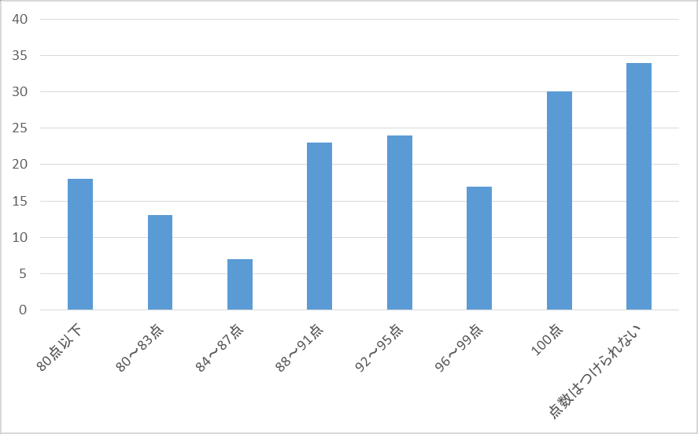
**Рисунок 86: Самооценка (минимальный балл)**

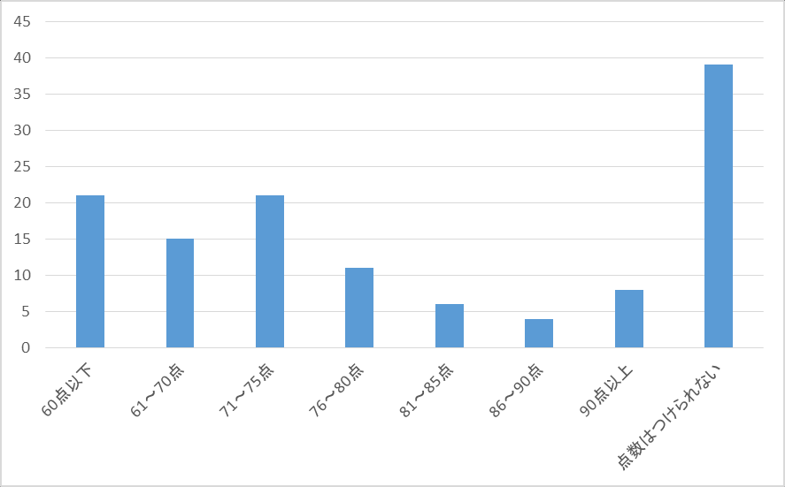
**Рисунок 87: Распределение форм матери и ребенка путем сопоставления меня с гордостью за мое хобби**

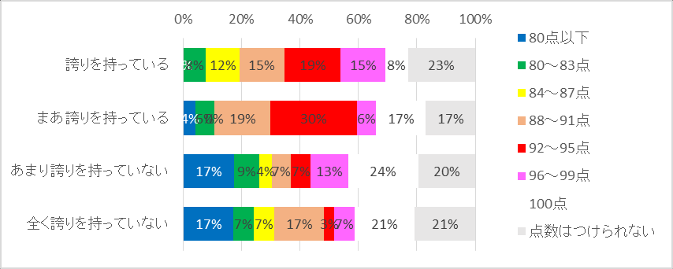
**Рисунок 88: Я ищу самооценку тела. мин.**

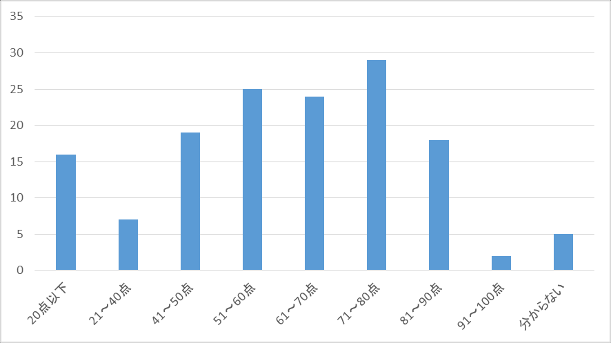
**Рисунок 89: Самооценка тела по ИМТ**

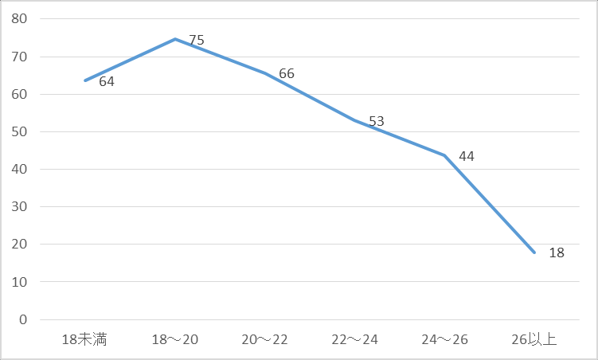
**Рисунок 90: Самооценка тела позором на озеленение мин**

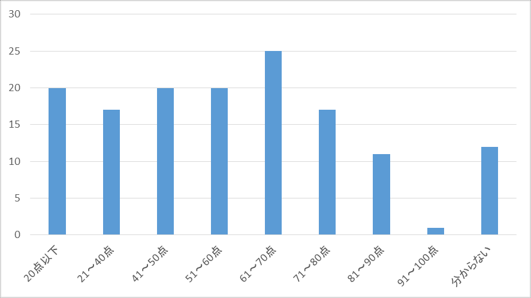
**Рисунок 91: Самооценка самоиграющего мина**

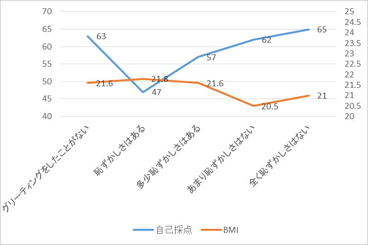
**Рисунок 92: Самооценка самоигры позором на озеленение мин**

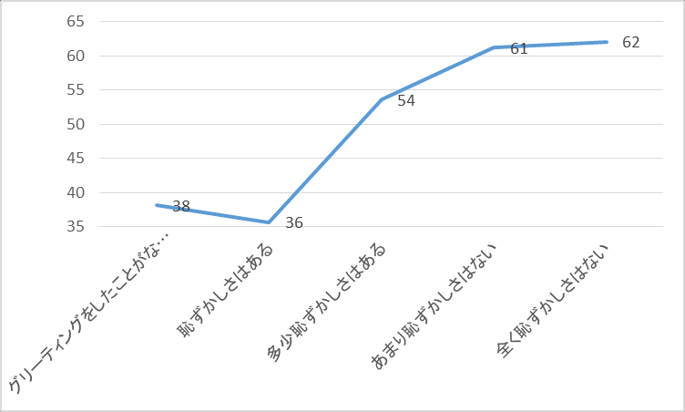
**Рисунок 93: Я ищу быстрый трекер, и я пытаюсь получить свое тело и самооценку моих прелестей. мин.**

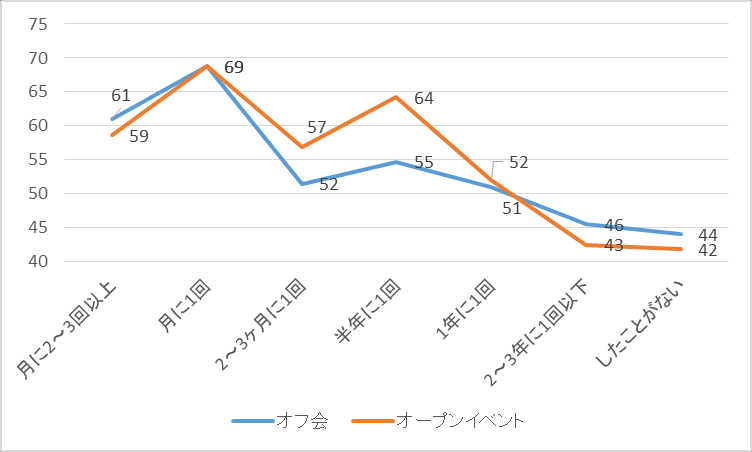
**Рисунок 94: Участие во внебортовой/открытой частоте активности и самооценка**

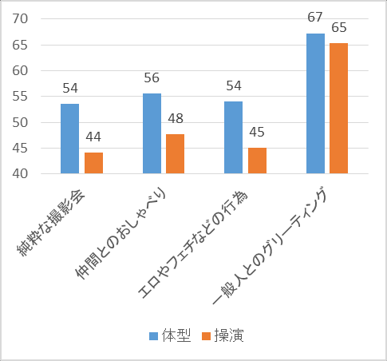
**Рисунок 95: Самооценка, сопоставляя меня с гордостью, которая мне нравится.**

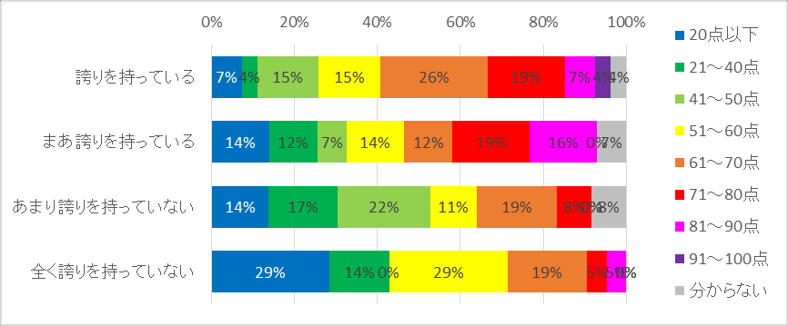
**Рисунок 96: Средняя самооценка тела по сравнению с самооценкой производительности**

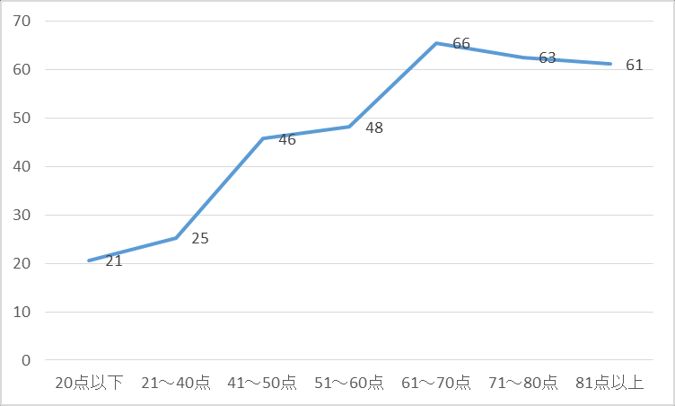
## 30. Восприятие того, что роль не играет любви, а приветствует роль, не подходит, но носит

На рисунке 97 показаны взгляды 197 эффективных респондентов на «игру/принятие ролей по таким причинам, как гуманизм, совместное производство и т.д., даже без особо сильной ролевой любви». "Я думаю, все в порядке" - 67%. На рисунке 98 показаны мнения 198 эффективных респондентов по вопросу "обезображивания тела, но влияния другой стороны на меня". Ответ, безусловно, 57%.

На рисунке 99 показано восприятие отсутствия ролевой любви по годам деятельности. Ответы, безусловно, будут преобладать до седьмого года, но отрицательные ответы немного увеличатся после седьмого года.

Рисунок 100 иллюстрирует восприятие неподходящего размера по продолжительности деятельности. Доля респондентов в течение 3-7 лет, несомненно, будет чрезвычайно высокой; чем они моложе или дольше, тем выше доля негативных респондентов. В частности, доля отрицательных ответов превысила количество положительных ответов для лиц старше 15 лет.

На рисунке 101 показано восприятие отсутствия ролевой любви, но приветствия ее по количеству доступных мест. Никакой явной уверенности не было видно. Однако среди тех, у кого 7 размеров тела выше, выбор выше, на 28 процентов; с другой стороны, отрицательный ответ составляет более 40 процентов.

Рис. 102 Показывает восприятие некомпетентности типа тела по самооценке типа тела. Чем больше люди оценивают свое тело, тем больше они предпочитают отрицательные ответы. В частности, отрицательный ответ превысил утвердительный для тех, кто дал более 81 балла. С другой стороны, даже среди тех, у кого более 81 балла, доля тех, кто выбирает «более чем полностью», достигает 19%.

На рисунке 103 показана связь между чувством гордости и восприятием другого размера, чем у платья. Чем больше гордость, тем более положительный ответ; чем меньше гордость, тем меньше ответ. Следует отметить, что эта тенденция проявляется не в восприятии «не ролевой любви, а приветливой».

**Рисунок 97: Виды, полученные без ролевой любви**

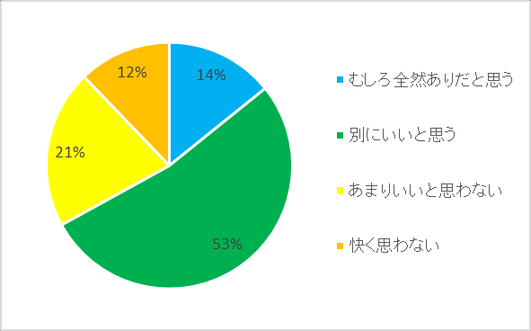
**Рисунок 98: Восприятие несоответствия**

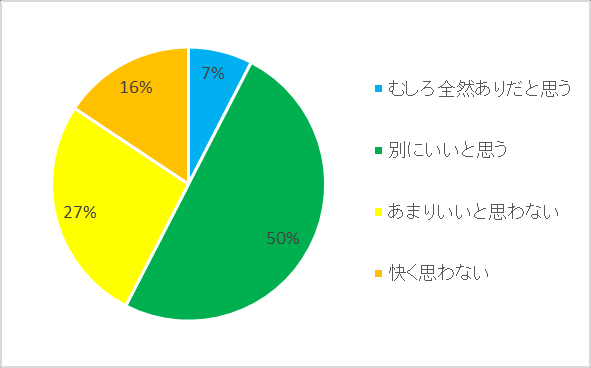
**Рисунок 99: Восприятие отсутствия ролевой любви по продолжительности деятельности**

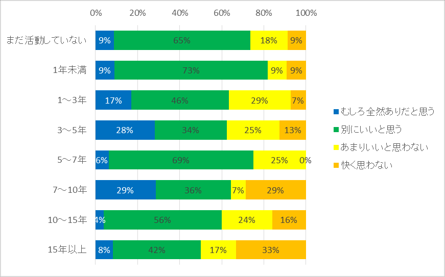
**Рисунок 100: Восприятие несоответствия по продолжительности деятельности**

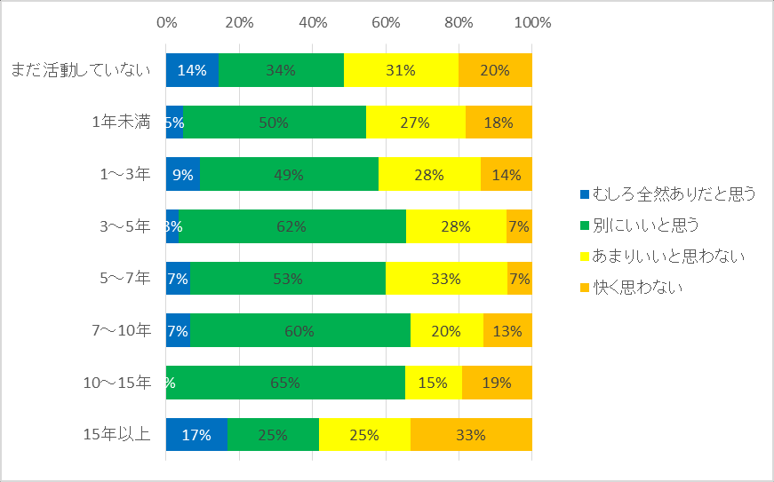
**Рисунок 101: Восприятие того, что у вас нет ролевой любви, но вы приветствуете ее по количеству лиц**

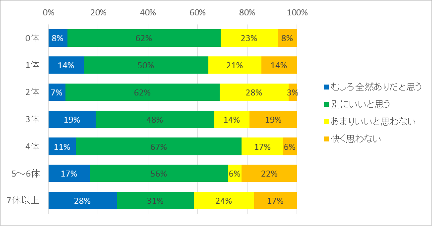
**Рисунок 102: Восприятие несоответствия и ношения посредством самооценки тела**

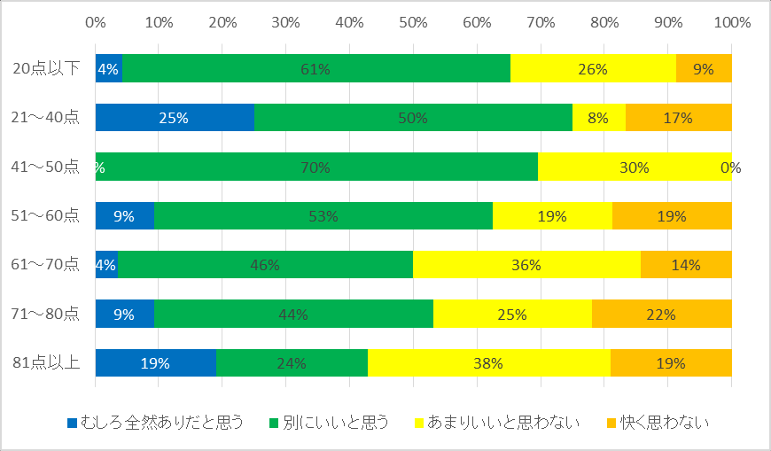
**Рисунок 103: Посмотрите на меня таким образом, чтобы разделить гордость, которую я люблю иметь, с видом, который я не подхожу, но ношу.**

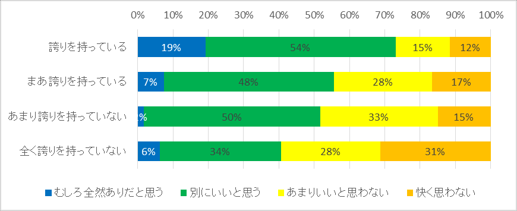
## Взгляды на «игровую роль»

На рисунке 104 показаны мнения 202 эффективных респондентов о «роли крушения». «Я забочусь» — 36%, «Я забочусь меньше», 62%, и я забочусь больше, чем забочусь. Здесь «горячий персонаж» относится к одному и тому же персонажу, и к единственному и единственному.

Рисунок 105 иллюстрирует восприятие «ударной роли» по регионам. В трех основных городских кругах наблюдается аналогичная тенденция быть интуитивным и невовлеченным. Местные жители (Восточная Япония/Западная Япония) больше не заботятся. За границей есть больше для ума, чем для ума.

Рисунок 106 иллюстрирует восприятие «игровой роли» по годам деятельности. В основном, чем моложе младший, тем меньше осведомленность, чем дольше активность; однако, чем больше 15-летних показывают обратное, тем «осторожнее» «негатив», тем лучше.

**Рисунок 104: Восприятие ролей воздействия**

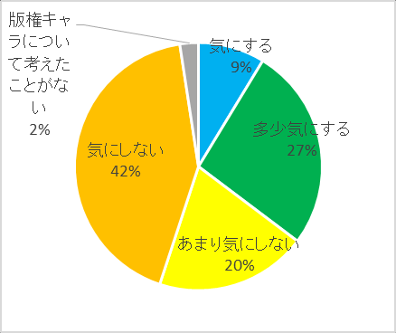
**Рисунок 105: Восприятие роли воздействия по регионам**

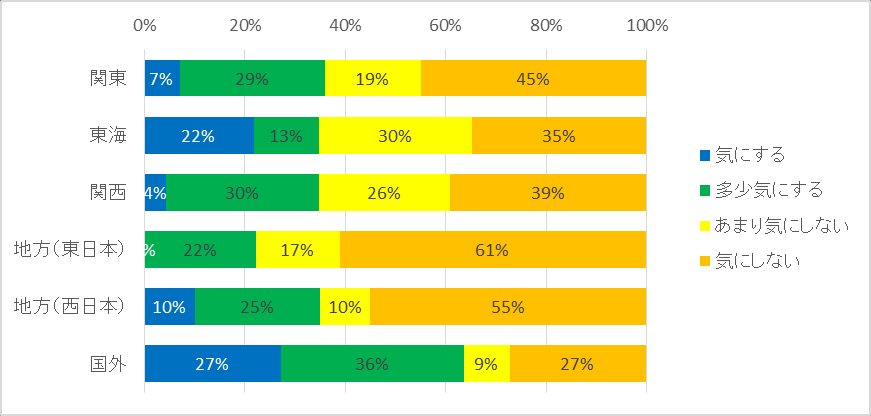
**Рисунок 106: Ударные роли по годам деятельности**

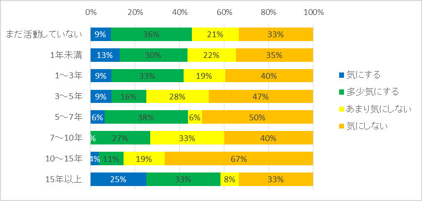
## Я не уверен, что я террорист.

На рисунке 107 показаны мнения 205 эффективных респондентов о том, можно ли создать у меня «ужасающее» чувство. Ответ: «Всегда есть» и «иногда есть», то есть 13 процентов людей, которые часто чувствуют себя ужасно. Ответ «иногда есть» — 23%. «Близко» к «никогда» относятся 64 процента тех, кто, вероятно, не понимает сути проблемы.

Когда я смотрю на то, как я горжусь своим хобби и как я горжусь ответом на этот вопрос, всегда есть соотношение «иногда» 6 процентов среди тех, кто горд, и 29 процентов среди тех, кто не горд. Чем больше я смотрю на это, тем больше чувствую, что мне страшно.

**Рисунок 107: Можно ли считать меня «ужасающим» в том, как меня удерживают?**

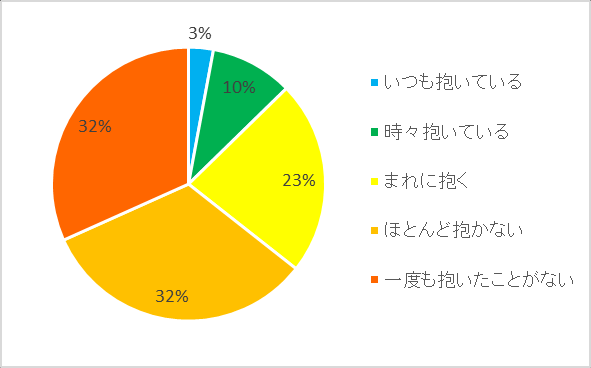
## 33. Перспективы будущего женского населения в будущем

На рисунке 108 показана реакция 203 эффективных респондентов на «Хотит ли население увеличиваться в кругу» Ответ на «надежду» составил 61%. «Сохранение статус-кво» составляет всего 29 процентов, а «низшее» — 10 процентов.

На рисунке 109 показаны ответы по годам деятельности. Ответ на вопрос «сколько надежды» остался практически неизменным на уровне лет деятельности, но «кто, наоборот, хочет снизить» склонность тех, кто был старше в своей деятельности, выбирать.

На рисунке 110 показана связь между чувством гордости и желанием увеличить население. Чем больше ты мной гордишься, тем больше хочешь, чтобы круг рос. Среди тех, кто ответил «с гордостью», «надежда» составила 72 процента, а «никакой гордости вообще» — только 41 процент.

На рисунке 111 показаны ответы по регионам. «Надежда» Гуандун составляет 50%, а остальное — более 60%. В частности, за рубежом «Надежда» составляет около 80%. С другой стороны, Восточное море не является «слишком большой надеждой», но ответ на «надежду» более чем на 55 процентов является самым высоким во всех регионах. Кроме того, никто в регионе не выбрал «желать меньше».

На рисунке 112 показан ответ 207 эффективных респондентов, в том числе «Не знаю», на «Хотит ли он увеличить число женщин в кругу» Сумма «надежды» составляет 60%. «Нежелательные» «не хотят» — 22%, а «не знающие» — 18%. Кроме того, 6 женщин ответили: «Надежда», 44 процента; «Сколько надежды», 22 процента; и «Не знаю», 33 процента.

На рисунке 113 показаны ответы по годам деятельности. До 15 лет было меньше различий в продолжительности деятельности; однако 58 процентов из этих 15 лет или более были «надежды» и 75 процентов ответили положительно.

Картина 114 показывает, горжусь ли я своей страстью и хочу ли я, чтобы женщины входили в круг. «Счастье» имеет более 60 процентов от уровня «меньше гордости», и только 35 процентов от уровня «без гордости вообще» хотят, чтобы женщины вошли, и ответ «не зная» увеличился.

На рисунке 115 представлены ответы на вопросы, касающиеся брака. Шестьдесят четыре процента женатых людей хотят, чтобы женщины вступали в брак. Многие из тех, кто сказал: «Даже если они уйдут, они хотят жениться», хотели увеличить число женщин, и 46% выбрали «надежду». Ответ на вопрос «Хочешь жениться, если хочешь жениться» составляет 33%, но более 74% из них хотят, чтобы женщины вступали в брак. Ответ на вопрос «Если вы можете, вы хотите жениться, но вы не думаете об этом» заключается в том, что 64% хотят, чтобы женщины приходили, и слово «не знаю» более очевидно. Среди тех, кто ответил «но не хочет вступать в брак», «не без желания вступать в брак, но сдался», меньше женщин, желающих вступить в брак, и «насколько надежда» составляет менее 40 процентов.

На рисунке 116 показано восприятие вступления женщины в соответствии с прошлыми отношениями. Чем более реалистичны они, тем больше они хотят, чтобы женщины вошли. Тридцать восемь процентов людей выбирают Надежду. В прошлом 30 процентов людей, у которых был партнер, и 19 процентов КИРИН имели негативное отношение.

**Рисунок 108: Ответы на вопрос, должно ли население увеличиваться в кругах**

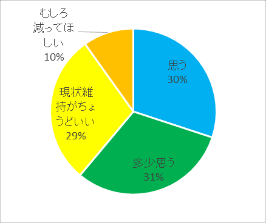
**Рисунок 109: Перспективы будущего населения по возрасту деятельности**

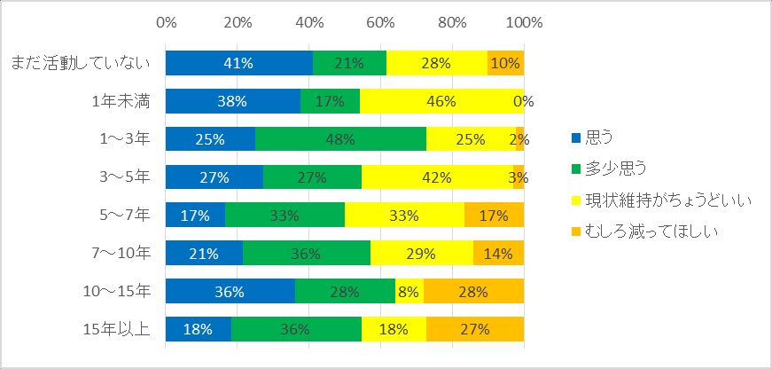
**Рисунок 110: Отношения между гордостью, которую я люблю, и восприятием населения.**

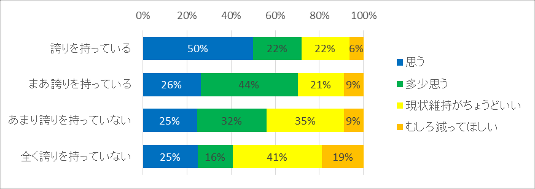
**Рисунок 111: Перспективы по регионам относительно того, должно ли население в круге увеличиваться**

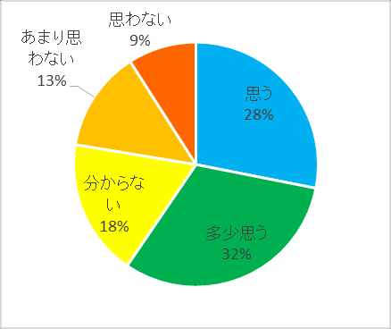
**Рисунок 112: Мнения о том, должно ли быть больше женщин в кругу**

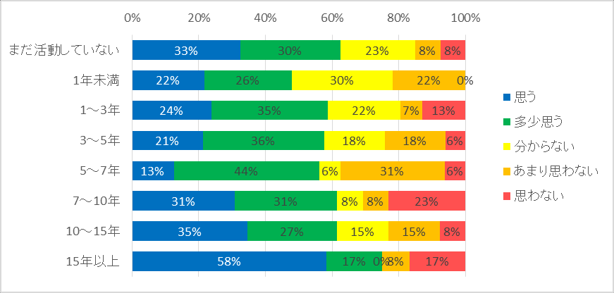
**Рисунок 113: Восприятие участия женщин в круге по продолжительности деятельности**

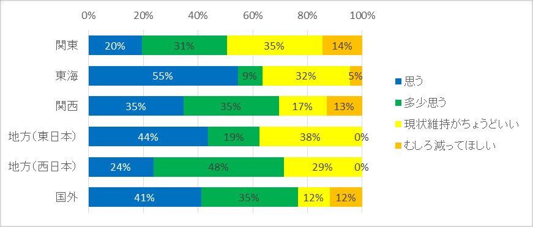
**Рисунок 114: Связь между моей гордостью за свою страсть и восприятием женщин, входящих в круг**

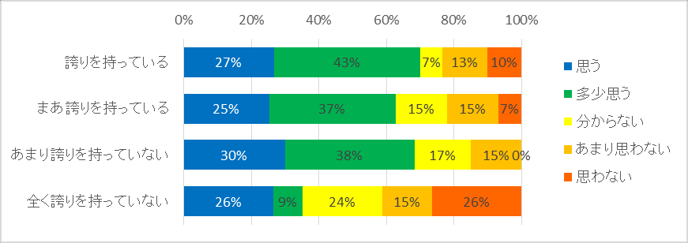
**Рисунок 115: Связь между браком и восприятием женщин, вступающих в круг**

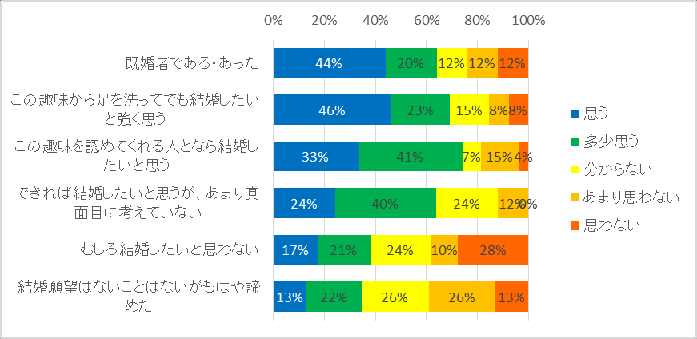
**Рисунок 116: Восприятие вступления женщины, по предыдущему опыту отношений**

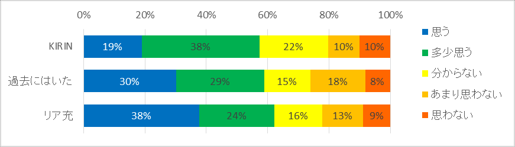
## Да, куколка, свяжите меня, отложите, ребята, подождите, пока я не получу свое мнение.

На рисунке 117 показано, что 216 действительных респондентов куклы связали меня с моей точкой зрения. Утвержденный ответ на «лайк» составляет 61%; если включить «заинтересованный, но дистанционный», 74% имеют хорошее впечатление.

На рисунке 118 показаны мнения 210 действительных респондентов о парне Хашимото. Положительный ответ на «лайк» — утвердительный, 45 процентов; отрицательный ответ на «лайк» — 30 процентов. Кроме того, 12% людей, которые не знают о парнях Хашимото.

На рисунке 119 показаны мнения 212 действительных респондентов на одноглазой стороне сумерек. Отрицательный ответ на «не нравится» был в пользу 45 процентов; положительный ответ на «нравится» составлял 39 процентов.

В ответ на эти вопросы девять женщин-респондентов ответили: «Мне нравится» 11 процентов, «Мне нравится» 44 процента, «Я не знаю» 11 процентов, «Мне не нравится» 11 процентов, «Мне не нравится» 11 процентов, «Мне не нравится» 11 процентов, «Мне не нравится» 33 процента; «Мне нравится» 11 процентов, «Мне нравится» 11 процентов, «Мне нравится» 11 процентов, «Мне нравится» 11 процентов, «Мне не нравится» 11 процентов, «Мне не нравится» 22 процента, «Мне не нравится» 33 процента, «Мне не нравится» 11 процентов. В целом, женщины чаще, чем мужчины, дают отрицательные ответы.

Кроме того, по данным региона, доля кукол, на которые я даю положительные ответы (включая «самостоятельное держание дистанции»), составляет около 70% в Японии и более 90% за рубежом. То же самое относится и к Хашимото, который, должно быть, ответил примерно на 40 процентов в Японии и примерно на 25 процентов отрицательно; и за рубежом, который, должно быть, ответил на 70 процентов, что указывает на то, что они более приемлемы за рубежом, чем в Японии. Тенденция одноглазых женщин менее различна дома и за рубежом.

На рисунке 120 показана связь между куклой и моим взглядом на парня с моста. Ответ на «нравится» кукле — 50% на «нравится» и 32% на «нравится» среди людей, которых я пытаюсь достать. С другой стороны, даже если я положительный ответ кукле, есть отрицательный ответ от 10 до 20% людей на мосту.

Диаграмма 121 показывает, как я играю в куклы. Знаешь, чем дольше ты активен, тем выше процент куклы, которая держит меня в минусе. В частности, для лиц старше 15 лет сумма «не нравится» превышает сумму «нравится».

Рисунок 122 показывает, что я горжусь тем, как мне это нравится и как я себя чувствую. Чем больше вы отвечаете гордым, тем больше вы склонны отвечать кукле, тем больше вы отвечаете мне.

**Рисунок 117: Да, кукла связывает меня с моим мнением.**

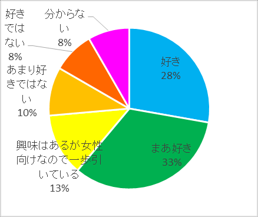
**Рисунок 118: Перспективы мальчиков Хашимото**

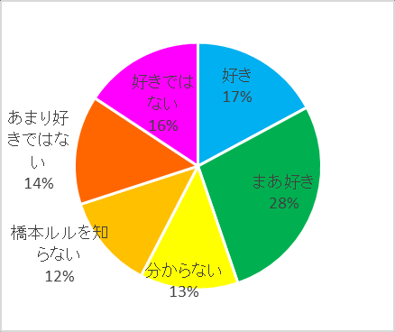
**Рисунок 119: Я выскажу свое мнение на секунду.**

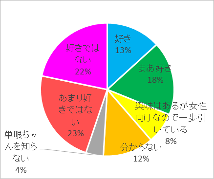
**Рисунок 120: Для куклы, я пытаюсь рассказать вам, что я чувствую к этому парню.**

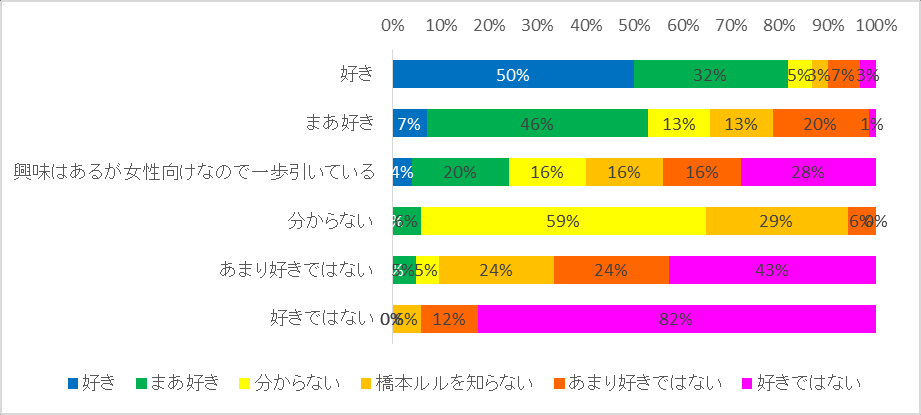
**Рисунок 121: Куклы по годам активности, и я уверен, что нет.**

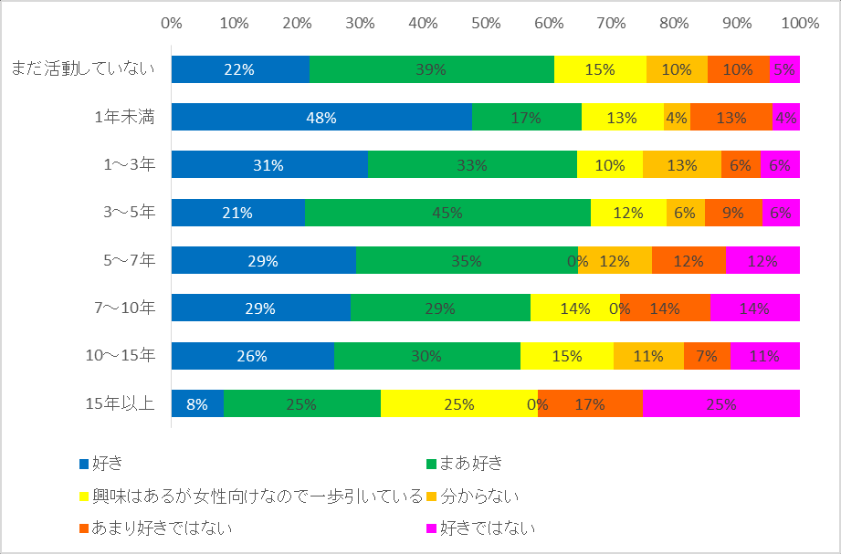
**Рисунок 122: Подтолкните меня к гордости, которая мне нравится, кукле против моего восприятия**

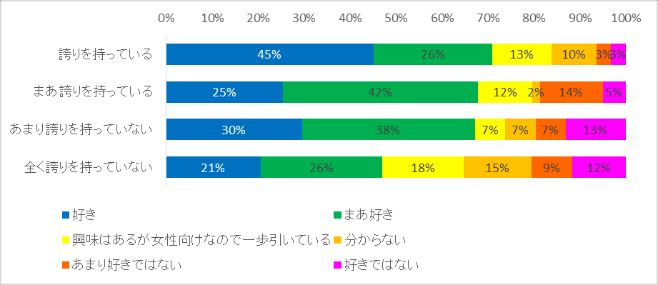
## Ты мной гордишься?

Рисунок 123 Операторы, показывающие 160 достоверных мнений респондентов о том, гордятся ли они моим хобби. Результат - почти половина. Разницы между продолжительностью деятельности нет. (Если кто-то внимательно прочитал это, то следует отметить, что я использовал ответ на этот вопрос в своем различном анализе. Причина этого в том, что ответы почти справедливо делятся на четыре равных, и я нахожу, что они часто прекрасно релевантны во всех вопросах.

На рисунке 124 представлено мнение активистов по регионам. Зарубежные страны должны были ответить на большинство, почти 80% утвердительных ответов. Далее, Кансай, должно быть больше ответов, чем отрицательных. В Кандонге, Донхае и других местах (Западная Япония) должен быть отрицательный ответ. На местном уровне (Восточная Япония) отрицательный ответ составляет 70 процентов.

На рисунке 125 показана эта взаимосвязь по продолжительности деятельности, но не было обнаружено явной зависимости. Однако, как показано на рисунке, основанный на возрасте опрос ответа на вопрос показывает, что старший склонен им гордиться.

**Рисунок 123: Есть ли у активиста чувство гордости, пытаясь произвести на меня впечатление?**

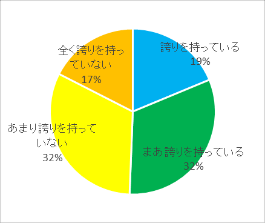
**Рисунок 124: Я горжусь своей страстью к региону.**

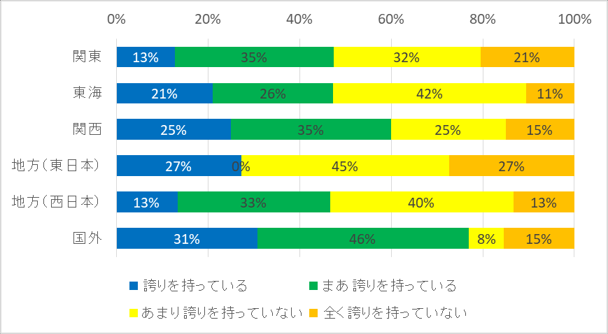
**Рисунок 125: Степень гордости, которой я горжусь своими годами деятельности**

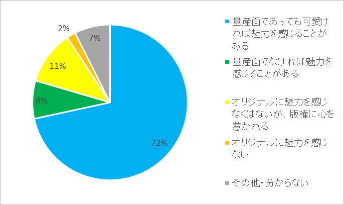
**Рисунок 126: Возрастная гордость за меня**

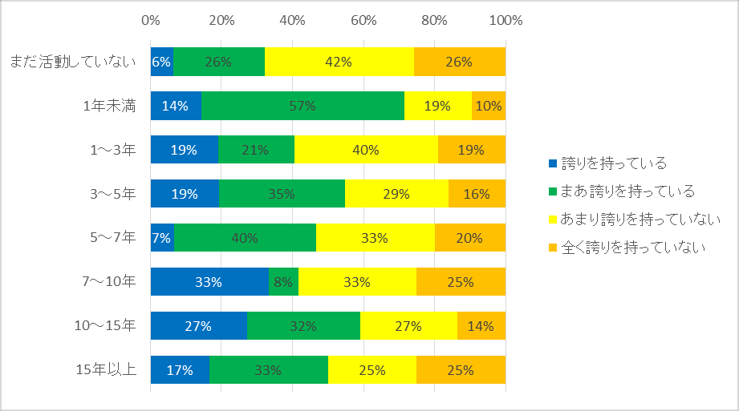
## 36. Взгляды на оригинальное лицо и лицо, защищенное авторским правом

На рисунке 127 показаны взгляды 199 эффективных респондентов на оригинальные и защищенные авторским правом поверхности. «Даже если речь идет об объеме, то он является наиболее привлекательным, 72 процента; если речь идет не о объеме», 8 процентов; и «не столь привлекательным, как оригинал, но привлекаемым ролью авторского права», 11 процентов. Это всего 2%. Особой разницы между продолжительностью деятельности нет.

**Рисунок 127: Перспективы авторского права**

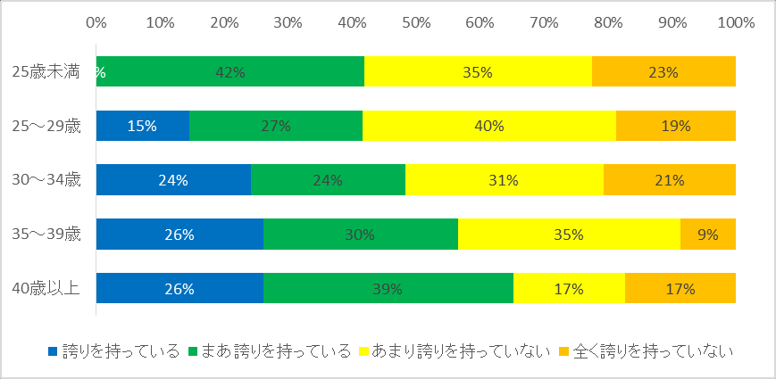
## Да, косплей и я разные.

На рисунке 128 показано, что 200 эффективных респондентов выбрали ответ на разницу между косплеем и мной из трех категорий «ингибитивного/анонимного» персонажа. Доля «скрытых/анонимных актеров» и «регенеративных ролей» одинакова — 38 процентов; доля людей, выбирающих «любовь», составляет 24 процента.

На рисунке 129 показаны ответы по схеме активности. И из тех, кто решил «активировать или выключить и носить меня каким-то образом», 48% выбрали «ролевую регенерацию». Число «специалистов по фотографии и поддержке» составляет 35%. С другой стороны, только 24% тех, кто «в основном носит одежду в одиночку», и только 9% тех, кто «еще не активен», выбирают; доля тех, кто выбирает «любовь», составляет 44% и 33% соответственно.

Кроме того, по регионам в Японии мало региональных различий; однако доля иностранных кандидатов, выбирающих «повторяемость ролей», очень высока — более 70 процентов.

Этот вопрос можно свободно заполнить в «другом», и ответы описаны ниже следующим образом: нет различий (только разные наборы реквизитов) 3 голоса; используются ли их лица в качестве частей; повторяются ли они на фотографиях или во время косметики, или на постоянной основе; разница между ними не является значимой разницей между мной и косплейным расширением; лицо сформировано; и место сознания.

**Рисунок 128: Идея косплея и то, как я отличаюсь.**

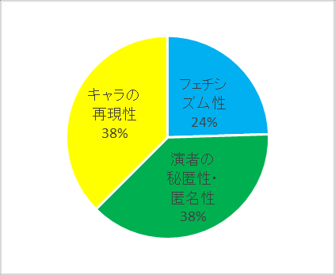
**Рисунок 129: Вид косплея и меня по виду деятельности**

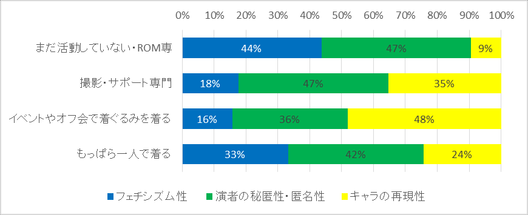
## 38. намерение Су Чжи

На рисунке 130 показаны намерения 197 действительных респондентов, включая «неизвестных», в отношении Сусу. «Нет интереса» составляет 26 процентов, «нет интереса» — 12 процентов, а «нет интереса» — 41 процент. С другой стороны, фраза «если позволяют условия, вы хотите участвовать в так называемых так называемых «» составляет 24 процента, фраза «если позволяют условия, хотели бы быть так называемыми» составляет 11 процентов, фраза «сейчас считается так называемым так называемым» составляет 4 процента, и она активна с так называемыми так называемыми так называемыми «так называемыми» составляет 39 процентов. Кроме того, 12 процентов тех, кто уже находится в процессе этого, на самом деле положительно относятся к себе.

На рисунке 131 показаны ответы по годам деятельности. В целом продолжительность деятельности показывает схожие характеристики, но только среди лиц старше 15 лет «нет интереса» составляет 67 процентов, большинство.

На рисунке 132 представлены ответы по регионам. В Восточном круге очень много людей, которые активно интересуются Су Чжи, 23 процента из которых на самом деле делают это, и 85 процентов из тех, кто включен в этот раздел, проявляют желание сделать это.

**Рисунок 130: намерение Су Чжи**

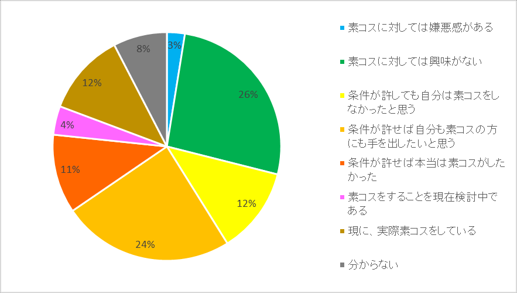
**Рисунок 131: Намерения изменить продолжительность деятельности**

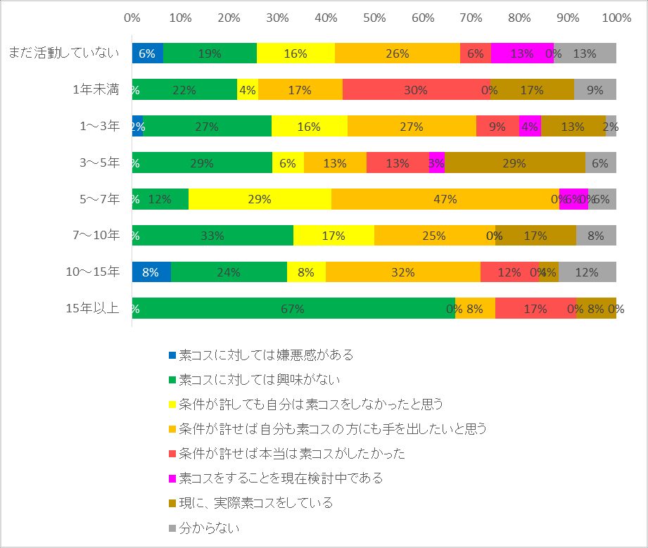
**Рисунок 132: Намерения по регионам**

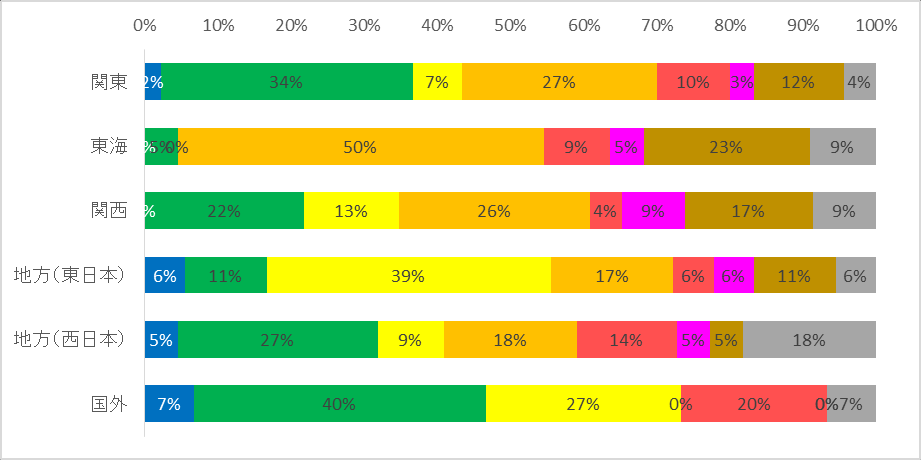
## 39.Идея вернуться к себе

На рисунке 133 показано, что 127 респондентов были моей идеей поиска быстрого и эффективного ответа. И самое главное, я собираюсь делать это все время, я собираюсь делать это все время, я собираюсь делать это все время, я собираюсь делать это на 40 процентов. «В определенном возрасте я собираюсь уронить его с определенного возраста, я собираюсь уронить его до 30 процентов, и в определенном возрасте я собираюсь просто уронить его» до 9 процентов. Ответ на вопрос «даже не рассматривать» составил 21 процент.

Рисунок 134 показывает мне возрастную группу, ищущую быстрых фиксаторов, чтобы отступить. Среди 25-летних «я собираюсь делать то, что хочу, чтобы дойти до предела» и «я даже не хочу об этом думать» примерно равномерно сбалансированы друг с другом. В возрасте 25-29 лет, например, в определенном возрасте, в определенном возрасте, в определенном возрасте, в определенном возрасте, в определенном возрасте, в определенном возрасте, в определенном возрасте, в определенном возрасте, в определенном возрасте, в определенном возрасте и в определенном возрасте, в определенном возрасте и в определенном возрасте, в определенном возрасте и в определенном возрасте, в течение определенного периода времени, в течение определенного периода времени, в течение определенного периода времени, в течение определенного периода времени, в течение периода времени, в течение периода времени, в течение периода времени, в течение периода времени, в течение периода времени, в течение периода времени, в течение периода времени, в течение периода времени, в течение периода времени, в течение определенного периода времени, в течение периода более 40 лет, в течение 72 процентов, в течение определенного периода времени, в течение определенного периода времени, в течение определенного периода времени, в течение определенного периода времени, в течение определенного периода времени, в течение определенного периода времени, в течение более чем 40 лет.

На рисунке 135 показана связь между мной и ответом на вопрос. Среди респондентов, выбравших «чистую фотографию» и «с населением в целом», «всегда буду делать то, что говорю, чтобы найти быстрое решение до предела». Среди респондентов, выбравших «взрослые/любящие и т.д.», фраза «к определенному возрасту и т.д., будет отозвана от меня в поисках быстрой идентификации» и фраза «будет использоваться в моем поиске быстрых исправлений до предела». Среди респондентов, выбравших «разговаривать со сверстниками», «в определенном возрасте и т.д., меня отвлечет поиск быстрого удостоверения личности».

Рисунок 136 показывает, связан ли вопрос «инициация моего хобби, есть ли разница в восприятии уровня веселья/счастья» с идеей ухода. Ответ на вопрос «счастливее/веселее, чем я думал» подразумевает, что 31% тех, кто отступил от меня, чтобы найти быстрое удостоверение личности, и 63% тех, кто выбрал «не так счастлив/весел, как я думал». Чем больше я чувствую, что пытаюсь быть веселой и счастливой, тем больше я не пытаюсь уйти от себя.

На рисунке 137 показано, горжусь ли я своим хобби и ответом на этот вопрос. Из людей, которыми я люблю гордиться, «я всегда буду тем, кто быстро достигнет предела» составляет 57 процентов; чем меньше я горжусь, тем активнее я думаю о выходе. Из тех, кто совсем не гордится, только 26 процентов будут делать то, что я пытаюсь найти, и 63 процента будут «к определенному возрасту, например» и «к определенному возрасту, например».

**Рисунок 133: Я думаю, что я ищу быстрый старт, чтобы отступить.**

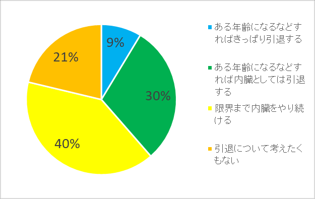
**Рисунок 134: Возрастные размышления о регрессии**

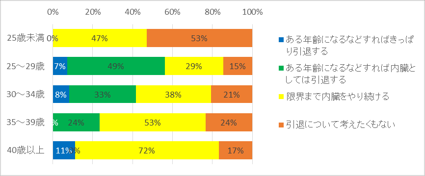
**Рисунок 135: Регрессивное мышление в поле очарования**

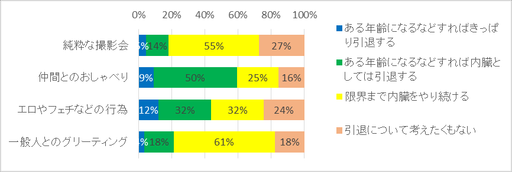
**Рисунок 136: Подтолкните меня к точке, где я пытаюсь отодвинуться вперед и назад моего веселого корабля.**

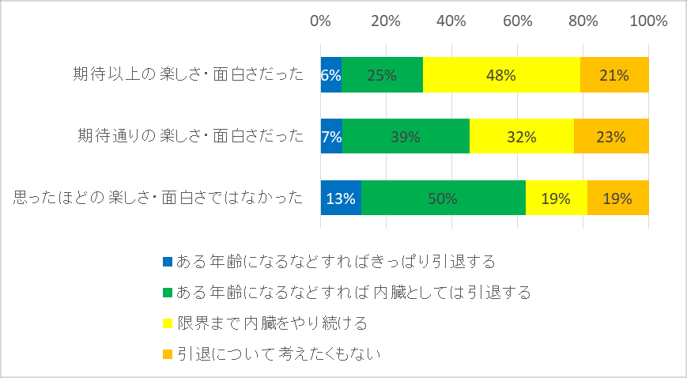
**Рисунок 137: Я горжусь тем, что мне нравится, и тем, что я думаю об отступлении.**

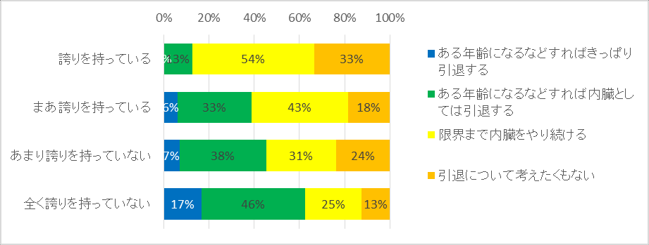
## Идея о том, не интересуюсь ли я чем-то еще, должна быть распространена.

На рисунке 138 показаны ответы 216 эффективных респондентов, в том числе «я не знаю», на «должен ли быть интерес к кигуруми». Если я единственный, кто интересуется мной, я думаю, что должно быть что-то, что не интересует меня. «Я думаю, что лучше быть единственным, кто заинтересован во мне, кто не заинтересован во мне, кто не заинтересован во мне», и большинство людей предлагают иметь интерес, который не заинтересован во мне. С другой стороны, звук «даже если я единственный, кто интересуется мной» составляет 20 процентов.

На рисунке 139 показаны ответы по годам деятельности. До 15 лет спустя деятельность в основном была одного возраста; однако, никто в 15 лет или более не выбрал «даже если это был только я, кто хотел принять мой интерес»; и «Я думаю, что это был я, кто взял интерес, отличный от моего» к большинству, и все предложили иметь интерес, отличный от меня.

**Рисунок 138: Должен ли я также иметь мнение о том, интересуюсь ли я мной?**

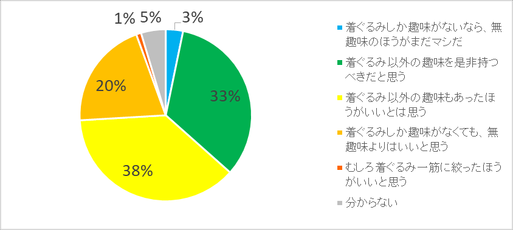
**Рисунок 139: Мнение о том, следует ли, исходя из трудового стажа, давать и мне как аутсайдеру.**

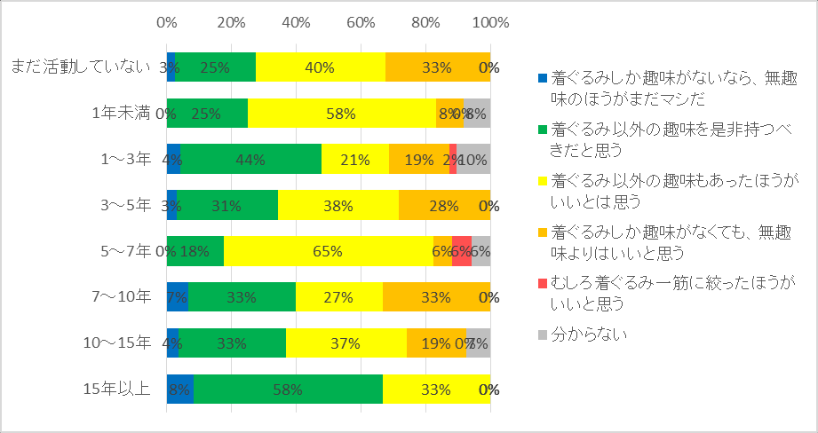
## 41 Я пытаюсь начать свое хобби.

На рисунке 140 показано число активных респондентов в 174, которые сказали: «Это отличается от уровня удовольствия / интереса, которым я действительно наслаждался, когда я действительно начал?» И 59% из них сказали: "Счастливее, чем я думал". "То же" - 30%, а "не так счастлив/благоприятен" - 11%.

На рисунке 141 показана связь между мной и ответом на вопрос. Семьдесят семь процентов респондентов, которые выбрали «средний человек озеленение», ответили «лучше, чем ожидалось». Чуть менее 60 процентов респондентов выбирают «чистые фотоярмарки», «акты взрослых/любителей и т. д.»; 49 процентов выбирают «чат со сверстниками».

На рисунке 142 показано, горжусь ли я своим хобби и ответом на вопрос. Чем больше я чувствую себя счастливой и веселой, чем я думаю, тем больше я горжусь этим. Восемьдесят три процента тех, кто ответил «с гордостью», ответили «лучше, чем они думали», и только 27 процентов тех, кто ответил «лучше, чем они думали», ответили «лучше, чем они думали», и 54 процента тех, кто ответил «лучше, чем они думали».

На рисунке 143 показаны ответы по регионам. По большому счету, 50-60 процентов регионов ответили «счастливее, чем я думал»; но местный (Восточная Япония) отрицательный ответ был немного очевиден, и только 33 процента выбрали «лучше, чем я думал».

**Фиг. 140 Активисты поворачивают меня и делают счастливым/радостным в первом и втором.**

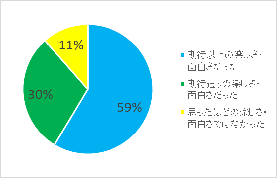
**Рисунок 141: Я пытаюсь соединить свои прелести с трафиком на уровне удовольствия и процента.**

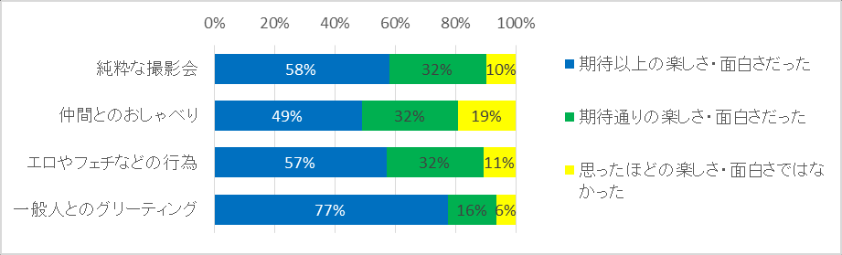
**Рисунок 142: Для меня гордость, которую я люблю, связана с уровнем удовольствия/радости.**

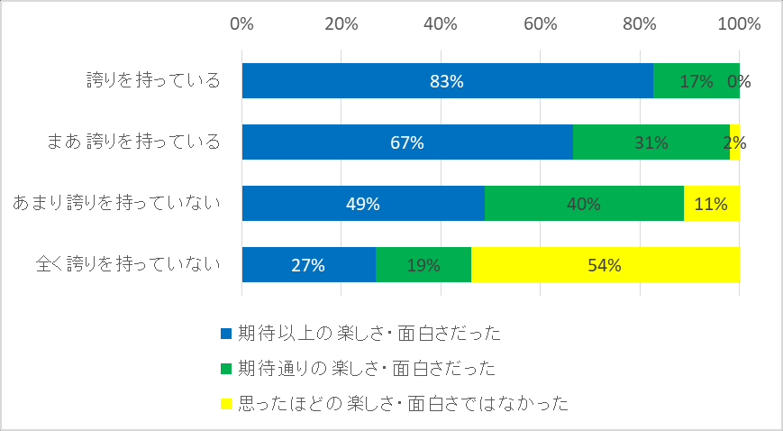
**Рисунок 143: Различия в уровне счастья/интересов активистов по регионам**

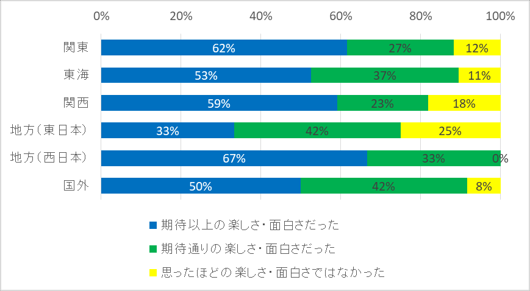
## Стыдно за озеленение сенсора.

На рисунке 144 показано 145 ответов на вопрос «Стыдно ли находиться перед людьми в зелени» как эффективный ответ на мое быстрое исправление. Пятьдесят девять процентов респондентов ответили «со стыдом» и «с меньшим стыдом» с 31 процентом «без стыда вообще» и большинством со стыдом. Ответ на «нет озеленения» составил 10%.

Рисунок 145 показывает, есть ли связь между тем, чтобы гордиться мной и стыдиться. Чем больше ты отворачиваешься от меня, тем больше я горжусь, тем меньше мне стыдно в зелени. Сорок шесть процентов тех, кто ответил, «будьте горды», и 52 процента тех, кто ответил, «будьте абсолютно бесстыдны». Более того, чем меньше они гордятся, тем меньше они могут участвовать в мероприятиях, которые являются зелеными.

Рис. 146 После исключения тех, кто не участвовал в деятельности по озеленению косплея, покажите ответы по регионам. По большому счету, около 70 процентов регионов сказали: «Маленький стыд», а на западе только 42 процента сказали: «Маленький стыд».

Ответ на этот вопрос основан на частоте участия в косплейных мероприятиях, которые могут проводиться на улицах и так далее. Семьдесят процентов тех, кто посещает по крайней мере один раз в месяц, говорят: «Нисколько не стыдно». Чем ниже частота события, тем больше «самодовольство» отвечает; около 60% из тех, кто ниже частоты в год, отвечают на «контрабанду».

На рисунке 148 показан ответ на этот вопрос по годам деятельности. Чем дольше вы становитесь, тем меньше вам стыдно. Из тех, кому не исполнилось 1 года, 93% сказали: «Маленький стыд», а 55% тех, кому за 15 лет — «Маленький стыд», «никакого стыда вообще».

Кроме того, в своем ответе на вопрос, который я просил найти в моем гламурном поле, среди тех, кто выбрал «более или менее постыдные» 30 процентов, «менее постыдные» 23 процента и «никакого стыда вообще» 47 процентов. Среди тех, кто выбирает «чистую фотографию», сумма «слишком много стыда» составляет 80%, сумма «меньше стыда» составляет всего 12%; сумма «без стыда» составляет 8%. Выбор «разговора со сверстниками» составляет 62% для 31% и «ничего не делая» 8%. Отбор «взрослые/любовники и т.д.» составил 63% на 16% и «без озеленения» 22%. Известно, что многие люди испытывают чувство стыда за исключением выбора «с населением в целом».

**Рисунок 144: Стыдно за озеленение сенсора.**

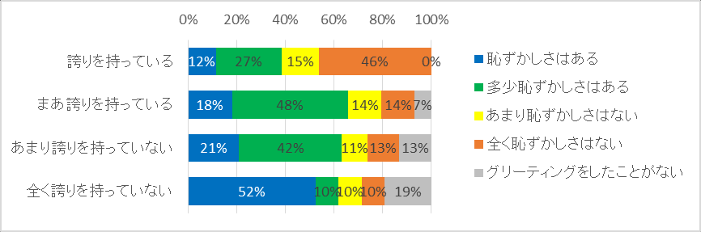
**Рисунок 145: Я горжусь тем, что мне нравится, и мне стыдно.**

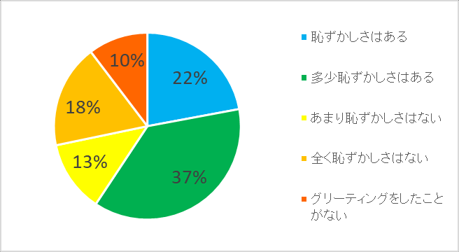
**Рисунок 146: Реакция на растущий стыд по регионам**

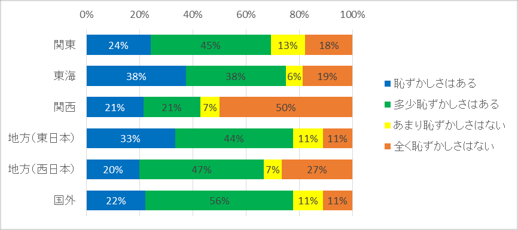
**Рисунок 147: Ответы на растущий стыд по частоте участия в открытых мероприятиях**

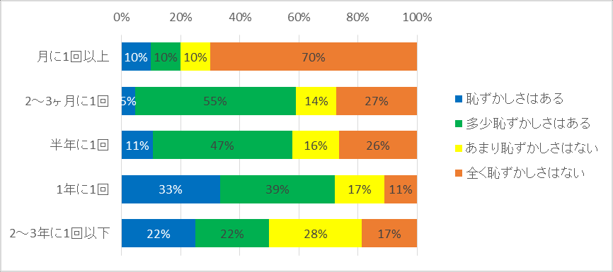
**Рисунок 148: Ответы на растущий стыд по продолжительности деятельности**

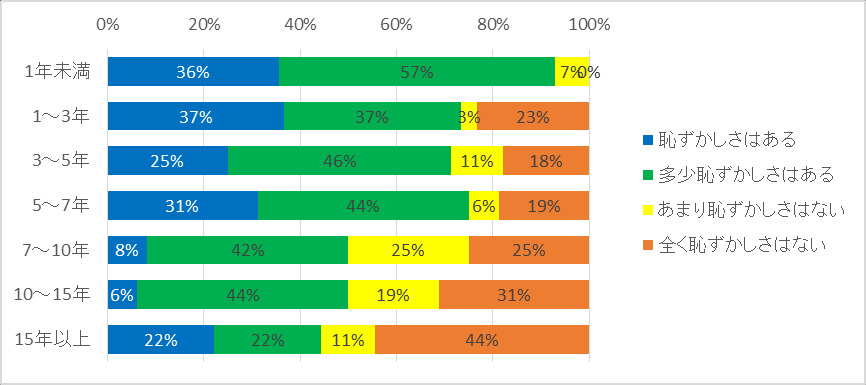
## 43 До такой степени, что я люблю социальное признание.

На рисунке 149 показана реакция 197 эффективных респондентов на вопрос «Хотите ли вы заставить меня чувствовать, что я получаю больше социального признания?», «Хочу больше социального признания» составляет 15 процентов, «Хочу больше социального признания» — 23 процента, «поддержание статус-кво» — всего 44 процента, а «больше так» — 18 процентов.

На рисунке 150 показан ответ на вопрос, который я пытаюсь вам сказать. Шестьдесят пять процентов тех, кто выбрал «с населением в целом», хотели быть признанными обществом, и только 3 процента тех, кто выбрал «лучше», чем «лучше» сейчас. И 43% людей, выбравших «чистые фотоярмарки», хотели быть признанными. Однако только 24% тех, кто выбирает «разговор со своими сверстниками», хотят социального признания; только 23% тех, кто выбирает «взрослые/любящие и т. д.», хотят социального признания, а 29% считают, что «не так много сейчас» не хочет социального признания.

На рисунке 151 показан ответ на этот вопрос по годам деятельности. Несмотря на то, что постичь четкую тенденцию не представляется возможным, за 5-10 лет людей, считающих, что «лучше так сказать», немного больше, чем за другие годы.

**149: Ответчики говорят, что я люблю социальное признание.**

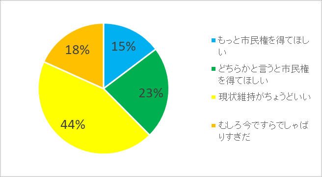
**Фиг. 150: Я пытаюсь получить социальное признание своей красоты.**

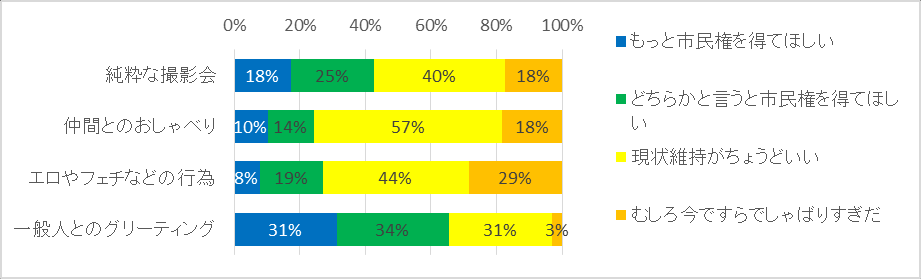
**151: Восприятие меня как поклонника социального признания, основанного на годах деятельности**

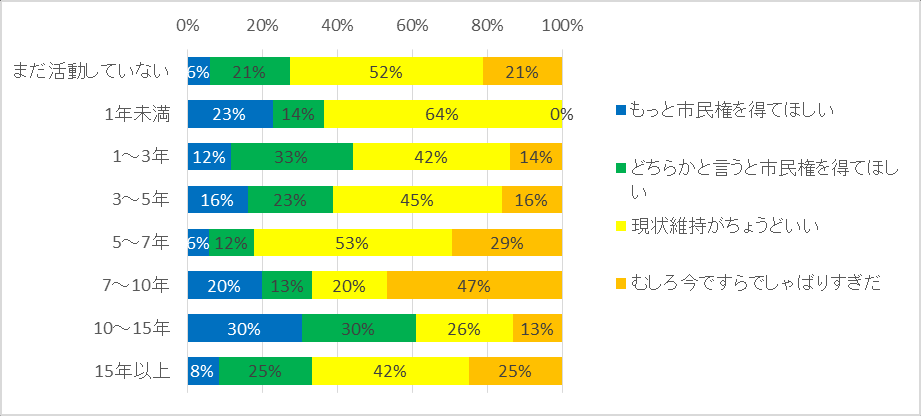
## Это меня включит?

На рисунке 152 показан ответ 214 действительных респондентов на вопрос «Будет ли это меня раздражать?» Шестьдесят девять процентов ответов «созданы», 22 процента ответов — «сколько произведено», и более 90 процентов ответов — в некоторой степени сексуальная экскреция. 8.8 Ответ действительных женщин-респондентов был таков: «производить» 25 процентов, «производить больше» 25 процентов, «не много» 13 процентов и «не производить» 38 процентов.

На рисунке 153 показан ответ, который заставляет меня разделить период пробуждения. Чем раньше ты проснешься, тем сильнее ты нападешь на меня и включишь. Восемьдесят восемь процентов тех, кто проснулся до начальной школы, ответили, что «возникает сексуальное возбуждение»; и 50 процентов тех, кто проснулся на социальной стадии, выбрали «сексуальное возбуждение».

На рисунке 154 показаны ответы по регионам. В Кансае и за рубежом ответ на «сексуальную экскрецию» был ниже — 50%. Местные (Восточная Япония) имеют самый высокий, 84% ответ раскопки "создают".

На рисунке 155 показано, горжусь ли я своим хобби и ответом на этот вопрос, но я не нахожу его явно зависимым.

На рисунке 156 показан ответ на вопрос, который я пытаюсь вам сказать. Реакция на «сексуальное возбуждение» составила 85% «действий взрослых/любовей и т.д.», 67% «чистых фотоярмарк», 59% «растущих» и 55% «разговаривающих со сверстниками».

На рисунке 157 показан ответ на вопрос, которым я должен поделиться со мной. Из тех, кто «видит в Интернете» и знает, 75 процентов выбирают «создавать сексуальное возбуждение»; а из тех, кто «видит в шоу» «видит в шоу» «знает друзей, которые делают», только около 50 процентов выбирают «создавать сексуальное возбуждение».

**Рисунок 152: Ответ на вопрос, испытываете ли вы сексуальное возбуждение.**

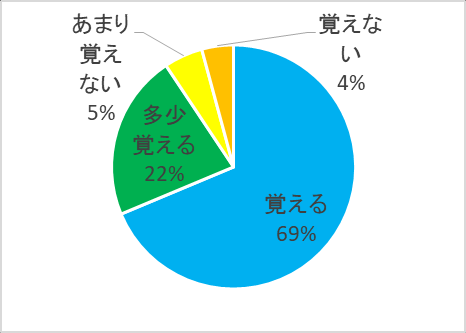
**Рисунок 153: Нажмите на меня и скажите, сексуально ли я взволнован, когда просыпаюсь.**

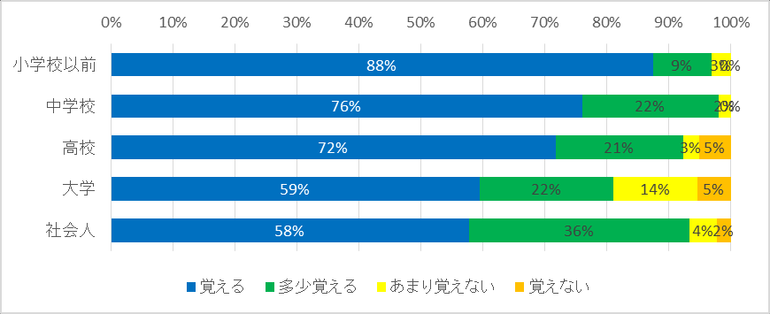
**Рисунок 154: Вы занимаетесь со мной сексом по месту?**

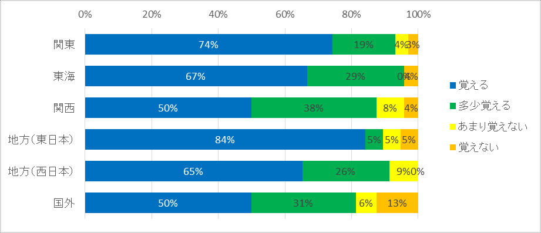
**Рисунок 155: Для меня гордость, которую я люблю, связана с тем, сексуально ли я взволнован.**

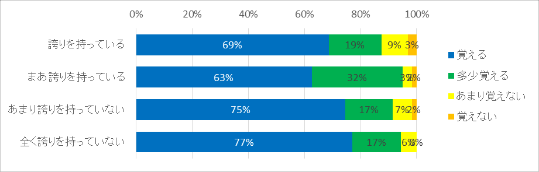
**Рисунок 156: Я собираюсь спросить, сексуально ли я взволнован своей эксцентричностью.**

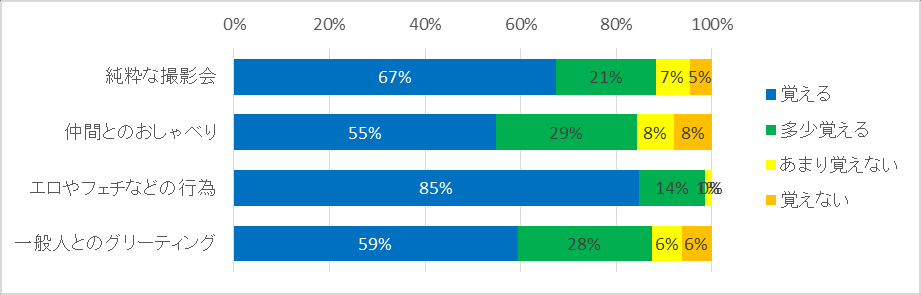
**Рисунок 157: Если вы собираетесь сказать мне, буду ли я сексуально возбужден.**

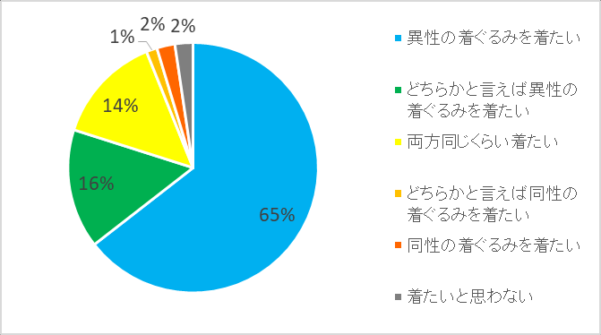
## 45 Один и тот же пол и противоположный пол сводят меня с ума. Какую сторону ты хочешь?

На рисунке 158 показан ответ 216 действительных респондентов на вопрос «Кому я хочу пойти?» Шестьдесят пять процентов ответили: «Я хочу быть геем», 16 процентов — «Я хочу быть геем», 81 процент — «Я хочу быть геем». С другой стороны, «обе хотят носить» — 14%. Ответ на вопрос о гомофобии составляет для меня 3%. Кроме того, 9 женщин ответили: «Женщины хотят заставить меня чувствовать себя виноватой» %, «Женщины хотят заставить меня чувствовать себя виноватой» 11%, «Оба хотят заниматься любовью» 11%, «Женщины хотят заниматься любовью со мной» 44%, «Женщины хотят заниматься любовью со мной» 44%.

На рисунке 159 показан ответ, который заставляет меня разделить мою шараду. И ответ на вопрос: «Я хочу быть геем, я хочу быть геем», большинство из них — люди, которые выбирают поведение взрослых/любовь, и 79% из них говорят: «Я хочу быть геем, я хочу быть геем». Во-вторых, выбор «отличительной» составлял 72 %, «говорящей» 57 % и «чистой фотографии» 56 %.

На рисунке 160 показана связь между ответом на вопрос, сексуально ли я возбужден. Чем больше ты поворачиваешься к кигуруми, тем больше ты пытаешься включить меня, тем больше ты пытаешься включить меня. Из тех, кто ответил мне и «создал» сексуальное возбуждение, 73 процента сказали, что они хотели изнасиловать меня; 56 процентов сказали, «сколько произвели»; и из людей, которые ответили «не так много произвели», что они хотели изнасиловать меня 13 процентов, а 38 процентов хотели изнасиловать меня.

**Рисунок 158: С какой стороны, по-вашему, я пройду с тем же полом и с противоположным полом?**

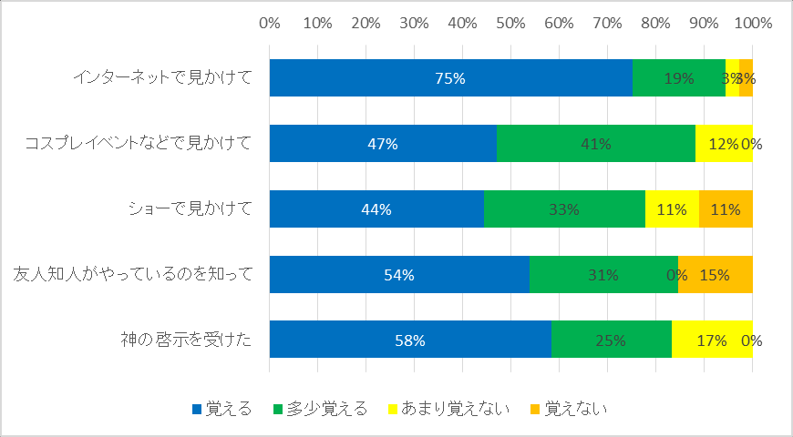
**Рисунок 159: Подтолкните меня к гей-женской стороне моего гламурного поля.**

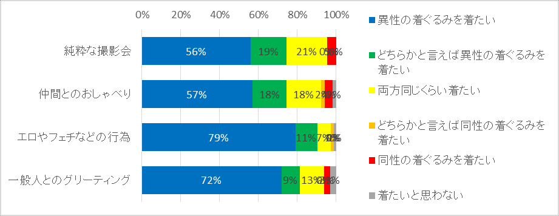
**Рисунок 160: Это о том, на кого я хочу ответить, когда я сексуально взволнован.**

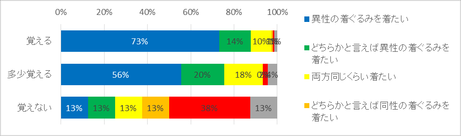
## 46. Гендер через границы.

На рисунке 161 показано, что 212 действительных респондентов сказали: "В красоте моих волос, в моем кругу мужчины часто играют девочек. Считаете ли вы, что этот пол пересекает границу? Отвечай. Термин "считается привлекательным" составляет 65 процентов, а термин "более привлекательным" - 27 процентов, и в общей сложности 92 процента считают этот пол привлекательным за пределами границ. Кроме того, 7 женщин-респондентов ответили 43 процентами ответов: «Улучшение считается привлекательным», 14 процентов ответов были «более привлекательными», 29 процентов ответов были «не очень привлекательными», а 14 процентов были «не особенно привлекательными».

На рисунке 162 показан ответ на вопрос о том, чтобы поставить меня в положение сексуального возбуждения. Из слоев, на которых «созданы» мои сексуальные раскопки, доля тех, кто выбирает гендерный трансграничный «считается привлекательным», составляет 78 процентов; из тех, кто отвечает «сколько производит», 35 процентов «считаются привлекательными», 61 процент «более привлекательными», и более мягкий ответ является самым высоким. С другой стороны, в «непоколенческих» слоях сексуальной экскреции 50 процентов ответов на гендерную трансграничность «считаются привлекательными».

На рисунке 163 показан ответ на этот вопрос, когда вы нажимаете на меня, чтобы разделить мой период пробуждения. Чем раньше они просыпаются, тем больше они склонны находить гендерную привлекательность через границы. Из «предварительных» пробуждений 84% выбрали «мыслить привлекательно»; из «социальных» пробужденных только 51% выбрали «думать привлекательно».

На рисунке 164 показано, горжусь ли я своей страстью и ответом на вопрос. Ответ на вопрос «гордости» заключается в том, что гендерная трансграничность наиболее привлекательна. Восемьдесят четыре процента тех, кто ответил на вопрос «с гордостью», считают, что гендерная трансграничность привлекательна; кроме того, менее 70 процентов тех, кто считает ее привлекательной.

На рисунке 165 показана связь между результатом и ответом на этот вопрос. Чем больше людей знают, как играть на высоких отметках, тем больше они склонны думать о гендерной привлекательности через границы.

**Рисунок 161: Меня привлекает трансграничный характер моего пола.**

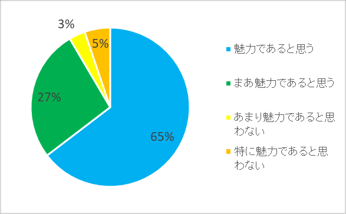
**Рисунок 162: Трансграничный гламур истерии по симметрии. Датчик.**

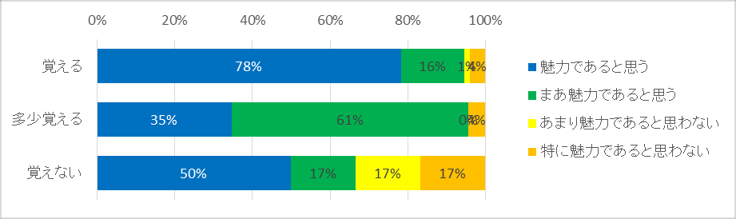
**Рисунок 163: Затягивание сексуальных трансграничных прелестей моего периода пробуждения. Датчик.**

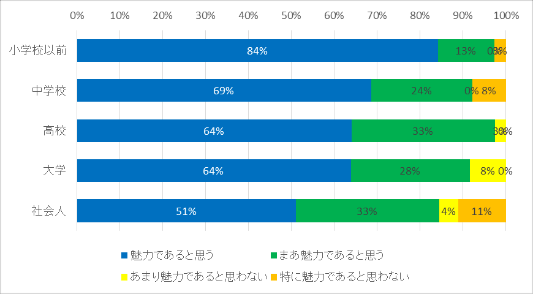
**Рисунок 164: Трансграничный гламур против моего желания гордости.**

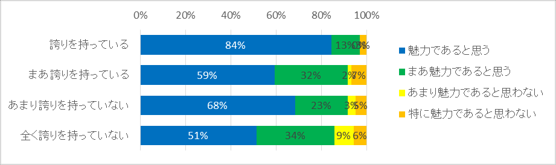
**Рисунок 165: Самооценка отношений между мной и моей любимой трансграничной харизмой**

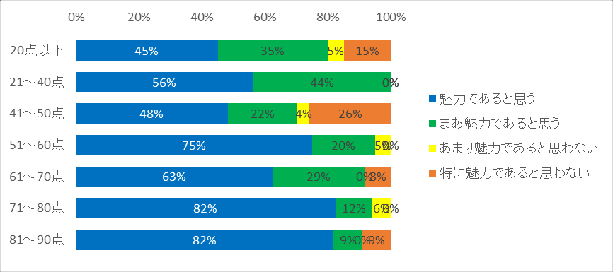
## Вопрос о моих навыках.

На рисунке 166 показан ответ 213 действительных респондентов на вопрос: «Считаете ли вы себя привлекательным, если есть девушка, которая может издавать звуки?» Пятьдесят семь процентов ответов были "считаемы привлекательными", 26 процентов - "более привлекательными", и 83 процента от общего числа респондентов высказали мнение, что было бы привлекательно иметь такую технологию.

На рисунке 167 показана связь между сексуальными раскопками и ответом на вопрос. Шестьдесят три процента тех, кто ответил мне, сказав, что мои сексуальные раскопки были «созданы», были привлекательны для девушки; и менее 50 процентов тех, кто выбрал «не производит», были «слишком много». Чем больше ты отворачиваешься от меня, тем больше ты отворачиваешься от меня, тем больше ты считаешь привлекательным сделать девичий голос.

На рисунке 168 показан ответ 183 эффективных респондентов на вопрос: «Считаете ли вы себя привлекательным, если есть парень, который может изменить свое лицо на свою волю?» Пятьдесят семь процентов ответов были «считаемы привлекательными», 32 процента ответов были «более привлекательными», а 89 процентов от общего числа высказали мнение, что было бы привлекательно иметь такую технологию.

На рисунке 169 показан ответ на вопрос о том, нужно ли подталкивать меня к сексуальному возбуждению. Шестьдесят один процент людей, которые пытались «создать» мое сексуальное раздражение, сказали: «Я думаю, что это привлекательно». И 45 процентов людей, которые пытались включить меня в "сколько придет?" Однако более 86% тех, кто «не производит» сексуальные раскопки, сказали, что это «восприимчиво привлекательно».

**Рисунок 166: Привлекательно ли иметь девушку, которая может заставить меня звучать?**

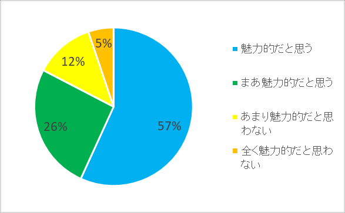
**Рисунок 167: Меня привлекает девушка, которая может сделать голос девушки. Датчик.**

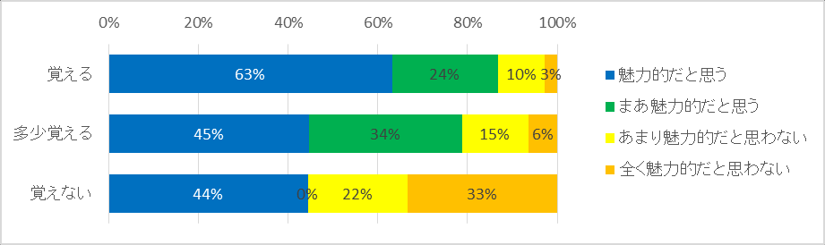
**Рисунок 168: Привлекательно ли иметь кого-то, кто может изменить мое лицо?**

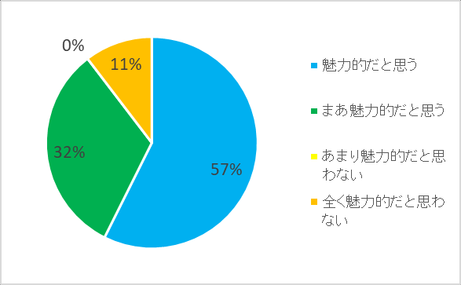
**Рисунок 169: Сексуальные пары могут изменить мое лицо и включить меня. Датчик.**

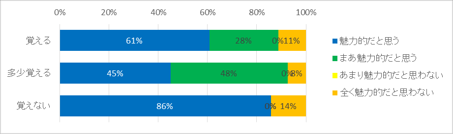
## Идея носить костюм, чтобы поддерживать связь с мужчинами.

На рисунке 170 показаны взгляды 133 человек, которых я ищу в качестве эффективного ответа на быстрое отслеживание события, на тему «Я ношу платье, которое делает меня близким с мужчинами». Опция может быть выбрана из «нежелательной близости» «степень объятий» «степень поцелуя может» «степень оргазма, например, с помощью электрического массажера или поведения рук», до «степень оргазма, такая как поведение руками», до «вставки или» шести стадий. Выбор сильнейшего «вставленного или иного» составляет 23%. Вторая, «степень кульминации от руки и т. д.», составляет 28%. Степень оргазма может быть доведена до 21%, «степень поцелуев» до 3% и «степень объятий» до 17%. «Не хочу близости», которая составляет 8 процентов, подтверждает широкое распространение взглядов.

На рисунке 171 показаны ответы по сексуальной ориентации. Бисексуалы и другие демонстрируют аналогичную тенденцию: более 60 процентов выбирают «степень оргазма от руки и т. д.», а более 30 процентов — «включены или подключены». С другой стороны, гетеросексуалы немного отрицательно относятся к интимному контакту с мужчинами, причем 15% отвечают: «Не хочу близости», а 27% — «Принятие». С другой стороны, есть 12% вариантов, которые вы можете вставить.

На рисунке 172 показана связь между гламуром и вопросом о трансграничности моего хобби. Чем привлекательнее люди считают гендер трансграничным, тем позитивнее они относятся к интимным контактам с мужчинами.

На рисунке 173 показаны ответы по регионам. Интимный контакт с мужчинами рассматривается более позитивно в известных местах, чем в городских кругах. Среди трех основных городских кругов Восточное море и Канси более пассивны, чем Гуандун. Кроме того, 30 процентов заморского населения "не заинтересованы в интимных контактах".

На рисунке 174 показаны ответы по возрасту. Чем моложе человек, тем более позитивны отношения с мужчинами. Сорок четыре процента лиц в возрасте до 25 лет считают, что «вставить можно»; в то время как только 10 процентов лиц старше 40 лет считают, что «вставить можно».

**Рисунок 170: Восприятие того, что я в состоянии быть близким с мужчиной.**

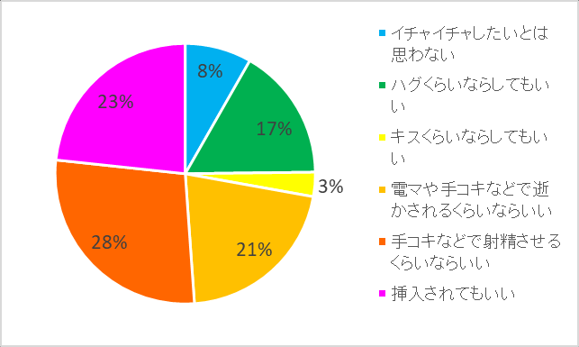
**171 Восприятие сексуальной ориентации, что они носят меня в интимных отношениях с мужчинами**

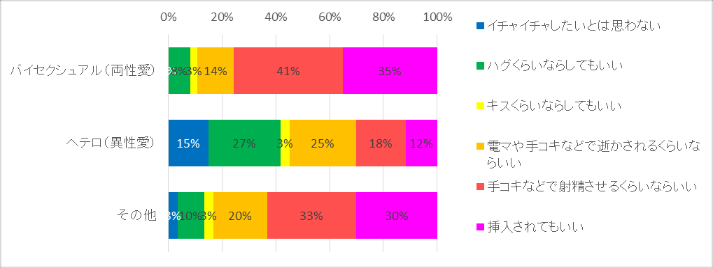
**Рисунок 172: Я пытаюсь сделать так, чтобы моя привлекательная для пола трансграничная привлекательность выглядела так, будто я ношу свое платье, чтобы сделать моего мужчину интимным.**

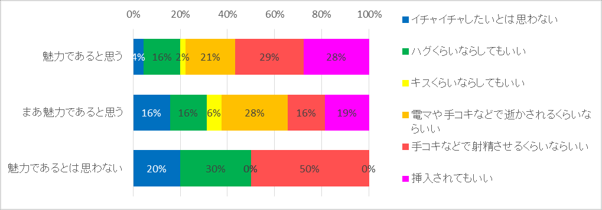
**Рисунок 173: Как вы видите себя одетым, как будто я влюблена в мужчину.**

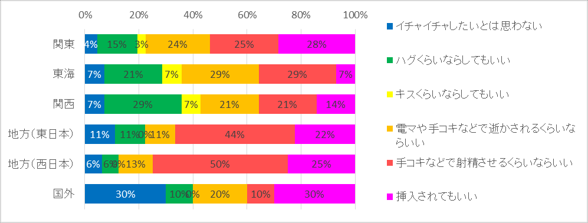
**Рисунок 174: Возрастное восприятие того, как вы одеваете меня и как вы к кигуруми относитесь.**

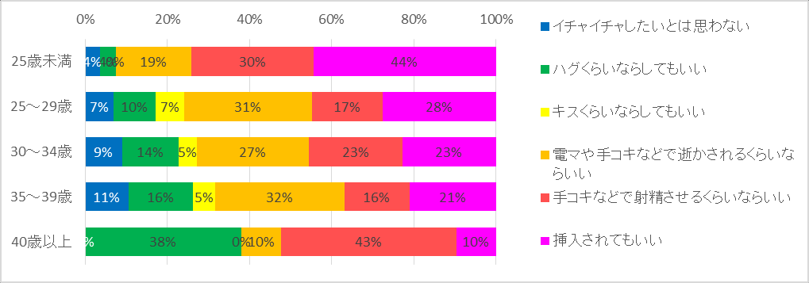
## 49.Опыт и намерения свести меня вместе.

На рисунке 175 показан ответ 174 активных активистов на вопрос «Хочешь меня поцеловать или часто целуешь?» Двадцать пять процентов ответили «не целоваться», 32 процента ответили «не целоваться», 33 процента ответили «целоваться», 10 процентов ответили «часто целоваться».

На рисунке 176 показан ответ на вопрос, горжусь ли я своим хобби. Чем больше я не хочу гордиться, тем больше я говорю: «Я не хочу, чтобы меня целовали». Однако в контексте ответа на «гордость» ответы на «не хочу целовать меня» и «часто целуйте меня» были увеличены до поляризации.

**Рисунок 175: Опыт и намерение поцеловать меня.**

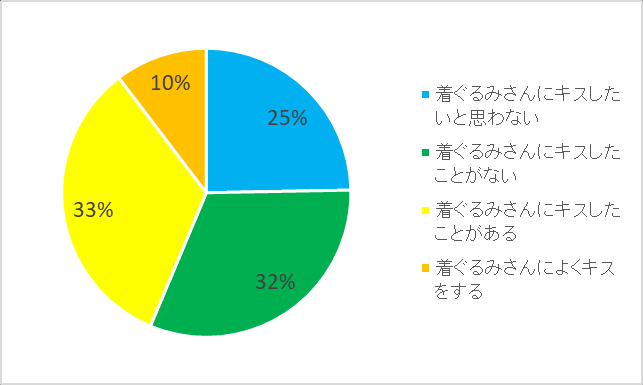
**176: Сравнивая меня со степенью гордости, которой я люблю делиться со мной, с опытом и намерениями, которые у меня были.**

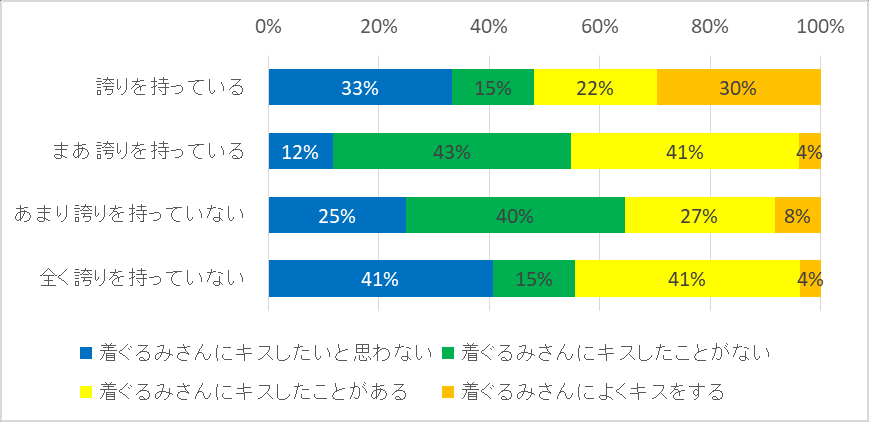
## 50. Сексуальный опыт с рук

На рисунке 177 показано, смогли ли 136 человек, которых я ищу в качестве эффективного ответа на событие быстрого движения, сказать: «Быть опытом секса с мужчиной и заниматься сексом с мужчиной». Число «делано, но не сделано» составило 9 процентов, «делано, но не сделано» 11 процентов, «делано» 49 процентов, «не сделано и не сделано» 27 процентов, «не хочет делать или хочет быть сделано» 4 процента.

В таблице 13 показана частота «действий» по сексуальной ориентации. Бисексуалы составляют около 70%, другие около 65%, даже гетеросексуалы около 50% отвечают опытом. Имеются ли существенные различия, маловероятно, но среди бисексуалов и других существует больше «обнаженных», чем «обнаженных»; среди гетеросексуалов больше «обнаженных», чем «обнаженных».

| Сексуальная ориентация | Да. | Да. |
| --- | ---: | ---: |
| бисексуал | 74 | 66 |
| Гетеро. | 45 | 49 |
| другой | 68 | 62 |

**Таблица 13: Уровень опыта занятий сексом с помощью рук по сексуальной ориентации**  
**Рисунок 177: Имею ли я какой-либо опыт поиска быстрой беговой дорожки, чтобы стать одним из моих друзей, который занимается сексом с рукой мужчины после меня?**

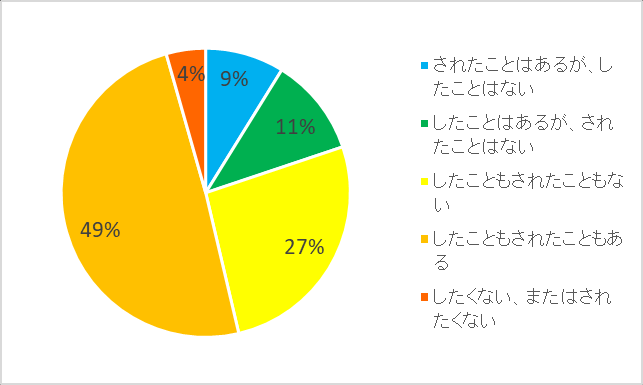
## Кто из вас горячий?

На рисунке 178 показан ответ 220 эффективных респондентов на вопрос: «Что более захватывающего в том, чтобы физически отличаться от меня?» 21%, 13%, 34%, 25%. Если ты больше гей, и я злюсь на тебя больше, чем ты на меня.

На диаграмме 179 показан ответ на вопрос о том, как разделить период пробуждения. Более половины тех, кто просыпается в колледже, более взволнованы рождением противоположного пола, но в противном случае ответ не зависит особенно от периода пробуждения.

На рисунке 180 показаны ответы по сексуальной ориентации. Среди гетеросексуалов 48% «дышат» и 49% «дышат» друг против друга. Среди бисексуалов 30% — «дыши», 60% — «укуси меня» и больше взволнованы «укуси меня». Среди прочих, только 16% людей, которые взволнованы «дыханием меня», и 81% людей, которые взволнованы «дыханием меня».

**Рисунок 178: Кто из вас больше интересуется противоположным полом, чем я?**

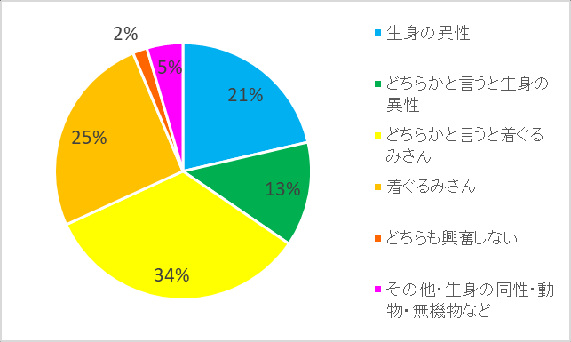
**Рисунок 179: Подтолкните меня к тому, чтобы я почувствовал противоположность периода пробуждения.**

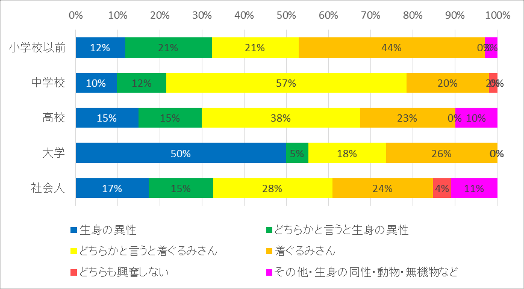
**Рисунок 180: Я в восторге от противоположного пола по сексуальной ориентации.**

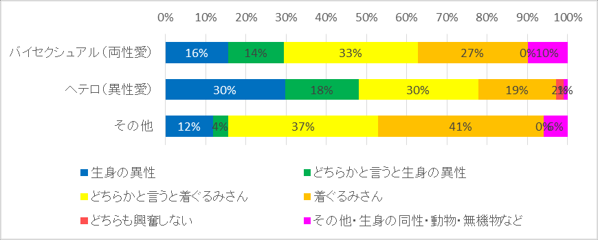
## Интересно, смешно ли, если я ищу Квики.

На рисунке 181 показан ответ 204 или 205 эффективных респондентов на вопрос «Является ли возраст (мужчина/женщина) быть (мальчик/девочка) привлекательным, когда я ищу по-быстрому?» Когда девушка спрашивает меня, мужчина я или женщина. Разница в возрасте даже больше, чем пол: 40 лет и 20 лет примерно на 20 процентов меньше, чем «крутой» ответ, и я думаю, что для меня гораздо привлекательнее искать более быстрый и молодой. Мальчик в моем случае думает, что я лучший ответ, чем женщина.

Ответ ниже, который исключает «неизвестный», дается как 4 балла, 3 балла, 2 балла, 1 балл и среднее сравнение. Средняя доля указана в таблице 14. Средний балл самый высокий, это то, что все думают, что это самое интересное для меня, когда я ищу Quiz, который является "Двадцатилетние женщины Quiz меня и я Quiz меня" за 3,53. И потом, "Двадцатилетний мужчина, как девочка, и я тот, кто пытается достать меня, и я ищу по-быстрому" за 3,50 цента. Наоборот, самый низкий из них - "40-летний мужчина, как мальчик, и я собираюсь получить меня, и я собираюсь получить меня, и это 2.19".

На рисунке 182 показан средний балл респондентов по сексуальной ориентации. Независимо от того, что я делаю, независимо от того, что я делаю, независимо от пола и возраста, которые я нахожу, во всех случаях бисексуалы дают больше очков, чем гетеросексуалы и другие. Когда я была девочкой, средние баллы, которые я давала мужчинам, чтобы найти их, были выше, чем средние баллы, которые я давала женщинам, чтобы найти их; средние баллы, которые я давала женщинам, чтобы найти их, были выше, чем средние баллы, которые я давала мужчинам, чтобы найти их. Однако, когда мальчик бьет меня, бисексуалы и гетеросексуалы дают мне более высокий средний показатель, чем мужчины, когда они называют меня.

Рисунок 183 показывает средний балл по тому, впечатлить ли мой пол через границы. И когда я ищу мужчину, независимо от того, какой у меня секс, тем больше я чувствую, что отдаю четный балл тому, кто занимается сексом по всем направлениям. С другой стороны, когда я сказал вам, что ищу женщину, разница была очень небольшой, но не думал, что привлекательный человек, который занимался сексом через границу, как правило, давал более высокую среднюю.

На рисунке 184 показан средний балл по возрасту ответчика. «Двадцатилетний мужчина» и «Двадцатилетняя женщина» и «Двадцатилетняя женщина» «Двадцатилетний мужчина» и «Двадцатилетняя женщина» «Правда я и я» и «Двадцатилетняя девочка» «чем моложе, тем выше средний показатель». С другой стороны, "40-летний мужчина, который является девочкой, и я девушка, и 40-летняя женщина, которая является девочкой, и 40-летняя женщина, которая является мальчиком, и 40-летний мужчина, который является девочкой, и 40-летний мужчина, который является девочкой, и девочка, которая является девочкой, и девочка, которая является девочкой, и девочка, которая является девочкой, и девочка, которая является девочкой, и девочка, которая является девочкой, и девочка, которая является девочкой, и девочка, которая является девочкой, и девочка, которая является девочкой, и девочка, которая является девочкой, и девочка, которая является девочкой, и девочка, которая является девочкой, и девочка, которая является девочкой, и девочка, которая является девочкой, и девочка, которая является девочкой, и девочка, которая является девочкой, и девочка, которая является девочкой, и девочка, которая является девочкой, и девочка, которая является девочкой, и девочка, которая является

Цифра 185 показывает мне, как будто я пытаюсь получить среднее значение своей эксцентричности. Наблюдая за особенностями четырех гламуров, выбирая уровень «разговора со сверстниками», я наиболее чувствителен к поиску быстрого возраста, и я думаю, что я ищу быстрый возраст 40 лет, который имеет тенденцию давать низкие средние баллы. Выбирая уровень «взрослого/любовного поведения», когда я ищу по-быстрому и когда пытаюсь сделать свой секс мужчиной, я даю отрицательный ответ, независимо от возраста, и средний балл трудно поднять.

| Положение | Средний балл |
| --- | ---: |
| 20-летний мальчик, который был девочкой и пытается меня достать. | 3.50 |
| Двадцатилетняя девочка, которая была для меня девочкой. | 3.53 |
| 40-летний мальчик, который был для меня девочкой. | 2.77 |
| 40-летняя девочка, которая была девушкой для меня. | 2.80 |
| 20-летний мужчина, он мальчик, он мальчик. | 2.68 |
| 20-летняя женщина, мальчик, который пытается заставить меня чувствовать себя лучше. | 3.18 |
| 40-летний мальчик, который был мальчиком, и он пытается заполучить меня. | 2.19 |
| 40-летняя девочка, мальчик, которая пытается меня достать. | 2.61 |

**Таблица 14: Как я пытаюсь выяснить, милая я или нет.**  
**Рисунок 181: Мило ли просить по-быстрому?**

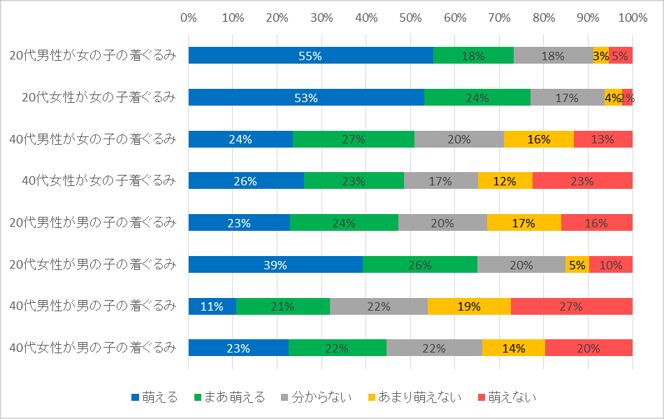
**Рисунок 182: Я пытаюсь выяснить, ищу ли я Квики по сексуальной ориентации.**

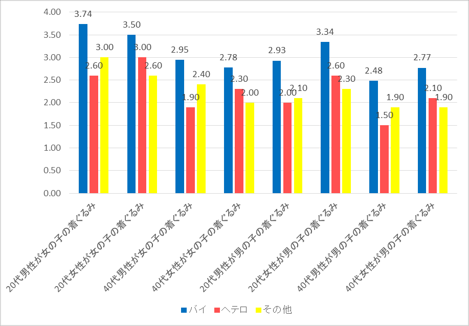
**Рисунок 183: Гендерная трансграничная харизма связана с тем, ищу ли я по-быстрому.**

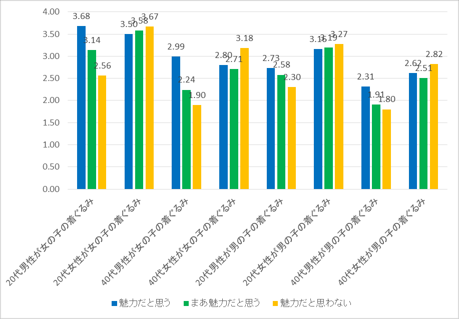
**Рисунок 184: Если я ищу средний возраст,**

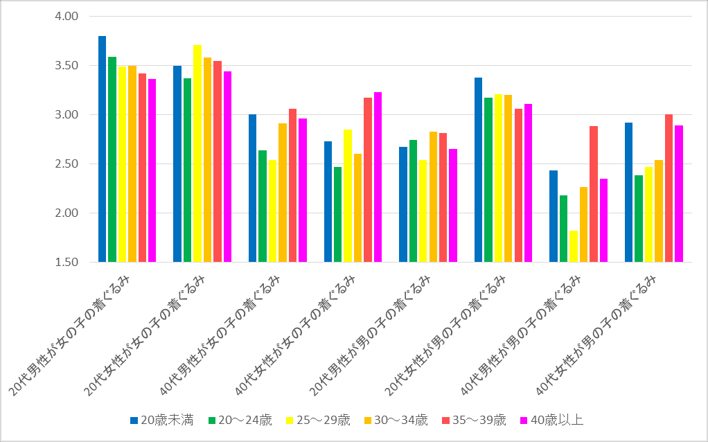
**Рисунок 185: Пытаюсь ли я сделать разницу между моими гламурными областями.**

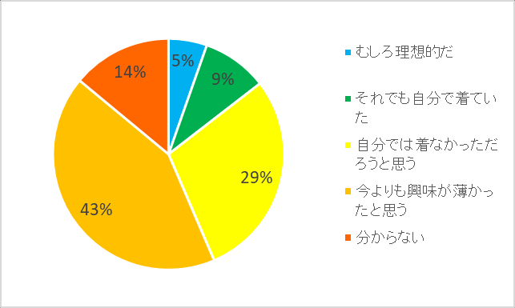
## 53 Если не будет 肌タイ

На рисунке 186 показаны мнения 186 эффективных респондентов, в том числе «неизвестных», о «если нет хада-тай». И 43% ответили, что «интерес будет меньше, чем сегодня», 29% сказали, что «скорее всего, я не буду его носить», 9% сказали «даже если я его надену», а 5% сказали «лучше».

В поперечном сечении с точки зрения су-брюк, среди тех, кто отвечает «сейчас действительно так делают», «на самом деле, было бы лучше носить» 0 процентов, «даже чтобы они носили» 18 процентов, «они, вероятно, не носили» 32 процента и «интересы были бы меньше» 41 процент. Ответ на вопрос «если позволяют условия, было бы предпочтительнее сделать это» составляет 9 процентов, 23 процента, 23 процента, 23 процента и 41 процент.

Кроме того, семь женщин, которые ответили эффективно, сказали: «Лучше было бы носить» 0%, «Я бы носила» 11%, «Я бы не носила» 22%, «интерес будет меньше» 56%.

**Рисунок 186: Без 肌タイ**

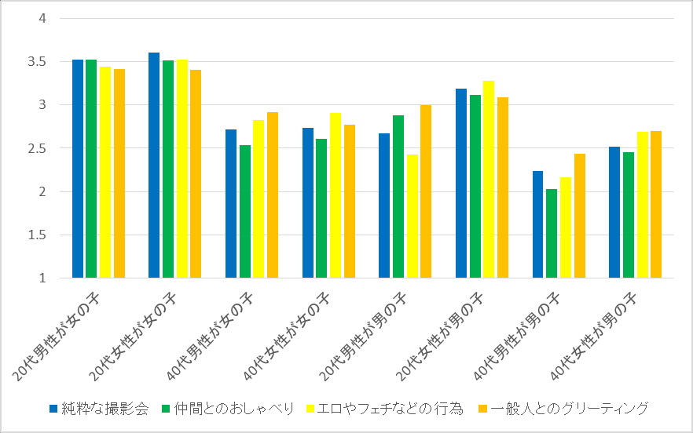
## 54. Статус чтения внутренней куклы

На рисунке 187 показан статус чтения 218 действительных респондентов для внутренней куклы. «Повторяющееся чтение» составляет 17%, «частое чтение» - 24%, «ни чтение» - 16%, «не чтение вообще» - 11% и «неизвестное» - 32%. Кроме того, внутри куклы находится красивая девушка, сделанная ею. Я появлялся на своем новом сайте как человек, и я искал специальную структуру, чтобы вписаться. Пришло время дать мне сильную структуру яичников: (i) в Арктике есть дыхательное отверстие, поэтому актер может дышать только через свои трусы, такие как платье, которое очень затрудняет дыхание; и (ii) физическое раздражение почти постоянно для актера, поэтому актер должен действовать как девушка в состоянии непрерывного сексуального удовольствия.

На рисунке 188 показаны ответы по годам деятельности. Чем дольше активность известна, тем выше частота привычного чтения внутри куклы. Кроме того, число людей, которые не знают внутреннюю куклу, составляет более 63 процентов из тех, у кого более короткие годы деятельности.

На рисунке 189 показаны реакции на период пробуждения. Чем раньше вы просыпаетесь, тем больше вы читаете внутри куклы. Семьдесят два процента тех, кто просыпался до начальной школы, раньше читали, в то время как только 26 процентов тех, кто просыпался на социальной стадии, сделали это, и 46 процентов ответили: «Не знаю внутри куклы».

На рисунке 190 показан ответ на вопрос о том, нужно ли мне сексуально возбуждаться. 52% людей, которые отвечают на «творческое» сексуальное возбуждение, привыкли к чтению; 24% людей, которые отвечают «сколько производить», привыкли к чтению. 67% тех, кто отвечает «нет» сексуальному возбуждению, не знают, что такое кукла.

На рисунке 191 показан ответ на вопрос, в который я влюблен. Люди, которые вдохновляются, чаще всего читают на 67%, за ними следуют люди, которые, как известно, видят в Интернете на 44%. 41% из тех, кто знал «видеть в косплее», не знали внутри куклы; 85% из тех, кто начал «знать друзей, которые знают» не знали внутри куклы.

**Рисунок 187: Статус чтения внутри куклы**

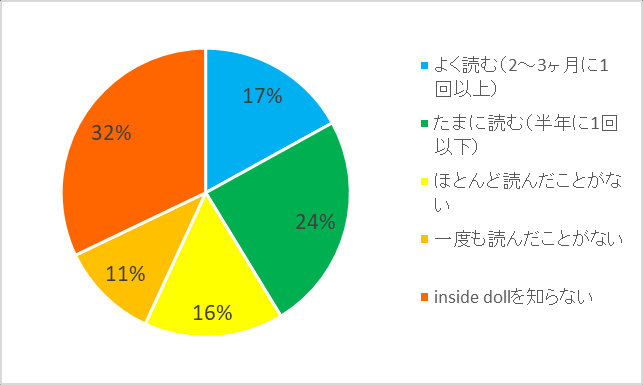
**Рисунок 188: Состояние чтения внутри куклы по годам деятельности**

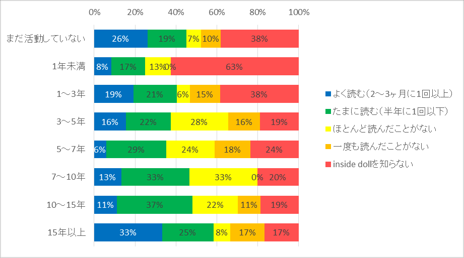
**Рисунок 189: Статус чтения внутри куклы в период пробуждения**

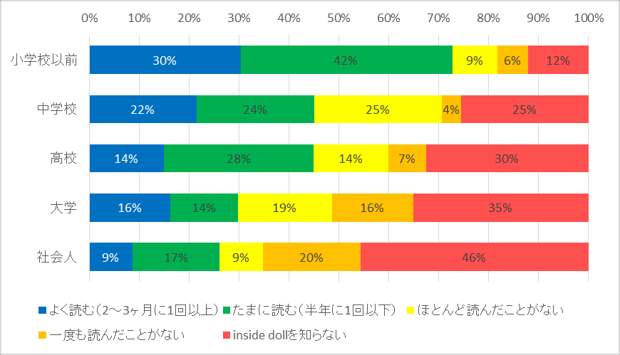
**Рисунок 190: Внутри куклы условия чтения, которые заставляют меня сексуально возбуждаться, соперничая со мной.**

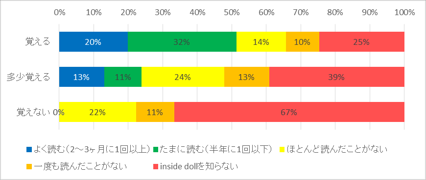
**Рисунок 191: Я люблю читать.**

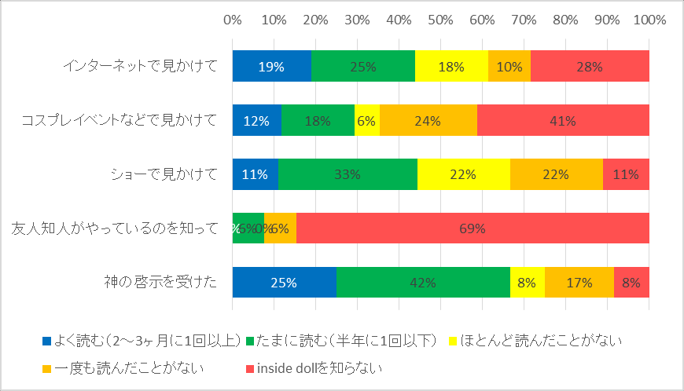
## 55. Крестьянский материал

На рисунке 192 показана частота использования респондентами мастурбационного материала. Фотографии других людей используются в качестве наиболее частого материала, 50 процентов, по крайней мере, один раз в неделю. Только 15% из тех, кто не пользовался им ни разу.

Здесь, если его определить, по крайней мере, один раз в месяц как обычное использование материала, обычное использование материала снижается до таких высот, как: «Смотря на других, носящих фотографии», 70 процентов; «Вторичное изображение для взрослых», 45 процентов; «Фотографии самостоятельно», 45 процентов; «Фотографии самостоятельно», 44 процента; «Показ себя в зеркале и т. Д.», 44 процента; «Три доллара ÁV», 42 процента; «Мысли о моем воображении», 40 процентов; «Специальный ÁV», 37 процентов; «Неорганические / животные / те же / фантазии», 26 процентов; «Фотосисы вне меня», 25 процентов; «Зверь», 17 процентов; «Пусть другие носят и смотрят» 9 процентов. В таблице 15 приведена средняя частота мастурбации (вторая/персона/месяц) респондентов по материалам.

На рисунке 193 показана средняя частота мастурбации в зависимости от того, сексуально ли я возбужден. Ответ на вопрос о материале, который я пытаюсь сделать, ответ на вопрос, что я пытаюсь «создать» сексуальное возбуждение, в два раза чаще, чем ответ на вопрос «сколько производить». С другой стороны, ответ на «не производить» заключается в том, что частота использования трех долларов в качестве материала вдвое выше, чем ответ на «создание» сексуального возбуждения меня. «Вторая взрослая диаграмма» использует почти одну и ту же частоту в разных слоях.

На рисунке 194 показана средняя частота мастурбации материалов по возрасту. Возраст зависит от «увидения чужих ухищрений моих фотографий» и «диких мне моих романов или картин»: 20-летние используют эти материалы в два раза чаще, чем 40-летние. Другие материалы вряд ли зависят от возраста.

Рисунок 195 показывает среднюю частоту мастурбации, сопоставляя меня с тем, нравится мне это или нет. Чем больше вы включаете меня, тем больше вы используете «Я в зеркале» и «Я в зеркале и наблюдаю» и «Я на картинке и так далее». В области мастурбации, в частности, «гордые» люди используют примерно в три раза чаще, чем «никакой гордости вообще». Но частота мастурбации, «увидеть, как другие люди срывают мою картину», не изменилась на всех уровнях.

На рисунке 196 показана средняя частота мастурбации различных материалов браком. С другой стороны, существует более высокая частота мастурбации на полу «не желая жениться», «кто носит зеркало и так далее», «кто носит фотографию», «кто носит фотографию». Высокая частота мастурбации в слое «Десять долларов AV», «даже если вы уходите из хобби, сильно хотите пожениться».

Рисунок 197 показывает среднюю частоту мастурбации, нажимая на меня, чтобы разделить ответы в моей шараде. Среди тех, кто мастурбирует, его чаще всего используют в качестве материала те, кто считает наиболее привлекательным быть «великим» с обычными людьми. Напротив, мастурбация «Три доллара АВ» «Специальный АВ» встречается реже, и эти материалы часто считаются наиболее привлекательными для «разговора со сверстниками» «действия взрослых/любовей и т.д.». Среди тех, кто использовал мастурбацию «Три доллара AV», больше выбрали «разговор со сверстниками» «действия, такие как взрослый / любовь», а среди тех, кто использовал «специальную AV» мастурбацию, больше выбрали «действия, такие как взрослый / любовь».

| материалы | Частота мастурбации (второй / человек / месяц) |
| --- | ---: |
| Я ношу зеркало. | 2.1 |
| Пусть другие носят и смотрят (владелец) | 0.4 |
| Фотографии себя. | 2.4 |
| На нем были фотографии. | 4.5 |
| Я расскажу тебе, что случилось. | 2.3 |
| Я не знаю. | 2.3 |
| Диаграмма взрослых | 2.8 |
| Орки. | 0.8 |
| Три доллара. | 2.3 |
| Специальный AV | 2.1 |
| Я не тот, кто захватил меня. | 1.4 |
| Неорганическое/животное/одно и то же | 1.5 |

**Таблица 15: Средняя частота мастурбации по материалу для респондентов**  
**Рисунок 192: Частота мастурбационного материала**

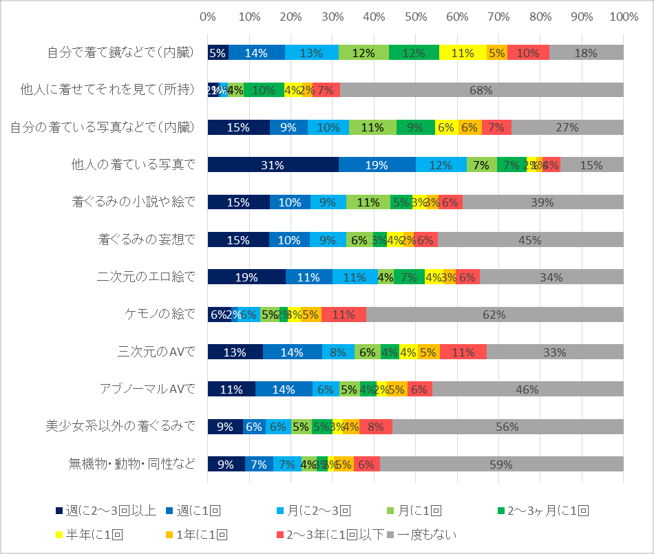
**Рисунок 193: Средняя частота мастурбации, правда это или нет, вызывает у меня сексуальное возбуждение.**

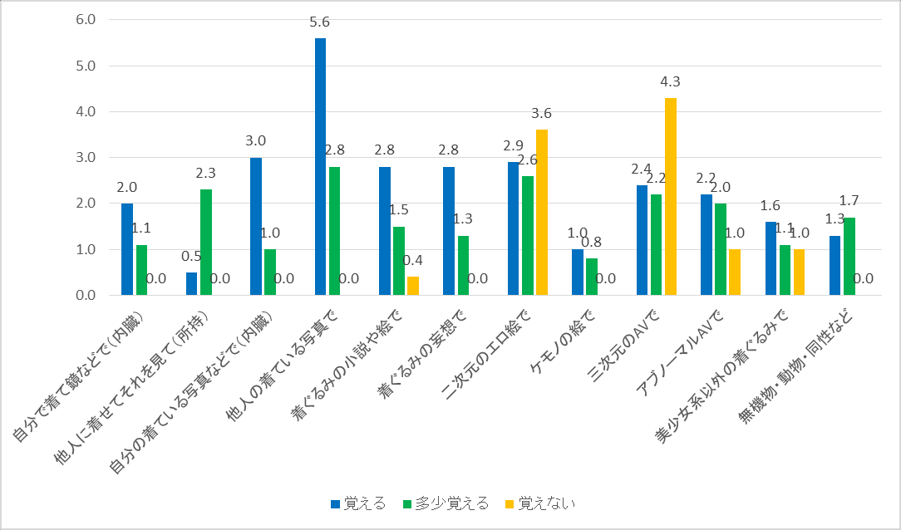
**Рисунок 194: Средняя частота мастурбации по возрасту**

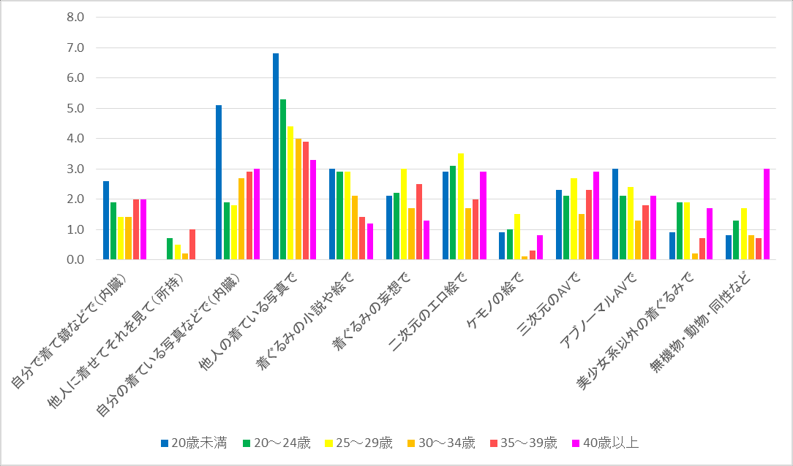
**Рисунок 195: Средняя частота мастурбации, сопоставляя меня с гордостью или нет.**

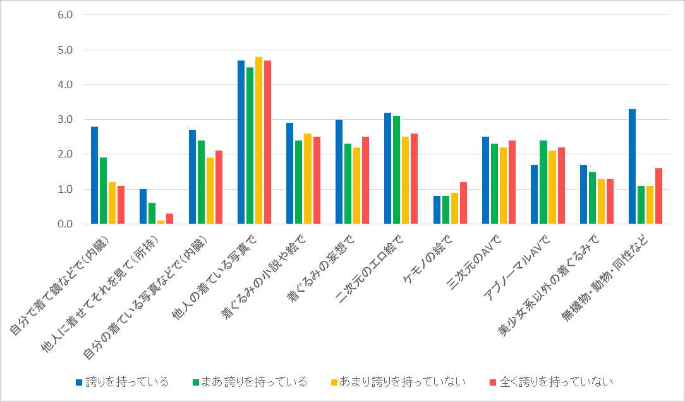
**Рисунок 196: Средняя частота мастурбации в браке**

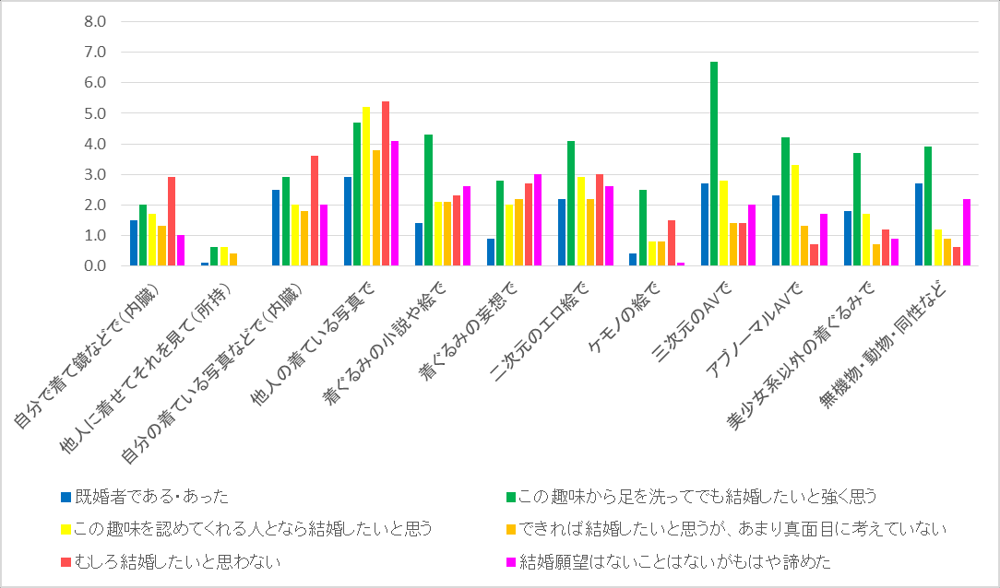
**Рисунок 197: Средняя частота мастурбации, прижимающая меня к уровню моей области очарования.**

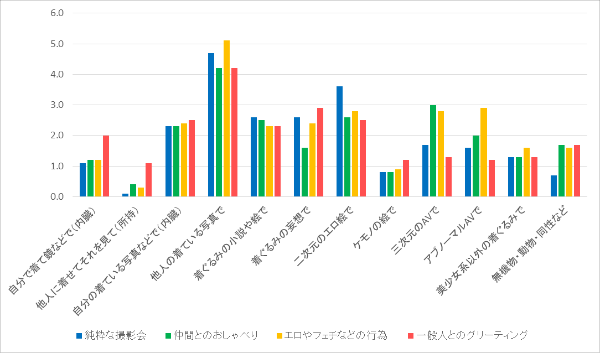
## 56. Владение электромассажными средствами

На рисунке 198 показана доступность электрических массажных средств для 177 активных респондентов. 63% ответили «да», 37% — «нет».

На рисунке 199 показано состояние электромапулятора, который использует меня для создания сексуального возбуждения. Стимуляция «создает» слои, 72% владеет; «сколько производит» слои, 50% владеет; «не производит» слои, 25% владеет.

Кроме того, в зависимости от продолжительности этой деятельности в собственности находится лишь около 50 процентов лиц в возрасте до одного года; около 60 процентов лиц в возрасте до одного или трех лет и около 70 процентов лиц в возрасте до трех или пяти лет находятся в возрасте до одного года. С точки зрения сексуальной ориентации, 80 процентов бисексуалов имеют электрические массажные машины, в то время как гетеросексуалам принадлежит около 50 процентов.

**Рисунок 198: Доступность электрических массажных машин для участников**

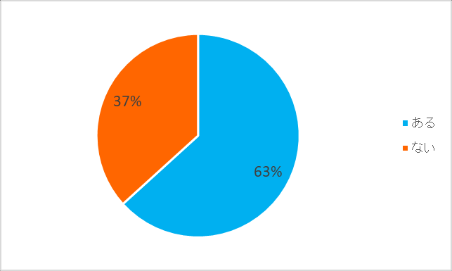
**Рисунок 199: У меня статус электрического массажиста, который вызывает у меня сексуальное возбуждение.**

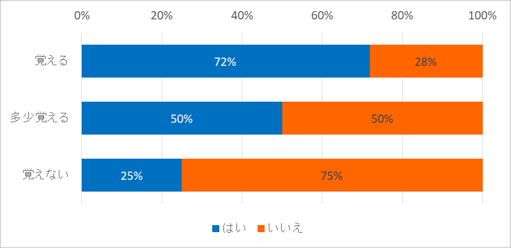
## Ты хочешь, чтобы я достиг кульминации или хочешь, чтобы я достиг кульминации?

На рисунке 200 139 человек, которых я ищу, отвечают: «Быть мной, быть мной, быть мной или быть мной». И 42% из них сказали: «Я хочу быть тем, кто пытается заставить меня прийти». «Я хочу быть тем, кто хочет довести меня до оргазма» — 18%; «Я хочу быть тем, кто доведет меня до оргазма» — 14%; «Я хочу быть тем, кто доведет меня до оргазма» — 6%. «Ни заинтересованный, ни не желающий» — 6 процентов, а «ни тот, ни другой не опытный» — 14 процентов.

На рисунке 201 показаны ответы на этот вопрос по возрасту. Чем моложе было поколение, тем моложе оно было, тем моложе оно было, тем моложе оно было, тем моложе оно было, тем моложе оно было, тем моложе оно было, тем моложе оно было, тем моложе оно было, тем моложе оно было, тем моложе оно было, тем моложе оно было, тем моложе оно было, тем моложе оно было, тем моложе оно было, тем моложе оно было, тем моложе оно было, тем моложе оно было, тем моложе оно было, тем моложе оно было, тем моложе оно было, тем моложе оно было, тем моложе оно было, тем моложе оно было, тем моложе оно было, тем моложе оно было, тем моложе оно было, тем моложе оно было, тем моложе оно было, тем моложе оно было, тем моложе оно было, тем моложе оно было, тем моложе оно было, тем больше, тем моложе оно было, тем больше, тем моложе оно было, тем больше, тем моложе оно было, тем моложе оно было, тем моложе оно было, тем моложе оно было, тем моложе оно было, тем моложе оно было, тем моложе оно было, тем моложе оно было, тем моложе оно было, тем моложе оно было, тем моложе оно было, тем моложе оно было, тем моложе оно было, тем моложе оно было, тем моложе Из 40-летних 47% хотели быть «Я хочу быть» и «Я хочу быть», «Я хочу быть» и «Я хочу быть».

**Рисунок 200: Я ищу бегуна, который пытается заставить меня прийти, или он пытается заставить меня прийти, или он пытается заставить меня прийти?**

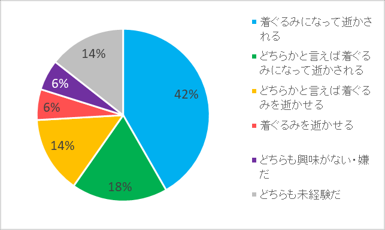
**Рисунок 201: «Ты хочешь, чтобы я пришел или ты хочешь, чтобы я ушел?»**

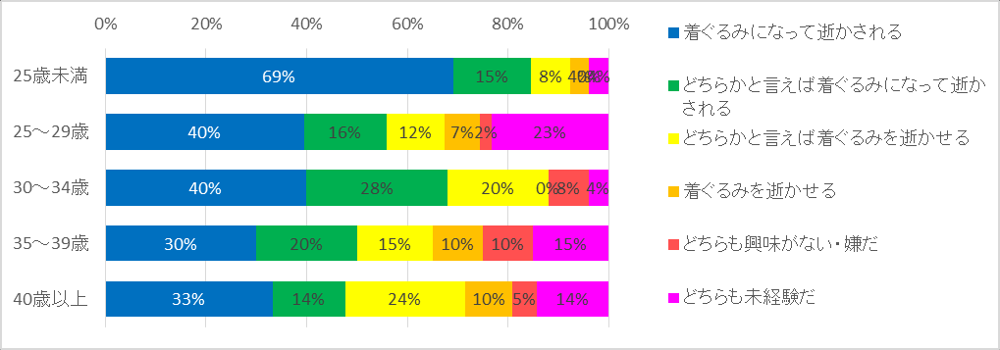
## Мне не нравится судить о том, что я чувствую к своей любви.

На рисунке 202 представлено более 210 действительных респондентов, которым нравятся/не нравятся результаты моих отношений. Проекты «Мне нравится» «Мне нравится больше» составляют более 50 процентов, в меньшей степени: «Контрабанда», 78 процентов; «хада-тай/морщина», 74 процента; «дыхание», 70 процентов; «репрессивный/резиновый», 67 процентов; «удар в барабан», 58 процентов; «связанный» 56 процентов; «TSF» (Trans Sexual Fantasy, «Creativation type») 56 процентов; «трава», 54 процента; «ограничение других», 54 процента; и «утечка» 52 процента.

Здесь, чтобы исключить ответ «неизвестный/неопытный», слово «нравится» записывается как 4 балла, слово «нравится» как 3 балла, слово «не понравилось» как 2 балла, слово «не понравилось» как 1 балл, а средний респондент рассчитывается и используется для сравнения. Средняя доля указана в таблице 16. Самый высокий средний балл составил 3,44. Второй — «хада-тай/морщина» в 3.30, «дыхание» в 3.14.

На рисунке 203 показан средний балл между тем, чтобы подтолкнуть меня к сексуальному возбуждению. Во всех проектах средний балл выше для тех, кто «создает» мое сексуальное возбуждение, чем для тех, кто «не делает». Однако «хада-тай/морщина» поддерживается на всех уровнях.

На рисунке 204 показан средний балл между мной и моей гордостью. В целом, практически во всех проектах уровень «с гордостью» дает более высокий средний показатель. В частности, гордость проявляют «женская маска» «сжимания/резинки» и «сжимания» «женской маски». Напротив, менее зависимыми являются более оскорбительные элементы, такие как «контролируемое дыхание».

На рисунке 205 показано среднее разделение между мной и ответами в моем гламуре. В целом проекты дают более высокие средние баллы по порядку «акты взрослых/любителей» > «отличные» > «чистые фотоярмарки» > «разговор со сверстниками». Элементы, демонстрирующие исключительное поведение, включают более высокое среднее значение для «самовоспроизводства», с выбором класса «этика», а не «взрослые / любовники», более низкое среднее значение для «горячей атаки» и более низкое среднее значение для «чистых фото-ярмарк» и относительно высокое среднее значение для «ограниченных» и «чатов со сверстниками».

| Любовные элементы | Средний балл |
| --- | ---: |
| Перфорация. | 2.66 |
| Дыхание | 3.14 |
| Пот. | 2.80 |
| Хадатай/морщина | 3.30 |
| Ты такая милая. | 3.44 |
| Затягивание/резина | 3.10 |
| барабан | 2.82 |
| утечка | 2.71 |
| Утечка жидкости тела | 2.48 |
| Он засранец. | 2.30 |
| Жарко. | 2.29 |
| Контролируйте чье-то дыхание. | 2.45 |
| Всё под контролем. | 2.34 |
| Запирать людей. | 2.88 |
| Заперто. | 2.89 |
| TSF | 3.09 |
| Прости. | 2.50 |

**Но в 16:30 я разделил элементы своей любви.**  
**Рисунок 202: Ответ на вопрос о распределении мембран.**

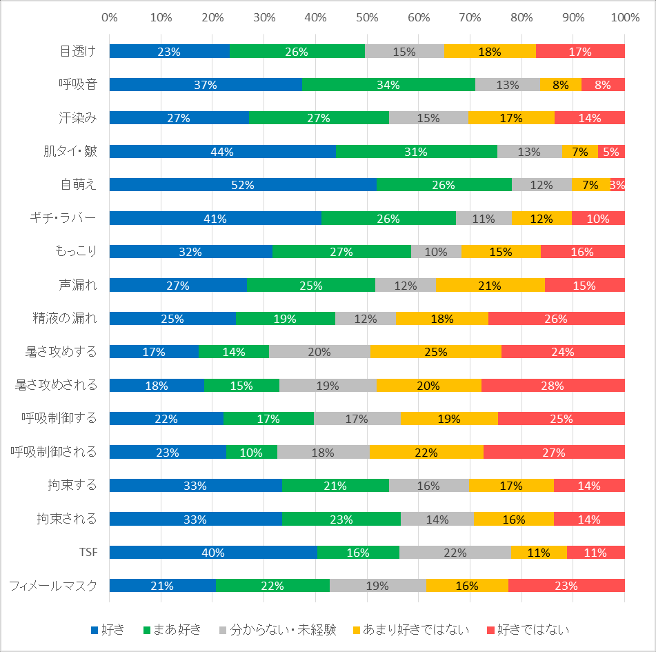
**Рисунок 203: Если это правильно или нет, это вызывает у меня сексуальное возбуждение.**

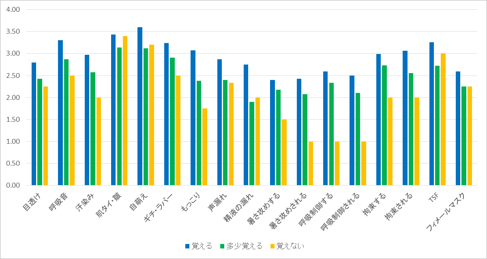
**Рисунок 204: Разделите меня поровну с моей страстью и гордостью.**

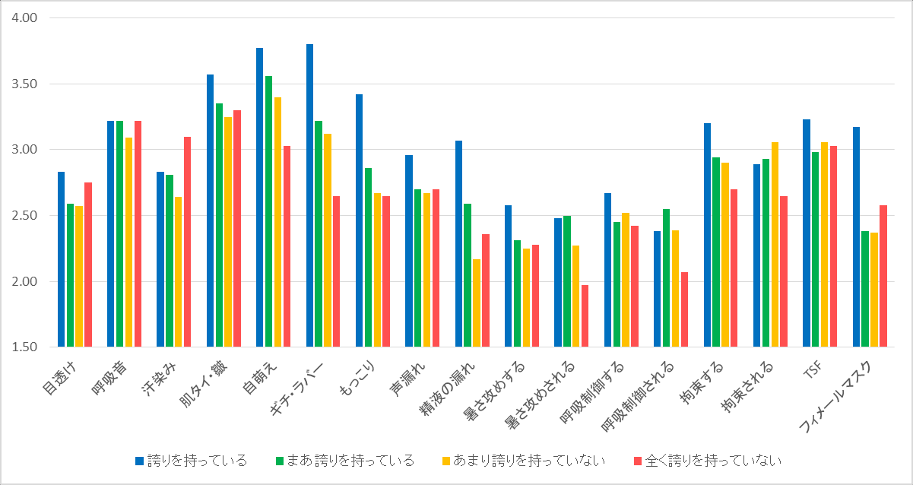
**Рисунок 205: Нажмите на меня и разделите в экстазе.**

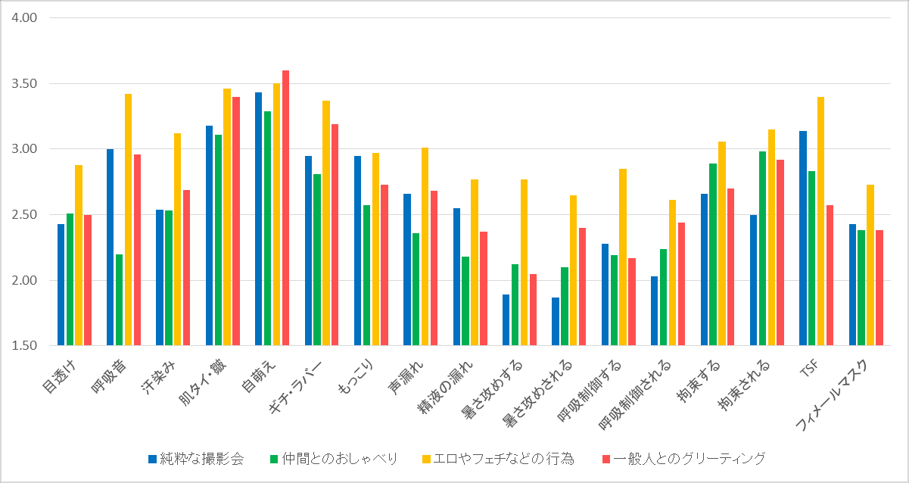
## Заключение

Прием.

## Запись источника

> > > > > > > > > > > > > > > > > > > > > > > > > > > > > > > > > > > > > > > > > > > > > > > > > > > > > > > > > > > > > > > > > > > @ @ @ @ @ @ @ @ @ @ @ @ @ @ @ @ @ @ @ @ @ @ @ @ @ @ @ @ @ @ @ @ @ @ @ @ @ @ @ @ @ @ @ @ @ @ @ @ @ @ @ @ @ @ @ @ @ @ @ @ @ @ @ @ @ @ @ @ @ @ @ @ @ @ @ @ @ @ @ @ @ @ @ @ @ @ @ @ @ @ @ @ @ @
