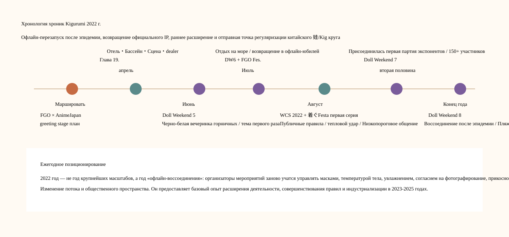
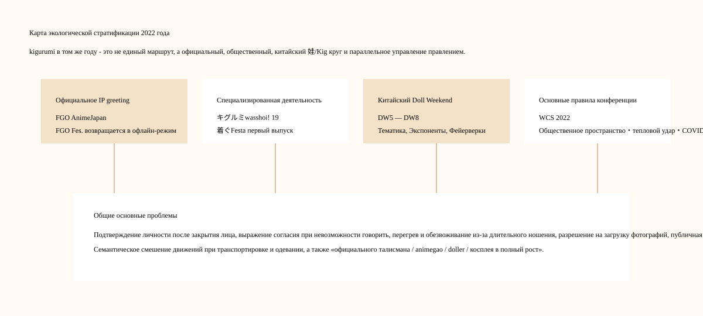
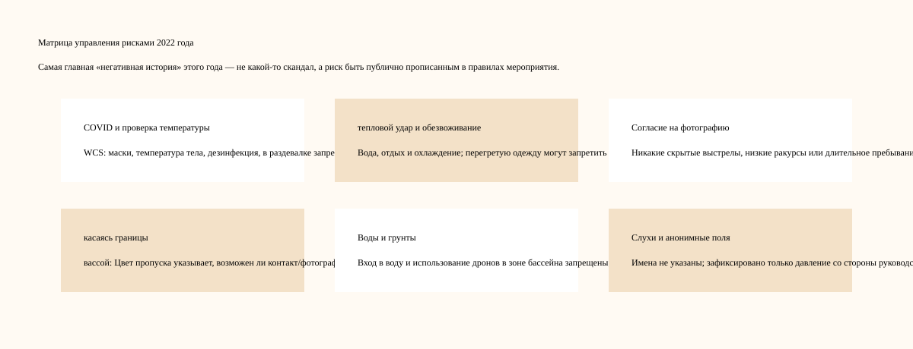
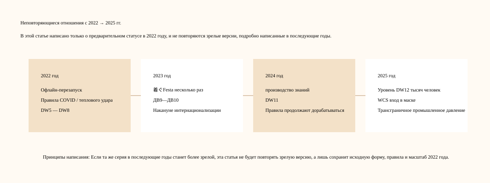

# Хроника Kigurumi 2022 года

> Уровень письма: Эта статья соответствует структуре «Хроник Kigurumi 2025 года», «Хроник Kigurumi 2024 года» и «Хроник Kigurumi 2023 года», но не повторяет версии событий, обновления правил и отраслевые расширения, которые были подробно написаны в 2023, 2024 и 2025 годах**. Если та же серия действий уже появлялась в предварительной версии, независимых правилах, раннем масштабе, возобновлялась в офлайн-режиме или изменялась впервые в 2022 году, ее статус в 2022 году будет зафиксирован; если это всего лишь зрелая форма, написанная в последующие годы, эта статья остановится только на «описании устранения повторов».

---

## 0. Границы данных, принципы устранения повторов и инструкции по достоверности

**kigurumi** в этой хронике 2022 года продолжает охватывать широкий спектр предыдущих статей: в том числе animegao kigurumi / bishoujo 着ぐるみ / ролевая игра в виде маски, doller, офлайн-активности китайского круга «娃 / Kig / Kiger», mascot greeting официального IP 着ぐるみ и текст правил, касающихся полного покрытия головы и лица, посещения общественных мест, тепловой удар, согласие на фотографирование и границ контактов на крупных косплей-мероприятиях. Терминология подробно объяснена в статье 2025 года. В этой статье не будет повторяться длинное определение. При необходимости он будет различать только четыре типа информации: «официальный mascot greeting», «специальное мероприятие для энтузиастов kigurumi», «Doll Weekend / 娃/Kig в китайском круге» и «правила основной конференции по косплею».

Информация на 2022 год более разрозненна, чем на 2023-2025 годы, и на многих страницах событий в Китае и Японии не всегда полностью указаны точные даты. Таким образом, в этой статье приняты следующие принципы достоверности: приоритет отдается официальным страницам мероприятий, страницам организаторов, страницам правил выставки и сообщениям СМИ на местах; социальные платформы, такие как Bilibili, X/Twitter, YouTube, используются для оценки времени проведения мероприятия, распространения изображений и атмосферы на месте; анонимные форумы, частные групповые чаты, скриншоты и слухи не используются в качестве фактической основы, конкретные имена не приводятся, а непроверенные обвинения не повторяются.

Правила устранения повторов для этой статьи и статей 2023–2025 годов следующие:

| Тип устранения повторов | 2022 метод обработки статей |
|---|---|
| Такая же серия событий продолжится и в 2023-2025 годах. | Будет написан только первый эпизод, преверсия, ранние правила и масштаб 2022 года, а последующие зрелые версии повторяться не будут. |
| 2025 Объяснение условий kigurumi / animegao / doller | Только сохраняйте необходимый калибр, не повторяйте терминологию в длинных статьях. |
| FGO, hololive, Aniplex и другие официальные greeting продолжат существовать в последующие годы. | Пишите только узлы AnimeJapan/FGO Fes. и другие узлы текущего года в 2022 году и не повторяйте роли и количества 2023-2025 годов. |
| В последующие годы World Cosplay Summit продолжит ужесточать правила закрытия лица и защиты от теплового удара. | Пишите только о «возвращении сцены реальности» WCS 2022 года, COVID / меры против теплового удара / правилах общественного пространства и не повторяйте уточнения в последующие годы. |
| Doll Weekend Последующие годы DW9-DW12 описаны подробно. | В этой статье говорится только о DW5 - тематике DW8, морском отдыхе, участии экспонентов и постэпидемическом воссоединении. |
| 着ぐFesta В ближайшие годы правила станут более зрелыми. | В этой статье описывается только первый пробный запуск с низким порогом в 2022 году и не повторяется расширение правил 2023/2024 годов. |
| Анонимные слухи и споры о персонажах | Не повторяйте непроверенные обвинения, фиксируйте только существование анонимных дискуссионных сайтов и давление со стороны руководства. |

---

## 1. Общий контекст 2022 года

kigurumi в 2022 году — это не «год вспышки», а более низкий уровень и более критический «год перезапуска в офлайн-режиме». Если 2023 год — это год, когда восстанавливаются связи в деятельности и китайский круг находится на пороге интернационализации, 2024 год — это год, когда производство знаний и написание правил становятся более интенсивными, а 2025 год — это год, когда масштабы, трансграничное взаимодействие и промышленное давление становятся более очевидными, то основное значение 2022 года заключается в следующем: **Многие виды деятельности возобновились в неопределенной среде после эпидемии, и организаторы начали заново учиться тому, как проводить kigurumi возвращается в общественные места, гостиничные помещения, выставочные помещения и на сцену.**

Первое основное направление — это реорганизация японских специализированных мероприятий kigurumi. В апреле 2022 года отель станет основным местом проведения 19-й конференции キグルミwasshoi!, где будет оборудовано лобби, коктейльная зона lounge, зона бассейна, церковь, stage, dealer, фотоуслуги и планирование размещения. Это одно из самых масштабных событий года, посвященных Японии. Его правила очень строгие: разрешения на доступ/фотографирование, ограничения в общественных местах отеля, согласие на фотографирование, запрет на вход в воду, запрет на дроны, запрет на чрезмерные сексуальные действия, запрет на повреждение обуви на объекте и т. д. — все это показывает, что офлайн-деятельность kigurumi перешла в состояние «восстановления и подтверждения правил» в 2022 году.[[S3]](#s3)

Вторая основная линия заключается в том, что начали появляться низкопороговые активности. Первое мероприятие 着ぐFesta 6 августа 2022 года было небольшим по масштабу, с 24 публичными участниками, но оно было очень важным: на странице четко говорилось, что после того, как эпидемия немного стабилизируется, масштабные мероприятия постепенно возобновятся, но организаторы надеются предоставить коммуникационное пространство, которое «не требует резервирования и в которое можно легко играть». Многих масштабных проектов она не подготовила. Вместо этого основное внимание уделялось фотографиям на белом и черном фоне, личному пространству на весь этаж, гардеробу и пространству cloak, а также свободному общению. Он также заявил, что надеется понять потребности участников посредством этого мероприятия и подготовить контент на будущее.[[S8]](#s8)

Третья основная линия — возвращение на сцену физических персонажей официальных IP. FGO разместил cosplayer / kigurumi greeting stage на официальной странице AnimeJapan 2022; FGO Fes. 2022 пройдет в 幕张 Messe с 30 по 31 июля. В сообщениях СМИ говорится, что это первое реальное мероприятие примерно за 3 года после того, как на него повлияла эпидемия. У welcome gate есть официальные косплееры, а kigurumi Посетителей приветствовали в прямом эфире, задокументировавшем 9 официальных косплееров и 6 человек kigurumi.[[S1]](#s1)[[S2]](#s2)

Четвертое основное направление — возобновление массовых косплей-конвенций в условиях эпидемии. World Cosplay Summit 2022 — мероприятие, посвященное 20-летию. На официальной странице указано, что World Cosplay Championship Stage Division вернётся на реальную сцену впервые примерно за 3 года. Однако, поскольку международные поездки по-прежнему затронуты, участвовать будут только команды, которые могут приехать в Японию. WCS также опубликовал правила для общественных мест, а также меры против теплового удара и COVID: участники должны знать, что место проведения не является полностью закрытым пространством для косплея, для фотосъемки требуется разрешение, в раздевалке не требуются маски и нельзя разговаривать, в жару необходимо пить и отдыхать, а костюмы, которые могут вызвать сильное обезвоживание, могут быть остановлены персоналом.[[S4]](#s4)[[S5]](#s5)[[S6]](#s6)[[S7]](#s7)

Пятая основная линия – китайская линия Doll Weekend от темы до экспонента и воссоединения после эпидемии. DW5 проводится в Чжухае по теме «Черно-белый концерт», что является первым тематическим мероприятием, как указано на официальной странице; DW6 проводится в Шэньчжэне на тему «Отпуск на побережье», во время которого записываются каникулы на приморской вилле и погружение персонажей на целый день после тайфуна; DW7 впервые приветствует партнеров-экспонентов в Гуанчжоу с более чем 150 участниками; DW8 Официальная страница в Хуэйчжоу описала это как «первое воссоединение после выхода из дымки эпидемии», с морским побережьем, пляжем и фейерверками в качестве эмоционального ядра.[[S9]](#s9)[[S10]](#s10)[[S11]](#s11)[[S12]](#s12)[[S13]](#s13)

Итак, позицию 2022 года можно резюмировать так: **Это был не самый яркий год, но он изменил многие вещи, которые позже стали важными.**Особые мероприятия в отеле, встречи по обмену информацией с низким порогом, official IP greeting, публичные правила WCS, тематическое оформление китайского круга 娃/Kig и экспонирование — все это в этом году оставило поддающиеся проверке внешние узлы.

---

## 2. Хроника 2022 года

### Январь-февраль: Накануне перезапуска в офлайн-режиме — борьба с эпидемиями по-прежнему является основной переменной всей деятельности.

В начале 2022 года самым большим фоном, с которым сталкивается сообщество kigurumi, по-прежнему остается неопределенность в офлайн-режиме после эпидемии. После того, как многие мероприятия были отменены, сокращены, отложены, сделаны по предварительному заказу или перенесены в онлайн в 2020–2021 годах, они начнут вновь проводить более масштабные реальные площадки только в 2022 году. Для kigurumi этот перезапуск сложнее, чем обычный косплей: маски, парики, колготки, накладки на тело и чехлы на голову увеличат заполняемость раздевалки, помощь в передвижении и потребности в отдыхе; покрытие для лица также заставит персонал больше беспокоиться о подтверждении личности, проверке температуры, ношении масок и реагировании на чрезвычайные ситуации.

Материалы мероприятий в этом году, как правило, имеют оттенок «повторного запуска». На 19-й странице キグルミwasshoi! говорилось, что оно было официально проведено после положительного ответа на предыдущее экспериментальное мероприятие, и перечислялись меры противодействия инфекции; первый 着ぐFesta прямо написал, что эпидемическая ситуация немного стабилизировалась и масштабная деятельность постепенно возобновилась, но он все еще надеется предоставить площадку для общения, где не требуется предварительное бронирование и люди могут приходить и играть по своему желанию. Страница COVID «Контрмеры» WCS 2022 требует от лиц с симптомами или риском заражения не приходить на место проведения, измерять температуру при входе, носить маски, избегать разговоров в раздевалке, использовать дезинфекцию и соблюдать социальную дистанцию.[[S3]](#s3)[[S7]](#s7)[[S8]](#s8)

Этот фон не представляет собой единственную вечеринку, но он задает тон мероприятиям kigurumi в течение года. В 2022 году организаторам придется решать одновременно два типа проблем: одни — оригинальные проблемы зрения, отвода тепла, контакта, фотосъемки и переодевания в kigurumi; другой — новые или усугубившиеся проблемы с температурой тела, масками, дезинфекцией, интенсивным контактом, разговорами в раздевалке и записью контактной информации после эпидемии. Другими словами, события 2022 года — это не просто «возвращение к состоянию, существовавшему до пандемии», а, скорее, новое определение оффлайн-участия в рамках новых правил общественного здравоохранения.

С точки зрения последующего развития, это переопределение 2022 года очень важно. Правила и возможности, которые мы видели с 2023 по 2025 год, такие как согласие на фотографирование, тепловой удар, публичное пространство, подтверждение маски, общение после мероприятия, зона dealer, система экспонентов и т. д., не появились внезапно, а были постепенно восстановлены, проверены и усилены в среде «открытия, но нужно быть осторожным» в 2022 году.

### 26-27 марта: FGO × AnimeJapan 2022 — официальное возвращение cosplayer / kigurumi greeting stage в начале года.

Выставка AnimeJapan 2022 проходила в 东京 Big Sight 26–27 марта 2022 года. На официальной странице Fate/Grand Order указано, что стенд FGO расположен в восточном 3 зале A04, и указано «コスプレイヤー･ 着ぐるみ». План «グリーティングステージ». На странице также указано, что специальный этап FGO пройдет 27 марта с 13:15 до 13:50, а общая выставка пройдет в зале 东京 Big Sight East 1-8.

Этот рекорд важен в 2022 году, поскольку он показывает, что официальный IP kigurumi/талисман не отказался от участия в выставках из-за сбоев, вызванных пандемией. AnimeJapan — выставка коммерческой анимации. Целью посетителей является просмотр новых работ, посещение стендов, покупка периферии, участие в сцене, фотографирование и общение. FGO записывает приветствие косплеера и kigurumi в информацию на стенде, указывая на то, что чиновникам все еще необходимо улучшить качество обслуживания на месте с помощью «тел персонажей».

Официальное приветствие фанатов animegao kigurumi — это не одна и та же организационная форма. kigurumi на стенде FGO является частью официального разрешения, официальной эксплуатации и порядка стенда; энтузиаст kigurumi больше посвящен личным ролевым играм, созданию фотографий, взаимодействию с сообществом и физическому самовыражению. Но они будут влиять друг на друга на уровне аудитории: обычные зрители с большей вероятностью поймут этот визуальный язык, когда они сначала увидят «движущихся двухмерных персонажей» на официальном стенде, а затем увидят действия фанатов или отдельных игроков.

Версия AnimeJapan 2022 года также отличается от последующих нод 2023, 2024 и 2025 годов. В этой статье не будут повторяться детали стенда в последующие годы, а лишь зафиксирована значимость этого «возвращения в начале года» в 2022 году: в первые дни возобновления офлайн-деятельности после эпидемии kigurumi все еще включался. kigurumi приветствие в рамках посещения стенда. Это означает, что позиция kigurumi в официальной двумерной IP-коммуникации в офлайн-режиме не была полностью заменена чистой онлайн-трансляцией или отображением на экране.

Согласно kigurumi Chronicles, это ключ к «мейнстримовой видимости». Многие люди приходят в культуру kigurumi не с форума animegao или собраний игроков, а впервые знакомятся с официальными персонажами-талисманами на масштабных IP-мероприятиях. Запись 2022 FGO × AnimeJapan является частью этого публичного входа.

### 9–10 апреля: Глава 19 キグルミwasshoi! — Комплексное восстановление специальных мероприятий гостиничного типа.

9-10 апреля 2022 года 19-я выставка キグルミwasshoi! пройдет в Hotel East 21 Tokyo в Токио. На официальной странице указано, что после хорошего отклика от предыдущего экспериментального мероприятия, на этом мероприятии снова пройдут обмены фотографиями в роскошном месте и большом зале, а также будут подготовлены фотоконкурсы, выставки производителей, планирование stage и другой контент. На странице день 1 указан как 9 апреля, а день 2 — 10 апреля; В день 1 используется East21 Hall, коктейль lounge «Панорама», и он открыт для гостей отеля под позывным night pool; День 2 использует East21 Hall, garden pool и платный chapel.[[S3]](#s3)

Это событие является важным узлом в офлайн-истории Японии kigurumi в 2022 году. Это не просто небольшое место, где обычные фанаты могут фотографироваться, но и сочетание вестибюля отеля, lounge, бассейна, церкви, жилого этажа, фотоуслуг, сценических программ, планирования выставок dealer и соревнований. Для kigurumi такая комплексная площадка очень ценна: зал подходит для масштабных групповых фотографий и общения, lounge подходит для фотографий атмосферы персонажей, бассейн и церковь создают особый фон, а размещение решает проблемы головных ящиков, длительного ношения, ночных съемок и физического восстановления.

Но поскольку правила являются всеобъемлющими, они также должны быть всеобъемлющими. На странице есть механизм разрешения на контакт и фотографирование. Участники могут использовать pass, чтобы указать, разрешают ли они контакт и фотографирование. Если другая сторона pass заявляет, что не хочет, чтобы к ней прикасались, ей не разрешается прикасаться. Также запрещено неподобающее поведение в общественных местах. Этот механизм заслуживает документирования, поскольку невербальное общение в kigurumi естественно затруднено: панцирь головы закрывает лицо, голос может быть не слышен ясно, а исполнитель часто не говорит, чтобы сохранить характер. Выражение границ с помощью цветов или типов пропусков — это способ перевести согласие из устного общения в визуальные правила.[[S3]](#s3)

Правила фотографии одинаково строги. На странице требуется согласие субъекта перед съемкой и разрешение перед загрузкой фотографий; запрещено длительное время занимать место съемки, запрещено снимать в гримерке и туалете, запрещено просить испытуемого принимать сложные или неуместные позы для ответа, запрещено без разрешения давать интервью средствам массовой информации и вести репортажи без разрешения. Он также налагает ограничения на фотографическое оборудование, например, большие объективы и размещение оборудования не должны мешать деятельности. Эти правила показывают, что «фотосъемка» на мероприятии kigurumi — это не просто нажатие на кнопку спуска затвора, но включает в себя согласие субъекта, порядок места проведения, право на использование работы и доверие сообщества.[[S3]](#s3)

Правила использования бассейна отражают управление безопасностью. На странице четко запрещен вход в воду, дроны запрещены, при использовании такого оборудования, как осветительные стойки или отражатели, необходимо принять меры против падения, а в зоне бассейна запрещены зонтики. Это содержание перекликается с правилами безопасности на воде, записанными в 2025 году, но значение 2022 года заключается в том, что в нем уже очень рано были выделены «бассейн как фон» и «kigurumi не должно погружаться в воду». Для игроков, играющих в шлемах, вид воды прекрасен, но водопоглощающие материалы, скользкие подошвы, ограниченное зрение и вес одежды могут увеличить риски.[[S3]](#s3)

Об ограничениях в местах общего пользования отеля также стоит написать. На странице поясняется, что у гостей отеля будут удобные способы его использования, например, выезд на стойке регистрации и перемещение в пределах отведенной территории. Однако в общественных местах, таких как вестибюль на втором этаже, носить одежду kigurumi запрещено. Участников также просят не связываться с местом проведения мероприятия, не беспокоить обычных гостей отеля и не перемещаться в неотведенных для этого местах. Такое правило гласит: kigurumi Специализированные мероприятия, даже если они арендуют помещения отеля, все равно проводятся в рамках обычных коммерческих объектов и должны учитывать границы между участниками, гостями отеля, персоналом и публикой.[[S3]](#s3)

Правила одежды и поведения также отражают сложность управления сообществом в 2022 году. На странице запрещен косплей общего вида. При участии под именем kigurumi колготки телесного цвета считаются «кожными» и должны избегать очертаний или обнажения интимных частей тела, а также избегать чрезмерного сексуального выражения; запрещая обувь, которая может нанести вред объекту, запрещая реалистичную униформу представителей власти, запрещая опасный реквизит и airgun, которые могут запускаться, запрещая спреи, плазму и другие предметы, которые могут загрязнить объект. Внешней аудитории эти правила могут показаться тривиальными; для организаторов мероприятий они напрямую связаны с договорами о месте проведения мероприятия, ответственностью за безопасность, общественным впечатлением и последующей возможностью продолжать арендовать помещение.[[S3]](#s3)

С позитивной исторической точки зрения 19-я выставка キグルミwasshoi! объясняет, что специальное мероприятие kigurumi в Японии в 2022 году уже обладает высокими организационными возможностями: оно может мобилизовать отели, несколько сцен для фотосъемок, stage, dealer, конкурсы, официальную фотосъемку и организацию размещения. С негативной или рискованной исторической точки зрения это также показывает, что перезапустить оффлайн непросто: за каждым красивым пространством, которое можно сфотографировать, стоит набор правил движения, контакта, фотографирования, общественных мест и безопасности. kigurumi в 2022 году — это не просто «наконец-то снова быть вместе», а, скорее, переписать границы, собираясь снова.

### Примерно в начале июня: Doll Weekend 5 «Черно-белый концерт» — первое тематическое мероприятие китайской линейки DW.

На официальной странице Doll Weekend 5 тема мероприятия указана как «Черно-белый концерт», а место проведения — Чжухай, Гуандун. В нем также объясняется, что Doll Weekend впервые запланировал тематическое мероприятие — черно-белую вечеринку горничных, что делает вечеринку более ритуальной и захватывающей. Публичное видео Bilibili «Как куклы обычно проводят свои дни рождения — Doll Weekend 5» было выпущено 6 июня 2022 года. Название и теги также явно указывают на сцены Doll Weekend 5 и kigurumi/Kig. Таким образом, в этой статье DW5 упоминается как общедоступный узел примерно в начале июня 2022 года; строго говоря, дата Bilibili — это время выхода публичного видео, которое не обязательно является датой события.[[S9]](#s9)[[S10]](#s10)[[S14]](#s14)

Ключевое слово для DW5 — «тема первого раза». На более ранних встречах с фанатами участники могли просто собираться с разными персонажами, фотографироваться и общаться; в то время как тематические действия обеспечат общий визуальный порядок для всех персонажей. Тема черно-белой вечеринки горничных объединяет цвет одежды, атмосферу сцены, чувство ритуала и коллективную память. Темой кампании kigurumi /doll был не просто дресс-код, а способ объединить разных персонажей в одном повествовании.

Тема горничной также очень подходит для раннего развития китайского круга «Kig». Оно не только возникает из смешанного воображения двухмерных изображений, кофе горничной, японского косплея, вечеринок по случаю дня рождения и сцен обслуживания, но также позволяет персонажам сформировать относительно единый язык действий в событии: поза стоя, подача блюд, поздравления, групповые фотографии, взаимодействие, ощущение сцены или вечеринки. Черно-белая цветовая гамма уменьшает цветовой конфликт между персонажами, облегчая формирование визуального целого на групповом фото.

Оглядываясь назад с точки зрения 2025 года, DW5 кажется гораздо меньшим, чем тысячная толпа DW12, фейерверки, дроны и парады, но у него есть историческое значение: оно доказывает, что Doll Weekend осознал в 2022 году, что «это событие предназначено не только для того, чтобы все пришли, но и для того, чтобы каждый мог войти в общую тему». Последующие прибрежные праздники DW6, участие экспонентов в DW7, зимние встречи DW8, интернационализация DW10 и празднование DW12 — все это можно рассматривать как расширение этой тематической возможности.

DW5 также показывает, что китайский круг kigurumi /doll начинает распространяться по платформе визуализации. Название видео Bilibili объясняет эту сцену широкой аудитории словами «Как куклы обычно проводят свои дни рождения», снижая порог «что это за занятие?» Это не объяснение терминологии для профессиональных статей, а использование более интуитивных элементов, таких как дни рождения, вечеринки, горничные, два измерения и милые тела, чтобы дать аудитории понять, что «младенцы» также имеют свою собственную социальную повседневную жизнь.

### Примерно в конце июля: Doll Weekend 6 «Каникулы на побережье» — приморская вилла после тайфуна и всепогодное погружение в персонажи.

На официальной странице Doll Weekend 6 написана тема «Отпуск на побережье», место действия — Шэньчжэнь, провинция Гуандун, и объясняется, что это отдых на пляжной вилле «после тайфуна», создающий погружение персонажа на целый день и социальный опыт. Записи общедоступного поиска Bilibili показывают, что соответствующий художественный фильм «DW6 Feature Film How Dolls Vacation на пляже» был выпущен 27 июля 2022 года, поэтому в этой статье DW6 указан как узел примерно в конце июля 2022 года; Также следует отметить, что время выхода видео не обязательно совпадает с точной датой мероприятия.[[S9]](#s9)[[S11]](#s11)[[S15]](#s15)

Значение DW6 в том, что оно превращает мероприятие из тематической вечеринки в помещении в курортную обстановку. Пляжная вилла и всепогодное погружение в образ означают, что участники не просто завершают фотосессию за несколько часов, но сохраняют состояние персонажа, социальное состояние и состояние фотографии в течение более длительного периода времени. Это более требовательно к игрокам kigurumi /doll: время ношения головного убора, порядок одевания, отдых и увлажнение, кондиционируемое помещение, влажность морского бриза, соль, земля, транспорт и ритм фотосъемки - все это будет влиять на впечатления.

Выражение «после тайфуна» тоже имеет смысл реальности. Это показывает, что событие не является абстрактной студийной съемкой, а происходит в реальной погоде и реальной географической среде. На побережье сильные ветры, высокая влажность и яркий свет. Изменения погоды напрямую затронут парики, одежду, головные уборы и фототехнику. Для обычного косплея это уже проблемы; с kigurumi видимость головы, рассеивание тепла и устойчивость подошвы еще больше усугубляют проблему. Таким образом, DW6 — это не только попытка визуального праздника, но и тест на адаптируемость к сценам на открытом воздухе или полуна открытом воздухе.

По сравнению с черно-белой вечеринкой горничных DW5, «Seaside Vacation» DW6 уделяет больше внимания самому пространству. Вечеринка горничных – это одежда и церемония, а отдых на пляже – это обстановка и время. Персонажи, перемещающиеся по виллам, морю, коридорам, зонам отдыха, террасам и наружному освещению, будут ближе к повседневным или туристическим повествованиям, чем в одном зале. Это изменение важно для наблюдения за китайским кругом 娃/Kig, поскольку оно позволяет проводить активности «娃/Kig» не только в выставочных залах или арендных залах, но также во время отпуска, в городах, отелях, живописных местах и ​​фототурах.

DW6 также проложил путь к морю и фейерверкам в продолжении DW8. Китайская линия Doll Weekend в 2022 году — это не история прямых цифр, а постоянное экспериментирование со сценариями: дни рождения/прислуги, пляжные домики, мероприятия для участников, зимние встречи. Каждое испытание улучшает понимание организатором места проведения, людей, фотографий, транспорта и безопасности.

### 30–31 июля: FGO Fes. 2022 ~7-я годовщина~—— возвращение офлайн-юбилея примерно через три года.

30–31 июля 2022 г., Fate/Grand Order Fes. В 2022 году ~7-летие~ пройдет в 幕张 Messe. В отчете Inside Games говорится, что из-за воздействия новой коронной эпидемии FGO Fes. стало первым реальным событием примерно за три года; На площадке welcome gate создали вход на фестиваль через большой полукруглый экран, red carpet и модель земли, а зрителей приветствовали официальные косплееры и kigurumi. Объектами покрытия являются 9 официальных косплееров и 6 kigurumi.[[S2]](#s2)

Это событие является ежегодным центральным событием официальной линейки IP kigurumi на 2022 год. AnimeJapan 2022 — это greeting stage на выставочном стенде, а FGO Fes. 2022 — это захватывающий прием у входа на юбилейное торжество. Примерно через три года отсутствия реальных событий официальные косплееры и kigurumi приветствовали фанатов на welcome gate с сильным символическим значением: вместо того, чтобы просто смотреть обновления игры на экране, игроки снова участвовали в фестивале, состоящем из тела персонажа и живого пространства.

В число шести kigurumi, записанных в отчете, входят героиня, アルテラ, マシュ, ジャンヌ・ダルク, セイバー,レオナルド・ダ・ヴィンチ. Они появляются в отдельных ролях вместе с официальными косплеерами, образуя уникальный гибридный ландшафт «настоящих персонажей + персонажей kigurumi», уникальный для выставочного сайта FGO. Для зрителей персонажи больше не просто остаются на открытке, видео или выставочной доске, а становятся существами, которых можно рассматривать, фотографировать и взаимодействовать с ними у входа, красной дорожки и фоновой музыки.[[S2]](#s2)

С точки зрения хроники kigurumi ценность этого типа официального kigurumi заключается в публичной видимости. Он не будет напрямую приравниваться к сообществу игроков animegao и не будет напрямую отражать творческий подход отдельных Kigerов; но это изменит восприятие широкой аудиторией персонажей с капюшонами. Когда легионы фанатов видят, как персонаж приветствует себя в форме kigurumi на официальных мероприятиях, а позже видят отдельных игроков на комических конвенциях или специализированных мероприятиях, эту физическую форму легче понять как «презентацию персонажа», а не просто странное зрелище.

FGO Fes. 2022 также отражает эмоциональную ценность офлайн-активностей после эпидемии. В сообщениях подчеркивается, что это возвращение реального события примерно через 3 года, что важно для официального kigurumi: вся суть полнокапюшонного персонажа именно в "живости". Если kigurumi не находится в одном пространстве со зрителями, ему будет трудно махать руками, стоять, позировать и ходить. Возвращение в 2022 году еще раз подтверждает незаменимую роль kigurumi в офлайн-операциях IP.

### 5-7 августа: World Cosplay Summit 2022 – 20-летие, возвращение реальной сцены и правила публичного пространства

World Cosplay Summit 2022 пройдет в Нагое/Айти с 5 по 7 августа 2022 года. На официальной странице указано, что World Cosplay Championship Stage Division проходил в зале Центра искусств и культуры Айти 6 августа, и говорится, что это был первый раз примерно за 3 года, когда он вернулся на настоящую сцену; Из-за постэпидемических условий въезда и путешествия в соревнованиях примут участие только команды, которые смогут приехать в Японию.[[S4]](#s4)

Значение WCS 2022 для kigurumi не в том, что это событие, специфичное для kigurumi, а в том, что оно представляет собой открытие публичного пространства основной системой косплея. К площадкам WCS относятся торговые улицы Oasis 21, Hisaya-odori Park, Osu, Flarie и другие места. Официальные правила неоднократно напоминают, что эти пространства предназначены не только для участников косплея. Обычные посетители, прохожие, пользователи магазинов и объектов также активны в этой же зоне. Для kigurumi, полного головного убора, тяжелой одежды или одежды, закрывающей лицо, такая реклама оказывает большое давление: ограниченный обзор, неудобное движение, трудно подтвердить личность, легко быть сфотографированным прохожими и с большей вероятностью вызвать недопонимание в людных местах.[[S5]](#s5)

В тексте правил костюмов и реквизита WCS 2022 указан физический риск. В правилах указано, что длинные предметы находятся на расстоянии около 2 метров, но персонал может попросить участников прекратить ими пользоваться в зависимости от места и условий; в то же время персоналу может потребоваться избегать чрезмерного воздействия, острых, длинных юбок, затрудняющих ходьбу, или тесной, перегревающей одежды, которая может вызвать сильное обезвоживание. Хотя правила 2022 года отдельно не расширяют такие категории, как kigurumi, doller, gawa-cos и полнолицевые маски, такие как 2025, они включили «одежду, которая может вызвать обезвоживание» как проблему, о которой персонал может судить.[[S5]](#s5)

Правила фотографии не менее важны. WCS 2022 требует, чтобы вам не разрешалось занимать локацию в течение длительного времени во время фотосъемки, вам не разрешалось снимать без согласия, а также вам не разрешалось снимать под низкими углами или в позах, где видно нижнее белье; вам также необходимо получить согласие субъекта перед загрузкой фотографий на SNS. Для kigurumi такие правила защищают не только субъектов, но также фотографов и само мероприятие. Потому что исполнители kigurumi часто не могут быстро отказаться ни выражениями, ни словами, а другая сторона также может ошибочно подумать, что «персонажа можно снимать, если он присутствует». Правила превращают согласие из расплывчатой ​​социальной вежливости в явные требования к активности.[[S5]](#s5)

Страница мер против теплового удара для WCS 2022 также имеет решающее значение. Страница напоминает, что во время мероприятия может возникнуть сильная жара. Участники должны приносить с собой напитки, часто пополнять запасы воды, правильно отдыхать и использовать охлаждающие средства; если им жарко, не заставляйте себя участвовать; во время мероприятия вы можете заходить в раздевалку несколько раз, и вам следует выбирать одежду, которая легко рассеивает тепло, и отдавать приоритет вашему физическому состоянию. Для исполнителей kigurumi это не общие напоминания, а правила безопасности жизни: головные уборы и колготки влияют на отвод тепла, парики и набивка усиливают тепло, обувь персонажей может замедлять движения, а снятие головы для отдыха может предполагать конфиденциальность и статус персонажа.[[S6]](#s6)

Контрмера COVID представляет собой еще один уровень управления. Страница WCS 2022 требует, чтобы лица с симптомами, риском заражения или ограничениями на поездки не приходили на место проведения мероприятия; При входе будут проводиться проверки температуры, и лица с температурой выше 37,5 градусов или с явными симптомами не будут допущены к входу; необходимо избегать разговоров в раздевалке, участники должны носить маски, дезинфицировать и соблюдать дистанцию, а также рекомендуется использовать приложение для подтверждения контактов. Для участников kigurumi такие правила создадут практические конфликты с панцирями для головы и масками: когда носить обычную маску, когда входить в панцирь для головы персонажа, когда снимать голову и как незаметно переодеться в раздевалке — все это вопросы, которые необходимо решать на месте.[[S7]](#s7)

Таким образом, WCS 2022 является одним из основных узлов «негативной/рисковой истории» 2022 года. Это не потому, что произошло что-то негативное, а потому, что оно институционализировало риск: общественное пространство, тепловой удар, согласие на фотосъемку, COVID, гримерки, длина реквизита, перегретые костюмы — все это записано в правилах массовых косплей-мероприятий. Более четкие правила маскировки и признание категории kigurumi в 2025 году можно рассматривать как продолжение этого опыта государственного управления; в этой статье фиксируется только предварительный статус на 2022 год и не повторяется подробный текст в последующие годы.

### 6 августа: первый выпуск 着ぐFesta — отправная точка низкопороговой встречи по обмену информацией.

6 августа 2022 года 着ぐFesta впервые прошел в サンパール荒川 Кодори в округе Аракава. Страница TwiPla называется «着ぐFesta! 着ぐるみ さんと 着ぐるみ 好きさんのcommunicate», время — 10:00–16:00, хост — GarageStudioC7. На странице поясняется, что эпидемическая ситуация несколько стабилизировалась и масштабные мероприятия постепенно возобновились. Многие игроки kigurumi выразили надежду на событие, в котором можно будет легко играть без предварительной записи, поэтому организаторы арендовали зал, вмещающий около 300 человек и позволяющий проводить свадьбы и другие мероприятия. Открытая регистрация показала 24 участника.[[S8]](#s8)

Значение 着ぐFesta впервые лежит не в шкале, а в «пороге». 19-е キグルミwasshoi! — это комплексное мероприятие гостиничного типа с богатым содержанием, но это также означает, что маршрут, сборы, подготовка и правила усложняются; WCS — это массовая крупномасштабная конференция с большей нагрузкой на общественные места; и первый 着ぐFesta больше похож на пространство с низким порогом, где в первую очередь могут собраться игроки kigurumi и люди, которым нравится kigurumi. На странице указано, что условия участия включают «着ぐるみ の方々ならびに 着ぐるみ の方々のファンの方々», и вы можете участвовать, даже если у вас нет собственного kigurumi, который обеспечивает вход для новичков и зрители.[[S8]](#s8)

Дизайн площадки также отражает потребности kigurumi. На странице указано, что весь этаж зарезервирован, а холл и вход могут использоваться kigurumi. Музыкальную комнату и сцену можно использовать как раздевалки и cloak, а багаж можно оставить на стойке регистрации. Для kigurumi наличие достаточного количества одежды, багажа, ящика для головы и места для отдыха часто является более важным, чем сценическая программа. Обычную одежду для косплея можно упаковать в сумку, но головной убор kigurumi большой, хрупкий и требует устойчивого размещения; Одежда цвета кожи, парики, одежда персонажей и обувь также требуют более тщательного одевания.[[S8]](#s8)

На первой странице также указано, что организатор подготовил не слишком много масштабного контента и надеется, что участники смогут создать атмосферу дня посредством свободного общения; при этом оператор будет понимать, какие услуги хотят участники во время данного мероприятия, чтобы они могли подготовиться в будущем. На месте подготовлены черно-белый фон и фототехника, а фотографии, сделанные во время мероприятия, будут отсортированы и загружены позже. Такой подход «сначала сделай это, а потом улучшайся на основе отзывов» очень соответствует атмосфере перезапуска в 2022 году.[[S8]](#s8)

Эта кампания также уже включает базовые меры контроля рисков. На странице указано, что люди, которые в прошлом создавали проблемы в других видах деятельности или могут вызвать проблемы, не должны участвовать. Организатор может не объяснять причины; участники также обязаны соблюдать общие меры предосторожности. Этот тип текста, хотя и краткий, показывает, что небольшая кампания kigurumi должна с самого начала обеспечивать доверие сообщества, безопасность событий и исключение проблем. Поскольку мероприятия kigurumi часто опираются на сеть знакомств и невербальное взаимодействие, когда кто-то неоднократно переходит черту, это может быстро подорвать чувство безопасности новичков и исполнителей.[[S8]](#s8)

В 2023 и 2024 годах 着ぐFesta разработает более четкое согласие на фотографирование, запреты на объятия, ограничения на длинные предметы, примерку масок, мастер-классы по фотографии, участие dealer и т. д.; об этом подробно написано в статье 2023/2024. В этой статье зафиксировано лишь историческое положение первого мероприятия 2022 года: это низкопороговая пилотная площадка, возникшая в ходе автономного восстановления после эпидемии. Оно невелико по масштабу, но имеет четкое направление, закладывающее основу для последующих серий мероприятий.

### Вторая половина 2022 г.: Doll Weekend 7 «Соединяя новую жизнь» — присоединяются партнеры-экспоненты и масштабируются более 150 человек.

На официальной странице Doll Weekend 7 написана тема «Соединяя новую жизнь», а место проведения — Гуанчжоу, провинция Гуандун. В нем также поясняется, что Doll Weekend впервые приветствует партнеров-экспонентов, перечисляя таких партнеров, как River Monster, Hidolls, Xinyan, No Reduction и Shell Reaction. На странице также указано, что в мероприятии примут участие более 150 человек, а масштабы опыта и масштабы связей были еще больше расширены. Поскольку на странице официального сайта не указаны конкретные год, месяц и день, в этой статье они будут указаны как узел во второй половине 2022 года.[[S9]](#s9)[[S12]](#s12)

DW7 — это важный шаг в кругу «Китайский 娃/Kig 2022 года»: от встречи друзей к связям с промышленностью. Участие экспонентов означает, что мероприятие больше не является просто спонтанным собранием игроков, а стало местом, где производители, поставщики аксессуаров, маски/костюмы/сопутствующие сервисные компании вступают в контакт с игроками. Для kigurumi /кукольной культуры система экспонентов очень важна: головные уборы, одежда телесного цвета, парики, одежда, очки, обувь, наполнение, фотография, постпроизводство, хранение и транспортировка — все это может образовывать цепочку поставок. Если мероприятие может привлечь экспонентов, это означает, что масштабы участников и покупательский спрос достигли определенного уровня стабильности.

«Более 150 участников» сегодня может показаться не таким впечатляющим, как более 1000 участников DW12 2025 года, но в постпандемических условиях 2022 года это уже важный узел масштаба. kigurumi /doll-мероприятия отличаются от обычных фан-выставок высокой стоимостью участия, сложной транспортировкой оборудования, высокими требованиями к месту проведения и жесткими физическими требованиями. 150+ означает, что организатору приходится иметь дело с множеством вопросов, таких как регистрация, место проведения, поток людей, групповые фотографии, фотография, участники, отдых, переодевание, общественный порядок и т. д.

Тема DW7 «Соединяя новое» также очень уместна. Это не только связь между игроками, но также связь между игроками и производителями, видами деятельности и отраслями, китайским сообществом и последующим более крупным масштабом. Профессиональная сцена на DW9 2023 года с почти 200 людьми, зарубежные участники на DW10 2023 года с 400+, DW11 2024 года с 500+, DW12 2025 года с 1000+, первые сигналы можно увидеть в участии экспонентов на DW7.

Следует отметить, что эта статья не повторяет повествование о зрелой индустриализации Doll Weekend последующих лет. Историческое значение DW7 заключается в двух узлах 2022 года: «Присоединение первых партнеров-экспонентов» и «150+», а не в переносе масштаба экспонентов 2025 года, дронов, фейерверков, городской поддержки и т. д. обратно в 2022 год.

### Конец 2022 года: Doll Weekend 8 «Зимний теплый сбор» — воссоединение, пляж и фейерверк после выхода из дымки эпидемии.

На официальной странице Doll Weekend 8 написана тема «Теплый сбор зимой», место проведения — Хуэйчжоу, Гуандун, и резюмируется она в очень эмоциональном предложении: первое воссоединение после выхода из дымки эпидемии, теплый сбор объединяет фейерверк. На странице также указан заголовок изображения мероприятия «Бег к морю с фейерверком», а также входы для групповых фотографий и фотографий на месте. Общедоступно. Поэтому в этой статье DW8 указывается как узел конца 2022 года.[[S9]](#s9)[[S13]](#s13)

DW8 — эмоциональное завершение китайской линии Doll Weekend 2022 года. Предыдущий DW5 делал упор на тему первого раза, DW6 делал упор на пляжные виллы и погружение в характер, DW7 делал упор на участие экспонентов и 150+; DW8 берет за основу «воссоединение». Когда деятельность возобновляется после эпидемии, самое главное – это не просто количество людей, а то, что участники наконец смогут снова собраться вместе, снова сфотографироваться и восстановить социальные отношения посредством физического присутствия. Для kigurumi /doll онлайн-общение не может заменить оффлайн-встречи, поскольку тела персонажей, движения, групповые фотографии, освещение, общение и воспоминания о событиях должны происходить в одном и том же пространстве.

«Пляж, море и фейерверк» также отражает постоянное стремление Doll Weekend к повествованию сцен. Фейерверки — сильный общественный ритуал: ночью они привлекают всеобщее внимание и делают память о событии более праздничной. Для участников kigurumi /doll изображение персонажей на фоне фейерверков имеет сильный фантазийный оттенок; но это также означает управление объектом, концентрацию персонала, смену освещения, безопасность в ночное время и планирование фотографического оборудования. DW8, как теплая встреча в конце года, — это не только красивый имидж, но и отражение способности организатора организовывать ночные мероприятия на свежем/полуоткрытом воздухе.

Оглядываясь назад на статью 2025 года, можно сказать, что фейерверки, дроны и парады 娃/Kig DW12 более грандиозны; но фейерверки DW8 больше похожи на ранние эмоциональные прототипы. Это не городской праздник с тысячами людей, а символ воссоединения после эпидемии. Именно потому, что в конце 2022 года появился сюжет о «фейерверке, объединяющем вечеринку», следующий альбом Doll Weekend может более естественно сочетать изображения, города, праздники и тела kigurumi/куклы.

В этой статье DW8 рассматривается не как уменьшенная версия последующих крупномасштабных мероприятий, а как конец самого 2022 года: пережив неопределенность эпидемии, китайский 娃/Kig кружок передвинул тему года от «повторной попытки» к «воссоединению» через море, пляж, фейерверки и воссоединение.

### Поле анонимных слухов в 2022 году: документирование только давления со стороны правительства, а не непроверенных обвинений

Анонимные темы типа «Наблюдение за проблемными людьми», связанные с японским кругом kigurumi, можно будет получить в 2022 году, например, серию обсуждений 5ch, которые продолжают появляться в середине 2022 года. В таких местах часто проводятся анонимные дискуссии по поводу этикета мероприятий, личных споров, границ фотографии, проблем контактов, социальных конфликтов или деловых конфликтов. Они имеют определенную справочную ценность для истории сообщества, поскольку на официальных страницах мероприятий обычно не фиксируются частные споры; но они также содержат множество личных предубеждений, недопониманий, старых обид, цитат, вырванных из контекста, и контента, на который не отреагировали вовлеченные стороны.[[S16]](#s16)

Таким образом, эта Хроника не повторяет конкретные обвинения, высказанные в анонимных сообщениях, не приводит номера счетов или имена и не представляет анонимные утверждения как факт. Для небольшого круга, такого как kigurumi, анонимное присвоение имен особенно вредно: участники могут использовать несколько личностей, таких как имена персонажей, маскаа, прозвища, учетные записи в социальных сетях и реальные личности; неправильная ассоциация может ошибочно связать внешний вид персонажа, фотографии с мероприятия или учетную запись игрока с негативными слухами. Публичные хроники должны документировать «существование оспариваемых сайтов», а не преувеличивать неподтвержденный вред.

Что действительно стоит извлечь из слухов, так это стоящее за ними давление со стороны правительства: почему мероприятия требуют согласия на фотосъемку? Зачем ограничивать прикосновения? Зачем устанавливать пропуск? Почему заведения оставляют за собой право отказать во входе проблемным людям? Почему в кампании kigurumi необходимо указывать раздевалки, вбрасывание, общественные места и границы поля? Осведомленность организаторов о предотвращении этих проблем можно увидеть уже в тексте правил キグルミwasshoi! и 着ぐFesta в 2022 году. Чем активнее анонимные обсуждения, тем больше это показывает, что сообществу нужны более прозрачные, исполнимые и обжалуемые правила, а не полагаться на частное сарафанное радио для решения всех проблем.

---

## 3. Индекс ключевых людей, организаций и мест в 2022 году.

### キグルミwasshoi! / ぷれこす связанная хостинговая система

19-й выпуск キグルミwasshoi! является ярким событием специального мероприятия kigurumi в Японии в 2022 году. Он использует Hotel East 21 Tokyo в качестве места проведения и предоставляет полный контент, такой как зал, lounge, pool, chapel, размещение, stage, dealer, конкурс, фотоуслуги и т. д., а также регулирует контакты, фотосъемку, бассейны, общественные места отелей и стандарты одежды с помощью более подробных правил. Его историческое значение заключается в следующем: оно доказывает, что специальные мероприятия kigurumi в Японии все еще способны организовывать сложные площадки после эпидемии, и в то же время необходимо принять более тонкие правила для обеспечения безопасности и непрерывности.[[S3]](#s3)

### GarageStudioC7 / 着ぐFesta первая серия

Первый раунд 着ぐFesta, организованный GarageStudioC7, небольшой по масштабу, но имеет предварительное значение. Это не мероприятие типа роскошного отеля, а встреча по обмену с низким порогом: предварительная запись не требуется, участвовать могут фанаты, у которых нет собственного kigurumi, зарезервирован весь этаж, предоставляются одежда и cloak, подготавливается белый и черный фон и собирается обратная связь. Правила фотографирования, запрет на объятия, испытания масок, мастер-классы по фотографии и участие dealer в последующем 着ぐFesta 2023–2024 гг. — все это восходит к логике первого испытания в 2022 году.[[S8]](#s8)

### FGO PROJECT / AnimeJapan / FGO Fes.

FGO — это наиболее четкое представление официальной линейки IP kigurumi 2022 года. AnimeJapan 2022 проведет cosplayer / kigurumi greeting stage на стенде FGO; FGO Fes. 2022 вернется к реальному юбилейному мероприятию примерно через три года, приветствуя посетителей 9 официальными косплеерами и 6 участниками kigurumi. Это показывает, что kigurumi по-прежнему имеет незаменимые локальные функции в официальной автономной работе с двумерным IP.[[S1]](#s1)[[S2]](#s2)

### World Cosplay Summit 2022

WCS 2022 — важный этап массовых косплей-конвенций, направленный на восстановление общественного пространства и реальных сцен. Ценность kigurumi заключается не в специальном собрании, а в тексте правил: совместное использование общественных мест, разрешение на фотографирование, управление раздевалками, контрмеры COVID, меры против теплового удара, риски обезвоживания, вызванные одеждой и т. д., которые закладывают основу для более четкого закрытия лица и полного использования головных уборов в последующие годы.[[S4]](#s4)[[S5]](#s5)[[S6]](#s6)[[S7]](#s7)

### Doll Weekend / китайская строка «ва, Kig, Kiger»

Публичные записи Doll Weekend в 2022 году включают DW5, DW6, DW7, DW8: первое тематическое мероприятие, отдых на пляжной вилле, присоединение первых партнеров-экспонентов, более 150 участников, постэпидемическое воссоединение, морской фейерверк. В китайской линии этого года еще нет более 400 зарубежных участников DW10 2023 года, а также нет уровня в тысячу человек, как в DW12 2025 года, но у нее уже есть возможности тематики, сцены, экспонентов и распространения изображений.[[S9]](#s9)[[S10]](#s10)[[S11]](#s11)[[S12]](#s12)[[S13]](#s13)

---

## 4. Книга положительных событий 2022 года.

### 1. Офлайн-мероприятия возобновляются.

Самым главным позитивным событием 2022 года является возвращение kigurumi на настоящую площадку. FGO Fes. 2022 был назван СМИ возвращением реального события примерно три года спустя; чемпионское подразделение stage WCS 2022 также заявило, что вернется на реальную арену примерно через три года; 着ぐFesta впервые напрямую ответил на спрос на «мероприятие, в которое можно было бы легко играть». Для kigurumi офлайн-возвращение — это не только возобновление деятельности, но и восстановление тел персонажей, фотографий, взаимодействия и социальных отношений.[[S2]](#s2)[[S4]](#s4)[[S8]](#s8)

### 2. Специализированные мероприятия по-прежнему позволяют организовывать сложные пространства.

В главе 19 キグルミwasshoi! объясняется, что специализированная деятельность kigurumi в Японии все еще может мобилизовать сложные ресурсы объектов после эпидемии. Комбинация гостиничного зала, lounge, pool, chapel, размещения, stage, dealer, конкурса и официальной фотографии — это не та форма, которую может легко скопировать небольшой фан-клуб. Это доказывает, что уже существует достаточный спрос и организационный опыт на kigurumi как категорию деятельности.[[S3]](#s3)

### 3. Низкопороговые мероприятия обеспечивают отправную точку для новичков.

Хотя на первый раунд 着ぐFesta открыто только 24 участника регистрации, его значение заключается в снижении входного барьера. Он позволяет участвовать энтузиастам, у которых нет собственного kigurumi, а организаторы ясно дали понять, что хотят понять потребности участников и подготовить контент на будущее. Подобные мероприятия важны для продолжения существования сообщества, поскольку не все новички начинают с маскаа, одежды, фотографа и сети знакомств.[[S8]](#s8)

### 4. Китайская выставка Doll Weekend становится тематической, ориентированной на сцены и участников.

Черно-белая вечеринка горничных DW5, вилла DW6 на берегу моря, экспоненты DW7 и более 150 человек, а также морской фейерверк DW8 показывают, что китайская линия «娃/Kig» вышла за рамки обычных форм вечеринок в 2022 году. В ней появились темы, сцены, распространение изображений, и связи цепочек поставок, а также постепенно сформировали организационные возможности для последующей более масштабной деятельности.[[S10]](#s10)[[S11]](#s11)[[S12]](#s12)[[S13]](#s13)

### 5. Официальный IP продолжает приносить kigurumi широкой аудитории.

FGO организует приветствие kigurumi в AnimeJapan и FGO Fes., указывая, что официальный IP-адрес не отказался от материализации символов. Для широкой аудитории официальный kigurumi является важной отправной точкой для понимания «трансформации тел двухмерных персонажей»; для фан-сообщества это косвенно снижает незнакомость внешнего мира с персонажами в полных головных уборах.[[S1]](#s1)[[S2]](#s2)

---

## 5. Главная книга негативных событий и рисков в 2022 году.

### 1. COVID по-прежнему влияет на активные структуры.

Страница контрмер COVID для WCS 2022 требует проверки температуры, использования масок, дезинфекции, отказа от разговоров в раздевалках, физического дистанцирования и отсутствия присутствия, если вы плохо себя чувствуете. Эти правила оказывают существенное влияние на участников kigurumi из-за практических противоречий, которые возникают между головными уборами, масками, снятием и надеванием, переодеванием и отдыхом. Возвращение в оффлайн в 2022 году — это не простой возврат к доэпидемическому состоянию, а реорганизация деятельности в рамках правил общественного здравоохранения.[[S7]](#s7)

### 2. Риск теплового удара и обезвоживания четко прописан

Страница WCS 2022 о профилактике теплового удара напоминает участникам о необходимости пить воду, отдыхать, использовать охлаждающие средства и не заставлять себя находиться в изнуряющей жаре; В правилах косплея также упоминается, что по требованию персонала можно избегать костюмов, которые могут вызвать сильное обезвоживание. Головные уборы kigurumi, парики, колготки, набивка и обувь для персонажей могут усилить эти риски. Значение 2022 года в том, что высокая температура больше не является частным опытом игроков, а вписана в текст правил основных видов деятельности.[[S5]](#s5)[[S6]](#s6)

### 3. Фотография соглашается стать центральной границей

И キグルミwasshoi!, и WCS 2022 имеют четкие требования к согласию на фотосъемку: получите разрешение перед съемкой, получите разрешение перед загрузкой, не снимайте в раздевалках, туалетах или в неподходящих ракурсах и не занимайте место проведения в течение длительного периода времени. kigurumi Исполнителям сложнее отказаться от выражения лица после закрытия лица, и они могут не говорить, чтобы сохранить статус своего персонажа, поэтому правило согласия на фотографирование особенно важно для этого сообщества.[[S3]](#s3)[[S5]](#s5)

### 4. Границы контактов необходимо визуализировать

Глава 19. Механизм передачи разрешений на контакты/фотосъемку キグルミwasshoi! станет важным инструментом управления в 2022 году. Он позволяет участникам указывать, разрешают ли они контакт или съемку через pass, тем самым уменьшая проблему «другая сторона не говорит, поэтому я не знаю, согласны они или нет». Такие правила, как запрет на объятия, ограничения на прикосновения и разрешения на съемку, которые появляются в последующих действиях, можно понимать так же, как этот механизм визуального согласия.[[S3]](#s3)

### 5. Вода, бассейны и ночные сцены представляют высокий риск.

キグルミwasshoi! позволяет использовать бассейны в качестве сцен для съемок, но заходить в воду явно запрещено, дроны запрещены и требуется оборудование, предотвращающее падение. DW6 и DW8 показывают, как китайское сообщество изучает изображения kigurumi /doll на берегу моря, на пляже, на вилле и в сценах фейерверков. Водные и ночные сцены очень визуальны, но они также сопряжены с риском для зрения, скользкостью, оборудованием, рассеиванием тепла и порядком на площадке. 2022 год – это документирование как творчества, так и риска.[[S3]](#s3)[[S11]](#s11)[[S13]](#s13)

### 6. Анонимные поля слухов существуют, но их нельзя считать фактами.

Анонимные обсуждения «Наблюдений за проблемами» 2022 года доступны для поиска, но на их содержание не следует полагаться как на фактические записи. В этой статье они рассматриваются только как аспекты давления со стороны руководства сообщества: когда деятельность возобновляется, распространение фотографий увеличивается, а межплатформенная идентичность усложняется, пограничные споры, недоразумения и обвинения с большей вероятностью будут анонимизироваться и распространяться. Надежные хроники должны документировать изменения в правилах, а не усиливать непроверенные личные обвинения.[[S16]](#s16)

---

## 6. Научно-исследовательские мероприятия 2022 года: терминология, правила и формы деятельности

### Официальные форки mascot greeting и animegao kigurumi

Приветствие kigurumi для FGO отличается от приветствия игрока animegao kigurumi. Первый представляет собой автономный инструмент для работы официального IP, и чиновник обычно устанавливает персонажей, линии движения, действия и порядок фотографий; последнее - это личное или общественное хобби, в котором особое внимание уделяется восстановлению характера, фотографии, общению и физическому самовыражению. Но в 2022 году обе линии снова вошли в офлайн-пространство, поэтому случайным зрителям легко называть их обе kigurumi. Хроники должны четко различать эти два явления, признавая при этом, что они совместно влияют на общественное восприятие.[[S1]](#s1)[[S2]](#s2)

### «Согласие» превращается из вербального в институциональный инструмент

В мероприятиях kigurumi лица участников часто закрыты, у них ограничено зрение и они не могут говорить. Поэтому «задавать вопросы», «смотреть на выражения лиц» и «прислушиваться к тону» в обычном социальном взаимодействии будет неэффективно. Разрешение на контакт/фотографирование pass в 19-м эпизоде ​​キグルミwasshoi! в 2022 году, разрешение на загрузку фотографий в WCS в 2022 году и исключение проблемных персонажей в первом эпизоде ​​着ぐFesta — все это показывает, что сообщество начало прописывать согласие, контакт и риск в институциональные инструменты. Такие правила, как запрет на объятия, запрет 横撮り и ограничения на сбор лапши в последующие годы, являются продолжением этой линии.[[S3]](#s3)[[S5]](#s5)[[S8]](#s8)

### Параллельно проводятся три типа мероприятий гостиничного типа, публичных конференций и низкопороговых обменов.

В 2022 году офлайн-экология Японии kigurumi может увидеть как минимум три модели: キグルミwasshoi! представляет собой комплексное специализированное мероприятие гостиничного типа; WCS 2022 представляет собой управление правилами на основных публичных конференциях; 着ぐFesta представляет собой первое небольшое событие биржевого типа с низким порогом. Эти три страны не находятся в конкурентных отношениях, но решают разные потребности: первый обеспечивает богатые сценарии и профессиональные организации, средний обеспечивает общественную видимость и публичные правила, а последний обеспечивает доступ для новых людей и легкое общение.[[S3]](#s3)[[S4]](#s4)[[S8]](#s8)

### 中文 Путь Doll Weekend в 2022 году не стал «внезапно большим»

DW5 — DW8 Показать китайский язык Разработка Doll Weekend поэтапна: сначала используйте черно-белую вечеринку горничных, чтобы организовать тематическую церемонию, затем используйте пляжную виллу, чтобы расширить сцену, затем присоединитесь к цепочке поставок через экспонентов и, наконец, используйте зимние встречи и фейерверки, чтобы заглушить эмоции после эпидемии. Более масштабный план 2023–2025 годов не возникает из ниоткуда, а основывается на экспериментах 2022 года с темами, сценариями и организационными возможностями.[[S10]](#s10)[[S11]](#s11)[[S12]](#s12)[[S13]](#s13)

---

## 7. Индекс устранения повторов статей 2022 года и статей 2023-2025 годов.

В этой статье не будет повторяться следующее содержание:

1.** Doll Weekend 9, SP1, SP2, DW10, DW11, DW12**: они отсортированы по годам в статьях 2023, 2024 и 2025 годов. В этой статье написано только DW5 — DW8.
2.** 着ぐFesta последующие правила 2023/2024**: в этой статье говорится только о первом эпизоде ​​2022 года; более взрослые тексты, такие как согласие на фотографирование, запрет на объятия, ограничения на длинные предметы, диапазон выбора лица, лекции по фотографии, система dealer и т. д., были записаны в статье 2023/2024.
3. **Полное возрождение WCS 2023-2025, признание костюмов, закрывающих лицо, и правил на воде**: В этой статье говорится только о реальном возвращении WCS 2022 на сцену, в публичное пространство, о мерах против теплового удара и COVID.
4.**FGO / Aniplex / hololive поздравление с последующими годами**: В этой статье написано только о 2022 FGO × AnimeJapan и FGO Fes. 2022, и не повторяются изменения количества персонажей и стендов с 2023 по 2025 год.
5.**Производство знаний в конце 2024 года и события в области трансграничной логистики/тарифов в 2025 году**: они относятся к последующим годам и не будут перенесены на 2022 год.

Подобная устранение повторов позволяет избежать проецирования более позднего зрелого состояния на 2022 год. Реальная ценность 2022 года не в том, что «он уже имеет масштабы 2025 года», а в том, что «он восстановил офлайн-деятельность, границы правил и социальные связи в нестабильной среде после эпидемии».

---

## 8. Годовые итоги за 2022 год.

kigurumi в 2022 году можно охарактеризовать пятью ключевыми словами:

**Перезапуск.** FGO Fes. 2022 возвращается к реальной деятельности примерно через три года. Чемпионат stage дивизиона WCS 2022 возвращается на реальную арену примерно через три года. Впервые 着ぐFesta отвечает требованию «хочу играть легко». Возобновление офлайн-деятельности является основной темой этого года.[[S2]](#s2)[[S4]](#s4)[[S8]](#s8)

**Правила.** COVID, тепловой удар, согласие на фотографирование, разрешение на контакт, отсутствие воды в бассейне, ограничения в общественных местах отеля, исключение проблемных людей и т. д. очень заметны в материалах мероприятия 2022 года. По-настоящему важным негативом года стал не отдельный скандал, а то, что организаторы мероприятий начали переписывать риск в правила.[[S3]](#s3)[[S5]](#s5)[[S6]](#s6)[[S7]](#s7)

**Низкий порог.** Первый выпуск 着ぐFesta показывает, что сообществам нужны не только масштабные гостиничные мероприятия, но и коммуникационные пространства, легко доступные для новичков, безголовых энтузиастов и одиночных участников. Без этого входа с низким порогом последующим мероприятиям было бы трудно постоянно привлекать новых людей.[[S8]](#s8)

**Тематика.** DW5 — DW8 Показать китайский Doll Weekend От черно-белых вечеринок горничных и приморских вилл до участия экспонентов и морских фейерверков, 2022 год сформировал тренд, основанный на темах, сценах и изображениях.[[S10]](#s10)[[S11]](#s11)[[S12]](#s12)[[S13]](#s13)

**Живой секс.** Будь то официальный FGO kigurumi, вассой гостиничного типа, общественное пространство WCS или море и фейерверки Doll Weekend, 2022 год неоднократно подчеркнет один момент: основное очарование kigurumi должно проявляться на месте. На экране могут распространяться изображения, но для существования, движения, размахивания руками, групповых фотографий, физической силы и границ тела персонажа требуется реальное пространство.

Таким образом, 2022 год — это не «пустой год» для kigurumi, а год, когда офлайн-перешивка, правила переписываются, тематическая деятельность вновь расширяется, а официальная IP вновь материализуется после эпидемии. Это не так впечатляюще, как 2025 год, но это основа для многих изменений в течение следующих трех лет.

---

## Источник

**[S1] Формула Fate/Grand Order: 「 AnimeJapan 2022」 Стенд FGO и объявление 着ぐるみ グリーティングステージ.**
https://news.fate-go.jp/2022/aj2022/

**[S2] Inside Games: прямая трансляция FGO Fes. 2022, документирующая возвращение реального события примерно через три года, с 9 официальными косплеерами и 6 участниками kigurumi.**
https://www.inside-games.jp/article/2022/07/30/139502.html

**[S3] Официальная страница 19-го мероприятия キグルミwasshoi!.**
https://www.wasshoi.kigdoll.net/kigwasshoi19

**[S4] World Cosplay Summit 2022 Stage Division PAGE.**
https://worldcosplaysummit.jp/2022/en/championship/stagedivision/

**[S5] World Cosplay Summit Страница правил косплея 2022 года.**
https://worldcosplaysummit.jp/2022/en/cosplay/rule/

**[S6] World Cosplay Summit Страница по предотвращению теплового удара, 2022 г.**
https://worldcosplaysummit.jp/2022/en/cosplay/heatstroke/

**[S7] World Cosplay Summit 2022 COVID-19 Страница мер безопасности.**
https://worldcosplaysummit.jp/2022/en/cosplay/covid/

**[S8] TwiPla: 着ぐFesta! Первая страница мероприятия 2022 года.**
https://twipla.jp/events/519532

**[S9] Doll Weekend официальная страница прошедшего мероприятия.**
https://dollweekend.cn/cn/event/

**[S10] Doll Weekend 5 Официальная страница «Черно-белого концерта».**
https://dollweekend.cn/cn/event/dw5/

**[S11] Doll Weekend 6 Официальная страница «Coastal Holidays».**
https://dollweekend.cn/cn/event/dw6/

**[S12] Doll Weekend 7 Официальная страница «Объединение новых студентов».**
https://dollweekend.cn/cn/event/dw7/

**[S13] Doll Weekend 8 Официальная страница «Зимнего теплого сбора».**
https://dollweekend.cn/cn/event/dw8/

**[S14] Bilibili: общедоступный индекс видео Doll Weekend 5, выпущенный 6 июня 2022 г.**
https://www.bilibili.com/video/BV1xF411V7nF/

**[S15] Bilibili: общедоступный индекс видео Doll Weekend 6, выпущенный 27 июля 2022 г.**
https://www.bilibili.com/video/BV1Ra411K7ss/

**[S16] 5ch Индекс тем анонимных обсуждений: 着ぐるみ Проблемы во взаимоотношениях 児観看スレ 4 человека. Он используется только как малонадежный вспомогательный источник, который «существует в анонимном дискуссионном поле» и не используется в качестве основы для фактических обвинений.**
https://egg.5ch.net/test/read.cgi/twwatch/1656382510/
