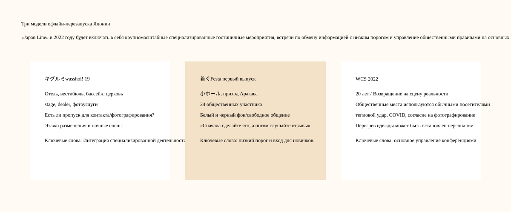
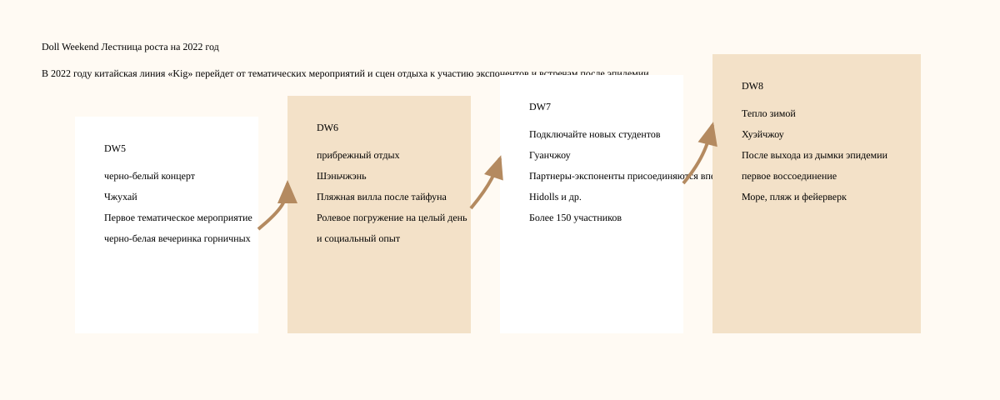

# Хроника Kigurumi 2022 года

> В томе собраны события, работы и публикации этого года. Анонсы отделены от подтверждённых записей о проведении.

## Хроника 2022 года

### Январь-февраль: Накануне перезапуска в офлайн-режиме — борьба с эпидемиями по-прежнему является основной переменной всей деятельности.

Материалы мероприятий в этом году, как правило, имеют оттенок «повторного запуска». На 19-й странице キグルミwasshoi! говорилось, что оно было официально проведено после положительного ответа на предыдущее экспериментальное мероприятие, и перечислялись меры противодействия инфекции; первый 着ぐFesta прямо написал, что эпидемическая ситуация немного стабилизировалась и масштабная деятельность постепенно возобновилась, но он все еще надеется предоставить площадку для общения, где не требуется предварительное бронирование и люди могут приходить и играть по своему желанию. Страница COVID «Контрмеры» WCS 2022 требует от лиц с симптомами или риском заражения не приходить на место проведения, измерять температуру при входе, носить маски, избегать разговоров в раздевалке, использовать дезинфекцию и соблюдать социальную дистанцию.[[S3]](#s3)[[S7]](#s7)[[S8]](#s8)

Этот фон не представляет собой единственную вечеринку, но он задает тон мероприятиям kigurumi в течение года. В 2022 году организаторам придется решать одновременно два типа проблем: одни — оригинальные проблемы зрения, отвода тепла, контакта, фотосъемки и переодевания в kigurumi; другой — новые или усугубившиеся проблемы с температурой тела, масками, дезинфекцией, интенсивным контактом, разговорами в раздевалке и записью контактной информации после эпидемии. Другими словами, события 2022 года — это не просто «возвращение к состоянию, существовавшему до пандемии», а, скорее, новое определение оффлайн-участия в рамках новых правил общественного здравоохранения.

### 26-27 марта: FGO × AnimeJapan 2022 — официальное возвращение cosplayer / kigurumi greeting stage в начале года.

Выставка AnimeJapan 2022 проходила в 东京 Big Sight 26–27 марта 2022 года. На официальной странице Fate/Grand Order указано, что стенд FGO расположен в восточном 3 зале A04, и указано «コスプレイヤー･ 着ぐるみ». План «グリーティングステージ». На странице также указано, что специальный этап FGO пройдет 27 марта с 13:15 до 13:50, а общая выставка пройдет в зале 东京 Big Sight East 1-8.

Этот рекорд важен в 2022 году, поскольку он показывает, что официальный IP kigurumi/талисман не отказался от участия в выставках из-за сбоев, вызванных пандемией. AnimeJapan — выставка коммерческой анимации. Целью посетителей является просмотр новых работ, посещение стендов, покупка периферии, участие в сцене, фотографирование и общение. FGO записывает приветствие косплеера и kigurumi в информацию на стенде, указывая на то, что чиновникам все еще необходимо улучшить качество обслуживания на месте с помощью «тел персонажей».

Официальное приветствие фанатов animegao kigurumi — это не одна и та же организационная форма. kigurumi на стенде FGO является частью официального разрешения, официальной эксплуатации и порядка стенда; энтузиаст kigurumi больше посвящен личным ролевым играм, созданию фотографий, взаимодействию с сообществом и физическому самовыражению. Но они будут влиять друг на друга на уровне аудитории: обычные зрители с большей вероятностью поймут этот визуальный язык, когда они сначала увидят «движущихся двухмерных персонажей» на официальном стенде, а затем увидят действия фанатов или отдельных игроков.

Согласно kigurumi Chronicles, это ключ к «мейнстримовой видимости». Многие люди приходят в культуру kigurumi не с форума animegao или собраний игроков, а впервые знакомятся с официальными персонажами-талисманами на масштабных IP-мероприятиях. Запись 2022 FGO × AnimeJapan является частью этого публичного входа.

### 9–10 апреля: Глава 19 キグルミwasshoi! — Комплексное восстановление специальных мероприятий гостиничного типа.

9-10 апреля 2022 года 19-я выставка キグルミwasshoi! пройдет в Hotel East 21 Tokyo в Токио. На официальной странице указано, что после хорошего отклика от предыдущего экспериментального мероприятия, на этом мероприятии снова пройдут обмены фотографиями в роскошном месте и большом зале, а также будут подготовлены фотоконкурсы, выставки производителей, планирование stage и другой контент. На странице день 1 указан как 9 апреля, а день 2 — 10 апреля; В день 1 используется East21 Hall, коктейль lounge «Панорама», и он открыт для гостей отеля под позывным night pool; День 2 использует East21 Hall, garden pool и платный chapel.[[S3]](#s3)

Это событие является важным узлом в офлайн-истории Японии kigurumi в 2022 году. Это не просто небольшое место, где обычные фанаты могут фотографироваться, но и сочетание вестибюля отеля, lounge, бассейна, церкви, жилого этажа, фотоуслуг, сценических программ, планирования выставок dealer и соревнований. Для kigurumi такая комплексная площадка очень ценна: зал подходит для масштабных групповых фотографий и общения, lounge подходит для фотографий атмосферы персонажей, бассейн и церковь создают особый фон, а размещение решает проблемы головных ящиков, длительного ношения, ночных съемок и физического восстановления.

Но поскольку правила являются всеобъемлющими, они также должны быть всеобъемлющими. На странице есть механизм разрешения на контакт и фотографирование. Участники могут использовать pass, чтобы указать, разрешают ли они контакт и фотографирование. Если другая сторона pass заявляет, что не хочет, чтобы к ней прикасались, ей не разрешается прикасаться. Также запрещено неподобающее поведение в общественных местах. Этот механизм заслуживает документирования, поскольку невербальное общение в kigurumi естественно затруднено: панцирь головы закрывает лицо, голос может быть не слышен ясно, а исполнитель часто не говорит, чтобы сохранить характер. Выражение границ с помощью цветов или типов пропусков — это способ перевести согласие из устного общения в визуальные правила.[[S3]](#s3)

Правила фотографии одинаково строги. На странице требуется согласие субъекта перед съемкой и разрешение перед загрузкой фотографий; запрещено длительное время занимать место съемки, запрещено снимать в гримерке и туалете, запрещено просить испытуемого принимать сложные или неуместные позы для ответа, запрещено без разрешения давать интервью средствам массовой информации и вести репортажи без разрешения. Он также налагает ограничения на фотографическое оборудование, например, большие объективы и размещение оборудования не должны мешать деятельности. Эти правила показывают, что «фотосъемка» на мероприятии kigurumi — это не просто нажатие на кнопку спуска затвора, но включает в себя согласие субъекта, порядок места проведения, право на использование работы и доверие сообщества.[[S3]](#s3)

Об ограничениях в местах общего пользования отеля также стоит написать. На странице поясняется, что у гостей отеля будут удобные способы его использования, например, выезд на стойке регистрации и перемещение в пределах отведенной территории. Однако в общественных местах, таких как вестибюль на втором этаже, носить одежду kigurumi запрещено. Участников также просят не связываться с местом проведения мероприятия, не беспокоить обычных гостей отеля и не перемещаться в неотведенных для этого местах. Такое правило гласит: kigurumi Специализированные мероприятия, даже если они арендуют помещения отеля, все равно проводятся в рамках обычных коммерческих объектов и должны учитывать границы между участниками, гостями отеля, персоналом и публикой.[[S3]](#s3)

Правила одежды и поведения также отражают сложность управления сообществом в 2022 году. На странице запрещен косплей общего вида. При участии под именем kigurumi колготки телесного цвета считаются «кожными» и должны избегать очертаний или обнажения интимных частей тела, а также избегать чрезмерного сексуального выражения; запрещая обувь, которая может нанести вред объекту, запрещая реалистичную униформу представителей власти, запрещая опасный реквизит и airgun, которые могут запускаться, запрещая спреи, плазму и другие предметы, которые могут загрязнить объект. Внешней аудитории эти правила могут показаться тривиальными; для организаторов мероприятий они напрямую связаны с договорами о месте проведения мероприятия, ответственностью за безопасность, общественным впечатлением и последующей возможностью продолжать арендовать помещение.[[S3]](#s3)

С позитивной исторической точки зрения 19-я выставка キグルミwasshoi! объясняет, что специальное мероприятие kigurumi в Японии в 2022 году уже обладает высокими организационными возможностями: оно может мобилизовать отели, несколько сцен для фотосъемок, stage, dealer, конкурсы, официальную фотосъемку и организацию размещения. С негативной или рискованной исторической точки зрения это также показывает, что перезапустить оффлайн непросто: за каждым красивым пространством, которое можно сфотографировать, стоит набор правил движения, контакта, фотографирования, общественных мест и безопасности. kigurumi в 2022 году — это не просто «наконец-то снова быть вместе», а, скорее, переписать границы, собираясь снова.

### Примерно в начале июня: Doll Weekend 5 «Черно-белый концерт» — первое тематическое мероприятие китайской линейки DW.

На официальной странице Doll Weekend 5 тема мероприятия указана как «Черно-белый концерт», а место проведения — Чжухай, Гуандун. В нем также объясняется, что Doll Weekend впервые запланировал тематическое мероприятие — черно-белую вечеринку горничных, что делает вечеринку более ритуальной и захватывающей. Публичное видео Bilibili «Как куклы обычно проводят свои дни рождения — Doll Weekend 5» было выпущено 6 июня 2022 года. Название и теги также явно указывают на сцены Doll Weekend 5 и kigurumi/Kig. Таким образом, в этой статье DW5 упоминается как общедоступный узел примерно в начале июня 2022 года; строго говоря, дата Bilibili — это время выхода публичного видео, которое не обязательно является датой события.[[S9]](#s9)[[S10]](#s10)[[S14]](#s14)

Ключевое слово для DW5 — «тема первого раза». На более ранних встречах с фанатами участники могли просто собираться с разными персонажами, фотографироваться и общаться; в то время как тематические действия обеспечат общий визуальный порядок для всех персонажей. Тема черно-белой вечеринки горничных объединяет цвет одежды, атмосферу сцены, чувство ритуала и коллективную память. Темой кампании kigurumi /doll был не просто дресс-код, а способ объединить разных персонажей в одном повествовании.

Тема горничной также очень подходит для раннего развития китайского круга «Kig». Оно не только возникает из смешанного воображения двухмерных изображений, кофе горничной, японского косплея, вечеринок по случаю дня рождения и сцен обслуживания, но также позволяет персонажам сформировать относительно единый язык действий в событии: поза стоя, подача блюд, поздравления, групповые фотографии, взаимодействие, ощущение сцены или вечеринки. Черно-белая цветовая гамма уменьшает цветовой конфликт между персонажами, облегчая формирование визуального целого на групповом фото.

DW5 также показывает, что китайский круг kigurumi /doll начинает распространяться по платформе визуализации. Название видео Bilibili объясняет эту сцену широкой аудитории словами «Как куклы обычно проводят свои дни рождения», снижая порог «что это за занятие?» Это не объяснение терминологии для профессиональных статей, а использование более интуитивных элементов, таких как дни рождения, вечеринки, горничные, два измерения и милые тела, чтобы дать аудитории понять, что «младенцы» также имеют свою собственную социальную повседневную жизнь.

### Примерно в конце июля: Doll Weekend 6 «Каникулы на побережье» — приморская вилла после тайфуна и всепогодное погружение в персонажи.

На официальной странице Doll Weekend 6 написана тема «Отпуск на побережье», место действия — Шэньчжэнь, провинция Гуандун, и объясняется, что это отдых на пляжной вилле «после тайфуна», создающий погружение персонажа на целый день и социальный опыт. Записи общедоступного поиска Bilibili показывают, что соответствующий художественный фильм «DW6 Feature Film How Dolls Vacation на пляже» был выпущен 27 июля 2022 года, поэтому в этой статье DW6 указан как узел примерно в конце июля 2022 года; Также следует отметить, что время выхода видео не обязательно совпадает с точной датой мероприятия.[[S9]](#s9)[[S11]](#s11)[[S15]](#s15)

Значение DW6 в том, что оно превращает мероприятие из тематической вечеринки в помещении в курортную обстановку. Пляжная вилла и всепогодное погружение в образ означают, что участники не просто завершают фотосессию за несколько часов, но сохраняют состояние персонажа, социальное состояние и состояние фотографии в течение более длительного периода времени. Это более требовательно к игрокам kigurumi /doll: время ношения головного убора, порядок одевания, отдых и увлажнение, кондиционируемое помещение, влажность морского бриза, соль, земля, транспорт и ритм фотосъемки - все это будет влиять на впечатления.

Выражение «после тайфуна» тоже имеет смысл реальности. Это показывает, что событие не является абстрактной студийной съемкой, а происходит в реальной погоде и реальной географической среде. На побережье сильные ветры, высокая влажность и яркий свет. Изменения погоды напрямую затронут парики, одежду, головные уборы и фототехнику. Для обычного косплея это уже проблемы; с kigurumi видимость головы, рассеивание тепла и устойчивость подошвы еще больше усугубляют проблему. Таким образом, DW6 — это не только попытка визуального праздника, но и тест на адаптируемость к сценам на открытом воздухе или полуна открытом воздухе.

По сравнению с черно-белой вечеринкой горничных DW5, «Seaside Vacation» DW6 уделяет больше внимания самому пространству. Вечеринка горничных – это одежда и церемония, а отдых на пляже – это обстановка и время. Персонажи, перемещающиеся по виллам, морю, коридорам, зонам отдыха, террасам и наружному освещению, будут ближе к повседневным или туристическим повествованиям, чем в одном зале. Это изменение важно для наблюдения за китайским кругом 娃/Kig, поскольку оно позволяет проводить активности «娃/Kig» не только в выставочных залах или арендных залах, но также во время отпуска, в городах, отелях, живописных местах и ​​фототурах.

DW6 также проложил путь к морю и фейерверкам в продолжении DW8. Китайская линия Doll Weekend в 2022 году — это не история прямых цифр, а постоянное экспериментирование со сценариями: дни рождения/прислуги, пляжные домики, мероприятия для участников, зимние встречи. Каждое испытание улучшает понимание организатором места проведения, людей, фотографий, транспорта и безопасности.

### 30–31 июля: FGO Fes. 2022 ~7-я годовщина~—— возвращение офлайн-юбилея примерно через три года.

30–31 июля 2022 г., Fate/Grand Order Fes. В 2022 году ~7-летие~ пройдет в 幕张 Messe. В отчете Inside Games говорится, что из-за воздействия новой коронной эпидемии FGO Fes. стало первым реальным событием примерно за три года; На площадке welcome gate создали вход на фестиваль через большой полукруглый экран, red carpet и модель земли, а зрителей приветствовали официальные косплееры и kigurumi. Объектами покрытия являются 9 официальных косплееров и 6 kigurumi.[[S2]](#s2)

Это событие является ежегодным центральным событием официальной линейки IP kigurumi на 2022 год. AnimeJapan 2022 — это greeting stage на выставочном стенде, а FGO Fes. 2022 — это захватывающий прием у входа на юбилейное торжество. Примерно через три года отсутствия реальных событий официальные косплееры и kigurumi приветствовали фанатов на welcome gate с сильным символическим значением: вместо того, чтобы просто смотреть обновления игры на экране, игроки снова участвовали в фестивале, состоящем из тела персонажа и живого пространства.

В число шести kigurumi, записанных в отчете, входят героиня, アルテラ, マシュ, ジャンヌ・ダルク, セイバー,レオナルド・ダ・ヴィンチ. Они появляются в отдельных ролях вместе с официальными косплеерами, образуя уникальный гибридный ландшафт «настоящих персонажей + персонажей kigurumi», уникальный для выставочного сайта FGO. Для зрителей персонажи больше не просто остаются на открытке, видео или выставочной доске, а становятся существами, которых можно рассматривать, фотографировать и взаимодействовать с ними у входа, красной дорожки и фоновой музыки.[[S2]](#s2)

С точки зрения хроники kigurumi ценность этого типа официального kigurumi заключается в публичной видимости. Он не будет напрямую приравниваться к сообществу игроков animegao и не будет напрямую отражать творческий подход отдельных Kigerов; но это изменит восприятие широкой аудиторией персонажей с капюшонами. Когда легионы фанатов видят, как персонаж приветствует себя в форме kigurumi на официальных мероприятиях, а позже видят отдельных игроков на комических конвенциях или специализированных мероприятиях, эту физическую форму легче понять как «презентацию персонажа», а не просто странное зрелище.

FGO Fes. 2022 также отражает эмоциональную ценность офлайн-активностей после эпидемии. В сообщениях подчеркивается, что это возвращение реального события примерно через 3 года, что важно для официального kigurumi: вся суть полнокапюшонного персонажа именно в "живости". Если kigurumi не находится в одном пространстве со зрителями, ему будет трудно махать руками, стоять, позировать и ходить. Возвращение в 2022 году еще раз подтверждает незаменимую роль kigurumi в офлайн-операциях IP.

### 5-7 августа: World Cosplay Summit 2022 – 20-летие, возвращение реальной сцены и правила публичного пространства

World Cosplay Summit 2022 пройдет в Нагое/Айти с 5 по 7 августа 2022 года. На официальной странице указано, что World Cosplay Championship Stage Division проходил в зале Центра искусств и культуры Айти 6 августа, и говорится, что это был первый раз примерно за 3 года, когда он вернулся на настоящую сцену; Из-за постэпидемических условий въезда и путешествия в соревнованиях примут участие только команды, которые смогут приехать в Японию.[[S4]](#s4)

Значение WCS 2022 для kigurumi не в том, что это событие, специфичное для kigurumi, а в том, что оно представляет собой открытие публичного пространства основной системой косплея. К площадкам WCS относятся торговые улицы Oasis 21, Hisaya-odori Park, Osu, Flarie и другие места. Официальные правила неоднократно напоминают, что эти пространства предназначены не только для участников косплея. Обычные посетители, прохожие, пользователи магазинов и объектов также активны в этой же зоне. Для kigurumi, полного головного убора, тяжелой одежды или одежды, закрывающей лицо, такая реклама оказывает большое давление: ограниченный обзор, неудобное движение, трудно подтвердить личность, легко быть сфотографированным прохожими и с большей вероятностью вызвать недопонимание в людных местах.[[S5]](#s5)

Правила фотографии не менее важны. WCS 2022 требует, чтобы вам не разрешалось занимать локацию в течение длительного времени во время фотосъемки, вам не разрешалось снимать без согласия, а также вам не разрешалось снимать под низкими углами или в позах, где видно нижнее белье; вам также необходимо получить согласие субъекта перед загрузкой фотографий на SNS. Для kigurumi такие правила защищают не только субъектов, но также фотографов и само мероприятие. Потому что исполнители kigurumi часто не могут быстро отказаться ни выражениями, ни словами, а другая сторона также может ошибочно подумать, что «персонажа можно снимать, если он присутствует». Правила превращают согласие из расплывчатой ​​социальной вежливости в явные требования к активности.[[S5]](#s5)

Страница мер против теплового удара для WCS 2022 также имеет решающее значение. Страница напоминает, что во время мероприятия может возникнуть сильная жара. Участники должны приносить с собой напитки, часто пополнять запасы воды, правильно отдыхать и использовать охлаждающие средства; если им жарко, не заставляйте себя участвовать; во время мероприятия вы можете заходить в раздевалку несколько раз, и вам следует выбирать одежду, которая легко рассеивает тепло, и отдавать приоритет вашему физическому состоянию. Для исполнителей kigurumi это не общие напоминания, а правила безопасности жизни: головные уборы и колготки влияют на отвод тепла, парики и набивка усиливают тепло, обувь персонажей может замедлять движения, а снятие головы для отдыха может предполагать конфиденциальность и статус персонажа.[[S6]](#s6)

Контрмера COVID представляет собой еще один уровень управления. Страница WCS 2022 требует, чтобы лица с симптомами, риском заражения или ограничениями на поездки не приходили на место проведения мероприятия; При входе будут проводиться проверки температуры, и лица с температурой выше 37,5 градусов или с явными симптомами не будут допущены к входу; необходимо избегать разговоров в раздевалке, участники должны носить маски, дезинфицировать и соблюдать дистанцию, а также рекомендуется использовать приложение для подтверждения контактов. Для участников kigurumi такие правила создадут практические конфликты с панцирями для головы и масками: когда носить обычную маску, когда входить в панцирь для головы персонажа, когда снимать голову и как незаметно переодеться в раздевалке — все это вопросы, которые необходимо решать на месте.[[S7]](#s7)

### 6 августа: первый выпуск 着ぐFesta — отправная точка низкопороговой встречи по обмену информацией.

6 августа 2022 года 着ぐFesta впервые прошел в サンパール荒川 Кодори в округе Аракава. Страница TwiPla называется «着ぐFesta! 着ぐるみ さんと 着ぐるみ 好きさんのcommunicate», время — 10:00–16:00, хост — GarageStudioC7. На странице поясняется, что эпидемическая ситуация несколько стабилизировалась и масштабные мероприятия постепенно возобновились. Многие игроки kigurumi выразили надежду на событие, в котором можно будет легко играть без предварительной записи, поэтому организаторы арендовали зал, вмещающий около 300 человек и позволяющий проводить свадьбы и другие мероприятия. Открытая регистрация показала 24 участника.[[S8]](#s8)

Значение 着ぐFesta впервые лежит не в шкале, а в «пороге». 19-е キグルミwasshoi! — это комплексное мероприятие гостиничного типа с богатым содержанием, но это также означает, что маршрут, сборы, подготовка и правила усложняются; WCS — это массовая крупномасштабная конференция с большей нагрузкой на общественные места; и первый 着ぐFesta больше похож на пространство с низким порогом, где в первую очередь могут собраться игроки kigurumi и люди, которым нравится kigurumi. На странице указано, что условия участия включают «着ぐるみ の方々ならびに 着ぐるみ の方々のファンの方々», и вы можете участвовать, даже если у вас нет собственного kigurumi, который обеспечивает вход для новичков и зрители.[[S8]](#s8)

Дизайн площадки также отражает потребности kigurumi. На странице указано, что весь этаж зарезервирован, а холл и вход могут использоваться kigurumi. Музыкальную комнату и сцену можно использовать как раздевалки и cloak, а багаж можно оставить на стойке регистрации. Для kigurumi наличие достаточного количества одежды, багажа, ящика для головы и места для отдыха часто является более важным, чем сценическая программа. Обычную одежду для косплея можно упаковать в сумку, но головной убор kigurumi большой, хрупкий и требует устойчивого размещения; Одежда цвета кожи, парики, одежда персонажей и обувь также требуют более тщательного одевания.[[S8]](#s8)

На первой странице также указано, что организатор подготовил не слишком много масштабного контента и надеется, что участники смогут создать атмосферу дня посредством свободного общения; при этом оператор будет понимать, какие услуги хотят участники во время данного мероприятия, чтобы они могли подготовиться в будущем. На месте подготовлены черно-белый фон и фототехника, а фотографии, сделанные во время мероприятия, будут отсортированы и загружены позже. Такой подход «сначала сделай это, а потом улучшайся на основе отзывов» очень соответствует атмосфере перезапуска в 2022 году.[[S8]](#s8)

Эта кампания также уже включает базовые меры контроля рисков. На странице указано, что люди, которые в прошлом создавали проблемы в других видах деятельности или могут вызвать проблемы, не должны участвовать. Организатор может не объяснять причины; участники также обязаны соблюдать общие меры предосторожности. Этот тип текста, хотя и краткий, показывает, что небольшая кампания kigurumi должна с самого начала обеспечивать доверие сообщества, безопасность событий и исключение проблем. Поскольку мероприятия kigurumi часто опираются на сеть знакомств и невербальное взаимодействие, когда кто-то неоднократно переходит черту, это может быстро подорвать чувство безопасности новичков и исполнителей.[[S8]](#s8)

### Не позднее 13 сентября: Doll Weekend 7 «Соединяя новую жизнь» — присоединяются партнеры-экспоненты и масштабируются более 150 человек.

Официальная страница Doll Weekend 7 помещает событие в Гуанчжоу, называет более 150 участников и отмечает первое участие партнеров-экспонентов. Основной публичный фильм опубликован 13 сентября 2022 года, а его описание говорит, что DW7 успешно завершился. Следовательно, событие закончилось не позднее этой даты, но ни сайт, ни видео не называют точный день проведения.[[S9]](#s9)[[S12]](#s12)[[S16]](#s16)

DW7 — это важный шаг в кругу «Китайский 娃/Kig 2022 года»: от встречи друзей к связям с промышленностью. Участие экспонентов означает, что мероприятие больше не является просто спонтанным собранием игроков, а стало местом, где производители, поставщики аксессуаров, маски/костюмы/сопутствующие сервисные компании вступают в контакт с игроками. Для kigurumi /кукольной культуры система экспонентов очень важна: головные уборы, одежда телесного цвета, парики, одежда, очки, обувь, наполнение, фотография, постпроизводство, хранение и транспортировка — все это может образовывать цепочку поставок. Если мероприятие может привлечь экспонентов, это означает, что масштабы участников и покупательский спрос достигли определенного уровня стабильности.

### Не позднее 27 декабря: Doll Weekend 8 «Зимний теплый сбор» — воссоединение, пляж и фейерверк после выхода из дымки эпидемии.

Официальная страница помещает DW8 в Хуэйчжоу и описывает первое воссоединение после выхода из тени пандемии через море, пляж и фейерверк. Официальный фильм, опубликованный 27 декабря 2022 года, также прямо указывает побережье Хуэйчжоу. Это подтверждает, что событие состоялось к этой дате, но не устанавливает точный день проведения.[[S9]](#s9)[[S13]](#s13)[[S17]](#s17)

DW8 — эмоциональное завершение китайской линии Doll Weekend 2022 года. Предыдущий DW5 делал упор на тему первого раза, DW6 делал упор на пляжные виллы и погружение в характер, DW7 делал упор на участие экспонентов и 150+; DW8 берет за основу «воссоединение». Когда деятельность возобновляется после эпидемии, самое главное – это не просто количество людей, а то, что участники наконец смогут снова собраться вместе, снова сфотографироваться и восстановить социальные отношения посредством физического присутствия. Для kigurumi /doll онлайн-общение не может заменить оффлайн-встречи, поскольку тела персонажей, движения, групповые фотографии, освещение, общение и воспоминания о событиях должны происходить в одном и том же пространстве.

«Пляж, море и фейерверк» также отражает постоянное стремление Doll Weekend к повествованию сцен. Фейерверки — сильный общественный ритуал: ночью они привлекают всеобщее внимание и делают память о событии более праздничной. Для участников kigurumi /doll изображение персонажей на фоне фейерверков имеет сильный фантазийный оттенок; но это также означает управление объектом, концентрацию персонала, смену освещения, безопасность в ночное время и планирование фотографического оборудования. DW8, как теплая встреча в конце года, — это не только красивый имидж, но и отражение способности организатора организовывать ночные мероприятия на свежем/полуоткрытом воздухе.

В этой статье DW8 рассматривается не как уменьшенная версия последующих крупномасштабных мероприятий, а как конец самого 2022 года: пережив неопределенность эпидемии, китайский 娃/Kig кружок передвинул тему года от «повторной попытки» к «воссоединению» через море, пляж, фейерверки и воссоединение.

## Источник

**[S2] Inside Games: прямая трансляция FGO Fes. 2022, документирующая возвращение реального события примерно через три года, с 9 официальными косплеерами и 6 участниками kigurumi.**
https://www.inside-games.jp/article/2022/07/30/139502.html

**[S3] Официальная страница 19-го мероприятия キグルミwasshoi!.**
https://www.wasshoi.kigdoll.net/kigwasshoi19

**[S4] World Cosplay Summit 2022 Stage Division PAGE.**
https://worldcosplaysummit.jp/2022/en/championship/stagedivision/

**[S5] World Cosplay Summit Страница правил косплея 2022 года.**
https://worldcosplaysummit.jp/2022/en/cosplay/rule/

**[S6] World Cosplay Summit Страница по предотвращению теплового удара, 2022 г.**
https://worldcosplaysummit.jp/2022/en/cosplay/heatstroke/

**[S7] World Cosplay Summit 2022 COVID-19 Страница мер безопасности.**
https://worldcosplaysummit.jp/2022/en/cosplay/covid/

**[S8] TwiPla: 着ぐFesta! Первая страница мероприятия 2022 года.**
https://twipla.jp/events/519532

**[S9] Doll Weekend официальная страница прошедшего мероприятия.**
https://dollweekend.cn/cn/event/

**[S10] Doll Weekend 5 Официальная страница «Черно-белого концерта».**
https://dollweekend.cn/cn/event/dw5/

**[S11] Doll Weekend 6 Официальная страница «Coastal Holidays».**
https://dollweekend.cn/cn/event/dw6/

**[S12] Doll Weekend 7 Официальная страница «Объединение новых студентов».**
https://dollweekend.cn/cn/event/dw7/

**[S13] Doll Weekend 8 Официальная страница «Зимнего теплого сбора».**
https://dollweekend.cn/cn/event/dw8/

**[S14] Bilibili: общедоступный индекс видео Doll Weekend 5, выпущенный 6 июня 2022 г.**
https://www.bilibili.com/video/BV1xF411V7nF/

**[S15] Bilibili: общедоступный индекс видео Doll Weekend 6, выпущенный 27 июля 2022 г.**
https://www.bilibili.com/video/BV1Ra411K7ss/

**[S16] Bilibili: основной публичный фильм Doll Weekend 7, опубликованный 年糕蛋炒饭 13 сентября 2022 года; описание сообщает о завершении события.**
https://www.bilibili.com/video/BV1Ke4y1y7Kq/

**[S17] Bilibili: официальный фильм Doll Weekend 8, опубликован 27 декабря 2022 года.**
https://www.bilibili.com/video/BV1Yd4y1a7RU/
