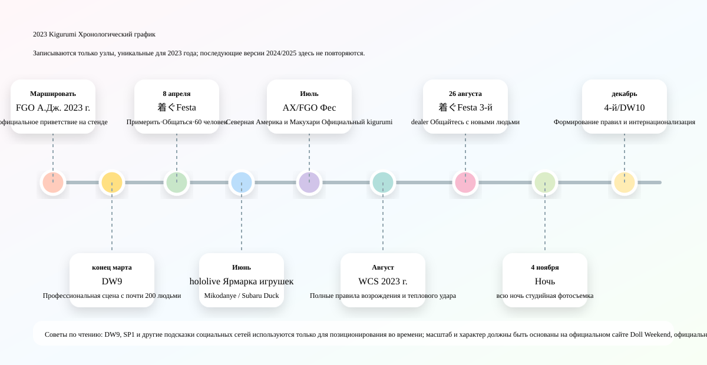
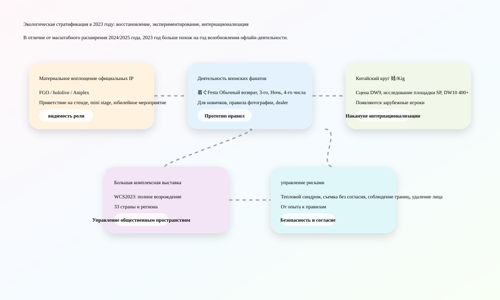
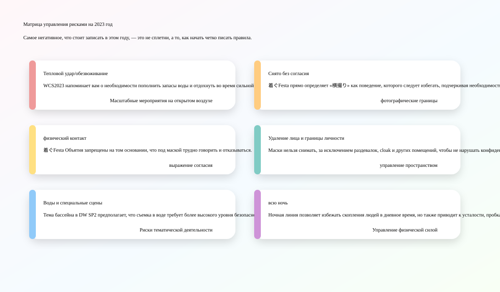
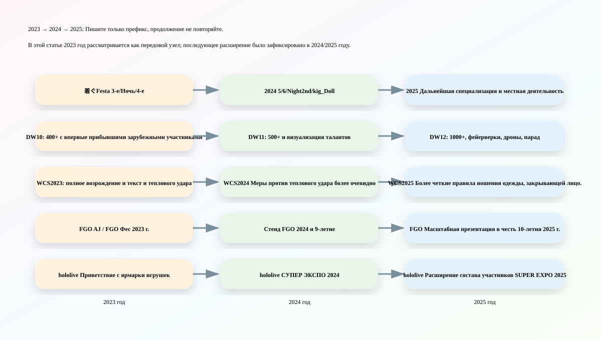

# Хроника Kigurumi 2023 года

> Уровень написания: эта статья соответствует структуре «2025 Kigurumi Chronicle» и «2024 Kigurumi Chronicle», но не повторяет версии событий, обновления правил и расширения отрасли, которые были зафиксированы в 2024 и 2025 годах. Если для той же серии действий уже существовала предварительная версия, независимые правила, узел масштабирования или первые изменения в 2023 году, ее статус в 2023 году будет следующим: записано; если это просто базовое описание, подробно написанное в последующие годы, в этой статье будет представлено только сокращенное описание.

---

## 0. Границы данных, принципы устранения повторов и инструкции по достоверности

**kigurumi** в этой хронике 2023 года по-прежнему организован в соответствии с широким калибром предыдущих двух статей: включая animegao kigurumi / bishoujo 着ぐるみ / ролевая игра в маске, doller, офлайн-активности китайского круга «娃 / Kig / Kiger», официальный IP. Приветствие в стиле талисмана 着ぐるみ, а также текст правил, включающий полный головной убор, закрытие лица, тепловой удар и согласие на фотографирование в крупномасштабных косплей-мероприятиях. Терминология подробно объяснена в статье 2025 года. В этой статье не будет повторяться длинное определение. Там, где это необходимо, он будет различать только четыре типа информации: «официальный mascot greeting», «деятельность энтузиаста kigurumi», «Doll Weekend / 娃展 в китайском круге» и «основные правила конференции по косплею».

В этой статье принят принцип приоритета публичной информации. К источникам высокой надежности относятся страницы событий FGO, WCS, hololive, Aniplex, Doll Weekend и TwiPla; освещение в СМИ для увеличения размера площадки, количества персонажей и расположения стендов; X/Twitter, Facebook, Bilibili, YouTube Другие социальные платформы используются только для оценки хронологии или атмосферы события и не используются в качестве основания для непроверенных обвинений. Анонимные разоблачения, частные групповые чаты, удаленные сообщения и скриншоты слухов не включаются в фактические данные.

Контент, отсортированный в 2024 и 2025 годах, будет очищен от повторов по следующим правилам:

| Тип устранения повторов | 2023 метод обработки статьи |
|---|---|
| Та же череда событий продолжится и в 2024/2025 году. | Пишите только предварительную версию, правила текущего года и масштаб текущего года на 2023 год, а не повторяйте детали последующих лет. |
| Объяснение термина 2025 kigurumi | Только сохраняйте необходимый калибр и больше не повторяйте длинные определения. |
| 2024/2025 Письменный WCS Тепловой удар, правила закрытия лица | Напишите только предтекст и предысторию "полного возрождения", которая появилась в 2023 году. |
| 2024/2025 Написано Doll Weekend 11/12 | Пишите только DW9, SP1, SP2, DW10 и канун интернационализации в 2023 году. |
| Официальное приветствие IP продолжится и в последующие годы. | Просто пишу о версии шоу 2023 года и смене ролей/номера. |
| Слухи и споры о персонажах | Не повторяйте непроверенные обвинения, документируйте только давление со стороны руководства, указанное в правилах раскрытия информации. |

---

## 1. Общий контекст в 2023 году

2023 год — это не уменьшенная версия 2024 или 2025 года, а более фундаментальный «Год воссоединения». Если 2024 год — это год, когда формируется специализированная деятельность, концентрируется производство знаний и становится явным управление рисками, а 2025 год — это год, когда масштабы и трансграничная трансформация еще больше ускоряются, то ключевые слова 2023 года ближе: **Офлайн-восстановление после эпидемии, регуляризация деятельности фанатов, стабильное возвращение официальных IP-приветствий и канун интернационализации китайского круга 娃/Kig**.

Первое основное направление — возобновление деятельности японских энтузиастов и прототип правил. Публичная информация показывает, что 着ぐFesta покинул страницы активности, доступные для поиска, в апреле, августе, ноябре и декабре 2023 года: в апреле было 60 участников публичной регистрации, демонстрации и примерки масок, а также фотографий на белом и черном фоне; 3 августа. Начинаем более четко подчеркивать социальные барьеры, вызванные «дружественностью к новичкам» и «着ぐるみ さんは语せない»; Ноябрьская ночь попробовала студийную фотосъемку всю ночь; 4 декабря был запрещен 横撮り, запрещены объятия, запрещены длинные предметы, запрещено удалять лицо, кроме как в раздевалке/クローク, на уроках фотографии, dealer Содержание, такое как участие, написано более систематически. Это показывает, что небольшие мероприятия kigurumi в Японии в 2023 году перешли от «удержания места сбора» к «вписыванию правил общения, фотографии и границ тела».

Вторая тема заключается в том, что материальное воплощение официальных IP продолжает появляться на крупных выставках. FGO организовал приветствие косплеера / kigurumi в AnimeJapan 2023; FGO Фес. На Летнем фестивале 2023 года средства массовой информации зафиксировали 9 официальных косплееров и 7 тел kigurumi в зоне ожидания welcome road для приветствия публики; Aniplex of America организовал FGO mini stage на стенде Entertainment Hall на выставке Anime Expo 2023 и заявил, что будут выступления любимых фанатами kigurumi; hololive production будет в Токио (おもちゃショー 2023 г.). Выставляйте и организуйте kigurumi приветствия «みこだにぇー» и «スバルドダック» в дни общедоступных мероприятий. Эта линия не совсем такая же, как у фанатов animegao, но она делает «двумерных персонажей, появляющихся на сцене в полных балаклавах/телах-талисманах» доступными для широкой аудитории.

Третья основная линия заключается в том, что китайская система Doll Weekend переходит от стадии к интернационализации. В статье 2025 года уже писалось о многотысячной толпе DW12, фейерверках, дронах и парадах; в статье 2024 года было написано о 500+ в DW11 и визуализации талантов; в этой статье описана только предварительная съемка 2023 года: на странице «Свет сцены» DW9 указано, что она впервые оборудована профессиональной сценой и большим экраном и собрала почти 200 участников; SP1 отправился в Хэюань, чтобы осмотреть место проведения и снять рекламный видеоролик DW10; SP2 на тему «Битва в кукольном бассейне»; DW10 пройдет в Фошане, провинция Гуандун, в декабре 2023 года. На официальной странице указано, что он впервые примет зарубежных участников, число людей превысит 400, и станет международной платформой по обмену куклами для мультикультурных пересечений.

Четвертая тема — это правила восстановления и безопасности для основных конвенций косплея. WCS 2023 официально рекламируется как «полное возрождение», и мероприятие пройдет в Нагое/Айти с 4 по 6 августа; По данным Министерства иностранных дел, в чемпионате мира по косплею в том году приняли участие 33 национальные и региональные команды. Хотя на странице правил WCS 2023 года не перечислены такие категории, закрывающие лицо, как kigurumi, gawa-cos, doller и полнолицевые маски, так же четко, как в 2025 году, в правилах реквизита для костюмов написано: категории 着ぐるみ, которые переэкспонированы, слишком острые, слишком длинные, с трудом при ходьбе или могут вызвать обезвоживание может быть отклонено персоналом по его усмотрению. Страница профилактики теплового синдрома также напоминает, что день соревнований 2023 года, как ожидается, будет очень жарким и потребует гидратации, отдыха, охлаждения и поддержания физической формы.

Таким образом, годовое положение kigurumi в 2023 году можно резюмировать следующим образом: **Это не самый крупный год, но ведущий год для многих последующих расширений. **Регуляризация 着ぐFesta, интернационализация DW10, полное возрождение WCS, официальное приветствие FGO/hololive/Aniplex, а также публичный текст по вопросу согласия на тепловой удар и фотографирование – все это прокладывает путь к более крупной и четкой системе в 2024 и 2025 годах.

---

## 2. Хроника 2023 года

### 25-26 марта: FGO × AnimeJapan 2023 — возвращение стенда официального косплеера / kigurumi

Fate/Grand Order будет выставлен на выставке AnimeJapan 2023 в Big Sight в Токио с 25 по 26 марта 2023 года. На официальной странице указано, что стенд FGO расположен в 4 зале J62, выставочное здание Big Sight East, Токио. В состав стенда входит «Призыв героев». photo studio, демонстрация Благородного Фантазма, официальная продажа товаров и «コスプレイヤー･着ぐるみグリーティング». Этот рекорд является важным началом официальной линейки IP kigurumi в 2023 году, поскольку он не является временным появлением одного талисмана, а вписан в содержание работы стендов масштабных выставок.[[S1]](#s1)

AnimeJapan характеризуется широким составом аудитории, высокой плотностью стендов и сильными потребностями в фотографии. FGO Поместите приветствие kigurumi в информацию о стенде, указывая, что материализация персонажей стала частью опыта работы на стенде. Когда посетители приходят на стенд FGO, они могут увидеть реквизит, стенды, товары, информацию о сцене, а также встретиться с официальным косплеером и kigurumi. Для IP-операций такая схема позволяет перенести мобильные игры с экрана на пространство площадки; для kigurumi Shi это доказывает, что «официальные куклы-персонажи и полное взаимодействие головных уборов» по-прежнему будут одним из обычных инструментов для массовых выставок комиксов в 2023 году.

Он существенно отличается от энтузиаста animegao kigurumi. kigurumi на стенде FGO представляет собой ролевую презентацию под официальным разрешением и управлением оператора. Передвижение, границы взаимодействия, порядок очереди и время фотографирования – все это регулируется управлением стенда; энтузиаст kigurumi уделяет больше внимания личным ролевым играм, фотографии, общению с фанатами и физическому самовыражению. Их нельзя спутать, но в глазах обычных зрителей они вместе создают ощущение, что «двумерные персонажи могут появляться в реальности с телами с полностью закрытыми капюшонами».

По сравнению с событиями FGO в 2024 и 2025 годах значение AnimeJapan 2023 означает «восстановление и бутизация». В статье 2025 года уже зафиксирован более масштабный празднование 10-летия AnimeJapan 2025 и FGO Fes. В этой статье сохранен только указатель 2023 года: официальное приветствие помещено на масштабной выставке в начале года, что является прелюдией к последующей юбилейной презентации FGO Fes. 2023.

### Примерно в конце марта: Doll Weekend 9 «Свет сцены» — сценический узел круга китайского круга 娃/Kig.

На официальной странице Doll Weekend 9 тема обозначена как «Свет сцены», а место проведения — Гуанчжоу, Гуандун. В нем также поясняется, что впервые DW оборудовали профессиональную сцену и большой экран, чтобы сосредоточить внимание на шоу талантов кукол, в котором приняли участие почти 200 человек. Общественность[[S2]](#s2)[[S3]](#s3)

DW9 — важный узел в круге «китайский круг 娃/Kig 2023 года», от обычных собраний до сцены. Его ключевое слово не «самое большое количество людей», а «профессиональная сцена и большой экран». Это означает, что мероприятие больше не вращается только вокруг фотографа и одного Kigerа, но начинает позволять участникам войти в коллективную сценическую среду, которую можно просматривать, отображать и записывать. Сцены и большие экраны могут улучшить выступления персонажей, подиумы, таланты и коллективные выступления перед живой аудиторией, а также облегчить повторное распространение движущихся изображений.

Постановка оказывает двойное влияние на культуру kigurumi/кукол. При взгляде спереди он продвигает «ребенка» от статического фотографического объекта к объекту спектакля: движения персонажей, походка, неподвижные точки, освещение сцены и реакция публики — все это начинает влиять на эффект работы. Если рассматривать негативные стороны или риски, то на сцене также будут усиливаться физические нагрузки, ограничения поля зрения, безопасность на сцене и за ее пределами, температура освещения, музыкальный ритм и ошибки реквизита. Сцена не является простой копией обычного косплей-подиума, особенно для артистов, которые носят головные уборы, имеют ограниченное зрение и не могут четко слышать инструкции персонала.

Запись DW9 в Хроники 2023 года призвана проиллюстрировать, что более 400 зарубежных участников DW10 не появились из воздуха. Постановка DW9 является свидетельством того, что китайский круг начал превращать мероприятие kigurumi/кукла в «показную программу» в 2023 году. Дворец талантов и полная запись 2024 DW11, а также празднование 2025 DW12 — все это можно найти в профессиональной сценической логике DW9.

### 8 апреля: обычное возвращение 着ぐFesta 2023 — примерка маски, белый и черный фон и 60 публичных участников.

8 апреля 2023 года 着ぐFesta провел очередное мероприятие по обмену в サンパール荒川 Кобо, округ Аракава. В заголовке страницы TwiPla отображается дата — 10:00 8 апреля 2023 г., а название мероприятия — «着ぐFesta! 着ぐるみさんと着ぐるみ好きさんのcommunicateイベント». На странице объясняется, что событие возникло благодаря голосу: «Я также хочу событие, которое можно было бы легко воспроизвести без каких-либо оговорок». Место проведения представляет собой зал, вмещающий около 300 человек и позволяющий проводить свадьбы и другие мероприятия; организатор GarageStudioC7. На странице также указано, что этаж места проведения зарезервирован, зал и вход могут использоваться kigurumi, сцена и музыкальная комната используются как раздевалки и cloak, а также есть женские раздевалки. Открытая регистрация показывает 60 участников.[[S4]](#s4)

Важность этого мероприятия заключается в том, что оно одновременно представляет несколько основных потребностей для деятельности японских фанатов kigurumi в 2023 году: пространство для общения, место для переодевания, фон для фотографий, примерка маски, консультация производителя и вход для новичков. На странице написано, что оператор не до конца понял, чего хотят участники услуг, поэтому не подготовил слишком много масштабных планов и надеется подготовить контент в будущем за счет обратной связи от участников; но в то же время на странице организован показ и примерка совместных масок личного продюсера, заявив, что это первый шаг к цели GarageStudioC7 - «пробный してtalk して気軽におying えできる».[[S4]](#s4)

Этот текст имеет огромную историческую ценность. Это показывает, что 着ぐFesta в 2023 году все еще изучает формы деятельности и с самого начала не имеет зрелого процесса. Примерка маски и консультация особенно важны, поскольку входной барьер для animegao kigurumi очень высок: новичку трудно судить о размере корпуса головы, линии обзора, внутреннем пространстве, устойчивости при ношении, подборе парика, пропорциях лица и эффектах одежды цвета кожи только по фотографиям. Возможность примерить его, увидеть реальный продукт и проконсультироваться с производителем на мероприятии эквивалентна перемещению знаний, которые изначально были разбросаны по частным чатам, заказам и сообщениям об опыте в оффлайн.

Фотография на белом и черном фоне также является небольшой, но важной частью инфраструктуры. Моделирование kigurumi часто требует более чистого фона и контролируемого освещения, чтобы подчеркнуть линии персонажа, особенно пропорции большой головы, парика, юбки, одежды и обуви телесного цвета. Если вы снимаете случайно в общественных местах, загроможденный фон, прохожие, заходящие в зеркало, отражения от земли и отклонения цвета света — все это будет влиять на эффект. В апрельском выпуске 着ぐFesta предыстория, примерка и общение помещены в одно и то же пространство, что показывает, что сообщество уже имеет дело с двумя потребностями: «новички начинают работу» и «результаты работы» одновременно.

Разница между этим событием и 5/6-м 着ぐFesta 2024 года также очевидна. В статье 2024 года уже написано о последующих правилах, которые являются более зрелыми. В этой статье зафиксирован «статус разведки» только в апреле 2023 года: у него уже есть 60 публичных участников и предварительные услуги, но направление деятельности все еще ищется на основе отзывов участников. Именно такого рода исследования позволяют 3 августа, Ноябрьской ночи и 4 декабря продолжать совершенствовать правила.

### 8–11 июня: hololive production × Токио (おもちゃショー, 2023 г.) — Официальный талисман выходит на рынок игрушек/семейных товаров.

С 8 по 11 июня 2023 года hololive production будет выставлен на выставке Tokyo おもちゃショー 2023, которая пройдет в Tokyo Big Sight. Согласно отчету Денки ホビーウェブ, hololive production впервые принимает участие в этом мероприятии; Токио おもちゃショー проводится Японской ассоциацией игрушек и является крупнейшей выставкой игрушек в Японии. Первые два дня открыты для персонала, связанного с бизнесом, а последние два дня открыты для широкой аудитории, такой как дети и семьи. В отчете также говорится, что hololive production будет реализовывать приветствие kigurumi на стенде 10 и 11 июня, в дни широкой публики. Символами будут «みこだにぇー» и «スバルドダック». Они будут появляться в 11:00, 13:00 и 15:00 каждый день, каждый раз примерно на 30 минут.[[S5]](#s5)

Этот узел имеет другое значение, чем hololive 2024/2025 SUPER EXPO. SUPER EXPO — это собственное крупномасштабное фан-мероприятие hololive, аудитория которого уже имеет высокий уровень понимания VTuber и производных персонажей; Токио おもちゃショー — это индустрия игрушек и сфера, ориентированная на семью, а аудитория включает деловых людей, детей, родителей и обычных потребителей игрушек. hololive Размещение здесь приветствия kigurumi показывает, что официальный талисман не только служит основным поклонникам, но и служит для бренда возможностью объяснить публике свое мировоззрение.

С точки зрения хроники kigurumi, значение этого типа приветствия заключается в том, чтобы оно было «видимо на всех сайтах». Это не фан-мероприятие animegao, но оно знакомит более неосновную 2D-аудиторию с форматом «персонажей, взаимодействующих с людьми через полные головные уборы/тела-талисманы». Такие персонажи, как みこだにぇー и スバルドダック, сами по себе обладают смешанными атрибутами вторичного творчества, мем-культуры, талисманов и экологии VTuber. Их участие в шоу игрушек еще больше стирает границы между виртуальными персонажами, куклами, талисманами, косплеем и kigurumi.

Это также объясняет, почему «Хроники 2023 года» не могут быть просто собраниями фанатов. У внешнего общества нет единого способа узнать kigurumi: некоторые люди видели официальный kigurumi на стенде FGO, некоторые видели mascot greeting на ярмарке игрушек hololive, некоторые видели китайское слово «ва» из видео Doll Weekend, а некоторые вступали в контакт с энтузиастами animegao из 着ぐFesta. Эти пути существуют параллельно в 2023 году, создавая основу для большей наглядности в 2024–2025 годах.

### Примерно в конце июня: Doll Weekend Special 1 «Первое знакомство с истоком реки» — исследование местности и подготовка рекламного видеоролика DW10.

Официальная страница Doll Weekend Special 1 называется «Первая встреча с Хэюань», а место действия — Хэюань, Гуандун. Описание страницы: Чтобы узнать больше о местах, где проводятся кукольные мероприятия, Doll Weekend впервые отправился в Хэюань и снял рекламный видеоролик DW10. Публичная ссылка X показывает, что на официальном аккаунте в конце июня 2023 года был опубликован контент, связанный с фотографией SP1; поскольку на странице официального веб-сайта не указан полный год, месяц и день, в этой статье он записан как «примерно в конце июня» и используется только подсказка X в качестве вспомогательного средства для позиционирования времени.[[S6]](#s6)[[S7]](#s7)

Значение SP1 заключается не в количестве людей или размере сцены, а в «исследовании места проведения». Для мероприятий kigurumi/куклы место проведения не является заменяемым фоном. Отель, живописное место, кафе или место для отдыха, подходящее для обычных людей для фотографирования, не обязательно может подходить для игроков в хед-снаряды: спрятана ли переодевания, достаточно ли кондиционера, можно ли хранить ящик для хед-снарядов, есть ли лестницы на движущемся маршруте, скользкая ли земля, разрешена ли длительная фотосъемка, будет ли большое количество ненужных туристов и можно ли организовать комнату отдыха, - все это повлияет на осуществимость мероприятия.

Хэюань станет важным местом в 2025 году DW12, но в статье 2025 года уже зафиксирован уровень в тысячу человек, фейерверки, дроны и парады в DW12. В этой статье в качестве предшественника 2023 года упоминается только SP1. На официальной странице указано, что SP1 будет исследовать больше площадок и снимать рекламные видеоролики для DW10. Это показывает, что система Doll Weekend больше не удовлетворяется фиксированными городами и регулярными выставками в 2023 году, а начала искать пространство с более графическим ощущением и более подходящим для распространения изображений и последующего расширения.

Этот тип «предварительной съемки» также представляет собой брендинг мероприятия. Будут и фотографии после обычных посиделок, но съемка рекламного ролика следующего мероприятия означает, что организатор начал активно формировать нарратив мероприятия: не «мы снова собрались вместе», а «какая тема, какой город, какая визуальная атмосфера будет на следующем мероприятии». Таким образом, SP1 в 2023 году следует рассматривать как основу бренда до интернационализации DW10.

### Летняя фаза: Doll Weekend Special 2 «Битва в кукольном бассейне» — водная тема и воображение безопасности.

Официальная страница Doll Weekend Special 2 называется «Doll Pool Fight» и находится в Гуанчжоу, провинция Гуандун. На странице написано: «Как жарким летом в бассейне не может быть детей?» и перечисляет изображения событий Bilibili, групповые фотографии и фотографии на месте. На официальном сайте не указана конкретная дата, поэтому в этой статье она классифицируется только как «подсказка о летнем этапе» до DW10 в 2023 году, без указания конкретной даты.[[S8]](#s8)

SP2 – тема, сильно отличающаяся от залов, сцен и обычных фотосессий. Бассейны, прибрежные зоны и места для летнего отдыха по своей сути визуально привлекательны: отражения, водные поверхности, синий цвет бассейна, курортный стиль и летняя одежда — все это может сделать фотографии персонажей более сезонными. Но для игроков kigurumi/куклы водная тема, естественно, несет в себе более высокие риски. Когда головной убор, парик, колготки, подошвы обуви, набивочные материалы и костюмы персонажей соприкасаются с водой или скользкой землей, затруднение движения и риск падения увеличиваются; скопление людей на берегу, фотографическое оборудование, зрители и температура также усугубят проблему.

В этой статье не делается вывод о том, произошли ли на объекте SP2 конкретные проблемы с безопасностью, поскольку на общедоступной странице не перечислены несчастные случаи или отрицательные записи; но с точки зрения ежегодной хроники оно заслуживает того, чтобы его регистрировали как событие «расширения темы». В статье 2025 года упоминалось, что правила Лагукоса/WCS запрещают попадание одежды в стиле kigurumi в воду; SP2 2023 года показывает с другой точки зрения, что китайское сообщество 娃/Kig уже пытается привнести сцену kigurumi/куклы в тему воды или летнего отдыха. Между ними нет противоречия: одно – деятельностное творчество, другое – управление безопасностью. Зрелые сообщества должны документировать как творчество, так и риск.

SP2 также доказывает, что Doll Weekend — это больше, чем просто «выставочный зал + групповое фото» в 2023 году. Он образует непрерывную экспериментальную линию между сценизацией DW9, исследованием территории SP1, темой бассейна SP2 и интернационализацией DW10: сцена, город, сцена, вода и передача изображений. Массовая фестивальизация 2024/2025 года основана на этих экспериментах 2023 года.

### 1-4 июля: Anime Expo 2023 и Aniplex/FGO kigurumi mini stage — видимые узлы официальной североамериканской IP-линии.

С 1 по 4 июля 2023 года Aniplex of America примет участие в выставке Anime Expo 2023 в Лос-Анджелесе. В официальном пресс-релизе Aniplex в формате PDF указано, что у него есть стенд № 1800 в выставочном зале и стенд № E-14 в развлекательном зале; На стенде № E-14 будут представлены Fate/Grand Order и mini stage, а зрители увидят любимые фанатами образы kigurumi. На странице официального сайта Aniplex также указана дата проведения AX 2023, расположение двух стендов и график таких мероприятий, как FGO 6th Anniversary x TYPE-MOON Projects.[[S9]](#s9)[[S10]](#s10)

Эта североамериканская линия построена в том же духе, что и Anime Expo 2025 Aniplex kigurumi, записанная в 2025 году, но в этой статье говорится только о версии 2023 года. Его значение таково: FGO kigurumi не только существует на японских выставках, но и появляется на официальном стенде крупнейшей анимационной выставки Северной Америки. Размер аудитории AX, коммерческая интенсивность и возможности общения в социальных сетях очень высоки. Появление kigurumi на FGO mini stage принесет официальную роль большому количеству англоязычной аудитории.

У kigurumi на североамериканских выставках есть еще одна особенность: в английском контексте «kigurumi» часто неправильно понимают как цельную пижаму, поэтому в официальном пресс-релизе напрямую используется внешний вид kigurumi, что само по себе позволит некоторым зрителям заново понять это слово. Официальный kigurumi FGO отличается от игроков animegao, но повлияет на восприятие широкой аудиторией «движущихся двумерных тел персонажей». Посетители могут не знать разницы между animegao, doller и gawa-cos, но они впервые увидят kigurumi на официальном стенде.

Из годовой истории 2023 года Anime Expo 2023 дополняет публичные подсказки за пределами Японии и Китая: FGO kigurumi/тело талисмана используется в Японии AnimeJapan, Makuhari Fes. и американском AX. Другими словами, видимость kigurumi в 2023 году — это не отдельное региональное явление, а выход в транснациональное фан-поле через работу IP-стендов.

### 29–30 июля: FGO Фес. Летний фестиваль 2023 г. ~8-я годовщина~—Юбилейная презентация 9 официальных косплееров и семи тел kigurumi

С 29 по 30 июля 2023 года Fate/Grand Order Fes. 2023 夏祭り ～8th Anniversary～ пройдет по адресу 幕张 Messe. В отчете GAME Watch указано, что конференция пройдет 29 и 30 июля с 9:00 до 18:00 и пройдет в павильоне 9-11 Международного выставочного зала 幕张 Messe. В отчете Inside Games говорится, что на welcome road зрители вошли в зал с видеовыступлениями и фоновой музыкой, и их приветствовали официальные косплееры и kigurumi; В цель этого отчета вошли в общей сложности 9 официальных косплееров и 7 kigurumi.[[S11]](#s11)[[S12]](#s12)

Это событие является самым сильным ежегодным узлом в официальной линейке FGO 2023 года kigurumi. AnimeJapan 2023 больше похож на работу на стенде, а FGO Fes. 2023 год – юбилейный. Юбилейное мероприятие более захватывающее. Красная дорожка welcome road, большой экран, фоновая музыка, официальный косплеер и kigurumi вместе составляют атмосферу «Выхода в Халдею/Выхода на фестиваль». Для фанатов это не просто групповое фото, а использование тела персонажа для временного перемещения игрового мира в Макухари.

Inside Games также упомянул, что косплееры «Hikariのコヤンスカヤ» и «バーヴァン・シー» дебютировали, и позиционировал репортаж как фоторепортаж официального косплеера и kigurumi. Это показывает, что представление персонажей в FGO очень зрелое: реальный косплеер отвечает за гуманоидное воспроизведение некоторых персонажей, а kigurumi отвечает за талисман или персонажа, который больше подходит для полного физического выражения головного убора. Вместе они создают входную атмосферу выставки. Для kigurumi Chronicle семителый kigurumi не является изолированной фигурой, а является свидетельством того, что официальное шоу превратило «одновременное появление нескольких тел персонажей» в сцену, которую можно смотреть.[[S11]](#s11)

По сравнению с 9-летием в 2024 году и 10-летием в 2025 году ключевыми словами 2023 года являются «Летний фестиваль» и «8-летие». Эта статья не будет повторять изменения в количестве людей или ролей в последующие годы, а лишь фиксирует ту структуру, которая сложилась в 2023 году: FGO будет встречать публику мультителом kigurumi и официальными косплеерами на масштабных юбилейных мероприятиях в Японии. Физическая реализация персонажей уже не просто аксессуар стенда, а важная часть празднования юбилея.

### 4-6 августа: World Cosplay Summit 2023 г. — «Полное возрождение» и предварительный текст борьбы с тепловым ударом.

World Cosplay Summit 2023 пройдет в городе Нагоя, префектура Айти, с 4 по 6 августа 2023 года. В официальном пресс-релизе WCS PR Times этот год назван «полным возрождением» и поясняется, что представительные косплееры, приехавшие в Японию через отборочные турниры по всему миру до эпидемии, являются одной из главных особенностей WCS; Число стран, представленных в 2022 году, по-прежнему ограничено из-за ограничений на въезд и других причин, тогда как в 2023 году ожидается участие 33 стран и регионов. На странице МИД Японии также зафиксировано, что 21-й WCS в 2023 году прошел в Нагое с 4 по 6 августа. В чемпионате мира по косплею приняли участие 33 национальные и региональные команды. Британская команда выиграла чемпионат и получила награду министра иностранных дел.[[S13]](#s13)[[S14]](#s14)

Значение WCS 2023 для kigurumi не в том, что здесь проводится специальная вечеринка kigurumi, а в том, что он представляет собой восстановление общественного пространства и международных обменов для основных конвенций косплея. После возобновления крупномасштабных массовых мероприятий такие проблемы, как kigurumi, полный головной убор, тяжелая одежда, одежда, закрывающая лицо, длинный реквизит, согласие на фотографирование, тепловой удар и прохожие, входящие в камеру, снова станут реальностью. Публичный характер WCS в 2023 году особенно силен: официальные правила начинаются с напоминания о том, что место проведения является общественным местом, там также будут присутствовать обычные посетители и прохожие, а участники должны быть осторожны, чтобы не мешать обычным туристам и магазинам.

На странице правил WCS 2023 года в правилах управления одеждой включены тепло и нагрузка на тело. В одежде, реквизите и предметах переодевания указано, что персонал может попросить участников избегать чрезмерной одежды, такой как чрезмерно открытая, слишком заостренные концы, слишком длинная одежда, из-за которой трудно ходить, или «симптомы обезвоживания, вероятно, будут относиться к категории 着ぐるみ». Предметы обмена фотографиями также требуют, чтобы вы не занимали место съемки на длительное время, не позировали в видимых позах и не снимали под слишком низкими ракурсами, а также не снимали без согласия объекта съемки.[[S15]](#s15)

Страница профилактики теплового удара для WCS 2023 более конкретна. На странице напоминается, что день мероприятия 2023 года, как ожидается, будет очень жарким и требует от участников пополнять запасы воды, делать частые перерывы, использовать охлаждающие средства, не подвергаться принудительному воздействию яркого солнечного света и связываться с туристическим персоналом, если они не в форме. Они будут становиться все более очевидными в 2024 и 2025 годах, но 2023 год уже связал летний косплей с физическими рисками. Эти правила особенно важны для исполнителей kigurumi, поскольку головные уборы, парики, колготки, набивка и обувь персонажей могут ухудшить охлаждение и подвижность.[[S16]](#s16)

Таким образом, WCS 2023 является «узлом предварительного правила». В нем четко не перечислены условия участия для kigurumi, gawa-cos, doller, полнолицевых масок, шлемов и другой закрывающей лицо одежды, как в правилах 2025 года, но в тексте системы записаны такие основные проблемы, как 着ぐるみ может вызвать обезвоживание, фотография должна получить обязательство, а общественные места не должны беспокоить людей. Более четкие правила ношения масок в последующие годы и управление безопасностью летом можно объяснить реальным давлением с целью возобновления публичных мероприятий в 2023 году.

### 26 августа: 着ぐFesta! 3-е — в концепцию мероприятия было записано «着ぐるみさんは语せない».

26 августа 2023 г., 着ぐFesta! Третий состоялся в サンパール荒川 Кобо, Аракава-ку. В заголовке TwiPla отображается дата в 10:00 26 августа 2023 г., а заголовок — «着ぐFesta! 3rd 着ぐるみさんと着ぐるみ好きさんのcommunicateイベント». На странице продолжается позиционирование «не требуется предварительная запись, легко участвовать, общение в лобби на 300 человек», и в частности говорится: игроки kigurumi, которые впервые участвуют в мероприятии, также должны иметь возможность вернуться домой с радостью. Одиночные игроки, у которых нет друзей kigurumi, могут прийти и подружиться. Опытные игроки также хотят активно общаться, когда видят таких новых людей и атмосферу.[[S17]](#s17)

Самое примечательное предложение на 3-й странице — объяснение социальных трудностей. Организатор написал, что многие люди были очень счастливы, увидев мероприятие на канале. Организатор пояснил, что это мероприятие началось с «желания решить эту проблему».[[S17]](#s17)

Причина важности этого предложения заключается в том, что оно ясно объясняет социальный механизм kigurumi. Внешняя аудитория часто воспринимает kigurumi как визуальное зрелище, но настоящая трудность, с которой сталкиваются участники, часто заключается в общении: персонаж не может нормально говорить, а линия взгляда может быть неточной; собеседник не знает, хотите ли вы сфотографироваться, слышите ли вы, видите ли или хотите отдохнуть; новички также могут быть неспособны интегрироваться, потому что у них нет знакомых. 着ぐFesta 3-е Написание этой проблемы на странице мероприятия равносильно признанию того, что мероприятие kigurumi требует активного проектирования социальных входов и не может просто полагаться на то, что «все с ним знакомы естественным образом».

3-е место также начинает видеть более четкие потоки промышленности и ресурсов. На странице указано, что к участию приглашаются kigurumi и связанные с ним dealer, в том числе маски dealer, операторы комплексных закупок одежды, продажи додзинси и т. д., а CLS указан для участия, заявив, что они могут консультировать по всем вопросам, от масок до ухода за кожей и одежды. На странице также предлагается бесплатный выпуск одежды, черно-белая фоновая фотография и объясняется, что фон больше и его проще использовать, чем на предыдущей странице. Открытая регистрация показала 36 участников.[[S17]](#s17)

По сравнению с апрелем, количество людей 3 августа вроде бы меньше, но правила и повествование более зрелые. Апрельский обзор, похоже, изучает потребности участников; в третьем обзоре более четко сформулирована дилемма новичков, коммуникационных целей, участия в dealer и инфраструктуры фотографии. Это остановка перед совершенствованием правил 4 декабря и прямой историей 5/6 декабря 2024 года.

### 4–5 ноября: 着ぐFesta! Ночью — круглосуточная студийная фотосъемка и правила закрытых помещений.

Вечером 4 ноября 2023 года 着ぐFesta! Ночь проводится в Chrome Studio Кавагути. В заголовке страницы TwiPla указано, что время начала — 21:30 4 ноября 2023 года. На странице это называется специальным мероприятием по студийной съемке. Время проведения мероприятия с 21:30 до 7:30 следующего дня. Местоположение: Chrome Studio. Весь зал Кавагути арендован за 4000 иен. Он полностью основан на предварительном бронировании и не допускает участия в тот же день. Статус открытой регистрации показывает 22/30 участников.[[S18]](#s18)

Значение Night в том, что он идет по маршруту, отличному от обычного 着ぐFesta. В обычной программе особое внимание уделяется отсутствию необходимости предварительного бронирования, участию в тот же день и приоритету общения, в то время как Ночная программа предназначена только для бронирования, с максимальным количеством людей, студией и ночной фотосъемкой. Эта разница показывает, что деятельность фанатов kigurumi в Японии в 2023 году разделилась на два типа потребностей: первый — дружелюбный и социальный вход для новых людей, а другой — более тихое, более контролируемое и закрытое место, более подходящее для съемок. Круглосуточная студия позволяет избежать потока людей в общественных местах днем, а также позволяет проводить длительные съемки и смену костюмов.

Но не спать всю ночь не означает, что риск ниже. kigurumi Когда артисты носят головные уборы, парики, колготки и обувь для персонажей в течение длительного времени, физическое напряжение будет продолжать накапливаться; потеря концентрации во второй половине ночи, недостаточная гидратация, обратная транспортировка и недосыпание — все это повлияет на безопасность. На странице также особо упоминается, что с женскими раздевалками необходимо связываться заранее, объясняя, что условия размещения в студии также имеют соглашения и ограничения по пространству, и не все потребности могут быть временно удовлетворены на месте.[[S18]](#s18)

Текст правил Найт во многом соответствует последующим правилам 着ぐFesta. Страница запрещает 横撮り и требует согласия субъекта; запрещает объятия, поскольку в состоянии kigurumi трудно выразить смысл и может вызвать проблему невозможности отказаться от чрезмерного контакта; запрещает размахивание длинными предметами; запрещает снимать лица вне раздевалки и cloak; и дает основные рекомендации по использованию камеры, например, не использовать короткое фокусное расстояние менее 50 мм для съемки крупным планом, чтобы избежать широких углов, которые вызывают деформацию головы. Если вы используете мобильный телефон, вы можете увеличивать и уменьшать масштаб.[[S18]](#s18)

Этот совет по камере — редкий случай «технически сложного» материала из 2023 года. Он показывает, что организатор мероприятия не только следит за порядком, но и пытается улучшить качество фотографий kigurumi. kigurumi Пропорции маски и персонажа очень чувствительны к фокусному расстоянию объектива. Широкоугольные снимки крупным планом увеличивают голову и сжимают тело, делая и без того преувеличенные пропорции персонажа несбалансированными. Соответствующее расстояние и фокусное расстояние могут приблизить визуальную логику двухмерного персонажа. Таким образом, «Ночь» — это не обычное ночное событие, а эксперимент, сочетающий в себе методы фотографии, правила согласия, ночную физическую энергию и управление закрытыми объектами.

### 9 декабря: 着ぐFesta! 4-е — Согласие на фотографирование, запрет на объятия и дальнейшая кодификация системы dealer.

9 декабря 2023 г., 着ぐFesta! Четвертый проводится по адресу サンパール荒川 Кобо, Аракава-ку. На странице TwiPla указано, что время мероприятия с 10:00 до 16:00, локация по-прежнему サンパール荒川 Xiaoホール, ведущий GarageStudioC7, условия участия kigurumi. Участники и люди, которым нравится kigurumi, могут участвовать, даже если у них нет собственного kigurumi. На странице также еще раз говорится, что те, кто создавал проблемы или может вызвать проблемы в других мероприятиях в прошлом, не допускаются к участию, и организатор может не объяснять конкретные причины. Открытая регистрация показала 37 участников.[[S19]](#s19)

Четвертое место - это самая четкая регуляризация 着ぐFesta в 2023 году. В содержании активности на странице объясняется, что это не деятельность, преследующая «высокое качество», а надежда на то, что kigurumi сможет общаться друг с другом и позволить новичкам счастливо вернуться домой. Далее перечисляются правила: 横撮り запрещает, то есть стрелять сбоку без разрешения, когда стреляют другие; даже если фотографируемый видит это, необходимо получить согласие, иначе это откровенная фотография. На странице также отмечается, что фотографии без подводки для глаз, как правило, выглядят плохо и делают kigurumi жалким.[[S19]](#s19)

Причина запрета на объятия также весьма конкретна: между людьми, носящими kigurumi, и людьми, которые его не носят, у всех разное чувство дистанции; однако исполнители kigurumi не могут говорить, испытывают трудности с выражением своих мыслей и, возможно, не могут отказаться от чрезмерного контакта, поэтому объятия необходимо запретить, чтобы предотвратить споры. Это правило очень важно, поскольку оно напрямую исправляет внешнее непонимание «милые персонажи могут быть обняты небрежно» на «тело персонажа по-прежнему принадлежит самому участнику, и контакт должен основываться на четком согласии».[[S19]](#s19)

4-й также запрещает размахивать длинными предметами на том основании, что число участников увеличивается с количеством раундов. Хотя площадка очень широкая, такие несчастные случаи, как потеря реквизита, могут привести к травмам; также оговаривается, что снимать лицо запрещено, за исключением раздевалки и cloak, потому что даже если этаж практически закрыт для обычных участников, персонал объекта может войти, и на личное суждение нельзя полагаться. Это правило показывает, что деятельность kigurumi в 2023 году уже связана с отношениями между «ролевым имиджем», «конфиденциальностью», «персоналом объекта» и «общественной ответственностью».[[S19]](#s19)

В передней конструкции 4-й продолжает и усиливает фотографию и dealer. На странице указано, что существует служба фотосъемки сотрудников, и фотографии будут загружены в сводку позже, и поясняется, что сделанные фотографии могут быть опубликованы в социальных сетях; на странице также указано, что «着ぐるみ さんのобучение распылению», которое было хорошо принято в 3-м, будет проводиться два раза в день, чтобы научить основам работы с фотоаппаратами людей, у которых «есть зеркалка, но, вероятно, они снимают случайно»; В то же время маска kigurumi по-прежнему приветствуется. dealer, швейная промышленность, додзинси и т. д. приняли участие, а CLS снова выставился. Бело-черный фон также был значительно улучшен, чтобы его нельзя было истирать при съемке под низкими углами, но в то же время он напоминает вам, что не следует полагаться на колонны.[[S19]](#s19)

Это мероприятие можно рассматривать как итог небольших мероприятий по обмену kigurumi в Японии в 2023 году на конец года. Оно объединяет пробные примерки в апреле, общение в социальных сетях для новичков 3 августа, а также правила фотографии и технические предложения «Ноябрьской ночи» в более четкие тексты регулярных мероприятий. 5-е и 6-е числа 着ぐFesta в 2024 году будут продолжать использовать и расширять эту логику, поэтому в этой статье записано только значение «писаных правил» для 4-го числа в 2023 году и не будет повторяться последующее действие в 2024 году.

### Декабрь: Doll Weekend 10 «Международная сцена» — 400+, первые зарубежные участники и узел интернационализации китайского круга 娃/Kig.

На официальной странице Doll Weekend 10 указано, что тема мероприятия — «Международная сцена», время проведения — декабрь 2023 года, а место проведения — Фошань, Гуандун. На странице указано: DW10 впервые приветствует зарубежных участников, число которых превышает 400. Doll Weekend официально стала международной платформой по обмену куклами с мультикультурным пересечением. На официальном сайте также представлен видеоконтент, такой как «Художественный фильм DW10: Первая в мире выставка кукол» и «Трейлер DW10: Двухмерные куклы открывают кафе в трех измерениях», а также групповые фотографии, фотографии на месте, девушки с плакатов, периферийные устройства и другие категории фотоальбомов.[[S20]](#s20)

DW10 — самый важный подтверждаемый узел в китайском круге kigurumi/кукол в 2023 году. Разница между ним и DW9 очень очевидна: DW9 делает упор на профессиональную сцену и почти 200 человек, а DW10 подчеркивает иностранных участников, масштаб 400+ и интернациональность. Число участников увеличилось с почти 200 до более чем 400. Репрезентативное мероприятие больше не является просто собранием местных игроков, но обладает комплексными возможностями межрегиональной мобилизации, размещения площадок, организации фотографий, экспонентов/периферийных устройств/плакатов/распространения изображений.

«Первое приветствие зарубежных участников» особенно важно. kigurumi/кукольная культура уже давно существует для трансграничного просмотра: японские, европейские, американские и китайские игроки увидят работы друг друга на X, YouTube, Bilibili, форумах и личных сайтах. Но «видеть» не значит «участвовать офлайн». DW10 позволяет иностранным участникам принять участие в мероприятии «Китайский круг», а это означает, что язык, проезд, проживание, транспортировка оборудования, прием на месте, навыки стрельбы и культурное понимание — все это начинает участвовать в одном мероприятии. Японское планирование Doll Weekend × First Klass 2025 года и международное повествование о DW12 можно проследить до этого узла DW10.

DW10 также показывает, что китайское сообщество считает движущиеся изображения своим основным активом. На странице официального сайта не просто перечисляются текстовые объявления, но размещаются художественный фильм, трейлер, станция B, фотогалерея, девушки с плакатов и периферийные устройства на одной странице мероприятия. Для мероприятия kigurumi/doll видеозапись очень важна: многие персонажи могут быть «живыми» только в действии, групповых сценах, групповых фотографиях, сценах и взаимодействиях. DW10 превратил мероприятие из офлайн-собрания в вирусное ежегодное мероприятие с помощью официальных изображений.

По сравнению с 2024 DW11 и 2025 DW12 историческое позиционирование DW10 следует обозначить как «реальный порог накануне интернационализации». У него нет тысяч людей, фейерверков, дронов и парадов, как у DW12, и у него нет таланта DW11, чтобы записать тему; но он завершил более 400 зарубежных участников, страницы мероприятий в Фошане, изображения и межкультурное позиционирование. Без DW10 в 2023 году расширение в ближайшие два года не будет иметь четкой лестницы.

---

## 3. Индекс ключевых людей, организаций и мест в 2023 году.

### GarageStudioC7 / 着ぐFesta

Основная общественная организация Japan Enthusiast Event Line 2023. Регулярные доходы в апреле, 3 августа, ночью в ноябре и 4 декабря регистрируются связанной учетной записью GarageStudioC7 или страницей TwiPla. Его годовая ценность заключается в следующем: благодаря залу, вмещающему около 300 человек, студийной ночной фотосъемке, демонстрации масок и пробной примерке, белому и черному фону, лекциям по фотографии, участию в dealer, бесплатному выпуску одежды и т. д., небольшое мероприятие kigurumi превращается из «фотовечеринки» в комплексную форму «дружественное отношение к новичкам + текст правил + распространение технологий + обмен ресурсами».[[S4]](#s4)[[S17]](#s17)[[S18]](#s18)[[S19]](#s19)

### Doll Weekend

Самый важный бренд деятельности в китайском круге 娃/Kig в 2023 году. Профессиональная сцена DW9 с почти 200 людьми, исследование истоков реки SP1, тема бассейна SP2, 400+ DW10 и первые зарубежные участники образуют линию непрерывного расширения в 2023 году. Официальный сайт Doll Weekend позиционирует себя как крупнейшее в мире оффлайн-мероприятие индустрии кукол и создателей; это позиционирование будет еще более усилено в 2024/2025 году, но в 2023 году DW10 уже продемонстрировал свои тенденции к интернационализации и имиджу.[[S2]](#s2)[[S6]](#s6)[[S8]](#s8)[[S20]](#s20)[[S21]](#s21)

### Fate/Grand Order / Aniplex / FGO ПРОЕКТ

Главный представитель официальной линейки IP kigurumi 2023 года. FGO в AnimeJapan 2023 аранжировал косплеера/приветствие kigurumi; FGO Стенд mini stage также организует выступления любимца фанатов kigurumi. Важность линии FGO заключается в том, что она помещает kigurumi/тело-талисман на крупномасштабные IP-мероприятия в Японии и Северной Америке, продолжая формировать понимание широкой аудиторией воплощения персонажа.[[S1]](#s1)[[S9]](#s9)[[S11]](#s11)

### hololive production / COVER Corp.

Отличный представитель официальной линейки талисманов VTuber 2023 года. hololive production будет выставлен в Токио (おもちゃショー) впервые в 2023 году, а в общий публичный день будут организованы поздравления «みこだにぇー», «スバルドダック» и kigurumi. По сравнению с выставкой hololive SUPER EXPO 2024/2025 года этот узел является еще более особенным: он проводится в сфере индустрии игрушек и семейной аудитории, что указывает на то, что kigurumi в стиле талисмана VTuber не только служит основным поклонникам, но и входит в более популярное пространство для демонстрации игрушек.[[S5]](#s5)

### World Cosplay Summit

Знак возобновления массовых международных мероприятий по косплею в 2023 году. WCS 2023 год официально называют «полным возрождением», при этом Министерство иностранных дел фиксирует участие 33 национальных и региональных команд. Непосредственное значение для kigurumi заключается в том, что в правилах WCS 2023 года категория 着ぐるみ, которая может вызывать обезвоживание, указана как тип одежды, которую персонал может ограничить, и имеет требования к общественным местам, согласию на фотографирование, съемке под низким углом, длительному пребыванию в космосе и т. д.[[S13]](#s13)[[S14]](#s14)[[S15]](#s15)

### CLS и т. д. kigurumi, связанный с dealer

И на 3-й, и на 4-й страницах 着ぐFesta упоминается, что CLS участвует, и на странице говорится, что они могут предоставить консультации по всему: от масок до ухода за кожей и одежды. Этот тип dealer не обязательно является крупнейшим событием года, но он очень важен для экологии 2023 года: он показывает, что на площадке мероприятия kigurumi появилась составная функция «коммуникация + производство/продажи/консультации». Игроки не только приходят, чтобы сфотографироваться, но также могут получить актуальные предложения по покупке и производству масок, одежды телесного цвета и одежды на месте.[[S17]](#s17)[[S19]](#s19)

---

## 4. Книга положительных событий 2023 года.

### 1. Офлайн-деятельность возвращается в устойчивый ритм после постэпидемического состояния

WCS 2023 год официально назван «полным возрождением», и 33 национальные и региональные команды воссоединятся в Нагое; Doll Weekend завершает последовательные узлы, такие как DW9, SP1, SP2 и DW10, в 2023 году; 着ぐFesta в апреле, августе и ноябре Оставьте страницу публичного мероприятия в сентябре и декабре. Вместе они показывают, что 2023 год будет не частичным восстановлением, а одновременным восстановлением автономных ритмов в нескольких регионах.

### 2. Дружелюбие к новичку записано как концепция деятельности.

着ぐFesta 3-й и 4-й неоднократно подчеркивали, что одиночные игроки, у которых нет друзей в kigurumi, должны иметь возможность заводить друзей. Цель мероприятия – не просто «подружиться», а дать возможность новым и старым игрокам пообщаться. Эта концепция очень важна, поскольку социальный порог kigurumi часто более скрыт, чем порог производства костюмов: исполнители не могут говорить, не могут ясно слышать, не могут ясно видеть и испытывают трудности с отказом, что повлияет на входной опыт новичков.

### 3. Такие границы, как фотография, объятия, выбор лица и выращивание объектов, начинают кристаллизоваться.

Текст правил 着ぐFesta в 2023 году гласит: «横撮り запрещен», «ハグ запрещен», «длинные вещи запрещены» и «раздевалки и другие помещения за пределами раздевалки запрещены» очень специфичны. Это не абстрактное «пожалуйста, будьте вежливы», а напрямую соответствует сложности выражения согласия, взгляду субъекта, физическому контакту и границам конфиденциальности в состоянии kigurumi. WCS 2023 также предусматривает согласие на фотосъемку, съемку под низким углом и риски с одеждой на уровне крупномасштабных публичных мероприятий.

### 4. Китайский Doll Weekend завершил строительство более 400 узлов с первыми зарубежными участниками.

DW10 — один из самых важных положительных узлов в китайском кругу в 2023 году. На официальной странице указано, что он впервые приветствует зарубежных участников, число которых превышает 400, и позиционирует его как международную платформу по обмену куклами для мультикультурных пересечений. Этот узел не является повторением 2025 DW12, а является базовым порогом для последующих более крупных масштабов.

### 5. Официальное IP-приветствие обеспечивает транснациональную известность

FGO в AnimeJapan и FGO Fes., Aniplex в Anime Expo, hololive в Токио (おもちゃショー), все они превращают kigurumi/Талисман на крупные выставки. Хотя это не animegao занятия для фанатов, они снизят незнакомство широкой аудитории с персонажами в полных головных уборах и сделают «материализацию персонажей» частью двумерных офлайн-операций.

---

## 5. Главная книга негативных событий и рисков в 2023 году.

### 1. Риски теплового удара и обезвоживания четко прописаны в тексте масштабных мероприятий

Выражение «着ぐるみ, которое может вызвать обезвоживание» появилось в правилах WCS 2023 года. Страница предотвращения теплового синдрома также напоминает, что в день мероприятия ожидается сильная жара, требующая питья, отдыха, охлаждающих средств и нежелательного участия. Это показывает, что в 2023 году физические риски летнего косплея с kigurumi больше не являются личным опытом, а частью правил организатора.

### 2. Съемка без согласия стала предметом общественного управления.

着ぐFesta 4-й очень четко объяснил запрет 横撮り: фотографировать со стороны, пока другие снимают, даже если объект может это видеть, сначала необходимо получить обязательство, в противном случае это считается откровенной фотографией. WCS 2023 также просит не снимать без согласия субъекта. Для kigurumi это особенно важно, поскольку исполнитель не может устно отклонить, объяснить или попросить об удалении так быстро, как это может сделать обычный косплеер.

### 3. Недоразумение, что "милых персонажей можно небрежно обнимать" исправлено правилами.

Правила 着ぐFesta запрещают объятия и объясняют, что исполнителям kigurumi трудно говорить, выражать свои мысли и они могут быть не в состоянии отказаться от чрезмерного контакта. Это не суета, а вопрос физических границ, с которыми культура kigurumi должна иметь дело по мере продвижения к публичным мероприятиям. Чем симпатичнее выглядит персонаж, тем легче внешней аудитории забыть, что внутри еще есть реальные участники.

### 4. Специальные сцены повышают безопасность воображения.

Тема бассейна Doll Weekend SP2, ночная студия 着ぐFesta Night и летнее открытое общественное пространство WCS — все это означает, что деятельность kigurumi в 2023 году будет проходить не только в обычных закрытых помещениях. Каждый особый сценарий несет в себе новые риски: скользкая вода и проблемы с водопоглощающей одеждой, усталость и проблемы с возвращением во время ночевок, а также тепловой удар и проблемы с передвижением пешеходов на открытом воздухе летом.

### 5. Неполные данные сами по себе представляют собой хронический риск.

Информация за 2023 год менее публична, чем за 2024/2025 год. На некоторых официальных веб-сайтах интерфейсных узлов Doll Weekend не указаны конкретные даты, поэтому вам необходимо использовать X-ссылки или последовательности действий для облегчения позиционирования; некоторый контент социальных платформ также может стать недействительным в будущем. Поэтому в этой статье используются такие выражения, как «до и после» и «этап», когда время неизвестно, а подсказки с низким уровнем достоверности не записаны в виде определенного графика. Это предостережение также является важным способом избежать путаницы во время устранения повторов 2024/2025 гг.

---

## 6. Событие 2023 года: что действительно изменилось в этом году

### Граница между официальным талисманом и энтузиастом animegao требует дополнительных объяснений.

Есть много официальных поздравлений для FGO, Aniplex и hololive в 2023 году, но это не то же самое, что действия фанатов/игроков для 着ぐFesta и Doll Weekend. Официальный талисман находится под управлением IP-стороны и направлен на улучшение впечатлений от стенда, коммуникацию бренда и взаимодействие с фанатами; энтузиасты animegao / doller / Kiger уделяют больше внимания личным ролевым играм, созданию фотографий, общению с сообществом и физическому самовыражению. Что особенного в 2023 году, так это то, что эти две нити активны одновременно, что позволяет внешней аудитории легче их объединить.

### «Неспособность говорить» превратилась из скрытого опыта в общественную проблему.

着ぐFesta 3-й и 4-й много раз упоминали «着ぐるみさんは语せない». Это не простая шутка, а суть социальной безопасности и безопасности kigurumi. Отсутствие возможности говорить повлияет на все аспекты интеграции новой пары: согласие на съемку, отказ от объятий, объяснение физического дискомфорта, просьбу о помощи, определение маршрутов и прекращение взаимодействия. Включение этого в описание мероприятия 2023 года станет важным сигналом для регуляризации небольших общин в Японии.

### Рост Doll Weekend не произойдет внезапно в 2025 году.

В статье за ​​2025 год зафиксирована посещаемость и празднование DW12 тысячами человек, но DW10 2023 года превысил 400 человек и приветствовал зарубежных участников. Сцена и большой экран DW9, исследование места проведения SP1 и тема бассейна SP2 — все это показывает, что китайский круг пытался «сценировать, создавать образ и интернационализировать» в 2023 году. Крупномасштабная вспышка в 2025 году — это не изолированная вспышка, а результат непрерывного расширения с 2023 по 2024 год.

### «Полное возрождение» WCS 2023 заново реализует управление рисками

Во время эпидемии многие крупномасштабные мероприятия были ограничены, а риски оставались в узких кругах; после того, как WCS 2023 был полностью возрожден, одновременно снова появились общественные места, международные участники, обычные прохожие, фотографы, тепловой удар и обеспечение соблюдения правил. Для таких форм участия, как kigurumi, которые требуют больших физических нагрузок и ограниченного зрения и общения, возобновление основных конференций означает расширение возможностей и усиление давления на правила.

### Технологии фотографии начали становиться активным контентом

И 着ぐFesta Night, и 4th не только «разрешают фотографировать», но и активно предоставляют фотоуслуги, коллекции фотографий, базовые советы по работе с камерой и уроки фотографии. Фотография kigurumi не является простой заменой обычной портретной фотографии: пропорции маски, соотношение головы и тела, фокусное расстояние, направление глаз, высота фона, подол юбки, обувь и одежда цвета кожи — все это будет влиять на конечный эффект. Включение фототехники в содержание мероприятий в 2023 году станет ранним признаком производства знаний.

---

## 7. Принципы реагирования на слухи и споры 2023 г.

В этой статье не перечислены личные разногласия, разоблачения в частных групповых чатах или непроверенные скриншоты на анонимных форумах 2023 года. Причина не в том, что этих проблем не должно быть, а в том, что общественную информацию невозможно стабильно проверять. Для такого маленького круга, как kigurumi, который в значительной степени полагается на имена персонажей, внешний вид головы, учетные записи социальных платформ и офлайн-личности, непроверенная перекличка может легко вызвать недопонимание и вторичный вред.

Давление разногласий, которое может быть публично зафиксировано в 2023 году, в основном отражено в тексте правил: 着ぐFesta упоминает, что те, кто вызвал проблемы в других видах деятельности в прошлом, или те, кто может вызвать проблемы, не допускаются к участию, но не будут публично объяснять отдельные случаи; в то же время 横撮り, обниматься, размахивать длинными предметами и снимать маски за пределами площадки категорически запрещено. WCS 2023 пишет о тепловом ударе, согласии на фотографирование, съемке под низким углом и рисках в одежде с точки зрения масштабных публичных мероприятий. Другими словами, в исторические записи 2023 года действительно можно записать не «как кто-то есть», а «какие проблемы настолько серьезны, что организатор должен прописать правила».

Если в 2023 году станет доступна более надежная публичная информация, такая как объявления организаторов, заявления партий, сообщения в СМИ или обзоры мероприятий, эта статья может быть обновлена; однако в рамках имеющихся публичных доказательств слухи не будут оформляться как факты.

---

## 8. Связь со статьями 2024 и 2025 годов: дублирующая таблица

| рекорд 2023 года | Последующие действия на 2024/2025 гг. | Как избежать дублирования в этой статье |
|---|---|---|
| 着ぐFesta 3 апреля, Ночь 4 числа | 5-го числа 2024 г., 2-го числа, 6-го числа 2025 г. и последующие мероприятия | Напишите только формирование правил на 2023 год и предварительную версию, не пишите последующие детали на 2024/2025 год. |
| Doll Weekend 9 / SP1 / SP2 / DW10 | DW11 500+, DW12 1000+ и праздник | Пишите только о постановке 2023 года, поиске площадок, более чем 400 и новых зарубежных участниках. |
| FGO AnimeJapan 2023 / FGO Фес. 2023 год | 2024 AnimeJapan / FGO Фес. 9, 2025 10 лет | Просто напишите о стенде 2023 года и структуре 9+7 в честь 8-й годовщины. |
| hololive Токио (おもちゃショー, 2023 г.) | hololive СУПЕР ЭКСПО 2024/2025 | Пишите только о ярмарке игрушек 2023/семейной площадке, не повторяйте состав SUPER EXPO. |
| WCS 2023 Полный текст «Возрождение и тепловой удар» | WCS2024 Меры против теплового удара, WCS2025 правила закрытия лица | Напишите только 2023 Обезвоживание/kigurumi и необходимое условие для управления общественным пространством. |
| Aniplex Anime Expo 2023 г. | Aniplex Anime Expo 20-летие 2025 г. и многое другое kigurumi | Пишите только появления kigurumi FGO mini stage 2023 года. |

---

## 9. Годовое заключение

kigurumi в 2023 году – это не «маленький год с плохими данными», а год, который очень подходит для написания истории. У него нет класса DW12 тысяч человек и дронов в 2025 году, а также нет концентрированного производства знаний, такого как Адвент-календарь, 160 анкет и фотоальбом C105 в конце 2024 года; но у него есть еще одна, более фундаментальная историческая ценность: ** Он воссоединяет офлайн, прописывает правила мероприятия, подталкивает китайский круг к порогу интернационализации и возвращает официальные IP: физический образ возвращается на крупные выставки, превращая тепловой удар и фотографическое согласие в проблемы, с которыми придется столкнуться снова. **

Если смотреть только на «максимальный масштаб», 2023 год может оказаться затмением следующих двух лет; но если посмотреть на «формирование механизма», то 2023 год очень важен. Страница активности 着ぐFesta показывает, что небольшое сообщество Японии начало серьезно бороться с изоляцией новичков, невозможностью говорить, согласием на фотографирование, соблюдением границ и конфиденциальностью удаления лиц; Doll Weekend 10 показывает, что в китайском кругу уже более 400 зарубежных участников, распространение имиджа и международное позиционирование; FGO, Aniplex, hololive объясняет официальный mascot greeting. Он продолжает существовать в Японии и Северной Америке, на Comic Con и Toy Fair; WCS 2023 показывает, что после возобновления массовых косплей-конвенций правила физической нагрузки kigurumi и правила общественных мест должны быть институционализированы.

Таким образом, годовое позиционирование на 2023 год можно записать одним предложением: **2023 год является «связующим годом» для kigurumi от постэпидемического восстановления к расширению 2024/2025 года – это не сама кульминация, а базовый год, который делает возможными последующие кульминации. **

---

## Ссылки

**[S1] Fate/Grand Order Официальный: AnimeJapan Информация о выставке 2023 г.**
https://news.fate-go.jp/2023/aj2023/

**[S2] Официальная страница мероприятия Doll Weekend 9: Свет сцены**
https://dollweekend.cn/cn/event/dw9/

**[S3] Doll Weekend Официальный X: Добро пожаловать в Doll Weekend 9**
https://x.com/doll_weekend/status/1640343531914137600

**[S4] TwiPla: 着ぐFesta Регулярные коммуникационные мероприятия 8 апреля 2023 г.**
https://twipla.jp/events/542391

**[S5] 电竞猜ーウェブ: hololive production Выставлено в Токио (おもちゃショー, 2023 г.) с приветствием kigurumi**
https://hobby.dengeki.com/news/1938607/

**[S6] Doll Weekend Special 1 Официальная страница события: Первая встреча с Хэюань**
https://dollweekend.cn/cn/event/dwsp1/

**[S7] Официальный Doll Weekend X: фотоподсказки SP1**
https://x.com/doll_weekend/status/1673201225146449922

**[S8] Официальная страница мероприятия Doll Weekend Special 2: Битва в кукольном бассейне**
https://dollweekend.cn/cn/event/dwsp2/

**[S9] Aniplex of America: Anime Expo Официальный пресс-релиз 2023 г. PDF**
https://aniplexusa.com/pdf/PR_060623_AX2023.pdf

**[S10] Aniplex of America: Anime Expo 2023 страница**
https://aniplexusa.com/ax2023/

**[S11] Inside Games: FGO Fes. Официальный косплеер 2023 года с фотоотчетом kigurumi**
https://www.inside-games.jp/article/2023/07/29/147497.html

**[S12] GAME Watch: Fate/Grand Order Fes. Отчет о летнем фестивале 2023 года**
https://game.watch.impress.co.jp/docs/news/1520006.html

**[S13] PR TIMES/WCS: World Cosplay Summit Полное объявление о возрождении в 2023 году**
https://prtimes.jp/main/html/rd/p/000000029.000061165.html

**[S14] Министерство иностранных дел Японии: World Cosplay Summit 2023 г.**
https://www.mofa.go.jp/p_pd/ca_opr/page23e_000653.html

**[S15] WCS 2023 Условия участия**
https://worldcosplaysummit.jp/2023/cosplay/rule/

**[S16] WCS 2023 Профилактика теплового удара и меры предотвращения**
https://worldcosplaysummit.jp/2023/cosplay/heatstroke/

**[S17] TwiPla: 着ぐFesta! 3-й**
https://twipla.jp/events/568769

**[S18] TwiPla: 着ぐFesta! Ночь**
https://twipla.jp/events/577287

**[S19] TwiPla: 着ぐFesta! 4-й**
https://twipla.jp/events/577822

**[S20] Doll Weekend 10 Официальная страница мероприятия: Международный этап**
https://dollweekend.cn/cn/event/dw10/

**[S21] Официальная домашняя страница Doll Weekend / Обзор деятельности и самопозиционирование**
https://dollweekend.cn/cn/
