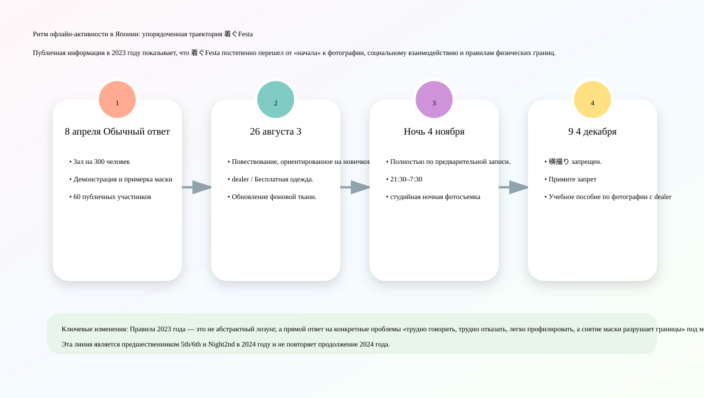
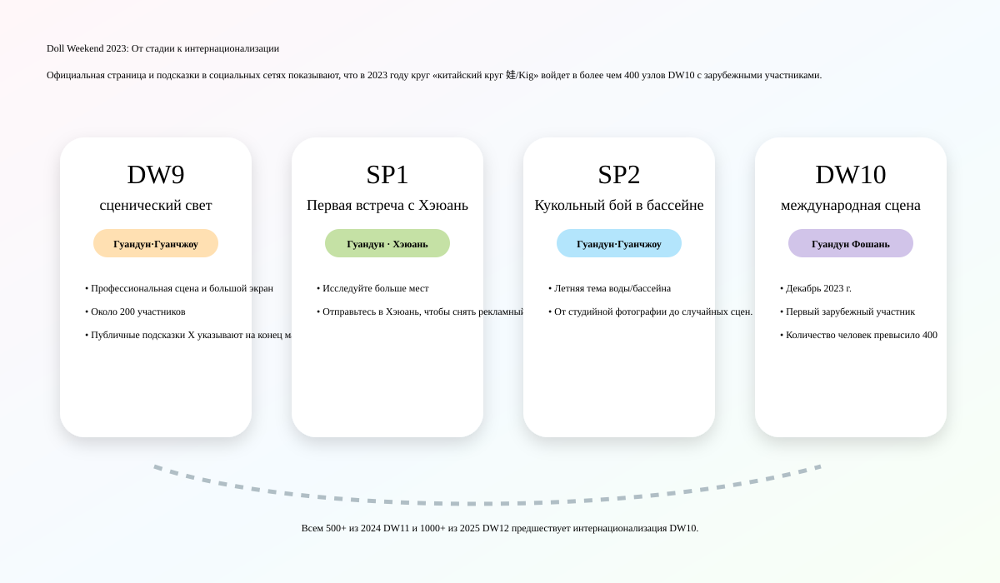

# Хроника Kigurumi 2023 года

> В томе собраны события, работы и публикации этого года. Анонсы отделены от подтверждённых записей о проведении.

## Хроника 2023 года

### 25-26 марта: FGO × AnimeJapan 2023 — возвращение стенда официального косплеера / kigurumi

Fate/Grand Order будет выставлен на выставке AnimeJapan 2023 в Big Sight в Токио с 25 по 26 марта 2023 года. На официальной странице указано, что стенд FGO расположен в 4 зале J62, выставочное здание Big Sight East, Токио. В состав стенда входит «Призыв героев». photo studio, демонстрация Благородного Фантазма, официальная продажа товаров и «コスプレイヤー･着ぐるみグリーティング». Этот рекорд является важным началом официальной линейки IP kigurumi в 2023 году, поскольку он не является временным появлением одного талисмана, а вписан в содержание работы стендов масштабных выставок.[[S1]](#s1)

AnimeJapan характеризуется широким составом аудитории, высокой плотностью стендов и сильными потребностями в фотографии. FGO Поместите приветствие kigurumi в информацию о стенде, указывая, что материализация персонажей стала частью опыта работы на стенде. Когда посетители приходят на стенд FGO, они могут увидеть реквизит, стенды, товары, информацию о сцене, а также встретиться с официальным косплеером и kigurumi. Для IP-операций такая схема позволяет перенести мобильные игры с экрана на пространство площадки; для kigurumi Shi это доказывает, что «официальные куклы-персонажи и полное взаимодействие головных уборов» по-прежнему будут одним из обычных инструментов для массовых выставок комиксов в 2023 году.

Он существенно отличается от энтузиаста animegao kigurumi. kigurumi на стенде FGO представляет собой ролевую презентацию под официальным разрешением и управлением оператора. Передвижение, границы взаимодействия, порядок очереди и время фотографирования – все это регулируется управлением стенда; энтузиаст kigurumi уделяет больше внимания личным ролевым играм, фотографии, общению с фанатами и физическому самовыражению. Их нельзя спутать, но в глазах обычных зрителей они вместе создают ощущение, что «двумерные персонажи могут появляться в реальности с телами с полностью закрытыми капюшонами».

### Примерно в конце марта: Doll Weekend 9 «Свет сцены» — сценический узел круга китайского круга 娃/Kig.

На официальной странице Doll Weekend 9 тема обозначена как «Свет сцены», а место проведения — Гуанчжоу, Гуандун. В нем также поясняется, что впервые DW оборудовали профессиональную сцену и большой экран, чтобы сосредоточить внимание на шоу талантов кукол, в котором приняли участие почти 200 человек. Общественность[[S2]](#s2)[[S3]](#s3)

DW9 — важный узел в круге «китайский круг 娃/Kig 2023 года», от обычных собраний до сцены. Его ключевое слово не «самое большое количество людей», а «профессиональная сцена и большой экран». Это означает, что мероприятие больше не вращается только вокруг фотографа и одного Kigerа, но начинает позволять участникам войти в коллективную сценическую среду, которую можно просматривать, отображать и записывать. Сцены и большие экраны могут улучшить выступления персонажей, подиумы, таланты и коллективные выступления перед живой аудиторией, а также облегчить повторное распространение движущихся изображений.

Постановка оказывает двойное влияние на культуру kigurumi/кукол. При взгляде спереди он продвигает «ребенка» от статического фотографического объекта к объекту спектакля: движения персонажей, походка, неподвижные точки, освещение сцены и реакция публики — все это начинает влиять на эффект работы. Если рассматривать негативные стороны или риски, то на сцене также будут усиливаться физические нагрузки, ограничения поля зрения, безопасность на сцене и за ее пределами, температура освещения, музыкальный ритм и ошибки реквизита. Сцена не является простой копией обычного косплей-подиума, особенно для артистов, которые носят головные уборы, имеют ограниченное зрение и не могут четко слышать инструкции персонала.

### 8 апреля: обычное возвращение 着ぐFesta 2023 — примерка маски, белый и черный фон и 60 публичных участников.

8 апреля 2023 года 着ぐFesta провел очередное мероприятие по обмену в サンパール荒川 Кобо, округ Аракава. В заголовке страницы TwiPla отображается дата — 10:00 8 апреля 2023 г., а название мероприятия — «着ぐFesta! 着ぐるみさんと着ぐるみ好きさんのcommunicateイベント». На странице объясняется, что событие возникло благодаря голосу: «Я также хочу событие, которое можно было бы легко воспроизвести без каких-либо оговорок». Место проведения представляет собой зал, вмещающий около 300 человек и позволяющий проводить свадьбы и другие мероприятия; организатор GarageStudioC7. На странице также указано, что этаж места проведения зарезервирован, зал и вход могут использоваться kigurumi, сцена и музыкальная комната используются как раздевалки и cloak, а также есть женские раздевалки. Открытая регистрация показывает 60 участников.[[S4]](#s4)

Важность этого мероприятия заключается в том, что оно одновременно представляет несколько основных потребностей для деятельности японских фанатов kigurumi в 2023 году: пространство для общения, место для переодевания, фон для фотографий, примерка маски, консультация производителя и вход для новичков. На странице написано, что оператор не до конца понял, чего хотят участники услуг, поэтому не подготовил слишком много масштабных планов и надеется подготовить контент в будущем за счет обратной связи от участников; но в то же время на странице организован показ и примерка совместных масок личного продюсера, заявив, что это первый шаг к цели GarageStudioC7 - «пробный してtalk して気軽におying えできる».[[S4]](#s4)

Этот текст имеет огромную историческую ценность. Это показывает, что 着ぐFesta в 2023 году все еще изучает формы деятельности и с самого начала не имеет зрелого процесса. Примерка маски и консультация особенно важны, поскольку входной барьер для animegao kigurumi очень высок: новичку трудно судить о размере корпуса головы, линии обзора, внутреннем пространстве, устойчивости при ношении, подборе парика, пропорциях лица и эффектах одежды цвета кожи только по фотографиям. Возможность примерить его, увидеть реальный продукт и проконсультироваться с производителем на мероприятии эквивалентна перемещению знаний, которые изначально были разбросаны по частным чатам, заказам и сообщениям об опыте в оффлайн.

Фотография на белом и черном фоне также является небольшой, но важной частью инфраструктуры. Моделирование kigurumi часто требует более чистого фона и контролируемого освещения, чтобы подчеркнуть линии персонажа, особенно пропорции большой головы, парика, юбки, одежды и обуви телесного цвета. Если вы снимаете случайно в общественных местах, загроможденный фон, прохожие, заходящие в зеркало, отражения от земли и отклонения цвета света — все это будет влиять на эффект. В апрельском выпуске 着ぐFesta предыстория, примерка и общение помещены в одно и то же пространство, что показывает, что сообщество уже имеет дело с двумя потребностями: «новички начинают работу» и «результаты работы» одновременно.

### 8–11 июня: hololive production × Токио (おもちゃショー, 2023 г.) — Официальный талисман выходит на рынок игрушек/семейных товаров.

С 8 по 11 июня 2023 года hololive production будет выставлен на выставке Tokyo おもちゃショー 2023, которая пройдет в Tokyo Big Sight. Согласно отчету Денки ホビーウェブ, hololive production впервые принимает участие в этом мероприятии; Токио おもちゃショー проводится Японской ассоциацией игрушек и является крупнейшей выставкой игрушек в Японии. Первые два дня открыты для персонала, связанного с бизнесом, а последние два дня открыты для широкой аудитории, такой как дети и семьи. В отчете также говорится, что hololive production будет реализовывать приветствие kigurumi на стенде 10 и 11 июня, в дни широкой публики. Символами будут «みこだにぇー» и «スバルドダック». Они будут появляться в 11:00, 13:00 и 15:00 каждый день, каждый раз примерно на 30 минут.[[S5]](#s5)

Этот узел имеет другое значение, чем hololive 2024/2025 SUPER EXPO. SUPER EXPO — это собственное крупномасштабное фан-мероприятие hololive, аудитория которого уже имеет высокий уровень понимания VTuber и производных персонажей; Токио おもちゃショー — это индустрия игрушек и сфера, ориентированная на семью, а аудитория включает деловых людей, детей, родителей и обычных потребителей игрушек. hololive Размещение здесь приветствия kigurumi показывает, что официальный талисман не только служит основным поклонникам, но и служит для бренда возможностью объяснить публике свое мировоззрение.

С точки зрения хроники kigurumi, значение этого типа приветствия заключается в том, чтобы оно было «видимо на всех сайтах». Это не фан-мероприятие animegao, но оно знакомит более неосновную 2D-аудиторию с форматом «персонажей, взаимодействующих с людьми через полные головные уборы/тела-талисманы». Такие персонажи, как みこだにぇー и スバルドダック, сами по себе обладают смешанными атрибутами вторичного творчества, мем-культуры, талисманов и экологии VTuber. Их участие в шоу игрушек еще больше стирает границы между виртуальными персонажами, куклами, талисманами, косплеем и kigurumi.

### Примерно в конце июня: Doll Weekend Special 1 «Первое знакомство с истоком реки» — исследование местности и подготовка рекламного видеоролика DW10.

Официальная страница Doll Weekend Special 1 называется «Первая встреча с Хэюань», а место действия — Хэюань, Гуандун. Описание страницы: Чтобы узнать больше о местах, где проводятся кукольные мероприятия, Doll Weekend впервые отправился в Хэюань и снял рекламный видеоролик DW10. Публичная ссылка X показывает, что на официальном аккаунте в конце июня 2023 года был опубликован контент, связанный с фотографией SP1; поскольку на странице официального веб-сайта не указан полный год, месяц и день, в этой статье он записан как «примерно в конце июня» и используется только подсказка X в качестве вспомогательного средства для позиционирования времени.[[S6]](#s6)[[S7]](#s7)

Значение SP1 заключается не в количестве людей или размере сцены, а в «исследовании места проведения». Для мероприятий kigurumi/куклы место проведения не является заменяемым фоном. Отель, живописное место, кафе или место для отдыха, подходящее для обычных людей для фотографирования, не обязательно может подходить для игроков в хед-снаряды: спрятана ли переодевания, достаточно ли кондиционера, можно ли хранить ящик для хед-снарядов, есть ли лестницы на движущемся маршруте, скользкая ли земля, разрешена ли длительная фотосъемка, будет ли большое количество ненужных туристов и можно ли организовать комнату отдыха, - все это повлияет на осуществимость мероприятия.

Этот тип «предварительной съемки» также представляет собой брендинг мероприятия. Будут и фотографии после обычных посиделок, но съемка рекламного ролика следующего мероприятия означает, что организатор начал активно формировать нарратив мероприятия: не «мы снова собрались вместе», а «какая тема, какой город, какая визуальная атмосфера будет на следующем мероприятии». Таким образом, SP1 в 2023 году следует рассматривать как основу бренда до интернационализации DW10.

### 1-4 июля: Anime Expo 2023 и Aniplex/FGO kigurumi mini stage — видимые узлы официальной североамериканской IP-линии.

С 1 по 4 июля 2023 года Aniplex of America примет участие в выставке Anime Expo 2023 в Лос-Анджелесе. В официальном пресс-релизе Aniplex в формате PDF указано, что у него есть стенд № 1800 в выставочном зале и стенд № E-14 в развлекательном зале; На стенде № E-14 будут представлены Fate/Grand Order и mini stage, а зрители увидят любимые фанатами образы kigurumi. На странице официального сайта Aniplex также указана дата проведения AX 2023, расположение двух стендов и график таких мероприятий, как FGO 6th Anniversary x TYPE-MOON Projects.[[S9]](#s9)[[S10]](#s10)

У kigurumi на североамериканских выставках есть еще одна особенность: в английском контексте «kigurumi» часто неправильно понимают как цельную пижаму, поэтому в официальном пресс-релизе напрямую используется внешний вид kigurumi, что само по себе позволит некоторым зрителям заново понять это слово. Официальный kigurumi FGO отличается от игроков animegao, но повлияет на восприятие широкой аудиторией «движущихся двумерных тел персонажей». Посетители могут не знать разницы между animegao, doller и gawa-cos, но они впервые увидят kigurumi на официальном стенде.

Из годовой истории 2023 года Anime Expo 2023 дополняет публичные подсказки за пределами Японии и Китая: FGO kigurumi/тело талисмана используется в Японии AnimeJapan, Makuhari Fes. и американском AX. Другими словами, видимость kigurumi в 2023 году — это не отдельное региональное явление, а выход в транснациональное фан-поле через работу IP-стендов.

### 29–30 июля: FGO Фес. Летний фестиваль 2023 г. ~8-я годовщина~—Юбилейная презентация 9 официальных косплееров и семи тел kigurumi

С 29 по 30 июля 2023 года Fate/Grand Order Fes. 2023 夏祭り ～8th Anniversary～ пройдет по адресу 幕张 Messe. В отчете GAME Watch указано, что конференция пройдет 29 и 30 июля с 9:00 до 18:00 и пройдет в павильоне 9-11 Международного выставочного зала 幕张 Messe. В отчете Inside Games говорится, что на welcome road зрители вошли в зал с видеовыступлениями и фоновой музыкой, и их приветствовали официальные косплееры и kigurumi; В цель этого отчета вошли в общей сложности 9 официальных косплееров и 7 kigurumi.[[S11]](#s11)[[S12]](#s12)

Это событие является самым сильным ежегодным узлом в официальной линейке FGO 2023 года kigurumi. AnimeJapan 2023 больше похож на работу на стенде, а FGO Fes. 2023 год – юбилейный. Юбилейное мероприятие более захватывающее. Красная дорожка welcome road, большой экран, фоновая музыка, официальный косплеер и kigurumi вместе составляют атмосферу «Выхода в Халдею/Выхода на фестиваль». Для фанатов это не просто групповое фото, а использование тела персонажа для временного перемещения игрового мира в Макухари.

Inside Games также упомянул, что косплееры «Hikariのコヤンスカヤ» и «バーヴァン・シー» дебютировали, и позиционировал репортаж как фоторепортаж официального косплеера и kigurumi. Это показывает, что представление персонажей в FGO очень зрелое: реальный косплеер отвечает за гуманоидное воспроизведение некоторых персонажей, а kigurumi отвечает за талисман или персонажа, который больше подходит для полного физического выражения головного убора. Вместе они создают входную атмосферу выставки. Для kigurumi Chronicle семителый kigurumi не является изолированной фигурой, а является свидетельством того, что официальное шоу превратило «одновременное появление нескольких тел персонажей» в сцену, которую можно смотреть.[[S11]](#s11)

### 4-6 августа: World Cosplay Summit 2023 г. — «Полное возрождение» и предварительный текст борьбы с тепловым ударом.

Значение WCS 2023 для kigurumi не в том, что здесь проводится специальная вечеринка kigurumi, а в том, что он представляет собой восстановление общественного пространства и международных обменов для основных конвенций косплея. После возобновления крупномасштабных массовых мероприятий такие проблемы, как kigurumi, полный головной убор, тяжелая одежда, одежда, закрывающая лицо, длинный реквизит, согласие на фотографирование, тепловой удар и прохожие, входящие в камеру, снова станут реальностью. Публичный характер WCS в 2023 году особенно силен: официальные правила начинаются с напоминания о том, что место проведения является общественным местом, там также будут присутствовать обычные посетители и прохожие, а участники должны быть осторожны, чтобы не мешать обычным туристам и магазинам.

На странице правил WCS 2023 года в правилах управления одеждой включены тепло и нагрузка на тело. В одежде, реквизите и предметах переодевания указано, что персонал может попросить участников избегать чрезмерной одежды, такой как чрезмерно открытая, слишком заостренные концы, слишком длинная одежда, из-за которой трудно ходить, или «симптомы обезвоживания, вероятно, будут относиться к категории 着ぐるみ». Предметы обмена фотографиями также требуют, чтобы вы не занимали место съемки на длительное время, не позировали в видимых позах и не снимали под слишком низкими ракурсами, а также не снимали без согласия объекта съемки.[[S15]](#s15)

### 26 августа: 着ぐFesta! 3-е — в концепцию мероприятия было записано «着ぐるみさんは语せない».

26 августа 2023 г., 着ぐFesta! Третий состоялся в サンパール荒川 Кобо, Аракава-ку. В заголовке TwiPla отображается дата в 10:00 26 августа 2023 г., а заголовок — «着ぐFesta! 3rd 着ぐるみさんと着ぐるみ好きさんのcommunicateイベント». На странице продолжается позиционирование «не требуется предварительная запись, легко участвовать, общение в лобби на 300 человек», и в частности говорится: игроки kigurumi, которые впервые участвуют в мероприятии, также должны иметь возможность вернуться домой с радостью. Одиночные игроки, у которых нет друзей kigurumi, могут прийти и подружиться. Опытные игроки также хотят активно общаться, когда видят таких новых людей и атмосферу.[[S17]](#s17)

Самое примечательное предложение на 3-й странице — объяснение социальных трудностей. Организатор написал, что многие люди были очень счастливы, увидев мероприятие на канале. Организатор пояснил, что это мероприятие началось с «желания решить эту проблему».[[S17]](#s17)

Причина важности этого предложения заключается в том, что оно ясно объясняет социальный механизм kigurumi. Внешняя аудитория часто воспринимает kigurumi как визуальное зрелище, но настоящая трудность, с которой сталкиваются участники, часто заключается в общении: персонаж не может нормально говорить, а линия взгляда может быть неточной; собеседник не знает, хотите ли вы сфотографироваться, слышите ли вы, видите ли или хотите отдохнуть; новички также могут быть неспособны интегрироваться, потому что у них нет знакомых. 着ぐFesta 3-е Написание этой проблемы на странице мероприятия равносильно признанию того, что мероприятие kigurumi требует активного проектирования социальных входов и не может просто полагаться на то, что «все с ним знакомы естественным образом».

3-е место также начинает видеть более четкие потоки промышленности и ресурсов. На странице указано, что к участию приглашаются kigurumi и связанные с ним dealer, в том числе маски dealer, операторы комплексных закупок одежды, продажи додзинси и т. д., а CLS указан для участия, заявив, что они могут консультировать по всем вопросам, от масок до ухода за кожей и одежды. На странице также предлагается бесплатный выпуск одежды, черно-белая фоновая фотография и объясняется, что фон больше и его проще использовать, чем на предыдущей странице. Открытая регистрация показала 36 участников.[[S17]](#s17)

### 4–5 ноября: 着ぐFesta! Ночью — круглосуточная студийная фотосъемка и правила закрытых помещений.

Вечером 4 ноября 2023 года 着ぐFesta! Ночь проводится в Chrome Studio Кавагути. В заголовке страницы TwiPla указано, что время начала — 21:30 4 ноября 2023 года. На странице это называется специальным мероприятием по студийной съемке. Время проведения мероприятия с 21:30 до 7:30 следующего дня. Местоположение: Chrome Studio. Весь зал Кавагути арендован за 4000 иен. Он полностью основан на предварительном бронировании и не допускает участия в тот же день. Статус открытой регистрации показывает 22/30 участников.[[S18]](#s18)

Значение Night в том, что он идет по маршруту, отличному от обычного 着ぐFesta. В обычной программе особое внимание уделяется отсутствию необходимости предварительного бронирования, участию в тот же день и приоритету общения, в то время как Ночная программа предназначена только для бронирования, с максимальным количеством людей, студией и ночной фотосъемкой. Эта разница показывает, что деятельность фанатов kigurumi в Японии в 2023 году разделилась на два типа потребностей: первый — дружелюбный и социальный вход для новых людей, а другой — более тихое, более контролируемое и закрытое место, более подходящее для съемок. Круглосуточная студия позволяет избежать потока людей в общественных местах днем, а также позволяет проводить длительные съемки и смену костюмов.

Но не спать всю ночь не означает, что риск ниже. kigurumi Когда артисты носят головные уборы, парики, колготки и обувь для персонажей в течение длительного времени, физическое напряжение будет продолжать накапливаться; потеря концентрации во второй половине ночи, недостаточная гидратация, обратная транспортировка и недосыпание — все это повлияет на безопасность. На странице также особо упоминается, что с женскими раздевалками необходимо связываться заранее, объясняя, что условия размещения в студии также имеют соглашения и ограничения по пространству, и не все потребности могут быть временно удовлетворены на месте.[[S18]](#s18)

Текст правил Найт во многом соответствует последующим правилам 着ぐFesta. Страница запрещает 横撮り и требует согласия субъекта; запрещает объятия, поскольку в состоянии kigurumi трудно выразить смысл и может вызвать проблему невозможности отказаться от чрезмерного контакта; запрещает размахивание длинными предметами; запрещает снимать лица вне раздевалки и cloak; и дает основные рекомендации по использованию камеры, например, не использовать короткое фокусное расстояние менее 50 мм для съемки крупным планом, чтобы избежать широких углов, которые вызывают деформацию головы. Если вы используете мобильный телефон, вы можете увеличивать и уменьшать масштаб.[[S18]](#s18)

Этот совет по камере — редкий случай «технически сложного» материала из 2023 года. Он показывает, что организатор мероприятия не только следит за порядком, но и пытается улучшить качество фотографий kigurumi. kigurumi Пропорции маски и персонажа очень чувствительны к фокусному расстоянию объектива. Широкоугольные снимки крупным планом увеличивают голову и сжимают тело, делая и без того преувеличенные пропорции персонажа несбалансированными. Соответствующее расстояние и фокусное расстояние могут приблизить визуальную логику двухмерного персонажа. Таким образом, «Ночь» — это не обычное ночное событие, а эксперимент, сочетающий в себе методы фотографии, правила согласия, ночную физическую энергию и управление закрытыми объектами.

### 9 декабря: 着ぐFesta! 4-е — Согласие на фотографирование, запрет на объятия и дальнейшая кодификация системы dealer.

9 декабря 2023 г., 着ぐFesta! Четвертый проводится по адресу サンパール荒川 Кобо, Аракава-ку. На странице TwiPla указано, что время мероприятия с 10:00 до 16:00, локация по-прежнему サンパール荒川 Xiaoホール, ведущий GarageStudioC7, условия участия kigurumi. Участники и люди, которым нравится kigurumi, могут участвовать, даже если у них нет собственного kigurumi. На странице также еще раз говорится, что те, кто создавал проблемы или может вызвать проблемы в других мероприятиях в прошлом, не допускаются к участию, и организатор может не объяснять конкретные причины. Открытая регистрация показала 37 участников.[[S19]](#s19)

Четвертое место - это самая четкая регуляризация 着ぐFesta в 2023 году. В содержании активности на странице объясняется, что это не деятельность, преследующая «высокое качество», а надежда на то, что kigurumi сможет общаться друг с другом и позволить новичкам счастливо вернуться домой. Далее перечисляются правила: 横撮り запрещает, то есть стрелять сбоку без разрешения, когда стреляют другие; даже если фотографируемый видит это, необходимо получить согласие, иначе это откровенная фотография. На странице также отмечается, что фотографии без подводки для глаз, как правило, выглядят плохо и делают kigurumi жалким.[[S19]](#s19)

Причина запрета на объятия также весьма конкретна: между людьми, носящими kigurumi, и людьми, которые его не носят, у всех разное чувство дистанции; однако исполнители kigurumi не могут говорить, испытывают трудности с выражением своих мыслей и, возможно, не могут отказаться от чрезмерного контакта, поэтому объятия необходимо запретить, чтобы предотвратить споры. Это правило очень важно, поскольку оно напрямую исправляет внешнее непонимание «милые персонажи могут быть обняты небрежно» на «тело персонажа по-прежнему принадлежит самому участнику, и контакт должен основываться на четком согласии».[[S19]](#s19)

4-й также запрещает размахивать длинными предметами на том основании, что число участников увеличивается с количеством раундов. Хотя площадка очень широкая, такие несчастные случаи, как потеря реквизита, могут привести к травмам; также оговаривается, что снимать лицо запрещено, за исключением раздевалки и cloak, потому что даже если этаж практически закрыт для обычных участников, персонал объекта может войти, и на личное суждение нельзя полагаться. Это правило показывает, что деятельность kigurumi в 2023 году уже связана с отношениями между «ролевым имиджем», «конфиденциальностью», «персоналом объекта» и «общественной ответственностью».[[S19]](#s19)

В передней конструкции 4-й продолжает и усиливает фотографию и dealer. На странице указано, что существует служба фотосъемки сотрудников, и фотографии будут загружены в сводку позже, и поясняется, что сделанные фотографии могут быть опубликованы в социальных сетях; на странице также указано, что «着ぐるみ さんのобучение распылению», которое было хорошо принято в 3-м, будет проводиться два раза в день, чтобы научить основам работы с фотоаппаратами людей, у которых «есть зеркалка, но, вероятно, они снимают случайно»; В то же время маска kigurumi по-прежнему приветствуется. dealer, швейная промышленность, додзинси и т. д. приняли участие, а CLS снова выставился. Бело-черный фон также был значительно улучшен, чтобы его нельзя было истирать при съемке под низкими углами, но в то же время он напоминает вам, что не следует полагаться на колонны.[[S19]](#s19)

### Декабрь: Doll Weekend 10 «Международная сцена» — 400+, первые зарубежные участники и узел интернационализации китайского круга 娃/Kig.

На официальной странице Doll Weekend 10 указано, что тема мероприятия — «Международная сцена», время проведения — декабрь 2023 года, а место проведения — Фошань, Гуандун. На странице указано: DW10 впервые приветствует зарубежных участников, число которых превышает 400. Doll Weekend официально стала международной платформой по обмену куклами с мультикультурным пересечением. На официальном сайте также представлен видеоконтент, такой как «Художественный фильм DW10: Первая в мире выставка кукол» и «Трейлер DW10: Двухмерные куклы открывают кафе в трех измерениях», а также групповые фотографии, фотографии на месте, девушки с плакатов, периферийные устройства и другие категории фотоальбомов.[[S20]](#s20)

DW10 — самый важный подтверждаемый узел в китайском круге kigurumi/кукол в 2023 году. Разница между ним и DW9 очень очевидна: DW9 делает упор на профессиональную сцену и почти 200 человек, а DW10 подчеркивает иностранных участников, масштаб 400+ и интернациональность. Число участников увеличилось с почти 200 до более чем 400. Репрезентативное мероприятие больше не является просто собранием местных игроков, но обладает комплексными возможностями межрегиональной мобилизации, размещения площадок, организации фотографий, экспонентов/периферийных устройств/плакатов/распространения изображений.

DW10 также показывает, что китайское сообщество считает движущиеся изображения своим основным активом. На странице официального сайта не просто перечисляются текстовые объявления, но размещаются художественный фильм, трейлер, станция B, фотогалерея, девушки с плакатов и периферийные устройства на одной странице мероприятия. Для мероприятия kigurumi/doll видеозапись очень важна: многие персонажи могут быть «живыми» только в действии, групповых сценах, групповых фотографиях, сценах и взаимодействиях. DW10 превратил мероприятие из офлайн-собрания в вирусное ежегодное мероприятие с помощью официальных изображений.

## Ссылки

**[S1] Fate/Grand Order Официальный: AnimeJapan Информация о выставке 2023 г.**
https://news.fate-go.jp/2023/aj2023/

**[S2] Официальная страница мероприятия Doll Weekend 9: Свет сцены**
https://dollweekend.cn/cn/event/dw9/

**[S3] Doll Weekend Официальный X: Добро пожаловать в Doll Weekend 9**
https://x.com/doll_weekend/status/1640343531914137600

**[S4] TwiPla: 着ぐFesta Регулярные коммуникационные мероприятия 8 апреля 2023 г.**
https://twipla.jp/events/542391

**[S5] 电竞猜ーウェブ: hololive production Выставлено в Токио (おもちゃショー, 2023 г.) с приветствием kigurumi**
https://hobby.dengeki.com/news/1938607/

**[S6] Doll Weekend Special 1 Официальная страница события: Первая встреча с Хэюань**
https://dollweekend.cn/cn/event/dwsp1/

**[S7] Официальный Doll Weekend X: фотоподсказки SP1**
https://x.com/doll_weekend/status/1673201225146449922

**[S9] Aniplex of America: Anime Expo Официальный пресс-релиз 2023 г. PDF**
https://aniplexusa.com/pdf/PR_060623_AX2023.pdf

**[S10] Aniplex of America: Anime Expo 2023 страница**
https://aniplexusa.com/ax2023/

**[S11] Inside Games: FGO Fes. Официальный косплеер 2023 года с фотоотчетом kigurumi**
https://www.inside-games.jp/article/2023/07/29/147497.html

**[S12] GAME Watch: Fate/Grand Order Fes. Отчет о летнем фестивале 2023 года**
https://game.watch.impress.co.jp/docs/news/1520006.html

**[S15] WCS 2023 Условия участия**
https://worldcosplaysummit.jp/2023/cosplay/rule/

**[S17] TwiPla: 着ぐFesta! 3-й**
https://twipla.jp/events/568769

**[S18] TwiPla: 着ぐFesta! Ночь**
https://twipla.jp/events/577287

**[S19] TwiPla: 着ぐFesta! 4-й**
https://twipla.jp/events/577822

**[S20] Doll Weekend 10 Официальная страница мероприятия: Международный этап**
https://dollweekend.cn/cn/event/dw10/
