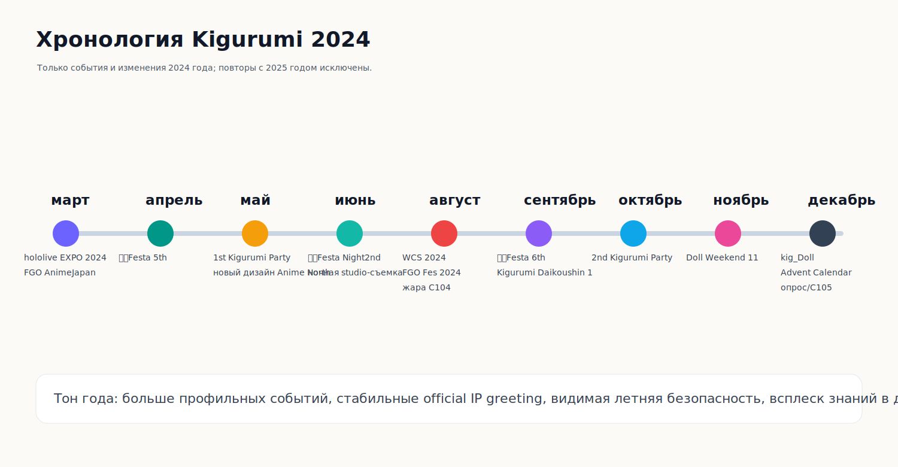
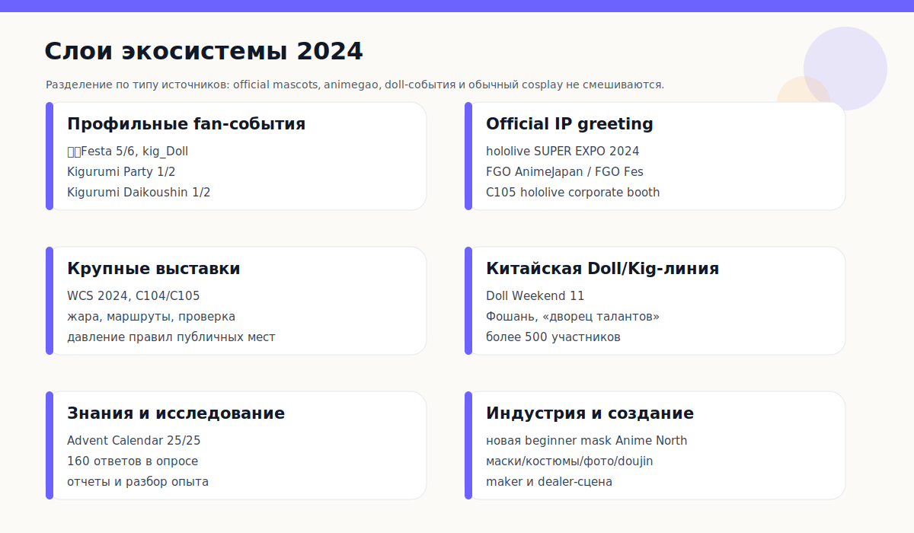
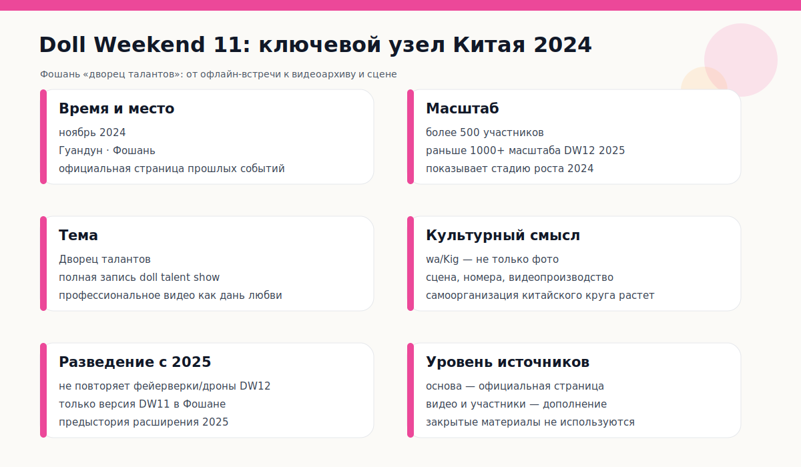
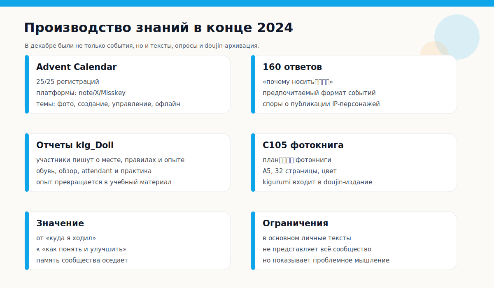
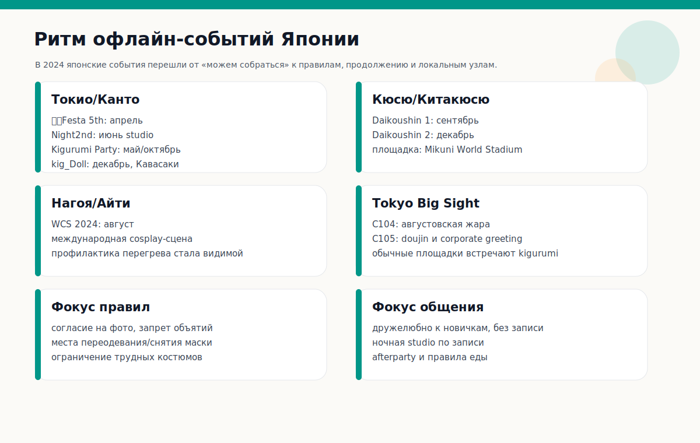
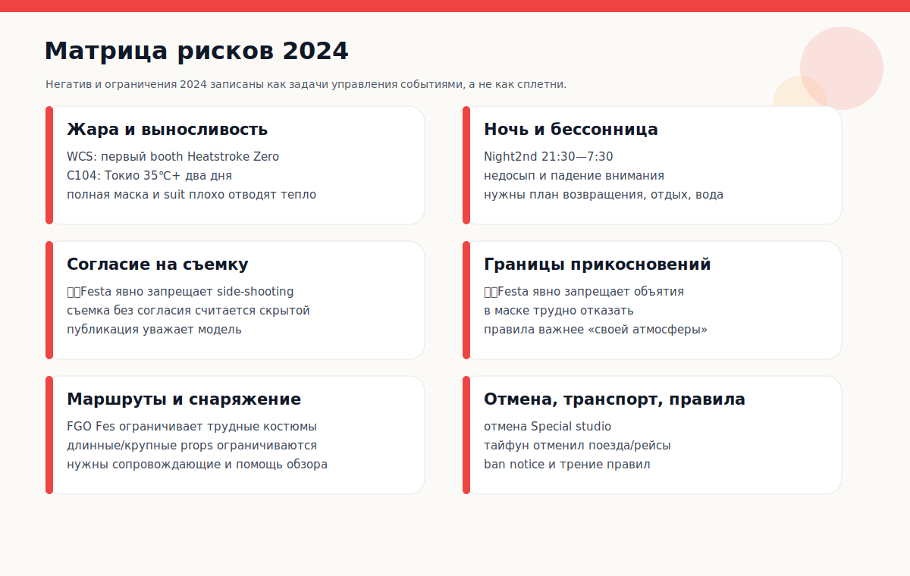

# Хроника Kigurumi 2024 года

> Редакционная рамка: Эта статья наследует стандарт и структуру «Хроники Kigurumi 2025 года», но **не повторяет общие понятия, события 2025 года, изменения правил 2025 года и индустриальные события, уже разобранные в выпуске 2025 года**. Если серия имела самостоятельное событие или новый этап в 2024 году, фиксируется только версия 2024 года; если это лишь фон, подробно описанный в выпуске 2025 года, он здесь сжимается или опускается.

---

## 0. Границы источников, принцип удаления повторов и надежность

**kigurumi**, упомянутые в этой хронике 2024 года, по-прежнему сосредоточены на смежных областях, таких как анимегао kigurumi / ролевая игра в маске / bishoujo kigurumi / doller / wa / кигер / официальный персонаж с 着ぐるみ greeting. Поскольку границы терминов были подробно объяснены в статье 2025 года, в этой статье не будут повторяться большие определения. В нем будут объяснены типы только тогда, когда речь идет о различиях в данных: official IP greeting, мероприятия для фанатов, широкие full-body костюмные события, doll-выставки, публикации фанатов, анкеты и исследовательские статьи, а также документы по управлению рисками.

В этой статье принят принцип «сначала публичная информация». Официальные страницы мероприятий, объявления организаторов, страницы билетов и списки организаторов на протяжении многих лет считаются весьма достоверной информацией; отчеты участников, личные блоги, заметки и скриншоты из социальных сетей являются дополнительными материалами; анонимные форумы и неопубликованные групповые чаты не считаются фактическим основанием. Когда речь идет о негативе, слухах или разногласиях в характерах, в этой статье говорится только об изменениях правил, давлении со стороны руководства и публично видимых разногласиях, исключая необоснованные личные обвинения.

Метод удаления повторов со статьей 2025 года следующий:

| Тип удаления повторов | Как это обработано здесь |
|---|---|
| Разъяснения общих терминов, написанные в 2025 году. | Оставьте только одно или два необходимых предложения и не повторяйте длинную предысторию. |
| Та же череда событий продолжится и в 2025 году. | Напишите только дату, место и значение года в 2024 году, но не записывайте последующие детали в 2025 году. |
| Официальное IP-приветствие все еще существует в 2025 году. | Пишите только о ролях, событиях, правилах или изменениях 2024 года, связанных с шоу 2024 года. |
| Управление рисками станет более ясным в 2025 году | Пишите только о проблемах, которые могут быть подтверждены в 2024 году, таких как тепловой удар, фотография, объятия, движение, отмена и т. д. |
| Слухи и анонимные споры | Не повторяйте непроверенные разоблачения, записывайте только публичные правила и сигналы управления. |

---

## 1. Общий контекст в 2024 году

2024 год — это не повторение 2025 года, а скорее «год прокладки путей» перед масштабированием 2025 года. Если ключевыми словами 2025 года являются «растущие масштабы, увеличение трансграничных обменов и усиление институционализации», то ключевые слова 2024 года ближе: **Специализированные мероприятия обретают форму, официальные приветствия стабилизируются, летняя безопасность становится явной, а производство знаний резко возрастает в конце года**.

Первое основное направление — активизация деятельности местных энтузиастов в Японии. Первый и второй эпизоды «きぐるみパーティ» появились в Токио и регионе Канто. В апреле и сентябре фестиваль продолжал проводиться по принципу «дружелюбие к новичкам, отсутствие оговорок и приоритет общения». В июне компания опробовала формат ночных фотосессий в студии, полностью основанный на предварительном бронировании, через Night2nd; в декабре снова появился kig_Doll. Этот вид новой деятельности сочетает в себе фотографию, общение, легкие закуски и участие дилеров. Что касается Кюсю, то «Великий марш Цуруги!» завершит 1-ю и 2-ю главы в сентябре и декабре, став настоящей отправной точкой перед 3-й и 4-й главами в 2025 году. Другими словами, в 2024 году останется не одна точка вспышки, а набор шаблонов устойчивой деятельности.

Вторая тема — продолжающееся использование приветствий kigurumi официальными IP-адресами. hololive SUPER EXPO 2024 организовала фотосессии талисманов для Ankimo, Subaru Duck, Mikodanye, UDIN, Smol Ame и др. в марте; Fate/Grand Order устроила косплееров и поздравления kigurumi на AnimeJapan 2024 и FGO Fes. 2024. Эти официальные сцены нельзя напрямую приравнивать к действиям фанатов анимегао, но они делают «двумерных персонажей, появляющихся на выставке в полных головных уборах / телах, похожих на талисман», объектом постоянного контакта для широкой аудитории.

Третье основное направление – масштабные комплексные выставки и риски безопасности. Всемирный косплей-саммит 2024 прошел в Нагое и Айти. По данным МИД, в чемпионате мира по косплею в этом году приняли участие 36 национальных и региональных команд; Проект Японской метеорологической ассоциации «Heatstroke Zero ゼロへ» был впервые представлен на WCS2024, а персоналу были предоставлены костюмы для болельщиков. Это, вместе с летними данными о 260 000 человек на C104 за два дня и самой высокой температурой в Токио, превышающей 35°C в оба дня, показывает, что вопросы, связанные с kigurumi в 2024 году, будут касаться не только «красивого внешнего вида» и «восстановления», но также и высокой температуры, зрения, действий, гидратации, согласия на фотографирование и ответственности за место проведения.

Четвертая основная линия – постановочный прыжок китайского круга «Киг». Doll Weekend 11 пройдет в Фошане, провинция Гуандун, в ноябре 2024 года и будет посвящен теме «Зал талантов». На официальной странице указано, что «все кукольное шоу талантов будет записано», и утверждается, что число участников превысило 500. Уровень в тысячу человек, фейерверки, дроны и городские выражения DW12 в 2025 году подробно описаны в статье 2025 года. В этой статье упоминается только DW11 в 2024 году: ее значение заключается в том, что в 2024 году китайский круг продвинул автономную деятельность kigurumi/куклы до стадии визуализации, стадии и масштаба 500+.

Пятое основное направление – производство знаний. В декабре появился «ぐるみ Адвент-календарь 2024» с 25/25 зарегистрировавшимися. Темы охватывали методы фотографии, офлайн-встречи, организацию мероприятий, самостоятельное производство, очную работу и т. д.; в том же месяце также появилось 160 ответов на отчет-анкету «ぐるみの考え方を知りたい». В сочетании с обзором участников kig_Doll и фотокнигаом Юки из C105, в конце 2024 года наблюдается очевидная тенденция «записывать впечатления, распечатывать работы и подсчитывать предпочтения». Это отличается от «более масштабного мероприятия» 2025 года и является уникальной документально подтвержденной ценностью 2024 года.

---

## 2. Хроника 2024 года

### Примерно 10 февраля: ぐ着着ぐFesta! Специальное СТУДИЙСКОЕ фотомероприятие отменено – цена и неопределенность небольших мероприятий

Одним из негативных моментов начала 2024 года является отмена «着ぐFesta! Special STUDIO Photography イベント». Эта страница основана на предпосылке фотомероприятия, полностью основанного на предварительном бронировании. Формат мероприятия отличается от открытого общения традиционной Фесты: изначально он ближе к студийному мероприятию, специализирующемуся на фотографии, требует предварительной записи и имеет ограниченное пространство. Однако на паблике было указано, что мероприятие приостановлено по «разным причинам». Поскольку в примечании об отмене не была публично указана более конкретная причина, в этой статье не будут размышлять о внутренней ситуации организаторов, а будет зафиксирована только неопределенность относительно проведения раннего мероприятия в 2024 году. [[S23]](#s23)

Это событие заслуживает того, чтобы его зафиксировали, поскольку сложность занятий kigurumi часто недооценивается со стороны. Для обычных косплей-собраний может потребоваться только разрешение на место, переодевание и фотографирование; но на специальных мероприятиях kigurumi также необходимо учитывать транспортировку головы, больший багаж, плохую видимость, конфиденциальность при переодевании, нужны ли сопровождающие, можно ли снимать маски во время мероприятия, соотношение фотографов и исполнителей, можно ли устраивать перерывы и можно ли контролировать прохожих. Хотя студийные мероприятия более контролируемы, чем публичные выставки, они также в большей степени зависят от количества резерваций, баланса затрат, распределения времени и условий помещения. Отмена может произойти из-за недостаточной посещаемости, изменения условий проведения мероприятия или более высоких, чем ожидалось, эксплуатационных расходов.

Это также показывает, что расширение японских мероприятий kigurumi в 2024 году не было гладким. Как вы увидите позже, 着ぐFesta 5 и 6 прошли стабильно, но устойчивость серии не означает, что можно реализовать каждый дополнительный проект. Позитивное значение отмены состоит в том, что она обнажает тот факт, что «специализированная деятельность не считается чем-то само собой разумеющимся»; Негативный смысл заключается в том, что маршруты участников, подготовка оборудования и планы съемок могут быть сорваны. Для игроков kigurumi, требующих дорогостоящего снаряжения, отмена мероприятия влияет больше, чем для обычных зрителей, поскольку головные уборы, костюмы, парики, обувь, набивка и встречи для фотосъемок могут быть подготовлены заранее.

### 16-17 марта: фотосессия талисмана на hololive SUPER EXPO 2024.

13 марта 2024 года hololive SUPER EXPO 2024 официально выпустила «ぐるみグリーティングについて». В объявлении говорится, что вокруг башни с часами пройдет фотосессия талисмана. ДЕНЬ 1 состоится 16 марта 2024 года, а ДЕНЬ 2 — 17 марта. Анкимо и Субару Дак появятся около 12:40 в оба дня, а Микоданье, УДИН и Смол Амэ появятся примерно в 15:40 в ДЕНЬ 1 и в 15:55 в ДЕНЬ 2. Ожидается, что каждая группа продлится около 20 минут. [[S1]](#s1)

Этот тип официального приветствия имеет иную мотивацию, чем фанатское kigurumi анимегао.ぐるみ в Hololive больше похоже на точку физического контакта с персонажем бренда. Для индустрии VTuber это средство, позволяющее подключать виртуальных персонажей, производные талисманы и фанатов в автономном режиме. Зрителям не обязательно разбираться в производстве kigurumi, колготках или внутренней структуре масок, чтобы понять выставочный опыт через «движущихся персонажей». Он освобождает персонажа от экрана, комнаты прямой трансляции и периферийных изображений и превращает его в тело, которое можно встретить, сфотографировать и помахать рукой в ​​ответ на месте проведения.

С точки зрения 2024 года важность гололивической линии заключается в «стабилизации». Это не временный талисман, а официальное взаимодействие с четким графиком, четкой ролевой группой и четкой локацией. В статье 2025 года уже было написано о расширенном составе гололив SUPER EXPO 2025. Эта статья не будет повторять расширение 2025 года; в нем будет отражена только значимость версии 2024 года: на крупномасштабных офлайн-мероприятиях VTuber приветствие kigurumi рассматривается как обычная программа, а не как побочное мероприятие.

В то же время это также усугубляет путаницу терминов. Обычные зрители могут подумать о талисмане hololive, когда видят «ぐるみ», в то время как игроки анимегао/киг могут ссылаться на косплей в маске, когда говорят о «ぐるみ». Таким образом, официальное поздравление 2024 года не только повышает социальную видимость, но и потенциально затрудняет посторонним различать талисман, анимегао, куколку и обычный комбинезон. Это состояние «видимости, но не обязательно понимания» является фоном, который сохранится с 2024 по 2025 год.

### 23-24 марта: FGO × AnimeJapan 2024 — официальная комбинация косплеера и приветствия kigurumi.

Fate/Grand Order будет представлена ​​на AnimeJapan 2024 в Tokyo Big Sight 23-24 марта 2024 года. На официальной странице указано, что на стенде FGO будут проводиться показы и сценические мероприятия, а стенд расположен в East 5 Hall J46; один из предметов - «コスプレイヤー･恐るみグリーティング», и он объясняет, что в кабинке, как ожидается, будет реализовано приветствие, а также появятся новые косплееры Слуг. [[S2]](#s2)

Этот узел FGO похож на приветствие Hololive, оба из которых являются материализацией официального IP; но особенностью FGO является то, что «косплеер + kigurumi» вместе создают атмосферу стенда. Косплеер представляет персонажа в реальной форме, а kigurumi представляет другой тип персонажа в виде талисмана/тела с полным капюшоном. Для зрителей это сформирует слой: сцена, экспозиция, драгоценный фантомный реквизит, фотостудия вызова героев, официальный косплеер, приветствие kigurumi совместно превратят IP мобильной игры в пространство, по которому можно гулять и фотографироваться в стенде.

Ежегодное значение этого мероприятия не в том, что «FGO впервые приветствует приветствие», а в том, что оно продолжит иллюстрировать и в 2024 году: крупномасштабное двумерное IP ввело физическое взаимодействие персонажей в стандартные выставочные операции. Приветствие на стенде также имеет управленческое значение: по сравнению с возможностью свободно перемещаться по музею, взаимодействие внутри стенда облегчает контроль очередей, ракурсов камеры, времени ожидания, заторов и границ контактов. Этот вид пространственного контроля очень важен в такой форме выступления, как kigurumi, где движение ограничено.

По сравнению с масштабной презентацией 10-летия FGO Fes в 2025 году, информация AnimeJapan 2024 больше похожа на «киосковую работу»; поэтому в этой статье фиксируется только его статус в 2024 году и не повторяется содержание 10-летия в 2025 году. Это напоминает нам: публичный имидж kigurumi в 2024 году будет зависеть не только от деятельности фанатов, но и от места распространения официальной интеллектуальной собственности.

### 6 апреля: 着着ぐFesta! 5-е — Публичный текст о «дружелюбии к новичкам» и регулярном общении.

6 апреля 2024 г., автор 着ぐFesta! Пятый состоялся в зале Аракава Кодама в округе Аракава. На странице мероприятия указано, что оно «ぐるみさんと与ぐるみ好きさんのCommunicationイベント» и начнется в тот же день в 10:00. Организатор объясняет, что мероприятие вызвано спросом на «мероприятие, которое не требует предварительного бронирования и в котором можно легко сыграть»; место может вместить около 300 человек. Вестибюль приветствует участие в тот же день и претендует на дружеское мероприятие для начинающих игроков в kigurumi. [[S3]](#s3)

Суть этого мероприятия – не громкая фотография, а социальная реставрация. В описании мероприятия прямо указывалось: «Многие новички видели, что на мероприятии организаторы записали этот вопрос, указав, что они осознают, что реальным порогом деятельности kigurumi является не только «есть ли головная оболочка», но и то, можно ли вступать в социальные отношения, готов ли кто-то проявить инициативу в общении и существуют ли правила защиты новичков и молчаливых исполнителей.

Правила 着ぐFesta 5 также важны. На странице четко запрещена «фотосъемка», то есть съемка без разрешения сбоку, пока снимают другие; Организатор заявляет, что даже если субъект видит, как кто-то делает фотографию, это все равно откровенная фотография без согласия, и сначала необходимо получить разрешение субъекта. На мероприятии также запрещены объятия на том основании, что с исполнителями kigurumi нелегко разговаривать, то есть их трудно выразить, и может быть трудно отказаться от чрезмерного контакта; также запрещено размахивать длинными предметами, а маски разрешается снимать только в раздевалке и плаще. [[S3]](#s3)

С точки зрения 2024 года 着ぐFesta 5 – это типичное мероприятие с «низким порогом, но высокой осведомленностью о правилах». Оно не считает съемку единственной целью, а прописывает выполнимые правила о том, «как не следует изолировать новичков», «как избегать откровенных фотографий», «как избегать прикосновений, переходящих черту» и «как сохранять безопасность, не нанося ущерба имиджу персонажа». Этот тип текста лучше говорит о зрелости сообщества, чем красивые фотографии. Многие правила проведения мероприятий в 2025 году носят более формальный характер, но ценность 着ぐFesta в 2024 году заключается в том, что она сделала вопросы границ очень конкретными на уровне небольших коммуникационных мероприятий.

### Около 24-26 мая: Anime North 2024 и новые дизайны масок Kigurumi Online

На странице Kigurumi Online указано, что организация каждый год проводит семинары в Anime North в Торонто, Канада, чтобы познакомить косплееров с анимегао kigurumi; Содержание семинара включает введение в предысторию, историю, известных производителей, методы производства и производство индивидуальных стартовых масок с помощью волонтеров. На странице также указано, что участники могут выбрать форму и цвет глаз, ресницы, брови, стиль и цвет парика, а также выполнить заполнение подкладки и адаптацию к ношению. Наиболее примечательные обновления 2024 года: **Новые дизайны, выпущенные на Anime North 2024** после того, как на странице написано «Дизайн 2022 года». [[S5]](#s5)

Этот вопрос относится к линии промышленности и образования, а не к обычной линии партии. В статье 2025 уже писалось о вводных функциях мастерской Anime North 2025. В этой статье не будут повторяться все детали мастер-класса, а лишь подчеркнут новые моменты 2024 года: выход нового дизайна маски для начинающих. Для анимегао kigurumi начать создавать маски — непростая задача. Это влияет на визуальный эффект, комфорт, посадку подкладки, совместимость по окружности головы, фиксацию парика, соотношение окуляров и себестоимость продукции при первом ношении новичками. Вводный дизайн, который можно использовать в мастерских, означает, что производитель пытается стандартизировать первоначально очень индивидуальное мастерство изготовления масок до такой степени, что оно «обучаемо, может изготавливаться партиями и может быть испытано новичками в один и тот же день».

Значение североамериканской линии в 2024 году также здесь: она не делает акцент на масштабных сценах, таких как китайский Doll Weekend, и не делает акцент на специализированных площадках для проведения мероприятий, таких как японская линия Токио/Кюсю, а больше ориентирована на распространение знаний и снижение порога. Многие новички за границей испытывают трудности с доступом к японским материалам, а также трудно судить о взаимосвязи между производителем, структурой маски, одеждой цвета кожи, париками и одеждой. Kigurumi Online разбивает эти вопросы на совместные процессы посредством семинаров, так что «первый опыт» не должен начинаться с дорогостоящего индивидуального заказа.

Таким образом, ценность Anime North 2024 заключается не в «появлении определенных игроков», а в «новом дизайне входных масок» как узле распространения технологий. Он обеспечивает основу для развития новых талантов в 2025 году и в последующий период.

### 26 мая: Эпизод 1 «きぐるみパーティ» — отправная точка специальной линии событий Токио Одайба.

26 мая 2024 года в Одайбе, Токио, состоялся «きぐるみパーティ». В публичном отчете участников указано, что это мероприятие состоится 26 мая 2024 года, участники примут участие в мероприятиях в променад-парке Одайба, Приморском парке, Плаза Хэйсэй и других местах; В резюме отчета говорится: «Можно проводить мероприятия в парке Одайба и на площади Хэйсэй, но расстояние пешком длиннее, без сторонников будет сложнее, и есть различные участники kigurumi. [[S4]](#s4)

Это событие является предысторией «3-го эпизода 2025 года・きぐるみパーティ!», но в этой статье отмечается только самостоятельное значение 1-го эпизода 2024 года. Оно показывает, что Токио начал создавать специальные зоны стрельбы и сбора для участников в масках и полных головных уборах. В отличие от обычных выставок комикет/комикс-мероприятий, этот тип мероприятий должен решить три проблемы: во-первых, фотографии на открытом воздухе выглядят красиво, но прогулка на большие расстояния усугубит проблемы со зрением, обувью, физической силой, гидратацией и сопутствующей поддержкой; во-вторых, в районе Одайбы много полуобщественных мест, и на место происшествия могут попасть прохожие, туристы и обычные косплееры, поэтому разрешение на фотографирование и линии движения должны быть более осторожными; в-третьих, головные уборы, парики, набивка тела и костюмы персонажей должны быть разобраны на полпути, и трудно полностью удовлетворить потребности «обычных гримерных» в одиночку.

Наблюдения за «サポートがいないときついかも», о которых сообщили участники, очень ценны. Сообщество kigurumi часто говорит о важности сопровождающих/помощников, но многие посторонние понимают это только после того, как увидели движение на мероприятии: поле зрения исполнителя обычно не совпадает с реальным полем зрения, линия глаз персонажа не совпадает с линией глаз реального человека, а внезапное приближение ступенек, бордюров, транспортных средств, велосипедов и детей может привести к риску. Такое открытое пространство в Одайбе, Токио, придает работе ощущение места, а также увеличивает стоимость переезда.

В первом эпизоде ​​«きぐるみパーティ» также объясняется, что японские мероприятия kigurumi в 2024 году — это не просто закрытые обмены мнениями в небольших залах, но начали пробовать специальные собрания в полупубличных местах. Он определил название мероприятия, опыт проведения мероприятия и репутацию сообщества для второго выпуска в октябре и третьего выпуска в 2025 году.

### 15 июня: 着着ぐFesta! Night2nd - ночная студийная фотосессия и еще один маршрут, полностью основанный на предварительном бронировании.

15 июня 2024 г., 着ぐFesta! Night2nd проводится как мероприятие по ночной фотографии в Chrome Studio Kawaguchi. На странице TwiPla указано, что мероприятие пройдет с 21:30 15 июня 2024 года до 7:30 следующего дня с полной системой бронирования, вместимостью 40 человек и стоимостью 4000 иен; В описании мероприятия также подчеркивается, что фотосъемка будет проводиться персоналом, и позиционируется это как особенное счастливое событие для «ぐるみさん与ぐるみ好きさん». Статус публичной регистрации показывает, что участников 14 из 40, 4 «заинтересованы» и 2 «не участвуют». [[S24]](#s24)

Night2nd — легко упускаемая из виду, но очень структурно значимая попытка в линейке Festa 2024 года. И 5-е апреля, и 6-е сентября, как правило, представляют собой встречи по обмену, которые «без предварительной записи, доступны в один и тот же день и дружелюбны к новичкам»; Night2nd идет в совершенно противоположном направлении: только бронирование, верхний предел количества человек, студия, всю ночь напролет, основная цель - фотография. Это показывает, что в 2024 году один и тот же организатор/один и тот же круг мероприятий одновременно исследовал две потребности: одна — снизить входной барьер, чтобы одиночные игроки могли приходить и знакомиться с людьми; другой — сжать внешние помехи и позволить участникам снимать в управляемой студии в течение длительного времени.

Правила Night2nd продолжают осознавать границы 着ぐFesta. Страница запрещает «обрезку» и требует согласия субъекта перед съемкой; запрещает обниматься, потому что под маской еще сложно выразить смысл; запрещает размахивать длинными предметами; и требует, чтобы лицо не снималось, кроме как в раздевалке и плаще. Эти правила показывают, что даже в относительно закрытой студии нельзя игнорировать согласие на съемку, физический контакт, безопасность реквизита и границы статуса персонажа. [[S24]](#s24)

В то же время Night2nd выдвигает на первый план еще один тип риска: ночной и ночной. Для исполнителей kigurumi, хотя ночная студия избегает дневной жары и зевак прохожих, она также приносит такие проблемы, как недосыпание, потеря физических сил, потеря концентрации во второй половине ночи, уход за макияжем и костюмами, а также обратный транспорт. Полный головной убор, колготки, парики и обувь персонажей будут продолжать потреблять физическую энергию в течение нескольких часов непрерывной съемки; без полноценного отдыха, питья и поддержки со стороны сверстников ночная среда не будет безопаснее, чем днем.

Внеся это событие в хронику 2024 года, мы можем увидеть подсказку, отражающую «отмену мероприятия»: отмена студийного спецвыпуска в феврале показала хрупкость планирования специализированной фотосъемки, а Night2nd в июне показала, что мероприятия студийного типа не исчезли, а продолжают экспериментировать с более четкими системами бронирования, ночными шоу, верхними ограничениями на количество человек и текстами правил. Это не повторение событий 2025 года, а важное свидетельство диверсификации моделей деятельности небольших kigurumi в Японии в 2024 году.

### 2–4 августа: Всемирный саммит косплея 2024 года и летние темы безопасности.

Со 2 по 4 августа 2024 года в Нагое и Айти пройдет 22-й Всемирный саммит косплея. Как сообщает страница МИД Японии, 3 августа прошел чемпионат мира по косплею 2024 года. В нем приняли участие команды из 36 стран и регионов, включая Японию. Сборная Японии выиграла чемпионат и получила награду министра иностранных дел. WCS стартовал в Нагое в 2003 году, и в 2024 году ему исполнится 22 года. [[S6]](#s6)

С точки зрения хроники kigurumi, важность WCS 2024 заключается не только в чемпионате, но и в том, что он выдвигает на первый план безопасность летнего косплея. Проект Японской метеорологической ассоциации «Heatstroke Zero ゼロへ» объявил 23 июля 2024 г., что этот проект будет впервые представлен на WCS2024, а с 3 по 4 августа в Oasis 21 будет установлен стенд, призывающий к предотвращению тепловой болезни с помощью фотореквизита, фоновых досок, средств противодействия жаре и т. д.; В то же время оперативному персоналу WCS будут предоставлены 33 костюма с кондиционерами и вентиляторами. [[S7]](#s7)

Это особенно важно для kigurumi. Обычные косплееры уже сталкиваются с такими проблемами, как пребывание на солнце, очереди, тающий макияж и обезвоживание летом; Kigurumi также добавляет давление панциря на голову, костюмов для всего тела, набивки, париков, ограниченного зрения и неудобства при снятии головы. WCS 2024 — это не мероприятие, посвященное исключительно kigurumi, но оно представляет собой начало массовой сцены косплея, более открыто затрагивая вопрос о том, как безопасно проводить мероприятия в середине лета. Термокабина и униформа болельщиков персонала показывают, что безопасность – это не просто личное осознание участников, а неотъемлемая часть выставочной деятельности.

В этом также разница между 2024 и 2025 годами. В статье 2025 года основное внимание уделяется четкому признанию правил WCS в отношении kigurumi/полнофлицевой маски/доллера/гава-ко; статья 2024 года сосредоточена на управлении риском теплового удара. Они не дублируют, а следуют друг за другом: в 2024 году в текст правил будут включены летние физические риски, а в 2025 году в текст правил будет включена одежда, закрывающая лицо. Для игроков kigurumi эти две линии вместе составляют реальность, в которой «можно участвовать, но которой нужно управлять».

### 3-4 августа: ФГО Фес. 9-я годовщина 2024 г. — сочетание официальных приветствий и ограничений в одежде для участников.

3–4 августа 2024 г. пройдет фестиваль Fate/Grand Order Fes. В 2024 году 9-я годовщина состоится в Makuhari Messe. На официальной странице аттракциона указано «グリーティング», поясняется, что будет проводиться приветствие ぐるみ, и написано, что «разрабатываются новые правила». Это показывает, что FGO не только продолжает использовать поздравления kigurumi к девятому юбилейному мероприятию в 2024 году, но и создает новых персонажей kigurumi. [[S8]](#s8)

Особенность этого мероприятия в том, что с одной стороны чиновники устраивают поздравления kigurumi, а с другой - накладывают ограничения на косплей-костюмы обычных участников. ФГО Фес. Правила косплея 2024 года гласят, что к одежде с ограниченным доступом относятся «костюмы, которые трудно передвигать». Примеры: большие бумажные ракушки, ぐるみ, одежда до пола, крупные украшения и т. д. [[S9]](#s9)

Это сопоставление стоит записать в хронику 2024 года. Это показывает, что отношение официальной кампании интеллектуальной собственности к kigurumi не просто «разрешено» или «запрещено». Официально управляемые kigurumi — это активы мероприятий с фиксированными ролями, персоналом, механизмами распространения и закулисным управлением; в то время как обычные участники, носящие kigurumi в людных местах, могут вызвать проблемы с доступом, обзорностью, безопасностью, эвакуацией и организацией фотосъемки. Таким образом, одно и то же мероприятие может иметь как «официальное приветствие kigurumi», так и «одежду kigurumi участника, ограничивающую подвижность».

С точки зрения сообщества, такого рода правила могут вызывать у игроков противоречивые чувства: почему это могут делать чиновники, а не отдельные лица? Но с точки зрения управления деятельностью разница заключается в владении ответственностью и управляемости. Официальные функции обычно включают в себя персонал, маршруты, места отдыха и зоны для фотографий; отдельные игроки могут перемещаться по площадке, и организатору сложно определить, сопровождают ли они их, смогут ли они вовремя их избежать и не заблокируют ли они проход. ФГО Фес. Таким образом, 2024 год наглядно демонстрирует: kigurumi приветствуются как форма выступления на коммерческих IP-мероприятиях, но не обязательно безоговорочно приветствуются как форма косплея для аудитории.

### 11–12 августа: Летний комикет C104 — жара, 260 000 человек и подсказки об активности фанатов kigurumi.

Summer Comic Market 104 пройдет в Tokyo Big Sight 11-12 августа 2024 года. В отчете COSPO C104 говорится, что всего за два дня на площадку пришло около 260 000 человек, а самые высокие температуры в Токио превысили 35°C 11 и 12 августа. [[S10]](#s10)

Значение C104 для kigurumi не в том, что это посвященное kigurumi мероприятие, а в том, что Comiket представляет собой супер-большое пересечение японской фан-культуры и культуры косплея. Для игроков kigurumi такое поле, как C104, полно противоречий: с одной стороны, Big Sight и Comiket имеют чрезвычайно высокую видимость, и если их стили персонажей появятся, они получат много внимания; с другой стороны, летние высокие температуры, скопление людей, очереди, обработка багажа, правила зоны фотографирования, очереди на передвижение стендов и ограничения на смену костюмов — все это крайне недружелюбно по отношению к kigurumi. Палящая жара, превышающая 35°C, уже тяжела для обычных косплееров, но еще выше риск для kigurumi с полным головным убором, костюмами для всего тела, толстыми париками и неудобством при снятии головы.

Связь между kigurumi и деятельностью фанатов Комикета также можно увидеть в публичной информации. Например, в личной заметке упоминаются планы и связанные с ними книги, такие как «Цзо ぐるみ売り子» в C104. Этот тип информации в основном представляет собой личные записи/записи небольшого круга и не подходит для больших выводов, но он показывает, что kigurumi существует не только на фотосессиях или специальных мероприятиях, но также вошло в творческие практики, такие как фан-киоски, продавцы, фотокнигаы и книги путешествий персонажей.

Поэтому 2024 C104 следует классифицировать как узел «сосуществования риска и создания». Он не настолько специфичен для kigurumi, как Doll Weekend 11 или 书ぐるみパーティ, но представляет собой суровое испытание реальностью: когда kigurumi попадает в среду огромных толп, изнуряющей жары и распродаж фанатов, правила безопасности, движения, увлажнения и фотографии становятся более важными, чем сама работа. В статье 2025 года Комикет не затрагивался, поэтому эта часть является отдельным дополнением к 2024 году.

### 1 сентября: 着着ぐFesta! 6-е и афтепати ——Уточненные социальные правила, советы по запрету на поездки и влияние тайфуна на движение транспорта.

1 сентября 2024 г., 着ぐFesta! Шестой турнир снова состоялся в Аракава Кодори, округ Аракава. Страница мероприятия продолжает занимать 5-е место: бронирование не требуется, участие в тот же день приветствуется, а также дружелюбно к игрокам kigurumi, которые участвуют в мероприятии впервые; цель мероприятия по-прежнему состоит в том, чтобы позволить игрокам kigurumi, не имеющим знакомых и занимающимся сольной деятельностью, установить контакт. Правила также были продолжены и уточнены: нельзя обниматься, не обниматься, не размахивать длинными предметами, не удаляться от лица, кроме как в раздевалке/クローク. [[S11]](#s11)

Ценность 6-го уровня заключается в том, что он продолжает логику активности 5-го уровня в стабильном формате, а не в виде однократной попытки. На общедоступной странице показаны 55 участников, 17 заинтересованных и 7 неучаствующих; хотя это и не крупномасштабное мероприятие, оно продемонстрировало свою стабильную привлекательность для специализированной коммуникационной деятельности kigurumi. [[S11]](#s11)

Это событие также оставило несколько публичных подробностей, достойных того, чтобы быть вписанными в негативную историю управления. В комментариях к мероприятию в аккаунте организатора указано, что люди из запрещенного списка удалены из «Обсуждения 検», и напомнили, что даже если бы они присутствовали в тот день, они не смогли бы войти. Это не должно распространяться на обсуждение каких-либо конкретных лиц, а также не следует выявлять личности исключенных; «Хроника» лишь фиксирует последствия для управления: к 2024 году некоторые виды деятельности kigurumi уже должны иметь дело с рисками в виде списков исключений, отказов в приеме и предварительной проверки. [[S11]](#s11)

В том же разделе комментариев также были сообщения о людях, которые отказались от участия из-за отмены поездов и самолетов Синкансэн или трудностей с передвижением из-за тайфуна. Это показывает, что реальные затраты на деятельность kigurumi также включают неопределенность транспортировки. Когда игроки несут с собой чехлы, одежду, обувь, парики и фотооборудование, временная смена маршрута труднее, чем обычное путешествие; тайфуны и перебои в дорожном движении напрямую повлияют на участие в мероприятии. [[S11]](#s11)

1 сентября фестиваль 着ぐFesta! Также запланировано проведение шестой afterparty с 16:00 до 19:00. На странице afterparty поясняется, что это ответ на нужды «людей, которые хотят присутствовать на afterparty, но их не приглашают и они стесняются спросить». Он подготовлен участниками мероприятия и полностью основан на предварительном бронировании, в нем могут принять участие максимум 30 человек, из которых могут принять участие 27 человек. Правила отличаются от правил на основной площадке: никаких громких звуков, никаких объятий, никаких объятий, площадка маленькая, поэтому держать реквизит запрещено; Kigurumi необходимо снимать во время еды. [[S12]](#s12)

Эта вечеринка имеет огромную общественно-историческую ценность. Оно признает проблему «социального неравенства» в деятельности kigurumi: в кругу знакомых, естественно, будут оставаться «последователи», а новички на обочине могут быть исключены. Организатор сделал afterparty регулярным вспомогательным мероприятием с ограниченным участием только по предварительному заказу, что эквивалентно тому, чтобы сделать часть частного общения публичной и прозрачной. Это также показывает зрелую тенденцию: состояние персонажей подходит для фотографирования, но когда дело доходит до настоящего установления отношений, питания, правил общения и знакомства друг с другом, им необходимо вернуться в коммуникативное человеческое состояние.

### 23 сентября: Китакюсю «Аркадный марш! 1» — отправная точка специальной линейки событий Кюсю.

23 сентября 2024 года «Великий Марш! 1» пройдет в Mitsubishi Kitakyushu. В списке прошлых мероприятий Cospic/Cosplay Picnic указано, что это совместно организованное мероприятие, которое состоится 23 сентября 2024 года на Всемирном стадионе Китакюсю Микуни. [[S13]](#s13)

В статье 2025 года этот инцидент появляется только как фон для последующих глав 3 и 4; в статье 2024 года его нужно написать отдельно, потому что это начальная точка Линии Кюсю. Японские мероприятия kigurumi уже давно затмеваются масштабными сценами косплея в Токио, Канто или Нагое, а также «Аркадным маршем!» дал понять, что «Кюсю также нуждается в собственном месте для обмена костюмами kigurumi / всего тела». Значение места проведения スタジアム немало: по сравнению с небольшим закрытым помещением, стадион и окружающее его пространство больше подходят для крупномасштабных головных уборов, фурсьютов, героев/гава-ко, кукол, анимегао и других костюмов, полностью закрывающих тело, для перемещения и фотографирования; но это также требует более строгого контроля за движением, безопасностью, погодой и одеванием.

Символично и само название «Март». Kigurumi — это не просто статическая фотография, она также может образовывать коллективное движение, сбор и парад. Что касается культуры персонажей всего тела, групповые марши могут превратить отдельных персонажей в публичное зрелище: зрители видят уже не одну или две «странные куклы», а видимое тело целого сообщества. Этот формат был установлен в Эпизоде ​​1 в 2024 году, продолжился Эпизодом 2 в декабре 2024 года, а затем продолжился Эпизодами 3 и 4 в 2025 году.

Поэтому 1-я серия «Великого марша!» является одним из наиболее важных узлов локализации Японии в 2024 году. Он показывает, что мероприятия kigurumi не обязательно должны зависеть исключительно от Токио; Местные сообщества также могут составить свои собственные визитные карточки мероприятий с указанием транспорта, места проведения, совместного проведения и одежды для всего тела.

### 6 октября: Второй выпуск «きぐるみパーティ» — быстрое повторение событий, характерных для Токио.

6 октября 2024 года состоится второй выпуск «きぐるみパーティ». В списке общенациональных косплей-мероприятий Cospot Media на октябрь 2024 года указано «Второе отделение・きぐるみパーティ» в разделе Токио, время проведения - 10:00–16:30, а ассоциацией-спонсором является コスプレ博実行 Committee (Brave House). [[S14]](#s14)

Значение этого события - «скорость воспроизведения». Менее чем через полгода после первой майской сессии в октябре прошла вторая, что показывает, что майская попытка была не случайной мелкомасштабной съемкой, а форматом мероприятия, которое организаторы и участники сочли достойным продолжения. Для kigurumi воспроизводимость события очень важна: игрокам необходим предсказуемый цикл событий при создании новых персонажей, назначении встреч с фотографами, организации поездок, а также подготовке багажа и транспорта. Если событие происходит только один раз, в памяти сообщества, скорее всего, останется «определенное время, когда было весело»; если оно повторяется в течение шести месяцев, оно может стать фиксированным.

Второй выпуск и глава 1 вместе образуют скелет линии Токио «きぐるみパーティ» 2024 года. В статье 2025 года уже говорилось о местах и ​​объектах для проведения мероприятий третьей главы в 2025 году. В этой статье упоминаются только два начала 2024 года: осуществимость Одайба/Плаза Хэйсэй и прилегающих пространств была проверена в мае, а непрерывность бренда мероприятия была проверена в октябре. Этот ритм «два раза в год» обеспечивает основу для дальнейшей институционализации в 2025 году.

С точки зрения культурной значимости, глава 2 также доказывает, что игрокам kigurumi нужно больше, чем просто угловое пространство для обычных выставок косплея, но и специализированные занятия, которые позволяют им снимать костюмы, передвигаться, фотографировать, общаться и быть понятыми. В самом Токио нет недостатка в мероприятиях по косплею, но мероприятия, специально посвященные kigurumi, по-прежнему ценны, показывая, что потребности kigurumi не совсем совпадают с потребностями обычного косплея.

### Ноябрь: Doll Weekend 11 Фошань, Гуандун — 500+ этапов китайского круга «Киг»

В ноябре 2024 года в Фошане, провинция Гуандун, пройдет Doll Weekend 11 по теме «Зал талантов». На официальной странице мероприятия Doll Weekend указано: Doll Weekend 11, ноябрь 2024 г., Фошань, Гуандун; «Все кукольное шоу талантов будет записано, отдав дань любви профессиональными образами, а число участников превысит 500 человек». [[S15]](#s15)

Эту проблему необходимо устранить с помощью удаления повторов DW12 2025 года. В статье 2025 года уже было написано о более чем 1000 DW12, фейерверках, дронах, doll-парадах и выражениях на уровне города; данная статья не будет повторять это содержание, а лишь напишет о самостоятельном значении DW11 в 2024 году. Ключевые слова DW11 — не «карнавал тысяч людей», а «талант, образы, 500+». Это показывает, что в 2024 году китайское сообщество продвинуло офлайн-деятельность kigurumi/doll-сцены от обычных групповых фотографий, комнатных снимков и встреч на выставках комикет/комикс-мероприятий до постановки программ и профессиональной видеодокументации.

Тема «Зала талантов» имеет большую исследовательскую ценность. Kigurumi часто рассматривается как статичная визуальная культура со стороны: головная оболочка, пропорции тела, реставрация одежды и красивые фотографии. Но шоу талантов превращают игроков из «сфотографированных субъектов» в «артистов сцены». Это выдвинет более высокие требования: Как диапазон движения адаптируется к прицелу головной оболочки? Позволяет ли костюм танцевать или играть? Нужно ли артистам репетировать заранее? Как освещение на площадке, высота сцены, расстояние до аудитории и положение камеры могут быть совместимы с одеждой, закрывающей все тело? Эти вопросы выходят за рамки обычных фотосессий.

«Полная запись» DW11 не менее важна. Многие воспоминания о занятиях в узком кругу разбросаны по личным фотокнигаам, групповым чатам и социальным сетям и со временем легко исчезнут. Официальная видеозапись означает, что организаторы надеются сохранить мероприятие как информацию, которую можно будет распространять, просматривать и использовать для продвижения инвестиций и культурной интерпретации. Это шаг сообщества к переходу от «игры» к «оставлению файлов».

Масштаб, превышающий 500 человек, также показывает, что китайский кружок kigurumi/кукол в 2024 году будет обладать значительной организационной мощью. 500+ — это небольшая цифра для хобби, требующего головных оболочек, колготок, париков, костюмов, фотографии и длительных путешествий. Это ключевой шаг перед более масштабным появлением в 2025 году. Без создания DW11 в 2024 году увеличение размеров DW12 не покажется естественным.

### 1 декабря: kig_Doll Kawasaki — новый узел, сочетающий в себе фотографию, общение, легкую еду и сцены с дилерами.

1 декабря 2024 года kig_Doll прошел в Центре промышленной рекламы города Кавасаки. На странице билетов LivePocket указано расписание мероприятий на 1 декабря 2024 г., начиная с 10:30 и заканчивая в 20:00; билеты включают в себя первую часть пакета «Фотография, общение» и вторую часть «Легкое питание き Общение» стоимостью 3000 иен, только первая часть стоит 1500 иен, а вторая часть составляет 1500 иен; первая часть — с 10:30 до 16:30, вторая часть — с 17:00 до 20:00. [[S16]](#s16)

Стоит записать структуру kig_Doll. Это не простая встреча фотографов и не совершенно бесплатная встреча по обмену опытом. Вместо этого он разделен на сегменты для обмена фотографиями в течение дня и обмена легкими закусками вечером. Для занятий kigurumi такая сегментация очень разумна: в течение дня вы можете оставаться в образе, фотографироваться, знакомиться и гулять; вечерняя сцена с легким обедом больше подходит для снятия костюмов, знакомства со своей истинной личностью и обмена опытом производства и деятельности. Он обрабатывает «демонстрацию работы» и «построение отношений» отдельно, уменьшая конфликт между ролевым статусом и реальным общением с точки зрения дизайна деятельности.

Участник Осуми Акари сообщил, что просторный первый этаж заведения был заполнен kigurumi, и пришел к выводу, что «было весело иметь много kigurumi», «можно было провести целый день», а «этап обмена был полезен для расширения связей». В отчете также говорилось, что, поскольку это было первое мероприятие, мне было неловко перед участием, но с точки зрения участников операция прошла очень гладко, а персонал действовал с точки зрения kigurumi. Там также упоминалось, что, похоже, были разногласия, связанные с правилами, и как участнику мне следует быть осторожным, чтобы не стать стороной. [[S17]](#s17)

Другой отчет やえぶろ содержал более подробные размышления о практике: участники писали, что шли слишком быстро и должны медленнее и активнее реагировать на окружающие звуки; выбор обуви влияет на боль в ногах во второй половине; сопровождающему следует попросить помочь и обратить внимание на разницу в высоте между линией обзора персонажа и линией обзора реального человека; такие детали, как свободный ремень, также будут влиять на характеристики персонажа. [[S18]](#s18)

Этот тип размышлений важен для «Хроник 2024», потому что он перемещает kigurumi от «внешности» обратно к «практике». Милый персонаж или нет, зависит не только от панциря головы и одежды, но и от темпа, поворотов, жестов, обуви, линии взгляда, антуража, пояса, баланса тела и от того, можно ли услышать обратную связь от окружения. Отчеты участников kig_Doll показывают, что в 2024 году японская сцена kigurumi начала записывать эти детали как эмпирические знания. Этот контент не является большой новостью, но он представляет собой зрелую ячейку сообщества.

### 1–25 декабря: Адвент-календарь на 2024 год, автор: ぐるみ——Распространенное письмо и создание знаний сообщества.

В декабре 2024 года на Adventar будет проводиться «ぐるみ(kigurumi) Адвент-календарь 2024». На странице видно, что количество регистраций 25/25, а создатель — Ону Ю; описание приветствует отправку контента kigurumi независимо от типа, и платформа не ограничивается примечаниями, Twitter/X, Misskey и т. д. Примеры тем включают обаяние оригинальных персонажей, преимущества kigurumi, методы фотографии, то, что вы делаете в автономном режиме, тяжелая работа по проведению мероприятий, любимые фотостудии/мероприятия, рекомендации после магазинов, собственный опыт, навыки гримасы, и вы даже можете просто опубликовать фотографию. [[S19]](#s19)

Это «исследовательское мероприятие», проводимое исключительно в 2024 году. Это не то же самое, что крупномасштабное мероприятие, но оно еще более ценно с точки зрения исторических данных. Офлайн-мероприятия обычно оставляют фотографии и размышления, но Адвент-календарь объединяет разрозненных игроков, продюсеров, фотографов и организаторов во временную структуру, позволяя каждому опубликовать статью или контент о kigurumi в один день декабря. Полная регистрация 25/25 показывает, что у проекта не только есть идеи, но и достаточно участников, чтобы откликнуться.

Его значение имеет три уровня. Во-первых, это переводит kigurumi из «культуры просмотра картинок» в «культуру письма». Многие посторонние судят о kigurumi только по фотографиям, но не понимают, почему игроки его носят, как они готовятся, как участвуют в мероприятиях и как они справляются с фотографией и социальным взаимодействием. Адвент-календарь поощряет писать об этом опыте. Во-вторых, он признает разнообразие жанра kigurumi. Примеры заявок не ограничиваются анимегао или доллером, требования к техническим статьям отсутствуют; это позволяет производству, фотографии, операциям, повседневной жизни, любви персонажей, офлайн-встречам и обедам после событий стать частью культуры kigurumi. В-третьих, это обеспечивает индекс для будущих исследователей. Даже если некоторые ссылки впоследствии станут недействительными, сама страница Адвент-календаря сохранит следы активной работы сообщества в 2024 году.

В 2025 году мы увидим больше крупных событий и публичных правил, а Адвент-календарь на 2024 год демонстрирует «возможности внутреннего объяснения». Если культура хочет избавиться от недопонимания, она не может полагаться только на красивые фотографии, но также полагается на самих участников, описывающих их мотивацию, границы, трудности и веселье. Проект декабря 2024 года олицетворяет эту способность объяснить себя.

### 15 декабря: Китакюсю «Аркадный марш! 2» — в том же году вновь появилась локальная линия активности.

15 декабря 2024 года «Великий марш! 2» пройдет в Минакура Китакюсю. В списке прошлых мероприятий Cospic оно указано как совместно организованное мероприятие 15 декабря 2024 года, а местом проведения по-прежнему является Всемирный стадион Китакюсю Микуни. [[S13]](#s13)

Значение этого события - «повторение в одном и том же году». Менее чем через три месяца после первого мероприятия в сентябре второе мероприятие было проведено на той же основной площадке, что показывает, что Kyushu Line не просто один раз пробует почву, но и быстро формирует ритм. Это более важно для местного сообщества kigurumi, чем отдельное мероприятие. Местные игроки часто сталкиваются с такими проблемами, как то, что Токио/Канто находятся слишком далеко для развлечений, высокие транспортные расходы и трудности с перевозкой багажа. Если есть фиксированные местные узлы, игроки могут уменьшить необходимость путешествовать по регионам, и им будет легче назначать встречи с региональными фотографами, создавать сеть знакомств, а также развивать местных производителей/дилеров и волонтеров мероприятий.

Эпизод 2 также доказывает, что сочетание названия и места проведения «Великого марша!» иметь преемственность. Пространство стадиона подходит для сбора различных типов костюмов, закрывающих все тело: анимегао, красивые девушки в ぐるみ, куколки, фурри/ケモノ, герои/гава-ко — все они могут столкнуться с одинаковыми проблемами движения и безопасности. Kyushu Line начнет включать их в тот же образ деятельности «путешествия/коммуникации» в 2024 году.

При удалении дубликатов из главы 2025 года необходимо учитывать, что 3-я и 4-я главы 2025 года указывают на то, что серия продолжает развиваться, а вот 1-я и 2-я главы 2024 года являются стартовыми записями. Ценность 2024 года – «от ничего к чему-то, от одного раза к два». Такие местные мероприятия часто не получают такого широкого освещения в средствах массовой информации, как крупные центральные выставки, но их ежедневное значение для общества может быть выше.

### 20 декабря: 160 ответов на отчет-анкету «斐るみの考え方».

20 декабря 2024 года やえぶろ опубликовал статистические результаты анкеты «ぐるみの考え方を知りたい». В начале статьи говорится, что на анкету получено 160 ответов; Среди вопросов были: «Почему ты носишь ぐるみ в качестве хобби?» «Какой ваш любимый способ донести ぐるみ до людей?» «В мероприятии какого масштаба вы хотите принять участие?» «Доля времени, проводимого при ношении во время занятий» «Предпочтительный размер фотосессии» «Следует ли искать, обходить или помечать фотографии персонажей, защищенные авторским правом, когда они публикуются?» и т. д. [[S20]](#s20)

Этот опросник является очень важным «исследовательским мероприятием» 2024 года. Он превращает вопросы, которые изначально основывались на впечатлениях, в обсуждаемые данные. В статье упоминается, что около 70% респондентов выбрали «потому что им нравится Мику» в качестве причины ношения одежды, а также появились такие мотивы, как «желание трансформироваться», «желание носить милую/красивую одежду» и «быть субъектом творчества». Он также отметил, что в «форме представления ぐるみ публике» существуют различия в предпочтениях между встречами, мероприятиями и фотосессиями; учитывая масштаб мероприятия, «специализация ぐるみ イベント» получила высокую поддержку; Мнения о том, следует ли избегать поиска фотографий персонажей, защищенных авторским правом, и стоит ли добавлять теги имен персонажей, также показали различия. [[S20]](#s20)

Значение анкеты не в том, чтобы дать единственный правильный ответ, а в том, чтобы выявить разнообразие внутри сообщества. Внешняя аудитория часто сводит мотивацию kigurumi к одной интерпретации: фетиш, переодевание в одежду другого пола, любовь к персонажу, фотография, анонимность, перформанс. Но 160 ответов показывают, что мотивы сложны, и разные игроки имеют разные предпочтения в отношении рекламы, лейблов, размера мероприятия, количества фотосессий и времени одевания. Эти различия напрямую повлияют на дизайн мероприятия: если многие люди предпочитают специализированные мероприятия, организатору следует предусмотреть пространство, более подходящее для kigurumi; если количество людей на фотосессии не должно быть слишком большим, фотоорганизация должна ограничить масштабы; Если возникают разногласия по поводу раскрытия персонажей, защищенных авторскими правами, игроки должны уважать стратегии друг друга.

Этот отчет также дополняет смысл Адвент-календаря на 2024 год. Адвент-календарь распространяется письменно, а анкета - статистическое самонаблюдение. Эти два вместе взятых показывают, что в конце 2024 года сообщество kigurumi не только активно, но и размышляет о себе.

### 29-30 декабря: фотокнига C105, приветствие компании hololive и Цукаса.

Comic Market 105 пройдет в Tokyo Big Sight 29–30 декабря 2024 года. На официальной странице мероприятия C105 hololive указано, что производственный стенд hololive будет выставлен с 29 по 30 декабря 2024 года, и планируется реализовать приветствия «みこだにぇー» и «毛玉ころね». На странице также указаны места расположения корпоративных стендов, время и краткая информация о мероприятиях. [[S22]](#s22)

Это показывает, что официальное IP-приветствие в конце 2024 года не останавливается на hololive SUPER EXPO, а выходит на сцену корпоративного стенда Comiket. Корпоративная зона Комикета отличается от обычных выставочных стендов. Он зажат между фан-культурой, продвижением бизнеса, покупками в конце года, контролем толпы и взаимодействием с фанатами. Hololive организовала приветствие kigurumi в C105, которое показывает, что персонаж-талисман также используется в качестве инструмента для привлечения аудитории, создания точек памяти и социального общения в крупномасштабных двумерных сценах потребления в конце года.

В тот же период C105 личная заметка «コミケ105では之ぐるみфотокнигаを出します!» записал еще одну строчку, которую стоит написать в 2024 году: автор планирует выставиться на выставке C105 West Region «ね» 23b 29 декабря, а ジャンル — Love Live!, с Никитой в качестве продавца, в этот день выпустил новый 32-страничный полноцветный выпуск формата А5 «Дневник Ниары ~ Издание Одайбы ~». [[S21]](#s21)

Эта информация иллюстрирует появление kigurumi в практике фанатских публикаций. Это не официальное IP-приветствие и не просто фотография с мероприятия, а сочетание косплея Мику, тура по локациям, рабочего мира и производства додзинси. Для социальной истории фотокнигаы важны, поскольку они фиксируют фотографии, которые обычно циркулируют на социальных платформах, в физические тексты, которые можно собирать, продавать и передавать. Это также делает kigurumi не просто «настоящим телом», а редактируемым видеоповествованием.

Таким образом, к концу 2024 года C105 будет иметь два значения: коммерческие стороны будут укреплять взаимодействие IP на месте посредством приветствия ぐるみ, а отдельные авторы будут превращать опыт kigurumi в фан-работы с помощью фотокнигаов. Первое представляет собой индустриализацию, а второе — создание сообщества; эти двое идут рука об руку и являются воплощением многослойной структуры культуры kigurumi в 2024 году.

---

## 3. Индекс ключевых людей, организаций и мест в 2024 году.

### GarageStudioC7 / от Festa

着ぐFesta — одно из направлений деятельности, которое лучше всего воплощает «дружественное отношение к новичкам + четкие правила» в японском круге kigurumi в 2024 году. Как 5-е, так и 6-е направления имеют «никакую оговорку, участие в тот же день, и одиночные игроки могут встречаться с друзьями» в качестве своих основных преимуществ; В июне Night2nd перешла к ночной фотосессии в студии, полностью основанной на предварительном бронировании, показав, что то же направление деятельности не только ценит открытое общение, но и тестирует более контролируемую среду фотосъемки. Во всех трех есть публично заявленные правила, такие как запрет на объятия, запрет на обнимание, запрет на размахивание длинными предметами, ограничения на положение снятия лапши и т. д. Подобные мероприятия не преследуют самые красивые фотографии, а пытаются решить наиболее практические проблемы социализации kigurumi: у новичков нет знакомых, исполнителям трудно говорить, согласие фотографируемых трудно подтвердить, а физический контакт легко переходит черту.

### コスプレ博実行 Комитет / Храбрый Дом / きぐるみパーティ

きぐるみパーティ в мае и октябре 2024 года станет началом специальной линейки мероприятий в Токио. Он соединяет такие пространства, как Одайба, парки и площадь Хэйсэй, с фотографиями, коллекциями и движением kigurumi. В отчете участника первой сессии в мае особенно напомнило: хотя открытое пространство хорошее, расстояние пешком большое, и без поддержки будет сложно. Это наблюдение имеет значение для всех мероприятий kigurumi в полуобщественных местах.

### Cospic / Косплей-пикник / Отличный марш с ぐるみ!

Список мероприятий Cospic за разные годы показывает, что «Марш ぐるみ大» состоится 23 сентября и 15 декабря 2024 года соответственно! 1 и 2, оба на стадионе Mikuni World Stadium Китакюсю. Они являются корнями до глав 3 и 4 2025 года. Ценность Линии Кюсю заключается в локализации: она позволяет kigurumi и другим ветвям костюмов в полный рост не всегда полагаться на токийскую деятельность, а формировать свой собственный ритм на Кюсю.

### Кукольные выходные

Doll Weekend 11 — ключевой узел китайской линейки 2024 года. В официальной информации говорилось, что его темой был «Зал талантов», и он прошел в Фошане, провинция Гуандун, и собрал более 500 участников. Он не пересекается с DW12 в 2025 году: если 2024 год сосредоточен на шоу талантов и профессиональной видеозаписи, то 2025 год — о тысячах людей, фейерверках, дронах и городском ландшафтном дизайне.

### Kigurumi онлайн

Важным событием Kigurumi Online на 2024 год станет новый дизайн маски для новичков из мастерской Anime North. Организация уже давно знакомит с историей анимегао kigurumi, создателями, методами производства, адаптацией стартовых масок и их адаптацией к условиям мастерской. Новый дизайн 2024 года иллюстрирует продолжающееся развитие направления начального образования в Северной Америке.

### ФГО ПРОЕКТ / Аниплекс и гололив / ОБЛОЖКА

FGO и hololive представляют собой две основные линии официального IP-приветствия в 2024 году. FGO использует приветствие kigurumi в AnimeJapan 2024 и FGO Fes. 2024, и пишет о новом производстве kigurumi на FGO Fes. страница 2024 года; hololive организует фотосессии талисманов или поздравления на SUPER EXPO 2024 и C105. Эти официальные сцены повышают общественную известность формы kigurumi, но их все равно следует отличать от фанатских анимегао/кигов.

### Проект Японской ассоциации слонов «Симптомы жары»

Пиротехника WCS2024 будет представлена ​​впервые и станет ключом к линии управления безопасностью 2024 года. Это сделало безопасность косплея в середине лета заметной проблемой и предоставило персоналу костюмы с кондиционерами и вентиляторами. Такие меры безопасности особенно важны для kigurumi, поскольку головные уборы, колготки, парики и ограничения на передвижение могут усугубить термический риск.

### Ону Ю и участники Адвент-календаря

Создатель Адвент-календаря на 2024 год Тото Ону и 25 зарегистрированных участников вместе образуют сеть по производству знаний к концу 2024 года. Они пишут публичные статьи о фотографии, организации мероприятий, самостоятельном производстве, личном производстве, выездных встречах, любви персонажей и т. д., оставляя подсказки для последующих исследований.

### やえぶろ / sco_5113

やえぶろ опубликовал статистику анкеты по 160 ответам в декабре 2024 года, а также опубликовал отчет о деятельности Kig-Doll. Он представляет собой важный путь для самонаблюдения участников, анализа опыта и исследований на основе данных.

### Конно Сеори/ななかりワークス

Уведомление о фотокнигае C105 показывает, что Kigurumi вступит в практику публикации фанатов в конце 2024 года. Он сочетает в себе туры по персонажам, фотосессии, додзинси и живые продажи и является примером «kigurumi как видеоработы», а не просто «живых костюмов».

---

## 4. Книга положительных событий 2024 года.

**1. Специализированная деятельность Японии перешла от многочисленных попыток к стабильному возрождению. ** В 2024 году будет много узлов, таких как 着ぐFesta 5/Night2nd/6, きぐるみパーティ 1/2, ぐるみ大行 1/2, kig_Doll и т. д. Они имеют разные формы: обмен новыми людьми, ночная студийная фотография, съемка на открытом воздухе, местный стадион. марши, фотографии + обмен легкой едой, но вместе они показывают, что деятельность kigurumi больше не ограничивается обычными встречами на выставках комикет/комикс-мероприятий.

**2. Круг китайских малышей/кигов вступил в стадию 500+ и визуализации. ** «Зал талантов» Doll Weekend 11 и профессиональная видеозапись превращают действия Doll/Kig от статических съемок к сценическому самовыражению. Это важный шаг перед тем, как DW12 станет больше в 2025 году.

**3. Официальное IP-приветствие появляется стабильно. ** И у hololive, и у FGO запланировано приветствие ぐるみ/талисмана на 2024 год. Материализация официального IP позволяет обычной аудитории чаще встречаться с полноликими телами персонажей, а также обеспечивает более сильную точку памяти для взаимодействия на выставке.

**4. Вводное образование в Северной Америке продолжает развиваться. ** Kigurumi Online представила новый дизайн маски для новичков на Anime North 2024, отражающий обновление пути входа в мастерскую.

**5. В конце года производство знаний резко возрастает. ** Адвент-календарь 25/25, 160 отчетов-анкет, обзор участников kig_Doll и фотокнига C105 совместно объясняют: в 2024 году сообщество будет не только собираться в офлайн-режиме, но и писать, считать, публиковать, обобщать и размышлять.

---

## 5. Главная книга негативных событий и рисков в 2024 году.

**1. Риск отмены мероприятия. **Отмена Фесты! Специальная СТУДИЯ Фотография показывает, что на специальные мероприятия влияют такие факторы, как бронирование, стоимость, место проведения и оперативные возможности, и не каждый план может быть реализован гладко.

**2. Ночная фотография и физические риски. ** Это 着着ぐFesta! Night2nd представляет собой круглосуточную студию с 21:30 до 7:30 следующего дня. Несмотря на то, что он позволяет избежать высокой температуры в течение дня и вмешательства прохожих, это вызовет такие проблемы, как недостаток сна, снижение концентрации внимания, обратная транспортировка, а также длительный износ и техническое обслуживание.

**3. Высокая температура и риск теплового удара. ** На WCS2024 был представлен стенд ゼロへ с проектом «Heatstroke Zero», C104 посетило 260 000 человек за два дня и столкнулся с палящей жарой выше 35 ℃, показывая, что летние занятия kigurumi особенно требуют гидратации, охлаждения, отдыха, сопровождения и планов отступления.

**4. Фотография подвержена риску. **Zhu着ぐFesta категорически запрещает съемку и считает съемку без согласия откровенной фотографией. Это очень четкая граница в правилах соревнований 2024 года.

**5. Риск физического контакта. ** На фестивале запрещены объятия, поскольку артистам в масках сложно говорить, и им может быть сложно отказаться. Это правило показывает, что «милый персонаж» не означает «осязаемый».

**6. Ограничения на маршруты передвижения и крупногабаритной техники. ** ФГО Фес. Правила косплея 2024 года для участников ограничивают костюмы, которым трудно двигаться, включая костюмы Юки. Это показывает, что официальные приветствия и личные признания kigurumi — это не одна и та же логика управления.

**7. Запрет противоречит правилам. ** В комментариях Festa 6th появилось сообщение о списке банов, а в отчете об участии kig_Doll упоминались разногласия, связанные с правилами. Я не буду называть имена, отслеживать или повторять здесь слухи, просто запишу их объяснение: мероприятие kigurumi 2024 года уже требует более четкого управления входом и поведенческих границ.

**8. Движение транспорта и погодные эффекты. ** В разделе комментариев 着ぐFesta 6th были случаи, когда Синкансэн и рейсы были отменены из-за тайфунов, поэтому мы не смогли принять участие. Для игроков kigurumi, которые носят с собой громоздкое снаряжение, перебои в движении, вызванные погодными условиями, оказывают еще большее влияние.

---

## 6. Исследовательские мероприятия в 2024 году: написание, анкетирование, обзор практики и фан-публикации.

Самым отличительным моментом между 2024 и 2025 годами является «изысканность» конца года. Адвент-календарь выделяет разным участникам 25 дней и позволяет им публиковать статьи о kigurumi; в отчете анкеты используется 160 ответов для подсчета мотиваций, предпочтений, способов раскрытия информации и потребностей в деятельности; отчет kig_Doll записывает практические детали, такие как обувь, линии обзора, обслуживающий персонал и скорость движения; а фотокнига C105 превращает ぐるみ cos в фанатское издание.

В совокупности эти материалы показывают, что сообщества в 2024 году формируют «самоархивы». В прошлом многие впечатления распространялись только на сайтах мероприятий, в личных сообщениях или в подписях к фотографиям; в 2024 году их начали записывать в текст с возможностью поиска. За этим важно следить, потому что истинную историю kigurumi часто можно найти не в официальных новостях, а в том, как игроки описывают свой физический опыт, социальные трудности, правила фотографии, любовь персонажей, разочарования в производстве и предпочтения в деятельности.

В то же время следует также отметить, что данные исследования в основном представляют собой отдельные лица/небольшие выборки и не могут отражать все сообщество. Например, хотя 160 анкет имеют ценность, они не являются случайной выборкой; полный Адвент-календарь указывает на активное участие, но большинство участников — это люди, готовые писать публично; Отчет kig_Doll отражает точку зрения участников и не является полным объяснением организатора. Ответственный писатель должен рассматривать их как «голоса внутри сообщества», а не как абсолютные статистические выводы.

---

## 7. Принципы реагирования на слухи и споры 2024 г.

Типы споров, которые могут быть подтверждены в публичной информации в 2024 году, - это, в основном, не масштабные скандалы, а вопросы правил проведения мероприятий и управления сообществом: отмены, напоминания о запрещенных списках, запреты на объятия, запреты на объятия, разногласия, связанные с правилами, дорожные и погодные воздействия, ограничения в одежде из-за затруднений в передвижении и т. д. Они могут быть подкреплены публичными страницами или отчетами участников.

Что касается анонимных форумов, частных групповых чатов, распространения снимков экрана и непроверенных перекличек, в этой статье не будут обобщены факты. На это есть три причины: во-первых, круг kigurumi часто использует несколько идентификаторов, таких как имена персонажей, имена учетных записей, изображения головных оболочек и реальные личности, поэтому риск неправильной идентификации высок; во-вторых, анонимные откровения могут содержать личные обиды, цитаты, вырванные из контекста, или пересказ старых событий; в-третьих, обязанность хроники — не создавать черный список, а фиксировать, как развивается культура, как управлять рисками и как устанавливать открытые правила.

Таким образом, в этой статье «слуховые события» рассматриваются как «давление управления»: когда масштабы деятельности расширяются, распространение фотографии увеличивается, а коммерческие, фандомные и официальные сцены переплетаются, сообществу неизбежно потребуются более четкие границы. Публичные правила 2024 года указали направление: фотографирование требует согласия, контакты должны быть ограничены, линии движения должны быть безопасными, снятие маски должно происходить в специально отведенных местах, разногласия в правилах должны решаться организатором, а общение после мероприятия также требует бронирования, шума, еды и правил общения.

---

## 8. Связь со статьей 2025 года: уникальный контент 2024 года и постоянные обновления.

| Серия/тема | рекорд 2024 года | Контент, написанный в статьях 2025 года | Обработка удаления повторов в этой статье |
|---|---|---|---|
| 着着ぐFesta | 5-е, 2-е, 6-е и афтерпати в 2024 году. | 2025 год не был описан подробно как основное событие. | Эта статья дополняет линейку небольших обменных станций и ночных студий 2024 года. |
| きぐるみパーティ | Первый выпуск и Второй выпуск в 2024 году | Третий выпуск, 2025 г. | Напишите только отправную точку и повторение в 2024 году, а не повторяйте детали места проведения в 2025 году. |
| 着ぐるみ大行進！ | Первый выпуск и Второй выпуск в 2024 году | Третий выпуск и глава 4 в 2025 году | Пишите только о происхождении Линии Кюсю, не повторяя продолжения 2025 года. |
| Кукольные выходные | DW11, Фошань, Зал талантов, 500+ | DW12, Хэюань, 1000+, фейерверк/дрон/парад | Так же напишите про образ и постановку DW11 |
| ФГО | АнимеЯпония 2024、9-й фестиваль FGO Fes 2024 | 2025 АнимеЯпония, 10-летие FGO Fes | Напишите только поздравление 2024 года с ограничениями по одежде для участников. |
| гололив | СУПЕР ЭКСПО 2024、Поздравление С105 | Расширение состава СУПЕР ЭКСПО 2025 | Напишите только роль 2024 и узел C105. |
| WCS | 2024 г. Управление тепловым синдромом и 36 стран/регионов | 2025 Признаны правила ношения одежды, закрывающей лицо | Пишите только о проблемах безопасности 2024 года. |
| Аниме Север | 2024 новый дизайн маски для начинающих | Время и содержание семинара 2025 г. | Пишите только о новом дизайне 2024 года, а не повторяйте представление семинара 2025 года. |
| производство знаний | Адвент-календарь, 160 анкет, фотокнига С105. | Второй выпуск025 не фокусируется на расширении | Основные дополнения к этой статье |

---

## 9. Годовое заключение

Kigurumi 2024 года — это не просто прелюдия к массовому расширению 2025 года, а «год строительства структуры», имеющий самостоятельную ценность. Он создал несколько структур, которые продолжают функционировать: структура специализированных мероприятий в Токио, структура ночных студийных фотосъемок, структура местных мероприятий Кюсю, структура больших вечеринок китайских wa/Kig, структура вводных семинаров в Северной Америке, структура официального IP-приветствия, структура управления безопасностью в середине лета и структура производства знаний в конце года.

Подводя итог в одном предложении: **2024 год еще больше превратит kigurumi из «разрозненной точки интереса» в «культурную сеть, которую можно будет хранить, воспроизводить, систематизировать, записывать, подсчитывать и публиковать». **

Здесь нет зрелища на тысячу человек, как в 2025 DW12, и нет четкого признания костюмов, закрывающих лицо, как в правилах WCS 2025 года, но есть более базовые вещи: Первый выпуск, Второй выпуск; Ночь2-я; 500+; Новый дизайн; 25/25; 160 ответов; Отсутствие side-shooting; Никаких объятий; Лихорадочная кабина; Напоминание о выходе; фотокнига. Эти, казалось бы, разбросанные узлы собираются вместе, образуя уникальные годичные кольца kigurumi 2024 года.

---

## Источники

[S1] hololive SUPER EXPO 2024「ぐるみグリーティングについて」: https://hololivesuperexpo2024.hololivepro.com/news/greeting
[S2] Официальная информация о выставке Fate/Grand Order «AnimeJapan 2024»: https://news.fate-go.jp/2024/aj2024/
[S3] 着ぐFesta！ 5-я страница мероприятия TwiPla: https://twipla.jp/events/600801
[S4] Осуми Акари: Первый выпуск きぐるみパーティ, отчет об участии: https://www.osumiakari.jp/articles/20240526-kigupa1/
[S5] Kigurumi Онлайн: страница Мастерской Kigurumi: https://kig-o.com/index.php/kigurumi-workshop/
[S6] Министерство иностранных дел Японии: The World Cosplay Summit 2024: https://www.mofa.go.jp/p_pd/ca_opr/pagewe_000001_00077.html
[S7] Японская метеорологическая ассоциация: WCS2024 «Heatstroke Zero» дебютирует впервые: https://www.jwa.or.jp/news/2024/07/23466/
[S8] ФГО Фес. Официальная страница достопримечательности 2024 года: https://fes.fate-go.jp/2024/attraction/
[S9] ФГО Фес. Официальные правила косплея 2024 года: https://fes.fate-go.jp/2024/about/cosplay.html
[S10] COSPO: отчет о косплее C104: https://cospo.net/index.php/c104report-2/
[S11] 着ぐFesta！ 6-я страница мероприятия ТвиПла: https://twipla.jp/events/622388
[S12] 写着ぐFesta!6th アフターパーティ Страница мероприятия TwiPla: https://twipla.jp/events/622389
[S13] Список событий Cospic / Косплей-пикника за последние годы: https://cospic.org/archives/338
[S14] Cospot Media: список косплей-мероприятий на октябрь 2024 г., включая второй эпизод: https://cospot-media.com/event-list/22535/
[S15] Официальная страница мероприятия Doll Weekend 11: https://dollweekend.cn/cn/event/dw11/
[S16] Страница билета kig_Doll LivePocket: https://t.livepocket.jp/e/idx24
[S17] Осуми Акари: Отчет об участии Kig-Doll: https://www.osumiakari.jp/articles/20241201-kigdoll/
[S18] やえぶろ:Отчёт о деятельности Kig-Doll: https://sco-5113.hatenablog.com/entry/2024/12/03/201006
[S19] Адвентар: автор ぐるみ(kigurumi) Адвент-календарь 2024: https://adventar.org/calendars/10384
[S20] やえぶろ:为ぐるみの考え方を知りたい Отчет по анкете: https://sco-5113.hatenablog.com/entry/2024/12/20/211317
[S21] Конно Сори: анонс фотокнигаа C105: https://note.com/rdh27785/n/nc17aeb673227
[S22] hololive official: корпоративный стенд コミックマーケット105: https://hololive.hololivepro.com/events/c105/
[S23] 着着ぐFesta! Специальная СТУДИЙНАЯ фотография Отмена страницы: https://twipla.jp/events/587460
[S24] 着ぐFesta！ Страница события Night2nd TwiPla: https://twipla.jp/events/617052
