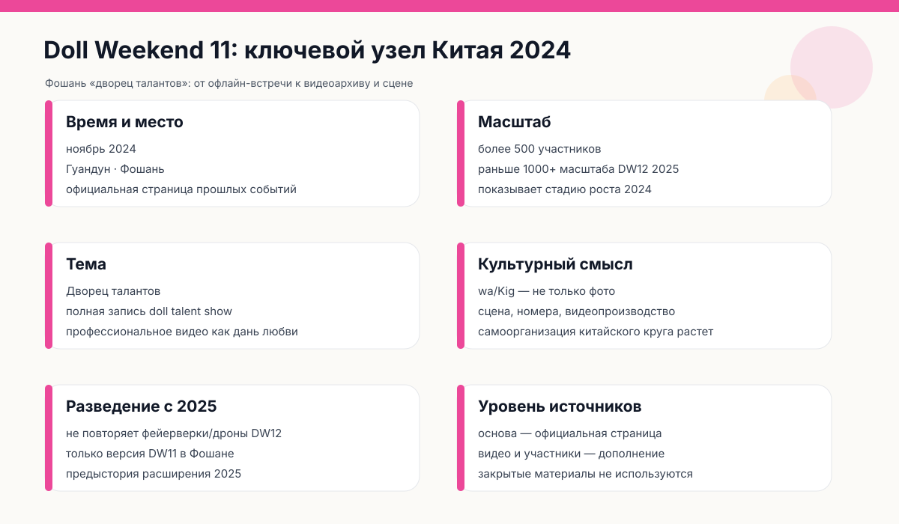
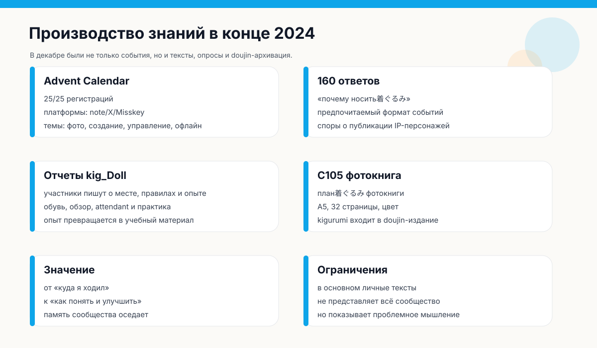

# Хроника Kigurumi 2024 года

> В томе собраны события, работы и публикации этого года. Анонсы отделены от подтверждённых записей о проведении.

## Хроника 2024 года

### Примерно 10 февраля: ぐ着着ぐFesta! Специальное СТУДИЙСКОЕ фотомероприятие отменено – цена и неопределенность небольших мероприятий

Одним из негативных моментов начала 2024 года является отмена «着ぐFesta! Special STUDIO Photography イベント». Эта страница основана на предпосылке фотомероприятия, полностью основанного на предварительном бронировании. Формат мероприятия отличается от открытого общения традиционной Фесты: изначально он ближе к студийному мероприятию, специализирующемуся на фотографии, требует предварительной записи и имеет ограниченное пространство. Однако на паблике было указано, что мероприятие приостановлено по «разным причинам». Поскольку в примечании об отмене не была публично указана более конкретная причина, в этой статье не будут размышлять о внутренней ситуации организаторов, а будет зафиксирована только неопределенность относительно проведения раннего мероприятия в 2024 году. [[S23]](#s23)

Это событие заслуживает того, чтобы его зафиксировали, поскольку сложность занятий kigurumi часто недооценивается со стороны. Для обычных косплей-собраний может потребоваться только разрешение на место, переодевание и фотографирование; но на специальных мероприятиях kigurumi также необходимо учитывать транспортировку головы, больший багаж, плохую видимость, конфиденциальность при переодевании, нужны ли сопровождающие, можно ли снимать маски во время мероприятия, соотношение фотографов и исполнителей, можно ли устраивать перерывы и можно ли контролировать прохожих. Хотя студийные мероприятия более контролируемы, чем публичные выставки, они также в большей степени зависят от количества резерваций, баланса затрат, распределения времени и условий помещения. Отмена может произойти из-за недостаточной посещаемости, изменения условий проведения мероприятия или более высоких, чем ожидалось, эксплуатационных расходов.

Это также показывает, что расширение японских мероприятий kigurumi в 2024 году не было гладким. Как вы увидите позже, 着ぐFesta 5 и 6 прошли стабильно, но устойчивость серии не означает, что можно реализовать каждый дополнительный проект. Позитивное значение отмены состоит в том, что она обнажает тот факт, что «специализированная деятельность не считается чем-то само собой разумеющимся»; Негативный смысл заключается в том, что маршруты участников, подготовка оборудования и планы съемок могут быть сорваны. Для игроков kigurumi, требующих дорогостоящего снаряжения, отмена мероприятия влияет больше, чем для обычных зрителей, поскольку головные уборы, костюмы, парики, обувь, набивка и встречи для фотосъемок могут быть подготовлены заранее.

### 16-17 марта: фотосессия талисмана на hololive SUPER EXPO 2024.

13 марта 2024 года hololive SUPER EXPO 2024 официально выпустила «ぐるみグリーティングについて». В объявлении говорится, что вокруг башни с часами пройдет фотосессия талисмана. ДЕНЬ 1 состоится 16 марта 2024 года, а ДЕНЬ 2 — 17 марта. Анкимо и Субару Дак появятся около 12:40 в оба дня, а Микоданье, УДИН и Смол Амэ появятся примерно в 15:40 в ДЕНЬ 1 и в 15:55 в ДЕНЬ 2. Ожидается, что каждая группа продлится около 20 минут. [[S1]](#s1)

Этот тип официального приветствия имеет иную мотивацию, чем фанатское kigurumi анимегао.ぐるみ в Hololive больше похоже на точку физического контакта с персонажем бренда. Для индустрии VTuber это средство, позволяющее подключать виртуальных персонажей, производные талисманы и фанатов в автономном режиме. Зрителям не обязательно разбираться в производстве kigurumi, колготках или внутренней структуре масок, чтобы понять выставочный опыт через «движущихся персонажей». Он освобождает персонажа от экрана, комнаты прямой трансляции и периферийных изображений и превращает его в тело, которое можно встретить, сфотографировать и помахать рукой в ​​ответ на месте проведения.

### 23-24 марта: FGO × AnimeJapan 2024 — официальная комбинация косплеера и приветствия kigurumi.

Fate/Grand Order будет представлена ​​на AnimeJapan 2024 в Tokyo Big Sight 23-24 марта 2024 года. На официальной странице указано, что на стенде FGO будут проводиться показы и сценические мероприятия, а стенд расположен в East 5 Hall J46; один из предметов - «コスプレイヤー･恐るみグリーティング», и он объясняет, что в кабинке, как ожидается, будет реализовано приветствие, а также появятся новые косплееры Слуг. [[S2]](#s2)

Этот узел FGO похож на приветствие Hololive, оба из которых являются материализацией официального IP; но особенностью FGO является то, что «косплеер + kigurumi» вместе создают атмосферу стенда. Косплеер представляет персонажа в реальной форме, а kigurumi представляет другой тип персонажа в виде талисмана/тела с полным капюшоном. Для зрителей это сформирует слой: сцена, экспозиция, драгоценный фантомный реквизит, фотостудия вызова героев, официальный косплеер, приветствие kigurumi совместно превратят IP мобильной игры в пространство, по которому можно гулять и фотографироваться в стенде.

Ежегодное значение этого мероприятия не в том, что «FGO впервые приветствует приветствие», а в том, что оно продолжит иллюстрировать и в 2024 году: крупномасштабное двумерное IP ввело физическое взаимодействие персонажей в стандартные выставочные операции. Приветствие на стенде также имеет управленческое значение: по сравнению с возможностью свободно перемещаться по музею, взаимодействие внутри стенда облегчает контроль очередей, ракурсов камеры, времени ожидания, заторов и границ контактов. Этот вид пространственного контроля очень важен в такой форме выступления, как kigurumi, где движение ограничено.

### 6 апреля: 着着ぐFesta! 5-е — Публичный текст о «дружелюбии к новичкам» и регулярном общении.

6 апреля 2024 г., автор 着ぐFesta! Пятый состоялся в зале Аракава Кодама в округе Аракава. На странице мероприятия указано, что оно «ぐるみさんと与ぐるみ好きさんのCommunicationイベント» и начнется в тот же день в 10:00. Организатор объясняет, что мероприятие вызвано спросом на «мероприятие, которое не требует предварительного бронирования и в котором можно легко сыграть»; место может вместить около 300 человек. Вестибюль приветствует участие в тот же день и претендует на дружеское мероприятие для начинающих игроков в kigurumi. [[S3]](#s3)

Суть этого мероприятия – не громкая фотография, а социальная реставрация. В описании мероприятия прямо указывалось: «Многие новички видели, что на мероприятии организаторы записали этот вопрос, указав, что они осознают, что реальным порогом деятельности kigurumi является не только «есть ли головная оболочка», но и то, можно ли вступать в социальные отношения, готов ли кто-то проявить инициативу в общении и существуют ли правила защиты новичков и молчаливых исполнителей.

Правила 着ぐFesta 5 также важны. На странице четко запрещена «фотосъемка», то есть съемка без разрешения сбоку, пока снимают другие; Организатор заявляет, что даже если субъект видит, как кто-то делает фотографию, это все равно откровенная фотография без согласия, и сначала необходимо получить разрешение субъекта. На мероприятии также запрещены объятия на том основании, что с исполнителями kigurumi нелегко разговаривать, то есть их трудно выразить, и может быть трудно отказаться от чрезмерного контакта; также запрещено размахивать длинными предметами, а маски разрешается снимать только в раздевалке и плаще. [[S3]](#s3)

### Около 24-26 мая: Anime North 2024 и новые дизайны масок Kigurumi Online

Значение североамериканской линии в 2024 году также здесь: она не делает акцент на масштабных сценах, таких как китайский Doll Weekend, и не делает акцент на специализированных площадках для проведения мероприятий, таких как японская линия Токио/Кюсю, а больше ориентирована на распространение знаний и снижение порога. Многие новички за границей испытывают трудности с доступом к японским материалам, а также трудно судить о взаимосвязи между производителем, структурой маски, одеждой цвета кожи, париками и одеждой. Kigurumi Online разбивает эти вопросы на совместные процессы посредством семинаров, так что «первый опыт» не должен начинаться с дорогостоящего индивидуального заказа.

### 26 мая: Эпизод 1 «きぐるみパーティ» — отправная точка специальной линии событий Токио Одайба.

26 мая 2024 года в Одайбе, Токио, состоялся «きぐるみパーティ». В публичном отчете участников указано, что это мероприятие состоится 26 мая 2024 года, участники примут участие в мероприятиях в променад-парке Одайба, Приморском парке, Плаза Хэйсэй и других местах; В резюме отчета говорится: «Можно проводить мероприятия в парке Одайба и на площади Хэйсэй, но расстояние пешком длиннее, без сторонников будет сложнее, и есть различные участники kigurumi. [[S4]](#s4)

Наблюдения за «サポートがいないときついかも», о которых сообщили участники, очень ценны. Сообщество kigurumi часто говорит о важности сопровождающих/помощников, но многие посторонние понимают это только после того, как увидели движение на мероприятии: поле зрения исполнителя обычно не совпадает с реальным полем зрения, линия глаз персонажа не совпадает с линией глаз реального человека, а внезапное приближение ступенек, бордюров, транспортных средств, велосипедов и детей может привести к риску. Такое открытое пространство в Одайбе, Токио, придает работе ощущение места, а также увеличивает стоимость переезда.

### 15 июня: 着着ぐFesta! Night2nd - ночная студийная фотосессия и еще один маршрут, полностью основанный на предварительном бронировании.

15 июня 2024 г., 着ぐFesta! Night2nd проводится как мероприятие по ночной фотографии в Chrome Studio Kawaguchi. На странице TwiPla указано, что мероприятие пройдет с 21:30 15 июня 2024 года до 7:30 следующего дня с полной системой бронирования, вместимостью 40 человек и стоимостью 4000 иен; В описании мероприятия также подчеркивается, что фотосъемка будет проводиться персоналом, и позиционируется это как особенное счастливое событие для «ぐるみさん与ぐるみ好きさん». Статус публичной регистрации показывает, что участников 14 из 40, 4 «заинтересованы» и 2 «не участвуют». [[S24]](#s24)

Night2nd — легко упускаемая из виду, но очень структурно значимая попытка в линейке Festa 2024 года. И 5-е апреля, и 6-е сентября, как правило, представляют собой встречи по обмену, которые «без предварительной записи, доступны в один и тот же день и дружелюбны к новичкам»; Night2nd идет в совершенно противоположном направлении: только бронирование, верхний предел количества человек, студия, всю ночь напролет, основная цель - фотография. Это показывает, что в 2024 году один и тот же организатор/один и тот же круг мероприятий одновременно исследовал две потребности: одна — снизить входной барьер, чтобы одиночные игроки могли приходить и знакомиться с людьми; другой — сжать внешние помехи и позволить участникам снимать в управляемой студии в течение длительного времени.

Правила Night2nd продолжают осознавать границы 着ぐFesta. Страница запрещает «обрезку» и требует согласия субъекта перед съемкой; запрещает обниматься, потому что под маской еще сложно выразить смысл; запрещает размахивать длинными предметами; и требует, чтобы лицо не снималось, кроме как в раздевалке и плаще. Эти правила показывают, что даже в относительно закрытой студии нельзя игнорировать согласие на съемку, физический контакт, безопасность реквизита и границы статуса персонажа. [[S24]](#s24)

В то же время Night2nd выдвигает на первый план еще один тип риска: ночной и ночной. Для исполнителей kigurumi, хотя ночная студия избегает дневной жары и зевак прохожих, она также приносит такие проблемы, как недосыпание, потеря физических сил, потеря концентрации во второй половине ночи, уход за макияжем и костюмами, а также обратный транспорт. Полный головной убор, колготки, парики и обувь персонажей будут продолжать потреблять физическую энергию в течение нескольких часов непрерывной съемки; без полноценного отдыха, питья и поддержки со стороны сверстников ночная среда не будет безопаснее, чем днем.

### 2–4 августа: Всемирный саммит косплея 2024 года и летние темы безопасности.

С точки зрения хроники kigurumi, важность WCS 2024 заключается не только в чемпионате, но и в том, что он выдвигает на первый план безопасность летнего косплея. Проект Японской метеорологической ассоциации «Heatstroke Zero ゼロへ» объявил 23 июля 2024 г., что этот проект будет впервые представлен на WCS2024, а с 3 по 4 августа в Oasis 21 будет установлен стенд, призывающий к предотвращению тепловой болезни с помощью фотореквизита, фоновых досок, средств противодействия жаре и т. д.; В то же время оперативному персоналу WCS будут предоставлены 33 костюма с кондиционерами и вентиляторами. [[S7]](#s7)

Это особенно важно для kigurumi. Обычные косплееры уже сталкиваются с такими проблемами, как пребывание на солнце, очереди, тающий макияж и обезвоживание летом; Kigurumi также добавляет давление панциря на голову, костюмов для всего тела, набивки, париков, ограниченного зрения и неудобства при снятии головы. WCS 2024 — это не мероприятие, посвященное исключительно kigurumi, но оно представляет собой начало массовой сцены косплея, более открыто затрагивая вопрос о том, как безопасно проводить мероприятия в середине лета. Термокабина и униформа болельщиков персонала показывают, что безопасность – это не просто личное осознание участников, а неотъемлемая часть выставочной деятельности.

### 3-4 августа: ФГО Фес. 9-я годовщина 2024 г. — сочетание официальных приветствий и ограничений в одежде для участников.

3–4 августа 2024 г. пройдет фестиваль Fate/Grand Order Fes. В 2024 году 9-я годовщина состоится в Makuhari Messe. На официальной странице аттракциона указано «グリーティング», поясняется, что будет проводиться приветствие ぐるみ, и написано, что «разрабатываются новые правила». Это показывает, что FGO не только продолжает использовать поздравления kigurumi к девятому юбилейному мероприятию в 2024 году, но и создает новых персонажей kigurumi. [[S8]](#s8)

Особенность этого мероприятия в том, что с одной стороны чиновники устраивают поздравления kigurumi, а с другой - накладывают ограничения на косплей-костюмы обычных участников. ФГО Фес. Правила косплея 2024 года гласят, что к одежде с ограниченным доступом относятся «костюмы, которые трудно передвигать». Примеры: большие бумажные ракушки, ぐるみ, одежда до пола, крупные украшения и т. д. [[S9]](#s9)

Это сопоставление стоит записать в хронику 2024 года. Это показывает, что отношение официальной кампании интеллектуальной собственности к kigurumi не просто «разрешено» или «запрещено». Официально управляемые kigurumi — это активы мероприятий с фиксированными ролями, персоналом, механизмами распространения и закулисным управлением; в то время как обычные участники, носящие kigurumi в людных местах, могут вызвать проблемы с доступом, обзорностью, безопасностью, эвакуацией и организацией фотосъемки. Таким образом, одно и то же мероприятие может иметь как «официальное приветствие kigurumi», так и «одежду kigurumi участника, ограничивающую подвижность».

С точки зрения сообщества, такого рода правила могут вызывать у игроков противоречивые чувства: почему это могут делать чиновники, а не отдельные лица? Но с точки зрения управления деятельностью разница заключается в владении ответственностью и управляемости. Официальные функции обычно включают в себя персонал, маршруты, места отдыха и зоны для фотографий; отдельные игроки могут перемещаться по площадке, и организатору сложно определить, сопровождают ли они их, смогут ли они вовремя их избежать и не заблокируют ли они проход. ФГО Фес. Таким образом, 2024 год наглядно демонстрирует: kigurumi приветствуются как форма выступления на коммерческих IP-мероприятиях, но не обязательно безоговорочно приветствуются как форма косплея для аудитории.

### 11–12 августа: Летний комикет C104 — жара, 260 000 человек и подсказки об активности фанатов kigurumi.

Summer Comic Market 104 пройдет в Tokyo Big Sight 11-12 августа 2024 года. В отчете COSPO C104 говорится, что всего за два дня на площадку пришло около 260 000 человек, а самые высокие температуры в Токио превысили 35°C 11 и 12 августа. [[S10]](#s10)

Значение C104 для kigurumi не в том, что это посвященное kigurumi мероприятие, а в том, что Comiket представляет собой супер-большое пересечение японской фан-культуры и культуры косплея. Для игроков kigurumi такое поле, как C104, полно противоречий: с одной стороны, Big Sight и Comiket имеют чрезвычайно высокую видимость, и если их стили персонажей появятся, они получат много внимания; с другой стороны, летние высокие температуры, скопление людей, очереди, обработка багажа, правила зоны фотографирования, очереди на передвижение стендов и ограничения на смену костюмов — все это крайне недружелюбно по отношению к kigurumi. Палящая жара, превышающая 35°C, уже тяжела для обычных косплееров, но еще выше риск для kigurumi с полным головным убором, костюмами для всего тела, толстыми париками и неудобством при снятии головы.

Связь между kigurumi и деятельностью фанатов Комикета также можно увидеть в публичной информации. Например, в личной заметке упоминаются планы и связанные с ними книги, такие как «Цзо ぐるみ売り子» в C104. Этот тип информации в основном представляет собой личные записи/записи небольшого круга и не подходит для больших выводов, но он показывает, что kigurumi существует не только на фотосессиях или специальных мероприятиях, но также вошло в творческие практики, такие как фан-киоски, продавцы, фотокнигаы и книги путешествий персонажей.

### 1 сентября: 着着ぐFesta! 6-е и афтепати ——Уточненные социальные правила, советы по запрету на поездки и влияние тайфуна на движение транспорта.

1 сентября 2024 г., 着ぐFesta! Шестой турнир снова состоялся в Аракава Кодори, округ Аракава. Страница мероприятия продолжает занимать 5-е место: бронирование не требуется, участие в тот же день приветствуется, а также дружелюбно к игрокам kigurumi, которые участвуют в мероприятии впервые; цель мероприятия по-прежнему состоит в том, чтобы позволить игрокам kigurumi, не имеющим знакомых и занимающимся сольной деятельностью, установить контакт. Правила также были продолжены и уточнены: нельзя обниматься, не обниматься, не размахивать длинными предметами, не удаляться от лица, кроме как в раздевалке/クローク. [[S11]](#s11)

Ценность 6-го уровня заключается в том, что он продолжает логику активности 5-го уровня в стабильном формате, а не в виде однократной попытки. На общедоступной странице показаны 55 участников, 17 заинтересованных и 7 неучаствующих; хотя это и не крупномасштабное мероприятие, оно продемонстрировало свою стабильную привлекательность для специализированной коммуникационной деятельности kigurumi. [[S11]](#s11)

Это событие также оставило несколько публичных подробностей, достойных того, чтобы быть вписанными в негативную историю управления. В комментариях к мероприятию в аккаунте организатора указано, что люди из запрещенного списка удалены из «Обсуждения 検», и напомнили, что даже если бы они присутствовали в тот день, они не смогли бы войти. Это не должно распространяться на обсуждение каких-либо конкретных лиц, а также не следует выявлять личности исключенных; «Хроника» лишь фиксирует последствия для управления: к 2024 году некоторые виды деятельности kigurumi уже должны иметь дело с рисками в виде списков исключений, отказов в приеме и предварительной проверки. [[S11]](#s11)

В том же разделе комментариев также были сообщения о людях, которые отказались от участия из-за отмены поездов и самолетов Синкансэн или трудностей с передвижением из-за тайфуна. Это показывает, что реальные затраты на деятельность kigurumi также включают неопределенность транспортировки. Когда игроки несут с собой чехлы, одежду, обувь, парики и фотооборудование, временная смена маршрута труднее, чем обычное путешествие; тайфуны и перебои в дорожном движении напрямую повлияют на участие в мероприятии. [[S11]](#s11)

1 сентября фестиваль 着ぐFesta! Также запланировано проведение шестой afterparty с 16:00 до 19:00. На странице afterparty поясняется, что это ответ на нужды «людей, которые хотят присутствовать на afterparty, но их не приглашают и они стесняются спросить». Он подготовлен участниками мероприятия и полностью основан на предварительном бронировании, в нем могут принять участие максимум 30 человек, из которых могут принять участие 27 человек. Правила отличаются от правил на основной площадке: никаких громких звуков, никаких объятий, никаких объятий, площадка маленькая, поэтому держать реквизит запрещено; Kigurumi необходимо снимать во время еды. [[S12]](#s12)

Эта вечеринка имеет огромную общественно-историческую ценность. Оно признает проблему «социального неравенства» в деятельности kigurumi: в кругу знакомых, естественно, будут оставаться «последователи», а новички на обочине могут быть исключены. Организатор сделал afterparty регулярным вспомогательным мероприятием с ограниченным участием только по предварительному заказу, что эквивалентно тому, чтобы сделать часть частного общения публичной и прозрачной. Это также показывает зрелую тенденцию: состояние персонажей подходит для фотографирования, но когда дело доходит до настоящего установления отношений, питания, правил общения и знакомства друг с другом, им необходимо вернуться в коммуникативное человеческое состояние.

### 23 сентября: Китакюсю «Аркадный марш! 1» — отправная точка специальной линейки событий Кюсю.

23 сентября 2024 года «Великий Марш! 1» пройдет в Mitsubishi Kitakyushu. В списке прошлых мероприятий Cospic/Cosplay Picnic указано, что это совместно организованное мероприятие, которое состоится 23 сентября 2024 года на Всемирном стадионе Китакюсю Микуни. [[S13]](#s13)

Поэтому 1-я серия «Великого марша!» является одним из наиболее важных узлов локализации Японии в 2024 году. Он показывает, что мероприятия kigurumi не обязательно должны зависеть исключительно от Токио; Местные сообщества также могут составить свои собственные визитные карточки мероприятий с указанием транспорта, места проведения, совместного проведения и одежды для всего тела.

### 6 октября: Второй выпуск «きぐるみパーティ» — быстрое повторение событий, характерных для Токио.

6 октября 2024 года состоится второй выпуск «きぐるみパーティ». В списке общенациональных косплей-мероприятий Cospot Media на октябрь 2024 года указано «Второе отделение・きぐるみパーティ» в разделе Токио, время проведения - 10:00–16:30, а ассоциацией-спонсором является コスプレ博実行 Committee (Brave House). [[S14]](#s14)

Значение этого события - «скорость воспроизведения». Менее чем через полгода после первой майской сессии в октябре прошла вторая, что показывает, что майская попытка была не случайной мелкомасштабной съемкой, а форматом мероприятия, которое организаторы и участники сочли достойным продолжения. Для kigurumi воспроизводимость события очень важна: игрокам необходим предсказуемый цикл событий при создании новых персонажей, назначении встреч с фотографами, организации поездок, а также подготовке багажа и транспорта. Если событие происходит только один раз, в памяти сообщества, скорее всего, останется «определенное время, когда было весело»; если оно повторяется в течение шести месяцев, оно может стать фиксированным.

С точки зрения культурной значимости, глава 2 также доказывает, что игрокам kigurumi нужно больше, чем просто угловое пространство для обычных выставок косплея, но и специализированные занятия, которые позволяют им снимать костюмы, передвигаться, фотографировать, общаться и быть понятыми. В самом Токио нет недостатка в мероприятиях по косплею, но мероприятия, специально посвященные kigurumi, по-прежнему ценны, показывая, что потребности kigurumi не совсем совпадают с потребностями обычного косплея.

### Ноябрь: Doll Weekend 11 Фошань, Гуандун — 500+ этапов китайского круга «Киг»

В ноябре 2024 года в Фошане, провинция Гуандун, пройдет Doll Weekend 11 по теме «Зал талантов». На официальной странице мероприятия Doll Weekend указано: Doll Weekend 11, ноябрь 2024 г., Фошань, Гуандун; «Все кукольное шоу талантов будет записано, отдав дань любви профессиональными образами, а число участников превысит 500 человек». [[S15]](#s15)

Тема «Зала талантов» имеет большую исследовательскую ценность. Kigurumi часто рассматривается как статичная визуальная культура со стороны: головная оболочка, пропорции тела, реставрация одежды и красивые фотографии. Но шоу талантов превращают игроков из «сфотографированных субъектов» в «артистов сцены». Это выдвинет более высокие требования: Как диапазон движения адаптируется к прицелу головной оболочки? Позволяет ли костюм танцевать или играть? Нужно ли артистам репетировать заранее? Как освещение на площадке, высота сцены, расстояние до аудитории и положение камеры могут быть совместимы с одеждой, закрывающей все тело? Эти вопросы выходят за рамки обычных фотосессий.

«Полная запись» DW11 не менее важна. Многие воспоминания о занятиях в узком кругу разбросаны по личным фотокнигаам, групповым чатам и социальным сетям и со временем легко исчезнут. Официальная видеозапись означает, что организаторы надеются сохранить мероприятие как информацию, которую можно будет распространять, просматривать и использовать для продвижения инвестиций и культурной интерпретации. Это шаг сообщества к переходу от «игры» к «оставлению файлов».

### 1 декабря: kig_Doll Kawasaki — новый узел, сочетающий в себе фотографию, общение, легкую еду и сцены с дилерами.

1 декабря 2024 года kig_Doll прошел в Центре промышленной рекламы города Кавасаки. На странице билетов LivePocket указано расписание мероприятий на 1 декабря 2024 г., начиная с 10:30 и заканчивая в 20:00; билеты включают в себя первую часть пакета «Фотография, общение» и вторую часть «Легкое питание き Общение» стоимостью 3000 иен, только первая часть стоит 1500 иен, а вторая часть составляет 1500 иен; первая часть — с 10:30 до 16:30, вторая часть — с 17:00 до 20:00. [[S16]](#s16)

Стоит записать структуру kig_Doll. Это не простая встреча фотографов и не совершенно бесплатная встреча по обмену опытом. Вместо этого он разделен на сегменты для обмена фотографиями в течение дня и обмена легкими закусками вечером. Для занятий kigurumi такая сегментация очень разумна: в течение дня вы можете оставаться в образе, фотографироваться, знакомиться и гулять; вечерняя сцена с легким обедом больше подходит для снятия костюмов, знакомства со своей истинной личностью и обмена опытом производства и деятельности. Он обрабатывает «демонстрацию работы» и «построение отношений» отдельно, уменьшая конфликт между ролевым статусом и реальным общением с точки зрения дизайна деятельности.

Участник Осуми Акари сообщил, что просторный первый этаж заведения был заполнен kigurumi, и пришел к выводу, что «было весело иметь много kigurumi», «можно было провести целый день», а «этап обмена был полезен для расширения связей». В отчете также говорилось, что, поскольку это было первое мероприятие, мне было неловко перед участием, но с точки зрения участников операция прошла очень гладко, а персонал действовал с точки зрения kigurumi. Там также упоминалось, что, похоже, были разногласия, связанные с правилами, и как участнику мне следует быть осторожным, чтобы не стать стороной. [[S17]](#s17)

Другой отчет やえぶろ содержал более подробные размышления о практике: участники писали, что шли слишком быстро и должны медленнее и активнее реагировать на окружающие звуки; выбор обуви влияет на боль в ногах во второй половине; сопровождающему следует попросить помочь и обратить внимание на разницу в высоте между линией обзора персонажа и линией обзора реального человека; такие детали, как свободный ремень, также будут влиять на характеристики персонажа. [[S18]](#s18)

Этот тип размышлений важен для «Хроник 2024», потому что он перемещает kigurumi от «внешности» обратно к «практике». Милый персонаж или нет, зависит не только от панциря головы и одежды, но и от темпа, поворотов, жестов, обуви, линии взгляда, антуража, пояса, баланса тела и от того, можно ли услышать обратную связь от окружения. Отчеты участников kig_Doll показывают, что в 2024 году японская сцена kigurumi начала записывать эти детали как эмпирические знания. Этот контент не является большой новостью, но он представляет собой зрелую ячейку сообщества.

### 1–25 декабря: Адвент-календарь на 2024 год, автор: ぐるみ——Распространенное письмо и создание знаний сообщества.

В декабре 2024 года на Adventar будет проводиться «ぐるみ(kigurumi) Адвент-календарь 2024». На странице видно, что количество регистраций 25/25, а создатель — Ону Ю; описание приветствует отправку контента kigurumi независимо от типа, и платформа не ограничивается примечаниями, Twitter/X, Misskey и т. д. Примеры тем включают обаяние оригинальных персонажей, преимущества kigurumi, методы фотографии, то, что вы делаете в автономном режиме, тяжелая работа по проведению мероприятий, любимые фотостудии/мероприятия, рекомендации после магазинов, собственный опыт, навыки гримасы, и вы даже можете просто опубликовать фотографию. [[S19]](#s19)

Это «исследовательское мероприятие», проводимое исключительно в 2024 году. Это не то же самое, что крупномасштабное мероприятие, но оно еще более ценно с точки зрения исторических данных. Офлайн-мероприятия обычно оставляют фотографии и размышления, но Адвент-календарь объединяет разрозненных игроков, продюсеров, фотографов и организаторов во временную структуру, позволяя каждому опубликовать статью или контент о kigurumi в один день декабря. Полная регистрация 25/25 показывает, что у проекта не только есть идеи, но и достаточно участников, чтобы откликнуться.

Его значение имеет три уровня. Во-первых, это переводит kigurumi из «культуры просмотра картинок» в «культуру письма». Многие посторонние судят о kigurumi только по фотографиям, но не понимают, почему игроки его носят, как они готовятся, как участвуют в мероприятиях и как они справляются с фотографией и социальным взаимодействием. Адвент-календарь поощряет писать об этом опыте. Во-вторых, он признает разнообразие жанра kigurumi. Примеры заявок не ограничиваются анимегао или доллером, требования к техническим статьям отсутствуют; это позволяет производству, фотографии, операциям, повседневной жизни, любви персонажей, офлайн-встречам и обедам после событий стать частью культуры kigurumi. В-третьих, это обеспечивает индекс для будущих исследователей. Даже если некоторые ссылки впоследствии станут недействительными, сама страница Адвент-календаря сохранит следы активной работы сообщества в 2024 году.

### 15 декабря: Китакюсю «Аркадный марш! 2» — в том же году вновь появилась локальная линия активности.

15 декабря 2024 года «Великий марш! 2» пройдет в Минакура Китакюсю. В списке прошлых мероприятий Cospic оно указано как совместно организованное мероприятие 15 декабря 2024 года, а местом проведения по-прежнему является Всемирный стадион Китакюсю Микуни. [[S13]](#s13)

Значение этого события - «повторение в одном и том же году». Менее чем через три месяца после первого мероприятия в сентябре второе мероприятие было проведено на той же основной площадке, что показывает, что Kyushu Line не просто один раз пробует почву, но и быстро формирует ритм. Это более важно для местного сообщества kigurumi, чем отдельное мероприятие. Местные игроки часто сталкиваются с такими проблемами, как то, что Токио/Канто находятся слишком далеко для развлечений, высокие транспортные расходы и трудности с перевозкой багажа. Если есть фиксированные местные узлы, игроки могут уменьшить необходимость путешествовать по регионам, и им будет легче назначать встречи с региональными фотографами, создавать сеть знакомств, а также развивать местных производителей/дилеров и волонтеров мероприятий.

Эпизод 2 также доказывает, что сочетание названия и места проведения «Великого марша!» иметь преемственность. Пространство стадиона подходит для сбора различных типов костюмов, закрывающих все тело: анимегао, красивые девушки в ぐるみ, куколки, фурри/ケモノ, герои/гава-ко — все они могут столкнуться с одинаковыми проблемами движения и безопасности. Kyushu Line начнет включать их в тот же образ деятельности «путешествия/коммуникации» в 2024 году.

### 20 декабря: 160 ответов на отчет-анкету «斐るみの考え方».

20 декабря 2024 года やえぶろ опубликовал статистические результаты анкеты «ぐるみの考え方を知りたい». В начале статьи говорится, что на анкету получено 160 ответов; Среди вопросов были: «Почему ты носишь ぐるみ в качестве хобби?» «Какой ваш любимый способ донести ぐるみ до людей?» «В мероприятии какого масштаба вы хотите принять участие?» «Доля времени, проводимого при ношении во время занятий» «Предпочтительный размер фотосессии» «Следует ли искать, обходить или помечать фотографии персонажей, защищенные авторским правом, когда они публикуются?» и т. д. [[S20]](#s20)

Этот опросник является очень важным «исследовательским мероприятием» 2024 года. Он превращает вопросы, которые изначально основывались на впечатлениях, в обсуждаемые данные. В статье упоминается, что около 70% респондентов выбрали «потому что им нравится Мику» в качестве причины ношения одежды, а также появились такие мотивы, как «желание трансформироваться», «желание носить милую/красивую одежду» и «быть субъектом творчества». Он также отметил, что в «форме представления ぐるみ публике» существуют различия в предпочтениях между встречами, мероприятиями и фотосессиями; учитывая масштаб мероприятия, «специализация ぐるみ イベント» получила высокую поддержку; Мнения о том, следует ли избегать поиска фотографий персонажей, защищенных авторским правом, и стоит ли добавлять теги имен персонажей, также показали различия. [[S20]](#s20)

Значение анкеты не в том, чтобы дать единственный правильный ответ, а в том, чтобы выявить разнообразие внутри сообщества. Внешняя аудитория часто сводит мотивацию kigurumi к одной интерпретации: фетиш, переодевание в одежду другого пола, любовь к персонажу, фотография, анонимность, перформанс. Но 160 ответов показывают, что мотивы сложны, и разные игроки имеют разные предпочтения в отношении рекламы, лейблов, размера мероприятия, количества фотосессий и времени одевания. Эти различия напрямую повлияют на дизайн мероприятия: если многие люди предпочитают специализированные мероприятия, организатору следует предусмотреть пространство, более подходящее для kigurumi; если количество людей на фотосессии не должно быть слишком большим, фотоорганизация должна ограничить масштабы; Если возникают разногласия по поводу раскрытия персонажей, защищенных авторскими правами, игроки должны уважать стратегии друг друга.

Этот отчет также дополняет смысл Адвент-календаря на 2024 год. Адвент-календарь распространяется письменно, а анкета - статистическое самонаблюдение. Эти два вместе взятых показывают, что в конце 2024 года сообщество kigurumi не только активно, но и размышляет о себе.

### 29-30 декабря: фотокнига C105, приветствие компании hololive и Цукаса.

Comic Market 105 пройдет в Tokyo Big Sight 29–30 декабря 2024 года. На официальной странице мероприятия C105 hololive указано, что производственный стенд hololive будет выставлен с 29 по 30 декабря 2024 года, и планируется реализовать приветствия «みこだにぇー» и «毛玉ころね». На странице также указаны места расположения корпоративных стендов, время и краткая информация о мероприятиях. [[S22]](#s22)

Это показывает, что официальное IP-приветствие в конце 2024 года не останавливается на hololive SUPER EXPO, а выходит на сцену корпоративного стенда Comiket. Корпоративная зона Комикета отличается от обычных выставочных стендов. Он зажат между фан-культурой, продвижением бизнеса, покупками в конце года, контролем толпы и взаимодействием с фанатами. Hololive организовала приветствие kigurumi в C105, которое показывает, что персонаж-талисман также используется в качестве инструмента для привлечения аудитории, создания точек памяти и социального общения в крупномасштабных двумерных сценах потребления в конце года.

В тот же период C105 личная заметка «コミケ105では之ぐるみфотокнигаを出します!» записал еще одну строчку, которую стоит написать в 2024 году: автор планирует выставиться на выставке C105 West Region «ね» 23b 29 декабря, а ジャンル — Love Live!, с Никитой в качестве продавца, в этот день выпустил новый 32-страничный полноцветный выпуск формата А5 «Дневник Ниары ~ Издание Одайбы ~». [[S21]](#s21)

Эта информация иллюстрирует появление kigurumi в практике фанатских публикаций. Это не официальное IP-приветствие и не просто фотография с мероприятия, а сочетание косплея Мику, тура по локациям, рабочего мира и производства додзинси. Для социальной истории фотокнигаы важны, поскольку они фиксируют фотографии, которые обычно циркулируют на социальных платформах, в физические тексты, которые можно собирать, продавать и передавать. Это также делает kigurumi не просто «настоящим телом», а редактируемым видеоповествованием.

Таким образом, к концу 2024 года C105 будет иметь два значения: коммерческие стороны будут укреплять взаимодействие IP на месте посредством приветствия ぐるみ, а отдельные авторы будут превращать опыт kigurumi в фан-работы с помощью фотокнигаов. Первое представляет собой индустриализацию, а второе — создание сообщества; эти двое идут рука об руку и являются воплощением многослойной структуры культуры kigurumi в 2024 году.

## Источники

[S1] hololive SUPER EXPO 2024「ぐるみグリーティングについて」: https://hololivesuperexpo2024.hololivepro.com/news/greeting
[S2] Официальная информация о выставке Fate/Grand Order «AnimeJapan 2024»: https://news.fate-go.jp/2024/aj2024/
[S3] 着ぐFesta！ 5-я страница мероприятия TwiPla: https://twipla.jp/events/600801
[S4] Осуми Акари: Первый выпуск きぐるみパーティ, отчет об участии: https://www.osumiakari.jp/articles/20240526-kigupa1/
[S5] Kigurumi Онлайн: страница Мастерской Kigurumi: https://kig-o.com/index.php/kigurumi-workshop/
[S6] Министерство иностранных дел Японии: The World Cosplay Summit 2024: https://www.mofa.go.jp/p_pd/ca_opr/pagewe_000001_00077.html
[S7] Японская метеорологическая ассоциация: WCS2024 «Heatstroke Zero» дебютирует впервые: https://www.jwa.or.jp/news/2024/07/23466/
[S8] ФГО Фес. Официальная страница достопримечательности 2024 года: https://fes.fate-go.jp/2024/attraction/
[S9] ФГО Фес. Официальные правила косплея 2024 года: https://fes.fate-go.jp/2024/about/cosplay.html
[S10] COSPO: отчет о косплее C104: https://cospo.net/index.php/c104report-2/
[S11] 着ぐFesta！ 6-я страница мероприятия ТвиПла: https://twipla.jp/events/622388
[S12] 写着ぐFesta!6th アフターパーティ Страница мероприятия TwiPla: https://twipla.jp/events/622389
[S13] Список событий Cospic / Косплей-пикника за последние годы: https://cospic.org/archives/338
[S14] Cospot Media: список косплей-мероприятий на октябрь 2024 г., включая второй эпизод: https://cospot-media.com/event-list/22535/
[S15] Официальная страница мероприятия Doll Weekend 11: https://dollweekend.cn/cn/event/dw11/
[S16] Страница билета kig_Doll LivePocket: https://t.livepocket.jp/e/idx24
[S17] Осуми Акари: Отчет об участии Kig-Doll: https://www.osumiakari.jp/articles/20241201-kigdoll/
[S18] やえぶろ:Отчёт о деятельности Kig-Doll: https://sco-5113.hatenablog.com/entry/2024/12/03/201006
[S19] Адвентар: автор ぐるみ(kigurumi) Адвент-календарь 2024: https://adventar.org/calendars/10384
[S20] やえぶろ:为ぐるみの考え方を知りたい Отчет по анкете: https://sco-5113.hatenablog.com/entry/2024/12/20/211317
[S21] Конно Сори: анонс фотокнигаа C105: https://note.com/rdh27785/n/nc17aeb673227
[S22] hololive official: корпоративный стенд コミックマーケット105: https://hololive.hololivepro.com/events/c105/
[S23] 着着ぐFesta! Специальная СТУДИЙНАЯ фотография Отмена страницы: https://twipla.jp/events/587460
[S24] 着ぐFesta！ Страница события Night2nd TwiPla: https://twipla.jp/events/617052
