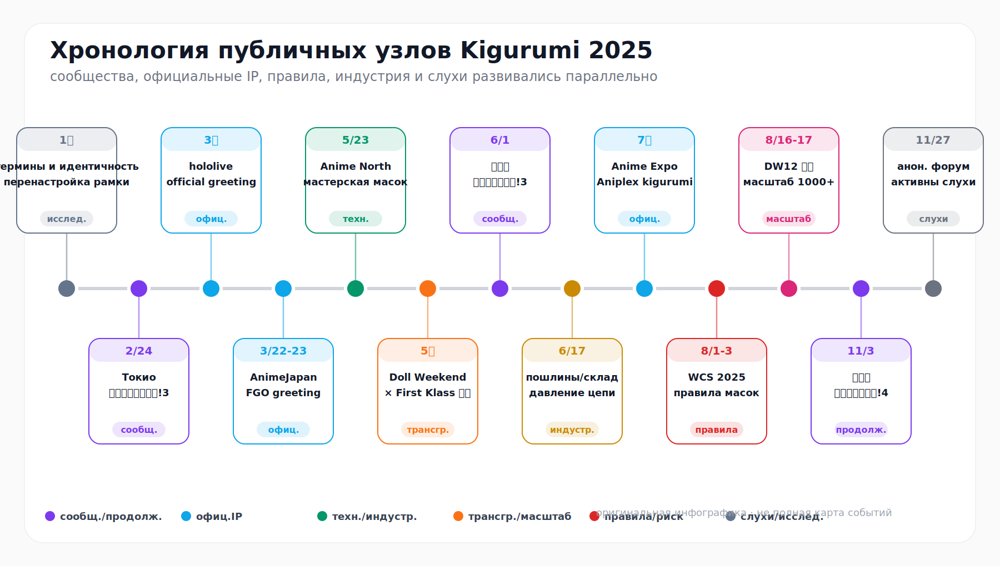
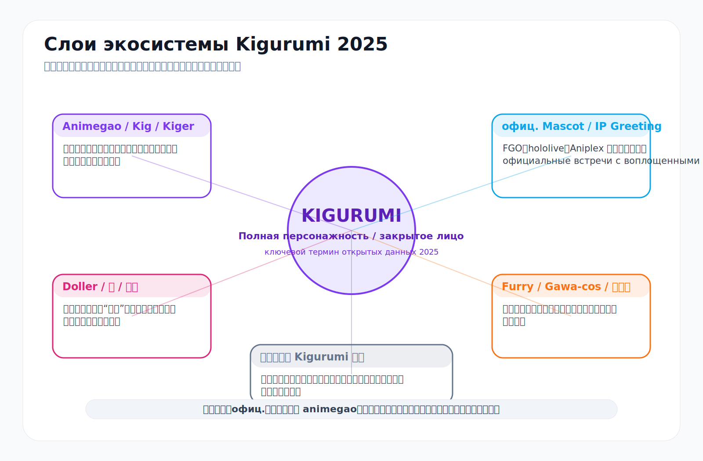
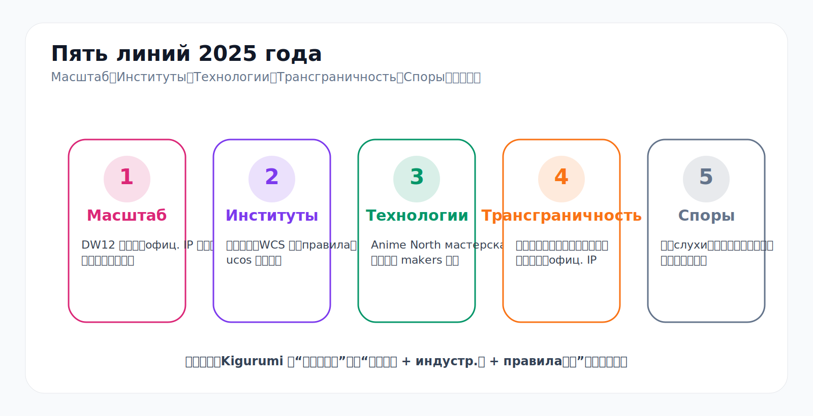
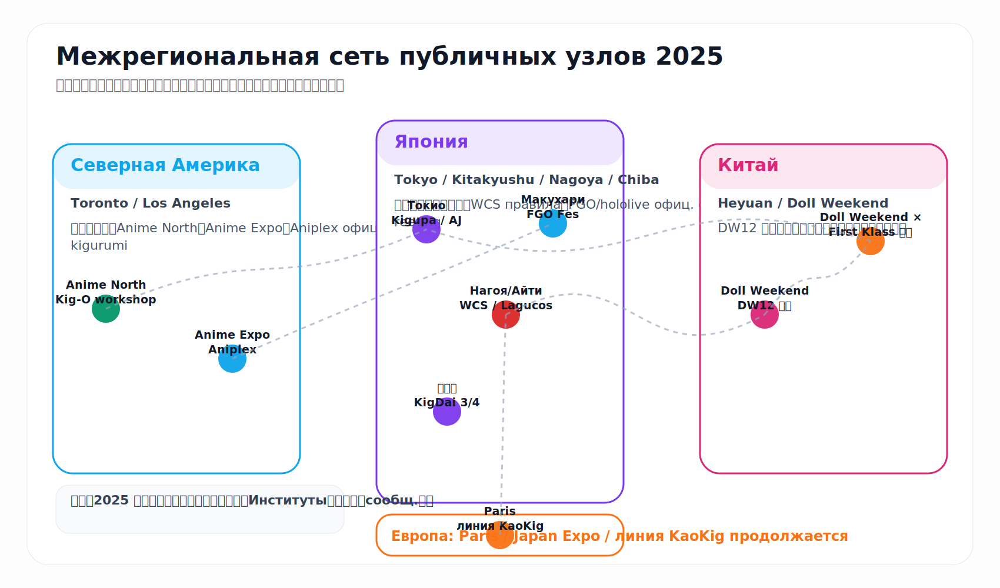
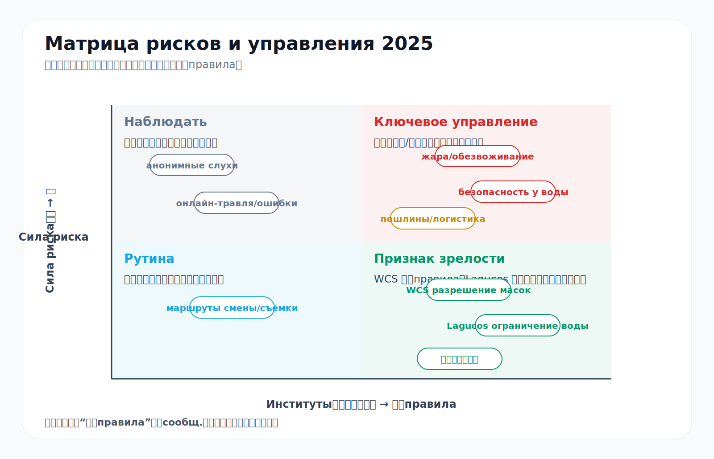
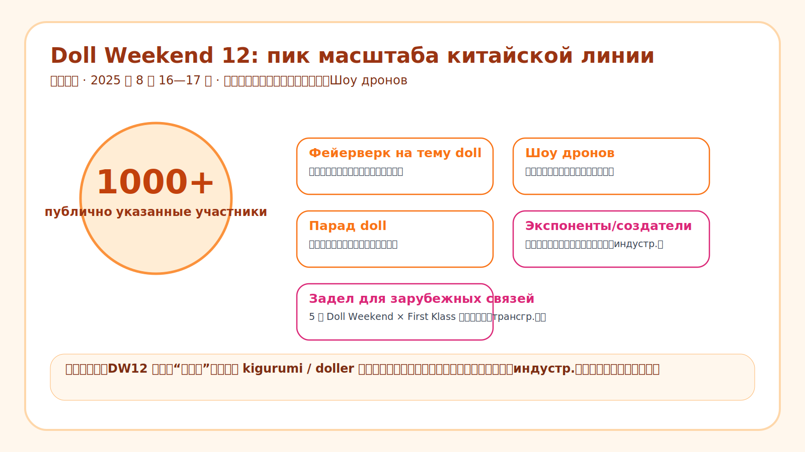

# Хроника Kigurumi 2025 года

> **Пояснение к версии**  
> Эта страница является русской локализацией годовой хроники kigurumi за 2025 год. Она сохраняет событийную линию, инфографику, сноски и границы публичности исходной страницы и подключает материал к многоязычной структуре архива.

---

## Содержание

- [0. Рамка чтения и границы источников](#0-阅读口径与资料边界)
- [1. Годовой обзор: почему 2025 год важен](#1-年度总览2025-年为什么重要)
- [2. Основная хроника](#2-编年史正文)
- [3. Указатель ключевых людей, организаций и площадок](#3-主要人物组织与场域索引)
- [4. Свод позитивных, негативных, исследовательских и слуховых событий](#4-正面事件负面事件考究事件与传闻事件总账)
- [5. Итоги года](#5-年度结论)
- [6. Источники](#6-参考资料)

---

## 0. Рамка чтения и границы источников {#0-阅读口径与资料边界}

В публичных материалах 2025 года слово **kigurumi** не означает только одну практику. Эта страница ставит в центр **animegao kigurumi / bishoujo kigurumi / Kig / Kiger / bianwa**, но отдельно описывает официальные IP-маскоты, doller-сцену, furry, gawa-cos, полные маски и англоязычный e-commerce-контекст onesie.

| Слой | Основное содержание | Проявление в 2025 году |
|---|---|---|
| Animegao / Kig / Kiger | аниме-лицо, skin suit, костюм персонажа, фотография и перформанс | Tokyo “Kigurumi Party!”, мастерская Anime North, публичные записи участников |
| Doller / wa / bianwa | китайский акцент на «кукольности», телесном погружении и больших встречах | Doll Weekend 12, Doll Weekend × First Klass Japan |
| Official Mascot / IP Greeting | официальные костюмы персонажей, которыми управляют бренды | FGO, hololive и Aniplex на AnimeJapan, FGO Fes, Anime Expo |
| Furry / Gawa-cos / full-head mask | фурсьюты, tokusatsu-костюмы, шлемы и полные маски | правила WCS и формат Kitakyushu “Kigurumi Daikoushin!” |
| Onesie-контекст | animal onesie и домашняя одежда в англоязычной торговле | не является основной линией страницы, но важен как граница термина |

Источники различаются по надежности: официальные страницы и правила подтверждают даты, места и ограничения; медиа и пресс-релизы помогают понять масштаб; статьи участников фиксируют опыт и лексику; анонимные форумы учитываются только как поле слухов и давление на управление сообществом, без повторения неподтвержденных обвинений и без называния людей.

---

## 1. Годовой обзор: почему 2025 год важен {#1-年度总览2025-年为什么重要}

В 2025 году одновременно видны пять линий.

1. **Масштабирование**: Doll Weekend 12 в Китае публично зафиксировал 1000+ участников, фейерверк на тему doll, шоу дронов и парад. [^dw-cn]
2. **Институционализация**: Tokyo “Kigurumi Party!”, Kitakyushu “Kigurumi Daikoushin!”, правила WCS и ограничения Lagucos показывают, что kigurumi входит в явные правила мероприятий. [^kigupa][^wcs-rule]
3. **Технологизация**: Kigurumi Online на Anime North 2025 превратил историю animegao, изготовление маски, форму глаз, парики и посадку в обучаемый процесс для новичков. [^kig-o]
4. **Трансграничность**: Doll Weekend × First Klass Japan, Anime North, Anime Expo, WCS, DW12 и европейская линия KaoKig образуют многоузловую сеть. [^dw-cn][^aniplex-ax][^japanexpo]
5. **Спорность**: анонимные форумы, онлайн-травля, согласие на съемку, перегрев, безопасность у воды, пошлины и логистика стали заметнее. [^wcs-party][^lagucos][^blackcat]

Кратко: kigurumi в 2025 году продвинулось от «нишевого визуального чуда» к сложной культуре событий, цепочек производства, трансграничных связей и правил управления.

---

## 2. Основная хроника {#2-编年史正文}

| Время | Событие | Регион / тип | Значение для хроники |
|---|---|---|---|
| около января | уточнение терминов и идентичности сообщества | межъязыковое исследование | разделение kigurumi, animegao, doller, mascot, furry и onesie |
| 24 февраля | 3rd Kigurumi Party! | Токио / специализированное событие | kigurumi с маской трактуется как формат, требующий места, маршрутов, переодевания и правил съемки |
| начало марта | hololive SUPER EXPO 2025 Kigurumi Greeting | официальный IP | виртуальные персонажи VTuber получают физическое присутствие |
| 22-23 марта | AnimeJapan 2025 FGO greeting | официальный IP / выставка | крупная коммерческая выставка включает kigurumi в работу стенда |
| около 23 мая | Anime North 2025 / Kigurumi Online workshop | Северная Америка / обучение | знания о масках и посадке становятся учебным процессом |
| май | Doll Weekend × First Klass Japan | Китай-Япония / трансграничность | китайская wa/Kig-система выходит в зарубежное поле съемок |
| 1 июня | Kigurumi Daikoushin! 3 | Китакюсю / локальная встреча | региональное сообщество полного костюма получает устойчивую площадку |
| около 17 июня | уведомление BlackCatKig / Inthemask для США | производство / логистика | пошлины, склад пересылки и сроки доставки становятся инфраструктурной проблемой |
| июль | Anime Expo 2025 Aniplex kigurumi | США / официальный IP | официальные kigurumi используются для общения с фанатами на крупной выставке |
| июль | Japan Expo 2025 / линия KaoKig | Европа / публичная демонстрация | подтверждает продолжение европейской animegao-линии |
| 1-3 августа | World Cosplay Summit 2025 | Нагоя / правила cosplay | kigurumi, doller, gawa-cos и полные маски входят в управляемую категорию |
| 1-3 августа | правила Lagucos / WCS | безопасность | вода, жара, обезвоживание, обзор и согласие на съемку становятся частью правил |
| 2-3 августа | FGO Fes. 2025 10th Anniversary | Макухари / официальный IP | 9 kigurumi и 14 официальных cosplayer создают иммерсивное празднование |
| 16-17 августа | Doll Weekend 12, Хэюань, Гуандун | Китай / событие 1000+ | китайская линия kigurumi / doller входит в праздник, индустрию и городское сотрудничество |
| сентябрь-октябрь | китайско-японские тексты участников | публичное письмо / термины | опыт bianwa и внешние искажения объясняются участниками |
| 3 ноября | Kigurumi Daikoushin! 4 | Китакюсю / продолжение | локальная серия показывает ритм повторных событий |
| конец ноября | анонимные треды “problem person watching” | слухи / давление управления | слухи и называние людей становятся видимой управленческой проблемой |
| декабрь | итог года | обзор | 2025 год можно описать как год одновременного расширения и правил |

### Термины и специализированные события

Главным в начале года была не одна крупная встреча, а необходимость отделить разные значения kigurumi. Tokyo “Kigurumi Party!” 24 февраля показала, что масочный формат нуждается в собственных условиях: зонах съемки, переодевании, групповых фото, общении и runway. [^animegao][^kigupa][^note-term]

### Официальные IP и обучение

hololive SUPER EXPO 2025 и FGO на AnimeJapan 2025 показывают, что официальные IP используют kigurumi как инструмент физического общения с фанатами. В мае Kigurumi Online на Anime North превратил знания о масках, makers, глазах, париках, внутренней посадке и ношении в образовательную форму для новичков. [^hololive][^fgo-aj][^animenorth][^kig-o]

### Трансграничность, локальность и логистика

Doll Weekend × First Klass Japan связывает китайскую wa/Kig-сцену с японским полем съемок. Kitakyushu “Kigurumi Daikoushin! 3” объединяет bishoujo kigurumi, doller, furry и gawa-cos как локальную платформу. Уведомление BlackCatKig / Inthemask для США показывает, что пошлины, пересылочный склад, таможня и воздушная доставка влияют на вход новичков и планы участия. [^dw-cn][^kigdai][^blackcat]

### Плотный август

WCS 2025 разрешает kigurumi, gawa-cos, doller, полные маски и шлемы в определенных зонах, но оставляет проверку лица и указания персонала. Правила Lagucos / WCS также фиксируют риски воды, жары, обезвоживания, съемки и движения. [^mofa-wcs][^wcs-rule][^wcs-party][^lagucos]

FGO Fes. 2025 использовал 9 kigurumi и 14 официальных cosplayer для встречи гостей. Doll Weekend 12 в Хэюане зафиксировал 1000+ участников, фейерверк, шоу дронов, парад, экспонентов и создателей, став главным узлом масштабирования китайской линии. [^fgo-fes][^dw-cn][^dw-pr]

### Письмо участников и управление слухами

Публикации сентября-октября объясняли японской аудитории китайские термины Kigurumi, Kig, Kiger и bianwa, а также фиксировали возможную онлайн-травлю и сексуализированное прочтение kigurumi / latex-контента. Kigurumi Daikoushin! 4 подтвердил устойчивость локальной серии, а анонимные треды о «проблемных людях» нужно трактовать как поле слухов и давление на управление, а не как список фактов. [^note-term][^note-harass][^kigdai4][^kyodemo][^wikifur]

---

## 3. Указатель ключевых людей, организаций и площадок {#3-主要人物组织与场域索引}

| Организация / площадка | Роль в 2025 году | Значение |
|---|---|---|
| Cosplay 博 / Kigurumi Party! | специализированная линия Токио | съемка, переодевание, групповые показы и runway как признак институционализации |
| Kyushu Keshoukai, i-key, Cospic, Raimu / Kigurumi Daikoushin! | локальная японская линия | два события за год формируют платформу полного cosplay в Кюсю |
| Kigurumi Online | североамериканское обучение | мастерская превращает изготовление и посадку маски в входной процесс |
| Doll Weekend / First Klass | китайская линия масштаба и трансграничности | японский проект и DW12 показывают способность к международному и фестивальному формату |
| BlackCatKig / Inthemask | производство, продажи, логистика | пошлины, пересылка, таможня и сроки становятся частью опыта участников |
| World Cosplay Summit / Lagucos | правила mainstream cosplay | модель «разрешено + проверка безопасности + указания персонала» для закрытого лица |
| FGO, Aniplex, hololive | официальная IP-материализация | массовая аудитория встречает kigurumi greeting на крупных выставках |
| KaoKig / Japan Expo | европейская публичная линия | данные ограничены, но показывают продолжение animegao в Европе |

---

## 4. Свод позитивных, негативных, исследовательских и слуховых событий {#4-正面事件负面事件考究事件与传闻事件总账}

| Тип | Примеры | Значение в 2025 году |
|---|---|---|
| Позитивные события | рост специализированных мероприятий, признание WCS, мастерская Anime North, масштаб DW12, международные связи | kigurumi получает инфраструктуру событий, обучения, показа и обмена |
| Риски | жара и обезвоживание, вода, согласие на съемку, онлайн-травля, пошлины и логистика | зрелость проявляется в том, что риски записываются в правила |
| Исследовательские темы | различие animegao и official mascot, китайские термины wa/Kig, правила закрытого лица, путаница с onesie | помогает не смешивать соседние культуры |
| Слухи | анонимные форумы, репосты X, пост-событийная репутация | фиксируются как давление на управление, а не как подтвержденные обвинения |

---

## 5. Итоги года {#5-年度结论}

2025 год не был годом происхождения kigurumi и не был просто внезапной модой. Публичные узлы в Токио, Китакюсю, Нагое, Макухари, Торонто, Лос-Анджелесе, Хэюане и Париже вместе с мастерскими, официальными IP, логистическими объявлениями, правилами безопасности и анонимными форумами показывают переход от визуальной редкости небольшой сцены к сложной культуре событий, индустрии, правил, споров и трансграничных сетей.

---

## 6. Источники {#6-参考资料}

[^animegao]: Kigurumi Animegao France, “Kigurumi Animegao,” <https://kigurumi-animegao.fr/>
[^kigupa]: Cosplay 博 / C-NET, “第3回・きぐるみパーティ!,” <https://cnet.cosplay.ne.jp/kigupa001.html>
[^hololive]: hololive SUPER EXPO 2025, “Kigurumi Greeting,” <https://hololivesuperexpo2025.hololivepro.com/news/greeting>
[^fgo-aj]: Fate/Grand Order, “AnimeJapan 2025 出展情報,” <https://news.fate-go.jp/2025/aj2025/>
[^animenorth]: Anime North 2025 industry / exhibitor information, <https://www.animenorth.com/index.php/component/sppagebuilder/?id=819&view=page>
[^kig-o]: Kigurumi Online, “Kigurumi Workshop,” <https://kig-o.com/index.php/kigurumi-workshop/>
[^dw-cn]: Doll Weekend 官方页面, <https://dollweekend.cn/cn/>
[^kigdai]: Cospic, “着ぐるみ大行進” series category, <https://cospic.org/archives/category/event/kigdai>
[^blackcat]: BlackCatKig, “A Notice to US Customers,” <https://blackcatkig.com/pages/a-notice-to-us-customers?srsltid=AfmBOoruxavN6nFtN86FypnnRhYe5XVpHZKtpus8bQOPJBhYh9TlILNd>
[^aniplex-ax]: Aniplex of America, Anime Expo 2025 Press Release PDF, <https://aniplexusa.com/pdf/AOAAX25PRESSRELEASE.pdf>
[^japanexpo]: Japan Expo Paris, “Memories: Cosplay in Japan Expo 2025,” <https://www.japan-expo-paris.com/en/actualites/memories-cosplay-in-japan-expo-2025_114625.htm>
[^mofa-wcs]: Ministry of Foreign Affairs of Japan, World Cosplay Summit 2025 record, <https://www.mofa.go.jp/p_pd/ca_opr/pagewe_000001_00233.html>
[^wcs-rule]: World Cosplay Summit 2025, Cosplay Rule, <https://worldcosplaysummit.jp/2025/cosplay/rule/>
[^wcs-party]: World Cosplay Summit Party, Rule PDF, <https://worldcosplaysummit.jp/wcsparty/wp-content/uploads/2025/03/rule-jp.pdf>
[^lagucos]: Lagucos 2025 petite, Rule PDF, <https://worldcosplaysummit.jp/lagucos/petit/wp-content/themes/petit2025/common/images/rule_en.pdf>
[^fgo-fes]: LevelUp Logy, FGO Fes. 2025 coverage, <https://leveluplogy.jp/archives/23212>
[^dw-pr]: PR Times, Doll Weekend 12 release, <https://prtimes.jp/main/html/rd/p/000000004.000167011.html>
[^note-term]: note.com, “中文圈 Kigurumi / Kig / Kiger / 变娃”相关公开文章, <https://note.com/eichan_sh/n/n6738a8ae576b>
[^note-harass]: note.com, 参与者关于公开发布 kigurumi / latex 内容后遭遇骚扰的记录, <https://note.com/eichan_sh/n/n931989e28ca5>
[^kigdai4]: Cospic, “着ぐるみ大行進！4,” <https://cospic.org/archives/494>
[^kyodemo]: Kyodemo, “着ぐるみ関係の問題児観察スレ” thread index, <https://www.kyodemo.net/sdemo/r/twwatch/1764237229/>
[^wikifur]: WikiFur Japan, “着ぐるみを着る人々を語るスレ,” <https://ja.wikifur.com/wiki/%E7%9D%80%E3%81%90%E3%82%8B%E3%81%BF%E3%82%92%E7%9D%80%E3%82%8B%E4%BA%BA%E3%80%85%E3%82%92%E8%AA%9E%E3%82%8B%E3%82%B9%E3%83%AC>
