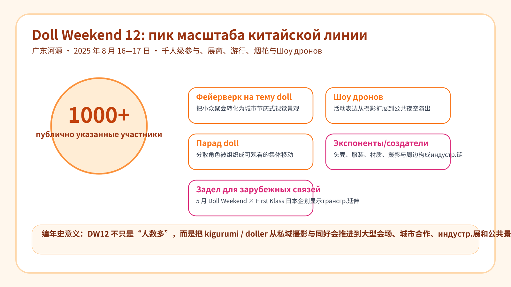

# Хроника Kigurumi 2025 года

> В томе собраны события, работы и публикации этого года. Анонсы отделены от подтверждённых записей о проведении.

## Основная хроника {#2-编年史正文}

| Время | Событие | Регион / тип | Значение для хроники |
|---|---|---|---|
| 24 февраля | 3rd Kigurumi Party![^kigupa] | Токио / специализированное событие | kigurumi с маской трактуется как формат, требующий места, маршрутов, переодевания и правил съемки |
| начало марта | hololive SUPER EXPO 2025 Kigurumi Greeting | официальный IP | виртуальные персонажи VTuber получают физическое присутствие |
| 22-23 марта | AnimeJapan 2025 FGO greeting | официальный IP / выставка | крупная коммерческая выставка включает kigurumi в работу стенда |
| 23 мая, 19:00 (анонс) | Anime North 2025 / Kigurumi Online workshop | Северная Америка / обучение | знания о масках и посадке становятся учебным процессом |
| май | Doll Weekend × First Klass Japan | Китай-Япония / трансграничность | китайская wa/Kig-система выходит в зарубежное поле съемок |
| 1 июня | Kigurumi Daikoushin! 3[^kigdai] | Китакюсю / локальная встреча | региональное сообщество полного костюма получает устойчивую площадку |
| июль | Anime Expo 2025 Aniplex kigurumi | США / официальный IP | официальные kigurumi используются для общения с фанатами на крупной выставке |
| 1-3 августа | World Cosplay Summit 2025[^wcs-rule] | Нагоя / правила cosplay | kigurumi, doller, gawa-cos и полные маски входят в управляемую категорию |
| 2-3 августа | FGO Fes. 2025 10th Anniversary | Макухари / официальный IP | 9 kigurumi и 14 официальных cosplayer создают иммерсивное празднование |
| 16-17 августа | Doll Weekend 12, Хэюань, Гуандун | Китай / событие 1000+ | китайская линия kigurumi / doller входит в праздник, индустрию и городское сотрудничество |
| 3 ноября | Kigurumi Daikoushin! 4[^kigdai4] | Китакюсю / продолжение | локальная серия показывает ритм повторных событий |

### Официальные IP и обучение

hololive SUPER EXPO 2025 и FGO на AnimeJapan 2025 показывают, что официальные IP используют kigurumi как инструмент физического общения с фанатами. Kigurumi Online анонсировал мастерскую на Anime North на 23 мая, 19:00: выбор глаз, бровей, ресниц, парика и подкладки, сборка и подгонка маски. Наблюдение было объявлено бесплатным. [^hololive][^fgo-aj][^animenorth][^kig-o]

### Плотный август

FGO Fes. 2025 использовал 9 kigurumi и 14 официальных cosplayer для встречи гостей. Doll Weekend 12 в Хэюане зафиксировал 1000+ участников, фейерверк, шоу дронов, парад, экспонентов и создателей, став главным узлом масштабирования китайской линии. [^fgo-fes][^dw-cn][^dw-pr]

## Источники {#6-参考资料}

[^hololive]: hololive SUPER EXPO 2025, “Kigurumi Greeting,” <https://hololivesuperexpo2025.hololivepro.com/news/greeting>
[^fgo-aj]: Fate/Grand Order, “AnimeJapan 2025 出展情報,” <https://news.fate-go.jp/2025/aj2025/>
[^animenorth]: Anime North 2025 industry / exhibitor information, <https://www.animenorth.com/index.php/component/sppagebuilder/?id=819&view=page>
[^kig-o]: Kigurumi Online, “Kigurumi Workshop,” <https://kig-o.com/index.php/kigurumi-workshop/>
[^dw-cn]: Doll Weekend 官方页面, <https://dollweekend.cn/cn/>
[^fgo-fes]: LevelUp Logy, FGO Fes. 2025 coverage, <https://leveluplogy.jp/archives/23212>
[^dw-pr]: PR Times, Doll Weekend 12 release, <https://prtimes.jp/main/html/rd/p/000000004.000167011.html>
[^kigupa]: Cosplay 博 / C-NET, “第3回・きぐるみパーティ!,” <https://cnet.cosplay.ne.jp/kigupa001.html>
[^kigdai]: Cospic, “着ぐるみ大行進” series category, <https://cospic.org/archives/category/event/kigdai>
[^kigdai4]: Cospic, “着ぐるみ大行進！4,” <https://cospic.org/archives/494>
[^wcs-rule]: World Cosplay Summit 2025, Cosplay Rule, <https://worldcosplaysummit.jp/2025/cosplay/rule/>
