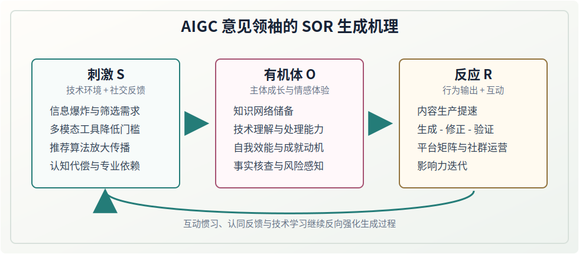
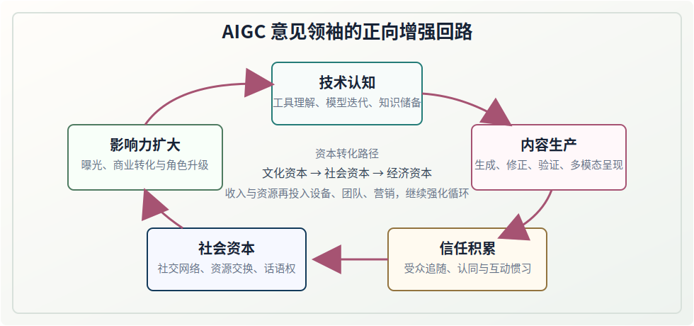

# 《AIGC 时代意见领袖生成机理与趋势挑战》

!!! note "资料性质"
    本页依据 PDF《AIGC 时代意见领袖生成机理与趋势挑战》整理论文正文、署名、摘要、关键词、基金项目与参考文献，并按原论文结构排列。页面中的 SVG 图示为本站辅助阅读图，并非原论文配图。

| 项目 | 内容 |
| --- | --- |
| 原文标题 | AIGC 时代意见领袖生成机理与趋势挑战 |
| 作者 | 蔡圣涵、魏德毓 |
| 作者单位 | 福州大学 人文社会科学学院，福建 福州 350000 |
| 刊载信息 | 《宁德师范学院学报（哲学社会科学版）》2026 年第 1 期，总第 156 期 |
| 文章编号 | 2095-3682（2026）01-0071-05 |
| 中图分类号 | G206 |
| 文献标识码 | A |
| 收稿日期 | 2025-10-10 |
| 基金项目 | 福建省教育厅社会科学研究项目（GY-J-21185） |
| 责任编辑 | 何海菊 |
| 本页处理 | 按原论文结构整理正文，并补充辅助阅读图示 |

## 论文署名

**AIGC 时代意见领袖生成机理与趋势挑战**

蔡圣涵　魏德毓

（福州大学 人文社会科学学院，福建 福州 350000）

## 摘要

摘　要：在人工智能蓬勃发展的今天，新技术的影响贯穿于人们学习、生活、工作的各方面。以生成式人工智能为代表的 AI 技术在影音制作、图片生成、文本编辑等方面展现出高度的便捷性、适用性、创新性，而且对意见领袖的内容生产与传播方式也产生了前所未有的深刻影响。在网络传播与后真相的时代，意见领袖不仅是信息的传递者和意见的解读者，还担当着舆论观点引导者、多元文化开拓者、创新技术推广者、网络社区管理者等多重角色。文章以互动、认同、迭代、提速作为关键词，深入探讨了 SOR 理论视角下 AIGC 时代意见领袖的生成机理，揭示其新角色、新特征，探讨其在新技术背景下的演化形成、转型变革、发展趋势及挑战应对策略，为 AIGC 时代专业型意见领袖的生成和培育提供科学指导。

关键词：SOR 理论；意见领袖；生成机理；趋势挑战

中图分类号：G206　　文献标识码：A　　文章编号：2095-3682（2026）01-0071-05

## 正文

AIGC（Artificial Intelligence Generated Content）中文翻译为“人工智能生成式内容”，又称作“生成式人工智能”。“意见领袖”最早由美国社会学家拉扎斯菲尔德与他的同事在研究美国总统选举时提出，其研究认为意见领袖能够接收并解构环境带来的信息，给受众带来信任与情感满足，吸引受众与自身进行互动，不断激发互动的热情，并引导受众做出一定反应。进入 AIGC 时代，AIGC 时代意见领袖指的是能够借助 AIGC 技术，以互联网社交媒体平台为阵地，人机结合，模式化、流水化地进行内容创作和信息传播，并建构追随者群体、影响受众决策和行为的人，进而对社会的舆论和受众价值观产生不可忽视的影响。简而言之，AIGC 时代意见领袖的演化模式更为复杂，角色更加多元，影响力也更为广泛[1]。为此，准确把握 AIGC 时代意见领袖的生成机理，揭示其在新技术背景下的转型特征、全新角色及未来发展趋势具有重要现实意义。

## 一、互动：意见领袖的诞生与 SOR 理论的契合

### （一）SOR 理论及其内涵

SOR 理论，即刺激—有机体—反应（Stimulus-Organism-Response）理论，是一种心理学和行为科学的理论，常用于解释个体如何对外界刺激做出反应。随着学科间的交叉与融合，SOR 理论广泛应用于心理学以外的多个学科，并在多元情境中逐步被细化和完善。当前，SOR 理论的研究与应用在学界中主要体现为立足于市场营销、基层治理、人力资源管理、媒体传播等特定背景或主题，聚焦特定群体，关注该背景或主题下围绕这一群体的个体、社会现象和问题，分析得出影响因素与指标，给出启示、解决方案或对策[2]。SOR 理论作为分析人类行为的元理论范式，将一般行为产生过程分解为外部刺激（Stimulus）→个体内在状态（Organism）→行为反应（Response），主要阐释刺激如何通过有机体的感知和认知过程被转化为内部的心理表征，这些心理表征如何进一步激发个体的情感反应，并最终导致个体的行为反应。

### （二）AIGC 时代意见领袖的特征

AIGC 时代背景下，意见领袖作为舆论生态中的关键节点，在内容创作上，由传统的“人工经验”模式转向“技术数据”驱动模式，更精准地满足受众的独特需求和偏好，更有效地提高意见领袖内容生产效率，更广泛地提供创作选择和创意文案。在内容传播上，由过往的“常规媒体”模式转向“多样态跨平台”模式，多样态的表达方式使得内容呈现更加引人注目，大数据算法能够将意见领袖发布的最新内容及时推送给最可能对此感兴趣的受众群体并延长其阅览停留时间，提高内容的触达率、作品的观完率、受众的参与度。在互动方式上，由既往的“单对多”单向传授模式转向“多对多”的多向定制模式，互动方式更加多样化、个性化，这种实时的、深入的互动使得意见领袖能够更好地了解受众需求和社群关系变化，及时调整自己的传播策略和互动方式，保持自身影响力和竞争力。

### （三）意见领袖生成机理与 SOR 理论的契合

受众与意见领袖关联的核心在于互动行为。通过互动，意见领袖对受众的激发与吸引不仅局限于提供优质内容和可参考的建议，更在于提供积极互动的方式、方法、途径，促成互动惯习的形成。高度的互动性是意见领袖积累信任感和影响力的关键条件，也是推动受众形成互动惯习的重要依托。在我国，贴吧、微博、豆瓣等社区话题平台，以及抖音、B 站、快手等短视频平台，因用户特征、内容形式和互动机制的不同，意见领袖的传播策略也会有所不同，但在互动场景中，意见领袖的高度社交活跃度、持续分享的行为特征以及专业知识储备，共同构成了吸引受众并维系长期互动的情感动因、行为动因和内容动因。这些动因在强化互动的过程中也转化为互动惯习。意见领袖的生成、发展、成熟、升华与互动行为是息息相关的，准确地说与互动惯习有着显著的关联，互动行为越频繁、技术知识学习与积累得就越多、信息解构与还原的就越精准，交互的方式与内容创新性、可信赖度就越强，维系互动的动因也因此越深入人心，其转化的互动惯习就越深度内化。由此可见，在意见领袖与受众共同的互动行为中，互动惯习的影响与 SOR 理论中描述个体受作用的逻辑高度契合。因此 SOR 理论为意见领袖生成机理提供了研究的理论框架，尤其在解释个体行为触发机制上具有学理上的优势以及起着举足轻重的作用[3]。

## 二、认同：AIGC 意见领袖的 SOR 生成机理

基于 SOR 理论框架，AIGC 时代意见领袖生成机理可从刺激、有机体、反应三个维度出发，细分为技术+环境反馈（S）、主体成长（O）、行为输出+互动（R）三个层面，并在相当大的程度上影响其他个体和群体，获得他人的认同与认可。

**本站辅助图示 1：AIGC 意见领袖的 SOR 生成机理（非原论文配图）**

### （一）刺激（Stimulus）层面

表现在技术环境驱动与社交环境反馈的需求变革迭加。一是 AIGC 日均生成内容量高达数十亿条，受众面临信息选择困境，这种信息爆炸和信息过载的筛选需求，构成核心外部刺激源。二是多模态的人工智能 AI 生成工具，极大降低了创作的门槛，加之技术赋能于传播场域，如智能推荐算法精准、快速地传播分发路径，使得部分社交平台的浏览量和访问量剧增，形成巨大的规模刺激效应。三是受到认知代偿的受众心理影响，普通用户对 AIGC 技术存在一定的认知盲区，产生了对专业解读者的依赖需求，对具有技术复杂度的意见领袖也呈现出更高的认同和偏好，形成提升影响力的目标刺激。四是部分接触和了解过 AIGC 技术，理解 AIGC 技术工作原理的普通用户，其社交机制与互动模式内化了 AIGC 技术的影响，对其身边环境带来 AIGC 技术的影响和刺激。五是有了 AIGC 技术加持，社交媒体互动情况呈现出高数据、高强度、高呼应，这使得普通用户越来越依靠 AIGC 技术参与互动、保持互动、融入互动，形成深度互动的常态化认同[4]。

### （二）有机体（Organism）层面

表现在 AIGC 意见领袖自身个体认知的提升以及持续获得的情感体验。一是在专业认知系统构建上，AIGC 意见领袖在知识图谱维度建立了较为丰富的知识网络储备，能够熟悉并掌握 AIGC 技术相关原理，技术理解深度和信息处理能力远超其他普通用户。据克劳锐（TopKlout）发布的《2024 年中国 AIGC 应用场景及商业潜力研究报告》显示，头部意见领袖 AIGC 工具使用率达 92%，日均处理信息量达普通用户 7.2 倍。二是 AIGC 意见领袖的情感驱动，主要源于通过掌握技术所获得自我效能感和成就动机。根据马斯洛需求层次理论中的尊重与自我实现需求，绝大多数的头部意见领袖表现出较为强烈的利他倾向和知识共享意愿，以实现获得社会认同的高阶需求。三是熟练掌握 AIGC 的意见领袖，都将逐步建立起多层内容验证校核机制，包括事实核查、逻辑推演、技术验证等，其风险感知能力更强，生成发布的内容在准确性等方面表现得更为严谨、可靠，进而获得用户和受众的认可[5]。

### （三）反应（Response）层面

表现在 AIGC 意见领袖影响力生成的相关行为模式上。一是在内容生产方面，主要通过整合内容生成、视觉化呈现、多模态编辑等智能工具链，不断压缩内容生产周期，提高响应速度。同时，在内容质量上体现 AIGC 的“生成—修正—验证”三级过滤机制和系统性优势。二是形成具有 AIGC 特征的社交传播策略。比如，平台矩阵运营，通常采用主平台加多个辅助平台进行传播的组合策略；交互性设计，采用“知识胶囊”制作模式，即短时间的核心知识点“吸睛闪现”加上深度解析的内容梯度解读节目等；社群化运营，即构建“1% 核心参与者、9% 活跃用户、90% 普通受众”的金字塔型粉丝社群结构。三是影响力迭代机制，包括技术敏感度、反馈分析系统和个人 IP 进化等。据宗辉品牌 IP 实操专栏 2025 年 4 月披露，AIGC 意见领袖的可信度评分达 4.7/5（满分 5 分），具体表现为平均每 45 天跟进 Stable Diffusion 模型的迭代更新，平均每 6 个月进行个人 IP 知识体系更新，以及运用 Socialbakers 等工具进行传播效果的归因分析，以维持自身在专业度上获得认可[6]。

## 三、迭代：AIGC 意见领袖的 SOR 增强回路

**本站辅助图示 2：AIGC 意见领袖的正向增强回路（非原论文配图）**

### （一）能力复合体系和多重角色转化

SOR 生成机理揭示了在 AIGC 技术迭代加速环境下，AIGC 意见领袖通过技术刺激（S）→认知系统构建（O）→专业化内容生产（R）的持续学习、成长机制，逐步构建“技术认知—内容生产—信任积累”的复合能力体系。AIGC 意见领袖大多是 AIGC 技术早期关注者和行业创作的突破者，他们不断关注新诞生的技术和可被运用的范围，能够利用先进的算法和数据分析工具，更准确地把握受众的需求和兴趣点，更高效地筛选、整合和传播有价值、高质量的信息，不断探索新的内容形式和传播方式，与受众建立更为紧密的联系，为核心追随者和一般受众提供相匹配的内容服务，更好地满足受众的个性化需求，进而完成从信息转发者到价值整合者、意见精准传导者、技术创新者等多重角色的转化[7]。

### （二）资本转化与社会影响力

根据皮埃尔·布迪厄的文化资本理论，处于社会关系网中的个体，在活动中获得和交换的支持与资源可被抽象为“文化资本”“社会资本”“经济资本”三种类型。文化资本（Cultural Capital）是个人所拥有的文化素养、知识储备、专业技能、审美能力及相关教育积淀；社会资本（Social Capital）是通过社会网络积累的人际关系、信任资源及相关社会资源等；经济资本（Economic Capital）则是实际的资金流水，包括工作收入、利用自己的技能优势与空闲时间额外获取的收入。布迪厄的文化资本理论分析了不同资本相互转化的可能性，这意味着意见领袖可以借助自身优势，通过持续影响受众、拉近距离、深化互动，逐步与受众建立更紧密的联系，并实现角色升级与资本转化，进而持续提升自身影响力。

### （三）基于 AIGC 意见领袖生成机理的正向增强回路

SOR 生成机理促使 AIGC 意见领袖形成提高受众追随程度（S′）→强化社会资本（O′）→扩大影响力（R′）的资本转化与提高社会影响力路径。意见领袖与“粉丝”的互动不仅是情感连接的过程，更是社会资本的积累过程。意见领袖对于 AIGC 技术使用的熟练度与创意度，直接反映在作品的创作内容、技术含量与创意水平之中，很大程度上影响着意见领袖的内容创作力和舆论影响力。AIGC 技术含量较高的作品，在吸引用户、拉近距离、营销逐利等为核心导向的社交媒体平台运营下，能够让 AIGC 意见领袖获得更多曝光机会与流量扶持，积累更多的关注度和影响力，也被赋予了更高的话语权和影响力，进而成为社会资本范畴内的“无形资产”拥有者。社会资本越强大，意味着意见领袖能够通过广泛的社交网络与更多人互动，其社会影响力就越广泛，受众的追随度、信任度越高，权威形象也越鲜明，内容影响力也越深远。一方面，意见领袖依托较高的文化素养、AIGC 专业技能和审美能力，创作出高质量、有深度的内容，进而吸引“粉丝”、积累信任并建立长期的社会影响力。同时，通过广告、赞助、直播打赏、会员付费等方式获得收入，将资源持续投入设备升级、团队搭建、营销推广等领域，以提升社会资本，进而不断强化资本转化与影响力提升的正向机制，进一步扩大社会影响力。另一方面，根据美国心理学家斯坦利·米尔格拉姆的六度分隔理论，拥有一定社会资本的 AIGC 意见领袖，其粉丝群体社交圈规模庞大、形式多元，AIGC 意见领袖可以通过“小世界网络”与更多的人和事发生联系、相互交换与积累，形成社会资本的波纹效应，体现出社会资本提升带来 AIGC 意见领袖影响力的扩大，并持续强化自身的社会资本形成正向增强回路[8]。以上论断在陈昊[9]的研究中部分得到证实。其研究以具备明显 AIGC 意见领袖特征的“头部虚拟主播”为对象，论述了名为“hanser”的 B 站头部虚拟主播与粉丝以及 B 站短视频平台在情感劳动层面上的作用与关系，其在研究结论中提到了虚拟主播的价值增值、粉丝群体的情感满足和身份认同、资本与技术的剥削加控制等，侧面印证了本文提出的 SOR 生成机理促使 AIGC 意见领袖形成正向的成长增强回路[9]。

## 四、提速：AIGC 时代意见领袖的转型趋势与难题挑战

AIGC 时代背景下，意见领袖面临着市场需求和技术变革的双重挑战，也迎来了前所未有的发展机遇，其利用先进的 AIGC 技术进行个人品牌的数字化与智能化转型，同时探索团队化、专业化、跨领域的发展路径，影响力变现成为 AIGC 时代意见领袖的未来发展趋势。同时，在信息爆炸的时代，AIGC 意见领袖也面临着自身能力和水平与 AIGC 时代不相适应或者过度迎合带来的内生性危机，也有 AIGC 本身的技术和生产缺陷给意见领袖内容创作带来的外源性问题。

### （一）AIGC 时代意见领袖未来发展趋势

一是个人品牌的数字化与智能化转型加速。依托技术革新打造个人品牌网站、社交媒体账号等数字化载体，充分展示专业知识和影响力，是意见领袖在 AIGC 时代重新定位和自我提升的关键步骤，也是提升品牌价值，增强市场竞争力，适应时代变化的必然选择。二是从个体创作到专业化团队生产的加速转变。随着 AIGC 技术的进步和受众需求的多元化，意见领袖通过组建专业化团队或成立工作室，通过强化分工合作，实现内容创作、全媒体传播与商业化运营的全面升级。一方面能够发挥专业优势，打造高质量的传播内容，快速提升知名度和影响力；另一方面，凭借专业的市场洞察、数据分析与商业策略，实现品牌价值的最大化。三是跨行业多领域意见领袖的加速催生。AIGC 技术为跨界尝试和知识融合提供可能，使得意见领袖可以不断突破传统壁垒，实现在不同领域间的创作和吸粉，推动行业间的交流合作、探索新联动场景的开发创新。四是推动商业模式变革的加速。广告代言、品牌合作、商品开发、会员定制、订阅付费等变现渠道更加丰富多样，具有前瞻性的意见领袖势必尝试整合电商平台、线下实体店等上下游产业链资源，建设个性化的服务平台或社区，努力形成完整的产业链闭环来提高运营收入、服务水平和市场竞争力。同时，内容电商、社群经济、个性化定制等新兴业态将快速升级，围绕意见领袖的流量推广机构、内容创作教学平台、数据分析服务提供商等也应运而生[10]。

### （二）AIGC 时代意见领袖面临的挑战

AIGC 技术的开放性使得人人既是技术的受作用对象，也是 AIGC 技术的作用者。AIGC 时代意见领袖的生成变得更加开放，门槛更加亲民，专业性更加显著。一方面，将会沿着技术刺激（S）→认知系统构建（O）→专业化内容生产（R）的持续学习机制以及提高受众信任（S′）→强化社会资本（O′）→扩大影响力（R′）的正向增强回路，逐步生成、发展、升级，个体成长为意见领袖的路线可以被标准化和公式化。另一方面，面对提速的转型升级，AIGC 意见领袖将面临自身能力和水平与 AIGC 时代不相适应或者过度迎合带来的内生性危机，也面临着 AIGC 本身的技术和生产缺陷给意见领袖内容创作带来的外源性问题。一是技术快速迭代带来的存在危机，海量数据与信息在算法助力下被训练成“智慧大脑”，更多的专业知识被普及化、通用化，对意见领袖保持其信息传播的有效性和影响力构成了显著压力甚至生存危机。二是信息真实性与准确性的验证难题，AIGC 技术主要基于海量语料库训练，能够生成模拟人类语言结构和逻辑的自然语言文本，但是投喂的训练数据往往不做清洗，其中不乏错误、偏见、极化信息，这对意见领袖后期内容生产的准确性和可信性提出了挑战。三是侵犯隐私权和知识产权等法律问题，意见领袖的创作行为主要基于对现有数据资源的搜集、整理和深度学习，这种全网搜集信息并进行内容生产的模式，可能会对受众的隐私保护造成一定威胁。四是技术依赖与创新能力下降的隐忧，过度依赖 AIGC 技术可能导致意见领袖在内容创作上失去主动性和创新能力，由于 AIGC 的内容源和信息数据库相似，可能会出现不同意见领袖依托 AIGC 生成同一内容的窘况。

### （三）应对 AIGC 时代意见领袖的嬗变和挑战

一要注重意见领袖综合能力建设，通过加强技术培训、专业研习、国际交流、合作研究等方式，相关管理部门定期组织与意见领袖就国内外热点议题深入探讨，积极引导 AIGC 与主流平台对接，帮助意见领袖更好地发挥作用，提升主流意识形态传播效果。二要立足技术逻辑与社会逻辑构建智能化的内容生产与传播治理格局，利用技术手段辅助人工审核，强化跨部门、跨领域协同作战能力，推动技术创新与规范发展，完善内容审核与监管机制，防范意见领袖发布内容的传播风险，为清朗正气的舆论生态提供有力保障。三要明确意见领袖个人品牌定位，找到适合自己的内容创作方向和传播策略，倡导实行差异化品牌创新策略，支持跨领域的内容创作和不同领域的知识观点融合，互相学习借鉴，形成互补优势，构建多元内容的健康网络舆论生态。四要通过制定相应规范和标准，开展自律教育活动，建立专业素养、影响力、创新能力等意见领袖评价体系等方式，强化意见领袖的自律意识和社会责任意识，引导其遵守法律和伦理规范，激励意见领袖不断提升自身能力，更好地服务于信息传播和舆论引导工作[11]。

## 作者简介、收稿日期与基金项目

作者简介：蔡圣涵，福州大学人文社会科学学院硕士研究生。

收稿日期：2025-10-10。

基金项目：福建省教育厅社会科学研究项目（GY-J-21185）。

## 参考文献

[1] 谢耘耕，刘锐. AIGC 时代意见领袖的角色演进、发展趋势与挑战应对[J]. 编辑之友，2024（12）：73-80.

[2] 吴昕阳，张新成，赵媛. 旅游研究中 SOR 理论的溯源、应用及展望[J]. 旅游论坛，2024，17（6）：85-95.

[3] 傅守祥，沈润雨. 论生成式 AI 的哲学机理与 AI 意见领袖的伦理陷阱[J]. 社会科学战线，2025（3）：64-71.

[4] 刘磊，邓稳根，李诗雨. 基于 SOR 模型的国际博主短视频对用户互动意愿的影响研究[J]. 现代视听，2023（11）：46-50.

[5] 戴煜. 网络传播时代意见领袖的演变与社会影响力评估[J]. 新闻传播，2025（8）：78-80.

[6] 雷开春，包蕾萍，陈超. 关键意见领袖如何影响 Z 世代：资本转化的分析视角：以 B 站头部 UP 主为例[J]. 青年学报，2025（2）：63-78.

[7] 田楠，徐生菊. 虚拟品牌社区意见领袖对成员知识共享行为的影响研究[J]. 商场现代化，2025（3）：22-24.

[8] 蔡霞，宋哲，耿修林. 社会网络结构和采纳者创新性对创新扩散的影响：以小世界网络为例[J]. 软科学，2019，33（12）：60-65.

[9] 陈昊. “Hanser”与“毛怪”：虚拟主播与粉丝的情感劳动研究[D]. 杭州：浙江传媒学院，2025.

[10] 徐淑媚，王思博，县娅红. 基于 SOR 理论的盲盒消费意愿研究：基于感知价值的中介效应[J]. 现代商业，2024（22）：11-14.

[11] 刘丽. 社交网络意见领袖圈层“内卷化”现象研究[J]. 中国报业，2023（24）：90-91.

[责任编辑　何海菊]
