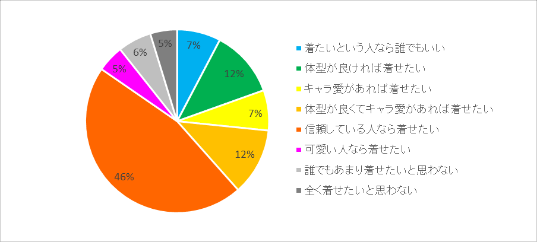

# 《着ぐるみ国势调查结果报告书》

!!! warning "资料性质"
    本页整理日文 PDF《着ぐるみ国勢調査結果報告書》的正文、表格、图表说明与原报告图像，按原报告章节顺序排列。原报告包含成人向、性经验、性取向、亲密行为与个人生活相关问卷项目；本站将其作为社群史资料保存，不代表本站立场，也不构成行为建议。图表图像本体未在此重绘，页面保留原报告正文中对图表的说明与可抽取表格数据。

| 项目 | 内容 |
| --- | --- |
| 原文标题 | 着ぐるみ国勢調査結果報告書 |
| 作者 | くっしー（@kussy_tessy） |
| 调查时间 | 2017 年 10 月 4 日起约 1 周 |
| 回答数量 | 共 221 份回答；排除 1 名在开头同意项选择“不同意”的回答者后，有效回答 220 份 |
| 原文页数 | 73 页 |
| 本页处理 | 按原报告章节排列，并嵌入原报告图表 |

## 标题页

**着ぐるみ国势调查结果报告书**  
くっしー（@kussy_tessy）

关于 2017 年 10 月 4 日起约 1 周期间开展的“着ぐるみ国势调查”，现将其结果汇总并在此报告。回答共收集 221 份；其中，除去 1 名在最初询问是否同意的设问中选择“不同意”的回答者，最终得到 220 份有效回答。

## 0. 前言

本调查虽然名为“着ぐるみ国势调查”，但我想在这里强调，它只是一个以着ぐるみ为兴趣的个人，出于单纯的个人兴趣和关心而进行的调查。也就是说，我再次说明，本调查极大地缺乏所谓“神的视角”那样中立公正的视点。

在进行这项调查时，有人批评说，制作者的兴趣和嗜好表现得太明显；也有人指出，母集团本身有偏差；还有人说它像诱导性提问。完全正是如此。说到底，这项调查并不是面向地球上所有对着ぐるみ有某种兴趣和关心的男女老少而做的问卷。如果真做那样的调查，99% 的回答大概都会被“还没有活动”填满吧。它只是通过 Twitter 这个狭窄媒介，让我感觉自己周围的数据被收集起来了而已。我的动机是“我想知道我身边的人是什么样”，所以关于这一点，我觉得这样就可以了。

我自己也认为，要对着ぐるみ提出统一而普遍的看法是不可能的。即使是在学术上研究着ぐるみ的庆应义塾大学，其方法也几乎都是从经济、技术、文化角度切入；心理学角度，或关于操演的系统理论，仍然几乎没有被触及。反而看起来像是切取了着ぐるみ诸多要素中的一部分。实际情况大概是，在研究围绕御宅族的经济、技术、文化时，着ぐるみ被作为一个具体题材提出。既然关于着ぐるみ的统一、普遍看法不可能成立，那么现状下最理想的形态，或许就是每个人都积极地在各处展开“我是这样想的”“我这样认为”的个人观点，然后听到这些观点时感叹“原来还有这种想法”。

我认为，着ぐるみ是许多因子的交集，但对每个人来说，着ぐるみ又分别属于什么集合的子集，这是各不相同的。在 KMD 论坛的讨论会上，有人展示过一张把“着ぐるみ”写在“cosplay”子集中的图，但我认为这也只是诸多理解方式之一。就我的理解而言，“美少女着ぐるみ”更像是“女装”和“着ぐるみ”的交集；说它是“cosplay”的子集，倒像是后来为了对外说明而补上的解释。说实话，我的实际感受更接近于：我被某种东西强烈吸引，后来才发现不知道为什么它是 cosplay 的一种，因此很幸运地能够参加 cosplay 活动。

如果各位对本调查有意见，我也很希望大家进行同样的调查。甚至我觉得，盲目相信本调查结果本身才是不太好的事情（虽然这是我工作的成果，所以我自己姑且相信）。另外，我在本调查中避免进行考察或主张自己的见解。读过以下细节就会明白，我尽量彻底地罗列数据。其一，是因为把回答结果当作自己主张的材料，并不是这次问卷的合适用法。其二，是因为我有一种感觉：用“自己的尺子”去测量的圈子，终究无法脱离自己的壳。例如调查中有一道题，是让回答者从四个选项中选择自己觉得着ぐるみ最有魅力的领域，但这无非是把每个人对着ぐるみ复杂的魅力感受，强行塞进四个框架里。换言之，这是一种任意分类。既然它是以任意分类、任意视角进行的调查，我认为它并不能准确表现整个圈子。当然，这并非谎言；但说实话，把数据整理到这里，我的心已经折了。还有一点，本调查本来就是边做边想、匆忙开始的，并不是以用结果做出某种系统性说明为目的。

话虽如此，当样本数超过 200 时，确实可以看到某些有意义的倾向。而这些倾向也确实很有趣。大家想知道的事、在意的事，都在这里。希望各位能以消遣的心情阅读这份调查报告，并从中得到某些参考或发现。

## 1. 性别

图 1 汇总了 215 名有效回答者的性别。男性为 96%，女性为 4%，回答者大多为男性。

**图 1：回答者的性别**

## 2. 年龄

图 2 汇总了 216 名有效回答者的年龄。回答者年龄层中，25-29 岁最多。平均年龄为 30 岁。

图 3 汇总了不同地区的年龄构成。关东、关西、东海、地方之间平均年龄几乎没有差异，但关东的 40 岁以上者比其他地区多。另外，海外平均年龄为 26 岁，比日本国内更年轻，且没有 35 岁以上者。

按活动形态来看，“还没有活动”的人平均年龄为 24 岁，其中约三成未满 20 岁。“摄影/支援专门”的人平均年龄为 37 岁，半数以上为 35 岁以上。

**图 2：年龄**

**图 3：按地区划分的年龄构成**

## 3. 体型

图 4 汇总了回答者的身高。217 名有效回答者的平均身高为 170cm，略低于日本成年男性 30 岁平均身高 172cm。从年龄来看没有显著差异。按活动形态来看，比较“内脏”和“支援/摄影专门”时，“内脏”为 170cm，“支援/摄影专门”为 172cm，支援专门者平均高 2cm。

图 5 汇总了回答者的体重。217 名有效回答者平均体重为 63kg，低于日本成年男性 30 岁平均体重 67kg。按活动形态看，回答“内脏”的人平均体重为 63kg，而回答“摄影/支援专门”的人为 75kg。“内脏”之中，按年龄看各年龄层大多为 60-65kg，但 40 岁以上平均体重为 69kg。

图 6 汇总了排除“不知道”和“不回答”后的 185 名有效回答者 BMI。平均 BMI 为 21.5，与被视为健康值的 22 大致相当。图 7 汇总了内脏者按年龄划分的 BMI。整体来看，年龄越高 BMI 越高。不过 35-39 岁例外地较低。25 岁未满者中，61% 的 BMI 未满 18；而 40 岁以上者中，40% 的 BMI 为 24 以上。

**图 4：回答者的身高**

**图 5：回答者的体重**

**图 6：BMI**

**图 7：内脏者按年龄划分的 BMI 分布**

## 4. 出身地与居住地

表 1 汇总了回答者的出身地和居住地。比较出身地与居住地可知，只有关东大幅增加，其他地区基本都出现人口流出。以下将关东、东海、关西以外的日本国内地区中，“北海道”“东北”“甲信越”合并为“地方（东日本）”，“北陆”“中国”“四国”“九州”合并为“地方（西日本）”处理。

图 8 汇总了真实国势调查中的日本人口分布与本着ぐるみ国势调查回答者人口分布的比较。即使比较约 30 年前的 1985 年和 2015 年，普通人口也没有发生大规模移动；然而，本调查清楚显示，对着ぐるみ有兴趣的人很多从关西和地方流出并流入关东。另一方面，东海的人口流出并不明显。

| 地区 | 出身 | 居住 |
| --- | ---: | ---: |
| 北海道 | 8 | 8 |
| 东北 | 13 | 7 |
| 关东 | 75 | 105 |
| 甲信越 | 10 | 5 |
| 东海 | 30 | 24 |
| 北陆 | 5 | 5 |
| 关西 | 28 | 25 |
| 中国 | 9 | 6 |
| 四国 | 4 | 5 |
| 九州 | 14 | 8 |
| 海外 | 17 | 17 |
| 不回答 | 10 | 8 |

**表 1：出身地与居住地**  
**图 8：出身地、居住地与日本人口分布的比较**

## 5. 职业与职种

图 9 汇总了 213 名有效回答者的职业。职业中，公司员工最多，为 55%。学生为 20%。不过，这是全部回答的统计，也就是包括“未活动/潜伏中”的人。按活动形态看，“还没有活动”的人中约六成为学生，公司员工为三成。回答“在活动或 off 会穿着”“主要独自穿着”的人中，公司员工为六成，学生为一到二成。

表 3 汇总了 189 名有效回答者的职种。按职种来看，技术类（机械/电气）最多，IT 类/SE 次之。

| 职业 | 人数 |
| --- | ---: |
| 经营者/董事 | 7 |
| 公司员工 | 118 |
| 公务员 | 9 |
| 自营业/自由职业 | 9 |
| 打工/自由打工 | 11 |
| 学生/复读生 | 43 |
| 专职主妇/主夫 | 0 |
| 无业 | 5 |
| 其他 | 14 |
| 不回答 | 7 |

**表 2：职业**

| 职种 | 人数 |
| --- | ---: |
| 销售类 | 7 |
| 事务类 | 24 |
| 零售/餐饮类 | 8 |
| 服务类 | 11 |
| 咨询/金融类 | 3 |
| IT 类/SE | 25 |
| 技术类（机械/电气） | 33 |
| 技术类（建筑/土木） | 9 |
| 技术类（化学/材料） | 7 |
| 设计类 | 4 |
| 运输类 | 14 |
| 其他 | 22 |
| 学生等 | 46 |
| 不回答 | 10 |

**表 3：职种**  
**图 9：职业**

## 6. 世带构成

图 10 显示了 215 名有效回答者的世带构成。51% 住在老家，40% 独居，10% 与配偶者同住。

图 11 显示了“活动中”者按年收入划分的世带构成。收入越高，独居比例越高，与配偶者同住者也越多。年收入 200 万日元未满者住在老家的比例为 74%，与配偶者同住者为 5%；而年收入 500 万日元以上者，住在老家的只有 10%，与配偶者同住者为 32%。顺便一提，国势调查中的年龄别婚姻率为：18-24 岁 6.0%，25-29 岁 35.9%，30-34 岁 60.9%，35-39 岁 69.7%，40 岁以上 72.4%。

图 12 显示了 217 名有效回答者的婚姻状况及子女人数。86% 未婚。回答没有孩子者平均年收入为 320 万日元，有孩子者平均年收入为 560 万日元。

图 13 显示了回答者按地区划分的世带构成。住在老家的比例，在三大都市圈和地方（西日本）为 38-54%；而地方（东日本）为 84%，较高。另外，海外也为 75%。

在这个问题中，将选择“0 人（未婚）”以外答案的人视作已婚，并按年龄计算“婚姻率”。图 14 显示了回答者按年龄划分的婚姻率与日本真实国势调查中的婚姻率比较。着ぐるみ国势调查回答者的婚姻率，在所有年龄层都不到日本国势调查婚姻率的一半。

**图 10：世带构成**

**图 11：活动中者按年收入划分的世带构成**

**图 12：活动中者的子女人数**

**图 13：按地区划分的世带构成**

**图 14：回答者按年龄划分的婚姻率与日本国势调查婚姻率比较**

## 7. 年收入

图 15 显示了 190 名有效回答者的年收入。最常见区间为 200 万日元未满，约半数低于 300 万日元。回答者平均年收入为 350 万日元，仅限活动中的 165 人时平均年收入为 360 万日元，至少拥有一个面的人平均年收入为 370 万日元。不过，这个统计包含学生。图 16 显示了排除学生后的年收入。最常见区间移至 200-300 万日元，平均年收入为 390 万日元。

图 17 显示了“活动中”者按地区划分的年收入分布。平均年收入为：关东 380 万日元，东海 420 万日元，关西 420 万日元，地方（东日本）220 万日元，地方（西日本）290 万日元（含学生）。

图 18 显示活动中者按年龄划分的年收入分布，图 19 显示年龄别平均年收入变化。平均年收入随年龄上升，从 25 岁未满的 210 万日元增加到 40 岁以上的 510 万日元；但年收入中位数在 30 岁以后大约维持在 400 万日元不变。

**图 15：年收入**

**图 16：年收入（排除学生）**

**图 17：按地区划分的年收入分布**

**图 18：按年龄划分的年收入分布**

**图 19：活动中者平均年收入的年龄别变化**

## 8. 学历

图 20 汇总了 211 名有效回答者的学历/在学状况。大学在学或大学毕业，以及研究生院在学或研究生院毕业合计为 63%。由于其中包含学生，图 21 显示了排除学生后的毕业学历。研究生院毕业为 14%，大学毕业为 45%。大学毕业者中三分之一为国公立大学。高中毕业者为 19%。

**图 20：学历/在学状况**

**图 21：学历（排除学生）**

## 9. 活动形态

图 22 汇总了 217 名有效回答者的活动形态。53% 回答“在活动或 off 会穿着着ぐるみ”，15% 回答“主要独自穿着”。本调查将这两者合并称为“内脏”。另外，“还没有活动/ROM 专”者为 16%。选择除此之外选项的人，被作为“活动中”处理。

**图 22：活动形态**

## 10. 活动年资

图 23 汇总了 216 名有效回答者的活动年资。“还没有活动”的人为 19%；即便除去这部分，仍有过半数为 5 年以下。另外，15 年以上者为 6%。平均活动年资为 5.9 年。

图 24 显示了按年龄划分的活动年资。20 岁未满者中，74% 为“还没有活动”。20-24 岁中，过半数已经活动 1 年以上；35-39 岁中，48% 有 10 年以上活动经历。40 岁以上中，19% 有 15 年以上活动经历，但 3 年以下者也接近 40%。仅限活动中者时，平均活动年资为：25 岁未满 2.4 年，25-29 岁 4.2 年，30-34 岁 7.5 年，35-39 岁 9.3 年，40 岁以上 8.0 年。

**图 23：活动年资**

**图 24：按年龄划分的活动年资分布**

## 11. 潜伏期间

图 25 汇总了 215 名有效回答者的潜伏期间。仅限 175 名活动中者时，平均潜伏期为 5.1 年。不过，1 年未满就开始的人有 18%，而潜伏 10 年以上才开始的人也有 15%，可见潜伏期间差异很大。

图 26 汇总了按产生兴趣时期划分的潜伏期间。越早产生兴趣的人，潜伏期间越长。如果是在成为社会人后产生兴趣，则有 36% 的人在潜伏不到 1 年后开始着ぐるみ。

**图 25：潜伏期间**

**图 26：按产生兴趣时期划分的潜伏期间**

## 12. 潜伏中者的开始预定时期

图 27 显示了 65 名回答自己正在潜伏的人预定开始活动的时期。40% 回答计划在 3 年内开始活动。另一方面，“不知道”也占 37%。回答“没有开始计划”的人也有 18%。

**图 27：潜伏者的活动开始时期**

## 13. 肌タイ的拥有

图 28 显示了 183 名活动中有效回答者的肌タイ拥有件数。51% 拥有 3 件以上。平均拥有数为：活动中者 3.0 件，内脏者 3.1 件。

图 29 汇总了肌タイ供应来源份额。ささタイ为 40%，ぎょっちタイ为 27%。

表 4 显示了按活动年资划分的肌タイ拥有件数与供应来源构成。活动年资越长，肌タイ拥有件数越多。平均拥有件数为：1 年未满者 1.75 件，15 年以上者 5.58 件。图 30 显示了按活动年资划分的供应来源份额。活动年资到第 7 年为止，ささタイ占优势；第 7 年以后，ささタイ与ぎょっちタイ趋于均衡，或ぎょっちタイ占优。

| 活动年资 | ぎょっち | ささ | 豪华王 | ぬこ | 其他 | 合计 |
| --- | ---: | ---: | ---: | ---: | ---: | ---: |
| 还没有活动 | 0.06 | 0.16 | 0.00 | 0.06 | 0.13 | 0.42 |
| 1 年未满 | 0.08 | 1.00 | 0.08 | 0.00 | 0.60 | 1.75 |
| 1-3 年 | 0.49 | 1.31 | 0.67 | 0.03 | 0.49 | 2.98 |
| 3-5 年 | 0.62 | 2.10 | 0.56 | 0.09 | 0.32 | 3.68 |
| 5-7 年 | 0.63 | 1.82 | 0.35 | 0.13 | 0.44 | 3.36 |
| 7-10 年 | 1.83 | 2.36 | 0.10 | 0.00 | 0.20 | 4.50 |
| 10-15 年 | 1.91 | 1.22 | 0.30 | 0.14 | 0.43 | 4.00 |
| 15 年以上 | 1.42 | 1.36 | 0.20 | 0.30 | 2.30 | 5.58 |

**表 4：按活动年资划分的每人平均肌タイ拥有件数及供应来源构成**  
**图 28：活动中者的肌タイ拥有件数**

**图 29：肌タイ供应来源份额**

**图 30：按活动年资划分的肌タイ供应来源份额构成**

## 14. 面的拥有

图 31 汇总了 183 名活动中有效回答者的拥有面数。需要说明的是，也可以看到一些“潜伏中”但已经拥有面的人；不过无论是否拥有面，只要活动形态选择“还没有活动”，都没有计入“活动中者”。215 名全体有效回答者的人均拥有面数为 2.8 体。仅限“活动中者”时，人均拥有面数为 3.8 体。

图 32 汇总了按年收入划分的拥有面数。年收入 200 万日元未满者中，约 40% 只拥有 1 体以下的面；而在 200-300 万日元区间，只拥有 1 体以下者约为 20%。然而，此后随着年收入增加，只拥有 1 体以下的人和拥有 7 体以上的人同时增加，拥有 3-6 体者减少，显示出“两极化”行为。因此，如图 33 所示，人均拥有面数在年收入 200 万日元未满时为 2.50 体，较少；但年收入 200 万日元以上时约为 4 体，基本不依赖年收入。

图 34 显示按活动年资划分的拥有面数分布，图 35 汇总按活动年资划分的平均拥有面数。到 3-5 年为止，活动年资越长，拥有面数越多；到 10-15 年为止约在 4.5 体附近持平；15 年以上时大幅增加至 7.30 体。

图 36 显示了获得有效回答的全部 581 体着ぐるみ的工房供应来源份额，表 5 显示按供应来源划分的面数。份额为：シグマ工房 28%，ぬこパン 19%（自作 15%，委托 4%），あやめ商店 7%；前三者合计超过半数。（注意：回答中也包含海外回答。）

表 6 汇总了排名前五工房按活动年资划分的人均拥有面数。图 37 进一步汇总了其份额构成。シグマ有随活动年资增加而提高份额的倾向：7 年以下为约 20% 以下，7 年以上则占约 40%。ぬこ面自作在 1-3 年活动年资层最多，占 25%；10 年以上下降，15 年以上为 1%。あやめ在 1 年未满者中占 27%，但活动年资越长越下降，15 年以上为 0%。

按年收入调查各工房拥有率与平均拥有面数时，显示明确倾向的是シグマ和ぬこ（自作）两者。图 38 显示シグマ面的拥有率与平均拥有面数对年收入的依赖性，图 39 显示ぬこ面（自作）的拥有率与平均拥有面数对年收入的依赖性。シグマ工房显示年收入越高，拥有面数越多的倾向；另一方面，ぬこ（自作）在年收入到 500 万日元为止，拥有率和平均拥有面数都呈上升倾向，但年收入超过 500 万日元后，拥有率和平均拥有面数都下降。不过，这也很可能是由活动年资造成的伪相关（活动年资越长，年龄越高，年收入也越高）。于是仅限活动年资 5 年以下的人计算平均拥有面数时，シグマ为：200 万日元未满 0.26 体，200-300 万日元 0.71 体，300-400 万日元 0.83 体，400-500 万日元 0.25 体，500 万日元以上 1.00 体；虽然 400-500 万日元未跟随趋势，但大致能确认对年收入的依赖。ぬこ自作为：200 万日元未满 0.48 体，200-300 万日元 0.79 体，300-400 万日元 0.75 体，400-500 万日元 1.08 体，500 万日元以上 0.33 体，同样可以确认类似的年收入依赖。

| 工房名 | 数量 |
| --- | ---: |
| シグマ | 161 |
| ぬこ自作 | 85 |
| あやめ | 42 |
| もなか | 35 |
| 豪华王 | 34 |
| イルカ | 32 |
| ぬこ委托 | 24 |
| RINS | 22 |
| 阿见 | 19 |
| ズコカン | 16 |
| 雷撃工房 | 15 |
| むにむに | 15 |
| ひょっかめ | 5 |
| 其他国内 | 56 |
| 其他海外 | 20 |

**表 5：回答者的着ぐるみ供应来源**

| 活动年资 | シグマ | ぬこ自作 | あやめ | もなか | 豪华王 |
| --- | ---: | ---: | ---: | ---: | ---: |
| 1 年未满 | 0.10 | 0.15 | 0.30 | 0.00 | 0.05 |
| 1-3 年 | 0.30 | 0.60 | 0.30 | 0.17 | 0.35 |
| 3-5 年 | 1.10 | 0.83 | 0.38 | 0.48 | 0.45 |
| 5-7 年 | 0.73 | 0.47 | 0.40 | 0.20 | 0.00 |
| 7-10 年 | 1.93 | 0.80 | 0.20 | 0.07 | 0.07 |
| 10-15 年 | 1.27 | 0.32 | 0.09 | 0.27 | 0.14 |
| 15 年以上 | 3.18 | 0.09 | 0.00 | 0.27 | 0.00 |

**表 6：按活动年资划分的每人平均着ぐるみ供应来源拥有面数**  
**图 31：活动中者的拥有面数**

**图 32：活动中者按年收入划分的拥有面数分布**

**图 33：活动中者按年收入划分的人均拥有面数**

**图 34：按活动年资划分的拥有面数分布**

**图 35：按活动年资划分的人均拥有面数**

**图 36：工房供应来源份额**

**图 37：按活动年资划分的着ぐるみ面供应来源份额构成**

**图 38：按年收入划分的シグマ面拥有率与平均拥有面数**

**图 39：按年收入划分的ぬこ面（自作）拥有率与平均拥有面数**

## 15. 知道着ぐるみ爱好的契机

图 40 汇总了 214 名有效回答者知道着ぐるみ爱好的契机。69% 的人回答“在互联网上看到”。

图 41 汇总了按活动年资划分的知道着ぐるみ爱好的契机。大体上，在任何活动年资层中，“在互联网上看到”都占优势，超过 60%；但 15 年以上者中，这一比例降至 45%，而“在 show 中看到”的回答为 27%，高于所有其他活动年资层。另外，“在 cosplay 活动中看到”“知道朋友熟人在做”这两个回答，在 15 年以上者中一人也没有。

图 42 汇总了按觉醒时期划分的知道着ぐるみ爱好的契机。无论哪个时期，“在互联网上看到”仍然占优势；但小学以前觉醒者中，“在 show 中看到”和“受到神启”（玩笑选项）略多；社会人阶段觉醒者中，“在 cosplay 活动中看到”“知道朋友熟人在做”较多。

**图 40：知道着ぐるみ爱好的契机**

**图 41：按活动年资划分的知道着ぐるみ爱好的契机**

**图 42：按觉醒时期划分的知道着ぐるみ爱好的契机**

## 16. 如何叩开圈子大门

图 43 汇总了活动中者叩开着ぐるみ业界大门的方法。最多的是“总之先发注/制作”，为 40%。“主动找人搭话”为 20%，“被别人搭话”为 15%。“记不清”的人也有 17%。

图 44 汇总了按活动年资划分的叩门方法。观察可知，7 年以下者中，“总之先发注/制作”在 50% 左右，占优势；7 年以后这一比例降到约 30%，而“主动找人搭话”约为 30% 左右，略占优势。15 年以上者中，“其他”回答最多。

**图 43：活动中者叩开大门的方法**

**图 44：按活动年资划分的叩门方法**

## 17. 着ぐるみ活动频率

图 45 显示了“活动中”者的着ぐるみ活动频率分布，表 7 显示平均频率（单位：次/人·年）。“独自穿着”是最多的活动，超过 50% 每月至少进行一次。“参加 off 会”也有超过 50% 每 2-3 个月至少一次。“即卖会等较封闭活动”“街中 cosplay 活动”“外景或户外摄影会”“工作室或室内摄影会”“200km 以上远征”大体上有超过 50% 每年至少一次，20% 以上每 2-3 个月一次。另一方面，也有约 30-40% 的人从未进行这些活动。参加“デパ H 等极为封闭的活动”的人较少，77% 从未参加。进行“创作活动”的人也较少，65% 从未进行。

图 46 汇总了按地区划分的着ぐるみ活动频率。很多项目中，“海外”都很活跃。转向日本国内来看，“独自穿着”在都市和地方几乎没有差异，但很多项目地方差异明显。在这里，将（关东、东海、关西）平均频率除以（地方东日本、地方西日本）平均频率定义为“地方差距”。off 会约为 3-4 倍，摄影会约为 5-6 倍。“有着ぐるみ的 off 会”中，东海最多，约每月一次；地方则约半年一次。“没有着ぐるみ的 off 会”（设想为 BBQ 或饮酒会）中，关西突出地多，为每月一次。即便是“デパ H 等封闭活动”，关西也较多，平均约 3 个月一次；地方几乎不参加。“即卖会等活动”也以关西较多。“街中 cosplay 活动”以东海和关西较多，平均约 4 个月一次；在地方中，地方（西日本）参加频率超过关东，而东日本则极少，为约 2 年一次。“外景或户外摄影会”“工作室或室内摄影会”也是东海、关西较多，地方较低。“200km 以上远征”中，关西最多，超过每月一次；地方则停留在半年一次左右。“创作活动”也在东海和关西活跃。并且，在所有项目中，海外都以可匹敌或超过日本国内三大都市圈的频率进行活动。

不过，上述比较中，只要有一人高频参加，平均值就会被大幅拉高（尤其关东以外人数较少），因此不一定能做出正确比较。为此，以“半年一次”为基准，表 8 汇总了各居住地中，以此以上频率进行各活动的人所占比例，请一并参考。

| 活动内容 | 活动频率（次/人·年） |
| --- | ---: |
| 独自穿着（内脏） | 15.0 |
| 参加 off 会 | 7.0 |
| 参加没有着ぐるみ的 off 会 | 5.9 |
| デパ H 等活动 | 1.5 |
| 即卖会等活动 | 2.7 |
| 街中 cosplay 活动 | 2.6 |
| 外景或户外摄影会 | 2.8 |
| 工作室或室内摄影会 | 2.9 |
| 200km 以上远征 | 4.0 |
| 创作活动 | 3.8 |

**表 7：每人平均着ぐるみ活动频率**

| 活动 | 关东 | 东海 | 关西 | 地方（东日本） | 地方（西日本） | 海外 |
| --- | ---: | ---: | ---: | ---: | ---: | ---: |
| 独自穿着（内脏） | 84 | 85 | 88 | 67 | 88 | 100 |
| 参加 off 会 | 66 | 81 | 90 | 58 | 47 | 63 |
| 参加没有着ぐるみ的 off 会 | 47 | 75 | 67 | 33 | 44 | 60 |
| デパ H 等活动 | 8 | 5 | 11 | 0 | 6 | 23 |
| 即卖会等活动 | 49 | 52 | 19 | 25 | 6 | 38 |
| 街中 cosplay 活动 | 35 | 45 | 50 | 9 | 35 | 43 |
| 外景或户外摄影会 | 35 | 53 | 55 | 8 | 24 | 64 |
| 工作室或室内摄影会 | 31 | 45 | 33 | 9 | 24 | 79 |
| 200km 以上远征 | 38 | 57 | 62 | 25 | 38 | 36 |
| 创作活动 | 10 | 28 | 47 | 9 | 13 | 17 |

**表 8：按地区划分，半年至少一次进行该活动者比例（%）**

图 47 汇总了对着ぐるみ爱好感到自豪的程度与着ぐるみ活动频率的关系。越感到自豪的人，参加街中 cosplay 活动、参加外景或户外摄影会、远征的频率越高，参加デパ H 等封闭活动的频率越低。另一方面，off 会、即卖会、室内摄影会参加频率与对着ぐるみ爱好的自豪感并没有太大相关。独自穿着频率方面，自豪感越高者越高，但完全没有自豪感的人也很高。

表 9 汇总了活动者按有无子女划分的着ぐるみ活动频率。独自穿着频率几乎没有差异；但 off 会参加频率中，无子女者为 7.4 次/人·年，有子女者为 4.4 次/人·年，存在差异。另一方面，街中 cosplay 活动参加频率反转，无子女者为 2.5 次/人·年，有子女者为 3.9 次/人·年，有子女者参加频率更高。

表 10 汇总了按对着ぐるみ爱好感到性兴奋程度划分的活动频率。几乎所有项目中，越对着ぐるみ产生性兴奋的人，越频繁进行着ぐるみ活动。差异最明显的是“独自穿着”：产生性兴奋者为 16.6 次/人·年，而不太产生或不产生者为 6.2 次/人·年。对着ぐるみ产生性兴奋者参加 off 会的频率也更高。“参加街中 cosplay 活动”的频率，不是“产生”者最高，而是“多少产生”者更高。参加没有着ぐるみ的 off 会频率不依赖是否产生性兴奋。“参加デパ H 等封闭活动”的频率，也不是“产生”者最高，而是“多少产生”者更高。

| 活动 | 无子女 | 有子女 |
| --- | ---: | ---: |
| 独自穿着（内脏） | 15.0 | 16.5 |
| 参加 off 会 | 7.4 | 4.4 |
| 参加没有着ぐるみ的 off 会 | 6.2 | 3.8 |
| デパ H 等活动 | 1.3 | 0.7 |
| 即卖会等活动 | 2.8 | 1.7 |
| 街中 cosplay 活动 | 2.5 | 3.9 |
| 外景或户外摄影会 | 2.8 | 2.8 |
| 工作室或室内摄影会 | 2.8 | 3.4 |
| 200km 以上远征 | 4.0 | 4.6 |
| 创作活动 | 3.7 | 4.5 |

**表 9：活动者按有无子女划分的着ぐるみ活动频率**

| 活动 | 产生 | 多少产生 | 不太产生/不产生 |
| --- | ---: | ---: | ---: |
| 独自穿着（内脏） | 16.6 | 12.5 | 6.2 |
| 参加 off 会 | 8.1 | 5.5 | 3.0 |
| 参加没有着ぐるみ的 off 会 | 6.0 | 5.8 | 6.3 |
| デパ H 等活动 | 1.6 | 2.3 | 0.1 |
| 即卖会等活动 | 3.0 | 2.5 | 1.7 |
| 街中 cosplay 活动 | 2.5 | 3.5 | 0.8 |
| 外景或户外摄影会 | 3.0 | 2.9 | 1.1 |
| 工作室或室内摄影会 | 3.3 | 2.1 | 2.2 |
| 200km 以上远征 | 3.6 | 4.7 | 2.6 |
| 创作活动 | 3.5 | 5.0 | 0.0 |

**表 10：按对着ぐるみ感到性兴奋程度划分的活动频率**  
另外，着ぐるみ活动频率在不同活动年资之间没有太大差异。

**图 45：活动中者的着ぐるみ活动频率**

**图 46：按居住地划分的着ぐるみ活动频率与地方差距**

**图 47：对着ぐるみ爱好持有的自豪感与各项目活动频率的关系**

## 18. 着ぐるみ活动支出

图 48 汇总了活动中者在着ぐるみ活动上的平均月支出。不过，关于这个设问，我怀疑有大量回答者把“回溯过去 2 年的月平均”误读成了“回溯过去 2 年的合计”（因为很难想象会有每月花 50,000 日元活动参加费，或一次参加花 120 万日元的活动）。首先，我反省自己不该特意加上“回溯过去 2 年”这样的说法；也应该把合计和各类别分开设问；还应该为了更准确地得到小额范围的阶级值，把金额区间划得更细。借此机会向大家道歉。因此，这个设问不做详细分析。活动中且排除“不知道”的有效回答者总支出平均为 36,000 日元/月，但由于上述理由，仅作参考。保险起见，我也调查了它与年收入的相关性，但没有发现显著差异。

**图 48：着ぐるみ活动平均月支出**

## 19. 现实生活中被发现

图 49 汇总了活动中者在现实生活中被发现或告知他人的情况。被父亲知道的人为 25%，而被母亲知道的人为 35%，存在差异。有 50% 的人告诉了“亲友”，但另一方面，告诉亲友以外“朋友”的人只有 25%，可见即使在朋友之间，也存在告知与不告知的差异。告诉职场的人较少，为 20%。告知或被发现后，最多的是中立反应；但肯定反应多于否定反应。未活动者/潜伏中者中，父亲知道（含大概知道）为 12%，母亲为 19%，亲友为 24%，朋友为 8%，职场为 0%，配偶/伴侣为 5%。

表 11 汇总了活动中者按世带构成划分的现实生活中被发现率。住在老家的人有 48-68% 被父母知道，而独居者只有 25-33%。另外，住在老家的人不仅父母兄弟知道率更高，亲友和朋友知道率也更高。与配偶同住者的伴侣知道率高达 83%（其中肯定反应 44%，中立反应 22%，否定反应 17%，肯定反应较多）。

图 50 汇总了活动中者按“对着ぐるみ爱好有多大自豪感”划分的现实生活中被发现情况。无论哪个对象，越有自豪感的人，现实生活中被发现或告知的程度越高。尤其回答“有自豪感”的人，职场知晓率超过 50%。

图 51 显示本人是否对着ぐるみ有自豪感与现实生活中被发现时周围反应的关系。周围反应以被知道的人为对象，将“肯定反应”记为 1 分，“中立反应”记为 0 分，“否定反应”记为 -1 分，并计算平均值。数值越高，表示周围越认可。需要注意的是，如果本人没有自豪感，首先就可能没有被发现或没有主动告知；但整体而言，本人越对着ぐるみ爱好有自豪感，周围反应也越倾向肯定。

| 对象 | 住在老家 | 独居 | 与配偶同居 |
| --- | ---: | ---: | ---: |
| 父亲 | 48 | 25 | 35 |
| 母亲 | 68 | 33 | 40 |
| 兄弟姐妹 | 50 | 29 | 35 |
| 亲友 | 58 | 49 | 52 |
| 朋友 | 35 | 26 | 37 |
| 职场 | 22 | 20 | 25 |
| 伴侣 | 22 | 20 | 83 |

**表 11：活动者按世带划分的现实生活中被发现率（%）**  
**图 49：活动中者现实生活中被发现的状况**

**图 50：按对着ぐるみ爱好持有的自豪感划分的现实生活中被发现率（除“大概被发现”）**

**图 51：本人是否对着ぐるみ爱好有自豪感与现实生活中被发现时周围反应的关系**

## 20. 有魅力的领域

图 52 显示了 214 名有效回答者在“着ぐるみ爱好中最感到魅力的领域是以下哪项：纯粹的摄影会、与同伴聊天、成人/恋物等行为、与一般人 greeting”中选择的回答。最多的是“成人/恋物等行为”，为 34%。其次是“与同伴聊天”25%，“纯粹的摄影会”20%，“与一般人 greeting”15%。

图 53 显示按活动形态划分的魅力领域回答。“还没有活动”“主要独自穿着”的人中，“成人/恋物等行为”占优势，超过 50%。另一方面，“在活动或 off 会穿着着ぐるみ”的人中，“与同伴聊天”最多，为 33%；其次是“成人/恋物等行为”和“与一般人 greeting”，各 26%。“摄影/支援专门”者中，“纯粹的摄影会”和“成人/恋物等行为”最多，各 29%；没有人选择“与一般人 greeting”。

图 54 显示活动中者按地区划分的魅力领域。选择“成人/恋物等行为”的人在东日本较多，关东为 40%，地方（东日本）为 50%。选择“与一般人 greeting”的人在西日本较多，关西为 27%，地方（西日本）为 28%；地方（东日本）中没有人选择。选择“与同伴聊天”等交流为第一的人，在东海和地方（西日本）较多，分别为 48% 和 39%。“纯粹的摄影会”地区差异较少。

图 55 显示对着ぐるみ爱好有多大自豪感与魅力领域回答的关系。越对着ぐるみ爱好感到自豪的人，越倾向选择“与一般人 greeting”；越不感到自豪的人，越倾向选择“成人/恋物等行为”。

**图 52：着ぐるみ的魅力领域**

**图 53：按活动形态划分的着ぐるみ魅力领域**

**图 54：按地区划分的着ぐるみ魅力分类**

**图 55：按对着ぐるみ爱好持有的自豪感划分的着ぐるみ魅力分类**

## 21. 性自认与性取向

图 56 显示了 203 名男性有效回答者的性自认。89% 为男性。回答“女性”的人为 1%，“既不是男性也不是女性”为 6%，“不知道”为 4%。9 名女性的性自认 100% 为“女性”。

图 57 显示了 207 名有效回答者的性取向。同性恋者一人也没有，双性恋为 25%，异性恋为 50%。剩余 25% 为无性恋、questioning 等。观察户籍性别与性自认均为“男性”的人时，双性恋为 19%，异性恋为 56%，无性恋为 2%，questioning 等为 22%。观察户籍性别为男性、性自认并非“男性”的人时，双性恋为 52%，异性恋为 9%，无性恋为 22%，questioning 等为 17%。

**图 56：男性回答者的性自认**

**图 57：性取向**

## 22. 伴侣有无

图 58 显示了 204 名有效回答者有无同性伴侣及其经历。5% 回答“现在有”，7% 回答“过去有过”。

图 59 显示按性取向划分的同性伴侣有无及经历。双性恋者中，13% 现在有同性伴侣，23% 过去有过。异性恋者中 97%、其他者中 92% 没有过同性伴侣。

同样，图 60 显示了 205 名有效回答者有无异性伴侣及其经历。18% 回答“现在有”，33% 过去有过。

图 61 显示按性取向划分的异性伴侣有无及经历。双性恋者中，16% 现在有异性伴侣，49% 过去有过异性伴侣。异性恋者中，21% 现在有异性伴侣，32% 过去有过。需要说明的是，从未有过异性伴侣的人，异性恋者多于双性恋者。

基于这些结果，图 62 显示了 217 名有效回答者的恋爱经历。不论同性异性，从未有过女友/男友的 KIRIN（彼女いない歴イコール年齢 = Kanojo Inai reki Iko-ru Nenrei，即“没有女友/男友的时间等于年龄”）为 43%；现在有女友/男友的现实充实者为 21%；现在没有但过去有过的人为 36%。

图 63 显示按地区划分的恋爱经历。东海地区现实充实者突出地多，42% 回答“有伴侣”。KIRIN 在东海和关西较少，在关东、地方（西日本）、地方（东日本）以及海外较多。

图 64 显示对着ぐるみ爱好有无自豪感与恋爱经历的关系。越对着ぐるみ爱好有自豪感的人，过去越没有恋爱经验；越没有自豪感的人，过去越有过伴侣。不过，当前现实充实者比例并不依赖是否对着ぐるみ有自豪感。

图 65 显示“生身异性与着ぐるみ，哪一个更兴奋”这一问题的回答与过去恋爱经历的关系。回答“较偏向着ぐるみ”“着ぐるみ”的人中，超过 50% 为 KIRIN。然而另一方面，约 20% 为现实充实者。回答“生身异性”的人中，35% 为 KIRIN；回答“较偏向生身异性”的人中，24% 为 KIRIN，出现了反转现象。不过，现实充实者比例在回答“生身异性”者中为 28%，在回答“较偏向生身异性”者中为 21%，生身异性更兴奋者更常有伴侣（但这里的伴侣包含同性）。

**图 58：同性伴侣有无与经历**

**图 59：按性取向划分的同性伴侣有无与经历**

**图 60：异性伴侣有无**

**图 61：按性取向划分的异性伴侣有无**

**图 62：恋爱经历**

**图 63：按地区划分的恋爱经历**

**图 64：按对着ぐるみ爱好的自豪感划分的恋爱经历**

**图 65：生身异性/着ぐるみ的兴奋对象与恋爱经历关系**

## 23. 结婚观

图 66 显示了 211 名有效回答者的结婚观。回答“已婚或曾经已婚”的人为 12%。“即使退出这个爱好也强烈想结婚”的人为 7%，“如果对方能认可这个爱好就想结婚”为 27%，合计 34% 对结婚持积极考虑。“如果可以的话想结婚，但没有认真考虑”的人为 28%。“反而不想结婚”为 14%，“不是没有结婚愿望，但已经放弃了”的人也有 12%。

图 67 显示按年龄划分的结婚观。20 岁未满者中，“如果能认可这个爱好就想结婚”的人最多，为 44%，没有已经放弃结婚者。另外，到 29 岁为止存在“即使退出这个爱好也强烈想结婚”的人，但 30 岁以上几乎没有。“不是没有结婚愿望，但已经放弃了”的人，在 25-29 岁时比 20-24 岁少，但此后随年龄增长而增加。40 岁以上者中，33% 已经放弃结婚。另一方面，实际已婚者在 30 岁以上急剧增加，40 岁以上者中 33% 已婚。

图 68 显示按性取向划分的结婚观。已婚者在双性恋者中为 18%，异性恋者中为 14%。“即使退出这个爱好也想结婚”“如果对方认可这个爱好就想结婚”等对结婚积极的回答，在双性恋者中为 48%，异性恋者中为 40%，可见双性恋者比异性恋者对结婚稍微更肯定。另一方面，无性恋或 questioning 等人中，35% 回答“反而不想结婚”。

图 69 显示“生身异性与着ぐるみ哪一个更兴奋”的回答与结婚观的关系。回答“生身异性更兴奋”“较偏向生身异性更兴奋”的人中，约 20% 已婚；而回答“较偏向着ぐるみ更兴奋”“着ぐるみ更兴奋”的人中，已婚者低于 10%。另外，越对着ぐるみ兴奋的人，“反而不想结婚”“不是没有结婚愿望但已经放弃”的比例越高。

**图 66：结婚观**

**图 67：按年龄划分的结婚观**

**图 68：按性取向划分的结婚观**

**图 69：生身异性/着ぐるみ的兴奋对象与结婚观关系**

## 24. 性交涉经验

图 70 汇总了 195 名有效回答者的性交涉经验。有过同性接吻经验的人为 33%，有过同性性行为经验的人为 24%；有过非风俗异性接吻经验的人为 50%，有过异性性行为经验的人为 40%。风俗利用者约为 20-30%。另外，根据这些结果计算回答者的无性行为经验率为 52%，普通对象经验者为 44%，仅有风俗经验者为 4%。

图 71 显示“生身异性与着ぐるみ哪一个更兴奋”的回答与性交涉经验率的关系。回答异性更兴奋者的无经验率不到 40%；而回答着ぐるみ更兴奋者的无经验率约为 60%（不过，即便没有与异性发生性行为，如果与同性发生过性行为，也算作“有经验”）。

图 72 显示按着ぐるみ觉醒时期划分的性交涉经验。越早对着ぐるみ觉醒的人，无经验率越高。中学时觉醒者无经验率为 72%，而成为社会人后觉醒者只有 29%。

图 73 显示按年龄划分的性交涉经验。到 30 岁为止，无经验率随年龄降低；此后则趋于固定。JEX Japan Sex Survey（2013）中的无经验率（100 - 男性性经验率%）为：20-24 岁 54%，25-29 岁 38%，30-34 岁 27%，35-39 岁 17%，40-44 岁 10%；本调查在所有年龄层都高于日本普通男性平均无经验率。

此外，按对着ぐるみ爱好的自豪感来看性交涉经验时，对着ぐるみ爱好有自豪感者的无经验率为 55%，没有自豪感者为 44%，可知越对着ぐるみ爱好有自豪感，无经验比例越高。

**图 70：回答者的性交涉经验**

**图 71：按生身异性/着ぐるみ哪一个更兴奋划分的性交涉经验**

**图 72：按着ぐるみ觉醒时期划分的性交涉经验**

**图 73：按年龄划分的性交涉经验**

## 25. 兴趣

图 74 显示了 217 名有效回答者的兴趣（多选）。最多的是“观看动画”，其次为“网上冲浪”“旅行”“读书/看漫画”“酒/美食”。

图 75 显示了主要存在年龄差异的兴趣。“观看动画”“旅行”“汽车”“音游”“相机”“DIY/模型/塑料模型”存在差异。其中，“音游”随着年龄上升，回答其为兴趣的人比例下降。其他兴趣则随着年龄上升，回答为兴趣的人比例增加。

**图 74：回答者的兴趣**

**图 75：按年龄划分，回答为兴趣者比例**

## 26. 休日的度过方式

图 76 显示了 210 名有效回答者最符合自己休日度过方式的选项。最多的是“投入着ぐるみ以外的兴趣”，占 29%。其次是“独自在家度过”26%，“参加活动或 off 会”17%。

图 77 仅限“活动中”者，显示按地区划分的休日度过方式。东海圈中，“参加活动或 off 会”突出地多，占 43%；关东和关西也为 20%；但地方较少，地方（东日本）为 0%，地方（西日本）为 6%。“投入着ぐるみ以外的兴趣”在关西和地方（东日本）较多，分别为 45% 和 50%。海外中，“与家人度过”较多，为 31%。

图 78 显示活动中者按年龄划分的休日度过方式。25 岁未满者中，“独自在家度过”较多；25-34 岁中，“参加活动或 off 会”和“投入着ぐるみ以外的兴趣”都增加；35 岁以上，“参加活动或 off 会”减少，“独自在家度过”再次增加。

图 79 显示活动中者按世带构成划分的休日度过方式。回答“参加活动或 off 会”的比例中，独居者最高，为 22%。住在老家者为 17%，与配偶同居者也为 14%。“投入着ぐるみ以外的兴趣”在独居者中最高，为 37%。与配偶同住者中，回答“与家人度过”的人达到 45%。

另外，按对着ぐるみ爱好的自豪感看休日度过方式时，越有自豪感的人，选择“参加活动或 off 会”的比例越高。

**图 76：休日的度过方式**

**图 77：按地区划分的休日度过方式**

**图 78：按年龄划分的休日度过方式**

**图 79：按世带构成划分的休日度过方式**

## 27. 对官方 show、女装、人型以外着ぐるみ的看法

图 80 显示了包含回答“不知道”者在内的 218 名有效回答者，对“光之美少女等官方 show”“女装”“人型以外的着ぐるみ”的看法。所有项目中，肯定回答都超过 60%。包含“没有兴趣”的否定回答比例为：官方 show 21%，女装 30%，人型以外着ぐるみ 23%。

在业余美少女着ぐるみ中，常常由男性演绎女孩子。图 81 显示了“是否认为这种性别越境性有魅力”与对通常由女性担任内脏的官方 show 的看法之间的关系。可知认为性别越境性有魅力的人，对官方 show 也更倾向给出肯定回答。不过，“喜欢”和“较喜欢”的比例分别为 35% 和 34%。另一方面，回答不太认为或不认为性别越境性有魅力的人，对官方 show 的肯定回答比例虽然低于认为有魅力者，但“喜欢”为 53%，“较喜欢”为 6%。另外，不认为性别越境性有魅力的人中，没有人对官方 show 回答“不太喜欢”或“不喜欢”。

同样，图 82 显示了对性别越境性感到魅力与对女装看法的关系。回答“认为有魅力”“较认为有魅力”的人，对女装的肯定回答约为 70%；而回答“不认为有魅力”的人中，肯定回答不到 50%，包含“没有兴趣”的否定回答多于肯定回答。

图 83 显示按着ぐるみ觉醒时期划分的对官方 show 着ぐるみ的看法。越早觉醒者，对官方 show 越倾向肯定回答。对女装和人型以外着ぐるみ的看法，并未显示出对觉醒时期的明确依赖。另外，也不依赖是否对着ぐるみ有自豪感。

**图 80：对官方 show、女装、人型以外着ぐるみ的看法**

**图 81：按业余美少女着ぐるみ中的性别越境魅力感划分的对官方 show 着ぐるみ的看法**

**图 82：按业余美少女着ぐるみ中的性别越境魅力感划分的对女装的看法**

**图 83：按着ぐるみ觉醒时期划分的对官方 show 着ぐるみ的看法**

## 28. 对把自己的“娘”给他人穿的看法

图 84 显示了 161 名拥有自己“娘”的有效回答者，对把自己的“娘”给他人穿这件事的看法。46% 回答“如果是信任的人就想让他穿”。作为可穿条件，选择“体型”的人为 12%，选择“角色爱”的人为 7%，两者都选择的人为 12%。也有 7% 的人表示“只要想穿，谁都可以”；另一方面，也有 11% 对让别人穿持否定感情。

按地区看，关西中，“只要想穿谁都可以”“体型好就想让他穿”“有角色爱就想让他穿”“体型好且有角色爱就想让他穿”合计为 20%，“如果是信任的人就想让他穿”为 65%，较重视信任。另一方面，东海中，“只要想穿谁都可以”“体型好就想让他穿”“有角色爱就想让他穿”“体型好且有角色爱就想让他穿”占 45%，“如果是信任的人就想让他穿”为 45%，显示出更重视信任以外条件的倾向。海外中，“只要想穿谁都可以”的人超过 20%。

**图 84：拥有着ぐるみ者对把自己的娘给他人穿的看法**

## 29. 对自家娘造形、自身体型、自身操演的自我评分

图 85 显示了 169 名回答自己有“娘”的有效回答者，对自己“娘”的造形进行自评并回答最高得分的结果。21% 回答“无法打分”，没有进行自评。另外，18% 给出“100 分”。剩余 61% 中，90 分前后较多，但也有 11% 给出 80 分以下。排除“无法打分”者后的平均分为 91 分。

按活动年资看平均分，到 10 年为止平均为 89-92 分；10-15 年为 94 分，15 年以上为 95 分，有所上升。按拥有面数看，到 6 体为止平均为 90-92 分前后；7 体以上上升到 94 分。另外，“无法打分”的比例不依赖活动年资或拥有面数。

另一方面，图 86 显示了 125 名有效回答者对自己“娘”的造形进行自评并回答最低得分的结果。31% 回答“无法打分”，比前述更多人拒绝评分。给出 90 分以上者只有 6%，即使给出高于 80 分者也只有 14%。回答 60 分以下者为 17%。对打分者计算平均分时，不到 70 分。

按活动年资看平均分，到 10 年为止大体在 66-70 分之间；10-15 年上升到 78 分，但 15 年以上为 63 分。按拥有面数看，2 体为 74 分，3 体为 67 分，4 体为 74 分，5-6 体为 70 分，7 体以上为 64 分。

图 87 显示对着ぐるみ爱好是否有自豪感与自家娘造形自评结果的关系。回答“有自豪感”的人中，没有 80 分以下者，但给 100 分者也较少。越没有自豪感的人，80 分以下和 100 分都增加，显示出两极化倾向。

图 88 显示了 145 名回答自己是内脏的有效回答者对自身体型的自我评分。最多的是“71-80 分”。给 71 分以上的回答者为 32%；另一方面，给“20 分以下”的人有 11%。平均分为 56 分。

另外，回答为内脏者按身高划分的体型自评分为：160cm 未满 54 分，160-165cm 64 分，165-170cm 59 分，170-175cm 54 分，175cm 以上 60 分（不过这种情况下，与其问“体型”，不如问“体格”更能看出明确依赖）。

图 89 显示按 BMI 划分的自身体型自评分平均值。BMI18-20 为峰值，75 分；18 未满则降至 64 分。BMI20 以上时，BMI 越高，体型自评分越低，26 以上为 18 分。

图 90 显示对 greeting 感到羞耻的程度与自身体型自评分平均值、实际平均 BMI 的关系。仅限有过 greeting 经验者时，越觉得 greeting 羞耻的人，对自身体型评分越低。觉得 greeting 羞耻者体型平均分为 47 分，不觉得羞耻者为 65 分。另一方面，没有过 greeting 经验者平均分为 63 分，较高。不过，实际 BMI 并没有像自评分那样大差异，“有羞耻感”者平均 21.8，“完全没有羞耻感”者平均 21.0，差距只有约 1。

图 91 显示了 131 名回答自己是内脏的有效回答者对自身操演的自我评分。9% 回答“不知道”；在打分者中，“61-70 分”最多，平均分为 51 分。

图 92 显示对 greeting 感到羞耻与对自身操演自评分平均值的关系。越觉得 greeting 羞耻的人，对自身操演评分越低。觉得 greeting 羞耻者平均分为 36 分，而不觉得羞耻者为 62 分。

图 93 显示在“纯粹的摄影会”“与同伴聊天”“成人/恋物等行为”“与一般人 greeting”中选择最感到魅力的领域，与自身体型、自身操演自评分平均值之间的关系。选择“与一般人 greeting”的人，体型和操演自评分突出地高，分别为 67 分和 65 分；选择其他选项者分别为体型 54-56 分、操演 44-48 分。

图 94 显示参加 off 会和开放活动频率与自身操演自评分的关系。无论哪一项，每月 2-3 次以上者和半年一次左右者之间没有差异，约为 60 分左右。但是，约一年一次者自评分下降到约 50 分；频率更低者平均分跌入 40 分段。

表 12 显示各地区这些自评分的结果。自家娘造形（最高）没有明显地区差异，但自家娘造形（最低）在关西和海外较高，尤其海外最低也记录了平均 80 分。“自身体型”“自身操演”的自评分在关西和海外较高。操演自评分在地方较低。

图 95 显示对着ぐるみ爱好有无自豪感与自身操演自评分的分布。越有自豪感的人，越倾向给自身操演高分。平均分为：“有自豪感”59 分，“多少有自豪感”55 分，“不太有自豪感”45 分，“完全没有自豪感”43 分。

图 96 显示体型自评分（横轴）与操演自评分平均值（纵轴）的关系。在体型自评分 60 分以下区域中，体型自评分越高，操演自评分也上升；但体型自评分超过 60 分后达到上限，体型自评分与操演自评分不再相关。

| 地区 | 娘的造形（最高） | 娘的造形（最低） | 自身体型 | 自身操演 |
| --- | ---: | ---: | ---: | ---: |
| 关东 | 90 | 68 | 58 | 48 |
| 东海 | 85 | 65 | 55 | 56 |
| 关西 | 93 | 74 | 65 | 59 |
| 地方（东日本） | 88 | 67 | 44 | 43 |
| 地方（西日本） | 94 | 71 | 54 | 43 |
| 海外 | 93 | 80 | 65 | 63 |

**表 12：按地区划分的自家娘、体型、操演自评分**  
**图 85：自家娘造形自评分（最高得分）**

**图 86：自家娘造形自评分（最低得分）**

**图 87：按对着ぐるみ爱好有无自豪感划分的自家娘造形（最高得分）分布**

**图 88：内脏者自身体型自评分**

**图 89：按 BMI 划分的自身体型自评分**

**图 90：按对 greeting 感到羞耻划分的自身体型自评分**

**图 91：对自身操演的自评分**

**图 92：按对 greeting 感到羞耻划分的自身操演自评分**

**图 93：内脏者按着ぐるみ魅力领域划分的自身体型和操演自评分**

**图 94：参加 off 会/开放活动频率与自身操演自评分关系**

**图 95：按对着ぐるみ爱好持有的自豪感划分的自身操演自评分分布**

**图 96：体型自评分与操演自评分平均值**

## 30. 对没有角色爱却迎接角色、体型不合却穿着的看法

图 97 显示了 197 名有效回答者对“即使没有特别强烈的角色爱，也因人气、配合合影等理由发注/迎接角色”一事的看法。“不如说完全可以”“我觉得没关系”的肯定回答为 67%。图 98 显示了 198 名有效回答者对“体型不合却穿某角色着ぐるみ”一事的看法。肯定回答为 57%。

图 99 显示按活动年资划分的对没有角色爱却迎接的看法。到第 7 年为止肯定回答占优势，但第 7 年以后否定回答略有增加。

图 100 显示按活动年资划分的对体型不合却穿着的看法。3-7 年者肯定回答比例达到极大值；越年轻或活动年资越长，否定回答比例越增加。特别是 15 年以上者中，否定回答比例超过肯定回答。

图 101 显示按拥有面数划分的对没有角色爱却迎接的看法。没有看到明确依赖。不过，拥有 7 体以上面的人中，选择“不如说完全可以”的比例较高，为 28%；另一方面，否定回答也超过 40%。

图 102 显示按自身体型自评分划分的对体型不合角色穿着的看法。对自身体型评分越高的人，越倾向选择否定回答。特别是给 81 分以上的人中，否定回答超过肯定回答。另一方面，即使在 81 分以上者中，选择“不如说完全可以”的比例也高达 19%。

图 103 显示对着ぐるみ爱好是否有自豪感与对体型不合却穿着的看法之间的关系。越有自豪感的人，越给出肯定回答；越没有自豪感的人，越给出否定回答。需要说明的是，这种倾向在“没有角色爱却迎接”的看法中没有出现。

**图 97：对没有角色爱却迎接的看法**

**图 98：对体型不合却穿着的看法**

**图 99：按活动年资划分的对没有角色爱却迎接的看法**

**图 100：按活动年资划分的对体型不合却穿着的看法**

**图 101：按拥有面数划分的对没有角色爱却迎接的看法**

**图 102：按自身体型自评分划分的对体型不合却穿着的看法**

**图 103：按对着ぐるみ爱好持有的自豪感划分的对体型不合却穿着的看法**

## 31. 对“撞角色”的看法

图 104 显示了 202 名有效回答者对“撞角色”的看法。“在意”“多少在意”为 36%，“不太在意”“不在意”为 62%，不在意派超过在意派。这里的“撞角色”指同一角色的着ぐるみ由不同人分别拥有。

图 105 显示按地区划分的对“撞角色”的看法。三大都市圈中，在意派和不在意派的倾向大体相同。地方（东日本/西日本）不在意者较多。海外中，在意派超过不在意派。

图 106 显示按活动年资划分的对“撞角色”的看法。基本上，越年轻越在意撞角色，活动年资越长越不在意；但 15 年以上者呈现相反行为，“在意”派超过“不在意”派。

**图 104：对撞角色的看法**

**图 105：按地区划分的对撞角色的看法**

**图 106：按活动年资划分的对撞角色的看法**

## 32. 对着ぐるみ“恐怖感”的看法

图 107 显示了 205 名有效回答者对“是否会对着ぐるみ产生‘可怕’这种感情”的看法。回答“总是有”“有时有”，也就是经常觉得可怕的人达到 13%。回答“偶尔有”的人为 23%。“几乎没有”“一次也没有过”这类大概并未理解问题意图的人为 64%。

调查对着ぐるみ爱好有多大自豪感与该问题回答的关系时，“总是有”“有时有”的比例，在“有自豪感”的人中为 6%，在“没有自豪感”的人中为 29%。可见越不对着ぐるみ爱好有自豪感的人，越倾向觉得着ぐるみ可怕。

**图 107：是否会对着ぐるみ抱有“可怕”感情的看法**

## 33. 对今后圈子人口、圈子女性人口的看法

图 108 显示了 203 名有效回答者对“是否希望圈子人口增加”的回答。回答“希望”“多少希望”合计为 61%。“维持现状正好”为 29%，“不如减少”为 10%。

图 109 显示按活动年资划分的回答。“希望”“多少希望”的回答在各活动年资层几乎没有变化，但“反而希望减少”有被活动年资长的人选择的倾向。

图 110 显示对着ぐるみ爱好有无自豪感与是否希望圈子人口增加之间的关系。越对着ぐるみ爱好有自豪感，越希望圈子人口增加。回答“有自豪感”者中，“希望”“多少希望”合计为 72%；而“完全没有自豪感”者只有 41%。

图 111 显示按地区划分的回答。关东“希望”“多少希望”为 50%，其他地区超过 60%。特别是海外，“希望”“多少希望”接近 80%。另一方面，东海中不是“多少希望”，而是回答“希望”的人较多，为 55%，是所有地区最高。另外，地方中没有人选择“反而希望减少”。

图 112 显示包含“不知道”在内的 207 名有效回答者对“是否希望圈子中女性增加”的回答。“希望”“多少希望”合计占 60%。“不太希望”“不希望”为 22%，“不知道”也占 18%。另外，6 名女性的回答为：“希望”44%，“多少希望”22%，“不知道”33%。

图 113 显示按活动年资划分的回答。到 15 年为止，各活动年资之间差异较少；但 15 年以上者中，“希望”占 58%，75% 给出肯定回答。

图 114 显示对着ぐるみ爱好有无自豪感与是否希望女性进入圈子的关系。“有自豪感”“多少有自豪感”“不太有自豪感”层中，都有 60% 以上希望女性进入；而“完全没有自豪感”层中，只有 35% 希望女性进入，“不知道”的回答也增加。

图 115 显示按结婚观划分的回答。已婚者中 64% 希望女性进入。回答“即使退出这个爱好也想结婚”的人中，很多人希望女性增加，46% 选择“希望”。回答“如果认可这个爱好就想结婚”的人中，“希望”为 33%，但“多少希望”较多，合计 74% 希望女性进入。回答“如果可以的话想结婚，但没有认真考虑”的层中，64% 希望女性进入，同时“不知道”也较显眼。回答“反而不想结婚”“不是没有结婚愿望但已经放弃”的人中，希望女性进入者较少，“希望”“多少希望”合计不到 40%。

图 116 显示按过去恋爱经历划分的对女性进入的看法。越是现实充实者，越希望女性进入。现实充实者中 38% 选择“希望”。过去有过伴侣者为 30%，KIRIN 者为 19%，可见态度较消极。

**图 108：对圈子人口是否应增加的回答**

**图 109：按活动年资划分的对今后圈子人口的看法**

**图 110：对着ぐるみ爱好的自豪感与对圈子人口的看法关系**

**图 111：按地区划分的对圈子人口是否应增加的看法**

**图 112：对圈子中女性是否应增加的看法**

**图 113：按活动年资划分的对女性进入圈子的看法**

**图 114：对着ぐるみ爱好的自豪感与对女性进入圈子的看法关系**

**图 115：结婚观与对女性进入圈子的看法关系**

**图 116：按过去恋爱经历划分的对女性进入的看法**

## 34. 对 doll 系着ぐるみ、桥本ルル、单眼ちゃん着ぐるみ的看法

图 117 显示了 216 名有效回答者对 doll 系着ぐるみ的看法。回答“喜欢”“较喜欢”的肯定回答为 61%；如果把“有兴趣，但因为偏女性向而保持距离”也算入，则 74% 持有好印象。

图 118 显示了 210 名有效回答者对桥本ルル的看法。“喜欢”“较喜欢”的肯定回答占优势，为 45%；“不喜欢”“不太喜欢”的否定回答为 30%。另外，不知道桥本ルル的人也有 12%。

图 119 显示了 212 名有效回答者对小沢団子氏的单眼ちゃん着ぐるみ的看法。“不喜欢”“不太喜欢”的否定回答占优势，为 45%；“喜欢”“较喜欢”“有兴趣但因女性向而保持距离”的肯定回答为 39%。

关于这些设问，9 名女性有效回答者的回答如下：对 doll 系着ぐるみ，“喜欢”11%，“较喜欢”44%，“不知道”11%，“不太喜欢”11%，“不喜欢”22%；对桥本ルル，“喜欢”0%，“较喜欢”22%，“不知道”11%，“不知道桥本ルル”22%，“不太喜欢”11%，“不喜欢”33%；对单眼ちゃん着ぐるみ，“喜欢”11%，“较喜欢”11%，“因女性向而保持距离”11%，“不知道单眼ちゃん”22%，“不太喜欢”33%，“不喜欢”11%。整体上，女性比男性更明显地给出否定回答。

另外，按地区看，对 doll 系着ぐるみ给出肯定回答（包含“因女性向而保持距离”）的比例，日本国内约为 70%，海外超过 90%。桥本ルル也同样，日本国内肯定回答约 40%，否定回答约 25%；而海外肯定回答为 70%，显示其在海外比日本国内更被接受。单眼ちゃん在国内与海外的倾向差异较小。

图 120 显示对 doll 系着ぐるみ的看法与对桥本ルル的看法之间的关系。回答“喜欢”doll 系着ぐるみ的人中，对桥本ルル回答“喜欢”的为 50%，“较喜欢”为 32%。另一方面，即使对 doll 系着ぐるみ给出肯定回答，也有 10-20% 的人对桥本ルル给出否定回答。

图 121 显示按活动年资划分的对 doll 系着ぐるみ的看法。可知活动年资越长，对 doll 系着ぐるみ持否定看法的比例越高。特别是 15 年以上者中，“不太喜欢”“不喜欢”的合计超过“喜欢”“较喜欢”的合计。

图 122 显示对着ぐるみ爱好是否有自豪感与对 doll 系着ぐるみ看法的关系。回答有自豪感的人，越倾向对 doll 系着ぐるみ给出肯定回答。

**图 117：对 doll 系着ぐるみ的看法**

**图 118：对桥本ルル的看法**

**图 119：对单眼ちゃん着ぐるみ的看法**

**图 120：对 doll 系着ぐるみ的看法与对桥本ルル的看法关系**

**图 121：按活动年资划分的对 doll 系着ぐるみ的看法**

**图 122：按对着ぐるみ爱好持有的自豪感划分的对 doll 系着ぐるみ的看法**

## 35. 是否对着ぐるみ爱好有自豪感

图 123 仅限活动中者，显示了 160 名有效回答者对“是否对着ぐるみ爱好有自豪感”的看法。结果几乎呈现完全二分的形态。活动年资之间没有差异。（如果有人认真读到这里，应该已经注意到，我在各种设问分析中使用了这个设问的回答。其原因是回答分布几乎漂亮地分成四等分，而且我发现它在所有设问中常常显示出漂亮的相关。）

图 124 显示活动者按地区划分的看法。海外肯定回答最多，近 80% 给出肯定回答。其次是关西，肯定回答多于否定回答。关东、东海、地方（西日本）中，肯定与否定回答相持。地方（东日本）中，否定回答占 70%。

图 125 显示按活动年资划分的该设问关系，但没有发现明确依赖。然而，如图 126 所示，按年龄调查该设问回答时，可知年龄越高的人越倾向回答对这个爱好有自豪感。

**图 123：活动者是否对着ぐるみ有自豪感的看法**

**图 124：按地区划分的对着ぐるみ爱好的自豪感**

**图 125：按活动年资划分的对着ぐるみ爱好的自豪感程度**

**图 126：按年龄划分的对着ぐるみ爱好的自豪感程度**

## 36. 对原创面与版权面的看法

图 127 显示了 199 名有效回答者对原创面与版权面的看法。“即使是量产面，只要可爱就会感到魅力”最多，占 72%；“只要不是量产面就会感到魅力”为 8%；“并非不觉得原创有魅力，但还是被版权角色吸引”为 11%。“对原创不感到魅力”仅为 2%。活动年资之间没有特别差异。

**图 127：对原创与版权的看法**

## 37. 对 cosplay 与着ぐるみ差异的看法

图 128 显示了 200 名有效回答者从“恋物性”“演者的隐匿性/匿名性”“角色再现性”三项中选择对 cosplay 与着ぐるみ差异的回答。选择“演者的隐匿性/匿名性”和“角色再现性”的比例相同，均为 38%；选择“恋物性”的人为 24%。

图 129 显示按活动形态划分的回答。选择“在活动或 off 会穿着着ぐるみ”的人中，48% 选择“角色再现性”。“摄影/支援专门”者中为 35%。另一方面，“主要独自穿着”的人中只有 24% 选择，“还没有活动”的人中只有 9% 选择；而选择“恋物性”的比例分别为 44% 和 33%，较高。

另外，按地区看，日本国内各地区差异不大；但海外中选择“角色再现性”的比例非常高，超过 70%。

本设问可以在“其他”中自由填写，以下介绍这些回答：没有差异（只是道具不同）3 票；是否把自己的脸作为部件使用；是在照片中或化妆期间的瞬间再现，还是持续性存在的再现；着ぐるみ在 cosplay 的延长线上，两者差异没有有意义的不同；脸部造形；有觉悟的场所。

**图 128：对 cosplay 与着ぐるみ差异的看法**

**图 129：按活动形态划分的对 cosplay 与着ぐるみ差异的看法**

## 38. 对素コス的意向

图 130 显示了包含“不知道”在内的 197 名有效回答者对素コス的意向。“对素コス有厌恶感”为 3%，“对素コス没有兴趣”为 26%，“即使条件允许，自己也不会做素コス”为 12%，合计 41% 没有做素コス的可能。另一方面，“如果条件允许，自己也想涉足素コス”为 24%，“如果条件允许，本来想做素コス”为 11%，“现在正在考虑做素コス”为 4%，对素コス积极，或把着ぐるみ作为素コス替代手段的人为 39%。进一步，实际上已经在做素コス的人也占 12%，可见很多人对自己做素コス持积极意见。

图 131 显示按活动年资划分的回答。大体上各活动年资都显示相似特征，但只有 15 年以上者中，“没有兴趣”为 67%，占多数。

图 132 显示按地区划分的回答。东海圈中，对素コス持积极意向的人非常多，23% 目前实际在做素コス；若包含这一部分，约 85% 显示出想做素コス的意向。

**图 130：对素コス的意向**

**图 131：按活动年资划分的对素コス的意向**

**图 132：按地区划分的对素コス的意向**

## 39. 对自己引退的想法

图 133 显示了 127 名回答自己是内脏的有效回答者对自己引退的想法。最多的是“会一直做内脏直到极限”，占 40%。“到某个年龄等情况时，会从内脏身份引退”为 30%，“到某个年龄等情况时，会干脆引退”为 9%。“连引退都不想考虑”的回答也占 21%。

图 134 显示按年龄划分的内脏者引退想法。25 岁未满者中，“会一直做内脏直到极限”和“连引退都不想考虑”大致各占一半，互相抗衡。25-29 岁时，“到某个年龄等情况时会干脆引退”“到某个年龄等情况时会从内脏身份引退”合计为 56%，“会一直做内脏直到极限”为 29%，对继续作为内脏较消极的意见较多；但随着年龄增长，“会一直做内脏直到极限”增加，40 岁以上达到 72%。

图 135 显示着ぐるみ魅力领域与该设问回答的关系。选择“纯粹的摄影会”和“与一般人 greeting”的回答者中，“会一直做内脏直到极限”占优势。选择“成人/恋物等行为”的回答者中，“到某个年龄等情况时会从内脏身份引退”和“会一直做内脏直到极限”相持。选择“与同伴聊天”的回答者中，“到某个年龄等情况时会从内脏身份引退”占半数。

图 136 显示“开始着ぐるみ爱好前后，对有趣程度/快乐程度的认识是否有差异”这一问题与引退想法的关系。回答“比想象中更快乐/有趣”的人中，暗示从内脏身份引退的人为 31%；而选择“没有想象中那么快乐/有趣”的人中为 63%。可见越觉得着ぐるみ爱好有趣、快乐，越不想从内脏身份引退。

图 137 显示对着ぐるみ爱好是否有自豪感与该设问回答的关系。对着ぐるみ爱好有自豪感的人中，“会一直做内脏直到极限”为 57%；越没有自豪感的人，越积极考虑引退。“完全没有自豪感”的人中，“会一直做内脏直到极限”只有 26%；“到某个年龄等情况时会干脆引退”“到某个年龄等情况时会从内脏身份引退”合计为 63%。

**图 133：内脏者对引退的想法**

**图 134：按年龄划分的对引退的想法**

**图 135：按魅力领域划分的对引退的想法**

**图 136：按着ぐるみ爱好乐趣前后落差划分的对引退的想法**

**图 137：对着ぐるみ爱好的自豪感与对引退的想法关系**

## 40. 对是否也应拥有着ぐるみ以外兴趣的看法

图 138 显示了包含“不知道”在内的 216 名有效回答者对“是否也应该拥有着ぐるみ以外的兴趣”的回答。“如果只有着ぐるみ一个兴趣，那还不如无趣味”“我认为一定应该拥有着ぐるみ以外的兴趣”“我认为最好也有着ぐるみ以外的兴趣”合计为 74%，多数人建议拥有着ぐるみ以外的兴趣。另一方面，“即使只有着ぐるみ一个兴趣，也比无趣味好”的声音也占 20%。

图 139 显示按活动年资划分的回答。到 15 年为止，各活动年资大体倾向相同；但 15 年以上者中，没有人选择“即使只有着ぐるみ一个兴趣，也比无趣味好”；而且“我认为一定应该拥有着ぐるみ以外的兴趣”占多数，所有人都建议拥有着ぐるみ以外的兴趣。

**图 138：对是否也应拥有着ぐるみ以外兴趣的看法**

**图 139：按活动年资划分的对是否也应拥有着ぐるみ以外兴趣的看法**

## 41. 着ぐるみ爱好开始前后，对快乐和有趣程度的落差

图 140 显示了 174 名活动中有效回答者，对“着ぐるみ爱好实际开始后感到的快乐/有趣程度，是否与开始前想象的快乐/有趣程度有差异”的回答。59% 回答“比想象中更快乐/有趣”。“和想象一样”为 30%，“没有想象中那么快乐/有趣”为 11%。

图 141 显示着ぐるみ魅力领域与该设问回答的关系。选择“与一般人 greeting”的回答者中，77% 回答“比想象中更好”。选择“纯粹的摄影会”“成人/恋物等行为”的回答者中，略低于 60%；选择“与同伴聊天”的回答者为 49%。

图 142 显示对着ぐるみ爱好是否有自豪感与该设问回答的关系。越觉得着ぐるみ爱好比想象中快乐、有趣的人，越对着ぐるみ爱好有自豪感。回答“有自豪感”的人中，83% 回答“比想象中更好”；而“完全没有自豪感”的人中，回答“比想象中更好”的只有 27%，“没有想象中那么好”为 54%。

图 143 显示按地区划分的回答。大体上，各地区有 50-60% 回答“比想象中更快乐”；但地方（东日本）否定回答略显眼，选择“比想象中更好”的只有 33%。

**图 140：活动者对着ぐるみ爱好快乐/有趣程度在开始前后的落差**

**图 141：着ぐるみ魅力领域与快乐/有趣程度前后落差关系**

**图 142：对着ぐるみ爱好的自豪感与快乐/有趣程度前后落差关系**

**图 143：活动者按地区划分的快乐/有趣程度前后落差关系**

## 42. 对 greeting 的羞耻感

图 144 显示了 145 名作为内脏活动中的有效回答者，对“在 greeting 中出现在人前是否有羞耻感”的回答。59% 回答“有羞耻感”“多少有羞耻感”；“不太有羞耻感”“完全没有羞耻感”为 31%，有羞耻感者占多数。“没有做过 greeting”的回答为 10%。

图 145 显示对着ぐるみ爱好是否有自豪感与是否觉得 greeting 羞耻之间的关系。越对着ぐるみ爱好有自豪感的人，越不觉得在 greeting 中出现在人前羞耻。回答“有自豪感”的人中，46% 回答“完全不羞耻”；而回答“完全没有自豪感”的人中，52% 回答“有羞耻感”。另外，越没有自豪感的人，越没有参加过能够进行 greeting 的活动。

图 146 排除没有参加过可 greeting 的 cosplay 活动者后，显示按地区划分的回答。大体上，各地区约 70% 回答“有羞耻感”“多少有羞耻感”；只有关西中，选择“有羞耻感”“多少有羞耻感”的人仅为 42%，50% 回答“完全不羞耻”。

图 147 按可进行 greeting 等、能走上街头的 cosplay 活动参加频率，调查该问题回答。每月至少参加一次者中，70% 回答“完全不羞耻”。活动参加频率越低，“羞耻”回答越多；一年一次以下频率者中，约 60% 回答“有羞耻感”“多少有羞耻感”。

图 148 显示按活动年资划分的该设问回答。活动年资越长的人，越不觉得 greeting 羞耻。1 年未满者中，93% 回答“有羞耻感”“多少有羞耻感”；而 15 年以上者中，55% 选择“不太有羞耻感”“完全没有羞耻感”。

另外，按着ぐるみ魅力领域观察内脏者的该设问回答时，选择“与一般人 greeting”的人中，“多少有羞耻感”30%，“不太有羞耻感”23%，“完全没有羞耻感”47%。选择“纯粹的摄影会”的人中，“有羞耻感”“多少有羞耻感”合计为 80%，“不太有羞耻感”“完全没有羞耻感”合计只有 12%；“没有做过 greeting”为 8%。选择“与同伴聊天”的人为 62% 对 31%，“没有做过 greeting”为 8%。选择“成人/恋物等行为”的人为 63% 对 16%，“没有做过 greeting”为 22%。可知除选择“与一般人 greeting”以外的人，很多都抱有羞耻感。

**图 144：对 greeting 的羞耻感**

**图 145：对着ぐるみ爱好有无自豪感与对 greeting 羞耻感关系**

**图 146：按地区划分的对 greeting 羞耻感回答**

**图 147：按开放活动参加频率划分的对 greeting 羞耻感回答**

**图 148：按活动年资划分的对 greeting 羞耻感回答**

## 43. 对着ぐるみ爱好获得社会承认的看法

图 149 显示了 197 名有效回答者对“是否希望着ぐるみ爱好获得更多社会承认”的回答。“希望获得更多社会承认”为 15%，“较希望获得社会承认”为 23%，“维持现状正好”为 44%，“倒不如说现在已经太出头了”为 18%。

图 150 显示按着ぐるみ魅力领域划分的该设问回答。选择“与一般人 greeting”的人中，65% 希望获得社会承认，选择“倒不如说现在已经太出头了”的人仅为 3%。另外，选择“纯粹的摄影会”的人中，43% 希望获得社会承认。但是，选择“与同伴聊天”的人中，只有 24% 希望获得社会承认；选择“成人/恋物等行为”的人中，只有 23% 希望获得社会承认，29% 认为“倒不如说现在已经太出头”，可知并不希望获得社会承认。

图 151 显示按活动年资划分的该设问回答。虽然无法把握明确倾向，但 5-10 年者中，认为“倒不如说现在已经太出头”的人比其他年资层略多。

**图 149：回答者对着ぐるみ爱好获得社会承认的看法**

**图 150：按着ぐるみ魅力领域划分的对社会承认的看法**

**图 151：按活动年资划分的对着ぐるみ爱好获得社会承认的看法**

## 44. 是否会对着ぐるみ产生性兴奋

图 152 显示了 214 名有效回答者对“是否会对着ぐるみ产生性兴奋”的回答。69% 回答“会产生”，22% 回答“多少会产生”，合计超过 90% 在程度上会产生性兴奋。8 名女性有效回答者的回答为：“会产生”25%，“多少会产生”25%，“不太产生”13%，“不产生”38%。

图 153 显示按着ぐるみ觉醒时期划分的回答。越早觉醒者，越强烈地对着ぐるみ产生性兴奋。小学以前觉醒者中，88% 回答“会产生性兴奋”；而社会人阶段觉醒者中，选择“会产生性兴奋”的比例为 50%。

图 154 显示按地区划分的回答。关西和海外中，回答“会产生性兴奋”的比例较低，为 50%。地方（东日本）最高，84% 回答性兴奋“会产生”。

图 155 显示对着ぐるみ爱好是否有自豪感与该设问回答的关系，但未发现明确依赖。

图 156 显示按着ぐるみ魅力领域划分的该设问回答。回答“会产生性兴奋”的比例为：“成人/恋物等行为”85%，“纯粹的摄影会”67%，“与一般人 greeting”59%，“与同伴聊天”55%。

图 157 显示按知道着ぐるみ契机划分的该设问回答。“在互联网上看到”而知道的人中，75% 选择“会产生性兴奋”；而“在 cosplay 活动中看到”“在 show 中看到”“知道朋友熟人在做”而知道的人中，选择“会产生性兴奋”的只有约 50%。

**图 152：对是否会对着ぐるみ产生性兴奋的回答**

**图 153：按着ぐるみ觉醒时期划分的是否产生性兴奋回答**

**图 154：按地区划分的是否对着ぐるみ产生性兴奋回答**

**图 155：对着ぐるみ爱好的自豪感与是否产生性兴奋回答关系**

**图 156：按着ぐるみ魅力领域划分的是否产生性兴奋回答**

**图 157：按知道着ぐるみ契机划分的是否产生性兴奋回答**

## 45. 同性与异性的着ぐるみ，想穿哪一方

图 158 显示了 216 名有效回答者对“同性着ぐるみ与异性着ぐるみ，想穿哪一方”的回答。65% 回答“想穿异性着ぐるみ”，16% 回答“较想穿异性着ぐるみ”，合计 81% 回答想穿异性着ぐるみ。另一方面，“两者都同样想穿”为 14%。回答想穿同性着ぐるみ的人为 3%。另外，9 名女性的回答为：“想穿异性（男性）着ぐるみ”0%，“较想穿异性（男性）着ぐるみ”11%，“两者都同样想穿”11%，“较想穿同性（女性）着ぐるみ”44%，“想穿同性（女性）着ぐるみ”44%。

图 159 显示按着ぐるみ魅力领域划分的回答。回答“想穿异性着ぐるみ”最多的是选择“成人/恋物等行为”的人，其中 79% 回答“想穿异性着ぐるみ”。其次，选择“与一般人 greeting”的人为 72%，“与同伴聊天”为 57%，“纯粹的摄影会”为 56%。

图 160 显示对着ぐるみ是否产生性兴奋的回答与该设问回答的关系。越对着ぐるみ产生性兴奋的人，越想穿异性着ぐるみ。回答对着ぐるみ“会产生”性兴奋的人中，73% 回答想穿异性着ぐるみ；“多少会产生”者为 56%；而回答“不太产生”“不产生”者中，想穿异性着ぐるみ的人为 13%，想穿同性着ぐるみ的人占 38%。

**图 158：同性与异性着ぐるみ想穿哪一方**

**图 159：按着ぐるみ魅力领域划分的同性/异性着ぐるみ想穿哪一方回答**

**图 160：对着ぐるみ产生性兴奋程度与同性/异性着ぐるみ想穿哪一方回答关系**

## 46. 性别越境感

图 161 显示了 212 名有效回答者对“在美少女着ぐるみ圈中，常常由男性演绎女孩子。你是否认为这种性别越境感有魅力？”的回答。“认为有魅力”为 65%，“较认为有魅力”为 27%，合计 92% 认为这种性别越境性有魅力。另外，7 名女性有效回答者的回答为：“认为有魅力”43%，“较认为有魅力”14%，“不太认为有魅力”29%，“并不认为特别有魅力”14%。

图 162 显示按对着ぐるみ产生性兴奋程度划分的该设问回答。对着ぐるみ性兴奋回答“会产生”的层中，选择性别越境性“认为有魅力”的比例为 78%；而回答“多少会产生”的层中，“认为有魅力”为 35%，“较认为有魅力”为 61%，较温和回答占上风。另一方面，在性兴奋“不产生”层中，也有 50% 回答性别越境性“认为有魅力”。

图 163 显示按着ぐるみ觉醒时期划分的该设问回答。越早觉醒者，越倾向觉得性别越境性有魅力。“小学以前”觉醒者中，84% 选择“认为有魅力”；“社会人”觉醒者中，只有 51% 选择“认为有魅力”。

图 164 显示对着ぐるみ爱好有无自豪感与该设问回答的关系。回答“有自豪感”的层最觉得性别越境性有魅力。回答“有自豪感”的人中，84% 认为性别越境性有魅力；除此之外的层中，认为有魅力的人均不足 70%。

图 165 显示自身操演评分与该设问回答的关系。可知越给自己操演高分的人，越倾向认为性别越境性有魅力。

**图 161：对美少女着ぐるみ所具有的性别越境性感到的魅力**

**图 162：按对着ぐるみ产生性兴奋程度划分的对性别越境魅力感**

**图 163：按着ぐるみ觉醒时期划分的对性别越境魅力感**

**图 164：按对着ぐるみ爱好持有的自豪感划分的对性别越境魅力感**

**图 165：自身操演自评分与着ぐるみ爱好所具有的性别越境魅力关系**

## 47. 关于着ぐるみ技术的设问

图 166 显示了 213 名有效回答者对“如果有能发出女孩子声音的着ぐるみ，你是否认为有魅力”的回答。57% 回答“认为有魅力”，26% 回答“较认为有魅力”，合计 83% 认为如果有这种技术会很有魅力。

图 167 显示对着ぐるみ是否产生性兴奋与该设问回答的关系。回答对着ぐるみ性兴奋“会产生”的人中，63% 回答能发出女孩子声音很有魅力；而“多少会产生”“不太产生”“不产生”层中，选择“认为有魅力”的不到 50%。可见越对着ぐるみ产生性兴奋，越倾向认为能发出女孩子声音有魅力。

图 168 显示了 183 名有效回答者对“如果有能按自己意志改变表情的着ぐるみ，你是否认为有魅力”的回答。57% 回答“认为有魅力”，32% 回答“较认为有魅力”，合计 89% 认为若有这种技术会很有魅力。

同样，图 169 显示按对着ぐるみ是否产生性兴奋划分的该设问回答。对着ぐるみ性兴奋“会产生”的人中，61% 回答“认为有魅力”。对着ぐるみ性兴奋“多少会产生”的人中，45% 回答“认为有魅力”。然而，对着ぐるみ性兴奋“不太产生”“不产生”的人中，反而有更多的 86% 回答该技术“认为有魅力”。

**图 166：如果有能发出女孩子声音的着ぐるみ，是否有魅力**

**图 167：按是否产生性兴奋划分的对能发出女孩子声音的着ぐるみ的魅力感**

**图 168：如果有能改变表情的着ぐるみ，是否有魅力**

**图 169：按是否产生性兴奋划分的对能改变表情着ぐるみ的魅力感**

## 48. 对穿着着ぐるみ与男性亲密接触的看法

图 170 显示了 133 名作为内脏活动中的有效回答者，对“自己穿着着ぐるみ与男性亲密接触”一事的看法。选项从“不想亲密接触”“拥抱程度可以”“亲吻程度可以”“用电动按摩器或手部行为等被带到高潮程度可以”“用手部行为等让对方高潮程度可以”“被插入也可以”六个阶段中选择。选择最强的“被插入也可以”的人为 23%。其次的“用手部行为等让对方高潮程度可以”为 28%。“用电动按摩器或手部行为等被带到高潮程度可以”为 21%，“亲吻程度可以”为 3%，“拥抱程度可以”为 17%。“不想亲密接触”为 8%，可确认各人的看法分布很广。

图 171 显示按性取向划分的该设问回答。双性恋者和其他者显示相似倾向，选择“用手部行为等让对方高潮程度可以”以上的人超过 60%，“被插入也可以”也超过 30%。另一方面，异性恋者对与男性亲密接触略为否定，15% 回答“不想亲密接触”，27% 回答“拥抱程度可以”。然而，另一方面也有 12% 选择“被插入也可以”。

图 172 显示对着ぐるみ爱好所具有的性别越境性感到的魅力与该设问之间的关系。越认为性别越境性有魅力的人，越对与男性亲密接触持积极态度。

图 173 显示按地区划分的该设问回答。可知地方比都市圈更积极地看待与男性进行亲密接触。三大都市圈中，东海和关西比关东更消极。另外，海外中，“不想亲密接触”占 30%。

图 174 显示按年龄划分的回答。越年轻的人，越积极地看待与男性亲密接触。25 岁未满者中，44% 认为“被插入也可以”；而 40 岁以上者中，只有 10% 认为“被插入也可以”。

**图 170：对自己穿着着ぐるみ与男性进行亲密行为的看法**

**图 171：按性取向划分的对自己穿着着ぐるみ与男性进行亲密行为的看法**

**图 172：着ぐるみ爱好性别越境魅力感与对自己穿着着ぐるみ与男性亲密行为的看法**

**图 173：按地区划分的对自己穿着着ぐるみ与男性亲密行为的看法**

**图 174：按年龄划分的对自己穿着着ぐるみ与男性亲密行为的看法**

## 49. 与着ぐるみ接吻的经验与意向

图 175 显示了 174 名活动者有效回答者对“是否想亲吻着ぐるみ，是否经常亲吻”的回答。25% 回答“不想亲吻”，32% 回答“没有亲吻过”，33% 回答“亲吻过”，10% 回答“经常亲吻”。

图 176 显示按对着ぐるみ爱好是否有自豪感划分的该设问回答。越不对着ぐるみ爱好有自豪感的人，越多回答“不想亲吻着ぐるみ”。不过，在回答“有自豪感”的层中，“不想亲吻着ぐるみ”和“经常亲吻着ぐるみ”的回答都增加，呈现两极化。

**图 175：与着ぐるみ接吻的经验与意向**

**图 176：按对着ぐるみ爱好持有的自豪感程度划分的与着ぐるみ接吻经验与意向**

## 50. 手部性行为经验

图 177 显示了 136 名作为内脏活动中的有效回答者，对“成为着ぐるみ后为男性进行手部性行为的经验、被着ぐるみ进行手部性行为的经验有无”的回答。“被做过但没有做过”为 9%，“做过但没有被做过”为 11%，“做过也被做过”为 49%，“既没有做过也没有被做过”为 27%，“不想做或不想被做”为 4%。

表 13 显示按性取向划分的“做过”“被做过”经验者率。双性恋者约 70%，其他者约 65%，即使异性恋者也约 50% 回答有经验。是否显著差异尚微妙，但双性恋者和其他者中，“做过”经验多于“被做过”经验；异性恋者中，“被做过”经验多于“做过”经验。

| 性取向 | 做过 | 被做过 |
| --- | ---: | ---: |
| 双性恋 | 74 | 66 |
| 异性恋 | 45 | 49 |
| 其他 | 68 | 62 |

**表 13：按性取向划分的手部性行为经验者率**  
**图 177：内脏活动者成为着ぐるみ后为男性进行手部性行为、被着ぐるみ进行手部性行为的经验有无**

## 51. 生身异性与着ぐるみ，哪一个是兴奋对象

图 178 显示了 220 名有效回答者对“生身异性与着ぐるみ，哪一个更兴奋”的回答。“生身异性”为 21%，“较偏向生身异性”为 13%，“较偏向着ぐるみ”为 34%，“着ぐるみ”为 25%。如果比较异性与着ぐるみ，对着ぐるみ更兴奋的人更多。

图 179 显示按着ぐるみ觉醒时期划分的该设问回答。大学时期觉醒者中，对生身异性更兴奋的人超过半数；但除此之外，该回答并不特别依赖觉醒时期，更多人选择对着ぐるみ更兴奋。

图 180 显示按性取向划分的回答。异性恋者中，“生身异性”48%，“着ぐるみ”49%，互相抗衡。双性恋者中，“生身异性”30%，“着ぐるみ”60%，对着ぐるみ更兴奋者较多。其他者中，对“生身异性”兴奋者只有 16%，对“着ぐるみ”兴奋者为 81%，占大多数。

**图 178：异性与着ぐるみ哪一个更兴奋**

**图 179：按着ぐるみ觉醒时期划分的异性与着ぐるみ兴奋对象**

**图 180：按性取向划分的异性与着ぐるみ兴奋对象**

## 52. 作为内脏是否让人感到萌

图 181 显示了 204 或 205 名有效回答者对“某年龄段（男性/女性）担任（男孩子/女孩子）内脏时是否觉得萌”的回答。女孩子着ぐるみ的情况下，内脏是男性还是女性没有太大差异。比起性别，年龄差异更大；40 多岁比 20 多岁在“萌”“较萌”回答上少约 20%，可知内脏越年轻越让人觉得萌。男孩子着ぐるみ的情况下，认为内脏是女性更好的回答较多。

以下排除“不知道”的回答，将“萌”记为 4 分，“较萌”记为 3 分，“不太萌”记为 2 分，“不萌”记为 1 分，并用平均分比较。平均分见表 14。平均分最高，也就是大家认为作为内脏最萌的情况，是“20 多岁女性担任女孩子着ぐるみ内脏”，为 3.53 分。其次是“20 多岁男性担任女孩子着ぐるみ内脏”，为 3.50 分。相反，最低的是“40 多岁男性担任男孩子着ぐるみ内脏”，为 2.19 分。

图 182 显示回答者按性取向划分的平均分。无论着ぐるみ、内脏的性别与年龄如何，双性恋者在所有情况下都比异性恋者和其他者给出更高分。女孩子着ぐるみ时，双性恋者对男性内脏给出的平均分高于女性内脏；而异性恋者对女性内脏给出的平均分高于男性内脏。不过，在男孩子着ぐるみ时，无论双性恋还是异性恋，都对女性内脏给出比男性内脏更高的平均分。

图 183 显示按是否对着ぐるみ的性别越境性感到魅力划分的平均分。当内脏为男性时，无论着ぐるみ性别如何，越觉得着ぐるみ性别越境性有魅力的人，越给出高平均分。另一方面，当内脏为女性时，虽差异很小，但不认为性别越境性有魅力者反而给出较高平均分的倾向。

图 184 显示按回答者年龄划分的平均分。“20 多岁男性担任女孩子着ぐるみ内脏”和“20 多岁女性担任男孩子着ぐるみ内脏”的情况下，回答者年龄越低，平均分越高。另一方面，“40 多岁男性担任女孩子着ぐるみ内脏”“40 多岁女性担任女孩子着ぐるみ内脏”“40 多岁女性担任男孩子着ぐるみ内脏”的情况下，回答者年龄越高，平均分越高。

图 185 显示按着ぐるみ魅力领域划分的作为内脏是否萌的平均分。观察四个魅力领域的特征，选择“与同伴聊天”的层对内脏年龄最敏感，内脏为 40 多岁时倾向给低平均分。选择“成人/恋物等行为”的层中，当内脏和着ぐるみ性别都是男性时，不论年龄如何都更常给出否定回答，平均分难以上升。

| 情况 | 平均分 |
| --- | ---: |
| 20 多岁男性担任女孩子着ぐるみ | 3.50 |
| 20 多岁女性担任女孩子着ぐるみ | 3.53 |
| 40 多岁男性担任女孩子着ぐるみ | 2.77 |
| 40 多岁女性担任女孩子着ぐるみ | 2.80 |
| 20 多岁男性担任男孩子着ぐるみ | 2.68 |
| 20 多岁女性担任男孩子着ぐるみ | 3.18 |
| 40 多岁男性担任男孩子着ぐるみ | 2.19 |
| 40 多岁女性担任男孩子着ぐるみ | 2.61 |

**表 14：作为内脏是否萌的平均分**  
**图 181：作为内脏是否萌**

**图 182：按性取向划分的作为内脏是否萌平均分**

**图 183：性别越境魅力感与作为内脏是否萌平均分关系**

**图 184：按年龄划分的作为内脏是否萌平均分**

**图 185：按着ぐるみ魅力领域划分的作为内脏是否萌平均分**

## 53. 如果没有肌タイ

图 186 显示了包含“不知道”在内的 186 名有效回答者对“如果没有肌タイ”的看法。43% 回答“兴趣会比现在淡”，29% 回答“自己大概不会穿”，9% 回答“即使如此自己也会穿”，5% 回答“反而更理想”。

与对素コス的看法交叉来看，回答“现在实际上在做素コス”的人中，“反而更理想”0%，“即使如此自己也会穿”18%，“自己大概不会穿”32%，“兴趣会比现在淡”41%。回答“如果条件允许，本来想做素コス”的人中，“反而更理想”9%，“即使如此自己也会穿”23%，“自己大概不会穿”23%，“兴趣会比现在淡”41%。

另外，7 名女性有效回答者的回答为：“反而更理想”0%，“即使如此自己也会穿”11%，“自己大概不会穿”22%，“兴趣会比现在淡”56%。

**图 186：如果没有肌タイ**

## 54. inside doll 的阅读状况

图 187 显示了 218 名有效回答者对 inside doll 的阅读状况。“经常读”为 17%，“偶尔读”为 24%，“几乎没读过”为 16%，“一次也没读过”为 11%，“不知道 inside doll”为 32%。另外，inside doll 是 とん太 氏创作的美少女着ぐるみ小说网站，常出现把男性作为内脏塞进特殊结构美少女着ぐるみ中的描写。该着ぐるみ具有极强的恋物性结构：（1）胯部有呼吸孔，因此演者只能从裙子等内部隔着内裤呼吸，会感到非常呼吸困难；（2）几乎持续向演者给予物理刺激，因此演者必须在持续感到性快感的状态下扮演女孩子。

图 188 显示按活动年资划分的回答。可知活动年资越长，习惯性阅读 inside doll 的比例越高。另外，不知道 inside doll 的人在活动年资越短者中越多，1 年未满者中达到 63%。

图 189 显示按觉醒时期划分的回答。越早觉醒者，阅读 inside doll 的比例越高。小学以前觉醒者中，72% 习惯性阅读；而社会人阶段觉醒者中，只有 26% 习惯性阅读，46% 回答“不知道 inside doll”。

图 190 显示按是否对着ぐるみ产生性兴奋划分的该设问回答。回答“会产生”性兴奋的人中，52% 习惯性阅读；回答“多少会产生”的人中，24% 习惯性阅读。回答“不产生”性兴奋的人中，67% 不知道 inside doll。

图 191 显示按知道着ぐるみ爱好契机划分的回答。“受到神启”的人最常习惯性阅读，为 67%；其次是“在互联网上看到”而知道的人，44% 习惯性阅读。“在 cosplay 活动中看到”而知道的人中，41% 不知道 inside doll；“知道朋友熟人在做”而开始的人中，85% 不知道 inside doll。

**图 187：inside doll 阅读状况**

**图 188：按活动年资划分的 inside doll 阅读状况**

**图 189：按觉醒时期划分的 inside doll 阅读状况**

**图 190：按是否对着ぐるみ产生性兴奋划分的 inside doll 阅读状况**

**图 191：按知道着ぐるみ爱好契机划分的 inside doll 阅读状况**

## 55. 自慰素材

图 192 显示了回答者按自慰素材划分的使用频率。“他人穿着的照片”被作为素材的频率最高，50% 每周至少一次将其用作素材。一次也没有用过的人只有 15%。

这里，如果将每月至少一次定义为习惯性使用素材，则各素材的习惯性使用比例按高到低为：“看他人穿着照片”70%，“二次元成人图”45%，“自己的穿着照片”45%，“着ぐるみ小说或图”44%，“自己穿着照镜子等”44%，“三次元 AV”42%，“着ぐるみ幻想”40%，“特殊 AV”37%，“无机物/动物/同性/幻想等”26%，“美少女系以外着ぐるみ”25%，“兽人图”17%，“让别人穿并观看”9%。表 15 汇总了回答者按素材划分的平均自慰频率（次/人·月）。

图 193 显示按是否对着ぐるみ产生性兴奋划分的自慰平均频率。关于着ぐるみ相关素材，回答对着ぐるみ性兴奋“会产生”的人，将其用作素材的频率是回答“多少会产生”者的两倍。另一方面，回答“不产生”的人，将三次元 AV 用作素材的频率是回答对着ぐるみ性兴奋“会产生”者的两倍。“二次元成人图”在各层中使用频率几乎相同。

图 194 显示按年龄划分、各素材自慰平均频率。显示强年龄依赖的是“看他人的着ぐるみ照片”和“着ぐるみ小说或图”：20 岁未满者使用这些素材的频率是 40 岁以上者的两倍。其他素材几乎不依赖年龄。

图 195 显示按对着ぐるみ爱好是否有自豪感划分的自慰平均频率。越对着ぐるみ爱好有自豪感的人，越频繁使用“自己穿着照镜子等”“让别人穿着ぐるみ并观看”“自己的穿着照片等”作为素材。特别是自萌え自慰方面，“有自豪感”的人使用频率约为“完全没有自豪感”者的三倍。但是，“看他人着ぐるみ照片”自慰的频率在各层中没有变化。

图 196 显示按结婚观划分的各素材自慰平均频率。“反而不想结婚”层中，“自己穿着照镜子等”“自己的穿着照片”“他人穿着照片”的自慰频率较高。“即使退出这个爱好也强烈想结婚”层中，“三次元 AV”的自慰频率突出地高。

图 197 显示按着ぐるみ魅力领域回答划分的自慰平均频率。进行自萌え自慰的人中，最常把它作为素材使用的是认为“与一般人 greeting”最有魅力的人。相反，“三次元 AV”“特殊 AV”自慰的人较少，这些素材常被认为“与同伴聊天”“成人/恋物等行为”最有魅力的人使用。使用“三次元 AV”自慰的人中，选择“与同伴聊天”“成人/恋物等行为”的人较多；使用“特殊 AV”自慰的人中，选择“成人/恋物等行为”的人较多。

| 素材 | 自慰频率（次/人·月） |
| --- | ---: |
| 自己穿着照镜子等（内脏） | 2.1 |
| 让别人穿并观看（拥有者） | 0.4 |
| 自己穿着的照片等（内脏） | 2.4 |
| 他人穿着照片 | 4.5 |
| 着ぐるみ小说或图 | 2.3 |
| 着ぐるみ幻想 | 2.3 |
| 二次元成人图 | 2.8 |
| 兽人图 | 0.8 |
| 三次元 AV | 2.3 |
| 特殊 AV | 2.1 |
| 美少女系以外着ぐるみ | 1.4 |
| 无机物/动物/同性等 | 1.5 |

**表 15：回答者按素材划分的自慰平均频率**  
**图 192：作为自慰素材的频率**

**图 193：按是否对着ぐるみ产生性兴奋划分的自慰平均频率**

**图 194：按年龄划分的自慰平均频率**

**图 195：按对着ぐるみ爱好有无自豪感划分的自慰平均频率**

**图 196：按结婚观划分的自慰平均频率**

**图 197：按着ぐるみ魅力领域划分的自慰平均频率**

## 56. 电动按摩器的拥有

图 198 显示了 177 名活动中有效回答者的电动按摩器拥有状况。63% 回答“有”，37% 回答“没有”。

图 199 显示按是否对着ぐるみ产生性兴奋划分的电动按摩器拥有状况。性兴奋“会产生”层中，72% 拥有；“多少会产生”层中，50% 拥有；“不产生”层中，25% 拥有。

另外，按活动年资看，1 年未满者只有约 50% 拥有；1-3 年者约 60%，3-5 年者约 70%，之后比例不变。按性取向看，双性恋者中 80% 拥有电动按摩器，而异性恋者的拥有率约为 50%。

**图 198：活动中者的电动按摩器拥有状况**

**图 199：按是否对着ぐるみ产生性兴奋划分的电动按摩器拥有状况**

## 57. 想让着ぐるみ高潮，还是想成为着ぐるみ被带到高潮

图 200 显示了 139 名内脏有效回答者对“想成为着ぐるみ被带到高潮，还是想让着ぐるみ高潮”的意向。42% 回答“想成为着ぐるみ被带到高潮”。“较偏向想成为着ぐるみ被带到高潮”为 18%；“较偏向想让着ぐるみ高潮”为 14%；“想让着ぐるみ高潮”为 6%。“两者都没兴趣/不愿意”为 6%，“两者都未经验”为 14%。

图 201 显示按年龄划分的该设问回答。越年轻的世代，越希望“成为着ぐるみ被带到高潮”。25 岁未满者中，83% 为“想成为着ぐるみ被带到高潮”“较偏向想成为着ぐるみ被带到高潮”。40 岁以上者中，47% 为“想成为着ぐるみ被带到高潮”“较偏向想成为着ぐるみ被带到高潮”，34% 为“较偏向想让着ぐるみ高潮”“想让着ぐるみ高潮”。

**图 200：内脏者对“想让着ぐるみ高潮，还是想成为着ぐるみ被带到高潮”的意向**

**图 201：按年龄划分的“想让着ぐるみ高潮，还是想成为着ぐるみ被带到高潮”的意向**

## 58. 对着ぐるみ恋物元素的喜欢/不喜欢判定

图 202 汇总了 210 名以上有效回答者对着ぐるみ相关恋物元素的喜欢/不喜欢判定结果。“喜欢”“较喜欢”合计超过 50% 的项目，按多到少为：“自萌え”78%，“肌タイ/皱褶”74%，“呼吸音”70%，“紧绷/橡胶”67%，“鼓起”58%，“被束缚”56%，“TSF”（Trans Sexual Fantasy，指以性转换为题材的创作类型）56%，“汗渍”54%，“束缚他人”54%，“漏声”52%。

这里，排除“不知道/未经验”的回答，将“喜欢”记为 4 分，“较喜欢”记为 3 分，“不太喜欢”记为 2 分，“不喜欢”记为 1 分，计算回答者平均分并用于比较。平均分见表 16。平均分最高的是“自萌え”，为 3.44 分。其次为“肌タイ/皱褶”3.30 分，“呼吸音”3.14 分。

图 203 显示按是否对着ぐるみ产生性兴奋划分的平均分。所有项目中，对着ぐるみ性兴奋“会产生”的人，都比“多少会产生”“不产生”的人给出更高平均分。不过，“肌タイ/皱褶”受到所有层支持。

图 204 显示按对着ぐるみ有无自豪感划分的平均分。大体上，几乎所有项目中，“有自豪感”层给出更高平均分。对是否有自豪感特别显示强依赖的项目为：“自萌え”“紧绷/橡胶”“鼓起”“体液漏出”“束缚他人”“female mask”。相反，依赖性较弱的是“被控制呼吸”“被束缚”等受虐性较强的要素。

图 205 显示按着ぐるみ魅力领域回答划分的平均分。大体上，各项目都按照“成人/恋物等行为”＞“与一般人 greeting”≧“纯粹的摄影会”＞“与同伴聊天”的顺序给出较高平均分。显示例外行为的项目包括：“自萌え”方面，选择“与一般人 greeting”的层比选择“成人/恋物等行为”的层给出更高平均分；“热攻他人”“被热攻”方面，选择“纯粹的摄影会”的层给出较低平均分；“束缚他人”“被束缚”方面，选择“与同伴聊天”的层给出相对较高平均分。

| 恋物元素 | 平均分 |
| --- | ---: |
| 透视孔 | 2.66 |
| 呼吸音 | 3.14 |
| 汗渍 | 2.80 |
| 肌タイ/皱褶 | 3.30 |
| 自萌え | 3.44 |
| 紧绷/橡胶 | 3.10 |
| 鼓起 | 2.82 |
| 漏声 | 2.71 |
| 体液漏出 | 2.48 |
| 热攻他人 | 2.30 |
| 被热攻 | 2.29 |
| 控制他人呼吸 | 2.45 |
| 被控制呼吸 | 2.34 |
| 束缚他人 | 2.88 |
| 被束缚 | 2.89 |
| TSF | 3.09 |
| female mask | 2.50 |

**表 16：着ぐるみ恋物元素平均分**  
**图 202：回答者对着ぐるみ萌元素评价的分布**

**图 203：按是否对着ぐるみ产生性兴奋划分的着ぐるみ萌元素平均分**

**图 204：按对着ぐるみ爱好有无自豪感划分的着ぐるみ萌元素平均分**

**图 205：按着ぐるみ魅力领域划分的着ぐるみ萌元素平均分**

## 结语

以上。

## 来源记录

> くっしー（@kussy_tessy），《着ぐるみ国勢調査結果報告書》，2017 年 10 月调查，PDF，73 页。
