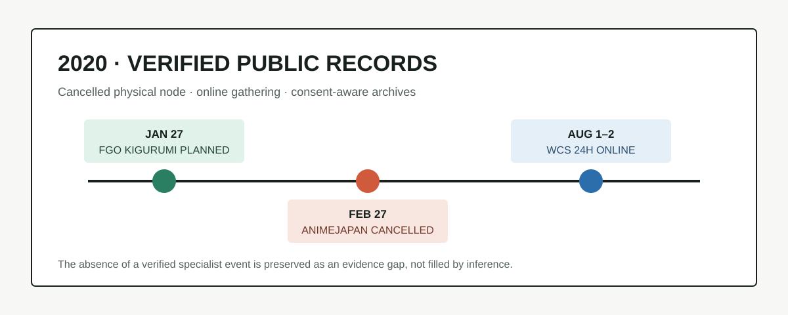

# 2020 年 Kigurumi 编年史

> **编辑判断**
>
> 站点已经完成 2021–2025 五个年度。本轮依照“已完成年份不重复、每次只向前整理一年”的规则，整理 2020 年。2020 年的可靠材料不支持一份密集的专门活动清单；本文记录能够确认的 kigurumi 实体计划、取消事实和线上替代基础设施，不用后年活动倒填空白。

## 0. 资料边界与可信度

本文主要讨论 animegao kigurumi、美少女着ぐるみ、面具型角色扮演、官方 IP 着ぐるみ，以及它们直接依赖的展会、更衣、摄影、互动和公开传播条件。

| 资料类型 | 处理方式 |
| --- | --- |
| 主办方或 IP 官方公告 | 可确认计划、日期、取消与活动结构 |
| 活动官方档案和参与规则 | 可说明线上参与、影像授权与平台安排 |
| 参与者影像、搜索摘要 | 仅作线索，不单独写成年度事实 |
| 没有可核日期的活动档案 | 不推定属于 2020 |

World Cosplay Summit（WCS）是综合 cosplay 场域，不等于专门 kigurumi 活动。它在本文中的价值是记录全头套和面具型参与者所依赖的公共活动基础设施如何转到线上。

## 1. 年度主线

2020 年通过高可信门槛的材料形成一条清楚但克制的主线：

1. **实体计划存在**：Fate/Grand Order（FGO）官方原计划在 AnimeJapan 2020 展位安排 cosplayer / 着ぐるみ内容。[^fgo-aj]
2. **计划因疫情取消**：AnimeJapan 与 FGO 均在 2 月 27 日确认展会和展位取消。[^animejapan][^fgo-aj]
3. **综合活动转到线上**：WCS 2020 改为 8 月 1–2 日的 24 小时全球线上节目，并开放 Zoom cosplay gathering、居家装扮、虚拟背景和官方节目参与。[^wcs2020][^wcs-entry]

这不是“活动都消失了”的简单叙述，而是参与基础从场馆、更衣室和实体 greeting，暂时转向家中空间、摄像头、视频会议、直播平台和可长期留存的数字影像。

## 2. 主要纪事

### 1 月 27 日：FGO 公布 AnimeJapan 2020 的 cosplayer / 着ぐるみ计划

FGO 官方出展页说明，原定 3 月 21–22 日在东京 Big Sight 举行的 AnimeJapan 2020 将设置 FGO 展位，公开项目中包括 “コスプレイヤー / 着ぐるみ”。[^fgo-aj]

这是一条直接的 kigurumi 证据：它不是从普通 cosplay 展会推断出来的参与，而是 IP 方在官方页面明确写出的展位内容。后续年份已经记录 FGO greeting 的实际回归；本文只保留 2020 年“已经计划、尚未发生”的状态。

### 2 月 27 日：AnimeJapan 与 FGO 展位取消

AnimeJapan 官方公告称，因新型冠状病毒感染扩散、政府提出大型活动自肃方针，并考虑来场者及所有相关人员的安全，决定取消 AnimeJapan 2020 与 Family Anime Festa 2020。[^animejapan] 同日，FGO 官方在原出展页追加说明，确认 FGO 展位随展会取消。[^fgo-aj]

取消记录不能写成“FGO kigurumi 在 AnimeJapan 2020 登场”。成熟的编年史必须同时保存计划与结果：

| 字段 | 结论 |
| --- | --- |
| 原计划 | 3 月 21–22 日，FGO 展位含 cosplayer / 着ぐるみ |
| 最终状态 | 2 月 27 日确认取消，未作为已发生活动计入 |
| 历史意义 | 证明疫情直接切断了已公布的官方 kigurumi 实体节点 |

AnimeJapan 原先还规划了 Cosplayers World，包括付费登记、更衣室、cloakroom、官方摄影背景和服装制作企划。[^aj-cosplay] 这些设施并非 kigurumi 专用，但全头套参与者尤其依赖运输、换装、休息与摄影空间；展会取消意味着整套线下条件同时消失。

### 7 月 1 日：WCS 2020 ONLINE 官方站开放

WCS 官方档案记录，WCS 2020 ONLINE 特设站在 7 月 1 日开放。[^wcs2020] 该页把疫情影响下的新形态定义为从名古屋面向全球的线上发布。

与 2021 年的线上线下混合模式不同，2020 年的独有位置是**全面在线替代**：先建立直播与远程参与模板，下一年才逐步恢复现场场域。

### 8 月 1–2 日：24 小时直播与 Zoom cosplay gathering

WCS 2020 ONLINE 的开幕仪式安排在 8 月 1 日 12:00–13:00，在线节目从 8 月 1 日 20:00 连续到 8 月 2 日 20:00，共 24 小时。官方档案列出 YouTube、Niconico、Twitch 等传播渠道。[^wcs2020]

参与页还提供了更具体的远程结构：[^wcs-entry]

- 参与者可从家中穿着 costume 加入 Zoom gathering；
- gathering 依作品或主题分组，可使用虚拟背景；
- 部分参与者可进入官方直播节目并接受主持人采访；
- 未成年人出镜需要监护人许可；
- 节目中的影像可能继续用于网站、报纸、电视、宣传册和网络广告；
- 官方提供照片框和背景素材，鼓励以统一标签发布公开照片。

对 kigurumi 来说，线上化降低了运输头壳、寻找更衣室和长途移动的门槛，但也改变了风险结构：家庭环境可能被摄入，角色背后的现实身份更难与直播画面分离，影像授权的传播范围也比普通现场合影更长。因而 2020 年的礼仪重点从“现场能否拍摄”扩展为“谁能观看、是否录制、以后如何再利用”。

### 制作与手工：只有活动提示，不写成独立教程

WCS 的观众参与页举例提出“3 小时制作 costume”等居家挑战。[^wcs-entry] 这说明制作可以成为线上节目内容，但官方页面没有提供直接针对 animegao 面具、眼片、假发或内衬的完整教程。因此本文将其列为手工领域的弱节点，不把它包装成已经形成的 kigurumi 工坊。

## 3. 领域归类

| 领域 | 2020 可核验内容 | 编辑结论 |
| --- | --- | --- |
| 编年史 | FGO kigurumi 计划与取消；WCS 全面线上化 | 纳入年度主轴 |
| 日常 / 杂谈 | 居家装扮、Zoom 分组交流、远程采访 | 只写官方流程 |
| 工坊 / 手工 | WCS 居家 costume challenge 示例 | 不独立建工坊板块 |
| 礼仪 / 安全 | 疫情取消、监护人许可、直播与影像再利用 | 纳入 |
| 百科 / 科普 | 区分“已计划”“已取消”“已发生”三种状态 | 纳入 |
| 学术 | 未发现 2020 年直接以 animegao kigurumi 为主题且可公开核验的新论文 | 保留空白 |

## 4. 资料空白与待考

本轮未找到能够以一手来源确认日期、地点和结果的 2020 年专门 animegao kigurumi 聚会。Doll Weekend 当前档案中的 DW1–4 仍缺少可核日期，不能从后续序号反推到 2020。[^dw-archive]

“没有通过门槛的记录”不等于“社群没有活动”。它只表示公开网页可能已经失效、活动留在私域、原始海报尚未找到，或证据不足以写入稳定的年度总账。

## 5. 与 2021–2025 年页面的去重

| 主题 | 2020 本文保留 | 后续页面负责 |
| --- | --- | --- |
| FGO / AnimeJapan | 已公布但取消的 cosplayer / 着ぐるみ展位计划 | 2022–2025 的实际 greeting 与角色变化 |
| WCS | 全面在线、24 小时直播、Zoom gathering | 2021 混合化；2022–2025 现场恢复与安全规则 |
| 专门 kigurumi 活动 | 证据空白，不推测 | 2021 第 18 回 `キグルミwasshoi!` 起的可核记录 |
| Doll Weekend | DW1–4 日期待考 | 2022 起有可靠年份的 DW5–12 |

## 6. 年度结论

2020 年最可靠的历史位置是“实体节点中断与在线参与实验”。FGO 的官方 kigurumi 计划留下了取消前的直接证据；WCS 则把 gathering、采访、作品展示和制作挑战迁移到直播与视频会议中。线上化没有复制更衣室、陪同、身体安全和实体互动，却把影像授权、家庭隐私与长期传播推到前台。资料空白应继续等待一手证据，而不是用后续年份的繁荣反推一个不存在的完整年表。

## 参考资料

[^fgo-aj]: Fate/Grand Order, “「AnimeJapan 2020」出展情報について,” <https://news.fate-go.jp/2020/aj2020/>
[^animejapan]: AnimeJapan, “「AnimeJapan 2020／ファミリーアニメフェスタ2020」開催中止について,” 2020-02-27, <https://www.anime-japan.jp/2020/news/#10045>
[^aj-cosplay]: AnimeJapan, “コスプレイヤーズワールド,” <https://www.anime-japan.jp/2020/main/cosplay/>
[^wcs2020]: World Cosplay Summit, “WORLD COSPLAY SUMMIT 2020 ONLINE,” <https://www.worldcosplaysummit.jp/2020/en/>
[^wcs-entry]: World Cosplay Summit, “Entry & Online Gathering Venue Information,” <https://www.worldcosplaysummit.jp/2020/en/plan/>
[^dw-archive]: Doll Weekend, event archive, <https://dollweekend.cn/cn/event/>
