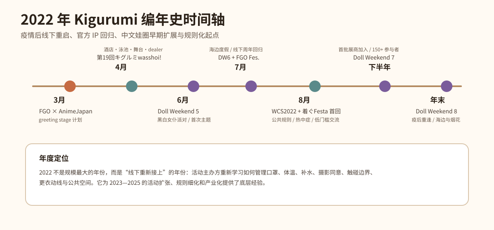
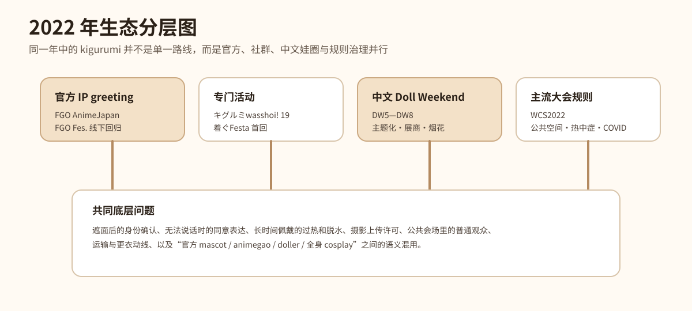
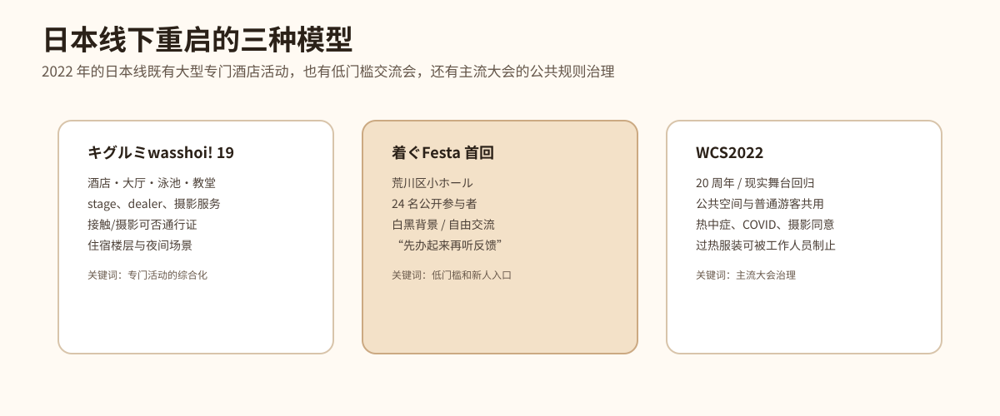
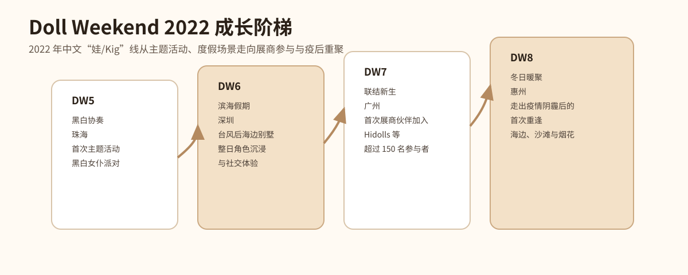
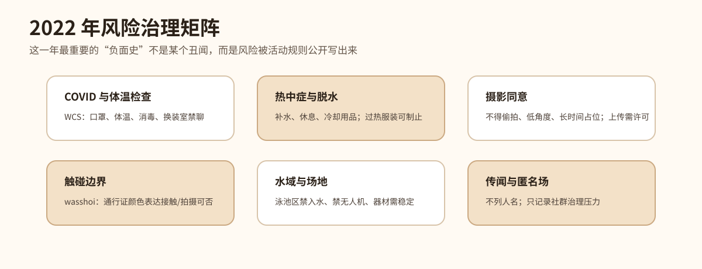
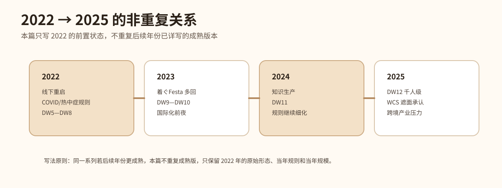

# 2022 年 Kigurumi 编年史

> 编写口径：本篇承接《2025 年 Kigurumi 编年史》《2024 年 Kigurumi 编年史》《2023 年 Kigurumi 编年史》的结构，但**不重复 2023、2024、2025 已经详写过的活动版本、规则更新和产业扩张**。同一系列活动若 2022 年已经出现前置版本、独立规则、早期规模、恢复线下或首次变化，则记录其 2022 年状态；若只是后续年份已写过的成熟形态，本篇只在“去重说明”中点到为止。

---

## 0. 资料边界、去重原则与可信度说明

这份 2022 年编年史中的 **kigurumi** 继续采用前几篇的广义口径：包括 animegao kigurumi / 美少女着ぐるみ / 面具型角色扮演、doller、中文“娃 / Kig / Kiger”线下活动、官方 IP 吉祥物式着ぐるみ greeting，以及大型 cosplay 活动中涉及全头套、遮面、公共空间、热中症、摄影同意和接触边界的规则文本。2025 篇已经详细解释术语，本篇不重复长篇定义，只在必要处区分“官方 mascot greeting”“爱好者 kigurumi 专门活动”“中文 Doll Weekend 娃/Kig 活动”“主流 cosplay 大会规则”四类资料。

2022 年资料比 2023—2025 更分散，且很多中文与日文活动页面并不总是完整列出精确日期。因此，本篇采用以下可信度原则：官方活动页、主办方页面、展会规则页和媒体现场报道优先；Bilibili、X/Twitter、YouTube 等社交平台用于辅助判断活动时间、影像传播和现场气氛；匿名论坛、私域群聊、截图传闻不作为事实依据，不列具体人名，不复述未经核实指控。

2026 年 9 月 5 日复核时，FGO、Inside Games、キグルミwasshoi!、着ぐFesta 与 Doll Weekend 的引用页面仍可公开访问。Doll Weekend 现行活动页依然没有给出 DW5—DW8 的确切举办日；本次新增的 Bilibili 元数据只能建立公开视频发布日与“活动已经结束”的时间上界，不能替代主办方尚未公开的活动日期。

本篇与 2023—2025 篇的去重规则如下：

| 去重类型 | 2022 篇处理方式 |
|---|---|
| 同一系列活动在 2023—2025 继续举办 | 只写 2022 的首回、前置版、早期规则与当年规模，不重复后续成熟版本 |
| 2025 已解释的 kigurumi / animegao / doller 术语 | 仅保留必要口径，不重复术语长文 |
| FGO、hololive、Aniplex 等官方 greeting 后续年继续存在 | 只写 2022 的 AnimeJapan / FGO Fes. 等当年节点，不重复 2023—2025 的角色和数量 |
| World Cosplay Summit 后续年继续强化遮面和热中症规则 | 只写 WCS2022 的“现实舞台回归”、COVID / 热中症 / 公共空间规则，不重复后续年细化 |
| Doll Weekend 后续年 DW9—DW12 已详写 | 本篇只写 DW5—DW8 的主题化、海边度假、展商加入和疫后重逢 |
| 着ぐFesta 后续年规则更成熟 | 本篇只写 2022 首回的低门槛试办，不重复 2023/2024 规则扩展 |

---

## 1. 2022 年总体脉络

2022 年的 kigurumi 不是一个“爆发年”，而是一个更底层、更关键的“线下重启年”。如果说 2023 是活动连接恢复、中文圈走到国际化前夜的一年，2024 是知识生产和规则书写更密集的一年，2025 是规模化、跨境化和产业压力更加显性的年份，那么 2022 的核心意义就在于：**许多活动在疫情后的不确定环境中重新开门，主办方开始重新学习如何把 kigurumi 放回公共空间、酒店空间、展会空间和舞台空间。**

第一条主线是日本 kigurumi 专门活动的重新组织。第19回キグルミwasshoi! 在 2022 年 4 月以酒店为核心场地，设置大厅、鸡尾酒 lounge、泳池区、教堂、stage、dealer、摄影服务和住宿相关企划，是当年最完整的日本专门活动之一。它的规则非常密集：接触/摄影可否通行证、酒店公共区域限制、摄影同意、禁止入水、禁止无人机、禁止过度性表现、禁止损害场地鞋类等，都显示出 kigurumi 线下活动在 2022 年已经进入“规则恢复与再确认”的状态。[[S3]](#s3)

第二条主线是低门槛活动开始出现。2022 年 8 月 6 日的着ぐFesta 首回规模不大，公开参与者 24 人，但它非常重要：页面明确说，疫情稍微稳定后，大型活动逐渐恢复，但主办方希望提供一个“不用预约、能轻松来玩”的交流空间。它没有准备很多大型企划，而是以白黑背景摄影、整层包场、更衣与 cloak 空间、自由交流为核心，并写明希望通过本次了解参与者需求，为以后准备内容。[[S8]](#s8)

第三条主线是官方 IP 的实体角色回归现场。FGO 在 AnimeJapan 2022 的官方页面中安排了 cosplayer / kigurumi greeting stage；FGO Fes. 2022 于 7 月 30—31 日在幕张 Messe 举办，媒体报道称这是受疫情影响后约 3 年来的首次现实活动，welcome gate 有官方 cosplayer 与 kigurumi 迎接来场者，其中现场报道记录了 9 名官方 cosplayer 与 6 体 kigurumi。[[S1]](#s1)[[S2]](#s2)

第四条主线是主流 cosplay 大会在疫情治理中恢复。World Cosplay Summit 2022 是 20 周年活动，官方页面写明 World Cosplay Championship Stage Division 约 3 年来首次回到真实舞台，但因国际出行仍受影响，只有能够来日的团队参加。WCS 同时发布了公共空间、热中症与 COVID 对策等规则：参与者需意识到会场并非全封闭 cosplay 空间，摄影要取得许可，换装室有口罩和禁聊要求，酷暑下要补水休息，可能导致严重脱水的服装可被工作人员制止。[[S4]](#s4)[[S5]](#s5)[[S6]](#s6)[[S7]](#s7)

第五条主线是中文 Doll Weekend 从主题化走向展商化与疫后重逢。DW5 在珠海以“黑白协奏”为主题，是官方页面所称的首次主题活动；DW6 在深圳以“滨海假期”为主题，记录台风过后的海边别墅度假和整日角色沉浸；DW7 在广州首次迎来展商伙伴加入，并超过 150 名参与者；DW8 在惠州被官方页面描述为“走出疫情阴霾后的首次重逢”，以海边、沙滩和烟花作为情绪核心。[[S9]](#s9)[[S10]](#s10)[[S11]](#s11)[[S12]](#s12)[[S13]](#s13)

因此，2022 年的年度位置可以概括为：**它不是最华丽的一年，但它把很多后来变大的东西重新接上了线。**酒店专门活动、低门槛交流会、官方 IP greeting、WCS 公共规则、中文娃圈主题化和展商化，都在这一年留下了可验证的前置节点。

---

## 2. 2022 年编年史

### 1—2 月：线下重启前夜——疫情治理仍是所有活动的底层变量

2022 年初，kigurumi 社群面对的最大背景仍然是疫情后的线下不确定性。许多活动在 2020—2021 年经历取消、缩小、延期、预约制或线上化后，2022 年才开始重新尝试较大规模的现实场地。对 kigurumi 来说，这种重启比普通 cosplay 更困难：面具、假发、紧身衣、身体填充和头壳箱会增加更衣室占用、移动协助和休息需求；遮面状态也会让工作人员更担心身份确认、体温检查、口罩佩戴和紧急处置。

这一年的活动资料普遍带有“重新办起来”的语气。第19回キグルミwasshoi! 页面称其为继前一次试验性活动反响良好后的正式举办，并列出感染症对策说明；着ぐFesta 首回则直接写道，疫情稍微稳定，大型活动逐渐恢复，但仍希望提供一个无需预约、能随意来玩的交流场。WCS2022 的 COVID 对策页面则要求有症状者或接触风险者不要来场、入场测温、口罩佩戴、更衣室内避免对话、使用消毒和维持社交距离。[[S3]](#s3)[[S7]](#s7)[[S8]](#s8)

这段背景不是一个单独聚会，但它决定了全年 kigurumi 活动的基调。2022 年主办方必须同时处理两类问题：一类是 kigurumi 原本就存在的视野、散热、接触、摄影和更衣问题；另一类是疫情后新增或被强化的体温、口罩、消毒、密集接触、换装室谈话和联系方式记录问题。也就是说，2022 年的活动不是简单“回到疫情前”，而是在新的公共卫生规则中重新定义线下参与。

从后续发展看，2022 的这种重新定义非常重要。2023—2025 年我们看到的摄影同意、热中症、公共空间、遮面确认、活动后社交、dealer 区、展商体系等规则和设施，并不是突然出现，而是在 2022 年这种“重新开门但必须小心”的环境中逐步恢复、试验和强化。

### 3 月 26—27 日：FGO × AnimeJapan 2022——官方 cosplayer / kigurumi greeting stage 的年初回归

2022 年 3 月 26—27 日，AnimeJapan 2022 在东京 Big Sight 举办，Fate/Grand Order 官方页面记录 FGO 展位位于东 3 Hall A04，并列出“コスプレイヤー･着ぐるみグリーティングステージ”计划。页面还写明 FGO Special Stage 于 3 月 27 日 13:15—13:50 举行，展会总体为东京 Big Sight 东 1—8 Hall。[[S1]](#s1)

这条记录在 2022 年很重要，因为它说明官方 IP 的 kigurumi / mascot 身体并没有因疫情中断而退出展会运营。AnimeJapan 是商业动漫展，观众目的包括看新作、看展位、买周边、参加舞台、拍照和社交。FGO 把 cosplayer 与 kigurumi greeting 写入展位信息，说明官方仍然需要通过“角色身体”来增强现场体验。

官方 greeting 与爱好者 animegao kigurumi 并不是同一种组织形态。FGO 展位中的 kigurumi 是官方授权、官方运营和展位秩序的一部分；爱好者 kigurumi 则更多是个人角色扮演、摄影创作、社群互动和身体表达。但两者在观众层面会互相影响：普通观众先在官方展位看到“会动的二次元角色”，再看到同好活动或个人玩家时，就更容易理解这种视觉语言。

2022 的 AnimeJapan 版本也不同于 2023、2024、2025 的后续节点。本篇不重复后续年的展位细节，只记录 2022 年这个“年初回归”的意义：在疫情后线下活动重新开放的早期，FGO 仍将 kigurumi greeting 作为展位体验的一部分。这意味着 kigurumi 在官方二次元 IP 线下传播中的位置，并没有被完全替代为纯线上直播或屏幕展示。

从 kigurumi 编年史看，这是一条“主流可见度”的线索。很多人进入 kigurumi 文化并不是从 animegao 论坛或玩家聚会开始，而是先在大型 IP 活动中遇见官方吉祥物式角色。2022 年 FGO × AnimeJapan 的记录，正是这种公共入口的一部分。

### 4 月 9—10 日：第19回キグルミwasshoi!——酒店型专门活动的综合恢复

2022 年 4 月 9—10 日，第19回キグルミwasshoi! 在东京 Hotel East 21 Tokyo 举办。官方页面称，此次活动继前次试验性活动反响良好后，再次在豪华 location 与大型 hall 中举办摄影交流，并准备写真 contest、maker 出展、stage 企划等内容。页面列出 Day 1 为 4 月 9 日，Day 2 为 4 月 10 日；Day 1 使用 East21 Hall、鸡尾酒 lounge “Panorama”，并面向住宿者开放 night pool；Day 2 则使用 East21 Hall、garden pool 和付费 chapel。[[S3]](#s3)

这场活动是 2022 年日本 kigurumi 线下史中的重量级节点。它不是普通同好租一个小场地拍照，而是把酒店大厅、lounge、泳池、教堂、住宿楼层、摄影服务、舞台节目、dealer 出展和竞赛企划组合在一起。对 kigurumi 来说，这种综合场地非常有价值：大厅适合大型合照和交流，lounge 适合角色氛围照，泳池和教堂提供特殊背景，住宿则解决头壳箱、长时间穿戴、夜间拍摄和体力恢复问题。

但是，正因为它综合，规则也必须综合。页面设置了接触与摄影许可通行证机制，参与者可以通过 pass 表达自己是否允许接触、是否允许拍摄；如果对方 pass 表示不希望被触碰，就不得触碰；公共场合的不适当行为也被禁止。这个机制非常值得记录，因为 kigurumi 的非语言交流天然困难：头壳遮挡面部，声音可能听不清，表演者也常常为了保持角色状态而不说话。用通行证颜色或类型表达边界，是把“同意”从口头沟通转化为可视化规则的一种方式。[[S3]](#s3)

摄影规则同样细致。页面要求拍摄前得到被摄者同意，上传照片前也要得到许可；禁止长时间占用拍摄地点，禁止更衣室和厕所内拍摄，禁止要求被摄者做难以回应或不适当的 pose，禁止未经许可的媒体采访和无授权报道。它还对摄影器材作出限制，例如大镜头与器材摆放不得阻碍活动。这些规则说明，kigurumi 活动中的“拍照”不是单纯按快门，而是包含被摄者同意、场地秩序、作品使用权和社群信任。[[S3]](#s3)

泳池区规则则体现了安全治理。页面明确禁止入水，禁止无人机，使用灯架或反光板等器材时需采取防倒措施，伞类在泳池区域被禁止。这些内容与 2025 篇记录的水域安全规则形成前后呼应，但 2022 的意义在于它已经很早把“泳池作为背景”和“不得把 kigurumi 带入水中”区分开。对头壳玩家来说，水域景观很美，但材料吸水、鞋底打滑、视野受限和服装重量都会放大风险。[[S3]](#s3)

酒店公共区域限制也值得写入。页面说明住宿者会有便利用法，例如可以在活动 reception 处 checkout、在指定范围内移动，但 2F front lobby 等公共区域并不允许穿着 kigurumi 进入；也要求参与者不要联系会场，不要打扰普通酒店客人，不要在非指定区域移动。这样的规则显示：kigurumi 专门活动即使租用了酒店设施，也仍然处于普通商业设施之中，必须处理参与者、酒店客人、工作人员和公众之间的边界。[[S3]](#s3)

衣装与行为规则也反映出 2022 年社群治理的复杂度。页面禁止一般露面 cosplay 作为 kigurumi 参加，肤色 tights 被视为“皮肤”并要求避免私密部位轮廓或暴露，要求避免过度性表达；禁止会伤害场地的鞋类，禁止现实公权力制服，禁止危险道具和会发射的 airgun，禁止喷雾、血浆等可能污染场地的物品。对外部观众来说，这些规定可能显得琐碎；但对活动主办方来说，它们直接关系到场地合同、安全责任、公众印象和后续能否继续租场。[[S3]](#s3)

从正面历史角度看，第19回キグルミwasshoi! 说明 2022 年日本 kigurumi 专门活动已经具备较高组织能力：能调动酒店、多个摄影场景、stage、dealer、contest、官方摄影和住宿安排。从负面或风险历史角度看，它也说明重启线下并不容易：每一个可拍摄的漂亮空间背后，都对应一套移动、接触、摄影、公共区域和安全规则。2022 年的 kigurumi 并不是“终于又能聚了”这么简单，而是在重新聚会的同时重新写下边界。

### 6 月上旬前后：Doll Weekend 5「黑白协奏」——中文 DW 线的首次主题活动

Doll Weekend 5 官方页面将活动主题写作“黑白协奏”，地点为广东珠海，并说明这是 Doll Weekend 首次策划主题活动——黑白女仆派对，使聚会更具仪式感与沉浸体验。Bilibili 公开视频“娃娃平时是怎么过生日的 - Doll Weekend 5”发布于 2022 年 6 月 6 日，标题和标签也明确指向 Doll Weekend 5 与 kigurumi / Kig 场景。因此，本篇将 DW5 记为 2022 年 6 月上旬前后的公开节点；严格说，Bilibili 日期是公开视频发布时间，不一定等于活动举办日。[[S9]](#s9)[[S10]](#s10)[[S14]](#s14)

DW5 的关键词是“首次主题”。在更早期的同好聚会中，参与者可能只是带着不同角色相聚、拍照、交流；而主题活动会给所有角色提供共同视觉秩序。黑白女仆派对这个主题，将服装色彩、场景氛围、仪式感和集体记忆连接起来。对 kigurumi/doll 活动而言，主题不是简单 dress code，而是一种让不同角色在同一叙事中共处的方法。

女仆主题也很适合中文“娃/Kig”圈早期发展。它既来自二次元、女仆咖啡、日系 cosplay、生日会和服务场景的混合想象，又能让角色在活动中形成比较统一的动作语言：站姿、端盘、祝贺、合影、互动、舞台或派对感。黑白配色则降低了角色之间色彩冲突，使合照更容易形成视觉整体。

从 2025 篇的角度回看，DW5 看似远小于 DW12 的千人级、烟花、无人机和游行，但它具有前史意义：它证明 Doll Weekend 在 2022 年已经意识到“活动不只是让大家来，而是要让大家进入一个共同主题”。后续 DW6 的滨海假期、DW7 的展商加入、DW8 的冬日暖聚、DW10 的国际化和 DW12 的庆典化，都可以视为这种主题化能力的延伸。

DW5 同时也显示中文 kigurumi/doll 圈开始通过影像平台传播自身。Bilibili 视频标题以“娃娃平时是怎么过生日的”向普通观众解释场景，降低了“这是什么活动”的门槛。它不是面向专业论文的术语解释，而是通过生日、派对、女仆、二次元、可爱身体这些更直观的元素，让观众理解“娃”也有自己的社交日常。

### 7 月下旬前后：Doll Weekend 6「滨海假期」——台风之后的海边别墅与全天候角色沉浸

Doll Weekend 6 官方页面将主题写作“滨海假期”，地点为广东深圳，并说明这是“台风过后”的娃娃海边别墅度假，打造整日的角色沉浸与社交体验。Bilibili 公开搜索记录显示相关正片“DW6 正片 娃娃是如何在海滨度假的”发布时间为 2022 年 7 月 27 日，因此本篇将 DW6 记为 2022 年 7 月下旬前后的节点；同样需要注意，视频发布时间不一定等同于活动准确举办日期。[[S9]](#s9)[[S11]](#s11)[[S15]](#s15)

DW6 的意义在于它把活动从室内主题派对推进到度假场景。海边别墅与全天候角色沉浸，意味着参与者不是只在几个小时内完成拍照，而是在更长时间内维持角色状态、社交状态和摄影状态。这对 kigurumi/doll 玩家来说要求更高：头壳佩戴时间、换装安排、休息补水、空调区域、海风湿度、盐分、地面、运输和摄影节奏都会影响体验。

“台风过后”这个表述也很有现场感。它说明活动并不是抽象的棚拍，而是处在真实天气与真实地理环境中。海边风大、湿度高、光照强，天气变化会直接影响假发、服装、头壳和摄影器材。对于普通 cosplay 来说，这些已经是问题；对于 kigurumi，头部视野、散热和鞋底稳定性会进一步放大问题。因此，DW6 既是一次有画面感的度假尝试，也是一种对户外/半户外场景适配能力的测试。

与 DW5 的黑白女仆派对相比，DW6 的“滨海假期”更强调空间本身。女仆派对的核心是服装与仪式，海边度假的核心是环境与时间。角色在别墅、海边、走廊、休息区、露台、室外光线中活动，会比单一大厅更接近日常化或旅行化的叙事。这种转变对中文娃圈后续很重要，因为它让“娃”活动不只发生在展馆或租赁 hall，也能发生在度假、城市、酒店、景区和摄影旅行中。

DW6 还为后续 DW8 的海边与烟花埋下伏笔。2022 年 Doll Weekend 的中文线并不是直线上升的人数故事，而是不断试验场景：生日/女仆、海边别墅、展商活动、冬日重聚。每一次试验都会增加主办方对场地、人员、摄影、交通和安全的理解。

### 7 月 30—31 日：FGO Fes. 2022 ～7th Anniversary～——约三年后的线下周年回归

2022 年 7 月 30—31 日，Fate/Grand Order Fes. 2022 ～7th Anniversary～ 在幕张 Messe 举办。Inside Games 的现场报道写明，因新冠疫情影响，FGO Fes. 这是约 3 年来的首次现实活动；会场的 welcome gate 通过大型半圆 screen、red carpet 和地球模型营造节庆入口，并由官方 cosplayer 与 kigurumi 迎接观众。报道对象包括 9 名官方 cosplayer 与 6 体 kigurumi。[[S2]](#s2)

这场活动是 2022 年官方 IP kigurumi 线的年度核心。AnimeJapan 2022 是展会展位中的 greeting stage，FGO Fes. 2022 则是周年庆典入口中的沉浸式迎接。三年左右未能举办现实活动后，官方 cosplayer 与 kigurumi 在 welcome gate 迎接粉丝，具有很强的象征意义：玩家不是只在屏幕上看游戏更新，而是重新走进一个由角色身体和现场空间组成的节日。

报道中记录的 6 体 kigurumi 包括女主人公、アルテラ、マシュ、ジャンヌ・ダルク、セイバー、レオナルド・ダ・ヴィンチ。它们与官方 cosplayer 分工出现，形成 FGO 展会现场特有的“真人角色 + kigurumi 角色”混合景观。对观众来说，角色不再只停留在卡面、PV 或展板上，而是在入口、红毯与 BGM 之中变成可被观看、拍照和互动的实体。[[S2]](#s2)

从 kigurumi 编年史角度看，这类官方 kigurumi 的价值在于公共可见度。它不会直接等同于 animegao 玩家社群，也不会直接反映个人 kiger 的创作方式；但它会改变普通观众对全头套角色的接受度。当大量粉丝在官方活动中看到角色以 kigurumi 形式迎接自己，之后在漫展或专门活动中看到个人玩家时，就更容易把这种身体形式理解为“角色呈现”，而不是单纯的陌生奇观。

FGO Fes. 2022 也体现了疫情后线下活动的情绪价值。报道强调这是约 3 年来的现实活动回归，这一点对官方 kigurumi 很重要：全头套角色的意义恰恰在于“现场性”。如果无法与观众处在同一空间，kigurumi 的挥手、站姿、合影和步行动作就难以发挥作用。2022 年的回归，重新确认了 kigurumi 在 IP 线下运营中的不可替代部分。

### 8 月 5—7 日：World Cosplay Summit 2022——20 周年、真实舞台回归与公共空间规则

2022 年 8 月 5—7 日，World Cosplay Summit 2022 在名古屋/爱知举办。官方页面记录，World Cosplay Championship Stage Division 在 8 月 6 日于爱知艺术文化中心大 hall 举行，并写明这是约 3 年来首次回到真实舞台；受疫情后的入境与来日条件影响，只有能够来到日本的团队参加。[[S4]](#s4)

WCS2022 对 kigurumi 的意义不在于它是 kigurumi 专门活动，而在于它代表主流 cosplay 体系重新打开公共空间。WCS 会场包括 Oasis 21、Hisaya-odori Park、Osu 商店街、Flarie 等地，官方规则反复提醒这些空间不是只为 cosplay 参与者存在，普通来场者、通行人、店铺和设施使用者也在同一场域中活动。对 kigurumi、全头套、厚重服装或遮面服装来说，这种公共性带来的压力非常大：视野受限、行动不便、身份不易确认、容易被路人拍照，也更容易在拥挤处造成误解。[[S5]](#s5)

WCS2022 的服装与道具规则已经把身体风险写入文本。规则提到，长物大约 2 米以内，但工作人员可根据场地和状况要求参与者停止使用；同时，过度暴露、尖锐、长裙摆导致步行困难，或可能导致严重脱水的紧身、过热服装，都可能被工作人员要求避免。虽然 2022 规则没有像 2025 那样把 kigurumi、doller、gawa-cos、全脸面具等类别单独展开，但它已经把“服装可能导致脱水”作为工作人员可判断的问题。[[S5]](#s5)

摄影规则同样重要。WCS2022 要求摄影时不得长时间占用地点，不得未经同意拍摄，不得进行低角度或内衣可见 pose 的拍摄；照片上传 SNS 前也需要取得被摄者同意。对 kigurumi 来说，这类规则不仅保护被摄者，也保护拍摄者和活动本身。因为 kigurumi 表演者常常无法通过表情或语言快速拒绝，对方也可能误以为“角色在场就可以拍”。规则把同意从模糊社交礼貌变成明确活动要求。[[S5]](#s5)

WCS2022 的热中症对策页面也非常关键。页面提醒活动时段可能出现强烈暑热，参与者应携带饮料、频繁补水、适当休息、使用冷却用品；如果觉得热，不要勉强参加；活动期间可以多次进入更衣室，应该选择容易散热的衣装，并以身体状态为优先。对于 kigurumi 表演者来说，这些不是一般提醒，而是生命安全规则：头壳与紧身衣会影响散热，假发和填充会增加热量，角色鞋可能让移动变慢，摘头休息又可能涉及隐私与角色状态。[[S6]](#s6)

COVID 对策则构成另一层治理。WCS2022 页面要求出现症状、接触风险或旅行限制相关情况者不要来场；入场会进行体温检查，超过 37.5 度或有明显症状者不得入场；更衣室内要求避免对话，参与者需佩戴口罩、消毒、保持距离，并建议使用接触确认 app。对于 kigurumi 参与者，这类规则会与头壳和口罩产生实际冲突：什么时候戴普通口罩，什么时候进入角色头壳，什么时候摘头，如何在更衣室安静换装，都是现场需要处理的问题。[[S7]](#s7)

因此，WCS2022 是 2022 年“负面/风险史”的核心节点之一。它不是因为发生了某个负面事件，而是因为它把风险制度化：公共空间、热中症、摄影同意、COVID、换装室、道具长度、过热服装，这些都被写进主流 cosplay 活动规则。2025 年更明确的遮面规则与 kigurumi 类别承认，可以视为这种公共治理经验的延伸；本篇只记录 2022 的前置状态，不重复后续年的细化文本。

### 8 月 6 日：着ぐFesta 首回——低门槛交流会的起点

2022 年 8 月 6 日，着ぐFesta 首回在荒川区サンパール荒川小ホール举办。TwiPla 页面标题为“着ぐFesta！ 着ぐるみさんと着ぐるみ好きさんの交流イベント”，时间为 10:00—16:00，主办为 GarageStudioC7。页面说明，疫情稍微稳定，大型活动逐渐恢复，许多 kigurumi 玩家表示希望能有一个不用预约、可以轻松来玩的活动，于是主办方租用了可容纳约 300 人、可办婚礼等活动的 hall。公开报名显示参加者 24 人。[[S8]](#s8)

着ぐFesta 首回的价值不在于规模，而在于“门槛”。第19回キグルミwasshoi! 是酒店型综合活动，内容丰富，但也意味着行程、费用、准备和规则都更复杂；WCS 是主流大型大会，公共空间压力更高；而着ぐFesta 首回更像一个可以让 kigurumi 玩家和喜欢 kigurumi 的人先聚起来的低门槛空间。页面写明参加条件包括“着ぐるみの方々ならびに着ぐるみの方々のファンの方々”，即使没有自己的 kigurumi 也可以参加，这为新人和旁观者提供了入口。[[S8]](#s8)

会场设计也体现 kigurumi 需求。页面说明整层包场，hall 和 entrance 都可以由 kigurumi 使用，乐屋与舞台作为更衣室和 cloak，前台区域可放行李。对于 kigurumi 来说，能否有足够的更衣、行李、头壳箱和休息空间，往往比舞台节目更基础。普通 cosplay 的衣物可能装进箱包，kigurumi 头壳则体积大、易损、需要放置稳定；肤色衣、假发、角色服和鞋也需要更细致的更衣时间。[[S8]](#s8)

首回页面还写明，主办方并没有准备太多大型内容，希望参与者在自由交流中创造当天氛围；同时运营方会在这次活动中了解参与者想要什么服务，以便以后准备。现场准备了白黑背景与摄影器材，活动中拍摄的照片后续会整理上传。这个“先办起来，再根据反馈改进”的姿态非常符合 2022 年的重启氛围。[[S8]](#s8)

这场活动还已经包含基本风险控制。页面写明，过去在其他活动引起问题的人、或有可能引起问题的人请勿参加，主办方可能不说明理由；也要求参与者遵守通用注意事项。这类文字虽然简短，但说明小型 kigurumi 活动一开始就需要处理社群信任、活动安全和问题人物排除。因为 kigurumi 活动常常依赖熟人网络与非语言互动，一旦有人反复越界，会迅速破坏新人和表演者的安全感。[[S8]](#s8)

着ぐFesta 后续在 2023、2024 发展出更清晰的摄影同意、拥抱禁止、长物限制、面具试戴、摄影讲习、dealer 参加等内容；这些已在 2023/2024 篇详写。本篇只记录 2022 首回的历史位置：它是一个在疫情后线下恢复中出现的低门槛试办场，规模小但方向明确，为后续系列活动打下基础。

### 9 月 13 日前：Doll Weekend 7「联结新生」——展商伙伴加入与 150+ 规模

Doll Weekend 7 官方页面将主题写作“联结新生”，地点为广东广州，并说明这是 Doll Weekend 首次迎来展商伙伴加入，列出河妖、Hidolls、新颜、不还原、壳反应等伙伴；页面还写明活动超过 150 位参与者，体验维度与联结范围进一步提升。一段 DW7 公开正片于 2022 年 9 月 13 日发布，简介称“DW7 圆满结束”，因此可以确认活动不晚于该日完成；官网与视频均未给出确切举办日，本篇不再缩小日期范围。[[S9]](#s9)[[S12]](#s12)[[S16]](#s16)

DW7 是 2022 年中文娃/Kig 圈从同好聚会走向产业连接的重要一步。展商加入意味着活动不再只是玩家之间的自发相聚，而开始成为制作方、配件方、面具/服装/相关服务方与玩家接触的场域。对 kigurumi/doll 文化来说，展商体系非常关键：头壳、肤色衣、假发、服装、眼片、鞋、填充、摄影、后期、收纳和运输都可能形成供应链。一个活动如果能吸引展商，就说明参与者规模和购买需求已经具有一定稳定性。

“超过 150 位参与者”在今天看来可能不如 2025 DW12 的 1000+ 壮观，但放在 2022 年疫情后环境中，这已经是重要规模节点。kigurumi/doll 活动不同于普通同人展，参与成本高、装备运输复杂、场地需求高、体力要求强。150+ 意味着主办方要处理报名、场地、人流、合照、摄影、展商、休息、更衣、公共秩序等多重事务。

DW7 的主题“联结新生”也很贴切。它不仅是玩家之间的联结，也是玩家与制作者、活动与产业、中文圈与后续更大规模之间的联结。2023 DW9 的专业舞台与近 200 人，2023 DW10 的海外参与者和 400+，2024 DW11 的 500+，2025 DW12 的 1000+，都可以在 DW7 的展商加入中看到早期信号。

需要注意的是，本篇不重复后续年 Doll Weekend 的成熟产业化叙事。DW7 的历史意义在于“首次展商伙伴加入”和“150+”这两个 2022 节点，而不是把 2025 的展商规模、无人机、烟花、城市支持等内容倒灌回 2022。

### 12 月 27 日前：Doll Weekend 8「冬日暖聚」——走出疫情阴霾后的重逢、沙滩与烟花

Doll Weekend 8 官方页面将主题写作“冬日暖聚”，地点为广东惠州，并概括为走出疫情阴霾后的首次重逢，以海边、沙滩与烟花作为活动叙事。官方正片《伴着烟花，奔赴大海》于 2022 年 12 月 27 日发布，简介也明确写到惠州海边；这可以确认活动不晚于该日完成，但仍不能推出确切举办日。[[S9]](#s9)[[S13]](#s13)[[S17]](#s17)

DW8 是 2022 年中文 Doll Weekend 线的情绪性收束。前面的 DW5 强调首次主题，DW6 强调海边别墅和角色沉浸，DW7 强调展商加入和 150+；DW8 则把“重逢”作为核心。疫情后活动恢复，最重要的并不只是人数，而是参与者终于能够重新相聚、重新拍照、重新建立身体在场的社群关系。对 kigurumi/doll 来说，线上交流无法替代线下相遇，因为角色身体、动作、合照、灯光、同行和活动记忆都必须发生在同一空间。

“沙滩、大海和烟花”也体现 Doll Weekend 对场景叙事的持续追求。烟花是一种强烈的公共仪式：它在夜晚集中所有人的视线，也让活动记忆变得更像节日。对 kigurumi/doll 参与者来说，烟花背景下的角色影像具有很强的梦幻感；但它也意味着场地管理、人员集中、光线变化、夜间安全和摄影器材调度。DW8 作为年末暖聚，不只是好看的影像，也是主办方组织户外/半户外夜间活动能力的体现。

从 2025 篇回看，DW12 的烟花、无人机和娃游行更为宏大；但 DW8 的烟花更像早期的情感原型。它不是千人级城市节庆，而是疫情后重逢的象征。正因为 2022 年末已经出现“烟花连接聚会”的叙事，后续 Doll Weekend 才能更自然地把影像、城市、庆典和 kigurumi/doll 身体结合起来。

本篇不把 DW8 写成后续大规模活动的缩小版，而是写成 2022 年自己的结尾：经历疫情不确定性后，中文娃圈通过海边、沙滩、烟花与重逢，把全年主题从“重新尝试”推向“重新连接”。

---

## 3. 2022 年主要人物、组织与场域索引

### キグルミwasshoi! / ぷれこす相关主办体系

第19回キグルミwasshoi! 是 2022 年日本 kigurumi 专门活动的重头记录。它以 Hotel East 21 Tokyo 为场地，提供 hall、lounge、pool、chapel、住宿、stage、dealer、contest、摄影服务等综合内容，并以较详细规则管理接触、摄影、泳池、酒店公共区域和服装尺度。其历史意义在于：它证明疫情后日本 kigurumi 专门活动仍有能力组织复杂场地，同时也必须通过更细规则来保障安全和延续性。[[S3]](#s3)

### GarageStudioC7 / 着ぐFesta 首回

GarageStudioC7 主办的着ぐFesta 首回规模不大，但具有前置意义。它不是豪华酒店型活动，而是低门槛交流会：可不预约、可让没有自己 kigurumi 的爱好者参加、整层包场、提供更衣与 cloak、准备白黑背景并收集反馈。2023—2024 后续着ぐFesta 的摄影规则、拥抱禁止、面具试戴、摄影讲习和 dealer 参与，都可以追溯到 2022 首回的试办逻辑。[[S8]](#s8)

### FGO PROJECT / AnimeJapan / FGO Fes.

FGO 是 2022 年官方 IP kigurumi 线最清晰的代表。AnimeJapan 2022 的 FGO 展位安排了 cosplayer / kigurumi greeting stage；FGO Fes. 2022 则在约三年后的现实周年活动回归中，通过 9 名官方 cosplayer 与 6 体 kigurumi 迎接来场者。它说明 kigurumi 在官方二次元 IP 线下运营中仍具有不可替代的现场功能。[[S1]](#s1)[[S2]](#s2)

### World Cosplay Summit 2022

WCS2022 是主流 cosplay 大会恢复公共空间和现实舞台的重要节点。它的 kigurumi 价值不在专门聚会，而在规则文本：公共空间共享、摄影许可、换装室管理、COVID 对策、热中症对策、服装导致脱水风险等，都为后续年份更明确的遮面与全头套治理奠定基础。[[S4]](#s4)[[S5]](#s5)[[S6]](#s6)[[S7]](#s7)

### Doll Weekend / 中文“娃、Kig、Kiger”线

2022 年 Doll Weekend 的公开记录包括 DW5、DW6、DW7、DW8：首次主题活动、海边别墅度假、首次展商伙伴加入、150+ 参与者、疫后重逢、海边烟花。这一年的中文线还没有 2023 DW10 的 400+ 和海外参与者，也没有 2025 DW12 的千人级，但已经具备主题化、场景化、展商化和影像传播能力。[[S9]](#s9)[[S10]](#s10)[[S11]](#s11)[[S12]](#s12)[[S13]](#s13)

---

## 4. 2022 年正面事件总账

### 1. 线下活动重新打开

2022 年最重要的正面事件，是 kigurumi 重新回到现实场地。FGO Fes. 2022 被媒体称为约三年后的现实活动回归；WCS2022 的 championship stage division 也写明约三年后重回真实舞台；着ぐFesta 首回则直接回应“希望有一个能轻松来玩的活动”的需求。对 kigurumi 来说，线下回归不仅是活动恢复，更是角色身体、摄影、互动和社群关系恢复。[[S2]](#s2)[[S4]](#s4)[[S8]](#s8)

### 2. 专门活动仍能组织复杂空间

第19回キグルミwasshoi! 说明疫情后日本 kigurumi 专门活动仍能调动复杂场地资源。酒店 hall、lounge、pool、chapel、住宿、stage、dealer、contest 和官方摄影的组合，不是小型同好会可以轻易复制的形态。它证明 kigurumi 作为活动类别已经有足够需求和组织经验。[[S3]](#s3)

### 3. 低门槛活动为新人提供入口

着ぐFesta 首回虽然只有 24 名公开报名参与者，但它的意义在于降低进入门槛。它允许没有自己 kigurumi 的爱好者参加，主办方也明确表示要了解参与者需求，为以后准备内容。这类活动对社群延续非常重要，因为不是所有新人一开始都有头壳、服装、摄影师和熟人网络。[[S8]](#s8)

### 4. 中文 Doll Weekend 开始主题化、场景化和展商化

DW5 的黑白女仆派对、DW6 的海边别墅、DW7 的展商加入和 150+、DW8 的海边烟花，说明中文“娃/Kig”线在 2022 年已经超出普通聚会形态。它开始有主题、有场景、有影像传播、有供应链接入，并逐渐形成后续更大规模活动的组织能力。[[S10]](#s10)[[S11]](#s11)[[S12]](#s12)[[S13]](#s13)

### 5. 官方 IP 继续把 kigurumi 带给普通观众

FGO 在 AnimeJapan 与 FGO Fes. 中安排 kigurumi greeting，说明官方 IP 并未放弃角色实体化。对普通观众而言，官方 kigurumi 是认识“二次元角色身体化”的重要入口；对爱好者社群而言，它间接降低了外界对全头套角色的陌生感。[[S1]](#s1)[[S2]](#s2)

---

## 5. 2022 年负面事件与风险总账

### 1. COVID 仍然影响活动结构

WCS2022 的 COVID 对策页面要求体温检查、口罩、消毒、更衣室内避免对话、保持距离和身体不适时不参加。这些规则对 kigurumi 参与者影响很大，因为头壳、口罩、摘戴、换装和休息之间会产生实际冲突。2022 年的线下回归并不是疫情前状态的简单恢复，而是在公共卫生规则中重新组织活动。[[S7]](#s7)

### 2. 热中症和脱水风险被明确写出

WCS2022 热中症页面提醒参与者补水、休息、使用冷却用品，不要在酷暑中勉强参加；cosplay 规则还提到可能导致严重脱水的服装可被工作人员要求避免。kigurumi 的头壳、假发、紧身衣、填充和角色鞋会放大这些风险。2022 年的意义在于：高温不再只是玩家私下经验，而被主流活动写入规则文本。[[S5]](#s5)[[S6]](#s6)

### 3. 摄影同意成为核心边界

キグルミwasshoi! 与 WCS2022 都对摄影同意做出明确要求：拍摄前取得许可，上传前取得许可，不得在更衣室、厕所或不适当角度拍摄，不得长时间占用场地。kigurumi 表演者遮面后更难用表情拒绝，也可能为了保持角色状态而不说话，因此摄影同意规则对这个社群尤其关键。[[S3]](#s3)[[S5]](#s5)

### 4. 接触边界需要可视化

第19回キグルミwasshoi! 的接触/摄影许可通行证机制是 2022 年很重要的治理工具。它让参与者通过 pass 表示自己是否允许接触或拍摄，从而减少“对方不说话，所以不知道是否同意”的问题。后续活动中出现的拥抱禁止、触碰限制、拍摄许可等规则，都可以与这种可视化同意机制放在同一条线上理解。[[S3]](#s3)

### 5. 水域、泳池和夜间场景存在高风险

キグルミwasshoi! 允许使用泳池作为拍摄场景，但明确禁止入水、禁止无人机，并要求器材防倒。DW6 和 DW8 则显示中文圈在海边、沙滩、别墅和烟花场景中探索 kigurumi/doll 影像。水域与夜间场景很有画面感，但也意味着视野、湿滑、器材、散热和场地秩序风险。2022 年需要同时记录创意与风险。[[S3]](#s3)[[S11]](#s11)[[S13]](#s13)

---

## 6. 2022 年考究事件：术语、规则与活动形态

### 官方 mascot greeting 与 animegao kigurumi 的分叉

FGO 的 kigurumi greeting 与玩家 animegao kigurumi 并不是同一种实践。前者是官方 IP 的线下运营工具，通常由官方安排角色、动线、动作和摄影秩序；后者是个人或社群爱好，强调角色还原、摄影作品、交流和身体表达。但在 2022 年，这两条线都重新进入线下空间，因此普通观众很容易把它们都称为 kigurumi。编年史需要把二者区分清楚，同时承认它们共同影响公众认知。[[S1]](#s1)[[S2]](#s2)

### “同意”从口头变成制度工具

kigurumi 活动中，参与者常常遮面、视线有限、不方便说话，因此普通社交中的“问一下”“看表情”“听语气”会失效。2022 年第19回キグルミwasshoi! 的接触/摄影许可 pass、WCS2022 的摄影上传许可、着ぐFesta 首回的问题人物排除，都说明社群已经开始把同意、接触和风险写成制度工具。后续年份的拥抱禁止、横撮り禁止、摘面限制等规则，是这条线的继续。[[S3]](#s3)[[S5]](#s5)[[S8]](#s8)

### 酒店型、公共大会型、低门槛交流型三种活动并行

2022 年日本线下 kigurumi 生态至少能看到三种模型：キグルミwasshoi! 代表酒店型综合专门活动；WCS2022 代表主流公共大会中的规则治理；着ぐFesta 首回代表低门槛交流型小活动。三者并不是竞争关系，而是解决不同需求：前者提供丰富场景和专业组织，中者提供主流可见度和公共规则，后者提供新人入口和轻量交流。[[S3]](#s3)[[S4]](#s4)[[S8]](#s8)

### 中文 Doll Weekend 的 2022 路径不是“突然变大”

DW5—DW8 显示中文 Doll Weekend 的发展是阶段性的：先用黑白女仆派对建立主题仪式，再用海边别墅扩展场景，再通过展商加入连接供应链，最后用冬日重聚和烟花收束疫情后的情绪。2023—2025 的更大规模不是突然出现，而是建立在 2022 年这些主题、场景和组织能力试验之上。[[S10]](#s10)[[S11]](#s11)[[S12]](#s12)[[S13]](#s13)

---

## 7. 2022 篇与 2023—2025 篇的去重索引

以下内容不在本篇重复展开：

1. **Doll Weekend 9、SP1、SP2、DW10、DW11、DW12**：这些已经在 2023、2024、2025 篇中按年份分别整理。本篇只写 DW5—DW8。
2. **着ぐFesta 2023/2024 后续规则**：本篇只写 2022 首回；摄影同意、拥抱禁止、长物限制、摘面范围、摄影讲习、dealer 体系等更成熟文本已在 2023/2024 篇记录。
3. **WCS2023—2025 的完全复活、遮面服装承认和水域规则**：本篇只写 WCS2022 的真实舞台回归、公共空间、热中症和 COVID 对策。
4. **FGO / Aniplex / hololive 后续年 greeting**：本篇只写 2022 FGO × AnimeJapan 与 FGO Fes. 2022，不重复 2023—2025 的角色数量和展位变化。
5. **2024 年底知识生产与 2025 年跨境物流/关税事件**：这些属于后续年度，不倒写进 2022。

这种去重处理能避免把后来的成熟状态投射到 2022。2022 的真正价值不是“它已经拥有 2025 的规模”，而是“它在疫情后的不稳定环境中重新建立了线下活动、规则边界和社群连接”。

---

## 8. 2022 年年度结论

2022 年的 kigurumi 可以用五个关键词概括：

**重启。** FGO Fes. 2022 约三年后回到现实活动，WCS2022 的 championship stage division 约三年后回到真实舞台，着ぐFesta 首回回应“想轻松来玩”的需求。线下活动重新开始，是这一年的底层主题。[[S2]](#s2)[[S4]](#s4)[[S8]](#s8)

**规则。** COVID、热中症、摄影同意、接触许可、泳池禁入水、酒店公共区域限制、问题人物排除等内容在 2022 年活动资料中非常显眼。这一年真正重要的负面史不是某个单一丑闻，而是活动主办方开始把风险重新写成规则。[[S3]](#s3)[[S5]](#s5)[[S6]](#s6)[[S7]](#s7)

**低门槛。** 着ぐFesta 首回说明社群不仅需要大型酒店活动，也需要能让新人、无头壳爱好者和孤身参与者轻松进入的交流空间。没有这种低门槛入口，后续活动很难持续补充新人。[[S8]](#s8)

**主题化。** DW5—DW8 显示中文 Doll Weekend 从黑白女仆派对、海边别墅，到展商加入和海边烟花，已经在 2022 年形成主题化、场景化和影像化倾向。[[S10]](#s10)[[S11]](#s11)[[S12]](#s12)[[S13]](#s13)

**现场性。** 无论是官方 FGO kigurumi、酒店型 wasshoi、WCS 公共空间，还是 Doll Weekend 的海边与烟花，2022 年反复说明一点：kigurumi 的核心魅力必须发生在现场。屏幕可以传播影像，但角色身体的存在、移动、挥手、合影、体力与边界，都需要现实空间来完成。

因此，2022 年不是 kigurumi 的“空白年”，而是一个**疫情后线下重新缝合、规则重新写下、主题活动重新扩展、官方 IP 重新实体化**的年份。它不像 2025 那样壮观，却是后续三年许多变化的地基。

---

## 资料来源

**[S1] Fate/Grand Order 公式：「AnimeJapan 2022」FGO 展位与コスプレイヤー･着ぐるみグリーティングステージ公告。**
https://news.fate-go.jp/2022/aj2022/

**[S2] Inside Games：FGO Fes. 2022 现场报道，记录约三年后现实活动回归、9 名官方 cosplayer 与 6 体 kigurumi。**
https://www.inside-games.jp/article/2022/07/30/139502.html

**[S3] 第19回キグルミwasshoi! 官方活动页。**
https://www.wasshoi.kigdoll.net/kigwasshoi19

**[S4] World Cosplay Summit 2022 Stage Division 页面。**
https://worldcosplaysummit.jp/2022/en/championship/stagedivision/

**[S5] World Cosplay Summit 2022 Cosplay Rule 页面。**
https://worldcosplaysummit.jp/2022/en/cosplay/rule/

**[S6] World Cosplay Summit 2022 Heatstroke Prevention 页面。**
https://worldcosplaysummit.jp/2022/en/cosplay/heatstroke/

**[S7] World Cosplay Summit 2022 COVID-19 Safety Measures 页面。**
https://worldcosplaysummit.jp/2022/en/cosplay/covid/

**[S8] TwiPla：着ぐFesta！2022 首回活动页。**
https://twipla.jp/events/519532

**[S9] Doll Weekend 官方历届活动页。**
https://dollweekend.cn/cn/event/

**[S10] Doll Weekend 5「黑白协奏」官方页面。**
https://dollweekend.cn/cn/event/dw5/

**[S11] Doll Weekend 6「滨海假期」官方页面。**
https://dollweekend.cn/cn/event/dw6/

**[S12] Doll Weekend 7「联结新生」官方页面。**
https://dollweekend.cn/cn/event/dw7/

**[S13] Doll Weekend 8「冬日暖聚」官方页面。**
https://dollweekend.cn/cn/event/dw8/

**[S14] Bilibili：Doll Weekend 5 公开视频索引，发布时间 2022-06-06。**
https://www.bilibili.com/video/BV1xF411V7nF/

**[S15] Bilibili：Doll Weekend 6 公开视频索引，发布时间 2022-07-27。**
https://www.bilibili.com/video/BV1Ra411K7ss/

**[S16] Bilibili：年糕蛋炒饭发布的 Doll Weekend 7 公开正片，发布时间 2022-09-13；简介称活动已经结束。**
https://www.bilibili.com/video/BV1Ke4y1y7Kq/

**[S17] Bilibili：Doll Weekend 8 官方正片，发布时间 2022-12-27。**
https://www.bilibili.com/video/BV1Yd4y1a7RU/
