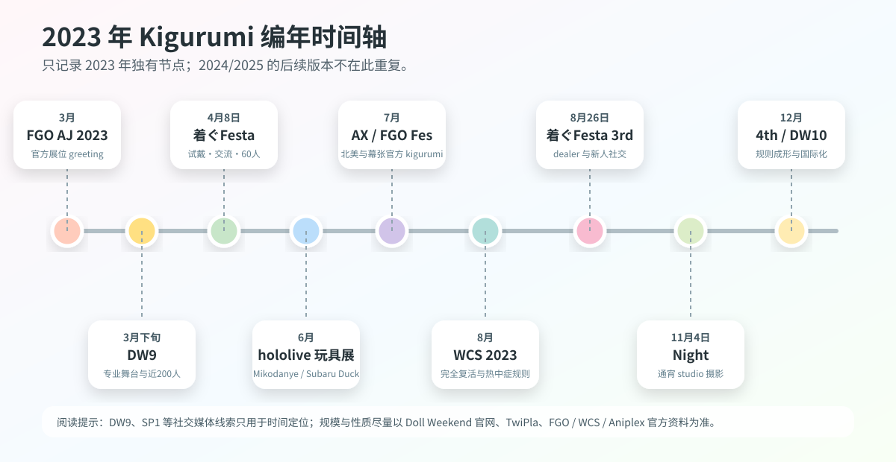
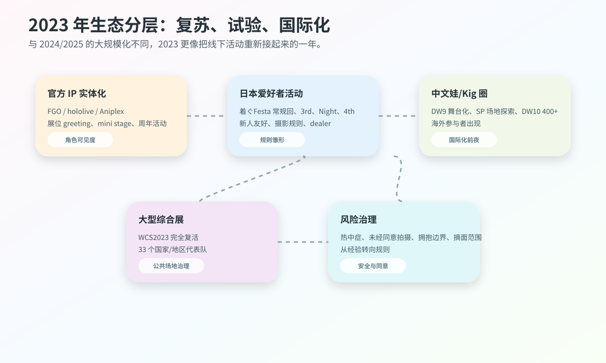
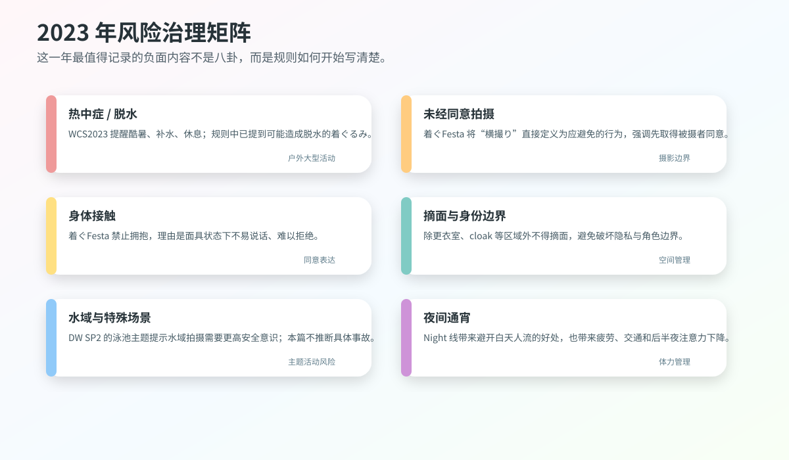
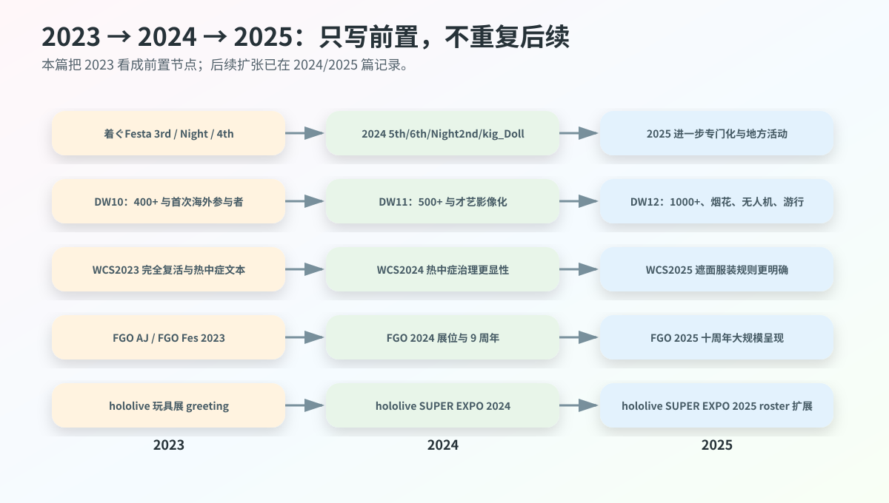

# 2023 年 Kigurumi 编年史

> 编写口径：本篇承接《2025 年 Kigurumi 编年史》与《2024 年 Kigurumi 编年史》的结构，但**不重复 2024、2025 已经记录过的活动版本、规则更新和产业扩展**。同一系列活动若 2023 年已经出现前置版本、独立规则、规模节点或首次变化，则记录其 2023 年状态；若只是后续年份已经详写的背景说明，本篇只做压缩说明。

---

## 0. 资料边界、去重原则与可信度说明

这份 2023 年编年史中的 **kigurumi** 仍按前两篇的广义口径整理：包括 animegao kigurumi / 美少女着ぐるみ / 面具型角色扮演、doller、中文“娃 / Kig / Kiger”线下活动、官方 IP 吉祥物式着ぐるみ greeting、以及大型 cosplay 活动中涉及全头套、遮面、热中症、摄影同意的规则文本。2025 篇已经详细解释术语，本篇不再重复长篇定义，只在必要处区分“官方 mascot greeting”“爱好者 kigurumi 活动”“中文 Doll Weekend 娃展”“主流 cosplay 大会规则”四类资料。

本篇采用公开资料优先原则。高可信资料包括 FGO、WCS、hololive、Aniplex、Doll Weekend 与 TwiPla 活动页；媒体报道用于补充现场规模、角色数量和展位安排；X / Twitter、Facebook、Bilibili、YouTube 等社交平台只用于辅助判断时间线或活动氛围，不作为未经验证指控的依据。匿名爆料、私域群聊、已删除帖、传闻截图不列入事实记录。

2024、2025 已整理过的内容，本篇按以下规则去重：

| 去重类型 | 2023 篇处理方式 |
|---|---|
| 同一系列活动在 2024/2025 继续举办 | 只写 2023 的前置版本、当年规则、当年规模，不重复后续年细节 |
| 2025 已解释的 kigurumi 术语 | 仅保留必要口径，不再重复长篇定义 |
| 2024/2025 已写的 WCS 热中症、遮面规则 | 只写 2023 年已经出现的前置文本与“完全复活”背景 |
| 2024/2025 已写的 Doll Weekend 11/12 | 只写 DW9、SP1、SP2、DW10 与 2023 国际化前夜 |
| 官方 IP greeting 在后续年继续存在 | 只写 2023 年的展会版本和角色/数量变化 |
| 传闻与人物争议 | 不复述未核实指控，只记录公开规则中显示的治理压力 |

---

## 1. 2023 年总体脉络

2023 年不是 2024 年或 2025 年的缩小版，而是一个更基础的“恢复连接之年”。如果说 2024 年是专门活动成形、知识生产集中、风险治理显性化的一年，2025 年是规模化与跨境化进一步加速的一年，那么 2023 年的关键词更接近：**疫情后线下复苏、同好活动规则化、官方 IP greeting 稳定回归、中文娃圈进入国际化前夜**。

第一条主线是日本爱好者活动的重启与规则雏形。公开资料显示，着ぐFesta 在 2023 年 4 月、8 月、11 月、12 月均留下可检索活动页：4 月常规回已经有 60 名公开报名参与者、面具展示与试戴、白黑背景摄影；8 月 3rd 开始更明确地强调“新人友好”“着ぐるみさんは話せない”带来的社交障碍；11 月 Night 尝试通宵 studio 摄影；12 月 4th 则把横撮り禁止、拥抱禁止、长物禁止、除更衣室/クローク外不得摘面、摄影讲习、dealer 参加等内容写得更系统。这说明 2023 年日本 kigurumi 小型活动已经从“办一个能聚的场”转向“把交流、摄影和身体边界写成规则”。

第二条主线是官方 IP 的实体化继续出现在大型展会。FGO 在 AnimeJapan 2023 安排了 cosplayer / kigurumi greeting；FGO Fes. 2023 夏祭り中，媒体记录有 9 名官方 cosplayer 与 7 体 kigurumi 在 welcome road 等区域迎接观众；Aniplex of America 在 Anime Expo 2023 的 Entertainment Hall 展位安排 FGO mini stage，并写明会有 fan-favorite kigurumi appearances；hololive production 则在东京おもちゃショー 2023 出展，并于一般公开日安排“みこだにぇー”“スバルドダック”的 kigurumi greeting。这条线和 animegao 爱好者并不完全相同，但它让“二次元角色以全头套/吉祥物身体出现在现场”持续进入普通观众视野。

第三条主线是中文 Doll Weekend 体系从舞台化走向国际化。2025 篇已经写过 DW12 的千人级、烟花、无人机和游行；2024 篇写过 DW11 的 500+ 与才艺影像化；本篇只记录 2023 年前置：DW9 的“舞台之光”页面写明首次配备专业舞台与大屏幕、近 200 名参与者；SP1 前往河源探索场地并拍摄 DW10 宣传片；SP2 以“娃娃泳池大战”为主题；DW10 于 2023 年 12 月在广东佛山举办，官方页面写明首次迎来海外参与者，人数突破 400 人，成为多元文化交汇的国际性娃娃交流平台。

第四条主线是主流 cosplay 大会的恢复与安全规则。WCS 2023 被官方宣传为“完全复活”，活动在 8 月 4—6 日于名古屋/爱知举办；外务省资料记录当年有 33 个国家和地区代表队参加世界 cosplay championship。WCS 2023 的规则页虽然不像 2025 那样把 kigurumi、gawa-cos、doller、全脸面具等遮面类别单列得非常清楚，但已经在服装小道具规则中写到：过度暴露、过尖、过长、难以行走，或可能导致脱水的着ぐるみ类，工作人员可判断拒绝。热中症预防页面也提醒 2023 年活动日预计酷暑，要求补水、休息、冷却与体调管理。

因此，2023 年的 kigurumi 年度位置可以概括为：**它不是规模最大的年份，却是很多后续扩张的前置年份。**着ぐFesta 的规则化、DW10 的国际化、WCS 的完全复活、FGO/hololive/Aniplex 的官方 greeting、以及热中症与摄影同意问题的公开文本，都在为 2024 和 2025 的更大规模、更明确制度铺路。

---

## 2. 2023 年编年史

### 3 月 25—26 日：FGO × AnimeJapan 2023——官方 cosplayer / kigurumi greeting 的展位化回归

2023 年 3 月 25—26 日，Fate/Grand Order 在东京 Big Sight 的 AnimeJapan 2023 出展。官方页面写明，FGO 展位位于东京 Big Sight 东展示栋东 4 Hall J62，展位内容包括英灵召唤 photo studio、宝具展示、官方商品销售，以及“コスプレイヤー･着ぐるみグリーティング”。这条记录是 2023 年官方 IP kigurumi 线的重要开端，因为它不是单独一只吉祥物临时出现，而是被写入大型展会的展位运营内容。[[S1]](#s1)

AnimeJapan 的特点在于观众成分广、展位密度高、摄影需求强。FGO 把 kigurumi greeting 放在展位信息中，说明角色实体化已经成为展位体验的一部分。观众来到 FGO 展位，能看到道具、展板、商品、舞台信息，也能遇到官方 cosplayer 与 kigurumi。对 IP 运营来说，这种安排把手机游戏从屏幕延展到会场空间；对 kigurumi 史来说，它证明“官方角色人偶/全头套互动”在 2023 年仍是主流动漫展的常规工具之一。

它与爱好者 animegao kigurumi 有明显区别。FGO 展位的 kigurumi 是官方授权与运营方管理下的角色呈现，动作、互动边界、排队秩序与摄影时间都服从展位管理；爱好者 kigurumi 更强调个人角色扮演、拍摄作品、同好交流和身体表达。两者不能混为一谈，但在普通观众眼中，它们共同塑造了“二次元角色可以以全头套身体出现在现实”的认知。

与 2024、2025 的 FGO 活动相比，AnimeJapan 2023 的意义是“恢复与展位化”。2025 篇已经记录 AnimeJapan 2025 与 FGO Fes. 十周年的更大规模，本篇只保留 2023 节点：它把官方 greeting 放在年初大型展会中，为后续 FGO Fes. 2023 的周年呈现形成前奏。

### 3 月下旬前后：Doll Weekend 9「舞台之光」——中文娃/Kig 圈的舞台化节点

Doll Weekend 9 的官方页面将其主题写作“舞台之光”，地点为广东广州，并说明这是 DW 首次配备专业舞台与大屏幕，为娃娃们的才艺展示提供焦点，参与规模近 200 人。公开 X 索引显示 Doll Weekend 官方账号在 2023 年 3 月下旬发布过“Welcome to Doll Weekend 9!”并使用 #doll_weekend9 与 #kigurumi 标签；由于官网页面本身未列精确日期，本篇将其写作“3 月下旬前后”而不强行写具体日。[[S2]](#s2)[[S3]](#s3)

DW9 是 2023 年中文娃/Kig 圈从普通聚会走向舞台化的重要节点。它的关键词不是“人数最多”，而是“专业舞台与大屏幕”。这意味着活动不再只围绕摄影师与单个 kiger 展开，而开始让参与者进入可观看、可展示、可记录的集体舞台环境。舞台与大屏幕能把角色表演、走秀、才艺、集体亮相放大给现场观众，也让活动影像更容易被二次传播。

舞台化对 kigurumi/doll 文化有双重影响。正面看，它把“娃”从静态拍照对象推进到表演主体：角色动作、步态、定点、舞台灯光、观众反应都开始影响作品效果。负面或风险看，舞台也会放大体力消耗、视野限制、上下台安全、灯光温度、音乐节奏和道具失误。尤其对于戴头壳、视线受限、可能无法清楚听见工作人员指令的表演者来说，舞台并不是普通 cosplay 走秀的简单复制。

把 DW9 写入 2023 编年史，是为了说明 DW10 的 400+ 和海外参与者并非凭空出现。DW9 的舞台化，是中文圈在 2023 年已经开始把 kigurumi/doll 活动做成“可展示的节目”的证据。2024 DW11 的才艺殿堂与全程录制、2025 DW12 的庆典化，都能在 DW9 的专业舞台逻辑中找到前史。

### 4 月 8 日：着ぐFesta 2023 常规回——面具试戴、白黑背景与 60 名公开参与者

2023 年 4 月 8 日，着ぐFesta 在荒川区サンパール荒川小ホール举办常规交流活动。TwiPla 页头显示日期为 2023 年 4 月 8 日 10:00，活动标题为“着ぐFesta！ 着ぐるみさんと着ぐるみ好きさんの交流イベント”。页面说明活动源于“也想要一个无需预约、能轻松来玩的活动”的声音，会场是可容纳约 300 人、可举办婚礼等活动的大厅；主办方为 GarageStudioC7。页面还写明会场楼层包场，hall 与 entrance 都可供 kigurumi 使用，舞台和乐屋作为更衣室与 cloak，且设有女性更衣室。公开报名处显示参加者 60 人。[[S4]](#s4)

这场活动的重要性在于它把 2023 年日本 kigurumi 爱好者活动的几个基础需求同时呈现出来：交流空间、更衣空间、摄影背景、面具试戴、maker 咨询和新人进入。页面写到，运营方还不完全把握参与者想要什么服务，因此没有准备太多大型企划，希望通过参与者反馈在以后准备内容；但同时，页面又已经安排了合作个人制作者面具展示与试戴，并称这是 GarageStudioC7 “试して相談して気軽にお迎えできる”目标的第一步。[[S4]](#s4)

这段文本很有史料价值。它说明 2023 年的着ぐFesta 还在探索活动形态，不是从一开始就拥有成熟流程。面具试戴与咨询尤其关键，因为 animegao kigurumi 的入门门槛很高：新人很难只通过照片判断头壳大小、视线、内部空间、佩戴稳定性、假发搭配、脸型比例和肤色衣效果。能够在活动中试戴、看实物、咨询 maker，相当于把原本分散在私聊、订单和经验帖中的知识搬到线下。

白黑背景摄影也是一个小但重要的基础设施。kigurumi 造型常常需要更干净的背景和可控光线来突出角色线条，尤其是大头壳、假发、裙摆、肤色衣和鞋的比例。如果只在公共会场随手拍，背景杂乱、路人入镜、地面反光、灯色偏差都会影响效果。着ぐFesta 4 月回把背景、试戴与交流放在同一空间，说明社群已经在同时处理“新人入门”和“作品产出”两个需求。

这场活动和 2024 年着ぐFesta 5th/6th 的差异也很明显。2024 篇已经写过后续规则更成熟，本篇只记录 2023 4 月回的“探索状态”：它已经有 60 名公开参与者与初步服务，但仍在通过参与者反馈寻找活动方向。正是这种探索，才让 8 月 3rd、11 月 Night、12 月 4th 能继续细化规则。

### 6 月 8—11 日：hololive production × 东京おもちゃショー 2023——官方 mascot 进入玩具/家庭向场域

2023 年 6 月 8—11 日，hololive production 在东京 Big Sight 举办的“东京おもちゃショー 2023”出展。电撃ホビーウェブ报道写明，这是 hololive production 首次出展该活动；东京おもちゃショー由日本玩具协会主办，是日本国内最大规模的玩具展示会，前两日面向商务相关人员，后两日为儿童、家庭等一般观众公开。报道还写明，hololive production 会在一般公开日 6 月 10 日、11 日于展位实施 kigurumi greeting，登场角色为“みこだにぇー”和“スバルドダック”，各日 11:00、13:00、15:00 登场，每回约 30 分钟。[[S5]](#s5)

这一节点与 2024/2025 hololive SUPER EXPO 的意义不同。SUPER EXPO 是 hololive 自身的大型粉丝活动，观众本来就高度理解 VTuber 与角色衍生物；东京おもちゃショー则是玩具行业和家庭向场域，观众中有商务人士、儿童、家长和普通玩具消费者。hololive 在这里安排 kigurumi greeting，说明官方 mascot 并不只服务核心粉丝，也能作为品牌向大众解释自身世界观的入口。

从 kigurumi 编年史角度看，这类 greeting 的意义在于“跨场域可见”。它并非 animegao 爱好者活动，但它让更多非核心二次元观众接触到“角色通过全头套/吉祥物身体与人互动”的形式。みこだにぇー、スバルドダック这类角色本身带有二次创作、梗文化、吉祥物和 VTuber 生态的混合属性，放到玩具展中会进一步模糊虚拟角色、玩偶、mascot、cosplay 和 kigurumi 的边界。

这也解释了为什么 2023 编年史不能只写爱好者聚会。外部社会认识 kigurumi 的路径并不单一：有人从 FGO 展位看到官方 kigurumi，有人从 hololive 玩具展看到 mascot greeting，有人从 Doll Weekend 视频看到中文“娃”，有人从着ぐFesta 接触 animegao 同好。2023 年这些路径并行存在，为 2024/2025 的更高可见度打下基础。

### 6 月下旬前后：Doll Weekend Special 1「初遇河源」——场地探索与 DW10 宣传片前置

Doll Weekend Special 1 的官方页面标题为“初遇河源”，地点为广东河源。页面说明：为了探索更多娃娃活动举办地，Doll Weekend 首次前往河源，拍摄了 DW10 宣传片。公开 X 链接显示官方账号在 2023 年 6 月下旬发布过 SP1 合照相关内容；由于官网页面未列完整年月日，本篇以“6 月下旬前后”记录，并只把 X 线索作为时间定位辅助。[[S6]](#s6)[[S7]](#s7)

SP1 的意义不在于人数或舞台规模，而在于“场地探索”。对 kigurumi/doll 活动来说，场地并不是可随意替换的背景。一个适合普通人拍照的酒店、景区、咖啡馆或度假空间，不一定适合头壳玩家：更衣是否隐蔽、空调是否足够、头壳箱能否寄放、动线是否有楼梯、地面是否打滑、是否允许长时间摄影、是否会有大量无关游客、是否能安排休息室，都会影响活动可行性。

河源在 2025 年 DW12 中成为重要地点，但 2025 篇已经记录了 DW12 的千人级、烟花、无人机和游行，本篇只记录 SP1 作为 2023 前置。官方页面写明 SP1 是为探索更多举办地并拍摄 DW10 宣传片，这说明 Doll Weekend 体系在 2023 年已经不满足于固定城市与常规展会，而开始寻找更有画面感、更适合影像传播和后续扩展的空间。

这类“前置拍摄”也代表活动品牌化。普通同好聚会结束后也会有照片，但为下一届活动拍宣传片意味着主办方已经开始主动塑造活动叙事：不是“我们又聚了一次”，而是“下一次活动将是什么主题、什么城市、什么视觉氛围”。2023 年的 SP1 因此应被视为 DW10 国际化之前的品牌铺垫。

### 夏季阶段：Doll Weekend Special 2「娃娃泳池大战」——水域主题与安全想象

Doll Weekend Special 2 的官方页面标题为“娃娃泳池大战”，地点为广东广州，页面写道“炎炎夏日，泳池里怎么能少了娃？”并列出 Bilibili 活动影像、合照和现场照片等内容。官网未列具体日期，因此本篇只将其归入 2023 年 DW10 前的“夏季阶段线索”，不写具体日。[[S8]](#s8)

SP2 是一个非常不同于大厅、舞台和普通摄影会的主题。泳池、水边、夏季休闲空间，本来就很容易产生视觉吸引力：反光、水面、泳池蓝、度假风、夏日服装都能让角色照片更有季节感。但对于 kigurumi/doll 玩家来说，水域主题也天然带有更高风险。头壳、假发、紧身衣、鞋底、填充材料和角色服装一旦接触水或湿滑地面，行动难度与摔倒风险都会上升；水边拥挤、摄影器材、围观者和温度也会放大问题。

本篇不推断 SP2 现场是否发生过具体安全问题，因为公开页面没有列出事故或负面记录；但从年度编年史角度看，它值得作为“主题扩展”事件记录。2025 篇曾写到 Lagucos / WCS 周边规则禁止 kigurumi 风格服装入水；2023 SP2 则从另一个角度说明，中文娃圈已经在尝试把 kigurumi/doll 场景带入水域或夏季休闲主题。两者不矛盾：一个是活动创意，一个是安全治理。成熟社群需要同时记录创意与风险。

SP2 也证明 Doll Weekend 在 2023 年已经不仅是“展会大厅 + 合照”。它在 DW9 舞台化、SP1 场地探索、SP2 泳池主题、DW10 国际化之间形成了一条连续试验线：舞台、城市、场景、水域、影像传播。2024/2025 的大规模节庆化，正建立在这些 2023 年的实验上。

### 7 月 1—4 日：Anime Expo 2023 与 Aniplex / FGO kigurumi mini stage——北美官方 IP 线的可见节点

2023 年 7 月 1—4 日，Aniplex of America 参加洛杉矶 Anime Expo 2023。Aniplex 官方 PDF 新闻稿写明，它在 Exhibit Hall 有 Booth #1800，在 Entertainment Hall 有 Booth #E-14；其中 Booth #E-14 会展示 Fate/Grand Order，并设有 mini stage，观众可看到 fan-favorite kigurumi appearances。Aniplex 官网页面也记录了 AX 2023 的日期、两个展位位置，以及 FGO 6th Anniversary x TYPE-MOON Projects 等活动安排。[[S9]](#s9)[[S10]](#s10)

这条北美线与 2025 篇记录的 Anime Expo 2025 Aniplex kigurumi 一脉相承，但本篇只写 2023 年版本。它的意义在于：FGO kigurumi 不只在日本展会存在，也出现在北美最大级别动漫展的官方展位。AX 的观众规模、商业强度、社交媒体传播能力都很高，FGO mini stage 上的 kigurumi appearances 会把官方角色实体化带给大量英语圈观众。

北美展会中的 kigurumi 还有另一个特殊点：英语语境里 “kigurumi” 经常被误解为连体睡衣，因此官方新闻稿直接使用 kigurumi appearances，本身就会让部分观众重新理解这个词。FGO 的官方 kigurumi 与 animegao 玩家不同，但它会影响普通观众对“会动的二次元角色身体”的认知。观众可能不知道 animegao、doller、gawa-cos 的差别，却会先在官方展位遇到 kigurumi。

从 2023 年年度史看，Anime Expo 2023 补足了日本和中国以外的公开线索：FGO 在日本 AnimeJapan、幕张 Fes.、美国 AX 都使用了 kigurumi / mascot 身体。也就是说，2023 的 kigurumi 可见度并不是单一区域现象，而是通过 IP 展位运营进入跨国粉丝场域。

### 7 月 29—30 日：FGO Fes. 2023 夏祭り ～8th Anniversary～——9 名官方 cosplayer 与 7 体 kigurumi 的周年呈现

2023 年 7 月 29—30 日，Fate/Grand Order Fes. 2023 夏祭り ～8th Anniversary～ 在幕张 Messe 举办。GAME Watch 报道写明，会期为 7 月 29、30 日，时间 9:00 至 18:00，地点为幕张 Messe 国际展示场 9—11 Hall。Inside Games 的现场报道则写明，在 welcome road 上，观众伴随映像演出和 BGM 入场，由官方 cosplayer 与 kigurumi 迎接；此次报道对象包括总计 9 名官方 cosplayer 与 7 体 kigurumi。[[S11]](#s11)[[S12]](#s12)

这场活动是 FGO 2023 官方 kigurumi 线中最强的年度节点。AnimeJapan 2023 更像展位运营，FGO Fes. 2023 则是周年庆典。周年活动的沉浸感更强，welcome road 的红毯、大屏幕、BGM、官方 cosplayer 与 kigurumi 共同构成“进入迦勒底/进入祭典”的现场体验。对粉丝而言，这不是简单合影，而是用角色身体把游戏世界临时搬到幕张。

Inside Games 还提到“光のコヤンスカヤ”和“バーヴァン・シー”的 cosplayer 初登场，并将报道定位为官方 cosplayer 与 kigurumi 的 photo report。这说明 FGO 的角色呈现分层已经很成熟：真人 cosplayer 负责部分角色的人形再现，kigurumi 负责吉祥物或更适合全头套身体表现的角色，二者共同形成展会入口气氛。对 kigurumi 编年史而言，7 体 kigurumi 不是孤立数字，而是官方展会把“多只角色身体同时出现”变成可观看场景的证据。[[S11]](#s11)

与 2024 年 9 周年、2025 年 10 周年相比，2023 的关键词是“夏祭り”和“8th Anniversary”。本篇不重复后续年人数或角色变化，只记录 2023 年已经形成的结构：FGO 在日本国内大型周年活动中以多体 kigurumi 与官方 cosplayer 共同迎接观众，角色实体化不再只是展位附属，而是周年庆典体验的重要组成。

### 8 月 4—6 日：World Cosplay Summit 2023——“完全复活”与热中症治理的前置文本

2023 年 8 月 4—6 日，World Cosplay Summit 2023 在爱知县名古屋市举行。WCS 官方 PR Times 新闻稿将这一年称为“完全復活”，并说明疫情前通过世界各地预选赛来日的代表 cosplayer 是 WCS 最大特征之一；2022 年因入境限制等原因代表国家数仍有限，而 2023 年预计来自 33 个国家和地区。日本外务省页面也记录，2023 年第 21 届 WCS 于 8 月 4—6 日在名古屋举行，世界 cosplay championship 中有 33 个国家和地区代表队参赛，英国队获得冠军并获外务大臣奖。[[S13]](#s13)[[S14]](#s14)

WCS 2023 对 kigurumi 的意义并不在于它举办了专门 kigurumi 聚会，而在于它代表主流 cosplay 大会恢复公共空间与国际交流。大型主流活动恢复后，kigurumi、全头套、厚重服装、遮面服装、长物道具、摄影同意、热中症、路人入镜等问题都会重新变得现实。2023 年 WCS 的公共性尤其强：官方规则开头即提醒，会场是公共场所，普通来场者和通行人也会在场，参与者应注意不干扰一般游客和店铺。

WCS 2023 规则页已经把热与身体负担写入服装管理。衣装・小道具・更衣条目中写明，过度暴露、先端过尖、衣摆过长导致步行困难，或“脱水症状になる可能性のある着ぐるみ類”等过度服装，工作人员可判断要求参加者避免。摄影交流条目也要求不要长时间占用拍摄地点，不要进行下着可见 pose 或过度低角度拍摄，不要未经被摄者同意拍摄。[[S15]](#s15)

WCS 2023 的热中症预防页面则更具体。页面提醒 2023 年活动日预计酷暑，要求参与者补水、频繁休息、使用冷却用品、强日照时不要勉强参加，体调不良时联系巡回工作人员。这些内容在 2024、2025 继续变得更显性，但 2023 已经把夏季 cosplay 与身体风险联系起来。对 kigurumi 表演者来说，这类规则尤其重要，因为头壳、假发、紧身衣、填充和角色鞋会削弱散热与行动能力。[[S16]](#s16)

因此，WCS 2023 是一个“前置规则节点”。它不像 2025 规则那样明确列出 kigurumi、gawa-cos、doller、全脸面具、头盔等遮面服装的参与条件，但它已经把着ぐるみ类可能导致脱水、摄影必须获得承诺、公共场所不能扰民等基本问题写进制度文本。后续年份更明确的遮面规则与夏季安全治理，都可以追溯到 2023 年公共活动恢复后的实际压力。

### 8 月 26 日：着ぐFesta！3rd——“着ぐるみさんは話せない”被写入活动理念

2023 年 8 月 26 日，着ぐFesta！3rd 在荒川区サンパール荒川小ホール举行。TwiPla 页头显示日期为 2023 年 8 月 26 日 10:00，标题为“着ぐFesta！3rd 着ぐるみさんと着ぐるみ好きさんの交流イベント”。页面延续了“无需预约、轻松参加、300 人大厅交流”的定位，并特别写明：活动初体验的 kigurumi 玩家也应该能开心回家，没有 kigurumi friends 的 solo 玩家可以来交朋友，熟练玩家看到这类新人与氛围时也希望积极沟通。[[S17]](#s17)

3rd 页面最值得记录的一句话，是对社交困难的解释。主办方写到，很多人看到 X 上活动很开心，于是想去活动，但到现场没有认识的人；想找人交流时又会遇到“着ぐるみさんは話せない”这一最大弱点，结果可能只能远远看着热闹后难过离开。主办方明确说，这个活动就是从“想解决这种问题”出发。[[S17]](#s17)

这句话之所以重要，是因为它把 kigurumi 的社交机制说得很清楚。外部观众常把 kigurumi 视为视觉奇观，但参与者真正面对的困难往往是交流：角色状态下无法正常说话，视线也不一定准确；对方不知道你是否愿意被拍、是否能听见、是否看见、是否想休息；新人也可能因为没有熟人而无法融入。着ぐFesta 3rd 把这个问题写在活动页上，等于承认 kigurumi 活动需要主动设计社交入口，而不能只靠“大家自然熟”。

3rd 还开始出现更清晰的产业/资源流动。页面写明欢迎 kigurumi 相关 dealer 参加，口径包括面具 dealer、衣装综合取扱业者、同人志销售等，并列出 CLS 参加，称其从 mask 到肌タイツ、衣装都可咨询。页面也设置了免费衣物放出、白黑背景摄影，并说明背景相比前回更大、更易使用。公开报名显示参加者 36 人。[[S17]](#s17)

和 4 月回相比，8 月 3rd 的人数看似更少，但规则与叙事更成熟。4 月回像是在摸索参与者需要什么；3rd 则已经更明确地说出新人困境、交流目标、dealer 参加和摄影基础设施。它是 12 月 4th 规则完善的前一站，也是 2024 年 5th/6th 的直接前史。

### 11 月 4—5 日：着ぐFesta！Night——通宵 studio 摄影活动与封闭场地规则

2023 年 11 月 4 日晚，着ぐFesta！Night 在 Chrome Studio 川口举办。TwiPla 页头显示开始时间为 2023 年 11 月 4 日 21:30，页面称其为特别 studio shooting event，活动时间为 21:30 至翌日 7:30，地点为 Chrome Studio 川口全馆租用，费用 4000 日元，完全预约制且不接受当日参加。公开报名状态显示参加者 22/30 人。[[S18]](#s18)

Night 的意义在于它与常规着ぐFesta 走了不同路线。常规回强调无需预约、当日参加、交流优先，Night 则是完全预约制、人数上限、studio、通宵摄影。这种差异说明 2023 年日本 kigurumi 爱好者活动已经分化出两类需求：一类是新人友好与社交进入，另一类是更安静、更可控、更适合拍摄作品的封闭场地。通宵 studio 避开了白天公共空间的人流，也给了长时间拍摄与换装的可能。

但通宵并不意味着风险更低。kigurumi 表演者长时间佩戴头壳、假发、紧身衣和角色鞋，体力消耗会持续累积；后半夜注意力下降、补水不足、交通返程、睡眠不足都会影响安全。页面还特别提到女性更衣室需事前联系，说明 studio 场地安排也有协议和空间限制，不是所有需求都能现场临时处理。[[S18]](#s18)

Night 的规则文字与后续着ぐFesta 规则高度一致。页面禁止横撮り，要求先取得被摄者同意；禁止拥抱，理由是 kigurumi 状态下意思表示困难，可能发生无法拒绝过度接触的问题；禁止挥舞长物；禁止在更衣室和 cloak 以外摘面；并给出相机基础建议，如不要用 50mm 以下短焦距拍近景，避免广角导致头变形，若使用手机可退远后放大。[[S18]](#s18)

这段相机建议是 2023 年少见的“技术考究型”资料。它说明活动主办方不仅管秩序，也在试图提升 kigurumi 摄影质量。kigurumi 面具和角色比例对镜头焦段非常敏感，广角近拍会放大头部、压缩身体，让本来就夸张的角色比例变得失衡；而合适距离和焦段能更接近二次元角色的视觉逻辑。Night 因此不是普通夜间活动，而是把摄影技术、同意规则、通宵体力和封闭场地管理结合到一起的实验。

### 12 月 9 日：着ぐFesta！4th——摄影同意、拥抱禁止与 dealer 体系进一步成文

2023 年 12 月 9 日，着ぐFesta！4th 在荒川区サンパール荒川小ホール举办。TwiPla 页面写明活动时间为 10:00 至 16:00，地点仍为サンパール荒川小ホール，主办为 GarageStudioC7，参加条件为 kigurumi 参与者与喜欢 kigurumi 的人，即使没有自己的 kigurumi 也可参加。页面也再次写明，过往在其他活动等引起问题者或可能引起问题者请勿参加，且主办方可能不解释具体理由。公开报名显示参加者 37 人。[[S19]](#s19)

4th 是 2023 年着ぐFesta 规则化最清晰的一次。页面在活动内容中说明，它不是追求“撮れ高”的活动，而是希望 kigurumi 之间能交流、让新人开心回家。随后列出规则：横撮り禁止，即在别人拍摄时从旁边未经许可拍摄；即便被摄者能看到，也必须取得同意，否则属于偷拍。页面还指出，未经目线配合的照片往往并不好看，并且会让 kigurumi 表演者可怜。[[S19]](#s19)

拥抱禁止的理由也写得很具体：穿 kigurumi 的人与不穿的人之间，每个人距离感不同；但 kigurumi 表演者无法说话，意思表示困难，可能无法拒绝过度接触，因此为防止纠纷需要禁止拥抱。这个规则非常重要，因为它把“可爱角色可以随便抱”的外部误解直接纠正为“角色身体仍属于参与者本人，接触必须以清楚同意为前提”。[[S19]](#s19)

4th 还禁止挥舞长物，理由是参与人数随回数增加，虽然会场很宽，但道具脱手等意外可能导致受伤；同时规定除更衣室和 cloak 外不得摘面，因为即便楼层基本不对普通参与者开放，也可能有设施职员进入，不能只靠个人判断。这个规则显示 2023 年的 kigurumi 活动已经在处理“角色形象”“隐私”“设施职员”“公共责任”之间的关系。[[S19]](#s19)

在正面建设上，4th 延续并强化了摄影和 dealer。页面写明有工作人员摄影服务，照片后续会汇总上传，并说明拍摄照片可能在 SNS 公开；页面还称 3rd 中受到好评的“着ぐるみさんの撮り方講習”将一天两回举行，面向“有单反但大概随便拍”的人讲相机基础；同时继续欢迎 kigurumi mask dealer、服装业者、同人志等参加，CLS 再次出展。白黑背景也进行了高度提升，以防低角度拍摄时穿帮，但同时提醒支柱不要依靠。[[S19]](#s19)

这场活动可以看作 2023 年日本小型 kigurumi 交流活动的年末总结。它把 4 月回的试戴、8 月 3rd 的新人社交、11 月 Night 的摄影规则与技术建议，整理成更清晰的常规活动文本。2024 年的着ぐFesta 5th/6th 继续沿用并扩展这套逻辑，因此本篇只记录 2023 年 4th 的“规则成文”意义，不重复 2024 后续。

### 12 月：Doll Weekend 10「国际舞台」——400+、首次海外参与者与中文娃圈国际化节点

Doll Weekend 10 官方页面显示，该活动主题为“国际舞台”，时间为 2023 年 12 月，地点为广东佛山。页面写明：DW10 首次迎来海外参与者，人数突破 400 人，Doll Weekend 正式成为一个多元文化交汇的国际性娃娃交流平台。官网还列出“DW10 正片：首次面向全球的娃娃大展”和“DW10 预告：二次元娃娃在三次元开了个咖啡馆”等影像内容，并有大合影、现场照片、看板娘、周边等图集分类。[[S20]](#s20)

DW10 是 2023 年中文 kigurumi/doll 圈最重要的可确认节点。它与 DW9 的区别非常明确：DW9 强调专业舞台与近 200 人，DW10 则强调海外参与者、400+ 规模与国际性。参与者数量从近 200 到突破 400，代表活动已经不只是本地玩家聚会，而是具备跨区域动员、场地承载、摄影组织、展商/周边/看板娘/影像传播的综合能力。

“首次迎来海外参与者”尤其关键。kigurumi/doll 文化长期存在跨国观看：日本、欧美、中国玩家会在 X、YouTube、Bilibili、论坛、个人站相互看到作品。但“看到”不等于“线下共同参加”。DW10 使海外参与者进入中文圈活动现场，意味着语言、旅行、住宿、器材运输、现场接待、拍摄习惯和文化理解都开始进入同一场活动。2025 年 Doll Weekend × First Klass 日本企划和 DW12 的国际化叙事，都可以追溯到 DW10 的这个节点。

DW10 也说明中文圈已经把活动影像当成核心资产。官网页面不是简单列出文字公告，而是把正片、预告、B站、图集、看板娘、周边都放在同一活动页面中。对 kigurumi/doll 活动来说，影像记录非常重要：很多角色只有在动作、群体场景、合照、舞台和互动中才能体现“活起来”的效果。DW10 通过官方影像把活动从一次线下聚会变成可传播的年度事件。

与 2024 DW11、2025 DW12 相比，DW10 的历史定位应写成“国际化前夜的真正门槛”。它还没有 DW12 的千人级、烟花、无人机和游行，也没有 DW11 的才艺全程录制主题；但它完成了 400+、海外参与者、佛山活动页面、影像和跨文化定位。2023 年没有 DW10，后两年的扩张就缺少一个清晰的阶梯。

---

## 3. 2023 年主要人物、组织与场域索引

### GarageStudioC7 / 着ぐFesta

2023 年日本爱好者活动线的核心公开组织。4 月常规回、8 月 3rd、11 月 Night、12 月 4th 都由 GarageStudioC7 相关账号或 TwiPla 页面记录。其年度价值在于：通过可容纳约 300 人的大厅、studio 夜间摄影、面具展示试戴、白黑背景、摄影讲习、dealer 参加、免费衣物放出等方式，把小型 kigurumi 活动从“拍照聚会”推进到“新人友好 + 规则文本 + 技术传播 + 资源交换”的综合形态。[[S4]](#s4)[[S17]](#s17)[[S18]](#s18)[[S19]](#s19)

### Doll Weekend

2023 年中文娃/Kig 圈最重要的活动品牌。DW9 的专业舞台与近 200 人、SP1 的河源探索、SP2 的泳池主题、DW10 的 400+ 与首次海外参与者，构成 2023 年的连续扩张线。Doll Weekend 官网将自己定位为全球最大、属于娃娃和创作者们的线下产业盛会；这个定位在 2024/2025 得到进一步放大，但 2023 年 DW10 已经显现其国际化与影像化趋势。[[S2]](#s2)[[S6]](#s6)[[S8]](#s8)[[S20]](#s20)[[S21]](#s21)

### Fate/Grand Order / Aniplex / FGO PROJECT

2023 年官方 IP kigurumi 线的主要代表。FGO 在 AnimeJapan 2023 安排 cosplayer / kigurumi greeting；FGO Fes. 2023 以 9 名官方 cosplayer 与 7 体 kigurumi 在周年场景中迎接观众；Aniplex of America 在 Anime Expo 2023 的 FGO 展位 mini stage 也安排 fan-favorite kigurumi appearances。FGO 线的重要性在于，它把 kigurumi / mascot 身体放在日本与北美的大型 IP 活动中，持续塑造普通观众对角色实体化的认识。[[S1]](#s1)[[S9]](#s9)[[S11]](#s11)

### hololive production / COVER Corp.

2023 年官方 VTuber mascot 线的重要代表。hololive production 首次出展东京おもちゃショー 2023，并在一般公开日安排“みこだにぇー”“スバルドダック”kigurumi greeting。与 2024/2025 hololive SUPER EXPO 相比，这一节点更特别：它发生在玩具行业与家庭向观众场域中，说明 VTuber 吉祥物式 kigurumi 不只服务核心粉丝，也进入更大众的玩具展示空间。[[S5]](#s5)

### World Cosplay Summit

2023 年主流 cosplay 国际活动恢复的标志。WCS 2023 被官方称为“完全复活”，外务省记录有 33 个国家和地区代表队参加。对 kigurumi 的直接意义在于，WCS 2023 规则已将可能导致脱水的着ぐるみ类列为工作人员可判断限制的服装类型，并对公共场地、摄影同意、低角度拍摄、长时间占位等作出要求。[[S13]](#s13)[[S14]](#s14)[[S15]](#s15)

### CLS 等 kigurumi 相关 dealer

着ぐFesta 3rd 与 4th 页面均提到 CLS 参加，页面称其可从 mask 到肌タイツ、衣装进行咨询。这类 dealer 不一定是全年最大事件，但对 2023 年生态很重要：它说明 kigurumi 活动现场已经出现“交流 + 制作/销售/咨询”的复合功能，玩家不只是来拍照，也可能在现场获得面具、肤色衣和服装的实际购买与制作建议。[[S17]](#s17)[[S19]](#s19)

---

## 4. 2023 年正面事件总账

### 1. 线下活动从疫情后状态恢复为可持续节奏

WCS 2023 被官方称为“完全复活”，33 个国家和地区代表队重新聚集名古屋；Doll Weekend 在 2023 年完成 DW9、SP1、SP2、DW10 等连续节点；着ぐFesta 在 4 月、8 月、11 月、12 月留下公开活动页。它们共同说明 2023 年不是零散恢复，而是多个地区同时重新建立线下节奏。

### 2. 新人友好被写成活动理念

着ぐFesta 3rd 和 4th 反复强调：没有 kigurumi friends 的 solo 玩家应该能来交朋友，活动的目标不是单纯“撮れ高”，而是让新人和老玩家都能交流。这种理念非常重要，因为 kigurumi 的社交门槛往往比服装制作门槛更隐蔽：表演者不能说话、听不清、视线不准、难以拒绝，都会影响新人的进入体验。

### 3. 摄影、拥抱、摘面、长物等边界开始具体化

2023 年着ぐFesta 的规则文本把“横撮り禁止”“ハグ禁止”“長物の振り回し禁止”“更衣室、クローク以外での面脱ぎ禁止”写得非常具体。它不是抽象的“请有礼貌”，而是直接对应 kigurumi 状态下的同意表达困难、被摄者目线、身体接触和隐私边界。WCS 2023 也从大型公共活动层面对摄影同意、低角度拍摄和服装风险作出规定。

### 4. 中文 Doll Weekend 完成 400+ 与首次海外参与者节点

DW10 是 2023 年中文圈最重要的正面节点之一。官方页面写明首次迎来海外参与者、人数突破 400，并将其定位为多元文化交汇的国际性娃娃交流平台。这个节点不是 2025 DW12 的重复，而是后续更大规模的基础门槛。

### 5. 官方 IP greeting 形成跨国可见度

FGO 在 AnimeJapan 与 FGO Fes.、Aniplex 在 Anime Expo、hololive 在东京おもちゃショー，都让 kigurumi / mascot 身体进入大型展会。它们虽然不是爱好者 animegao 活动，但会降低普通观众对全头套角色的陌生感，并让“角色实体化”成为二次元线下运营的一部分。

---

## 5. 2023 年负面事件与风险总账

### 1. 热中症与脱水风险被明确写入大型活动文本

WCS 2023 规则中已经出现“可能导致脱水的着ぐるみ类”这一表达，热中症预防页面也提醒活动日预计酷暑，要求补水、休息、冷却用品和不要勉强参加。这说明在 2023 年，夏季 cosplay 与 kigurumi 的身体风险已经不是私下经验，而是主办方规则的一部分。

### 2. 未经同意拍摄成为社群治理重点

着ぐFesta 4th 将横撮り禁止解释得非常明确：别人正在拍摄时从旁边拍照，即便被摄者能看见，也要先取得承诺，否则属于偷拍。WCS 2023 也要求不要未经被摄者同意拍摄。对 kigurumi 来说，这尤其重要，因为表演者无法像普通 cosplayer 一样快速用语言拒绝、解释或要求删除。

### 3. “可爱角色可以随便抱”的误解被规则化纠正

着ぐFesta 规则禁止拥抱，并说明 kigurumi 表演者不易说话、意思表示困难，可能无法拒绝过度接触。这不是小题大做，而是 kigurumi 文化走向公开活动后必须处理的身体边界问题。角色外形越可爱，外部观众越容易忘记里面仍然是现实参与者。

### 4. 特殊场景带来额外安全想象

Doll Weekend SP2 的泳池主题、着ぐFesta Night 的通宵 studio、WCS 的夏季户外公共空间，都代表 2023 年 kigurumi 活动已经不只在普通室内场地发生。每一种特殊场景都会带来新风险：水域有湿滑和服装吸水问题，通宵有疲劳与返程问题，户外夏季有中暑和路人动线问题。

### 5. 资料不完整本身也是编年史风险

2023 年资料的公开程度不如 2024/2025。有些 Doll Weekend 前置节点官网未列具体日期，需要用 X 链接或活动顺序辅助定位；部分社交平台内容未来也可能失效。因此本篇在时间不确定处使用“前后”“阶段”等表达，不把低可信线索写成确定日程。这种谨慎也是避免 2024/2025 去重时混淆事件的重要方法。

---

## 6. 2023 年考究事件：这一年真正变化了什么

### 官方 mascot 与爱好者 animegao 的边界更加需要说明

2023 年 FGO、Aniplex、hololive 的官方 greeting 很多，但它们与着ぐFesta、Doll Weekend 的爱好者/玩家活动不是同一回事。官方 mascot 由 IP 方管理，目标是展位体验、品牌传播和粉丝互动；爱好者 animegao / doller / Kiger 更强调个人角色扮演、摄影创作、社群交流和身体表达。2023 年的特殊之处在于，这两条线同时活跃，外部观众更容易把它们混为一谈。

### “不能说话”从隐性经验变成公开议题

着ぐFesta 3rd 与 4th 多次提到“着ぐるみさんは話せない”。这不是简单玩笑，而是 kigurumi 社交与安全的核心。不能说话会影响新人融入、拍摄同意、拒绝拥抱、说明体调不适、请求帮助、辨认路线、结束互动等所有环节。2023 年把这一点写进活动说明，是日本小型社群规则化的重要信号。

### Doll Weekend 的增长不是突然发生在 2025

2025 篇记录了 DW12 的千人级和庆典化，但 2023 DW10 已经突破 400 人并迎来海外参与者。DW9 的舞台与大屏幕、SP1 的场地探索、SP2 的泳池主题都说明中文圈在 2023 年已经尝试“舞台化、场景化、影像化、国际化”。2025 的大规模不是孤立爆发，而是 2023—2024 连续扩张的结果。

### WCS 2023 的“完全复活”使风险治理重新现实化

疫情期间许多大型活动受限，风险更多停留在小圈层；WCS 2023 完全复活后，公共场地、国际参与者、普通路人、摄影者、热中症、规则执行重新同时出现。对于 kigurumi 这类身体负担较高、视线与沟通受限的参与形式，主流大会恢复意味着机会增加，也意味着规则压力上升。

### 摄影技术开始成为活动内容

着ぐFesta Night 与 4th 都不只是“允许摄影”，而是主动提供拍摄服务、照片汇总、相机基础建议和摄影讲习。kigurumi 摄影不是普通人像摄影的简单替换：面具比例、头身关系、焦段、眼神方向、背景高度、裙摆、鞋与肤色衣都会影响最终效果。2023 年把摄影技法写进活动内容，是知识生产的早期迹象。

---

## 7. 2023 年传闻与争议处理原则

本篇没有列出 2023 年匿名论坛中的个人争议、私域群聊爆料或未核实截图。原因不是这些问题一定不存在，而是公开资料无法稳定验证。对于 kigurumi 这样小而高度依赖角色名、头壳外观、社交平台账号与线下身份的圈层，未经核实的点名很容易造成误认和二次伤害。

2023 年可公开记录的争议压力，主要体现在规则文本里：着ぐFesta 提到过去在其他活动引起问题者或可能引起问题者请勿参加，但不公开说明个案；同时又明确禁止横撮り、拥抱、挥舞长物和场外摘面。WCS 2023 则从大型公共活动角度写入热中症、摄影同意、低角度拍摄和服装风险。也就是说，2023 年真正可写入史料的，不是“某人怎样”，而是“哪些问题已经严重到主办方必须写成规则”。

如果后续出现更可靠的 2023 年公开资料，例如主办方公告、当事人声明、媒体报道或活动复盘，本篇可更新；但在当前公开证据范围内，不把传闻写成事实。

---

## 8. 与 2024、2025 篇关系：去重表

| 2023 记录 | 2024/2025 后续 | 本篇如何避免重复 |
|---|---|---|
| 着ぐFesta 4 月回、3rd、Night、4th | 2024 5th、Night2nd、6th，2025 后续活动 | 只写 2023 年规则形成和前置版本，不写 2024/2025 的后续细节 |
| Doll Weekend 9 / SP1 / SP2 / DW10 | DW11 500+、DW12 1000+ 与庆典化 | 只写 2023 年舞台化、场地探索、400+ 与首次海外参与者 |
| FGO AnimeJapan 2023 / FGO Fes. 2023 | 2024 AnimeJapan / FGO Fes. 9th，2025 十周年 | 只写 2023 年展位化与 8 周年 9+7 结构 |
| hololive 东京おもちゃショー 2023 | hololive SUPER EXPO 2024 / 2025 | 只写 2023 玩具展/家庭向场域，不重复 SUPER EXPO roster |
| WCS 2023 完全复活与热中症文本 | WCS2024 热中症治理，WCS2025 遮面规则 | 只写 2023 已出现的脱水/kigurumi与公共场地治理前置 |
| Aniplex Anime Expo 2023 | Aniplex Anime Expo 2025 20 周年与更多 kigurumi | 只写 2023 FGO mini stage 的 kigurumi appearances |

---

## 9. 年度结论

2023 年的 kigurumi 不是一个“资料贫乏的小年”，而是一个很适合写成前史的年份。它没有 2025 年的 DW12 千人级与无人机，也没有 2024 年底 Advent Calendar、160 份问卷和 C105 写真集那样集中的知识生产；但它有另一种更基础的历史价值：**它把线下重新接上，把活动规则写出来，把中文圈推到国际化门槛，把官方 IP 的实体角色带回大型展会，把热中症和摄影同意重新变成必须面对的问题。**

如果只看“最大规模”，2023 可能会被后两年遮住；但如果看“机制形成”，2023 非常重要。着ぐFesta 的活动页说明，日本小型社群已经开始认真处理新人孤立、不能说话、摄影同意、拥抱边界和摘面隐私；Doll Weekend 10 说明中文圈已经具备 400+、海外参与者、影像传播和国际定位；FGO、Aniplex、hololive 说明官方 mascot greeting 已经跨日本与北美、跨动漫展与玩具展持续存在；WCS 2023 则说明主流 cosplay 大会恢复后，kigurumi 身体负担与公共场地规则必须被制度化。

因此，2023 年的年度定位可以写成一句话：**2023 是 kigurumi 从疫情后恢复走向 2024/2025 扩张的“连接年”——它不是高潮本身，而是让后续高潮成为可能的基础年份。**

---

## 参考资料

**[S1] Fate/Grand Order 官方：AnimeJapan 2023 出展信息**
https://news.fate-go.jp/2023/aj2023/

**[S2] Doll Weekend 9 官方活动页：舞台之光**
https://dollweekend.cn/cn/event/dw9/

**[S3] Doll Weekend 官方 X：Welcome to Doll Weekend 9**
https://x.com/doll_weekend/status/1640343531914137600

**[S4] TwiPla：着ぐFesta 2023 年 4 月 8 日常规交流活动**
https://twipla.jp/events/542391

**[S5] 电撃ホビーウェブ：hololive production 出展东京おもちゃショー 2023 与 kigurumi greeting**
https://hobby.dengeki.com/news/1938607/

**[S6] Doll Weekend Special 1 官方活动页：初遇河源**
https://dollweekend.cn/cn/event/dwsp1/

**[S7] Doll Weekend 官方 X：SP1 合照线索**
https://x.com/doll_weekend/status/1673201225146449922

**[S8] Doll Weekend Special 2 官方活动页：娃娃泳池大战**
https://dollweekend.cn/cn/event/dwsp2/

**[S9] Aniplex of America：Anime Expo 2023 官方新闻稿 PDF**
https://aniplexusa.com/pdf/PR_060623_AX2023.pdf

**[S10] Aniplex of America：Anime Expo 2023 页面**
https://aniplexusa.com/ax2023/

**[S11] Inside Games：FGO Fes. 2023 官方 cosplayer 与 kigurumi photo report**
https://www.inside-games.jp/article/2023/07/29/147497.html

**[S12] GAME Watch：Fate/Grand Order Fes. 2023 夏祭り报道**
https://game.watch.impress.co.jp/docs/news/1520006.html

**[S13] PR TIMES / WCS：World Cosplay Summit 2023 完全复活公告**
https://prtimes.jp/main/html/rd/p/000000029.000061165.html

**[S14] 日本外务省：The World Cosplay Summit 2023**
https://www.mofa.go.jp/p_pd/ca_opr/page23e_000653.html

**[S15] WCS 2023 参加规约**
https://worldcosplaysummit.jp/2023/cosplay/rule/

**[S16] WCS 2023 热中症预防・防止对策**
https://worldcosplaysummit.jp/2023/cosplay/heatstroke/

**[S17] TwiPla：着ぐFesta！3rd**
https://twipla.jp/events/568769

**[S18] TwiPla：着ぐFesta！Night**
https://twipla.jp/events/577287

**[S19] TwiPla：着ぐFesta！4th**
https://twipla.jp/events/577822

**[S20] Doll Weekend 10 官方活动页：国际舞台**
https://dollweekend.cn/cn/event/dw10/

**[S21] Doll Weekend 官方首页 / 活动回顾与自我定位**
https://dollweekend.cn/cn/
