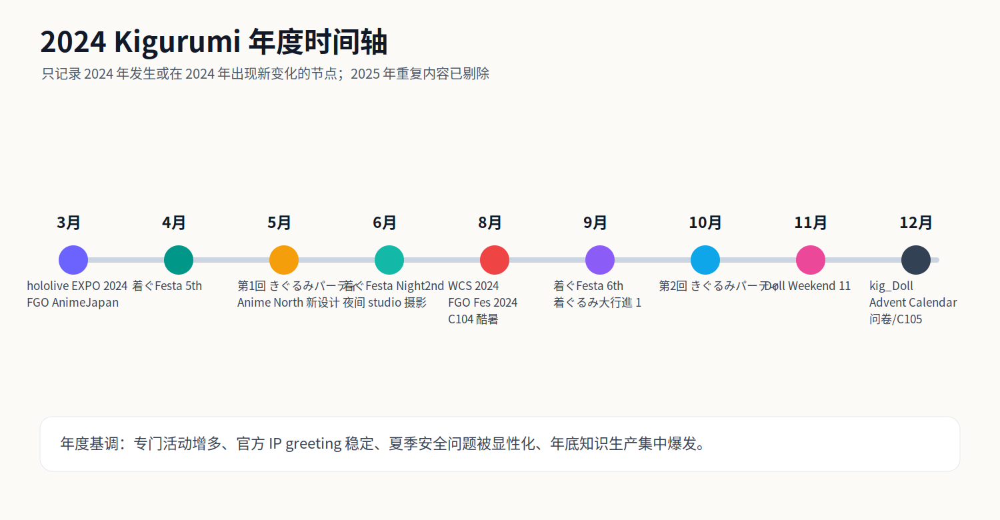
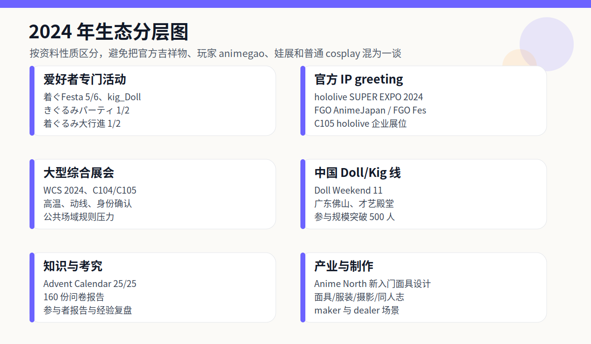
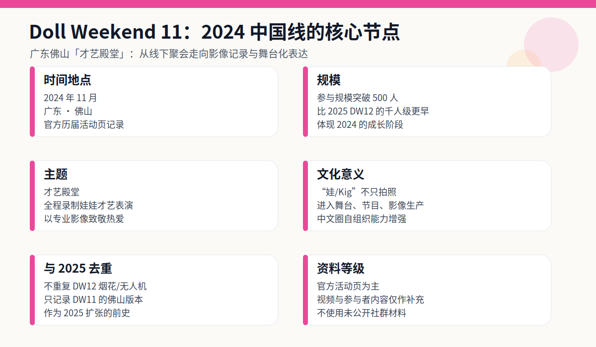
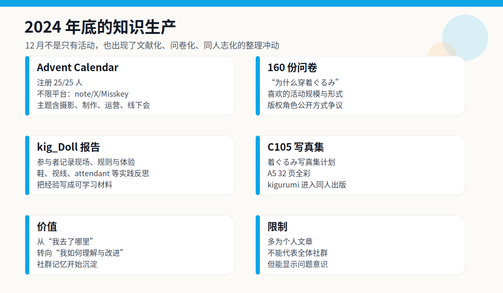
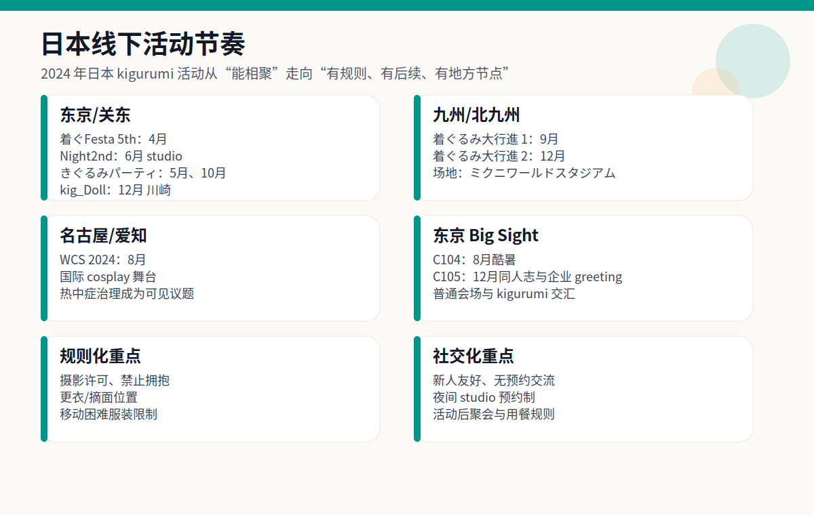
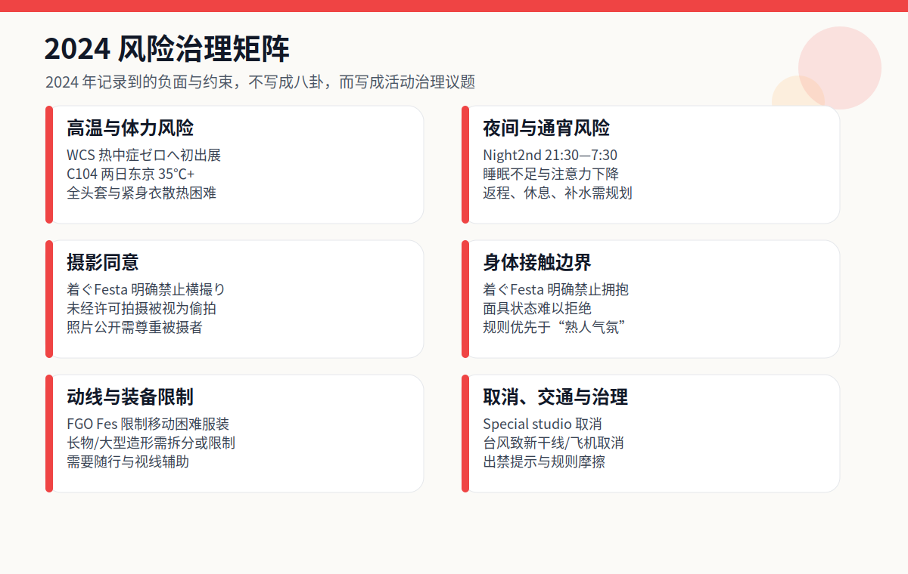

# 2024 年 Kigurumi 编年史

> 编写口径：本篇承接《2025 年 Kigurumi 编年史》的标准与结构，但**不重复 2025 年已经整理过的通用概念、2025 年活动、2025 年规则变化与 2025 年产业事件**。同一系列活动若 2024 年有独立发生或出现新阶段，则只记录其 2024 年版本；若只是 2025 年已经详述的背景说明，则在本篇中压缩或略去。

---

## 0. 资料边界、去重原则与可信度说明

这份 2024 年编年史所说的 **kigurumi**，仍以 animegao kigurumi / 面具型角色扮演 / 美少女着ぐるみ / doller / 娃 / Kiger / 官方角色着ぐるみ greeting 等相邻领域为中心。由于 2025 篇已经详细解释过术语边界，本篇不再重复大段定义，只在涉及资料差异时说明其类型：官方 IP greeting、爱好者专门活动、广义全身装扮活动、娃展、同人出版、问卷与考究文章、以及风险治理文件。

本篇采用“公开资料优先”的原则。官方活动页、主办方公告、票务页、主办方历年列表属于较高可信度资料；参与者报告、个人博客、note、社交媒体截图属于补充材料；匿名论坛与未公开群聊不作为事实依据。涉及负面、传闻或人物争议时，本篇只写**规则变化、治理压力、公开可见的摩擦类型**，不列未经证实的个人指控。

与 2025 篇的去重方式如下：

| 去重类型 | 本篇处理方式 |
|---|---|
| 2025 年已写的通用术语解释 | 只保留必要的一两句，不再重复长篇背景 |
| 同一系列活动在 2025 年继续举办 | 只写 2024 年第几回、地点、当年意义，不写 2025 年后续细节 |
| 官方 IP greeting 在 2025 年仍存在 | 只写 2024 年角色、场次、规则或与 2024 展会绑定的变化 |
| 风险治理在 2025 年更明确 | 只写 2024 年可确认的热中症、摄影、拥抱、动线、取消等问题 |
| 传闻与匿名争议 | 不复述未核实爆料，只记录公开规则与治理信号 |

---

## 1. 2024 年总体脉络

2024 年不是 2025 年的重复版，而更像是 2025 年大规模化之前的“铺设轨道之年”。如果说 2025 年的关键词是“规模上升、跨境交流上升、制度化上升”，那么 2024 年的关键词更接近：**专门活动成形、官方 greeting 稳定、夏季安全被显性化、年底知识生产集中爆发**。

第一条主线是日本本土爱好者活动的密集化。东京及关东地区出现了第 1 回、第 2 回“きぐるみパーティ”，着ぐFesta 在 4 月与 9 月继续以“新人友好、无预约、交流优先”为核心举办，并在 6 月通过 Night2nd 尝试完全预约制、夜间 studio 摄影会形态；12 月又出现了 kig_Doll 这类把摄影、交流、轻食、dealer 参加结合起来的新活动。九州方面，“着ぐるみ大行進！”在 9 月和 12 月完成第 1 回、第 2 回，成为 2025 年第 3 回、第 4 回之前的真正起点。也就是说，2024 年留下的不是一个单点爆发，而是一组可延续的活动模板。

第二条主线是官方 IP 对 kigurumi greeting 的持续使用。hololive SUPER EXPO 2024 在 3 月安排了 Ankimo、Subaru Duck、Mikodanye、UDIN、Smol Ame 等 mascot photo session；Fate/Grand Order 在 AnimeJapan 2024 和 FGO Fes. 2024 中都安排了 cosplayer 与 kigurumi greeting。这些官方场景不能直接等同于 animegao 爱好者活动，但它们让“二次元角色通过全头套/吉祥物式身体出现在展会现场”成为普通观众持续接触的对象。

第三条主线是大型综合展会与安全风险。World Cosplay Summit 2024 在名古屋、爱知举办，外务省资料显示当年有 36 个国家和地区代表队参与世界 cosplay championship；日本气象协会“热中症ゼロへ”项目首次在 WCS2024 出展，并向工作人员提供风扇服。这与 C104 两天 26 万人、东京两日最高气温均超过 35℃的夏季资料共同说明：2024 年 kigurumi 相关问题不能只看“好看”和“还原”，还必须看高温、视线、行动、补水、摄影同意与会场责任。

第四条主线是中文“娃/Kig”圈的阶段性跃升。Doll Weekend 11 于 2024 年 11 月在广东佛山举办，主题为“才艺殿堂”，官方页面写明“全程录制娃娃才艺表演”并称参与规模突破 500 人。2025 年 DW12 的千人级、烟花、无人机与城市级表达已经在 2025 篇详写，本篇只记录 2024 年 DW11：它的意义在于，中文圈在 2024 年已经把 kigurumi/doll 线下活动推进到影像化、舞台化、500+ 规模的阶段。

第五条主线是知识生产。12 月出现了“着ぐるみ Advent Calendar 2024”，注册数 25/25 人，主题覆盖摄影技法、线下会、活动运营、自作、面作等；同月还出现了 160 份回答的“着ぐるみの考え方を知りたい”问卷报告。再加上 kig_Doll 的参与者复盘、C105 的着ぐるみ写真集告知，2024 年底呈现出一种明显的“把经验写下来、把作品印出来、把偏好统计出来”的趋势。这一点与 2025 年的“更大规模活动”不同，是 2024 年独有的文献化价值。

---

## 2. 2024 年编年史

### 2 月 10 日前后：着ぐFesta! Special STUDIO 摄影活动取消——小型活动的成本与不确定性

2024 年年初的负面节点之一，是“着ぐFesta! Special STUDIO 撮影イベント”的取消。该页面以完全预约制的摄影活动为前提，活动形式与常规着ぐFesta 的开放交流不同：它原本更接近专门摄影、预约制、空间限定的 studio 型活动。但公开页面显示，活动因“诸般事情”中止。由于取消说明没有公开列出更具体原因，本篇不猜测主办方内部状况，只把它记录为 2024 年早期活动运营的不确定性。[[S23]](#s23)

这件事值得写入编年史，因为 kigurumi 活动的难度往往被外部低估。普通 cosplay 小聚可能只需要场地、更衣和摄影许可；但 kigurumi 专门活动还要考虑头壳运输、体积较大的行李、视线不佳、换装隐私、是否需要 attendant、活动中能否摘面、摄影师与表演者比例、是否能安排休息、是否能控制路人进入。studio 活动虽然比公共展会更可控，但也更依赖预约人数、费用平衡、时间分配和空间条件。一旦人数不足、场地条件变化或运营成本超出预期，取消就可能发生。

它也说明 2024 年的日本 kigurumi 活动并非一路顺利扩张。后文会看到，着ぐFesta 5th 与 6th 都有稳定举办，但一个系列能持续并不代表每一个衍生企划都能成立。取消事件的正面意义在于，它把“专门活动不是理所当然”的事实暴露出来；负面意义则是参与者的行程、装备准备和拍摄计划可能因此落空。对于高装备成本的 kigurumi 玩家而言，活动取消比普通观众受到的影响更大，因为头壳、服装、假发、鞋、填充、摄影预约都可能提前准备。

### 3 月 16—17 日：hololive SUPER EXPO 2024 的 mascot photo session

2024 年 3 月 13 日，hololive SUPER EXPO 2024 官方发布“着ぐるみグリーティングについて”。公告写明将在时钟塔周边举行 mascot photo session，DAY1 为 2024 年 3 月 16 日，DAY2 为 3 月 17 日；Ankimo 与 Subaru Duck 在两日 12:40 左右登场，Mikodanye、UDIN、Smol Ame 在 DAY1 15:40、DAY2 15:55 左右登场，每组预计约 20 分钟。[[S1]](#s1)

这类官方 greeting 与爱好者 animegao kigurumi 的动机不同。hololive 的着ぐるみ更像品牌角色的实体触点，是 VTuber 产业把虚拟角色、衍生吉祥物、粉丝线下动线连接起来的一种手段。观众并不需要了解 kigurumi 制作、紧身衣、面具内部结构，也可以通过“会动的角色”理解展会体验。它将角色从屏幕、直播间、周边图像中释放出来，变成可以在会场被遇见、被拍照、被挥手回应的身体。

从 2024 年角度看，hololive 这条线的重要性在于“稳定化”。它不是临时出现的一只吉祥物，而是有明确时间表、明确角色组、明确地点的官方互动。2025 篇已经写过 hololive SUPER EXPO 2025 的更大 roster，本篇不重复 2025 扩展；只记录 2024 版本的意义：VTuber 大型线下活动已经把 kigurumi greeting 当成常规节目，而不是边角活动。

同时，这也加深了术语混用。普通观众看到“着ぐるみ”可能想到 hololive mascot，而 animegao/kig 玩家谈“着ぐるみ”时可能指面具角色扮演。2024 的官方 greeting 因此既增加了社会可见度，也可能让外界更难区分 mascot、animegao、doller 和普通连体服。这种“可见但未必被理解”的状态，是 2024 到 2025 都持续存在的背景。

### 3 月 23—24 日：FGO × AnimeJapan 2024——官方 cosplayer 与 kigurumi greeting 的组合

2024 年 3 月 23—24 日，Fate/Grand Order 在东京 Big Sight 的 AnimeJapan 2024 出展。官方页面写明，FGO 展位将进行展示和舞台活动，展位位于东 5 Hall J46；其中一项为“コスプレイヤー･着ぐるみグリーティング”，并说明 greeting 预计在展位内实施，新从者 cosplayer 也会登场。[[S2]](#s2)

FGO 的这一节点与 hololive 的 greeting 类似，都属于官方 IP 的实体化；但 FGO 的特点是“cosplayer + kigurumi”共同构成展位气氛。cosplayer 以真人化方式呈现角色，kigurumi 则以吉祥物/全头套身体呈现另一类角色存在。对观众来说，这会形成一种层次：舞台、展示、宝具道具、英灵召唤 photo studio、官方 cosplayer、kigurumi greeting 共同把手机游戏 IP 变成可以在展位内行走和拍摄的空间。

这件事的年度意义不是“FGO 第一次做 greeting”，而是它在 2024 年继续说明：大型二次元 IP 已把实体角色互动放进标准展会运营之中。展位内 greeting 还有一个治理意义：相比让角色在全馆自由游走，展位内互动更容易控制队伍、摄影角度、停留时间、拥堵和接触边界。对 kigurumi 这类行动受限的表演形式来说，这种空间控制非常重要。

与 2025 年 FGO Fes 十周年的大规模呈现相比，AnimeJapan 2024 的资料更偏“展位运营”；因此本篇只记录其 2024 年状态，不重复 2025 年十周年内容。它提示我们：2024 年的 kigurumi 公共形象不仅来自同好活动，也来自官方 IP 的会场传播。

### 4 月 6 日：着ぐFesta！5th——“新人友好”与规则化交流的公开文本

2024 年 4 月 6 日，着ぐFesta！5th 在荒川区サンパール荒川小ホール举行。活动页写明它是“着ぐるみさんと着ぐるみ好きさんの交流イベント”，当日 10:00 开始，主办方说明该活动源于“也想要一个无需预约、能轻松去玩的活动”的需求；会场为可容纳约 300 人的大厅，欢迎当日参加，且自称是对第一次参加活动的 kigurumi 玩家友好的活动。[[S3]](#s3)

这场活动的核心不是高规格摄影，而是社交修复。活动说明直白地指出：很多新人看到 X 上活动很热闹，于是想来参加，但到了现场如果没有认识的人，想与别人交流时又会遇到“着ぐるみさんは話せない”这一弱点，最后可能只能远远看着别人玩得开心。主办方把这个问题写出来，说明他们认识到 kigurumi 活动的真正门槛并不只是“有没有头壳”，还包括是否能进入社交关系、是否有人愿意主动沟通、是否有规则保护新人与沉默状态下的表演者。

着ぐFesta 5th 的规则也很重要。页面明确禁止“横撮り”，即在别人拍摄时从旁边未经许可举机拍摄；主办方写明，即使被摄者能看到有人在拍，未经同意也属于偷拍，应先取得被摄者许可。活动还禁止拥抱，理由是 kigurumi 表演者不容易说话，意思表示困难，可能难以拒绝过度接触；同时禁止挥舞长物，并要求除更衣室、cloak 之外不得摘面。[[S3]](#s3)

从 2024 年角度看，着ぐFesta 5th 是典型的“低门槛但高规则意识”活动。它没有把拍摄作品作为唯一目标，而是把“新人如何不孤立”“如何避免偷拍”“如何避免触碰越界”“如何在不破坏角色形象的前提下维护安全”写成可执行规则。这类文本比漂亮照片更能说明社群成熟度。2025 年很多活动规则更正式，但 2024 年着ぐFesta 的价值在于，它从小型交流活动层面已经把边界问题说得非常具体。

### 5 月 24—26 日前后：Anime North 2024 与 Kigurumi Online 新入门面具设计

Kigurumi Online 页面说明，该组织每年在加拿大多伦多 Anime North 举办 workshop，向 cosplayer 介绍 animegao kigurumi；工作坊内容包括背景介绍、历史、知名 maker、制作方法，以及在志愿者协助下制作 customized starter mask。页面还写明，参与者可选择眼形、眼色、睫毛、眉毛、假发款式与颜色，并可进行内衬填充和佩戴适配。最值得记录的 2024 更新是：页面称 2022 年设计之后，**在 Anime North 2024 发布了新设计**。[[S5]](#s5)

这件事属于产业与教育线，而不是普通聚会线。2025 篇已经写过 Anime North 2025 workshop 的入门功能，本篇不再重复工作坊所有细节，只强调 2024 年的新增点：新 beginner mask 设计的发布。对于 animegao kigurumi 来说，入门面具设计并不是小事。它影响新手第一次佩戴时的视觉效果、舒适度、内衬适配、头围兼容、假发固定、眼片比例和制作成本。一个可用于 workshop 的入门设计，意味着制作者试图把原本高度个体化的面具工艺标准化到“可教、可批量准备、可让新人当天体验”的程度。

北美线在 2024 年的意义也在这里：它不像中国 Doll Weekend 那样强调大规模场面，也不像日本东京/九州线那样强调专门活动场域，而是更多体现为知识传播与门槛降低。很多海外新人难以接触日本语资料，也很难判断 maker、面具结构、肤色衣、假发与服装之间的关系。Kigurumi Online 通过工作坊把这些问题拆成可参与流程，使“第一次尝试 kig”不必从昂贵定制订单开始。

因此，Anime North 2024 的可记录价值不是“某几位玩家出现”，而是“新入门面具设计”作为技术传播节点。它为 2025 年及之后的新人培养提供了基础。

### 5 月 26 日：第 1 回「きぐるみパーティ」——东京台场专门活动线的起点

2024 年 5 月 26 日，东京台场举行了“きぐるみパーティ”。公开参与者报告把这次活动描述为 2024 年 5 月 26 日举办，参与者在台场 promenade 公园、海边公园与 Plaza Heisei 等地活动；报告总结中写到：能在台场的公园与 Plaza Heisei 穿着活动，但步行距离较长，没有支援者会比较辛苦，并且有各种 kigurumi 参与者。[[S4]](#s4)

这场活动是 2025 年“第 3 回・きぐるみパーティ!”的前史，但本篇只记录 2024 年第 1 回的独立意义。它说明东京已经开始为面具型/全头套类参与者创造专门拍摄与集合场域。与普通漫展不同，这类活动必须解决三个问题：第一，户外照片好看，但长距离步行会放大头壳视线、鞋、体力、补水与随行支援问题；第二，台场一带半公共空间多，路人、游客与一般 cosplayer 都可能进入画面，摄影许可和动线要更谨慎；第三，头壳、假发、身体填充与角色服装都需要中途整理，单靠“普通更衣室”很难完全满足需求。

参与者报告中“サポートがいないときついかも”的观察很有价值。kigurumi 社群常说 attendant / helper 的重要性，但很多外部人只有在看见活动现场动线后才理解：表演者的视野通常不是现实视野，角色眼线与真人眼线错位，台阶、路缘、车辆、自行车、儿童突然靠近都会带来风险。东京台场这种开放空间给了作品感，也增加了移动成本。

第 1 回“きぐるみパーティ”还说明，2024 年日本 kigurumi 活动并不是只在小厅内封闭交流，而是开始尝试半公共景观中的专门聚会。它为 10 月第 2 回和 2025 年第 3 回奠定了活动名称、场地经验和社群口碑。

### 6 月 15 日：着ぐFesta！Night2nd——夜间 studio 摄影会与完全预约制的另一条路线

2024 年 6 月 15 日，着ぐFesta！Night2nd 在 Chrome Studio 川口以夜间摄影活动形式举办。TwiPla 页面写明，活动时间为 2024 年 6 月 15 日 21:30 至次日 7:30，采用完全预约制，定员 40 人，费用 4000 日元；活动说明还强调由工作人员进行摄影，并把它定位为面向“着ぐるみさん与着ぐるみ好きさん”的特别 happy shooting event。公开报名状态显示，参加者 14/40 人，另有“感兴趣”4 人、“不参加”2 人。[[S24]](#s24)

这场 Night2nd 是 2024 年着ぐFesta 线中容易被忽视、但很有结构意义的一次尝试。4 月的 5th 与 9 月的 6th 都偏向“无预约、当日可参加、新人友好”的交流会；Night2nd 则走向完全相反的方向：预约制、人数上限、studio、一整晚、以摄影为主要目的。它说明同一主办/同一活动圈层在 2024 年已经同时探索两种需求：一种是降低入门门槛，让 solo 玩家能来认识人；另一种是压缩外部干扰，让参与者在可控 studio 中长时间拍摄。

Night2nd 的规则延续了着ぐFesta 的边界意识。页面禁止“横撮り”，要求拍摄先取得被摄者同意；禁止拥抱，理由仍是面具状态下的意思表示困难；禁止挥舞长物；并要求除更衣室与 cloak 以外不得摘面。这些规则说明，即使在较封闭的 studio 环境里，摄影同意、身体接触、道具安全与角色状态边界仍然不能省略。[[S24]](#s24)

同时，Night2nd 也把另一类风险推到台前：夜间与通宵。对 kigurumi 表演者来说，夜间 studio 虽然避开白天酷暑与路人围观，但会带来睡眠不足、体力衰退、后半夜注意力下降、补妆与服装维护、返程交通等问题。全头套、紧身衣、假发、角色鞋在连续数小时拍摄中会持续消耗体力；如果没有明确休息、补水与同行支援，通宵环境并不天然比白天更安全。

把这场活动放进 2024 年编年史，可以看见一条与“活动取消”相互映照的线索：2 月的 studio special 取消显示专门摄影企划的脆弱性，6 月 Night2nd 则显示 studio 型活动并没有消失，而是以更明确的预约制、夜间场、人数上限和规则文本继续试验。它不是 2025 年的重复内容，而是 2024 年日本小型 kigurumi 活动形态多样化的重要证据。

### 8 月 2—4 日：World Cosplay Summit 2024 与夏季安全议题

2024 年 8 月 2—4 日，第 22 届 World Cosplay Summit 在名古屋、爱知举行。日本外务省页面记录，2024 年世界 cosplay championship 于 8 月 3 日举行，来自包括日本在内的 36 个国家和地区的代表队参赛，日本队获得冠军，并获得外务大臣奖。WCS 自 2003 年始于名古屋，2024 年为第 22 年。[[S6]](#s6)

从 kigurumi 编年史角度看，WCS 2024 的重要性不只在冠军，而在它把夏季 cosplay 安全推到前台。日本气象协会“热中症ゼロへ”项目在 2024 年 7 月 23 日发布公告，称该项目将首次出展 WCS2024，并在 8 月 3—4 日于 Oasis 21 设 booth，通过摄影道具、背景板、暑热对策物品等方式呼吁热中症预防；同时为 WCS 运营工作人员提供 33 件带风扇的空调服。[[S7]](#s7)

这对 kigurumi 尤其关键。普通 cosplay 在夏季已经面临暴晒、排队、妆面融化、脱水等问题；kigurumi 还叠加了头壳、全身衣、填充、假发、视线受限和不便摘头的压力。WCS 2024 并不是单独为 kigurumi 举办的活动，但它代表主流 cosplay 场景开始更公开地处理“盛夏活动如何安全进行”的问题。热中症 booth 与工作人员风扇服说明安全不只是参与者个人自觉，而是展会运营的一部分。

这也是 2024 与 2025 的差异。2025 篇重点写了 WCS 对 kigurumi / full-face mask / doller / gawa-cos 的明确规则承认；2024 篇则重点写热中症治理。二者不是重复，而是相互承接：2024 年凸显夏季身体风险，2025 年进一步把遮面服装纳入规则文本。对 kigurumi 玩家来说，这两条线共同构成“可参加但必须被治理”的现实。

### 8 月 3—4 日：FGO Fes. 2024 9th Anniversary——官方 greeting 与参与者服装限制的并置

2024 年 8 月 3—4 日，Fate/Grand Order Fes. 2024 9th Anniversary 在幕张 Messe 举办。官方 attraction 页面列出“グリーティング”，说明将进行着ぐるみ greeting，并写到“新規着ぐるみも制作中”。这说明 FGO 在 2024 年九周年活动中不仅继续使用 kigurumi greeting，还在制作新的 kigurumi 角色。[[S8]](#s8)

这个事件的特殊之处在于：官方一方面安排 kigurumi greeting，另一方面对普通参与者 cosplay 服装作出限制。FGO Fes. 2024 cosplay 规则写明，限制的服装包括“移动困难的服装”，例子包括大型纸壳造型、着ぐるみ、拖地衣摆、大型装饰品等。[[S9]](#s9)

这种并置非常值得写入 2024 编年史。它说明官方 IP 活动对 kigurumi 的态度并不是简单“允许”或“禁止”。官方运营的 kigurumi 是活动资产，有固定角色、工作人员、动线安排和后台管理；而普通参与者穿着 kigurumi 进入拥挤会场，可能带来通行、视线、安全、撤离和摄影管理问题。因此同一场活动可以同时出现“官方 kigurumi greeting”与“限制移动困难的参与者 kigurumi 服装”。

从社群视角看，这种规则可能让玩家感到矛盾：为什么官方可以，个人不行？但从活动治理看，差别在于责任归属与可控性。官方角色通常有 staff、行程、休息点、拍照区域；个人玩家则可能在全会场移动，主办方难以判断是否有随行、是否能及时避让、是否会堵塞通道。2024 年 FGO Fes. 因此提供了一个很清楚的案例：kigurumi 在商业 IP 活动中被欢迎为表演形式，但不一定被无条件欢迎为观众 cosplay 形式。

### 8 月 11—12 日：C104 夏 Comiket——酷暑、26 万人流与 kigurumi 同人活动线索

2024 年 8 月 11—12 日，夏季 Comic Market 104 在东京 Big Sight 举办。COSPO 的 C104 报道写明，两天共有约 26 万人来场，且 8 月 11、12 日东京最高气温均超过 35℃。[[S10]](#s10)

C104 对 kigurumi 的意义不在于它是专门 kigurumi 活动，而在于 Comiket 是日本同人文化与 cosplay 文化的超大规模交汇点。对 kigurumi 玩家而言，C104 这种场域充满矛盾：一方面，Big Sight 和 Comiket 的可见度极高，角色造型若能出现，会得到大量关注；另一方面，夏季高温、人流、排队、搬运行李、摄影区规则、摊位动线、换装限制都对 kigurumi 极不友好。35℃以上的酷暑对普通 cosplayer 已经辛苦，对全头套、全身衣、厚假发和不便摘头的 kigurumi 来说则是更高风险。

公开资料中还能看到 kigurumi 与 Comiket 同人活动的连接，例如个人 note 提到 C104 中“着ぐるみ売り子”等计划与相关书籍。这类资料多为个人/小圈层记录，不适合作为宏大结论，但它说明 kigurumi 不是只在摄影会或专门活动中存在，也进入了同人摊位、卖子、写真集、角色旅行本等创作实践。

2024 年 C104 因此应归入“风险与创作并存”的节点。它没有像 Doll Weekend 11 或 着ぐるみパーティ 那样专门面向 kigurumi，但它提供了一个严苛的现实测试：当 kigurumi 进入超大人流、酷暑和同人销售环境时，安全、移动、补水与摄影规则会比作品本身更重要。2025 篇没有重点写 Comiket，因此这部分是 2024 年的独立补充。

### 9 月 1 日：着ぐFesta！6th 与 afterparty——社交规则细化、出禁提示与台风交通影响

2024 年 9 月 1 日，着ぐFesta！6th 再次在荒川区サンパール荒川小ホール举行。活动页延续了 5th 的定位：无需预约、欢迎当日参加、对第一次参加活动的 kigurumi 玩家友好；活动目标仍是让没有熟人、solo 活动的 kigurumi 玩家能够建立联系。规则也延续并细化：禁止横撮り、禁止拥抱、禁止挥舞长物、除更衣室/クローク之外不得摘面。[[S11]](#s11)

6th 的价值在于，它把 5th 的活动逻辑延续成稳定格式，而不是一次性尝试。公开页面显示参与者 55 人、兴趣 17 人、不参加 7 人；虽然这不是大型活动规模，但对 kigurumi 专门交流活动来说，已经说明其具有稳定吸引力。[[S11]](#s11)

这次活动还留下了几个值得写入负面/治理史的公开细节。活动评论区中，主办方账号写明已从“検討中”中删除出禁名单人物，并提示即使当日到场也不能入场。这里不应延伸为对任何具体个人的讨论，也不应追查被排除者身份；编年史只记录其治理意义：到 2024 年，部分 kigurumi 活动已经需要以出禁名单、入场拒绝、事前筛查的方式处理风险。[[S11]](#s11)

同一评论区还出现了因台风导致新干线、飞机取消或移动困难而放弃参加的留言。这说明 kigurumi 活动的现实成本还包括交通不确定性。玩家携带头壳箱、衣服、鞋、假发、摄影设备时，临时换路线比普通旅行更困难；台风和交通中断会直接影响活动参与。[[S11]](#s11)

9 月 1 日同日还安排了着ぐFesta!6th afterparty，16:00—19:00 举办。afterparty 页面说明，它是为了回应“想参加活动后聚会但没有被邀请、不好意思开口”的需求，由活动方准备，完全预约制，30 人上限，27 人参加。规则与正场不同：禁止大声喧哗，禁止横撮り，禁止拥抱，场地狭小所以禁止手持道具；用餐时要求 kigurumi off。[[S12]](#s12)

这一 afterparty 很有社群史价值。它承认了 kigurumi 活动中“社交不平等”的问题：熟人圈自然会有 after，边缘新人则可能被排除。主办方把 afterparty 做成预约制、规则化、人数有限的附属活动，等于把私下社交的一部分公共化、透明化。它也显示出一个成熟趋势：角色状态适合拍照，但真正建立关系、吃饭、沟通规则和互相认识时，需要回到可交流的人类状态。

### 9 月 23 日：北九州「着ぐるみ大行進！1」——九州专门活动线的起点

2024 年 9 月 23 日，“着ぐるみ大行進！1”在ミクニワールドスタジアム北九州举办。Cospic / Cosplay Picnic 的历年活动列表将其列为 2024 年 9 月 23 日共催活动，地点为北九州 Mikuni World Stadium。[[S13]](#s13)

这件事在 2025 篇中只作为后续第 3、4 回的背景出现；在 2024 篇中必须单独写，因为它是九州线的起点。日本 kigurumi 活动长期容易被东京、关东或名古屋的大型 cosplay 场景遮蔽，而“着ぐるみ大行進！”把“九州也需要自己的 kigurumi/全身装扮交流场”这个需求明确化。スタジアム会场的意义也不小：相比狭小室内，体育场及其周边空间更适合大型头壳、兽装、hero/gawa-cos、doller、animegao 等全身装扮移动和合影；但也要求更严格的动线、安全、天气和更衣管理。

“行进”这个命名本身也有象征性。kigurumi 不只是静止拍照，也可以形成集体移动、集合、游行式视觉。对全身角色化文化来说，群体行进能把个体角色变成公共景观：观众看到的不再是一两个“奇怪的人偶”，而是一整个社群的可见身体。2024 年第 1 回建立了这个格式，2024 年 12 月第 2 回继续，2025 年第 3、4 回进一步延续。

因此，第 1 回“着ぐるみ大行進！”是 2024 年日本地方化最重要的节点之一。它说明 kigurumi 活动并非只能依赖东京；地方社群也能围绕交通、场地、合作主办与全身装扮类型整合出自己的活动名片。

### 10 月 6 日：第 2 回「きぐるみパーティ」——东京专门活动的快速复现

2024 年 10 月 6 日，第 2 回“きぐるみパーティ”举办。Cospot Media 的 2024 年 10 月全国 cosplay 活动列表中，在东京部分列出“第二回・きぐるみパーティ”，时间为 10:00—16:30，主办关联为コスプレ博実行委員会（勇者屋）。[[S14]](#s14)

这次活动的意义在于“复现速度”。5 月第 1 回之后不到半年，10 月即举办第 2 回，说明 5 月尝试不是偶然的小型拍摄会，而是被主办方和参与者认为值得继续的活动格式。对 kigurumi 来说，活动能否复现非常关键：玩家制作新角色、约摄影师、安排随行、准备行李和交通，都需要可预期的活动周期。如果一个活动只有一次，社群记忆容易停留在“某次很好玩”；如果半年内复现，它就可能成为固定日程。

第 2 回与第 1 回共同构成东京“きぐるみパーティ”线的 2024 骨架。2025 篇已经写过 2025 年第 3 回的场地与活动设施，本篇只记录 2024 年的两个开端：5 月验证了台场/Plaza Heisei 及周边空间的可行性，10 月验证了活动品牌的延续性。这种“半年两回”的节奏，为 2025 年进一步制度化提供了基础。

从文化意义看，第 2 回也证明 kigurumi 玩家需要的不只是普通 cosplay 大展的角落空间，而是能让他们放心摘装、移动、合照、社交和被理解的专门活动。东京本身不缺 cosplay 活动，但专门面向 kigurumi 的活动仍有价值，说明 kigurumi 的需求与普通 cosplay 并不完全重合。

### 11 月：Doll Weekend 11 广东佛山——中文“娃/Kig”圈的 500+ 阶段

2024 年 11 月，Doll Weekend 11 在广东佛山举办，主题为“才艺殿堂”。Doll Weekend 官方活动页写明：Doll Weekend 11，2024 年 11 月，广东·佛山；“全程录制娃娃才艺表演，以专业影像致敬热爱，参与规模突破 500 人”。[[S15]](#s15)

这是一条必须与 2025 DW12 去重处理的主线。2025 篇已经写过 DW12 的 1000+、烟花、无人机、娃游行和城市级表达；本篇不重复那些内容，只写 DW11 在 2024 年的独立意义。DW11 的关键词不是“千人嘉年华”，而是“才艺、影像、500+”。它说明中文圈在 2024 年已经把 kigurumi/doll 线下活动从普通合影、房间拍摄、漫展邂逅推进到舞台节目和专业记录。

“才艺殿堂”这个主题很有研究价值。kigurumi 常被外部看成静态视觉文化：头壳、身体比例、服装还原、摄影好看。但才艺表演把玩家从“被拍摄对象”转化为“舞台表演者”。这会提出更高要求：动作幅度如何适应头壳视线？服装是否允许跳舞或表演？表演者是否需要提前排练？现场灯光、舞台高度、观众距离、摄影机位如何兼容全身装扮？这些问题都超出普通摄影会范畴。

DW11 的“全程录制”同样重要。很多小圈层活动的记忆散落在个人相册、群聊和社交媒体上，时间久了容易消失。官方影像记录意味着主办方希望把活动保存为可传播、可回顾、可用于招商和文化解释的资料。这是社群从“玩过”走向“留下档案”的一步。

规模突破 500 人也说明中文 kigurumi/doll 圈在 2024 年已经有相当组织力。对一项需要头壳、紧身衣、假发、角色服、摄影和长途旅行的爱好来说，500+ 不是小数字。它是 2025 年更大规模出现前的关键台阶。没有 DW11 这种 2024 年积累，DW12 的大型化不会显得自然。

### 12 月 1 日：kig_Doll 川崎——摄影、交流、轻食与 dealer 场景结合的新节点

2024 年 12 月 1 日，kig_Doll 在川崎市产业振兴会馆举行。LivePocket 票务页显示，活动日程为 2024/12/1，开演 10:30，终演 20:00；票种包括第一部“摄影、交流”加第二部“轻食付き交流”的套票 3000 日元，第一部单独 1500 日元，第二部单独 1500 日元；第一部时间为 10:30—16:30，第二部为 17:00—20:00。[[S16]](#s16)

kig_Doll 的结构值得重点记录。它不是单纯拍摄会，也不是完全自由交流会，而是把白天摄影交流与晚间轻食交流分段组织。对 kigurumi 活动来说，这种分段非常合理：白天可以保持角色状态、拍照、会面、走动；晚间轻食阶段则更适合摘装、认识真实身份、交流制作和活动经验。它把“作品展示”和“人际关系建立”分开处理，从活动设计上减少了角色状态与实际沟通之间的冲突。

参与者 Osumi Akari 的报告称，现场宽阔的一层楼充满 kigurumi，结论包括“有很多 kigurumi 很开心”“能玩一天的活动”“交流会阶段有助于扩展人脉”。报告也写到，作为第 1 回活动，参加前有不安，但从参与者角度看运营很顺畅，工作人员以 kigurumi 视角行动；同时提到似乎有规则相关摩擦，自己作为参与者也要注意不要成为当事人。[[S17]](#s17)

另一篇やえぶろ报告则提供了更细的实践反思：参与者写到自己走得太急，应该更慢、更主动地回应周围声音；鞋的选择影响后半段脚痛；应请求 attendant 协助并注意角色视线与真人视线的高低差；腰带松动等细节也会影响角色表现。[[S18]](#s18)

这类反思对 2024 年编年史很重要，因为它把 kigurumi 从“外观”拉回“实践”。一个角色是否可爱，不只取决于头壳和衣服，还取决于步速、转身、手势、鞋、视线、随行者、腰带、身体平衡和是否能听见周围反馈。kig_Doll 的参与者报告显示，2024 年日本 kigurumi 圈已经开始把这些细节写成经验知识。这些内容不是大新闻，却是社群成熟的细胞。

### 12 月 1—25 日：着ぐるみ Advent Calendar 2024——分布式写作与社群知识生产

2024 年 12 月，“着ぐるみ（kigurumi） Advent Calendar 2024”在 Adventar 上进行。页面显示注册数为 25/25 人，创建者为温羽とお；说明文字欢迎不分类型的 kigurumi 内容投稿，平台不限 note、Twitter/X、Misskey 等。示例主题包括原创角色魅力、kigurumi 的好处、摄影技法、线下会做什么、活动运营的辛苦、喜欢的摄影棚/活动、after 推荐店、自作经验、面作技巧，甚至只贴一张照片也可以。[[S19]](#s19)

这是一条 2024 年独有的“考究事件”。它不等同于大型活动，但从历史记录角度甚至更珍贵。线下活动通常留下照片和感想，但 Advent Calendar 把分散的玩家、制作者、摄影者和组织者聚合到一个时间结构里，让每个人在 12 月的一天发布一篇关于 kigurumi 的文章或内容。25/25 的满额注册说明该企划不仅有想法，也有足够参与者响应。

其意义有三层。第一，它把 kigurumi 从“看图文化”转向“写作文化”。很多外部人只通过照片判断 kigurumi，却不了解玩家为什么穿、怎么准备、怎么参加活动、怎么处理摄影与社交。Advent Calendar 鼓励把这些经验写出来。第二，它承认 kigurumi 类型内部的多样性。投稿示例没有限定 animegao 或 doller，也没有要求必须技术文章；这让制作、摄影、运营、日常、角色爱、线下会、活动后吃饭都可以成为 kigurumi 文化的一部分。第三，它为未来研究者提供索引。即使部分链接日后失效，Advent Calendar 页面本身仍保留了 2024 年社群主动书写的痕迹。

在 2025 篇中我们更多看到大型活动和公开规则，而 2024 年 Advent Calendar 显示的是“内部解释能力”。一个文化想走出误解，不能只靠好看的照片，也要靠参与者自己描述动机、边界、辛苦与乐趣。2024 年 12 月的这个企划正是这种自我解释能力的集中体现。

### 12 月 15 日：北九州「着ぐるみ大行進！2」——地方活动线在同年内完成复现

2024 年 12 月 15 日，“着ぐるみ大行進！2”在ミクニワールドスタジアム北九州举办。Cospic 历年活动列表将其列为 2024 年 12 月 15 日共催活动，地点仍为北九州 Mikuni World Stadium。[[S13]](#s13)

这次活动的意义在于“同年复现”。9 月第 1 回之后不到三个月，第 2 回即在同一核心场地举办，说明九州线不是只做一次试水，而是迅速形成节奏。对地方 kigurumi 社群来说，这比单次活动更重要。地方玩家往往面临东京/关东活动过远、交通成本高、头壳行李运输困难等问题。若本地有固定节点，玩家就能减少跨区域奔波，更容易约同区域摄影师、建立熟人网络、发展本地 maker/dealer 和活动志愿者。

第 2 回还证明“着ぐるみ大行進！”这个命名和场地组合具有延续性。体育场空间适合多类型全身装扮聚集：animegao、美少女着ぐるみ、doller、furry/ケモノ、hero/gawa-cos 都可能面对相似的行动与安全问题。九州线在 2024 年就开始把它们纳入同一个“行进/交流”的活动想象中。

与 2025 篇去重时，必须注意：2025 年第 3、4 回说明该系列继续发展，但 2024 年第 1、2 回才是起始记录。2024 年的价值是“从无到有、从一次到两次”。这类地方活动往往没有中央大型展会那样充足的媒体报道，但它对社群日常的意义可能更大。

### 12 月 20 日：160 份回答的“着ぐるみの考え方”问卷报告

2024 年 12 月 20 日，やえぶろ发布“着ぐるみの考え方を知りたい”问卷统计结果。文章开头写明，问卷获得 160 件回答；问题包括“为什么作为爱好穿着ぐるみ”“最喜欢以什么形式把着ぐるみ带到人前”“希望参加什么规模的活动”“活动中穿着时间比例”“摄影会规模偏好”“版权角色照片公开时是否应搜索避让或加标签”等。[[S20]](#s20)

这份问卷是 2024 年非常重要的“考究事件”。它把原本依靠印象判断的问题变成了可讨论数据。文章提到，约七成回答者选择“因为喜欢着ぐるみ”作为穿着理由，也出现“变身欲求”“想穿可爱/帅气衣服”“作为创作物被摄体”等动机。它还指出，在“把着ぐるみ带到人前的形式”中，off 会、event、摄影会之间存在偏好差异；对活动规模的回答中，“着ぐるみ特化イベント”获得很高支持；版权角色照片是否搜索避让、是否加角色名标签也呈现意见分化。[[S20]](#s20)

问卷的意义不在于给出唯一正确答案，而在于暴露社群内部的多样性。外部观众常把 kigurumi 动机简化为某一种解释：恋物、变装、角色爱、摄影、匿名、表演。但 160 份回答显示，动机是复合的，而且不同玩家对公开、标签、活动规模、摄影会人数、穿着时间都有不同偏好。这些差异会直接影响活动设计：如果很多人偏好特化 event，主办方就应提供更适合 kigurumi 的空间；如果摄影会人数不宜过大，摄影组织就应限制规模；如果版权角色公开方式存在争议，玩家就需要尊重彼此策略。

这份报告也补充了 2024 年 Advent Calendar 的意义。Advent Calendar 是分布式写作，问卷则是统计式自我观察。二者合在一起说明，2024 年底 kigurumi 社群不仅在活动，也在反思自己。

### 12 月 29—30 日：C105、hololive 企业 greeting 与着ぐるみ写真集

2024 年 12 月 29—30 日，Comic Market 105 在东京 Big Sight 举办。hololive 官方 C105 活动页写明，hololive production booth 将在 2024 年 12 月 29—30 日出展，并计划实施“みこだにぇー”与“毛玉ころね”的着ぐるみ greeting。页面还列出了企业 booth 地点、时间与活动概要。[[S22]](#s22)

这说明 2024 年底官方 IP greeting 并未止步于 hololive SUPER EXPO，而是进入 Comiket 企业展位场景。Comiket 的企业区与普通展会 booth 不同，它夹在同人文化、商业宣传、年末购物、人流管控与粉丝互动之间。hololive 在 C105 安排 kigurumi greeting，说明 mascot 角色在年末大型二次元消费场景中同样被用作吸引观众、制造记忆点和社交传播的工具。

同一 C105 期间，个人 note“コミケ105では着ぐるみ写真集を出します!”记录了另一条值得写入 2024 的线：作者计划在 12 月 29 日于 C105 西地区“ね”23b 出展，ジャンル为 Love Live!，当日有着ぐるみさん作为卖子，并发行 A5 32 页全彩新刊《ニジガク着ぐコス日誌〜お台場編〜》。[[S21]](#s21)

这条资料说明 kigurumi 进入了同人出版实践。它不是官方 IP 的 greeting，也不是单纯活动照片，而是把着ぐるみ cosplay、地点巡礼、作品世界和同人志制作结合起来。对社群史来说，写真集很重要，因为它把通常流动在社交平台上的照片固定成可收藏、可售卖、可转交的实体文本。它也让 kigurumi 不只是“在场的身体”，而变成可编辑的影像叙事。

C105 因此在 2024 年底同时承担两种意义：商业方通过着ぐるみ greeting 强化 IP 现场互动，个人创作者则通过写真集把 kigurumi 经验做成同人作品。前者代表产业化，后者代表社群创作化；两者并行，是 2024 年 kigurumi 文化多层结构的缩影。

---

## 3. 2024 年主要人物、组织与场域索引

### GarageStudioC7 / 着ぐFesta

着ぐFesta 是 2024 年日本 kigurumi 圈最能体现“新人友好 + 规则明确”的活动线之一。5th 与 6th 都把“无预约、当日可参加、solo 玩家可以认识朋友”作为核心卖点；6 月 Night2nd 则走向完全预约制、夜间 studio 摄影会方向，显示同一活动线既重视开放交流，也在测试更可控的摄影环境。三者都公开写明禁止横撮り、禁止拥抱、禁止挥舞长物、限制摘面位置等规则。这类活动并不追求最华丽的照片，而是试图解决 kigurumi 社交中最现实的问题：新人没有熟人、表演者说话困难、被摄者同意难以确认、身体接触容易越界。

### コスプレ博実行委員会 / 勇者屋 / きぐるみパーティ

2024 年 5 月与 10 月的 きぐるみパーティ 是东京专门活动线的开端。它把台场、公园、Plaza Heisei 等空间与 kigurumi 摄影、集合、移动联系起来。5 月第 1 回的参与者报告尤其提醒：户外空间虽好，但步行距离长，没有支援者会辛苦。这一观察对所有半公共场地 kigurumi 活动都具有参考价值。

### Cospic / Cosplay Picnic / 着ぐるみ大行進！

Cospic 历年活动列表显示，2024 年 9 月 23 日和 12 月 15 日分别举办了 着ぐるみ大行進！1 与 2，地点均为 Mikuni World Stadium Kitakyushu。它们是 2025 年第 3、4 回之前的根。九州线的价值在于地方化：它让 kigurumi 与其他全身装扮分支不必总依附东京活动，而能在九州形成自己的节奏。

### Doll Weekend

Doll Weekend 11 是 2024 年中国线的核心节点。官方资料写明其主题为“才艺殿堂”，在广东佛山举办，参与规模突破 500 人。它与 2025 年 DW12 不重复：2024 年的重点是才艺表演和专业影像记录，2025 年才是千人级、烟花、无人机和城市景观化。

### Kigurumi Online

Kigurumi Online 在 2024 年的重要记录是 Anime North workshop 的新 beginner mask 设计。该组织长期把 animegao kigurumi 的历史、maker、制作方法、starter mask 个性化配置和 fit adjustment 带入工作坊环境。2024 年的新设计说明北美入门教育线继续推进。

### FGO PROJECT / Aniplex 与 hololive / COVER

FGO 与 hololive 代表 2024 年官方 IP greeting 的两条主线。FGO 在 AnimeJapan 2024 和 FGO Fes. 2024 中使用 kigurumi greeting，并在 FGO Fes. 2024 页面写到新 kigurumi 制作中；hololive 则在 SUPER EXPO 2024 和 C105 中安排 mascot photo session 或 greeting。这些官方场景增加 kigurumi 形态的公众可见度，但它们与爱好者 animegao/kig 仍应区分。

### 日本気象協会「熱中症ゼロへ」项目

WCS2024 的热中症ゼロへ初出展，是 2024 年安全治理线的关键。它让盛夏 cosplay 安全成为可见议题，并向工作人员提供带风扇空调服。对 kigurumi 来说，这类安全倡议尤为重要，因为头壳、紧身衣、假发和移动限制会加剧热风险。

### 温羽とお 与 Advent Calendar 参与者

2024 年 Advent Calendar 的创建者温羽とお和 25 位注册参与者共同构成了 2024 年底的知识生产网络。它们把摄影、活动运营、自作、面作、off 会、角色爱等内容写成公开文章，为后续研究留下线索。

### やえぶろ / sco_5113

やえぶろ在 2024 年 12 月发布 160 份回答的问卷统计，又发布 Kig-Doll 活动报告。它代表了参与者自我观察、经验复盘和数据化考究的一条重要路线。

### 紺野瀬織 / ななかりワークス

C105 的着ぐるみ写真集告知显示，kigurumi 在 2024 年底进入同人出版实践。它把角色巡礼、写真、同人志和现场卖子结合起来，是“kigurumi 作为影像作品”而不仅是“现场装扮”的例子。

---

## 4. 2024 年正面事件总账

**1. 日本专门活动从多点尝试走向稳定复现。** 2024 年出现了着ぐFesta 5/Night2nd/6、きぐるみパーティ 1/2、着ぐるみ大行進 1/2、kig_Doll 等多个节点。它们形式不同：有新人交流、有夜间 studio 摄影、有户外台场摄影、有地方体育场行进、有摄影+轻食交流，但共同说明 kigurumi 活动不再只依赖普通漫展偶遇。

**2. 中文娃/Kig 圈进入 500+ 与影像化阶段。** Doll Weekend 11 的“才艺殿堂”与专业影像记录，把娃/Kig 活动从静态拍摄推向舞台化表达。它是 2025 年 DW12 大型化之前的重要台阶。

**3. 官方 IP greeting 稳定出现。** hololive 和 FGO 在 2024 年均安排着ぐるみ/mascot greeting。官方 IP 的实体化让普通观众更频繁遇见全头套角色身体，也为展会互动提供更强记忆点。

**4. 北美入门教育继续推进。** Kigurumi Online 在 Anime North 2024 发布新的 beginner mask 设计，体现了 workshop 型入门路径的更新。

**5. 年底知识生产集中爆发。** Advent Calendar 25/25、160 份问卷报告、kig_Doll 参与者复盘、C105 写真集共同说明：2024 年社群不只在线下聚会，也在写作、统计、出版、总结与反思。

---

## 5. 2024 年负面事件与风险总账

**1. 活动取消风险。** 着ぐFesta! Special STUDIO 撮影イベント取消，说明专门活动受预约、成本、场地、运营能力等因素影响，不是每个企划都能顺利实施。

**2. 夜间摄影与体力风险。** 着ぐFesta！Night2nd 采用 21:30 至次日 7:30 的通宵 studio 形式，虽然避开白天高温和路人干扰，但会带来睡眠不足、注意力下降、返程交通、长时间穿戴维护等问题。

**3. 高温与热中症风险。** WCS2024 引入热中症ゼロへ booth，C104 两天 26 万人并遇到 35℃以上酷暑，显示夏季 kigurumi 活动尤其需要补水、降温、休息、随行和撤退计划。

**4. 摄影同意风险。** 着ぐFesta 明确禁止横撮り，并将未经同意拍摄视为偷拍。这是 2024 年活动规则中非常清晰的边界。

**5. 身体接触风险。** 着ぐFesta 禁止拥抱，因为表演者在面具状态下不易说话，可能难以拒绝。这个规则说明“可爱角色”不等于“可随意触碰”。

**6. 动线与大型装备限制。** FGO Fes. 2024 在参与者 cosplay 规则中限制移动困难的服装，包括着ぐるみ。这说明官方 greeting 与个人 kigurumi 入场不是同一治理逻辑。

**7. 出禁与规则摩擦。** 着ぐFesta 6th 评论区出现出禁名单提示，kig_Doll 参与报告提到规则相关摩擦。此处不点名、不追查、不复述传闻，只记录其说明：2024 年 kigurumi 活动已经需要更明确的入场管理与行为边界。

**8. 交通与天气影响。** 着ぐFesta 6th 评论区出现因台风导致新干线、飞机取消而无法参加的情况。对携带大件装备的 kigurumi 玩家来说，天气造成的交通中断影响更大。

---

## 6. 2024 年考究事件：写作、问卷、实践复盘与同人出版

2024 年最值得与 2025 年区分的一点，是年底的“考究化”。Advent Calendar 把 25 天分配给不同参与者，让他们围绕 kigurumi 发表文章；问卷报告用 160 份回答统计动机、偏好、公开方式与活动需求；kig_Doll 报告记录鞋、视线、attendant、动作速度等实践细节；C105 写真集则把着ぐるみ cos 变成同人出版物。

这些资料共同说明，2024 年社群正在形成“自我档案”。以前很多经验只在活动现场、私聊或图片标题中流转；2024 年则开始被写成可检索文本。这对后续整理很重要，因为 kigurumi 的真实历史往往不在官方新闻里，而在玩家如何描述自己的身体经验、社交困难、摄影规则、角色爱、制作挫折和活动偏好中。

同时也要注意，考究资料多为个人/小样本，不能代表整个社群。例如 160 份问卷虽有价值，但不是随机抽样；Advent Calendar 满额说明参与积极，但参与者多来自愿意公开写作的人；kig_Doll 报告反映参与者视角，不等于主办方完整说明。负责任的写法应把它们视为“社群内部声音”，而不是绝对统计结论。

---

## 7. 2024 年传闻与争议处理原则

2024 年公开资料中可以确认的争议类型，主要不是大型丑闻，而是活动规则与社群治理问题：取消、出禁名单提示、禁止横撮り、禁止拥抱、规则相关摩擦、交通天气影响、移动困难服装限制等。这些都可由公开页面或参与者报告支撑。

对匿名论坛、私域群聊、截图传播、未核实点名，本篇不作事实整理。原因有三点：第一，kigurumi 圈常使用角色名、账号名、头壳形象和现实身份多重身份，误认风险很高；第二，匿名爆料可能包含私人怨恨、断章取义或旧事重提；第三，编年史的责任不是制造黑名单，而是记录文化如何发展、如何治理风险、如何建立公开规则。

因此，本篇把“传闻事件”处理为“治理压力”：当活动规模扩大、摄影传播增多、商业/同人/官方场景交织时，社群必然需要更清晰的边界。2024 年公开规则已经显示出方向：摄影需同意，接触需克制，动线需安全，摘面需在指定区域，规则摩擦需由主办方处理，活动后社交也需要预约、噪音、饮食和身份沟通规则。

---

## 8. 与 2025 篇的关系：2024 独有内容与承接更新

| 系列/主题 | 2024 记录 | 2025 篇中已写内容 | 本篇去重处理 |
|---|---|---|---|
| 着ぐFesta | 2024 年 5th、Night2nd、6th 与 afterparty | 2025 篇未作为核心事件详写 | 本篇补足 2024 小型交流与夜间 studio 线 |
| きぐるみパーティ | 2024 年第 1 回、第 2 回 | 2025 年第 3 回 | 只写 2024 起点与复现，不重复 2025 场地细节 |
| 着ぐるみ大行進！ | 2024 年第 1 回、第 2 回 | 2025 年第 3 回、第 4 回 | 只写九州线起源，不重复 2025 延续 |
| Doll Weekend | DW11，佛山，才艺殿堂，500+ | DW12，河源，1000+，烟花/无人机/游行 | 只写 DW11 的影像化与舞台化 |
| FGO | AnimeJapan 2024、FGO Fes 2024 9th | 2025 AnimeJapan、FGO Fes 十周年 | 只写 2024 greeting 与参与者服装限制 |
| hololive | SUPER EXPO 2024、C105 greeting | SUPER EXPO 2025 roster 扩展 | 只写 2024 角色与 C105 节点 |
| WCS | 2024 热中症治理与 36 国家/地区 | 2025 遮面服装规则承认 | 只写 2024 安全议题 |
| Anime North | 2024 新 beginner mask 设计 | 2025 workshop 时间与内容 | 只写 2024 新设计，不重复 2025 工作坊介绍 |
| 知识生产 | Advent Calendar、160 份问卷、C105 写真集 | 2025 篇未重点展开 | 本篇重点补充 |

---

## 9. 年度结论

2024 年的 kigurumi 并不是 2025 年大规模化的简单前奏，而是一个具有独立价值的“结构搭建年”。它搭建了几种后来继续发挥作用的结构：东京专门活动结构、夜间 studio 摄影结构、九州地方活动结构、中文娃/Kig 大型聚会结构、北美入门 workshop 结构、官方 IP greeting 结构、盛夏安全治理结构、以及年底知识生产结构。

如果用一句话总结：**2024 年让 kigurumi 从“分散出现的兴趣点”进一步变成“可举办、可复现、可规则化、可写作、可统计、可出版的文化网络”。**

它没有 2025 年 DW12 那种千人级景观，也没有 2025 年 WCS 规则那样清晰的遮面服装承认，但它有更基础的东西：第 1 回、第 2 回；Night2nd；500+；新设计；25/25；160 份回答；禁止横撮り；禁止拥抱；热中症 booth；出禁提示；写真集。这些看似零散的节点合在一起，构成了 2024 年独有的 kigurumi 年轮。

---

## 参考资料

[S1] hololive SUPER EXPO 2024「着ぐるみグリーティングについて」: https://hololivesuperexpo2024.hololivepro.com/news/greeting
[S2] Fate/Grand Order 官方「AnimeJapan 2024」出展信息: https://news.fate-go.jp/2024/aj2024/
[S3] 着ぐFesta！5th TwiPla 活动页: https://twipla.jp/events/600801
[S4] Osumi Akari：第 1 回きぐるみパーティ参与报告: https://www.osumiakari.jp/articles/20240526-kigupa1/
[S5] Kigurumi Online：Kigurumi Workshop 页面: https://kig-o.com/index.php/kigurumi-workshop/
[S6] 日本外务省：The World Cosplay Summit 2024: https://www.mofa.go.jp/p_pd/ca_opr/pagewe_000001_00077.html
[S7] 日本気象協会：WCS2024「熱中症ゼロへ」初出展: https://www.jwa.or.jp/news/2024/07/23466/
[S8] FGO Fes. 2024 官方 attraction 页面: https://fes.fate-go.jp/2024/attraction/
[S9] FGO Fes. 2024 官方 cosplay 规则: https://fes.fate-go.jp/2024/about/cosplay.html
[S10] COSPO：C104 cosplay 报道: https://cospo.net/index.php/c104report-2/
[S11] 着ぐFesta！6th TwiPla 活动页: https://twipla.jp/events/622388
[S12] 着ぐFesta!6th アフターパーティ TwiPla 活动页: https://twipla.jp/events/622389
[S13] Cospic / Cosplay Picnic 历年举办列表: https://cospic.org/archives/338
[S14] Cospot Media：2024 年 10 月 cosplay 活动列表，含第二回きぐるみパーティ: https://cospot-media.com/event-list/22535/
[S15] Doll Weekend 11 官方活动页: https://dollweekend.cn/cn/event/dw11/
[S16] kig_Doll LivePocket 票务页: https://t.livepocket.jp/e/idx24
[S17] Osumi Akari：Kig-Doll 参与报告: https://www.osumiakari.jp/articles/20241201-kigdoll/
[S18] やえぶろ：Kig-Doll 活动报告: https://sco-5113.hatenablog.com/entry/2024/12/03/201006
[S19] Adventar：着ぐるみ（kigurumi）Advent Calendar 2024: https://adventar.org/calendars/10384
[S20] やえぶろ：着ぐるみの考え方を知りたい 问卷报告: https://sco-5113.hatenablog.com/entry/2024/12/20/211317
[S21] 紺野瀬織：C105 着ぐるみ写真集告知: https://note.com/rdh27785/n/nc17aeb673227
[S22] hololive 官方：コミックマーケット105 企业展位: https://hololive.hololivepro.com/events/c105/
[S23] 着ぐFesta! Special STUDIO 撮影イベント取消页: https://twipla.jp/events/587460
[S24] 着ぐFesta！Night2nd TwiPla 活动页: https://twipla.jp/events/617052
