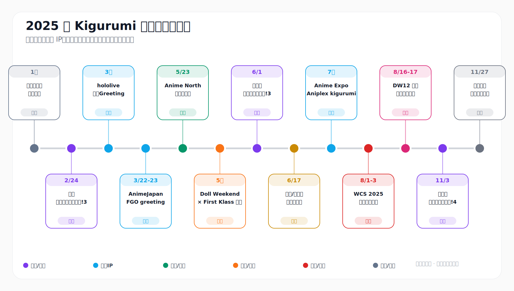
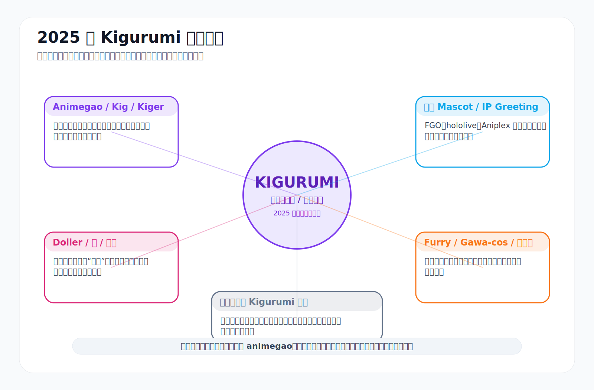
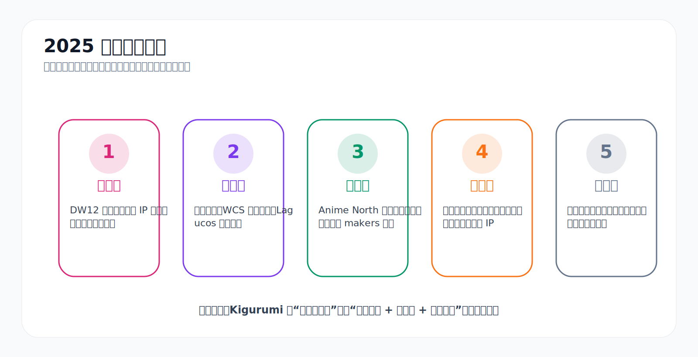
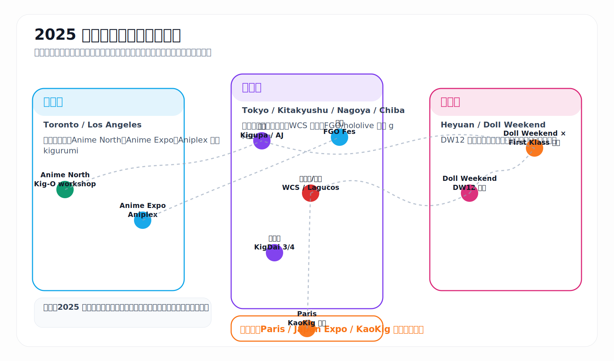
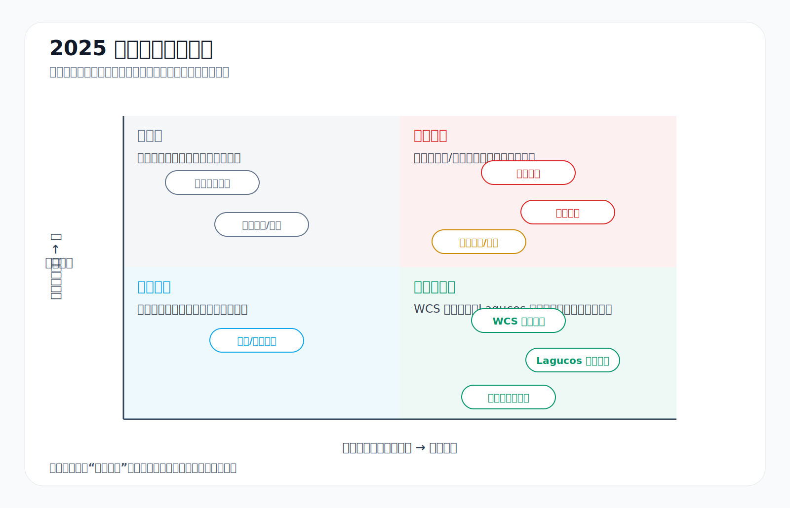
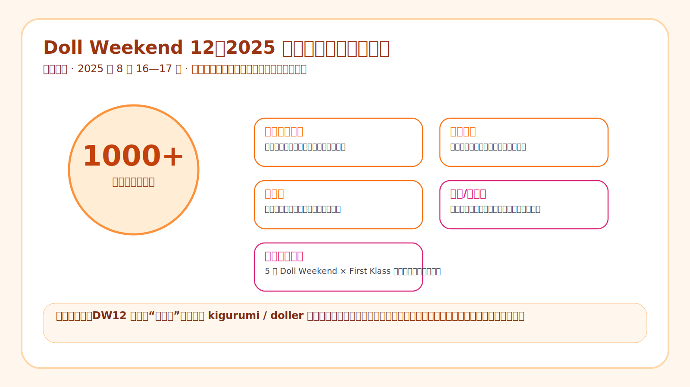

# 2025 年 Kigurumi 编年史

> **版本说明**  
> 本文是将前一版长文整理成的 Markdown 图文档。为了避免“通篇文字”，文档中穿插了原创信息图、时间轴、表格和事件卡片。图表均为基于公开资料抽象整理的原创 SVG，不使用第三方照片，因此更适合长期保存、转发与二次编辑。

---

## 目录

- [0. 阅读口径与资料边界](#0-阅读口径与资料边界)
- [1. 年度总览：2025 年为什么重要](#1-年度总览2025-年为什么重要)
- [2. 编年史正文](#2-编年史正文)
- [3. 主要人物、组织与场域索引](#3-主要人物组织与场域索引)
- [4. 正面事件、负面事件、考究事件与传闻事件总账](#4-正面事件负面事件考究事件与传闻事件总账)
- [5. 年度结论](#5-年度结论)
- [6. 参考资料](#6-参考资料)

---

## 0. 阅读口径与资料边界 {#0-阅读口径与资料边界}

### 0.1 本文所说的 kigurumi，不只是一种东西

2025 年的公开资料里，**kigurumi** 这个词在不同语境中含义不同。本文主要讨论中文/日文社群常说的 **animegao kigurumi / 美少女着ぐるみ / 面具型角色扮演 / Kig / Kiger / 变娃**，但也会把官方 IP 人偶装、doller、furry、gawa-cos、特摄式全头套等相邻场域分开写清楚。

为了避免概念混乱，本文采用以下分层：

| 层级 | 主要内容 | 在 2025 年中的体现 |
|---|---|---|
| **Animegao / Kig / Kiger** | 动画脸面具、紧身衣、角色服装、摄影与表演 | 东京“きぐるみパーティ!”、Anime North 制面工作坊、玩家摄影记录 |
| **Doller / 娃 / 变娃** | 中文圈常见表达，更强调“娃化”、身体沉浸与大型聚会 | Doll Weekend 12、Doll Weekend × First Klass 日本企划 |
| **官方 Mascot / IP Greeting** | 品牌方制作和运营的官方角色人偶装 | FGO、hololive、Aniplex 在 AnimeJapan、FGO Fes、Anime Expo 等展会的官方登场 |
| **Furry / Gawa-cos / 全头套** | 兽装、特摄式皮套、头盔、全脸面具等相邻全身装扮 | WCS 规则、九州“着ぐるみ大行進!”将其与 kigurumi 并列管理 |
| **连体睡衣语境** | 英文电商里常见的 animal onesie / 家居服 | 本文不作为主线，只在术语边界中说明 |

Animegao kigurumi 通常指佩戴角色面具、搭配肤色紧身衣或全身衣、尽量让身体与角色造型统一的表演/摄影型 cosplay；“kigurumi”本身来自“穿着”与“玩偶/布偶”的组合，“animegao”强调“动画脸”。[^animegao]

### 0.2 资料等级

本文以公开可检索资料为基础：官方活动页、主办方规则、媒体报道、品牌公告、公开社群文章和匿名论坛索引。不同资料的可信度不同：

| 资料类型 | 可信度 | 本文处理方式 |
|---|---:|---|
| 官方活动页、主办方规则、政府/主办方公告 | 高 | 可作为日期、地点、规则、活动性质的主要依据 |
| 媒体报道、品牌新闻稿 | 较高 | 可作为规模、官方安排、展会亮点依据；注意宣传口径 |
| 参与者公开文章 | 中 | 可记录体验、术语、社群观察；不扩大为全社群事实 |
| 匿名论坛、传闻贴 | 低 | 只记录“传闻场域存在”和治理压力，不复述未核实指控，不点名个人 |

### 0.3 传闻与负面内容的处理原则

本文不会把匿名爆料写成确定事实，也不会点名未被可靠来源证实的个人。对小圈层而言，角色名、账号、头壳、现实身份之间可能错位，未经核实的点名会造成长期伤害。因此，本文对负面内容采用“现象与治理问题”写法：记录摄影同意、网络骚扰、匿名舆论、身体安全、跨境物流等问题，而不把传闻当作判决书。

---

## 1. 年度总览：2025 年为什么重要 {#1-年度总览2025-年为什么重要}

2025 年的 kigurumi 不是一个只有“几场聚会”的小年，而是呈现出五条主线并行：

1. **规模化**：中国 Doll Weekend 12 公开记录 1000+ 参与者，并出现娃主题烟花秀、无人机秀、娃游行等大型节目。[^dw-cn]
2. **制度化**：东京“きぐるみパーティ!”、北九州“着ぐるみ大行進!”、WCS 遮面规则、Lagucos 水域限制等资料显示，kigurumi 正在被活动规则明确管理。[^kigupa][^wcs-rule]
3. **技术化**：Kigurumi Online 在 Anime North 2025 的工作坊把 animegao 历史、制面、眼形、假发与佩戴适配转化为新人可学习流程。[^kig-o]
4. **跨境化**：Doll Weekend × First Klass 日本企划、北美 Anime North、美国 Anime Expo、日本 WCS、中国 DW12、欧洲 KaoKig 线索共同显示多地区连接正在增强。[^dw-cn][^aniplex-ax][^japanexpo]
5. **争议化**：匿名论坛、网络骚扰、摄影同意、过热脱水、池边安全、关税物流等问题在 2025 年都更加可见。[^wcs-party][^lagucos][^blackcat]

用一句话概括：**2025 年的 kigurumi 从“小众视觉奇观”进一步转向“活动生态、产业链、跨境网络和规则治理并存的复合文化”。**

---

## 2. 编年史正文 {#2-编年史正文}

### 1 月：术语边界与“社群身份”的年初基调

| 项目 | 内容 |
|---|---|
| 时间 | 2025 年 1 月前后 |
| 类型 | 考究事件 / 术语整理 |
| 核心问题 | “kigurumi”在不同国家、平台和社群中指向不同对象 |
| 相关资料 | animegao/kigurumi 介绍资料、中文/日文跨语境参与者文章 |

2025 年初并没有一个全球统一的大型 kigurumi 事件成为公开焦点，但这一时期适合作为编年史开头，因为随后全年发生的许多事件都会混用 **kigurumi、animegao、mask cosplay、doller、gawa-cos、mascot、furry、onesie** 等词。

中文互联网上也没有完全统一的译名：有人说“Kig”，有人说“变娃”，有人把表演者称为“Kiger”，有人则把“皮”“头壳”“娃头”“全身衣”“假发”“眼片”分开讨论。2025 年一篇参与者观察文章提到，中文圈常直接使用 Kigurumi 或 Kig，表演者被称为 Kiger，并把紧身衣与头部面具视为基础构成。[^note-term]

这条“术语线”对 2025 年很重要，因为同样写作 kigurumi，在不同资料中可能指向完全不同对象：

- 在日本 cosplay 规则中，它可能指“面部被遮挡、需要安全确认的全头套服装”。
- 在 FGO、hololive、Aniplex 展会中，它往往指官方角色吉祥物式人偶装。
- 在中国 Doll Weekend 语境中，它更接近“动漫娃”“Kig”“Kiger”“变娃”“全身角色化”。
- 在欧美电商语境中，它又常被误解为动物连体睡衣。

因此，2025 年的 kigurumi 编年史必须先做分层，否则很容易把“官方吉祥物登场”“animegao 玩家聚会”“睡衣销售趋势”混为同一类事件。

从社群身份看，2025 年的 kigurumi 处在微妙位置：一方面，它已经有固定活动、工作坊、专业制作者、摄影师、跨国参展者；另一方面，外部观众仍容易用“怪”“神秘”“难以辨认身份”等词理解它。这个矛盾贯穿全年：主办方越愿意提供空间，就越需要规则；社群越公开展示，就越需要处理误解、偷拍、身份边界、匿名爆料和安全问题。

---

### 2 月 24 日：东京“第 3 回・きぐるみパーティ!”——专门面具型活动的制度化

| 项目 | 内容 |
|---|---|
| 时间 | 2025 年 2 月 24 日，10:00—16:30 |
| 地点 | 日本东京台场地区，国際交流館プラザ平成 |
| 类型 | 社群专门活动 / 面具型着ぐるみ活动 |
| 主线意义 | kigurumi 被当作需要专门场地、动线、更衣和摄影规则的参与形式 |
| 主要依据 | Cosplay 博 / C-NET 官方活动页[^kigupa] |

2025 年 2 月 24 日，日本东京台场地区的 Plaza Heisei 举办了“第 3 回・きぐるみパーティ!”。官方活动页明确把它写成“面具型着ぐるみ事件”，活动对象并非普通 cosplay 综合场，而是更偏向“顔が隠れる / 面部被遮挡”的 kigurumi、全头套、面具类角色扮演者。[^kigupa]

这场活动的核心价值在于**专门化**。普通漫展对 kigurumi 的容纳往往受制于人流、视线、摄影、行动不便、更衣空间与安全确认；而“きぐるみパーティ!”提供的是更接近“为面具角色设计的空间”。官方说明中列出了室内外摄影区域，包括湾岸广场、瀑布广场、和风庭园、芝生广场、林间木平台等，也强调会有大型更衣室、较不易被一般路人围观的区域、明亮室内空间、私人感较强的区域，以及团体合照和 runway 企划。[^kigupa]

从编年史角度看，这场活动说明日本 kigurumi 社群在 2025 年初已经形成较成熟的活动基础设施意识。kigurumi 的痛点并不只是“穿上头壳”，而是整个活动链条：入场前需要头壳与服装运输；现场需要更衣、补妆和头壳内衬调整；拍摄时需要避开无授权路人；移动时可能需要陪同或视野辅助；长时间佩戴还需要休息、补水和通风。若活动能预先划定拍摄点、集中更衣与交流区域，就能显著降低 kigurumi 参与大型活动时的风险。

这也是 2025 年正面事件中的一个标志：**kigurumi 被当成需要专门设计的参与形式，而不是普通 cosplay 的附属物。** 团体照和 runway 企划尤其重要，因为它们把 kigurumi 从“被拍摄的个体”提升到“可以共同展示的群体”。在社群史上，这类活动往往会留下大量非正式照片、合照与口碑，虽然并不是所有内容都被官方长期保存，但活动页本身已经证明：面具型 kigurumi 在东京仍有稳定的组织能力和参与需求。

---

### 3 月上旬：hololive SUPER EXPO 2025 的官方吉祥物式 kigurumi 登场

| 项目 | 内容 |
|---|---|
| 时间 | 2025 年 3 月，hololive SUPER EXPO 2025 期间 |
| 类型 | 官方 IP / Kigurumi Greeting |
| 主要角色 | Ankimo、Mikodanye、Fubuzilla、Fubra、Hairball Korone、Subaru Duck、Smol Ame、Houshou Bearine、UDIN 等 |
| 主线意义 | VTuber 虚拟角色被线下实体化，kigurumi 成为官方粉丝互动工具 |
| 主要依据 | hololive SUPER EXPO 2025 官方 greeting 公告[^hololive] |

3 月，hololive SUPER EXPO 2025 公布了“着ぐるみグリーティング / Kigurumi Greeting”安排。它并不是 animegao 爱好者聚会，而是 VTuber 品牌方安排的官方角色吉祥物互动。公告中列出了展馆内 greeting 的时间段与角色安排，包括 Ankimo、Mikodanye、Fubuzilla、Fubra、Hairball Korone、Subaru Duck、Smol Ame、Houshou Bearine、UDIN 等，并安排了 DAY 1、DAY 2 的多时段会面以及 kigurumi stage。[^hololive]

这类官方 greeting 对 2025 年 kigurumi 公共可见度有特殊意义。VTuber 角色本身是虚拟形象，而 kigurumi greeting 将其转化为可在会场移动、合影、挥手、互动的“实体”。这种实体化与 animegao kigurumi 有亲缘关系：两者都把二维或拟人角色通过头部造型、身体比例、服装材质和动作语言转化为现实存在；但它们的组织逻辑不同。官方 kigurumi 是品牌资产，动作和接触边界通常受运营方控制；爱好者 animegao 则更接近个人表达、摄影创作和社群交流。

这类官方 greeting 对核心社群既有正面影响，也有边界压力。正面影响是：更多普通观众会逐渐习惯“二次元角色以全头套/人偶装形式出现”，降低陌生感。边界压力是：大众可能把商业吉祥物、furry、animegao、doller、特摄皮套混为一谈。2025 年很多讨论的难点正出在这里：kigurumi 的公共形象变得更可见，但“可见”并不等于“被理解”。

---

### 3 月 22—23 日：AnimeJapan 2025 与 FGO 官方 kigurumi greeting

| 项目 | 内容 |
|---|---|
| 时间 | 2025 年 3 月 22—23 日 |
| 地点 | 东京 Big Sight，AnimeJapan 2025 |
| 类型 | 官方 IP / 展位互动 / cosplay & kigurumi greeting |
| 主线意义 | 大型商业动漫展将 kigurumi 纳入角色互动和展位运营 |
| 主要依据 | FGO 官方 AnimeJapan 2025 页面[^fgo-aj] |

3 月 22—23 日，AnimeJapan 2025 在东京 Big Sight 举办，Fate/Grand Order 官方展位安排了 cosplay / kigurumi greeting。官方页面列出 3 月 23 日多个 greeting 时间段，包括上午、午前、下午与傍晚的安排，其中部分时段也标注了中止信息。[^fgo-aj]

FGO 的情况很有代表性。它的世界观庞大，角色众多，观众对角色外观识别度高；官方 cosplayer 与 kigurumi 的组合，能在展位前制造“角色降临”的感受。与单纯展板、PV、周边售卖相比，kigurumi greeting 更依赖现场秩序：排队、拍照、动线、摄影许可、停留时间、角色间互动都需要控制。如果没有清晰规则，容易出现拥堵、偷拍、推搡或误触问题。

从 kigurumi 编年史角度看，AnimeJapan 2025 的 FGO greeting 显示出一种趋势：**大型 IP 已经把 kigurumi 当成线下传播工具，而不是临时玩偶服。** 这与爱好者圈的意义不同，但会反过来影响圈外认知。观众可能先在 FGO、hololive、Aniplex 展位认识“会动的角色”，再逐渐接触 animegao 或 doller 社群。也正因此，2025 年 kigurumi 的历史不能只写玩家聚会，也必须写官方 IP 的实体角色运营。

---

### 5 月 23 日前后：Anime North 2025 与 Kigurumi Online 制面工作坊

| 项目 | 内容 |
|---|---|
| 时间 | 2025 年 5 月 23 日前后 |
| 地点 | 加拿大，多伦多 Anime North 2025 |
| 类型 | 技术传播 / 入门教育 / 北美社群活动 |
| 主线意义 | kigurumi 的制作知识被转化为可教学、可商业化的入门流程 |
| 主要依据 | Anime North 展商/活动信息、Kigurumi Online workshop 页面[^animenorth][^kig-o] |

2025 年 5 月，北美重要动漫展 Anime North 继续成为 kigurumi 社群的重要节点。Kigurumi Online 在 Anime North 相关页面中被列为参展方，位置在 TCC South Hall AB 的行业目录中；同时，Kigurumi Online 还举办了面向入门者的 workshop，时间标注为 2025 年 5 月 23 日晚。[^animenorth][^kig-o]

这场 workshop 的内容非常值得写入 2025 年编年史。它不是简单的“讲座”，而是围绕 animegao kigurumi 的历史、知名 makers、制作方法与个性化面具搭建展开。官方说明提到，参加者会制作一只 customized starter mask，并能选择眼形、眼色、睫毛、眉毛、假发款式、假发颜色，还会根据头型进行填充与佩戴适配，最终带走一只能穿戴的面具。[^kig-o]

这说明北美 kigurumi 社群在 2025 年有一个很重要的方向：**把技术门槛转化为可教学、可商业化、可入门的流程。** 传统 animegao kigurumi 的入门难点很高：头壳来源、脸型比例、眼片、假发固定、内衬、通风、视野、肤色衣匹配、体型填充、角色服装都可能成为障碍。工作坊把这些复杂问题拆成“可选择、可组装、可试戴”的步骤，降低了新人的心理门槛。

Anime North 本身也长期被视为北美 kigurumi 活动的重要地点之一，kigurumi-animegao.fr 的活动页把 Anime North 列为有较多北美 kigurumi 参与者的展会。2025 年个人公开记录中，也有参与者回顾 Anime North 2025 的多日拍摄与换装安排。这类个人记录虽然不等同官方数据，但对编年史很有价值，因为它保留了社群真实运作方式：多日参展、角色轮换、摄影互助、体力消耗、组织者协作、展后致谢。[^animegao-events]

这也是 2025 年的正面事件之一：kigurumi 不再只是“已经会的人自己玩”，而是开始有更清晰的新人培养机制。一个能让新手当场理解历史、认识 makers、学习制作方法并带走面具的 workshop，本质上是在扩大社群再生产能力。

---

### 5 月：Doll Weekend × First Klass 日本企划——中国“娃/Kig”体系的海外伸展

| 项目 | 内容 |
|---|---|
| 时间 | 2025 年 5 月 |
| 地点 | 日本 |
| 类型 | 跨境合作 / 摄影会 / Doll Weekend 海外线 |
| 主线意义 | 中国 Doll Weekend 体系从国内大型活动延伸到日本合作场域 |
| 主要依据 | Doll Weekend 官方页面[^dw-cn] |

2025 年 5 月，Doll Weekend 官方页面记录了 “Doll Weekend × First Klass” 日本企划，称其为 Doll Weekend 的首次海外亮相，并与 First Klass 摄影会共同举办。[^dw-cn]

这一节点在 2025 年 kigurumi 编年史中很关键，因为它显示中国 Doll Weekend 体系并不是只在国内扩张，而是开始以摄影会、跨国合作和海外登场的形式进入日本场域。First Klass 本身在日系摄影、cosplay 与角色扮演语境中具有高质量摄影会意味，Doll Weekend 与其合作，说明“娃/Kig”不只是展会游行，也进入了更精致化、棚拍化、作品化的方向。

这类跨境活动的文化意义比较复杂。日本是 animegao kigurumi、doller、着ぐるみ摄影传统的重要发源与发展地之一；中国近年来则在“娃”“Kig”“Kiger”“大型线下聚会”“展商和工坊”方面迅速扩大规模。Doll Weekend 在 2025 年赴日，与其说是单向输出，不如说是中日之间重新接线：日本提供历史与摄影审美传统，中国提供规模化组织、展会化包装与新玩家增长。

从正面角度看，这标志着亚洲 kigurumi / doller 圈的联系加深；从潜在问题看，跨境活动也会带来翻译、规则、版权、摄影同意、商业身份、签证旅行、器材运输等复杂问题。尤其对于头壳、假发、紧身衣、角色服装和摄影器材都高度依赖运输的玩家来说，海外活动的门槛远高于普通 cosplay。

---

### 6 月 1 日：北九州“着ぐるみ大行進！3”——九州全身装扮社群的集中节点

| 项目 | 内容 |
|---|---|
| 时间 | 2025 年 6 月 1 日 |
| 地点 | 北九州相关场地，Mikuni World Stadium Kitakyushu 相关信息 |
| 类型 | 地方社群活动 / 全身 cosplay 交流会 |
| 主线意义 | 九州地区形成 kigurumi、doller、furry、gawa-cos 共处的地方平台 |
| 主要依据 | Cospic / 着ぐるみ大行進 系列页面[^kigdai] |

2025 年 6 月 1 日，“着ぐるみ大行進！3”在北九州相关场地举办。Cospic 页面把该系列称为“九州最大级的着ぐるみ交流会”，并说明它的目标是在九州创造一个能让 kigurumi 参与者相聚的地方。主办相关信息中出现了九州化装会、i-key、cospic 代表“らいむ”等组织与人物；活动所涵盖的类型并不只限 animegao，还包括美少女着ぐるみ、ドーラー、ケモノ系/furry、ヒーロー系ガワコス等“全身 cosplay”。[^kigdai]

这场活动的重要性在于**地方化**。东京、大阪、名古屋等地长期更容易被视为日本 cosplay 与 kigurumi 的中心，但九州的“着ぐるみ大行進!”说明地方社群也在建立自己的固定平台。活动页面强调会场、更衣室、交流空间、JR 小仓站步行可达和停车等条件。这些看似基础的条件，对 kigurumi 来说其实是决定活动能否成立的核心。

普通 cosplay 可能只需要换衣、化妆、携带道具；kigurumi 往往还要处理头壳箱、身体填充、视野限制、陪同移动、休息降温、头壳摘戴隐私、角色状态维持等问题。一个地方活动若能提供稳定动线、明确更衣、摄影交流和社交空间，就等于把“能不能来”这个问题从个人体力问题变成组织保障问题。

“着ぐるみ大行進！3”还体现出 2025 年 kigurumi 社群的另一个特征：不同全身装扮分支开始共处。美少女着ぐるみ、doller、furry、hero/gawa-cos 的审美差异很大，但它们共享许多实际问题：头部遮挡、炎热、移动困难、摄影规则、公众识别、身份边界、换装需求。九州活动把它们放进同一交流会，说明 2025 年“kigurumi”在活动治理层面越来越像一个广义的“全身角色化”类别，而不是单一风格。

---

### 6 月 17 日前后：BlackCatKig / Inthemask 的美国关税与转运仓公告——产业链压力浮出水面

| 项目 | 内容 |
|---|---|
| 时间 | 页面最后更新为 2025 年 6 月 17 日；公告涉及 2025 年 5 月 8 日后的发货调整 |
| 类型 | 产业链 / 跨境物流 / 关税压力 |
| 主线意义 | kigurumi 已经深度依赖跨境制造、转运仓、清关和交期管理 |
| 主要依据 | BlackCatKig / Inthemask 美国客户通知页面[^blackcat] |

2025 年并不只有展会和聚会，也有供应链事件。BlackCatKig 在关于美国关税的页面中说明，受政策与物流环境影响，Inthemask 订单从 2025 年 5 月 8 日起改由宁波的新转运仓发货，总部仍在上海；页面还提到美国买家可能面对约 1% 至 10% 的关税，空运时间也可能延长，当前预计运输时间为 9 至 15 个工作日左右。该页面最后更新日期为 2025 年 6 月 17 日。[^blackcat]

这是一条很容易被忽视、但对 2025 年 kigurumi 生态很重要的记录。kigurumi 玩家不像普通服装消费者，许多头壳、紧身衣、假发、眼片、定制角色服、特殊配件都高度依赖跨境购买。一个面具订单可能涉及中国制作、国际发货、美国或欧洲清关、买家自改内衬、再参加漫展。关税和物流延迟不只是“多付钱”，而是会影响玩家能不能赶上活动、能不能完成新角色、能不能按计划参加摄影会。

从负面事件角度看，这不是社群内部冲突，而是外部经济环境对 kigurumi 的冲击。2025 年美国关税与物流变化让制作方必须调整仓储和发货路径，也让买家承担更多不确定性。对于新人来说，等待周期和额外费用会抬高入门门槛；对于 makers 来说，售后沟通、税费解释、运输风险和交期压力也会增加。

这条事件还说明，kigurumi 已经是一个跨境制造行业，而不只是“同好自制”。当 kigurumi 面具和服装进入国际订单体系后，它就会受到国际贸易、仓储、清关、平台支付和售后政策影响。2025 年的 kigurumi 编年史若只写展会，会遗漏这种“产业基础设施”的变化。

---

### 7 月：Anime Expo 2025 与 Aniplex 官方 kigurumi——美国大型展会中的 IP 实体化

| 项目 | 内容 |
|---|---|
| 时间 | 2025 年 7 月 Anime Expo 期间 |
| 地点 | 美国洛杉矶 Anime Expo，Aniplex of America Booth #1920 |
| 类型 | 官方 IP / 大型展会 / Kigurumi mascot appearances |
| 主线意义 | 北美大型动漫展中，官方 kigurumi 成为展位运营和粉丝互动的一部分 |
| 主要依据 | Aniplex of America Anime Expo 2025 新闻稿 PDF[^aniplex-ax] |

2025 年 Anime Expo 期间，Aniplex of America 公布了其展位计划，官方新闻稿提到展位包含特别展示、迷你舞台、cosplay gatherings、活动与 kigurumi mascot appearances，并明确写到观众有机会看到来自 Fate/Grand Order 与 Demon Slayer: Kimetsu no Yaiba 的 kigurumi。展位面积约 9,300 平方英尺，位置为 Booth #1920。[^aniplex-ax]

这不是核心 animegao 社群聚会，但它对 kigurumi 的公共史非常重要。Anime Expo 是北美最具影响力的动漫展之一，Aniplex 在这样的大型会场安排 kigurumi，说明“角色实体化”已经是国际动漫营销中的成熟手段。观众在会场看到的并不是普通吉祥物，而是与具体二次元 IP、官方舞台、周年活动、展位导流和粉丝互动绑定的角色化身体。

它与 Anime North 的 Kigurumi Online workshop 形成鲜明对比：Anime North 的 kigurumi 线偏向玩家技术、社群教学和个人创作；Anime Expo 的 Aniplex kigurumi 线则偏向官方 IP、品牌运营和粉丝服务。两者共同构成了北美 2025 年 kigurumi 可见度的两端：一端是“如何成为 kigurumi 玩家”，另一端是“普通观众如何在大展会遇见官方 kigurumi”。

这种双轨结构对社群有长远影响。官方 kigurumi 的专业化会提高观众期待，例如造型完整度、动作训练、拍照秩序、角色性格表达；而玩家社群则可能因此受到更高审美标准和更强公众凝视。2025 年以后，kigurumi 玩家在大型展会出现时，常常不仅被当作普通 cosplayer，也会被观众拿来和官方人偶服、主题乐园角色、品牌 mascot 比较。这既带来尊重，也带来压力。

---

### 7 月：Japan Expo 2025 与欧洲 animegao 线索——KaoKig 的持续存在

| 项目 | 内容 |
|---|---|
| 时间 | 2025 年 7 月 Japan Expo 期间 |
| 地点 | 法国巴黎 Japan Expo |
| 类型 | 欧洲 animegao 公开线索 / 展会记忆资料 |
| 主线意义 | 欧洲 kigurumi/animegao 线不是爆发式增长，而是持续性公开存在 |
| 主要依据 | Japan Expo 2025 cosplay memories 页面、Kigurumi-animegao.fr 活动页[^japanexpo][^animegao-events] |

法国 Japan Expo 2025 的公开回顾资料中，可以检索到 cosplay 记忆页面提及 KaoKig 相关内容。KaoKig 是欧洲 animegao / kigurumi 圈中较有代表性的组织名，早年也曾以 Japan Expo 展位、展示、试戴、摄影区和与 cosplayer 交流等形式向公众介绍 animegao kigurumi。2025 年可见资料不如日本和中国大型活动完整，因此这一段应归为“欧洲公开线索”，而不是像 Doll Weekend 12 或 WCS 那样的强证据大型节点。[^japanexpo]

即使证据力度较弱，欧洲线仍值得写入编年史。kigurumi-animegao.fr 的活动页本身就把欧洲、北美和日本的活动环境联系起来，提到 Kigurumi Europe、Anime North、Anime Expo 等场域。欧洲 animegao 圈不像中国 Doll Weekend 那样以巨大规模成为焦点，也不像日本那样有多个本土规则化活动，但它长期承担着“向公众解释 animegao kigurumi 是什么”的任务。[^animegao-events]

从 2025 年的全球图景看，欧洲线的关键词不是“爆发”，而是“延续”。它体现的是小众社群在大型综合展中的持续露面：通过展位、合影、科普、试戴和 cosplayer 交流，降低观众对面具型角色的陌生感。这种慢速存在对 kigurumi 文化很重要，因为它不像官方 IP mascot 那样依靠品牌吸引人，而是把“面具角色扮演作为一种爱好”本身展示给公众。

---

### 8 月 1—3 日：World Cosplay Summit 2025——主流 cosplay 体系对“遮面服装”的规则承认

| 项目 | 内容 |
|---|---|
| 时间 | 2025 年 8 月 1—3 日 |
| 地点 | 名古屋与爱知，World Cosplay Summit 2025 |
| 类型 | 主流 cosplay 大会 / 规则治理 / 遮面服装承认 |
| 主线意义 | kigurumi、gawa-cos、doller、全脸面具与头盔类服装被明确纳入可管理范围 |
| 主要依据 | 日本外务省活动记录、WCS 2025 cosplay 规则[^mofa-wcs][^wcs-rule] |

2025 年 8 月 1—3 日，World Cosplay Summit 在名古屋与爱知举办。日本外务省页面记录，2025 年 World Cosplay Championship 有包括日本在内的 41 个国家和地区代表队参与，美国队获得冠军并获外务大臣奖；该活动自 2003 年开始，2025 年已经是第 23 年。[^mofa-wcs]

对 kigurumi 来说，WCS 2025 最重要的不是冠军归属，而是活动规则。WCS 相关规则中明确写到，因为 WCS 的特殊性，在 Flarie 会场允许 kigurumi、gawa-cos、doller、全脸面具、头盔等“面部隐藏”的服装参加，但安保可能会要求确认面部，参与者需听从工作人员指示。[^wcs-rule]

这是一条非常关键的“制度性正面事件”。很多大型活动对遮面服装天然警惕，因为它涉及身份确认、安全、偷拍、未成年人保护、紧急疏散和会场责任。WCS 2025 没有简单禁止，而是采用“允许参加 + 必要时确认面部 + 遵守工作人员指示”的方式，把 kigurumi 纳入可管理范围。这比“默许”更重要，因为默许会让参与者不确定自己是否随时被要求离场；明确规则则给玩家和工作人员都提供了边界。

WCS 2025 同时也体现了风险治理。另一份 WCS 派对/规则文件中提到，工作人员可能拒绝过度暴露、过尖、过长、难以行走，或可能导致脱水的 kigurumi 等服装；摄影规则也强调不得长时间占用场地、不得进行低角度或内衣偷拍，照片上传需取得被摄者同意。[^wcs-party]

这说明 2025 年大型 cosplay 活动对 kigurumi 的态度不是“欢迎但不管”，而是“欢迎，但必须纳入安全、摄影和公共秩序”。这对社群既是保护也是约束。保护在于，kigurumi 玩家获得合法出现的空间；约束在于，玩家不能只按私人摄影会标准行动，而必须考虑公众场地、他人肖像权、行动安全和工作人员管理。WCS 2025 因此可以被视为 2025 年 kigurumi 规则史上的重要节点。

---

### 8 月 1—3 日：Lagucos / WCS 周边规则中的安全边界——池边、海滩与过热问题

| 项目 | 内容 |
|---|---|
| 时间 | 2025 年 8 月 1—3 日相关活动期 |
| 类型 | 安全规则 / 水域限制 / 夏季风险治理 |
| 主线意义 | kigurumi 的身体风险被活动规则明确承认 |
| 主要依据 | Lagucos 2025 petite 规则 PDF、WCS 派对规则 PDF[^lagucos][^wcs-party] |

同在 WCS 相关时间段，Lagucos 2025 petite 规则显示出 kigurumi 安全管理的另一面。规则中对泳池和海滩区域做出限制，包括禁止在特定深度以上入水、禁止携带危险物、摄影器材只能在池边特定条件下使用，并明确禁止穿着全身涂装或 kigurumi 风格服装入水。[^lagucos]

这条规则从负面/风险角度很有代表性。很多外部观众看到 kigurumi 只会想到“可爱”“还原”“拍照好看”，但活动主办方面对的是现实风险：头壳遮挡视野，紧身衣与填充会吸水变重，服装可能影响体温调节，角色鞋可能打滑，表演者在水边跌倒时也更难自救。禁止 kigurumi 入水不是歧视，而是对身体状态、材料和行动能力的安全判断。

这与 WCS 派对规则中关于脱水风险的提醒形成呼应。夏季日本高温潮湿，8 月名古屋、爱知一带本来就是容易中暑的环境。kigurumi 玩家为了保持角色形象，往往不方便频繁摘头、补水或大幅散热；如果再参与长时间排队、夜间街拍、户外移动，就会累积风险。2025 年规则文件把“kigurumi 可能导致脱水”写进工作人员判断范围，说明主办方已经把它当成现实安全问题，而不是玩家自己负责的小事。[^wcs-party]

这一段是 2025 年 kigurumi 负面史里最应被认真记录的部分。负面不一定是丑闻，也可以是风险被制度承认。真正成熟的社群不是没有风险，而是能把风险写成规则、让玩家提前知道边界，并给工作人员执行依据。

---

### 8 月 2—3 日：FGO Fes. 2025 十周年——9 名 kigurumi 与 14 名官方 cosplayer 的大规模官方呈现

| 项目 | 内容 |
|---|---|
| 时间 | 2025 年 8 月 2—3 日 |
| 地点 | 千叶幕张 Messe |
| 类型 | 官方 IP / 十周年活动 / 大规模 greeting |
| 主线意义 | FGO 将官方 cosplayer 与 kigurumi 作为十周年沉浸式体验的重要组成 |
| 主要依据 | LevelUp Logy 报道[^fgo-fes] |

2025 年 8 月 2—3 日，Fate/Grand Order Fes. 2025 在千叶幕张 Messe 举办，主题与 FGO 十周年相关。媒体报道记录，该活动为十周年最大规模活动之一，现场有 14 名官方 cosplayer 与 9 名 kigurumi 角色迎接来场者。[^fgo-fes]

这场活动与 AnimeJapan 2025 的 FGO greeting 是同一条官方 IP 线的延伸，但规模和象征性更强。十周年活动本身具有纪念属性，官方 cosplayer 与 kigurumi 同台出现，说明 FGO 把“真人角色化身体”作为庆典体验的重要组成。对粉丝来说，kigurumi 的功能不仅是“拍照道具”，而是把游戏中的从者、吉祥物或角色意象带进现实空间，使展会具有沉浸式巡游感。

这类活动对 animegao 社群的影响是双向的。正面是：官方 kigurumi 的频繁出现使观众更熟悉“头套角色可以有表演、情绪和互动”，降低普通观众面对 kigurumi 玩家时的惊讶。负面或压力是：官方 kigurumi 通常背后有团队、造型标准、动作规范、摄影秩序和版权授权，个人玩家很难与其同等比较。观众如果不了解差异，可能会用商业活动标准评价个人爱好者。

从年度编年史看，8 月初出现了一个密集节点：名古屋的 WCS、幕张的 FGO Fes.、各类夏季 cosplay 活动几乎同时把 kigurumi、mask cosplay、官方角色服推到公众面前。2025 年 8 月可以说是全年 kigurumi 可见度最高的月份之一。

---

### 8 月 16—17 日：Doll Weekend 12 广东河源——中国 kigurumi / doller 规模化的年度核心事件

| 项目 | 内容 |
|---|---|
| 时间 | 2025 年 8 月 16—17 日 |
| 地点 | 广东河源，Sheraton Resort Hotel 相关报道 |
| 类型 | 中国 Doll Weekend / 千人级大型活动 / 展商与创作者生态 |
| 主要亮点 | 1000+ 参与者、娃主题烟花秀、无人机秀、娃游行、展商与创作者体系 |
| 主要依据 | Doll Weekend 官方页面、PR Times 日文发布[^dw-cn][^dw-pr] |

2025 年 8 月 16—17 日，Doll Weekend 12 在广东河源举行。Doll Weekend 官方页面称，DW12 有 1000+ 参与者，并出现了首个娃主题烟花秀、无人机秀和娃游行；官方也把 Doll Weekend 描述为全球规模最大的 dolls 与 creators 线下产业活动之一。[^dw-cn]

PR Times 的日文发布进一步把这场活动描述为“世界最大级 Kigurumi anime doll 大会”，地点为河源 Sheraton Resort Hotel，并提到活动主题、城市级政府支持，以及 HiDolls、HAMPOO LATEX、雷撃工房、猫豆腐、玄猫物語、狐妖手作等展商或相关创作方。该报道还解释了 kigurumi anime doll 的构成：以头壳、定制服装、整体身体协调与角色沉浸为中心。[^dw-pr]

这场活动是 2025 年全球 kigurumi 编年史里最值得重点书写的中国节点。它的关键不只在人数，而在活动形态发生变化：烟花、无人机、游行、度假酒店、展商、创作者、摄影、城市支持，这些元素使 Doll Weekend 12 不再像普通同好聚会，而更像一个带有产业展、嘉年华、视觉秀和城市活动属性的综合节庆。对中文“娃/Kig”圈而言，这意味着 kigurumi 已经具有足够规模，能支撑大型场地、商业赞助、跨地旅行和专门节目。

从正面角度看，DW12 展现了中国 kigurumi 社群的组织力。1000+ 规模对任何高成本、强装备、强摄影依赖的亚文化来说都不是小数字；烟花和无人机秀则意味着主办方试图把“娃”从小圈层拍照推向公共景观。娃游行尤其值得注意，因为它把原本分散在房间、棚拍、漫展角落中的角色身体组织成可观看的集体移动，这与日本“着ぐるみ大行進!”在命名和形式上有相似的“行进/游行”意味。

从风险角度看，规模化也会带来更复杂的问题。人数越多，越需要处理酒店动线、摄影授权、未成年人观看、角色接触边界、商业展商资格、版权角色使用、交通、医疗、降温、场地责任等事务。烟花和无人机秀让活动更壮观，但也意味着安全审批、天气、设备和城市管理的要求提高。2025 年的 Doll Weekend 12 因此既是正面高峰，也是“kigurumi 大型化之后必须面对治理问题”的标志。

---

### 9—10 月：中文/日文跨语境的参与者书写——“变娃”、身份体验与外部误读

| 项目 | 内容 |
|---|---|
| 时间 | 2025 年 10 月前后 |
| 类型 | 参与者写作 / 术语考究 / 社群自我解释 |
| 主线意义 | kigurumi 进入更自觉的解释阶段，参与者开始跨语言说明“变娃”体验 |
| 主要依据 | note.com 公开文章[^note-term][^note-harass] |

2025 年 10 月，有中文/日文跨语境的公开文章以 Doll Weekend 与 kigurumi 体验为材料，尝试向日本读者解释中文圈的 Kigurumi / Kig / Kiger / 变娃文化。文章提到中文圈没有完全标准化的译名，常直接使用 Kigurumi、Kig，表演者则被称作 Kiger；也描述了头部面具、紧身衣、角色造型和“从现实身份进入角色身体”的体验。[^note-term]

这类文章不是活动公告，但应作为 2025 年的“考究事件”记录。因为它说明 kigurumi 进入了更自觉的解释阶段：参与者不只是穿戴和拍照，也开始写作、翻译、比较中日语境，并试图说明外界误读从何而来。对于一个小众文化来说，能够被参与者以第一人称经验写成文章，本身就是社群成熟的信号。

同时，这类文章也揭示了 2025 年的负面可见度问题。公开写作者提到自己在网络上发布相关内容后，曾收到带有骚扰性质的私信或评论，并将这类经历与外界对 kigurumi、latex、身体呈现的偏见联系起来。此处应谨慎理解：这是个人经验记录，不等同于整个社群普遍状况；但它确实说明，当 kigurumi 从私域走向公开平台后，参与者可能面对凝视、性化解读、误解、攻击或道德化评论。[^note-harass]

许多外部讨论会把 kigurumi 简化成“怪癖”“恋物”“男性扮女”“恐怖谷”或“儿童不宜”，但社群内部的动机更复杂：有人追求角色还原，有人享受匿名和表演，有人重视摄影作品，有人把它当作身体表达，有人则从工艺、头壳制作和服装搭配中获得乐趣。2025 年的公开书写把这些复杂性带到台面，也让争议更可见。

---

### 11 月 3 日：北九州“着ぐるみ大行進！4”——半年内二次举办，地方活动形成节奏

| 项目 | 内容 |
|---|---|
| 时间 | 2025 年 11 月 3 日 |
| 地点 | 北九州相关场域 |
| 类型 | 地方社群活动 / 系列化延续 |
| 主线意义 | 同年 6 月与 11 月连续举办，说明地方社群正在形成固定节奏 |
| 主要依据 | Cospic “着ぐるみ大行進！4”页面[^kigdai4] |

2025 年 11 月 3 日，“着ぐるみ大行進！4”继续在北九州相关场域举办。Cospic 页面延续了“九州最大级着ぐるみ交流会”的定位，仍然强调为九州 kigurumi 参与者创造相聚空间，并列出预报名、交流会、会场交通和更衣相关信息。该系列在 2025 年 6 月与 11 月都有公开记录，说明它并非一次性尝试，而是正在形成固定节奏。[^kigdai4]

“着ぐるみ大行進！4”的意义在于延续性。一次活动成功可能是偶然，两次在同一年内举办则说明地方社群有持续组织能力。对 kigurumi 来说，连续活动尤其重要：玩家需要提前制作新角色、安排运输、约摄影师、规划休息和补水，也需要通过反复参与建立信任关系。固定节奏会让新人更容易入圈，让摄影师更容易预约，也让主办方逐步完善规则。

公开检索片段还显示，该活动与 Mikusta Otaku Fes 等更广泛的 otaku 场域有关系，并提到活动后交流会对“戴着头壳、无法说话的状态”有所限制，希望参与者在交流时能以摘头或可沟通状态参加。这一点很值得记录：kigurumi 的魅力之一是“保持角色”，但社交环节又需要真实沟通、确认身份、表达同意和处理事务。活动规则把“角色状态”和“人际沟通状态”区分开来，实际上是在帮助社群避免误会。[^kigdai4]

这也是 2025 年制度化的一个细节：主办方越来越清楚，kigurumi 活动不是只有“拍照好看”就够了，还要处理“什么时候可以保持沉默角色，什么时候必须作为本人沟通”。这对避免边界纠纷、误会、骚扰指控和安全问题都很重要。

---

### 11 月下旬：匿名论坛“问题児观察”线程活跃——传闻、点名与社群治理的阴影面

| 项目 | 内容 |
|---|---|
| 时间 | 2025 年 11 月下旬，检索到 11 月 27 日前后相关线程 |
| 类型 | 传闻事件 / 匿名舆论场 / 社群治理压力 |
| 主线意义 | kigurumi 圈的公开规模和人际网络扩大后，纠纷、传闻和点名压力变得更可见 |
| 主要依据 | Kyodemo 线程索引、WikiFur 对相关匿名线程的说明[^kyodemo][^wikifur] |

2025 年 11 月下旬，日本匿名论坛可检索到“着ぐるみ関係の問題児観察スレ”等相关线程继续活跃，搜索结果显示第 12 个相关线程在 2025 年 11 月 27 日前后建立。WikiFur 对这类线程的介绍指出，它们属于围绕 kigurumi 圈内麻烦人物、事件和传闻的信息交换场所，但内容包含个人观点和偏见，不应无批判地相信。[^kyodemo][^wikifur]

这部分必须写入“传闻事件”，但不能当作事实清单。匿名论坛对小圈层有一种双重作用：一方面，它可能记录官方不会写入公告的纠纷，例如摄影边界、私下骚扰、活动礼仪、借物不还、冒犯行为、商业纠纷等；另一方面，它也可能放大偏见、旧怨、误认、恶意截图和未经核实的指控。kigurumi 圈因为参与者常常遮面、使用角色名、跨平台活动，匿名爆料更容易造成身份混淆和名誉伤害。

2025 年的传闻史不能写成“谁是谁非”的八卦簿，而应写成“社群治理压力”。当一个圈子活动越来越多、商业化程度提高、摄影作品传播更广、跨国玩家更多时，纠纷必然增加。问题在于：小圈层缺少正式仲裁机制，很多冲突只能靠主办方黑名单、私下提醒、匿名论坛、X 互相拉黑或社群口碑处理。匿名线程的存在说明 kigurumi 圈已经有足够复杂的人际网络，会产生“问题人物观察”这种二级舆论场。

负面意义在于，这类舆论会让新人感到恐惧，也可能让外部观众把少数争议当成整个社群的本质。正面意义则是，它提醒主办方必须建立更清晰的规则：摄影同意、未成年人边界、商业交易记录、活动报名身份确认、骚扰举报渠道、头壳状态下的沟通方式、社交会规则等。2025 年 WCS、Lagucos、着ぐるみ大行進 等活动文件中出现的安全和沟通规则，正可以看作对这种压力的制度化回应。

---

### 12 月：年末复盘——2025 年成为“扩张与规则并行”的一年

到 2025 年末，公开资料显示的 kigurumi 生态已经很清楚：日本有专门聚会和地方系列活动，北美有入门工作坊和大型展会官方 kigurumi，欧洲有持续性的 animegao 公开展示线索，中国 Doll Weekend 则把“娃/Kig”推向千人级、产业化、节庆化和跨国合作。与此同时，官方 IP、主流 cosplay 大会、匿名论坛、物流公告、安全规则和参与者文章共同构成了这一年的复杂面貌。

如果把 2025 年放进更长的 kigurumi 历史，它不是“起源年”，也不是“突然爆红年”，而更像一个**制度化转折年**。在这一年里，kigurumi 的几个关键问题都被公开写进资料：如何办专门活动，如何允许遮面服装进入主流 cosplay 大会，如何教新人制作面具，如何处理官方 IP 的角色实体化，如何面对跨境供应链，如何应对高温、摄影、池边和匿名爆料风险。

因此，2025 年 kigurumi 的年度总结可以写成一句话：**它从“少数玩家的奇观式出现”，进一步转向“有活动、有产业、有规则、有争议、有跨国网络的复合文化”。**

---

## 3. 主要人物、组织与场域索引 {#3-主要人物组织与场域索引}

| 组织 / 场域 | 2025 年定位 | 编年史意义 |
|---|---|---|
| **Cosplay 博 / きぐるみパーティ!** | 东京面具型 kigurumi 专门活动线 | 为“脸被遮挡的 cosplay”提供更合适的拍摄、更衣、团体照与 runway 空间，是日本本土活动制度化的代表之一。[^kigupa] |
| **九州化装会、i-key、Cospic、らいむ / 着ぐるみ大行進!** | 日本地方社群线 | 2025 年 6 月与 11 月连续活动，说明九州地区正在建立自己的 kigurumi / 全身 cosplay 交流平台。[^kigdai][^kigdai4] |
| **Kigurumi Online** | 北美技术传播与入门教育线 | Anime North workshop 将 animegao 历史、makers、制作方法、眼片、假发、内衬、佩戴适配等内容转化为可教学流程。[^kig-o] |
| **Doll Weekend 与 First Klass** | 中国“娃/Kig”大型化与跨国合作线 | 2025 年 5 月日本企划显示 Doll Weekend 走向海外合作，8 月 DW12 则显示中国线下活动的千人级与节庆化能力。[^dw-cn] |
| **BlackCatKig / Inthemask** | 制作、销售与跨境物流线 | 2025 年美国关税与宁波转运仓公告说明 kigurumi 已深度卷入国际订单、清关、税费和运输周期问题。[^blackcat] |
| **World Cosplay Summit** | 主流 cosplay 体系中的规则承认 | 2025 年规则允许 kigurumi、gawa-cos、doller、全脸面具和头盔类服装在特定场域参加，但保留安保确认与工作人员指示权。[^wcs-rule] |
| **FGO、Aniplex、hololive 等官方 IP 方** | 商业吉祥物式 kigurumi 与官方角色实体化 | AnimeJapan、FGO Fes、Anime Expo、hololive SUPER EXPO 等场域显示 kigurumi 是二次元 IP 线下运营的重要组成。[^fgo-aj][^fgo-fes][^aniplex-ax][^hololive] |
| **KaoKig 与欧洲 animegao 线** | 欧洲公开展示与科普线 | 2025 年 Japan Expo 相关可检索资料仍有线索，但公开资料完整度不如日本、中国和北美节点，应谨慎记录为“持续存在”。[^japanexpo] |

---

## 4. 正面事件、负面事件、考究事件与传闻事件总账 {#4-正面事件负面事件考究事件与传闻事件总账}

### 4.1 正面事件总账

| 主题 | 代表事件 | 意义 |
|---|---|---|
| 专门活动增加并稳定化 | 东京“きぐるみパーティ!”、北九州“着ぐるみ大行進!” | kigurumi 获得更衣、摄影、团体展示、交流空间等完整活动环境。[^kigupa][^kigdai] |
| 主流活动规则承认 | WCS 2025 遮面服装规则 | kigurumi、doller、gawa-cos 等不再只是被默许，而是进入“允许 + 安全确认”的治理框架。[^wcs-rule] |
| 新人培养路径清晰 | Anime North / Kigurumi Online workshop | 制面、眼形、假发、内衬适配等知识被转化为可教学流程。[^kig-o] |
| 中国 Doll Weekend 大型化 | DW12 河源 | 1000+ 参与者、烟花、无人机、娃游行、展商体系，说明中文圈具备大型组织能力。[^dw-cn][^dw-pr] |
| 跨国交流增强 | Doll Weekend × First Klass、Anime North、WCS、Anime Expo | kigurumi 在日本、中国、北美、欧洲之间形成多点连接。 |

### 4.2 负面事件与风险总账

| 风险类型 | 2025 年体现 | 为什么重要 |
|---|---|---|
| 高温、脱水与身体安全 | WCS 派对规则提到可能拒绝导致脱水的 kigurumi 等服装 | kigurumi 的身体负担被明确写入活动治理。[^wcs-party] |
| 水域与行动安全 | Lagucos 规则禁止全身涂装或 kigurumi 风格服装入水 | 头壳遮挡、服装吸水、视野与行动受限会放大水边风险。[^lagucos] |
| 摄影同意与偷拍 | WCS 规则强调不得低角度/内衣偷拍、上传需取得同意 | kigurumi 状态下非语言沟通多，明确规则能减少误解和伤害。[^wcs-party] |
| 网络骚扰与性化误读 | 参与者文章提到发布 kigurumi / latex 相关内容后遭遇骚扰性评论 | 公开化带来更多凝视，也让社群需要解释边界。[^note-harass] |
| 跨境税费与交期压力 | BlackCatKig / Inthemask 美国关税与转运仓公告 | 定制头壳和服装高度依赖国际物流，政策变化会影响玩家入门和参展计划。[^blackcat] |

### 4.3 考究事件总账

| 考究主题 | 2025 年可见材料 | 结论 |
|---|---|---|
| Animegao 与官方 mascot 的区别 | 玩家活动、官方 greeting、IP 展会资料 | 两者都把角色实体化，但一个偏个人/社群创作，一个偏官方运营。 |
| Doller、娃、Kiger 与“变娃” | 中文/日文跨语境文章、Doll Weekend 资料 | 中文圈术语正在形成自己的解释体系，并与日本传统发生再连接。[^note-term] |
| 遮面服装规则 | WCS、Lagucos、地方交流会规则 | kigurumi 进入主流活动后，身份确认、安全、摄影、沟通成为治理核心。 |
| kigurumi 与连体睡衣区别 | 英文语境常见误读 | 本文主线不是睡衣，而是面具型角色扮演、官方人偶装与全身装扮文化。 |

### 4.4 传闻事件处理原则

2025 年关于 kigurumi 的传闻主要集中在匿名论坛、X 转帖、私下社群截图和活动后口碑中。可以确认的是：匿名“问题人物观察”类场域确实存在，并在 2025 年继续活跃；不能确认的是：其中针对具体个人的指控是否真实、是否断章取义、是否经过当事人回应。WikiFur 对相关匿名线程的说明也提醒，这些内容包含个人意见和偏见，应谨慎看待。[^wikifur]

因此，本编年史只把它们记录为“社群治理压力”和“传闻场域”，不列具体人名，不复述未核实指控。对 kigurumi 这种小圈层来说，匿名爆料的伤害可能很大：角色名、头壳、账号、现实身份、活动照片之间存在错位，一旦误认，很难澄清。更负责任的写法是记录问题类型：摄影边界、社交骚扰、商业纠纷、活动礼仪、未成年人边界、身份确认、黑名单机制，而不是把匿名贴当作史料事实。

---

## 5. 年度结论 {#5-年度结论}

2025 年的 kigurumi 可以用五个关键词概括：

> **规模化**：Doll Weekend 12 达到 1000+ 参与者并出现烟花、无人机、游行等大型节目；WCS、FGO Fes、Anime Expo、AnimeJapan 等大型活动也让 kigurumi 或官方角色人偶服频繁进入公众视野。  
> **制度化**：东京“きぐるみパーティ!”、九州“着ぐるみ大行進!”、WCS 遮面服装规则、Lagucos 水域限制等资料显示，kigurumi 的活动条件正在被写成规则。  
> **技术化**：Anime North 的 Kigurumi Online workshop 把面具制作、眼形、假发、内衬适配和入门知识整合为教学流程，说明 kigurumi 的知识传播正在从师徒/私下咨询转向公开课程与商业服务。  
> **跨境化**：Doll Weekend 赴日合作、北美工作坊、日本 WCS、美国 Anime Expo、中国 DW12、欧洲 KaoKig 线索共同说明，kigurumi 在 2025 年已经是一个多地区互相观看、互相影响的网络。  
> **争议化**：匿名论坛、网络骚扰、摄影同意、儿童接触边界、过热脱水、跨境税费等问题在 2025 年都更加明显。它们不是 kigurumi 的全部，但它们提醒我们：一个文化越公开、越大型、越商业化，就越需要自我解释和制度保护。

最终，2025 年不是 kigurumi 的“边缘小众年”，而是一个**从小圈层持续走向公开场域、从个人爱好扩展为活动生态、从视觉奇观进入规则治理**的年份。它既有东京、九州、名古屋、幕张、多伦多、洛杉矶、河源、巴黎等地的多点记录，也有教学、展商、物流、匿名论坛和安全规则这些不那么显眼却更能说明成熟度的侧面。

---

## 6. 参考资料 {#6-参考资料}

[^animegao]: Kigurumi Animegao France, “Kigurumi Animegao,” <https://kigurumi-animegao.fr/>
[^kigupa]: Cosplay 博 / C-NET, “第3回・きぐるみパーティ!,” <https://cnet.cosplay.ne.jp/kigupa001.html>
[^hololive]: hololive SUPER EXPO 2025, “Kigurumi Greeting,” <https://hololivesuperexpo2025.hololivepro.com/news/greeting>
[^fgo-aj]: Fate/Grand Order, “AnimeJapan 2025 出展情報,” <https://news.fate-go.jp/2025/aj2025/>
[^animenorth]: Anime North 2025 industry / exhibitor information, <https://www.animenorth.com/index.php/component/sppagebuilder/?id=819&view=page>
[^kig-o]: Kigurumi Online, “Kigurumi Workshop,” <https://kig-o.com/index.php/kigurumi-workshop/>
[^animegao-events]: Kigurumi Animegao France, “Events,” <https://kigurumi-animegao.fr/Events/>
[^dw-cn]: Doll Weekend 官方页面, <https://dollweekend.cn/cn/>
[^kigdai]: Cospic, “着ぐるみ大行進” series category, <https://cospic.org/archives/category/event/kigdai>
[^blackcat]: BlackCatKig, “A Notice to US Customers,” <https://blackcatkig.com/pages/a-notice-to-us-customers?srsltid=AfmBOoruxavN6nFtN86FypnnRhYe5XVpHZKtpus8bQOPJBhYh9TlILNd>
[^aniplex-ax]: Aniplex of America, Anime Expo 2025 Press Release PDF, <https://aniplexusa.com/pdf/AOAAX25PRESSRELEASE.pdf>
[^japanexpo]: Japan Expo Paris, “Memories: Cosplay in Japan Expo 2025,” <https://www.japan-expo-paris.com/en/actualites/memories-cosplay-in-japan-expo-2025_114625.htm>
[^mofa-wcs]: Ministry of Foreign Affairs of Japan, World Cosplay Summit 2025 record, <https://www.mofa.go.jp/p_pd/ca_opr/pagewe_000001_00233.html>
[^wcs-rule]: World Cosplay Summit 2025, Cosplay Rule, <https://worldcosplaysummit.jp/2025/cosplay/rule/>
[^wcs-party]: World Cosplay Summit Party, Rule PDF, <https://worldcosplaysummit.jp/wcsparty/wp-content/uploads/2025/03/rule-jp.pdf>
[^lagucos]: Lagucos 2025 petite, Rule PDF, <https://worldcosplaysummit.jp/lagucos/petit/wp-content/themes/petit2025/common/images/rule_en.pdf>
[^fgo-fes]: LevelUp Logy, FGO Fes. 2025 coverage, <https://leveluplogy.jp/archives/23212>
[^dw-pr]: PR Times, Doll Weekend 12 release, <https://prtimes.jp/main/html/rd/p/000000004.000167011.html>
[^note-term]: note.com, “中文圈 Kigurumi / Kig / Kiger / 变娃”相关公开文章, <https://note.com/eichan_sh/n/n6738a8ae576b>
[^note-harass]: note.com, 参与者关于公开发布 kigurumi / latex 内容后遭遇骚扰的记录, <https://note.com/eichan_sh/n/n931989e28ca5>
[^kigdai4]: Cospic, “着ぐるみ大行進！4,” <https://cospic.org/archives/494>
[^kyodemo]: Kyodemo, “着ぐるみ関係の問題児観察スレ” thread index, <https://www.kyodemo.net/sdemo/r/twwatch/1764237229/>
[^wikifur]: WikiFur Japan, “着ぐるみを着る人々を語るスレ,” <https://ja.wikifur.com/wiki/%E7%9D%80%E3%81%90%E3%82%8B%E3%81%BF%E3%82%92%E7%9D%80%E3%82%8B%E4%BA%BA%E3%80%85%E3%82%92%E8%AA%9E%E3%82%8B%E3%82%B9%E3%83%AC>
