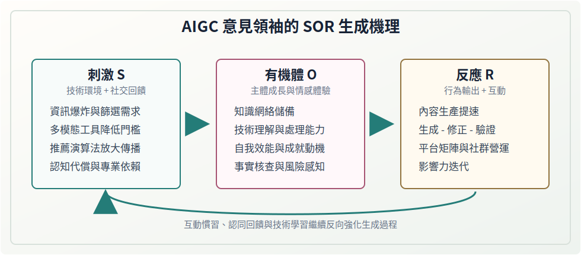
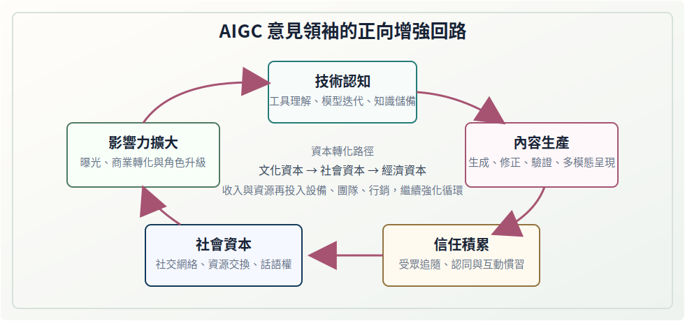

# 《AIGC 時代意見領袖生成機理與趨勢挑戰》

!!! note "資料性質"
    本頁依據 PDF《AIGC 時代意見領袖生成機理與趨勢挑戰》整理論文正文、署名、摘要、關鍵詞、基金項目與參考文獻，並按原論文結構排列。頁面中的 SVG 圖示為本站輔助閱讀圖，並非原論文配圖。

| 項目 | 內容 |
| --- | --- |
| 原文標題 | AIGC 時代意見領袖生成機理與趨勢挑戰 |
| 作者 | 蔡聖涵、魏德毓 |
| 作者單位 | 福州大學 人文社會科學學院，福建 福州 350000 |
| 刊載資訊 | 《寧德師範學院學報（哲學社會科學版）》2026 年第 1 期，總第 156 期 |
| 文章編號 | 2095-3682（2026）01-0071-05 |
| 中圖分類號 | G206 |
| 文獻標識碼 | A |
| 收稿日期 | 2025-10-10 |
| 基金項目 | 福建省教育廳社會科學研究項目（GY-J-21185） |
| 責任編輯 | 何海菊 |
| 本頁處理 | 按原論文結構整理正文，並補充輔助閱讀圖示 |

## 論文署名

**AIGC 時代意見領袖生成機理與趨勢挑戰**

蔡聖涵　魏德毓

（福州大學 人文社會科學學院，福建 福州 350000）

## 摘要

摘　要：在人工智慧蓬勃發展的今天，新技術的影響貫穿於人們學習、生活、工作的各方面。以生成式人工智慧爲代表的 AI 技術在影音製作、圖片生成、文本編輯等方面展現出高度的便捷性、適用性、創新性，而且對意見領袖的內容生產與傳播方式也產生了前所未有的深刻影響。在網路傳播與後真相的時代，意見領袖不僅是資訊的傳遞者和意見的解讀者，還擔當着輿論觀點引導者、多元文化開拓者、創新技術推廣者、網路社區管理者等多重角色。文章以互動、認同、迭代、提速作爲關鍵詞，深入探討了 SOR 理論視角下 AIGC 時代意見領袖的生成機理，揭示其新角色、新特徵，探討其在新技術背景下的演化形成、轉型變革、發展趨勢及挑戰應對策略，爲 AIGC 時代專業型意見領袖的生成和培育提供科學指導。

關鍵詞：SOR 理論；意見領袖；生成機理；趨勢挑戰

中圖分類號：G206　　文獻標識碼：A　　文章編號：2095-3682（2026）01-0071-05

## 正文

AIGC（Artificial Intelligence Generated Content）中文翻譯爲「人工智慧生成式內容」，又稱作「生成式人工智慧」。「意見領袖」最早由美國社會學家拉扎斯菲爾德與他的同事在研究美國總統選舉時提出，其研究認爲意見領袖能夠接收並解構環境帶來的資訊，給受眾帶來信任與情感滿足，吸引受眾與自身進行互動，不斷激發互動的熱情，並引導受眾做出一定反應。進入 AIGC 時代，AIGC 時代意見領袖指的是能夠借助 AIGC 技術，以網際網路社交媒體平台爲陣地，人機結合，模式化、流水化地進行內容創作和資訊傳播，並建構追隨者群體、影響受眾決策和行爲的人，進而對社會的輿論和受眾價值觀產生不可忽視的影響。簡而言之，AIGC 時代意見領袖的演化模式更爲複雜，角色更加多元，影響力也更爲廣泛[1]。爲此，準確把握 AIGC 時代意見領袖的生成機理，揭示其在新技術背景下的轉型特徵、全新角色及未來發展趨勢具有重要現實意義。

## 一、互動：意見領袖的誕生與 SOR 理論的契合

### （一）SOR 理論及其內涵

SOR 理論，即刺激—有機體—反應（Stimulus-Organism-Response）理論，是一種心理學和行爲科學的理論，常用於解釋個體如何對外界刺激做出反應。隨着學科間的交叉與融合，SOR 理論廣泛應用於心理學以外的多個學科，並在多元情境中逐步被細化和完善。當前，SOR 理論的研究與應用在學界中主要體現爲立足於市場行銷、基層治理、人力資源管理、媒體傳播等特定背景或主題，聚焦特定群體，關注該背景或主題下圍繞這一群體的個體、社會現象和問題，分析得出影響因素與指標，給出啓示、解決方案或對策[2]。SOR 理論作爲分析人類行爲的元理論範式，將一般行爲產生過程分解爲外部刺激（Stimulus）→個體內在狀態（Organism）→行爲反應（Response），主要闡釋刺激如何通過有機體的感知和認知過程被轉化爲內部的心理表徵，這些心理表徵如何進一步激發個體的情感反應，並最終導致個體的行爲反應。

### （二）AIGC 時代意見領袖的特徵

AIGC 時代背景下，意見領袖作爲輿論生態中的關鍵節點，在內容創作上，由傳統的「人工經驗」模式轉向「技術資料」驅動模式，更精準地滿足受眾的獨特需求和偏好，更有效地提高意見領袖內容生產效率，更廣泛地提供創作選擇和創意文案。在內容傳播上，由過往的「常規媒體」模式轉向「多樣態跨平台」模式，多樣態的表達方式使得內容呈現更加引人注目，大資料演算法能夠將意見領袖發布的最新內容及時推送給最可能對此感興趣的受眾群體並延長其閱覽停留時間，提高內容的觸達率、作品的觀完率、受眾的參與度。在互動方式上，由既往的「單對多」單向傳授模式轉向「多對多」的多向定製模式，互動方式更加多樣化、個性化，這種即時的、深入的互動使得意見領袖能夠更好地瞭解受眾需求和社群關係變化，及時調整自己的傳播策略和互動方式，保持自身影響力和競爭力。

### （三）意見領袖生成機理與 SOR 理論的契合

受眾與意見領袖關聯的核心在於互動行爲。通過互動，意見領袖對受眾的激發與吸引不僅侷限於提供優質內容和可參考的建議，更在於提供積極互動的方式、方法、途徑，促成互動慣習的形成。高度的互動性是意見領袖積累信任感和影響力的關鍵條件，也是推動受眾形成互動慣習的重要依託。在我國，貼吧、微博、豆瓣等社區話題平台，以及抖音、B 站、快手等短影音平台，因使用者特徵、內容形式和互動機制的不同，意見領袖的傳播策略也會有所不同，但在互動場景中，意見領袖的高度社交活躍度、持續分享的行爲特徵以及專業知識儲備，共同構成了吸引受眾並維繫長期互動的情感動因、行爲動因和內容動因。這些動因在強化互動的過程中也轉化爲互動慣習。意見領袖的生成、發展、成熟、昇華與互動行爲是息息相關的，準確地說與互動慣習有着顯著的關聯，互動行爲越頻繁、技術知識學習與積累得就越多、資訊解構與還原的就越精準，交互的方式與內容創新性、可信賴度就越強，維繫互動的動因也因此越深入人心，其轉化的互動慣習就越深度內化。由此可見，在意見領袖與受眾共同的互動行爲中，互動慣習的影響與 SOR 理論中描述個體受作用的邏輯高度契合。因此 SOR 理論爲意見領袖生成機理提供了研究的理論框架，尤其在解釋個體行爲觸發機制上具有學理上的優勢以及起着舉足輕重的作用[3]。

## 二、認同：AIGC 意見領袖的 SOR 生成機理

基於 SOR 理論框架，AIGC 時代意見領袖生成機理可從刺激、有機體、反應三個維度出發，細分爲技術+環境回饋（S）、主體成長（O）、行爲輸出+互動（R）三個層面，並在相當大的程度上影響其他個體和群體，獲得他人的認同與認可。

**本站輔助圖示 1：AIGC 意見領袖的 SOR 生成機理（非原論文配圖）**

### （一）刺激（Stimulus）層面

表現在技術環境驅動與社交環境回饋的需求變革疊加。一是 AIGC 日均生成內容量高達數十億條，受眾面臨資訊選擇困境，這種資訊爆炸和資訊過載的篩選需求，構成核心外部刺激源。二是多模態的人工智慧 AI 生成工具，極大降低了創作的門檻，加之技術賦能於傳播場域，如智慧推薦演算法精準、快速地傳播分發路徑，使得部分社交平台的瀏覽量和訪問量劇增，形成巨大的規模刺激效應。三是受到認知代償的受眾心理影響，普通使用者對 AIGC 技術存在一定的認知盲區，產生了對專業解讀者的依賴需求，對具有技術複雜度的意見領袖也呈現出更高的認同和偏好，形成提升影響力的目標刺激。四是部分接觸和瞭解過 AIGC 技術，理解 AIGC 技術工作原理的普通使用者，其社交機制與互動模式內化了 AIGC 技術的影響，對其身邊環境帶來 AIGC 技術的影響和刺激。五是有了 AIGC 技術加持，社交媒體互動情況呈現出高資料、高強度、高呼應，這使得普通使用者越來越依靠 AIGC 技術參與互動、保持互動、融入互動，形成深度互動的常態化認同[4]。

### （二）有機體（Organism）層面

表現在 AIGC 意見領袖自身個體認知的提升以及持續獲得的情感體驗。一是在專業認知系統構建上，AIGC 意見領袖在知識圖譜維度建立了較爲豐富的知識網路儲備，能夠熟悉並掌握 AIGC 技術相關原理，技術理解深度和資訊處理能力遠超其他普通使用者。據克勞銳（TopKlout）發布的《2024 年中國 AIGC 應用場景及商業潛力研究報告》顯示，頭部意見領袖 AIGC 工具使用率達 92%，日均處理資訊量達普通使用者 7.2 倍。二是 AIGC 意見領袖的情感驅動，主要源於通過掌握技術所獲得自我效能感和成就動機。根據馬斯洛需求層次理論中的尊重與自我實現需求，絕大多數的頭部意見領袖表現出較爲強烈的利他傾向和知識共享意願，以實現獲得社會認同的高階需求。三是熟練掌握 AIGC 的意見領袖，都將逐步建立起多層內容驗證校核機制，包括事實核查、邏輯推演、技術驗證等，其風險感知能力更強，生成發布的內容在準確性等方面表現得更爲嚴謹、可靠，進而獲得使用者和受眾的認可[5]。

### （三）反應（Response）層面

表現在 AIGC 意見領袖影響力生成的相關行爲模式上。一是在內容生產方面，主要通過整合內容生成、視覺化呈現、多模態編輯等智慧工具鏈，不斷壓縮內容生產週期，提高響應速度。同時，在內容品質上體現 AIGC 的「生成—修正—驗證」三級過濾機制和系統性優勢。二是形成具有 AIGC 特徵的社交傳播策略。比如，平台矩陣營運，通常採用主平台加多個輔助平台進行傳播的組合策略；交互性設計，採用「知識膠囊」製作模式，即短時間的核心知識點「吸睛閃現」加上深度解析的內容梯度解讀節目等；社群化營運，即構建「1% 核心參與者、9% 活躍使用者、90% 普通受眾」的金字塔型粉絲社群結構。三是影響力迭代機制，包括技術敏感度、回饋分析系統和個人 IP 進化等。據宗輝品牌 IP 實操專欄 2025 年 4 月披露，AIGC 意見領袖的可信度評分達 4.7/5（滿分 5 分），具體表現爲平均每 45 天跟進 Stable Diffusion 模型的迭代更新，平均每 6 個月進行個人 IP 知識體系更新，以及運用 Socialbakers 等工具進行傳播效果的歸因分析，以維持自身在專業度上獲得認可[6]。

## 三、迭代：AIGC 意見領袖的 SOR 增強回路

**本站輔助圖示 2：AIGC 意見領袖的正向增強回路（非原論文配圖）**

### （一）能力複合體系和多重角色轉化

SOR 生成機理揭示了在 AIGC 技術迭代加速環境下，AIGC 意見領袖通過技術刺激（S）→認知系統構建（O）→專業化內容生產（R）的持續學習、成長機制，逐步構建「技術認知—內容生產—信任積累」的複合能力體系。AIGC 意見領袖大多是 AIGC 技術早期關注者和行業創作的突破者，他們不斷關注新誕生的技術和可被運用的範圍，能夠利用先進的演算法和資料分析工具，更準確地把握受眾的需求和興趣點，更高效地篩選、整合和傳播有價值、高品質的資訊，不斷探索新的內容形式和傳播方式，與受眾建立更爲緊密的聯繫，爲核心追隨者和一般受眾提供相匹配的內容服務，更好地滿足受眾的個性化需求，進而完成從資訊轉發者到價值整合者、意見精準傳導者、技術創新者等多重角色的轉化[7]。

### （二）資本轉化與社會影響力

根據皮埃爾·布迪厄的文化資本理論，處於社會關係網中的個體，在活動中獲得和交換的支持與資源可被抽象爲「文化資本」「社會資本」「經濟資本」三種類型。文化資本（Cultural Capital）是個人所擁有的文化素養、知識儲備、專業技能、審美能力及相關教育積澱；社會資本（Social Capital）是通過社會網路積累的人際關係、信任資源及相關社會資源等；經濟資本（Economic Capital）則是實際的資金流水，包括工作收入、利用自己的技能優勢與空閒時間額外獲取的收入。布迪厄的文化資本理論分析了不同資本相互轉化的可能性，這意味着意見領袖可以借助自身優勢，通過持續影響受眾、拉近距離、深化互動，逐步與受眾建立更緊密的聯繫，並實現角色升級與資本轉化，進而持續提升自身影響力。

### （三）基於 AIGC 意見領袖生成機理的正向增強回路

SOR 生成機理促使 AIGC 意見領袖形成提高受眾追隨程度（S′）→強化社會資本（O′）→擴大影響力（R′）的資本轉化與提高社會影響力路徑。意見領袖與「粉絲」的互動不僅是情感連接的過程，更是社會資本的積累過程。意見領袖對於 AIGC 技術使用的熟練度與創意度，直接反映在作品的創作內容、技術含量與創意水平之中，很大程度上影響着意見領袖的內容創作力和輿論影響力。AIGC 技術含量較高的作品，在吸引使用者、拉近距離、行銷逐利等爲核心導向的社交媒體平台營運下，能夠讓 AIGC 意見領袖獲得更多曝光機會與流量扶持，積累更多的關注度和影響力，也被賦予了更高的話語權和影響力，進而成爲社會資本範疇內的「無形資產」擁有者。社會資本越強大，意味着意見領袖能夠通過廣泛的社交網路與更多人互動，其社會影響力就越廣泛，受眾的追隨度、信任度越高，權威形象也越鮮明，內容影響力也越深遠。一方面，意見領袖依託較高的文化素養、AIGC 專業技能和審美能力，創作出高品質、有深度的內容，進而吸引「粉絲」、積累信任並建立長期的社會影響力。同時，通過廣告、贊助、直播打賞、會員付費等方式獲得收入，將資源持續投入設備升級、團隊搭建、行銷推廣等領域，以提升社會資本，進而不斷強化資本轉化與影響力提升的正向機制，進一步擴大社會影響力。另一方面，根據美國心理學家斯坦利·米爾格拉姆的六度分隔理論，擁有一定社會資本的 AIGC 意見領袖，其粉絲群體社交圈規模龐大、形式多元，AIGC 意見領袖可以通過「小世界網路」與更多的人和事發生聯繫、相互交換與積累，形成社會資本的波紋效應，體現出社會資本提升帶來 AIGC 意見領袖影響力的擴大，並持續強化自身的社會資本形成正向增強回路[8]。以上論斷在陳昊[9]的研究中部分得到證實。其研究以具備明顯 AIGC 意見領袖特徵的「頭部虛擬主播」爲對象，論述了名爲「hanser」的 B 站頭部虛擬主播與粉絲以及 B 站短影音平台在情感勞動層面上的作用與關係，其在研究結論中提到了虛擬主播的價值增值、粉絲群體的情感滿足和身份認同、資本與技術的剝削加控制等，側面印證了本文提出的 SOR 生成機理促使 AIGC 意見領袖形成正向的成長增強回路[9]。

## 四、提速：AIGC 時代意見領袖的轉型趨勢與難題挑戰

AIGC 時代背景下，意見領袖面臨着市場需求和技術變革的雙重挑戰，也迎來了前所未有的發展機遇，其利用先進的 AIGC 技術進行個人品牌的數位化與智慧化轉型，同時探索團隊化、專業化、跨領域的發展路徑，影響力變現成爲 AIGC 時代意見領袖的未來發展趨勢。同時，在資訊爆炸的時代，AIGC 意見領袖也面臨着自身能力和水平與 AIGC 時代不相適應或者過度迎合帶來的內生性危機，也有 AIGC 本身的技術和生產缺陷給意見領袖內容創作帶來的外源性問題。

### （一）AIGC 時代意見領袖未來發展趨勢

一是個人品牌的數位化與智慧化轉型加速。依託技術革新打造個人品牌網站、社交媒體帳號等數位化載體，充分展示專業知識和影響力，是意見領袖在 AIGC 時代重新定位和自我提升的關鍵步驟，也是提升品牌價值，增強市場競爭力，適應時代變化的必然選擇。二是從個體創作到專業化團隊生產的加速轉變。隨着 AIGC 技術的進步和受眾需求的多元化，意見領袖通過組建專業化團隊或成立工作室，通過強化分工合作，實現內容創作、全媒體傳播與商業化營運的全面升級。一方面能夠發揮專業優勢，打造高品質的傳播內容，快速提升知名度和影響力；另一方面，憑藉專業的市場洞察、資料分析與商業策略，實現品牌價值的最大化。三是跨行業多領域意見領袖的加速催生。AIGC 技術爲跨界嘗試和知識融合提供可能，使得意見領袖可以不斷突破傳統壁壘，實現在不同領域間的創作和吸粉，推動行業間的交流合作、探索新聯動場景的開發創新。四是推動商業模式變革的加速。廣告代言、品牌合作、商品開發、會員定製、訂閱付費等變現渠道更加豐富多樣，具有前瞻性的意見領袖勢必嘗試整合電商平台、線下實體店等上下游產業鏈資源，建設個性化的服務平台或社區，努力形成完整的產業鏈閉環來提高營運收入、服務水平和市場競爭力。同時，內容電商、社群經濟、個性化定製等新興業態將快速升級，圍繞意見領袖的流量推廣機構、內容創作教學平台、資料分析服務提供商等也應運而生[10]。

### （二）AIGC 時代意見領袖面臨的挑戰

AIGC 技術的開放性使得人人既是技術的受作用對象，也是 AIGC 技術的作用者。AIGC 時代意見領袖的生成變得更加開放，門檻更加親民，專業性更加顯著。一方面，將會沿着技術刺激（S）→認知系統構建（O）→專業化內容生產（R）的持續學習機制以及提高受眾信任（S′）→強化社會資本（O′）→擴大影響力（R′）的正向增強回路，逐步生成、發展、升級，個體成長爲意見領袖的路線可以被標準化和公式化。另一方面，面對提速的轉型升級，AIGC 意見領袖將面臨自身能力和水平與 AIGC 時代不相適應或者過度迎合帶來的內生性危機，也面臨着 AIGC 本身的技術和生產缺陷給意見領袖內容創作帶來的外源性問題。一是技術快速迭代帶來的存在危機，海量資料與資訊在演算法助力下被訓練成「智慧大腦」，更多的專業知識被普及化、通用化，對意見領袖保持其資訊傳播的有效性和影響力構成了顯著壓力甚至生存危機。二是資訊真實性與準確性的驗證難題，AIGC 技術主要基於海量語料庫訓練，能夠生成模擬人類語言結構和邏輯的自然語言文本，但是投餵的訓練資料往往不做清洗，其中不乏錯誤、偏見、極化資訊，這對意見領袖後期內容生產的準確性和可信性提出了挑戰。三是侵犯隱私權和智慧財產權等法律問題，意見領袖的創作行爲主要基於對現有資料資源的搜集、整理和深度學習，這種全網搜集資訊並進行內容生產的模式，可能會對受眾的隱私保護造成一定威脅。四是技術依賴與創新能力下降的隱憂，過度依賴 AIGC 技術可能導致意見領袖在內容創作上失去主動性和創新能力，由於 AIGC 的內容源和資訊資料庫相似，可能會出現不同意見領袖依託 AIGC 生成同一內容的窘況。

### （三）應對 AIGC 時代意見領袖的嬗變和挑戰

一要注重意見領袖綜合能力建設，通過加強技術培訓、專業研習、國際交流、合作研究等方式，相關管理部門定期組織與意見領袖就國內外熱點議題深入探討，積極引導 AIGC 與主流平台對接，幫助意見領袖更好地發揮作用，提升主流意識形態傳播效果。二要立足技術邏輯與社會邏輯構建智慧化的內容生產與傳播治理格局，利用技術手段輔助人工審核，強化跨部門、跨領域協同作戰能力，推動技術創新與規範發展，完善內容審核與監管機制，防範意見領袖發布內容的傳播風險，爲清朗正氣的輿論生態提供有力保障。三要明確意見領袖個人品牌定位，找到適合自己的內容創作方向和傳播策略，倡導實行差異化品牌創新策略，支持跨領域的內容創作和不同領域的知識觀點融合，互相學習借鑑，形成互補優勢，構建多元內容的健康網路輿論生態。四要通過制定相應規範和標準，開展自律教育活動，建立專業素養、影響力、創新能力等意見領袖評價體系等方式，強化意見領袖的自律意識和社會責任意識，引導其遵守法律和倫理規範，激勵意見領袖不斷提升自身能力，更好地服務於資訊傳播和輿論引導工作[11]。

## 作者簡介、收稿日期與基金項目

作者簡介：蔡聖涵，福州大學人文社會科學學院碩士研究生。

收稿日期：2025-10-10。

基金項目：福建省教育廳社會科學研究項目（GY-J-21185）。

## 參考文獻

[1] 謝耘耕，劉銳. AIGC 時代意見領袖的角色演進、發展趨勢與挑戰應對[J]. 編輯之友，2024（12）：73-80.

[2] 吳昕陽，張新成，趙媛. 旅遊研究中 SOR 理論的溯源、應用及展望[J]. 旅遊論壇，2024，17（6）：85-95.

[3] 傅守祥，沈潤雨. 論生成式 AI 的哲學機理與 AI 意見領袖的倫理陷阱[J]. 社會科學戰線，2025（3）：64-71.

[4] 劉磊，鄧穩根，李詩雨. 基於 SOR 模型的國際博主短影音對使用者互動意願的影響研究[J]. 現代視聽，2023（11）：46-50.

[5] 戴煜. 網路傳播時代意見領袖的演變與社會影響力評估[J]. 新聞傳播，2025（8）：78-80.

[6] 雷開春，包蕾萍，陳超. 關鍵意見領袖如何影響 Z 世代：資本轉化的分析視角：以 B 站頭部 UP 主爲例[J]. 青年學報，2025（2）：63-78.

[7] 田楠，徐生菊. 虛擬品牌社區意見領袖對成員知識共享行爲的影響研究[J]. 商場現代化，2025（3）：22-24.

[8] 蔡霞，宋哲，耿修林. 社會網路結構和採納者創新性對創新擴散的影響：以小世界網路爲例[J]. 軟科學，2019，33（12）：60-65.

[9] 陳昊. “Hanser”與“毛怪”：虛擬主播與粉絲的情感勞動研究[D]. 杭州：浙江傳媒學院，2025.

[10] 徐淑媚，王思博，縣婭紅. 基於 SOR 理論的盲盒消費意願研究：基於感知價值的中介效應[J]. 現代商業，2024（22）：11-14.

[11] 劉麗. 社交網路意見領袖圈層「內卷化」現象研究[J]. 中國報業，2023（24）：90-91.

[責任編輯　何海菊]
