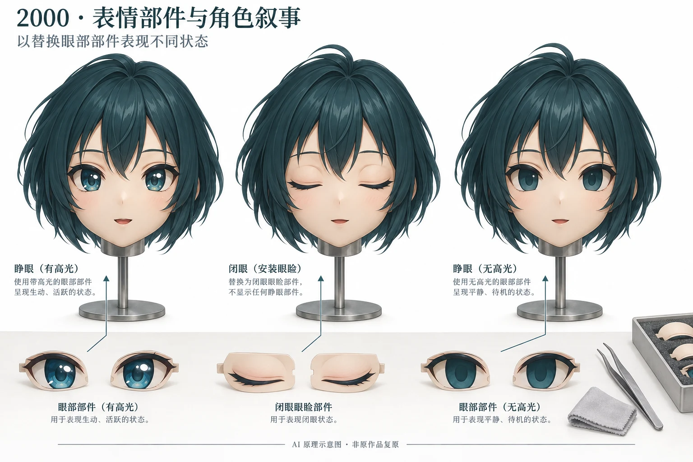

# 2000 年 Kigurumi 編年史

2000 年的重點是角色製作和麪具表情的具體實踐。SIGMA 圖集明確提到製作月份、替換部件及攝影方法，能夠補充單純展會年表無法呈現的工藝內容。

## 年度重點

- **2 月製作**：雙葉螢的角色造型，隨後在 6 月圖集中展示。
- **2–5 月圖集**：Multi 使用兩隻面具、閉眼眼瞼與無高光眼片表現角色狀態。
- **3 月製作**：來棲川綾香的製作月份由製作方圖集序言明確記載。[^sigma-hotaru][^sigma-reboot][^sigma-ayaka]

## 年度紀事

### 2 月製作、6 月展示：雙葉螢角色造型

《HOTARU GALLERY-1》直接說明角色於 2000 年 2 月製作，圖集條目標註 6 月 4–5 日。製作者展示迎敵姿勢、普通站姿與勝利手勢，並說明發辮、緞帶及翹發讓整體造型較大。[^sigma-hotaru]

這裏可以分別確認作品製作月份與圖集標註日期；沒有材料將它們指向某場公開展會。造型尺寸與姿勢選擇共同影響角色呈現，是這一製作記錄中可保留的具體信息。

### 2–5 月圖集日期：用可替換眼部部件組織表情

《MULTI GALLERY-8》記錄，爲表現角色「再起動」情節，團隊使用兩隻面具、閉眼用眼瞼和沒有高光的眼片。相關條目標註 2 月 18 日、3 月 19 日與 5 月 18 日。[^sigma-reboot]

它說明固定面容的角色攝影也可以通過更換部件組織狀態變化。原文能夠支持這些部件的使用，但不支持自動機械錶情、電子控制或當年行業普及程度的推斷。

*AI 原理示意圖，用於解釋替換眼部部件的思路；不是 SIGMA 原作品復原或歷史現場照片。*

### 3 月：來棲川綾香的角色製作

SIGMA 的綾香圖集序言明確寫道，來棲川綾香於 2000 年 3 月製作。這個日期指向製作本身，值得作爲獨立作品節點保留。[^sigma-ayaka] 現有資料沒有提供當時工期、價格或生產數量。

### 3 月 31 日-4 月 2 日：TGS 2000 春季完成記錄

官方三十週年回顧把第 8 屆標爲“2000 年・春”，列出 3 月 31 日至 4 月 2 日和 131,708 名來場者。[^tgs-history] 這是同期公共展會背景，不是 kigurumi 參與記錄。

### 9 月 22-24 日：TGS 2000 秋季完成記錄

同一官方頁面把第 9 屆標爲“2000 年・秋”，列出 9 月 22-24 日和 137,400 名來場者，並記載累計來場突破一百萬人及紀念儀式。[^tgs-history] 這一里程碑描述的是展會整體，不是相關裝演類別的規模、出現時間或完成狀態。

## 年度小結

本年最有價值的是可以具體描述的製作與攝影方法：髮型影響造型體積，姿勢塑造角色，眼瞼和眼片能夠改變畫面中的角色狀態。製作時間、照片條目日期與展會日期分別記錄。

## 參考資料

[^tgs-history]: Tokyo Game Show / CESA, “東京ゲームショウ30週年,” 2000 spring and autumn entries, <https://tgs.cesa.or.jp/2026/30th>

[^sigma-hotaru]: SIGMA，《HOTARU GALLERY-1》，製作月份與 2000-06-04、06-05 圖集條目，<https://www.buildupstudiosigma.com/archive/hotaru/hotaru00.htm>。
[^sigma-reboot]: SIGMA，《MULTI GALLERY-8》，2000 年圖集與部件說明，<https://www.buildupstudiosigma.com/archive/multi/multi80.htm>。
[^sigma-ayaka]: SIGMA，《AYAKA GALLERY-1》，序言明確記錄 2000 年 3 月製作，<https://www.buildupstudiosigma.com/archive/ayaka/ayaka00.htm>。
