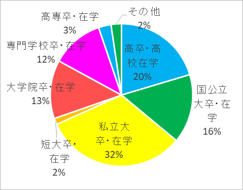

# 2017 年 Kigurumi 編年史

> 2016、2018-2025 年已有獨立年度頁。本次去重校勘只保留 2017 年新增的 AnimeJapan 場地設施與一份社群自發調查；2016 已記錄的着ぐるみ基礎區域、攝影和更衣規則不再重複。

## 1. 取材邊界

本卷採用兩類資料。AnimeJapan 官方頁可確認日期、場地和當年規則；站內保存的《着ぐるみ國勢調查結果報告書》可確認調查時間、樣本數量、設問與作者自述的限制。後者不是隨機抽樣或同行評審研究，不能代表全部 kigurumi 社群，也不能把比例外推至總體。

2017 年卷不複製該報告的 73 頁正文和 205 幅圖表，只保留其編年意義，並連結至[完整調查報告資料頁](../../sources/survey-reports/kigurumi-census-2017/index.md)。

## 2. 可核驗節點

### 3 月 25-26 日：AnimeJapan 2017 擴展公共 cosplay 場地與更衣選擇

AnimeJapan 2017 公眾開放日於 3 月 25-26 日在東京 Big Sight 東 1-7 Hall 舉行；展會整體比 2016 年多使用一個 Hall。Cosplayers World 遷至東 7 Hall，並明確宣傳自身區域已擴大。活動除普通付費登記、更衣室、寄存和室內外攝影區域外，還首次提供需另購票、按桌位使用的女性專用高級更衣室。[^aj-outline][^aj-cosplay]

限制視野或行動的服裝只能在 cosplay 區域穿着、攝影須經同意、更衣室內禁止攝影等基礎規則在 2016 頁已記錄，2017 是沿用而非首次出現。[^aj-cosplay] 本年的獨有節點是公共承載能力繼續擴展，並把多人共用更衣室之外的付費高級選擇納入服務；這仍是綜合展基礎設施，不是 animegao 專門活動的證據。

### 10 月 4 日起約一週：社群自發「國勢調查」形成量化快照

くっしー（@kussy_tessy）發起的「着ぐるみ國勢調查」共收到 221 份回答；排除一份未同意開頭說明的回答後，有效回答為 220 份。調查透過作者周邊的 Twitter 網絡傳播。作者在前言中明確承認母群偏差、設問視角和非中立性，因此本站把它視為**有明確邊界的社群自我記錄**，而不是人口普查或學術定論。[^census]

報告記錄參與方式、活動年資、面具與服裝、製作來源、攝影、交流、身份理解和親密議題等多個層面。僅就可安全用於年度概覽的指標而言：活動形態題的 217 名有效回答者中，53% 選擇「在活動或 off 會穿着」，15% 選擇「主要獨自穿着」；活動年資題有 216 名有效回答者，平均為 5.9 年，排除尚未活動者後仍有過半數不超過 5 年。[^census] 這些比例只描述該份樣本。

## 3. 領域判斷

| 領域 | 2017 可核驗內容 | 編輯結論 |
| --- | --- | --- |
| 編年史 | AnimeJapan 公眾開放日；10 月社群調查 | 納入年度主軸 |
| 日常 / 雜談 | 調查中的參與方式與社群自我描述 | 只作樣本快照，不外推 |
| 工坊 / 手工 | 報告涉及面具、肌タイ和供應來源 | 連結完整報告，不拆成教程 |
| 百科 / 科普 | 220 份有效回答形成術語與實踐資料 | 納入資料史 |
| 禮儀 | 基礎規則沿用；新增付費女性專用高級更衣選擇 | 只記錄 2017 的設施變化 |
| 學術 | 未發現 2017 年直接相關的同行評審成果 | 不把個人調查誤標為學術研究 |

現有「調查報告」板塊已足以承載完整資料，本卷不再新建重複板塊。2017 年只有一個穩定調查節點，也不足以另建獨立學術欄目。

## 4. 與 2016、2018-2025 年去重

| 連續主題 | 2017 本卷保留 | 後續年度處理 |
| --- | --- | --- |
| AnimeJapan | 東 7 Hall 擴展與首次付費女性專用高級更衣室 | 基礎區域、攝影與更衣規則歸入 2016；2018 只記錄巡遊陪同等新增要求 |
| 社群研究 | 個人發起、Twitter 周邊樣本的 2017 調查 | 2018 記錄慶應學位研究；兩者資料性質不同 |
| 官方 IP / 專門活動 | 本輪沒有足夠一手證據 | 2019-2025 已核驗內容不倒填 |

## 5. 年度結論

2017 年留下的穩固節點不是一份密集活動清單，而是兩種增量：大型公共場地擴展了 cosplay 承載空間和更衣選擇，社群內部則留下一份規模較大的自發量化快照。基礎規則由 2016 年卷承擔；2017 年的便利樣本仍不能代表社群總體。

## 來源

[^aj-outline]: AnimeJapan, “AnimeJapan 2017 開催概要,” <https://anime-japan.jp/2017/about/outline/>
[^aj-cosplay]: AnimeJapan, “コスプレイヤーズワールド,” <https://anime-japan.jp/2017/main/cosplay/>
[^census]: くっしー（@kussy_tessy），《着ぐるみ國勢調查結果報告書》，2017 年 10 月調查，PDF，73 頁；本站[完整資料頁](../../sources/survey-reports/kigurumi-census-2017/index.md)。
