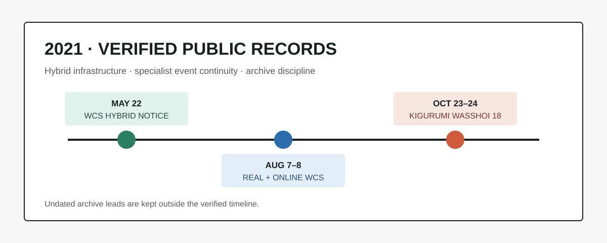

# 2021 年 Kigurumi 編年史

> 遠端站點已完成 2022–2025 四個年度。本次依照「已完成年份不重複、每次只向前整理一年」的規則，整理 2021 年。資料不足時保留空白，不以推測補滿月份。

## 0. 資料邊界

本文主要討論 animegao kigurumi、美少女着ぐるみ、面具型角色扮演及其直接活動基礎設施。World Cosplay Summit（WCS）屬於相鄰的綜合 cosplay 場域，只用來說明公共活動如何恢復，不能單獨證明專門 animegao 聚會的規模。

| 等級 | 納入方式 |
| --- | --- |
| 主辦方頁面、政府或公共機構記錄 | 可確認日期、地點和活動結構 |
| 主辦方公開社交帳號 | 可補充公告與變更，不擴大解釋 |
| 參與者影像、搜尋摘要 | 只作線索 |
| 無日期的現存活動檔案 | 列為待考，不放入事實時間軸 |

## 1. 年度主線

本輪通過高可信門檻的 2021 節點集中在兩條線：

1. **混合化**：WCS 2021 於 8 月 7–8 日並行名古屋線下活動與線上影片賽，口號為 “We Can Start, Again!!”。[^wcs2021]
2. **專門活動連續性**：第 18 回 `キグルミwasshoi!` 延期後於 10 月 23–24 日舉行，使用東京 East 21 酒店的宴會廳、酒廊、泳池與教堂等空間。[^wasshoi18]

2021 不是正常擴張年，而是活動組織者重新設計線下、線上、住宿、用餐和攝影流程的一年。

## 2. 主要紀事

### 5 月 22 日與 8 月 7–8 日：WCS 混合活動

WCS 官方檔案在 5 月 22 日公布混合結構，並於 8 月 7–8 日舉行。比賽採 Video Division，線下活動則集中於名古屋 Oasis 21、久屋大通公園等地。日本國家旅遊局與日本外務省的公開記錄亦確認日期與混合形式。[^jnto][^mofa]

此處記錄的是 kigurumi 所依賴的綜合活動基礎設施，不把 WCS 全部參與者等同為 kigurumi。這與 2022 年的廣泛線下重啟不同：2021 的獨有意義是過渡模型。

### 10 月 23–24 日：第 18 回 `キグルミwasshoi!`

主辦方頁面記錄，活動原定 9 月舉行，延期後改在東京 East 21 酒店測試舉辦。[^wasshoi18] 活動包括兩日時段、宴會廳、頂層酒廊、夜間泳池、教堂攝影、住宿套票，以及着ぐるみ／被り物相關同人販售和舞台環節。受當時聚餐限制影響，飲品調整為軟飲。

這不是 2022 年第 19 回的重複。第 18 回的兩日酒店與住宿組合，是後續酒店型活動的直接前史。

### 8 月 30 日：WCS 官方手冊公開

WCS 在活動後公開 2021 官方手冊。[^wcs2021] 對資料館而言，節目單、規則、地圖與手冊的後續發布也是應保存的一手資料。

## 3. 領域分類

| 領域 | 2021 可核驗內容 | 判斷 |
| --- | --- | --- |
| 編年史 | WCS 混合活動、第 18 回 `キグルミwasshoi!` | 納入 |
| 日常 / 雜談 | 酒店住宿、換裝、攝影與兩日參與方式 | 只寫公開流程 |
| 工坊 / 手工 | 未發現可獨立核驗的新教程 | 不倒填後年資料 |
| 禮儀 / 安全 | 疫情退票、發熱檢查、聚餐限制、場地分區 | 作為治理背景 |
| 百科 / 科普 | 區分綜合 cosplay 與專門 kigurumi 活動 | 納入 |
| 學術 | 未發現可核驗的 2021 年直接相關新論文 | 保留空白 |

## 4. 待考：Doll Weekend 1–4

Doll Weekend 現行官方檔案保留 DW1–4 的名稱、地點和簡述，但沒有顯示可核驗日期。[^dw-archive] 因此它們只作待考線索，不計入 2021 事實總帳。

| 檔案 | 地點 | 狀態 |
| --- | --- | --- |
| DW1「夢想啟航」 | 廣州 | 待核日期 |
| DW2「光影初現」 | 廣州 | 待核日期 |
| DW3「郊野漫行」 | 廣州 | 待核日期 |
| DW4「雨中即景」 | 珠海 | 待核日期 |

## 5. 去重與結論

本文只保留 WCS 首次混合結構和第 18 回 `キグルミwasshoi!`。2022–2025 已收錄的 FGO greeting、着ぐFesta、DW5–12、後續 WCS 和安全規則不再重複。2021 最可靠的結論，是大型綜合活動與專門 kigurumi 活動分別找到了混合與酒店型恢復方案；無日期檔案繼續等待一手證據。

## 參考資料

[^wcs2021]: World Cosplay Summit, “WORLD COSPLAY SUMMIT 2021,” <https://www.worldcosplaysummit.jp/2021/en/>
[^jnto]: Japan National Tourism Organization, “World Cosplay Summit 2021 – Hybrid event,” <https://www.japan.travel/en/au/news-blog/world-cosplay-summit-2021-hybrid-event/>
[^mofa]: Ministry of Foreign Affairs of Japan, “The World Cosplay Summit 2021,” <https://www.mofa.go.jp/p_pd/ca_opr/page24e_000310.html>
[^wasshoi18]: キグルミwasshoi!, “開催概要 / 第18回 キグルミwasshoi!,” <https://www.wasshoi.kigdoll.net/20210918>
[^dw-archive]: Doll Weekend, “全部 DW 活動,” <https://dollweekend.cn/cn/event/>
