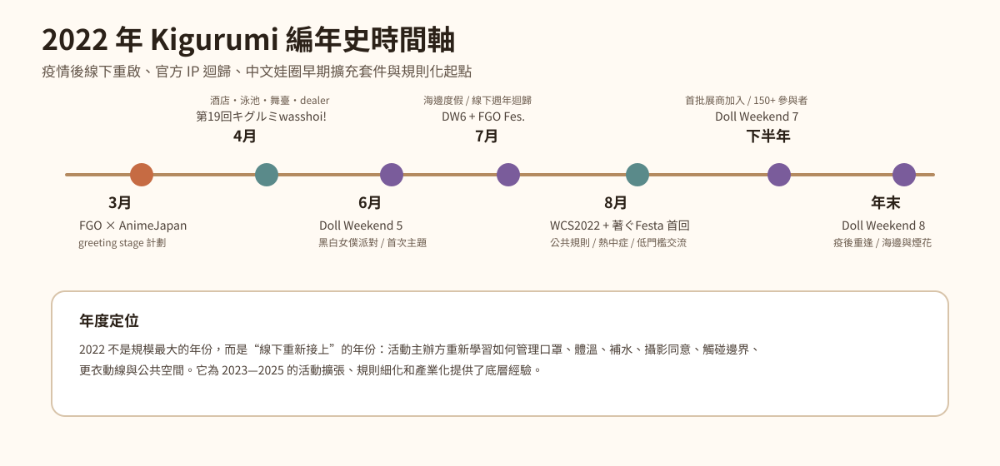
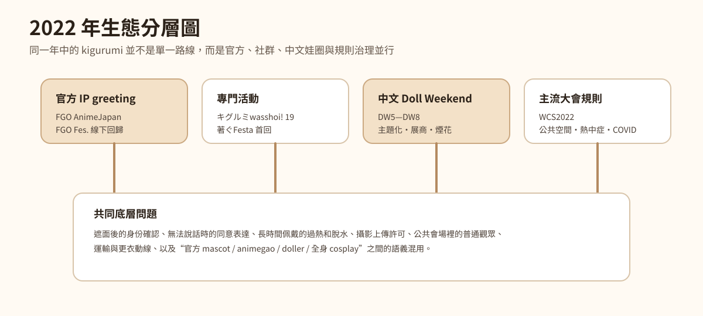
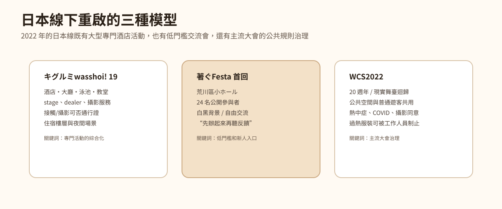
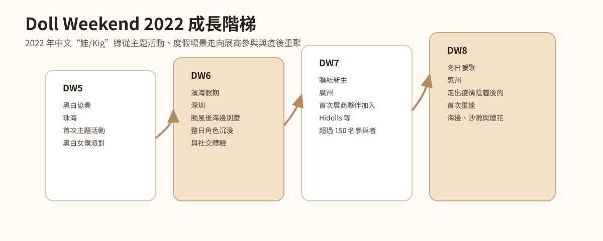
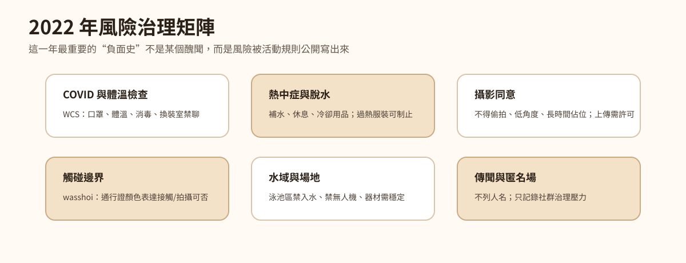
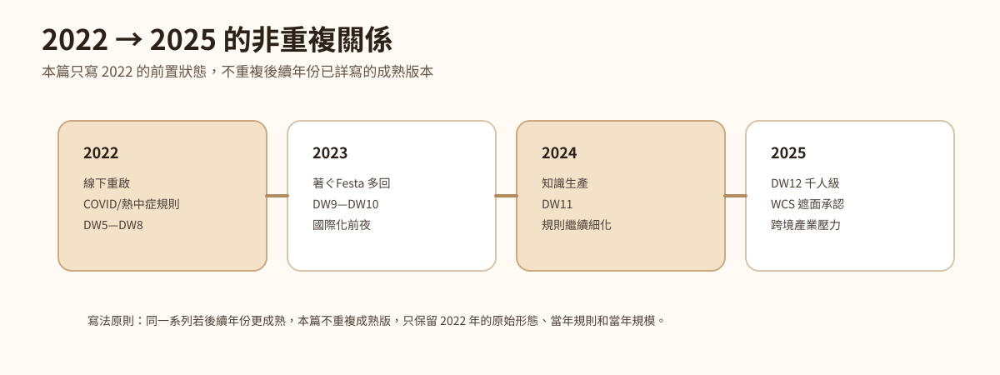

# 2022 年 Kigurumi 編年史

> 編寫口徑：本篇承接《2025 年 Kigurumi 編年史》《2024 年 Kigurumi 編年史》《2023 年 Kigurumi 編年史》的結構，但**不重複 2023、2024、2025 已經詳寫過的活動版本、規則更新和產業擴張**。同一系列活動若 2022 年已經出現前置版本、獨立規則、早期規模、恢復線下或首次變化，則記錄其 2022 年狀態；若只是後續年份已寫過的成熟形態，本篇只在“去重說明”中點到為止。

---

## 0. 資料邊界、去重原則與可信度說明

這份 2022 年編年史中的 **kigurumi** 繼續採用前幾篇的廣義口徑：包括 animegao kigurumi / 美少女著ぐるみ / 面具型角色扮演、doller、中文“娃 / Kig / Kiger”線下活動、官方 IP 吉祥物式著ぐるみ greeting，以及大型 cosplay 活動中涉及全頭套、遮面、公共空間、熱中症、攝影同意和接觸邊界的規則文字。2025 篇已經詳細解釋術語，本篇不重複長篇定義，只在必要處區分“官方 mascot greeting”“愛好者 kigurumi 專門活動”“中文 Doll Weekend 娃/Kig 活動”“主流 cosplay 大會規則”四類資料。

2022 年資料比 2023—2025 更分散，且很多中文與日文活動頁面並不總是完整列出精確日期。因此，本篇採用以下可信度原則：官方活動頁、主辦方頁面、展會規則頁和媒體現場報道優先；Bilibili、X/Twitter、YouTube 等社交平臺用於輔助判斷活動時間、影像傳播和現場氣氛；匿名論壇、私域群聊、截圖傳聞不作為事實依據，不列具體人名，不復述未經核實指控。

本篇與 2023—2025 篇的去重規則如下：

| 去重型別 | 2022 篇處理方式 |
|---|---|
| 同一系列活動在 2023—2025 繼續舉辦 | 只寫 2022 的首回、前置版、早期規則與當年規模，不重複後續成熟版本 |
| 2025 已解釋的 kigurumi / animegao / doller 術語 | 僅保留必要口徑，不重複術語長文 |
| FGO、hololive、Aniplex 等官方 greeting 後續年繼續存在 | 只寫 2022 的 AnimeJapan / FGO Fes. 等當年節點，不重複 2023—2025 的角色和數量 |
| World Cosplay Summit 後續年繼續強化遮面和熱中症規則 | 只寫 WCS2022 的“現實舞臺迴歸”、COVID / 熱中症 / 公共空間規則，不重複後續年細化 |
| Doll Weekend 後續年 DW9—DW12 已詳寫 | 本篇只寫 DW5—DW8 的主題化、海邊度假、展商加入和疫後重逢 |
| 著ぐFesta 後續年規則更成熟 | 本篇只寫 2022 首回的低門檻試辦，不重複 2023/2024 規則擴充套件 |
| 匿名傳聞與人物爭議 | 不復述未核實指控，只記錄匿名討論場域存在與治理壓力 |

---

## 1. 2022 年總體脈絡

2022 年的 kigurumi 不是一個“爆發年”，而是一個更底層、更關鍵的“線下重啟年”。如果說 2023 是活動連線恢復、中文圈走到國際化前夜的一年，2024 是知識生產和規則書寫更密集的一年，2025 是規模化、跨境化和產業壓力更加顯性的年份，那麼 2022 的核心意義就在於：**許多活動在疫情後的不確定環境中重新開門，主辦方開始重新學習如何把 kigurumi 放回公共空間、酒店空間、展會空間和舞臺空間。**

第一條主線是日本 kigurumi 專門活動的重新組織。第19回キグルミwasshoi! 在 2022 年 4 月以酒店為核心場地，設定大廳、雞尾酒 lounge、泳池區、教堂、stage、dealer、攝影服務和住宿相關企劃，是當年最完整的日本專門活動之一。它的規則非常密集：接觸/攝影可否通行證、酒店公共區域限制、攝影同意、禁止入水、禁止無人機、禁止過度性表現、禁止損害場地鞋類等，都顯示出 kigurumi 線下活動在 2022 年已經進入“規則恢復與再確認”的狀態。[[S3]](#s3)

第二條主線是低門檻活動開始出現。2022 年 8 月 6 日的著ぐFesta 首回規模不大，公開參與者 24 人，但它非常重要：頁面明確說，疫情稍微穩定後，大型活動逐漸恢復，但主辦方希望提供一個“不用預約、能輕鬆來玩”的交流空間。它沒有準備很多大型企劃，而是以白黑背景攝影、整層包場、更衣與 cloak 空間、自由交流為核心，並寫明希望透過本次瞭解參與者需求，為以後準備內容。[[S8]](#s8)

第三條主線是官方 IP 的實體角色迴歸現場。FGO 在 AnimeJapan 2022 的官方頁面中安排了 cosplayer / kigurumi greeting stage；FGO Fes. 2022 於 7 月 30—31 日在幕張 Messe 舉辦，媒體報道稱這是受疫情影響後約 3 年來的首次現實活動，welcome gate 有官方 cosplayer 與 kigurumi 迎接來場者，其中現場報道記錄了 9 名官方 cosplayer 與 6 體 kigurumi。[[S1]](#s1)[[S2]](#s2)

第四條主線是主流 cosplay 大會在疫情治理中恢復。World Cosplay Summit 2022 是 20 週年活動，官方頁面寫明 World Cosplay Championship Stage Division 約 3 年來首次回到真實舞臺，但因國際出行仍受影響，只有能夠來日的團隊參加。WCS 同時釋出了公共空間、熱中症與 COVID 對策等規則：參與者需意識到會場並非全封閉 cosplay 空間，攝影要取得許可，換裝室有口罩和禁聊要求，酷暑下要補水休息，可能導致嚴重脫水的服裝可被工作人員制止。[[S4]](#s4)[[S5]](#s5)[[S6]](#s6)[[S7]](#s7)

第五條主線是中文 Doll Weekend 從主題化走向展商化與疫後重逢。DW5 在珠海以“黑白協奏”為主題，是官方頁面所稱的首次主題活動；DW6 在深圳以“濱海假期”為主題，記錄颱風過後的海邊別墅度假和整日角色沉浸；DW7 在廣州首次迎來展商夥伴加入，並超過 150 名參與者；DW8 在惠州被官方頁面描述為“走出疫情陰霾後的首次重逢”，以海邊、沙灘和煙花作為情緒核心。[[S9]](#s9)[[S10]](#s10)[[S11]](#s11)[[S12]](#s12)[[S13]](#s13)

因此，2022 年的年度位置可以概括為：**它不是最華麗的一年，但它把很多後來變大的東西重新接上了線。**酒店專門活動、低門檻交流會、官方 IP greeting、WCS 公共規則、中文娃圈主題化和展商化，都在這一年留下了可驗證的前置節點。

---

## 2. 2022 年編年史

### 1—2 月：線下重啟前夜——疫情治理仍是所有活動的底層變數

2022 年初，kigurumi 社群面對的最大背景仍然是疫情後的線下不確定性。許多活動在 2020—2021 年經歷取消、縮小、延期、預約制或線上化後，2022 年才開始重新嘗試較大規模的現實場地。對 kigurumi 來說，這種重啟比普通 cosplay 更困難：面具、假髮、緊身衣、身體填充和頭殼箱會增加更衣室佔用、移動協助和休息需求；遮面狀態也會讓工作人員更擔心身份確認、體溫檢查、口罩佩戴和緊急處置。

這一年的活動資料普遍帶有“重新辦起來”的語氣。第19回キグルミwasshoi! 頁面稱其為繼前一次試驗性活動反響良好後的正式舉辦，並列出感染症對策說明；著ぐFesta 首回則直接寫道，疫情稍微穩定，大型活動逐漸恢復，但仍希望提供一個無需預約、能隨意來玩的交流場。WCS2022 的 COVID 對策頁面則要求有症狀者或接觸風險者不要來場、入場測溫、口罩佩戴、更衣室內避免對話、使用消毒和維持社交距離。[[S3]](#s3)[[S7]](#s7)[[S8]](#s8)

這段背景不是一個單獨聚會，但它決定了全年 kigurumi 活動的基調。2022 年主辦方必須同時處理兩類問題：一類是 kigurumi 原本就存在的視野、散熱、接觸、攝影和更衣問題；另一類是疫情後新增或被強化的體溫、口罩、消毒、密集接觸、換裝室談話和聯絡方式記錄問題。也就是說，2022 年的活動不是簡單“回到疫情前”，而是在新的公共衛生規則中重新定義線下參與。

從後續發展看，2022 的這種重新定義非常重要。2023—2025 年我們看到的攝影同意、熱中症、公共空間、遮面確認、活動後社交、dealer 區、展商體系等規則和設施，並不是突然出現，而是在 2022 年這種“重新開門但必須小心”的環境中逐步恢復、試驗和強化。

### 3 月 26—27 日：FGO × AnimeJapan 2022——官方 cosplayer / kigurumi greeting stage 的年初回歸

2022 年 3 月 26—27 日，AnimeJapan 2022 在東京 Big Sight 舉辦，Fate/Grand Order 官方頁面記錄 FGO 展位位於東 3 Hall A04，並列出“コスプレイヤー･著ぐるみグリーティングステージ”計劃。頁面還寫明 FGO Special Stage 於 3 月 27 日 13:15—13:50 舉行，展會總體為東京 Big Sight 東 1—8 Hall。[[S1]](#s1)

這條記錄在 2022 年很重要，因為它說明官方 IP 的 kigurumi / mascot 身體並沒有因疫情中斷而退出展會運營。AnimeJapan 是商業動漫展，觀眾目的包括看新作、看展位、買周邊、參加舞臺、拍照和社交。FGO 把 cosplayer 與 kigurumi greeting 寫入展位資訊，說明官方仍然需要透過“角色身體”來增強現場體驗。

官方 greeting 與愛好者 animegao kigurumi 並不是同一種組織形態。FGO 展位中的 kigurumi 是官方授權、官方運營和展位秩序的一部分；愛好者 kigurumi 則更多是個人角色扮演、攝影創作、社群互動和身體表達。但兩者在觀眾層面會互相影響：普通觀眾先在官方展位看到“會動的二次元角色”，再看到同好活動或個人玩家時，就更容易理解這種視覺語言。

2022 的 AnimeJapan 版本也不同於 2023、2024、2025 的後續節點。本篇不重複後續年的展位細節，只記錄 2022 年這個“年初回歸”的意義：在疫情後線下活動重新開放的早期，FGO 仍將 kigurumi greeting 作為展位體驗的一部分。這意味著 kigurumi 在官方二次元 IP 線下傳播中的位置，並沒有被完全替代為純線上直播或螢幕展示。

從 kigurumi 編年史看，這是一條“主流可見度”的線索。很多人進入 kigurumi 文化並不是從 animegao 論壇或玩家聚會開始，而是先在大型 IP 活動中遇見官方吉祥物式角色。2022 年 FGO × AnimeJapan 的記錄，正是這種公共入口的一部分。

### 4 月 9—10 日：第19回キグルミwasshoi!——酒店型專門活動的綜合恢復

2022 年 4 月 9—10 日，第19回キグルミwasshoi! 在東京 Hotel East 21 Tokyo 舉辦。官方頁面稱，此次活動繼前次試驗性活動反響良好後，再次在豪華 location 與大型 hall 中舉辦攝影交流，並準備寫真 contest、maker 出展、stage 企劃等內容。頁面列出 Day 1 為 4 月 9 日，Day 2 為 4 月 10 日；Day 1 使用 East21 Hall、雞尾酒 lounge “Panorama”，並面向住宿者開放 night pool；Day 2 則使用 East21 Hall、garden pool 和付費 chapel。[[S3]](#s3)

這場活動是 2022 年日本 kigurumi 線下史中的重量級節點。它不是普通同好租一個小場地拍照，而是把酒店大廳、lounge、泳池、教堂、住宿樓層、攝影服務、舞臺節目、dealer 出展和競賽企劃組合在一起。對 kigurumi 來說，這種綜合場地非常有價值：大廳適合大型合照和交流，lounge 適合角色氛圍照，泳池和教堂提供特殊背景，住宿則解決頭殼箱、長時間穿戴、夜間拍攝和體力恢復問題。

但是，正因為它綜合，規則也必須綜合。頁面設定了接觸與攝影許可通行證機制，參與者可以透過 pass 表達自己是否允許接觸、是否允許拍攝；如果對方 pass 表示不希望被觸碰，就不得觸碰；公共場合的不適當行為也被禁止。這個機制非常值得記錄，因為 kigurumi 的非語言交流天然困難：頭殼遮擋面部，聲音可能聽不清，表演者也常常為了保持角色狀態而不說話。用通行證顏色或型別表達邊界，是把“同意”從口頭溝通轉化為視覺化規則的一種方式。[[S3]](#s3)

攝影規則同樣細緻。頁面要求拍攝前得到被攝者同意，上傳照片前也要得到許可；禁止長時間佔用拍攝地點，禁止更衣室和廁所內拍攝，禁止要求被攝者做難以回應或不適當的 pose，禁止未經許可的媒體採訪和無授權報道。它還對攝影器材作出限制，例如大鏡頭與器材擺放不得阻礙活動。這些規則說明，kigurumi 活動中的“拍照”不是單純按快門，而是包含被攝者同意、場地秩序、作品使用權和社群信任。[[S3]](#s3)

泳池區規則則體現了安全治理。頁面明確禁止入水，禁止無人機，使用燈架或反光板等器材時需採取防倒措施，傘類在泳池區域被禁止。這些內容與 2025 篇記錄的水域安全規則形成前後呼應，但 2022 的意義在於它已經很早把“泳池作為背景”和“不得把 kigurumi 帶入水中”區分開。對頭殼玩家來說，水域景觀很美，但材料吸水、鞋底打滑、視野受限和服裝重量都會放大風險。[[S3]](#s3)

酒店公共區域限制也值得寫入。頁面說明住宿者會有便利用法，例如可以在活動 reception 處 checkout、在指定範圍內移動，但 2F front lobby 等公共區域並不允許穿著 kigurumi 進入；也要求參與者不要聯絡會場，不要打擾普通酒店客人，不要在非指定區域移動。這樣的規則顯示：kigurumi 專門活動即使租用了酒店設施，也仍然處於普通商業設施之中，必須處理參與者、酒店客人、工作人員和公眾之間的邊界。[[S3]](#s3)

衣裝與行為規則也反映出 2022 年社群治理的複雜度。頁面禁止一般露面 cosplay 作為 kigurumi 參加，膚色 tights 被視為“皮膚”並要求避免私密部位輪廓或暴露，要求避免過度性表達；禁止會傷害場地的鞋類，禁止現實公權力制服，禁止危險道具和會發射的 airgun，禁止噴霧、血漿等可能汙染場地的物品。對外部觀眾來說，這些規定可能顯得瑣碎；但對活動主辦方來說，它們直接關係到場地合同、安全責任、公眾印象和後續能否繼續租場。[[S3]](#s3)

從正面歷史角度看，第19回キグルミwasshoi! 說明 2022 年日本 kigurumi 專門活動已經具備較高組織能力：能調動酒店、多個攝影場景、stage、dealer、contest、官方攝影和住宿安排。從負面或風險歷史角度看，它也說明重啟線下並不容易：每一個可拍攝的漂亮空間背後，都對應一套移動、接觸、攝影、公共區域和安全規則。2022 年的 kigurumi 並不是“終於又能聚了”這麼簡單，而是在重新聚會的同時重新寫下邊界。

### 6 月上旬前後：Doll Weekend 5「黑白協奏」——中文 DW 線的首次主題活動

Doll Weekend 5 官方頁面將活動主題寫作“黑白協奏”，地點為廣東珠海，並說明這是 Doll Weekend 首次策劃主題活動——黑白女僕派對，使聚會更具儀式感與沉浸體驗。Bilibili 公開影片“娃娃平時是怎麼過生日的 - Doll Weekend 5”釋出於 2022 年 6 月 6 日，標題和標籤也明確指向 Doll Weekend 5 與 kigurumi / Kig 場景。因此，本篇將 DW5 記為 2022 年 6 月上旬前後的公開節點；嚴格說，Bilibili 日期是公開影片釋出時間，不一定等於活動舉辦日。[[S9]](#s9)[[S10]](#s10)[[S14]](#s14)

DW5 的關鍵詞是“首次主題”。在更早期的同好聚會中，參與者可能只是帶著不同角色相聚、拍照、交流；而主題活動會給所有角色提供共同視覺秩序。黑白女僕派對這個主題，將服裝色彩、場景氛圍、儀式感和集體記憶連線起來。對 kigurumi/doll 活動而言，主題不是簡單 dress code，而是一種讓不同角色在同一敘事中共處的方法。

女僕主題也很適合中文“娃/Kig”圈早期發展。它既來自二次元、女僕咖啡、日系 cosplay、生日會和服務場景的混合想象，又能讓角色在活動中形成比較統一的動作語言：站姿、端盤、祝賀、合影、互動、舞臺或派對感。黑白配色則降低了角色之間色彩衝突，使合照更容易形成視覺整體。

從 2025 篇的角度回看，DW5 看似遠小於 DW12 的千人級、煙花、無人機和遊行，但它具有前史意義：它證明 Doll Weekend 在 2022 年已經意識到“活動不只是讓大家來，而是要讓大家進入一個共同主題”。後續 DW6 的濱海假期、DW7 的展商加入、DW8 的冬日暖聚、DW10 的國際化和 DW12 的慶典化，都可以視為這種主題化能力的延伸。

DW5 同時也顯示中文 kigurumi/doll 圈開始透過影像平臺傳播自身。Bilibili 影片標題以“娃娃平時是怎麼過生日的”向普通觀眾解釋場景，降低了“這是什麼活動”的門檻。它不是面向專業論文的術語解釋，而是透過生日、派對、女僕、二次元、可愛身體這些更直觀的元素，讓觀眾理解“娃”也有自己的社交日常。

### 7 月下旬前後：Doll Weekend 6「濱海假期」——颱風之後的海邊別墅與全天候角色沉浸

Doll Weekend 6 官方頁面將主題寫作“濱海假期”，地點為廣東深圳，並說明這是“颱風過後”的娃娃海邊別墅度假，打造整日的角色沉浸與社交體驗。Bilibili 公開搜尋記錄顯示相關正片“DW6 正片 娃娃是如何在海濱度假的”釋出時間為 2022 年 7 月 27 日，因此本篇將 DW6 記為 2022 年 7 月下旬前後的節點；同樣需要注意，影片釋出時間不一定等同於活動準確舉辦日期。[[S9]](#s9)[[S11]](#s11)[[S15]](#s15)

DW6 的意義在於它把活動從室內主題派對推進到度假場景。海邊別墅與全天候角色沉浸，意味著參與者不是隻在幾個小時內完成拍照，而是在更長時間內維持角色狀態、社交狀態和攝影狀態。這對 kigurumi/doll 玩家來說要求更高：頭殼佩戴時間、換裝安排、休息補水、空調區域、海風溼度、鹽分、地面、運輸和攝影節奏都會影響體驗。

“颱風過後”這個表述也很有現場感。它說明活動並不是抽象的棚拍，而是處在真實天氣與真實地理環境中。海邊風大、溼度高、光照強，天氣變化會直接影響假髮、服裝、頭殼和攝影器材。對於普通 cosplay 來說，這些已經是問題；對於 kigurumi，頭部視野、散熱和鞋底穩定性會進一步放大問題。因此，DW6 既是一次有畫面感的度假嘗試，也是一種對戶外/半戶外場景適配能力的測試。

與 DW5 的黑白女僕派對相比，DW6 的“濱海假期”更強調空間本身。女僕派對的核心是服裝與儀式，海邊度假的核心是環境與時間。角色在別墅、海邊、走廊、休息區、露臺、室外光線中活動，會比單一大廳更接近日常化或旅行化的敘事。這種轉變對中文娃圈後續很重要，因為它讓“娃”活動不只發生在展館或租賃 hall，也能發生在度假、城市、酒店、景區和攝影旅行中。

DW6 還為後續 DW8 的海邊與煙花埋下伏筆。2022 年 Doll Weekend 的中文線並不是直線上升的人數故事，而是不斷試驗場景：生日/女僕、海邊別墅、展商活動、冬日重聚。每一次試驗都會增加主辦方對場地、人員、攝影、交通和安全的理解。

### 7 月 30—31 日：FGO Fes. 2022 ～7th Anniversary～——約三年後的線下週年迴歸

2022 年 7 月 30—31 日，Fate/Grand Order Fes. 2022 ～7th Anniversary～ 在幕張 Messe 舉辦。Inside Games 的現場報道寫明，因新冠疫情影響，FGO Fes. 這是約 3 年來的首次現實活動；會場的 welcome gate 透過大型半圓 screen、red carpet 和地球模型營造節慶入口，並由官方 cosplayer 與 kigurumi 迎接觀眾。報道物件包括 9 名官方 cosplayer 與 6 體 kigurumi。[[S2]](#s2)

這場活動是 2022 年官方 IP kigurumi 線的年度核心。AnimeJapan 2022 是展會展位中的 greeting stage，FGO Fes. 2022 則是週年慶典入口中的沉浸式迎接。三年左右未能舉辦現實活動後，官方 cosplayer 與 kigurumi 在 welcome gate 迎接粉絲，具有很強的象徵意義：玩家不是隻在螢幕上看遊戲更新，而是重新走進一個由角色身體和現場空間組成的節日。

報道中記錄的 6 體 kigurumi 包括女主人公、アルテラ、マシュ、ジャンヌ・ダルク、セイバー、レオナルド・ダ・ヴィンチ。它們與官方 cosplayer 分工出現，形成 FGO 展會現場特有的“真人角色 + kigurumi 角色”混合景觀。對觀眾來說，角色不再只停留在卡面、PV 或展板上，而是在入口、紅毯與 BGM 之中變成可被觀看、拍照和互動的實體。[[S2]](#s2)

從 kigurumi 編年史角度看，這類官方 kigurumi 的價值在於公共可見度。它不會直接等同於 animegao 玩家社群，也不會直接反映個人 kiger 的創作方式；但它會改變普通觀眾對全頭套角色的接受度。當大量粉絲在官方活動中看到角色以 kigurumi 形式迎接自己，之後在漫展或專門活動中看到個人玩家時，就更容易把這種身體形式理解為“角色呈現”，而不是單純的陌生奇觀。

FGO Fes. 2022 也體現了疫情後線下活動的情緒價值。報道強調這是約 3 年來的現實活動迴歸，這一點對官方 kigurumi 很重要：全頭套角色的意義恰恰在於“現場性”。如果無法與觀眾處在同一空間，kigurumi 的揮手、站姿、合影和步行動作就難以發揮作用。2022 年的迴歸，重新確認了 kigurumi 在 IP 線下運營中的不可替代部分。

### 8 月 5—7 日：World Cosplay Summit 2022——20 週年、真實舞臺迴歸與公共空間規則

2022 年 8 月 5—7 日，World Cosplay Summit 2022 在名古屋/愛知舉辦。官方頁面記錄，World Cosplay Championship Stage Division 在 8 月 6 日於愛知藝術文化中心大 hall 舉行，並寫明這是約 3 年來首次回到真實舞臺；受疫情後的入境與來日條件影響，只有能夠來到日本的團隊參加。[[S4]](#s4)

WCS2022 對 kigurumi 的意義不在於它是 kigurumi 專門活動，而在於它代表主流 cosplay 體系重新開啟公共空間。WCS 會場包括 Oasis 21、Hisaya-odori Park、Osu 商店街、Flarie 等地，官方規則反覆提醒這些空間不是隻為 cosplay 參與者存在，普通來場者、通行人、店鋪和設施使用者也在同一場域中活動。對 kigurumi、全頭套、厚重服裝或遮面服裝來說，這種公共性帶來的壓力非常大：視野受限、行動不便、身份不易確認、容易被路人拍照，也更容易在擁擠處造成誤解。[[S5]](#s5)

WCS2022 的服裝與道具規則已經把身體風險寫入文字。規則提到，長物大約 2 米以內，但工作人員可根據場地和狀況要求參與者停止使用；同時，過度暴露、尖銳、長裙襬導致步行困難，或可能導致嚴重脫水的緊身、過熱服裝，都可能被工作人員要求避免。雖然 2022 規則沒有像 2025 那樣把 kigurumi、doller、gawa-cos、全臉面具等類別單獨展開，但它已經把“服裝可能導致脫水”作為工作人員可判斷的問題。[[S5]](#s5)

攝影規則同樣重要。WCS2022 要求攝影時不得長時間佔用地點，不得未經同意拍攝，不得進行低角度或內衣可見 pose 的拍攝；照片上傳 SNS 前也需要取得被攝者同意。對 kigurumi 來說，這類規則不僅保護被攝者，也保護拍攝者和活動本身。因為 kigurumi 表演者常常無法透過表情或語言快速拒絕，對方也可能誤以為“角色在場就可以拍”。規則把同意從模糊社交禮貌變成明確活動要求。[[S5]](#s5)

WCS2022 的熱中症對策頁面也非常關鍵。頁面提醒活動時段可能出現強烈暑熱，參與者應攜帶飲料、頻繁補水、適當休息、使用冷卻用品；如果覺得熱，不要勉強參加；活動期間可以多次進入更衣室，應該選擇容易散熱的衣裝，並以身體狀態為優先。對於 kigurumi 表演者來說，這些不是一般提醒，而是生命安全規則：頭殼與緊身衣會影響散熱，假髮和填充會增加熱量，角色鞋可能讓移動變慢，摘頭休息又可能涉及隱私與角色狀態。[[S6]](#s6)

COVID 對策則構成另一層治理。WCS2022 頁面要求出現症狀、接觸風險或旅行限制相關情況者不要來場；入場會進行體溫檢查，超過 37.5 度或有明顯症狀者不得入場；更衣室內要求避免對話，參與者需佩戴口罩、消毒、保持距離，並建議使用接觸確認 app。對於 kigurumi 參與者，這類規則會與頭殼和口罩產生實際衝突：什麼時候戴普通口罩，什麼時候進入角色頭殼，什麼時候摘頭，如何在更衣室安靜換裝，都是現場需要處理的問題。[[S7]](#s7)

因此，WCS2022 是 2022 年“負面/風險史”的核心節點之一。它不是因為發生了某個負面事件，而是因為它把風險制度化：公共空間、熱中症、攝影同意、COVID、換裝室、道具長度、過熱服裝，這些都被寫進主流 cosplay 活動規則。2025 年更明確的遮面規則與 kigurumi 類別承認，可以視為這種公共治理經驗的延伸；本篇只記錄 2022 的前置狀態，不重複後續年的細化文字。

### 8 月 6 日：著ぐFesta 首回——低門檻交流會的起點

2022 年 8 月 6 日，著ぐFesta 首回在荒川區サンパール荒川小ホール舉辦。TwiPla 頁面標題為“著ぐFesta！ 著ぐるみさんと著ぐるみ好きさんの交流イベント”，時間為 10:00—16:00，主辦為 GarageStudioC7。頁面說明，疫情稍微穩定，大型活動逐漸恢復，許多 kigurumi 玩家表示希望能有一個不用預約、可以輕鬆來玩的活動，於是主辦方租用了可容納約 300 人、可辦婚禮等活動的 hall。公開報名顯示參加者 24 人。[[S8]](#s8)

著ぐFesta 首回的價值不在於規模，而在於“門檻”。第19回キグルミwasshoi! 是酒店型綜合活動，內容豐富，但也意味著行程、費用、準備和規則都更復雜；WCS 是主流大型大會，公共空間壓力更高；而著ぐFesta 首回更像一個可以讓 kigurumi 玩家和喜歡 kigurumi 的人先聚起來的低門檻空間。頁面寫明參加條件包括“著ぐるみの方々ならびに著ぐるみの方々のファンの方々”，即使沒有自己的 kigurumi 也可以參加，這為新人和旁觀者提供了入口。[[S8]](#s8)

會場設計也體現 kigurumi 需求。頁面說明整層包場，hall 和 entrance 都可以由 kigurumi 使用，樂屋與舞臺作為更衣室和 cloak，前臺區域可放行李。對於 kigurumi 來說，能否有足夠的更衣、行李、頭殼箱和休息空間，往往比舞臺節目更基礎。普通 cosplay 的衣物可能裝進箱包，kigurumi 頭殼則體積大、易損、需要放置穩定；膚色衣、假髮、角色服和鞋也需要更細緻的更衣時間。[[S8]](#s8)

首回頁面還寫明，主辦方並沒有準備太多大型內容，希望參與者在自由交流中創造當天氛圍；同時運營方會在這次活動中瞭解參與者想要什麼服務，以便以後準備。現場準備了白黑背景與攝影器材，活動中拍攝的照片後續會整理上傳。這個“先辦起來，再根據反饋改進”的姿態非常符合 2022 年的重啟氛圍。[[S8]](#s8)

這場活動還已經包含基本風險控制。頁面寫明，過去在其他活動引起問題的人、或有可能引起問題的人請勿參加，主辦方可能不說明理由；也要求參與者遵守通用注意事項。這類文字雖然簡短，但說明小型 kigurumi 活動一開始就需要處理社群信任、活動安全和問題人物排除。因為 kigurumi 活動常常依賴熟人網路與非語言互動，一旦有人反覆越界，會迅速破壞新人和表演者的安全感。[[S8]](#s8)

著ぐFesta 後續在 2023、2024 發展出更清晰的攝影同意、擁抱禁止、長物限制、面具試戴、攝影講習、dealer 參加等內容；這些已在 2023/2024 篇詳寫。本篇只記錄 2022 首回的歷史位置：它是一個在疫情後線下恢復中出現的低門檻試辦場，規模小但方向明確，為後續系列活動打下基礎。

### 2022 年下半年：Doll Weekend 7「聯結新生」——展商夥伴加入與 150+ 規模

Doll Weekend 7 官方頁面將主題寫作“聯結新生”，地點為廣東廣州，並說明這是 Doll Weekend 首次迎來展商夥伴加入，列出河妖、Hidolls、新顏、不還原、殼反應等夥伴；頁面還寫明活動超過 150 位參與者，體驗維度與聯結範圍進一步提升。由於官網頁面未列具體年月日，本篇將其寫為 2022 年下半年節點。[[S9]](#s9)[[S12]](#s12)

DW7 是 2022 年中文娃/Kig 圈從同好聚會走向產業連線的重要一步。展商加入意味著活動不再只是玩家之間的自發相聚，而開始成為製作方、配件方、面具/服裝/相關服務方與玩家接觸的場域。對 kigurumi/doll 文化來說，展商體系非常關鍵：頭殼、膚色衣、假髮、服裝、眼片、鞋、填充、攝影、後期、收納和運輸都可能形成供應鏈。一個活動如果能吸引展商，就說明參與者規模和購買需求已經具有一定穩定性。

“超過 150 位參與者”在今天看來可能不如 2025 DW12 的 1000+ 壯觀，但放在 2022 年疫情後環境中，這已經是重要規模節點。kigurumi/doll 活動不同於普通同人展，參與成本高、裝備運輸複雜、場地需求高、體力要求強。150+ 意味著主辦方要處理報名、場地、人流、合照、攝影、展商、休息、更衣、公共秩序等多重事務。

DW7 的主題“聯結新生”也很貼切。它不僅是玩家之間的聯結，也是玩家與製作者、活動與產業、中文圈與後續更大規模之間的聯結。2023 DW9 的專業舞臺與近 200 人，2023 DW10 的海外參與者和 400+，2024 DW11 的 500+，2025 DW12 的 1000+，都可以在 DW7 的展商加入中看到早期訊號。

需要注意的是，本篇不重複後續年 Doll Weekend 的成熟產業化敘事。DW7 的歷史意義在於“首次展商夥伴加入”和“150+”這兩個 2022 節點，而不是把 2025 的展商規模、無人機、煙花、城市支援等內容倒灌回 2022。

### 2022 年末：Doll Weekend 8「冬日暖聚」——走出疫情陰霾後的重逢、沙灘與煙花

Doll Weekend 8 官方頁面將主題寫作“冬日暖聚”，地點為廣東惠州，並用一句很有情緒的文字概括：走出疫情陰霾後的首次重逢，一場煙花連線著溫暖的聚會。頁面還列出活動影像標題“伴著煙花，奔赴大海”，並收錄合照和現場照片入口。公開 X/社交媒體線索也顯示官方或轉發渠道在 2022 年 12 月下旬傳播了 “Doll Weekend 8: 沙灘、大海和煙花” 相關內容。因此，本篇將 DW8 記為 2022 年末節點。[[S9]](#s9)[[S13]](#s13)

DW8 是 2022 年中文 Doll Weekend 線的情緒性收束。前面的 DW5 強調首次主題，DW6 強調海邊別墅和角色沉浸，DW7 強調展商加入和 150+；DW8 則把“重逢”作為核心。疫情後活動恢復，最重要的並不只是人數，而是參與者終於能夠重新相聚、重新拍照、重新建立身體在場的社群關係。對 kigurumi/doll 來說，線上交流無法替代線下相遇，因為角色身體、動作、合照、燈光、同行和活動記憶都必須發生在同一空間。

“沙灘、大海和煙花”也體現 Doll Weekend 對場景敘事的持續追求。煙花是一種強烈的公共儀式：它在夜晚集中所有人的視線，也讓活動記憶變得更像節日。對 kigurumi/doll 參與者來說，煙花背景下的角色影像具有很強的夢幻感；但它也意味著場地管理、人員集中、光線變化、夜間安全和攝影器材排程。DW8 作為年末暖聚，不只是好看的影像，也是主辦方組織戶外/半戶外夜間活動能力的體現。

從 2025 篇回看，DW12 的煙花、無人機和娃遊行更為宏大；但 DW8 的煙花更像早期的情感原型。它不是千人級城市節慶，而是疫情後重逢的象徵。正因為 2022 年末已經出現“煙花連線聚會”的敘事，後續 Doll Weekend 才能更自然地把影像、城市、慶典和 kigurumi/doll 身體結合起來。

本篇不把 DW8 寫成後續大規模活動的縮小版，而是寫成 2022 年自己的結尾：經歷疫情不確定性後，中文娃圈透過海邊、沙灘、煙花與重逢，把全年主題從“重新嘗試”推向“重新連線”。

### 2022 年的匿名傳聞場域：只記錄治理壓力，不記錄未經核實指控

2022 年可檢索到與日本 kigurumi 圈相關的匿名“問題人物觀察”類執行緒，例如 5ch 系列討論在 2022 年中繼續出現。這類場域通常會圍繞活動禮儀、個人糾紛、攝影邊界、接觸問題、社交衝突或商業矛盾進行匿名討論。它們對社群史有一定參考價值，因為官方活動頁通常不會記錄私下糾紛；但它們同時也包含大量個人偏見、誤認、舊怨、斷章取義和未經當事人回應的內容。[[S16]](#s16)

因此，本編年史不復述匿名帖子中的具體指控，不列賬號或人名，也不把匿名說法寫成事實。對 kigurumi 這種小圈層來說，匿名點名的傷害尤其大：參與者可能使用角色名、頭殼、暱稱、社交賬號和現實身份多重身份；一個錯誤聯想就可能把某個角色外觀、活動照片或玩家賬號錯誤繫結到負面傳聞上。公開編年史應當記錄“爭議場域存在”，而不是擴大未經驗證的傷害。

真正值得從傳聞場域中提取的，是它背後的治理壓力：為什麼活動需要攝影同意？為什麼要限制觸碰？為什麼要設定通行證？為什麼會場要保留拒絕問題人物入場的權利？為什麼 kigurumi 活動要明確更衣室、摘面、公共空間和場地邊界？2022 年キグルミwasshoi! 與著ぐFesta 的規則文字，已經能看出主辦方對這些問題的預防意識。匿名討論越活躍，越說明社群需要更透明、可執行、可申訴的規則，而不是依靠私下口碑解決所有問題。

---

## 3. 2022 年主要人物、組織與場域索引

### キグルミwasshoi! / ぷれこす相關主辦體系

第19回キグルミwasshoi! 是 2022 年日本 kigurumi 專門活動的重頭記錄。它以 Hotel East 21 Tokyo 為場地，提供 hall、lounge、pool、chapel、住宿、stage、dealer、contest、攝影服務等綜合內容，並以較詳細規則管理接觸、攝影、泳池、酒店公共區域和服裝尺度。其歷史意義在於：它證明疫情後日本 kigurumi 專門活動仍有能力組織複雜場地，同時也必須透過更細規則來保障安全和延續性。[[S3]](#s3)

### GarageStudioC7 / 著ぐFesta 首回

GarageStudioC7 主辦的著ぐFesta 首回規模不大，但具有前置意義。它不是豪華酒店型活動，而是低門檻交流會：可不預約、可讓沒有自己 kigurumi 的愛好者參加、整層包場、提供更衣與 cloak、準備白黑背景並收集反饋。2023—2024 後續著ぐFesta 的攝影規則、擁抱禁止、面具試戴、攝影講習和 dealer 參與，都可以追溯到 2022 首回的試辦邏輯。[[S8]](#s8)

### FGO PROJECT / AnimeJapan / FGO Fes.

FGO 是 2022 年官方 IP kigurumi 線最清晰的代表。AnimeJapan 2022 的 FGO 展位安排了 cosplayer / kigurumi greeting stage；FGO Fes. 2022 則在約三年後的現實週年活動迴歸中，透過 9 名官方 cosplayer 與 6 體 kigurumi 迎接來場者。它說明 kigurumi 在官方二次元 IP 線下運營中仍具有不可替代的現場功能。[[S1]](#s1)[[S2]](#s2)

### World Cosplay Summit 2022

WCS2022 是主流 cosplay 大會恢復公共空間和現實舞臺的重要節點。它的 kigurumi 價值不在專門聚會，而在規則文字：公共空間共享、攝影許可、換裝室管理、COVID 對策、熱中症對策、服裝導致脫水風險等，都為後續年份更明確的遮面與全頭套治理奠定基礎。[[S4]](#s4)[[S5]](#s5)[[S6]](#s6)[[S7]](#s7)

### Doll Weekend / 中文“娃、Kig、Kiger”線

2022 年 Doll Weekend 的公開記錄包括 DW5、DW6、DW7、DW8：首次主題活動、海邊別墅度假、首次展商夥伴加入、150+ 參與者、疫後重逢、海邊煙花。這一年的中文線還沒有 2023 DW10 的 400+ 和海外參與者，也沒有 2025 DW12 的千人級，但已經具備主題化、場景化、展商化和影像傳播能力。[[S9]](#s9)[[S10]](#s10)[[S11]](#s11)[[S12]](#s12)[[S13]](#s13)

---

## 4. 2022 年正面事件總賬

### 1. 線下活動重新開啟

2022 年最重要的正面事件，是 kigurumi 重新回到現實場地。FGO Fes. 2022 被媒體稱為約三年後的現實活動迴歸；WCS2022 的 championship stage division 也寫明約三年後重回真實舞臺；著ぐFesta 首回則直接回應“希望有一個能輕鬆來玩的活動”的需求。對 kigurumi 來說，線下回歸不僅是活動恢復，更是角色身體、攝影、互動和社群關係恢復。[[S2]](#s2)[[S4]](#s4)[[S8]](#s8)

### 2. 專門活動仍能組織複雜空間

第19回キグルミwasshoi! 說明疫情後日本 kigurumi 專門活動仍能調動複雜場地資源。酒店 hall、lounge、pool、chapel、住宿、stage、dealer、contest 和官方攝影的組合，不是小型同好會可以輕易複製的形態。它證明 kigurumi 作為活動類別已經有足夠需求和組織經驗。[[S3]](#s3)

### 3. 低門檻活動為新人提供入口

著ぐFesta 首回雖然只有 24 名公開報名參與者，但它的意義在於降低進入門檻。它允許沒有自己 kigurumi 的愛好者參加，主辦方也明確表示要了解參與者需求，為以後準備內容。這類活動對社群延續非常重要，因為不是所有新人一開始都有頭殼、服裝、攝影師和熟人網路。[[S8]](#s8)

### 4. 中文 Doll Weekend 開始主題化、場景化和展商化

DW5 的黑白女僕派對、DW6 的海邊別墅、DW7 的展商加入和 150+、DW8 的海邊煙花，說明中文“娃/Kig”線在 2022 年已經超出普通聚會形態。它開始有主題、有場景、有影像傳播、有供應連結入，並逐漸形成後續更大規模活動的組織能力。[[S10]](#s10)[[S11]](#s11)[[S12]](#s12)[[S13]](#s13)

### 5. 官方 IP 繼續把 kigurumi 帶給普通觀眾

FGO 在 AnimeJapan 與 FGO Fes. 中安排 kigurumi greeting，說明官方 IP 並未放棄角色實體化。對普通觀眾而言，官方 kigurumi 是認識“二次元角色身體化”的重要入口；對愛好者社群而言，它間接降低了外界對全頭套角色的陌生感。[[S1]](#s1)[[S2]](#s2)

---

## 5. 2022 年負面事件與風險總賬

### 1. COVID 仍然影響活動結構

WCS2022 的 COVID 對策頁面要求體溫檢查、口罩、消毒、更衣室內避免對話、保持距離和身體不適時不參加。這些規則對 kigurumi 參與者影響很大，因為頭殼、口罩、摘戴、換裝和休息之間會產生實際衝突。2022 年的線下回歸並不是疫情前狀態的簡單恢復，而是在公共衛生規則中重新組織活動。[[S7]](#s7)

### 2. 熱中症和脫水風險被明確寫出

WCS2022 熱中症頁面提醒參與者補水、休息、使用冷卻用品，不要在酷暑中勉強參加；cosplay 規則還提到可能導致嚴重脫水的服裝可被工作人員要求避免。kigurumi 的頭殼、假髮、緊身衣、填充和角色鞋會放大這些風險。2022 年的意義在於：高溫不再只是玩傢俬下經驗，而被主流活動寫入規則文字。[[S5]](#s5)[[S6]](#s6)

### 3. 攝影同意成為核心邊界

キグルミwasshoi! 與 WCS2022 都對攝影同意做出明確要求：拍攝前取得許可，上傳前取得許可，不得在更衣室、廁所或不適當角度拍攝，不得長時間佔用場地。kigurumi 表演者遮面後更難用表情拒絕，也可能為了保持角色狀態而不說話，因此攝影同意規則對這個社群尤其關鍵。[[S3]](#s3)[[S5]](#s5)

### 4. 接觸邊界需要視覺化

第19回キグルミwasshoi! 的接觸/攝影許可通行證機制是 2022 年很重要的治理工具。它讓參與者透過 pass 表示自己是否允許接觸或拍攝，從而減少“對方不說話，所以不知道是否同意”的問題。後續活動中出現的擁抱禁止、觸碰限制、拍攝許可等規則，都可以與這種視覺化同意機制放在同一條線上理解。[[S3]](#s3)

### 5. 水域、泳池和夜間場景存在高風險

キグルミwasshoi! 允許使用泳池作為拍攝場景，但明確禁止入水、禁止無人機，並要求器材防倒。DW6 和 DW8 則顯示中文圈在海邊、沙灘、別墅和煙花場景中探索 kigurumi/doll 影像。水域與夜間場景很有畫面感，但也意味著視野、溼滑、器材、散熱和場地秩序風險。2022 年需要同時記錄創意與風險。[[S3]](#s3)[[S11]](#s11)[[S13]](#s13)

### 6. 匿名傳聞場域存在，但不能當成事實

2022 年匿名“問題人物觀察”類討論可檢索，但其內容不應被當成事實記錄。本篇只把它們視為社群治理壓力的側面：當活動恢復、攝影傳播增加、跨平臺身份複雜化後，邊界糾紛、誤解和指控更容易被匿名化擴散。可靠編年史應記錄規則變化，而不是擴大未經驗證的個人指控。[[S16]](#s16)

---

## 6. 2022 年考究事件：術語、規則與活動形態

### 官方 mascot greeting 與 animegao kigurumi 的分叉

FGO 的 kigurumi greeting 與玩家 animegao kigurumi 並不是同一種實踐。前者是官方 IP 的線下運營工具，通常由官方安排角色、動線、動作和攝影秩序；後者是個人或社群愛好，強調角色還原、攝影作品、交流和身體表達。但在 2022 年，這兩條線都重新進入線下空間，因此普通觀眾很容易把它們都稱為 kigurumi。編年史需要把二者區分清楚，同時承認它們共同影響公眾認知。[[S1]](#s1)[[S2]](#s2)

### “同意”從口頭變成制度工具

kigurumi 活動中，參與者常常遮面、視線有限、不方便說話，因此普通社交中的“問一下”“看錶情”“聽語氣”會失效。2022 年第19回キグルミwasshoi! 的接觸/攝影許可 pass、WCS2022 的攝影上傳許可、著ぐFesta 首回的問題人物排除，都說明社群已經開始把同意、接觸和風險寫成制度工具。後續年份的擁抱禁止、橫撮り禁止、摘面限制等規則，是這條線的繼續。[[S3]](#s3)[[S5]](#s5)[[S8]](#s8)

### 酒店型、公共大會型、低門檻交流型三種活動並行

2022 年日本線下 kigurumi 生態至少能看到三種模型：キグルミwasshoi! 代表酒店型綜合專門活動；WCS2022 代表主流公共大會中的規則治理；著ぐFesta 首回代表低門檻交流型小活動。三者並不是競爭關係，而是解決不同需求：前者提供豐富場景和專業組織，中者提供主流可見度和公共規則，後者提供新人入口和輕量交流。[[S3]](#s3)[[S4]](#s4)[[S8]](#s8)

### 中文 Doll Weekend 的 2022 路徑不是“突然變大”

DW5—DW8 顯示中文 Doll Weekend 的發展是階段性的：先用黑白女僕派對建立主題儀式，再用海邊別墅擴充套件場景，再透過展商加入連線供應鏈，最後用冬日重聚和煙花收束疫情後的情緒。2023—2025 的更大規模不是突然出現，而是建立在 2022 年這些主題、場景和組織能力試驗之上。[[S10]](#s10)[[S11]](#s11)[[S12]](#s12)[[S13]](#s13)

---

## 7. 2022 篇與 2023—2025 篇的去重索引

以下內容不在本篇重複展開：

1. **Doll Weekend 9、SP1、SP2、DW10、DW11、DW12**：這些已經在 2023、2024、2025 篇中按年份分別整理。本篇只寫 DW5—DW8。
2. **著ぐFesta 2023/2024 後續規則**：本篇只寫 2022 首回；攝影同意、擁抱禁止、長物限制、摘面範圍、攝影講習、dealer 體系等更成熟文字已在 2023/2024 篇記錄。
3. **WCS2023—2025 的完全復活、遮面服裝承認和水域規則**：本篇只寫 WCS2022 的真實舞臺迴歸、公共空間、熱中症和 COVID 對策。
4. **FGO / Aniplex / hololive 後續年 greeting**：本篇只寫 2022 FGO × AnimeJapan 與 FGO Fes. 2022，不重複 2023—2025 的角色數量和展位變化。
5. **2024 年底知識生產與 2025 年跨境物流/關稅事件**：這些屬於後續年度，不倒寫進 2022。

這種去重處理能避免把後來的成熟狀態投射到 2022。2022 的真正價值不是“它已經擁有 2025 的規模”，而是“它在疫情後的不穩定環境中重新建立了線下活動、規則邊界和社群連線”。

---

## 8. 2022 年年度結論

2022 年的 kigurumi 可以用五個關鍵詞概括：

**重啟。** FGO Fes. 2022 約三年後回到現實活動，WCS2022 的 championship stage division 約三年後回到真實舞臺，著ぐFesta 首回回應“想輕鬆來玩”的需求。線下活動重新開始，是這一年的底層主題。[[S2]](#s2)[[S4]](#s4)[[S8]](#s8)

**規則。** COVID、熱中症、攝影同意、接觸許可、泳池禁入水、酒店公共區域限制、問題人物排除等內容在 2022 年活動資料中非常顯眼。這一年真正重要的負面史不是某個單一醜聞，而是活動主辦方開始把風險重新寫成規則。[[S3]](#s3)[[S5]](#s5)[[S6]](#s6)[[S7]](#s7)

**低門檻。** 著ぐFesta 首回說明社群不僅需要大型酒店活動，也需要能讓新人、無頭殼愛好者和孤身參與者輕鬆進入的交流空間。沒有這種低門檻入口，後續活動很難持續補充新人。[[S8]](#s8)

**主題化。** DW5—DW8 顯示中文 Doll Weekend 從黑白女僕派對、海邊別墅，到展商加入和海邊煙花，已經在 2022 年形成主題化、場景化和影像化傾向。[[S10]](#s10)[[S11]](#s11)[[S12]](#s12)[[S13]](#s13)

**現場性。** 無論是官方 FGO kigurumi、酒店型 wasshoi、WCS 公共空間，還是 Doll Weekend 的海邊與煙花，2022 年反覆說明一點：kigurumi 的核心魅力必須發生在現場。螢幕可以傳播影像，但角色身體的存在、移動、揮手、合影、體力與邊界，都需要現實空間來完成。

因此，2022 年不是 kigurumi 的“空白年”，而是一個**疫情後線下重新縫合、規則重新寫下、主題活動重新擴充套件、官方 IP 重新實體化**的年份。它不像 2025 那樣壯觀，卻是後續三年許多變化的地基。

---

## 資料來源

**[S1] Fate/Grand Order 公式：「AnimeJapan 2022」FGO 展位與コスプレイヤー･著ぐるみグリーティングステージ公告。**
https://news.fate-go.jp/2022/aj2022/

**[S2] Inside Games：FGO Fes. 2022 現場報道，記錄約三年後現實活動迴歸、9 名官方 cosplayer 與 6 體 kigurumi。**
https://www.inside-games.jp/article/2022/07/30/139502.html

**[S3] 第19回キグルミwasshoi! 官方活動頁。**
https://www.wasshoi.kigdoll.net/kigwasshoi19

**[S4] World Cosplay Summit 2022 Stage Division 頁面。**
https://worldcosplaysummit.jp/2022/en/championship/stagedivision/

**[S5] World Cosplay Summit 2022 Cosplay Rule 頁面。**
https://worldcosplaysummit.jp/2022/en/cosplay/rule/

**[S6] World Cosplay Summit 2022 Heatstroke Prevention 頁面。**
https://worldcosplaysummit.jp/2022/en/cosplay/heatstroke/

**[S7] World Cosplay Summit 2022 COVID-19 Safety Measures 頁面。**
https://worldcosplaysummit.jp/2022/en/cosplay/covid/

**[S8] TwiPla：著ぐFesta！2022 首回活動頁。**
https://twipla.jp/events/519532

**[S9] Doll Weekend 官方歷屆活動頁。**
https://dollweekend.cn/cn/event/

**[S10] Doll Weekend 5「黑白協奏」官方頁面。**
https://dollweekend.cn/cn/event/dw5/

**[S11] Doll Weekend 6「濱海假期」官方頁面。**
https://dollweekend.cn/cn/event/dw6/

**[S12] Doll Weekend 7「聯結新生」官方頁面。**
https://dollweekend.cn/cn/event/dw7/

**[S13] Doll Weekend 8「冬日暖聚」官方頁面。**
https://dollweekend.cn/cn/event/dw8/

**[S14] Bilibili：Doll Weekend 5 公開影片索引，釋出時間 2022-06-06。**
https://www.bilibili.com/video/BV1xF411V7nF/

**[S15] Bilibili：Doll Weekend 6 公開影片索引，釋出時間 2022-07-27。**
https://www.bilibili.com/video/BV1Ra411K7ss/

**[S16] 5ch 匿名討論執行緒索引：著ぐるみ関係の問題児観察スレ 4人目。僅作為“匿名討論場域存在”的低可信輔助來源，不作為事實指控依據。**
https://egg.5ch.net/test/read.cgi/twwatch/1656382510/
