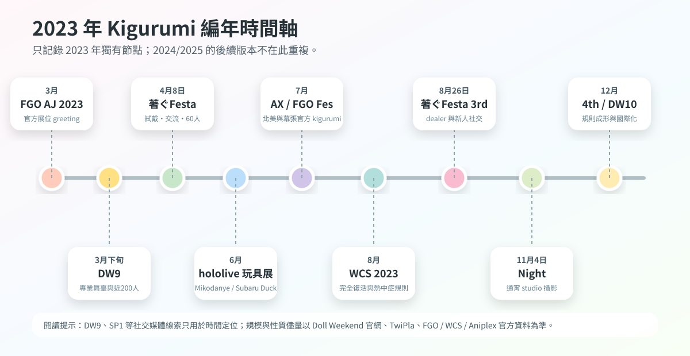
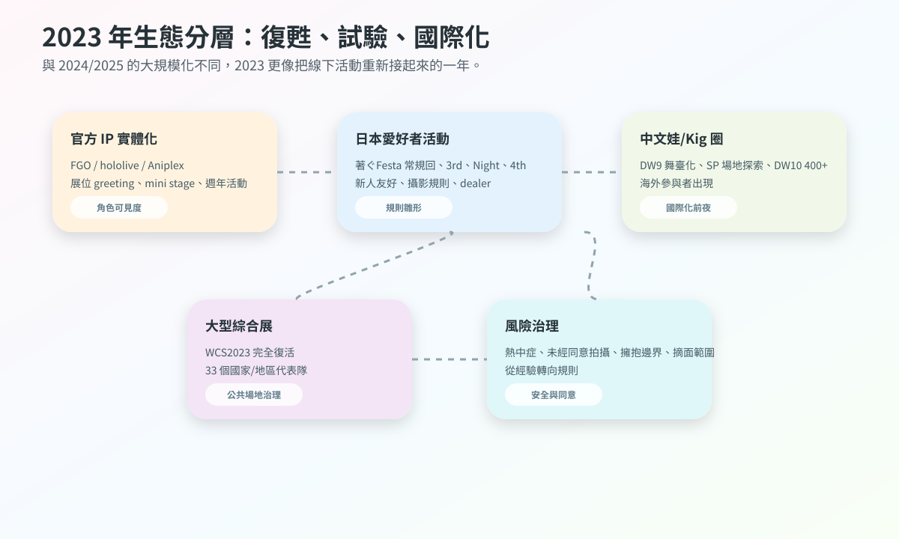
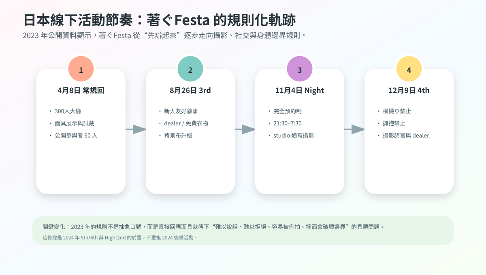
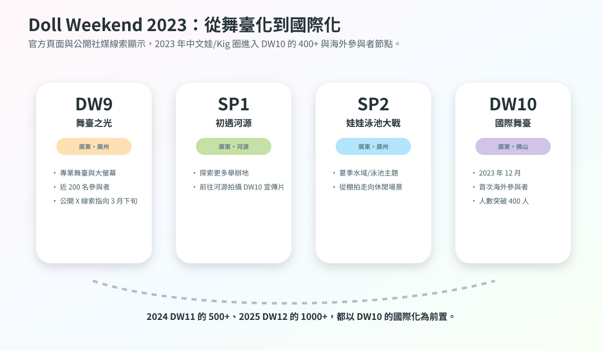
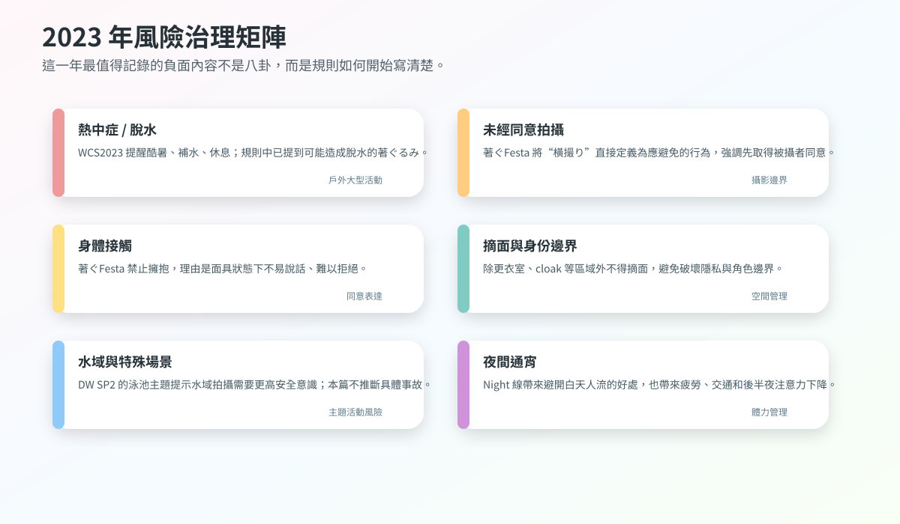
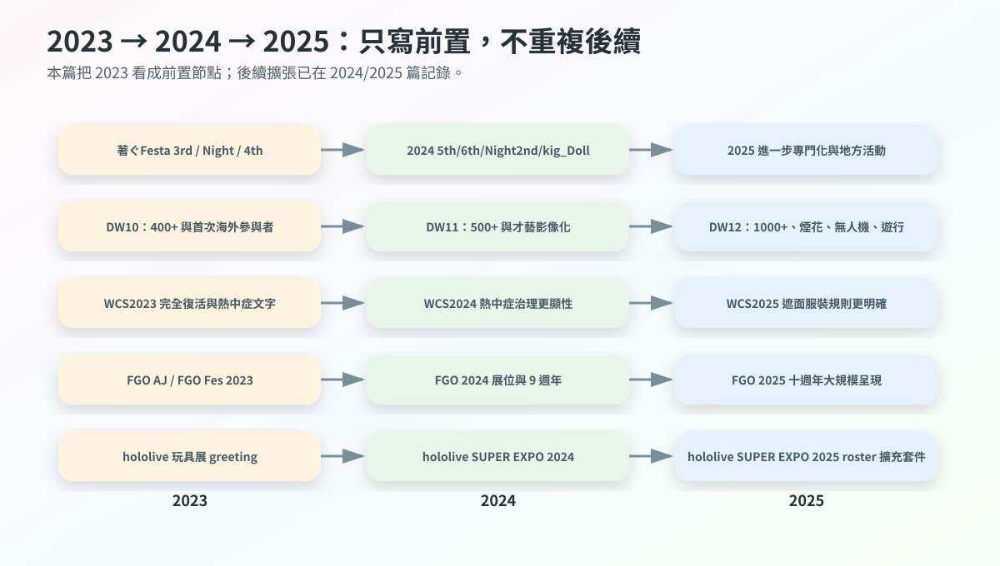

# 2023 年 Kigurumi 編年史

> 編寫口徑：本篇承接《2025 年 Kigurumi 編年史》與《2024 年 Kigurumi 編年史》的結構，但**不重複 2024、2025 已經記錄過的活動版本、規則更新和產業擴充套件**。同一系列活動若 2023 年已經出現前置版本、獨立規則、規模節點或首次變化，則記錄其 2023 年狀態；若只是後續年份已經詳寫的背景說明，本篇只做壓縮說明。

---

## 0. 資料邊界、去重原則與可信度說明

這份 2023 年編年史中的 **kigurumi** 仍按前兩篇的廣義口徑整理：包括 animegao kigurumi / 美少女著ぐるみ / 面具型角色扮演、doller、中文“娃 / Kig / Kiger”線下活動、官方 IP 吉祥物式著ぐるみ greeting、以及大型 cosplay 活動中涉及全頭套、遮面、熱中症、攝影同意的規則文字。2025 篇已經詳細解釋術語，本篇不再重複長篇定義，只在必要處區分“官方 mascot greeting”“愛好者 kigurumi 活動”“中文 Doll Weekend 娃展”“主流 cosplay 大會規則”四類資料。

本篇採用公開資料優先原則。高可信資料包括 FGO、WCS、hololive、Aniplex、Doll Weekend 與 TwiPla 活動頁；媒體報道用於補充現場規模、角色數量和展位安排；X / Twitter、Facebook、Bilibili、YouTube 等社交平臺只用於輔助判斷時間線或活動氛圍，不作為未經驗證指控的依據。匿名爆料、私域群聊、已刪除帖、傳聞截圖不列入事實記錄。

2024、2025 已整理過的內容，本篇按以下規則去重：

| 去重型別 | 2023 篇處理方式 |
|---|---|
| 同一系列活動在 2024/2025 繼續舉辦 | 只寫 2023 的前置版本、當年規則、當年規模，不重複後續年細節 |
| 2025 已解釋的 kigurumi 術語 | 僅保留必要口徑，不再重複長篇定義 |
| 2024/2025 已寫的 WCS 熱中症、遮面規則 | 只寫 2023 年已經出現的前置文字與“完全復活”背景 |
| 2024/2025 已寫的 Doll Weekend 11/12 | 只寫 DW9、SP1、SP2、DW10 與 2023 國際化前夜 |
| 官方 IP greeting 在後續年繼續存在 | 只寫 2023 年的展會版本和角色/數量變化 |
| 傳聞與人物爭議 | 不復述未核實指控，只記錄公開規則中顯示的治理壓力 |

---

## 1. 2023 年總體脈絡

2023 年不是 2024 年或 2025 年的縮小版，而是一個更基礎的“恢復連線之年”。如果說 2024 年是專門活動成形、知識生產集中、風險治理顯性化的一年，2025 年是規模化與跨境化進一步加速的一年，那麼 2023 年的關鍵詞更接近：**疫情後線下復甦、同好活動規則化、官方 IP greeting 穩定迴歸、中文娃圈進入國際化前夜**。

第一條主線是日本愛好者活動的重啟與規則雛形。公開資料顯示，著ぐFesta 在 2023 年 4 月、8 月、11 月、12 月均留下可檢索活動頁：4 月常規回已經有 60 名公開報名參與者、面具展示與試戴、白黑背景攝影；8 月 3rd 開始更明確地強調“新人友好”“著ぐるみさんは話せない”帶來的社交障礙；11 月 Night 嘗試通宵 studio 攝影；12 月 4th 則把橫撮り禁止、擁抱禁止、長物禁止、除更衣室/クローク外不得摘面、攝影講習、dealer 參加等內容寫得更系統。這說明 2023 年日本 kigurumi 小型活動已經從“辦一個能聚的場”轉向“把交流、攝影和身體邊界寫成規則”。

第二條主線是官方 IP 的實體化繼續出現在大型展會。FGO 在 AnimeJapan 2023 安排了 cosplayer / kigurumi greeting；FGO Fes. 2023 夏祭り中，媒體記錄有 9 名官方 cosplayer 與 7 體 kigurumi 在 welcome road 等區域迎接觀眾；Aniplex of America 在 Anime Expo 2023 的 Entertainment Hall 展位安排 FGO mini stage，並寫明會有 fan-favorite kigurumi appearances；hololive production 則在東京おもちゃショー 2023 出展，並於一般公開日安排“みこだにぇー”“スバルドダック”的 kigurumi greeting。這條線和 animegao 愛好者並不完全相同，但它讓“二次元角色以全頭套/吉祥物身體出現在現場”持續進入普通觀眾視野。

第三條主線是中文 Doll Weekend 體系從舞臺化走向國際化。2025 篇已經寫過 DW12 的千人級、煙花、無人機和遊行；2024 篇寫過 DW11 的 500+ 與才藝影像化；本篇只記錄 2023 年前置：DW9 的“舞臺之光”頁面寫明首次配備專業舞臺與大螢幕、近 200 名參與者；SP1 前往河源探索場地並拍攝 DW10 宣傳片；SP2 以“娃娃泳池大戰”為主題；DW10 於 2023 年 12 月在廣東佛山舉辦，官方頁面寫明首次迎來海外參與者，人數突破 400 人，成為多元文化交匯的國際性娃娃交流平臺。

第四條主線是主流 cosplay 大會的恢復與安全規則。WCS 2023 被官方宣傳為“完全復活”，活動在 8 月 4—6 日於名古屋/愛知舉辦；外務省資料記錄當年有 33 個國家和地區代表隊參加世界 cosplay championship。WCS 2023 的規則頁雖然不像 2025 那樣把 kigurumi、gawa-cos、doller、全臉面具等遮面類別單列得非常清楚，但已經在服裝小道具規則中寫到：過度暴露、過尖、過長、難以行走，或可能導致脫水的著ぐるみ類，工作人員可判斷拒絕。熱中症預防頁面也提醒 2023 年活動日預計酷暑，要求補水、休息、冷卻與體調管理。

因此，2023 年的 kigurumi 年度位置可以概括為：**它不是規模最大的年份，卻是很多後續擴張的前置年份。**著ぐFesta 的規則化、DW10 的國際化、WCS 的完全復活、FGO/hololive/Aniplex 的官方 greeting、以及熱中症與攝影同意問題的公開文字，都在為 2024 和 2025 的更大規模、更明確制度鋪路。

---

## 2. 2023 年編年史

### 3 月 25—26 日：FGO × AnimeJapan 2023——官方 cosplayer / kigurumi greeting 的展位化迴歸

2023 年 3 月 25—26 日，Fate/Grand Order 在東京 Big Sight 的 AnimeJapan 2023 出展。官方頁面寫明，FGO 展位位於東京 Big Sight 東展示棟東 4 Hall J62，展位內容包括英靈召喚 photo studio、寶具展示、官方商品銷售，以及“コスプレイヤー･著ぐるみグリーティング”。這條記錄是 2023 年官方 IP kigurumi 線的重要開端，因為它不是單獨一隻吉祥物臨時出現，而是被寫入大型展會的展位運營內容。[[S1]](#s1)

AnimeJapan 的特點在於觀眾成分廣、展位密度高、攝影需求強。FGO 把 kigurumi greeting 放在展位資訊中，說明角色實體化已經成為展位體驗的一部分。觀眾來到 FGO 展位，能看到道具、展板、商品、舞臺資訊，也能遇到官方 cosplayer 與 kigurumi。對 IP 運營來說，這種安排把手機遊戲從螢幕延展到會場空間；對 kigurumi 史來說，它證明“官方角色人偶/全頭套互動”在 2023 年仍是主流動漫展的常規工具之一。

它與愛好者 animegao kigurumi 有明顯區別。FGO 展位的 kigurumi 是官方授權與運營方管理下的角色呈現，動作、互動邊界、排隊秩序與攝影時間都服從展位管理；愛好者 kigurumi 更強調個人角色扮演、拍攝作品、同好交流和身體表達。兩者不能混為一談，但在普通觀眾眼中，它們共同塑造了“二次元角色可以以全頭套身體出現在現實”的認知。

與 2024、2025 的 FGO 活動相比，AnimeJapan 2023 的意義是“恢復與展位化”。2025 篇已經記錄 AnimeJapan 2025 與 FGO Fes. 十週年的更大規模，本篇只保留 2023 節點：它把官方 greeting 放在年初大型展會中，為後續 FGO Fes. 2023 的週年呈現形成前奏。

### 3 月下旬前後：Doll Weekend 9「舞臺之光」——中文娃/Kig 圈的舞臺化節點

Doll Weekend 9 的官方頁面將其主題寫作“舞臺之光”，地點為廣東廣州，並說明這是 DW 首次配備專業舞臺與大螢幕，為娃娃們的才藝展示提供焦點，參與規模近 200 人。公開 X 索引顯示 Doll Weekend 官方賬號在 2023 年 3 月下旬釋出過“Welcome to Doll Weekend 9!”並使用 #doll_weekend9 與 #kigurumi 標籤；由於官網頁面本身未列精確日期，本篇將其寫作“3 月下旬前後”而不強行寫具體日。[[S2]](#s2)[[S3]](#s3)

DW9 是 2023 年中文娃/Kig 圈從普通聚會走向舞臺化的重要節點。它的關鍵詞不是“人數最多”，而是“專業舞臺與大螢幕”。這意味著活動不再只圍繞攝影師與單個 kiger 展開，而開始讓參與者進入可觀看、可展示、可記錄的集體舞臺環境。舞臺與大螢幕能把角色表演、走秀、才藝、集體亮相放大給現場觀眾，也讓活動影像更容易被二次傳播。

舞臺化對 kigurumi/doll 文化有雙重影響。正面看，它把“娃”從靜態拍照物件推進到表演主體：角色動作、步態、定點、舞臺燈光、觀眾反應都開始影響作品效果。負面或風險看，舞臺也會放大體力消耗、視野限制、上下臺安全、燈光溫度、音樂節奏和道具失誤。尤其對於戴頭殼、視線受限、可能無法清楚聽見工作人員指令的表演者來說，舞臺並不是普通 cosplay 走秀的簡單複製。

把 DW9 寫入 2023 編年史，是為了說明 DW10 的 400+ 和海外參與者並非憑空出現。DW9 的舞臺化，是中文圈在 2023 年已經開始把 kigurumi/doll 活動做成“可展示的節目”的證據。2024 DW11 的才藝殿堂與全程錄製、2025 DW12 的慶典化，都能在 DW9 的專業舞臺邏輯中找到前史。

### 4 月 8 日：著ぐFesta 2023 常規回——面具試戴、白黑背景與 60 名公開參與者

2023 年 4 月 8 日，著ぐFesta 在荒川區サンパール荒川小ホール舉辦常規交流活動。TwiPla 頁頭顯示日期為 2023 年 4 月 8 日 10:00，活動標題為“著ぐFesta！ 著ぐるみさんと著ぐるみ好きさんの交流イベント”。頁面說明活動源於“也想要一個無需預約、能輕鬆來玩的活動”的聲音，會場是可容納約 300 人、可舉辦婚禮等活動的大廳；主辦方為 GarageStudioC7。頁面還寫明會場樓層包場，hall 與 entrance 都可供 kigurumi 使用，舞臺和樂屋作為更衣室與 cloak，且設有女性更衣室。公開報名處顯示參加者 60 人。[[S4]](#s4)

這場活動的重要性在於它把 2023 年日本 kigurumi 愛好者活動的幾個基礎需求同時呈現出來：交流空間、更衣空間、攝影背景、面具試戴、maker 諮詢和新人進入。頁面寫到，運營方還不完全把握參與者想要什麼服務，因此沒有準備太多大型企劃，希望透過參與者反饋在以後準備內容；但同時，頁面又已經安排了合作個人製作者面具展示與試戴，並稱這是 GarageStudioC7 “試して相談して気軽にお迎えできる”目標的第一步。[[S4]](#s4)

這段文字很有史料價值。它說明 2023 年的著ぐFesta 還在探索活動形態，不是從一開始就擁有成熟流程。面具試戴與諮詢尤其關鍵，因為 animegao kigurumi 的入門門檻很高：新人很難只透過照片判斷頭殼大小、視線、內部空間、佩戴穩定性、假髮搭配、臉型比例和膚色衣效果。能夠在活動中試戴、看實物、諮詢 maker，相當於把原本分散在私聊、訂單和經驗帖中的知識搬到線下。

白黑背景攝影也是一個小但重要的基礎設施。kigurumi 造型常常需要更乾淨的背景和可控光線來突出角色線條，尤其是大頭殼、假髮、裙襬、膚色衣和鞋的比例。如果只在公共會場隨手拍，背景雜亂、路人入鏡、地面反光、燈色偏差都會影響效果。著ぐFesta 4 月回把背景、試戴與交流放在同一空間，說明社群已經在同時處理“新人入門”和“作品產出”兩個需求。

這場活動和 2024 年著ぐFesta 5th/6th 的差異也很明顯。2024 篇已經寫過後續規則更成熟，本篇只記錄 2023 4 月回的“探索狀態”：它已經有 60 名公開參與者與初步服務，但仍在透過參與者反饋尋找活動方向。正是這種探索，才讓 8 月 3rd、11 月 Night、12 月 4th 能繼續細化規則。

### 6 月 8—11 日：hololive production × 東京おもちゃショー 2023——官方 mascot 進入玩具/家庭向場域

2023 年 6 月 8—11 日，hololive production 在東京 Big Sight 舉辦的“東京おもちゃショー 2023”出展。電撃ホビーウェブ報道寫明，這是 hololive production 首次出展該活動；東京おもちゃショー由日本玩具協會主辦，是日本國內最大規模的玩具展示會，前兩日面向商務相關人員，後兩日為兒童、家庭等一般觀眾公開。報道還寫明，hololive production 會在一般公開日 6 月 10 日、11 日於展位實施 kigurumi greeting，登場角色為“みこだにぇー”和“スバルドダック”，各日 11:00、13:00、15:00 登場，每回約 30 分鐘。[[S5]](#s5)

這一節點與 2024/2025 hololive SUPER EXPO 的意義不同。SUPER EXPO 是 hololive 自身的大型粉絲活動，觀眾本來就高度理解 VTuber 與角色衍生物；東京おもちゃショー則是玩具行業和家庭向場域，觀眾中有商務人士、兒童、家長和普通玩具消費者。hololive 在這裡安排 kigurumi greeting，說明官方 mascot 並不只服務核心粉絲，也能作為品牌向大眾解釋自身世界觀的入口。

從 kigurumi 編年史角度看，這類 greeting 的意義在於“跨場域可見”。它並非 animegao 愛好者活動，但它讓更多非核心二次元觀眾接觸到“角色透過全頭套/吉祥物身體與人互動”的形式。みこだにぇー、スバルドダック這類角色本身帶有二次創作、梗文化、吉祥物和 VTuber 生態的混合屬性，放到玩具展中會進一步模糊虛擬角色、玩偶、mascot、cosplay 和 kigurumi 的邊界。

這也解釋了為什麼 2023 編年史不能只寫愛好者聚會。外部社會認識 kigurumi 的路徑並不單一：有人從 FGO 展位看到官方 kigurumi，有人從 hololive 玩具展看到 mascot greeting，有人從 Doll Weekend 影片看到中文“娃”，有人從著ぐFesta 接觸 animegao 同好。2023 年這些路徑並行存在，為 2024/2025 的更高可見度打下基礎。

### 6 月下旬前後：Doll Weekend Special 1「初遇河源」——場地探索與 DW10 宣傳片前置

Doll Weekend Special 1 的官方頁面標題為“初遇河源”，地點為廣東河源。頁面說明：為了探索更多娃娃活動舉辦地，Doll Weekend 首次前往河源，拍攝了 DW10 宣傳片。公開 X 連結顯示官方賬號在 2023 年 6 月下旬釋出過 SP1 合照相關內容；由於官網頁面未列完整年月日，本篇以“6 月下旬前後”記錄，並只把 X 線索作為時間定位輔助。[[S6]](#s6)[[S7]](#s7)

SP1 的意義不在於人數或舞臺規模，而在於“場地探索”。對 kigurumi/doll 活動來說，場地並不是可隨意替換的背景。一個適合普通人拍照的酒店、景區、咖啡館或度假空間，不一定適合頭殼玩家：更衣是否隱蔽、空調是否足夠、頭殼箱能否寄放、動線是否有樓梯、地面是否打滑、是否允許長時間攝影、是否會有大量無關遊客、是否能安排休息室，都會影響活動可行性。

河源在 2025 年 DW12 中成為重要地點，但 2025 篇已經記錄了 DW12 的千人級、煙花、無人機和遊行，本篇只記錄 SP1 作為 2023 前置。官方頁面寫明 SP1 是為探索更多舉辦地並拍攝 DW10 宣傳片，這說明 Doll Weekend 體系在 2023 年已經不滿足於固定城市與常規展會，而開始尋找更有畫面感、更適合影像傳播和後續擴充套件的空間。

這類“前置拍攝”也代表活動品牌化。普通同好聚會結束後也會有照片，但為下一屆活動拍宣傳片意味著主辦方已經開始主動塑造活動敘事：不是“我們又聚了一次”，而是“下一次活動將是什麼主題、什麼城市、什麼視覺氛圍”。2023 年的 SP1 因此應被視為 DW10 國際化之前的品牌鋪墊。

### 夏季階段：Doll Weekend Special 2「娃娃泳池大戰」——水域主題與安全想象

Doll Weekend Special 2 的官方頁面標題為“娃娃泳池大戰”，地點為廣東廣州，頁面寫道“炎炎夏日，泳池裡怎麼能少了娃？”並列出 Bilibili 活動影像、合照和現場照片等內容。官網未列具體日期，因此本篇只將其歸入 2023 年 DW10 前的“夏季階段線索”，不寫具體日。[[S8]](#s8)

SP2 是一個非常不同於大廳、舞臺和普通攝影會的主題。泳池、水邊、夏季休閒空間，本來就很容易產生視覺吸引力：反光、水面、泳池藍、度假風、夏日服裝都能讓角色照片更有季節感。但對於 kigurumi/doll 玩家來說，水域主題也天然帶有更高風險。頭殼、假髮、緊身衣、鞋底、填充材料和角色服裝一旦接觸水或溼滑地面，行動難度與摔倒風險都會上升；水邊擁擠、攝影器材、圍觀者和溫度也會放大問題。

本篇不推斷 SP2 現場是否發生過具體安全問題，因為公開頁面沒有列出事故或負面記錄；但從年度編年史角度看，它值得作為“主題擴充套件”事件記錄。2025 篇曾寫到 Lagucos / WCS 周邊規則禁止 kigurumi 風格服裝入水；2023 SP2 則從另一個角度說明，中文娃圈已經在嘗試把 kigurumi/doll 場景帶入水域或夏季休閒主題。兩者不矛盾：一個是活動創意，一個是安全治理。成熟社群需要同時記錄創意與風險。

SP2 也證明 Doll Weekend 在 2023 年已經不僅是“展會大廳 + 合照”。它在 DW9 舞臺化、SP1 場地探索、SP2 泳池主題、DW10 國際化之間形成了一條連續試驗線：舞臺、城市、場景、水域、影像傳播。2024/2025 的大規模節慶化，正建立在這些 2023 年的實驗上。

### 7 月 1—4 日：Anime Expo 2023 與 Aniplex / FGO kigurumi mini stage——北美官方 IP 線的可見節點

2023 年 7 月 1—4 日，Aniplex of America 參加洛杉磯 Anime Expo 2023。Aniplex 官方 PDF 新聞稿寫明，它在 Exhibit Hall 有 Booth #1800，在 Entertainment Hall 有 Booth #E-14；其中 Booth #E-14 會展示 Fate/Grand Order，並設有 mini stage，觀眾可看到 fan-favorite kigurumi appearances。Aniplex 官網頁面也記錄了 AX 2023 的日期、兩個展位位置，以及 FGO 6th Anniversary x TYPE-MOON Projects 等活動安排。[[S9]](#s9)[[S10]](#s10)

這條北美線與 2025 篇記錄的 Anime Expo 2025 Aniplex kigurumi 一脈相承，但本篇只寫 2023 年版本。它的意義在於：FGO kigurumi 不只在日本展會存在，也出現在北美最大級別動漫展的官方展位。AX 的觀眾規模、商業強度、社交媒體傳播能力都很高，FGO mini stage 上的 kigurumi appearances 會把官方角色實體化帶給大量英語圈觀眾。

北美展會中的 kigurumi 還有另一個特殊點：英語語境裡 “kigurumi” 經常被誤解為連體睡衣，因此官方新聞稿直接使用 kigurumi appearances，本身就會讓部分觀眾重新理解這個詞。FGO 的官方 kigurumi 與 animegao 玩家不同，但它會影響普通觀眾對“會動的二次元角色身體”的認知。觀眾可能不知道 animegao、doller、gawa-cos 的差別，卻會先在官方展位遇到 kigurumi。

從 2023 年年度史看，Anime Expo 2023 補足了日本和中國以外的公開線索：FGO 在日本 AnimeJapan、幕張 Fes.、美國 AX 都使用了 kigurumi / mascot 身體。也就是說，2023 的 kigurumi 可見度並不是單一區域現象，而是透過 IP 展位運營進入跨國粉絲場域。

### 7 月 29—30 日：FGO Fes. 2023 夏祭り ～8th Anniversary～——9 名官方 cosplayer 與 7 體 kigurumi 的週年呈現

2023 年 7 月 29—30 日，Fate/Grand Order Fes. 2023 夏祭り ～8th Anniversary～ 在幕張 Messe 舉辦。GAME Watch 報道寫明，會期為 7 月 29、30 日，時間 9:00 至 18:00，地點為幕張 Messe 國際展示場 9—11 Hall。Inside Games 的現場報道則寫明，在 welcome road 上，觀眾伴隨映像演出和 BGM 入場，由官方 cosplayer 與 kigurumi 迎接；此次報道物件包括總計 9 名官方 cosplayer 與 7 體 kigurumi。[[S11]](#s11)[[S12]](#s12)

這場活動是 FGO 2023 官方 kigurumi 線中最強的年度節點。AnimeJapan 2023 更像展位運營，FGO Fes. 2023 則是週年慶典。週年活動的沉浸感更強，welcome road 的紅毯、大螢幕、BGM、官方 cosplayer 與 kigurumi 共同構成“進入迦勒底/進入祭典”的現場體驗。對粉絲而言，這不是簡單合影，而是用角色身體把遊戲世界臨時搬到幕張。

Inside Games 還提到“光のコヤンスカヤ”和“バーヴァン・シー”的 cosplayer 初登場，並將報道定位為官方 cosplayer 與 kigurumi 的 photo report。這說明 FGO 的角色呈現分層已經很成熟：真人 cosplayer 負責部分角色的人形再現，kigurumi 負責吉祥物或更適合全頭套身體表現的角色，二者共同形成展會入口氣氛。對 kigurumi 編年史而言，7 體 kigurumi 不是孤立數字，而是官方展會把“多隻角色身體同時出現”變成可觀看場景的證據。[[S11]](#s11)

與 2024 年 9 週年、2025 年 10 週年相比，2023 的關鍵詞是“夏祭り”和“8th Anniversary”。本篇不重複後續年人數或角色變化，只記錄 2023 年已經形成的結構：FGO 在日本國內大型週年活動中以多體 kigurumi 與官方 cosplayer 共同迎接觀眾，角色實體化不再只是展位附屬，而是週年慶典體驗的重要組成。

### 8 月 4—6 日：World Cosplay Summit 2023——“完全復活”與熱中症治理的前置文字

2023 年 8 月 4—6 日，World Cosplay Summit 2023 在愛知縣名古屋市舉行。WCS 官方 PR Times 新聞稿將這一年稱為“完全復活”，並說明疫情前透過世界各地預選賽來日的代表 cosplayer 是 WCS 最大特徵之一；2022 年因入境限制等原因代表國家數仍有限，而 2023 年預計來自 33 個國家和地區。日本外務省頁面也記錄，2023 年第 21 屆 WCS 於 8 月 4—6 日在名古屋舉行，世界 cosplay championship 中有 33 個國家和地區代表隊參賽，英國隊獲得冠軍並獲外務大臣獎。[[S13]](#s13)[[S14]](#s14)

WCS 2023 對 kigurumi 的意義並不在於它舉辦了專門 kigurumi 聚會，而在於它代表主流 cosplay 大會恢復公共空間與國際交流。大型主流活動恢復後，kigurumi、全頭套、厚重服裝、遮面服裝、長物道具、攝影同意、熱中症、路人入鏡等問題都會重新變得現實。2023 年 WCS 的公共性尤其強：官方規則開頭即提醒，會場是公共場所，普通來場者和通行人也會在場，參與者應注意不干擾一般遊客和店鋪。

WCS 2023 規則頁已經把熱與身體負擔寫入服裝管理。衣裝・小道具・更衣條目中寫明，過度暴露、先端過尖、衣襬過長導致步行困難，或“脫水症狀になる可能性のある著ぐるみ類”等過度服裝，工作人員可判斷要求參加者避免。攝影交流條目也要求不要長時間佔用拍攝地點，不要進行下著可見 pose 或過度低角度拍攝，不要未經被攝者同意拍攝。[[S15]](#s15)

WCS 2023 的熱中症預防頁面則更具體。頁面提醒 2023 年活動日預計酷暑，要求參與者補水、頻繁休息、使用冷卻用品、強日照時不要勉強參加，體調不良時聯絡巡迴工作人員。這些內容在 2024、2025 繼續變得更顯性，但 2023 已經把夏季 cosplay 與身體風險聯絡起來。對 kigurumi 表演者來說，這類規則尤其重要，因為頭殼、假髮、緊身衣、填充和角色鞋會削弱散熱與行動能力。[[S16]](#s16)

因此，WCS 2023 是一個“前置規則節點”。它不像 2025 規則那樣明確列出 kigurumi、gawa-cos、doller、全臉面具、頭盔等遮面服裝的參與條件，但它已經把著ぐるみ類可能導致脫水、攝影必須獲得承諾、公共場所不能擾民等基本問題寫進位制度文字。後續年份更明確的遮面規則與夏季安全治理，都可以追溯到 2023 年公共活動恢復後的實際壓力。

### 8 月 26 日：著ぐFesta！3rd——“著ぐるみさんは話せない”被寫入活動理念

2023 年 8 月 26 日，著ぐFesta！3rd 在荒川區サンパール荒川小ホール舉行。TwiPla 頁頭顯示日期為 2023 年 8 月 26 日 10:00，標題為“著ぐFesta！3rd 著ぐるみさんと著ぐるみ好きさんの交流イベント”。頁面延續了“無需預約、輕鬆參加、300 人大廳交流”的定位，並特別寫明：活動初體驗的 kigurumi 玩家也應該能開心回家，沒有 kigurumi friends 的 solo 玩家可以來交朋友，熟練玩家看到這類新人與氛圍時也希望積極溝通。[[S17]](#s17)

3rd 頁面最值得記錄的一句話，是對社交困難的解釋。主辦方寫到，很多人看到 X 上活動很開心，於是想去活動，但到現場沒有認識的人；想找人交流時又會遇到“著ぐるみさんは話せない”這一最大弱點，結果可能只能遠遠看著熱鬧後難過離開。主辦方明確說，這個活動就是從“想解決這種問題”出發。[[S17]](#s17)

這句話之所以重要，是因為它把 kigurumi 的社交機制說得很清楚。外部觀眾常把 kigurumi 視為視覺奇觀，但參與者真正面對的困難往往是交流：角色狀態下無法正常說話，視線也不一定準確；對方不知道你是否願意被拍、是否能聽見、是否看見、是否想休息；新人也可能因為沒有熟人而無法融入。著ぐFesta 3rd 把這個問題寫在活動頁上，等於承認 kigurumi 活動需要主動設計社交入口，而不能只靠“大家自然熟”。

3rd 還開始出現更清晰的產業/資源流動。頁面寫明歡迎 kigurumi 相關 dealer 參加，口徑包括面具 dealer、衣裝綜合取扱業者、同人誌銷售等，並列出 CLS 參加，稱其從 mask 到肌タイツ、衣裝都可諮詢。頁面也設定了免費衣物放出、白黑背景攝影，並說明背景相比前回更大、更易使用。公開報名顯示參加者 36 人。[[S17]](#s17)

和 4 月回相比，8 月 3rd 的人數看似更少，但規則與敘事更成熟。4 月回像是在摸索參與者需要什麼；3rd 則已經更明確地說出新人困境、交流目標、dealer 參加和攝影基礎設施。它是 12 月 4th 規則完善的前一站，也是 2024 年 5th/6th 的直接前史。

### 11 月 4—5 日：著ぐFesta！Night——通宵 studio 攝影活動與封閉場地規則

2023 年 11 月 4 日晚，著ぐFesta！Night 在 Chrome Studio 川口舉辦。TwiPla 頁頭顯示開始時間為 2023 年 11 月 4 日 21:30，頁面稱其為特別 studio shooting event，活動時間為 21:30 至翌日 7:30，地點為 Chrome Studio 川口全館租用，費用 4000 日元，完全預約制且不接受當日參加。公開報名狀態顯示參加者 22/30 人。[[S18]](#s18)

Night 的意義在於它與常規著ぐFesta 走了不同路線。常規回強調無需預約、當日參加、交流優先，Night 則是完全預約制、人數上限、studio、通宵攝影。這種差異說明 2023 年日本 kigurumi 愛好者活動已經分化出兩類需求：一類是新人友好與社交進入，另一類是更安靜、更可控、更適合拍攝作品的封閉場地。通宵 studio 避開了白天公共空間的人流，也給了長時間拍攝與換裝的可能。

但通宵並不意味著風險更低。kigurumi 表演者長時間佩戴頭殼、假髮、緊身衣和角色鞋，體力消耗會持續累積；後半夜注意力下降、補水不足、交通返程、睡眠不足都會影響安全。頁面還特別提到女性更衣室需事前聯絡，說明 studio 場地安排也有協議和空間限制，不是所有需求都能現場臨時處理。[[S18]](#s18)

Night 的規則文字與後續著ぐFesta 規則高度一致。頁面禁止橫撮り，要求先取得被攝者同意；禁止擁抱，理由是 kigurumi 狀態下意思表示困難，可能發生無法拒絕過度接觸的問題；禁止揮舞長物；禁止在更衣室和 cloak 以外摘面；並給出相機基礎建議，如不要用 50mm 以下短焦距拍近景，避免廣角導致頭變形，若使用手機可退遠後放大。[[S18]](#s18)

這段相機建議是 2023 年少見的“技術考究型”資料。它說明活動主辦方不僅管秩序，也在試圖提升 kigurumi 攝影質量。kigurumi 面具和角色比例對鏡頭焦段非常敏感，廣角近拍會放大頭部、壓縮身體，讓本來就誇張的角色比例變得失衡；而合適距離和焦段能更接近二次元角色的視覺邏輯。Night 因此不是普通夜間活動，而是把攝影技術、同意規則、通宵體力和封閉場地管理結合到一起的實驗。

### 12 月 9 日：著ぐFesta！4th——攝影同意、擁抱禁止與 dealer 體系進一步成文

2023 年 12 月 9 日，著ぐFesta！4th 在荒川區サンパール荒川小ホール舉辦。TwiPla 頁面寫明活動時間為 10:00 至 16:00，地點仍為サンパール荒川小ホール，主辦為 GarageStudioC7，參加條件為 kigurumi 參與者與喜歡 kigurumi 的人，即使沒有自己的 kigurumi 也可參加。頁面也再次寫明，過往在其他活動等引起問題者或可能引起問題者請勿參加，且主辦方可能不解釋具體理由。公開報名顯示參加者 37 人。[[S19]](#s19)

4th 是 2023 年著ぐFesta 規則化最清晰的一次。頁面在活動內容中說明，它不是追求“撮れ高”的活動，而是希望 kigurumi 之間能交流、讓新人開心回家。隨後列出規則：橫撮り禁止，即在別人拍攝時從旁邊未經許可拍攝；即便被攝者能看到，也必須取得同意，否則屬於偷拍。頁面還指出，未經目線配合的照片往往並不好看，並且會讓 kigurumi 表演者可憐。[[S19]](#s19)

擁抱禁止的理由也寫得很具體：穿 kigurumi 的人與不穿的人之間，每個人距離感不同；但 kigurumi 表演者無法說話，意思表示困難，可能無法拒絕過度接觸，因此為防止糾紛需要禁止擁抱。這個規則非常重要，因為它把“可愛角色可以隨便抱”的外部誤解直接糾正為“角色身體仍屬於參與者本人，接觸必須以清楚同意為前提”。[[S19]](#s19)

4th 還禁止揮舞長物，理由是參與人數隨回數增加，雖然會場很寬，但道具脫手等意外可能導致受傷；同時規定除更衣室和 cloak 外不得摘面，因為即便樓層基本不對普通參與者開放，也可能有設施職員進入，不能只靠個人判斷。這個規則顯示 2023 年的 kigurumi 活動已經在處理“角色形象”“隱私”“設施職員”“公共責任”之間的關係。[[S19]](#s19)

在正面建設上，4th 延續並強化了攝影和 dealer。頁面寫明有工作人員攝影服務，照片後續會彙總上傳，並說明拍攝照片可能在 SNS 公開；頁面還稱 3rd 中受到好評的“著ぐるみさんの撮り方講習”將一天兩回舉行，面向“有單反但大概隨便拍”的人講相機基礎；同時繼續歡迎 kigurumi mask dealer、服裝業者、同人誌等參加，CLS 再次出展。白黑背景也進行了高度提升，以防低角度拍攝時穿幫，但同時提醒支柱不要依靠。[[S19]](#s19)

這場活動可以看作 2023 年日本小型 kigurumi 交流活動的年末總結。它把 4 月回的試戴、8 月 3rd 的新人社交、11 月 Night 的攝影規則與技術建議，整理成更清晰的常規活動文字。2024 年的著ぐFesta 5th/6th 繼續沿用並擴充套件這套邏輯，因此本篇只記錄 2023 年 4th 的“規則成文”意義，不重複 2024 後續。

### 12 月：Doll Weekend 10「國際舞臺」——400+、首次海外參與者與中文娃圈國際化節點

Doll Weekend 10 官方頁面顯示，該活動主題為“國際舞臺”，時間為 2023 年 12 月，地點為廣東佛山。頁面寫明：DW10 首次迎來海外參與者，人數突破 400 人，Doll Weekend 正式成為一個多元文化交匯的國際性娃娃交流平臺。官網還列出“DW10 正片：首次面向全球的娃娃大展”和“DW10 預告：二次元娃娃在三次元開了個咖啡館”等影像內容，並有大合影、現場照片、看板娘、周邊等圖集分類。[[S20]](#s20)

DW10 是 2023 年中文 kigurumi/doll 圈最重要的可確認節點。它與 DW9 的區別非常明確：DW9 強調專業舞臺與近 200 人，DW10 則強調海外參與者、400+ 規模與國際性。參與者數量從近 200 到突破 400，代表活動已經不只是本地玩家聚會，而是具備跨區域動員、場地承載、攝影組織、展商/周邊/看板娘/影像傳播的綜合能力。

“首次迎來海外參與者”尤其關鍵。kigurumi/doll 文化長期存在跨國觀看：日本、歐美、中國玩家會在 X、YouTube、Bilibili、論壇、個人站相互看到作品。但“看到”不等於“線下共同參加”。DW10 使海外參與者進入中文圈活動現場，意味著語言、旅行、住宿、器材運輸、現場接待、拍攝習慣和文化理解都開始進入同一場活動。2025 年 Doll Weekend × First Klass 日本企劃和 DW12 的國際化敘事，都可以追溯到 DW10 的這個節點。

DW10 也說明中文圈已經把活動影像當成核心資產。官網頁面不是簡單列出文字公告，而是把正片、預告、B站、圖集、看板娘、周邊都放在同一活動頁面中。對 kigurumi/doll 活動來說，影像記錄非常重要：很多角色只有在動作、群體場景、合照、舞臺和互動中才能體現“活起來”的效果。DW10 透過官方影像把活動從一次線下聚會變成可傳播的年度事件。

與 2024 DW11、2025 DW12 相比，DW10 的歷史定位應寫成“國際化前夜的真正門檻”。它還沒有 DW12 的千人級、煙花、無人機和遊行，也沒有 DW11 的才藝全程錄製主題；但它完成了 400+、海外參與者、佛山活動頁面、影像和跨文化定位。2023 年沒有 DW10，後兩年的擴張就缺少一個清晰的階梯。

---

## 3. 2023 年主要人物、組織與場域索引

### GarageStudioC7 / 著ぐFesta

2023 年日本愛好者活動線的核心公開組織。4 月常規回、8 月 3rd、11 月 Night、12 月 4th 都由 GarageStudioC7 相關賬號或 TwiPla 頁面記錄。其年度價值在於：透過可容納約 300 人的大廳、studio 夜間攝影、面具展示試戴、白黑背景、攝影講習、dealer 參加、免費衣物放出等方式，把小型 kigurumi 活動從“拍照聚會”推進到“新人友好 + 規則文字 + 技術傳播 + 資源交換”的綜合形態。[[S4]](#s4)[[S17]](#s17)[[S18]](#s18)[[S19]](#s19)

### Doll Weekend

2023 年中文娃/Kig 圈最重要的活動品牌。DW9 的專業舞臺與近 200 人、SP1 的河源探索、SP2 的泳池主題、DW10 的 400+ 與首次海外參與者，構成 2023 年的連續擴張線。Doll Weekend 官網將自己定位為全球最大、屬於娃娃和創作者們的線下產業盛會；這個定位在 2024/2025 得到進一步放大，但 2023 年 DW10 已經顯現其國際化與影像化趨勢。[[S2]](#s2)[[S6]](#s6)[[S8]](#s8)[[S20]](#s20)[[S21]](#s21)

### Fate/Grand Order / Aniplex / FGO PROJECT

2023 年官方 IP kigurumi 線的主要代表。FGO 在 AnimeJapan 2023 安排 cosplayer / kigurumi greeting；FGO Fes. 2023 以 9 名官方 cosplayer 與 7 體 kigurumi 在週年場景中迎接觀眾；Aniplex of America 在 Anime Expo 2023 的 FGO 展位 mini stage 也安排 fan-favorite kigurumi appearances。FGO 線的重要性在於，它把 kigurumi / mascot 身體放在日本與北美的大型 IP 活動中，持續塑造普通觀眾對角色實體化的認識。[[S1]](#s1)[[S9]](#s9)[[S11]](#s11)

### hololive production / COVER Corp.

2023 年官方 VTuber mascot 線的重要代表。hololive production 首次出展東京おもちゃショー 2023，並在一般公開日安排“みこだにぇー”“スバルドダック”kigurumi greeting。與 2024/2025 hololive SUPER EXPO 相比，這一節點更特別：它發生在玩具行業與家庭向觀眾場域中，說明 VTuber 吉祥物式 kigurumi 不只服務核心粉絲，也進入更大眾的玩具展示空間。[[S5]](#s5)

### World Cosplay Summit

2023 年主流 cosplay 國際活動恢復的標誌。WCS 2023 被官方稱為“完全復活”，外務省記錄有 33 個國家和地區代表隊參加。對 kigurumi 的直接意義在於，WCS 2023 規則已將可能導致脫水的著ぐるみ類列為工作人員可判斷限制的服裝型別，並對公共場地、攝影同意、低角度拍攝、長時間佔位等作出要求。[[S13]](#s13)[[S14]](#s14)[[S15]](#s15)

### CLS 等 kigurumi 相關 dealer

著ぐFesta 3rd 與 4th 頁面均提到 CLS 參加，頁面稱其可從 mask 到肌タイツ、衣裝進行諮詢。這類 dealer 不一定是全年最大事件，但對 2023 年生態很重要：它說明 kigurumi 活動現場已經出現“交流 + 製作/銷售/諮詢”的複合功能，玩家不只是來拍照，也可能在現場獲得面具、膚色衣和服裝的實際購買與製作建議。[[S17]](#s17)[[S19]](#s19)

---

## 4. 2023 年正面事件總賬

### 1. 線下活動從疫情後狀態恢復為可持續節奏

WCS 2023 被官方稱為“完全復活”，33 個國家和地區代表隊重新聚集名古屋；Doll Weekend 在 2023 年完成 DW9、SP1、SP2、DW10 等連續節點；著ぐFesta 在 4 月、8 月、11 月、12 月留下公開活動頁。它們共同說明 2023 年不是零散恢復，而是多個地區同時重新建立線下節奏。

### 2. 新人友好被寫成活動理念

著ぐFesta 3rd 和 4th 反覆強調：沒有 kigurumi friends 的 solo 玩家應該能來交朋友，活動的目標不是單純“撮れ高”，而是讓新人和老玩家都能交流。這種理念非常重要，因為 kigurumi 的社交門檻往往比服裝製作門檻更隱蔽：表演者不能說話、聽不清、視線不準、難以拒絕，都會影響新人的進入體驗。

### 3. 攝影、擁抱、摘面、長物等邊界開始具體化

2023 年著ぐFesta 的規則文字把“橫撮り禁止”“ハグ禁止”“長物の振り回し禁止”“更衣室、クローク以外での面脫ぎ禁止”寫得非常具體。它不是抽象的“請有禮貌”，而是直接對應 kigurumi 狀態下的同意表達困難、被攝者目線、身體接觸和隱私邊界。WCS 2023 也從大型公共活動層面對攝影同意、低角度拍攝和服裝風險作出規定。

### 4. 中文 Doll Weekend 完成 400+ 與首次海外參與者節點

DW10 是 2023 年中文圈最重要的正面節點之一。官方頁面寫明首次迎來海外參與者、人數突破 400，並將其定位為多元文化交匯的國際性娃娃交流平臺。這個節點不是 2025 DW12 的重複，而是後續更大規模的基礎門檻。

### 5. 官方 IP greeting 形成跨國可見度

FGO 在 AnimeJapan 與 FGO Fes.、Aniplex 在 Anime Expo、hololive 在東京おもちゃショー，都讓 kigurumi / mascot 身體進入大型展會。它們雖然不是愛好者 animegao 活動，但會降低普通觀眾對全頭套角色的陌生感，並讓“角色實體化”成為二次元線下運營的一部分。

---

## 5. 2023 年負面事件與風險總賬

### 1. 熱中症與脫水風險被明確寫入大型活動文字

WCS 2023 規則中已經出現“可能導致脫水的著ぐるみ類”這一表達，熱中症預防頁面也提醒活動日預計酷暑，要求補水、休息、冷卻用品和不要勉強參加。這說明在 2023 年，夏季 cosplay 與 kigurumi 的身體風險已經不是私下經驗，而是主辦方規則的一部分。

### 2. 未經同意拍攝成為社群治理重點

著ぐFesta 4th 將橫撮り禁止解釋得非常明確：別人正在拍攝時從旁邊拍照，即便被攝者能看見，也要先取得承諾，否則屬於偷拍。WCS 2023 也要求不要未經被攝者同意拍攝。對 kigurumi 來說，這尤其重要，因為表演者無法像普通 cosplayer 一樣快速用語言拒絕、解釋或要求刪除。

### 3. “可愛角色可以隨便抱”的誤解被規則化糾正

著ぐFesta 規則禁止擁抱，並說明 kigurumi 表演者不易說話、意思表示困難，可能無法拒絕過度接觸。這不是小題大做，而是 kigurumi 文化走向公開活動後必須處理的身體邊界問題。角色外形越可愛，外部觀眾越容易忘記裡面仍然是現實參與者。

### 4. 特殊場景帶來額外安全想象

Doll Weekend SP2 的泳池主題、著ぐFesta Night 的通宵 studio、WCS 的夏季戶外公共空間，都代表 2023 年 kigurumi 活動已經不只在普通室內場地發生。每一種特殊場景都會帶來新風險：水域有溼滑和服裝吸水問題，通宵有疲勞與返程問題，戶外夏季有中暑和路人動線問題。

### 5. 資料不完整本身也是編年史風險

2023 年資料的公開程度不如 2024/2025。有些 Doll Weekend 前置節點官網未列具體日期，需要用 X 連結或活動順序輔助定位；部分社交平臺內容未來也可能失效。因此本篇在時間不確定處使用“前後”“階段”等表達，不把低可信線索寫成確定日程。這種謹慎也是避免 2024/2025 去重時混淆事件的重要方法。

---

## 6. 2023 年考究事件：這一年真正變化了什麼

### 官方 mascot 與愛好者 animegao 的邊界更加需要說明

2023 年 FGO、Aniplex、hololive 的官方 greeting 很多，但它們與著ぐFesta、Doll Weekend 的愛好者/玩家活動不是同一回事。官方 mascot 由 IP 方管理，目標是展位體驗、品牌傳播和粉絲互動；愛好者 animegao / doller / Kiger 更強調個人角色扮演、攝影創作、社群交流和身體表達。2023 年的特殊之處在於，這兩條線同時活躍，外部觀眾更容易把它們混為一談。

### “不能說話”從隱性經驗變成公開議題

著ぐFesta 3rd 與 4th 多次提到“著ぐるみさんは話せない”。這不是簡單玩笑，而是 kigurumi 社交與安全的核心。不能說話會影響新人融入、拍攝同意、拒絕擁抱、說明體調不適、請求幫助、辨認路線、結束互動等所有環節。2023 年把這一點寫進活動說明，是日本小型社群規則化的重要訊號。

### Doll Weekend 的增長不是突然發生在 2025

2025 篇記錄了 DW12 的千人級和慶典化，但 2023 DW10 已經突破 400 人並迎來海外參與者。DW9 的舞臺與大螢幕、SP1 的場地探索、SP2 的泳池主題都說明中文圈在 2023 年已經嘗試“舞臺化、場景化、影像化、國際化”。2025 的大規模不是孤立爆發，而是 2023—2024 連續擴張的結果。

### WCS 2023 的“完全復活”使風險治理重新現實化

疫情期間許多大型活動受限，風險更多停留在小圈層；WCS 2023 完全復活後，公共場地、國際參與者、普通路人、攝影者、熱中症、規則執行重新同時出現。對於 kigurumi 這類身體負擔較高、視線與溝通受限的參與形式，主流大會恢復意味著機會增加，也意味著規則壓力上升。

### 攝影技術開始成為活動內容

著ぐFesta Night 與 4th 都不只是“允許攝影”，而是主動提供拍攝服務、照片彙總、相機基礎建議和攝影講習。kigurumi 攝影不是普通人像攝影的簡單替換：面具比例、頭身關係、焦段、眼神方向、背景高度、裙襬、鞋與膚色衣都會影響最終效果。2023 年把攝影技法寫進活動內容，是知識生產的早期跡象。

---

## 7. 2023 年傳聞與爭議處理原則

本篇沒有列出 2023 年匿名論壇中的個人爭議、私域群聊爆料或未核實截圖。原因不是這些問題一定不存在，而是公開資料無法穩定驗證。對於 kigurumi 這樣小而高度依賴角色名、頭殼外觀、社交平臺賬號與線下身份的圈層，未經核實的點名很容易造成誤認和二次傷害。

2023 年可公開記錄的爭議壓力，主要體現在規則文字里：著ぐFesta 提到過去在其他活動引起問題者或可能引起問題者請勿參加，但不公開說明個案；同時又明確禁止橫撮り、擁抱、揮舞長物和場外摘面。WCS 2023 則從大型公共活動角度寫入熱中症、攝影同意、低角度拍攝和服裝風險。也就是說，2023 年真正可寫入史料的，不是“某人怎樣”，而是“哪些問題已經嚴重到主辦方必須寫成規則”。

如果後續出現更可靠的 2023 年公開資料，例如主辦方公告、當事人宣告、媒體報道或活動覆盤，本篇可更新；但在當前公開證據範圍內，不把傳聞寫成事實。

---

## 8. 與 2024、2025 篇關係：去重表

| 2023 記錄 | 2024/2025 後續 | 本篇如何避免重複 |
|---|---|---|
| 著ぐFesta 4 月回、3rd、Night、4th | 2024 5th、Night2nd、6th，2025 後續活動 | 只寫 2023 年規則形成和前置版本，不寫 2024/2025 的後續細節 |
| Doll Weekend 9 / SP1 / SP2 / DW10 | DW11 500+、DW12 1000+ 與慶典化 | 只寫 2023 年舞臺化、場地探索、400+ 與首次海外參與者 |
| FGO AnimeJapan 2023 / FGO Fes. 2023 | 2024 AnimeJapan / FGO Fes. 9th，2025 十週年 | 只寫 2023 年展位化與 8 週年 9+7 結構 |
| hololive 東京おもちゃショー 2023 | hololive SUPER EXPO 2024 / 2025 | 只寫 2023 玩具展/家庭向場域，不重複 SUPER EXPO roster |
| WCS 2023 完全復活與熱中症文字 | WCS2024 熱中症治理，WCS2025 遮面規則 | 只寫 2023 已出現的脫水/kigurumi與公共場地治理前置 |
| Aniplex Anime Expo 2023 | Aniplex Anime Expo 2025 20 週年與更多 kigurumi | 只寫 2023 FGO mini stage 的 kigurumi appearances |

---

## 9. 年度結論

2023 年的 kigurumi 不是一個“資料貧乏的小年”，而是一個很適合寫成前史的年份。它沒有 2025 年的 DW12 千人級與無人機，也沒有 2024 年底 Advent Calendar、160 份問卷和 C105 寫真集那樣集中的知識生產；但它有另一種更基礎的歷史價值：**它把線下重新接上，把活動規則寫出來，把中文圈推到國際化門檻，把官方 IP 的實體角色帶回大型展會，把熱中症和攝影同意重新變成必須面對的問題。**

如果只看“最大規模”，2023 可能會被後兩年遮住；但如果看“機制形成”，2023 非常重要。著ぐFesta 的活動頁說明，日本小型社群已經開始認真處理新人孤立、不能說話、攝影同意、擁抱邊界和摘面隱私；Doll Weekend 10 說明中文圈已經具備 400+、海外參與者、影像傳播和國際定位；FGO、Aniplex、hololive 說明官方 mascot greeting 已經跨日本與北美、跨動漫展與玩具展持續存在；WCS 2023 則說明主流 cosplay 大會恢復後，kigurumi 身體負擔與公共場地規則必須被制度化。

因此，2023 年的年度定位可以寫成一句話：**2023 是 kigurumi 從疫情後恢復走向 2024/2025 擴張的“連線年”——它不是高潮本身，而是讓後續高潮成為可能的基礎年份。**

---

## 參考資料

**[S1] Fate/Grand Order 官方：AnimeJapan 2023 出展資訊**
https://news.fate-go.jp/2023/aj2023/

**[S2] Doll Weekend 9 官方活動頁：舞臺之光**
https://dollweekend.cn/cn/event/dw9/

**[S3] Doll Weekend 官方 X：Welcome to Doll Weekend 9**
https://x.com/doll_weekend/status/1640343531914137600

**[S4] TwiPla：著ぐFesta 2023 年 4 月 8 日常規交流活動**
https://twipla.jp/events/542391

**[S5] 電撃ホビーウェブ：hololive production 出展東京おもちゃショー 2023 與 kigurumi greeting**
https://hobby.dengeki.com/news/1938607/

**[S6] Doll Weekend Special 1 官方活動頁：初遇河源**
https://dollweekend.cn/cn/event/dwsp1/

**[S7] Doll Weekend 官方 X：SP1 合照線索**
https://x.com/doll_weekend/status/1673201225146449922

**[S8] Doll Weekend Special 2 官方活動頁：娃娃泳池大戰**
https://dollweekend.cn/cn/event/dwsp2/

**[S9] Aniplex of America：Anime Expo 2023 官方新聞稿 PDF**
https://aniplexusa.com/pdf/PR_060623_AX2023.pdf

**[S10] Aniplex of America：Anime Expo 2023 頁面**
https://aniplexusa.com/ax2023/

**[S11] Inside Games：FGO Fes. 2023 官方 cosplayer 與 kigurumi photo report**
https://www.inside-games.jp/article/2023/07/29/147497.html

**[S12] GAME Watch：Fate/Grand Order Fes. 2023 夏祭り報道**
https://game.watch.impress.co.jp/docs/news/1520006.html

**[S13] PR TIMES / WCS：World Cosplay Summit 2023 完全復活公告**
https://prtimes.jp/main/html/rd/p/000000029.000061165.html

**[S14] 日本外務省：The World Cosplay Summit 2023**
https://www.mofa.go.jp/p_pd/ca_opr/page23e_000653.html

**[S15] WCS 2023 參加規約**
https://worldcosplaysummit.jp/2023/cosplay/rule/

**[S16] WCS 2023 熱中症預防・防止對策**
https://worldcosplaysummit.jp/2023/cosplay/heatstroke/

**[S17] TwiPla：著ぐFesta！3rd**
https://twipla.jp/events/568769

**[S18] TwiPla：著ぐFesta！Night**
https://twipla.jp/events/577287

**[S19] TwiPla：著ぐFesta！4th**
https://twipla.jp/events/577822

**[S20] Doll Weekend 10 官方活動頁：國際舞臺**
https://dollweekend.cn/cn/event/dw10/

**[S21] Doll Weekend 官方首頁 / 活動回顧與自我定位**
https://dollweekend.cn/cn/
