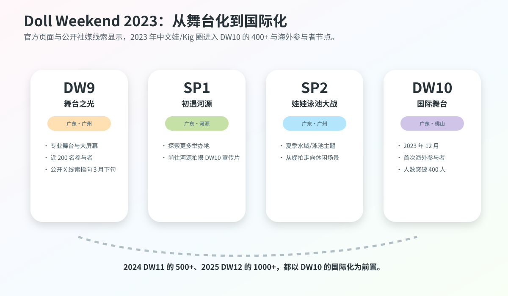

# 2023 年 Kigurumi 編年史

2023 年的重點是着ぐFesta 在一年內的不同活動形態、DW 舞臺化與國際參與，以及官方角色在動漫展和玩具展的公開節目。連續活動按當屆實際差異彙總。

## 年度重點

- **着ぐFesta**：4 月試戴與交流、8 月常規回、11 月夜間場、12 月攝影講習。
- **DW10**：12 月佛山，主辦方記錄 400+ 參與規模與海外參加者。
- **官方角色**：FGO 八週年及 hololive 東京玩具展 greeting。
- **資料性質**：報名頁人數不是最終到場統計，宣傳發布時間不是舉辦日。

## 年度紀事

### 3 月 25—26 日：FGO × AnimeJapan 2023——官方 cosplayer / kigurumi greeting 的展位化迴歸

2023 年 3 月 25—26 日，Fate/Grand Order 在東京 Big Sight 的 AnimeJapan 2023 出展。官方頁面寫明，FGO 展位位於東京 Big Sight 東展示棟東 4 Hall J62，展位內容包括英靈召喚 photo studio、寶具展示、官方商品銷售，以及“コスプレイヤー･着ぐるみグリーティング”。這條記錄是 2023 年官方 IP kigurumi 線的重要開端，因爲它不是單獨一隻吉祥物臨時出現，而是被寫入大型展會的展位運營內容。[[S1]](#s1)

AnimeJapan 的特點在於觀衆成分廣、展位密度高、攝影需求強。FGO 把 kigurumi greeting 放在展位信息中，說明角色實體化已經成爲展位體驗的一部分。觀衆來到 FGO 展位，能看到道具、展板、商品、舞臺信息，也能遇到官方 cosplayer 與 kigurumi。對 IP 運營來說，這種安排把手機遊戲從屏幕延展到會場空間；對 kigurumi 史來說，它證明“官方角色人偶/全頭套互動”在 2023 年仍是主流動漫展的常規工具之一。

它與愛好者 animegao kigurumi 有明顯區別。FGO 展位的 kigurumi 是官方授權與運營方管理下的角色呈現，動作、互動邊界、排隊秩序與攝影時間都服從展位管理；愛好者 kigurumi 更強調個人角色扮演、拍攝作品、同好交流和身體表達。兩者不能混爲一談，但在普通觀衆眼中，它們共同塑造了“二次元角色可以以全頭套身體出現在現實”的認知。

### 3 月下旬前後：Doll Weekend 9「舞臺之光」——中文娃/Kig 圈的舞臺化節點

Doll Weekend 9 的官方頁面將其主題寫作“舞臺之光”，地點爲廣東廣州，並說明這是 DW 首次配備專業舞臺與大屏幕，爲娃娃們的才藝展示提供焦點，參與規模近 200 人。公開 X 索引顯示 Doll Weekend 官方賬號在 2023 年 3 月下旬發佈過“Welcome to Doll Weekend 9!”並使用 #doll_weekend9 與 #kigurumi 標籤；由於官網頁面本身未列精確日期，本篇將其寫作“3 月下旬前後”而不強行寫具體日。[[S2]](#s2)[[S3]](#s3)

DW9 是 2023 年中文娃/Kig 圈從普通聚會走向舞臺化的重要節點。它的關鍵詞不是“人數最多”，而是“專業舞臺與大屏幕”。這意味着活動不再只圍繞攝影師與單個 kiger 展開，而開始讓參與者進入可觀看、可展示、可記錄的集體舞臺環境。舞臺與大屏幕能把角色表演、走秀、才藝、集體亮相放大給現場觀衆，也讓活動影像更容易被二次傳播。

舞臺化對 kigurumi/doll 文化有雙重影響。正面看，它把“娃”從靜態拍照對象推進到表演主體：角色動作、步態、定點、舞臺燈光、觀衆反應都開始影響作品效果。負面或風險看，舞臺也會放大體力消耗、視野限制、上下臺安全、燈光溫度、音樂節奏和道具失誤。尤其對於戴頭殼、視線受限、可能無法清楚聽見工作人員指令的表演者來說，舞臺並不是普通 cosplay 走秀的簡單複製。

### 4 月 8 日：着ぐFesta 2023 常規回——面具試戴、白黑背景與 60 名公開參與者

2023 年 4 月 8 日，着ぐFesta 在荒川區サンパール荒川小ホール舉辦常規交流活動。TwiPla 頁頭顯示日期爲 2023 年 4 月 8 日 10:00，活動標題爲“着ぐFesta！ 着ぐるみさんと着ぐるみ好きさんの交流イベント”。頁面說明活動源於“也想要一個無需預約、能輕鬆來玩的活動”的聲音，會場是可容納約 300 人、可舉辦婚禮等活動的大廳；主辦方爲 GarageStudioC7。頁面還寫明會場樓層包場，hall 與 entrance 都可供 kigurumi 使用，舞臺和樂屋作爲更衣室與 cloak，且設有女性更衣室。公開報名處顯示參加者 60 人。[[S4]](#s4)

這場活動的重要性在於它把 2023 年日本 kigurumi 愛好者活動的幾個基礎需求同時呈現出來：交流空間、更衣空間、攝影背景、面具試戴、maker 諮詢和新人進入。頁面寫到，運營方還不完全把握參與者想要什麼服務，因此沒有準備太多大型企劃，希望通過參與者反饋在以後準備內容；但同時，頁面又已經安排了合作個人製作者面具展示與試戴，並稱這是 GarageStudioC7 “試して相談して気軽にお迎えできる”目標的第一步。[[S4]](#s4)

這段文本很有史料價值。它說明 2023 年的着ぐFesta 還在探索活動形態，不是從一開始就擁有成熟流程。面具試戴與諮詢尤其關鍵，因爲 animegao kigurumi 的入門門檻很高：新人很難只通過照片判斷頭殼大小、視線、內部空間、佩戴穩定性、假髮搭配、臉型比例和膚色衣效果。能夠在活動中試戴、看實物、諮詢 maker，相當於把原本分散在私聊、訂單和經驗帖中的知識搬到線下。

白黑背景攝影也是一個小但重要的基礎設施。kigurumi 造型常常需要更乾淨的背景和可控光線來突出角色線條，尤其是大頭殼、假髮、裙襬、膚色衣和鞋的比例。如果只在公共會場隨手拍，背景雜亂、路人入鏡、地面反光、燈色偏差都會影響效果。着ぐFesta 4 月回把背景、試戴與交流放在同一空間，說明社羣已經在同時處理“新人入門”和“作品產出”兩個需求。

### 6 月 8—11 日：hololive production × 東京おもちゃショー 2023——官方 mascot 進入玩具/家庭向場域

2023 年 6 月 8—11 日，hololive production 在東京 Big Sight 舉辦的“東京おもちゃショー 2023”出展。電撃ホビーウェブ報道寫明，這是 hololive production 首次出展該活動；東京おもちゃショー由日本玩具協會主辦，是日本國內最大規模的玩具展示會，前兩日面向商務相關人員，後兩日爲兒童、家庭等一般觀衆公開。報道還寫明，hololive production 會在一般公開日 6 月 10 日、11 日於展位實施 kigurumi greeting，登場角色爲“みこだにぇー”和“スバルドダック”，各日 11:00、13:00、15:00 登場，每回約 30 分鐘。[[S5]](#s5)

這一節點與 2024/2025 hololive SUPER EXPO 的意義不同。SUPER EXPO 是 hololive 自身的大型粉絲活動，觀衆本來就高度理解 VTuber 與角色衍生物；東京おもちゃショー則是玩具行業和家庭向場域，觀衆中有商務人士、兒童、家長和普通玩具消費者。hololive 在這裏安排 kigurumi greeting，說明官方 mascot 並不只服務核心粉絲，也能作爲品牌向大衆解釋自身世界觀的入口。

從 kigurumi 編年史角度看，這類 greeting 的意義在於“跨場域可見”。它並非 animegao 愛好者活動，但它讓更多非核心二次元觀衆接觸到“角色通過全頭套/吉祥物身體與人互動”的形式。みこだにぇー、スバルドダック這類角色本身帶有二次創作、梗文化、吉祥物和 VTuber 生態的混合屬性，放到玩具展中會進一步模糊虛擬角色、玩偶、mascot、cosplay 和 kigurumi 的邊界。

這也解釋了爲什麼 2023 編年史不能只寫愛好者聚會。外部社會認識 kigurumi 的路徑並不單一：有人從 FGO 展位看到官方 kigurumi，有人從 hololive 玩具展看到 mascot greeting，有人從 Doll Weekend 視頻看到中文“娃”，有人從着ぐFesta 接觸 animegao 同好。2023 年這些路徑並行存在，爲 2024/2025 的更高可見度打下基礎。

### 6 月下旬前後：Doll Weekend Special 1「初遇河源」——場地探索與 DW10 宣傳片前置

Doll Weekend Special 1 的官方頁面標題爲“初遇河源”，地點爲廣東河源。頁面說明：爲了探索更多娃娃活動舉辦地，Doll Weekend 首次前往河源，拍攝了 DW10 宣傳片。公開 X 鏈接顯示官方賬號在 2023 年 6 月下旬發佈過 SP1 合照相關內容；由於官網頁面未列完整年月日，本篇以“6 月下旬前後”記錄，並只把 X 線索作爲時間定位輔助。[[S6]](#s6)[[S7]](#s7)

SP1 的意義不在於人數或舞臺規模，而在於“場地探索”。對 kigurumi/doll 活動來說，場地並不是可隨意替換的背景。一個適合普通人拍照的酒店、景區、咖啡館或度假空間，不一定適合頭殼玩家：更衣是否隱蔽、空調是否足夠、頭殼箱能否寄放、動線是否有樓梯、地面是否打滑、是否允許長時間攝影、是否會有大量無關遊客、是否能安排休息室，都會影響活動可行性。

這類“前置拍攝”也代表活動品牌化。普通同好聚會結束後也會有照片，但爲下一屆活動拍宣傳片意味着主辦方已經開始主動塑造活動敘事：不是“我們又聚了一次”，而是“下一次活動將是什麼主題、什麼城市、什麼視覺氛圍”。2023 年的 SP1 因此應被視爲 DW10 國際化之前的品牌鋪墊。

### 7 月 1—4 日：Anime Expo 2023 與 Aniplex / FGO kigurumi mini stage——北美官方 IP 線的可見節點

2023 年 7 月 1—4 日，Aniplex of America 參加洛杉磯 Anime Expo 2023。Aniplex 官方 PDF 新聞稿寫明，它在 Exhibit Hall 有 Booth #1800，在 Entertainment Hall 有 Booth #E-14；其中 Booth #E-14 會展示 Fate/Grand Order，並設有 mini stage，觀衆可看到 fan-favorite kigurumi appearances。Aniplex 官網頁面也記錄了 AX 2023 的日期、兩個展位位置，以及 FGO 6th Anniversary x TYPE-MOON Projects 等活動安排。[[S9]](#s9)[[S10]](#s10)

北美展會中的 kigurumi 還有另一個特殊點：英語語境裏 “kigurumi” 經常被誤解爲連體睡衣，因此官方新聞稿直接使用 kigurumi appearances，本身就會讓部分觀衆重新理解這個詞。FGO 的官方 kigurumi 與 animegao 玩家不同，但它會影響普通觀衆對“會動的二次元角色身體”的認知。觀衆可能不知道 animegao、doller、gawa-cos 的差別，卻會先在官方展位遇到 kigurumi。

從 2023 年年度史看，Anime Expo 2023 補足了日本和中國以外的公開線索：FGO 在日本 AnimeJapan、幕張 Fes.、美國 AX 都使用了 kigurumi / mascot 身體。也就是說，2023 的 kigurumi 可見度並不是單一區域現象，而是通過 IP 展位運營進入跨國粉絲場域。

### 7 月 29—30 日：FGO Fes. 2023 夏祭り ～8th Anniversary～——9 名官方 cosplayer 與 7 體 kigurumi 的週年呈現

2023 年 7 月 29—30 日，Fate/Grand Order Fes. 2023 夏祭り ～8th Anniversary～ 在幕張 Messe 舉辦。GAME Watch 報道寫明，會期爲 7 月 29、30 日，時間 9:00 至 18:00，地點爲幕張 Messe 國際展示場 9—11 Hall。Inside Games 的現場報道則寫明，在 welcome road 上，觀衆伴隨映像演出和 BGM 入場，由官方 cosplayer 與 kigurumi 迎接；此次報道對象包括總計 9 名官方 cosplayer 與 7 體 kigurumi。[[S11]](#s11)[[S12]](#s12)

這場活動是 FGO 2023 官方 kigurumi 線中最強的年度節點。AnimeJapan 2023 更像展位運營，FGO Fes. 2023 則是週年慶典。週年活動的沉浸感更強，welcome road 的紅毯、大屏幕、BGM、官方 cosplayer 與 kigurumi 共同構成“進入迦勒底/進入祭典”的現場體驗。對粉絲而言，這不是簡單合影，而是用角色身體把遊戲世界臨時搬到幕張。

Inside Games 還提到“光のコヤンスカヤ”和“バーヴァン・シー”的 cosplayer 初登場，並將報道定位爲官方 cosplayer 與 kigurumi 的 photo report。這說明 FGO 的角色呈現分層已經很成熟：真人 cosplayer 負責部分角色的人形再現，kigurumi 負責吉祥物或更適合全頭套身體表現的角色，二者共同形成展會入口氣氛。對 kigurumi 編年史而言，7 體 kigurumi 不是孤立數字，而是官方展會把“多隻角色身體同時出現”變成可觀看場景的證據。[[S11]](#s11)

### 8 月 4—6 日：World Cosplay Summit 2023——“完全復活”與熱中症治理的前置文本

WCS 2023 對 kigurumi 的意義並不在於它舉辦了專門 kigurumi 聚會，而在於它代表主流 cosplay 大會恢復公共空間與國際交流。大型主流活動恢復後，kigurumi、全頭套、厚重服裝、遮面服裝、長物道具、攝影同意、熱中症、路人入鏡等問題都會重新變得現實。2023 年 WCS 的公共性尤其強：官方規則開頭即提醒，會場是公共場所，普通來場者和通行人也會在場，參與者應注意不干擾一般遊客和店鋪。

WCS 2023 規則頁已經把熱與身體負擔寫入服裝管理。衣裝・小道具・更衣條目中寫明，過度暴露、先端過尖、衣襬過長導致步行困難，或“脫水症狀になる可能性のある着ぐるみ類”等過度服裝，工作人員可判斷要求參加者避免。攝影交流條目也要求不要長時間佔用拍攝地點，不要進行下着可見 pose 或過度低角度拍攝，不要未經被攝者同意拍攝。[[S15]](#s15)

### 8 月 26 日：着ぐFesta！3rd——“着ぐるみさんは話せない”被寫入活動理念

2023 年 8 月 26 日，着ぐFesta！3rd 在荒川區サンパール荒川小ホール舉行。TwiPla 頁頭顯示日期爲 2023 年 8 月 26 日 10:00，標題爲“着ぐFesta！3rd 着ぐるみさんと着ぐるみ好きさんの交流イベント”。頁面延續了“無需預約、輕鬆參加、300 人大廳交流”的定位，並特別寫明：活動初體驗的 kigurumi 玩家也應該能開心回家，沒有 kigurumi friends 的 solo 玩家可以來交朋友，熟練玩家看到這類新人與氛圍時也希望積極溝通。[[S17]](#s17)

3rd 頁面最值得記錄的一句話，是對社交困難的解釋。主辦方寫到，很多人看到 X 上活動很開心，於是想去活動，但到現場沒有認識的人；想找人交流時又會遇到“着ぐるみさんは話せない”這一最大弱點，結果可能只能遠遠看着熱鬧後難過離開。主辦方明確說，這個活動就是從“想解決這種問題”出發。[[S17]](#s17)

這句話之所以重要，是因爲它把 kigurumi 的社交機制說得很清楚。外部觀衆常把 kigurumi 視爲視覺奇觀，但參與者真正面對的困難往往是交流：角色狀態下無法正常說話，視線也不一定準確；對方不知道你是否願意被拍、是否能聽見、是否看見、是否想休息；新人也可能因爲沒有熟人而無法融入。着ぐFesta 3rd 把這個問題寫在活動頁上，等於承認 kigurumi 活動需要主動設計社交入口，而不能只靠“大家自然熟”。

3rd 還開始出現更清晰的產業/資源流動。頁面寫明歡迎 kigurumi 相關 dealer 參加，口徑包括面具 dealer、衣裝綜合取扱業者、同人誌銷售等，並列出 CLS 參加，稱其從 mask 到肌タイツ、衣裝都可諮詢。頁面也設置了免費衣物放出、白黑背景攝影，並說明背景相比前回更大、更易使用。公開報名顯示參加者 36 人。[[S17]](#s17)

### 11 月 4—5 日：着ぐFesta！Night——通宵 studio 攝影活動與封閉場地規則

2023 年 11 月 4 日晚，着ぐFesta！Night 在 Chrome Studio 川口舉辦。TwiPla 頁頭顯示開始時間爲 2023 年 11 月 4 日 21:30，頁面稱其爲特別 studio shooting event，活動時間爲 21:30 至翌日 7:30，地點爲 Chrome Studio 川口全館租用，費用 4000 日元，完全預約制且不接受當日參加。公開報名狀態顯示參加者 22/30 人。[[S18]](#s18)

Night 的意義在於它與常規着ぐFesta 走了不同路線。常規回強調無需預約、當日參加、交流優先，Night 則是完全預約制、人數上限、studio、通宵攝影。這種差異說明 2023 年日本 kigurumi 愛好者活動已經分化出兩類需求：一類是新人友好與社交進入，另一類是更安靜、更可控、更適合拍攝作品的封閉場地。通宵 studio 避開了白天公共空間的人流，也給了長時間拍攝與換裝的可能。

但通宵並不意味着風險更低。kigurumi 表演者長時間佩戴頭殼、假髮、緊身衣和角色鞋，體力消耗會持續累積；後半夜注意力下降、補水不足、交通返程、睡眠不足都會影響安全。頁面還特別提到女性更衣室需事前聯繫，說明 studio 場地安排也有協議和空間限制，不是所有需求都能現場臨時處理。[[S18]](#s18)

Night 的規則文字與後續着ぐFesta 規則高度一致。頁面禁止橫撮り，要求先取得被攝者同意；禁止擁抱，理由是 kigurumi 狀態下意思表示困難，可能發生無法拒絕過度接觸的問題；禁止揮舞長物；禁止在更衣室和 cloak 以外摘面；並給出相機基礎建議，如不要用 50mm 以下短焦距拍近景，避免廣角導致頭變形，若使用手機可退遠後放大。[[S18]](#s18)

這段相機建議是 2023 年少見的“技術考究型”資料。它說明活動主辦方不僅管秩序，也在試圖提升 kigurumi 攝影質量。kigurumi 面具和角色比例對鏡頭焦段非常敏感，廣角近拍會放大頭部、壓縮身體，讓本來就誇張的角色比例變得失衡；而合適距離和焦段能更接近二次元角色的視覺邏輯。Night 因此不是普通夜間活動，而是把攝影技術、同意規則、通宵體力和封閉場地管理結合到一起的實驗。

### 12 月 9 日：着ぐFesta！4th——攝影同意、擁抱禁止與 dealer 體系進一步成文

2023 年 12 月 9 日，着ぐFesta！4th 在荒川區サンパール荒川小ホール舉辦。TwiPla 頁面寫明活動時間爲 10:00 至 16:00，地點仍爲サンパール荒川小ホール，主辦爲 GarageStudioC7，參加條件爲 kigurumi 參與者與喜歡 kigurumi 的人，即使沒有自己的 kigurumi 也可參加。頁面也再次寫明，過往在其他活動等引起問題者或可能引起問題者請勿參加，且主辦方可能不解釋具體理由。公開報名顯示參加者 37 人。[[S19]](#s19)

4th 是 2023 年着ぐFesta 規則化最清晰的一次。頁面在活動內容中說明，它不是追求“撮れ高”的活動，而是希望 kigurumi 之間能交流、讓新人開心回家。隨後列出規則：橫撮り禁止，即在別人拍攝時從旁邊未經許可拍攝；即便被攝者能看到，也必須取得同意，否則屬於偷拍。頁面還指出，未經目線配合的照片往往並不好看，並且會讓 kigurumi 表演者可憐。[[S19]](#s19)

擁抱禁止的理由也寫得很具體：穿 kigurumi 的人與不穿的人之間，每個人距離感不同；但 kigurumi 表演者無法說話，意思表示困難，可能無法拒絕過度接觸，因此爲防止糾紛需要禁止擁抱。這個規則非常重要，因爲它把“可愛角色可以隨便抱”的外部誤解直接糾正爲“角色身體仍屬於參與者本人，接觸必須以清楚同意爲前提”。[[S19]](#s19)

4th 還禁止揮舞長物，理由是參與人數隨回數增加，雖然會場很寬，但道具脫手等意外可能導致受傷；同時規定除更衣室和 cloak 外不得摘面，因爲即便樓層基本不對普通參與者開放，也可能有設施職員進入，不能只靠個人判斷。這個規則顯示 2023 年的 kigurumi 活動已經在處理“角色形象”“隱私”“設施職員”“公共責任”之間的關係。[[S19]](#s19)

在正面建設上，4th 延續並強化了攝影和 dealer。頁面寫明有工作人員攝影服務，照片後續會彙總上傳，並說明拍攝照片可能在 SNS 公開；頁面還稱 3rd 中受到好評的“着ぐるみさんの撮り方講習”將一天兩回舉行，面向“有單反但大概隨便拍”的人講相機基礎；同時繼續歡迎 kigurumi mask dealer、服裝業者、同人誌等參加，CLS 再次出展。白黑背景也進行了高度提升，以防低角度拍攝時穿幫，但同時提醒支柱不要依靠。[[S19]](#s19)

### 12 月：Doll Weekend 10「國際舞臺」——400+、首次海外參與者與中文娃圈國際化節點

Doll Weekend 10 官方頁面顯示，該活動主題爲“國際舞臺”，時間爲 2023 年 12 月，地點爲廣東佛山。頁面寫明：DW10 首次迎來海外參與者，人數突破 400 人，Doll Weekend 正式成爲一個多元文化交匯的國際性娃娃交流平臺。官網還列出“DW10 正片：首次面向全球的娃娃大展”和“DW10 預告：二次元娃娃在三次元開了個咖啡館”等影像內容，並有大合影、現場照片、看板娘、周邊等圖集分類。[[S20]](#s20)

DW10 是 2023 年中文 kigurumi/doll 圈最重要的可確認節點。它與 DW9 的區別非常明確：DW9 強調專業舞臺與近 200 人，DW10 則強調海外參與者、400+ 規模與國際性。參與者數量從近 200 到突破 400，代表活動已經不只是本地玩家聚會，而是具備跨區域動員、場地承載、攝影組織、展商/周邊/看板娘/影像傳播的綜合能力。

DW10 也說明中文圈已經把活動影像當成核心資產。官網頁面不是簡單列出文字公告，而是把正片、預告、B站、圖集、看板娘、周邊都放在同一活動頁面中。對 kigurumi/doll 活動來說，影像記錄非常重要：很多角色只有在動作、羣體場景、合照、舞臺和互動中才能體現“活起來”的效果。DW10 通過官方影像把活動從一次線下聚會變成可傳播的年度事件。

### 當年系列彙總：着ぐFesta 的四種參與場景

| 當屆日期 | 資料中可見的重點 |
| --- | --- |
| 4 月 8 日 | 面具展示、試戴與製作者諮詢；公開報名頁顯示 60 人 |
| 8 月 26 日 | 新人交流與面具狀態下難以口頭表達的問題 |
| 11 月 4–5 日 | 夜間 studio 場、預約與場地使用條件 |
| 12 月 9 日 | 攝影講習、dealer 參加及拍攝與接觸規則 |

四次活動屬於同一系列，但時間、場地使用方式與服務各有差異。本表按當屆資料合併比較，詳細來源見上方對應紀事。[[S4]](#s4)[[S17]](#s17)[[S18]](#s18)[[S19]](#s19)

## 年度小結

本年活動材料已經能夠說明試戴、攝影、舞臺與新人交流的不同需求。DW10 的國際參與記錄、專門活動的具體服務與官方 greeting 分別形成年度主線。未能確定年份的 SP2 資料另列來源目錄，暫不計入本年。

## 參考資料

**[S1] Fate/Grand Order 官方：AnimeJapan 2023 出展信息**
https://news.fate-go.jp/2023/aj2023/

**[S2] Doll Weekend 9 官方活動頁：舞臺之光**
https://dollweekend.cn/cn/event/dw9/

**[S3] Doll Weekend 官方 X：Welcome to Doll Weekend 9**
https://x.com/doll_weekend/status/1640343531914137600

**[S4] TwiPla：着ぐFesta 2023 年 4 月 8 日常規交流活動**
https://twipla.jp/events/542391

**[S5] 電撃ホビーウェブ：hololive production 出展東京おもちゃショー 2023 與 kigurumi greeting**
https://hobby.dengeki.com/news/1938607/

**[S6] Doll Weekend Special 1 官方活動頁：初遇河源**
https://dollweekend.cn/cn/event/dwsp1/

**[S7] Doll Weekend 官方 X：SP1 合照線索**
https://x.com/doll_weekend/status/1673201225146449922

**[S9] Aniplex of America：Anime Expo 2023 官方新聞稿 PDF**
https://aniplexusa.com/pdf/PR_060623_AX2023.pdf

**[S10] Aniplex of America：Anime Expo 2023 頁面**
https://aniplexusa.com/ax2023/

**[S11] Inside Games：FGO Fes. 2023 官方 cosplayer 與 kigurumi photo report**
https://www.inside-games.jp/article/2023/07/29/147497.html

**[S12] GAME Watch：Fate/Grand Order Fes. 2023 夏祭り報道**
https://game.watch.impress.co.jp/docs/news/1520006.html

**[S15] WCS 2023 參加規約**
https://worldcosplaysummit.jp/2023/cosplay/rule/

**[S17] TwiPla：着ぐFesta！3rd**
https://twipla.jp/events/568769

**[S18] TwiPla：着ぐFesta！Night**
https://twipla.jp/events/577287

**[S19] TwiPla：着ぐFesta！4th**
https://twipla.jp/events/577822

**[S20] Doll Weekend 10 官方活動頁：國際舞臺**
https://dollweekend.cn/cn/event/dw10/
