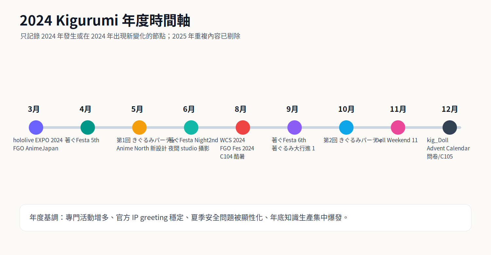
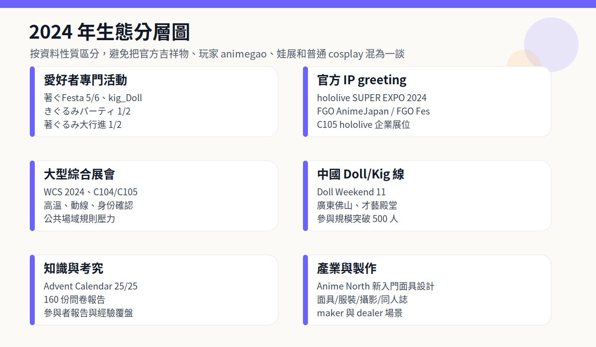
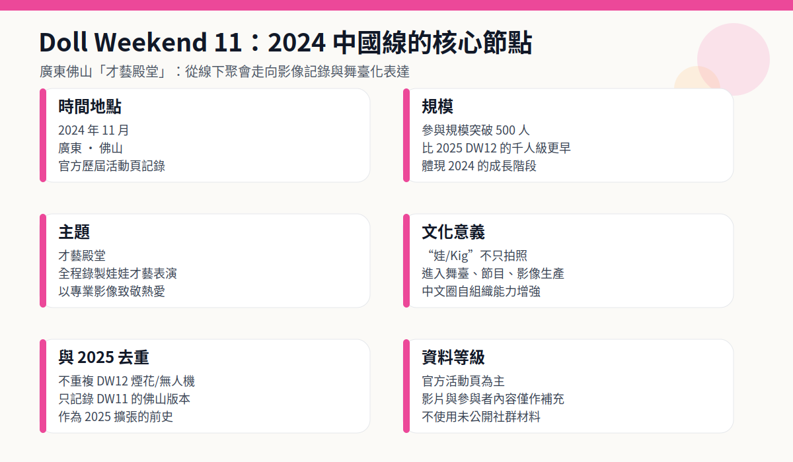
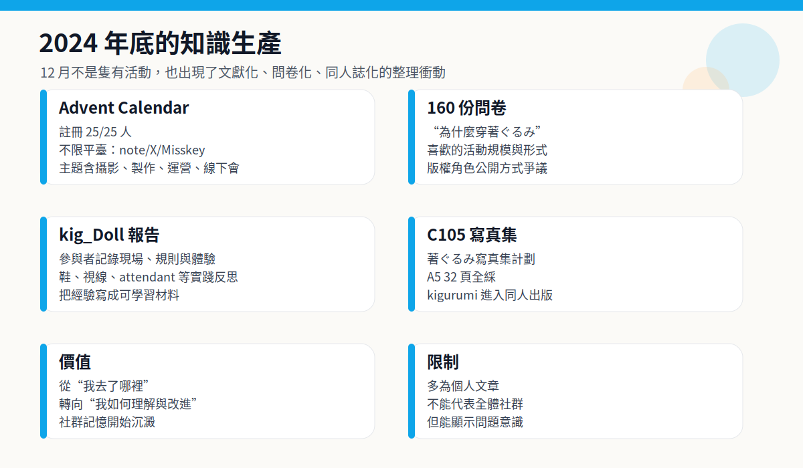
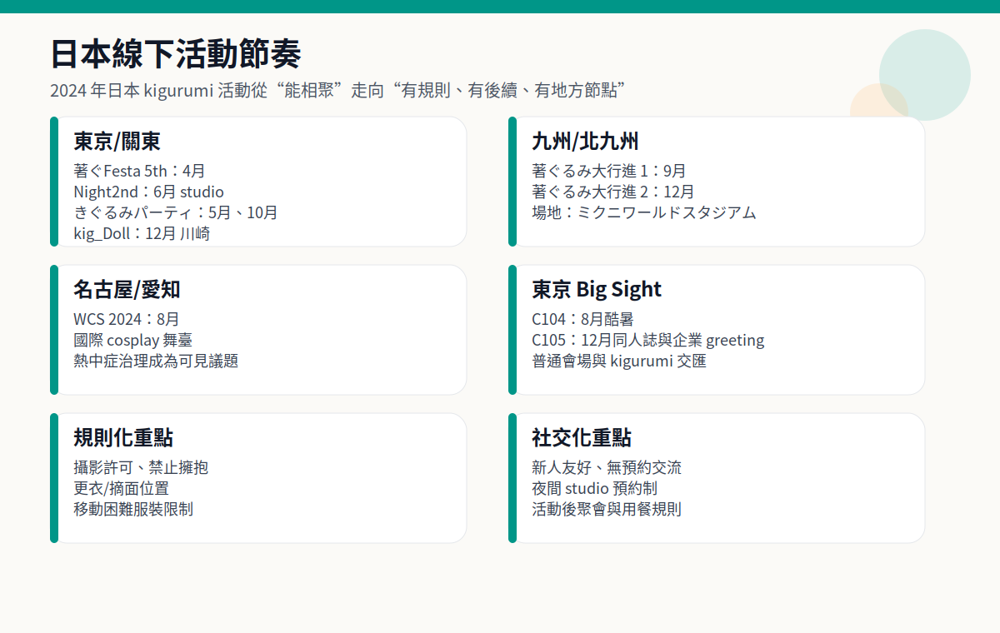
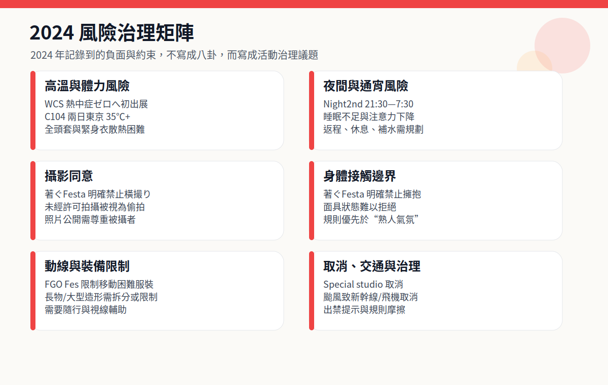

# 2024 年 Kigurumi 編年史

> 編寫口徑：本篇承接《2025 年 Kigurumi 編年史》的標準與結構，但**不重複 2025 年已經整理過的通用概念、2025 年活動、2025 年規則變化與 2025 年產業事件**。同一系列活動若 2024 年有獨立發生或出現新階段，則只記錄其 2024 年版本；若只是 2025 年已經詳述的背景說明，則在本篇中壓縮或略去。

---

## 0. 資料邊界、去重原則與可信度說明

這份 2024 年編年史所說的 **kigurumi**，仍以 animegao kigurumi / 面具型角色扮演 / 美少女著ぐるみ / doller / 娃 / Kiger / 官方角色著ぐるみ greeting 等相鄰領域為中心。由於 2025 篇已經詳細解釋過術語邊界，本篇不再重複大段定義，只在涉及資料差異時說明其型別：官方 IP greeting、愛好者專門活動、廣義全身裝扮活動、娃展、同人出版、問卷與考究文章、以及風險治理檔案。

本篇採用“公開資料優先”的原則。官方活動頁、主辦方公告、票務頁、主辦方歷年列表屬於較高可信度資料；參與者報告、個人部落格、note、社交媒體截圖屬於補充材料；匿名論壇與未公開群聊不作為事實依據。涉及負面、傳聞或人物爭議時，本篇只寫**規則變化、治理壓力、公開可見的摩擦型別**，不列未經證實的個人指控。

與 2025 篇的去重方式如下：

| 去重型別 | 本篇處理方式 |
|---|---|
| 2025 年已寫的通用術語解釋 | 只保留必要的一兩句，不再重複長篇背景 |
| 同一系列活動在 2025 年繼續舉辦 | 只寫 2024 年第幾回、地點、當年意義，不寫 2025 年後續細節 |
| 官方 IP greeting 在 2025 年仍存在 | 只寫 2024 年角色、場次、規則或與 2024 展會繫結的變化 |
| 風險治理在 2025 年更明確 | 只寫 2024 年可確認的熱中症、攝影、擁抱、動線、取消等問題 |
| 傳聞與匿名爭議 | 不復述未核實爆料，只記錄公開規則與治理訊號 |

---

## 1. 2024 年總體脈絡

2024 年不是 2025 年的重複版，而更像是 2025 年大規模化之前的“鋪設軌道之年”。如果說 2025 年的關鍵詞是“規模上升、跨境交流上升、制度化上升”，那麼 2024 年的關鍵詞更接近：**專門活動成形、官方 greeting 穩定、夏季安全被顯性化、年底知識生產集中爆發**。

第一條主線是日本本土愛好者活動的密集化。東京及關東地區出現了第 1 回、第 2 回“きぐるみパーティ”，著ぐFesta 在 4 月與 9 月繼續以“新人友好、無預約、交流優先”為核心舉辦，並在 6 月透過 Night2nd 嘗試完全預約制、夜間 studio 攝影會形態；12 月又出現了 kig_Doll 這類把攝影、交流、輕食、dealer 參加結合起來的新活動。九州方面，“著ぐるみ大行進！”在 9 月和 12 月完成第 1 回、第 2 回，成為 2025 年第 3 回、第 4 回之前的真正起點。也就是說，2024 年留下的不是一個單點爆發，而是一組可延續的活動模板。

第二條主線是官方 IP 對 kigurumi greeting 的持續使用。hololive SUPER EXPO 2024 在 3 月安排了 Ankimo、Subaru Duck、Mikodanye、UDIN、Smol Ame 等 mascot photo session；Fate/Grand Order 在 AnimeJapan 2024 和 FGO Fes. 2024 中都安排了 cosplayer 與 kigurumi greeting。這些官方場景不能直接等同於 animegao 愛好者活動，但它們讓“二次元角色透過全頭套/吉祥物式身體出現在展會現場”成為普通觀眾持續接觸的物件。

第三條主線是大型綜合展會與安全風險。World Cosplay Summit 2024 在名古屋、愛知舉辦，外務省資料顯示當年有 36 個國家和地區代表隊參與世界 cosplay championship；日本氣象協會“熱中症ゼロへ”專案首次在 WCS2024 出展，並向工作人員提供風扇服。這與 C104 兩天 26 萬人、東京兩日最高氣溫均超過 35℃的夏季資料共同說明：2024 年 kigurumi 相關問題不能只看“好看”和“還原”，還必須看高溫、視線、行動、補水、攝影同意與會場責任。

第四條主線是中文“娃/Kig”圈的階段性躍升。Doll Weekend 11 於 2024 年 11 月在廣東佛山舉辦，主題為“才藝殿堂”，官方頁面寫明“全程錄製娃娃才藝表演”並稱參與規模突破 500 人。2025 年 DW12 的千人級、煙花、無人機與城市級表達已經在 2025 篇詳寫，本篇只記錄 2024 年 DW11：它的意義在於，中文圈在 2024 年已經把 kigurumi/doll 線下活動推進到影像化、舞臺化、500+ 規模的階段。

第五條主線是知識生產。12 月出現了“著ぐるみ Advent Calendar 2024”，註冊數 25/25 人，主題覆蓋攝影技法、線下會、活動運營、自作、面作等；同月還出現了 160 份回答的“著ぐるみの考え方を知りたい”問卷報告。再加上 kig_Doll 的參與者覆盤、C105 的著ぐるみ寫真集告知，2024 年底呈現出一種明顯的“把經驗寫下來、把作品印出來、把偏好統計出來”的趨勢。這一點與 2025 年的“更大規模活動”不同，是 2024 年獨有的文獻化價值。

---

## 2. 2024 年編年史

### 2 月 10 日前後：著ぐFesta! Special STUDIO 攝影活動取消——小型活動的成本與不確定性

2024 年年初的負面節點之一，是“著ぐFesta! Special STUDIO 撮影イベント”的取消。該頁面以完全預約制的攝影活動為前提，活動形式與常規著ぐFesta 的開放交流不同：它原本更接近專門攝影、預約制、空間限定的 studio 型活動。但公開頁面顯示，活動因“諸般事情”中止。由於取消說明沒有公開列出更具體原因，本篇不猜測主辦方內部狀況，只把它記錄為 2024 年早期活動運營的不確定性。[[S23]](#s23)

這件事值得寫入編年史，因為 kigurumi 活動的難度往往被外部低估。普通 cosplay 小聚可能只需要場地、更衣和攝影許可；但 kigurumi 專門活動還要考慮頭殼運輸、體積較大的行李、視線不佳、換裝隱私、是否需要 attendant、活動中能否摘面、攝影師與表演者比例、是否能安排休息、是否能控制路人進入。studio 活動雖然比公共展會更可控，但也更依賴預約人數、費用平衡、時間分配和空間條件。一旦人數不足、場地條件變化或運營成本超出預期，取消就可能發生。

它也說明 2024 年的日本 kigurumi 活動並非一路順利擴張。後文會看到，著ぐFesta 5th 與 6th 都有穩定舉辦，但一個系列能持續並不代表每一個衍生企劃都能成立。取消事件的正面意義在於，它把“專門活動不是理所當然”的事實暴露出來；負面意義則是參與者的行程、裝備準備和拍攝計劃可能因此落空。對於高裝備成本的 kigurumi 玩家而言，活動取消比普通觀眾受到的影響更大，因為頭殼、服裝、假髮、鞋、填充、攝影預約都可能提前準備。

### 3 月 16—17 日：hololive SUPER EXPO 2024 的 mascot photo session

2024 年 3 月 13 日，hololive SUPER EXPO 2024 官方釋出“著ぐるみグリーティングについて”。公告寫明將在時鐘塔周邊舉行 mascot photo session，DAY1 為 2024 年 3 月 16 日，DAY2 為 3 月 17 日；Ankimo 與 Subaru Duck 在兩日 12:40 左右登場，Mikodanye、UDIN、Smol Ame 在 DAY1 15:40、DAY2 15:55 左右登場，每組預計約 20 分鐘。[[S1]](#s1)

這類官方 greeting 與愛好者 animegao kigurumi 的動機不同。hololive 的著ぐるみ更像品牌角色的實體觸點，是 VTuber 產業把虛擬角色、衍生吉祥物、粉絲線下動線連線起來的一種手段。觀眾並不需要了解 kigurumi 製作、緊身衣、面具內部結構，也可以透過“會動的角色”理解展會體驗。它將角色從螢幕、直播間、周邊影象中釋放出來，變成可以在會場被遇見、被拍照、被揮手回應的身體。

從 2024 年角度看，hololive 這條線的重要性在於“穩定化”。它不是臨時出現的一隻吉祥物，而是有明確時間表、明確角色組、明確地點的官方互動。2025 篇已經寫過 hololive SUPER EXPO 2025 的更大 roster，本篇不重複 2025 擴充套件；只記錄 2024 版本的意義：VTuber 大型線下活動已經把 kigurumi greeting 當成常規節目，而不是邊角活動。

同時，這也加深了術語混用。普通觀眾看到“著ぐるみ”可能想到 hololive mascot，而 animegao/kig 玩家談“著ぐるみ”時可能指面具角色扮演。2024 的官方 greeting 因此既增加了社會可見度，也可能讓外界更難區分 mascot、animegao、doller 和普通連體服。這種“可見但未必被理解”的狀態，是 2024 到 2025 都持續存在的背景。

### 3 月 23—24 日：FGO × AnimeJapan 2024——官方 cosplayer 與 kigurumi greeting 的組合

2024 年 3 月 23—24 日，Fate/Grand Order 在東京 Big Sight 的 AnimeJapan 2024 出展。官方頁面寫明，FGO 展位將進行展示和舞臺活動，展位位於東 5 Hall J46；其中一項為“コスプレイヤー･著ぐるみグリーティング”，並說明 greeting 預計在展位內實施，新從者 cosplayer 也會登場。[[S2]](#s2)

FGO 的這一節點與 hololive 的 greeting 類似，都屬於官方 IP 的實體化；但 FGO 的特點是“cosplayer + kigurumi”共同構成展位氣氛。cosplayer 以真人化方式呈現角色，kigurumi 則以吉祥物/全頭套身體呈現另一類角色存在。對觀眾來說，這會形成一種層次：舞臺、展示、寶具道具、英靈召喚 photo studio、官方 cosplayer、kigurumi greeting 共同把手機遊戲 IP 變成可以在展位內行走和拍攝的空間。

這件事的年度意義不是“FGO 第一次做 greeting”，而是它在 2024 年繼續說明：大型二次元 IP 已把實體角色互動放進標準展會運營之中。展位內 greeting 還有一個治理意義：相比讓角色在全館自由遊走，展位內互動更容易控制隊伍、攝影角度、停留時間、擁堵和接觸邊界。對 kigurumi 這類行動受限的表演形式來說，這種空間控制非常重要。

與 2025 年 FGO Fes 十週年的大規模呈現相比，AnimeJapan 2024 的資料更偏“展位運營”；因此本篇只記錄其 2024 年狀態，不重複 2025 年十週年內容。它提示我們：2024 年的 kigurumi 公共形象不僅來自同好活動，也來自官方 IP 的會場傳播。

### 4 月 6 日：著ぐFesta！5th——“新人友好”與規則化交流的公開文字

2024 年 4 月 6 日，著ぐFesta！5th 在荒川區サンパール荒川小ホール舉行。活動頁寫明它是“著ぐるみさんと著ぐるみ好きさんの交流イベント”，當日 10:00 開始，主辦方說明該活動源於“也想要一個無需預約、能輕鬆去玩的活動”的需求；會場為可容納約 300 人的大廳，歡迎當日參加，且自稱是對第一次參加活動的 kigurumi 玩家友好的活動。[[S3]](#s3)

這場活動的核心不是高規格攝影，而是社交修復。活動說明直白地指出：很多新人看到 X 上活動很熱鬧，於是想來參加，但到了現場如果沒有認識的人，想與別人交流時又會遇到“著ぐるみさんは話せない”這一弱點，最後可能只能遠遠看著別人玩得開心。主辦方把這個問題寫出來，說明他們認識到 kigurumi 活動的真正門檻並不只是“有沒有頭殼”，還包括是否能進入社交關係、是否有人願意主動溝通、是否有規則保護新人與沉默狀態下的表演者。

著ぐFesta 5th 的規則也很重要。頁面明確禁止“橫撮り”，即在別人拍攝時從旁邊未經許可舉機拍攝；主辦方寫明，即使被攝者能看到有人在拍，未經同意也屬於偷拍，應先取得被攝者許可。活動還禁止擁抱，理由是 kigurumi 表演者不容易說話，意思表示困難，可能難以拒絕過度接觸；同時禁止揮舞長物，並要求除更衣室、cloak 之外不得摘面。[[S3]](#s3)

從 2024 年角度看，著ぐFesta 5th 是典型的“低門檻但高規則意識”活動。它沒有把拍攝作品作為唯一目標，而是把“新人如何不孤立”“如何避免偷拍”“如何避免觸碰越界”“如何在不破壞角色形象的前提下維護安全”寫成可執行規則。這類文字比漂亮照片更能說明社群成熟度。2025 年很多活動規則更正式，但 2024 年著ぐFesta 的價值在於，它從小型交流活動層面已經把邊界問題說得非常具體。

### 5 月 24—26 日前後：Anime North 2024 與 Kigurumi Online 新入門面具設計

Kigurumi Online 頁面說明，該組織每年在加拿大多倫多 Anime North 舉辦 workshop，向 cosplayer 介紹 animegao kigurumi；工作坊內容包括背景介紹、歷史、知名 maker、製作方法，以及在志願者協助下製作 customized starter mask。頁面還寫明，參與者可選擇眼形、眼色、睫毛、眉毛、假髮款式與顏色，並可進行內襯填充和佩戴適配。最值得記錄的 2024 更新是：頁面稱 2022 年設計之後，**在 Anime North 2024 釋出了新設計**。[[S5]](#s5)

這件事屬於產業與教育線，而不是普通聚會線。2025 篇已經寫過 Anime North 2025 workshop 的入門功能，本篇不再重複工作坊所有細節，只強調 2024 年的新增點：新 beginner mask 設計的釋出。對於 animegao kigurumi 來說，入門面具設計並不是小事。它影響新手第一次佩戴時的視覺效果、舒適度、內襯適配、頭圍相容、假髮固定、眼片比例和製作成本。一個可用於 workshop 的入門設計，意味著製作者試圖把原本高度個體化的面具工藝標準化到“可教、可批次準備、可讓新人當天體驗”的程度。

北美線在 2024 年的意義也在這裡：它不像中國 Doll Weekend 那樣強調大規模場面，也不像日本東京/九州線那樣強調專門活動場域，而是更多體現為知識傳播與門檻降低。很多海外新人難以接觸日本語資料，也很難判斷 maker、面具結構、膚色衣、假髮與服裝之間的關係。Kigurumi Online 透過工作坊把這些問題拆成可參與流程，使“第一次嘗試 kig”不必從昂貴定製訂單開始。

因此，Anime North 2024 的可記錄價值不是“某幾位玩家出現”，而是“新入門面具設計”作為技術傳播節點。它為 2025 年及之後的新人培養提供了基礎。

### 5 月 26 日：第 1 回「きぐるみパーティ」——東京臺場專門活動線的起點

2024 年 5 月 26 日，東京臺場舉行了“きぐるみパーティ”。公開參與者報告把這次活動描述為 2024 年 5 月 26 日舉辦，參與者在臺場 promenade 公園、海邊公園與 Plaza Heisei 等地活動；報告總結中寫到：能在臺場的公園與 Plaza Heisei 穿著活動，但步行距離較長，沒有支援者會比較辛苦，並且有各種 kigurumi 參與者。[[S4]](#s4)

這場活動是 2025 年“第 3 回・きぐるみパーティ!”的前史，但本篇只記錄 2024 年第 1 回的獨立意義。它說明東京已經開始為面具型/全頭套類參與者創造專門拍攝與集合場域。與普通漫展不同，這類活動必須解決三個問題：第一，戶外照片好看，但長距離步行會放大頭殼視線、鞋、體力、補水與隨行支援問題；第二，臺場一帶半公共空間多，路人、遊客與一般 cosplayer 都可能進入畫面，攝影許可和動線要更謹慎；第三，頭殼、假髮、身體填充與角色服裝都需要中途整理，單靠“普通更衣室”很難完全滿足需求。

參與者報告中“サポートがいないときついかも”的觀察很有價值。kigurumi 社群常說 attendant / helper 的重要性，但很多外部人只有在看見活動現場動線後才理解：表演者的視野通常不是現實視野，角色眼線與真人眼線錯位，臺階、路緣、車輛、腳踏車、兒童突然靠近都會帶來風險。東京臺場這種開放空間給了作品感，也增加了移動成本。

第 1 回“きぐるみパーティ”還說明，2024 年日本 kigurumi 活動並不是只在小廳內封閉交流，而是開始嘗試半公共景觀中的專門聚會。它為 10 月第 2 回和 2025 年第 3 回奠定了活動名稱、場地經驗和社群口碑。

### 6 月 15 日：著ぐFesta！Night2nd——夜間 studio 攝影會與完全預約制的另一條路線

2024 年 6 月 15 日，著ぐFesta！Night2nd 在 Chrome Studio 川口以夜間攝影活動形式舉辦。TwiPla 頁面寫明，活動時間為 2024 年 6 月 15 日 21:30 至次日 7:30，採用完全預約制，定員 40 人，費用 4000 日元；活動說明還強調由工作人員進行攝影，並把它定位為面向“著ぐるみさん與著ぐるみ好きさん”的特別 happy shooting event。公開報名狀態顯示，參加者 14/40 人，另有“感興趣”4 人、“不參加”2 人。[[S24]](#s24)

這場 Night2nd 是 2024 年著ぐFesta 線中容易被忽視、但很有結構意義的一次嘗試。4 月的 5th 與 9 月的 6th 都偏向“無預約、當日可參加、新人友好”的交流會；Night2nd 則走向完全相反的方向：預約制、人數上限、studio、一整晚、以攝影為主要目的。它說明同一主辦/同一活動圈層在 2024 年已經同時探索兩種需求：一種是降低入門門檻，讓 solo 玩家能來認識人；另一種是壓縮外部干擾，讓參與者在可控 studio 中長時間拍攝。

Night2nd 的規則延續了著ぐFesta 的邊界意識。頁面禁止“橫撮り”，要求拍攝先取得被攝者同意；禁止擁抱，理由仍是面具狀態下的意思表示困難；禁止揮舞長物；並要求除更衣室與 cloak 以外不得摘面。這些規則說明，即使在較封閉的 studio 環境裡，攝影同意、身體接觸、道具安全與角色狀態邊界仍然不能省略。[[S24]](#s24)

同時，Night2nd 也把另一類風險推到臺前：夜間與通宵。對 kigurumi 表演者來說，夜間 studio 雖然避開白天酷暑與路人圍觀，但會帶來睡眠不足、體力衰退、後半夜注意力下降、補妝與服裝維護、返程交通等問題。全頭套、緊身衣、假髮、角色鞋在連續數小時拍攝中會持續消耗體力；如果沒有明確休息、補水與同行支援，通宵環境並不天然比白天更安全。

把這場活動放進 2024 年編年史，可以看見一條與“活動取消”相互映照的線索：2 月的 studio special 取消顯示專門攝影企劃的脆弱性，6 月 Night2nd 則顯示 studio 型活動並沒有消失，而是以更明確的預約制、夜間場、人數上限和規則文字繼續試驗。它不是 2025 年的重複內容，而是 2024 年日本小型 kigurumi 活動形態多樣化的重要證據。

### 8 月 2—4 日：World Cosplay Summit 2024 與夏季安全議題

2024 年 8 月 2—4 日，第 22 屆 World Cosplay Summit 在名古屋、愛知舉行。日本外務省頁面記錄，2024 年世界 cosplay championship 於 8 月 3 日舉行，來自包括日本在內的 36 個國家和地區的代表隊參賽，日本隊獲得冠軍，並獲得外務大臣獎。WCS 自 2003 年始於名古屋，2024 年為第 22 年。[[S6]](#s6)

從 kigurumi 編年史角度看，WCS 2024 的重要性不只在冠軍，而在它把夏季 cosplay 安全推到前臺。日本氣象協會“熱中症ゼロへ”專案在 2024 年 7 月 23 日釋出公告，稱該專案將首次出展 WCS2024，並在 8 月 3—4 日於 Oasis 21 設 booth，透過攝影道具、背景板、暑熱對策物品等方式呼籲熱中症預防；同時為 WCS 運營工作人員提供 33 件帶風扇的空調服。[[S7]](#s7)

這對 kigurumi 尤其關鍵。普通 cosplay 在夏季已經面臨暴曬、排隊、妝面融化、脫水等問題；kigurumi 還疊加了頭殼、全身衣、填充、假髮、視線受限和不便摘頭的壓力。WCS 2024 並不是單獨為 kigurumi 舉辦的活動，但它代表主流 cosplay 場景開始更公開地處理“盛夏活動如何安全進行”的問題。熱中症 booth 與工作人員風扇服說明安全不只是參與者個人自覺，而是展會運營的一部分。

這也是 2024 與 2025 的差異。2025 篇重點寫了 WCS 對 kigurumi / full-face mask / doller / gawa-cos 的明確規則承認；2024 篇則重點寫熱中症治理。二者不是重複，而是相互承接：2024 年凸顯夏季身體風險，2025 年進一步把遮面服裝納入規則文字。對 kigurumi 玩家來說，這兩條線共同構成“可參加但必須被治理”的現實。

### 8 月 3—4 日：FGO Fes. 2024 9th Anniversary——官方 greeting 與參與者服裝限制的並置

2024 年 8 月 3—4 日，Fate/Grand Order Fes. 2024 9th Anniversary 在幕張 Messe 舉辦。官方 attraction 頁面列出“グリーティング”，說明將進行著ぐるみ greeting，並寫到“新規著ぐるみも製作中”。這說明 FGO 在 2024 年九週年活動中不僅繼續使用 kigurumi greeting，還在製作新的 kigurumi 角色。[[S8]](#s8)

這個事件的特殊之處在於：官方一方面安排 kigurumi greeting，另一方面對普通參與者 cosplay 服裝作出限制。FGO Fes. 2024 cosplay 規則寫明，限制的服裝包括“移動困難的服裝”，例子包括大型紙殼造型、著ぐるみ、拖地衣襬、大型裝飾品等。[[S9]](#s9)

這種並置非常值得寫入 2024 編年史。它說明官方 IP 活動對 kigurumi 的態度並不是簡單“允許”或“禁止”。官方運營的 kigurumi 是活動資產，有固定角色、工作人員、動線安排和後臺管理；而普通參與者穿著 kigurumi 進入擁擠會場，可能帶來通行、視線、安全、撤離和攝影管理問題。因此同一場活動可以同時出現“官方 kigurumi greeting”與“限制移動困難的參與者 kigurumi 服裝”。

從社群視角看，這種規則可能讓玩家感到矛盾：為什麼官方可以，個人不行？但從活動治理看，差別在於責任歸屬與可控性。官方角色通常有 staff、行程、休息點、拍照區域；個人玩家則可能在全會場移動，主辦方難以判斷是否有隨行、是否能及時避讓、是否會堵塞通道。2024 年 FGO Fes. 因此提供了一個很清楚的案例：kigurumi 在商業 IP 活動中被歡迎為表演形式，但不一定被無條件歡迎為觀眾 cosplay 形式。

### 8 月 11—12 日：C104 夏 Comiket——酷暑、26 萬人流與 kigurumi 同人活動線索

2024 年 8 月 11—12 日，夏季 Comic Market 104 在東京 Big Sight 舉辦。COSPO 的 C104 報道寫明，兩天共有約 26 萬人來場，且 8 月 11、12 日東京最高氣溫均超過 35℃。[[S10]](#s10)

C104 對 kigurumi 的意義不在於它是專門 kigurumi 活動，而在於 Comiket 是日本同人文化與 cosplay 文化的超大規模交匯點。對 kigurumi 玩家而言，C104 這種場域充滿矛盾：一方面，Big Sight 和 Comiket 的可見度極高，角色造型若能出現，會得到大量關注；另一方面，夏季高溫、人流、排隊、搬執行李、攝影區規則、攤位動線、換裝限制都對 kigurumi 極不友好。35℃以上的酷暑對普通 cosplayer 已經辛苦，對全頭套、全身衣、厚假髮和不便摘頭的 kigurumi 來說則是更高風險。

公開資料中還能看到 kigurumi 與 Comiket 同人活動的連線，例如個人 note 提到 C104 中“著ぐるみ売り子”等計劃與相關書籍。這類資料多為個人/小圈層記錄，不適合作為宏大結論，但它說明 kigurumi 不是隻在攝影會或專門活動中存在，也進入了同人攤位、賣子、寫真集、角色旅行本等創作實踐。

2024 年 C104 因此應歸入“風險與創作並存”的節點。它沒有像 Doll Weekend 11 或 著ぐるみパーティ 那樣專門面向 kigurumi，但它提供了一個嚴苛的現實測試：當 kigurumi 進入超大人流、酷暑和同人銷售環境時，安全、移動、補水與攝影規則會比作品本身更重要。2025 篇沒有重點寫 Comiket，因此這部分是 2024 年的獨立補充。

### 9 月 1 日：著ぐFesta！6th 與 afterparty——社交規則細化、出禁提示與颱風交通影響

2024 年 9 月 1 日，著ぐFesta！6th 再次在荒川區サンパール荒川小ホール舉行。活動頁延續了 5th 的定位：無需預約、歡迎當日參加、對第一次參加活動的 kigurumi 玩家友好；活動目標仍是讓沒有熟人、solo 活動的 kigurumi 玩家能夠建立聯絡。規則也延續並細化：禁止橫撮り、禁止擁抱、禁止揮舞長物、除更衣室/クローク之外不得摘面。[[S11]](#s11)

6th 的價值在於，它把 5th 的活動邏輯延續成穩定格式，而不是一次性嘗試。公開頁面顯示參與者 55 人、興趣 17 人、不參加 7 人；雖然這不是大型活動規模，但對 kigurumi 專門交流活動來說，已經說明其具有穩定吸引力。[[S11]](#s11)

這次活動還留下了幾個值得寫入負面/治理史的公開細節。活動評論區中，主辦方賬號寫明已從“検討中”中刪除出禁名單人物，並提示即使當日到場也不能入場。這裡不應延伸為對任何具體個人的討論，也不應追查被排除者身份；編年史只記錄其治理意義：到 2024 年，部分 kigurumi 活動已經需要以出禁名單、入場拒絕、事前篩查的方式處理風險。[[S11]](#s11)

同一評論區還出現了因颱風導致新幹線、飛機取消或移動困難而放棄參加的留言。這說明 kigurumi 活動的現實成本還包括交通不確定性。玩家攜帶頭殼箱、衣服、鞋、假髮、攝影裝置時，臨時換路線比普通旅行更困難；颱風和交通中斷會直接影響活動參與。[[S11]](#s11)

9 月 1 日同日還安排了著ぐFesta!6th afterparty，16:00—19:00 舉辦。afterparty 頁面說明，它是為了回應“想參加活動後聚會但沒有被邀請、不好意思開口”的需求，由活動方準備，完全預約制，30 人上限，27 人參加。規則與正場不同：禁止大聲喧譁，禁止橫撮り，禁止擁抱，場地狹小所以禁止手持道具；用餐時要求 kigurumi off。[[S12]](#s12)

這一 afterparty 很有社群史價值。它承認了 kigurumi 活動中“社交不平等”的問題：熟人圈自然會有 after，邊緣新人則可能被排除。主辦方把 afterparty 做成預約制、規則化、人數有限的附屬活動，等於把私下社交的一部分公共化、透明化。它也顯示出一個成熟趨勢：角色狀態適合拍照，但真正建立關係、吃飯、溝通規則和互相認識時，需要回到可交流的人類狀態。

### 9 月 23 日：北九州「著ぐるみ大行進！1」——九州專門活動線的起點

2024 年 9 月 23 日，“著ぐるみ大行進！1”在ミクニワールドスタジアム北九州舉辦。Cospic / Cosplay Picnic 的歷年活動列表將其列為 2024 年 9 月 23 日共催活動，地點為北九州 Mikuni World Stadium。[[S13]](#s13)

這件事在 2025 篇中只作為後續第 3、4 回的背景出現；在 2024 篇中必須單獨寫，因為它是九州線的起點。日本 kigurumi 活動長期容易被東京、關東或名古屋的大型 cosplay 場景遮蔽，而“著ぐるみ大行進！”把“九州也需要自己的 kigurumi/全身裝扮交流場”這個需求明確化。スタジアム會場的意義也不小：相比狹小室內，體育場及其周邊空間更適合大型頭殼、獸裝、hero/gawa-cos、doller、animegao 等全身裝扮移動和合影；但也要求更嚴格的動線、安全、天氣和更衣管理。

“行進”這個命名本身也有象徵性。kigurumi 不只是靜止拍照，也可以形成集體移動、集合、遊行式視覺。對全身角色化文化來說，群體行進能把個體角色變成公共景觀：觀眾看到的不再是一兩個“奇怪的人偶”，而是一整個社群的可見身體。2024 年第 1 回建立了這個格式，2024 年 12 月第 2 回繼續，2025 年第 3、4 回進一步延續。

因此，第 1 回“著ぐるみ大行進！”是 2024 年日本地方化最重要的節點之一。它說明 kigurumi 活動並非只能依賴東京；地方社群也能圍繞交通、場地、合作主辦與全身裝扮型別整合出自己的活動名片。

### 10 月 6 日：第 2 回「きぐるみパーティ」——東京專門活動的快速復現

2024 年 10 月 6 日，第 2 回“きぐるみパーティ”舉辦。Cospot Media 的 2024 年 10 月全國 cosplay 活動列表中，在東京部分列出“第二回・きぐるみパーティ”，時間為 10:00—16:30，主辦關聯為コスプレ博実行委員會（勇者屋）。[[S14]](#s14)

這次活動的意義在於“復現速度”。5 月第 1 回之後不到半年，10 月即舉辦第 2 回，說明 5 月嘗試不是偶然的小型拍攝會，而是被主辦方和參與者認為值得繼續的活動格式。對 kigurumi 來說，活動能否復現非常關鍵：玩家制作新角色、約攝影師、安排隨行、準備行李和交通，都需要可預期的活動週期。如果一個活動只有一次，社群記憶容易停留在“某次很好玩”；如果半年內復現，它就可能成為固定日程。

第 2 回與第 1 回共同構成東京“きぐるみパーティ”線的 2024 骨架。2025 篇已經寫過 2025 年第 3 回的場地與活動設施，本篇只記錄 2024 年的兩個開端：5 月驗證了臺場/Plaza Heisei 及周邊空間的可行性，10 月驗證了活動品牌的延續性。這種“半年兩回”的節奏，為 2025 年進一步制度化提供了基礎。

從文化意義看，第 2 回也證明 kigurumi 玩家需要的不只是普通 cosplay 大展的角落空間，而是能讓他們放心摘裝、移動、合照、社交和被理解的專門活動。東京本身不缺 cosplay 活動，但專門面向 kigurumi 的活動仍有價值，說明 kigurumi 的需求與普通 cosplay 並不完全重合。

### 11 月：Doll Weekend 11 廣東佛山——中文“娃/Kig”圈的 500+ 階段

2024 年 11 月，Doll Weekend 11 在廣東佛山舉辦，主題為“才藝殿堂”。Doll Weekend 官方活動頁寫明：Doll Weekend 11，2024 年 11 月，廣東·佛山；“全程錄製娃娃才藝表演，以專業影像致敬熱愛，參與規模突破 500 人”。[[S15]](#s15)

這是一條必須與 2025 DW12 去重處理的主線。2025 篇已經寫過 DW12 的 1000+、煙花、無人機、娃遊行和城市級表達；本篇不重複那些內容，只寫 DW11 在 2024 年的獨立意義。DW11 的關鍵詞不是“千人嘉年華”，而是“才藝、影像、500+”。它說明中文圈在 2024 年已經把 kigurumi/doll 線下活動從普通合影、房間拍攝、漫展邂逅推進到舞臺節目和專業記錄。

“才藝殿堂”這個主題很有研究價值。kigurumi 常被外部看成靜態視覺文化：頭殼、身體比例、服裝還原、攝影好看。但才藝表演把玩家從“被拍攝物件”轉化為“舞臺表演者”。這會提出更高要求：動作幅度如何適應頭殼視線？服裝是否允許跳舞或表演？表演者是否需要提前排練？現場燈光、舞臺高度、觀眾距離、攝影機位如何相容全身裝扮？這些問題都超出普通攝影會範疇。

DW11 的“全程錄製”同樣重要。很多小圈層活動的記憶散落在個人相簿、群聊和社交媒體上，時間久了容易消失。官方影像記錄意味著主辦方希望把活動儲存為可傳播、可回顧、可用於招商和文化解釋的資料。這是社群從“玩過”走向“留下檔案”的一步。

規模突破 500 人也說明中文 kigurumi/doll 圈在 2024 年已經有相當組織力。對一項需要頭殼、緊身衣、假髮、角色服、攝影和長途旅行的愛好來說，500+ 不是小數字。它是 2025 年更大規模出現前的關鍵臺階。沒有 DW11 這種 2024 年積累，DW12 的大型化不會顯得自然。

### 12 月 1 日：kig_Doll 川崎——攝影、交流、輕食與 dealer 場景結合的新節點

2024 年 12 月 1 日，kig_Doll 在川崎市產業振興會館舉行。LivePocket 票務頁顯示，活動日程為 2024/12/1，開演 10:30，終演 20:00；票種包括第一部“攝影、交流”加第二部“輕食付き交流”的套票 3000 日元，第一部單獨 1500 日元，第二部單獨 1500 日元；第一部時間為 10:30—16:30，第二部為 17:00—20:00。[[S16]](#s16)

kig_Doll 的結構值得重點記錄。它不是單純拍攝會，也不是完全自由交流會，而是把白天攝影交流與晚間輕食交流分段組織。對 kigurumi 活動來說，這種分段非常合理：白天可以保持角色狀態、拍照、會面、走動；晚間輕食階段則更適合摘裝、認識真實身份、交流製作和活動經驗。它把“作品展示”和“人際關係建立”分開處理，從活動設計上減少了角色狀態與實際溝通之間的衝突。

參與者 Osumi Akari 的報告稱，現場寬闊的一層樓充滿 kigurumi，結論包括“有很多 kigurumi 很開心”“能玩一天的活動”“交流會階段有助於擴充套件人脈”。報告也寫到，作為第 1 回活動，參加前有不安，但從參與者角度看運營很順暢，工作人員以 kigurumi 視角行動；同時提到似乎有規則相關摩擦，自己作為參與者也要注意不要成為當事人。[[S17]](#s17)

另一篇やえぶろ報告則提供了更細的實踐反思：參與者寫到自己走得太急，應該更慢、更主動地回應周圍聲音；鞋的選擇影響後半段腳痛；應請求 attendant 協助並注意角色視線與真人視線的高低差；腰帶鬆動等細節也會影響角色表現。[[S18]](#s18)

這類反思對 2024 年編年史很重要，因為它把 kigurumi 從“外觀”拉回“實踐”。一個角色是否可愛，不只取決於頭殼和衣服，還取決於步速、轉身、手勢、鞋、視線、隨行者、腰帶、身體平衡和是否能聽見周圍反饋。kig_Doll 的參與者報告顯示，2024 年日本 kigurumi 圈已經開始把這些細節寫成經驗知識。這些內容不是大新聞，卻是社群成熟的細胞。

### 12 月 1—25 日：著ぐるみ Advent Calendar 2024——分散式寫作與社群知識生產

2024 年 12 月，“著ぐるみ（kigurumi） Advent Calendar 2024”在 Adventar 上進行。頁面顯示註冊數為 25/25 人，建立者為溫羽とお；說明文字歡迎不分型別的 kigurumi 內容投稿，平臺不限 note、Twitter/X、Misskey 等。示例主題包括原創角色魅力、kigurumi 的好處、攝影技法、線下會做什麼、活動運營的辛苦、喜歡的攝影棚/活動、after 推薦店、自作經驗、面作技巧，甚至只貼一張照片也可以。[[S19]](#s19)

這是一條 2024 年獨有的“考究事件”。它不等同於大型活動，但從歷史記錄角度甚至更珍貴。線下活動通常留下照片和感想，但 Advent Calendar 把分散的玩家、製作者、攝影者和組織者聚合到一個時間結構裡，讓每個人在 12 月的一天釋出一篇關於 kigurumi 的文章或內容。25/25 的滿額註冊說明該企劃不僅有想法，也有足夠參與者響應。

其意義有三層。第一，它把 kigurumi 從“看圖文化”轉向“寫作文化”。很多外部人只透過照片判斷 kigurumi，卻不瞭解玩家為什麼穿、怎麼準備、怎麼參加活動、怎麼處理攝影與社交。Advent Calendar 鼓勵把這些經驗寫出來。第二，它承認 kigurumi 型別內部的多樣性。投稿示例沒有限定 animegao 或 doller，也沒有要求必須技術文章；這讓製作、攝影、運營、日常、角色愛、線下會、活動後吃飯都可以成為 kigurumi 文化的一部分。第三，它為未來研究者提供索引。即使部分連結日後失效，Advent Calendar 頁面本身仍保留了 2024 年社群主動書寫的痕跡。

在 2025 篇中我們更多看到大型活動和公開規則，而 2024 年 Advent Calendar 顯示的是“內部解釋能力”。一個文化想走出誤解，不能只靠好看的照片，也要靠參與者自己描述動機、邊界、辛苦與樂趣。2024 年 12 月的這個企劃正是這種自我解釋能力的集中體現。

### 12 月 15 日：北九州「著ぐるみ大行進！2」——地方活動線在同年內完成復現

2024 年 12 月 15 日，“著ぐるみ大行進！2”在ミクニワールドスタジアム北九州舉辦。Cospic 歷年活動列表將其列為 2024 年 12 月 15 日共催活動，地點仍為北九州 Mikuni World Stadium。[[S13]](#s13)

這次活動的意義在於“同年復現”。9 月第 1 回之後不到三個月，第 2 回即在同一核心場地舉辦，說明九州線不是隻做一次試水，而是迅速形成節奏。對地方 kigurumi 社群來說，這比單次活動更重要。地方玩家往往面臨東京/關東活動過遠、交通成本高、頭殼行李運輸困難等問題。若本地有固定節點，玩家就能減少跨區域奔波，更容易約同區域攝影師、建立熟人網路、發展本地 maker/dealer 和活動志願者。

第 2 回還證明“著ぐるみ大行進！”這個命名和場地組合具有延續性。體育場空間適合多型別全身裝扮聚集：animegao、美少女著ぐるみ、doller、furry/ケモノ、hero/gawa-cos 都可能面對相似的行動與安全問題。九州線在 2024 年就開始把它們納入同一個“行進/交流”的活動想象中。

與 2025 篇去重時，必須注意：2025 年第 3、4 回說明該系列繼續發展，但 2024 年第 1、2 回才是起始記錄。2024 年的價值是“從無到有、從一次到兩次”。這類地方活動往往沒有中央大型展會那樣充足的媒體報道，但它對社群日常的意義可能更大。

### 12 月 20 日：160 份回答的“著ぐるみの考え方”問卷報告

2024 年 12 月 20 日，やえぶろ釋出“著ぐるみの考え方を知りたい”問卷統計結果。文章開頭寫明，問卷獲得 160 件回答；問題包括“為什麼作為愛好穿著ぐるみ”“最喜歡以什麼形式把著ぐるみ帶到人前”“希望參加什麼規模的活動”“活動中穿著時間比例”“攝影會規模偏好”“版權角色照片公開時是否應搜尋避讓或加標籤”等。[[S20]](#s20)

這份問卷是 2024 年非常重要的“考究事件”。它把原本依靠印象判斷的問題變成了可討論資料。文章提到，約七成回答者選擇“因為喜歡著ぐるみ”作為穿著理由，也出現“變身欲求”“想穿可愛/帥氣衣服”“作為創作物被攝體”等動機。它還指出，在“把著ぐるみ帶到人前的形式”中，off 會、event、攝影會之間存在偏好差異；對活動規模的回答中，“著ぐるみ特化イベント”獲得很高支援；版權角色照片是否搜尋避讓、是否加角色名標籤也呈現意見分化。[[S20]](#s20)

問卷的意義不在於給出唯一正確答案，而在於暴露社群內部的多樣性。外部觀眾常把 kigurumi 動機簡化為某一種解釋：戀物、變裝、角色愛、攝影、匿名、表演。但 160 份回答顯示，動機是複合的，而且不同玩家對公開、標籤、活動規模、攝影會人數、穿著時間都有不同偏好。這些差異會直接影響活動設計：如果很多人偏好特化 event，主辦方就應提供更適合 kigurumi 的空間；如果攝影會人數不宜過大，攝影組織就應限制規模；如果版權角色公開方式存在爭議，玩家就需要尊重彼此策略。

這份報告也補充了 2024 年 Advent Calendar 的意義。Advent Calendar 是分散式寫作，問卷則是統計式自我觀察。二者合在一起說明，2024 年底 kigurumi 社群不僅在活動，也在反思自己。

### 12 月 29—30 日：C105、hololive 企業 greeting 與著ぐるみ寫真集

2024 年 12 月 29—30 日，Comic Market 105 在東京 Big Sight 舉辦。hololive 官方 C105 活動頁寫明，hololive production booth 將在 2024 年 12 月 29—30 日出展，並計劃實施“みこだにぇー”與“毛玉ころね”的著ぐるみ greeting。頁面還列出了企業 booth 地點、時間與活動概要。[[S22]](#s22)

這說明 2024 年底官方 IP greeting 並未止步於 hololive SUPER EXPO，而是進入 Comiket 企業展位場景。Comiket 的企業區與普通展會 booth 不同，它夾在同人文化、商業宣傳、年末購物、人流管控與粉絲互動之間。hololive 在 C105 安排 kigurumi greeting，說明 mascot 角色在年末大型二次元消費場景中同樣被用作吸引觀眾、製造記憶點和社交傳播的工具。

同一 C105 期間，個人 note“コミケ105では著ぐるみ寫真集を出します!”記錄了另一條值得寫入 2024 的線：作者計劃在 12 月 29 日於 C105 西地區“ね”23b 出展，ジャンル為 Love Live!，當日有著ぐるみさん作為賣子，併發行 A5 32 頁全綵新刊《ニジガク著ぐコス日誌〜お臺場編〜》。[[S21]](#s21)

這條資料說明 kigurumi 進入了同人出版實踐。它不是官方 IP 的 greeting，也不是單純活動照片，而是把著ぐるみ cosplay、地點巡禮、作品世界和同人誌製作結合起來。對社群史來說，寫真集很重要，因為它把通常流動在社交平臺上的照片固定成可收藏、可售賣、可轉交的實體文字。它也讓 kigurumi 不只是“在場的身體”，而變成可編輯的影像敘事。

C105 因此在 2024 年底同時承擔兩種意義：商業方透過著ぐるみ greeting 強化 IP 現場互動，個人創作者則透過寫真集把 kigurumi 經驗做成同人作品。前者代表產業化，後者代表社群創作化；兩者並行，是 2024 年 kigurumi 文化多層結構的縮影。

---

## 3. 2024 年主要人物、組織與場域索引

### GarageStudioC7 / 著ぐFesta

著ぐFesta 是 2024 年日本 kigurumi 圈最能體現“新人友好 + 規則明確”的活動線之一。5th 與 6th 都把“無預約、當日可參加、solo 玩家可以認識朋友”作為核心賣點；6 月 Night2nd 則走向完全預約制、夜間 studio 攝影會方向，顯示同一活動線既重視開放交流，也在測試更可控的攝影環境。三者都公開寫明禁止橫撮り、禁止擁抱、禁止揮舞長物、限制摘面位置等規則。這類活動並不追求最華麗的照片，而是試圖解決 kigurumi 社交中最現實的問題：新人沒有熟人、表演者說話困難、被攝者同意難以確認、身體接觸容易越界。

### コスプレ博実行委員會 / 勇者屋 / きぐるみパーティ

2024 年 5 月與 10 月的 きぐるみパーティ 是東京專門活動線的開端。它把臺場、公園、Plaza Heisei 等空間與 kigurumi 攝影、集合、移動聯絡起來。5 月第 1 回的參與者報告尤其提醒：戶外空間雖好，但步行距離長，沒有支援者會辛苦。這一觀察對所有半公共場地 kigurumi 活動都具有參考價值。

### Cospic / Cosplay Picnic / 著ぐるみ大行進！

Cospic 歷年活動列表顯示，2024 年 9 月 23 日和 12 月 15 日分別舉辦了 著ぐるみ大行進！1 與 2，地點均為 Mikuni World Stadium Kitakyushu。它們是 2025 年第 3、4 回之前的根。九州線的價值在於地方化：它讓 kigurumi 與其他全身裝扮分支不必總依附東京活動，而能在九州形成自己的節奏。

### Doll Weekend

Doll Weekend 11 是 2024 年中國線的核心節點。官方資料寫明其主題為“才藝殿堂”，在廣東佛山舉辦，參與規模突破 500 人。它與 2025 年 DW12 不重複：2024 年的重點是才藝表演和專業影像記錄，2025 年才是千人級、煙花、無人機和城市景觀化。

### Kigurumi Online

Kigurumi Online 在 2024 年的重要記錄是 Anime North workshop 的新 beginner mask 設計。該組織長期把 animegao kigurumi 的歷史、maker、製作方法、starter mask 個性化配置和 fit adjustment 帶入工作坊環境。2024 年的新設計說明北美入門教育線繼續推進。

### FGO PROJECT / Aniplex 與 hololive / COVER

FGO 與 hololive 代表 2024 年官方 IP greeting 的兩條主線。FGO 在 AnimeJapan 2024 和 FGO Fes. 2024 中使用 kigurumi greeting，並在 FGO Fes. 2024 頁面寫到新 kigurumi 製作中；hololive 則在 SUPER EXPO 2024 和 C105 中安排 mascot photo session 或 greeting。這些官方場景增加 kigurumi 形態的公眾可見度，但它們與愛好者 animegao/kig 仍應區分。

### 日本気象協會「熱中症ゼロへ」專案

WCS2024 的熱中症ゼロへ初出展，是 2024 年安全治理線的關鍵。它讓盛夏 cosplay 安全成為可見議題，並向工作人員提供帶風扇空調服。對 kigurumi 來說，這類安全倡議尤為重要，因為頭殼、緊身衣、假髮和移動限制會加劇熱風險。

### 溫羽とお 與 Advent Calendar 參與者

2024 年 Advent Calendar 的建立者溫羽とお和 25 位註冊參與者共同構成了 2024 年底的知識生產網路。它們把攝影、活動運營、自作、面作、off 會、角色愛等內容寫成公開文章，為後續研究留下線索。

### やえぶろ / sco_5113

やえぶろ在 2024 年 12 月釋出 160 份回答的問卷統計，又釋出 Kig-Doll 活動報告。它代表了參與者自我觀察、經驗覆盤和資料化考究的一條重要路線。

### 紺野瀬織 / ななかりワークス

C105 的著ぐるみ寫真集告知顯示，kigurumi 在 2024 年底進入同人出版實踐。它把角色巡禮、寫真、同人誌和現場賣子結合起來，是“kigurumi 作為影像作品”而不僅是“現場裝扮”的例子。

---

## 4. 2024 年正面事件總賬

**1. 日本專門活動從多點嘗試走向穩定復現。** 2024 年出現了著ぐFesta 5/Night2nd/6、きぐるみパーティ 1/2、著ぐるみ大行進 1/2、kig_Doll 等多個節點。它們形式不同：有新人交流、有夜間 studio 攝影、有戶外臺場攝影、有地方體育場行進、有攝影+輕食交流，但共同說明 kigurumi 活動不再只依賴普通漫展偶遇。

**2. 中文娃/Kig 圈進入 500+ 與影像化階段。** Doll Weekend 11 的“才藝殿堂”與專業影像記錄，把娃/Kig 活動從靜態拍攝推向舞臺化表達。它是 2025 年 DW12 大型化之前的重要臺階。

**3. 官方 IP greeting 穩定出現。** hololive 和 FGO 在 2024 年均安排著ぐるみ/mascot greeting。官方 IP 的實體化讓普通觀眾更頻繁遇見全頭套角色身體，也為展會互動提供更強記憶點。

**4. 北美入門教育繼續推進。** Kigurumi Online 在 Anime North 2024 釋出新的 beginner mask 設計，體現了 workshop 型入門路徑的更新。

**5. 年底知識生產集中爆發。** Advent Calendar 25/25、160 份問卷報告、kig_Doll 參與者覆盤、C105 寫真集共同說明：2024 年社群不只線上下聚會，也在寫作、統計、出版、總結與反思。

---

## 5. 2024 年負面事件與風險總賬

**1. 活動取消風險。** 著ぐFesta! Special STUDIO 撮影イベント取消，說明專門活動受預約、成本、場地、運營能力等因素影響，不是每個企劃都能順利實施。

**2. 夜間攝影與體力風險。** 著ぐFesta！Night2nd 採用 21:30 至次日 7:30 的通宵 studio 形式，雖然避開白天高溫和路人干擾，但會帶來睡眠不足、注意力下降、返程交通、長時間穿戴維護等問題。

**3. 高溫與熱中症風險。** WCS2024 引入熱中症ゼロへ booth，C104 兩天 26 萬人並遇到 35℃以上酷暑，顯示夏季 kigurumi 活動尤其需要補水、降溫、休息、隨行和撤退計劃。

**4. 攝影同意風險。** 著ぐFesta 明確禁止橫撮り，並將未經同意拍攝視為偷拍。這是 2024 年活動規則中非常清晰的邊界。

**5. 身體接觸風險。** 著ぐFesta 禁止擁抱，因為表演者在面具狀態下不易說話，可能難以拒絕。這個規則說明“可愛角色”不等於“可隨意觸碰”。

**6. 動線與大型裝備限制。** FGO Fes. 2024 在參與者 cosplay 規則中限制移動困難的服裝，包括著ぐるみ。這說明官方 greeting 與個人 kigurumi 入場不是同一治理邏輯。

**7. 出禁與規則摩擦。** 著ぐFesta 6th 評論區出現出禁名單提示，kig_Doll 參與報告提到規則相關摩擦。此處不點名、不追查、不復述傳聞，只記錄其說明：2024 年 kigurumi 活動已經需要更明確的入場管理與行為邊界。

**8. 交通與天氣影響。** 著ぐFesta 6th 評論區出現因颱風導致新幹線、飛機取消而無法參加的情況。對攜帶大件裝備的 kigurumi 玩家來說，天氣造成的交通中斷影響更大。

---

## 6. 2024 年考究事件：寫作、問卷、實踐覆盤與同人出版

2024 年最值得與 2025 年區分的一點，是年底的“考究化”。Advent Calendar 把 25 天分配給不同參與者，讓他們圍繞 kigurumi 發表文章；問卷報告用 160 份回答統計動機、偏好、公開方式與活動需求；kig_Doll 報告記錄鞋、視線、attendant、動作速度等實踐細節；C105 寫真集則把著ぐるみ cos 變成同人出版物。

這些資料共同說明，2024 年社群正在形成“自我檔案”。以前很多經驗只在活動現場、私聊或圖片標題中流轉；2024 年則開始被寫成可檢索文字。這對後續整理很重要，因為 kigurumi 的真實歷史往往不在官方新聞裡，而在玩家如何描述自己的身體經驗、社交困難、攝影規則、角色愛、製作挫折和活動偏好中。

同時也要注意，考究資料多為個人/小樣本，不能代表整個社群。例如 160 份問卷雖有價值，但不是隨機抽樣；Advent Calendar 滿額說明參與積極，但參與者多來自願意公開寫作的人；kig_Doll 報告反映參與者視角，不等於主辦方完整說明。負責任的寫法應把它們視為“社群內部聲音”，而不是絕對統計結論。

---

## 7. 2024 年傳聞與爭議處理原則

2024 年公開資料中可以確認的爭議型別，主要不是大型醜聞，而是活動規則與社群治理問題：取消、出禁名單提示、禁止橫撮り、禁止擁抱、規則相關摩擦、交通天氣影響、移動困難服裝限制等。這些都可由公開頁面或參與者報告支撐。

對匿名論壇、私域群聊、截圖傳播、未核實點名，本篇不作事實整理。原因有三點：第一，kigurumi 圈常使用角色名、賬號名、頭殼形象和現實身份多重身份，誤認風險很高；第二，匿名爆料可能包含私人怨恨、斷章取義或舊事重提；第三，編年史的責任不是製造黑名單，而是記錄文化如何發展、如何治理風險、如何建立公開規則。

因此，本篇把“傳聞事件”處理為“治理壓力”：當活動規模擴大、攝影傳播增多、商業/同人/官方場景交織時，社群必然需要更清晰的邊界。2024 年公開規則已經顯示出方向：攝影需同意，接觸需剋制，動線需安全，摘面需在指定區域，規則摩擦需由主辦方處理，活動後社交也需要預約、噪音、飲食和身份溝通規則。

---

## 8. 與 2025 篇的關係：2024 獨有內容與承接更新

| 系列/主題 | 2024 記錄 | 2025 篇中已寫內容 | 本篇去重處理 |
|---|---|---|---|
| 著ぐFesta | 2024 年 5th、Night2nd、6th 與 afterparty | 2025 篇未作為核心事件詳寫 | 本篇補足 2024 小型交流與夜間 studio 線 |
| きぐるみパーティ | 2024 年第 1 回、第 2 回 | 2025 年第 3 回 | 只寫 2024 起點與復現，不重複 2025 場地細節 |
| 著ぐるみ大行進！ | 2024 年第 1 回、第 2 回 | 2025 年第 3 回、第 4 回 | 只寫九州線起源，不重複 2025 延續 |
| Doll Weekend | DW11，佛山，才藝殿堂，500+ | DW12，河源，1000+，煙花/無人機/遊行 | 只寫 DW11 的影像化與舞臺化 |
| FGO | AnimeJapan 2024、FGO Fes 2024 9th | 2025 AnimeJapan、FGO Fes 十週年 | 只寫 2024 greeting 與參與者服裝限制 |
| hololive | SUPER EXPO 2024、C105 greeting | SUPER EXPO 2025 roster 擴充套件 | 只寫 2024 角色與 C105 節點 |
| WCS | 2024 熱中症治理與 36 國家/地區 | 2025 遮面服裝規則承認 | 只寫 2024 安全議題 |
| Anime North | 2024 新 beginner mask 設計 | 2025 workshop 時間與內容 | 只寫 2024 新設計，不重複 2025 工作坊介紹 |
| 知識生產 | Advent Calendar、160 份問卷、C105 寫真集 | 2025 篇未重點展開 | 本篇重點補充 |

---

## 9. 年度結論

2024 年的 kigurumi 並不是 2025 年大規模化的簡單前奏，而是一個具有獨立價值的“結構搭建年”。它搭建了幾種後來繼續發揮作用的結構：東京專門活動結構、夜間 studio 攝影結構、九州地方活動結構、中文娃/Kig 大型聚會結構、北美入門 workshop 結構、官方 IP greeting 結構、盛夏安全治理結構、以及年底知識生產結構。

如果用一句話總結：**2024 年讓 kigurumi 從“分散出現的興趣點”進一步變成“可舉辦、可復現、可規則化、可寫作、可統計、可出版的文化網路”。**

它沒有 2025 年 DW12 那種千人級景觀，也沒有 2025 年 WCS 規則那樣清晰的遮面服裝承認，但它有更基礎的東西：第 1 回、第 2 回；Night2nd；500+；新設計；25/25；160 份回答；禁止橫撮り；禁止擁抱；熱中症 booth；出禁提示；寫真集。這些看似零散的節點合在一起，構成了 2024 年獨有的 kigurumi 年輪。

---

## 參考資料

[S1] hololive SUPER EXPO 2024「著ぐるみグリーティングについて」: https://hololivesuperexpo2024.hololivepro.com/news/greeting
[S2] Fate/Grand Order 官方「AnimeJapan 2024」出展資訊: https://news.fate-go.jp/2024/aj2024/
[S3] 著ぐFesta！5th TwiPla 活動頁: https://twipla.jp/events/600801
[S4] Osumi Akari：第 1 回きぐるみパーティ參與報告: https://www.osumiakari.jp/articles/20240526-kigupa1/
[S5] Kigurumi Online：Kigurumi Workshop 頁面: https://kig-o.com/index.php/kigurumi-workshop/
[S6] 日本外務省：The World Cosplay Summit 2024: https://www.mofa.go.jp/p_pd/ca_opr/pagewe_000001_00077.html
[S7] 日本気象協會：WCS2024「熱中症ゼロへ」初出展: https://www.jwa.or.jp/news/2024/07/23466/
[S8] FGO Fes. 2024 官方 attraction 頁面: https://fes.fate-go.jp/2024/attraction/
[S9] FGO Fes. 2024 官方 cosplay 規則: https://fes.fate-go.jp/2024/about/cosplay.html
[S10] COSPO：C104 cosplay 報道: https://cospo.net/index.php/c104report-2/
[S11] 著ぐFesta！6th TwiPla 活動頁: https://twipla.jp/events/622388
[S12] 著ぐFesta!6th アフターパーティ TwiPla 活動頁: https://twipla.jp/events/622389
[S13] Cospic / Cosplay Picnic 歷年舉辦列表: https://cospic.org/archives/338
[S14] Cospot Media：2024 年 10 月 cosplay 活動列表，含第二回きぐるみパーティ: https://cospot-media.com/event-list/22535/
[S15] Doll Weekend 11 官方活動頁: https://dollweekend.cn/cn/event/dw11/
[S16] kig_Doll LivePocket 票務頁: https://t.livepocket.jp/e/idx24
[S17] Osumi Akari：Kig-Doll 參與報告: https://www.osumiakari.jp/articles/20241201-kigdoll/
[S18] やえぶろ：Kig-Doll 活動報告: https://sco-5113.hatenablog.com/entry/2024/12/03/201006
[S19] Adventar：著ぐるみ（kigurumi）Advent Calendar 2024: https://adventar.org/calendars/10384
[S20] やえぶろ：著ぐるみの考え方を知りたい 問卷報告: https://sco-5113.hatenablog.com/entry/2024/12/20/211317
[S21] 紺野瀬織：C105 著ぐるみ寫真集告知: https://note.com/rdh27785/n/nc17aeb673227
[S22] hololive 官方：コミックマーケット105 企業展位: https://hololive.hololivepro.com/events/c105/
[S23] 著ぐFesta! Special STUDIO 撮影イベント取消頁: https://twipla.jp/events/587460
[S24] 著ぐFesta！Night2nd TwiPla 活動頁: https://twipla.jp/events/617052
