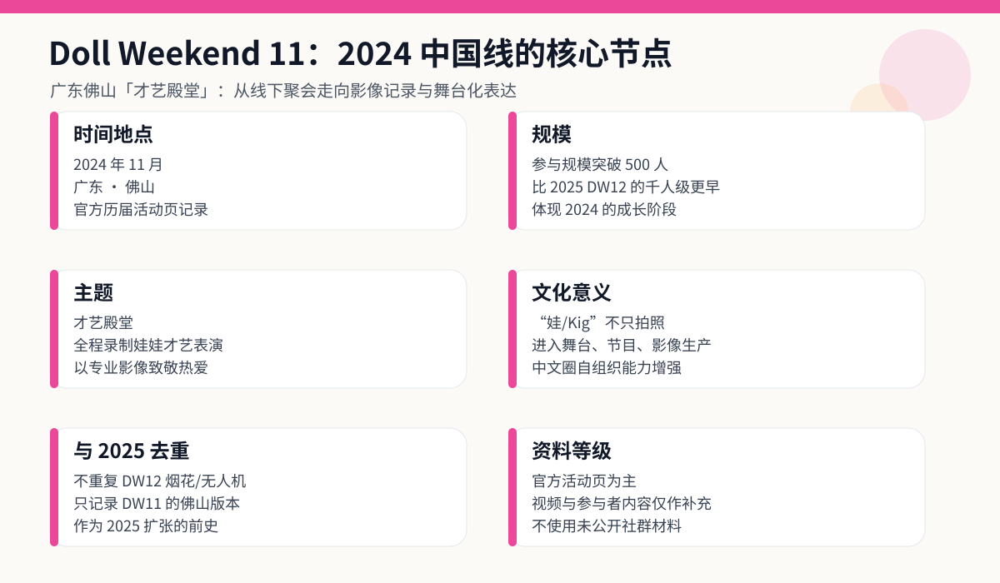

# 2024 年 Kigurumi 編年史

2024 年圍繞新專門活動、工坊面具版本、舞臺影像與社羣寫作展開。本次進一步展開 Advent Calendar 中有日期的運輸、攝影與交流文章，讓年度知識記錄能夠直接追到原文。

## 年度重點

- **新活動**：東京きぐるみパーティ、北九州着ぐるみ大行進、川崎 kig_Doll。
- **製作教學**：Kigurumi Online 在 Anime North 發佈新的入門面具設計。
- **中文舞臺**：DW11 在佛山記錄才藝與專業影像。
- **12 月寫作**：運輸、視頻攝影、跨語言交流與問卷資料集中發佈。[^calendar]

## 年度紀事

### 2 月 10 日前後：着ぐFesta! Special STUDIO 攝影活動取消——小型活動的成本與不確定性

2024 年年初的負面節點之一，是“着ぐFesta! Special STUDIO 撮影イベント”的取消。該頁面以完全預約制的攝影活動爲前提，活動形式與常規着ぐFesta 的開放交流不同：它原本更接近專門攝影、預約制、空間限定的 studio 型活動。但公開頁面顯示，活動因“諸般事情”中止。由於取消說明沒有公開列出更具體原因，本篇不猜測主辦方內部狀況，只把它記錄爲 2024 年早期活動運營的不確定性。[[S23]](#s23)

這件事值得寫入編年史，因爲 kigurumi 活動的難度往往被外部低估。普通 cosplay 小聚可能只需要場地、更衣和攝影許可；但 kigurumi 專門活動還要考慮頭殼運輸、體積較大的行李、視線不佳、換裝隱私、是否需要 attendant、活動中能否摘面、攝影師與表演者比例、是否能安排休息、是否能控制路人進入。studio 活動雖然比公共展會更可控，但也更依賴預約人數、費用平衡、時間分配和空間條件。一旦人數不足、場地條件變化或運營成本超出預期，取消就可能發生。

它也說明 2024 年的日本 kigurumi 活動並非一路順利擴張。後文會看到，着ぐFesta 5th 與 6th 都有穩定舉辦，但一個系列能持續並不代表每一個衍生企劃都能成立。取消事件的正面意義在於，它把“專門活動不是理所當然”的事實暴露出來；負面意義則是參與者的行程、裝備準備和拍攝計劃可能因此落空。對於高裝備成本的 kigurumi 玩家而言，活動取消比普通觀衆受到的影響更大，因爲頭殼、服裝、假髮、鞋、填充、攝影預約都可能提前準備。

### 3 月 16—17 日：hololive SUPER EXPO 2024 的 mascot photo session

2024 年 3 月 13 日，hololive SUPER EXPO 2024 官方發佈“着ぐるみグリーティングについて”。公告寫明將在時鐘塔周邊舉行 mascot photo session，DAY1 爲 2024 年 3 月 16 日，DAY2 爲 3 月 17 日；Ankimo 與 Subaru Duck 在兩日 12:40 左右登場，Mikodanye、UDIN、Smol Ame 在 DAY1 15:40、DAY2 15:55 左右登場，每組預計約 20 分鐘。[[S1]](#s1)

這類官方 greeting 與愛好者 animegao kigurumi 的動機不同。hololive 的着ぐるみ更像品牌角色的實體觸點，是 VTuber 產業把虛擬角色、衍生吉祥物、粉絲線下動線連接起來的一種手段。觀衆並不需要了解 kigurumi 製作、緊身衣、面具內部結構，也可以通過“會動的角色”理解展會體驗。它將角色從屏幕、直播間、周邊圖像中釋放出來，變成可以在會場被遇見、被拍照、被揮手回應的身體。

### 3 月 23—24 日：FGO × AnimeJapan 2024——官方 cosplayer 與 kigurumi greeting 的組合

2024 年 3 月 23—24 日，Fate/Grand Order 在東京 Big Sight 的 AnimeJapan 2024 出展。官方頁面寫明，FGO 展位將進行展示和舞臺活動，展位位於東 5 Hall J46；其中一項爲“コスプレイヤー･着ぐるみグリーティング”，並說明 greeting 預計在展位內實施，新從者 cosplayer 也會登場。[[S2]](#s2)

FGO 的這一節點與 hololive 的 greeting 類似，都屬於官方 IP 的實體化；但 FGO 的特點是“cosplayer + kigurumi”共同構成展位氣氛。cosplayer 以真人化方式呈現角色，kigurumi 則以吉祥物/全頭套身體呈現另一類角色存在。對觀衆來說，這會形成一種層次：舞臺、展示、寶具道具、英靈召喚 photo studio、官方 cosplayer、kigurumi greeting 共同把手機遊戲 IP 變成可以在展位內行走和拍攝的空間。

這件事的年度意義不是“FGO 第一次做 greeting”，而是它在 2024 年繼續說明：大型二次元 IP 已把實體角色互動放進標準展會運營之中。展位內 greeting 還有一個治理意義：相比讓角色在全館自由遊走，展位內互動更容易控制隊伍、攝影角度、停留時間、擁堵和接觸邊界。對 kigurumi 這類行動受限的表演形式來說，這種空間控制非常重要。

### 4 月 6 日：着ぐFesta！5th——“新人友好”與規則化交流的公開文本

2024 年 4 月 6 日，着ぐFesta！5th 在荒川區サンパール荒川小ホール舉行。活動頁寫明它是“着ぐるみさんと着ぐるみ好きさんの交流イベント”，當日 10:00 開始，主辦方說明該活動源於“也想要一個無需預約、能輕鬆去玩的活動”的需求；會場爲可容納約 300 人的大廳，歡迎當日參加，且自稱是對第一次參加活動的 kigurumi 玩家友好的活動。[[S3]](#s3)

這場活動的核心不是高規格攝影，而是社交修復。活動說明直白地指出：很多新人看到 X 上活動很熱鬧，於是想來參加，但到了現場如果沒有認識的人，想與別人交流時又會遇到“着ぐるみさんは話せない”這一弱點，最後可能只能遠遠看着別人玩得開心。主辦方把這個問題寫出來，說明他們認識到 kigurumi 活動的真正門檻並不只是“有沒有頭殼”，還包括是否能進入社交關係、是否有人願意主動溝通、是否有規則保護新人與沉默狀態下的表演者。

着ぐFesta 5th 的規則也很重要。頁面明確禁止“橫撮り”，即在別人拍攝時從旁邊未經許可舉機拍攝；主辦方寫明，即使被攝者能看到有人在拍，未經同意也屬於偷拍，應先取得被攝者許可。活動還禁止擁抱，理由是 kigurumi 表演者不容易說話，意思表示困難，可能難以拒絕過度接觸；同時禁止揮舞長物，並要求除更衣室、cloak 之外不得摘面。[[S3]](#s3)

### 5 月 24—26 日前後：Anime North 2024 與 Kigurumi Online 新入門面具設計

北美線在 2024 年的意義也在這裏：它不像中國 Doll Weekend 那樣強調大規模場面，也不像日本東京/九州線那樣強調專門活動場域，而是更多體現爲知識傳播與門檻降低。很多海外新人難以接觸日本語資料，也很難判斷 maker、面具結構、膚色衣、假髮與服裝之間的關係。Kigurumi Online 通過工作坊把這些問題拆成可參與流程，使“第一次嘗試 kig”不必從昂貴定製訂單開始。

### 5 月 26 日：第 1 回「きぐるみパーティ」——東京臺場專門活動線的起點

2024 年 5 月 26 日，東京臺場舉行了“きぐるみパーティ”。公開參與者報告把這次活動描述爲 2024 年 5 月 26 日舉辦，參與者在臺場 promenade 公園、海邊公園與 Plaza Heisei 等地活動；報告總結中寫到：能在臺場的公園與 Plaza Heisei 穿着活動，但步行距離較長，沒有支援者會比較辛苦，並且有各種 kigurumi 參與者。[[S4]](#s4)

參與者報告中“サポートがいないときついかも”的觀察很有價值。kigurumi 社羣常說 attendant / helper 的重要性，但很多外部人只有在看見活動現場動線後才理解：表演者的視野通常不是現實視野，角色眼線與真人眼線錯位，臺階、路緣、車輛、自行車、兒童突然靠近都會帶來風險。東京臺場這種開放空間給了作品感，也增加了移動成本。

### 6 月 15 日：着ぐFesta！Night2nd——夜間 studio 攝影會與完全預約制的另一條路線

2024 年 6 月 15 日，着ぐFesta！Night2nd 在 Chrome Studio 川口以夜間攝影活動形式舉辦。TwiPla 頁面寫明，活動時間爲 2024 年 6 月 15 日 21:30 至次日 7:30，採用完全預約制，定員 40 人，費用 4000 日元；活動說明還強調由工作人員進行攝影，並把它定位爲面向“着ぐるみさん與着ぐるみ好きさん”的特別 happy shooting event。公開報名狀態顯示，參加者 14/40 人，另有“感興趣”4 人、“不參加”2 人。[[S24]](#s24)

這場 Night2nd 是 2024 年着ぐFesta 線中容易被忽視、但很有結構意義的一次嘗試。4 月的 5th 與 9 月的 6th 都偏向“無預約、當日可參加、新人友好”的交流會；Night2nd 則走向完全相反的方向：預約制、人數上限、studio、一整晚、以攝影爲主要目的。它說明同一主辦/同一活動圈層在 2024 年已經同時探索兩種需求：一種是降低入門門檻，讓 solo 玩家能來認識人；另一種是壓縮外部干擾，讓參與者在可控 studio 中長時間拍攝。

Night2nd 的規則延續了着ぐFesta 的邊界意識。頁面禁止“橫撮り”，要求拍攝先取得被攝者同意；禁止擁抱，理由仍是面具狀態下的意思表示困難；禁止揮舞長物；並要求除更衣室與 cloak 以外不得摘面。這些規則說明，即使在較封閉的 studio 環境裏，攝影同意、身體接觸、道具安全與角色狀態邊界仍然不能省略。[[S24]](#s24)

同時，Night2nd 也把另一類風險推到臺前：夜間與通宵。對 kigurumi 表演者來說，夜間 studio 雖然避開白天酷暑與路人圍觀，但會帶來睡眠不足、體力衰退、後半夜注意力下降、補妝與服裝維護、返程交通等問題。全頭套、緊身衣、假髮、角色鞋在連續數小時拍攝中會持續消耗體力；如果沒有明確休息、補水與同行支援，通宵環境並不天然比白天更安全。

### 8 月 2—4 日：World Cosplay Summit 2024 與夏季安全議題

從 kigurumi 編年史角度看，WCS 2024 的重要性不只在冠軍，而在它把夏季 cosplay 安全推到前臺。日本氣象協會“熱中症ゼロへ”項目在 2024 年 7 月 23 日發佈公告，稱該項目將首次出展 WCS2024，並在 8 月 3—4 日於 Oasis 21 設 booth，通過攝影道具、背景板、暑熱對策物品等方式呼籲熱中症預防；同時爲 WCS 運營工作人員提供 33 件帶風扇的空調服。[[S7]](#s7)

這對 kigurumi 尤其關鍵。普通 cosplay 在夏季已經面臨暴曬、排隊、妝面融化、脫水等問題；kigurumi 還疊加了頭殼、全身衣、填充、假髮、視線受限和不便摘頭的壓力。WCS 2024 並不是單獨爲 kigurumi 舉辦的活動，但它代表主流 cosplay 場景開始更公開地處理“盛夏活動如何安全進行”的問題。熱中症 booth 與工作人員風扇服說明安全不只是參與者個人自覺，而是展會運營的一部分。

### 8 月 3—4 日：FGO Fes. 2024 9th Anniversary——官方 greeting 與參與者服裝限制的並置

2024 年 8 月 3—4 日，Fate/Grand Order Fes. 2024 9th Anniversary 在幕張 Messe 舉辦。官方 attraction 頁面列出“グリーティング”，說明將進行着ぐるみ greeting，並寫到“新規着ぐるみも製作中”。這說明 FGO 在 2024 年九週年活動中不僅繼續使用 kigurumi greeting，還在製作新的 kigurumi 角色。[[S8]](#s8)

這個事件的特殊之處在於：官方一方面安排 kigurumi greeting，另一方面對普通參與者 cosplay 服裝作出限制。FGO Fes. 2024 cosplay 規則寫明，限制的服裝包括“移動困難的服裝”，例子包括大型紙殼造型、着ぐるみ、拖地衣襬、大型裝飾品等。[[S9]](#s9)

這種並置非常值得寫入 2024 編年史。它說明官方 IP 活動對 kigurumi 的態度並不是簡單“允許”或“禁止”。官方運營的 kigurumi 是活動資產，有固定角色、工作人員、動線安排和後臺管理；而普通參與者穿着 kigurumi 進入擁擠會場，可能帶來通行、視線、安全、撤離和攝影管理問題。因此同一場活動可以同時出現“官方 kigurumi greeting”與“限制移動困難的參與者 kigurumi 服裝”。

從社羣視角看，這種規則可能讓玩家感到矛盾：爲什麼官方可以，個人不行？但從活動治理看，差別在於責任歸屬與可控性。官方角色通常有 staff、行程、休息點、拍照區域；個人玩家則可能在全會場移動，主辦方難以判斷是否有隨行、是否能及時避讓、是否會堵塞通道。2024 年 FGO Fes. 因此提供了一個很清楚的案例：kigurumi 在商業 IP 活動中被歡迎爲表演形式，但不一定被無條件歡迎爲觀衆 cosplay 形式。

### 8 月 11—12 日：C104 夏 Comiket——酷暑、26 萬人流與 kigurumi 同人活動線索

2024 年 8 月 11—12 日，夏季 Comic Market 104 在東京 Big Sight 舉辦。COSPO 的 C104 報道寫明，兩天共有約 26 萬人來場，且 8 月 11、12 日東京最高氣溫均超過 35℃。[[S10]](#s10)

C104 對 kigurumi 的意義不在於它是專門 kigurumi 活動，而在於 Comiket 是日本同人文化與 cosplay 文化的超大規模交匯點。對 kigurumi 玩家而言，C104 這種場域充滿矛盾：一方面，Big Sight 和 Comiket 的可見度極高，角色造型若能出現，會得到大量關注；另一方面，夏季高溫、人流、排隊、搬運行李、攝影區規則、攤位動線、換裝限制都對 kigurumi 極不友好。35℃以上的酷暑對普通 cosplayer 已經辛苦，對全頭套、全身衣、厚假髮和不便摘頭的 kigurumi 來說則是更高風險。

公開資料中還能看到 kigurumi 與 Comiket 同人活動的連接，例如個人 note 提到 C104 中“着ぐるみ売り子”等計劃與相關書籍。這類資料多爲個人/小圈層記錄，不適合作爲宏大結論，但它說明 kigurumi 不是隻在攝影會或專門活動中存在，也進入了同人攤位、賣子、寫真集、角色旅行本等創作實踐。

### 9 月 1 日：着ぐFesta！6th 與 afterparty——社交規則細化、出禁提示與颱風交通影響

2024 年 9 月 1 日，着ぐFesta！6th 再次在荒川區サンパール荒川小ホール舉行。活動頁延續了 5th 的定位：無需預約、歡迎當日參加、對第一次參加活動的 kigurumi 玩家友好；活動目標仍是讓沒有熟人、solo 活動的 kigurumi 玩家能夠建立聯繫。規則也延續並細化：禁止橫撮り、禁止擁抱、禁止揮舞長物、除更衣室/クローク之外不得摘面。[[S11]](#s11)

6th 的價值在於，它把 5th 的活動邏輯延續成穩定格式，而不是一次性嘗試。公開頁面顯示參與者 55 人、興趣 17 人、不參加 7 人；雖然這不是大型活動規模，但對 kigurumi 專門交流活動來說，已經說明其具有穩定吸引力。[[S11]](#s11)

這次活動還留下了幾個值得寫入負面/治理史的公開細節。活動評論區中，主辦方賬號寫明已從“検討中”中刪除出禁名單人物，並提示即使當日到場也不能入場。這裏不應延伸爲對任何具體個人的討論，也不應追查被排除者身份；編年史只記錄其治理意義：到 2024 年，部分 kigurumi 活動已經需要以出禁名單、入場拒絕、事前篩查的方式處理風險。[[S11]](#s11)

同一評論區還出現了因颱風導致新幹線、飛機取消或移動困難而放棄參加的留言。這說明 kigurumi 活動的現實成本還包括交通不確定性。玩家攜帶頭殼箱、衣服、鞋、假髮、攝影設備時，臨時換路線比普通旅行更困難；颱風和交通中斷會直接影響活動參與。[[S11]](#s11)

9 月 1 日同日還安排了着ぐFesta!6th afterparty，16:00—19:00 舉辦。afterparty 頁面說明，它是爲了回應“想參加活動後聚會但沒有被邀請、不好意思開口”的需求，由活動方準備，完全預約制，30 人上限，27 人蔘加。規則與正場不同：禁止大聲喧譁，禁止橫撮り，禁止擁抱，場地狹小所以禁止手持道具；用餐時要求 kigurumi off。[[S12]](#s12)

這一 afterparty 很有社羣史價值。它承認了 kigurumi 活動中“社交不平等”的問題：熟人圈自然會有 after，邊緣新人則可能被排除。主辦方把 afterparty 做成預約制、規則化、人數有限的附屬活動，等於把私下社交的一部分公共化、透明化。它也顯示出一個成熟趨勢：角色狀態適合拍照，但真正建立關係、喫飯、溝通規則和互相認識時，需要回到可交流的人類狀態。

### 9 月 23 日：北九州「着ぐるみ大行進！1」——九州專門活動線的起點

2024 年 9 月 23 日，“着ぐるみ大行進！1”在ミクニワールドスタジアム北九州舉辦。Cospic / Cosplay Picnic 的歷年活動列表將其列爲 2024 年 9 月 23 日共催活動，地點爲北九州 Mikuni World Stadium。[[S13]](#s13)

因此，第 1 回“着ぐるみ大行進！”是 2024 年日本地方化最重要的節點之一。它說明 kigurumi 活動並非只能依賴東京；地方社羣也能圍繞交通、場地、合作主辦與全身裝扮類型整合出自己的活動名片。

### 10 月 6 日：第 2 回「きぐるみパーティ」——東京專門活動的快速復現

2024 年 10 月 6 日，第 2 回“きぐるみパーティ”舉辦。Cospot Media 的 2024 年 10 月全國 cosplay 活動列表中，在東京部分列出“第二回・きぐるみパーティ”，時間爲 10:00—16:30，主辦關聯爲コスプレ博実行委員會（勇者屋）。[[S14]](#s14)

這次活動的意義在於“復現速度”。5 月第 1 回之後不到半年，10 月即舉辦第 2 回，說明 5 月嘗試不是偶然的小型拍攝會，而是被主辦方和參與者認爲值得繼續的活動格式。對 kigurumi 來說，活動能否復現非常關鍵：玩家制作新角色、約攝影師、安排隨行、準備行李和交通，都需要可預期的活動週期。如果一個活動只有一次，社羣記憶容易停留在“某次很好玩”；如果半年內復現，它就可能成爲固定日程。

從文化意義看，第 2 回也證明 kigurumi 玩家需要的不只是普通 cosplay 大展的角落空間，而是能讓他們放心摘裝、移動、合照、社交和被理解的專門活動。東京本身不缺 cosplay 活動，但專門面向 kigurumi 的活動仍有價值，說明 kigurumi 的需求與普通 cosplay 並不完全重合。

### 11 月：Doll Weekend 11 廣東佛山——中文“娃/Kig”圈的 500+ 階段

2024 年 11 月，Doll Weekend 11 在廣東佛山舉辦，主題爲“才藝殿堂”。Doll Weekend 官方活動頁寫明：Doll Weekend 11，2024 年 11 月，廣東·佛山；“全程錄製娃娃才藝表演，以專業影像致敬熱愛，參與規模突破 500 人”。[[S15]](#s15)

“才藝殿堂”這個主題很有研究價值。kigurumi 常被外部看成靜態視覺文化：頭殼、身體比例、服裝還原、攝影好看。但才藝表演把玩家從“被拍攝對象”轉化爲“舞臺表演者”。這會提出更高要求：動作幅度如何適應頭殼視線？服裝是否允許跳舞或表演？表演者是否需要提前排練？現場燈光、舞臺高度、觀衆距離、攝影機位如何兼容全身裝扮？這些問題都超出普通攝影會範疇。

DW11 的“全程錄製”同樣重要。很多小圈層活動的記憶散落在個人相冊、羣聊和社交媒體上，時間久了容易消失。官方影像記錄意味着主辦方希望把活動保存爲可傳播、可回顧、可用於招商和文化解釋的資料。這是社羣從“玩過”走向“留下檔案”的一步。

### 12 月 1 日：kig_Doll 川崎——攝影、交流、輕食與 dealer 場景結合的新節點

2024 年 12 月 1 日，kig_Doll 在川崎市產業振興會館舉行。LivePocket 票務頁顯示，活動日程爲 2024/12/1，開演 10:30，終演 20:00；票種包括第一部“攝影、交流”加第二部“輕食付き交流”的套票 3000 日元，第一部單獨 1500 日元，第二部單獨 1500 日元；第一部時間爲 10:30—16:30，第二部爲 17:00—20:00。[[S16]](#s16)

kig_Doll 的結構值得重點記錄。它不是單純拍攝會，也不是完全自由交流會，而是把白天攝影交流與晚間輕食交流分段組織。對 kigurumi 活動來說，這種分段非常合理：白天可以保持角色狀態、拍照、會面、走動；晚間輕食階段則更適合摘裝、認識真實身份、交流製作和活動經驗。它把“作品展示”和“人際關係建立”分開處理，從活動設計上減少了角色狀態與實際溝通之間的衝突。

參與者 Osumi Akari 的報告稱，現場寬闊的一層樓充滿 kigurumi，結論包括“有很多 kigurumi 很開心”“能玩一天的活動”“交流會階段有助於擴展人脈”。報告也寫到，作爲第 1 回活動，參加前有不安，但從參與者角度看運營很順暢，工作人員以 kigurumi 視角行動；同時提到似乎有規則相關摩擦，自己作爲參與者也要注意不要成爲當事人。[[S17]](#s17)

另一篇やえぶろ報告則提供了更細的實踐反思：參與者寫到自己走得太急，應該更慢、更主動地回應周圍聲音；鞋的選擇影響後半段腳痛；應請求 attendant 協助並注意角色視線與真人視線的高低差；腰帶鬆動等細節也會影響角色表現。[[S18]](#s18)

這類反思對 2024 年編年史很重要，因爲它把 kigurumi 從“外觀”拉回“實踐”。一個角色是否可愛，不只取決於頭殼和衣服，還取決於步速、轉身、手勢、鞋、視線、隨行者、腰帶、身體平衡和是否能聽見周圍反饋。kig_Doll 的參與者報告顯示，2024 年日本 kigurumi 圈已經開始把這些細節寫成經驗知識。這些內容不是大新聞，卻是社羣成熟的細胞。

### 12 月 1–25 日：Advent Calendar 的運輸、攝影與交流資料

年曆不僅記錄參與者名單，也保存每天的文章標題與原始鏈接。可按本年日期繼續閱讀的專題包括：[^calendar]

| 年曆日期 | 作者與題目 | 內容類型 |
| --- | --- | --- |
| 12 月 5 日 | 神威，《着ぐるみ遠徵準備の方法〜飛行機輸送編〜》 | 年曆收錄的裝備運輸文章；原 note 鏈接本輪複覈返回 404，未核讀正文 |
| 12 月 7 日 | ぼむる，[着ぐるみ動畫の撮り方](https://note.com/bomuru_kig/n/n765b822548d1) | 角色視頻拍攝經驗 |
| 12 月 9 日 | 溫羽とお，[海外 Kigger 交流工具](https://note.com/ombatoh2019/n/n6e2350bab23b) | 跨語言交流工具 |
| 12 月 17 日 | 碧海野翠，[スタジオ探訪](https://note.com/midori_aomino/n/n057d881e8295) | 攝影場地記錄 |
| 12 月 19 日 | とるめ，[美少女着ぐるみとIT技術](https://tormekig.com/blog/article/20241219001) | 技術與社羣實踐 |

日期採用年曆的當日欄目位置；文章是個人經驗，不能統一視爲主辦方安全規範或行業標準。其價值在於爲本年的旅行、攝影、工具和場地實踐留下可追溯的文字資料。

### 12 月 15 日：北九州「着ぐるみ大行進！2」——地方活動線在同年內完成復現

2024 年 12 月 15 日，“着ぐるみ大行進！2”在ミクニワールドスタジアム北九州舉辦。Cospic 歷年活動列表將其列爲 2024 年 12 月 15 日共催活動，地點仍爲北九州 Mikuni World Stadium。[[S13]](#s13)

這次活動的意義在於“同年復現”。9 月第 1 回之後不到三個月，第 2 回即在同一核心場地舉辦，說明九州線不是隻做一次試水，而是迅速形成節奏。對地方 kigurumi 社羣來說，這比單次活動更重要。地方玩家往往面臨東京/關東活動過遠、交通成本高、頭殼行李運輸困難等問題。若本地有固定節點，玩家就能減少跨區域奔波，更容易約同區域攝影師、建立熟人網絡、發展本地 maker/dealer 和活動志願者。

第 2 回還證明“着ぐるみ大行進！”這個命名和場地組合具有延續性。體育場空間適合多類型全身裝扮聚集：animegao、美少女着ぐるみ、doller、furry/ケモノ、hero/gawa-cos 都可能面對相似的行動與安全問題。九州線在 2024 年就開始把它們納入同一個“行進/交流”的活動想象中。

### 12 月 20 日：160 份回答的“着ぐるみの考え方”問卷報告

2024 年 12 月 20 日，やえぶろ發佈“着ぐるみの考え方を知りたい”問卷統計結果。文章開頭寫明，問卷獲得 160 件回答；問題包括“爲什麼作爲愛好穿着ぐるみ”“最喜歡以什麼形式把着ぐるみ帶到人前”“希望參加什麼規模的活動”“活動中穿着時間比例”“攝影會規模偏好”“版權角色照片公開時是否應搜索避讓或加標籤”等。[[S20]](#s20)

這份問卷是 2024 年非常重要的“考究事件”。它把原本依靠印象判斷的問題變成了可討論數據。文章提到，約七成回答者選擇“因爲喜歡着ぐるみ”作爲穿着理由，也出現“變身欲求”“想穿可愛/帥氣衣服”“作爲創作物被攝體”等動機。它還指出，在“把着ぐるみ帶到人前的形式”中，off 會、event、攝影會之間存在偏好差異；對活動規模的回答中，“着ぐるみ特化イベント”獲得很高支持；版權角色照片是否搜索避讓、是否加角色名標籤也呈現意見分化。[[S20]](#s20)

問卷的意義不在於給出唯一正確答案，而在於暴露社羣內部的多樣性。外部觀衆常把 kigurumi 動機簡化爲某一種解釋：戀物、變裝、角色愛、攝影、匿名、表演。但 160 份回答顯示，動機是複合的，而且不同玩家對公開、標籤、活動規模、攝影會人數、穿着時間都有不同偏好。這些差異會直接影響活動設計：如果很多人偏好特化 event，主辦方就應提供更適合 kigurumi 的空間；如果攝影會人數不宜過大，攝影組織就應限制規模；如果版權角色公開方式存在爭議，玩家就需要尊重彼此策略。

這份報告也補充了 2024 年 Advent Calendar 的意義。Advent Calendar 是分佈式寫作，問卷則是統計式自我觀察。二者合在一起說明，2024 年底 kigurumi 社羣不僅在活動，也在反思自己。

### 12 月 29—30 日：C105、hololive 企業 greeting 與着ぐるみ寫真集

2024 年 12 月 29—30 日，Comic Market 105 在東京 Big Sight 舉辦。hololive 官方 C105 活動頁寫明，hololive production booth 將在 2024 年 12 月 29—30 日出展，並計劃實施“みこだにぇー”與“毛玉ころね”的着ぐるみ greeting。頁面還列出了企業 booth 地點、時間與活動概要。[[S22]](#s22)

這說明 2024 年底官方 IP greeting 並未止步於 hololive SUPER EXPO，而是進入 Comiket 企業展位場景。Comiket 的企業區與普通展會 booth 不同，它夾在同人文化、商業宣傳、年末購物、人流管控與粉絲互動之間。hololive 在 C105 安排 kigurumi greeting，說明 mascot 角色在年末大型二次元消費場景中同樣被用作吸引觀衆、製造記憶點和社交傳播的工具。

同一 C105 期間，個人 note“コミケ105では着ぐるみ寫真集を出します!”記錄了另一條值得寫入 2024 的線：作者計劃在 12 月 29 日於 C105 西地區“ね”23b 出展，ジャンル爲 Love Live!，當日有着ぐるみさん作爲賣子，併發行 A5 32 頁全綵新刊《ニジガク着ぐコス日誌〜お臺場編〜》。[[S21]](#s21)

這條資料說明 kigurumi 進入了同人出版實踐。它不是官方 IP 的 greeting，也不是單純活動照片，而是把着ぐるみ cosplay、地點巡禮、作品世界和同人誌製作結合起來。對社羣史來說，寫真集很重要，因爲它把通常流動在社交平臺上的照片固定成可收藏、可售賣、可轉交的實體文本。它也讓 kigurumi 不只是“在場的身體”，而變成可編輯的影像敘事。

C105 因此在 2024 年底同時承擔兩種意義：商業方通過着ぐるみ greeting 強化 IP 現場互動，個人創作者則通過寫真集把 kigurumi 經驗做成同人作品。前者代表產業化，後者代表社羣創作化；兩者並行，是 2024 年 kigurumi 文化多層結構的縮影。

## 年度小結

本年既增加活動場景，也增加可供後人閱讀的經驗資料。寫作年曆把出行、攝影、交流工具與場地觀察彙集起來；DW11 的專業影像和問卷報告則分別保存舞臺實踐與社羣自我描述。

## 參考資料

[S1] hololive SUPER EXPO 2024「着ぐるみグリーティングについて」: https://hololivesuperexpo2024.hololivepro.com/news/greeting
[S2] Fate/Grand Order 官方「AnimeJapan 2024」出展信息: https://news.fate-go.jp/2024/aj2024/
[S3] 着ぐFesta！5th TwiPla 活動頁: https://twipla.jp/events/600801
[S4] Osumi Akari：第 1 回きぐるみパーティ參與報告: https://www.osumiakari.jp/articles/20240526-kigupa1/
[S5] Kigurumi Online：Kigurumi Workshop 頁面: https://kig-o.com/index.php/kigurumi-workshop/
[S6] 日本外務省：The World Cosplay Summit 2024: https://www.mofa.go.jp/p_pd/ca_opr/pagewe_000001_00077.html
[S7] 日本気象協會：WCS2024「熱中症ゼロへ」初出展: https://www.jwa.or.jp/news/2024/07/23466/
[S8] FGO Fes. 2024 官方 attraction 頁面: https://fes.fate-go.jp/2024/attraction/
[S9] FGO Fes. 2024 官方 cosplay 規則: https://fes.fate-go.jp/2024/about/cosplay.html
[S10] COSPO：C104 cosplay 報道: https://cospo.net/index.php/c104report-2/
[S11] 着ぐFesta！6th TwiPla 活動頁: https://twipla.jp/events/622388
[S12] 着ぐFesta!6th アフターパーティ TwiPla 活動頁: https://twipla.jp/events/622389
[S13] Cospic / Cosplay Picnic 歷年舉辦列表: https://cospic.org/archives/338
[S14] Cospot Media：2024 年 10 月 cosplay 活動列表，含第二回きぐるみパーティ: https://cospot-media.com/event-list/22535/
[S15] Doll Weekend 11 官方活動頁: https://dollweekend.cn/cn/event/dw11/
[S16] kig_Doll LivePocket 票務頁: https://t.livepocket.jp/e/idx24
[S17] Osumi Akari：Kig-Doll 參與報告: https://www.osumiakari.jp/articles/20241201-kigdoll/
[S18] やえぶろ：Kig-Doll 活動報告: https://sco-5113.hatenablog.com/entry/2024/12/03/201006
[S19] Adventar：着ぐるみ（kigurumi）Advent Calendar 2024: https://adventar.org/calendars/10384
[S20] やえぶろ：着ぐるみの考え方を知りたい 問卷報告: https://sco-5113.hatenablog.com/entry/2024/12/20/211317
[S21] 紺野瀬織：C105 着ぐるみ寫真集告知: https://note.com/rdh27785/n/nc17aeb673227
[S22] hololive 官方：コミックマーケット105 企業展位: https://hololive.hololivepro.com/events/c105/
[S23] 着ぐFesta! Special STUDIO 撮影イベント取消頁: https://twipla.jp/events/587460
[S24] 着ぐFesta！Night2nd TwiPla 活動頁: https://twipla.jp/events/617052

[^calendar]: Adventar，《着ぐるみ（kigurumi） Advent Calendar 2024》，各日題目與原文入口，<https://adventar.org/calendars/10384>。
