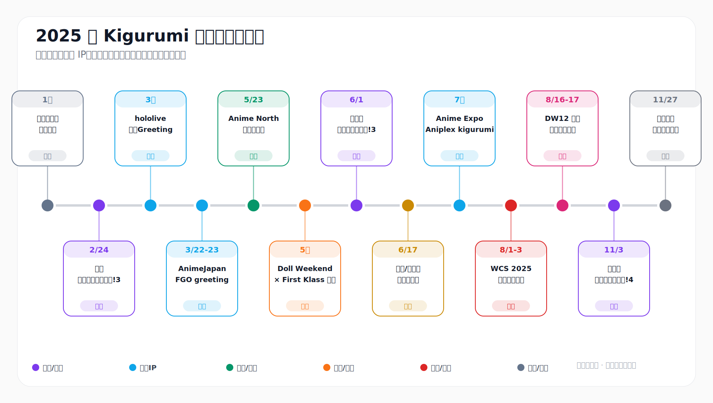
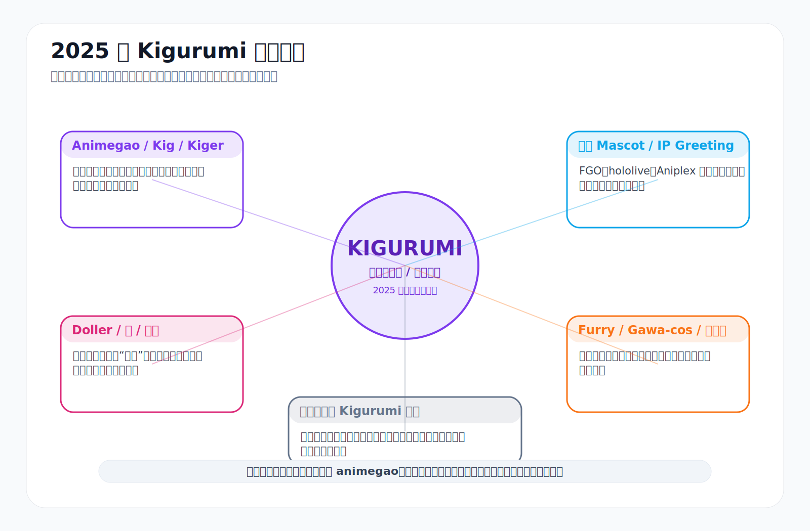
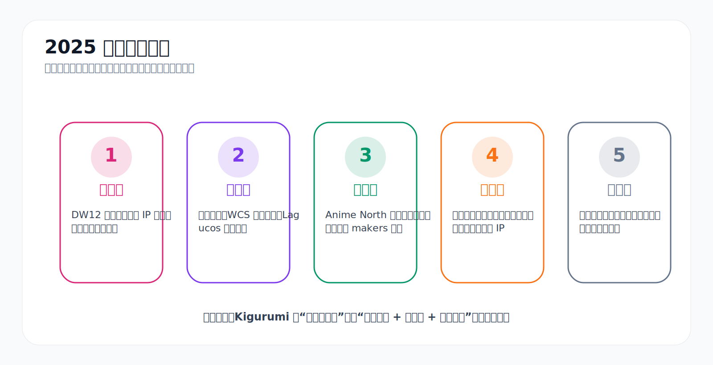
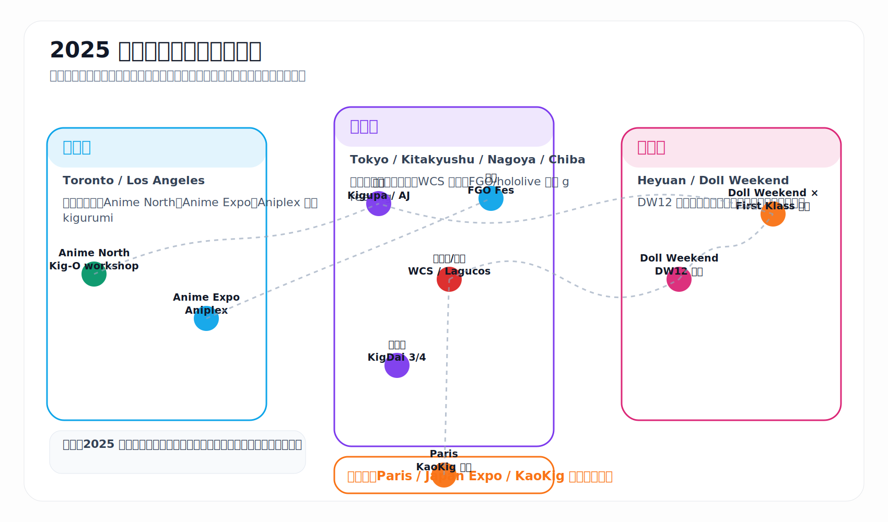
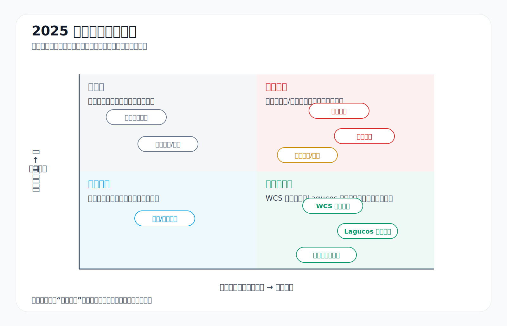
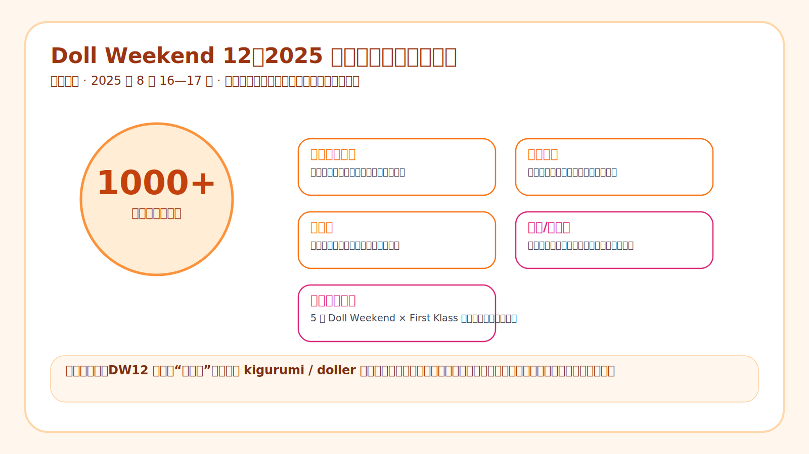

# 2025 年 Kigurumi 編年史

> **版本說明**  
> 本頁為 2025 年 kigurumi 相關公開資料的繁體中文整理版。內容保留原頁面的事件線索、圖表、來源腳註與公開邊界，並以年度頁形式接入編年志。

---

## 目錄

- [0. 閱讀口徑與資料邊界](#0-阅读口径与资料边界)
- [1. 年度總覽：2025 年為什麼重要](#1-年度总览2025-年为什么重要)
- [2. 編年史正文](#2-编年史正文)
- [3. 主要人物、組織與場域索引](#3-主要人物组织与场域索引)
- [4. 正面事件、負面事件、考究事件與傳聞事件總帳](#4-正面事件负面事件考究事件与传闻事件总账)
- [5. 年度結論](#5-年度结论)
- [6. 參考資料](#6-参考资料)

---

## 0. 閱讀口徑與資料邊界 {#0-阅读口径与资料边界}

2025 年公開資料中的 **kigurumi** 並不是單一概念。本文以中文與日文社群常說的 **animegao kigurumi / 美少女着ぐるみ / Kig / Kiger / 變娃** 為主線，同時區分官方 IP 人偶裝、doller、furry、gawa-cos、特攝式全頭套與英文電商語境中的連體睡衣。

| 層級 | 主要內容 | 2025 年中的體現 |
|---|---|---|
| Animegao / Kig / Kiger | 動畫臉面具、膚色衣、角色服裝、攝影與表演 | 東京「きぐるみパーティ!」、Anime North 製面工作坊、玩家公開記錄 |
| Doller / 娃 / 變娃 | 中文圈常見表達，更強調娃化、身體沉浸與大型聚會 | Doll Weekend 12、Doll Weekend × First Klass 日本企劃 |
| 官方 Mascot / IP Greeting | 品牌方製作和運營的官方角色人偶裝 | FGO、hololive、Aniplex 在 AnimeJapan、FGO Fes、Anime Expo 等展會登場 |
| Furry / Gawa-cos / 全頭套 | 獸裝、特攝式皮套、頭盔、全臉面具等相鄰全身裝扮 | WCS 規則、九州「着ぐるみ大行進!」將其並列管理 |
| 連體睡衣語境 | 英文電商中常見的 animal onesie / 家居服 | 本文不作為主線，只作術語邊界說明 |

資料等級分為官方活動頁、規則文件、政府或主辦方公告、媒體報導、品牌新聞稿、參與者公開文章、匿名論壇和傳聞索引。官方資料可作為日期、地點和規則依據；參與者文章可記錄經驗和術語；匿名論壇只記錄「傳聞場域存在」與治理壓力，不復述未核實指控、不點名個人。

---

## 1. 年度總覽：2025 年為什麼重要 {#1-年度总览2025-年为什么重要}

2025 年的 kigurumi 呈現五條主線並行：

1. **規模化**：中國 Doll Weekend 12 公開記錄 1000+ 參與者，並出現娃主題煙花秀、無人機秀和娃遊行。[^dw-cn]
2. **制度化**：東京「きぐるみパーティ!」、北九州「着ぐるみ大行進!」、WCS 遮面規則與 Lagucos 水域限制，顯示 kigurumi 正被活動規則明確管理。[^kigupa][^wcs-rule]
3. **技術化**：Kigurumi Online 在 Anime North 2025 的工作坊，把 animegao 歷史、製面、眼形、假髮和佩戴適配轉化為新人可學習流程。[^kig-o]
4. **跨境化**：Doll Weekend × First Klass 日本企劃、北美 Anime North、美國 Anime Expo、日本 WCS、中國 DW12 和歐洲 KaoKig 線索共同構成多地連接。[^dw-cn][^aniplex-ax][^japanexpo]
5. **爭議化**：匿名論壇、網絡騷擾、攝影同意、過熱脫水、池邊安全和關稅物流等問題都更可見。[^wcs-party][^lagucos][^blackcat]

一句話概括：2025 年的 kigurumi 從「小眾視覺奇觀」進一步轉向「活動生態、產業鏈、跨境網絡和規則治理並存的複合文化」。

---

## 2. 編年史正文 {#2-编年史正文}

| 時間 | 事件 | 地區 / 類型 | 編年史意義 |
|---|---|---|---|
| 1 月前後 | 術語與社群身份整理 | 跨語境考究 | 釐清 kigurumi、animegao、doller、mascot、furry 與 onesie 的邊界 |
| 2 月 24 日 | 第 3 回・きぐるみパーティ! | 東京 / 專門活動 | 面具型 kigurumi 被作為需要專門場地、動線、更衣和攝影規則的參與形式 |
| 3 月上旬 | hololive SUPER EXPO 2025 Kigurumi Greeting | 官方 IP | VTuber 虛擬角色被線下實體化 |
| 3 月 22-23 日 | AnimeJapan 2025 FGO greeting | 官方 IP / 展會 | 大型商業動漫展將 kigurumi 納入展位互動 |
| 5 月 23 日前後 | Anime North 2025 / Kigurumi Online workshop | 北美 / 技術教育 | 製面與佩戴知識被轉化為可教學流程 |
| 5 月 | Doll Weekend × First Klass 日本企劃 | 中日跨境合作 | 中國「娃/Kig」體系開始伸展到海外攝影場域 |
| 6 月 1 日 | 着ぐるみ大行進!3 | 北九州 / 地方交流會 | 九州全身裝扮社群建立固定平台 |
| 6 月 17 日前後 | BlackCatKig / Inthemask 美國客戶通知 | 產業鏈 / 物流 | 關稅、轉運倉和交期成為 kigurumi 產業基礎設施問題 |
| 7 月 | Anime Expo 2025 Aniplex kigurumi | 美國 / 官方 IP | 北美大型展會將官方 kigurumi 用於粉絲互動 |
| 7 月 | Japan Expo 2025 / KaoKig 線索 | 歐洲 / 公開展示 | 歐洲 animegao 線持續存在 |
| 8 月 1-3 日 | World Cosplay Summit 2025 | 名古屋 / 主流 cosplay 規則 | kigurumi、doller、gawa-cos 等遮面服裝被納入可管理範圍 |
| 8 月 1-3 日 | Lagucos / WCS 周邊規則 | 安全治理 | 水域、高溫、脫水和行動風險被活動規則承認 |
| 8 月 2-3 日 | FGO Fes. 2025 十周年 | 幕張 / 官方 IP | 9 名 kigurumi 與 14 名官方 cosplayer 共同構成沉浸式慶典 |
| 8 月 16-17 日 | Doll Weekend 12 广东河源 | 中國 / 千人級大型活動 | 中文圈 kigurumi / doller 進入節慶化、產業化與城市合作階段 |
| 9-10 月 | 中文 / 日文跨語境參與者書寫 | 公開文章 / 術語考究 | 「變娃」經驗與外部誤讀被更自覺地解釋 |
| 11 月 3 日 | 着ぐるみ大行進!4 | 北九州 / 系列延續 | 地方活動形成半年內二次舉辦的節奏 |
| 11 月下旬 | 匿名「問題児觀察」線程活躍 | 傳聞場域 / 治理壓力 | 小圈層傳聞、點名與社群治理問題變得可見 |
| 12 月 | 年末復盤 | 年度總結 | 2025 年成為「擴張與規則並行」的一年 |

### 1 月：術語邊界與社群身份

年初最重要的不是某一場大型活動，而是術語邊界。不同資料中的 kigurumi 可能指遮面 cosplay、官方吉祥物式人偶裝、中文「娃/Kig」活動、furry 或全頭套，也可能被外部誤解為連體睡衣。因此年度編年需要先建立分層，避免把官方 greeting、玩家聚會和電商睡衣混為同一類事件。[^animegao][^note-term]

### 2 月 24 日：東京「第 3 回・きぐるみパーティ!」

東京台場的「きぐるみパーティ!」以面具型着ぐるみ為核心，提供室內外攝影、更衣、交流、團體合照與 runway 企劃。這說明日本社群已將 kigurumi 當作需要專門場地與規則的活動形式，而不是普通 cosplay 的附屬項。[^kigupa]

### 3 月：hololive、AnimeJapan 與 FGO 官方 greeting

hololive SUPER EXPO 2025 公布多個官方角色的 Kigurumi Greeting 時段，AnimeJapan 2025 的 FGO 展位也安排 cosplay / kigurumi greeting。這些案例說明官方 IP 已把 kigurumi 作為線下粉絲互動與角色實體化的工具。[^hololive][^fgo-aj]

### 5 月：Anime North 工作坊與 Doll Weekend 海外線

Kigurumi Online 在 Anime North 2025 舉辦製面工作坊，將 animegao 歷史、makers、眼形、眼色、睫毛、眉毛、假髮和內襯適配轉化為可學習流程。5 月的 Doll Weekend × First Klass 日本企劃，則顯示中國 Doll Weekend 體系開始以攝影會與跨國合作形式進入日本場域。[^animenorth][^kig-o][^dw-cn]

### 6-7 月：地方交流、物流壓力與北美大型展會

6 月的「着ぐるみ大行進!3」把美少女着ぐるみ、doller、furry 和 gawa-cos 等全身裝扮放入九州地方交流平台。BlackCatKig / Inthemask 的美國客戶通知則記錄了關稅、寧波轉運倉和空運時間變化，提醒我們 kigurumi 已深度依賴跨境製造和物流。7 月 Anime Expo 2025 的 Aniplex 展位以 kigurumi mascot appearances 服務大型展會互動，歐洲 Japan Expo / KaoKig 線索則代表 animegao 公開展示的持續存在。[^kigdai][^blackcat][^aniplex-ax][^japanexpo]

### 8 月：WCS、Lagucos、FGO Fes. 與 DW12

WCS 2025 的規則明確允許 kigurumi、gawa-cos、doller、全臉面具與頭盔類遮面服裝在特定場域參加，但保留安保確認與工作人員指示權。Lagucos / WCS 周邊規則也把水域、高溫、脫水、攝影同意和行動安全寫入治理範圍。[^mofa-wcs][^wcs-rule][^wcs-party][^lagucos]

FGO Fes. 2025 十周年活動記錄了 9 名 kigurumi 與 14 名官方 cosplayer 迎接來場者。8 月 16-17 日，Doll Weekend 12 在廣東河源舉行，公開記錄 1000+ 參與者，並包含娃主題煙花秀、無人機秀、娃遊行、展商與創作者體系，是 2025 年中國線最重要的規模化節點。[^fgo-fes][^dw-cn][^dw-pr]

### 9-12 月：參與者書寫、地方延續與傳聞治理

9-10 月的中文 / 日文跨語境文章嘗試向日本讀者解釋中文圈 Kigurumi、Kig、Kiger 與「變娃」文化，也記錄了公開發布 kigurumi / latex 內容後可能遭遇騷擾或性化誤讀。11 月 3 日「着ぐるみ大行進!4」再次舉辦，說明地方活動已形成固定節奏。11 月下旬匿名「問題児觀察」線程活躍，應被記錄為傳聞場域和社群治理壓力，而不是事實清單。[^note-term][^note-harass][^kigdai4][^kyodemo][^wikifur]

---

## 3. 主要人物、組織與場域索引 {#3-主要人物组织与场域索引}

| 組織 / 場域 | 2025 年定位 | 編年史意義 |
|---|---|---|
| Cosplay 博 / きぐるみパーティ! | 東京面具型 kigurumi 專門活動線 | 提供拍攝、更衣、團體展示和 runway 空間，代表日本本土活動制度化 |
| 九州化装会、i-key、Cospic、らいむ / 着ぐるみ大行進! | 日本地方社群線 | 6 月與 11 月連續活動，說明九州正在建立自己的全身 cosplay 交流平台 |
| Kigurumi Online | 北美技術傳播與入門教育線 | 將製面、眼片、假髮、內襯與佩戴適配做成新人工作坊 |
| Doll Weekend / First Klass | 中國「娃/Kig」大型化與跨國合作線 | 日本企劃與 DW12 共同顯示中文圈的跨境和節慶化能力 |
| BlackCatKig / Inthemask | 製作、銷售與跨境物流線 | 關稅、轉運倉、清關和交期變成社群入門與活動計劃的一部分 |
| World Cosplay Summit / Lagucos | 主流 cosplay 規則治理線 | 以「允許 + 安全確認 + 工作人員指示」方式納入遮面服裝 |
| FGO、Aniplex、hololive | 官方 IP 實體化線 | 讓普通觀眾在大型展會中接觸官方 kigurumi greeting |
| KaoKig / Japan Expo | 歐洲公開展示線 | 公開資料較少，但顯示歐洲 animegao 線仍在延續 |

---

## 4. 正面事件、負面事件、考究事件與傳聞事件總帳 {#4-正面事件负面事件考究事件与传闻事件总账}

| 類型 | 代表內容 | 2025 年意義 |
|---|---|---|
| 正面事件 | 專門活動增加、WCS 規則承認、Anime North 工作坊、DW12 大型化、跨國交流增強 | kigurumi 取得更完整的活動、教育、展示與跨境網絡 |
| 風險事件 | 高溫脫水、水域安全、攝影同意、網絡騷擾、關稅物流 | 負面不只等於醜聞，也包括被寫進規則的身體和公共安全問題 |
| 考究事件 | animegao 與官方 mascot 的區別、中文「娃/Kig」術語、遮面服裝規則、連體睡衣誤讀 | 讓年度編年不把相鄰文化混為一談 |
| 傳聞事件 | 匿名「問題人物觀察」線程、X 轉帖、活動後口碑 | 只記錄治理壓力，不復述未核實指控或點名個人 |

---

## 5. 年度結論 {#5-年度结论}

2025 年不是 kigurumi 的起源年，也不是單純爆紅年，而是一個制度化轉折年。東京、北九州、名古屋、幕張、多倫多、洛杉磯、河源、巴黎等地的公開節點，連同工作坊、官方 IP、物流公告、安全規則和匿名論壇，共同說明 kigurumi 已從少數玩家的視覺奇觀，轉向有活動、有產業、有規則、有爭議、有跨國網絡的複合文化。

---

## 6. 參考資料 {#6-参考资料}

[^animegao]: Kigurumi Animegao France, “Kigurumi Animegao,” <https://kigurumi-animegao.fr/>
[^kigupa]: Cosplay 博 / C-NET, “第3回・きぐるみパーティ!,” <https://cnet.cosplay.ne.jp/kigupa001.html>
[^hololive]: hololive SUPER EXPO 2025, “Kigurumi Greeting,” <https://hololivesuperexpo2025.hololivepro.com/news/greeting>
[^fgo-aj]: Fate/Grand Order, “AnimeJapan 2025 出展情報,” <https://news.fate-go.jp/2025/aj2025/>
[^animenorth]: Anime North 2025 industry / exhibitor information, <https://www.animenorth.com/index.php/component/sppagebuilder/?id=819&view=page>
[^kig-o]: Kigurumi Online, “Kigurumi Workshop,” <https://kig-o.com/index.php/kigurumi-workshop/>
[^dw-cn]: Doll Weekend 官方页面, <https://dollweekend.cn/cn/>
[^kigdai]: Cospic, “着ぐるみ大行進” series category, <https://cospic.org/archives/category/event/kigdai>
[^blackcat]: BlackCatKig, “A Notice to US Customers,” <https://blackcatkig.com/pages/a-notice-to-us-customers?srsltid=AfmBOoruxavN6nFtN86FypnnRhYe5XVpHZKtpus8bQOPJBhYh9TlILNd>
[^aniplex-ax]: Aniplex of America, Anime Expo 2025 Press Release PDF, <https://aniplexusa.com/pdf/AOAAX25PRESSRELEASE.pdf>
[^japanexpo]: Japan Expo Paris, “Memories: Cosplay in Japan Expo 2025,” <https://www.japan-expo-paris.com/en/actualites/memories-cosplay-in-japan-expo-2025_114625.htm>
[^mofa-wcs]: Ministry of Foreign Affairs of Japan, World Cosplay Summit 2025 record, <https://www.mofa.go.jp/p_pd/ca_opr/pagewe_000001_00233.html>
[^wcs-rule]: World Cosplay Summit 2025, Cosplay Rule, <https://worldcosplaysummit.jp/2025/cosplay/rule/>
[^wcs-party]: World Cosplay Summit Party, Rule PDF, <https://worldcosplaysummit.jp/wcsparty/wp-content/uploads/2025/03/rule-jp.pdf>
[^lagucos]: Lagucos 2025 petite, Rule PDF, <https://worldcosplaysummit.jp/lagucos/petit/wp-content/themes/petit2025/common/images/rule_en.pdf>
[^fgo-fes]: LevelUp Logy, FGO Fes. 2025 coverage, <https://leveluplogy.jp/archives/23212>
[^dw-pr]: PR Times, Doll Weekend 12 release, <https://prtimes.jp/main/html/rd/p/000000004.000167011.html>
[^note-term]: note.com, “中文圈 Kigurumi / Kig / Kiger / 变娃”相关公开文章, <https://note.com/eichan_sh/n/n6738a8ae576b>
[^note-harass]: note.com, 参与者关于公开发布 kigurumi / latex 内容后遭遇骚扰的记录, <https://note.com/eichan_sh/n/n931989e28ca5>
[^kigdai4]: Cospic, “着ぐるみ大行進！4,” <https://cospic.org/archives/494>
[^kyodemo]: Kyodemo, “着ぐるみ関係の問題児観察スレ” thread index, <https://www.kyodemo.net/sdemo/r/twwatch/1764237229/>
[^wikifur]: WikiFur Japan, “着ぐるみを着る人々を語るスレ,” <https://ja.wikifur.com/wiki/%E7%9D%80%E3%81%90%E3%82%8B%E3%81%BF%E3%82%92%E7%9D%80%E3%82%8B%E4%BA%BA%E3%80%85%E3%82%92%E8%AA%9E%E3%82%8B%E3%82%B9%E3%83%AC>
