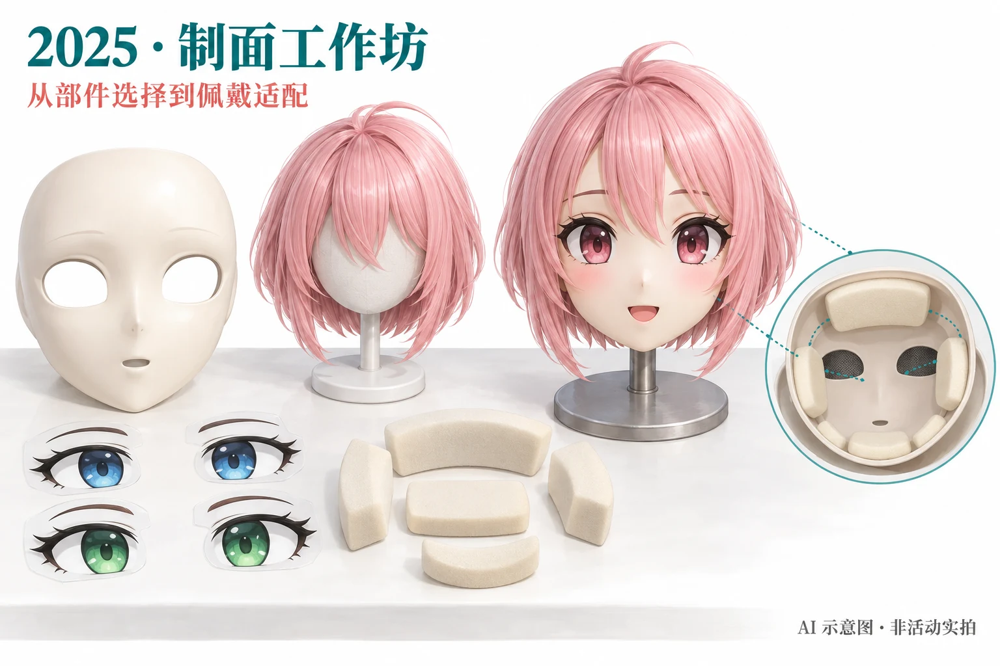
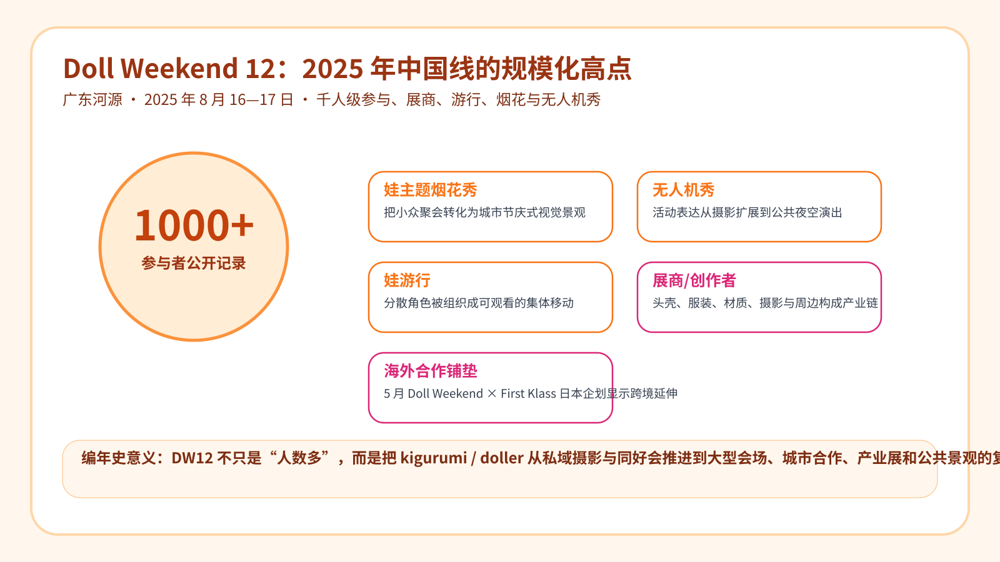

# 2025 年 Kigurumi 編年史

2025 年重點記錄專門活動、入門制面工作坊、Doll Weekend 跨境合作與大型慶典，並補入年底製作者目錄版本。活動、規則與資料出版各自保留髮生時間和來源。

## 年度重點

- **2 月東京**：第 3 回きぐるみパーティ的場地與攝影安排。
- **5 月多倫多**：Kigurumi Online 的入門制面工作坊；同月 DW 與 First Klass 在日本合作。
- **8 月河源**：DW12 的節目、展商與主辦方規模記錄。
- **12 月 10 日**：Celes Halcyon 公佈本年版本的面具製作者目錄。[^maker-list]

## 年度紀事

### 2 月 24 日：東京“第 3 回・きぐるみパーティ!”——專門面具型活動的制度化

| 項目 | 內容 |
|---|---|
| 時間 | 2025 年 2 月 24 日，10:00—16:30 |
| 地點 | 日本東京臺場地區，國際交流館プラザ平成 |
| 類型 | 社羣專門活動 / 面具型着ぐるみ活動 |
| 主線意義 | kigurumi 被當作需要專門場地、動線、更衣和攝影規則的參與形式 |
| 主要依據 | Cosplay 博 / C-NET 官方活動頁[^kigupa] |

2025 年 2 月 24 日，日本東京臺場地區的 Plaza Heisei 舉辦了“第 3 回・きぐるみパーティ!”。官方活動頁明確把它寫成“面具型着ぐるみ事件”，活動對象並非普通 cosplay 綜合場，而是更偏向“顔が隠れる / 面部被遮擋”的 kigurumi、全頭套、面具類角色扮演者。[^kigupa]

這場活動的核心價值在於**專門化**。普通漫展對 kigurumi 的容納往往受制於人流、視線、攝影、行動不便、更衣空間與安全確認；而“きぐるみパーティ!”提供的是更接近“爲面具角色設計的空間”。官方說明中列出了室內外攝影區域，包括灣岸廣場、瀑布廣場、和風庭園、芝生廣場、林間木平臺等，也強調會有大型更衣室、較不易被一般路人圍觀的區域、明亮室內空間、私人感較強的區域，以及團體合照和 runway 企劃。[^kigupa]

從編年史角度看，這場活動說明日本 kigurumi 社羣在 2025 年初已經形成較成熟的活動基礎設施意識。kigurumi 的痛點並不只是“穿上頭殼”，而是整個活動鏈條：入場前需要頭殼與服裝運輸；現場需要更衣、補妝和頭殼內襯調整；拍攝時需要避開無授權路人；移動時可能需要陪同或視野輔助；長時間佩戴還需要休息、補水和通風。若活動能預先劃定拍攝點、集中更衣與交流區域，就能顯著降低 kigurumi 參與大型活動時的風險。

這也是 2025 年正面事件中的一個標誌：**kigurumi 被當成需要專門設計的參與形式，而不是普通 cosplay 的附屬物。** 團體照和 runway 企劃尤其重要，因爲它們把 kigurumi 從“被拍攝的個體”提升到“可以共同展示的羣體”。在社羣史上，這類活動往往會留下大量非正式照片、合照與口碑，雖然並不是所有內容都被官方長期保存，但活動頁本身已經證明：面具型 kigurumi 在東京仍有穩定的組織能力和參與需求。

### 3 月上旬：hololive SUPER EXPO 2025 的官方吉祥物式 kigurumi 登場

| 項目 | 內容 |
|---|---|
| 時間 | 2025 年 3 月，hololive SUPER EXPO 2025 期間 |
| 類型 | 官方 IP / Kigurumi Greeting |
| 主要角色 | Ankimo、Mikodanye、Fubuzilla、Fubra、Hairball Korone、Subaru Duck、Smol Ame、Houshou Bearine、UDIN 等 |
| 主線意義 | VTuber 虛擬角色被線下實體化，kigurumi 成爲官方粉絲互動工具 |
| 主要依據 | hololive SUPER EXPO 2025 官方 greeting 公告[^hololive] |

3 月，hololive SUPER EXPO 2025 公佈了“着ぐるみグリーティング / Kigurumi Greeting”安排。它並不是 animegao 愛好者聚會，而是 VTuber 品牌方安排的官方角色吉祥物互動。公告中列出了展館內 greeting 的時間段與角色安排，包括 Ankimo、Mikodanye、Fubuzilla、Fubra、Hairball Korone、Subaru Duck、Smol Ame、Houshou Bearine、UDIN 等，並安排了 DAY 1、DAY 2 的多時段會面以及 kigurumi stage。[^hololive]

這類官方 greeting 對 2025 年 kigurumi 公共可見度有特殊意義。VTuber 角色本身是虛擬形象，而 kigurumi greeting 將其轉化爲可在會場移動、合影、揮手、互動的“實體”。這種實體化與 animegao kigurumi 有親緣關係：兩者都把二維或擬人角色通過頭部造型、身體比例、服裝材質和動作語言轉化爲現實存在；但它們的組織邏輯不同。官方 kigurumi 是品牌資產，動作和接觸邊界通常受運營方控制；愛好者 animegao 則更接近個人表達、攝影創作和社羣交流。

這類官方 greeting 對核心社羣既有正面影響，也有邊界壓力。正面影響是：更多普通觀衆會逐漸習慣“二次元角色以全頭套/人偶裝形式出現”，降低陌生感。邊界壓力是：大衆可能把商業吉祥物、furry、animegao、doller、特攝皮套混爲一談。2025 年很多討論的難點正出在這裏：kigurumi 的公共形象變得更可見，但“可見”並不等於“被理解”。

### 3 月 22—23 日：AnimeJapan 2025 與 FGO 官方 kigurumi greeting

| 項目 | 內容 |
|---|---|
| 時間 | 2025 年 3 月 22—23 日 |
| 地點 | 東京 Big Sight，AnimeJapan 2025 |
| 類型 | 官方 IP / 展位互動 / cosplay & kigurumi greeting |
| 主線意義 | 大型商業動漫展將 kigurumi 納入角色互動和展位運營 |
| 主要依據 | FGO 官方 AnimeJapan 2025 頁面[^fgo-aj] |

3 月 22—23 日，AnimeJapan 2025 在東京 Big Sight 舉辦，Fate/Grand Order 官方展位安排了 cosplay / kigurumi greeting。官方頁面列出 3 月 23 日多個 greeting 時間段，包括上午、午前、下午與傍晚的安排，其中部分時段也標註了中止信息。[^fgo-aj]

FGO 的情況很有代表性。它的世界觀龐大，角色衆多，觀衆對角色外觀識別度高；官方 cosplayer 與 kigurumi 的組合，能在展位前製造“角色降臨”的感受。與單純展板、PV、周邊售賣相比，kigurumi greeting 更依賴現場秩序：排隊、拍照、動線、攝影許可、停留時間、角色間互動都需要控制。如果沒有清晰規則，容易出現擁堵、偷拍、推搡或誤觸問題。

從 kigurumi 編年史角度看，AnimeJapan 2025 的 FGO greeting 顯示出一種趨勢：**大型 IP 已經把 kigurumi 當成線下傳播工具，而不是臨時玩偶服。** 這與愛好者圈的意義不同，但會反過來影響圈外認知。觀衆可能先在 FGO、hololive、Aniplex 展位認識“會動的角色”，再逐漸接觸 animegao 或 doller 社羣。也正因此，2025 年 kigurumi 的歷史不能只寫玩家聚會，也必須寫官方 IP 的實體角色運營。

### 5 月 23 日工作坊安排：部件選擇、組裝與佩戴適配

工作坊官方頁面在 4 月 25 日更新，寫明本年場次爲 5 月 23 日 19:00。課程先介紹 animegao 歷史、製作者及製作方法；付費動手參加者在志願者協助下選擇眼形、眼色、眉毛、睫毛和假髮，並通過內部填充調整佩戴。旁聽不收費。[^kig-o]

*AI 說明圖，依據工作坊文字概括部件關係；不是當屆活動實拍、實際商品照片或製作方圖紙。*

官網把報名與動手製作作爲不同參與方式，並提供當年售票入口。未取得當年價目和最終完成人數，本文不補寫費用或教學成果統計。

### 5 月：Doll Weekend × First Klass 日本企劃——中國“娃/Kig”體系的海外伸展

| 項目 | 內容 |
|---|---|
| 時間 | 2025 年 5 月 |
| 地點 | 日本 |
| 類型 | 跨境合作 / 攝影會 / Doll Weekend 海外線 |
| 主線意義 | 中國 Doll Weekend 體系從國內大型活動延伸到日本合作場域 |
| 主要依據 | Doll Weekend 官方頁面[^dw-cn] |

2025 年 5 月，Doll Weekend 官方頁面記錄了 “Doll Weekend × First Klass” 日本企劃，稱其爲 Doll Weekend 的首次海外亮相，並與 First Klass 攝影會共同舉辦。[^dw-cn]

這一節點在 2025 年 kigurumi 編年史中很關鍵，因爲它顯示中國 Doll Weekend 體系並不是只在國內擴張，而是開始以攝影會、跨國合作和海外登場的形式進入日本場域。First Klass 本身在日系攝影、cosplay 與角色扮演語境中具有高質量攝影會意味，Doll Weekend 與其合作，說明“娃/Kig”不只是展會遊行，也進入了更精緻化、棚拍化、作品化的方向。

這類跨境活動的文化意義比較複雜。日本是 animegao kigurumi、doller、着ぐるみ攝影傳統的重要發源與發展地之一；中國近年來則在“娃”“Kig”“Kiger”“大型線下聚會”“展商和工坊”方面迅速擴大規模。Doll Weekend 在 2025 年赴日，與其說是單向輸出，不如說是中日之間重新接線：日本提供歷史與攝影審美傳統，中國提供規模化組織、展會化包裝與新玩家增長。

從正面角度看，這標誌着亞洲 kigurumi / doller 圈的聯繫加深；從潛在問題看，跨境活動也會帶來翻譯、規則、版權、攝影同意、商業身份、簽證旅行、器材運輸等複雜問題。尤其對於頭殼、假髮、緊身衣、角色服裝和攝影器材都高度依賴運輸的玩家來說，海外活動的門檻遠高於普通 cosplay。

### 6 月 1 日：北九州“着ぐるみ大行進！3”——九州全身裝扮社羣的集中節點

| 項目 | 內容 |
|---|---|
| 時間 | 2025 年 6 月 1 日 |
| 地點 | 北九州相關場地，Mikuni World Stadium Kitakyushu 相關信息 |
| 類型 | 地方社羣活動 / 全身 cosplay 交流會 |
| 主線意義 | 九州地區形成 kigurumi、doller、furry、gawa-cos 共處的地方平臺 |
| 主要依據 | Cospic / 着ぐるみ大行進 系列頁面[^kigdai] |

2025 年 6 月 1 日，“着ぐるみ大行進！3”在北九州相關場地舉辦。Cospic 頁面把該系列稱爲“九州最大級的着ぐるみ交流會”，並說明它的目標是在九州創造一個能讓 kigurumi 參與者相聚的地方。主辦相關信息中出現了九州化裝會、i-key、cospic 代表“らいむ”等組織與人物；活動所涵蓋的類型並不只限 animegao，還包括美少女着ぐるみ、ドーラー、ケモノ系/furry、ヒーロー系ガワコス等“全身 cosplay”。[^kigdai]

這場活動的重要性在於**地方化**。東京、大阪、名古屋等地長期更容易被視爲日本 cosplay 與 kigurumi 的中心，但九州的“着ぐるみ大行進!”說明地方社羣也在建立自己的固定平臺。活動頁面強調會場、更衣室、交流空間、JR 小倉站步行可達和停車等條件。這些看似基礎的條件，對 kigurumi 來說其實是決定活動能否成立的核心。

普通 cosplay 可能只需要換衣、化妝、攜帶道具；kigurumi 往往還要處理頭殼箱、身體填充、視野限制、陪同移動、休息降溫、頭殼摘戴隱私、角色狀態維持等問題。一個地方活動若能提供穩定動線、明確更衣、攝影交流和社交空間，就等於把“能不能來”這個問題從個人體力問題變成組織保障問題。

“着ぐるみ大行進！3”還體現出 2025 年 kigurumi 社羣的另一個特徵：不同全身裝扮分支開始共處。美少女着ぐるみ、doller、furry、hero/gawa-cos 的審美差異很大，但它們共享許多實際問題：頭部遮擋、炎熱、移動困難、攝影規則、公衆識別、身份邊界、換裝需求。九州活動把它們放進同一交流會，說明 2025 年“kigurumi”在活動治理層面越來越像一個廣義的“全身角色化”類別，而不是單一風格。

### 7 月：Anime Expo 2025 與 Aniplex 官方 kigurumi——美國大型展會中的 IP 實體化

這不是核心 animegao 社羣聚會，但它對 kigurumi 的公共史非常重要。Anime Expo 是北美最具影響力的動漫展之一，Aniplex 在這樣的大型會場安排 kigurumi，說明“角色實體化”已經是國際動漫營銷中的成熟手段。觀衆在會場看到的並不是普通吉祥物，而是與具體二次元 IP、官方舞臺、週年活動、展位導流和粉絲互動綁定的角色化身體。

它與 Anime North 的 Kigurumi Online workshop 形成鮮明對比：Anime North 的 kigurumi 線偏向玩家技術、社羣教學和個人創作；Anime Expo 的 Aniplex kigurumi 線則偏向官方 IP、品牌運營和粉絲服務。兩者共同構成了北美 2025 年 kigurumi 可見度的兩端：一端是“如何成爲 kigurumi 玩家”，另一端是“普通觀衆如何在大展會遇見官方 kigurumi”。

這種雙軌結構對社羣有長遠影響。官方 kigurumi 的專業化會提高觀衆期待，例如造型完整度、動作訓練、拍照秩序、角色性格表達；而玩家社羣則可能因此受到更高審美標準和更強公衆凝視。2025 年以後，kigurumi 玩家在大型展會出現時，常常不僅被當作普通 cosplayer，也會被觀衆拿來和官方人偶服、主題樂園角色、品牌 mascot 比較。這既帶來尊重，也帶來壓力。

### 8 月 1—3 日：World Cosplay Summit 2025——主流 cosplay 體系對“遮面服裝”的規則承認

| 項目 | 內容 |
|---|---|
| 時間 | 2025 年 8 月 1—3 日 |
| 地點 | 名古屋與愛知，World Cosplay Summit 2025 |
| 類型 | 主流 cosplay 大會 / 規則治理 / 遮面服裝承認 |
| 主線意義 | kigurumi、gawa-cos、doller、全臉面具與頭盔類服裝被明確納入可管理範圍 |
| 主要依據 | 日本外務省活動記錄、WCS 2025 cosplay 規則[^mofa-wcs][^wcs-rule] |

對 kigurumi 來說，WCS 2025 最重要的不是冠軍歸屬，而是活動規則。WCS 相關規則中明確寫到，因爲 WCS 的特殊性，在 Flarie 會場允許 kigurumi、gawa-cos、doller、全臉面具、頭盔等“面部隱藏”的服裝參加，但安保可能會要求確認面部，參與者需聽從工作人員指示。[^wcs-rule]

這是一條非常關鍵的“制度性正面事件”。很多大型活動對遮面服裝天然警惕，因爲它涉及身份確認、安全、偷拍、未成年人保護、緊急疏散和會場責任。WCS 2025 沒有簡單禁止，而是採用“允許參加 + 必要時確認面部 + 遵守工作人員指示”的方式，把 kigurumi 納入可管理範圍。這比“默許”更重要，因爲默許會讓參與者不確定自己是否隨時被要求離場；明確規則則給玩家和工作人員都提供了邊界。

WCS 2025 同時也體現了風險治理。另一份 WCS 派對/規則文件中提到，工作人員可能拒絕過度暴露、過尖、過長、難以行走，或可能導致脫水的 kigurumi 等服裝；攝影規則也強調不得長時間佔用場地、不得進行低角度或內衣偷拍，照片上傳需取得被攝者同意。[^wcs-party]

這說明 2025 年大型 cosplay 活動對 kigurumi 的態度不是“歡迎但不管”，而是“歡迎，但必須納入安全、攝影和公共秩序”。這對社羣既是保護也是約束。保護在於，kigurumi 玩家獲得合法出現的空間；約束在於，玩家不能只按私人攝影會標準行動，而必須考慮公衆場地、他人肖像權、行動安全和工作人員管理。WCS 2025 因此可以被視爲 2025 年 kigurumi 規則史上的重要節點。

### 8 月 2—3 日：FGO Fes. 2025 十週年——9 名 kigurumi 與 14 名官方 cosplayer 的大規模官方呈現

| 項目 | 內容 |
|---|---|
| 時間 | 2025 年 8 月 2—3 日 |
| 地點 | 千葉幕張 Messe |
| 類型 | 官方 IP / 十週年活動 / 大規模 greeting |
| 主線意義 | FGO 將官方 cosplayer 與 kigurumi 作爲十週年沉浸式體驗的重要組成 |
| 主要依據 | LevelUp Logy 報道[^fgo-fes] |

2025 年 8 月 2—3 日，Fate/Grand Order Fes. 2025 在千葉幕張 Messe 舉辦，主題與 FGO 十週年相關。媒體報道記錄，該活動爲十週年最大規模活動之一，現場有 14 名官方 cosplayer 與 9 名 kigurumi 角色迎接來場者。[^fgo-fes]

這場活動與 AnimeJapan 2025 的 FGO greeting 是同一條官方 IP 線的延伸，但規模和象徵性更強。十週年活動本身具有紀念屬性，官方 cosplayer 與 kigurumi 同臺出現，說明 FGO 把“真人角色化身體”作爲慶典體驗的重要組成。對粉絲來說，kigurumi 的功能不僅是“拍照道具”，而是把遊戲中的從者、吉祥物或角色意象帶進現實空間，使展會具有沉浸式巡遊感。

這類活動對 animegao 社羣的影響是雙向的。正面是：官方 kigurumi 的頻繁出現使觀衆更熟悉“頭套角色可以有表演、情緒和互動”，降低普通觀衆面對 kigurumi 玩家時的驚訝。負面或壓力是：官方 kigurumi 通常背後有團隊、造型標準、動作規範、攝影秩序和版權授權，個人玩家很難與其同等比較。觀衆如果不瞭解差異，可能會用商業活動標準評價個人愛好者。

從年度編年史看，8 月初出現了一個密集節點：名古屋的 WCS、幕張的 FGO Fes.、各類夏季 cosplay 活動幾乎同時把 kigurumi、mask cosplay、官方角色服推到公衆面前。2025 年 8 月可以說是全年 kigurumi 可見度最高的月份之一。

### 8 月 16—17 日：Doll Weekend 12 廣東河源——中國 kigurumi / doller 規模化的年度核心事件

| 項目 | 內容 |
|---|---|
| 時間 | 2025 年 8 月 16—17 日 |
| 地點 | 廣東河源，Sheraton Resort Hotel 相關報道 |
| 類型 | 中國 Doll Weekend / 千人級大型活動 / 展商與創作者生態 |
| 主要亮點 | 1000+ 參與者、娃主題煙花秀、無人機秀、娃遊行、展商與創作者體系 |
| 主要依據 | Doll Weekend 官方頁面、PR Times 日文發佈[^dw-cn][^dw-pr] |

2025 年 8 月 16—17 日，Doll Weekend 12 在廣東河源舉行。Doll Weekend 官方頁面稱，DW12 有 1000+ 參與者，並出現了首個娃主題煙花秀、無人機秀和娃遊行；官方也把 Doll Weekend 描述爲全球規模最大的 dolls 與 creators 線下產業活動之一。[^dw-cn]

PR Times 的日文發佈進一步把這場活動描述爲“世界最大級 Kigurumi anime doll 大會”，地點爲河源 Sheraton Resort Hotel，並提到活動主題、城市級政府支持，以及 HiDolls、HAMPOO LATEX、雷撃工房、貓豆腐、玄貓物語、狐妖手作等展商或相關創作方。該報道還解釋了 kigurumi anime doll 的構成：以頭殼、定製服裝、整體身體協調與角色沉浸爲中心。[^dw-pr]

這場活動是 2025 年全球 kigurumi 編年史裏最值得重點書寫的中國節點。它的關鍵不只在人數，而在活動形態發生變化：煙花、無人機、遊行、度假酒店、展商、創作者、攝影、城市支持，這些元素使 Doll Weekend 12 不再像普通同好聚會，而更像一個帶有產業展、嘉年華、視覺秀和城市活動屬性的綜合節慶。對中文“娃/Kig”圈而言，這意味着 kigurumi 已經具有足夠規模，能支撐大型場地、商業贊助、跨地旅行和專門節目。

從正面角度看，DW12 展現了中國 kigurumi 社羣的組織力。1000+ 規模對任何高成本、強裝備、強攝影依賴的亞文化來說都不是小數字；煙花和無人機秀則意味着主辦方試圖把“娃”從小圈層拍照推向公共景觀。娃遊行尤其值得注意，因爲它把原本分散在房間、棚拍、漫展角落中的角色身體組織成可觀看的集體移動，這與日本“着ぐるみ大行進!”在命名和形式上有相似的“行進/遊行”意味。

從風險角度看，規模化也會帶來更復雜的問題。人數越多，越需要處理酒店動線、攝影授權、未成年人觀看、角色接觸邊界、商業展商資格、版權角色使用、交通、醫療、降溫、場地責任等事務。煙花和無人機秀讓活動更壯觀，但也意味着安全審批、天氣、設備和城市管理的要求提高。2025 年的 Doll Weekend 12 因此既是正面高峯，也是“kigurumi 大型化之後必須面對治理問題”的標誌。

### 11 月 3 日：北九州“着ぐるみ大行進！4”——半年內二次舉辦，地方活動形成節奏

| 項目 | 內容 |
|---|---|
| 時間 | 2025 年 11 月 3 日 |
| 地點 | 北九州相關場域 |
| 類型 | 地方社羣活動 / 系列化延續 |
| 主線意義 | 同年 6 月與 11 月連續舉辦，說明地方社羣正在形成固定節奏 |
| 主要依據 | Cospic “着ぐるみ大行進！4”頁面[^kigdai4] |

2025 年 11 月 3 日，“着ぐるみ大行進！4”繼續在北九州相關場域舉辦。Cospic 頁面延續了“九州最大級着ぐるみ交流會”的定位，仍然強調爲九州 kigurumi 參與者創造相聚空間，並列出預報名、交流會、會場交通和更衣相關信息。該系列在 2025 年 6 月與 11 月都有公開記錄，說明它並非一次性嘗試，而是正在形成固定節奏。[^kigdai4]

“着ぐるみ大行進！4”的意義在於延續性。一次活動成功可能是偶然，兩次在同一年內舉辦則說明地方社羣有持續組織能力。對 kigurumi 來說，連續活動尤其重要：玩家需要提前製作新角色、安排運輸、約攝影師、規劃休息和補水，也需要通過反覆參與建立信任關係。固定節奏會讓新人更容易入圈，讓攝影師更容易預約，也讓主辦方逐步完善規則。

公開檢索片段還顯示，該活動與 Mikusta Otaku Fes 等更廣泛的 otaku 場域有關係，並提到活動後交流會對“戴着頭殼、無法說話的狀態”有所限制，希望參與者在交流時能以摘頭或可溝通狀態參加。這一點很值得記錄：kigurumi 的魅力之一是“保持角色”，但社交環節又需要真實溝通、確認身份、表達同意和處理事務。活動規則把“角色狀態”和“人際溝通狀態”區分開來，實際上是在幫助社羣避免誤會。[^kigdai4]

這也是 2025 年制度化的一個細節：主辦方越來越清楚，kigurumi 活動不是隻有“拍照好看”就夠了，還要處理“什麼時候可以保持沉默角色，什麼時候必須作爲本人溝通”。這對避免邊界糾紛、誤會、騷擾指控和安全問題都很重要。

### 12 月 10 日：Kigurumi Mask Makers List 公佈本年版本

Celes Halcyon 整理的公開製作者目錄明確寫明，當前版本於 2025 年 12 月 10 日發佈，主要資料在 9–10 月逐步更新，11 月及 12 月初又作修訂。[^maker-list]

目錄將專業製作者與愛好者製作者共同列入，並保留部分可能已不活躍的製作方。編者同時說明，目錄不保證信息準確性，也不爲質量或信譽背書。這是一項本年的社羣資料出版記錄，不是所有工房均在該日開業或營業的證明。

## 年度小結

本年重點既包括大型線下慶典和跨境活動，也包括降低製作入門門檻與整理供應信息的工作。主辦方宣傳規模、課程安排和目錄版本各有統計或時間邊界；未能確認日期的商業通知與傳聞不列入年度事件。

## 參考資料

[^kigupa]: Cosplay 博 / C-NET, “第3回・きぐるみパーティ!,” <https://cnet.cosplay.ne.jp/kigupa001.html>
[^hololive]: hololive SUPER EXPO 2025, “Kigurumi Greeting,” <https://hololivesuperexpo2025.hololivepro.com/news/greeting>
[^fgo-aj]: Fate/Grand Order, “AnimeJapan 2025 出展情報,” <https://news.fate-go.jp/2025/aj2025/>
[^kig-o]: Kigurumi Online, “Kigurumi Workshop,” <https://kig-o.com/index.php/kigurumi-workshop/>
[^dw-cn]: Doll Weekend 官方頁面, <https://dollweekend.cn/cn/>
[^kigdai]: Cospic, “着ぐるみ大行進” series category, <https://cospic.org/archives/category/event/kigdai>
[^mofa-wcs]: Ministry of Foreign Affairs of Japan, World Cosplay Summit 2025 record, <https://www.mofa.go.jp/p_pd/ca_opr/pagewe_000001_00233.html>
[^wcs-rule]: World Cosplay Summit 2025, Cosplay Rule, <https://worldcosplaysummit.jp/2025/cosplay/rule/>
[^wcs-party]: World Cosplay Summit Party, Rule PDF, <https://worldcosplaysummit.jp/wcsparty/wp-content/uploads/2025/03/rule-jp.pdf>
[^fgo-fes]: LevelUp Logy, FGO Fes. 2025 coverage, <https://leveluplogy.jp/archives/23212>
[^dw-pr]: PR Times, Doll Weekend 12 release, <https://prtimes.jp/main/html/rd/p/000000004.000167011.html>
[^kigdai4]: Cospic, “着ぐるみ大行進！4,” <https://cospic.org/archives/494>

[^maker-list]: Celes Halcyon，《Kigurumi Mask Makers List》，版本發佈日 2025-12-10，<https://makers.kig-o.com/>。
